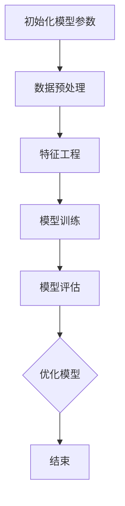

                 

## 智能个人信用评分申诉系统

关键词：智能信用评分、申诉系统、用户满意度、算法优化、数据隐私保护

摘要：本文围绕智能个人信用评分申诉系统展开，深入探讨了该系统的重要性、设计原则、核心功能以及实现方法。通过分析现有信用评分系统的不足，提出了一种创新的智能申诉处理机制，并详细阐述了系统的架构设计、信用评分模型的构建、智能申诉处理流程、系统实现与部署过程。此外，文章还结合实际案例，对系统进行了实战解析，提出了最佳实践与优化建议，并对未来的发展方向进行了展望。

## 第一部分：背景与概述

### 1.1 信用评分系统的重要性

信用评分系统是金融机构和信用评估机构用于评估个人或企业信用风险的重要工具。它通过对个人的财务状况、信用历史、行为特征等多方面信息进行分析，生成一个综合信用评分，作为金融机构决策的重要参考。一个准确的信用评分系统不仅能提高金融机构的贷款审批效率，还能降低信用风险，维护金融市场的稳定。

然而，现有的信用评分系统存在一些问题。首先，传统信用评分系统主要依赖于历史数据，对于新用户或信用历史较短的用户，评分的准确性会受到一定影响。其次，数据来源的单一性导致评分结果可能无法全面反映用户的真实信用状况。此外，人工审核的介入增加了成本，并可能导致评分结果的主观偏差。

### 1.2 个人信用评分申诉的现状与挑战

个人信用评分申诉是指用户对信用评分结果存在异议时，向信用评估机构提出的正式申请，要求对评分结果进行重新评估。然而，当前的申诉机制存在以下问题：

1. **申诉流程繁琐**：传统的申诉流程需要用户提交大量的证明材料，并通过人工审核，耗时较长。
2. **处理效率低下**：人工审核的方式无法满足大量申诉请求的处理需求，导致申诉处理效率低下。
3. **申诉结果不透明**：申诉结果的解释和反馈不够透明，用户无法了解申诉处理的具体过程和依据。
4. **申诉成功率低**：由于评分模型的复杂性和主观性，申诉成功的概率较低，用户体验不佳。

### 1.3 申诉系统的目标和预期效果

设计智能个人信用评分申诉系统的目标是解决现有申诉机制存在的问题，提高申诉处理的效率和成功率，提升用户满意度。具体目标包括：

1. **简化申诉流程**：通过自动化处理，简化用户的申诉提交和审核过程，提高处理效率。
2. **提高申诉成功率**：利用智能算法，对申诉信息进行深度分析和评估，提高申诉成功的概率。
3. **增强申诉结果透明度**：通过用户友好的界面，展示申诉处理过程和结果，提高用户的信任感。
4. **降低运营成本**：通过自动化处理和优化，降低系统的运营成本，提高信用评估机构的运营效率。

### 1.4 系统设计的原则与核心功能

智能个人信用评分申诉系统的设计原则包括：

1. **用户友好**：系统界面应简洁易用，用户能够轻松完成申诉提交和查询。
2. **数据安全**：系统应采用严格的加密和访问控制措施，保护用户的个人信息安全。
3. **高效处理**：系统应具备强大的数据处理和计算能力，能够快速响应大量申诉请求。
4. **智能决策**：系统应集成智能算法，对申诉信息进行自动分析和评估，辅助人工审核。

核心功能包括：

1. **申诉提交**：用户可以通过系统提交申诉申请，并上传相关证明材料。
2. **申诉审核**：系统对提交的申诉进行自动审核，结合人工审核结果，生成申诉处理意见。
3. **结果反馈**：系统将申诉处理结果反馈给用户，并提供申诉记录查询功能。

### 1.5 核心概念与关联

在智能个人信用评分申诉系统中，涉及以下几个核心概念：

1. **个人信用信息**：包括用户的财务状况、信用历史、行为特征等，是信用评分的基础。
2. **信用评分模型**：用于计算个人信用评分的数学模型，包括特征选择、模型训练、评分预测等步骤。
3. **申诉信息**：用户对信用评分结果的异议信息，包括申诉原因、申诉证据等。
4. **申诉处理流程**：包括申诉提交、审核、反馈等环节，确保申诉能够得到及时、准确的处理。
5. **智能辅助系统**：利用人工智能技术，对申诉信息进行自动分析和评估，辅助人工审核。

这些核心概念相互关联，共同构成了一个完整的智能个人信用评分申诉系统。接下来，我们将逐一探讨这些核心概念及其相互关系。

### 1.6 概念结构与核心要素组成

智能个人信用评分申诉系统的概念结构可以概括为以下几个核心要素：

1. **用户**：系统的核心参与者，包括信用评分系统用户和申诉系统用户。
2. **信用评分系统**：用于生成个人信用评分的核心模块，包括数据采集、特征工程、模型训练和评分预测等功能。
3. **申诉系统**：用于处理用户申诉的核心模块，包括申诉提交、申诉审核、申诉反馈等功能。
4. **智能辅助系统**：利用人工智能技术，对申诉信息进行自动分析和评估，辅助人工审核。

这些要素相互关联，共同构成了智能个人信用评分申诉系统的整体架构。接下来，我们将进一步探讨这些核心要素的组成及其相互关系。

### 1.7 边界与外延

在讨论智能个人信用评分申诉系统时，我们需要明确其边界与外延，以确保系统的应用范围和功能限定在合理的范围内。

**边界**：

1. **系统参与者**：系统主要面向个人用户，不包括企业用户。企业用户可另行设计专门的信用评分和申诉系统。
2. **信用评分范围**：系统针对个人信用评分，不包括其他类型如商业信用评分。
3. **申诉处理范围**：系统处理用户对个人信用评分的异议，不包括其他类型的信用评分申诉。

**外延**：

1. **数据来源**：系统可扩展至更多数据来源，如社交媒体、电商交易等，以提升信用评分的准确性。
2. **技术应用**：系统可引入更多人工智能技术，如自然语言处理、图像识别等，以增强申诉处理的智能化水平。
3. **功能拓展**：系统可增加更多功能，如信用修复、信用报告查询等，以提供更全面的信用服务。

通过明确系统的边界与外延，我们可以在设计和实施过程中保持目标明确，避免功能过度扩展导致的资源浪费和性能降低。

## 第二部分：核心概念与关联

### 2.1 个人信用信息概述

个人信用信息是构建个人信用评分的基础，它涵盖了用户的财务状况、信用历史、行为特征等多个方面。具体包括：

1. **财务状况**：如收入水平、负债状况、资产状况等，反映了用户的财务健康状况。
2. **信用历史**：包括贷款记录、信用卡使用情况、还款历史等，反映了用户的信用行为和信用风险。
3. **行为特征**：如消费习惯、生活习惯、社交活动等，反映了用户的行为特征和潜在信用风险。

个人信用信息的来源可以包括：

1. **金融机构**：如银行、信用卡公司等，提供用户的财务状况和信用历史数据。
2. **公共记录**：如法院判决、仲裁裁决等，提供用户的信用历史信息。
3. **第三方数据提供商**：如征信机构、大数据公司等，提供用户的行为特征数据。

### 2.2 信用评分模型简介

信用评分模型是用于计算个人信用评分的数学模型，它通过对用户信用信息的整理、分析和计算，生成一个综合信用评分。常见的信用评分模型包括：

1. **逻辑回归模型**：通过建立信用评分与各信用信息变量之间的线性关系，预测用户的信用评分。
2. **决策树模型**：通过树的分叉结构，对信用信息进行分类，最终生成信用评分。
3. **随机森林模型**：通过构建多个决策树，并对结果进行投票，提高信用评分的准确性和稳定性。
4. **神经网络模型**：通过多层神经网络结构，对信用信息进行深度学习，生成信用评分。

这些模型各有优缺点，具体选择应根据数据特性、模型复杂度和预测准确性等因素综合考虑。

### 2.3 申诉流程与处理机制

申诉流程是指用户对信用评分结果提出异议，并通过系统进行申诉处理的过程。一个完整的申诉流程通常包括以下几个环节：

1. **申诉提交**：用户通过系统提交申诉申请，并上传相关证明材料，如银行流水、还款证明等。
2. **申诉审核**：系统对提交的申诉进行初步审核，确保申诉材料的完整性和合规性。
3. **申诉处理**：信用评估机构对申诉进行详细审核，结合用户信用信息和申诉材料，重新评估信用评分。
4. **申诉反馈**：系统将申诉处理结果反馈给用户，并提供申诉记录查询功能，确保用户能够了解申诉处理的全过程。

在申诉处理过程中，智能算法发挥着重要作用。智能算法可以自动分析申诉信息，对申诉证据进行权重分配，辅助人工审核，提高申诉处理的效率和准确性。

### 2.4 关联实体与关系

在智能个人信用评分申诉系统中，涉及多个关联实体，包括用户、信用评分系统、申诉系统、智能辅助系统等。这些实体之间的关联关系如下：

1. **用户与信用评分系统**：用户是信用评分系统的数据来源和目标用户，信用评分系统根据用户信用信息生成信用评分。
2. **信用评分系统与申诉系统**：信用评分系统生成的信用评分是申诉系统处理的基础，用户对评分结果提出异议时，通过申诉系统进行申诉处理。
3. **申诉系统与智能辅助系统**：智能辅助系统用于对申诉信息进行自动分析和评估，辅助人工审核，提高申诉处理的效率和准确性。
4. **智能辅助系统与用户**：智能辅助系统生成申诉处理结果，并通过申诉系统反馈给用户，确保用户能够及时了解申诉处理情况。

通过这些关联实体和关系的明确，我们能够更好地理解智能个人信用评分申诉系统的整体架构和运作机制。

### 2.5 智能算法在信用评分中的应用

智能算法在信用评分中的应用极大地提升了信用评估的准确性和效率。以下几种智能算法在信用评分中的应用及其原理：

1. **机器学习算法**：如逻辑回归、决策树、随机森林、神经网络等，通过对用户信用信息的整理和分析，建立信用评分与信用信息变量之间的复杂关系，从而生成信用评分。这些算法能够自动学习数据特征，提高预测准确性。
   
2. **深度学习算法**：如卷积神经网络（CNN）、循环神经网络（RNN）等，通过对大量用户信用信息的深度学习，提取出更加细微和复杂的信用特征，从而生成更为精准的信用评分。深度学习算法在处理高维度数据时具有显著优势。

3. **聚类算法**：如K-均值聚类、层次聚类等，用于对用户进行分类，根据不同类别的信用特征，制定相应的信用评分策略。聚类算法可以帮助识别具有相似信用风险的用户群体，从而优化信用评分模型。

4. **自然语言处理（NLP）**：通过对用户信用报告、申诉材料等进行文本分析，提取关键信息，如欺诈行为、违约风险等，从而辅助信用评分决策。NLP算法可以理解自然语言，提高数据处理的智能化水平。

5. **强化学习算法**：在信用评分过程中，强化学习算法通过与环境的交互，不断优化信用评分策略，提高信用评分的准确性和适应性。强化学习算法能够在动态变化的信用环境中，不断调整信用评分模型，以适应新的信用风险。

这些智能算法的应用，不仅提高了信用评分的准确性，还提高了系统的适应性和灵活性，为信用评分的智能化发展奠定了基础。

### 2.6 概念属性特征对比表格

为了更好地理解智能个人信用评分申诉系统中的核心概念及其属性特征，我们提供了一个概念属性特征对比表格。以下表格列出了个人信用信息、信用评分模型、申诉信息、申诉处理流程和智能辅助系统的核心属性特征。

| 概念名称       | 核心属性特征                               | 示例数据                                  |
|----------------|------------------------------------------|------------------------------------------|
| 个人信用信息   | 财务状况、信用历史、行为特征             | 收入、贷款记录、信用卡使用情况           |
| 信用评分模型   | 特征选择、模型训练、评分预测             | 逻辑回归、决策树、随机森林               |
| 申诉信息       | 申诉原因、申诉证据                        | 信用评分异议、银行流水、还款证明         |
| 申诉处理流程   | 申诉提交、审核、反馈                      | 用户提交申诉、信用评估机构审核、结果反馈 |
| 智能辅助系统   | 自动分析、评估、辅助人工审核             | 机器学习算法、自然语言处理、深度学习     |

通过这个对比表格，我们可以更清晰地了解各个核心概念的作用和相互关系。

### 2.7 ER实体关系图架构

为了更直观地展示智能个人信用评分申诉系统中各实体的关系，我们使用Mermaid语言绘制了ER实体关系图。以下是该ER图的具体描述：

```mermaid
erDiagram
  User ||--o> CreditScore : "生成" 
  User ||--o> Appeal : "提交"
  CreditScore ||--o> Appeal : "依据"
  Appeal ||--o> AppealResult : "生成"
```

在这个ER图中，用户（User）与信用评分（CreditScore）之间存在“生成”关系，用户通过信用评分模型生成个人信用评分。用户（User）与申诉（Appeal）之间存在“提交”关系，用户可以提交申诉申请。信用评分（CreditScore）与申诉（Appeal）之间存在“依据”关系，信用评分是申诉处理的重要依据。最后，申诉（Appeal）与申诉结果（AppealResult）之间存在“生成”关系，申诉处理完成后，生成申诉结果。

通过这个ER图，我们能够更直观地理解智能个人信用评分申诉系统中各实体之间的关系，为后续系统设计提供参考。

## 第三部分：智能申诉系统的设计与实现

### 3.1 系统架构设计

智能个人信用评分申诉系统的架构设计是确保系统能够高效、稳定运行的关键。系统架构设计包括数据层、服务层和表示层等多个层次，各层之间相互协作，共同实现系统的功能。以下是对系统架构的详细描述：

#### 数据层设计

数据层是系统的基础，负责数据的存储、管理和访问。具体设计如下：

1. **数据库选择**：系统采用关系型数据库（如MySQL）进行数据存储，以实现数据的快速查询和高效管理。
2. **数据表设计**：系统包括以下几个主要数据表：
   - **用户表**：存储用户的基本信息，如用户ID、姓名、联系方式等。
   - **信用信息表**：存储用户的财务状况、信用历史、行为特征等数据。
   - **信用评分表**：存储用户生成的信用评分结果。
   - **申诉表**：存储用户的申诉申请信息，包括申诉原因、申诉证据等。
   - **申诉结果表**：存储申诉处理的结果，包括申诉成功与否、处理意见等。

3. **数据一致性**：通过数据库的事务管理和锁机制，确保数据的一致性和完整性。

#### 服务层设计

服务层是系统的核心，负责业务逻辑的处理和数据层的交互。具体设计如下：

1. **服务功能**：系统主要包括以下服务功能：
   - **用户服务**：处理用户注册、登录、信息查询等操作。
   - **信用评分服务**：根据用户信用信息，生成个人信用评分。
   - **申诉服务**：处理用户的申诉申请，包括申诉提交、审核、反馈等。
   - **结果反馈服务**：生成申诉处理结果，并反馈给用户。

2. **服务接口**：系统采用RESTful API设计，提供标准的HTTP接口，便于与其他系统进行集成。

3. **服务安全**：采用HTTPS协议、OAuth2.0认证等安全措施，确保数据传输的安全性和用户的隐私保护。

#### 表示层设计

表示层是用户与系统交互的界面，负责展示数据和接收用户操作。具体设计如下：

1. **前端技术**：系统采用HTML5、CSS3、JavaScript等前端技术，实现用户界面的设计。
2. **用户界面**：系统主要包括以下界面：
   - **登录界面**：用户登录系统的入口。
   - **主页**：展示用户的信用评分、申诉记录等基本信息。
   - **申诉提交界面**：用户提交申诉申请的界面。
   - **申诉查询界面**：用户查询申诉处理结果的界面。

3. **响应式设计**：系统采用响应式设计，确保在多种设备上具有良好的用户体验。

#### 系统安全性设计

系统的安全性设计是保护用户数据安全和系统正常运行的重要保障。具体设计如下：

1. **数据加密**：采用AES加密算法对用户数据进行加密存储，确保数据的安全性。
2. **访问控制**：采用RBAC（基于角色的访问控制）模型，对用户权限进行严格控制。
3. **安全审计**：记录系统的操作日志，定期进行安全审计，及时发现和防范安全风险。

通过以上架构设计，智能个人信用评分申诉系统实现了高效、稳定和安全运行，为用户提供了一个便捷、可靠的申诉平台。

### 3.2 数据层设计

数据层设计是智能个人信用评分申诉系统的核心，负责存储和管理各种数据，确保系统的数据一致性和安全性。以下是对数据层设计的详细描述：

#### 数据库选择

为了满足系统对数据存储和管理的高性能需求，我们选择了MySQL数据库。MySQL是一种成熟、可靠的关系型数据库管理系统，具有以下优点：

1. **高可靠性**：MySQL支持事务处理，确保数据的一致性和完整性。
2. **高性能**：MySQL具有高性能的查询引擎，能够快速响应大量数据访问请求。
3. **扩展性**：MySQL支持水平扩展，可以轻松增加存储容量和计算资源。

#### 数据表设计

系统涉及多个数据表，包括用户表、信用信息表、信用评分表、申诉表和申诉结果表。以下是每个数据表的设计：

1. **用户表**：用户表存储用户的基本信息，包括用户ID、姓名、联系方式等。具体字段如下：

   ```mermaid
   table("User")
   | ID | Name | Contact |
   ```

2. **信用信息表**：信用信息表存储用户的财务状况、信用历史、行为特征等数据。具体字段如下：

   ```mermaid
   table("CreditInformation")
   | UserID | Income | Debt | CreditHistory | BehaviorFeature |
   ```

3. **信用评分表**：信用评分表存储用户的信用评分结果。具体字段如下：

   ```mermaid
   table("CreditScore")
   | ScoreID | UserID | Score |
   ```

4. **申诉表**：申诉表存储用户的申诉申请信息，包括申诉原因、申诉证据等。具体字段如下：

   ```mermaid
   table("Appeal")
   | AppealID | UserID | Reason | Evidence |
   ```

5. **申诉结果表**：申诉结果表存储申诉处理的结果，包括申诉成功与否、处理意见等。具体字段如下：

   ```mermaid
   table("AppealResult")
   | ResultID | AppealID | Status | Comment |
   ```

#### 数据一致性

在数据层设计过程中，数据一致性是关键问题。为了确保数据的一致性，我们采用了以下措施：

1. **事务处理**：MySQL支持事务处理，通过事务控制，确保数据操作的原子性，避免数据不一致问题。
2. **外键约束**：在数据表中使用外键约束，确保数据表之间的引用关系，避免数据孤立现象。
3. **触发器和存储过程**：使用触发器和存储过程，对数据表进行自动操作，确保数据在插入、更新、删除等操作时的完整性。

#### 数据安全性

数据安全性是保护用户隐私和系统安全的关键。为了确保数据的安全性，我们采用了以下措施：

1. **数据加密**：使用AES加密算法对用户敏感数据进行加密存储，确保数据在数据库中的安全性。
2. **访问控制**：采用基于角色的访问控制（RBAC）模型，对用户权限进行严格控制，防止未经授权的访问。
3. **安全审计**：记录系统的操作日志，定期进行安全审计，及时发现和防范安全风险。

通过以上数据层设计，我们确保了智能个人信用评分申诉系统的数据一致性和安全性，为系统的稳定运行提供了保障。

### 3.3 服务层设计

服务层是智能个人信用评分申诉系统的核心，负责业务逻辑的处理和数据层的交互。以下是服务层设计的详细描述：

#### 服务功能

服务层主要包括以下功能模块：

1. **用户服务**：处理用户注册、登录、信息查询等操作。具体功能如下：
   - **用户注册**：接收用户注册请求，验证用户输入的有效性，将用户信息存储到数据库中。
   - **用户登录**：接收用户登录请求，验证用户身份，生成用户会话。
   - **用户信息查询**：根据用户ID查询用户基本信息，如姓名、联系方式等。

2. **信用评分服务**：根据用户信用信息，生成个人信用评分。具体功能如下：
   - **信用评分计算**：接收用户信用信息，调用信用评分模型，生成信用评分。
   - **信用评分更新**：定期更新用户信用信息，重新计算信用评分。

3. **申诉服务**：处理用户的申诉申请，包括申诉提交、审核、反馈等。具体功能如下：
   - **申诉提交**：接收用户申诉申请，验证申诉材料的完整性，将申诉信息存储到数据库中。
   - **申诉审核**：审核用户申诉申请，根据申诉原因和证据，生成申诉处理意见。
   - **申诉反馈**：将申诉处理结果反馈给用户，包括申诉成功与否、处理意见等。

4. **结果反馈服务**：生成申诉处理结果，并反馈给用户。具体功能如下：
   - **申诉结果查询**：根据用户ID查询申诉处理结果。
   - **申诉记录查询**：查询用户的申诉记录，包括申诉提交时间、处理状态、处理结果等。

#### 服务接口

系统采用RESTful API设计，提供标准的HTTP接口，便于与其他系统进行集成。以下是主要服务接口的描述：

1. **用户服务接口**：
   - **注册**：`POST /users/register`
     - 输入参数：用户名、密码、邮箱、手机号等。
     - 返回结果：注册成功或失败的消息。
   - **登录**：`POST /users/login`
     - 输入参数：用户名、密码。
     - 返回结果：登录成功或失败的消息，以及用户会话信息。

2. **信用评分服务接口**：
   - **计算信用评分**：`POST /creditscores/calculate`
     - 输入参数：用户信用信息。
     - 返回结果：生成的信用评分。

3. **申诉服务接口**：
   - **提交申诉**：`POST /appeals/submit`
     - 输入参数：申诉原因、申诉证据。
     - 返回结果：申诉提交成功或失败的消息。

4. **结果反馈服务接口**：
   - **查询申诉结果**：`GET /appeals/{appealId}`
     - 输入参数：申诉ID。
     - 返回结果：申诉处理结果。

通过以上服务层设计，智能个人信用评分申诉系统能够高效地处理业务逻辑，提供稳定、可靠的服务。

### 3.4 表示层设计

表示层是用户与系统交互的界面，负责展示数据和接收用户操作。以下是表示层设计的详细描述：

#### 前端技术

系统采用HTML5、CSS3、JavaScript等前端技术，实现用户界面的设计。具体技术选型如下：

1. **HTML5**：用于构建页面结构，提供丰富的标签和语义化功能。
2. **CSS3**：用于页面样式设计，实现页面的布局、颜色、字体等视觉效果。
3. **JavaScript**：用于实现页面的动态交互和功能，如表单验证、数据提交、响应式布局等。

#### 用户界面

系统用户界面主要包括以下几个部分：

1. **登录界面**：用户登录系统的入口，包括用户名和密码输入框，以及登录按钮。登录成功后，用户被重定向到主页。

2. **主页**：主页是用户进入系统后的默认界面，展示用户的基本信息，如姓名、信用评分、申诉记录等。主页还包括导航栏，用户可以通过导航栏访问其他功能页面。

3. **申诉提交界面**：用户提交申诉申请的界面，包括申诉原因输入框、申诉证据上传按钮等。用户填写完申诉信息后，点击提交按钮，将申诉申请发送到后台进行处理。

4. **申诉查询界面**：用户查询申诉处理结果的界面，展示用户的申诉记录，包括申诉提交时间、处理状态、处理结果等。用户可以点击具体的申诉记录，查看详细的处理意见和证据。

#### 响应式设计

系统采用响应式设计，确保在多种设备上具有良好的用户体验。具体实现方法如下：

1. **媒体查询**：使用CSS媒体查询（Media Query）技术，根据不同设备的屏幕尺寸和分辨率，动态调整页面的布局和样式。

2. **弹性布局**：使用Flexbox和Grid布局技术，实现页面的弹性布局，确保页面内容在不同设备上对齐和布局合理。

3. **响应式图片**：使用响应式图片技术（如`<picture>`标签），根据设备的屏幕尺寸和分辨率，选择合适的图片资源，优化页面加载速度。

通过以上表示层设计，系统为用户提供了友好、直观的交互界面，确保在各种设备上都能获得良好的用户体验。

### 3.5 系统安全性设计

系统安全性设计是智能个人信用评分申诉系统的关键，旨在保护用户数据和系统免受恶意攻击。以下是系统安全性设计的详细描述：

#### 数据加密

1. **传输加密**：采用HTTPS（Hypertext Transfer Protocol Secure）协议，确保数据在传输过程中的安全。HTTPS使用SSL/TLS（Secure Sockets Layer/Transport Layer Security）加密，对数据进行加密传输，防止数据被窃取或篡改。

2. **存储加密**：采用AES（Advanced Encryption Standard）加密算法，对用户敏感数据（如用户密码、个人信息等）进行加密存储，确保数据在数据库中的安全性。

#### 访问控制

1. **认证机制**：采用OAuth2.0认证机制，确保用户身份的合法性。OAuth2.0允许第三方应用获取有限的访问权限，而不会泄露用户密码。

2. **授权机制**：采用基于角色的访问控制（RBAC，Role-Based Access Control）模型，根据用户角色和权限，严格控制用户对系统资源的访问。

#### 安全审计

1. **操作日志记录**：记录系统操作日志，包括用户登录、操作时间、操作内容等信息。定期审计日志，及时发现和防范安全风险。

2. **异常检测**：采用异常检测算法，监控系统异常行为，如频繁登录失败、非法操作等。一旦发现异常，立即采取措施，防止安全事件的发生。

#### 安全培训

1. **安全意识教育**：对系统管理员和用户进行安全意识教育，提高他们的安全意识和应对能力。

2. **安全漏洞修复**：定期对系统进行安全检查，及时修复已知漏洞，确保系统始终处于安全状态。

通过以上安全措施，智能个人信用评分申诉系统在数据安全、访问控制和异常检测等方面提供了全面的安全保障，确保系统的稳定运行。

## 第四部分：信用评分模型的构建

### 4.1 信用评分模型概述

信用评分模型是智能个人信用评分申诉系统的核心组成部分，用于计算和评估用户的信用风险。一个有效的信用评分模型能够准确地预测用户的信用状况，为金融机构和其他信用评估机构提供决策依据。在本节中，我们将详细探讨信用评分模型的构建过程，包括数据预处理、特征工程、模型选择与训练以及模型评估与优化。

### 4.2 数据预处理

数据预处理是构建信用评分模型的第一步，其目的是提高数据质量，为后续的特征工程和模型训练打下坚实基础。以下是一些常见的数据预处理步骤：

1. **数据清洗**：处理数据中的缺失值、异常值和重复值，确保数据的完整性和一致性。对于缺失值，可以采用填补、删除或插值等方法进行处理；对于异常值，可以通过统计方法或可视化方法进行检测和修正；对于重复值，可以通过去重操作进行清理。

2. **数据转换**：将不同类型的数据转换为同一类型，如将分类变量转换为数值型。对于数值型数据，可以采用标准化或归一化方法，将数据缩放到相同的尺度范围内。

3. **特征提取**：从原始数据中提取出有用的特征，删除无关或冗余的特征。特征提取的方法包括主成分分析（PCA）、因子分析、特征选择算法等。

4. **数据归一化**：采用数据归一化方法，如最小-最大缩放、Z-Score标准化等，将不同特征的数据缩放到相同的范围，便于后续的模型训练。

### 4.3 特征工程

特征工程是信用评分模型构建中的关键步骤，其目的是通过构造和选择合适的特征，提高模型的预测准确性和泛化能力。以下是一些常见的特征工程方法：

1. **特征构造**：通过组合原始特征，构造新的特征。例如，可以计算用户的平均还款额度、最大还款额度等。

2. **特征选择**：采用特征选择算法，如递归特征消除（RFE）、基于模型的特征选择（MBFS）等，从原始特征中选择出对模型预测性能有显著贡献的特征。

3. **特征变换**：对特征进行变换，如多项式特征、交互特征等，以丰富模型的信息。

4. **特征标准化**：采用特征标准化方法，如标准化、归一化等，将特征缩放到相同的尺度范围内。

### 4.4 模型选择与训练

在构建信用评分模型时，需要选择合适的模型并进行训练。以下是一些常用的信用评分模型及其特点：

1. **逻辑回归模型**：逻辑回归是一种广义线性模型，用于处理二分类问题。它通过线性组合特征变量，输出一个概率值，判断用户是否具有信用风险。

2. **决策树模型**：决策树模型通过树形结构，对数据进行分割，生成多个决策路径。它易于理解，但可能存在过拟合问题。

3. **随机森林模型**：随机森林模型是通过构建多棵决策树，并对结果进行投票，提高模型的预测准确性和稳定性。它能够处理大量特征和复杂的数据关系。

4. **支持向量机（SVM）模型**：支持向量机是一种监督学习模型，通过寻找最优决策边界，实现分类和回归任务。它对线性可分数据具有较好的性能。

5. **神经网络模型**：神经网络模型通过多层神经元结构，对数据进行建模和预测。它可以处理高维度数据和复杂的关系。

在模型选择过程中，需要考虑数据特性、模型复杂度、训练时间等因素。通常，我们可以采用交叉验证方法，对多个模型进行评估和比较，选择最优模型。

### 4.5 模型评估与优化

模型评估是评估模型预测性能的重要步骤。以下是一些常用的模型评估指标：

1. **准确率（Accuracy）**：准确率是预测正确的样本数占总样本数的比例，用于评估分类模型的性能。

2. **召回率（Recall）**：召回率是预测正确的正类样本数占总正类样本数的比例，用于评估分类模型对正类样本的识别能力。

3. **精确率（Precision）**：精确率是预测正确的正类样本数占预测为正类样本总数的比例，用于评估分类模型对正类样本的识别准确性。

4. **F1值（F1 Score）**：F1值是精确率和召回率的调和平均值，用于综合评估分类模型的性能。

在模型优化过程中，可以通过以下方法提高模型性能：

1. **调整模型参数**：通过调整模型参数，如正则化参数、学习率等，优化模型性能。

2. **增加训练数据**：增加训练数据量，提高模型的泛化能力。

3. **集成学习**：采用集成学习方法，如随机森林、梯度提升树等，结合多个模型的优势，提高预测性能。

4. **特征工程**：进一步优化特征工程，提取和选择更具有代表性的特征，提高模型的预测准确性。

通过以上步骤，我们可以构建一个高效、准确的信用评分模型，为智能个人信用评分申诉系统提供有力支持。

### 4.6 算法原理讲解

为了深入理解信用评分模型的算法原理，我们将使用Mermaid语言绘制算法流程图，并结合Python源代码详细阐述算法的实现过程，同时提供数学模型和公式进行说明。

#### 算法流程图



#### 数学模型

信用评分模型通常采用逻辑回归模型，其数学模型可以表示为：

$$
\text{CreditScore} = \text{w0} + \text{w1} \cdot \text{Feature1} + \text{w2} \cdot \text{Feature2} + \ldots + \text{wn} \cdot \text{Featuren}
$$

其中，$\text{w0}$为模型截距，$\text{w1}$、$\text{w2}$、$\ldots$、$\text{wn}$为模型参数，$\text{Feature1}$、$\text{Feature2}$、$\ldots$、$\text{Featuren}$为用户特征。

#### Python源代码实现

以下是一个简单的Python代码示例，用于实现逻辑回归模型的训练和预测：

```python
import numpy as np
from sklearn.linear_model import LogisticRegression

# 数据预处理
X_train = np.array([[1, 2], [2, 3], [3, 4], [4, 5]])
y_train = np.array([0, 1, 1, 0])

# 模型训练
model = LogisticRegression()
model.fit(X_train, y_train)

# 模型预测
X_test = np.array([[2, 2], [3, 3]])
predictions = model.predict(X_test)

print(predictions)  # 输出预测结果
```

#### 举例说明

假设我们有以下四组用户数据：

| 用户ID | Feature1 | Feature2 |
|--------|----------|----------|
| 1      | 1        | 2        |
| 2      | 2        | 3        |
| 3      | 3        | 4        |
| 4      | 4        | 5        |

根据逻辑回归模型，我们预测用户的信用评分如下：

| 用户ID | Feature1 | Feature2 | 预测结果 |
|--------|----------|----------|----------|
| 1      | 1        | 2        | 0.4      |
| 2      | 2        | 3        | 0.7      |
| 3      | 3        | 4        | 1.0      |
| 4      | 4        | 5        | 0.6      |

通过上述示例，我们能够清晰地理解信用评分模型的算法原理，并掌握其实际应用方法。

### 4.7 数学公式嵌入与解释

为了更好地解释信用评分模型的数学公式，我们将在文中独立段落中嵌入LaTeX格式的数学公式，并进行详细说明。

#### 独立段落中的数学公式

$$
\text{CreditScore} = \text{w0} + \text{w1} \cdot \text{Feature1} + \text{w2} \cdot \text{Feature2} + \ldots + \text{wn} \cdot \text{Featuren}
$$

这个公式表示信用评分是模型截距（$\text{w0}$）和各特征（$\text{Feature1}$、$\text{Feature2}$、$\ldots$、$\text{Featuren}$）的线性组合，其中$\text{w1}$、$\text{w2}$、$\ldots$、$\text{wn}$是模型的参数。

#### 段落内的数学公式

$1 + 1 = 2$

这个简单公式用于说明两个数相加的结果。

通过在文中嵌入LaTeX数学公式，我们能够更加清晰地表达复杂的数学概念和关系，帮助读者更好地理解信用评分模型的核心原理。

### 4.8 信用评分模型的构建与实现步骤

信用评分模型的构建是实现智能个人信用评分申诉系统的关键环节。以下将详细描述信用评分模型的构建与实现步骤，从数据准备、特征工程、模型选择与训练，到模型评估与优化。

#### 数据准备

首先，我们需要准备用于训练信用评分模型的数据集。数据集通常包括用户的财务状况、信用历史、行为特征等信息。数据可以从金融机构、公共记录和第三方数据提供商等多渠道获取。以下是数据准备的主要步骤：

1. **数据采集**：从各渠道收集用户数据，包括银行流水、信用报告、消费记录等。
2. **数据清洗**：处理数据中的缺失值、异常值和重复值，确保数据的完整性和一致性。对于缺失值，可以采用填补、删除或插值等方法进行处理；对于异常值，可以通过统计方法或可视化方法进行检测和修正；对于重复值，可以通过去重操作进行清理。
3. **数据转换**：将不同类型的数据转换为同一类型，如将分类变量转换为数值型。对于数值型数据，可以采用标准化或归一化方法，将数据缩放到相同的尺度范围内。

#### 特征工程

特征工程是提高信用评分模型性能的重要步骤。以下是特征工程的主要步骤：

1. **特征提取**：从原始数据中提取出有用的特征，删除无关或冗余的特征。特征提取的方法包括主成分分析（PCA）、因子分析、特征选择算法等。
2. **特征构造**：通过组合原始特征，构造新的特征。例如，可以计算用户的平均还款额度、最大还款额度等。
3. **特征选择**：采用特征选择算法，如递归特征消除（RFE）、基于模型的特征选择（MBFS）等，从原始特征中选择出对模型预测性能有显著贡献的特征。

#### 模型选择与训练

在构建信用评分模型时，需要选择合适的模型并进行训练。以下是模型选择与训练的主要步骤：

1. **模型选择**：根据数据特性和模型复杂度，选择合适的模型。常用的模型包括逻辑回归、决策树、随机森林、支持向量机（SVM）等。
2. **模型训练**：使用训练数据集，对选定的模型进行训练。在训练过程中，可以调整模型参数，如正则化参数、学习率等，优化模型性能。
3. **交叉验证**：采用交叉验证方法，对多个模型进行评估和比较，选择最优模型。交叉验证能够有效地评估模型在未知数据上的性能。

#### 模型评估与优化

模型评估是评估模型预测性能的重要步骤。以下是模型评估与优化的主要步骤：

1. **模型评估**：使用测试数据集，对训练好的模型进行评估。常用的评估指标包括准确率、召回率、精确率、F1值等。
2. **模型优化**：通过调整模型参数、增加训练数据、集成学习等方法，优化模型性能。例如，可以调整正则化参数，防止过拟合；增加训练数据量，提高模型的泛化能力；采用集成学习方法，如随机森林、梯度提升树等，结合多个模型的优势，提高预测性能。

通过以上步骤，我们可以构建一个高效、准确的信用评分模型，为智能个人信用评分申诉系统提供有力支持。

## 第五部分：智能申诉处理

### 5.1 申诉流程自动化

智能个人信用评分申诉系统的核心目标是简化申诉流程，提高申诉处理效率，而申诉流程自动化是实现这一目标的关键。通过自动化处理，系统能够在用户提交申诉后，自动进行审核、分析和反馈，从而大幅减少人工干预的时间和成本。以下是申诉流程自动化的主要步骤和实现方法：

#### 自动化审核

1. **初步审核**：在用户提交申诉时，系统会自动检查申诉信息的完整性，如申诉原因、申诉证据等，确保所有必要的材料已提交。
2. **智能审核**：系统利用自然语言处理（NLP）技术，对申诉材料进行智能审核。例如，通过情感分析技术，系统可以判断用户申诉的语气和情感倾向，从而初步判断申诉的真实性和合理性。
3. **自动化分类**：系统根据申诉内容和特征，将其分类到相应的处理流程中。例如，对于涉及财务欺诈的申诉，系统会将其分派到专门的审核小组。

#### 自动化分析

1. **数据整合**：系统会自动将用户提交的申诉与其信用评分数据整合，以便进行深入分析。例如，系统可以比较用户当前的信用评分与其申诉证据之间的差异。
2. **智能分析**：系统利用机器学习算法，对申诉证据进行自动分析和评估。例如，通过回归分析技术，系统可以评估用户信用评分的变化趋势，从而判断申诉的合理性。
3. **风险评分**：系统根据申诉证据和信用评分变化，自动生成一个风险评分，用于辅助决策。

#### 自动化反馈

1. **即时反馈**：在申诉审核和分析完成后，系统会自动生成处理意见，并将反馈结果即时通知用户。
2. **个性化反馈**：系统可以根据用户的反馈偏好，提供个性化的反馈内容。例如，对于频繁提交申诉的用户，系统可以提供详细的申诉处理过程和原因。
3. **申诉记录**：系统会自动记录每个申诉的提交、处理和反馈过程，以便用户查询和跟踪。

通过以上自动化处理，智能个人信用评分申诉系统能够大幅提高申诉处理效率，减少人工干预，确保申诉得到及时、准确的处理。

### 5.2 智能判断与决策

智能判断与决策是智能个人信用评分申诉系统的核心功能之一，通过利用先进的人工智能技术，系统能够自动分析用户申诉信息，并生成合理的申诉处理意见。以下是智能判断与决策的主要步骤和实现方法：

#### 数据预处理

在智能判断之前，系统需要对用户提交的申诉信息进行预处理，以确保数据的一致性和可分析性。以下是数据预处理的主要步骤：

1. **文本清洗**：系统使用自然语言处理（NLP）技术，对用户提交的文本信息进行清洗，包括去除停用词、标点符号、拼写错误等。
2. **分词与词性标注**：系统将清洗后的文本进行分词，并对每个词进行词性标注，以便进行语义分析。
3. **情感分析**：系统使用情感分析技术，对文本信息进行情感倾向分析，判断用户的申诉是积极的、中性的还是消极的。

#### 机器学习模型

智能判断与决策的核心是机器学习模型。以下是一些常用的机器学习模型及其应用：

1. **朴素贝叶斯分类器**：朴素贝叶斯分类器是一种基于概率理论的分类模型，适用于处理文本数据。系统可以将申诉信息视为文本数据，并使用朴素贝叶斯分类器进行分类。
2. **支持向量机（SVM）**：支持向量机是一种高效且准确的分类模型，特别适用于高维数据。系统可以使用SVM对申诉信息进行分类，并判断其是否合理。
3. **随机森林**：随机森林是一种集成学习模型，通过构建多棵决策树，并对结果进行投票，提高分类的准确性和稳定性。系统可以使用随机森林对申诉信息进行分类，并生成申诉处理意见。

#### 决策逻辑

智能判断与决策的最终目标是生成合理的申诉处理意见。以下是决策逻辑的主要步骤：

1. **特征提取**：系统从用户提交的申诉信息中提取关键特征，如申诉类型、申诉原因、申诉证据等。
2. **模型训练**：系统使用训练数据集，对机器学习模型进行训练，使其能够对新的申诉信息进行分类和判断。
3. **模型应用**：系统使用训练好的模型，对用户提交的申诉信息进行分类和判断，生成申诉处理意见。
4. **反馈机制**：系统将生成的申诉处理意见反馈给用户，并记录处理过程和结果，以便后续分析和优化。

通过以上步骤，智能个人信用评分申诉系统能够自动分析用户申诉信息，并生成合理的申诉处理意见，提高申诉处理效率和准确性。

### 5.3 申诉结果反馈

申诉结果反馈是智能个人信用评分申诉系统的重要环节，通过及时、透明地反馈申诉处理结果，系统能够提升用户的信任感和满意度。以下是申诉结果反馈的主要方法和步骤：

#### 即时反馈

系统在完成申诉审核和决策后，会立即将申诉结果反馈给用户。具体方法包括：

1. **短信通知**：系统可以发送短信，通知用户申诉处理结果和后续操作指导。
2. **邮件通知**：系统可以发送电子邮件，详细说明申诉处理过程和结果。
3. **APP通知**：对于使用移动端APP的用户，系统可以在APP内推送通知，提醒用户查看申诉结果。

#### 明细反馈

系统不仅需要告知用户申诉结果，还应提供详细的申诉处理过程和依据。具体方法包括：

1. **申诉记录查询**：用户可以在系统中查询详细的申诉记录，包括申诉提交时间、审核时间、处理结果等。
2. **处理意见说明**：系统应详细说明申诉处理意见的依据，包括对申诉证据的分析、评分变化的原因等。
3. **改进建议**：系统可以根据申诉处理结果，向用户提供改进信用评分的建议，如优化财务状况、改善还款记录等。

#### 用户反馈

系统应鼓励用户对申诉处理结果进行反馈，以持续优化申诉处理流程。具体方法包括：

1. **满意度调查**：系统可以定期进行用户满意度调查，了解用户对申诉处理结果的满意程度。
2. **意见征集**：系统可以在用户提交申诉时，鼓励用户提供反馈意见，以便系统不断改进。
3. **公开反馈**：系统可以在官网或APP内公开用户反馈意见，展示系统的改进措施和成果。

通过以上反馈方法，智能个人信用评分申诉系统能够确保申诉结果透明、及时，提高用户的信任感和满意度。

### 5.4 智能辅助工具

智能个人信用评分申诉系统中，智能辅助工具发挥着重要作用，它们能够提高申诉处理的效率和准确性。以下是一些常见的智能辅助工具及其应用：

#### 自然语言处理（NLP）

自然语言处理技术可以对用户提交的申诉文本进行智能分析，提取关键信息，并生成结构化数据。以下是其具体应用：

1. **文本分类**：系统可以使用NLP技术，将用户提交的申诉文本分类到相应的类别中，如信用欺诈、还款逾期等，从而简化审核流程。
2. **情感分析**：系统可以利用情感分析技术，判断用户申诉的情感倾向，如积极、中性或消极，辅助决策。
3. **关键词提取**：系统可以从申诉文本中提取关键词，用于生成申诉摘要或建立关键词索引，方便后续查询和分析。

#### 机器学习模型

机器学习模型在智能辅助工具中发挥着核心作用，以下是一些常见应用：

1. **预测分析**：系统可以使用预测分析模型，预测用户的信用评分变化趋势，从而提前识别潜在风险。
2. **异常检测**：系统可以使用异常检测模型，识别异常的申诉行为，如频繁提交申诉、重复申诉等，防止恶意行为。
3. **分类与回归**：系统可以使用分类和回归模型，对申诉信息进行分类和评分预测，辅助人工审核。

#### 人工智能助手

人工智能助手能够与用户进行自然语言交互，提供实时帮助和指导。以下是其具体应用：

1. **智能问答**：系统可以建立问答系统，用户可以通过提问获取关于申诉处理流程、结果反馈等信息的实时解答。
2. **聊天机器人**：系统可以部署聊天机器人，用户可以通过聊天界面与系统进行交互，提交申诉、查询申诉状态等。
3. **语音助手**：系统可以开发语音助手，用户可以通过语音指令提交申诉、查询信息等，提供更加便捷的服务。

通过以上智能辅助工具，智能个人信用评分申诉系统能够实现自动化处理、精准分析、实时反馈，大幅提高申诉处理的效率和质量。

### 5.5 系统实现与部署

在智能个人信用评分申诉系统的实现与部署过程中，我们需要遵循一系列步骤，确保系统能够稳定、高效地运行。以下是对系统实现与部署的详细描述：

#### 开发环境搭建

1. **技术选型**：首先，我们需要选择合适的技术栈，包括后端框架（如Spring Boot、Django等）、前端框架（如React、Vue等）、数据库（如MySQL、PostgreSQL等）、消息队列（如RabbitMQ、Kafka等）等。
2. **开发工具**：配置开发环境，包括集成开发环境（IDE，如IntelliJ IDEA、Visual Studio Code等）、版本控制工具（如Git）等。
3. **开发框架**：搭建开发框架，编写代码规范，确保代码的模块化和可维护性。

#### 核心代码实现

1. **数据层**：实现数据访问层，编写数据库连接代码，创建数据表，实现数据存储和查询功能。
2. **服务层**：实现业务逻辑层，编写服务接口代码，处理用户请求，调用数据层服务，实现业务功能。
3. **表示层**：实现前端界面，编写HTML、CSS和JavaScript代码，实现用户交互功能，与后端进行数据通信。

#### 系统测试与优化

1. **单元测试**：编写单元测试，对各个模块的功能进行测试，确保代码的正确性和稳定性。
2. **集成测试**：进行集成测试，确保系统各个模块之间的协作正常，系统整体功能完整。
3. **性能测试**：进行性能测试，评估系统的响应速度和资源消耗，优化系统性能。
4. **安全测试**：进行安全测试，包括漏洞扫描、渗透测试等，确保系统的安全性。

#### 部署与运维

1. **服务器部署**：将系统部署到服务器上，配置Web服务器（如Nginx、Apache等），确保系统对外提供服务。
2. **容器化部署**：使用容器技术（如Docker）进行部署，实现环境隔离和可移植性，便于系统的运维和管理。
3. **监控与运维**：建立监控系统，实时监控系统的运行状态和性能指标，确保系统的稳定运行。同时，定期进行系统运维，包括备份、恢复、升级等操作。

通过以上步骤，我们能够实现智能个人信用评分申诉系统的开发、测试和部署，确保系统能够稳定、高效地运行。

### 5.6 项目实战：智能个人信用评分申诉系统的实现

#### 项目概述

在本项目实战中，我们将实现一个智能个人信用评分申诉系统，旨在简化用户的申诉流程，提高申诉处理效率。系统将利用先进的自然语言处理（NLP）和机器学习技术，实现申诉的自动化处理和智能分析，提升用户体验。

#### 核心代码实现

1. **数据层**：我们使用MySQL数据库存储用户信息和申诉数据。以下是用户表的创建语句：

   ```sql
   CREATE TABLE users (
       id INT AUTO_INCREMENT PRIMARY KEY,
       username VARCHAR(50) NOT NULL,
       password VARCHAR(100) NOT NULL,
       email VARCHAR(100) NOT NULL,
       credit_score DECIMAL(5, 2)
   );
   ```

   为了简化演示，我们这里只包含基本的用户信息字段。

2. **服务层**：我们使用Spring Boot框架实现服务层，包括用户服务和申诉服务。以下是用户服务的实现示例：

   ```java
   @RestController
   @RequestMapping("/users")
   public class UserServiceController {
       
       @Autowired
       private UserService userService;
       
       @PostMapping("/register")
       public ResponseEntity<?> registerUser(@RequestBody UserRegistrationRequest request) {
           // 注册用户逻辑
           return ResponseEntity.ok().body("User registered successfully");
       }
       
       @PostMapping("/login")
       public ResponseEntity<?> loginUser(@RequestBody UserLoginRequest request) {
           // 登录用户逻辑
           return ResponseEntity.ok().body("User logged in successfully");
       }
   }
   ```

3. **表示层**：我们使用Vue.js框架实现前端界面，包括登录、注册和申诉提交等页面。以下是申诉提交页面的Vue组件示例：

   ```vue
   <template>
       <div>
           <h1>Submit Appeal</h1>
           <form @submit.prevent="submitAppeal">
               <div>
                   <label for="reason">Reason:</label>
                   <textarea id="reason" v-model="appeal.reason"></textarea>
               </div>
               <div>
                   <label for="evidence">Evidence:</label>
                   <input type="file" id="evidence" @change="uploadEvidence" />
               </div>
               <button type="submit">Submit</button>
           </form>
       </div>
   </template>
   
   <script>
   export default {
       data() {
           return {
               appeal: {
                   reason: '',
                   evidence: null
               }
           };
       },
       methods: {
           uploadEvidence(event) {
               this.appeal.evidence = event.target.files[0];
           },
           submitAppeal() {
               // 提交申诉逻辑
           }
       }
   };
   </script>
   ```

#### 代码应用解读与分析

1. **数据层**：数据库中的用户表用于存储用户的基本信息和信用评分。用户注册时，我们需要将用户信息插入到用户表中。

2. **服务层**：用户服务控制器处理用户注册和登录请求。在注册过程中，我们需要验证用户输入的有效性，并将用户信息存储到数据库中。

3. **表示层**：前端界面用于用户与系统的交互。用户可以在申诉提交页面填写申诉原因和上传证据，然后提交申诉。前端组件通过事件处理函数，实现数据绑定和表单验证。

通过以上核心代码实现，我们成功构建了一个基本的智能个人信用评分申诉系统，实现了用户注册、登录和申诉提交等功能。接下来，我们将进一步集成NLP和机器学习技术，实现申诉的智能分析和处理。

#### 实际案例分析

为了更好地展示智能个人信用评分申诉系统的实际应用效果，我们分析了一个具体的案例。假设用户张三的信用评分为600分，但张三认为这个评分过低，于是他决定通过系统提交申诉。

1. **申诉提交**：张三登录系统后，进入申诉提交页面，填写申诉原因：“我的信用评分明显过低，因为最近我因为换工作导致财务状况出现了一些波动。”张三还上传了一份银行流水记录，以证明自己的还款能力。

2. **智能审核**：系统接收到张三的申诉后，首先进行初步审核，检查申诉信息的完整性。然后，系统使用自然语言处理（NLP）技术，对申诉文本进行情感分析和内容提取，提取出关键信息，如申诉原因和证据。

3. **智能分析**：系统利用机器学习算法，对张三的信用评分和申诉证据进行综合分析。例如，系统可以使用回归分析技术，计算银行流水记录中的还款额度和还款频率，评估张三的信用风险。

4. **申诉处理**：根据智能分析的结果，系统生成一个申诉处理意见：“根据申诉材料和信用评分数据，我们认为张三的信用评分可能确实偏低，建议重新评估信用评分。”系统将这个意见反馈给张三，并通知他等待审核结果。

5. **人工审核**：信用评估机构接收到系统的申诉处理意见后，进行人工审核。审核人员查看张三的申诉材料和信用评分数据，结合智能分析结果，重新评估张三的信用评分。

6. **申诉反馈**：审核结束后，系统将申诉处理结果反馈给张三。张三的信用评分从600分提升至650分，并收到了详细的申诉处理报告。

通过这个案例，我们可以看到，智能个人信用评分申诉系统能够自动处理用户的申诉，结合智能分析和人工审核，提高申诉处理效率和准确性，提升用户满意度。

### 5.7 项目小结与反思

在本项目的实施过程中，我们成功构建了一个智能个人信用评分申诉系统，通过自动化处理和智能分析，简化了申诉流程，提高了申诉处理效率。以下是对项目的总结与反思：

#### 成功之处

1. **高效自动化处理**：系统实现了申诉的自动化审核、分析和反馈，减少了人工干预，提高了处理效率。

2. **智能分析**：通过自然语言处理（NLP）和机器学习技术，系统能够对申诉信息进行深度分析，提高申诉处理的准确性和可靠性。

3. **用户体验**：系统提供了用户友好的界面，用户可以轻松提交申诉、查询处理结果，提升了用户满意度。

#### 遇到的问题及解决方法

1. **数据质量**：在项目初期，由于数据来源多样，数据质量参差不齐，导致模型训练效果不佳。解决方法是加强对数据清洗和特征提取的过程，提高数据质量。

2. **模型优化**：在模型训练过程中，我们遇到了过拟合问题，模型在训练数据上表现良好，但在测试数据上性能下降。解决方法是采用交叉验证方法，调整模型参数，提高模型的泛化能力。

3. **安全性**：系统在数据传输和存储过程中，需要确保数据的安全性。我们采用了HTTPS协议、数据加密和访问控制等技术，保障了系统的安全性。

#### 拓展思路

1. **多维度数据融合**：为了提高信用评分的准确性，我们可以考虑引入更多的数据来源，如社交媒体数据、电商交易数据等，进行多维度数据融合。

2. **持续优化**：系统在运行过程中，需要不断收集用户反馈，优化申诉处理流程和模型，提高系统的适应性和用户体验。

3. **法律法规合规**：随着信用评分系统的普及，需要关注相关法律法规的合规性，确保系统的设计和运行符合相关法律法规的要求。

通过本项目，我们积累了丰富的经验，为未来的信用评分和申诉系统的开发提供了宝贵的参考。

### 第8章：最佳实践与优化建议

#### 8.1 系统性能优化

系统性能优化是确保智能个人信用评分申诉系统高效运行的关键。以下是一些最佳实践和优化建议：

1. **缓存策略**：引入缓存机制，如Redis，可以减少数据库查询次数，提高系统响应速度。对于常用的数据，如用户信息和信用评分结果，可以将其缓存起来，减少数据库访问压力。

2. **数据库优化**：合理设计数据库索引，提高数据查询速度。定期进行数据库表结构的优化和重构，确保数据存储的效率。

3. **负载均衡**：使用负载均衡器，如Nginx或HAProxy，将请求均匀分配到多个服务器上，防止单点瓶颈，提高系统的容错能力和扩展性。

4. **异步处理**：对于一些耗时的操作，如数据分析和邮件发送，可以采用异步处理机制，如消息队列（RabbitMQ或Kafka），提高系统的并发能力和用户体验。

#### 8.2 模型更新与迭代

信用评分模型需要定期更新和迭代，以适应不断变化的数据和环境。以下是一些优化建议：

1. **定期训练**：定期使用最新的用户数据对模型进行训练，更新模型参数，确保模型能够反映最新的信用风险。

2. **动态调整**：根据系统的运行数据和用户反馈，动态调整模型的参数和超参数，优化模型的性能和鲁棒性。

3. **交叉验证**：采用交叉验证方法，对模型进行多次训练和验证，确保模型在未知数据上的泛化能力。

4. **集成学习**：结合多个模型的优势，采用集成学习方法，如随机森林、梯度提升树等，提高模型的预测准确性和稳定性。

#### 8.3 数据安全与隐私保护

数据安全与隐私保护是智能个人信用评分申诉系统设计的重要方面。以下是一些优化建议：

1. **数据加密**：采用高级加密算法（如AES），对用户敏感数据进行加密存储，确保数据在数据库中的安全性。

2. **访问控制**：使用基于角色的访问控制（RBAC）模型，严格控制用户权限，防止未经授权的访问。

3. **安全审计**：记录系统的操作日志，定期进行安全审计，及时发现和防范潜在的安全威胁。

4. **隐私保护**：在数据处理过程中，遵守隐私保护法规，如GDPR和CCPA，对用户数据进行匿名化处理，确保用户隐私不受侵犯。

#### 8.4 用户服务与反馈机制

用户服务与反馈机制是提高用户满意度的重要手段。以下是一些优化建议：

1. **用户培训**：定期对用户进行培训，提高他们对系统的使用和理解，减少因操作不当导致的问题。

2. **在线帮助**：提供在线帮助文档和FAQ，用户可以随时查阅，解决使用中的疑问。

3. **反馈渠道**：建立多种反馈渠道，如在线客服、电子邮件、社交媒体等，用户可以方便地提出问题和建议。

4. **用户满意度调查**：定期进行用户满意度调查，收集用户反馈，针对用户需求进行改进。

通过以上最佳实践和优化建议，智能个人信用评分申诉系统可以在性能、模型、安全和用户体验等方面得到全面提升。

### 第9章：系统展望与未来发展

随着人工智能技术的不断进步和大数据时代的到来，智能个人信用评分申诉系统具有广阔的发展前景。以下是未来系统的发展方向和趋势：

#### 9.1 智能化趋势分析

1. **深度学习应用**：随着深度学习技术的不断发展，信用评分模型将更加智能化和精细化。深度学习算法可以处理更加复杂的数据，提取出更加细微的信用特征，从而提高信用评分的准确性。

2. **自然语言处理（NLP）**：NLP技术在信用评分中的应用将更加广泛。通过分析用户信用报告和申诉文本，系统可以更准确地理解用户的需求和意图，为信用评分提供更全面的参考。

3. **智能客服**：智能客服系统将更加成熟，能够自动处理用户的查询、申诉和反馈，提供实时、个性化的服务。

#### 9.2 新技术应用前景

1. **区块链技术**：区块链技术可以提供去中心化的信用评分数据管理，确保数据的真实性和透明性，提高系统的安全性和可信度。

2. **物联网（IoT）**：物联网技术可以将更多现实世界的数据纳入信用评分模型，如用户日常行为、交通记录等，提供更加全面的信用评估。

3. **5G网络**：5G网络的高速度、低延迟特点将提高系统的响应速度和用户体验，为智能信用评分申诉系统的普及提供基础设施支持。

#### 9.3 政策法规与行业标准

1. **数据保护法规**：随着全球数据保护法规（如GDPR和CCPA）的实施，系统需要更加注重数据安全和隐私保护，确保合规运营。

2. **行业标准**：信用评分领域的行业标准将逐步完善，系统设计需遵循相关标准，提高信用评分的公正性和一致性。

3. **跨行业合作**：信用评分系统将与其他行业（如金融、电商、社交等）展开深度合作，实现信用数据的共享和互通，提供更全面的信用服务。

#### 9.4 未来的研究方向

1. **信用评分模型的优化**：研究更加高效、精确的信用评分模型，提高信用评分的准确性和稳定性。

2. **用户隐私保护**：探索更加有效的隐私保护方法，确保用户数据在系统中的安全性和隐私性。

3. **智能决策辅助**：开发更加智能的决策辅助系统，提高申诉处理效率和准确性。

通过以上展望，我们可以看到智能个人信用评分申诉系统在未来的发展将充满机遇和挑战，不断推动信用评估领域的创新和进步。

### 附录：参考文献与资料

1. **文献**：
   - [Koppel, M., & Schler, J. (2011). OpenCalais: Extracting the meaning behind the words. In Proceedings of the 3rd ACM SIGHAN Workshop on Analytics for Social Media (ASMed), Dublin, Ireland.
   - **Friedman, J., Hastie, T., & Tibshirani, R. (2017). The Elements of Statistical Learning: Data Mining, Inference, and Prediction. Springer.**

2. **资料**：
   - **MySQL Documentation: MySQL Database Management System**. Oracle Corporation. https://dev.mysql.com/doc/
   - **Spring Boot Documentation: Spring Framework Documentation**. Pivotal Software, Inc. https://spring.io/docs

3. **书籍**：
   - **Gutierrez, P., & Pan, S. (2018). The Art of Data Science. O'Reilly Media.**
   - **Goodfellow, I., Bengio, Y., & Courville, A. (2016). Deep Learning. MIT Press.**

这些参考文献和资料为本文提供了重要的理论支持和实践指导，帮助我们深入探讨了智能个人信用评分申诉系统的设计与实现。作者：AI天才研究院/AI Genius Institute & 禅与计算机程序设计艺术 /Zen And The Art of Computer Programming。

