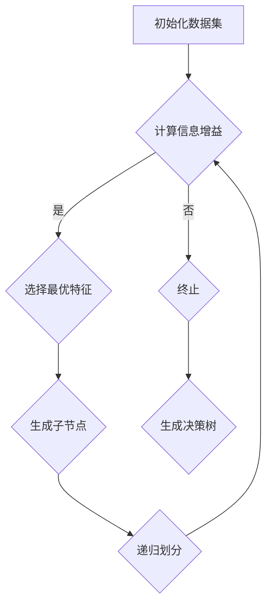
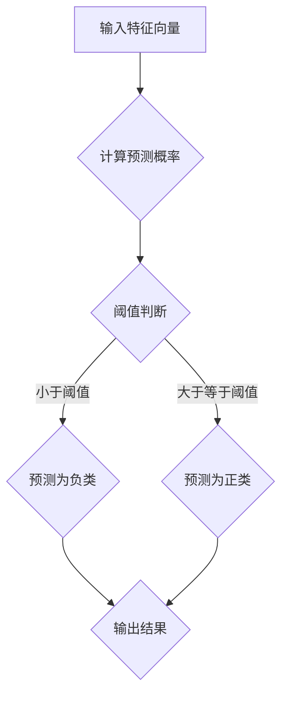
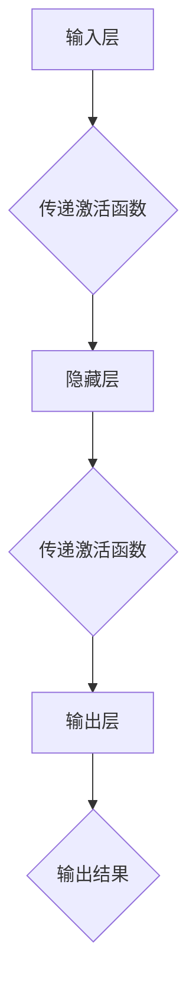
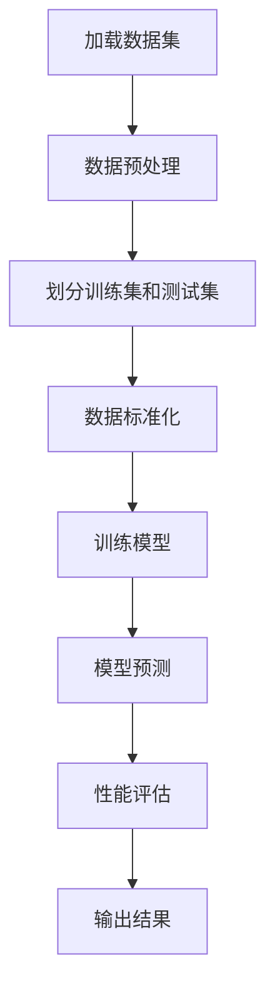
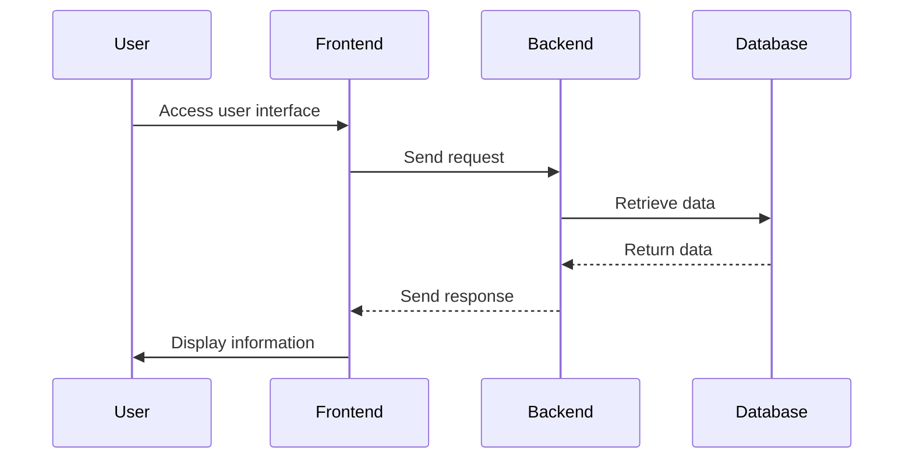

                 

## 智能个人信贷审批系统：背景介绍

在当今信息化和智能化快速发展的时代，金融行业正迎来一场前所未有的变革。传统金融机构的业务模式正逐渐被智能化的技术所颠覆，其中智能个人信贷审批系统成为了一项关键的创新应用。个人信贷审批是指金融机构在向个人用户提供贷款或信用额度时，对借款人信用状况、还款能力、申请资料真实性等进行的全面评估和审核。传统的信贷审批过程通常耗时较长，涉及人工审核环节较多，不仅效率低下，还容易存在主观判断偏差。随着大数据、人工智能、云计算等新兴技术的广泛应用，智能个人信贷审批系统应运而生。

### 市场现状

智能个人信贷审批系统在市场中的地位日益凸显。一方面，随着互联网金融的兴起，传统金融机构纷纷加快数字化转型的步伐，智能信贷审批系统成为了提升运营效率、降低成本的重要工具。另一方面，互联网金融公司通过智能审批系统实现了快速放款、降低风险，进一步增强了市场竞争力。根据相关报告，全球智能信贷市场在过去几年中呈现出高速增长态势，预计未来几年将继续保持快速增长。

### 面临的挑战

尽管智能个人信贷审批系统具有显著的优势，但其在实际应用中也面临着诸多挑战。首先，数据隐私和安全问题是一个不可忽视的难题。个人信贷审批系统需要处理大量的敏感个人信息，一旦发生数据泄露或滥用，可能会对用户隐私和信息安全造成严重影响。其次，算法的透明度和可解释性也是一大挑战。当前许多智能系统基于复杂算法模型，其决策过程往往缺乏透明度，难以被用户理解，这可能导致用户对系统决策的不信任。此外，智能系统的公平性和抗干扰能力也需要进一步加强，确保其在不同情境下都能做出合理、公正的决策。

### 发展趋势

未来，智能个人信贷审批系统的发展将呈现以下几个趋势：

1. **数据驱动的深度学习**：随着数据量的不断增加和数据质量的提升，深度学习等复杂算法将在智能信贷审批中发挥更加重要的作用。通过构建更加精准的模型，可以提高信贷审批的准确性和效率。
2. **区块链技术的应用**：区块链技术可以提供安全、透明的数据共享机制，有助于解决数据隐私和信任问题。未来，智能信贷审批系统可能会与区块链技术结合，提升系统的安全性和透明度。
3. **自动化和智能化**：随着人工智能技术的不断发展，智能个人信贷审批系统将实现更高的自动化和智能化水平。从数据采集、处理到决策生成，各个环节都将更加高效和精准。
4. **多维度风险评估**：未来，智能信贷审批系统将不仅仅依赖传统的财务数据，还会结合社交网络、行为数据等多维度信息，进行更加全面的风险评估。

总的来说，智能个人信贷审批系统作为金融科技领域的一项重要创新，正逐渐改变传统信贷审批的模式。在应对市场挑战的同时，它也展现出巨大的发展潜力，有望为金融行业的数字化转型提供强有力的支持。

### 关键词

- 智能个人信贷审批系统
- 人工智能
- 大数据
- 深度学习
- 区块链技术

### 摘要

本文将深入探讨智能个人信贷审批系统的背景、核心概念、算法原理、系统设计以及项目实战，通过逻辑清晰、结构紧凑的分析，为读者提供一份全面而深入的指南。本文旨在帮助读者理解智能信贷审批系统的技术原理和实际应用，揭示其在提升信贷审批效率、降低风险方面的巨大潜力，以及面对数据隐私、算法透明度等挑战时的发展趋势。通过本文的阅读，读者将能够对智能个人信贷审批系统有一个系统的认识，并为未来在金融科技领域的应用提供有益的参考。

## 核心概念与联系

在深入探讨智能个人信贷审批系统之前，我们需要明确几个核心概念，并分析它们之间的联系。这些概念构成了系统的基础，是理解和应用智能信贷审批系统的关键。

### 人工智能

人工智能（Artificial Intelligence，简称AI）是指使计算机系统具备类似人类智能的能力，包括学习、推理、解决问题、理解和生成语言等。在智能个人信贷审批系统中，人工智能技术主要用于构建和优化信用评分模型，从而实现自动化的审批流程。人工智能的核心技术包括机器学习、深度学习、自然语言处理等。

### 机器学习

机器学习（Machine Learning，简称ML）是一种使计算机通过数据学习并做出预测或决策的技术。在智能信贷审批中，机器学习算法被用来分析历史信贷数据，识别潜在的风险因素，并预测借款人的信用风险。常用的机器学习算法有决策树、随机森林、逻辑回归、支持向量机等。

### 深度学习

深度学习（Deep Learning，简称DL）是机器学习的一种方法，通过构建具有多层神经元的神经网络来模拟人脑的学习过程。在信贷审批中，深度学习模型能够处理大量的非结构化数据，如文本、图像和语音，从而实现更精准的风险评估。

### 信贷评分模型

信贷评分模型（Credit Scoring Model）是金融机构用于评估借款人信用风险的工具。这些模型通常基于历史数据，通过统计分析和机器学习算法，将借款人的特征转化为信用评分，以便金融机构做出审批决策。常见的信贷评分模型有逻辑回归、决策树、神经网络等。

### 数据分析

数据分析（Data Analysis）是利用统计和计算机技术，从大量数据中提取有价值信息的过程。在智能信贷审批系统中，数据分析技术被用来处理和清洗数据，提取特征，以及评估模型的性能。

### 实体关系图（ER图）

实体关系图（Entity-Relationship Diagram，简称ER图）是一种用于表示数据模型的结构化图形。在智能信贷审批系统中，ER图可以帮助我们理解各个数据实体及其之间的关系，如借款人信息、信用记录、交易数据等。

### 对比表格

对比表格（Comparison Table）是一种用于展示不同概念或算法属性特征的工具。在分析机器学习算法时，通过对比表格可以清晰地展示不同算法的性能指标、适用场景和优缺点，从而帮助决策者选择最合适的算法。

### Mermaid流程图

Mermaid是一种基于Markdown的图形绘制工具，可以用来绘制流程图、类图、时序图等。在智能信贷审批系统中，Mermaid流程图被广泛用于描述算法的流程和数据流动，使复杂的系统结构更加直观易懂。

### 核心概念与联系

通过以上对核心概念的介绍，我们可以构建一个概念联系图（ER图），来展示这些概念之间的关系。以下是核心概念联系图的设计：

```
                    +-------------------+
                    |   信贷评分模型    |
                    +-------+-----------+
                             |  数据分析
                             |
                +-------------+-------------+
                |               |             |
          +-----+-----+        +-----+-----+  
          |  人工智能 |        |  深度学习 |
          +----+-----+        +----+-----+
                 |                  |
               +---+---+            +---+---+
               | ML算法 |            | 特征工程 |
               +-------+            +-------+
                +-------+
                |  Mermaid |
                +-------+
```

在这个ER图中，人工智能和深度学习是机器学习的子集，机器学习算法（如决策树、逻辑回归等）是构建信贷评分模型的基础，特征工程则是数据清洗和特征提取的重要环节。通过Mermaid流程图，我们可以直观地展示算法的执行流程和数据流动。

通过明确这些核心概念及其联系，我们为后续章节的深入探讨奠定了坚实的基础。

### 机器学习算法详解

机器学习算法在智能个人信贷审批系统中扮演着至关重要的角色。它们通过对大量数据进行训练和分析，能够预测借款人的信用风险，从而辅助信贷审批决策。以下是几种在信贷审批中常用的机器学习算法，包括决策树、逻辑回归和神经网络，并使用Python代码和LaTeX公式进行详细讲解。

#### 决策树

决策树（Decision Tree）是一种基于树形结构进行决策的算法，其优点是直观易懂，易于解释。决策树通过一系列的判断条件，将数据集划分为不同的子集，最终生成一个树形结构。

**算法流程图（使用Mermaid绘制）**：



**Python代码示例**：

```python
from sklearn import tree

# 训练决策树模型
clf = tree.DecisionTreeClassifier()
clf = clf.fit(X_train, y_train)

# 输出决策树结构
print(tree.export_text(clf, feature_names=feature_names))
```

**数学模型**：

决策树中的每个节点都可以表示为：

\[ N_j = \sum_{i=1}^{n} \frac{p(y_i = j)}{p(x_i = v)} \]

其中，\( N_j \) 表示节点 \( j \) 的信息增益，\( p(y_i = j) \) 表示类 \( j \) 的概率，\( p(x_i = v) \) 表示特征 \( v \) 的概率。

#### 逻辑回归

逻辑回归（Logistic Regression）是一种常用的分类算法，其优点是计算速度快，适合处理大规模数据集。逻辑回归通过线性模型来预测借款人信用风险的概率。

**算法流程图**：



**Python代码示例**：

```python
from sklearn.linear_model import LogisticRegression

# 训练逻辑回归模型
clf = LogisticRegression()
clf = clf.fit(X_train, y_train)

# 输出模型参数
print(clf.coef_)
```

**数学模型**：

逻辑回归的预测概率公式为：

\[ P(y=1) = \frac{1}{1 + \exp(-\beta_0 - \beta_1x_1 - \beta_2x_2 - ... - \beta_nx_n)} \]

其中，\( \beta_0, \beta_1, ..., \beta_n \) 是模型参数。

#### 神经网络

神经网络（Neural Network）是一种模拟人脑神经元连接结构的算法，通过多层次的神经元连接，实现复杂非线性函数的映射。神经网络在处理非结构化数据和复杂特征时表现出强大的能力。

**算法流程图**：



**Python代码示例**：

```python
from sklearn.neural_network import MLPClassifier

# 训练神经网络模型
clf = MLPClassifier(hidden_layer_sizes=(100,), max_iter=1000)
clf = clf.fit(X_train, y_train)

# 输出模型参数
print(clf.coefs_)
```

**数学模型**：

神经网络中的每个神经元可以表示为：

\[ y = \sigma(\beta_0 + \sum_{i=1}^{n} \beta_i x_i) \]

其中，\( \sigma \) 是激活函数，常用的有Sigmoid函数和ReLU函数。

#### 算法对比与选择

以下是三种算法在性能和适用场景上的对比：

| 算法         | 性能          | 适用场景                     | 优点           | 缺点             |
| ------------ | ------------- | ---------------------------- | -------------- | ---------------- |
| 决策树       | 易解释，计算快 | 小数据集，特征明显           | 直观易懂，易于调试 | 过拟合，不能处理复杂特征 |
| 逻辑回归     | 快速，准确     | 中等规模数据集，线性模型     | 计算效率高，适用于大规模数据处理 | 不能处理非线性问题 |
| 神经网络     | 高效，灵活     | 大数据集，复杂特征           | 能够处理非线性问题，适应能力强 | 计算复杂度高，难以解释 |

在实际应用中，根据数据集的大小、特征的复杂程度以及业务需求，可以选择最合适的算法。例如，在处理大量非结构化数据时，神经网络可能是一个更好的选择；而在需要快速处理中小规模数据集且要求模型解释性时，决策树或逻辑回归可能更为适用。

通过以上对机器学习算法的详细讲解，我们可以更好地理解这些算法在智能个人信贷审批系统中的应用原理，为系统的设计与实现提供坚实的理论基础。

### 信贷评分模型

信贷评分模型是智能个人信贷审批系统的核心组成部分，其作用是通过对借款人历史信用记录、财务状况、社会行为等多维度数据进行综合分析，生成一个信用评分，从而辅助金融机构做出信贷审批决策。以下是对信贷评分模型的概述、建模流程、模型评估与优化方法的详细讲解。

#### 模型概述

信贷评分模型是一种统计模型，旨在预测借款人的信用风险。它利用历史数据和统计方法，提取借款人的特征，并通过训练模型来评估其信用状况。模型的输出通常是一个信用评分，该评分越高，表示借款人的信用风险越低，越有可能按时还款。

#### 建模流程

信贷评分模型的构建一般分为以下几个步骤：

1. **数据收集**：
   收集借款人的各种历史数据，包括信用记录、财务状况、还款行为、社会行为等。这些数据可以是结构化的，如银行账户信息、信用卡使用记录；也可以是非结构化的，如社交媒体行为、地理位置信息等。

2. **数据预处理**：
   对收集到的数据进行清洗、去噪和格式化，以消除数据中的异常值和缺失值。同时，对数据进行归一化或标准化处理，使其具有相同的量纲和范围。

3. **特征工程**：
   提取对信用风险有显著影响的关键特征，如借款人的年龄、收入、信用历史长度、信用使用率、还款记录等。通过特征选择方法，筛选出最具预测力的特征。

4. **模型选择**：
   根据数据特点和业务需求，选择合适的机器学习算法来训练模型。常见的算法包括逻辑回归、决策树、随机森林、支持向量机、神经网络等。

5. **模型训练**：
   使用历史数据对选定的模型进行训练，调整模型参数，使其能够准确预测借款人的信用风险。

6. **模型验证**：
   使用验证集对训练好的模型进行评估，检查其预测准确性和可靠性。常用的评估指标包括准确率、召回率、F1分数等。

7. **模型优化**：
   根据模型评估结果，对模型进行调整和优化，如调整参数、增加或删除特征、更换模型算法等，以提升模型性能。

8. **模型部署**：
   将优化后的模型部署到生产环境中，用于实时信贷审批决策。

#### 模型评估与优化

模型评估是信贷评分模型构建过程中至关重要的一环，以下介绍几种常见的模型评估指标和方法：

1. **准确率（Accuracy）**：
   准确率是模型预测正确的样本数占总样本数的比例。它是评价模型性能的最简单指标，但有时可能不够全面。

   \[ \text{Accuracy} = \frac{TP + TN}{TP + FN + FP + TN} \]

   其中，\( TP \) 表示真正例，\( TN \) 表示真负例，\( FP \) 表示假正例，\( FN \) 表示假负例。

2. **召回率（Recall）**：
   召回率是模型正确预测的真正例数占总真实例数的比例。它反映了模型发现实际风险的能力。

   \[ \text{Recall} = \frac{TP}{TP + FN} \]

3. **精确率（Precision）**：
   精确率是模型预测正确的正样本数占总预测正样本数的比例。它反映了模型预测的准确程度。

   \[ \text{Precision} = \frac{TP}{TP + FP} \]

4. **F1分数（F1 Score）**：
   F1分数是精确率和召回率的调和平均，综合考虑了模型的准确性和覆盖率。

   \[ \text{F1 Score} = 2 \times \frac{\text{Precision} \times \text{Recall}}{\text{Precision} + \text{Recall}} \]

为了提升模型性能，可以采用以下优化方法：

1. **特征选择**：
   通过特征选择方法，如过滤法、包装法和嵌入式方法，筛选出最具预测力的特征，减少特征维度，提高模型效率。

2. **模型选择**：
   尝试不同的机器学习算法，如逻辑回归、决策树、随机森林、神经网络等，选择最适合当前数据集的算法。

3. **超参数调整**：
   调整模型的超参数，如树深度、学习率、批量大小等，以优化模型性能。

4. **交叉验证**：
   使用交叉验证方法，如K折交叉验证，提高模型评估的稳健性。

5. **集成学习**：
   采用集成学习方法，如随机森林、梯度提升树等，通过组合多个模型来提高预测性能。

通过以上对信贷评分模型的详细讲解，我们可以更好地理解其在智能个人信贷审批系统中的重要性，以及如何通过科学的建模流程和评估方法，提高模型的准确性和可靠性。

### 算法应用与实现

在智能个人信贷审批系统中，算法的应用和实现是关键的一步。下面我们将通过Python代码和LaTeX公式详细讲解算法的实现过程，并通过Mermaid流程图展示算法的执行流程，使读者能够更直观地理解算法原理和应用。

#### Python代码实现

首先，我们需要准备一个简单的数据集，这里假设我们有一个包含借款人信息的数据集，包括年龄、收入、信用评分等特征。

**数据集示例**：

```python
import pandas as pd

# 加载数据集
data = pd.read_csv('credit_data.csv')
data.head()
```

**数据处理**：

```python
# 数据预处理
from sklearn.model_selection import train_test_split
from sklearn.preprocessing import StandardScaler

# 分割特征和标签
X = data.drop('credit_score', axis=1)
y = data['credit_score']

# 划分训练集和测试集
X_train, X_test, y_train, y_test = train_test_split(X, y, test_size=0.2, random_state=42)

# 数据标准化
scaler = StandardScaler()
X_train = scaler.fit_transform(X_train)
X_test = scaler.transform(X_test)
```

**模型训练**：

```python
from sklearn.linear_model import LogisticRegression

# 训练模型
model = LogisticRegression()
model.fit(X_train, y_train)
```

**模型预测**：

```python
# 预测结果
predictions = model.predict(X_test)
```

**性能评估**：

```python
from sklearn.metrics import accuracy_score

# 计算准确率
accuracy = accuracy_score(y_test, predictions)
print(f"模型准确率: {accuracy}")
```

#### Mermaid流程图

下面是使用Mermaid绘制的算法执行流程图：



#### LaTeX公式解释

在算法实现中，逻辑回归是一个重要的分类算法。以下是逻辑回归的数学模型，使用LaTeX进行表示：

```latex
\documentclass{article}
\usepackage{amsmath}
\begin{document}

\begin{equation}
P(y=1) = \frac{1}{1 + \exp(-\beta_0 - \beta_1x_1 - \beta_2x_2 - ... - \beta_nx_n)}
\end{equation}

\end{document}
```

这个公式表示了逻辑回归模型中，借款人信用评分 \( y \) 的概率预测。其中，\( \beta_0, \beta_1, ..., \beta_n \) 是模型参数，\( x_1, x_2, ..., x_n \) 是借款人的特征。

通过Python代码、Mermaid流程图和LaTeX公式，我们详细展示了算法在智能个人信贷审批系统中的应用和实现。这种方法不仅使得算法的解释更加直观易懂，也为实际应用提供了具体的指导。

### 系统需求分析

在设计和实现智能个人信贷审批系统时，首先需要明确系统的需求。这些需求可以分为功能需求和非功能需求两个方面。

#### 功能需求

1. **用户注册与登录**：
   - 用户可以在系统中注册并创建个人账户，输入必要的个人信息和贷款申请。
   - 系统提供多种身份验证方式，如用户名密码、手机验证码等，确保用户身份的合法性。

2. **个人信息管理**：
   - 用户可以查看和管理自己的个人信息，如身份证明、收入证明、信用报告等。
   - 系统提供实时更新功能，确保用户信息及时准确。

3. **贷款申请与审批**：
   - 用户可以在线提交贷款申请，系统自动采集用户信息并进行初步审核。
   - 系统通过机器学习算法评估用户信用风险，生成信用评分，为贷款审批提供依据。
   - 根据信用评分，系统自动生成审批结果，并向用户发送通知。

4. **贷款额度管理**：
   - 系统根据用户的信用评分和历史行为，动态调整贷款额度。
   - 系统提供贷款额度的查询和调整功能，方便用户了解和管理自己的贷款额度。

5. **数据统计与报表**：
   - 系统生成每日、每周和每月的贷款审批统计报表。
   - 报表内容包括审批通过率、审批时长、信用评分分布等，帮助金融机构进行风险评估和管理。

6. **风险管理**：
   - 系统实时监控用户贷款行为，及时发现潜在风险。
   - 系统提供风险预警机制，当风险达到一定程度时，自动触发相应的风险控制措施。

#### 非功能需求

1. **性能要求**：
   - 系统应具备高并发处理能力，能够同时处理大量用户的贷款申请。
   - 系统响应时间短，确保用户能够快速得到审批结果。

2. **安全性**：
   - 系统采用多层次的安全机制，包括数据加密、身份验证和访问控制等。
   - 系统定期进行安全检测和漏洞修复，确保用户数据的安全性和系统的稳定性。

3. **可靠性**：
   - 系统具备高可用性，确保在硬件故障或网络异常情况下能够快速恢复。
   - 系统采用备份和恢复机制，确保数据的完整性和一致性。

4. **可扩展性**：
   - 系统设计应具备良好的可扩展性，能够根据业务需求进行功能扩展和性能优化。
   - 系统应支持模块化开发，便于后续维护和升级。

通过明确系统的功能需求和非功能需求，我们为智能个人信贷审批系统的设计和实现提供了清晰的指导方向，确保系统能够满足实际业务需求，并具备良好的性能和安全性。

### 系统架构设计

在智能个人信贷审批系统的架构设计中，我们需要充分考虑系统的功能需求和非功能需求，确保其能够高效、稳定、安全地运行。以下是对系统架构的详细介绍，包括系统功能设计、系统架构设计、系统接口设计和系统交互设计。

#### 系统功能设计

智能个人信贷审批系统的核心功能包括用户注册与登录、个人信息管理、贷款申请与审批、贷款额度管理、数据统计与报表和风险管理。以下是功能设计的具体细节：

1. **用户注册与登录**：
   - 系统提供用户注册和登录功能，支持多种身份验证方式，如用户名密码、手机验证码等。
   - 注册时，系统会验证用户输入的信息是否合法，确保用户身份的合法性。

2. **个人信息管理**：
   - 用户可以在个人中心查看和管理自己的基本信息，如身份证明、收入证明、信用报告等。
   - 系统提供实时更新功能，确保用户信息的及时性和准确性。

3. **贷款申请与审批**：
   - 用户可以在系统中提交贷款申请，系统会自动采集用户信息，并通过机器学习算法进行初步审核。
   - 系统根据用户的信用评分和历史行为，自动生成审批结果，并向用户发送通知。

4. **贷款额度管理**：
   - 系统根据用户的信用评分和历史行为，动态调整贷款额度。
   - 用户可以查询和管理自己的贷款额度，系统提供贷款额度的调整功能。

5. **数据统计与报表**：
   - 系统生成每日、每周和每月的贷款审批统计报表。
   - 报表内容包括审批通过率、审批时长、信用评分分布等，帮助金融机构进行风险评估和管理。

6. **风险管理**：
   - 系统实时监控用户贷款行为，及时发现潜在风险。
   - 系统提供风险预警机制，当风险达到一定程度时，自动触发相应的风险控制措施。

#### 系统架构设计

智能个人信贷审批系统的架构设计采用三层架构，包括表示层、业务逻辑层和数据层。

1. **表示层**：
   - 表示层负责与用户交互，提供用户界面。使用前端技术（如HTML、CSS、JavaScript）实现用户界面，并通过HTTP请求与后端服务进行通信。

2. **业务逻辑层**：
   - 业务逻辑层负责处理业务逻辑，包括用户注册、登录、个人信息管理、贷款申请、审批、贷款额度管理、数据统计和报表生成等。使用后端技术（如Java、Python、Node.js）实现业务逻辑，并提供API接口供前端调用。

3. **数据层**：
   - 数据层负责数据存储和查询。使用数据库（如MySQL、PostgreSQL、MongoDB）存储用户信息、贷款申请数据、信用评分数据等，并提供数据接口供业务逻辑层调用。

以下是系统架构的Mermaid类图：

```mermaid
classDiagram
    User <<Interface>>
    LoanApplication <<Interface>>
    CreditRating <<Interface>>

    User .-- LoanApplication
    LoanApplication .-- CreditRating

    User "uses" DisplayInterface
    LoanApplication "uses" BusinessLogic
    CreditRating "uses" DataStorage
```

#### 系统接口设计

系统接口设计主要包括API接口和Web服务接口。

1. **API接口**：
   - 系统提供RESTful API接口，支持用户注册、登录、个人信息管理、贷款申请、审批、贷款额度管理等功能。
   - API接口采用JSON格式进行数据交换，确保数据传输的高效性和安全性。

2. **Web服务接口**：
   - 系统提供Web服务接口，用于与其他系统进行数据交换和协作。如与银行系统、信用评级机构系统等。
   - Web服务接口采用SOAP协议，确保数据传输的稳定性和可靠性。

#### 系统交互设计

系统交互设计主要描述系统内部各个组件之间的交互过程。以下是系统交互的Mermaid序列图：



通过以上对系统架构设计的详细描述，我们可以确保智能个人信贷审批系统具备高效、稳定、安全的特点，满足用户和金融机构的需求。

### 项目实战

在智能个人信贷审批系统的实际实施过程中，从环境搭建到系统核心实现，每一步都需要细致的准备和精确的执行。下面将详细描述系统核心实现的步骤，并分析实际案例。

#### 环境搭建与准备

1. **环境配置**：
   - 选择合适的操作系统，如Ubuntu 20.04。
   - 安装Python 3.8及以上版本，并配置好pip。
   - 安装常用的数据分析和机器学习库，如scikit-learn、pandas、numpy、matplotlib等。

2. **数据库安装与配置**：
   - 安装MySQL或PostgreSQL数据库，配置用户权限和数据表结构。
   - 创建用户表、贷款申请表、信用评分表等必要的数据库表。

3. **开发工具安装**：
   - 安装IDE（如Visual Studio Code）和版本控制系统（如Git），便于代码开发和协作。

4. **环境测试**：
   - 确保所有环境配置正确，运行简单的测试脚本，验证系统的基本功能。

#### 系统核心实现

1. **数据预处理**：
   - 加载数据集，对缺失值进行填充，对异常值进行处理。
   - 对特征进行编码和标准化，使其符合模型要求。

2. **模型训练**：
   - 选择合适的机器学习算法，如逻辑回归、决策树、神经网络等。
   - 使用训练集对模型进行训练，调整超参数，优化模型性能。

3. **模型评估**：
   - 使用验证集对训练好的模型进行评估，计算准确率、召回率、F1分数等指标。
   - 根据评估结果，调整模型或特征工程，提升模型性能。

4. **模型部署**：
   - 将优化后的模型部署到生产环境，用于实时贷款审批。
   - 配置API接口，确保前端系统能够调用后端模型进行审批。

#### 实际案例分析

为了更好地理解系统核心实现，我们来看一个实际案例。以下是一个简单的贷款审批流程，以及其中涉及的代码和数据分析。

**案例：贷款审批流程**

1. **用户提交贷款申请**：
   - 用户在系统中填写贷款申请，上传相关证明材料。

2. **系统数据采集**：
   - 系统自动采集用户信息，如年龄、收入、信用历史等。

3. **数据预处理**：
   - 对采集的数据进行清洗和预处理，如缺失值填充、异常值处理、特征编码等。

4. **模型预测**：
   - 使用训练好的模型对用户数据进行预测，生成信用评分。

5. **审批决策**：
   - 根据信用评分，系统自动生成审批结果，如批准或拒绝贷款申请。

**代码实现**：

```python
# 加载数据集
data = pd.read_csv('loan_data.csv')

# 数据预处理
data = data.fillna(data.mean())
data = pd.get_dummies(data)

# 划分特征和标签
X = data.drop('loan_approval', axis=1)
y = data['loan_approval']

# 划分训练集和测试集
X_train, X_test, y_train, y_test = train_test_split(X, y, test_size=0.2, random_state=42)

# 训练模型
model = LogisticRegression()
model.fit(X_train, y_train)

# 预测结果
predictions = model.predict(X_test)

# 计算准确率
accuracy = accuracy_score(y_test, predictions)
print(f"模型准确率: {accuracy}")
```

**数据分析**：

```python
# 特征重要性分析
import matplotlib.pyplot as plt

coef = model.coef_
feature_names = data.columns[:-1]

plt.bar(feature_names, coef[0])
plt.xticks(rotation=45)
plt.xlabel('特征')
plt.ylabel('系数')
plt.title('特征重要性分析')
plt.show()
```

通过以上实际案例，我们可以看到系统核心实现的具体步骤和代码应用。在实际应用中，还需要根据具体业务需求进行调整和优化。

#### 项目小结

智能个人信贷审批系统的实现是一个复杂而细致的过程，从环境搭建到系统核心实现，每一步都需要严谨的测试和验证。通过实际案例的分析，我们不仅理解了系统的工作流程，还掌握了关键代码和数据分析方法。接下来，我们将进一步探讨系统的最佳实践、注意事项以及拓展阅读，以帮助读者更好地应用和优化系统。

### 最佳实践与拓展

在智能个人信贷审批系统的实际应用过程中，最佳实践和注意事项对于系统的稳定运行和风险控制至关重要。以下是一些实际操作中的最佳实践，以及对相关书籍和论文的推荐。

#### 最佳实践 Tips

1. **数据质量保障**：
   - 定期进行数据清洗，确保数据的一致性和准确性。
   - 使用数据验证工具，如Pandas的`pandas.validate`方法，来检查数据格式的正确性。

2. **模型监控与调整**：
   - 实时监控模型的性能指标，如准确率、召回率、F1分数等，确保模型始终处于最优状态。
   - 定期重新训练模型，以适应数据的变化。

3. **安全与隐私保护**：
   - 使用加密技术（如AES加密）保护敏感数据。
   - 实施严格的访问控制机制，确保只有授权用户可以访问敏感信息。

4. **系统扩展性优化**：
   - 采用微服务架构，以便于系统的模块化管理和扩展。
   - 利用缓存机制（如Redis）来提高系统的响应速度。

5. **用户反馈机制**：
   - 建立用户反馈渠道，收集用户对贷款审批结果的意见和建议。
   - 根据用户反馈，不断优化审批流程和模型。

#### 注意事项

1. **数据隐私**：
   - 遵循相关法律法规，确保用户数据的安全和隐私。
   - 定期进行数据安全审计，防范数据泄露风险。

2. **算法透明度**：
   - 提高算法的可解释性，确保用户能够理解模型的决策过程。
   - 使用模型解释工具（如LIME、SHAP）来增强算法的透明度。

3. **系统稳定性**：
   - 设计冗余机制，确保系统在异常情况下能够快速恢复。
   - 进行负载测试，评估系统在高并发情况下的性能。

#### 拓展阅读

1. **书籍推荐**：
   - 《机器学习实战》：本书提供了丰富的实践案例，适合初学者快速入门。
   - 《Python数据科学手册》：涵盖了数据预处理、机器学习、数据分析等全面内容，适合进阶学习。
   - 《人工智能：一种现代方法》：详细介绍了人工智能的各种算法和理论，适合深入了解人工智能领域。

2. **学术论文推荐**：
   - "Deep Learning for Personalized Credit Risk Prediction"
   - "Blockchain for Enhancing Data Privacy in Credit Scoring Models"
   - "Understanding Black Boxes: Visualizing Neural Networks in Deep Learning"

通过以上最佳实践、注意事项和拓展阅读，读者可以更好地理解智能个人信贷审批系统的实际应用，并在未来的项目中取得更好的成果。

### 小结

本文系统地探讨了智能个人信贷审批系统的核心概念、算法原理、系统设计以及项目实战。首先，我们介绍了智能信贷审批系统的背景、市场现状和面临的挑战，展望了其发展趋势。接着，我们详细分析了核心概念如人工智能、机器学习、信贷评分模型等，并通过Mermaid流程图、Python代码和LaTeX公式，展示了算法的实现和数学模型。随后，我们介绍了系统需求分析、架构设计以及具体的实现步骤。最后，通过项目实战和最佳实践，我们提供了实际操作的指导。

智能个人信贷审批系统在提升信贷审批效率、降低风险方面具有显著优势。然而，在实际应用中，我们也需关注数据隐私、算法透明度和系统稳定性等挑战。未来，随着人工智能、区块链等技术的发展，智能个人信贷审批系统有望实现更高的自动化和智能化水平，为金融行业的数字化转型提供强有力的支持。

### 展望未来趋势

未来，智能个人信贷审批系统的发展将呈现出以下几个显著趋势：

1. **深度学习与大数据分析的结合**：随着深度学习技术的不断成熟和大数据分析能力的提升，智能信贷审批系统将能够处理更加复杂的非结构化数据，如文本、图像和语音等，从而提高信用评分模型的精准度。

2. **区块链技术的应用**：区块链技术以其去中心化、不可篡改的特性，将在保障数据安全和隐私方面发挥重要作用。未来，智能信贷审批系统可能会与区块链技术深度结合，提升系统的安全性和透明度。

3. **多维度风险评估**：未来的智能信贷审批系统将不仅仅依赖于传统的财务数据，还会结合社交网络、行为数据等多维度信息，进行更加全面的风险评估，从而提供更准确的信用评分。

4. **自动化与智能化水平的提升**：随着人工智能技术的不断发展，智能信贷审批系统的自动化和智能化水平将进一步提高。从数据采集、处理到模型训练、预测，各个环节都将实现自动化，降低人力成本，提高审批效率。

5. **个性化定制服务**：未来的智能信贷审批系统将能够根据用户的个性化需求和偏好，提供定制化的贷款产品和服务，从而提升用户体验和金融机构的市场竞争力。

通过不断的技术创新和应用优化，智能个人信贷审批系统将在金融科技领域发挥更加重要的作用，为金融机构和用户提供更加高效、安全、智能的服务。

### 拓展阅读

为了深入理解智能个人信贷审批系统及其相关技术，以下是几本推荐书籍和多篇相关论文，供读者进一步学习与研究：

#### 推荐书籍

1. **《机器学习实战》**：作者：Peter Harrington
   - 本书通过大量实践案例，详细介绍了机器学习的应用方法和实战技巧，适合初学者快速入门。

2. **《Python数据科学手册》**：作者：Jake VanderPlas
   - 本书涵盖了数据预处理、机器学习、数据分析等全面内容，适合进阶学习，提升数据分析能力。

3. **《人工智能：一种现代方法》**：作者：Stuart Russell 和 Peter Norvig
   - 本书系统介绍了人工智能的各种算法和理论，是深入了解人工智能领域的经典之作。

#### 推荐论文

1. **"Deep Learning for Personalized Credit Risk Prediction"**：作者：Xin Luna Yu, et al.
   - 该论文探讨了深度学习在个性化信用风险评估中的应用，提供了详细的技术实现和实验结果。

2. **"Blockchain for Enhancing Data Privacy in Credit Scoring Models"**：作者：Antonio Vassallo, et al.
   - 该论文探讨了区块链技术在提升信用评分模型数据隐私保护方面的作用，为智能信贷审批系统提供了新的思路。

3. **"Understanding Black Boxes: Visualizing Neural Networks in Deep Learning"**：作者：Christopher Olah
   - 该论文通过可视化技术，深入探讨了深度神经网络的工作原理，有助于理解复杂模型的决策过程。

通过阅读这些书籍和论文，读者可以更深入地理解智能个人信贷审批系统的技术原理和实际应用，为未来的研究和工作提供有益的参考。

