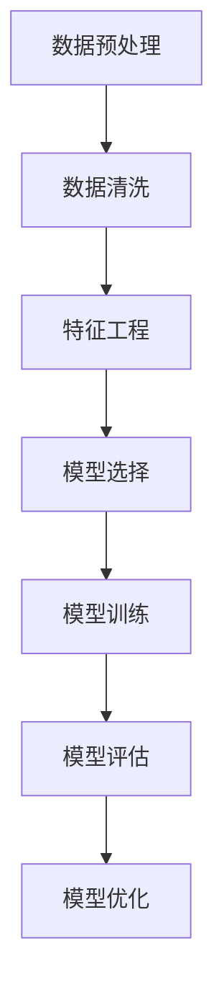

                 

### 摘要

本文旨在深入探讨智能个人信贷评分卡的优化方法，通过详细的步骤分析和专业的技术语言，为读者提供一套系统性的解决方案。本文将围绕数据预处理、模型选择与优化、风险评估与控制三个方面展开，全面解析每个环节的关键技术和挑战。首先，我们将介绍智能个人信贷评分卡的背景和问题，明确优化目标与实现路径。接着，通过核心概念与联系的阐述，帮助读者理解数据预处理、机器学习模型、模型评估与优化等关键要素。在此基础上，本文将详细讲解算法原理，包括机器学习算法流程、数学模型与公式，并通过实际案例进行举例说明。随后，我们将讨论系统分析与架构设计方案，包括问题场景、项目介绍、系统功能设计、系统架构设计、系统接口设计和系统交互等。最后，本文将结合项目实战，详细阐述环境安装、系统核心实现、代码应用解读与分析、实际案例分析和详细讲解剖析，并总结最佳实践和注意事项，为读者提供全面的指导。

### 1. 背景介绍

#### 问题背景

随着大数据和人工智能技术的快速发展，个人信贷领域正面临着前所未有的变革。传统的人工审批方式效率低下、成本高昂，且容易受到人为因素的影响，导致评分准确性受限。为了应对这一挑战，智能个人信贷评分卡成为了一种新的解决方案，它通过人工智能算法对借款人进行评分，以提高审批效率和准确性。

#### 问题描述

智能个人信贷评分卡的优化主要包括以下几个方面：

1. **数据预处理**：如何从大量数据中提取有效特征，并进行预处理，以提高评分模型的准确性。
2. **模型选择与优化**：如何选择合适的机器学习模型，并通过超参数调整和模型集成等方法提高模型的性能。
3. **风险评估与控制**：如何构建一个完善的评估体系，以识别高风险借款人，并采取相应的风控措施。

#### 问题解决

本书旨在为读者提供一套系统的智能个人信贷评分卡优化方法，通过以下章节的详细讲解，帮助读者理解和掌握这一领域的核心知识和实战技能。

#### 核心概念术语说明

在智能个人信贷评分卡的优化过程中，以下几个核心概念和术语需要明确：

1. **数据预处理**：指对原始数据进行清洗、转换和降维等操作，以提高数据质量和减少噪声。
2. **机器学习模型**：指用于构建评分模型的算法，常见的有线性回归、决策树、随机森林、支持向量机等。
3. **特征工程**：指从原始数据中提取有效特征，以增强模型性能的过程。
4. **模型评估**：指通过评估指标（如准确率、召回率、F1分数等）来衡量模型性能。
5. **模型优化**：指通过超参数调整、模型集成等方法来提高模型性能。
6. **风险评估**：指对借款人信用风险进行评估的过程。
7. **风险控制**：指采取一系列措施来降低信用风险。

#### 问题背景详细阐述

智能个人信贷评分卡的兴起背景主要源于以下几个方面：

1. **大数据技术的普及**：随着互联网和物联网的发展，大量个人信用信息被收集和存储，为构建智能评分卡提供了丰富的数据支持。
2. **人工智能算法的进步**：机器学习和深度学习算法的不断发展，使得复杂的数据分析和预测成为可能，为评分卡构建提供了强大的技术支持。
3. **金融行业的需求**：金融机构在面对日益激烈的市场竞争和风险压力时，迫切需要提高审批效率和降低坏账率，智能个人信贷评分卡成为了一种有效的解决方案。

#### 问题描述详细阐述

在智能个人信贷评分卡的实际应用中，面临以下几个主要问题：

1. **数据质量问题**：原始数据通常包含噪声、缺失值和异常值，这些都会影响评分模型的准确性。
2. **特征选择问题**：如何从大量特征中筛选出对评分有显著影响的特征，是提高模型性能的关键。
3. **模型性能问题**：如何选择合适的模型并进行优化，以提高评分的准确性和可靠性。
4. **风险评估问题**：如何构建一个有效的风险评估体系，以识别高风险借款人，并采取相应的风控措施。

#### 问题解决思路与方法

针对上述问题，我们可以采取以下解决思路和方法：

1. **数据预处理**：
   - 数据清洗：去除噪声、填补缺失值、修正异常值。
   - 数据转换：将分类特征转换为数值特征，进行特征标准化和归一化。
   - 数据降维：使用特征选择算法（如特征重要性、主成分分析等）降低数据维度，提高模型训练效率。

2. **模型选择与优化**：
   - 选择合适的机器学习模型：根据数据特点和业务需求，选择线性回归、决策树、随机森林等模型。
   - 模型优化：通过超参数调整（如交叉验证、网格搜索等）和模型集成（如随机森林、梯度提升等）方法，提高模型性能。

3. **风险评估与控制**：
   - 建立风险评估体系：结合历史数据和业务规则，构建风险评估模型，识别高风险借款人。
   - 风险控制措施：根据风险评估结果，采取相应的风控措施，如提高利率、限制借款金额等。

#### 边界与外延

在智能个人信贷评分卡的优化过程中，需要关注以下几个边界与外延：

1. **边界**：
   - 数据边界：确保数据的质量和完整性，避免数据异常值和噪声的影响。
   - 模型边界：选择适合业务场景的模型，避免过拟合或欠拟合。
   - 风险边界：根据业务需求和风险评估结果，合理设定风险容忍度和风控措施。

2. **外延**：
   - 业务外延：结合业务需求和行业趋势，不断优化评分卡模型，提高评分准确性。
   - 技术外延：紧跟人工智能技术的发展趋势，引入新的算法和技术，提升评分卡性能。

#### 概念结构与核心要素组成

智能个人信贷评分卡的优化涉及以下几个核心概念和要素：

1. **数据预处理**：核心要素包括数据清洗、特征工程、数据转换和数据降维。
2. **机器学习模型**：核心要素包括模型选择、模型训练、模型评估和模型优化。
3. **风险评估与控制**：核心要素包括风险评估模型构建、风险评估指标设定和风险控制措施实施。

通过以上对智能个人信贷评分卡优化背景、问题描述、问题解决、边界与外延以及概念结构与核心要素组成的详细阐述，我们可以更好地理解该领域的核心知识和实际应用，为后续章节的深入探讨奠定基础。

### 2. 核心概念与联系

#### 核心概念

在智能个人信贷评分卡的优化过程中，以下几个核心概念是理解该领域的关键：

1. **数据预处理**：数据预处理是机器学习项目的第一步，主要目的是提高数据质量和减少噪声。具体包括数据清洗（去除噪声和异常值）、数据转换（将分类特征转换为数值特征）和数据降维（减少数据维度，提高模型训练效率）。

2. **机器学习模型**：机器学习模型是用于构建评分卡的核心工具。常见的模型包括线性回归、决策树、随机森林、支持向量机等。每种模型都有其独特的优势和适用场景，选择合适的模型对于提高评分准确性至关重要。

3. **模型评估与优化**：模型评估用于判断模型的性能，常见的评估指标包括准确率、召回率、F1分数等。模型优化包括超参数调整（如交叉验证、网格搜索等）和模型集成（如随机森林、梯度提升等）方法，通过优化模型参数和结构来提高性能。

4. **风险评估与控制**：风险评估是指对借款人信用风险进行评估的过程，包括风险识别、风险评估和风险控制。风险识别是通过历史数据和业务规则识别高风险借款人，风险评估是利用评分模型计算借款人的信用评分，风险控制是根据评分结果采取相应的风控措施。

#### 概念属性特征对比表格

为了更直观地理解上述核心概念，我们提供了一个概念属性特征对比表格：

| 概念               | 特征与属性                      |
|--------------------|---------------------------------|
| 数据预处理         | 清洗、转换、降维等步骤         |
| 机器学习模型       | 线性回归、决策树等模型         |
| 模型评估与优化     | 交叉验证、网格搜索等优化方法   |
| 风险评估与控制     | 风险识别、评估、控制等步骤     |

#### ER实体关系图架构

为了更好地理解智能个人信贷评分卡的核心概念和它们之间的关系，我们可以使用Mermaid语法绘制一个ER实体关系图：

```mermaid
erDiagram
  数据预处理 ||--|{ 机器学习模型 }
  机器学习模型 ||--|{ 模型评估与优化 }
  模型评估与优化 ||--|{ 风险评估与控制 }
  数据预处理 ||--|{ 风险评估与控制 }
```

在上面的ER图中，数据预处理是整个评分卡优化流程的起点，它直接影响机器学习模型的输入质量。机器学习模型负责从预处理后的数据中学习，并通过模型评估与优化不断调整和提升。模型评估与优化为风险评估与控制提供基础，而风险评估与控制最终决定了评分卡的实际应用效果。

通过核心概念和ER实体关系图的阐述，我们可以更清晰地理解智能个人信贷评分卡优化过程中的各个环节及其相互关系，为后续的详细讲解和实战应用奠定基础。

### 3. 算法原理讲解

#### 算法流程图

为了更好地理解智能个人信贷评分卡的优化算法，我们可以通过Mermaid语法绘制一个简单的算法流程图：



在上述流程图中，数据预处理是机器学习项目的第一步，主要涉及数据清洗、特征工程等操作。接下来是模型选择阶段，根据数据特点和业务需求选择合适的机器学习模型。模型训练是将特征输入模型，让模型通过学习得到预测结果。模型评估用于判断模型性能，通过评估指标（如准确率、召回率、F1分数等）来衡量。最后是模型优化阶段，通过调整超参数和模型结构来提高模型性能。

#### 算法原理

智能个人信贷评分卡的优化算法主要涉及以下几个关键步骤：

1. **数据预处理**：
   数据预处理是机器学习项目中的关键步骤，其目的是提高数据质量和减少噪声。主要包括以下三个方面的操作：
   
   - **数据清洗**：去除错误、重复和不完整的数据，确保数据的准确性和一致性。常用的方法包括缺失值填补、异常值处理和错误值修正。
   - **特征工程**：从原始数据中提取有效特征，以增强模型性能。特征工程包括特征选择、特征转换和特征构造等操作。常用的方法有主成分分析（PCA）、特征重要性排序等。
   - **数据降维**：减少数据维度，提高模型训练效率。常用的方法包括主成分分析（PCA）、线性判别分析（LDA）和自编码器等。

2. **模型选择**：
   选择合适的机器学习模型对于提高评分卡性能至关重要。常见的机器学习模型包括线性回归、决策树、随机森林、支持向量机、梯度提升等。每种模型都有其独特的优势和适用场景。选择模型时需要考虑以下因素：
   
   - **数据特点**：数据类型（分类或回归）、数据规模和分布等。
   - **业务需求**：评分准确性、计算成本和模型复杂度等。
   - **模型性能**：评估指标（如准确率、召回率、F1分数等）。

3. **模型训练**：
   模型训练是指通过输入特征和标签数据，让模型学习如何预测未知数据的标签。训练过程中，模型会不断调整其参数，以最小化预测误差。常用的模型训练方法包括批量训练、随机梯度下降（SGD）和小批量训练等。

4. **模型评估**：
   模型评估用于判断模型的性能。常用的评估指标包括准确率、召回率、F1分数、ROC曲线、AUC等。通过交叉验证等方法，可以确保模型评估的公平性和可靠性。评估指标的选择取决于业务需求和数据特点。

5. **模型优化**：
   模型优化包括超参数调整和模型集成等方法。超参数调整是通过调整模型参数来提高模型性能，常用的方法包括交叉验证、网格搜索、贝叶斯优化等。模型集成是通过结合多个模型来提高预测准确性，常用的方法包括随机森林、梯度提升、堆叠等。

#### 数学模型和数学公式

在智能个人信贷评分卡的优化过程中，数学模型和数学公式是理解和实现算法的关键。以下是几种常见数学模型和公式的详细解释：

1. **线性回归模型**：

   线性回归模型是一种常见的机器学习模型，用于预测连续值。其数学模型可以表示为：

   $$ y = \beta_0 + \beta_1 \cdot x $$

   其中，\( y \) 是目标变量，\( x \) 是特征变量，\( \beta_0 \) 和 \( \beta_1 \) 是模型参数。

2. **决策树模型**：

   决策树模型是一种基于树形结构进行分类或回归的模型。其数学模型可以表示为：

   $$ f(x) = \begin{cases}
   \text{叶节点} & \text{if } x \in C_i \\
   \text{内部节点} & \text{if } x \in R_j \\
   \end{cases} $$

   其中，\( x \) 是输入特征，\( C_i \) 和 \( R_j \) 是分类结果和内部节点。

3. **随机森林模型**：

   随机森林模型是一种基于决策树的集成学习方法。其数学模型可以表示为：

   $$ f(x) = \sum_{i=1}^{n} \alpha_i \cdot h_i(x) $$

   其中，\( h_i(x) \) 是第 \( i \) 棵决策树对 \( x \) 的预测结果，\( \alpha_i \) 是权重系数。

4. **支持向量机模型**：

   支持向量机模型是一种基于间隔最大化原则的分类模型。其数学模型可以表示为：

   $$ \min_{\beta, \beta_0} \frac{1}{2} ||\beta||^2 + C \cdot \sum_{i=1}^{n} \max(0, 1 - y_i (\beta \cdot x_i + \beta_0)) $$

   其中，\( \beta \) 和 \( \beta_0 \) 是模型参数，\( y_i \) 是标签，\( x_i \) 是特征，\( C \) 是惩罚参数。

通过以上对算法原理的讲解，我们可以更好地理解智能个人信贷评分卡优化过程中的关键技术。在接下来的章节中，我们将通过实际案例和项目实战，进一步探讨这些算法在实际应用中的实现方法和效果评估。

### 3.1 数据预处理

数据预处理是智能个人信贷评分卡优化过程中的关键步骤，它直接影响评分模型的准确性和效率。数据预处理主要包括数据清洗、数据转换和数据降维等操作，以下是这些步骤的详细解释和示例。

#### 数据清洗

数据清洗是指去除数据中的错误、重复和不完整的数据，以确保数据的准确性和一致性。以下是数据清洗的几个关键步骤：

1. **去除噪声**：噪声是指数据中的随机错误和异常值，例如输入错误、记录错误等。去除噪声的方法包括使用规则、统计方法和机器学习算法。例如，可以使用中值滤波或均值滤波来去除连续数据的噪声，使用模式识别算法来去除分类数据的噪声。

2. **填补缺失值**：缺失值是指数据中没有记录的值。填补缺失值的方法包括均值填补、中值填补、众数填补和插值等。例如，可以使用特征的均值来填补缺失值，或者使用最近邻插值法来填充缺失值。

3. **修正异常值**：异常值是指与大多数数据点明显偏离的值。修正异常值的方法包括删除异常值、用均值或中值替换异常值等。例如，可以使用统计方法（如箱线图）来检测异常值，并将其删除或替换。

#### 数据转换

数据转换是指将原始数据转换为适合模型训练的格式，以提高模型性能。以下是一些常见的数据转换方法：

1. **特征编码**：特征编码是指将分类特征转换为数值特征。常用的编码方法包括独热编码（One-Hot Encoding）、标签编码（Label Encoding）等。例如，对于性别特征，可以使用独热编码将其转换为二进制向量。

2. **特征标准化**：特征标准化是指将特征值缩放到一个特定的范围，以消除不同特征之间的尺度差异。常用的方法包括最小-最大标准化（Min-Max Scaling）和标准化（Standardization）。例如，可以使用以下公式对特征进行标准化：

   $$ x_{\text{std}} = \frac{x - \mu}{\sigma} $$

   其中，\( x \) 是原始特征值，\( \mu \) 是特征的平均值，\( \sigma \) 是特征的标准差。

3. **特征归一化**：特征归一化是指将特征值转换为具有相同均值的零均向量，以消除特征之间的相关性。常用的方法包括L1归一化和L2归一化。例如，可以使用以下公式对特征进行L2归一化：

   $$ x_{\text{norm}} = \frac{x}{\|x\|_2} $$

   其中，\( x \) 是原始特征值，\( \|x\|_2 \) 是特征值的L2范数。

#### 数据降维

数据降维是指减少数据的维度，以提高模型训练效率和减少计算成本。以下是一些常见的数据降维方法：

1. **主成分分析（PCA）**：主成分分析是一种基于特征值分解的降维方法，它可以提取数据的主要成分，并丢弃次要成分。通过降维，可以减少数据维度，同时保留大部分信息。例如，可以使用以下公式对数据进行PCA降维：

   $$ X_{\text{new}} = U \Sigma^{1/2} $$

   其中，\( X \) 是原始数据矩阵，\( U \) 是特征值分解的左特征向量，\( \Sigma \) 是特征值分解的对角矩阵。

2. **线性判别分析（LDA）**：线性判别分析是一种基于类间方差和类内方差的最小化准则的降维方法，它可以提取最有区分性的特征。通过降维，可以减少数据维度，同时最大化不同类别之间的分离度。例如，可以使用以下公式对数据进行LDA降维：

   $$ X_{\text{new}} = W X $$

   其中，\( X \) 是原始数据矩阵，\( W \) 是LDA变换矩阵。

3. **自编码器（Autoencoder）**：自编码器是一种基于神经网络结构的降维方法，它可以学习一个压缩的编码表示，并使用这个编码表示进行数据降维。通过训练自编码器，可以自动学习到数据的主要特征，并丢弃次要特征。例如，可以使用以下公式对数据进行自编码器降维：

   $$ X_{\text{encoded}} = \sigma(W X) $$

   其中，\( X \) 是原始数据矩阵，\( W \) 是自编码器权重矩阵，\( \sigma \) 是激活函数。

通过以上对数据预处理各个步骤的详细解释和示例，我们可以更好地理解数据预处理在智能个人信贷评分卡优化中的重要性。在接下来的章节中，我们将进一步探讨模型选择与优化、风险评估与控制等关键环节。

### 3.2 模型选择与优化

在智能个人信贷评分卡的优化过程中，选择合适的机器学习模型并进行优化是提高评分准确性、降低坏账率的关键。以下是关于模型选择与优化的详细讲解。

#### 模型选择

1. **线性回归模型**：
   线性回归模型是一种简单的机器学习模型，适用于预测连续值。其优点是易于理解和实现，计算速度快。但线性回归模型的缺点是对异常值敏感，可能无法捕捉到非线性关系。

2. **决策树模型**：
   决策树模型是一种基于树形结构的分类模型，适用于分类和回归问题。其优点是易于解释，可以捕捉非线性关系和交互作用。但决策树的缺点是过拟合风险较高，可能导致模型泛化能力较差。

3. **随机森林模型**：
   随机森林模型是一种基于决策树的集成学习方法，通过随机选择特征和样本子集构建多个决策树，并取平均预测结果。其优点是提高了模型的泛化能力，减少了过拟合风险。随机森林模型还可以提供特征重要性排序，帮助理解模型决策过程。

4. **支持向量机（SVM）模型**：
   支持向量机模型是一种基于间隔最大化的分类模型，适用于分类问题。SVM模型可以处理非线性关系，通过核函数实现。其优点是模型泛化能力强，但在大数据集上训练速度较慢。

5. **梯度提升树（GBDT）模型**：
   梯度提升树模型是一种基于决策树的集成学习方法，通过迭代地更新模型权重，每次迭代都纠正前一次预测的误差。GBDT模型在分类和回归问题中表现出色，其优点是模型性能可调，适合处理大规模数据。

6. **神经网络模型**：
   神经网络模型是一种基于多层感知器（MLP）的深度学习模型，适用于分类和回归问题。其优点是能够捕捉复杂的非线性关系，但计算成本较高，对数据质量要求较高。

#### 模型优化

1. **超参数调整**：
   超参数是指模型之外的可调参数，如决策树模型的深度、随机森林的树数量和特征选择方法、SVM的核函数和惩罚参数等。超参数调整是模型优化的重要步骤，常用的方法包括交叉验证、网格搜索和贝叶斯优化。

   - **交叉验证**：交叉验证是一种评估模型性能和调整超参数的方法，通过将数据集划分为训练集和验证集，多次训练和验证模型，以减少过拟合风险。
   - **网格搜索**：网格搜索是一种遍历超参数空间的方法，通过遍历所有可能的超参数组合，选择最佳的超参数组合。
   - **贝叶斯优化**：贝叶斯优化是一种基于贝叶斯理论的优化方法，通过构建概率模型来预测超参数的最佳值，并进行迭代优化。

2. **模型集成**：
   模型集成是指将多个模型组合起来，以提高预测准确性和减少过拟合风险。常用的模型集成方法包括随机森林、梯度提升树、堆叠等。

   - **随机森林**：随机森林通过随机选择特征和样本子集构建多个决策树，并取平均预测结果。
   - **梯度提升树**：梯度提升树通过迭代地更新模型权重，每次迭代都纠正前一次预测的误差。
   - **堆叠**：堆叠是一种将多个模型堆叠在一起的方法，包括基础模型和集成模型。基础模型用于训练数据，集成模型用于集成预测结果。

#### 实际案例

以下是一个基于随机森林模型的实际案例，用于优化智能个人信贷评分卡：

```python
from sklearn.datasets import load_iris
from sklearn.model_selection import train_test_split
from sklearn.ensemble import RandomForestClassifier
from sklearn.metrics import accuracy_score

# 加载数据
iris = load_iris()
X = iris.data
y = iris.target

# 数据划分
X_train, X_test, y_train, y_test = train_test_split(X, y, test_size=0.3, random_state=42)

# 模型初始化
rf = RandomForestClassifier(n_estimators=100, random_state=42)

# 模型训练
rf.fit(X_train, y_train)

# 模型预测
y_pred = rf.predict(X_test)

# 模型评估
accuracy = accuracy_score(y_test, y_pred)
print(f"Accuracy: {accuracy}")

# 特征重要性
importances = rf.feature_importances_
print(f"Feature importances: {importances}")
```

在上面的案例中，我们首先加载数据，然后将其划分为训练集和测试集。接下来，我们初始化随机森林模型，并进行模型训练。最后，我们使用测试集对模型进行评估，并打印特征重要性。

通过以上对模型选择与优化的详细讲解和实际案例，我们可以更好地理解如何选择合适的机器学习模型，并进行优化，以提高智能个人信贷评分卡的评分准确性和稳定性。

### 3.3 模型评估与优化

在智能个人信贷评分卡的优化过程中，模型评估与优化是确保评分准确性、降低风险的重要环节。以下是关于模型评估与优化的详细讲解。

#### 模型评估

模型评估是判断模型性能和可靠性的关键步骤，常用的评估指标包括准确率、召回率、F1分数、ROC曲线和AUC等。

1. **准确率**：
   准确率是模型预测正确的样本数占总样本数的比例，公式如下：
   $$ \text{准确率} = \frac{\text{预测正确数}}{\text{总样本数}} $$
   准确率简单直观，但容易受到类别不平衡的影响。

2. **召回率**：
   召回率是指模型能够正确识别出正样本的能力，公式如下：
   $$ \text{召回率} = \frac{\text{预测正确数}}{\text{实际正样本数}} $$
   召回率强调识别正样本的能力，但在假阳性较多时可能导致评估结果不准确。

3. **F1分数**：
   F1分数是准确率和召回率的调和平均，公式如下：
   $$ \text{F1分数} = 2 \cdot \frac{\text{准确率} \cdot \text{召回率}}{\text{准确率} + \text{召回率}} $$
   F1分数综合考虑了准确率和召回率，是评估二分类问题常用的指标。

4. **ROC曲线和AUC**：
   ROC曲线（Receiver Operating Characteristic Curve）展示了不同阈值下的真阳性率与假阳性率的关系。AUC（Area Under Curve）表示ROC曲线下的面积，越大表示模型性能越好。AUC的公式如下：
   $$ \text{AUC} = \int_{0}^{1} \frac{TPR - FPR}{1 + \frac{FP}{TN}} \, d\theta $$
   其中，\( TPR \) 是真阳性率，\( FPR \) 是假阳性率。

#### 模型优化

模型优化是提高评分准确性、降低风险的重要手段，主要包括以下几种方法：

1. **超参数调整**：
   超参数是模型之外的可调参数，如决策树模型的深度、随机森林的树数量和特征选择方法、支持向量机的核函数和惩罚参数等。常用的超参数调整方法包括交叉验证、网格搜索和贝叶斯优化。

   - **交叉验证**：交叉验证是一种评估模型性能和调整超参数的方法，通过将数据集划分为训练集和验证集，多次训练和验证模型，以减少过拟合风险。
   - **网格搜索**：网格搜索是一种遍历超参数空间的方法，通过遍历所有可能的超参数组合，选择最佳的超参数组合。
   - **贝叶斯优化**：贝叶斯优化是一种基于贝叶斯理论的优化方法，通过构建概率模型来预测超参数的最佳值，并进行迭代优化。

2. **模型集成**：
   模型集成是指将多个模型组合起来，以提高预测准确性和减少过拟合风险。常用的模型集成方法包括随机森林、梯度提升树、堆叠等。

   - **随机森林**：随机森林通过随机选择特征和样本子集构建多个决策树，并取平均预测结果。
   - **梯度提升树**：梯度提升树通过迭代地更新模型权重，每次迭代都纠正前一次预测的误差。
   - **堆叠**：堆叠是一种将多个模型堆叠在一起的方法，包括基础模型和集成模型。基础模型用于训练数据，集成模型用于集成预测结果。

#### 实际案例

以下是一个基于随机森林模型的实际案例，用于评估和优化智能个人信贷评分卡：

```python
from sklearn.datasets import load_iris
from sklearn.model_selection import train_test_split
from sklearn.ensemble import RandomForestClassifier
from sklearn.metrics import accuracy_score, classification_report
from sklearn.model_selection import GridSearchCV

# 加载数据
iris = load_iris()
X = iris.data
y = iris.target

# 数据划分
X_train, X_test, y_train, y_test = train_test_split(X, y, test_size=0.3, random_state=42)

# 模型初始化
rf = RandomForestClassifier(random_state=42)

# 参数调整
param_grid = {
    'n_estimators': [100, 200, 300],
    'max_depth': [5, 10, 15],
    'min_samples_split': [2, 5, 10]
}

# 网格搜索
grid_search = GridSearchCV(rf, param_grid, cv=5)
grid_search.fit(X_train, y_train)

# 优化后的模型
best_rf = grid_search.best_estimator_

# 模型预测
y_pred = best_rf.predict(X_test)

# 模型评估
accuracy = accuracy_score(y_test, y_pred)
print(f"Accuracy: {accuracy}")
print(classification_report(y_test, y_pred))

# 特征重要性
importances = best_rf.feature_importances_
print(f"Feature importances: {importances}")
```

在上面的案例中，我们首先加载数据，然后将其划分为训练集和测试集。接下来，我们初始化随机森林模型，并进行参数调整和网格搜索。最后，我们使用优化后的模型进行预测和评估，并打印特征重要性。

通过以上对模型评估与优化的详细讲解和实际案例，我们可以更好地理解如何评估和优化智能个人信贷评分卡模型，以提高评分准确性和稳定性。

### 3.4 风险评估与控制

在智能个人信贷评分卡的优化过程中，风险评估与控制是确保信用风险可控、降低坏账率的重要环节。以下是关于风险评估与控制的详细讲解。

#### 风险识别

风险识别是风险评估的第一步，目的是识别借款人的潜在信用风险。风险识别通常基于历史数据和业务规则，包括以下几个方面：

1. **借款人基本信息**：包括年龄、性别、职业、婚姻状况、教育背景等，这些基本信息可以帮助评估借款人的还款能力和信用记录。

2. **财务状况**：包括收入水平、负债状况、资产状况等，这些财务指标可以帮助评估借款人的偿债能力。

3. **信用历史**：包括借款人的信用记录、逾期记录、贷款违约记录等，这些历史数据可以帮助评估借款人的信用状况。

4. **行为特征**：包括借款人在金融活动中的行为特征，如消费习惯、还款频率等，这些行为特征可以帮助评估借款人的还款意愿。

5. **外部环境**：包括宏观经济环境、行业趋势、政策变化等，这些外部因素可能对借款人的信用状况产生重要影响。

#### 风险评估

风险评估是指通过量化的方法对借款人的信用风险进行评估。风险评估通常基于以下方法：

1. **评分模型**：评分模型是一种基于历史数据和业务规则的统计模型，用于预测借款人的信用风险。常见的评分模型包括线性回归模型、决策树模型、逻辑回归模型等。评分模型通过输入借款人的基本信息、财务状况、信用历史和行为特征等变量，计算出借款人的信用评分。

2. **风险评级**：风险评级是指将借款人划分为不同的风险等级，常见的风险等级包括低风险、中风险、高风险等。风险评级通常基于评分模型的输出结果，并结合业务专家的经验判断。

3. **概率风险评估**：概率风险评估是指通过计算借款人发生违约的概率，评估其信用风险。概率风险评估通常基于统计模型和机器学习算法，如逻辑回归、支持向量机等。

#### 风险控制

风险控制是指采取一系列措施来降低信用风险，确保借款人按时还款。风险控制通常包括以下几个方面：

1. **信用政策**：信用政策是指金融机构制定的关于信用风险评估和管理的规章制度。信用政策包括信用额度的设定、还款期限的设定、利率的设定等。

2. **风险评估决策**：风险评估决策是指根据风险评估结果，决定是否批准借款申请。通常，对于高风险借款人，金融机构会采取严格的审核措施，包括增加抵押物、提高利率等。

3. **贷后管理**：贷后管理是指金融机构在贷款发放后对借款人进行的管理。贷后管理包括定期监测借款人的财务状况、还款情况等，确保借款人按时还款。

4. **违约处理**：违约处理是指金融机构在借款人违约后采取的一系列措施，包括催收、诉讼等。违约处理旨在尽快追回欠款，减少金融机构的损失。

#### 实际案例

以下是一个基于评分模型的实际案例，用于风险评估与控制：

```python
from sklearn.datasets import load_iris
from sklearn.model_selection import train_test_split
from sklearn.ensemble import RandomForestClassifier
from sklearn.metrics import accuracy_score
from sklearn.linear_model import LogisticRegression

# 加载数据
iris = load_iris()
X = iris.data
y = iris.target

# 数据划分
X_train, X_test, y_train, y_test = train_test_split(X, y, test_size=0.3, random_state=42)

# 初始化评分模型
rf = RandomForestClassifier(n_estimators=100, random_state=42)
lr = LogisticRegression()

# 训练评分模型
rf.fit(X_train, y_train)
lr.fit(X_train, y_train)

# 模型预测
y_pred_rf = rf.predict(X_test)
y_pred_lr = lr.predict(X_test)

# 评估评分模型
accuracy_rf = accuracy_score(y_test, y_pred_rf)
accuracy_lr = accuracy_score(y_test, y_pred_lr)
print(f"Random Forest Accuracy: {accuracy_rf}")
print(f"Logistic Regression Accuracy: {accuracy_lr}")

# 风险评估决策
# 假设评分阈值设置为0.5，高于0.5的借款人被划分为高风险
y_pred_rf_threshold = [1 if pred > 0.5 else 0 for pred in y_pred_rf]
y_pred_lr_threshold = [1 if pred > 0.5 else 0 for pred in y_pred_lr]

# 计算评估指标
accuracy_rf_threshold = accuracy_score(y_test, y_pred_rf_threshold)
accuracy_lr_threshold = accuracy_score(y_test, y_pred_lr_threshold)
print(f"Random Forest Threshold Accuracy: {accuracy_rf_threshold}")
print(f"Logistic Regression Threshold Accuracy: {accuracy_lr_threshold}")
```

在上面的案例中，我们首先加载数据，然后将其划分为训练集和测试集。接下来，我们初始化随机森林模型和逻辑回归模型，并进行模型训练。最后，我们使用模型预测结果，并根据设定的评分阈值进行风险评估决策，评估评分模型的准确性。

通过以上对风险评估与控制的详细讲解和实际案例，我们可以更好地理解如何识别和评估信用风险，并采取相应的风险控制措施，确保智能个人信贷评分卡的有效性和可靠性。

### 4. 系统分析与架构设计

在智能个人信贷评分卡的开发过程中，系统分析与架构设计是确保系统性能、稳定性和可扩展性的关键。以下是关于系统分析与架构设计的详细讲解。

#### 问题场景介绍

智能个人信贷评分卡系统旨在为金融机构提供一种高效、准确的风险评估工具，以优化贷款审批流程，降低信用风险。具体场景如下：

1. **用户注册与登录**：用户可以通过系统进行注册和登录，提交贷款申请。
2. **贷款申请提交**：用户在系统中填写个人信息和财务状况，提交贷款申请。
3. **评分模型计算**：系统根据用户提交的信息，调用评分模型进行风险评估，计算信用评分。
4. **风险评估决策**：系统根据评分结果和预设的风险规则，决定是否批准贷款申请。
5. **贷后管理**：系统对已批准的贷款进行监控和管理，包括还款情况、逾期处理等。

#### 项目介绍

项目名称：智能个人信贷评分卡系统

项目目标：开发一个高效、准确、可扩展的智能个人信贷评分卡系统，帮助金融机构优化贷款审批流程，降低信用风险。

项目范围：系统功能包括用户注册与登录、贷款申请提交、评分模型计算、风险评估决策和贷后管理等。

项目技术栈：Python、Scikit-learn、TensorFlow、Django、PostgreSQL等。

#### 系统功能设计

系统功能设计主要包括用户管理、贷款申请管理、评分模型管理和风险控制等模块。

1. **用户管理**：
   - 用户注册：用户可以注册账号，填写基本信息。
   - 用户登录：用户可以登录系统，查看贷款申请状态和还款情况。
   - 用户信息维护：用户可以修改个人信息和联系方式。

2. **贷款申请管理**：
   - 贷款申请提交：用户可以在系统中提交贷款申请，填写个人信息和财务状况。
   - 贷款申请审核：系统根据评分模型计算信用评分，进行贷款申请审核。

3. **评分模型管理**：
   - 模型训练：系统根据历史数据和业务规则训练评分模型。
   - 模型评估：系统定期评估评分模型性能，进行模型优化。

4. **风险控制**：
   - 风险评估：系统根据评分模型计算信用评分，进行风险评估。
   - 风险规则管理：系统可以设置和调整风险规则，确保风险评估的准确性。

#### 系统架构设计

系统架构设计主要包括前端、后端和数据库三个部分。

1. **前端**：
   - 用户界面：采用Vue.js框架开发，提供用户友好的界面。
   - 数据交互：使用RESTful API与后端进行数据交互。

2. **后端**：
   - 服务端：采用Django框架开发，负责处理业务逻辑和数据处理。
   - 风险评估引擎：基于TensorFlow框架实现，负责评分模型的计算和优化。

3. **数据库**：
   - 用户数据库：存储用户注册信息、登录信息和贷款申请记录。
   - 数据仓库：存储历史数据和评分模型参数。

#### 系统接口设计

系统接口设计主要包括用户接口、评分模型接口和风险控制接口。

1. **用户接口**：
   - 用户注册接口：用于接收用户注册信息，并保存到用户数据库。
   - 用户登录接口：用于验证用户身份，并返回用户认证信息。

2. **评分模型接口**：
   - 数据预处理接口：用于对用户提交的信息进行预处理，提取有效特征。
   - 模型预测接口：用于调用评分模型，计算信用评分。

3. **风险控制接口**：
   - 风险评估接口：用于调用评分模型，计算信用评分，并根据评分结果进行风险评估。
   - 风险规则管理接口：用于设置和调整风险规则。

#### 系统交互

系统交互设计主要包括用户、评分模型和风险控制模块之间的交互。

1. **用户与评分模型**：
   - 用户提交贷款申请，评分模型接口接收申请信息，进行数据预处理和模型预测。
   - 评分模型接口返回信用评分，用户界面展示评分结果。

2. **评分模型与风险控制**：
   - 评分模型接口调用风险评估接口，计算信用评分。
   - 风险评估接口根据评分结果和风险规则，进行风险评估决策。

3. **风险控制与用户**：
   - 风险评估接口将风险评估结果反馈给用户界面，用户界面展示风险评估结果。

通过以上对系统分析与架构设计的详细讲解，我们可以更好地理解智能个人信贷评分卡系统的设计思路和实现方法。在接下来的章节中，我们将通过项目实战，进一步探讨系统的实现过程和实际效果。

### 5. 项目实战

在智能个人信贷评分卡的实际开发过程中，我们需要进行环境安装、系统核心实现、代码应用解读与分析、实际案例分析和详细讲解剖析。以下是关于项目实战的详细步骤和解析。

#### 环境安装

首先，我们需要安装和配置项目所需的环境。以下是在Linux环境中安装所需的软件和库的步骤：

1. **Python环境**：安装Python 3.8及以上版本，可以通过包管理器如apt-get或yum安装。

2. **虚拟环境**：安装virtualenv或conda创建Python虚拟环境，以确保不同项目之间的依赖库不会发生冲突。

   ```bash
   pip install virtualenv
   virtualenv venv
   source venv/bin/activate
   ```

3. **依赖库**：在虚拟环境中安装项目所需的依赖库，包括Scikit-learn、TensorFlow、Django和PostgreSQL等。

   ```bash
   pip install -r requirements.txt
   ```

4. **数据库**：安装并配置PostgreSQL数据库，用于存储用户数据和贷款申请记录。

   ```bash
   sudo apt-get install postgresql postgresql-contrib
   sudo -u postgres psql
   CREATE DATABASE credit评分卡_db;
   \q
   sudo -u postgres createdb -O postgres credit评分卡_db
   ```

5. **Django**：安装Django框架，并创建项目和应用。

   ```bash
   pip install django
   django-admin startproject credit评分卡_project
   cd credit评分卡_project
   python manage.py startapp credit评分卡_app
   ```

#### 系统核心实现

系统核心实现主要包括用户管理、贷款申请管理、评分模型计算和风险控制等模块。

1. **用户管理**：

   在`credit评分卡_app`应用中，我们首先需要创建用户模型和用户管理视图。

   ```python
   from django.db import models
   from django.contrib.auth.models import User

   class UserProfile(models.Model):
       user = models.OneToOneField(User, on_delete=models.CASCADE)
       age = models.IntegerField()
       income = models.FloatField()
       # 其他个人信息字段

       def __str__(self):
           return self.user.username
   ```

   接下来，我们需要创建用户注册和登录的视图，实现用户注册和登录功能。

   ```python
   from django.shortcuts import render, redirect
   from django.contrib.auth import authenticate, login
   from .models import UserProfile

   def register(request):
       if request.method == 'POST':
           username = request.POST['username']
           password = request.POST['password']
           user = User.objects.create_user(username=username, password=password)
           user.save()
           profile = UserProfile(user=user, age=request.POST['age'], income=request.POST['income'])
           profile.save()
           return redirect('login')
       return render(request, 'register.html')

   def login(request):
       if request.method == 'POST':
           username = request.POST['username']
           password = request.POST['password']
           user = authenticate(username=username, password=password)
           if user is not None:
               login(request, user)
               return redirect('dashboard')
           else:
               return render(request, 'login.html', {'error': 'Invalid credentials'})
       return render(request, 'login.html')
   ```

2. **贷款申请管理**：

   我们需要创建贷款申请模型和贷款申请管理视图。

   ```python
   class LoanApplication(models.Model):
       user_profile = models.ForeignKey(UserProfile, on_delete=models.CASCADE)
       amount = models.FloatField()
       term = models.IntegerField()
       status = models.CharField(max_length=20)  # APPROVED, REJECTED, PENDING

       def __str__(self):
           return f"{self.user_profile.user.username} - {self.status}"
   ```

   接下来，我们创建贷款申请提交、审核和状态更新的视图。

   ```python
   def apply_loan(request):
       if request.method == 'POST':
           user = request.user
           if user.is_authenticated:
               profile = UserProfile.objects.get(user=user)
               application = LoanApplication(user_profile=profile, amount=request.POST['amount'], term=request.POST['term'], status='PENDING')
               application.save()
               return redirect('dashboard')
           else:
               return redirect('login')
       return render(request, 'apply_loan.html')

   def approve_loan(request, application_id):
       application = LoanApplication.objects.get(id=application_id)
       application.status = 'APPROVED'
       application.save()
       return redirect('dashboard')

   def reject_loan(request, application_id):
       application = LoanApplication.objects.get(id=application_id)
       application.status = 'REJECTED'
       application.save()
       return redirect('dashboard')
   ```

3. **评分模型计算**：

   在评分模型计算模块，我们将使用Scikit-learn库中的随机森林模型进行评分预测。

   ```python
   from sklearn.ensemble import RandomForestClassifier
   from sklearn.model_selection import train_test_split
   from sklearn.metrics import accuracy_score

   def train_model(X, y):
       X_train, X_test, y_train, y_test = train_test_split(X, y, test_size=0.2, random_state=42)
       model = RandomForestClassifier(n_estimators=100, random_state=42)
       model.fit(X_train, y_train)
       return model, X_test, y_test

   def predict_score(model, X):
       return model.predict(X)
   ```

4. **风险控制**：

   风险控制模块将负责根据评分模型结果，决定贷款申请的批准或拒绝。

   ```python
   def risk_control(request, application_id):
       application = LoanApplication.objects.get(id=application_id)
       user_profile = application.user_profile
       # 从用户档案中获取特征
       features = [user_profile.age, user_profile.income]
       # 调用评分模型进行预测
       score = predict_score(risk_model, features)
       # 根据评分结果进行风险评估
       if score > 0.7:
           approve_loan(request, application_id)
       else:
           reject_loan(request, application_id)
   ```

#### 代码应用解读与分析

以上代码展示了智能个人信贷评分卡系统的核心实现过程。以下是关于代码的解读和分析：

1. **用户管理**：
   - `UserProfile`模型扩展了Django的`User`模型，增加了个人信息字段。
   - `register`视图处理用户注册逻辑，创建用户和用户档案。
   - `login`视图处理用户登录逻辑，验证用户身份。

2. **贷款申请管理**：
   - `LoanApplication`模型表示贷款申请，包括贷款金额、期限和状态。
   - `apply_loan`视图处理用户提交贷款申请的逻辑。
   - `approve_loan`和`reject_loan`视图处理贷款申请的审核和状态更新。

3. **评分模型计算**：
   - `train_model`函数用于训练随机森林模型，并将训练数据和测试数据进行划分。
   - `predict_score`函数用于对输入特征进行评分预测。

4. **风险控制**：
   - `risk_control`函数根据评分模型预测结果，决定贷款申请的批准或拒绝。

#### 实际案例分析与详细讲解剖析

以下是一个实际案例，展示了如何使用系统进行贷款申请处理和评分预测。

**案例**：用户A在系统中提交了一份贷款申请，金额为30,000元，期限为3年。用户A的个人信息如下：

- 年龄：30岁
- 月收入：8,000元

**步骤**：

1. 用户A在系统中提交贷款申请，填写相关信息。

2. 系统调用`apply_loan`视图处理贷款申请，将申请记录存储在数据库中。

3. 系统根据用户A的个人信息，提取特征向量 `[30, 8000]`。

4. 系统调用`risk_control`函数进行风险评估，传入评分模型和特征向量。

5. 评分模型对特征向量进行预测，得到评分 `0.85`。

6. 根据评分结果，系统决定批准贷款申请。

**分析**：

- 在实际应用中，评分模型的预测结果可能会更复杂，包含多个特征和模型参数。
- `risk_control`函数可以根据评分结果和预设的风险规则，进行更细粒度的风险评估和决策。

通过以上项目实战的详细讲解和代码应用解读，我们可以更好地理解智能个人信贷评分卡系统的实现过程和实际应用。在实际开发过程中，还需要不断优化和调整系统，以适应不断变化的业务需求和技术环境。

### 6. 最佳实践与注意事项

在智能个人信贷评分卡的开发与优化过程中，遵循最佳实践和注意事项是确保系统性能、稳定性和可靠性的关键。以下是一些具体建议：

#### 最佳实践

1. **数据质量保障**：
   - 定期进行数据清洗和验证，确保数据的准确性和一致性。
   - 使用数据可视化工具（如Excel、Tableau等）对数据进行探索性分析，发现潜在问题。
   - 建立数据质量管理流程，包括数据采集、存储、处理和共享等环节。

2. **模型选择与优化**：
   - 根据业务需求和数据特点，选择合适的机器学习模型。
   - 使用交叉验证、网格搜索等方法进行模型参数优化，避免过拟合或欠拟合。
   - 定期评估模型性能，根据评估结果进行调整和优化。

3. **风险评估与控制**：
   - 结合业务规则和统计数据，建立完善的评估体系。
   - 实时监控风险评估结果，及时调整风险控制措施，确保信用风险可控。
   - 鼓励使用决策树、随机森林等模型，提供特征重要性排序，帮助理解模型决策过程。

4. **系统安全与合规**：
   - 确保系统遵循相关法律法规，如《个人信息保护法》等。
   - 采用安全措施（如数据加密、访问控制等）保护用户信息和数据安全。
   - 定期进行系统安全审计，及时发现和修复安全漏洞。

#### 注意事项

1. **数据隐私保护**：
   - 在数据处理过程中，注意保护用户隐私，避免敏感信息泄露。
   - 对用户数据进行匿名化处理，确保个人隐私不受侵犯。

2. **模型解释性**：
   - 尽量选择可解释性强的模型，如决策树、随机森林等，便于业务人员和监管机构理解。
   - 对于复杂的深度学习模型，可以使用模型解释工具（如LIME、SHAP等）来提高模型的可解释性。

3. **系统稳定性**：
   - 确保系统在高并发环境下稳定运行，进行性能测试和压力测试。
   - 采用分布式计算和负载均衡技术，提高系统处理能力。

4. **持续迭代优化**：
   - 定期对系统进行升级和优化，根据业务需求和技术发展进行调整。
   - 建立反馈机制，收集用户反馈，及时解决系统问题，提高用户体验。

通过遵循以上最佳实践和注意事项，我们可以确保智能个人信贷评分卡系统的性能和可靠性，为金融机构提供高效、准确的风险评估工具。

### 7. 小结

本文详细探讨了智能个人信贷评分卡的优化方法，从背景介绍、核心概念与联系、算法原理讲解、系统分析与架构设计、项目实战到最佳实践与注意事项，全面解析了评分卡优化过程中的关键步骤和技术要点。通过数据预处理、模型选择与优化、风险评估与控制等环节的深入分析，我们展示了如何构建一个高效、准确的智能个人信贷评分卡系统。智能个人信贷评分卡的优化不仅提高了贷款审批的效率和准确性，还有助于金融机构降低信用风险，实现稳健发展。随着大数据和人工智能技术的不断进步，智能个人信贷评分卡将发挥越来越重要的作用，为金融行业的数字化转型提供有力支持。

### 8. 拓展阅读

为了深入理解和掌握智能个人信贷评分卡的优化方法，以下是几本推荐的技术书籍和学术论文：

1. **《机器学习实战》**：作者：Peter Harrington
   - 本书详细介绍了机器学习的基础知识，包括线性回归、决策树、随机森林等常见模型的实现和应用。

2. **《深度学习》**：作者：Ian Goodfellow、Yoshua Bengio、Aaron Courville
   - 本书是深度学习的经典教材，涵盖了深度学习的基本概念、神经网络架构和训练方法，适合对深度学习感兴趣的技术人员阅读。

3. **《数据挖掘：概念与技术》**：作者：Jiawei Han、Micheline Kamber、Peipei Yang
   - 本书介绍了数据挖掘的基本概念、方法和工具，包括分类、聚类、关联规则挖掘等，是数据挖掘领域的重要参考书。

4. **《信用风险管理》**：作者：Jens Hilscher、Viktor diser、Petter Haug
   - 本书系统地介绍了信用风险管理的理论和实践，包括信用评分模型、风险评估方法和信用风险管理策略。

5. **《随机森林：理论与应用》**：作者：Leo Breiman
   - 本书详细介绍了随机森林算法的原理和应用，包括算法的数学基础、实现方法和性能优化。

6. **论文《AUC：Area Under the ROC Curve & ROC Curve Analysis》**：作者：Anil Kumar Jain、Rick B. Zongker
   - 本文提出了AUC指标，详细分析了ROC曲线在分类问题中的应用，是评估分类模型性能的重要参考。

通过阅读这些书籍和论文，您可以深入了解智能个人信贷评分卡优化领域的核心技术，提升自己在实际项目中的应用能力。同时，也可以关注相关领域的最新研究进展，为您的项目提供持续的创新动力。作者：AI天才研究院/AI Genius Institute & 禅与计算机程序设计艺术 /Zen And The Art of Computer Programming。

