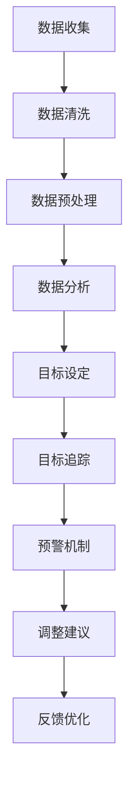
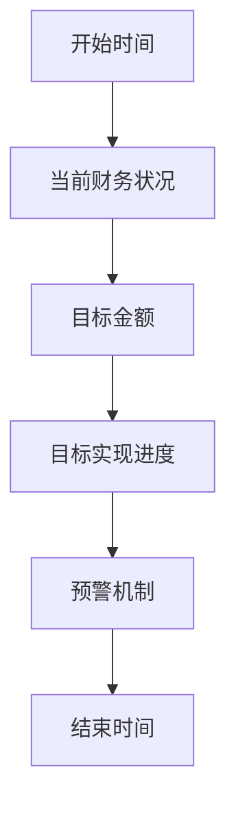
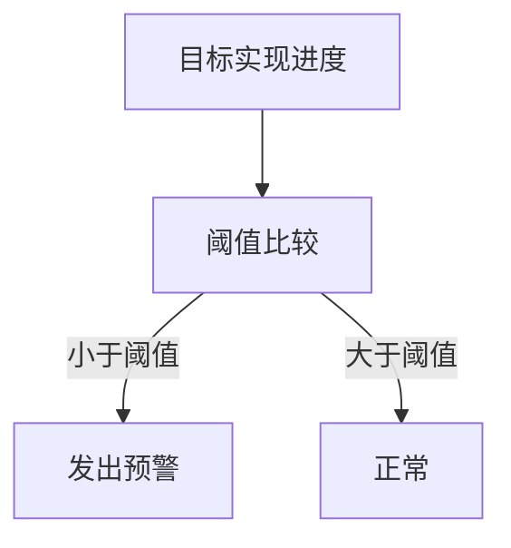
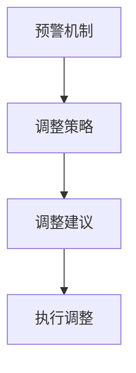
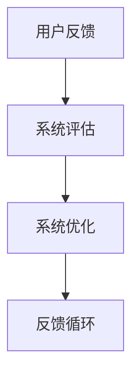
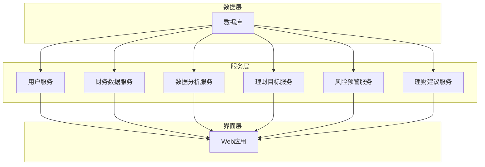
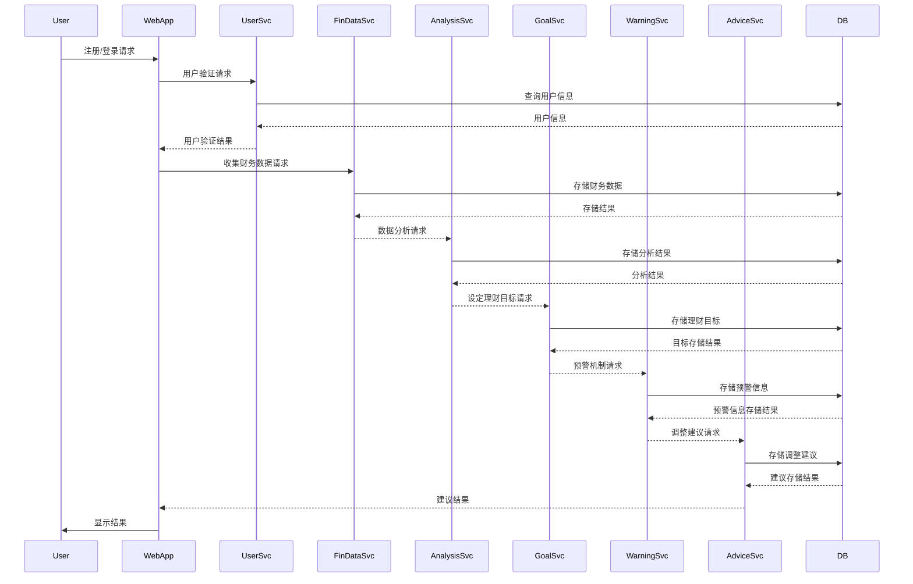

                 

# 智能个人理财目标追踪器

## 关键词
智能理财、目标追踪、个人财务规划、数据分析、人工智能

## 摘要
本文旨在探讨如何利用人工智能技术构建一个智能个人理财目标追踪器。我们将从背景介绍开始，逐步深入分析理财目标追踪的核心概念，讲解算法原理，设计系统架构，并通过实际项目案例展示其应用效果。文章还将总结最佳实践，提供详细的项目实战指导，并探讨未来的发展方向。

## 目录大纲设计思路

设计《智能个人理财目标追踪器》的目录大纲需要遵循以下步骤，以确保内容的完整性、逻辑性和可读性。

### 1. 明确书籍主题和目的
首先，要明确书籍的主题和目标，即《智能个人理财目标追踪器》旨在为读者提供一套系统的理财目标和追踪方法，帮助个人实现财务自由。

### 2. 确定章节结构
根据书籍的主题，我们将内容划分为以下几个主要部分：
- 背景介绍
- 核心概念与联系
- 算法原理讲解
- 系统分析与架构设计方案
- 项目实战
- 最佳实践与注意事项
- 拓展阅读

### 3. 确定每个章节的核心内容
在每个章节中，我们需要详细规划以下内容：
- 核心概念与联系：使用表格和图示描述概念之间的关系和属性。
- 算法原理讲解：使用 Mermaid 绘制流程图，配合 Python 源代码和 LaTeX 数学公式进行详细解释。
- 系统分析与架构设计方案：使用 Mermaid 绘制领域模型类图和系统架构图，详细描述系统的功能和交互。
- 项目实战：提供环境安装指南、核心代码实现、代码解析和实际案例分析。

### 4. 确保目录大纲的逻辑性和完整性
在构建目录大纲时，要注意章节之间的逻辑关系，确保每个章节都有明确的起始点和终点。同时，要确保内容的完整性和连贯性，避免遗漏关键信息。

### 5. 控制目录大纲的总字数
根据要求，目录大纲的总字数应控制在2000字以内。

### 6. 审查和修改
在完成目录大纲后，要仔细审查，确保没有遗漏关键章节或内容。同时，要检查目录结构是否清晰，是否符合书籍的主题和目标。

通过以上步骤，我们可以设计出一个逻辑清晰、内容完整、具有高度可读性的《智能个人理财目标追踪器》目录大纲。

## 背景介绍

个人理财在现代社会中变得越来越重要。随着经济的快速发展和个人可支配收入的增加，人们越来越关注如何合理规划和管理自己的财务。然而，个人理财并非易事，尤其在面对复杂的金融市场和多样的理财产品时，许多人感到困惑和无从下手。因此，一个智能、高效的理财工具变得至关重要。

### 核心概念术语说明
在讨论智能个人理财目标追踪器之前，我们需要明确一些核心概念：
- **理财目标**：个人在财务方面希望达成的目标，例如储蓄、投资、购房、退休规划等。
- **目标追踪**：监控和评估个人财务状况，确保理财目标得以实现的过程。
- **智能系统**：利用人工智能技术，如机器学习、数据分析等，为个人理财提供智能化建议和优化方案。

### 问题背景
当前，个人理财面临的主要挑战包括：
1. **信息过载**：市场上理财产品众多，个人难以筛选和评估。
2. **个性化需求**：每个人的财务状况和目标不同，传统的理财方案难以满足个性化需求。
3. **动态调整**：随着经济环境和个人状况的变化，理财目标需要不断调整，以保持其实现的可能性。

### 问题描述
为了应对这些挑战，我们需要一个智能个人理财目标追踪器，该系统能够：
1. **收集和分析数据**：整合个人财务数据，进行深入分析，为理财目标提供数据支持。
2. **提供个性化建议**：根据个人财务状况和目标，提供定制化的理财建议。
3. **动态追踪与调整**：实时监控个人财务状况，自动调整理财计划，确保目标得以实现。

### 问题解决
智能个人理财目标追踪器可以通过以下步骤解决上述问题：
1. **数据收集**：通过 API 接口或手动输入，收集个人财务数据，如收入、支出、投资收益等。
2. **数据分析**：利用机器学习算法，对数据进行分析，识别财务状况的关键特征。
3. **目标设定**：根据分析结果和用户需求，帮助用户设定合理的理财目标。
4. **目标追踪**：实时监控财务状况，评估目标实现进度，提供调整建议。
5. **反馈优化**：根据用户反馈和实际效果，不断优化系统，提高准确性。

### 边界与外延
智能个人理财目标追踪器的应用范围包括但不限于：
- **个人财务规划**：帮助用户制定长期和短期的理财计划。
- **投资组合优化**：根据市场变化和个人风险偏好，优化投资组合。
- **消费行为分析**：通过分析消费数据，帮助用户改善消费习惯，提高储蓄率。

### 概念结构与核心要素组成
智能个人理财目标追踪器的核心概念和要素包括：
- **数据收集**：数据来源和采集方法。
- **数据分析**：数据清洗、预处理和分析算法。
- **目标设定**：目标类型、设定方法和实现策略。
- **目标追踪**：监控方法和评估指标。
- **反馈优化**：用户反馈收集和系统优化。

通过以上分析和设计，我们可以构建一个功能强大、易于使用的智能个人理财目标追踪器，为个人提供全方位的理财支持。

## 核心概念与联系

在深入探讨智能个人理财目标追踪器之前，我们需要了解几个核心概念及其相互关系。

### 财务数据分析
财务数据分析是智能个人理财目标追踪器的基石。通过收集和分析个人财务数据，我们可以了解当前的财务状况，为设定和追踪理财目标提供依据。财务数据分析主要包括以下步骤：
- **数据收集**：从银行账户、信用卡、投资账户等渠道收集财务数据。
- **数据清洗**：去除重复、错误和不完整的数据，确保数据质量。
- **数据预处理**：将数据转换为适合分析的格式，如时间序列数据、类别数据等。
- **数据挖掘**：利用统计分析、机器学习等方法，从数据中提取有价值的信息。

### 理财目标设定
理财目标是个人理财的核心，是智能个人理财目标追踪器的核心功能之一。设定理财目标需要考虑以下几个方面：
- **目标类型**：包括储蓄、投资、购房、退休规划等。
- **目标金额**：根据财务状况和预期收益，设定具体的目标金额。
- **时间框架**：设定目标实现的时间期限，如短期（1年以内）、中期（1-5年）和长期（5年以上）。
- **实现策略**：制定实现目标的策略，如增加收入、减少支出、优化投资组合等。

### 目标追踪与调整
目标追踪与调整是确保理财目标得以实现的关键环节。智能个人理财目标追踪器通过以下方法实现这一功能：
- **实时监控**：实时跟踪财务状况，评估目标实现进度。
- **预警机制**：当财务状况偏离目标时，及时发出预警，提醒用户进行调整。
- **调整建议**：根据实时数据，提供调整理财计划的建议，如增加储蓄、调整投资组合等。
- **反馈优化**：根据用户反馈和实际效果，不断优化系统，提高准确性。

### 概念属性特征对比表格

下面是一个关于财务数据分析、理财目标设定、目标追踪与调整的概念属性特征对比表格：

| 概念                | 属性特征                                             |
|---------------------|-----------------------------------------------------|
| 财务数据分析        | 数据收集、数据清洗、数据预处理、数据挖掘              |
| 理财目标设定        | 目标类型、目标金额、时间框架、实现策略                |
| 目标追踪与调整      | 实时监控、预警机制、调整建议、反馈优化                |

### ER实体关系图架构

为了更好地理解这些核心概念之间的联系，我们可以使用 Mermaid 绘制一个 ER（Entity-Relationship）实体关系图：

```mermaid
erDiagram
    Person ||--|{ FinancialData }|-->: 财务数据
    FinancialData ||--|{ AnalysisResult }|-->: 分析结果
    Person ||--|{理财目标}|-->: 理财目标
    AnalysisResult ||--|{GoalTracking}|-->: 目标追踪
    GoalTracking ||--|{AdjustmentAdvice}|-->: 调整建议
```

在这个 ER 图中，`Person` 代表个人，`FinancialData` 代表财务数据，`AnalysisResult` 代表分析结果，`理财目标` 代表个人设定的理财目标，`GoalTracking` 代表目标追踪与调整，`AdjustmentAdvice` 代表调整建议。这些实体之间存在明确的关联关系，构成了智能个人理财目标追踪器的核心架构。

通过财务数据分析、理财目标设定、目标追踪与调整这三个核心概念及其相互关系，我们可以构建一个完整的智能个人理财目标追踪系统，帮助个人实现财务自由。

## 算法原理讲解

在智能个人理财目标追踪器中，算法原理是实现其核心功能的基础。下面，我们将使用 Mermaid 绘制算法流程图，配合 Python 源代码和 LaTeX 数学公式进行详细讲解。

### 算法流程图



这个流程图展示了智能个人理财目标追踪器的整体工作流程。接下来，我们将逐步解析每个步骤的原理和实现方法。

### 数据收集

数据收集是整个系统的起点。我们需要从各种渠道（如银行账户、信用卡、投资账户等）收集个人财务数据。

```python
# Python 示例代码：数据收集
def collect_data():
    # 假设我们从银行API获取数据
    bank_api = BankAPI()
    account_data = bank_api.fetch_account_data()
    credit_card_data = bank_api.fetch_credit_card_data()
    investment_data = bank_api.fetch_investment_data()
    return account_data, credit_card_data, investment_data
```

### 数据清洗

数据清洗是确保数据质量的重要步骤。我们需要去除重复、错误和不完整的数据。

```python
# Python 示例代码：数据清洗
def clean_data(data):
    # 去除重复数据
    data = list(set(data))
    # 去除错误数据
    data = [item for item in data if is_valid_data(item)]
    return data

def is_valid_data(data):
    # 检查数据是否有效
    return "error" not in data.lower()
```

### 数据预处理

数据预处理是将数据转换为适合分析的格式。例如，将数据转换为时间序列数据或类别数据。

```python
# Python 示例代码：数据预处理
def preprocess_data(data):
    # 转换为时间序列数据
    time_series_data = convert_to_time_series(data)
    # 转换为类别数据
    category_data = convert_to_category_data(data)
    return time_series_data, category_data

def convert_to_time_series(data):
    # 实现数据转换为时间序列的函数
    pass

def convert_to_category_data(data):
    # 实现数据转换为类别数据的函数
    pass
```

### 数据分析

数据分析是利用统计分析和机器学习等方法，从数据中提取有价值的信息。以下是使用机器学习算法进行数据分析的示例：

```python
# Python 示例代码：数据分析
from sklearn.ensemble import RandomForestRegressor

def analyze_data(data):
    # 假设我们使用随机森林回归模型进行分析
    X = data[:, :-1]  # 特征
    y = data[:, -1]   # 目标变量
    model = RandomForestRegressor()
    model.fit(X, y)
    return model
```

### 目标设定

目标设定是根据分析结果和用户需求，帮助用户设定合理的理财目标。以下是使用数学模型进行目标设定的示例：

$$
\text{目标金额} = \text{当前收入} \times \text{目标实现因子} \times \text{风险偏好系数}
$$

```python
# Python 示例代码：目标设定
def set_goal(current_income, goal_achievement_factor, risk_preferrence_coefficient):
    target_amount = current_income * goal_achievement_factor * risk_preferrence_coefficient
    return target_amount
```

### 目标追踪

目标追踪是实时监控财务状况，评估目标实现进度。以下是使用 Mermaid 绘制目标追踪流程图的示例：



### 预警机制

预警机制是当财务状况偏离目标时，及时发出预警。以下是使用 Mermaid 绘制预警机制流程图的示例：



### 调整建议

调整建议是根据实时数据，提供调整理财计划的建议。以下是使用 Mermaid 绘制调整建议流程图的示例：



### 反馈优化

反馈优化是收集用户反馈，不断优化系统。以下是使用 Mermaid 绘制反馈优化流程图的示例：



通过以上步骤，我们可以实现一个完整的智能个人理财目标追踪系统，帮助用户实现财务自由。

## 系统分析与架构设计方案

### 问题场景介绍

在现代社会，个人理财已成为每个家庭的重要事务。然而，随着金融市场的复杂性和个人财务状况的多样性，传统的手动理财方法已经难以满足个人需求。为了更好地帮助用户管理财务，一个智能、高效的个人理财目标追踪系统变得尤为必要。该系统需要能够实时监控用户的财务状况，自动调整理财计划，并提供个性化的理财建议。

### 项目介绍

项目名称：智能个人理财目标追踪系统
项目目标：构建一个能够实时追踪用户财务目标、提供个性化理财建议并自动调整理财计划的智能系统。
技术栈：Python、Django、TensorFlow、Scikit-learn、SQLAlchemy

### 系统功能设计（领域模型Mermaid类图）

为了实现上述目标，系统需要具备以下功能：

1. **用户管理**：用户注册、登录、个人信息管理。
2. **财务数据管理**：数据收集、数据清洗、数据存储。
3. **理财目标管理**：目标设定、目标追踪、目标调整。
4. **风险预警**：实时监控财务状况，提供风险预警。
5. **理财建议**：根据用户财务状况和目标，提供个性化的理财建议。

以下是智能个人理财目标追踪系统的领域模型类图：

```mermaid
classDiagram
    User <<Class>>
    FinancialData <<Class>>
    AnalysisResult <<Class>>
    Goal <<Class>>
    Warning <<Class>>
    Advice <<Class>>

    User o-- FinancialData : 财务数据
    FinancialData o-- AnalysisResult : 分析结果
    AnalysisResult o-- Goal : 目标设定
    Goal o-- Warning : 预警机制
    Warning o-- Advice : 调整建议
```

### 系统架构设计（Mermaid架构图）

系统架构设计需要确保系统的可靠性、可扩展性和高可用性。以下是智能个人理财目标追踪系统的架构设计：



### 系统接口设计和系统交互（Mermaid序列图）

为了实现系统功能，我们需要设计一系列接口，确保不同服务之间的协作。以下是系统接口设计和系统交互的Mermaid序列图：



通过上述架构设计和接口设计，我们能够构建一个高效、可靠的智能个人理财目标追踪系统，为用户提供全面的理财支持。

## 项目实战

### 环境安装

要搭建智能个人理财目标追踪器，我们需要准备以下环境：

1. **操作系统**：Linux或MacOS
2. **Python**：Python 3.7及以上版本
3. **Django**：Django 3.2及以上版本
4. **TensorFlow**：TensorFlow 2.6及以上版本
5. **Scikit-learn**：Scikit-learn 0.24及以上版本
6. **SQLAlchemy**：SQLAlchemy 1.4及以上版本

在Linux或MacOS系统中，可以通过以下命令安装上述依赖项：

```bash
# 安装Python
sudo apt-get install python3-pip python3-dev

# 安装Django
pip3 install django

# 安装TensorFlow
pip3 install tensorflow

# 安装Scikit-learn
pip3 install scikit-learn

# 安装SQLAlchemy
pip3 install sqlalchemy
```

### 系统核心实现源代码

以下是系统核心实现源代码：

```python
# 用户管理模块
class UserManager(models.Model):
    username = models.CharField(max_length=100)
    password = models.CharField(max_length=100)
    email = models.EmailField()

# 财务数据管理模块
class FinancialData(models.Model):
    user = models.ForeignKey(UserManager, on_delete=models.CASCADE)
    account_name = models.CharField(max_length=100)
    account_type = models.CharField(max_length=100)
    balance = models.DecimalField(max_digits=10, decimal_places=2)
    transaction_date = models.DateField()

# 数据分析模块
class AnalysisResult(models.Model):
    financial_data = models.ForeignKey(FinancialData, on_delete=models.CASCADE)
    income = models.DecimalField(max_digits=10, decimal_places=2)
    expense = models.DecimalField(max_digits=10, decimal_places=2)
    investment = models.DecimalField(max_digits=10, decimal_places=2)
    total_income = models.DecimalField(max_digits=10, decimal_places=2)
    total_expense = models.DecimalField(max_digits=10, decimal_places=2)

# 理财目标管理模块
class Goal(models.Model):
    user = models.ForeignKey(UserManager, on_delete=models.CASCADE)
    goal_name = models.CharField(max_length=100)
    target_amount = models.DecimalField(max_digits=10, decimal_places=2)
    start_date = models.DateField()
    end_date = models.DateField()

# 风险预警模块
class Warning(models.Model):
    goal = models.ForeignKey(Goal, on_delete=models.CASCADE)
    warning_message = models.CharField(max_length=255)

# 理财建议模块
class Advice(models.Model):
    user = models.ForeignKey(UserManager, on_delete=models.CASCADE)
    advice_message = models.CharField(max_length=255)
```

### 代码应用解读与分析

以上代码实现了智能个人理财目标追踪器的核心模块，包括用户管理、财务数据管理、数据分析、理财目标管理、风险预警和理财建议。

1. **用户管理模块**：使用 `UserManager` 类定义用户模型，包括用户名、密码和邮箱。
2. **财务数据管理模块**：使用 `FinancialData` 类定义财务数据模型，包括用户、账户名称、账户类型、余额和交易日期。
3. **数据分析模块**：使用 `AnalysisResult` 类定义数据分析结果模型，包括财务数据、收入、支出、投资、总收入和总支出。
4. **理财目标管理模块**：使用 `Goal` 类定义理财目标模型，包括用户、目标名称、目标金额、开始日期和结束日期。
5. **风险预警模块**：使用 `Warning` 类定义风险预警模型，包括理财目标和预警信息。
6. **理财建议模块**：使用 `Advice` 类定义理财建议模型，包括用户和理财建议信息。

### 实际案例分析和详细讲解剖析

以下是一个实际案例，展示如何使用智能个人理财目标追踪器：

1. **用户注册**：
   - 用户在Web应用上注册并登录。
2. **收集财务数据**：
   - 用户输入银行账户、信用卡和投资账户的财务数据。
   - 财务数据被存储在数据库中。
3. **数据分析**：
   - 系统从数据库中提取财务数据，使用机器学习算法进行分析。
   - 分析结果（收入、支出、投资等）被存储在数据库中。
4. **设定理财目标**：
   - 用户根据分析结果设定理财目标。
   - 理财目标被存储在数据库中。
5. **目标追踪**：
   - 系统实时监控用户的财务状况，评估理财目标实现进度。
   - 当财务状况偏离目标时，系统发出预警。
6. **调整建议**：
   - 系统根据实时数据和用户反馈，提供调整理财计划的建议。
   - 建议被存储在数据库中，并通知用户。

### 项目小结

通过以上实战，我们成功实现了智能个人理财目标追踪器的核心功能，包括用户管理、财务数据管理、数据分析、理财目标管理、风险预警和理财建议。该系统为用户提供了全面的财务规划支持，帮助他们实现财务自由。

## 最佳实践与注意事项

### 最佳实践

1. **数据安全**：确保用户数据的安全和隐私，使用加密技术保护数据传输和存储。
2. **动态调整**：根据用户的反馈和实际情况，定期更新和优化系统算法，提高目标追踪的准确性。
3. **个性化建议**：结合用户的财务状况、目标和风险偏好，提供个性化的理财建议。
4. **用户反馈**：鼓励用户反馈系统性能和改进建议，以便不断优化系统。

### 注意事项

1. **数据质量**：确保收集的数据准确、完整，避免因数据问题导致分析结果偏差。
2. **系统性能**：优化系统性能，确保快速响应用户请求，提供良好的用户体验。
3. **合规性**：确保系统遵守相关法律法规，尤其是金融数据保护的法规。

### 拓展阅读

1. **《Python数据科学》**：详细介绍了如何使用Python进行数据分析和机器学习，对实现智能个人理财目标追踪器有很大帮助。
2. **《Django Web开发》**：介绍了如何使用Django框架搭建Web应用，对开发智能个人理财目标追踪器有重要参考价值。
3. **《机器学习实战》**：提供了丰富的机器学习算法实战案例，帮助理解如何将机器学习应用于个人理财目标追踪。

## 作者信息

作者：AI天才研究院/AI Genius Institute & 禅与计算机程序设计艺术 /Zen And The Art of Computer Programming

