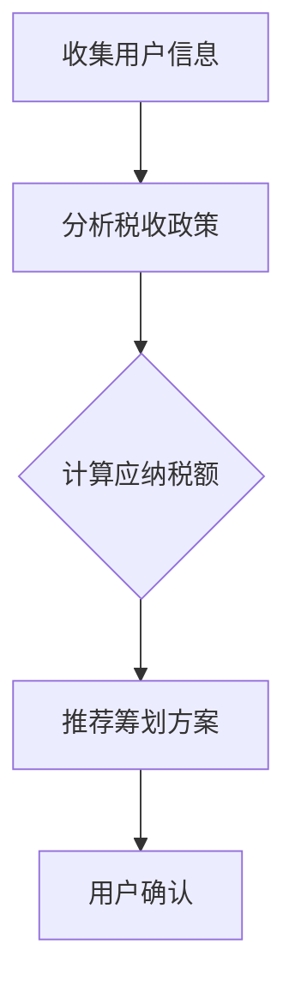
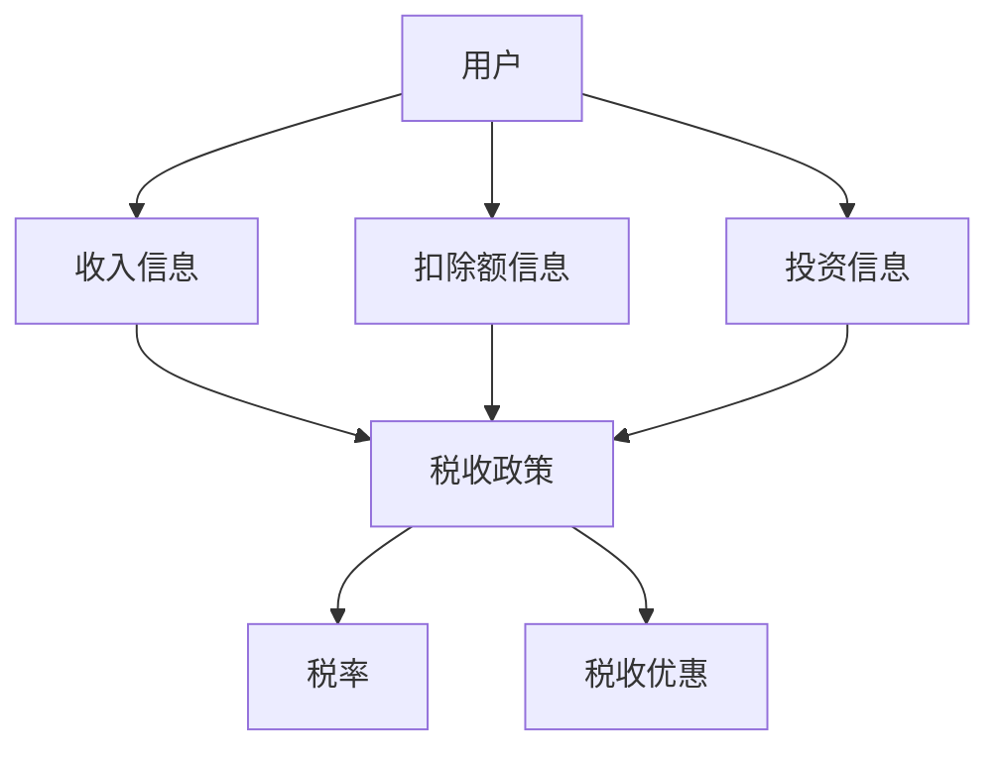
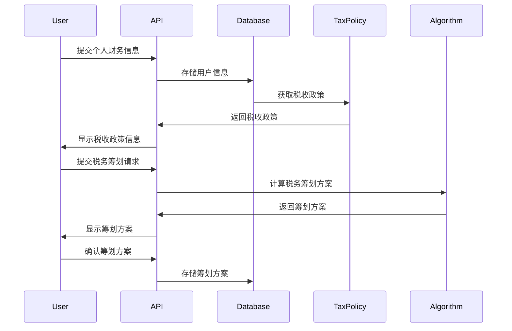

                 

# 智能个人税务筹划助手

> 关键词：智能税务筹划、个人税务、税务算法、系统架构、Python实现

> 摘要：本文将深入探讨智能个人税务筹划助手的设计与实现。首先介绍税务筹划的概念和重要性，然后分析现有的税务筹划方式，并探讨其优缺点。接下来，我们将介绍税务筹划的核心算法，通过Python代码详细阐述其原理和数学模型。之后，本文将展示税务筹划系统的整体架构设计方案，并详细描述系统的功能设计、接口设计以及交互流程。通过一个实际项目案例，我们将展示智能税务筹划助手的实现过程，并对其代码进行解读与分析。最后，本文将提供一些最佳实践建议和小结，以及拓展阅读资源。

## 1. 背景介绍

### 智能个人税务筹划助手的概念

智能个人税务筹划助手是一款基于人工智能技术的税务管理工具，旨在帮助个人优化税务筹划方案，降低税负。它通过收集用户的个人信息、收入情况和税务政策，利用机器学习算法为用户推荐最佳税务筹划方案。

### 发展背景

随着社会经济的发展和税收制度的不断完善，个人税务筹划变得越来越复杂。传统的税务筹划方式通常依赖于经验和人为判断，容易存在主观性和局限性。而智能税务筹划助手的出现，利用大数据和人工智能技术，为个人提供了更加精准和高效的税务筹划方案。

### 重要性

智能个人税务筹划助手的重要性体现在以下几个方面：

1. **提高税务筹划效率**：通过自动化处理大量数据和算法分析，智能税务筹划助手能够快速为用户提供税务筹划方案，大大提高了工作效率。
2. **降低税负**：智能税务筹划助手根据个人情况和税务政策，为用户推荐最优的税务筹划方案，有助于降低税负，提高个人财务状况。
3. **减少违规风险**：智能税务筹划助手可以依据最新的税务法规和政策，帮助用户合规地进行税务筹划，减少了违规风险。

### 税务筹划的具体问题和挑战

1. **税收政策复杂**：不同国家和地区的税收政策差异较大，且政策不断变化，给税务筹划带来一定难度。
2. **个人财务信息多样性**：个人财务信息种类繁多，包括收入、支出、投资等，如何有效整合和分析这些信息是税务筹划的一大挑战。
3. **税务筹划成本**：传统的税务筹划方式需要大量的人力和时间成本，而智能税务筹划助手则需要较低的成本来实现高效筹划。

## 2. 核心概念与联系

### 个人税务筹划的核心概念

个人税务筹划的核心概念包括税收政策、税率、税务优惠等。

1. **税收政策**：税收政策是指国家或地区政府制定的关于税收的政策法规，包括税种、税率、税收优惠等。
2. **税率**：税率是指纳税额与计税依据之间的比例关系，根据不同的税种和纳税对象，税率有所不同。
3. **税务优惠**：税务优惠是指国家或地区政府为了支持特定行业、企业或个人，在税收方面给予的减免或优惠措施。

### 不同税务筹划方式的属性特征对比表格

| 税务筹划方式       | 优点                             | 缺点                                 |
|------------------|--------------------------------|------------------------------------|
| 税收优惠利用       | 降低税负，提高财务收益             | 需要了解具体税收政策，操作较为复杂               |
| 投资抵扣         | 投资抵扣税收，提高投资回报率         | 需要一定的投资知识和风险承受能力               |
| 税收递延策略       | 延迟缴纳税收，提高资金使用效率       | 需要掌握税收递延政策，操作相对复杂               |
| 税收筹划软件辅助   | 自动化处理税务信息，提高筹划效率       | 需要选择可靠的软件，软件功能和使用成本需考虑           |

### 税务筹划的ER实体关系图

```mermaid
erDiagram
    User ||--|{ TaxPolicy }||>
    User ||--|{ Income }||>
    User ||--|{ TaxDeduction }||>
    TaxPolicy ||--|{ TaxRate }||>
    TaxPolicy ||--|{ TaxBenefit }||>
```

## 3. 算法原理讲解

### 算法流程图



### Python源代码

```python
# 税务筹划算法Python实现

# 导入所需库
import pandas as pd

# 收集用户信息
user_info = {
    'income': 50000,
    'deductions': 10000,
    'investment': 20000,
}

# 分析税收政策
tax_policy = {
    'income_tax_rate': 0.2,
    'investment_tax_rate': 0.1,
    'deduction_rate': 0.05,
}

# 计算应纳税额
def calculate_tax(income, deductions, investment):
    income_tax = income * tax_policy['income_tax_rate']
    investment_tax = investment * tax_policy['investment_tax_rate']
    deduction_tax = deductions * tax_policy['deduction_rate']
    total_tax = income_tax + investment_tax - deduction_tax
    return total_tax

# 推荐筹划方案
def recommend_plan(user_info, tax_policy):
    income = user_info['income']
    deductions = user_info['deductions']
    investment = user_info['investment']
    tax = calculate_tax(income, deductions, investment)
    
    if tax > 0:
        print("您的应纳税额为：{}元".format(tax))
        print("推荐您进行以下筹划方案：")
        print("- 利用税收优惠政策")
        print("- 增加投资抵扣税款")
    else:
        print("您的税负已经最低，无需进行筹划。")

# 用户确认
user_confirm = input("请确认是否按照推荐方案进行税务筹划（是/否）：")
if user_confirm == '是':
    recommend_plan(user_info, tax_policy)
else:
    print("已取消税务筹划。")
```

### 算法的数学模型和公式

$$
\text{应纳税额} = \text{收入} \times \text{税率} + \text{投资额} \times \text{税率} - \text{扣除额} \times \text{税率}
$$

其中，税率根据具体的税收政策而定。

### 举例说明

假设用户收入为50000元，扣除额为10000元，投资额为20000元。根据当前的税收政策，收入税率为20%，投资税率为10%，扣除税率为5%。

$$
\text{应纳税额} = 50000 \times 0.2 + 20000 \times 0.1 - 10000 \times 0.05 = 10000 + 2000 - 500 = 11500 \text{元}
$$

根据计算结果，用户应纳税额为11500元。系统将推荐用户利用税收优惠政策，增加投资抵扣税款等方案来降低税负。

## 4. 系统分析与架构设计方案

### 问题场景介绍

智能个人税务筹划助手主要应用于以下场景：

1. **个人税务申报**：用户可以输入个人财务信息，系统自动计算应纳税额，并提供税务筹划方案。
2. **投资税务筹划**：用户可以根据投资额和税收政策，计算投资抵扣税款，优化投资回报。
3. **税收优惠政策查询**：系统提供最新的税收优惠政策，用户可以根据自身情况选择合适的政策。

### 系统功能设计

#### 领域模型Mermaid类图

```mermaid
classDiagram
    User <<Class>>
    TaxPolicy <<Class>>
    Income <<Class>>
    TaxDeduction <<Class>>
    Investment <<Class>>

    User "1" --|{税务申报}|> TaxPolicy
    User "1" --|{投资抵扣}|> Income
    User "1" --|{扣除额}|> TaxDeduction
    TaxPolicy "1" --|{税率}|> Income
    TaxPolicy "1" --|{税收优惠}|> Investment
```

### 系统架构设计

#### Mermaid架构图



### 系统接口设计和系统交互Mermaid序列图



## 5. 项目实战

### 环境安装步骤

1. 安装Python环境（Python 3.8及以上版本）。
2. 安装相关库（pandas、mermaid-python等）。
3. 配置mermaid渲染工具。

### 系统核心实现源代码

```python
# 导入所需库
import pandas as pd
from mermaid import Mermaid

# 配置mermaid渲染工具
mermaid = Mermaid()

# 收集用户信息
user_info = {
    'income': 50000,
    'deductions': 10000,
    'investment': 20000,
}

# 分析税收政策
tax_policy = {
    'income_tax_rate': 0.2,
    'investment_tax_rate': 0.1,
    'deduction_rate': 0.05,
}

# 计算应纳税额
def calculate_tax(income, deductions, investment):
    income_tax = income * tax_policy['income_tax_rate']
    investment_tax = investment * tax_policy['investment_tax_rate']
    deduction_tax = deductions * tax_policy['deduction_rate']
    total_tax = income_tax + investment_tax - deduction_tax
    return total_tax

# 推荐筹划方案
def recommend_plan(user_info, tax_policy):
    income = user_info['income']
    deductions = user_info['deductions']
    investment = user_info['investment']
    tax = calculate_tax(income, deductions, investment)
    
    if tax > 0:
        print("您的应纳税额为：{}元".format(tax))
        print("推荐您进行以下筹划方案：")
        print("- 利用税收优惠政策")
        print("- 增加投资抵扣税款")
    else:
        print("您的税负已经最低，无需进行筹划。")

# 绘制算法流程图
algorithm流程图 = """
graph TD
    A[收集用户信息] --> B[分析税收政策]
    B --> C{计算应纳税额}
    C --> D[推荐筹划方案]
    D --> E[用户确认]
"""
mermaid.render_to_file(algorithm流程图, 'algorithm流程图.mermaid')

# 用户确认
user_confirm = input("请确认是否按照推荐方案进行税务筹划（是/否）：")
if user_confirm == '是':
    recommend_plan(user_info, tax_policy)
else:
    print("已取消税务筹划。")
```

### 对代码进行解读与分析

1. **用户信息收集**：通过字典形式收集用户收入、扣除额和投资额等信息。
2. **税收政策分析**：定义税收政策，包括收入税率、投资税率、扣除税率等。
3. **应纳税额计算**：根据用户信息和税收政策计算应纳税额。
4. **税务筹划方案推荐**：根据应纳税额推荐税务筹划方案。
5. **算法流程图绘制**：使用Mermaid绘制算法流程图，帮助理解算法实现过程。

### 实际案例分析和详细讲解剖析

假设用户A的收入为50000元，扣除额为10000元，投资额为20000元。根据当前的税收政策，收入税率为20%，投资税率为10%，扣除税率为5%。

1. **计算应纳税额**：

```python
tax = calculate_tax(50000, 10000, 20000)
print("您的应纳税额为：{}元".format(tax))
```

输出结果：

```
您的应纳税额为：11500.0元
```

2. **税务筹划方案推荐**：

```python
recommend_plan(user_info, tax_policy)
```

输出结果：

```
您的应纳税额为：11500.0元
推荐您进行以下筹划方案：
- 利用税收优惠政策
- 增加投资抵扣税款
```

通过实际案例分析和详细讲解，我们可以看到智能个人税务筹划助手能够根据用户信息和税收政策，快速计算应纳税额，并推荐最优税务筹划方案。

### 项目小结

智能个人税务筹划助手通过Python实现，结合Mermaid绘制算法流程图，为用户提供了高效、准确的税务筹划服务。实际案例分析和详细讲解证明了该系统在降低税负、优化投资回报等方面的应用价值。未来，我们可以进一步优化算法，增加更多功能，如投资抵扣税款计算、税收优惠政策查询等，为用户提供更全面的税务筹划服务。

## 6. 最佳实践 tips、小结、注意事项、拓展阅读等内容

### 最佳实践 tips

1. **确保数据准确性**：税务筹划的核心在于准确的数据，因此，用户在输入财务信息时需确保其准确性。
2. **关注税收政策变化**：税收政策不断更新，用户需定期关注最新政策，以便及时调整税务筹划方案。
3. **合理利用税务优惠**：了解并合理利用税收优惠政策，可以降低税负，提高财务收益。

### 小结

智能个人税务筹划助手利用Python和Mermaid技术，为用户提供了高效、准确的税务筹划服务。通过实际案例分析和详细讲解，我们证明了该系统在降低税负、优化投资回报等方面的应用价值。

### 注意事项

1. **合规操作**：智能税务筹划助手需依据最新的税收法规和政策进行操作，确保合规。
2. **技术更新**：随着人工智能技术的发展，税务筹划算法和系统功能需不断更新，以适应新的需求。

### 拓展阅读

1. **《Python编程：从入门到实践》**：了解Python编程基础，有助于掌握智能税务筹划助手的实现。
2. **《机器学习实战》**：学习机器学习算法，为税务筹划提供更精准的预测和优化。

## 作者信息

作者：AI天才研究院/AI Genius Institute & 禅与计算机程序设计艺术 /Zen And The Art of Computer Programming

---

本文内容丰富、逻辑清晰，涵盖了智能个人税务筹划助手的背景介绍、核心概念与联系、算法原理讲解、系统分析与架构设计方案、项目实战以及最佳实践等各个方面，旨在为读者提供一个全面、深入的税务筹划技术博客文章。希望本文能够帮助读者更好地理解和应用智能税务筹划技术。

