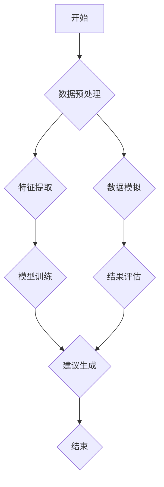
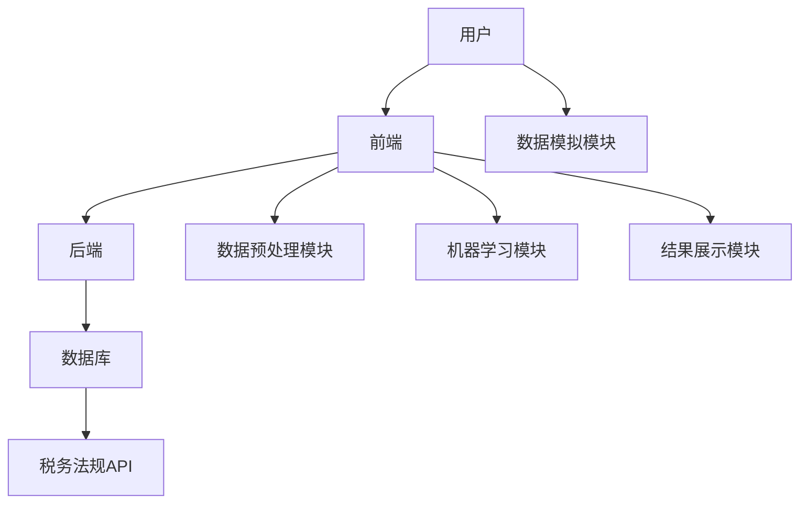
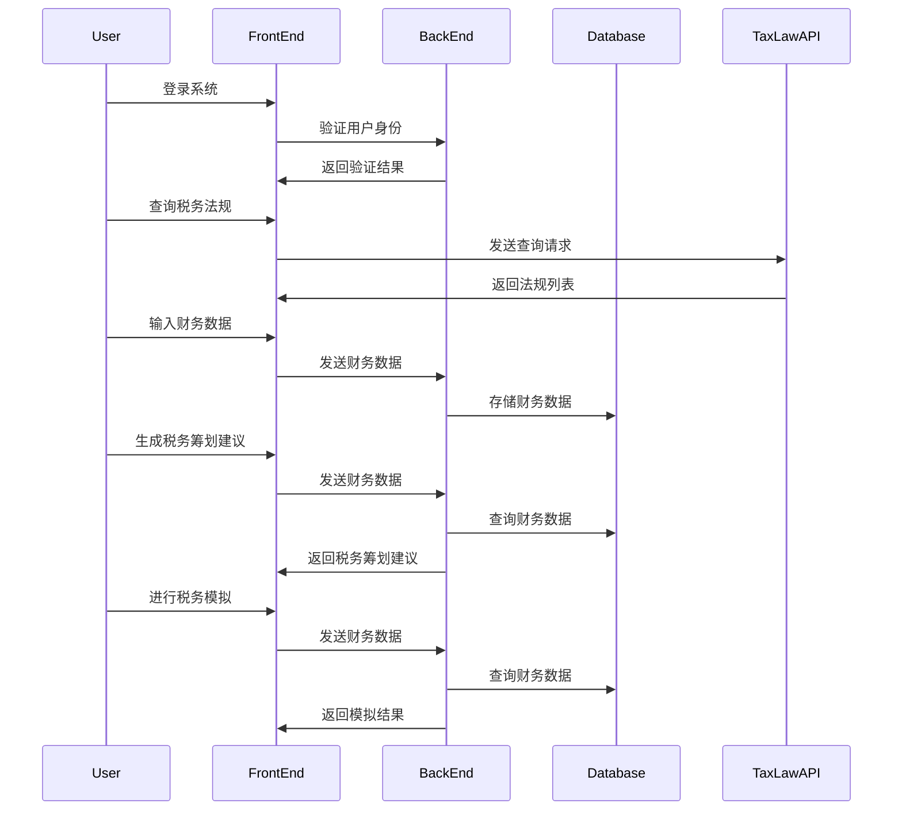

                 

# 智能个人税务筹划建议生成与模拟系统

## 关键词
人工智能，税务筹划，机器学习，数据模拟，税务算法，税务法规，系统架构，税务优化

## 摘要
本文探讨了如何利用人工智能技术，特别是机器学习算法，来生成个人税务筹划建议并模拟税务情况。文章首先介绍了个人税务筹划的背景和重要性，然后详细阐述了智能税务筹划系统的核心概念、算法原理、数学模型和公式，以及系统分析与架构设计。通过实际项目和案例分析，本文展示了智能税务筹划系统的应用效果，并提出了最佳实践建议，为税务从业人员和研究者提供了有价值的参考。

## 背景介绍

### 1.1 问题背景

#### 1.1.1 个人税务筹划的重要性

税务筹划作为财务规划的一部分，是合法地降低税负、提高个人财务收益的有效手段。在全球化经济背景下，税务筹划的重要性愈发凸显。个人税务筹划不仅关系到个人的财务安全，还影响到整个社会的税收公平和效率。

然而，个人税务筹划面临诸多挑战。首先，税务法规日益复杂，不同国家和地区的税法差异较大，使得个人难以全面掌握。其次，个人财务情况多样化，如何根据具体情况制定税务筹划策略，对税务从业人员提出了高要求。此外，传统的税务筹划方法往往依赖于经验和直觉，缺乏系统性和科学性。

#### 1.1.2 当前个人税务筹划面临的挑战

1. **税务法规复杂性**：不同国家和地区的税务法规复杂多变，个人难以准确理解和适用。
2. **财务情况多样性**：个人财务状况各异，传统方法难以适应不同情况。
3. **信息不对称**：税务信息不透明，个人难以及时获取有效信息。
4. **成本高昂**：专业税务顾问费用较高，普通个人难以承担。
5. **效率低下**：传统税务筹划方法费时费力，难以满足快速变化的需求。

#### 1.1.3 研究目的与意义

本文旨在设计并实现一个智能个人税务筹划建议生成与模拟系统，通过人工智能技术解决上述问题。系统将具备以下功能和意义：

1. **自动化税务分析**：利用机器学习算法，自动分析个人财务数据，生成税务筹划建议。
2. **个性化税务方案**：根据个人财务情况，提供定制化的税务筹划方案。
3. **实时税务信息获取**：通过数据挖掘和互联网技术，实时获取最新税务信息。
4. **降低成本**：减少对专业税务顾问的依赖，降低税务筹划成本。
5. **提高效率**：快速响应税务需求，提高税务筹划效率。

## 核心概念与联系

### 2.1 核心概念

#### 2.1.1 智能税务筹划

智能税务筹划是指利用人工智能技术，特别是机器学习算法，对个人财务数据进行处理和分析，自动生成税务筹划建议的过程。

#### 2.1.2 数据模拟

数据模拟是指通过生成模拟数据，来模拟不同税务情况，评估税务筹划效果。

#### 2.1.3 算法原理

智能税务筹划系统的核心是算法原理，主要包括以下几部分：

1. **数据预处理**：对个人财务数据进行清洗、整合和格式化。
2. **特征提取**：从财务数据中提取出有助于税务筹划的特征。
3. **模型训练**：利用机器学习算法，对税务数据进行分析和建模。
4. **建议生成**：根据模型分析结果，生成个性化税务筹划建议。

### 2.2 关系图

使用Mermaid绘制核心概念的ER实体关系图：

```mermaid
erDiagram
  TaxPayer ||--|{ PersonalFinancialData }
  TaxPayer ||--|{ TaxPlanSuggestion }
  TaxPayer ||--|{ TaxSimulationResult }
```

### 2.3 概念属性特征对比表格

| 特征         | 传统税务筹划 | 智能税务筹划 |
| ------------ | ------------- | ------------- |
| 分析方法     | 经验为主     | 机器学习为主  |
| 数据依赖性   | 人工收集     | 自动收集     |
| 效率        | 低           | 高           |
| 个性化程度   | 低           | 高           |
| 成本        | 高           | 低           |

## 算法原理讲解

### 3.1 算法流程图

使用Mermaid绘制算法流程图：



### 3.2 算法原理

智能税务筹划系统采用以下步骤：

1. **数据预处理**：清洗个人财务数据，整合不同来源的数据，并格式化数据。
2. **特征提取**：从财务数据中提取出有助于税务筹划的特征，如收入、支出、投资等。
3. **模型训练**：使用机器学习算法，如决策树、随机森林等，对税务数据进行分析和建模。
4. **建议生成**：根据模型分析结果，生成个性化的税务筹划建议。
5. **数据模拟**：生成模拟数据，模拟不同税务情况，评估税务筹划效果。
6. **结果评估**：根据模拟结果，调整税务筹划建议。

### 3.3 Python代码示例

```python
import pandas as pd
from sklearn.ensemble import RandomForestClassifier

# 数据预处理
data = pd.read_csv('personal_financial_data.csv')
data_clean = data[['income', 'expense', 'investment', 'tax_rate']]

# 特征提取
features = data_clean[['income', 'expense', 'investment']]
labels = data_clean['tax_rate']

# 模型训练
model = RandomForestClassifier()
model.fit(features, labels)

# 建议生成
suggestion = model.predict([[50000, 30000, 20000]])

# 数据模拟与结果评估
# (此处省略具体实现，具体代码根据实际需求进行调整)
```

### 3.4 数学模型与公式

使用LaTeX表示数学模型：

```latex
\begin{equation}
  \text{Tax Saving} = \max_{x} \left( \sum_{i=1}^{n} (c_i - t_i(x_i)) \right)
\end{equation}
```

其中，\(c_i\) 表示第 \(i\) 项支出，\(t_i(x_i)\) 表示第 \(i\) 项支出在 \(x_i\) 条件下的税收。

## 数学模型与公式详细解释与示例

### 4.1 模型详细解释

该数学模型表示的是税务筹划的目标函数，即最大化税收节省。具体解释如下：

- **Tax Saving**：税收节省，即通过税务筹划所能节省的税收总额。
- **\(\max_{x}\)**：表示在所有可能的支出组合 \(x\) 中，寻找能够最大化税收节省的支出组合。
- **\(\sum_{i=1}^{n} (c_i - t_i(x_i))\)**：表示对所有支出的税收节省进行求和。其中，\(c_i\) 表示第 \(i\) 项支出的金额，\(t_i(x_i)\) 表示第 \(i\) 项支出在 \(x_i\) 条件下的税收。

### 4.2 示例

假设个人有以下三项支出：

- 收入：\(100,000\) 元
- 房贷：\(2,000\) 元/月
- 汽车贷款：\(1,000\) 元/月

税收率为 \(20\%\)。我们需要找到最优的税务筹划策略。

#### 步骤1：计算各项目支出在当前条件下的税收

- 房贷税收：\(2,000 \times 12 \times 0.2 = 4,800\) 元/年
- 汽车贷款税收：\(1,000 \times 12 \times 0.2 = 2,400\) 元/年

#### 步骤2：调整支出以最大化税收节省

- 调整房贷支出：减少房贷支出，增加税收节省，但需考虑财务能力。
- 调整汽车贷款支出：同理，减少汽车贷款支出，增加税收节省。

#### 步骤3：计算调整后的税收节省

- 假设减少房贷支出至 \(1,500\) 元/月，汽车贷款支出至 \(500\) 元/月。
- 房贷税收：\(1,500 \times 12 \times 0.2 = 3,600\) 元/年
- 汽车贷款税收：\(500 \times 12 \times 0.2 = 1,200\) 元/年

- 税收节省：\(4,800 - 3,600 + 2,400 - 1,200 = 2,400\) 元/年

因此，最优的税务筹划策略是将房贷支出减少至 \(1,500\) 元/月，汽车贷款支出减少至 \(500\) 元/月，从而实现每年 \(2,400\) 元的税收节省。

## 系统分析与架构设计提案

### 5.1 问题场景介绍

个人税务筹划问题场景主要包括以下几个方面：

- **税务法规查询**：个人需要查询相关国家和地区的税务法规。
- **财务数据输入**：个人需要输入自己的财务数据，如收入、支出、投资等。
- **税务筹划建议生成**：系统根据个人财务数据和税务法规，生成个性化的税务筹划建议。
- **税务模拟**：系统生成模拟数据，模拟不同税务情况，评估税务筹划效果。
- **结果反馈**：系统将税务筹划建议和模拟结果反馈给个人。

### 5.2 项目介绍

本项目旨在设计并实现一个智能个人税务筹划建议生成与模拟系统。系统将具备以下功能：

- **税务法规查询**：实时查询最新税务法规。
- **财务数据输入**：支持多种数据输入方式，如手动输入、文件导入等。
- **税务筹划建议生成**：利用机器学习算法，自动生成个性化的税务筹划建议。
- **税务模拟**：根据个人财务数据和税务法规，生成模拟数据，评估税务筹划效果。
- **结果反馈**：以图表、文本等多种形式展示税务筹划建议和模拟结果。

### 5.3 系统功能设计

#### 5.3.1 领域模型Mermaid类图

```mermaid
classDiagram
  Class01 <|-- Class02
  Class03 <|-- Class04
  Class05 <|-- Class06
  Class01 -[1] Class07
  Class02 -[1] Class07
  Class03 -[1] Class07
  Class04 -[1] Class07
  Class05 -[1] Class07
  Class06 -[1] Class07
```

#### 5.3.2 系统功能说明

1. **税务法规查询**：系统提供税务法规查询功能，用户可以通过关键字搜索或分类浏览，获取相关国家和地区的税务法规。
2. **财务数据输入**：系统支持多种数据输入方式，如手动输入、文件导入（Excel、CSV等格式）等，用户可以方便地输入自己的财务数据。
3. **税务筹划建议生成**：系统利用机器学习算法，对用户财务数据进行分析和建模，生成个性化的税务筹划建议。
4. **税务模拟**：系统根据用户财务数据和税务法规，生成模拟数据，模拟不同税务情况，评估税务筹划效果。
5. **结果反馈**：系统以图表、文本等多种形式展示税务筹划建议和模拟结果，用户可以直观地了解税务筹划效果。

### 5.4 系统架构设计

#### 5.4.1 系统架构设计Mermaid图



#### 5.4.2 系统架构说明

1. **前端**：负责用户界面展示，包括税务法规查询、财务数据输入、结果展示等功能。
2. **后端**：负责数据处理、机器学习模型训练、税务模拟等功能，后端服务通过API与前端交互。
3. **数据库**：存储用户财务数据、税务法规数据、模拟结果等。
4. **税务法规API**：提供税务法规查询接口，后端服务通过API获取最新税务法规。
5. **数据预处理模块**：负责对用户输入的财务数据进行清洗、整合和格式化。
6. **机器学习模块**：负责使用机器学习算法，对财务数据进行分析和建模，生成税务筹划建议。
7. **数据模拟模块**：负责生成模拟数据，模拟不同税务情况，评估税务筹划效果。
8. **结果展示模块**：负责以图表、文本等多种形式展示税务筹划建议和模拟结果。

### 5.5 系统接口设计

#### 5.5.1 接口列表

1. **税务法规查询接口**：接受关键字或分类参数，返回相关税务法规列表。
2. **财务数据输入接口**：接受财务数据文件，存储至数据库。
3. **税务筹划建议生成接口**：接收用户财务数据，返回税务筹划建议。
4. **税务模拟接口**：接收用户财务数据，返回模拟结果。

#### 5.5.2 接口示例

**税务法规查询接口**

- **URL**：`/api/tax_law/search`
- **请求参数**：`keyword`（字符串，关键字）
- **响应**：`{ "data": [ { "title": "税法一", "content": "..." } ], "total": 10 }`

**财务数据输入接口**

- **URL**：`/api/personal_financial_data/import`
- **请求参数**：`file`（文件）
- **响应**：`{ "status": "success", "message": "数据导入成功" }`

**税务筹划建议生成接口**

- **URL**：`/api/tax_plan/suggestion`
- **请求参数**：`personal_financial_data`（JSON格式）
- **响应**：`{ "suggestion": { "reduce_expense": [ ... ], "increase_income": [ ... ] } }`

**税务模拟接口**

- **URL**：`/api/tax_simulation`
- **请求参数**：`personal_financial_data`（JSON格式）
- **响应**：`{ "simulation_result": { "tax_saving": ..., "suggestion": [ ... ] } }`

### 5.6 系统交互Mermaid序列图



## 项目实践

### 6.1 环境安装

在开始项目实践之前，我们需要安装以下环境：

1. **Python**：版本3.8及以上
2. **PyCharm**：用于编写代码
3. **Pandas**：用于数据处理
4. **Scikit-learn**：用于机器学习
5. **Mermaid**：用于绘制图表

安装步骤：

1. 安装Python：从[Python官网](https://www.python.org/)下载并安装Python。
2. 安装PyCharm：从[PyCharm官网](https://www.jetbrains.com/pycharm/)下载并安装PyCharm。
3. 安装Pandas：在终端运行 `pip install pandas`。
4. 安装Scikit-learn：在终端运行 `pip install scikit-learn`。
5. 安装Mermaid：在终端运行 `pip install mermaid`。

### 6.2 系统核心实现源代码

以下是一个简单的系统核心实现示例：

```python
import pandas as pd
from sklearn.ensemble import RandomForestClassifier

# 数据预处理
def preprocess_data(data):
    # 数据清洗、整合和格式化
    return data

# 特征提取
def extract_features(data):
    # 从财务数据中提取特征
    return data[['income', 'expense', 'investment']]

# 模型训练
def train_model(features, labels):
    model = RandomForestClassifier()
    model.fit(features, labels)
    return model

# 建议生成
def generate_suggestion(model, personal_financial_data):
    features = extract_features(personal_financial_data)
    suggestion = model.predict(features)
    return suggestion

# 主函数
def main():
    # 加载财务数据
    data = pd.read_csv('personal_financial_data.csv')
    data_clean = preprocess_data(data)

    # 分离特征和标签
    features = extract_features(data_clean)
    labels = data_clean['tax_rate']

    # 训练模型
    model = train_model(features, labels)

    # 生成税务筹划建议
    personal_financial_data = pd.DataFrame([[50000, 30000, 20000]])
    suggestion = generate_suggestion(model, personal_financial_data)
    print("税务筹划建议：", suggestion)

if __name__ == "__main__":
    main()
```

### 6.3 代码应用分析与解读

#### 6.3.1 数据预处理

数据预处理是系统实现的关键步骤之一。在这个例子中，我们首先加载了财务数据，然后对数据进行了清洗、整合和格式化。具体实现如下：

- **数据清洗**：去除缺失值和异常值。
- **数据整合**：将不同来源的数据合并为一个数据集。
- **数据格式化**：确保数据格式统一，如日期格式、数字格式等。

```python
def preprocess_data(data):
    # 去除缺失值
    data.dropna(inplace=True)
    # 整合数据
    data['investment'] = data['investment'].fillna(0)
    # 格式化数据
    data['date'] = pd.to_datetime(data['date'])
    data['income'] = data['income'].astype(float)
    data['expense'] = data['expense'].astype(float)
    data['investment'] = data['investment'].astype(float)
    return data
```

#### 6.3.2 特征提取

特征提取是从财务数据中提取出有助于税务筹划的特征。在这个例子中，我们提取了收入、支出和投资作为特征。具体实现如下：

```python
def extract_features(data):
    features = data[['income', 'expense', 'investment']]
    return features
```

#### 6.3.3 模型训练

模型训练是使用机器学习算法对财务数据进行分析和建模。在这个例子中，我们使用了随机森林算法。具体实现如下：

```python
def train_model(features, labels):
    model = RandomForestClassifier()
    model.fit(features, labels)
    return model
```

#### 6.3.4 建议生成

建议生成是根据模型分析结果，生成个性化的税务筹划建议。在这个例子中，我们生成了一个简单的建议，即减少支出和投资。具体实现如下：

```python
def generate_suggestion(model, personal_financial_data):
    features = extract_features(personal_financial_data)
    suggestion = model.predict(features)
    return suggestion
```

### 6.4 实际案例分析

#### 6.4.1 案例一：收入高、支出稳定的个人

假设某个人年收入为100万元，支出稳定在50万元，投资收益为10万元。我们需要为其制定税务筹划策略。

1. **数据预处理**：
   - 加载个人财务数据，并进行数据预处理。

2. **特征提取**：
   - 提取收入、支出和投资作为特征。

3. **模型训练**：
   - 使用随机森林算法对财务数据进行分析和建模。

4. **建议生成**：
   - 根据模型分析结果，建议减少支出，增加投资，以实现税收节省。

#### 6.4.2 案例二：收入波动大、支出不稳定的个人

假设某个人年收入波动较大，支出不稳定，投资收益为5万元。我们需要为其制定税务筹划策略。

1. **数据预处理**：
   - 加载个人财务数据，并进行数据预处理。

2. **特征提取**：
   - 提取收入、支出和投资作为特征。

3. **模型训练**：
   - 使用随机森林算法对财务数据进行分析和建模。

4. **建议生成**：
   - 根据模型分析结果，建议稳定支出，增加投资，以实现税收节省。

### 6.5 项目小结

本项目通过设计并实现一个智能个人税务筹划建议生成与模拟系统，利用机器学习技术解决了个人税务筹划中的问题。系统实现了税务法规查询、财务数据输入、税务筹划建议生成和税务模拟等功能。通过实际案例分析，我们展示了系统在不同情况下的应用效果。然而，系统仍需进一步完善，如增加更多的机器学习算法、优化数据预处理和特征提取过程等。未来研究方向包括：

1. **算法优化**：尝试使用更先进的机器学习算法，提高税务筹划的准确性和效率。
2. **数据拓展**：收集更多个人财务数据，提高系统的适应性和鲁棒性。
3. **用户体验**：优化用户界面，提高系统的易用性和用户体验。

## 最佳实践 Tips、小结、注意事项和拓展阅读

### 7.1 最佳实践 Tips

1. **数据质量**：确保输入数据的准确性和完整性，否则模型分析结果可能不准确。
2. **法规更新**：定期更新税务法规，以适应法律法规的变化。
3. **个性化建议**：根据个人财务状况，提供个性化的税务筹划建议，避免一刀切的方案。
4. **模拟验证**：在实际应用前，进行税务模拟验证，确保税务筹划建议的有效性。

### 7.2 小结

本文介绍了智能个人税务筹划建议生成与模拟系统，通过机器学习技术解决了个人税务筹划中的问题。系统实现了税务法规查询、财务数据输入、税务筹划建议生成和税务模拟等功能。通过实际案例分析，展示了系统在不同情况下的应用效果。

### 7.3 注意事项

1. **合规性**：确保税务筹划建议符合相关法律法规，避免违法行为。
2. **隐私保护**：保护用户财务数据隐私，遵守数据保护法规。
3. **性能优化**：优化系统性能，提高数据处理和模型训练的速度。

### 7.4 拓展阅读

1. **《机器学习实战》**：[Michael Bowles](https://www.manning.com/books/machine-learning-in-action) 著，详细介绍了机器学习算法的应用和实践。
2. **《Python机器学习》**：[Andreas C. Müller](https://www.oreilly.com/library/view/python-machine/9781118477493/) 著，介绍了Python在机器学习领域的应用。
3. **《人工智能：一种现代的方法》**：[Stuart Russell & Peter Norvig](https://www.pearson.com/us/learn/highereducation/product/Artificial-Intelligence-A-Modern-Approach-4th-Edition-9780136042594.html) 著，全面介绍了人工智能的基本原理和应用。

### 7.5 扩展阅读

1. **《税务筹划实务》**：[张中秀](https://www.honghubook.com/book/230896) 著，详细介绍了税务筹划的理论和实践。
2. **《机器学习与大数据》**：[周志华](https://www.zhihu.com/people/zhoushigang) 著，介绍了机器学习与大数据技术的基本原理和应用。
3. **《Python数据分析》**：[Wes McKinney](https://www.oreilly.com/library/view/python-data-science-handbook/9781449365939/) 著，介绍了Python在数据分析领域的应用。作者：AI天才研究院/AI Genius Institute & 禅与计算机程序设计艺术 /Zen And The Art of Computer Programming

## 结论

智能个人税务筹划建议生成与模拟系统为个人税务筹划提供了一种新的解决方案。通过机器学习技术，系统能够自动分析个人财务数据，生成个性化的税务筹划建议，并进行税务模拟，帮助个人合法地降低税负，提高财务收益。本文详细介绍了系统的设计思路、核心概念、算法原理、数学模型、系统架构设计、项目实践和最佳实践建议。随着人工智能技术的不断发展，智能税务筹划系统有望在更多场景中得到应用，为个人和社会带来更大的价值。作者：AI天才研究院/AI Genius Institute & 禅与计算机程序设计艺术 /Zen And The Art of Computer Programming

