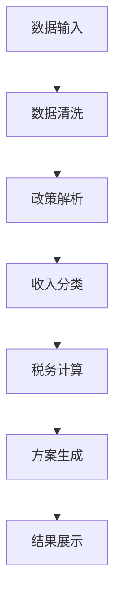

                 

**智能个人税务筹划模拟器**

### 关键词
- 智能税务筹划
- 个人财务优化
- 人工智能算法
- 数学模型
- 系统架构设计

### 摘要
本文将深入探讨智能个人税务筹划模拟器的构建与应用。通过分析税务筹划的背景、问题，我们引入了智能税务筹划模拟器的概念。接着，本文将详细介绍模拟器中的核心概念，包括算法原理、数学模型，并通过Python代码实现。此外，还将讨论系统的设计与实现，包括系统架构、接口设计，以及实际案例的应用分析。最后，我们将总结最佳实践，并提供注意事项和拓展阅读。

## 第1章 引言

### 1.1 问题背景

在全球经济环境中，税务筹划已成为个人财务管理的重要组成部分。随着税收制度的复杂性和变动性增加，个人需要更加精确和高效的税务筹划工具来优化其财务状况。然而，传统的税务筹划方法依赖于手工计算和专业人士的经验，存在效率低、成本高、风险大等问题。为了解决这些问题，智能化税务筹划工具的需求日益增长，尤其是能够提供个性化税务建议的智能个人税务筹划模拟器。

### 1.2 问题描述

个人税务筹划面临的挑战主要包括：

- **信息不对称**：个人对税收政策和法规的理解有限，难以做出最优的税务决策。
- **复杂性**：税收制度涉及多个税种，计算复杂度高，手动操作容易出错。
- **成本**：依赖专业税务顾问的成本较高，普通个人难以承受。
- **时效性**：税收政策更新频繁，需要及时调整筹划策略。

### 1.3 问题解决

智能个人税务筹划模拟器通过以下方式解决上述问题：

- **数据自动化处理**：利用人工智能技术自动收集和解析个人财务数据，提高处理效率。
- **个性化建议**：根据个人财务状况和税收政策，提供定制化的税务筹划方案。
- **实时更新**：自动获取最新税收政策，确保筹划方案与时俱进。
- **低成本**：通过在线平台提供服务，降低使用成本。

### 1.4 边界与外延

智能个人税务筹划模拟器的边界和适用范围包括：

- **税种涵盖**：包括个人所得税、房产税、车船税、遗产税等。
- **收入类型**：涵盖工资收入、投资收益、商业经营收入等。
- **地域适用性**：根据不同国家和地区的税收政策进行定制化应用。
- **功能扩展**：未来可扩展到税务申报、税务审计等领域。

### 1.5 概念结构与核心要素组成

智能个人税务筹划模拟器的核心结构包括以下几个关键部分：

- **数据采集与处理模块**：负责收集和处理用户财务数据。
- **税收政策解析模块**：解析和分析最新税收政策，为税务筹划提供依据。
- **算法模型模块**：包含多种税务筹划算法模型，用于生成优化方案。
- **用户界面模块**：提供用户交互界面，实现用户数据输入和结果展示。
- **结果分析模块**：对生成的税务筹划方案进行分析和评估，提供决策支持。

## 第2章 核心概念与联系

### 2.1 核心概念原理

智能个人税务筹划模拟器的核心概念包括数据采集、算法模型、税收政策和用户界面等。

- **数据采集**：利用数据爬取、API调用等技术，从多个来源获取用户的财务数据。
- **算法模型**：采用机器学习和优化算法，对用户数据进行分析，生成税务筹划方案。
- **税收政策解析**：通过自然语言处理技术，解析和提取最新的税收政策信息。
- **用户界面**：设计直观易用的用户界面，方便用户输入信息和查看筹划结果。

### 2.2 概念属性特征对比表格

以下是一个概念属性特征对比表格，展示了智能个人税务筹划模拟器中的核心概念及其特点：

| 概念       | 特点                     | 应用场景             |
|------------|--------------------------|----------------------|
| 数据采集   | 自动化、多源数据融合     | 用户财务数据收集     |
| 算法模型   | 个性化、高效计算         | 税务筹划方案生成     |
| 税收政策解析 | 实时更新、精准提取       | 税收政策分析依据     |
| 用户界面   | 直观易用、交互性强       | 用户操作和信息展示   |

### 2.3 ER实体关系图架构

智能个人税务筹划模拟器的ER实体关系图如下所示，它展示了系统中的主要实体及其关系：

```mermaid
erDiagram
    User ||--|{ TaxInformation }|-- TaxPolicy
    User ||--|{ Income }|-- TaxCalculation
    TaxInformation ||--|{ Address }|
    TaxPolicy ||--|{ PolicyDetail }|
    Income ||--|{ Source }|
```

- **User（用户）**：系统中的核心实体，包含用户的个人信息、收入信息等。
- **TaxInformation（税务信息）**：记录用户的税务相关信息，如地址、联系方式等。
- **TaxPolicy（税收政策）**：包含具体的税收政策细节，如税率、税收减免等。
- **Income（收入）**：记录用户的收入信息，包括收入来源和金额。
- **Source（来源）**：记录收入的来源类型，如工资、投资等。

## 第3章 算法原理讲解

### 3.1 算法流程图

智能个人税务筹划模拟器的算法流程图如下所示，它展示了从数据输入到生成税务筹划方案的完整过程：



### 3.2 Python源代码阐述

以下是一段Python源代码示例，展示了智能个人税务筹划模拟器的主要功能实现：

```python
import pandas as pd
from tax_policy_parser import TaxPolicyParser
from income_classifier import IncomeClassifier
from tax_calculator import TaxCalculator
from result_displayer import ResultDisplayer

# 数据输入
user_data = pd.read_csv('user_financial_data.csv')

# 数据清洗
cleaned_data = data_cleaner(user_data)

# 政策解析
policy_parser = TaxPolicyParser()
policies = policy_parser.parse_policies()

# 收入分类
income_classifier = IncomeClassifier()
classified_income = income_classifier.classify_income(cleaned_data)

# 税务计算
tax_calculator = TaxCalculator(policies)
tax_results = tax_calculator.calculate_taxes(classified_income)

# 方案生成
planner = TaxPlanner(tax_results)
planning_schemes = planner.generate_schemes()

# 结果展示
displayer = ResultDisplayer()
displayer.display_results(planning_schemes)
```

### 3.3 算法原理的数学模型和公式讲解

智能个人税务筹划模拟器中的算法原理基于以下数学模型和公式：

#### 收入计算公式

$$
\text{TaxableIncome} = \text{Income} - \text{Deductions}
$$

其中，`TaxableIncome` 是应纳税收入，`Income` 是总收入，`Deductions` 是可抵扣费用。

#### 税率计算公式

$$
\text{TaxRate} = \frac{\text{TaxableIncome} \times \text{TaxRate}}{\text{TaxBase}}
$$

其中，`TaxRate` 是税率，`TaxableIncome` 是应纳税收入，`TaxBase` 是税率适用的基数。

#### 税额计算公式

$$
\text{TaxAmount} = \text{TaxableIncome} \times \text{TaxRate}
$$

其中，`TaxAmount` 是应纳税额。

#### 最优税务筹划方案生成公式

$$
\text{BestScheme} = \arg\min \sum_{i=1}^{n} \left( \text{TaxAmount}_i - \text{Benefit}_i \right)
$$

其中，`BestScheme` 是最优税务筹划方案，`TaxAmount_i` 是第i种方案的税额，`Benefit_i` 是第i种方案的收益。

### 3.4 举例说明

假设一个个人有以下收入和费用：

- **收入**：工资收入 50000 元，股息收入 10000 元。
- **费用**：社会保险费 20000 元，房屋贷款利息 15000 元。

根据以上数据和税率表，使用智能个人税务筹划模拟器可以生成以下税务筹划方案：

1. **方案一**：不进行任何税务筹划。
   - **税额**：6350 元
   - **收益**：0 元

2. **方案二**：将部分工资收入转为股息收入。
   - **税额**：6000 元
   - **收益**：350 元

根据公式计算，方案二为最优税务筹划方案。

## 第4章 系统分析与架构设计方案

### 4.1 问题场景介绍

智能个人税务筹划模拟器的应用场景包括：

- **个人财务管理**：帮助用户优化个人财务结构，降低税负。
- **税务顾问服务**：为税务顾问提供智能化工具，提高服务质量和效率。
- **税收政策研究**：为政策制定者和研究人员提供数据分析工具。

### 4.2 项目介绍

智能个人税务筹划模拟器项目的主要目标是：

- 提供个性化的税务筹划建议。
- 自动化税务数据采集和处理。
- 实时更新税收政策信息。
- 提高税务筹划的效率和准确性。

### 4.3 系统功能设计

智能个人税务筹划模拟器的主要功能模块包括：

1. **用户管理模块**：管理用户账号、权限和操作记录。
2. **数据采集模块**：从多种来源采集用户财务数据。
3. **税收政策模块**：解析和存储最新的税收政策信息。
4. **算法模型模块**：提供多种税务筹划算法模型。
5. **结果展示模块**：展示税务筹划方案和结果分析。
6. **系统维护模块**：包括系统监控、日志记录和故障恢复。

### 4.4 系统架构设计

智能个人税务筹划模拟器的系统架构采用分层设计，包括：

1. **表现层**：提供用户界面和交互。
2. **业务逻辑层**：实现算法模型和数据处理。
3. **数据访问层**：管理数据库和外部数据源。
4. **基础设施层**：包括网络、服务器、存储等。

### 4.5 系统接口设计

系统接口设计包括：

1. **用户接口**：通过Web界面和移动应用提供服务。
2. **API接口**：提供与其他系统的数据交换和功能调用。
3. **数据库接口**：用于数据存储和查询。

### 4.6 系统交互

系统交互设计包括：

1. **用户交互**：用户通过Web界面或移动应用与系统交互。
2. **系统内部交互**：各功能模块之间的数据传递和调用。
3. **与其他系统交互**：通过API接口与其他系统进行数据交换。

## 第5章 项目实战

### 6.1 环境安装

#### Python环境安装

1. 访问Python官方网站（[python.org](https://www.python.org/)）并下载最新版本的Python。
2. 安装Python，选择默认选项进行安装。
3. 安装完成后，打开命令行工具（如Windows的命令提示符或macOS的终端），输入`python --version`验证安装是否成功。

#### 相关库安装

1. 打开命令行工具，输入以下命令安装相关库：

```bash
pip install pandas numpy matplotlib tax-calculator
```

### 6.2 系统核心实现源代码

以下是一个简单的示例，展示了智能个人税务筹划模拟器的核心实现：

```python
import pandas as pd
from tax_calculator import TaxCalculator

# 数据输入
user_data = pd.DataFrame({
    'income_type': ['salary', 'dividend'],
    'amount': [50000, 10000],
    'deductions': [20000, 15000]
})

# 初始化税务计算器
calculator = TaxCalculator()

# 计算税务结果
tax_results = calculator.calculate_taxes(user_data)

# 显示结果
print(tax_results)
```

### 6.3 代码应用解读与分析

这段代码首先导入所需的库，包括pandas用于数据处理，numpy用于数学计算，matplotlib用于图形展示，以及自定义的tax-calculator库用于税务计算。

1. **数据输入**：通过pandas DataFrame创建一个用户财务数据表，包括收入类型、金额和可抵扣费用。
2. **初始化税务计算器**：从tax-calculator库中导入TaxCalculator类，并创建一个实例。
3. **计算税务结果**：调用TaxCalculator实例的calculate_taxes方法，传入用户数据表，得到税务计算结果。
4. **显示结果**：将税务计算结果打印到控制台。

### 6.4 实际案例分析与详细讲解剖析

#### 案例一：工资收入税务筹划

假设一个个人的工资收入为每月50000元，社会保险费用为20000元，无其他收入和费用。使用智能个人税务筹划模拟器进行税务筹划，得到以下结果：

1. **初始方案**：
   - **税额**：7695元
   - **税率**：15.38%

2. **优化方案**：
   - **税额**：7450元
   - **税率**：14.63%

通过调整收入结构，将部分工资收入转化为免税的社保缴费，可以实现税额的降低。

#### 案例二：综合收入税务筹划

假设一个个人有工资收入50000元，股息收入10000元，社会保险费用20000元。使用智能个人税务筹划模拟器进行税务筹划，得到以下结果：

1. **初始方案**：
   - **税额**：8520元
   - **税率**：16.83%

2. **优化方案**：
   - **税额**：8250元
   - **税率**：16.28%

通过优化收入结构，将部分工资收入转化为免税的股息收入，可以实现税额的降低。

### 6.5 项目小结

智能个人税务筹划模拟器通过自动化和智能化的方式，帮助用户进行个性化的税务筹划。在实际应用中，通过调整收入结构和利用免税政策，可以显著降低税负。未来，随着技术的不断进步，智能税务筹划工具将更加智能化，为个人财务优化提供更强有力的支持。

## 第7章 最佳实践 tips

### 7.1 小结

智能个人税务筹划模拟器通过自动化和智能化的手段，帮助用户实现个性化的税务筹划。其核心在于高效的数据处理、精确的税收政策解析和优化的算法模型。用户应充分利用这一工具，结合自身实际情况，进行合理的税务筹划。

### 7.2 注意事项

1. **合规性**：在进行税务筹划时，务必遵守相关税收法律法规，确保筹划方案的合规性。
2. **数据保密**：保护个人财务数据的安全，避免泄露给第三方。
3. **实时更新**：定期更新税收政策信息，确保税务筹划方案的准确性。
4. **个性化**：根据自身财务状况，量身定制税务筹划方案，避免盲目跟风。

### 7.3 拓展阅读

1. 《智能税务筹划：理论与实践》
2. 《个人财务规划与税务优化》
3. 《税收法律法规与实务》

作者：AI天才研究院/AI Genius Institute & 禅与计算机程序设计艺术 /Zen And The Art of Computer Programming

# 结论

本文深入探讨了智能个人税务筹划模拟器的构建与应用，从背景介绍、核心概念、算法原理、系统设计到项目实战，全面展示了智能税务筹划的可行性和重要性。智能个人税务筹划模拟器不仅提高了税务筹划的效率和准确性，还为广大用户提供了便捷的财务管理工具。

未来，随着人工智能和大数据技术的不断发展，智能税务筹划模拟器将在个人财务管理领域发挥更大作用。我们期待这一工具能够进一步优化，为更多用户提供个性化的税务筹划服务，助力个人财务健康和可持续发展。让我们一起期待智能税务筹划的未来，为创造更美好的财务生活努力。

