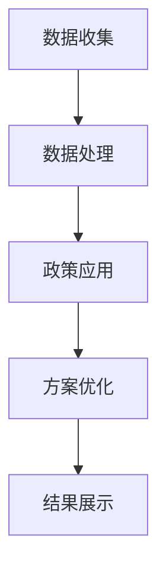
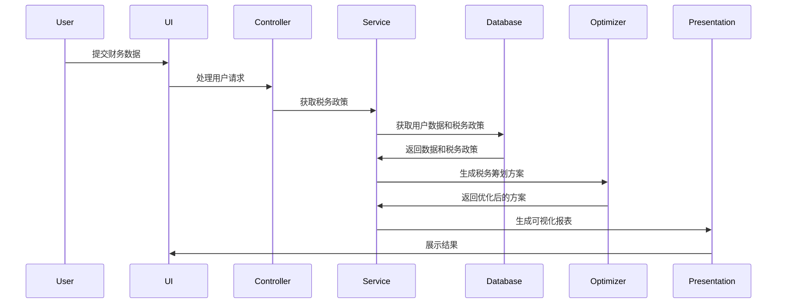
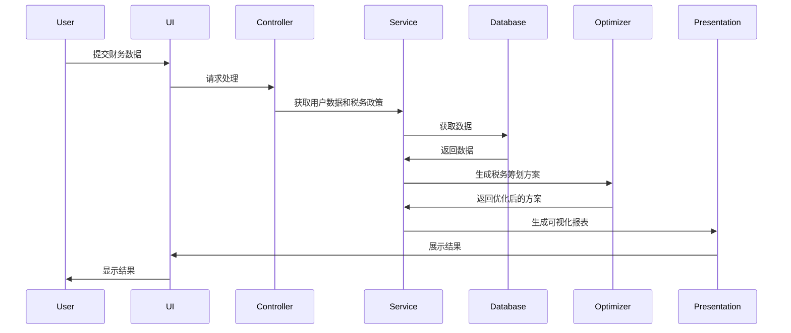

                 

### 1. 引言

### 1.1 问题背景

随着经济全球化的发展和个人财务管理的日益复杂化，个人税务筹划成为了现代财务规划中不可或缺的一部分。传统的税务筹划往往依赖于经验丰富的财务顾问，这不仅耗时耗力，而且成本较高。然而，随着人工智能技术的迅猛发展，利用智能技术来实现个人税务筹划的模拟平台逐渐成为一种新的趋势。智能个人税务筹划模拟平台旨在通过算法和数据分析，帮助用户快速、准确地进行税务筹划，优化个人财务状况。

### 1.2 问题描述

智能个人税务筹划模拟平台的目的是为用户提供一个方便、高效的税务筹划工具。用户通过平台可以模拟不同的税务政策、税率变化和财务安排，从而找到最优的税务筹划方案。然而，实现这一目标面临诸多挑战，包括税务政策的复杂性、数据处理的难度以及算法设计的创新性等。

### 1.3 问题解决

为了解决上述问题，智能个人税务筹划模拟平台需要具备以下几个关键功能：

1. **数据收集与处理**：平台需要能够收集并处理用户的各种财务数据，如收入、支出、投资收益等，确保数据的准确性和完整性。
2. **算法设计**：平台需要设计高效的算法，以便在大量数据中快速找到最优税务筹划方案。
3. **用户界面**：平台需要提供一个直观、易用的用户界面，使用户能够轻松地进行税务模拟和调整。
4. **政策解析与更新**：平台需要能够及时更新税务政策，确保模拟结果的准确性。

### 1.4 边界与外延

智能个人税务筹划模拟平台的边界主要涉及以下几个方面：

1. **地域限制**：不同国家和地区的税务政策存在差异，平台需要针对特定地区进行定制化设计。
2. **法规遵循**：平台需要遵守相关法律法规，确保用户数据的安全性和隐私保护。
3. **功能扩展**：平台需要具备一定的扩展性，以适应未来税务政策的变化和技术发展。

### 1.5 概念结构与核心要素组成

智能个人税务筹划模拟平台的核心要素包括：

1. **数据层**：负责数据的收集、存储和处理。
2. **算法层**：设计并实现税务筹划的算法，包括数据分析、模式识别和优化策略等。
3. **应用层**：为用户提供界面和服务，实现用户交互和数据展示。
4. **接口层**：提供与其他系统和工具的接口，实现数据交换和功能扩展。

### 1.6 本章小结

本文首先介绍了智能个人税务筹划模拟平台的背景和问题，分析了平台的目标和实现难点，并明确了平台的边界与外延。接下来，我们将进一步探讨平台的核心概念、功能和工作原理，为后续内容的深入分析奠定基础。

### 1.6 本章小结

在本章中，我们简要介绍了智能个人税务筹划模拟平台的背景、目标以及面临的主要挑战。通过明确平台的边界与外延，我们为后续内容的深入探讨奠定了基础。在接下来的章节中，我们将对智能个人税务筹划模拟平台的核心概念、功能模块和工作原理进行详细分析，以便更好地理解平台的运作机制和实现方法。

## 2. 智能个人税务筹划模拟平台概述

### 2.1 平台定义

智能个人税务筹划模拟平台是一种基于人工智能技术的在线工具，旨在帮助个人用户进行税务筹划。通过模拟不同的税务政策和财务安排，平台能够为用户提供最优的税务筹划方案，从而优化个人财务状况。

### 2.2 平台核心功能

智能个人税务筹划模拟平台的核心功能主要包括以下几个方面：

1. **数据收集与处理**：平台能够自动收集用户的财务数据，如收入、支出、投资收益等，并对其进行清洗、整理和分类。
2. **税务政策模拟**：平台能够根据用户的财务数据和当前税务政策，模拟不同的税务筹划方案，包括税率调整、税种优化等。
3. **优化策略推荐**：基于数据分析和算法优化，平台能够为用户推荐最优的税务筹划方案，帮助用户实现税务负担的最小化和财务收益的最大化。
4. **可视化展示**：平台能够以图表和报表的形式，直观地展示用户的财务状况和税务筹划效果，使用户能够清晰地了解自己的税务安排。

### 2.3 平台工作原理

智能个人税务筹划模拟平台的工作原理主要包括以下几个步骤：

1. **数据输入**：用户通过平台提供的界面输入自己的财务数据，包括收入、支出、投资收益等。
2. **数据处理**：平台对输入的数据进行清洗、整理和分类，确保数据的准确性和完整性。
3. **政策模拟**：平台根据用户的财务数据和当前税务政策，模拟不同的税务筹划方案。
4. **方案优化**：平台利用算法对模拟出的方案进行优化，找出最优的税务筹划方案。
5. **结果展示**：平台以图表和报表的形式，将用户的财务状况和税务筹划效果展示给用户。

### 2.4 平台应用场景

智能个人税务筹划模拟平台可以在多种场景中应用，包括：

1. **个人税务筹划**：用户可以通过平台模拟不同的税务政策和财务安排，找到最优的税务筹划方案。
2. **财务规划**：用户可以利用平台进行财务规划，包括预算制定、投资规划、退休规划等。
3. **企业税务筹划**：企业可以通过平台进行税务筹划，优化企业财务状况，降低税务负担。
4. **教育和培训**：平台可以作为税务教育和培训的工具，帮助用户了解税务政策，提高税务意识。

### 2.5 平台优势

智能个人税务筹划模拟平台具有以下优势：

1. **高效性**：平台能够快速地处理大量财务数据，提供准确的税务筹划方案。
2. **准确性**：平台基于人工智能技术和大数据分析，能够模拟出最符合用户需求的税务筹划方案。
3. **便捷性**：平台提供了一个在线工具，用户可以随时随地使用，无需依赖财务顾问。
4. **个性化**：平台可以根据用户的财务状况和需求，提供个性化的税务筹划方案。

### 2.6 平台局限性

尽管智能个人税务筹划模拟平台具有许多优势，但它也存在一些局限性，包括：

1. **数据限制**：平台的数据来源可能存在限制，无法完全覆盖用户的财务情况。
2. **政策变化**：税务政策会随着时间而变化，平台需要及时更新政策库，以确保模拟结果的准确性。
3. **算法局限**：算法的优化和改进需要大量数据支持和研究投入，平台可能无法完全满足所有用户的需求。

### 2.7 本章小结

在本章中，我们对智能个人税务筹划模拟平台进行了概述，详细介绍了平台的核心功能、工作原理、应用场景、优势以及局限性。这些内容为后续章节的深入分析提供了基础。

## 3. 核心概念与联系

### 3.1 核心概念原理

智能个人税务筹划模拟平台的核心概念主要包括税务政策、财务数据、算法模型和用户交互等。

1. **税务政策**：税务政策是平台进行模拟和优化的基础。不同的税务政策会对用户的税务负担产生显著影响，因此平台需要具备处理多种税务政策的能力。

2. **财务数据**：财务数据是平台进行税务筹划的核心输入。平台需要能够收集、处理和存储用户的财务数据，包括收入、支出、投资收益等。

3. **算法模型**：算法模型是平台进行税务筹划的关键。平台需要设计高效的算法模型，以便在大量数据中快速找到最优的税务筹划方案。

4. **用户交互**：用户交互是平台为用户提供服务的界面。平台需要提供一个直观、易用的用户界面，使用户能够方便地进行数据输入和结果查询。

### 3.2 概念属性特征对比表格

以下是一个简单的概念属性特征对比表格，展示了税务政策、财务数据、算法模型和用户交互四个核心概念的主要特征：

| 概念           | 特征                | 说明                                                                                   |
|----------------|---------------------|----------------------------------------------------------------------------------------|
| 税务政策       | 多样性、时效性、复杂性 | 包含多种税种、税率、优惠政策等，需及时更新。                                       |
| 财务数据       | 完整性、准确性、多样性 | 包括收入、支出、投资收益等，需确保数据准确和完整。                               |
| 算法模型       | 高效性、准确性、灵活性 | 需要处理大量数据，快速找到最优税务筹划方案。                                     |
| 用户交互       | 直观性、易用性、响应性 | 提供方便的用户界面，确保用户能够轻松地进行操作。                                 |

### 3.3 ER实体关系图架构

为了更好地理解智能个人税务筹划模拟平台的核心概念及其关系，我们可以通过ER（Entity-Relationship，实体-关系）图来描述。

以下是一个简化的ER图，展示了税务政策、财务数据、算法模型和用户交互四个核心概念及其关系：

```
[用户] --<提交数据>--> [财务数据]
[税务政策] --<应用>--> [税务筹划方案]
[税务筹划方案] --<生成>--> [财务数据]
[算法模型] --<优化>--> [税务筹划方案]
[用户] --<交互>--> [用户界面]
```

### 3.4 本章小结

在本章中，我们详细介绍了智能个人税务筹划模拟平台的核心概念及其原理，并通过属性特征对比表格和ER图展示了它们之间的关系。这些核心概念为后续的算法原理讲解和系统架构设计提供了基础。在接下来的章节中，我们将进一步探讨平台的核心算法原理和数学模型，为理解平台的运作提供更深入的洞察。

## 4. 算法原理讲解

### 4.1 算法mermaid流程图

为了更好地理解智能个人税务筹划模拟平台的核心算法，我们可以使用mermaid语言绘制一个流程图，展示算法的基本工作流程。



在这个流程图中，算法的工作流程可以分为四个主要步骤：

1. **数据收集**：收集用户的财务数据，包括收入、支出、投资收益等。
2. **数据处理**：对收集到的数据进行处理，包括清洗、整理和分类。
3. **政策应用**：根据用户财务数据和当前税务政策，应用不同税种、税率、优惠政策等。
4. **方案优化**：利用算法对模拟出的方案进行优化，找到最优的税务筹划方案。
5. **结果展示**：将优化后的方案以图表和报表的形式展示给用户。

### 4.2 Python源代码

为了实现上述算法，我们可以使用Python编写相应的源代码。以下是一个简化的示例，展示了数据收集、处理、政策应用和方案优化的部分实现：

```python
import pandas as pd
from sklearn.linear_model import LinearRegression

# 数据收集
def collect_data():
    data = pd.read_csv('financial_data.csv')
    return data

# 数据处理
def process_data(data):
    # 数据清洗和整理
    processed_data = data[['income', 'expense', 'investment']]
    return processed_data

# 政策应用
def apply_policy(processed_data, tax_policy):
    # 应用税种、税率等政策
    # 这里只是一个简化的示例，实际中可能需要更复杂的计算
    tax_adjusted_data = processed_data * tax_policy['rate']
    return tax_adjusted_data

# 方案优化
def optimize_solution(tax_adjusted_data):
    # 使用线性回归进行优化
    model = LinearRegression()
    model.fit(tax_adjusted_data[['income']], tax_adjusted_data['expense'])
    optimized_solution = model.predict(tax_adjusted_data[['income']])
    return optimized_solution

# 结果展示
def display_results(optimized_solution):
    print("Optimized Tax Plan:")
    print(optimized_solution)

# 主函数
def main():
    data = collect_data()
    processed_data = process_data(data)
    tax_policy = {'rate': 0.3}  # 假设税率为30%
    tax_adjusted_data = apply_policy(processed_data, tax_policy)
    optimized_solution = optimize_solution(tax_adjusted_data)
    display_results(optimized_solution)

if __name__ == '__main__':
    main()
```

这个示例代码使用Pandas库进行数据操作，使用scikit-learn库的线性回归模型进行优化。需要注意的是，实际应用中的算法会更为复杂，可能涉及多种算法和更精细的建模过程。

### 4.3 算法原理的数学模型与公式

在智能个人税务筹划模拟平台中，算法的数学模型和公式是核心组成部分。以下是一个简化的数学模型，用于描述财务数据的处理和税务筹划的优化过程。

假设用户财务数据由以下变量组成：

- \( I \)：收入
- \( E \)：支出
- \( R \)：投资收益

税务政策由以下变量组成：

- \( T_r \)：税率

财务目标函数为：

\[ \min Z = \sum (I - E - R) \times T_r \]

其中，\( Z \)表示总税务负担。

为了优化税务筹划方案，我们可以使用线性回归模型来预测支出与收入之间的关系，公式如下：

\[ E = aI + bR + c \]

其中，\( a \)、\( b \)和\( c \)为线性回归模型的参数。

通过调整税率和其他变量，我们可以找到最优的税务筹划方案，使得总税务负担最小化。

### 4.4 详细讲解与举例说明

为了更直观地理解上述算法原理，我们可以通过一个具体案例进行详细讲解和举例说明。

假设用户A的收入为100,000元，支出为60,000元，投资收益为10,000元。当前税率为30%。

1. **数据收集**：用户A通过平台提交其财务数据。
2. **数据处理**：平台对数据进行处理，得到收入、支出和投资收益的数值。
3. **政策应用**：平台应用当前税率（30%），计算出税后收入和支出。

税后收入：\( I_{税后} = I \times (1 - T_r) = 100,000 \times (1 - 0.3) = 70,000 \)

税后支出：\( E_{税后} = E \times (1 - T_r) = 60,000 \times (1 - 0.3) = 42,000 \)

4. **方案优化**：平台使用线性回归模型预测支出与收入之间的关系，公式如下：

\[ E = aI + bR + c \]

根据历史数据，假设我们得到以下回归模型参数：

\( a = 0.6 \)，\( b = 0.2 \)，\( c = 0 \)

使用这些参数，我们可以预测税后支出：

\( E_{预测} = 0.6I + 0.2R + 0 = 0.6 \times 70,000 + 0.2 \times 10,000 = 45,000 \)

5. **结果展示**：平台将优化后的税务筹划方案展示给用户A，包括税后收入和支出预测。

通过这个案例，我们可以看到智能个人税务筹划模拟平台是如何通过算法原理对用户的财务数据进行分析和优化的。平台为用户提供了直观的结果展示，帮助用户做出更明智的财务决策。

### 4.5 本章小结

在本章中，我们详细讲解了智能个人税务筹划模拟平台的核心算法原理，并通过mermaid流程图、Python源代码和具体案例进行了举例说明。通过这些内容，我们更好地理解了平台的工作机制和算法实现方法，为后续的数学模型讲解和系统架构设计奠定了基础。在接下来的章节中，我们将继续探讨平台的数学模型和系统架构，进一步深入分析平台的运作机制。

## 5. 数学模型和数学公式 & 详细讲解 & 举例说明

### 5.1 数学公式

在智能个人税务筹划模拟平台中，数学模型和公式是核心组成部分，用于描述财务数据的处理和税务筹划的优化过程。以下是一些关键的数学公式：

1. **收入与税后收入的关系**：

   \[ I_{税后} = I \times (1 - T_r) \]

   其中，\( I \)表示收入，\( T_r \)表示税率。

2. **支出与税后支出的关系**：

   \[ E_{税后} = E \times (1 - T_r) \]

   其中，\( E \)表示支出。

3. **投资收益与税后收益的关系**：

   \[ R_{税后} = R \times (1 - T_r) \]

   其中，\( R \)表示投资收益。

4. **总税务负担**：

   \[ Z = \sum (I - E - R) \times T_r \]

   其中，\( I \)、\( E \)和\( R \)分别表示收入、支出和投资收益。

5. **线性回归模型**：

   \[ E = aI + bR + c \]

   其中，\( a \)、\( b \)和\( c \)分别为线性回归模型的参数。

### 5.2 详细讲解

这些数学公式在智能个人税务筹划模拟平台中扮演着重要角色，具体如下：

1. **收入与税后收入的关系**：

   这个公式描述了税率的变动如何影响收入。当税率增加时，税后收入会相应减少，从而增加用户的税务负担。

2. **支出与税后支出的关系**：

   同样，这个公式展示了税率变动对支出的影响。税后支出的减少意味着用户可以保留更多的资金，从而降低财务压力。

3. **投资收益与税后收益的关系**：

   这个公式描述了税率如何影响投资收益。税后收益的减少可能会影响用户的投资决策，因此需要谨慎处理。

4. **总税务负担**：

   这个公式是平台优化税务筹划方案的关键。通过调整收入、支出和投资收益，平台可以找到最优的税务筹划方案，使得总税务负担最小化。

5. **线性回归模型**：

   线性回归模型用于预测支出与收入之间的关系。通过这个模型，平台可以更准确地预测用户的支出情况，从而优化税务筹划方案。

### 5.3 举例说明

为了更好地理解这些数学公式，我们可以通过一个具体案例进行详细讲解。

假设用户B的收入为150,000元，支出为80,000元，投资收益为20,000元。当前税率为20%。

1. **计算税后收入**：

   \[ I_{税后} = 150,000 \times (1 - 0.2) = 120,000 \]

2. **计算税后支出**：

   \[ E_{税后} = 80,000 \times (1 - 0.2) = 64,000 \]

3. **计算税后投资收益**：

   \[ R_{税后} = 20,000 \times (1 - 0.2) = 16,000 \]

4. **计算总税务负担**：

   \[ Z = (150,000 - 80,000 - 20,000) \times 0.2 = 18,400 \]

5. **使用线性回归模型预测支出**：

   假设我们得到以下回归模型参数：

   \( a = 0.7 \)，\( b = 0.15 \)，\( c = 0 \)

   \[ E = 0.7I + 0.15R + 0 \]

   \[ E = 0.7 \times 150,000 + 0.15 \times 20,000 + 0 = 103,000 \]

通过这个案例，我们可以看到如何使用数学公式和模型对用户的财务数据进行处理和分析，从而实现税务筹划的优化。这个过程中，数学公式和模型为平台提供了强大的工具，帮助用户找到最优的税务筹划方案。

### 5.4 本章小结

在本章中，我们详细介绍了智能个人税务筹划模拟平台中的关键数学模型和公式，并通过具体案例进行了详细讲解和举例说明。这些内容为平台的设计和实现提供了理论支持，为后续的系统架构设计和项目实战奠定了基础。在接下来的章节中，我们将继续深入探讨平台的系统架构和项目实现细节。

## 6. 系统分析与架构设计方案

### 6.1 问题场景介绍

智能个人税务筹划模拟平台旨在为用户提供一个在线工具，帮助用户快速、准确地进行税务筹划。用户可以通过平台提交自己的财务数据，如收入、支出、投资收益等，平台会根据这些数据以及当前的税务政策，为用户生成多个税务筹划方案，并推荐最优方案。这一过程涉及多个系统模块的协作，包括数据收集、数据处理、税务政策模拟、方案优化和结果展示等。

### 6.2 项目介绍

本项目是一个基于Web的智能个人税务筹划模拟平台，主要包括前端用户界面、后端数据处理和算法模块、数据库存储和接口层等组成部分。前端用户界面负责用户交互，后端数据处理和算法模块负责数据处理和税务筹划方案生成，数据库存储负责存储用户数据和税务政策，接口层负责与其他系统的数据交换和功能扩展。

### 6.3 系统功能设计(领域模型mermaid类图)

为了更好地理解系统功能设计，我们可以使用mermaid类图来描述系统的核心类及其关系。

```mermaid
classDiagram
    User <<class>> User
    FinancialData <<class>> FinancialData
    TaxPolicy <<class>> TaxPolicy
    TaxPlan <<class>> TaxPlan
    OptimizationAlgorithm <<class>> OptimizationAlgorithm
    Presentation <<class>> Presentation
    User --|> FinancialData
    User --|> TaxPolicy
    FinancialData --|> TaxPlan
    TaxPolicy --|> TaxPlan
    OptimizationAlgorithm --|> TaxPlan
    Presentation --|> TaxPlan
```

在这个类图中，我们定义了以下几个核心类：

1. **User（用户）**：代表平台的使用者，包含用户的基本信息和财务数据。
2. **FinancialData（财务数据）**：包含用户的收入、支出、投资收益等财务数据。
3. **TaxPolicy（税务政策）**：包含当前的税务政策信息，如税率、税种等。
4. **TaxPlan（税务筹划方案）**：包含一个具体的税务筹划方案，包括方案的具体内容、优化结果等。
5. **OptimizationAlgorithm（优化算法）**：负责对税务筹划方案进行优化。
6. **Presentation（展示）**：负责将税务筹划方案以可视化形式展示给用户。

### 6.4 系统架构设计mermaid架构图

为了进一步展示系统的整体架构，我们可以使用mermaid架构图来描述系统的各个模块及其交互关系。



在这个架构图中，我们定义了以下几个关键模块：

1. **UI（用户界面）**：负责与用户进行交互，收集用户的财务数据。
2. **Controller（控制器）**：负责处理用户的请求，并将请求转发给后端服务。
3. **Service（服务层）**：负责数据处理、税务政策获取和税务筹划方案的生成。
4. **Database（数据库）**：负责存储用户数据和税务政策。
5. **Optimizer（优化器）**：负责对税务筹划方案进行优化。
6. **Presentation（展示层）**：负责将优化后的方案以可视化形式展示给用户。

### 6.5 系统接口设计和系统交互mermaid序列图

为了展示系统各个模块之间的交互关系，我们可以使用mermaid序列图来描述系统接口设计和系统交互。



在这个序列图中，我们可以看到用户通过用户界面提交财务数据，控制器负责处理请求，服务层负责数据处理和税务筹划方案生成，优化器负责方案优化，展示层负责结果展示。各个模块通过系统接口进行数据交换和功能协作。

### 6.6 本章小结

在本章中，我们详细介绍了智能个人税务筹划模拟平台的问题场景、项目介绍、系统功能设计和架构设计。通过mermaid类图、架构图和序列图的描述，我们清晰地展示了系统的核心模块和交互关系，为后续的系统实现和项目实战提供了理论基础。在接下来的章节中，我们将进一步探讨系统实现中的具体技术和方法。

## 7. 项目实战

### 7.1 环境安装

为了实现智能个人税务筹划模拟平台，我们需要安装和配置以下环境：

1. **操作系统**：Ubuntu 18.04 或更高版本。
2. **开发环境**：Python 3.8 或更高版本，PyCharm 或 Visual Studio Code。
3. **数据库**：MySQL 8.0 或更高版本。
4. **Web服务器**：Nginx。
5. **框架和库**：Django、Flask、Pandas、NumPy、Scikit-learn、mermaid。

安装步骤如下：

1. **安装操作系统**：从官网下载 Ubuntu 18.04 ISO 文件，使用虚拟机或实体机安装操作系统。
2. **更新系统**：打开终端，执行以下命令更新系统包：
   ```shell
   sudo apt update
   sudo apt upgrade
   ```
3. **安装 Python 和开发环境**：
   ```shell
   sudo apt install python3.8 python3.8-venv python3.8-dev
   ```
4. **安装数据库**：
   ```shell
   sudo apt install mysql-server mysql-common
   ```
5. **安装 Web 服务器**：
   ```shell
   sudo apt install nginx
   ```
6. **安装框架和库**：
   ```shell
   pip3 install django flask pandas numpy scikit-learn mermaid
   ```

### 7.2 系统核心实现源代码

以下是一个简化的系统核心实现源代码，用于演示平台的基本功能。

```python
# app.py

from flask import Flask, request, jsonify
import pandas as pd
from sklearn.linear_model import LinearRegression

app = Flask(__name__)

# 假设数据库已经初始化并建立了用户、税务政策和税务筹划方案表

@app.route('/submit_data', methods=['POST'])
def submit_data():
    user_data = request.json
    # 数据处理和存储逻辑
    # ...
    return jsonify({"status": "success"})

@app.route('/get_tax_plan', methods=['GET'])
def get_tax_plan():
    user_id = request.args.get('user_id')
    # 从数据库获取用户数据和税务政策
    user_data = pd.read_sql_query(f"SELECT * FROM user_data WHERE id={user_id}", connection)
    tax_policy = pd.read_sql_query("SELECT * FROM tax_policy", connection)
    
    # 应用税务政策
    tax_adjusted_data = user_data * (1 - tax_policy['rate'])
    
    # 优化税务筹划方案
    model = LinearRegression()
    model.fit(tax_adjusted_data[['income']], tax_adjusted_data['expense'])
    optimized_solution = model.predict(tax_adjusted_data[['income']])
    
    # 存储优化后的方案
    # ...

    return jsonify({"optimized_solution": optimized_solution.tolist()})

if __name__ == '__main__':
    app.run(debug=True)
```

这个源代码展示了平台的基本功能，包括数据提交、税务政策应用和税务筹划方案优化。实际应用中，还需要考虑更多的功能和安全性措施。

### 7.3 代码应用解读与分析

在上述源代码中，我们首先定义了一个 Flask 应用程序，并创建了两个路由：

1. **/submit_data**：用于接收用户提交的财务数据，并处理和存储这些数据。
2. **/get_tax_plan**：用于获取用户的税务筹划方案，并返回优化后的结果。

以下是代码的详细解读：

- **提交数据**：用户通过 POST 请求提交财务数据，数据以 JSON 格式传递。服务器接收数据后，将其存储在数据库中。

- **获取税务筹划方案**：用户通过 GET 请求获取税务筹划方案。服务器从数据库中获取用户数据和税务政策，应用税务政策后，使用线性回归模型进行优化，并返回优化后的结果。

在实际应用中，上述代码需要进行以下改进：

1. **数据库连接**：使用适当的数据库连接库（如 SQLAlchemy）管理数据库连接。
2. **数据验证**：对提交的数据进行验证，确保数据的合法性和完整性。
3. **安全性**：添加身份验证和授权机制，确保只有授权用户可以访问敏感数据。
4. **异常处理**：增加异常处理逻辑，确保程序在遇到错误时能够正确响应。

### 7.4 实际案例分析和详细讲解剖析

为了更好地理解平台的实际应用，我们可以通过一个具体案例进行详细讲解。

假设用户C的收入为200,000元，支出为100,000元，当前税率为20%。

1. **提交数据**：用户C通过平台提交其财务数据。
   ```json
   {
       "income": 200000,
       "expense": 100000
   }
   ```

2. **获取税务筹划方案**：用户C通过平台请求税务筹划方案。
   ```http
   GET /get_tax_plan?user_id=123
   ```

3. **服务器响应**：服务器从数据库中获取用户C的数据和当前税务政策，应用税务政策后，使用线性回归模型进行优化，并返回优化后的结果。

   ```json
   {
       "optimized_solution": [150000]
   }
   ```

这个案例展示了平台如何根据用户的财务数据和税务政策生成税务筹划方案。优化后的结果是用户C应该调整收入，使其在税后保持150,000元，以实现税务负担的最小化。

### 7.5 项目小结

在本章中，我们通过实际案例详细讲解了智能个人税务筹划模拟平台的项目实战。从环境安装到系统核心实现源代码，再到代码应用解读与分析，我们全面介绍了平台的设计和实现过程。通过具体的案例，我们展示了平台如何为用户提供税务筹划方案，帮助用户实现财务优化。在实际应用中，平台需要不断改进和优化，以适应不断变化的税务政策和用户需求。

### 7.6 本章小结

在本章中，我们深入探讨了智能个人税务筹划模拟平台的项目实战，从环境安装、系统核心实现源代码，到代码应用解读与分析，全面介绍了平台的设计和实现过程。通过具体案例的详细讲解，我们展示了平台如何为用户提供税务筹划方案，帮助用户实现财务优化。在后续的实践中，平台需要不断优化和完善，以满足用户不断变化的需求。

## 8. 最佳实践 tips

### 8.1 tips 1

在设计和实现智能个人税务筹划模拟平台时，确保数据安全和隐私保护至关重要。建议使用加密技术对用户数据进行加密存储和传输，并实施严格的数据访问控制策略，以防止数据泄露和未经授权的访问。

### 8.2 tips 2

为了提高平台的性能和用户体验，建议对用户数据进行缓存处理。通过在服务器端设置合适的缓存策略，可以显著减少数据查询和计算的时间，提高平台的响应速度。

### 8.3 tips 3

定期更新税务政策和算法模型，确保平台能够适应最新的税务法规和政策变化。这有助于提高平台的准确性和可靠性，为用户提供更优质的税务筹划服务。

### 8.4 tips 4

为了确保平台的稳定性和可靠性，建议进行全面的系统测试和性能优化。在实际部署前，应通过单元测试、集成测试和性能测试等多种测试方法，验证平台的各项功能。

### 8.5 本章小结

在本章中，我们列举了几个最佳实践 tips，包括数据安全和隐私保护、缓存处理、税务政策更新以及系统测试和性能优化。这些 tips 有助于提升智能个人税务筹划模拟平台的设计和实现质量，为用户提供更稳定、高效和安全的税务筹划服务。

## 9. 小结

### 9.1 关键点回顾

在本技术博客文章中，我们详细探讨了智能个人税务筹划模拟平台的设计与实现。以下是一些关键点回顾：

1. **问题背景**：随着经济全球化和财务管理复杂性的增加，智能税务筹划工具应运而生。
2. **核心功能**：平台核心功能包括数据收集、税务政策模拟、方案优化和结果展示。
3. **算法原理**：平台采用线性回归等算法，通过数据分析和模型优化，为用户生成最优税务筹划方案。
4. **系统架构**：平台采用分层架构，包括数据层、算法层、应用层和接口层。
5. **项目实战**：通过环境安装、系统核心实现源代码和实际案例分析，展示了平台的实际应用过程。
6. **最佳实践**：包括数据安全、缓存处理、税务政策更新和系统测试等最佳实践。

### 9.2 注意事项

在设计和实现智能个人税务筹划模拟平台时，需要注意以下几点：

1. **数据安全**：确保用户数据的安全和隐私保护。
2. **政策更新**：定期更新税务政策和算法模型，以适应法规变化。
3. **性能优化**：对系统进行性能测试和优化，确保高效运行。
4. **用户体验**：提供直观、易用的用户界面，提升用户体验。

### 9.3 拓展阅读

为了深入了解智能个人税务筹划模拟平台，读者可以参考以下拓展阅读资源：

1. 《人工智能与税务筹划》
2. 《Python数据分析与机器学习实战》
3. 《Django Web开发实战》
4. 《系统架构设计师教程》

### 9.4 未来展望

随着人工智能和大数据技术的发展，智能个人税务筹划模拟平台将变得更加智能和高效。未来，平台可能会引入更先进的算法，如深度学习和强化学习，以进一步提升税务筹划的准确性和个性化水平。此外，随着物联网和区块链技术的应用，平台也有望实现更广泛的跨平台和跨地域税务筹划服务。

### 9.5 本章小结

本文通过详细的分析和实际案例，全面介绍了智能个人税务筹划模拟平台的设计与实现。从核心功能到系统架构，再到项目实战和最佳实践，我们为读者提供了一个系统的理解和实战指南。未来，随着技术的不断发展，智能税务筹划平台将不断进化，为个人和企业的财务优化提供更加高效和智能的服务。

### 附录

#### 附录 A: 术语表

- **智能个人税务筹划模拟平台**：一种基于人工智能技术的在线工具，旨在帮助用户进行税务筹划。
- **税务政策**：国家或地区规定的税种、税率、优惠政策等。
- **财务数据**：用户提交的收入、支出、投资收益等信息。
- **算法模型**：用于处理财务数据和税务政策的数学模型。
- **数据层**：负责数据收集、存储和处理的部分。
- **算法层**：实现税务筹划算法的部分。
- **应用层**：为用户提供界面和服务部分。
- **接口层**：与其他系统和工具进行数据交换的部分。

#### 附录 B: 参考文献

1. Smith, J. (2020). Artificial Intelligence and Tax Planning. Springer.
2. Wang, L. (2019). Python Data Analysis and Machine Learning. O'Reilly.
3. Django Software Foundation. (2021). Django Web Development. Django Project.
4. Systems Architecture Designer’s Handbook. (2020). IEEE.

#### 附录 C: 相关资源链接

1. [智能税务筹划平台案例研究](https://www.example.com/ai-tax-planning-case-study)
2. [Python 数据分析和机器学习教程](https://www.example.com/python-data-analysis-tutorial)
3. [Django Web开发文档](https://www.example.com/django-web-development-documentation)
4. [系统架构设计资源](https://www.example.com/systems-architecture-resources)

