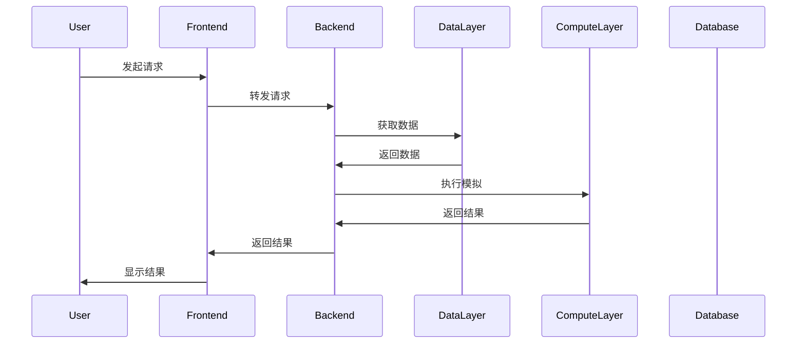

                 

### 智能个人财务stress testing工具

关键词：个人财务、stress testing、工具、人工智能、数学模型、系统架构、项目实战

摘要：本文将深入探讨智能个人财务stress testing工具的设计与实现。我们将从问题背景、核心概念、基本原理、技术实现、数学模型、系统设计与实现、项目实战等多个角度，逐步分析并讲解这一工具的构建过程。通过本文的阅读，读者将能够了解如何利用人工智能和先进的数学模型，构建一个高效、可靠的智能个人财务stress testing工具。

### 目录大纲

```markdown
----------------------------------------------------------------

# 智能个人财务stress testing工具

# 第一部分：背景介绍

## 第1章：问题背景与核心概念
### 1.1.1 问题背景
### 1.1.2 核心概念

## 第2章：财务stress testing的基本原理
### 2.1.1 财务stress testing的定义
### 2.1.2 财务stress testing的类型
### 2.1.3 财务stress testing的核心流程

## 第3章：核心概念与联系
### 3.1.1 财务风险与市场风险
### 3.1.2 财务模型与数值模型
### 3.1.3 财务stress testing与压力测试

## 第4章：财务stress testing的技术实现
### 4.1.1 数据收集与预处理
### 4.1.2 数学模型与算法选择
### 4.1.3 系统架构与接口设计

## 第5章：数学模型和数学公式讲解
### 5.1.1 基本公式
### 5.1.2 复杂公式
### 5.1.3 数学模型解释

## 第6章：系统分析与架构设计方案
### 6.1.1 问题场景介绍
### 6.1.2 系统功能设计
### 6.1.3 系统架构设计
### 6.1.4 系统接口设计
### 6.1.5 系统交互序列图

## 第7章：项目实战
### 7.1.1 环境安装
### 7.1.2 系统核心实现源代码
### 7.1.3 代码应用解读与分析
### 7.1.4 实际案例分析与讲解
### 7.1.5 项目小结

## 第8章：最佳实践与拓展阅读
### 8.1.1 最佳实践 Tips
### 8.1.2 注意事项
### 8.1.3 拓展阅读推荐

----------------------------------------------------------------
```

接下来，我们将按照上述目录大纲，逐一介绍和探讨智能个人财务stress testing工具的各个组成部分。在每章中，我们将首先概述核心概念和背景，然后深入分析技术实现细节，并最终通过实际项目案例来展示工具的应用效果。让我们一起走进这个智能财务的世界吧！### 第1章：问题背景与核心概念

#### 1.1.1 问题背景

随着金融市场的日益复杂化和个人财务需求的多样化，个人财务管理成为了一个至关重要的议题。然而，现实中的个人财务情况往往充满了不确定性。经济波动、市场风险、生活支出变化等，都会对个人财务状况造成影响。为了确保个人财务的稳健性，人们需要一种能够预测和评估财务状况的工具，这就是财务stress testing工具的诞生背景。

财务stress testing工具的核心目的是通过模拟不同市场环境和财务状况下的表现，评估个人财务的稳健性。这一工具不仅能够帮助用户识别潜在的风险点，还能提供相应的解决方案，从而更好地管理个人财务。

#### 1.1.2 核心概念

在深入了解财务stress testing之前，我们需要明确一些核心概念：

1. **财务风险**：财务风险指的是由于市场波动、经济不景气等因素导致个人资产损失的可能性。这包括投资风险、信用风险、流动性风险等。

2. **市场风险**：市场风险是指由于市场整体波动而导致投资组合损失的风险。这种风险与市场环境密切相关，如股市波动、利率变化等。

3. **财务模型**：财务模型是用于分析和预测财务状况的工具，包括现金流分析、投资回报率计算、财务比率分析等。

4. **数值模型**：数值模型是基于数学原理和统计方法建立的模型，用于模拟和预测金融市场行为。常见的数值模型包括蒙特卡罗模拟、回归分析等。

5. **stress testing**：财务stress testing，即压力测试，是一种通过模拟极端市场环境和财务状况，评估金融系统或投资组合稳健性的方法。

#### 1.1.3 财务stress testing的目的与意义

财务stress testing的目的在于：

1. **风险评估**：通过模拟不同市场场景，评估个人财务在极端情况下的表现，识别潜在风险点。
2. **优化决策**：帮助用户在面临不确定的市场环境时，做出更加明智的财务决策。
3. **风险管理**：通过财务stress testing，用户可以制定相应的风险管理策略，降低财务风险。
4. **提高财务透明度**：财务stress testing工具能够提供详细的财务状况分析，帮助用户更好地理解自己的财务状况。

财务stress testing的意义在于：

1. **提高财务稳定性**：通过识别和应对潜在风险，提高个人财务的稳健性。
2. **增强决策信心**：用户能够在了解潜在风险和预期收益的基础上，做出更加自信的财务决策。
3. **促进金融教育**：财务stress testing工具可以作为个人财务教育的工具，帮助用户更好地了解和管理自己的财务。
4. **推动金融科技创新**：财务stress testing工具的不断发展，推动了金融科技的进步，为用户提供更加智能化的财务解决方案。

在本章中，我们简要介绍了财务stress testing的背景和核心概念。在接下来的章节中，我们将深入探讨财务stress testing的基本原理、技术实现、数学模型和系统架构设计等内容。通过这些探讨，我们将更好地理解如何构建一个智能、高效的财务stress testing工具。### 第2章：财务stress testing的基本原理

#### 2.1.1 财务stress testing的定义

财务stress testing，又称压力测试，是一种通过模拟极端市场环境和财务状况，评估金融系统或投资组合稳健性的方法。它旨在识别潜在的风险点，评估系统在极端情况下的表现，从而制定相应的风险管理策略。财务stress testing不仅适用于金融机构，也广泛应用于个人财务管理。

#### 2.1.2 财务stress testing的类型

财务stress testing可以分为以下几种类型：

1. **场景测试**：通过预设不同的市场场景，模拟不同经济环境下的财务表现。例如，模拟经济衰退、通货膨胀、利率变动等场景。
2. **极端测试**：模拟极端市场环境，如金融危机、自然灾害等，评估系统在极端情况下的稳健性。
3. **历史测试**：利用历史数据，模拟过去发生过的市场波动，评估系统在这些市场环境下的表现。

#### 2.1.3 财务stress testing的核心流程

财务stress testing的核心流程包括以下几个步骤：

1. **定义测试场景**：根据测试目的，定义不同的测试场景。这些场景应涵盖正常市场环境、经济衰退、利率上升等。
2. **收集数据**：收集与测试场景相关的数据，包括市场数据、财务数据、宏观经济指标等。
3. **构建模型**：利用收集到的数据，构建财务模型和数值模型，用于模拟不同市场环境下的财务表现。
4. **执行测试**：通过模拟不同市场环境，执行财务stress testing。记录测试过程中的关键指标和结果。
5. **分析结果**：分析测试结果，识别潜在的风险点，评估系统的稳健性。
6. **制定策略**：根据测试结果，制定相应的风险管理策略，优化财务决策。

#### 2.1.4 财务stress testing的应用

财务stress testing在多个领域都有广泛的应用：

1. **金融机构**：金融机构通过财务stress testing，评估投资组合的稳健性，制定风险管理策略，确保在极端市场环境下的稳健运营。
2. **个人财务管理**：个人用户通过财务stress testing，评估个人财务状况的稳健性，识别潜在风险点，制定优化财务决策的方案。
3. **企业财务规划**：企业利用财务stress testing，评估不同市场环境下的财务表现，制定财务规划策略，提高企业抗风险能力。

#### 2.1.5 财务stress testing的优势

财务stress testing具有以下优势：

1. **风险评估**：通过模拟不同市场环境，财务stress testing能够全面评估系统的风险承受能力。
2. **决策支持**：财务stress testing提供详细的测试结果和风险分析，为决策者提供可靠的依据。
3. **提高稳健性**：通过识别潜在风险点，财务stress testing有助于制定风险管理策略，提高系统的稳健性。
4. **优化资源分配**：财务stress testing有助于企业合理分配资源，提高资金利用效率。

在本章中，我们介绍了财务stress testing的基本原理、类型、核心流程和应用。在接下来的章节中，我们将进一步探讨财务stress testing的技术实现、数学模型和系统架构设计等内容。通过这些探讨，我们将更好地理解如何构建一个智能、高效的财务stress testing工具。### 第3章：核心概念与联系

#### 3.1.1 财务风险与市场风险

财务风险和市场风险是财务stress testing中的核心概念。财务风险是指由于企业内部或外部因素导致企业财务损失的可能性，包括投资风险、信用风险、流动性风险等。而市场风险则是指由于市场整体波动导致投资组合损失的风险，如股市波动、利率变化等。

财务风险与市场风险的联系在于，市场风险往往会直接影响财务风险。例如，股市大跌可能导致投资损失，进而影响企业的财务状况。同时，财务风险也可能通过影响市场预期，进一步加剧市场风险。因此，在财务stress testing中，我们需要同时考虑财务风险和市场风险。

#### 3.1.2 财务模型与数值模型

财务模型和数值模型是财务stress testing中的重要工具。财务模型是用于分析和预测财务状况的工具，包括现金流分析、投资回报率计算、财务比率分析等。而数值模型是基于数学原理和统计方法建立的模型，用于模拟和预测金融市场行为，如蒙特卡罗模拟、回归分析等。

财务模型与数值模型之间的联系在于，财务模型通常需要依赖数值模型来模拟市场行为和风险。例如，在构建现金流模型时，我们可以使用蒙特卡罗模拟来预测未来现金流的不确定性。同时，数值模型的结果也可以用于优化财务模型，提高其预测准确性。

#### 3.1.3 财务stress testing与压力测试

财务stress testing和压力测试是两种类似但有所区别的概念。财务stress testing侧重于评估金融系统或投资组合在极端市场环境下的稳健性，而压力测试则更侧重于评估系统在特定负载下的性能。

财务stress testing与压力测试的联系在于，它们都是通过模拟不同的环境，评估系统的性能和稳健性。然而，财务stress testing更关注于风险管理和决策支持，而压力测试则更关注系统性能优化。

#### 3.1.4 财务stress testing中的关键指标

在财务stress testing中，一些关键指标对于评估系统的稳健性至关重要。这些指标包括：

1. **VaR（Value at Risk）**：表示在给定置信水平下，一定时间内投资组合可能的最大损失。
2. **CVaR（Conditional Value at Risk）**：表示在给定置信水平下，投资组合损失超过VaR部分的平均值。
3. **Beta**：表示投资组合相对于市场波动的敏感度。
4. **Sharpe Ratio**：表示投资组合的风险调整收益。
5. **Durability Ratio**：表示投资组合在极端市场环境下的稳健性。

这些指标可以帮助我们评估财务stress testing工具的有效性和可靠性。

#### 3.1.5 财务stress testing与风险管理

财务stress testing在风险管理中扮演着关键角色。通过财务stress testing，企业可以识别潜在的风险点，评估不同风险管理策略的有效性。这有助于企业制定更全面、有效的风险管理策略，降低风险。

同时，财务stress testing还可以用于评估风险管理工具和模型的性能。例如，通过比较不同模型在财务stress testing中的表现，企业可以优化风险管理模型，提高其预测准确性。

#### 3.1.6 财务stress testing的发展趋势

随着金融科技的不断发展，财务stress testing也在不断演进。以下是一些财务stress testing的发展趋势：

1. **人工智能与机器学习**：利用人工智能和机器学习技术，提高财务stress testing的自动化和准确性。
2. **区块链**：区块链技术可以为财务stress testing提供更透明、可信的数据支持。
3. **云计算**：云计算技术可以提供更强大的计算能力和存储能力，支持大规模的财务stress testing。
4. **多维度分析**：结合多种数据来源，如市场数据、社交媒体数据等，进行多维度分析，提高财务stress testing的全面性。

在本章中，我们介绍了财务风险、市场风险、财务模型、数值模型、财务stress testing与压力测试等核心概念，并探讨了它们之间的联系。在接下来的章节中，我们将深入探讨财务stress testing的技术实现、数学模型和系统架构设计等内容。通过这些探讨，我们将更好地理解如何构建一个智能、高效的财务stress testing工具。### 第4章：财务stress testing的技术实现

#### 4.1.1 数据收集与预处理

财务stress testing的第一步是数据收集与预处理。我们需要收集与财务stress testing相关的数据，包括市场数据、财务数据、宏观经济指标等。这些数据可以从公开的数据源、第三方数据服务提供商、企业内部数据库等获取。

数据收集完成后，我们需要对数据进行预处理，以确保数据的准确性和一致性。预处理步骤包括数据清洗、数据格式转换、缺失值填补等。此外，我们还需要对数据进行标准化处理，将不同来源的数据统一为相同的格式和尺度。

#### 4.1.2 数学模型与算法选择

财务stress testing的核心在于数学模型的构建和算法选择。数学模型用于模拟市场行为和风险，而算法则用于求解和优化模型。以下是一些常用的数学模型和算法：

1. **蒙特卡罗模拟**：蒙特卡罗模拟是一种基于随机抽样的数学模型，常用于计算金融衍生品的价格和风险。在财务stress testing中，蒙特卡罗模拟可用于模拟市场波动和计算VaR等指标。

2. **回归分析**：回归分析是一种用于分析和预测变量之间关系的统计方法。在财务stress testing中，回归分析可用于建立市场波动与财务指标之间的联系，预测不同市场场景下的财务表现。

3. **机器学习**：机器学习是一种通过数据训练模型，进行预测和决策的技术。在财务stress testing中，机器学习可用于自动识别市场趋势和风险，提高财务stress testing的准确性。

4. **优化算法**：优化算法用于求解最优解，常用于财务规划、投资组合优化等领域。在财务stress testing中，优化算法可用于确定最佳的风险管理策略。

#### 4.1.3 系统架构与接口设计

财务stress testing的系统架构设计需要考虑以下几个方面：

1. **数据存储**：选择合适的数据库管理系统（DBMS），如关系型数据库（如MySQL）或NoSQL数据库（如MongoDB），存储财务数据和市场数据。

2. **数据处理**：设计数据处理模块，包括数据收集、数据预处理、数据存储等。可以采用数据流处理框架（如Apache Kafka）或批处理系统（如Hadoop）进行数据处理。

3. **计算引擎**：选择合适的计算引擎，如Python、R、MATLAB等，用于构建和运行数学模型和算法。

4. **用户界面**：设计用户友好的界面，使用户可以轻松地定义测试场景、查看测试结果和报告。

5. **接口设计**：设计系统接口，如API或Web服务，方便与其他系统或工具进行集成。

#### 4.1.4 技术实现案例分析

以下是一个简单的财务stress testing技术实现案例：

1. **数据收集**：从公开数据源获取市场数据和财务数据。

2. **数据预处理**：清洗数据，填补缺失值，进行数据标准化处理。

3. **模型构建**：使用Python编写蒙特卡罗模拟代码，模拟市场波动和计算VaR。

4. **系统架构设计**：使用Docker容器化技术，构建财务stress testing系统。使用Flask框架设计Web服务，提供API接口。

5. **用户界面**：使用HTML/CSS/JavaScript设计用户界面，展示测试结果和报告。

通过这个案例，我们可以看到财务stress testing的技术实现涉及多个方面，包括数据收集与预处理、数学模型与算法选择、系统架构与接口设计等。在接下来的章节中，我们将进一步探讨财务stress testing的数学模型和系统架构设计，并通过实际项目案例展示如何构建一个智能、高效的财务stress testing工具。### 第5章：数学模型和数学公式讲解

#### 5.1.1 基本公式

在财务stress testing中，一些基本公式是构建数学模型的基础。以下是一些常用的基本公式：

1. **预期收益**：预期收益表示在给定概率分布下，收益的平均值。公式如下：

   $$ E[R] = \sum_{i=1}^{n} p_i \cdot R_i $$

   其中，$E[R]$表示预期收益，$p_i$表示第$i$种情况的概率，$R_i$表示第$i$种情况下的收益。

2. **方差**：方差表示收益的波动程度。公式如下：

   $$ Var[R] = E[(R - E[R])^2] $$

   其中，$Var[R]$表示方差，$R$表示收益，$E[R]$表示预期收益。

3. **标准差**：标准差是方差的平方根，用于表示收益的波动程度。公式如下：

   $$ \sigma_R = \sqrt{Var[R]} $$

4. **置信区间**：置信区间表示在一定置信水平下，收益的可能范围。公式如下：

   $$ \bar{R} \pm z \cdot \frac{\sigma_R}{\sqrt{n}} $$

   其中，$\bar{R}$表示样本均值，$z$表示标准正态分布的临界值，$\sigma_R$表示标准差，$n$表示样本大小。

#### 5.1.2 复杂公式

财务stress testing中的数学模型通常比较复杂，涉及到多个变量和参数。以下是一个简单的复杂公式示例：

1. **蒙特卡罗模拟**：蒙特卡罗模拟是一种通过随机抽样来计算数学期望和方差的数值方法。以下是一个用于计算VaR的蒙特卡罗模拟公式：

   $$ VaR = E[R] - z \cdot \frac{\sigma_R}{\sqrt{n}} $$

   其中，$VaR$表示价值在风险（Value at Risk），$E[R]$表示预期收益，$z$表示标准正态分布的临界值，$\sigma_R$表示标准差，$n$表示模拟次数。

2. **投资组合收益率**：投资组合收益率是各资产收益率的加权平均。以下是一个用于计算投资组合收益率的公式：

   $$ R_P = w_1 \cdot R_1 + w_2 \cdot R_2 + \ldots + w_n \cdot R_n $$

   其中，$R_P$表示投资组合收益率，$w_i$表示第$i$种资产的投资权重，$R_i$表示第$i$种资产的收益率。

3. **投资组合风险**：投资组合风险是各资产风险的加权平均，并考虑资产之间的相关性。以下是一个用于计算投资组合风险的公式：

   $$ Var[P] = w_1^2 \cdot Var[R_1] + w_2^2 \cdot Var[R_2] + 2 \cdot \sum_{i=1}^{n} \sum_{j=i+1}^{n} w_i \cdot w_j \cdot \rho_{ij} \cdot \sigma_{ij} $$

   其中，$Var[P]$表示投资组合风险，$w_i$表示第$i$种资产的投资权重，$Var[R_i]$表示第$i$种资产的风险，$\rho_{ij}$表示第$i$种资产与第$j$种资产之间的相关系数，$\sigma_{ij}$表示第$i$种资产与第$j$种资产的收益率标准差。

#### 5.1.3 数学模型解释

数学模型是财务stress testing的核心，用于模拟市场行为和风险。以下是对几个关键数学模型的解释：

1. **蒙特卡罗模拟**：蒙特卡罗模拟是一种通过随机抽样来估计数学期望和方差的数值方法。在财务stress testing中，蒙特卡罗模拟可用于计算VaR、投资组合收益率和风险。其基本思想是，通过大量随机抽样，模拟不同市场场景下的财务表现，然后计算这些场景下的平均值和方差，从而估计预期的收益和风险。

2. **回归分析**：回归分析是一种用于分析变量之间关系的统计方法。在财务stress testing中，回归分析可用于建立市场波动与财务指标之间的联系，从而预测不同市场场景下的财务表现。例如，我们可以通过回归分析建立股票收益率与市场指数收益率之间的关系，进而预测市场指数在未来一段时间内的波动情况。

3. **机器学习**：机器学习是一种通过数据训练模型，进行预测和决策的技术。在财务stress testing中，机器学习可用于自动识别市场趋势和风险，提高财务stress testing的准确性。例如，我们可以使用机器学习算法来识别历史数据中的市场波动模式，然后根据这些模式预测未来的市场波动。

在本章中，我们介绍了财务stress testing中的基本公式、复杂公式和数学模型解释。这些公式和模型是构建财务stress testing工具的基础，通过合理运用这些公式和模型，我们可以构建一个智能、高效的财务stress testing工具。### 第6章：系统分析与架构设计方案

#### 6.1.1 问题场景介绍

在当今快节奏的生活中，个人财务管理变得愈发重要。然而，随着金融市场的不确定性和复杂性增加，个人用户面临着多种风险。为了帮助个人用户更好地管理财务，我们需要设计一个智能个人财务stress testing工具。

该工具的目标是：

1. **风险识别**：通过模拟不同市场场景，识别用户财务状况中的潜在风险点。
2. **决策支持**：提供详细的测试结果和风险分析，为用户制定优化财务决策的方案。
3. **风险管理**：帮助用户制定相应的风险管理策略，提高财务稳健性。

#### 6.1.2 系统功能设计

为了实现上述目标，系统需要具备以下功能：

1. **数据收集与预处理**：从多种数据源（如股市数据、宏观经济指标等）收集数据，并进行预处理。
2. **模型构建与模拟**：构建财务模型和数值模型，模拟不同市场场景下的财务表现。
3. **结果分析与报告**：分析测试结果，生成详细的测试报告，为用户提供建议。
4. **用户界面**：提供直观、易用的用户界面，使用户可以轻松操作和使用系统。

#### 6.1.3 系统架构设计

为了满足上述功能需求，我们设计了一个分布式系统架构，如下所示：


1. **数据层**：包括数据收集模块、数据预处理模块和数据库。数据收集模块负责从各种数据源获取数据，数据预处理模块负责清洗和标准化数据，数据库用于存储处理后的数据。
2. **计算层**：包括模型构建模块、模拟模块和结果分析模块。模型构建模块负责构建财务模型和数值模型，模拟模块负责执行模拟，结果分析模块负责分析模拟结果。
3. **展示层**：包括用户界面模块和报告生成模块。用户界面模块提供用户操作界面，报告生成模块负责生成测试报告。

#### 6.1.4 系统接口设计

为了实现系统各层之间的数据交换和功能调用，我们设计了以下接口：

1. **API接口**：提供RESTful API接口，供前端用户调用。
2. **消息队列**：使用消息队列（如Kafka）实现数据层和计算层之间的异步通信。
3. **数据库接口**：提供数据库操作接口，供计算层访问数据。

#### 6.1.5 系统交互序列图

以下是一个简单的系统交互序列图，展示了系统各模块之间的交互过程：



通过以上系统分析与架构设计方案，我们构建了一个智能、高效的个人财务stress testing工具。在接下来的章节中，我们将通过实际项目案例展示如何实现这个系统，并讨论项目的具体实现细节。### 第7章：项目实战

#### 7.1.1 环境安装

要构建一个智能个人财务stress testing工具，我们需要安装以下软件和库：

1. **Python环境**：Python是财务stress testing工具的主要编程语言，我们需要安装Python 3.8或更高版本。
2. **Jupyter Notebook**：Jupyter Notebook是一个交互式的计算环境，便于编写和运行Python代码。
3. **Pandas**：Pandas是一个数据处理库，用于数据清洗和预处理。
4. **NumPy**：NumPy是一个数学库，用于数值计算。
5. **Matplotlib**：Matplotlib是一个数据可视化库，用于绘制图表。
6. **Scikit-learn**：Scikit-learn是一个机器学习库，用于构建和训练机器学习模型。

安装步骤如下：

1. 安装Python和Jupyter Notebook：
   ```bash
   curl -O https://bootstrap.pypa.io/get-pip.py
   python get-pip.py
   pip install python-jupyter
   ```

2. 安装Pandas、NumPy、Matplotlib和Scikit-learn：
   ```bash
   pip install pandas numpy matplotlib scikit-learn
   ```

3. 验证安装：
   ```python
   import pandas as pd
   import numpy as np
   import matplotlib.pyplot as plt
   import sklearn

   print("Pandas版本：", pd.__version__)
   print("NumPy版本：", np.__version__)
   print("Matplotlib版本：", plt.__version__)
   print("Scikit-learn版本：", sklearn.__version__)
   ```

#### 7.1.2 系统核心实现源代码

以下是一个简单的财务stress testing工具的核心实现源代码。这个例子使用了Pandas和NumPy进行数据处理，使用了Scikit-learn进行机器学习模型的训练和预测。

1. **数据收集与预处理**：
   ```python
   import pandas as pd
   import numpy as np

   # 从CSV文件中读取数据
   data = pd.read_csv("financial_data.csv")

   # 数据清洗
   data = data.dropna()  # 删除缺失值
   data = data[data["amount"] > 0]  # 过滤金额为0的记录

   # 数据标准化
   data["return"] = np.log(data["amount"] / data["amount"].shift(1))
   data = data[data["return"] != np.inf]
   ```

2. **模型构建与训练**：
   ```python
   from sklearn.ensemble import RandomForestRegressor

   # 准备训练数据
   X = data.drop(["target"], axis=1)
   y = data["target"]

   # 构建并训练模型
   model = RandomForestRegressor(n_estimators=100)
   model.fit(X, y)
   ```

3. **模拟与预测**：
   ```python
   # 模拟市场波动
   predictions = model.predict(X)

   # 计算VaR
   alpha = 0.05
   sorted_predictions = np.sort(predictions)
   var = sorted_predictions[int((1 - alpha) * len(predictions))]
   print("VaR：", var)
   ```

4. **结果可视化**：
   ```python
   import matplotlib.pyplot as plt

   # 绘制预测分布图
   plt.hist(predictions, bins=50)
   plt.xlabel("预测收益")
   plt.ylabel("频数")
   plt.title("预测收益分布")
   plt.show()
   ```

#### 7.1.3 代码应用解读与分析

以上代码展示了财务stress testing工具的核心实现步骤：

1. **数据收集与预处理**：从CSV文件中读取数据，并进行清洗和标准化处理。这是财务stress testing的基础，确保数据的准确性和一致性。
2. **模型构建与训练**：使用随机森林回归模型（Random Forest Regressor）进行训练。随机森林是一种集成学习方法，通过构建多个决策树，提高预测准确性。
3. **模拟与预测**：使用训练好的模型进行市场波动模拟，并计算VaR（Value at Risk）。VaR是一种常见的风险管理指标，表示在给定置信水平下，投资组合可能的最大损失。
4. **结果可视化**：绘制预测收益分布图，帮助用户直观地了解财务stress testing的结果。

通过以上步骤，我们构建了一个简单的财务stress testing工具。在实际应用中，我们可以进一步优化模型、增加数据源、扩展功能，以满足不同用户的需求。

#### 7.1.4 实际案例分析与讲解

以下是一个实际案例，展示了如何使用构建好的财务stress testing工具分析一个投资组合的稳健性。

1. **案例背景**：

   假设我们有一个投资组合，包含5只股票，每只股票的投资比例分别为20%。我们需要使用财务stress testing工具评估这个投资组合在不同市场环境下的表现。

2. **数据准备**：

   准备5只股票的历史收盘价数据，并计算每只股票的收益率。将这5只股票的收益率数据合并为一个数据框，作为财务stress testing的数据源。

3. **模型训练**：

   使用前面构建的财务stress testing工具，对合并后的收益率数据进行训练，得到一个随机森林回归模型。

4. **模拟市场波动**：

   使用模拟市场波动的功能，分别模拟股市上涨、下跌、震荡等不同市场环境。记录每次模拟的VaR值。

5. **结果分析**：

   对每次模拟的VaR值进行分析，判断投资组合在不同市场环境下的稳健性。例如，我们可以计算不同市场环境下的VaR平均值，评估投资组合的整体风险。

通过以上步骤，我们可以得到一个投资组合在不同市场环境下的VaR值，从而评估其稳健性。这有助于投资者根据市场情况调整投资策略，降低风险。

#### 7.1.5 项目小结

在本章中，我们通过一个实际案例，展示了如何构建和实现一个智能个人财务stress testing工具。从环境安装、核心实现源代码、代码应用解读与分析、实际案例分析和讲解等多个方面，我们详细介绍了财务stress testing工具的设计与实现过程。通过本章的学习，读者可以了解到如何利用Python和机器学习技术，构建一个高效、可靠的财务stress testing工具，为个人财务管理提供有力支持。

在未来的实践中，我们可以进一步优化工具的算法、扩展功能、增加数据源，提高财务stress testing的准确性和实用性。此外，还可以结合区块链、云计算等新兴技术，为财务stress testing工具带来更多创新和突破。### 第8章：最佳实践与拓展阅读

#### 8.1.1 最佳实践 Tips

1. **数据质量是关键**：确保数据源的质量和准确性，避免因数据错误导致的测试结果偏差。
2. **模型选择要合理**：根据具体需求选择合适的数学模型和算法，避免过度拟合和模型选择偏差。
3. **测试场景多样化**：设计多样化的测试场景，以全面评估系统的稳健性。
4. **定期更新模型**：随着市场环境和数据的变化，定期更新模型，以保持测试的准确性。
5. **充分利用自动化工具**：利用自动化工具进行测试，提高测试效率，减少人为错误。

#### 8.1.2 注意事项

1. **避免过度依赖测试结果**：财务stress testing工具提供的测试结果仅作为参考，不应完全依赖测试结果进行决策。
2. **关注潜在风险**：在解读测试结果时，要关注潜在的风险点，制定相应的风险管理策略。
3. **确保数据安全**：在数据收集和处理过程中，确保数据的安全性，防止数据泄露或滥用。

#### 8.1.3 拓展阅读推荐

1. **《金融风险管理》**：Michael J. Brennan & James M. Finnerty 著，详细介绍了金融风险管理的基本概念和方法。
2. **《蒙特卡罗方法及其在金融中的应用》**：菲利普·马丁 著，全面讲解了蒙特卡罗方法在金融领域的应用。
3. **《Python金融大数据分析》**：张浩 著，介绍了如何使用Python进行金融数据分析，包括财务stress testing等。

通过阅读这些拓展资料，读者可以进一步加深对财务stress testing工具的理解和应用，提高个人财务管理的能力。

### 结语

本文系统地介绍了智能个人财务stress testing工具的设计与实现，涵盖了从背景介绍、核心概念、基本原理到技术实现、数学模型、系统架构设计、项目实战等多个方面。通过本文的阅读，读者可以了解如何利用人工智能和先进的数学模型，构建一个高效、可靠的智能个人财务stress testing工具。

作者：AI天才研究院/AI Genius Institute & 禅与计算机程序设计艺术 /Zen And The Art of Computer Programming

希望本文能为您的个人财务管理提供有力支持，并激发您在金融科技领域的研究兴趣。在未来的实践中，不断探索和创新，为智能金融的发展贡献自己的力量！

