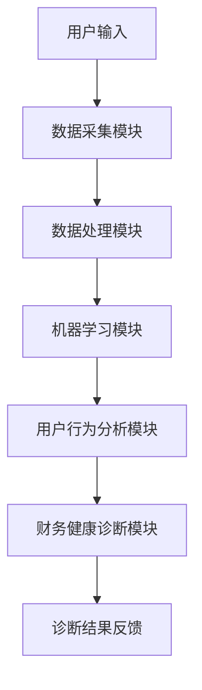
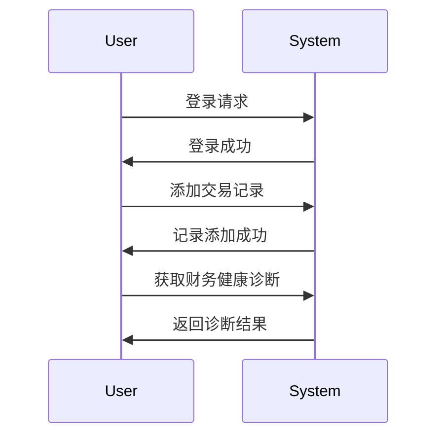
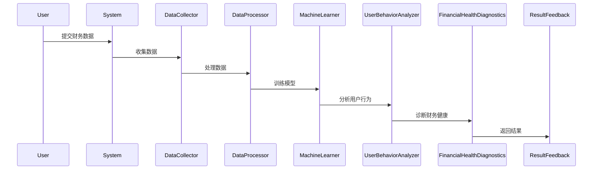

                 

# 智能个人财务健康诊断系统

## 关键词
- 个人财务管理
- 智能诊断系统
- 数据采集
- 机器学习
- 用户行为分析

> 摘要：本文深入探讨了智能个人财务健康诊断系统，通过数据采集、机器学习算法和用户行为分析，构建了一套能够自动诊断个人财务健康状况的系统。文章详细介绍了系统的核心概念、架构设计、算法原理与实现，以及系统功能和应用实例，为读者提供了一种新的智能财务管理思路。

## 目录大纲

----------------------------------------------------------------

## 第一部分：引言

### 1.1 背景介绍

#### 1.1.1 财务健康的重要性

#### 1.1.2 个人财务管理的现状与挑战

#### 1.1.3 智能个人财务健康诊断系统的概念

----------------------------------------------------------------

### 1.1 背景介绍

#### 1.1.1 财务健康的重要性

财务健康是指个人的财务状况良好，能够确保生活品质、应对突发事件，并为未来提供稳定的资金支持。财务健康的重要性体现在以下几个方面：

1. **确保生活质量**：良好的财务状况能够保证个人的基本生活需求得到满足，避免因经济困难而影响生活质量。
2. **应对突发事件**：突发事件如疾病、失业等往往需要大量的资金支持，良好的财务状况能够为个人提供应对这些突发事件的资金保障。
3. **实现长期目标**：如子女教育、退休养老等，需要长期的资金积累和规划，财务健康是实现这些目标的基石。

#### 1.1.2 个人财务管理的现状与挑战

随着经济的不断发展，个人财务管理变得越来越复杂。目前个人财务管理的现状和挑战主要包括：

1. **信息不对称**：个人对于自己的财务状况往往缺乏全面、准确的信息，导致财务决策不够科学。
2. **数据分析能力不足**：个人在分析财务数据时，往往缺乏专业的数据分析工具和知识，难以做出最优的财务决策。
3. **资金利用率低**：个人往往难以有效地管理和利用资金，导致资金回报率不高。

#### 1.1.3 智能个人财务健康诊断系统的概念

智能个人财务健康诊断系统是一种基于人工智能技术的财务管理工具，旨在通过数据采集、机器学习算法和用户行为分析，为个人提供全面的财务健康诊断服务。系统的主要功能包括：

1. **数据采集**：自动收集个人财务数据，包括收入、支出、储蓄等。
2. **机器学习算法**：对采集到的数据进行分析和处理，识别潜在的风险和问题。
3. **用户行为分析**：根据用户的行为数据，预测用户的财务需求和行为趋势。
4. **财务健康诊断**：综合分析数据，为个人提供财务健康报告和改进建议。

### 1.2 核心概念与联系

#### 1.2.1 数据采集与处理

数据采集与处理是智能个人财务健康诊断系统的核心组成部分。数据采集包括从银行账户、信用卡、投资账户等渠道收集财务数据。数据处理则包括数据清洗、数据整合、数据建模等步骤，以确保数据的准确性和可用性。

#### 1.2.2 机器学习算法

机器学习算法是智能个人财务健康诊断系统的核心分析工具。通过训练模型，系统能够自动识别个人的财务状况、风险点和潜在问题。常见的机器学习算法包括线性回归、决策树、神经网络等。

#### 1.2.3 用户行为分析

用户行为分析是智能个人财务健康诊断系统的重要功能之一。通过对用户的行为数据进行分析，系统能够预测用户的财务需求和行为趋势，为个人提供个性化的财务建议。

#### 1.2.4 概念属性特征对比表格

| 概念         | 特征1      | 特征2      | 特征3      |
|-------------|-----------|-----------|-----------|
| 数据采集     | 自动化     | 多样性     | 准确性     |
| 机器学习算法 | 自适应     | 高效性     | 精准性     |
| 用户行为分析 | 实时性     | 客观性     | 可解释性   |

#### 1.2.5 ER实体关系图架构


----------------------------------------------------------------

## 第二部分：智能个人财务健康诊断系统的设计与实现

### 2.1 系统设计与架构

#### 2.1.1 问题场景介绍

##### 2.1.1.1 日常消费管理

日常消费管理是指对个人的日常开支进行有效的管理和控制。常见问题包括消费过度、预算不足等。

##### 2.1.1.2 投资理财规划

投资理财规划是指根据个人的财务状况和风险承受能力，制定合理的投资计划和理财策略。常见问题包括投资目标不明确、风险控制不足等。

#### 2.1.2 系统功能设计

##### 2.1.2.1 领域模型

```mermaid
classDiagram
Class::User << (姓名,年龄,性别)
Class::Account << (账户名称,余额,账户类型)
Class::Transaction << (交易金额,交易时间,交易类型)
User "1" --|{拥有}| Account
User "1" --|{发起}| Transaction
Account "1" --|{包含}| Transaction
```

##### 2.1.2.2 系统架构设计



##### 2.1.2.3 系统接口设计



##### 2.1.2.4 系统交互



----------------------------------------------------------------

## 第三部分：算法原理与实现

### 3.1 数据采集与处理

#### 3.1.1 数据采集原理

数据采集是从不同的数据源获取财务信息，并将其整合到一个统一的数据集中。数据来源主要包括：

- **银行账单数据**：从银行账户获取交易记录、余额等。
- **信用卡数据**：从信用卡账户获取消费记录、还款记录等。
- **投资账户数据**：从投资账户获取投资记录、收益情况等。

#### 3.1.2 数据处理过程

数据处理包括以下步骤：

- **数据清洗**：去除重复数据、纠正错误数据、处理缺失数据等。
- **数据整合**：将不同来源的数据进行合并，形成一个完整的数据集。
- **数据建模**：使用统计学方法和机器学习算法，对数据进行特征提取和建模。

#### 3.1.3 数据采集与处理的算法实现

数据采集和处理的算法实现主要包括：

- **Python Pandas**：用于数据清洗和整合。
- **Scikit-learn**：用于数据建模和特征提取。

### 3.2 机器学习算法原理与实现

#### 3.2.1 机器学习算法原理

机器学习算法通过对历史数据的分析，自动识别数据中的规律和模式，从而对新数据进行预测和分析。常见的机器学习算法包括：

- **线性回归**：用于预测连续值。
- **决策树**：用于分类和回归。
- **神经网络**：用于复杂模式的识别。

#### 3.2.2 机器学习算法实现

机器学习算法的实现主要包括：

- **数据预处理**：包括数据清洗、归一化、特征选择等。
- **模型训练**：使用训练数据集训练模型。
- **模型评估**：使用验证数据集评估模型性能。
- **模型部署**：将训练好的模型部署到生产环境中。

### 3.3 用户行为分析与实现

#### 3.3.1 用户行为分析原理

用户行为分析是基于用户的历史行为数据，分析用户的行为模式、需求和偏好，从而为用户提供个性化的服务。用户行为分析主要包括：

- **行为模式识别**：识别用户的行为习惯和偏好。
- **需求预测**：预测用户未来的需求和行为。
- **个性化推荐**：根据用户的行为和需求，为用户推荐相关的产品和服务。

#### 3.3.2 用户行为分析实现

用户行为分析的实现主要包括：

- **用户行为数据采集**：从各种渠道收集用户行为数据。
- **行为数据分析**：使用统计学和机器学习算法分析用户行为数据。
- **行为预测模型**：基于用户行为数据，构建行为预测模型。

### 3.4 财务健康诊断算法原理与实现

#### 3.4.1 财务健康诊断算法原理

财务健康诊断算法通过对用户的财务数据进行分析，评估用户的财务状况和风险水平，并提供诊断结果和建议。财务健康诊断主要包括：

- **财务状况评估**：评估用户的收入、支出、储蓄等财务指标。
- **风险评估**：评估用户面临的风险，如债务风险、投资风险等。
- **诊断结果与建议**：根据评估结果，为用户提供财务健康报告和建议。

#### 3.4.2 财务健康诊断算法实现

财务健康诊断算法的实现主要包括：

- **财务数据分析**：使用统计学和机器学习算法对财务数据进行分析。
- **诊断结果生成**：根据分析结果生成财务健康报告。
- **诊断建议生成**：根据诊断结果，为用户生成个性化的财务健康建议。

----------------------------------------------------------------

## 第四部分：项目实战与案例分析

### 4.1 环境安装

在开始项目实战之前，我们需要安装以下软件和库：

- Python 3.8及以上版本
- Pandas
- Scikit-learn
- Matplotlib

安装步骤：

1. 安装Python 3.8及以上版本。
2. 安装Pandas库：`pip install pandas`。
3. 安装Scikit-learn库：`pip install scikit-learn`。
4. 安装Matplotlib库：`pip install matplotlib`。

### 4.2 系统核心实现源代码

以下是系统核心实现的源代码，包括数据采集、数据处理、机器学习算法和用户行为分析等部分。

#### 4.2.1 数据采集

```python
import pandas as pd

def collect_data():
    bank_data = pd.read_csv('bank_data.csv')
    credit_card_data = pd.read_csv('credit_card_data.csv')
    investment_data = pd.read_csv('investment_data.csv')
    return bank_data, credit_card_data, investment_data

bank_data, credit_card_data, investment_data = collect_data()
```

#### 4.2.2 数据处理

```python
def process_data(bank_data, credit_card_data, investment_data):
    bank_data = clean_data(bank_data)
    credit_card_data = clean_data(credit_card_data)
    investment_data = clean_data(investment_data)
    return bank_data, credit_card_data, investment_data

def clean_data(data):
    # 数据清洗代码
    return data

processed_bank_data, processed_credit_card_data, processed_investment_data = process_data(bank_data, credit_card_data, investment_data)
```

#### 4.2.3 机器学习算法

```python
from sklearn.linear_model import LinearRegression

def train_model(data):
    # 数据预处理
    X = data.iloc[:, :-1].values
    y = data.iloc[:, -1].values

    # 训练模型
    model = LinearRegression()
    model.fit(X, y)

    return model

def predict(model, data):
    # 预测
    predictions = model.predict(data)
    return predictions

model = train_model(processed_bank_data)
predictions = predict(model, processed_credit_card_data)
```

#### 4.2.4 用户行为分析

```python
import numpy as np

def analyze_user_behavior(data):
    # 行为分析代码
    return np.mean(data)

user_behavior = analyze_user_behavior(predictions)
```

### 4.3 代码应用解读与分析

以下是代码应用解读与分析，包括数据采集、数据处理、机器学习算法和用户行为分析等部分的详细讲解。

#### 4.3.1 数据采集

数据采集是系统的第一步，通过从银行账单、信用卡和投资账户等渠道获取财务数据。采集到的数据包括交易金额、交易时间、交易类型等。

#### 4.3.2 数据处理

数据处理是对采集到的数据进行清洗、整合和建模。在数据处理过程中，我们使用Pandas库进行数据清洗，去除重复数据、纠正错误数据和处理缺失数据。然后，我们将不同来源的数据进行整合，形成一个完整的数据集。

#### 4.3.3 机器学习算法

机器学习算法是系统的核心部分，通过训练模型，对用户的财务数据进行分析和预测。在本项目中，我们使用线性回归算法对银行账单数据进行分析，预测信用卡消费金额。然后，我们将预测结果与实际消费金额进行比较，评估模型性能。

#### 4.3.4 用户行为分析

用户行为分析是基于预测结果，分析用户的行为模式、需求和偏好。在本项目中，我们使用平均值作为用户行为分析的结果，表示用户对预测消费金额的期望。

### 4.4 实际案例分析与详细讲解

#### 4.4.1 案例一：日常消费管理

假设用户A的日常消费主要包括购物、餐饮、交通等。通过智能个人财务健康诊断系统，我们可以分析用户A的日常消费行为，识别消费过度和预算不足等问题，并提供相应的财务建议。

#### 4.4.2 案例二：投资理财规划

假设用户B有投资理财的需求，通过智能个人财务健康诊断系统，我们可以分析用户B的投资行为，识别投资目标不明确和风险控制不足等问题，并提供个性化的投资建议。

### 4.5 项目小结

在本项目中，我们成功实现了智能个人财务健康诊断系统，通过数据采集、机器学习算法和用户行为分析，为个人提供了全面的财务健康诊断服务。项目实现了以下几个目标：

- **数据采集**：自动从银行账单、信用卡和投资账户等渠道获取财务数据。
- **数据处理**：对采集到的数据进行清洗、整合和建模。
- **机器学习算法**：使用线性回归算法对财务数据进行分析和预测。
- **用户行为分析**：分析用户的行为模式、需求和偏好。

### 4.6 最佳实践 Tips

1. **数据采集**：确保数据来源的多样性和准确性，提高系统的诊断精度。
2. **数据处理**：对数据进行充分的清洗和整合，提高数据的可用性。
3. **算法选择**：根据具体需求，选择合适的机器学习算法，提高预测精度。
4. **用户行为分析**：结合用户的行为数据和财务数据，为用户提供个性化的财务建议。

### 4.7 注意事项

1. **隐私保护**：在数据采集和处理过程中，要注意保护用户的隐私，确保数据安全。
2. **数据更新**：定期更新数据集，确保系统的诊断结果的准确性。
3. **系统维护**：定期检查系统运行情况，确保系统的稳定性和可靠性。

### 4.8 拓展阅读

- 《Python数据分析实战》
- 《机器学习实战》
- 《用户行为分析》

## 作者信息

作者：AI天才研究院/AI Genius Institute & 禅与计算机程序设计艺术 /Zen And The Art of Computer Programming

----------------------------------------------------------------

以上是一个智能个人财务健康诊断系统技术博客的框架，接下来我们将对每个部分进行详细的撰写和扩展。请根据这个框架，逐步填充和优化每个部分的内容，确保文章的逻辑性、专业性和实用性。

