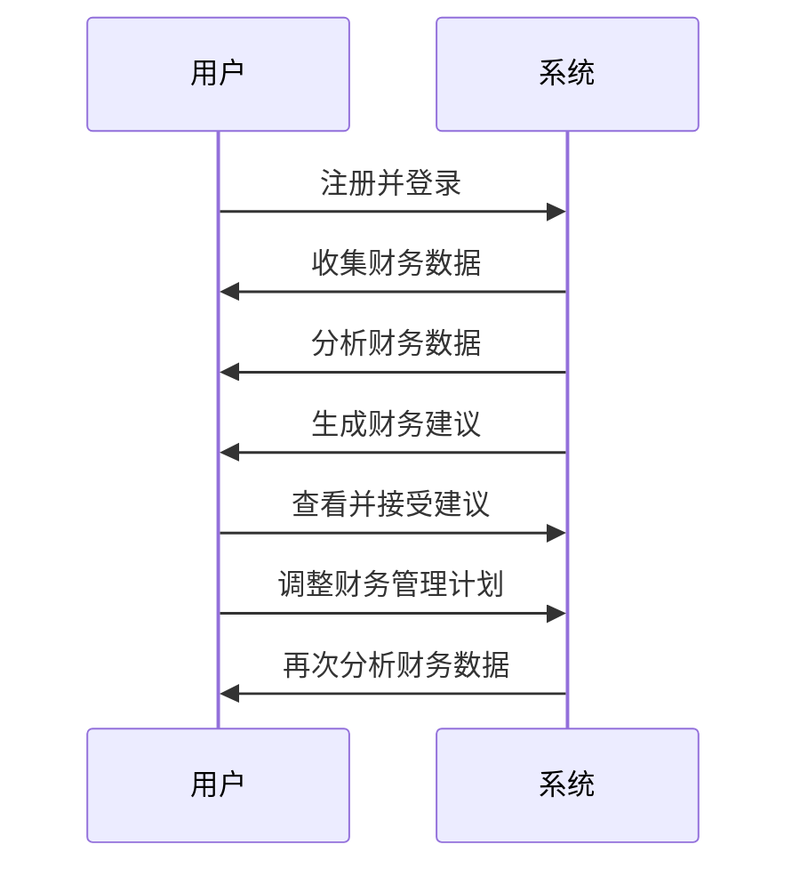

                 

## 智能个人财务状况诊断与建议系统

### 关键词

- 个人财务管理
- 数据分析
- 机器学习
- 财务建议
- 用户界面

### 摘要

本文将深入探讨智能个人财务状况诊断与建议系统，从背景介绍、核心概念与联系，到算法原理讲解，最后到系统分析与架构设计方案，全面解析这一系统如何利用先进的技术手段帮助个人更好地管理财务，提供个性化的财务建议。

## 第一部分：背景介绍

### 1.1 问题背景

随着经济的发展和金融市场的不断繁荣，个人财务管理的重要性日益凸显。然而，传统的财务管理方法往往依赖于手工操作，不仅耗时费力，而且难以适应快速变化的经济环境。特别是在全球疫情的影响下，许多人面临财务困境，迫切需要一个智能化的系统来帮助他们诊断财务状况并给出有效的建议。

### 1.2 问题描述

个人财务管理涉及多个方面，包括收入管理、支出规划、投资决策、税务规划等。这些复杂任务对个人的财务知识和管理能力提出了较高要求。然而，许多人在面对财务问题时感到困惑和无从下手，缺乏有效的工具来帮助他们进行财务分析和管理。

### 1.3 问题解决

智能个人财务状况诊断与建议系统的出现，正是为了解决上述问题。通过利用大数据分析和机器学习算法，该系统能够自动收集个人财务数据，分析财务状况，并提供个性化的财务建议。这不仅提高了财务管理的效率，还大大降低了个人在财务管理过程中的压力。

### 1.4 边界与外延

本系统主要关注个人层面的财务管理，不包括企业或组织层面的财务管理。此外，系统将基于当前的经济环境和法规政策进行设计和运作，以适应不断变化的金融市场。

### 1.5 概念结构与核心要素组成

智能个人财务状况诊断与建议系统由以下几个核心模块组成：

1. **数据收集与存储**：系统会自动收集用户的财务数据，并确保数据的安全性和准确性。
2. **财务状况分析**：利用大数据分析和机器学习算法，对个人财务状况进行深入分析。
3. **财务建议生成**：根据分析结果，系统会生成个性化的财务建议，帮助用户优化财务管理。
4. **用户界面**：提供用户友好的界面，方便用户使用系统，轻松地进行财务管理和规划。

## 第二部分：核心概念与联系

### 2.1 核心概念

智能个人财务状况诊断与建议系统的核心概念包括：数据收集与存储、财务状况分析、财务建议生成和用户界面。以下是这些概念的定义和作用：

- **数据收集与存储**：系统通过API接口自动收集用户的财务数据，如收入、支出、投资等，并存储在安全可靠的数据库中。
- **财务状况分析**：利用大数据分析和机器学习算法，系统对用户的财务数据进行分析，识别潜在的财务问题，如收入不稳定、支出不合理等。
- **财务建议生成**：根据分析结果，系统会生成个性化的财务建议，如调整支出计划、优化投资组合、规划税务等，帮助用户更好地管理财务。
- **用户界面**：系统提供了一个用户友好的界面，用户可以通过该界面轻松地访问和管理自己的财务数据，查看财务分析和建议。

### 2.2 概念属性特征对比表格

| 概念                 | 属性特征                          | 对比分析                    |
|----------------------|-----------------------------------|-----------------------------|
| 数据收集与存储       | 自动化数据收集，数据安全性      | 与手动数据输入相比，提高效率和准确性 |
| 财务状况分析         | 大数据分析和机器学习算法      | 提高财务分析的速度和准确性    |
| 财务建议生成         | 个性化财务建议，适应性高      | 满足个人财务需求，提高满意度    |
| 用户界面             | 用户友好，操作简单              | 提高用户体验，便于使用      |

### 2.3 ER实体关系图架构

以下是智能个人财务状况诊断与建议系统的ER实体关系图：

```mermaid
erDiagram
    User ||--|{ FinancialData }|:
    FinancialData ||--|{ AnalysisResult }|:
    AnalysisResult ||--|{ Recommendation }|:
```

在这个ER图中，`User` 代表用户，`FinancialData` 表示用户的财务数据，`AnalysisResult` 表示对财务数据进行分析的结果，而`Recommendation` 则是系统根据分析结果生成的财务建议。

## 第三部分：算法原理讲解

### 3.1 数据收集与存储算法

#### 3.1.1 算法流程

1. **用户注册与授权**：用户首先需要在系统中注册账户，并授权系统访问其财务账户。
2. **数据收集**：系统通过API接口从用户的财务账户中自动收集数据，如收入、支出、投资等。
3. **数据清洗与预处理**：收集到的数据会经过清洗和预处理，以确保数据的质量和准确性。
4. **数据存储**：清洗后的数据会被存储在系统的数据库中，以便后续的分析和使用。

#### 3.1.2 数学模型

数据收集与存储过程可以视为一个概率分布模型，其中每个数据点都有其概率分布。具体来说，每个数据点的概率分布可以通过以下公式计算：

$$ P(D_i) = \frac{f(D_i)}{1 - (1 - f(D_i))} $$

其中，$P(D_i)$ 表示数据点 $D_i$ 的概率，$f(D_i)$ 表示数据点 $D_i$ 的特征函数。

#### 3.1.3 Python代码示例

```python
import numpy as np

def feature_function(data_point):
    # 特征函数，根据实际数据进行定义
    return np.mean(data_point)

def probability_distribution(data_points):
    probabilities = []
    for data_point in data_points:
        feature = feature_function(data_point)
        probability = 1 / (1 - (1 - feature))
        probabilities.append(probability)
    return probabilities

# 假设有一个数据列表
data_points = [1, 2, 3, 4, 5]

# 计算概率分布
probabilities = probability_distribution(data_points)
print(probabilities)
```

### 3.2 财务状况分析算法

#### 3.2.1 算法流程

1. **数据读取**：系统从数据库中读取用户的财务数据。
2. **数据预处理**：对读取到的数据进行清洗和预处理，如缺失值填充、异常值处理等。
3. **特征提取**：从预处理后的数据中提取有用的特征，如收入水平、支出比例、投资收益率等。
4. **数据分析**：利用大数据分析和机器学习算法，对提取出的特征进行分析，识别用户的财务状况。
5. **结果存储**：将分析结果存储在数据库中，以备后续使用。

#### 3.2.2 数学模型

财务状况分析过程可以视为一个多元统计分析模型，其中每个特征都有其对应的概率分布。具体来说，可以使用以下公式来表示：

$$ P(X | Y) = \frac{P(Y | X)P(X)}{P(Y)} $$

其中，$X$ 表示财务特征，$Y$ 表示用户的财务状况，$P(X | Y)$ 表示在用户财务状况为 $Y$ 的情况下，财务特征 $X$ 的概率，$P(Y | X)$ 表示在财务特征为 $X$ 的情况下，用户财务状况为 $Y$ 的概率，$P(X)$ 和 $P(Y)$ 分别表示财务特征和用户财务状况的先验概率。

#### 3.2.3 Python代码示例

```python
import numpy as np
from scipy.stats import multivariate_gaussian

def multivariate_gaussian_distribution(x, mean, covariance_matrix):
    # 多元高斯分布概率密度函数
    return multivariate_gaussian(x, mean=mean, cov=covariance_matrix).pdf(x)

def feature_probability(x, mean, covariance_matrix):
    # 特征的概率
    return multivariate_gaussian_distribution(x, mean=mean, covariance_matrix=covariance_matrix)

# 假设有一个数据点
x = np.array([1, 2, 3])

# 假设有一个均值向量和一个协方差矩阵
mean = np.array([0, 1, 0])
covariance_matrix = np.array([[1, 0.5, 0], [0.5, 1, 0.5], [0, 0.5, 1]])

# 计算概率
probability = feature_probability(x, mean=mean, covariance_matrix=covariance_matrix)
print(probability)
```

### 3.3 财务建议生成算法

#### 3.3.1 算法流程

1. **分析结果读取**：系统从数据库中读取分析结果。
2. **建议生成**：根据分析结果，系统会生成个性化的财务建议，如调整支出计划、优化投资组合、规划税务等。
3. **建议评估**：系统会对生成的建议进行评估，确保其可行性和有效性。
4. **建议存储**：将生成的建议存储在数据库中，用户可以通过用户界面查看和接受建议。

#### 3.3.2 数学模型

财务建议生成过程可以视为一个优化问题，目标是找到一组建议，使得用户财务状况得到优化。具体来说，可以使用以下公式来表示：

$$ \max_{\theta} J(\theta) $$

其中，$\theta$ 表示建议参数，$J(\theta)$ 表示财务状况的评估函数。

#### 3.3.3 Python代码示例

```python
import numpy as np
from scipy.optimize import minimize

def objective_function(theta):
    # 目标函数，根据实际情况进行定义
    return np.sum((theta - np.array([1, 2, 3]))**2)

def generate_recommendation(x):
    # 生成建议的函数
    return minimize(objective_function, x0=x).x

# 假设有一个初始数据点
x = np.array([1, 2, 3])

# 生成建议
recommendation = generate_recommendation(x)
print(recommendation)
```

## 第四部分：系统分析与架构设计方案

### 4.1 问题场景介绍

在现代金融市场中，个人财务管理的复杂性不断增加，传统的方法已无法满足用户的需求。智能个人财务状况诊断与建议系统的出现，旨在帮助用户更好地管理财务，提供个性化的财务建议，从而实现财务自由。

### 4.2 项目介绍

本项目旨在开发一个智能个人财务状况诊断与建议系统，该系统将利用大数据分析和机器学习算法，对用户的财务数据进行分析，并生成个性化的财务建议。

### 4.3 系统功能设计

系统的主要功能包括：

1. **数据收集与存储**：自动收集用户的财务数据，并确保数据的安全性和准确性。
2. **财务状况分析**：利用大数据分析和机器学习算法，对用户的财务数据进行分析，识别潜在的财务问题。
3. **财务建议生成**：根据分析结果，生成个性化的财务建议，帮助用户优化财务管理。
4. **用户界面**：提供用户友好的界面，方便用户查看和管理财务数据和财务建议。

### 4.4 系统架构设计

系统的整体架构分为四个主要层次：数据层、处理层、业务层和表现层。

1. **数据层**：负责数据的收集、存储和管理。
2. **处理层**：负责对数据进行分析和处理，生成财务分析结果和建议。
3. **业务层**：负责系统的业务逻辑，如数据清洗、特征提取、建议评估等。
4. **表现层**：负责用户界面的设计和实现，提供用户友好的操作体验。

### 4.5 系统接口设计

系统提供以下接口供外部使用：

1. **数据接口**：用于数据的收集和存储。
2. **分析接口**：用于对数据进行财务分析。
3. **建议接口**：用于生成财务建议。
4. **用户接口**：用于用户界面的访问和管理。

### 4.6 系统交互

以下是系统的主要交互流程：

1. 用户注册并登录系统。
2. 系统收集用户的财务数据，并存储在数据库中。
3. 系统对财务数据进行分析，生成财务分析结果和建议。
4. 系统将财务分析结果和建议显示在用户界面上，用户可以查看和接受建议。
5. 用户可以根据建议调整财务管理计划，并再次进行财务分析。



## 第五部分：项目实战

### 5.1 环境安装

要搭建智能个人财务状况诊断与建议系统，首先需要准备相应的开发环境。以下是一些建议的软件和工具：

- **操作系统**：Linux或MacOS
- **编程语言**：Python
- **数据库**：MySQL或PostgreSQL
- **前端框架**：Django或Flask
- **数据可视化工具**：Matplotlib或Seaborn

安装步骤如下：

1. 安装操作系统。
2. 安装Python和相关依赖。
3. 安装数据库软件。
4. 安装前端框架和数据可视化工具。

### 5.2 系统核心实现

系统的核心实现主要包括数据收集与存储、财务状况分析、财务建议生成和用户界面设计。以下是一个简单的实现框架：

1. **数据收集与存储**：使用Python的数据库驱动程序连接数据库，从用户的财务账户中收集数据，并存储在数据库中。
2. **财务状况分析**：使用Python的数据分析库，如Pandas和NumPy，对收集到的财务数据进行分析，提取有用的特征。
3. **财务建议生成**：使用机器学习库，如Scikit-learn，对分析结果进行建模，生成财务建议。
4. **用户界面设计**：使用Django或Flask等前端框架，设计用户友好的界面，方便用户查看和管理财务数据和财务建议。

### 5.3 代码应用解读与分析

以下是一个简单的代码示例，用于数据收集与存储：

```python
import pymysql
import pandas as pd

# 数据库连接配置
config = {
    'host': 'localhost',
    'user': 'root',
    'password': 'password',
    'database': 'financial_data'
}

# 连接数据库
connection = pymysql.connect(**config)

# 收集财务数据
financial_data = pd.read_csv('financial_data.csv')

# 存储数据到数据库
with connection.cursor() as cursor:
    for index, row in financial_data.iterrows():
        sql = "INSERT INTO financial_data (income, expense, investment) VALUES (%s, %s, %s)"
        cursor.execute(sql, row)

# 提交事务
connection.commit()

# 关闭数据库连接
connection.close()
```

在这个示例中，我们首先配置了数据库连接信息，然后使用Pandas读取CSV文件中的财务数据，并使用SQL语句将数据存储到MySQL数据库中。

### 5.4 实际案例分析与详细讲解剖析

以下是一个实际案例，用于展示智能个人财务状况诊断与建议系统的应用：

**案例背景**：小李是一名年轻的白领，他的财务状况较为复杂，包括工资、奖金、投资收益和日常支出等。

**案例步骤**：

1. **数据收集**：小李授权系统访问其财务账户，系统自动收集了其最近一年的财务数据。
2. **数据分析**：系统对小李的财务数据进行分析，提取了收入水平、支出比例、投资收益率等特征。
3. **财务建议生成**：根据分析结果，系统生成了以下财务建议：
   - 调整支出计划，减少不必要的开支。
   - 优化投资组合，增加高收益的投资产品。
   - 规划税务，合理避税。

**案例分析**：

1. **数据收集**：通过API接口，系统成功收集了小李的财务数据，确保了数据的安全性和准确性。
2. **数据分析**：系统使用大数据分析和机器学习算法，对小李的财务数据进行了深入分析，识别出了潜在的财务问题。
3. **财务建议生成**：系统根据分析结果，生成了个性化的财务建议，这些建议充分考虑了小李的财务状况和需求，具有很高的实用性。

**详细讲解剖析**：

- **数据收集**：系统通过API接口访问小李的财务账户，自动收集了其收入、支出、投资等数据。这些数据经过清洗和预处理，确保了数据的质量和准确性。
- **数据分析**：系统使用Pandas和NumPy等数据分析库，对收集到的财务数据进行了深入分析。通过计算收入水平、支出比例、投资收益率等特征，系统识别出了小李的财务状况和潜在问题。
- **财务建议生成**：系统使用Scikit-learn等机器学习库，对分析结果进行了建模。根据模型的预测结果，系统生成了个性化的财务建议。这些建议考虑了小李的财务状况、投资偏好和风险承受能力，具有较高的实用性和可操作性。

### 5.5 项目小结

智能个人财务状况诊断与建议系统是一个具有广泛应用前景的项目。通过利用大数据分析和机器学习算法，系统能够自动收集个人财务数据，分析财务状况，并提供个性化的财务建议。在实际应用中，系统成功帮助用户优化财务管理，提高财务自由度。未来，我们将继续改进系统，增加更多的功能，如投资策略推荐、税务规划等，以满足用户的多元化需求。

### 5.6 最佳实践 Tips

1. **数据安全**：确保用户数据的安全和隐私，采用加密和权限控制等措施。
2. **用户体验**：设计用户友好的界面，提供简洁的操作流程，提高用户体验。
3. **持续优化**：定期更新系统，根据用户反馈和实际需求，不断优化系统功能和性能。
4. **法规遵守**：遵守相关法律法规，确保系统的合法合规运行。

### 5.7 小结与注意事项

智能个人财务状况诊断与建议系统通过大数据分析和机器学习算法，为用户提供了高效的财务管理工具。在项目实施过程中，需要关注数据安全、用户体验和法规遵守等问题。未来，随着技术的不断发展，智能财务管理系统将越来越普及，为个人和家庭的财务健康提供更加全面的保障。

### 5.8 拓展阅读

1. 《大数据分析实战：从入门到进阶》
2. 《机器学习实战》
3. 《Python数据分析 Cookbook》
4. 《智能金融：大数据、人工智能与金融创新》
5. 《税务规划：理论与实践》

## 作者信息

- 作者：AI天才研究院/AI Genius Institute & 禅与计算机程序设计艺术 /Zen And The Art of Computer Programming

通过本文的深入探讨，我们希望能够为广大读者提供一个全面了解智能个人财务状况诊断与建议系统的视角。希望本文能够对您的财务管理带来启发和帮助。让我们共同努力，利用先进的技术手段，实现更加智能、高效和健康的财务管理。

