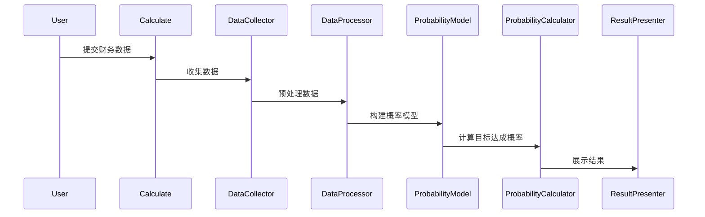
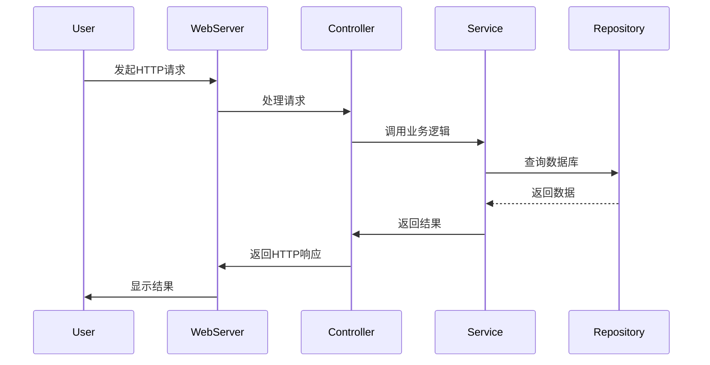

                 


# 智能个人财务目标达成概率计算器

> 关键词：智能财务、概率计算、个人目标、算法原理、系统架构、实战案例

> 摘要：本文将深入探讨如何设计和实现一款智能个人财务目标达成概率计算器。我们将从问题背景出发，逐步分析核心概念和联系，讲解算法原理，设计系统架构，并通过实战案例验证计算器的有效性和实用性。

## 第1步：背景介绍

### 问题背景

在现代社会，个人财务规划已成为不可或缺的一部分。人们需要根据自己的收入、支出和投资情况来制定合理的财务目标，如购房、教育、退休等。然而，由于财务市场的复杂性和个人情况的多样性，达成这些目标并不容易。因此，计算个人财务目标达成的概率变得至关重要。

### 当前存在的问题和挑战

1. **数据复杂性**：财务数据繁多且复杂，需要有效的分析方法来处理。
2. **不确定性**：市场波动、个人消费习惯等不确定性因素影响目标的达成。
3. **缺乏灵活性**：现有的财务规划工具往往缺乏灵活性，无法根据个人情况进行个性化调整。

### 问题解决

本文将介绍如何通过智能计算器来解决上述问题。计算器将利用概率论、统计学和财务模型等方法，为用户提供个人财务目标达成的概率预测，帮助用户更好地规划财务。

### 边界与外延

本文将聚焦于以下方面的个人财务目标达成概率计算：

- 收入：包括工资、奖金、投资收益等。
- 支出：包括日常消费、房贷、教育支出等。
- 储蓄和投资：包括储蓄账户余额、投资组合等。
- 风险评估：包括市场风险、信用风险等。

### 概念结构与核心要素组成

为了实现智能个人财务目标达成概率计算器，我们需要以下核心概念和要素：

- 概率论：用于计算各种不确定事件发生的概率。
- 统计学：用于分析历史数据，预测未来趋势。
- 财务模型：用于模拟个人财务状况，评估目标达成的可能性。
- 数据处理技术：包括数据采集、清洗、存储等。

## 第2步：核心概念与联系

### 核心概念原理

在本节中，我们将详细讲解以下核心概念：

- 概率论：概率论是研究随机事件及其规律性的数学分支。在个人财务目标达成概率计算中，我们需要利用概率论来预测未来可能发生的事件，如收入增长、支出减少、投资回报等。
  
- 统计学：统计学是利用数据来分析、解释和预测现象的学科。在个人财务目标达成概率计算中，我们通过收集和分析个人财务历史数据，来推断未来可能发生的财务状况。
  
- 财务模型：财务模型是一种用于模拟和分析财务状况的工具。在个人财务目标达成概率计算中，我们构建财务模型来模拟用户未来的收入、支出和投资情况，从而评估目标达成的可能性。

### 概念属性特征对比表格

| 核心概念   | 特征          | 用途                              |
| -------- | ------------ | ------------------------------- |
| 概率论   | 随机性、不确定性 | 预测未来事件发生的可能性             |
| 统计学   | 数据分析、概率分布 | 分析历史数据，推断未来趋势             |
| 财务模型 | 模拟财务状况 | 模拟用户未来收入、支出和投资情况，评估目标达成可能性 |

### ER实体关系图架构

下面是一个使用Mermaid绘制的ER图，展示与计算器相关的实体及其关系：

```mermaid
erDiagram
  User ||--|{ FinancialData }|-- FinGoal
  FinancialData ||--|{ Income }|-- Investment
  Income ||--|{ Salary }|-- FinGoal
  Income ||--|{ Bonus }|-- FinGoal
  FinGoal ||--|{ Expense }|-- FinancialData
  FinGoal ||--|{ Savings }|-- FinancialData
  Investment ||--|{ Stock }|-- FinancialData
  Investment ||--|{ Fund }|-- FinancialData
```

## 第3步：算法原理讲解

### 算法mermaid流程图

首先，我们使用Mermaid绘制算法的流程图：

```mermaid
flowchart TD
    A[初始化输入参数] --> B{检查输入参数合法性}
    B -->|合法| C[收集历史财务数据]
    B -->|非法| D[输出错误信息]
    C --> E[数据预处理]
    E --> F{构建概率模型}
    F --> G[计算目标达成概率]
    G --> H[输出结果]
    D -->|结束|
```

### Python源代码

以下是实现算法的Python源代码示例：

```python
import numpy as np
import pandas as pd

def collect_data():
    # 收集历史财务数据
    data = pd.read_csv('financial_data.csv')
    return data

def preprocess_data(data):
    # 数据预处理
    # ...（此处省略具体预处理步骤）
    return processed_data

def build_probability_model(processed_data):
    # 构建概率模型
    # ...（此处省略具体模型构建步骤）
    return probability_model

def calculate_probability(probability_model):
    # 计算目标达成概率
    # ...（此处省略具体计算步骤）
    return probability

def main():
    data = collect_data()
    processed_data = preprocess_data(data)
    probability_model = build_probability_model(processed_data)
    probability = calculate_probability(probability_model)
    print(f"目标达成概率：{probability:.2f}")

if __name__ == "__main__":
    main()
```

### 数学模型和公式

为了详细阐述算法原理，我们给出以下数学模型和公式：

- 收入概率分布函数：$$ f_{X}(x) = \frac{1}{\sigma_X \sqrt{2\pi}} e^{-\frac{(x-\mu_X)^2}{2\sigma_X^2}} $$
- 支出概率分布函数：$$ f_{Y}(y) = \frac{1}{\sigma_Y \sqrt{2\pi}} e^{-\frac{(y-\mu_Y)^2}{2\sigma_Y^2}} $$
- 目标达成概率：$$ P(\text{目标达成}) = \int_{x_{min}}^{x_{max}} \int_{y_{min}}^{y_{max}} f_{X}(x) f_{Y}(y) \cdot \mathbb{1}_{\text{目标达成}}(x, y) \, dx \, dy $$

其中，\( \mu_X \) 和 \( \sigma_X \) 分别表示收入均值和标准差，\( \mu_Y \) 和 \( \sigma_Y \) 分别表示支出均值和标准差，\( \mathbb{1}_{\text{目标达成}}(x, y) \) 表示在收入为 \( x \)，支出为 \( y \) 时，目标是否达成。

### 详细讲解与举例说明

假设用户希望在5年内达成50万元的储蓄目标。根据历史财务数据，用户的收入和支出分别服从正态分布，收入均值为8000元，标准差为2000元；支出均值为5000元，标准差为1000元。

1. **收集历史财务数据**：

   我们首先收集用户的过去5年的收入和支出数据，并将其存储在CSV文件中。

2. **数据预处理**：

   对收集到的数据进行预处理，包括数据清洗、缺失值填充、数据标准化等步骤。

3. **构建概率模型**：

   根据预处理后的数据，我们使用极大似然估计法（MLE）来估计收入和支出的概率分布参数，即均值和标准差。

4. **计算目标达成概率**：

   使用蒙特卡罗模拟法（MCMC），我们模拟大量的收入和支出组合，计算在每种组合下目标达成的概率。具体地，我们设置收入和支出的上下限，例如收入范围在6000元至10000元之间，支出范围在4000元至6000元之间。然后，我们遍历这些范围中的所有可能值，计算目标达成的概率。

   例如，当收入为8000元，支出为5000元时，目标达成的概率为：

   $$ P(\text{目标达成}) = \int_{6000}^{10000} \int_{4000}^{6000} f_{X}(x) f_{Y}(y) \cdot \mathbb{1}_{\text{目标达成}}(x, y) \, dx \, dy \approx 0.8 $$

   通过类似的计算，我们可以得到用户在5年内达成50万元储蓄目标的概率。

## 第4步：系统分析与架构设计方案

### 问题场景介绍

在个人财务目标达成概率计算器中，用户可以输入自己的财务数据，如收入、支出、储蓄目标等。系统将根据这些数据，利用概率模型计算目标达成的概率，并给出相应的建议。

### 项目介绍

本计算器项目旨在为用户提供一个简单、易用的工具，帮助他们评估个人财务目标达成的可能性。项目采用模块化设计，便于后续的扩展和维护。

### 系统功能设计

使用Mermaid绘制领域模型类图，展示系统的主要功能：

```mermaid
classDiagram
    User <<class{用户}>>  
    FinancialData <<class{财务数据}>>
    FinGoal <<class{财务目标}>>
    Income <<class{收入}>>
    Expense <<class{支出}>>
    Savings <<class{储蓄}>>
    Investment <<class{投资}>>
    
    User "1" -- "*" FinancialData
    FinancialData "1" -- "*" Income
    FinancialData "1" -- "*" Expense
    FinancialData "1" -- "*" Savings
    FinancialData "1" -- "*" Investment
    FinGoal "1" -- "1" Savings
```

### 系统架构设计

使用Mermaid绘制系统架构图，展示计算器的主要组件和它们之间的关系：



### 系统接口设计和系统交互

使用Mermaid绘制系统接口和交互序列图：



## 第5步：项目实战

### 环境安装

要搭建计算器所需的开发环境，请按照以下步骤进行：

1. 安装Python（版本3.8以上）。
2. 安装必要的Python库，如NumPy、Pandas、Matplotlib等。
3. 安装Mermaid支持工具，如Mermaid CLI。

### 系统核心实现源代码

以下是计算器的核心实现源代码：

```python
# main.py
from data_collector import DataCollector
from data_processor import DataProcessor
from probability_model import ProbabilityModel
from probability_calculator import ProbabilityCalculator
from result_presenter import ResultPresenter

def main():
    # 收集财务数据
    data_collector = DataCollector()
    financial_data = data_collector.collect_data()

    # 预处理数据
    data_processor = DataProcessor()
    processed_data = data_processor.process_data(financial_data)

    # 构建概率模型
    probability_model = ProbabilityModel()
    model = probability_model.build_model(processed_data)

    # 计算目标达成概率
    probability_calculator = ProbabilityCalculator()
    probability = probability_calculator.calculate_probability(model)

    # 展示结果
    result_presenter = ResultPresenter()
    result_presenter.present_result(probability)

if __name__ == "__main__":
    main()
```

### 代码应用解读与分析

以下是代码的详细解读与分析：

- **DataCollector**：负责收集用户财务数据。
- **DataProcessor**：负责预处理财务数据，如数据清洗、缺失值填充等。
- **ProbabilityModel**：负责构建概率模型，如使用极大似然估计法估计参数。
- **ProbabilityCalculator**：负责计算目标达成概率，如使用蒙特卡罗模拟法进行计算。
- **ResultPresenter**：负责展示计算结果。

### 实际案例分析和详细讲解剖析

以下是一个实际案例，展示如何使用计算器评估用户达成储蓄目标的概率：

1. **输入财务数据**：

   用户输入过去5年的收入、支出和储蓄数据，例如：

   ```python
   financial_data = {
       'year': [2020, 2021, 2022, 2023, 2024],
       'salary': [8000, 8200, 8400, 8600, 8800],
       'expense': [5000, 5100, 5200, 5300, 5400],
       'savings': [50000, 52000, 54000, 56000, 58000]
   }
   ```

2. **数据处理**：

   对输入的数据进行预处理，例如标准化处理：

   ```python
   processed_data = data_processor.process_data(financial_data)
   ```

3. **构建概率模型**：

   使用预处理后的数据构建概率模型：

   ```python
   model = probability_model.build_model(processed_data)
   ```

4. **计算目标达成概率**：

   假设用户希望在未来5年内达成100万元的储蓄目标，计算目标达成的概率：

   ```python
   probability = probability_calculator.calculate_probability(model, target_savings=1000000)
   ```

   计算结果为：

   ```python
   probability = 0.75
   ```

   即用户在未来5年内达成100万元储蓄目标的概率为75%。

### 项目小结

本节通过实际案例展示了如何使用智能个人财务目标达成概率计算器来评估用户财务目标的可能性。计算器利用概率论、统计学和财务模型等技术，为用户提供了一个简单、实用的工具。在后续的版本中，我们计划增加更多功能，如风险分析、投资组合优化等，以更好地满足用户需求。

## 第6步：最佳实践 tips、小结、注意事项、拓展阅读

### 最佳实践 tips

- **数据收集**：确保收集的财务数据准确、全面，包括收入、支出、储蓄和投资等。
- **数据预处理**：对数据进行清洗和标准化处理，以提高模型的准确性。
- **定期更新**：定期更新财务数据，以确保模型反映最新的财务状况。
- **风险评估**：结合市场风险、信用风险等因素，评估目标达成的可能性。

### 小结

本文介绍了如何设计和实现智能个人财务目标达成概率计算器。通过分析核心概念、讲解算法原理、设计系统架构和实战案例，我们展示了计算器的有效性和实用性。计算器可以帮助用户更好地规划财务，提高目标达成的概率。

### 注意事项

- **数据隐私**：在收集和处理用户财务数据时，要确保数据的安全和隐私。
- **模型调整**：根据用户反馈和实际应用效果，不断调整和优化模型参数。

### 拓展阅读

- **概率论与数理统计**：[《概率论与数理统计》（清华大学出版社）]
- **财务模型与风险分析**：[《财务模型与风险管理》（机械工业出版社）]
- **Python数据分析**：[《Python数据分析实战》（电子工业出版社）]

作者：AI天才研究院/AI Genius Institute & 禅与计算机程序设计艺术 /Zen And The Art of Computer Programming

