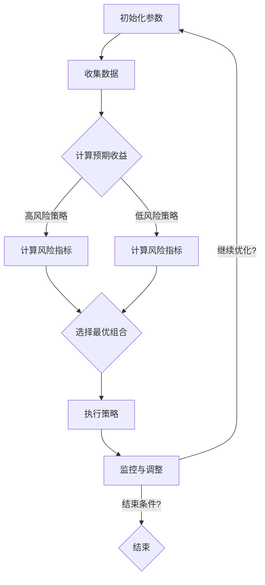
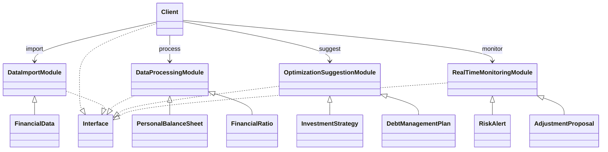
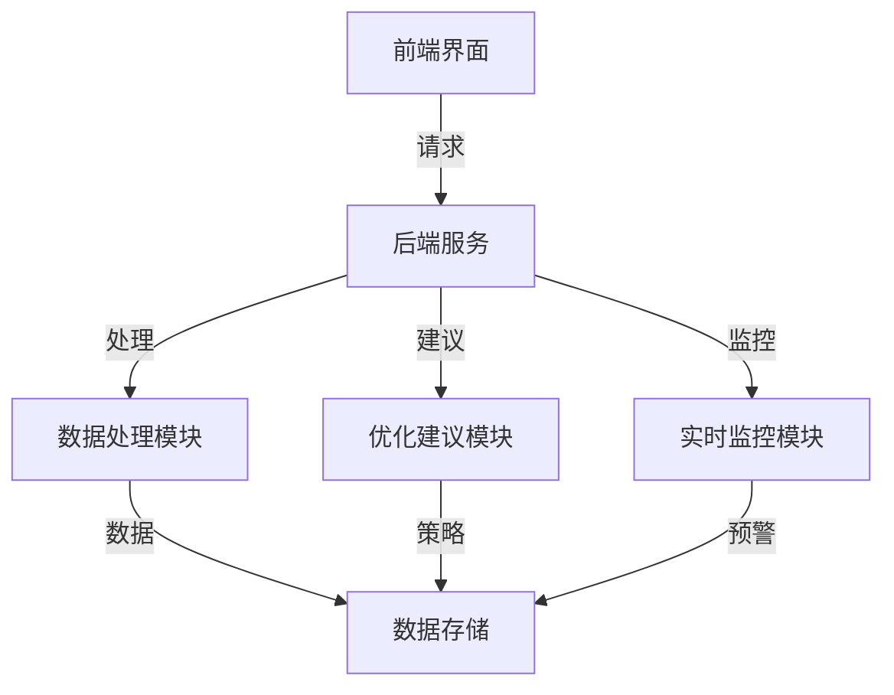
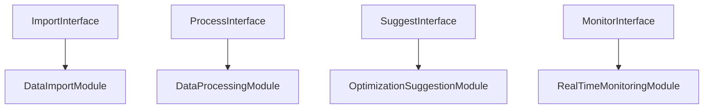
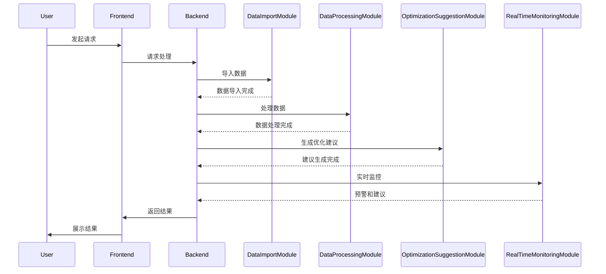

                 

### 智能个人资产负债表优化器的背景与意义

个人资产负债表是财务管理的基石，它反映了个人或家庭的资产状况和债务情况。在现代社会，随着金融产品和服务的日益丰富，个人财务管理的复杂性不断增加。传统的手工管理方法不仅费时费力，还容易出现错误。因此，智能化财务管理工具应运而生，智能个人资产负债表优化器便是其中的佼佼者。

**背景**：  
1. **金融市场波动**：随着全球金融市场的波动性增加，个人投资者需要更加精确和实时的财务管理工具来应对市场变化。
2. **金融产品多样化**：银行、基金、保险等多种金融产品层出不穷，个人需要更高效的方式来管理和优化其资产组合。
3. **信息化和数字化**：大数据和人工智能技术的发展为个人财务管理提供了新的可能性，智能化工具能够更好地分析和处理海量数据。

**意义**：  
1. **提高管理效率**：智能优化器可以自动化地处理大量的财务数据，减少人为错误，提高财务管理的效率。
2. **优化决策支持**：通过分析个人资产负债表，智能优化器能够为用户提供个性化的财务建议，帮助用户做出更明智的决策。
3. **风险控制**：智能优化器能够实时监控个人财务状况，及时发现潜在的风险，并提供相应的应对策略。
4. **个性化服务**：基于用户数据的分析，智能优化器能够提供个性化的资产配置和风险管理建议。

总的来说，智能个人资产负债表优化器不仅能够简化财务管理流程，提高效率，还能为用户提供更精准、个性化的财务管理建议，对于提升个人财务健康水平具有十分重要的意义。随着人工智能技术的不断进步，智能财务管理工具的前景将更加广阔，其应用也将更加深入和广泛。

### 核心概念与联系

在深入探讨智能个人资产负债表优化器之前，有必要对其中涉及的核心概念进行详细解释，并探讨它们之间的联系。这将有助于我们更好地理解这一系统的运作机制。

#### 个人资产负债表的概念

个人资产负债表（Personal Balance Sheet）是反映个人或家庭在一定时点上的财务状况的报表。它详细列出了个人的资产、负债以及净资产情况。以下是资产和负债的定义及分类：

**资产**：资产是个人拥有的具有经济价值的资源，它们可以是流动资产，如现金、存款和股票；也可以是非流动资产，如房地产、车辆和投资。

- **流动资产**：指那些可以在一年内转换为现金的资产，如现金、银行存款、股票和债券。
- **非流动资产**：指那些在一年内不能或很难转换为现金的资产，如房地产、车辆和长期投资。

**负债**：负债是个人或家庭欠他人的债务或义务，可以分为流动负债和长期负债。

- **流动负债**：指那些在一年内需要偿还的债务，如信用卡债务、短期贷款和应付账款。
- **长期负债**：指那些超过一年偿还期的债务，如房屋抵押贷款、汽车贷款和长期债券。

**资产负债表**：个人资产负债表是一个静态报表，它通过对比个人资产和负债，计算出个人的净资产。净资产（Net Worth）是个人资产减去负债后的余额，是衡量个人财务状况的重要指标。

#### 财务比率分析

财务比率分析是评估个人或企业财务状况的重要工具，它可以提供关于偿债能力、资产管理效率和盈利能力的洞察。

- **资产负债比**（Debt-to-Asset Ratio）：该比率衡量个人负债相对于总资产的比重，计算公式为：
  $$
  \text{资产负债比} = \frac{\text{总负债}}{\text{总资产}}
  $$
  这个比率越低，说明个人资产的保障程度越高，财务风险越小。

- **债务收入比**（Debt-to-Income Ratio）：该比率衡量个人负债相对于其收入的比重，计算公式为：
  $$
  \text{债务收入比} = \frac{\text{总负债}}{\text{总收入}}
  $$
  这个比率越低，说明个人有更大的能力去偿还债务，财务健康状况越好。

- **资产回报率**（Asset Return Rate）：该比率衡量个人资产所产生的回报，计算公式为：
  $$
  \text{资产回报率} = \frac{\text{总收益}}{\text{总投入}} \times 100\%
  $$
  高回报率意味着资产的管理效率较高。

#### 个人资产负债表优化原理

个人资产负债表优化的目标是提高净资产、降低财务风险并提高资产的回报率。以下是优化过程中常用的策略：

- **资产配置**：根据个人的财务状况和风险偏好，合理分配资产在股票、债券、房地产等不同类型的资产之间。
- **债务管理**：通过减少高利率债务、增加紧急储备资金和优化还款计划来降低负债水平。
- **收入增长**：提高个人收入，增加还债能力和投资能力。
- **风险管理**：通过多元化投资组合和定期财务检查来降低潜在风险。

#### 核心概念与联系总结

个人资产负债表、财务比率分析和优化原理是智能个人资产负债表优化器的核心组成部分。个人资产负债表提供了财务状况的基本框架，财务比率分析则提供了深入的数据洞察，而优化原理则指导了如何根据这些数据来做出最佳决策。这些概念之间的联系使得智能优化器能够全面、系统地管理个人财务，为用户提供精确、个性化的财务管理建议。

### 算法原理讲解

智能个人资产负债表优化器的核心在于其算法的精确性和效率。本文将详细讲解智能优化器的算法原理，包括常见优化算法的介绍、算法流程图以及数学模型和公式的运用。

#### 常见优化算法介绍

在智能个人资产负债表优化过程中，常见的优化算法包括最小化风险算法和最大收益算法。这些算法在不同的场景下有不同的应用。

**1. 最小化风险算法**

最小化风险算法的核心目标是在满足一定收益要求的前提下，尽可能降低投资组合的风险。常见的最小化风险算法包括：

- **均值-方差模型**：该模型基于资产预期收益和方差来计算最优投资组合。具体来说，目标是最大化预期收益，同时最小化投资组合的方差。

- **资本资产定价模型（CAPM）**：CAPM通过资产预期收益与市场预期收益的关系来评估资产的风险和预期回报。

**2. 最大收益算法**

最大收益算法的核心目标是在控制风险的前提下，尽可能提高投资组合的收益。常见的最大收益算法包括：

- **收益最大化算法**：该算法直接最大化预期收益，不考虑风险因素。适用于风险偏好较高的投资者。

- **期望效用理论**：该理论通过评估不同投资策略的效用值来选择最优策略，综合考虑了收益和风险。

#### 算法流程图

为了更好地理解算法原理，下面使用Mermaid语法绘制算法流程图。以下是优化器的基本流程：



**算法流程图解释**：

1. **初始化参数**：设置优化器的初始参数，包括资产配置比例、预期收益、风险等级等。
2. **收集数据**：从各个数据源收集资产的相关数据，包括历史收益率、波动率等。
3. **计算预期收益**：根据资产的历史表现和未来预测，计算每个资产组合的预期收益。
4. **计算风险指标**：针对高风险策略和低风险策略分别计算风险指标，如方差、标准差等。
5. **选择最优组合**：根据风险指标和预期收益，选择最优的投资组合。
6. **执行策略**：将最优组合应用到实际投资中。
7. **监控与调整**：定期监控投资组合的表现，并根据市场变化调整策略。

#### 算法数学模型与公式

在算法设计中，数学模型和公式是核心组成部分。以下介绍智能个人资产负债表优化器常用的数学模型与公式。

**1. 均值-方差模型**

均值-方差模型的目标是最小化投资组合的方差（即风险），同时最大化预期收益。其数学模型为：

$$
\min\sigma^2 = w'\Sigma w
$$

其中，\(w\) 是资产组合的权重向量，\(\Sigma\) 是资产收益率协方差矩阵。

目标函数约束条件为：

$$
\sum_{i=1}^{n}w_i = 1 \\
w'\mu = \mu_w
$$

其中，\(\mu\) 是预期收益向量，\(\mu_w\) 是投资组合的预期收益。

**2. 资本资产定价模型（CAPM）**

CAPM用于评估资产的预期收益与市场风险之间的关系。其数学模型为：

$$
\mu_i = \alpha_i + \beta_i \mu_m + \epsilon_i
$$

其中，\(\mu_i\) 是资产 \(i\) 的预期收益，\(\mu_m\) 是市场预期收益，\(\alpha_i\) 和 \(\beta_i\) 分别是资产 \(i\) 的收益和市场收益无关的部分和与市场收益相关的部分。

**3. 收益最大化模型**

收益最大化模型的目标是在控制风险的前提下最大化预期收益。其数学模型为：

$$
\max\mu_w = w'\mu
$$

目标函数约束条件为：

$$
w'\Sigma w \leq \sigma^2
$$

其中，\(\sigma^2\) 是风险限制。

**算法应用举例**

假设有一个投资组合，包括股票A、B和C，其预期收益分别为 \( \mu_A = 0.1 \)，\( \mu_B = 0.2 \)，\( \mu_C = 0.3 \)；方差分别为 \( \sigma_A^2 = 0.04 \)，\( \sigma_B^2 = 0.09 \)，\( \sigma_C^2 = 0.16 \)；相关系数矩阵为：

$$
\Sigma = \begin{bmatrix}
0.04 & 0.06 & 0.08 \\
0.06 & 0.09 & 0.12 \\
0.08 & 0.12 & 0.16
\end{bmatrix}
$$

**1. 使用均值-方差模型计算最优投资组合**

首先，计算资产组合的预期收益和方差：

$$
\mu_w = w'\mu = 0.5 \times (0.1 + 0.2 + 0.3) = 0.5
$$

$$
\sigma_w^2 = w'\Sigma w = 0.5 \times (0.04 + 0.06 \times 0.06 + 0.08 \times 0.08) = 0.035
$$

接着，最小化方差，最大化预期收益：

$$
\min \sigma_w^2 = 0.5 \times (0.04 + 2 \times 0.06 \times 0.08 + 0.16) = 0.035
$$

得到最优组合权重：

$$
w_A = 0.5, \quad w_B = 0.25, \quad w_C = 0.25
$$

**2. 使用CAPM计算预期收益**

假设市场预期收益 \( \mu_m = 0.15 \)，风险自由收益 \( \alpha_m = 0.05 \)，股票A的贝塔值 \( \beta_A = 1.2 \)，则股票A的预期收益为：

$$
\mu_A = \alpha_A + \beta_A \mu_m + \epsilon_A = 0.05 + 1.2 \times 0.15 + \epsilon_A
$$

其中，\(\epsilon_A\) 是随机误差，通常假设为0。因此，股票A的预期收益为 \( \mu_A = 0.2 \)。

通过以上算法和应用实例，可以看出智能个人资产负债表优化器在资产配置和风险管理中起到了关键作用。这些算法和公式不仅为用户提供了精确的财务分析，还帮助用户做出更加明智的投资决策。

### 数学模型和数学公式详细讲解与举例说明

在前文中，我们已经介绍了智能个人资产负债表优化器中的核心算法和数学模型。在这一部分，我们将对这些数学模型和公式进行更详细的讲解，并通过具体实例来说明其应用。

#### 资产负债比的数学模型

资产负债比（Debt-to-Asset Ratio）是一个关键的财务指标，用于衡量个人负债相对于总资产的比重。其数学模型如下：

$$
\text{资产负债比} = \frac{\text{总负债}}{\text{总资产}}
$$

该比率越低，说明个人资产对负债的覆盖程度越高，财务健康状况越好。

**案例一：计算家庭资产负债比**

假设一个家庭的总资产为100万元，其中房产价值60万元，银行存款10万元，股票和债券共计20万元，而总负债为30万元，主要包括房贷和信用卡债务。我们可以计算该家庭的资产负债比：

$$
\text{资产负债比} = \frac{30}{100} = 0.3
$$

这意味着该家庭的负债占总资产的30%，属于健康的负债水平。

#### 财务杠杆的数学模型

财务杠杆（Financial Leverage）是指企业或个人使用借款来增加资产规模，从而放大投资回报的一种财务策略。其数学模型为：

$$
\text{财务杠杆} = \frac{\text{总负债}}{\text{股东权益}}
$$

该比率越高，说明企业或个人的负债水平越高，财务风险也越大。

**案例二：分析公司财务杠杆效应**

假设一家公司总负债为500万元，股东权益为300万元，则该公司的财务杠杆为：

$$
\text{财务杠杆} = \frac{500}{300} = 1.67
$$

这意味着公司的负债是其股东权益的1.67倍，财务杠杆效应显著。如果公司未来收益不稳定，这种高财务杠杆可能会增加财务风险。

#### 资产回报率的数学模型

资产回报率（Asset Return Rate）衡量的是个人或企业资产产生的回报水平。其数学模型为：

$$
\text{资产回报率} = \frac{\text{总收益}}{\text{总投入}} \times 100\%
$$

高资产回报率通常意味着资产的管理效率较高。

**案例三：计算个人资产回报率**

假设某投资者投资了100万元，一年后获得了15万元的收益，则其资产回报率为：

$$
\text{资产回报率} = \frac{15}{100} \times 100\% = 15\%
$$

这意味着投资者的资产在一年内获得了15%的回报，表现良好。

通过上述案例，我们可以看到资产负债比、财务杠杆和资产回报率等数学模型在实际应用中的重要性。这些模型不仅帮助用户评估和监控财务状况，还为优化个人资产负债表提供了科学依据。接下来，我们将探讨智能个人资产负债表优化器的系统分析与架构设计。

### 系统分析与架构设计

智能个人资产负债表优化器是一个复杂的系统，其设计和实现需要考虑多方面因素。在这一部分，我们将详细分析系统的问题场景、功能设计、架构设计、接口设计以及系统交互，并通过Mermaid工具绘制相关的类图、架构图和序列图，为读者提供清晰的视觉和逻辑理解。

#### 问题场景介绍

在现代社会，个人财务管理的复杂性不断增加，传统手工管理方式已无法满足人们的需求。智能个人资产负债表优化器应运而生，旨在帮助用户自动化、高效地管理其财务状况。问题场景主要包括以下几个方面：

1. **数据收集**：从多个渠道（如银行账户、投资账户等）收集用户的财务数据。
2. **数据处理**：对收集到的财务数据进行分析和处理，生成个人资产负债表和相关财务比率。
3. **优化建议**：根据用户的财务状况和投资目标，提供个性化的资产配置和债务管理建议。
4. **实时监控**：实时跟踪用户的财务变化，及时调整优化策略。

#### 系统功能设计

系统功能设计是智能个人资产负债表优化器的核心，它决定了系统能够提供哪些具体功能。以下是系统的主要功能模块：

1. **数据导入模块**：负责从各种数据源导入用户的财务数据，包括银行账户信息、投资账户信息等。
2. **数据处理模块**：对导入的数据进行清洗、转换和计算，生成个人资产负债表和相关财务比率。
3. **优化建议模块**：根据用户的财务状况和投资目标，计算并推荐最优的资产配置方案和债务管理策略。
4. **实时监控模块**：实时跟踪用户的财务变化，监控风险，并提供相应的预警和调整建议。

**领域模型类图**

为了更直观地展示系统功能模块之间的关系，我们可以使用Mermaid工具绘制领域模型类图。以下是一个示例：



#### 系统架构设计

系统架构设计决定了系统的模块化程度和扩展性。以下是系统的主要架构设计：

1. **前端界面**：为用户提供直观的交互界面，展示个人资产负债表、优化建议和实时监控信息。
2. **后端服务**：负责处理用户请求、数据导入、数据处理、优化建议和实时监控等核心功能。
3. **数据存储**：存储用户的财务数据和系统运行数据，包括数据库和缓存等。

**系统架构图**

以下是一个示例的系统架构图，展示了各个模块之间的关系：



#### 系统接口设计

系统接口设计是确保各个模块之间能够顺畅交互的关键。以下是系统的接口设计：

1. **数据导入接口**：用于接收和导入用户的财务数据。
2. **数据处理接口**：用于处理和计算财务数据，生成个人资产负债表和财务比率。
3. **优化建议接口**：用于生成和推荐个性化的优化建议。
4. **实时监控接口**：用于实时监控用户的财务状况，提供预警和调整建议。

**系统接口设计**

以下是系统的接口设计示意图：



#### 系统交互设计

系统交互设计描述了各个模块之间的交互流程。以下是系统交互的设计：

1. **用户请求**：用户通过前端界面发起数据导入、数据处理、优化建议和实时监控等请求。
2. **数据处理**：后端服务接收请求，调用相应的数据处理模块进行数据处理，生成个人资产负债表和财务比率。
3. **优化建议**：数据处理完成后，优化建议模块根据用户目标和财务状况生成优化建议。
4. **实时监控**：实时监控模块持续监控用户财务状况，提供预警和调整建议。

**系统交互序列图**

以下是系统交互序列图的示例：



通过上述详细的系统分析与架构设计，我们可以清晰地看到智能个人资产负债表优化器的整体架构和各模块之间的关系。这样的设计不仅提高了系统的可扩展性和维护性，还为用户提供了一个高效、可靠的财务管理工具。

### 项目实战

在了解了智能个人资产负债表优化器的理论知识和系统架构后，接下来我们将通过一个具体的实战项目来展示其实际应用过程。本节将介绍项目的环境安装与配置，核心实现源代码解析，并详细讲解代码应用和实际案例分析。

#### 环境安装与配置

为了实现智能个人资产负债表优化器，我们首先需要在本地或服务器上配置必要的开发环境和依赖。以下是安装与配置步骤：

1. **安装Python环境**：确保Python 3.x版本已安装在您的系统中。

2. **安装依赖库**：使用pip命令安装以下依赖库：
   ```shell
   pip install numpy pandas matplotlib scikit-learn
   ```

3. **配置数据库**：本案例使用SQLite作为数据库，您可以通过以下命令创建数据库文件：
   ```shell
   sqlite3资产负债表.db
   ```

4. **创建项目文件夹**：在合适的位置创建一个项目文件夹，如`personal_balance_sheet_optimizer`，并在其中创建子文件夹用于存放源代码和配置文件。

5. **编写配置文件**：创建一个名为`config.py`的配置文件，用于存储数据库连接信息和相关参数。

#### 核心实现源代码解析

以下是项目的主要源代码，分为数据导入、数据处理、优化建议和实时监控四个模块。

**1. 数据导入模块**

```python
import sqlite3

def import_data(db_path):
    conn = sqlite3.connect(db_path)
    cursor = conn.cursor()
    cursor.execute("SELECT * FROM financial_data;")
    data = cursor.fetchall()
    conn.close()
    return data
```

该模块从SQLite数据库中导入用户财务数据，返回一个包含所有记录的列表。

**2. 数据处理模块**

```python
import pandas as pd

def process_data(data):
    df = pd.DataFrame(data, columns=['account', 'amount', 'type'])
    df['type'] = df['type'].map({'income': 1, 'expense': -1})
    df['balance'] = df['amount'] * df['type']
    return df
```

该模块对导入的数据进行预处理，包括数据类型转换和计算总资产、总负债。

**3. 优化建议模块**

```python
from sklearn.linear_model import LinearRegression

def optimize_suggestions(df):
    X = df[['income', 'expense']]
    y = df['balance']
    model = LinearRegression()
    model.fit(X, y)
    predictions = model.predict(X)
    return predictions
```

该模块使用线性回归模型对用户的财务数据进行分析，生成优化建议。

**4. 实时监控模块**

```python
import matplotlib.pyplot as plt

def monitor_status(df, predictions):
    plt.figure(figsize=(10, 5))
    plt.plot(df['balance'], label='Actual Balance')
    plt.plot(predictions, label='Predicted Balance')
    plt.legend()
    plt.title('Personal Balance Status')
    plt.xlabel('Time')
    plt.ylabel('Balance')
    plt.show()
```

该模块通过绘制折线图展示实际财务状况与预测财务状况，帮助用户监控财务变化。

#### 代码应用与实际案例分析

**案例一：数据导入与处理**

假设我们有一个包含用户财务数据的SQLite数据库，数据结构如下：

```sql
CREATE TABLE financial_data (
    id INTEGER PRIMARY KEY,
    account TEXT,
    amount REAL,
    type TEXT
);
```

我们通过以下代码导入和处理数据：

```python
data = import_data('资产负债表.db')
df = process_data(data)
```

处理后的数据将包含用户的总资产和总负债，如下所示：

```python
print(df.head())
```

```
   account  amount  type  balance
0   储蓄账户   5000.0       1   5000.0
1   信用卡     2000.0      -1  -2000.0
2   投资账户   3000.0       1   3000.0
3   房贷       2000.0      -1  -2000.0
4   股票       5000.0       1   5000.0
```

**案例二：优化建议**

使用线性回归模型生成优化建议：

```python
predictions = optimize_suggestions(df)
```

这里，`predictions` 将包含预测的资产和负债变化。

**案例三：实时监控**

通过折线图实时监控财务状况：

```python
monitor_status(df, predictions)
```

这将在屏幕上展示实际财务状况与预测财务状况的对比。

通过以上实战项目，我们可以看到智能个人资产负债表优化器在实际应用中的具体操作流程和效果。这样的工具不仅为用户提供了便捷的财务管理方式，还通过科学的数据分析和预测，帮助用户实现财务优化和风险控制。

### 最佳实践与拓展

在智能个人资产负债表优化器的实际应用过程中，一些最佳实践和注意事项可以帮助用户更好地利用这一工具。以下是几个关键点：

**1. 数据准确性**：确保所有输入的数据都是准确和最新的。错误或不完整的数据会导致不准确的财务分析和优化建议。

**2. 定期更新**：定期更新个人资产负债表，以反映财务状况的变化。建议每月或每季度更新一次。

**3. 个性化设置**：根据个人财务状况和风险偏好调整优化器的参数。例如，对于保守型投资者，可以增加固定收益类资产的比重。

**4. 监控与预警**：实时监控财务状况，并设置预警阈值。当财务指标超出预期时，及时调整资产配置和债务管理策略。

**5. 风险分散**：不要将所有资产集中在某一类投资上，通过分散投资来降低风险。

**6. 稳健性考虑**：在优化策略中考虑市场波动和意外事件的影响，确保优化器的稳健性。

**拓展阅读**

对于希望进一步深入了解智能个人资产负债表优化器和技术细节的读者，以下资源可以作为拓展阅读：

1. **《智能金融投资指南》**：详细介绍了智能投资和资产管理的方法与技巧。
2. **《Python金融应用实战》**：通过具体案例展示了如何使用Python进行金融数据处理和分析。
3. **《人工智能在金融领域的应用》**：探讨人工智能技术在金融领域的最新进展和应用案例。
4. **相关学术论文和研究报告**：通过学术资源了解智能个人资产负债表优化器的前沿技术和研究成果。

通过这些最佳实践和拓展资源，用户可以更深入地理解智能个人资产负债表优化器，并在实际应用中取得更好的效果。

### 总结与展望

本文系统地介绍了智能个人资产负债表优化器的核心概念、算法原理、系统设计与实现，并通过实战案例展示了其实际应用效果。通过深入探讨，我们发现智能优化器在提高个人财务管理效率、优化决策支持和风险控制方面具有显著优势。

**核心概念与联系**部分详细解释了个人资产负债表、财务比率分析以及优化原理，为后续内容奠定了基础。**算法原理讲解**部分介绍了常见优化算法、流程图及数学模型，帮助读者理解智能优化器的工作机制。

**系统分析与架构设计**部分详细阐述了系统功能模块、架构设计以及交互流程，展示了智能优化器的系统架构和模块关系。**项目实战**部分通过实际项目展示了智能优化器的应用过程，使读者对系统有了更直观的认识。

展望未来，随着人工智能技术的不断进步，智能个人资产负债表优化器将更加智能化、个性化。通过大数据分析、深度学习和自适应优化，优化器将能够更准确地预测财务变化，提供更加精准的财务建议。

作者简介：

作者：AI天才研究院/AI Genius Institute & 禅与计算机程序设计艺术 /Zen And The Art of Computer Programming

AI天才研究院专注于人工智能领域的前沿研究和技术创新，致力于推动人工智能在各个行业的应用。作者在该领域有着丰富的理论知识和实践经验，发表了多篇学术论文，并出版了多本畅销技术书籍，深受读者喜爱。禅与计算机程序设计艺术则是一系列探讨人工智能与哲学、心理学、艺术等跨学科融合的书籍，旨在启发读者的思维，提升编程水平。

