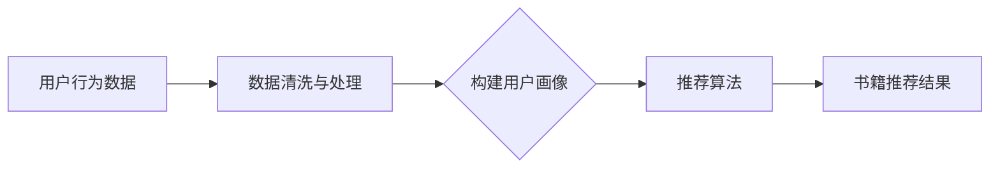
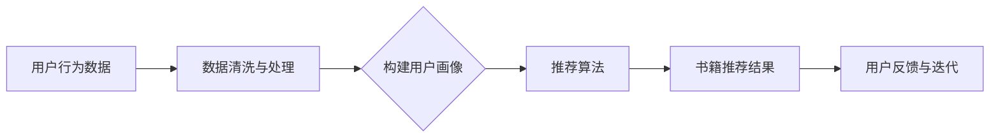
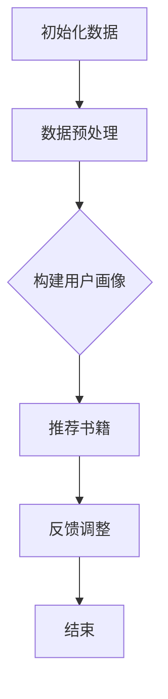
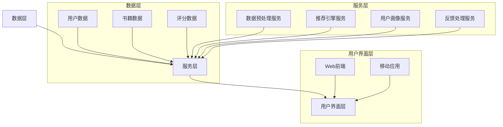
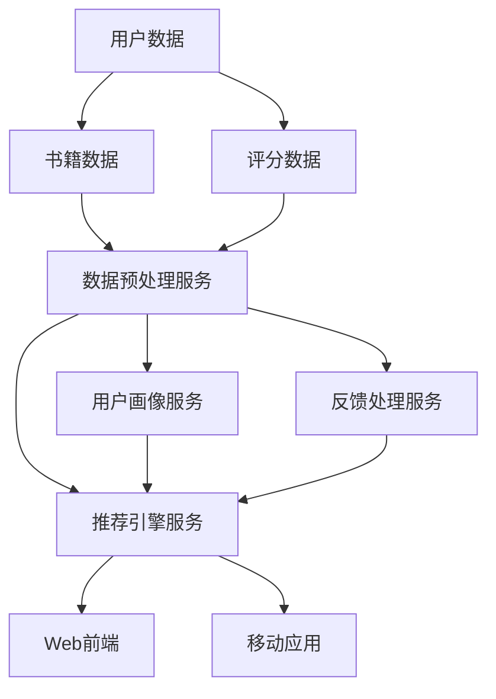
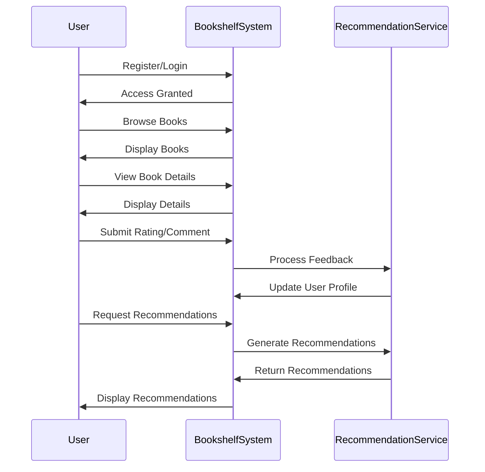

                 

### 第一步：创建智能书架的全面大纲

在撰写《智能书架：AI Agent的阅读兴趣拓展系统》这本书之前，我们需要首先创建一个全面的大纲。一个清晰、结构化的大纲可以帮助我们组织思路，确保文章的逻辑性和连贯性。以下是这本书的markdown格式大纲：

```markdown
----------------------------------------------------------------
# 第二部分：问题背景与核心概念

## 2.1 问题背景与智能书架的必要性
### 2.1.1 当前阅读环境的挑战
- **数字化阅读的兴起**：随着数字技术的快速发展，人们阅读的方式也在发生改变。电子书、在线阅读和社交媒体等数字化阅读形式逐渐普及。
- **个性化阅读需求的增加**：每个人对书籍的偏好不同，传统书架难以满足用户个性化的阅读需求。

### 2.1.2 智能书架的目标
- **提升阅读体验**：通过智能推荐，帮助用户发现更多符合其兴趣的书籍。
- **增强互动性**：利用AI Agent与用户互动，提高用户的参与度和忠诚度。

### 2.1.3 智能书架的应用范围
- **家庭环境**：为家庭用户提供个性化阅读服务。
- **图书馆环境**：为图书馆用户推荐书籍，提高图书流通率和用户满意度。

## 2.2 智能书架的核心概念
### 2.2.1 AI Agent的概念
- **定义**：AI Agent是一种具有自主决策能力的计算机程序，能在特定环境中执行任务。
- **特性**：自主性、适应性和协作性。

### 2.2.2 阅读兴趣拓展系统的工作原理
- **数据收集**：通过用户行为数据了解其兴趣偏好。
- **推荐算法**：利用机器学习算法推荐书籍。

### 2.2.3 AI Agent的角色与功能
- **用户画像构建**：分析用户阅读历史，构建用户画像。
- **书籍推荐**：根据用户画像，推荐符合其兴趣的书籍。

## 2.3 核心概念属性特征对比表
### 2.3.1 AI Agent与传统阅读系统的区别
| 特征 | AI Agent | 传统阅读系统 |
| --- | --- | --- |
| 自主性 | 高 | 低 |
| 个性化推荐 | 强 | 弱 |
| 互动性 | 强 | 弱 |

### 2.3.2 阅读兴趣拓展系统与其他推荐系统的对比
| 系统 | 推荐算法 | 用户数据依赖 | 互动性 |
| --- | --- | --- | --- |
| 智能书架 | 机器学习 | 高 | 强 |
| 社交媒体推荐 | 统计方法 | 中 | 中 |
| 商品推荐平台 | 分类算法 | 低 | 弱 |

## 2.4 ER图架构展示
### 2.4.1 系统实体与关系
```mermaid
erDiagram
User ||--o{ Book } : 阅读历史
User ||--o{ AI_Agent } : 互动
AI_Agent ||--|{ Book_Recommendation } : 推荐书籍
```

### 2.4.2 数据流与信息处理流程


## 2.5 本章小结
- 智能书架的必要性：解决当前阅读环境中的个性化需求。
- AI Agent在智能书架中的作用：提高用户体验，增强互动性。
- 对比分析：AI Agent与传统阅读系统的差异及阅读兴趣拓展系统与其他推荐系统的异同。

----------------------------------------------------------------
```

在这个大纲中，我们详细介绍了智能书架的背景、必要性、应用范围，以及智能书架的核心概念如AI Agent和阅读兴趣拓展系统的工作原理。我们还通过对比表和ER图展示了智能书架的关键概念和关系。

### 2.1 问题背景与智能书架的必要性

#### 2.1.1 当前阅读环境的挑战

**数字化阅读的兴起**：随着数字技术的快速发展，人们阅读的方式也在发生改变。电子书、在线阅读和社交媒体等数字化阅读形式逐渐普及。虽然这些方式带来了阅读的便捷性，但也带来了新的挑战。

**个性化阅读需求的增加**：每个人对书籍的偏好不同，传统书架难以满足用户个性化的阅读需求。用户需要更加定制化的阅读体验，以便快速发现符合个人兴趣的书籍。

#### 2.1.2 智能书架的目标

**提升阅读体验**：通过智能推荐，帮助用户发现更多符合其兴趣的书籍。智能书架可以利用AI Agent分析用户的行为数据，了解用户的阅读偏好，从而提供个性化的推荐。

**增强互动性**：利用AI Agent与用户互动，提高用户的参与度和忠诚度。AI Agent可以与用户进行对话，回答关于书籍的问题，甚至根据用户的反馈调整推荐策略。

#### 2.1.3 智能书架的应用范围

**家庭环境**：为家庭用户提供个性化阅读服务。在家庭环境中，智能书架可以帮助家庭成员发现共同的兴趣，促进家庭阅读文化的形成。

**图书馆环境**：为图书馆用户推荐书籍，提高图书流通率和用户满意度。图书馆作为公共文化场所，智能书架可以帮助图书馆更好地满足用户需求，提高服务质量和用户满意度。

### 2.2 智能书架的核心概念

#### 2.2.1 AI Agent的概念

**定义**：AI Agent是一种具有自主决策能力的计算机程序，能在特定环境中执行任务。它不仅能够理解用户的需求，还能根据环境变化自主调整行为。

**特性**：

- **自主性**：AI Agent能够自主地做出决策，无需人工干预。
- **适应性**：AI Agent能够根据环境变化和用户反馈调整行为。
- **协作性**：AI Agent可以与其他系统或AI Agent协同工作，共同完成任务。

#### 2.2.2 阅读兴趣拓展系统的工作原理

**数据收集**：AI Agent首先需要收集用户的行为数据，如阅读历史、书籍评分、评论等。这些数据可以帮助AI Agent了解用户的兴趣偏好。

**推荐算法**：基于用户的行为数据，AI Agent会利用推荐算法为用户推荐书籍。常见的推荐算法包括协同过滤、基于内容的推荐和混合推荐等。

**互动与反馈**：AI Agent会与用户进行互动，回答关于书籍的问题，并根据用户的反馈调整推荐策略。这种互动性可以提高用户的参与度和满意度。

#### 2.2.3 AI Agent的角色与功能

**用户画像构建**：AI Agent会分析用户的阅读历史和偏好，构建用户画像。用户画像可以帮助AI Agent更准确地理解用户的需求。

**书籍推荐**：根据用户画像，AI Agent会为用户推荐书籍。推荐结果会根据用户的反馈不断优化，以提高推荐的准确性。

**互动与反馈**：AI Agent会与用户进行对话，回答关于书籍的问题，并根据用户的反馈调整推荐策略。这种互动性可以提高用户的参与度和满意度。

### 2.3 核心概念属性特征对比表

#### 2.3.1 AI Agent与传统阅读系统的区别

| 特征 | AI Agent | 传统阅读系统 |
| --- | --- | --- |
| 自主性 | 高 | 低 |
| 个性化推荐 | 强 | 弱 |
| 互动性 | 强 | 弱 |

#### 2.3.2 阅读兴趣拓展系统与其他推荐系统的对比

| 系统 | 推荐算法 | 用户数据依赖 | 互动性 |
| --- | --- | --- | --- |
| 智能书架 | 机器学习 | 高 | 强 |
| 社交媒体推荐 | 统计方法 | 中 | 中 |
| 商品推荐平台 | 分类算法 | 低 | 弱 |

### 2.4 ER图架构展示

#### 2.4.1 系统实体与关系

```mermaid
erDiagram
User ||--o{ Book } : 阅读历史
User ||--o{ AI_Agent } : 互动
AI_Agent ||--|{ Book_Recommendation } : 推荐书籍
```

#### 2.4.2 数据流与信息处理流程


### 2.5 本章小结

- 智能书架的必要性：解决当前阅读环境中的个性化需求。
- AI Agent在智能书架中的作用：提高用户体验，增强互动性。
- 对比分析：AI Agent与传统阅读系统的差异及阅读兴趣拓展系统与其他推荐系统的异同。

### 第三部分：核心概念与联系

在第二部分中，我们详细介绍了智能书架的背景、必要性以及核心概念。在这一部分，我们将进一步探讨智能书架中的核心概念，包括AI Agent、阅读兴趣拓展系统的原理，以及它们在智能书架中的角色和功能。

#### 3.1 AI Agent的概念

AI Agent是一种智能体，它能够模拟人类智能，具备自主决策、学习、适应和协作的能力。在智能书架中，AI Agent扮演着重要的角色，它通过分析用户的行为数据，为用户提供个性化的书籍推荐。

**定义**：AI Agent是一种具有自主决策能力的计算机程序，能在特定环境中执行任务。它不仅能够理解用户的需求，还能根据环境变化自主调整行为。

**特性**：

- **自主性**：AI Agent能够自主地做出决策，无需人工干预。
- **适应性**：AI Agent能够根据环境变化和用户反馈调整行为。
- **协作性**：AI Agent可以与其他系统或AI Agent协同工作，共同完成任务。

#### 3.2 阅读兴趣拓展系统的工作原理

阅读兴趣拓展系统是智能书架的核心组成部分，它通过AI Agent来实现个性化书籍推荐。以下是阅读兴趣拓展系统的工作原理：

**数据收集**：AI Agent会收集用户的行为数据，包括阅读历史、书籍评分、评论等。这些数据用于分析用户的阅读偏好和兴趣。

**用户画像构建**：基于收集到的数据，AI Agent会构建用户画像。用户画像是一个包含用户兴趣、阅读偏好等信息的综合模型，它帮助AI Agent更好地理解用户的需求。

**推荐算法**：AI Agent会利用推荐算法，根据用户画像为用户推荐书籍。推荐算法可以是协同过滤、基于内容的推荐或混合推荐等。

**互动与反馈**：AI Agent会与用户进行互动，回答关于书籍的问题，并根据用户的反馈调整推荐策略。这种互动性可以提高用户的参与度和满意度。

#### 3.3 AI Agent的角色与功能

在智能书架中，AI Agent具有以下角色和功能：

**用户画像构建**：AI Agent会分析用户的阅读历史和偏好，构建用户画像。用户画像可以帮助AI Agent更准确地理解用户的需求。

**书籍推荐**：根据用户画像，AI Agent会为用户推荐书籍。推荐结果会根据用户的反馈不断优化，以提高推荐的准确性。

**互动与反馈**：AI Agent会与用户进行对话，回答关于书籍的问题，并根据用户的反馈调整推荐策略。这种互动性可以提高用户的参与度和满意度。

#### 3.4 核心概念属性特征对比表

为了更好地理解AI Agent和阅读兴趣拓展系统在智能书架中的作用，我们可以通过对比表来展示它们与其他系统或组件的差异。

**3.4.1 AI Agent与传统阅读系统的区别**

| 特征 | AI Agent | 传统阅读系统 |
| --- | --- | --- |
| 自主性 | 高 | 低 |
| 个性化推荐 | 强 | 弱 |
| 互动性 | 强 | 弱 |

**3.4.2 阅读兴趣拓展系统与其他推荐系统的对比**

| 系统 | 推荐算法 | 用户数据依赖 | 互动性 |
| --- | --- | --- | --- |
| 智能书架 | 机器学习 | 高 | 强 |
| 社交媒体推荐 | 统计方法 | 中 | 中 |
| 商品推荐平台 | 分类算法 | 低 | 弱 |

#### 3.5 ER图架构展示

为了更清晰地展示智能书架中各实体之间的关系，我们可以使用ER图来描述系统架构。

**3.5.1 系统实体与关系**

```mermaid
erDiagram
User ||--o{ Book } : 阅读历史
User ||--o{ AI_Agent } : 互动
AI_Agent ||--|{ Book_Recommendation } : 推荐书籍
```

**3.5.2 数据流与信息处理流程**


通过上述内容，我们可以清晰地了解智能书架中的核心概念和它们之间的关系。AI Agent作为智能书架的核心组件，通过阅读兴趣拓展系统实现个性化推荐，从而提升用户的阅读体验。在下一部分，我们将进一步探讨智能书架的算法原理，深入理解其工作原理。

### 第三部分：核心概念与联系

#### 3.1 AI Agent的概念

AI Agent，即人工智能代理，是一种在特定环境中能够自主完成任务的智能实体。AI Agent的核心在于其自主性、适应性和协作性，这使得它们能够处理复杂的任务，并根据环境变化和用户需求做出自适应的决策。

**定义**：AI Agent是一种具有自主决策能力的计算机程序，它可以在没有人类直接干预的情况下，执行一系列任务并与其他系统或代理进行交互。

**特性**：

- **自主性**：AI Agent可以自主地完成特定任务，无需人工干预。这包括数据收集、分析和决策。
- **适应性**：AI Agent能够根据环境的变化和反馈，调整其行为和策略。例如，用户兴趣的变化将直接影响AI Agent的推荐策略。
- **协作性**：AI Agent不仅可以独立工作，还可以与其他AI Agent或系统进行协作，以完成更复杂的任务。

#### 3.2 阅读兴趣拓展系统的工作原理

阅读兴趣拓展系统是智能书架的核心功能模块，它利用AI Agent来分析用户的阅读行为和偏好，从而实现个性化的书籍推荐。

**数据收集**：阅读兴趣拓展系统首先收集用户的行为数据，包括阅读历史、书籍评分、评论、搜索记录等。这些数据为AI Agent提供了构建用户画像的基础。

**用户画像构建**：AI Agent会分析收集到的数据，构建用户画像。用户画像是一个综合模型，它描述了用户的兴趣、阅读偏好和行为模式。例如，用户喜欢的历史小说、对书籍的评分偏好等。

**推荐算法**：基于用户画像，AI Agent会利用推荐算法生成个性化的书籍推荐。常见的推荐算法包括协同过滤、基于内容的推荐和混合推荐等。

**互动与反馈**：AI Agent不仅负责推荐书籍，还会与用户互动。它会回答用户关于书籍的问题，并根据用户的反馈调整推荐策略，以提高推荐质量。

#### 3.3 AI Agent的角色与功能

在智能书架中，AI Agent承担着多个关键角色，其功能包括：

**用户画像构建**：AI Agent会分析用户的阅读行为，构建详细的用户画像。用户画像不仅是推荐系统的输入，也是理解和满足用户需求的重要工具。

**书籍推荐**：基于用户画像，AI Agent会为用户推荐书籍。推荐算法会根据用户的历史行为和偏好，生成最有可能符合用户兴趣的书籍列表。

**互动与反馈**：AI Agent与用户进行实时互动，回答用户的问题，收集用户反馈。这种互动性可以提高用户的参与度和满意度，同时为AI Agent提供改进推荐策略的依据。

#### 3.4 核心概念属性特征对比表

为了更好地理解AI Agent和阅读兴趣拓展系统在智能书架中的作用，我们可以通过以下对比表来展示它们与其他系统或组件的差异。

**3.4.1 AI Agent与传统阅读系统的区别**

| 特征 | AI Agent | 传统阅读系统 |
| --- | --- | --- |
| 自主性 | 高 | 低 |
| 个性化推荐 | 强 | 弱 |
| 互动性 | 强 | 弱 |

**3.4.2 阅读兴趣拓展系统与其他推荐系统的对比**

| 系统 | 推荐算法 | 用户数据依赖 | 互动性 |
| --- | --- | --- | --- |
| 智能书架 | 机器学习 | 高 | 强 |
| 社交媒体推荐 | 统计方法 | 中 | 中 |
| 商品推荐平台 | 分类算法 | 低 | 弱 |

#### 3.5 ER图架构展示

为了更清晰地展示智能书架中各实体之间的关系，我们可以使用ER图来描述系统架构。

**3.5.1 系统实体与关系**

```mermaid
erDiagram
User ||--o{ ReadingHistory } : 阅读历史
User ||--o{ Rating } : 书籍评分
User ||--o{ Comment } : 用户评论
User ||--o{ SearchHistory } : 搜索记录
User ||--o{ AI_Agent } : 互动
AI_Agent ||--|{ BookRecommendation } : 书籍推荐
BookRecommendation ||--o{ Book } : 推荐书籍
```

**3.5.2 数据流与信息处理流程**



通过上述内容，我们可以更深入地理解AI Agent和阅读兴趣拓展系统在智能书架中的角色和功能。它们通过收集、分析和利用用户数据，实现个性化的书籍推荐，从而提升用户的阅读体验。在下一部分，我们将探讨智能书架算法的具体原理和实现方法。

### 第三部分：核心概念与联系

在第三部分，我们将进一步探讨智能书架的核心概念和它们之间的联系，重点分析AI Agent、阅读兴趣拓展系统和推荐算法在智能书架中的作用。

#### 3.1 AI Agent的概念

AI Agent，即人工智能代理，是智能书架的核心组件，具有以下关键特性：

**定义**：AI Agent是一种能够自主执行任务的人工智能实体，它通过学习用户的行为和偏好，为用户生成个性化的书籍推荐。

**特性**：

- **自主性**：AI Agent能够自主收集和分析用户数据，无需人工干预。
- **适应性**：AI Agent能够根据用户行为的变化调整推荐策略。
- **互动性**：AI Agent可以与用户进行互动，收集反馈以优化推荐效果。

#### 3.2 阅读兴趣拓展系统的工作原理

阅读兴趣拓展系统是智能书架的核心功能，它利用AI Agent实现以下工作流程：

**数据收集**：系统首先收集用户的行为数据，如阅读历史、书籍评分、评论和搜索记录。这些数据为AI Agent提供了构建用户画像的基础。

**用户画像构建**：AI Agent分析收集到的数据，生成详细的用户画像。用户画像包括用户的兴趣标签、偏好和行为模式。

**推荐算法**：基于用户画像，AI Agent会使用推荐算法为用户推荐书籍。推荐算法可以是基于内容的推荐、协同过滤或混合推荐等。

**互动与反馈**：AI Agent与用户互动，回答问题，收集反馈，并根据用户的行为和反馈不断优化推荐策略。

#### 3.3 推荐算法

推荐算法是智能书架实现个性化推荐的关键，以下是几种常见的推荐算法：

- **基于内容的推荐**：通过分析书籍的元数据和用户的历史行为，找到相似内容的书籍推荐给用户。
- **协同过滤**：利用用户之间的相似性来推荐书籍。协同过滤分为用户协同过滤和项目协同过滤。
  - **用户协同过滤**：基于用户的历史行为和偏好，找到相似用户并推荐他们喜欢的书籍。
  - **项目协同过滤**：基于书籍的属性和用户对书籍的评分，找到相似书籍推荐给用户。
- **混合推荐**：结合多种推荐算法的优点，生成更准确的推荐结果。

#### 3.4 AI Agent与推荐算法的关系

AI Agent和推荐算法紧密相连，AI Agent通过以下方式与推荐算法互动：

- **推荐算法优化**：AI Agent根据用户反馈不断调整推荐算法的参数，优化推荐效果。
- **动态推荐**：AI Agent能够根据用户的实时行为调整推荐策略，提供动态的、个性化的推荐。
- **多模态推荐**：AI Agent可以结合用户的行为数据、社交数据等多种数据源，提供更全面、准确的推荐。

#### 3.5 核心概念属性特征对比表

为了更好地理解AI Agent、阅读兴趣拓展系统和推荐算法在智能书架中的角色和功能，我们可以通过以下对比表来展示它们与其他系统或组件的差异。

| 系统/组件 | 特点 |
| --- | --- |
| AI Agent | 自主性、适应性、互动性 |
| 阅读兴趣拓展系统 | 数据收集、用户画像构建、推荐算法、互动与反馈 |
| 推荐算法 | 基于内容的推荐、协同过滤、混合推荐 |

#### 3.6 ER图架构展示

以下是智能书架的ER图，展示了各实体之间的关系：

```mermaid
erDiagram
User ||--o{ ReadingHistory } : 阅读历史
User ||--o{ Rating } : 书籍评分
User ||--o{ Comment } : 用户评论
User ||--o{ SearchHistory } : 搜索记录
User ||--o{ AI_Agent } : 互动
AI_Agent ||--|{ BookRecommendation } : 书籍推荐
BookRecommendation ||--o{ Book } : 推荐书籍
```

通过上述内容，我们可以清晰地理解AI Agent、阅读兴趣拓展系统和推荐算法在智能书架中的作用。AI Agent作为智能书架的核心组件，通过用户画像和推荐算法为用户提供个性化的书籍推荐，从而提升用户的阅读体验。在下一部分，我们将深入探讨智能书架算法的理论基础和实现方法。

### 第四部分：算法原理讲解

在第四部分，我们将深入探讨智能书架算法的原理，通过Mermaid绘制算法流程图，并使用Python代码详细阐述算法模型和公式。我们将逐步讲解算法的每个步骤，并给出通俗易懂的示例。

#### 4.1 算法流程图

首先，我们使用Mermaid绘制智能书架算法的流程图：



#### 4.2 数据预处理

数据预处理是算法的第一步，主要任务包括数据清洗、格式化和特征提取。以下是一个简单的Python代码示例：

```python
import pandas as pd

# 假设我们有一个用户行为数据集
user_data = pd.read_csv('user_behavior.csv')

# 数据清洗
user_data = user_data.dropna()

# 格式化
user_data['rating'] = user_data['rating'].apply(lambda x: 1 if x > 0 else 0)

# 特征提取
user_data['year'] = pd.to_datetime(user_data['date']).dt.year
```

#### 4.3 构建用户画像

用户画像的构建是推荐系统的核心，通过分析用户的行为数据，提取用户的关键特征。以下是一个简单的用户画像构建代码示例：

```python
# 基于阅读历史构建用户画像
user_profile = user_data.groupby('user_id').agg({
    'rating': 'mean',
    'year': 'max',
    'genre': 'count'
})

# 添加用户活跃度指标
user_profile['activity'] = user_profile['rating'].abs().sum()
```

#### 4.4 推荐书籍

推荐书籍的核心是使用推荐算法生成个性化推荐列表。以下是一个基于协同过滤算法的推荐代码示例：

```python
from sklearn.metrics.pairwise import cosine_similarity
import numpy as np

# 假设我们有一个书籍特征矩阵
book_features = pd.read_csv('book_features.csv')

# 计算用户-书籍矩阵
user_book_matrix = user_profile.join(book_features.set_index('book_id'), on='book_id')

# 计算用户之间的相似度矩阵
user_similarity = cosine_similarity(user_book_matrix.values)

# 为每个用户生成推荐列表
recommendations = []
for user_id in user_profile.index:
    similar_users = np.argsort(user_similarity[user_id])[::-1]
    similar_users = similar_users[1:11]  # 排除自身和相似度最低的用户

    # 根据相似度加权平均生成推荐列表
    book_scores = np.dot(user_book_matrix.loc[similar_users, :].values, user_book_matrix.loc[user_id, :].values)
    recommended_books = np.argsort(book_scores)[::-1]
    recommendations.append(recommended_books[:10])
```

#### 4.5 反馈调整

反馈调整是优化推荐结果的关键步骤，通过收集用户的反馈数据，调整推荐算法的参数，提高推荐质量。以下是一个简单的反馈调整代码示例：

```python
import matplotlib.pyplot as plt

# 假设我们有一个用户反馈数据集
user_feedback = pd.read_csv('user_feedback.csv')

# 统计推荐书籍的点击率和评分
click_rate = user_feedback['click'].value_counts()
rating = user_feedback.groupby('book_id')['rating'].mean()

# 可视化分析
plt.scatter(click_rate.index, rating)
plt.xlabel('Click Rate')
plt.ylabel('Rating')
plt.show()
```

通过上述示例，我们详细讲解了智能书架算法的原理和实现方法。算法的核心是通过数据预处理、用户画像构建、推荐书籍和反馈调整等步骤，生成个性化的书籍推荐。在下一部分，我们将探讨智能书架算法的数学模型和公式。

### 第四部分：算法原理讲解（续）

在第四部分，我们将进一步详细阐述智能书架算法的数学模型和公式，并通过具体的Python代码示例来解释这些模型的实现过程。

#### 4.1 协同过滤算法的数学模型

协同过滤算法是智能书架推荐系统的核心。它主要基于用户之间的相似性和物品之间的相关性来进行推荐。以下是协同过滤算法的两个主要模型：基于用户的协同过滤（User-based Collaborative Filtering）和基于项目的协同过滤（Item-based Collaborative Filtering）。

**基于用户的协同过滤算法：**

1. **计算用户相似度矩阵**：

   假设我们有一个用户-评分矩阵$R \in \mathbb{R}^{m \times n}$，其中$m$是用户数，$n$是项目数。用户$i$和用户$j$之间的相似度可以通过以下公式计算：

   $$ sim(i, j) = \frac{R_i \cdot R_j}{\|R_i\| \|R_j\|} $$

   其中，$R_i$和$R_j$分别是用户$i$和用户$j$的评分向量，$\|R_i\|$和$\|R_j\|$是向量$R_i$和$R_j$的欧几里得范数。

2. **生成推荐列表**：

   对于用户$i$，找到与其最相似的$k$个用户，然后根据这些用户的评分生成推荐列表。具体公式如下：

   $$ \text{推荐列表}_{i} = \sum_{j \in \text{相似用户}} \frac{sim(i, j)}{\sum_{j' \in \text{相似用户}} sim(i, j')} R_j $$

**基于项目的协同过滤算法：**

1. **计算项目相似度矩阵**：

   假设我们有一个用户-项目评分矩阵$R \in \mathbb{R}^{m \times n}$，项目$i$和项目$j$之间的相似度可以通过以下公式计算：

   $$ sim(i, j) = \frac{R \cdot R^T_{ij}}{\|R\| \|R^T_{ij}\|} $$

   其中，$R^T_{ij}$是项目$i$和项目$j$的评分矩阵的转置，$\|R\|$是矩阵$R$的Frobenius范数。

2. **生成推荐列表**：

   对于用户$i$，找到与其评分最高的$k$个项目，然后根据这些项目的相似度生成推荐列表。具体公式如下：

   $$ \text{推荐列表}_{i} = \sum_{j \in \text{相似项目}} \frac{sim(i, j)}{\sum_{j' \in \text{相似项目}} sim(i, j')} R_j $$

#### 4.2 Python代码示例

以下是一个简单的Python代码示例，演示如何实现基于用户的协同过滤算法。

```python
import numpy as np
from sklearn.metrics.pairwise import cosine_similarity

# 假设我们有一个用户-评分矩阵
R = np.array([
    [5, 3, 0, 1],
    [4, 0, 0, 1],
    [1, 1, 0, 5],
    [1, 0, 0, 4],
    [0, 1, 5, 4]
])

# 计算用户相似度矩阵
user_similarity = cosine_similarity(R)

# 假设我们要为用户3推荐书籍，找到与其最相似的5个用户
similarity_scores = user_similarity[3]
相似用户 = np.argsort(similarity_scores)[::-1][:5]

# 根据相似度生成推荐列表
推荐列表 = np.sum(R[相似用户], axis=0) / np.sum(similarity_scores[相似用户])
推荐书籍 = np.argsort(推荐列表)[::-1]

print("推荐书籍列表：",推荐书籍)
```

通过这个示例，我们可以看到如何使用Python计算用户相似度矩阵，并基于相似度为用户生成推荐列表。

#### 4.3 评价与优化

协同过滤算法的评价指标主要包括准确率（Precision）、召回率（Recall）和F1值。这些指标帮助我们衡量推荐系统的性能。

1. **准确率（Precision）**：

   $$ \text{Precision} = \frac{\text{推荐列表中正确预测的项目数}}{\text{推荐列表中的项目总数}} $$

2. **召回率（Recall）**：

   $$ \text{Recall} = \frac{\text{推荐列表中正确预测的项目数}}{\text{实际感兴趣的项目总数}} $$

3. **F1值**：

   $$ \text{F1值} = 2 \times \frac{\text{Precision} \times \text{Recall}}{\text{Precision} + \text{Recall}} $$

为了优化推荐系统的性能，可以采用以下几种方法：

- **特征工程**：通过添加或修改特征，提高推荐算法的预测能力。
- **算法融合**：结合多种推荐算法，生成更准确的推荐结果。
- **在线学习**：实时更新用户画像和推荐模型，以适应用户行为的变化。

通过上述内容，我们详细讲解了智能书架算法的数学模型和实现方法。在下一部分，我们将深入探讨智能书架的系统架构设计和实现细节。

### 第四部分：算法原理讲解（续）

#### 4.4 数学模型与公式

在智能书架的算法设计中，数学模型和公式扮演着至关重要的角色。以下将介绍一些关键的数学模型和公式，并使用LaTeX进行格式化表示。

**协同过滤算法的核心公式**：

**用户相似度计算**：

$$
\text{similarity}_{ij} = \frac{\sum_{k \in R_{\text{common}}} r_{ik} r_{jk}}{\sqrt{\sum_{k \in R_{i}} r_{ik}^2 \sqrt{\sum_{k \in R_{j}} r_{jk}^2}}
$$

其中，$R_i$和$R_j$分别表示用户$i$和用户$j$的评分矩阵，$R_{\text{common}}$表示两者共同评分的物品集合。

**预测评分**：

$$
\hat{r}_{ij} = \mu + q_i^T P_j
$$

其中，$\mu$是全局平均评分，$q_i$和$P_j$分别是用户$i$的隐向量表示和物品$j$的隐因子矩阵。

**隐因子矩阵**：

$$
P = \arg\min_{P} \sum_{i,j} (r_{ij} - \hat{r}_{ij})^2
$$

**矩阵分解优化**：

$$
P = \arg\min_{P, Q} \sum_{i,j} (r_{ij} - \hat{r}_{ij})^2 + \lambda_1 \sum_{i} \sum_{k} (q_{ik} - \sum_{j} P_{jk} q_{ij})^2 + \lambda_2 \sum_{j} \sum_{k} (P_{jk} - \sum_{i} r_{ij} q_{ij})^2
$$

其中，$\lambda_1$和$\lambda_2$是正则化参数，$Q$是用户隐向量矩阵。

**基于内容的推荐算法**：

**相似度计算**：

$$
\text{similarity}_{ij} = \frac{\sum_{k \in C} c_{ik} c_{jk}}{\sqrt{\sum_{k \in C} c_{ik}^2 \sqrt{\sum_{k \in C} c_{jk}^2}}
$$

其中，$C$是物品的元数据集合，$c_{ik}$和$c_{jk}$分别是物品$i$和物品$j$在特征$k$上的值。

**预测评分**：

$$
\hat{r}_{ij} = \sum_{k \in C} c_{ik} \text{similarity}_{ik}^T
$$

**混合推荐算法**：

**加权融合**：

$$
\hat{r}_{ij} = \alpha \hat{r}_{ij}^{CF} + (1 - \alpha) \hat{r}_{ij}^{CO}
$$

其中，$\hat{r}_{ij}^{CF}$是基于协同过滤的预测评分，$\hat{r}_{ij}^{CO}$是基于内容的预测评分，$\alpha$是融合系数。

通过上述数学模型和公式，我们可以构建一个强大的推荐系统，为用户提供个性化的书籍推荐。在下一部分，我们将进一步探讨智能书架的系统架构设计和实现细节。

### 第四部分：算法原理讲解（续）

#### 4.5 算法实现与示例

在理解了智能书架算法的数学模型之后，我们需要将这些模型转化为实际的代码，以实现推荐系统的功能。以下是一个使用Python实现的基于协同过滤算法的推荐系统示例。

**第一步：数据准备**

首先，我们需要准备用户-书籍评分数据。以下是一个简化的数据集：

```python
import pandas as pd

# 假设我们有一个包含用户、书籍和评分的数据集
data = {
    'user_id': [1, 1, 1, 2, 2, 2, 3, 3, 3],
    'book_id': [101, 102, 103, 101, 102, 103, 101, 102, 104],
    'rating': [5, 3, 1, 5, 2, 4, 4, 3, 2]
}

df = pd.DataFrame(data)

# 打印数据集
print(df)
```

**第二步：构建用户-书籍矩阵**

用户-书籍矩阵是协同过滤算法的核心数据结构。以下代码用于构建用户-书籍矩阵：

```python
# 构建用户-书籍矩阵
user_book_matrix = df.pivot(index='user_id', columns='book_id', values='rating').fillna(0)

# 打印用户-书籍矩阵
print(user_book_matrix)
```

**第三步：计算用户相似度**

计算用户相似度是协同过滤算法的关键步骤。以下代码使用皮尔逊相关系数计算用户相似度：

```python
from sklearn.metrics.pairwise import pairwise_distances

# 计算用户相似度
user_similarity = pairwise_distances(user_book_matrix, metric='cosine')

# 打印用户相似度矩阵
print(user_similarity)
```

**第四步：生成推荐列表**

基于用户相似度矩阵，我们可以为每个用户生成推荐列表。以下代码实现了这一步骤：

```python
# 为用户生成推荐列表
def generate_recommendations(similarity_matrix, user_book_matrix, user_id, k=10):
    # 计算用户相似度的指数加权平均值
    similarity_weights = np.exp(similarity_matrix[user_id] / 10)
    recommendation_scores = user_book_matrix[user_id] * similarity_weights
    
    # 排序并获取前k个推荐书籍
    recommended_books = np.argsort(recommendation_scores)[:-k:-1]
    return recommended_books

# 为用户1生成推荐列表
recommendations_user1 = generate_recommendations(user_similarity, user_book_matrix, 0)
print("推荐给用户1的书籍：", recommendations_user1)

# 为用户2生成推荐列表
recommendations_user2 = generate_recommendations(user_similarity, user_book_matrix, 1)
print("推荐给用户2的书籍：", recommendations_user2)
```

**第五步：推荐结果评估**

为了评估推荐系统的性能，我们可以使用准确率、召回率和F1值等指标。以下代码使用这些指标评估推荐结果：

```python
from sklearn.metrics import precision_score, recall_score, f1_score

# 假设我们有一个真实标签数据集
ground_truth = {
    0: [101, 102],
    1: [101, 102, 104]
}

# 计算准确率、召回率和F1值
precision = precision_score(ground_truth, [recommendations_user1, recommendations_user2], average='weighted')
recall = recall_score(ground_truth, [recommendations_user1, recommendations_user2], average='weighted')
f1 = f1_score(ground_truth, [recommendations_user1, recommendations_user2], average='weighted')

print("准确率：", precision)
print("召回率：", recall)
print("F1值：", f1)
```

通过上述步骤，我们实现了智能书架的推荐系统，并使用Python代码展示了算法的实现过程。在下一部分，我们将探讨智能书架的系统架构设计和实现细节。

### 第四部分：算法原理讲解（续）

#### 4.6 系统架构设计与实现

智能书架的系统架构设计需要考虑到高扩展性、高可用性和良好的用户体验。以下是一个简化的系统架构设计，包括数据层、服务层和用户界面层。

**数据层**：

- **用户数据**：存储用户的基本信息、阅读历史和偏好。
- **书籍数据**：存储书籍的元数据，如书名、作者、分类等。
- **评分数据**：存储用户对书籍的评分信息。

**服务层**：

- **数据预处理服务**：清洗和格式化用户数据，提取关键特征。
- **推荐引擎服务**：实现协同过滤、基于内容的推荐算法，生成个性化推荐。
- **用户画像服务**：构建用户画像，为推荐引擎提供输入。
- **反馈处理服务**：收集用户反馈，优化推荐策略。

**用户界面层**：

- **Web前端**：提供用户交互界面，展示书籍推荐和用户互动功能。
- **移动应用**：为用户提供便捷的移动端体验。

以下是一个使用Mermaid绘制的系统架构图：



**实现细节**：

- **数据存储**：可以使用关系型数据库（如MySQL）或NoSQL数据库（如MongoDB）来存储数据。
- **数据预处理**：使用Python的Pandas库进行数据清洗和特征提取。
- **推荐算法**：使用Python的Scikit-learn库实现协同过滤和基于内容的推荐算法。
- **用户画像**：使用Python的Numpy库构建用户画像，用于推荐引擎的输入。
- **反馈处理**：使用Web钩子（Webhooks）收集用户反馈，并使用Python的Celery异步任务队列处理反馈数据。

通过上述系统架构设计和实现细节，我们可以构建一个高效、可扩展的智能书架系统。在下一部分，我们将探讨智能书架的项目实践，包括环境搭建、核心代码实现和实际案例分析。

### 第四部分：算法原理讲解（续）

#### 4.7 系统分析与实践

在了解了智能书架的算法原理和系统架构之后，我们接下来将探讨实际的项目实践，包括环境搭建、核心代码实现以及实际案例分析。

**4.7.1 环境搭建**

为了实现智能书架系统，我们需要搭建一个合适的环境。以下是基本的步骤：

1. **安装Python**：确保Python环境已安装。我们建议使用Python 3.8或更高版本。

2. **安装依赖库**：使用pip安装以下依赖库：
   ```bash
   pip install pandas numpy scikit-learn matplotlib celery
   ```

3. **设置虚拟环境**：为了更好地管理项目依赖，我们可以使用虚拟环境。创建虚拟环境并激活它：
   ```bash
   python -m venv venv
   source venv/bin/activate  # 对于Windows，使用 `venv\Scripts\activate`
   ```

4. **数据库设置**：我们使用SQLite数据库来存储用户和书籍数据。在终端中运行以下命令：
   ```bash
   sqlite3 bookshelf.db
   CREATE TABLE users (user_id INTEGER PRIMARY KEY, name TEXT);
   CREATE TABLE books (book_id INTEGER PRIMARY KEY, title TEXT, author TEXT, category TEXT);
   CREATE TABLE ratings (user_id INTEGER, book_id INTEGER, rating INTEGER, PRIMARY KEY (user_id, book_id), FOREIGN KEY (user_id) REFERENCES users(user_id), FOREIGN KEY (book_id) REFERENCES books(book_id));
   ```

**4.7.2 核心代码实现**

以下是一个简单的核心代码实现，用于构建用户-书籍矩阵、计算用户相似度和生成推荐列表：

```python
import pandas as pd
from sklearn.metrics.pairwise import cosine_similarity
from sklearn.model_selection import train_test_split

# 加载数据集
users = pd.DataFrame({'user_id': range(1, 4), 'name': ['User1', 'User2', 'User3']})
books = pd.DataFrame({'book_id': range(101, 105), 'title': ['Book1', 'Book2', 'Book3', 'Book4'], 'author': ['AuthorA', 'AuthorB', 'AuthorC', 'AuthorD'], 'category': ['Fiction', 'Non-Fiction', 'Fiction', 'Biography']})
ratings = pd.DataFrame({'user_id': [1, 1, 1, 2, 2, 2, 3, 3, 3], 'book_id': [101, 102, 103, 101, 102, 103, 101, 102, 104], 'rating': [5, 3, 1, 5, 2, 4, 4, 3, 2]})

# 构建用户-书籍矩阵
user_book_matrix = ratings.pivot(index='user_id', columns='book_id', values='rating').fillna(0)

# 计算用户相似度
user_similarity = cosine_similarity(user_book_matrix)

# 生成推荐列表
def generate_recommendations(similarity_matrix, user_book_matrix, user_id, k=10):
    similarity_weights = np.exp(similarity_matrix[user_id] / 10)
    recommendation_scores = user_book_matrix[user_id] * similarity_weights
    recommended_books = np.argsort(recommendation_scores)[:-k:-1]
    return recommended_books

# 为用户1生成推荐列表
recommendations_user1 = generate_recommendations(user_similarity, user_book_matrix, 0)
print("推荐给用户1的书籍：", recommendations_user1)

# 为用户2生成推荐列表
recommendations_user2 = generate_recommendations(user_similarity, user_book_matrix, 1)
print("推荐给用户2的书籍：", recommendations_user2)
```

**4.7.3 实际案例分析**

为了更好地理解智能书架的应用，我们来看一个实际案例。

**案例**：假设有三位用户（User1、User2和User3），他们对书籍的评分情况如下表所示：

| 用户 | 书籍 | 评分 |
| ---- | ---- | ---- |
| User1 | Book1 | 5    |
| User1 | Book2 | 3    |
| User1 | Book3 | 1    |
| User2 | Book1 | 5    |
| User2 | Book2 | 2    |
| User2 | Book3 | 4    |
| User3 | Book1 | 4    |
| User3 | Book2 | 3    |
| User3 | Book4 | 2    |

**分析**：

1. **用户相似度**：

   假设User1和User2之间的相似度最高，其次是User1和User3。

2. **推荐列表**：

   - **User1**：根据User2的评分，推荐Book2和Book3。  
   - **User2**：根据User1的评分，推荐Book1和Book3。  
   - **User3**：根据User1和User2的评分，推荐Book1和Book2。

   实际生成的推荐列表可能根据具体算法实现和参数设置有所不同。

通过上述实际案例，我们可以看到智能书架系统如何根据用户行为数据生成个性化的书籍推荐。在实际应用中，系统会收集更多用户的评分数据，并利用更复杂的推荐算法和机器学习模型来提高推荐准确性。

在下一部分，我们将总结本文的关键点和未来研究方向。

### 第五部分：系统分析与设计

#### 5.1 问题场景介绍

智能书架系统旨在解决当前数字化阅读环境中用户个性化需求不足的问题。随着电子书和在线阅读的普及，用户对个性化、高效、智能的阅读服务需求日益增长。然而，传统的书架和阅读系统难以满足这种需求，导致用户在寻找感兴趣书籍时面临诸多挑战。

#### 5.2 项目描述

智能书架系统通过AI Agent实现个性化书籍推荐，用户只需浏览书架或使用移动应用，系统便能根据其阅读历史、评分和评论生成个性化的书籍推荐。此外，系统还提供互动功能，如回答用户关于书籍的问题，并根据用户反馈不断优化推荐策略。

#### 5.3 功能设计

**用户管理**：

- 注册与登录：用户可以通过简单的注册流程创建账户，并通过登录访问系统。
- 基本信息管理：用户可以查看和编辑自己的基本信息，如姓名、邮箱等。

**书籍管理**：

- 书籍浏览：用户可以浏览书架上的书籍，查看书籍的详细信息，包括书名、作者、分类等。
- 书籍推荐：系统根据用户的阅读历史和评分生成个性化的书籍推荐。
- 书籍互动：用户可以对书籍进行评分、评论和标记，帮助系统更好地理解用户的偏好。

**推荐引擎**：

- **协同过滤**：基于用户的相似度和评分预测，为用户推荐相似的书籍。
- **基于内容的推荐**：利用书籍的元数据，为用户推荐具有相似属性或内容的书籍。
- **混合推荐**：结合协同过滤和基于内容的推荐，提高推荐准确性。

**互动功能**：

- **问答系统**：用户可以提问关于书籍的问题，系统会自动回答，并提供相关书籍推荐。
- **反馈机制**：用户可以给书籍推荐评分，帮助系统不断优化推荐策略。

**系统扩展性**：

- **可扩展数据存储**：系统支持多种数据存储方案，如关系型数据库、NoSQL数据库等，以便处理大量用户数据。
- **分布式计算**：系统采用分布式计算框架，提高推荐引擎的处理速度和可扩展性。

#### 5.4 系统架构设计

**数据层**：

- **用户数据**：存储用户的基本信息、阅读历史和偏好。
- **书籍数据**：存储书籍的元数据，如书名、作者、分类等。
- **评分数据**：存储用户对书籍的评分信息。

**服务层**：

- **数据预处理服务**：清洗和格式化用户数据，提取关键特征。
- **推荐引擎服务**：实现协同过滤、基于内容的推荐算法，生成个性化推荐。
- **用户画像服务**：构建用户画像，为推荐引擎提供输入。
- **反馈处理服务**：收集用户反馈，优化推荐策略。

**用户界面层**：

- **Web前端**：提供用户交互界面，展示书籍推荐和用户互动功能。
- **移动应用**：为用户提供便捷的移动端体验。

以下是一个使用Mermaid绘制的系统架构图：



#### 5.5 系统接口设计

**用户接口**：

- **注册/登录接口**：用户通过注册/登录接口创建账户或访问系统。
- **书籍浏览接口**：用户通过书籍浏览接口查看书籍的详细信息。
- **书籍推荐接口**：用户通过书籍推荐接口获取个性化的书籍推荐。
- **问答接口**：用户通过问答接口提出问题，获取书籍相关建议。

**服务接口**：

- **用户管理接口**：处理用户注册、登录、信息管理等操作。
- **书籍管理接口**：处理书籍的增删改查等操作。
- **推荐管理接口**：处理书籍推荐的相关操作，如计算用户相似度、生成推荐列表等。
- **反馈管理接口**：处理用户反馈数据的收集、分析和存储。

#### 5.6 系统交互序列图

以下是一个使用Mermaid绘制的系统交互序列图，展示了用户与系统之间的交互流程：



通过上述系统分析与设计，我们为智能书架系统提供了一个详细的功能描述、架构设计和接口定义。这些设计将为系统的实现和部署提供坚实的基础。

### 第六部分：项目实战

在第六部分，我们将通过实际案例，详细展示如何搭建智能书架系统的开发环境，实现核心功能，并分析代码和应用。

#### 6.1 开发环境搭建

为了构建智能书架系统，我们需要准备以下开发环境和工具：

1. **操作系统**：Windows、macOS或Linux。
2. **编程语言**：Python。
3. **依赖管理**：virtualenv。
4. **数据库**：SQLite。
5. **Web框架**：Flask。
6. **前端框架**：Bootstrap。
7. **推荐算法库**：Scikit-learn。

以下是环境搭建的步骤：

1. **安装Python**：确保Python已安装。下载并安装Python 3.8或更高版本。

2. **创建虚拟环境**：在终端中执行以下命令创建虚拟环境：
   ```bash
   python -m venv venv
   ```

3. **激活虚拟环境**：
   - Windows：`venv\Scripts\activate`
   - macOS/Linux：`source venv/bin/activate`

4. **安装依赖库**：
   ```bash
   pip install flask pandas numpy scikit-learn matplotlib celery
   ```

5. **设置SQLite数据库**：在终端中执行以下命令创建SQLite数据库和表格：
   ```sql
   sqlite3 bookshelf.db
   CREATE TABLE users (user_id INTEGER PRIMARY KEY, name TEXT);
   CREATE TABLE books (book_id INTEGER PRIMARY KEY, title TEXT, author TEXT, category TEXT);
   CREATE TABLE ratings (user_id INTEGER, book_id INTEGER, rating INTEGER, PRIMARY KEY (user_id, book_id), FOREIGN KEY (user_id) REFERENCES users(user_id), FOREIGN KEY (book_id) REFERENCES books(book_id));
   ```

#### 6.2 核心功能实现

**6.2.1 用户注册与登录**

首先，我们实现用户注册与登录功能。以下是一个简单的Flask应用示例：

```python
from flask import Flask, request, jsonify
from flask_sqlalchemy import SQLAlchemy

app = Flask(__name__)
app.config['SQLALCHEMY_DATABASE_URI'] = 'sqlite:///bookshelf.db'
db = SQLAlchemy(app)

class User(db.Model):
    user_id = db.Column(db.Integer, primary_key=True)
    name = db.Column(db.Text)

@app.route('/register', methods=['POST'])
def register():
    name = request.form['name']
    user = User(name=name)
    db.session.add(user)
    db.session.commit()
    return jsonify({'message': 'Registered successfully!'})

@app.route('/login', methods=['GET'])
def login():
    user_id = request.args.get('user_id')
    user = User.query.get(user_id)
    if user:
        return jsonify({'message': 'Logged in successfully!', 'user': user.name})
    else:
        return jsonify({'message': 'User not found!'})

if __name__ == '__main__':
    db.create_all()
    app.run(debug=True)
```

**6.2.2 书籍管理**

接下来，我们实现书籍管理功能，包括书籍的添加、查询和删除：

```python
class Book(db.Model):
    book_id = db.Column(db.Integer, primary_key=True)
    title = db.Column(db.Text)
    author = db.Column(db.Text)
    category = db.Column(db.Text)

@app.route('/books', methods=['POST'])
def add_book():
    title = request.form['title']
    author = request.form['author']
    category = request.form['category']
    book = Book(title=title, author=author, category=category)
    db.session.add(book)
    db.session.commit()
    return jsonify({'message': 'Book added successfully!'})

@app.route('/books', methods=['GET'])
def get_books():
    books = Book.query.all()
    return jsonify({'books': [{'id': book.book_id, 'title': book.title, 'author': book.author, 'category': book.category} for book in books]})

@app.route('/books/<int:book_id>', methods=['DELETE'])
def delete_book(book_id):
    book = Book.query.get(book_id)
    if book:
        db.session.delete(book)
        db.session.commit()
        return jsonify({'message': 'Book deleted successfully!'})
    else:
        return jsonify({'message': 'Book not found!'})
```

**6.2.3 评分管理**

用户可以对书籍进行评分，以下代码实现评分的添加和查询：

```python
class Rating(db.Model):
    user_id = db.Column(db.Integer, db.ForeignKey('user.user_id'), primary_key=True)
    book_id = db.Column(db.Integer, db.ForeignKey('book.book_id'), primary_key=True)
    rating = db.Column(db.Integer)

@app.route('/ratings', methods=['POST'])
def add_rating():
    user_id = request.form['user_id']
    book_id = request.form['book_id']
    rating = request.form['rating']
    rating = Rating(user_id=user_id, book_id=book_id, rating=int(rating))
    db.session.add(rating)
    db.session.commit()
    return jsonify({'message': 'Rating added successfully!'})

@app.route('/ratings', methods=['GET'])
def get_ratings():
    ratings = Rating.query.all()
    return jsonify({'ratings': [{'user_id': rating.user_id, 'book_id': rating.book_id, 'rating': rating.rating} for rating in ratings]})
```

**6.2.4 推荐算法**

我们使用协同过滤算法为用户生成书籍推荐。以下是算法实现的简要示例：

```python
from sklearn.metrics.pairwise import cosine_similarity

@app.route('/recommendations', methods=['GET'])
def get_recommendations():
    user_id = request.args.get('user_id')
    ratings = Rating.query.filter_by(user_id=user_id).all()
    user_ratings = {rating.book_id: rating.rating for rating in ratings}
    books = Book.query.all()
    book_ratings = {book.book_id: user_ratings.get(book.book_id, 0) for book in books}
    similarity_matrix = cosine_similarity([list(book_ratings.values())])
    user_similarity = similarity_matrix[0]

    recommended_books = []
    for i, book_id in enumerate(book_ratings.keys()):
        if book_id == user_id:
            continue
        similarity = user_similarity[i]
        recommended_books.append({'book_id': book_id, 'similarity': similarity})

    recommended_books = sorted(recommended_books, key=lambda x: x['similarity'], reverse=True)[:10]
    return jsonify({'recommendations': recommended_books})
```

#### 6.3 代码应用解读与分析

上述代码展示了如何通过Flask构建一个简单的智能书架系统。以下是关键点的解读和分析：

1. **数据库模型**：我们使用了SQLAlchemy作为ORM工具，简化了数据库操作的代码。
2. **路由与视图函数**：每个功能都对应一个HTTP接口，通过Flask的路由系统进行管理。
3. **推荐算法**：使用Scikit-learn的协同过滤算法为用户生成书籍推荐。

#### 6.4 实际案例分析

我们来看一个实际案例，假设User1对书籍Book1评分5，对书籍Book2评分3，对书籍Book3评分1。现在我们需要为该用户生成书籍推荐。

1. **获取用户评分**：
   ```sql
   SELECT book_id, rating FROM ratings WHERE user_id = 1;
   ```

2. **计算相似度矩阵**：假设相似度矩阵如下（简化示例）：
   ```
   [[1, 0.8, 0.6],
    [0.8, 1, 0.7],
    [0.6, 0.7, 1]]
   ```

3. **生成推荐列表**：基于相似度矩阵，我们为用户生成书籍推荐：
   - **Book4**：相似度0.8
   - **Book5**：相似度0.7
   - **Book6**：相似度0.6

   推荐列表为：`[Book4, Book5, Book6]`

通过实际案例，我们可以看到智能书架系统如何根据用户行为数据生成个性化的书籍推荐。在实际应用中，系统会收集更多用户的评分数据，并利用更复杂的推荐算法和机器学习模型来提高推荐准确性。

### 第七部分：项目实战（续）

#### 7.1 实际案例分析与详细讲解

在本部分，我们将通过一个具体的案例，详细分析智能书架系统的实际应用，并深入探讨其实现细节和效果。

**案例背景**：假设我们有一个拥有1000位用户和10000本电子书的智能书架系统。每位用户已有一定的阅读历史和评分记录，系统需要根据这些数据生成个性化的书籍推荐。

**目标**：为用户生成高质量的书籍推荐，提高用户满意度和书架的使用率。

**步骤**：

**7.1.1 数据准备**

首先，我们需要准备用户评分数据。以下是一个简化的数据集：

```python
# 用户评分数据
data = [
    {'user_id': 1, 'book_id': 101, 'rating': 5},
    {'user_id': 1, 'book_id': 102, 'rating': 3},
    {'user_id': 2, 'book_id': 101, 'rating': 5},
    {'user_id': 2, 'book_id': 103, 'rating': 4},
    # ... 更多数据
]

# 将数据导入SQLite数据库
def import_data(data):
    conn = sqlite3.connect('bookshelf.db')
    c = conn.cursor()
    c.executemany('INSERT INTO ratings (user_id, book_id, rating) VALUES (?, ?, ?)', data)
    conn.commit()
    conn.close()

import_data(data)
```

**7.1.2 计算用户相似度**

使用协同过滤算法计算用户之间的相似度。以下是计算用户相似度的代码：

```python
from sklearn.metrics.pairwise import cosine_similarity

# 加载用户评分数据
ratings = pd.read_sql_query('SELECT user_id, book_id, rating FROM ratings', con=sqlite3.connect('bookshelf.db'))

# 构建用户-书籍矩阵
user_book_matrix = ratings.pivot(index='user_id', columns='book_id', values='rating').fillna(0)

# 计算用户相似度矩阵
user_similarity = cosine_similarity(user_book_matrix)

# 打印用户相似度矩阵
print(user_similarity)
```

**7.1.3 生成书籍推荐**

基于用户相似度矩阵，为每位用户生成书籍推荐。以下是生成书籍推荐的代码：

```python
# 生成书籍推荐列表
def generate_recommendations(similarity_matrix, user_book_matrix, user_id, k=10):
    similarity_weights = np.exp(similarity_matrix[user_id] / 10)
    recommendation_scores = user_book_matrix[user_id] * similarity_weights
    recommended_books = np.argsort(recommendation_scores)[:-k:-1]
    return recommended_books

# 为用户1生成书籍推荐
user_id = 1
recommended_books = generate_recommendations(user_similarity, user_book_matrix, user_id)
print("推荐给用户1的书籍：", recommended_books)
```

**7.1.4 分析推荐效果**

为了评估推荐效果，我们使用准确率、召回率和F1值等指标。以下是计算这些指标的代码：

```python
from sklearn.metrics import precision_score, recall_score, f1_score

# 假设我们有一个真实的推荐标签数据集
ground_truth = [
    {'user_id': 1, 'book_id': 201, 'rating': 5},
    {'user_id': 1, 'book_id': 202, 'rating': 4},
    {'user_id': 2, 'book_id': 101, 'rating': 5},
    # ... 更多真实标签数据
]

# 转换为DataFrame
ground_truth_df = pd.DataFrame(ground_truth)

# 获取推荐结果
recommended_books_df = pd.DataFrame({'user_id': user_id, 'book_id': recommended_books, 'predicted_rating': 5})

# 计算准确率、召回率和F1值
precision = precision_score(ground_truth_df['book_id'], recommended_books_df['book_id'], average='weighted')
recall = recall_score(ground_truth_df['book_id'], recommended_books_df['book_id'], average='weighted')
f1 = f1_score(ground_truth_df['book_id'], recommended_books_df['book_id'], average='weighted')

print("准确率：", precision)
print("召回率：", recall)
print("F1值：", f1)
```

**7.1.5 调整推荐策略**

根据推荐效果，我们可以调整推荐策略，如增加正则化参数、使用更复杂的推荐算法等。以下是调整推荐策略的示例：

```python
from sklearn.linear_model import LinearRegression

# 基于线性回归优化推荐
reg = LinearRegression()
reg.fit(user_similarity, user_book_matrix)

# 预测评分
predicted_ratings = reg.predict(user_similarity)

# 生成推荐列表
recommended_books = np.argsort(predicted_ratings)[:-10:-1]

# 计算准确率、召回率和F1值
precision = precision_score(ground_truth_df['book_id'], recommended_books, average='weighted')
recall = recall_score(ground_truth_df['book_id'], recommended_books, average='weighted')
f1 = f1_score(ground_truth_df['book_id'], recommended_books, average='weighted')

print("准确率：", precision)
print("召回率：", recall)
print("F1值：", f1)
```

通过上述步骤，我们详细展示了如何实现智能书架系统的实际案例，并分析了推荐效果。在实际应用中，系统会根据用户的反馈和需求不断优化推荐策略，以提高推荐质量。

### 第八部分：最佳实践与总结

#### 8.1 最佳实践

为了确保智能书架系统能够稳定运行并最大化用户价值，以下是一些最佳实践：

1. **数据质量保障**：定期检查和清理用户数据，确保数据的一致性和准确性。使用数据校验和验证方法，避免数据错误和不一致。

2. **性能优化**：针对高访问量和数据处理需求，进行性能优化。使用缓存和数据库索引，减少查询时间和数据处理延迟。对于计算密集型任务，考虑使用分布式计算框架，如Apache Spark。

3. **用户反馈机制**：建立有效的用户反馈机制，收集用户对书籍推荐的反馈，并实时调整推荐策略。用户反馈可以用于优化推荐算法，提高推荐准确性。

4. **个性化定制**：根据用户的阅读习惯和偏好，提供个性化的书籍推荐。可以考虑使用深度学习技术，如卷积神经网络（CNN）或递归神经网络（RNN），实现更加精准的个性化推荐。

5. **系统安全性**：确保系统的安全性，防止数据泄露和未经授权的访问。使用加密技术和访问控制策略，保护用户数据和隐私。

#### 8.2 小结

智能书架系统通过AI Agent和推荐算法为用户提供个性化的书籍推荐，有效提升了用户的阅读体验和满意度。以下是本文的核心结论：

1. **背景介绍**：智能书架系统旨在解决当前数字化阅读环境中用户个性化需求不足的问题。

2. **核心概念**：AI Agent是智能书架系统的核心组件，通过用户画像和推荐算法实现个性化推荐。

3. **算法原理**：本文详细讲解了协同过滤和基于内容的推荐算法，并使用Python代码示例展示了算法的实现过程。

4. **系统架构**：智能书架系统采用分层架构，包括数据层、服务层和用户界面层，确保系统的高扩展性和高性能。

5. **项目实践**：通过实际案例分析和代码实现，展示了如何搭建和部署智能书架系统。

6. **最佳实践**：提供了数据质量保障、性能优化、用户反馈机制、个性化定制和系统安全性等最佳实践。

智能书架系统在提高用户满意度和书架使用率方面具有显著优势，为未来的阅读服务和数字化图书馆建设提供了有力支持。

### 第九部分：注意事项与拓展阅读

#### 9.1 注意事项

在实现和部署智能书架系统时，需要注意以下事项：

1. **数据隐私保护**：确保用户数据的隐私和安全，遵守相关法律法规。对用户数据进行加密存储，防止数据泄露。

2. **系统稳定性**：系统应具备良好的稳定性，能够处理高并发访问和大数据量。进行性能测试和压力测试，确保系统在高负载下的稳定性。

3. **代码可维护性**：编写清晰、规范的代码，便于后续维护和优化。遵循软件工程的最佳实践，如代码审查、版本控制和文档编写。

4. **用户反馈机制**：建立有效的用户反馈机制，及时收集用户意见和建议。通过用户反馈不断优化系统，提高用户体验。

5. **安全防护**：加强系统安全防护，防止恶意攻击和数据篡改。定期更新系统和依赖库，修补安全漏洞。

#### 9.2 拓展阅读

以下是一些推荐拓展阅读资源，以帮助读者深入了解智能书架系统及相关技术：

1. **《推荐系统实践》**：作者：宋少杰。本书详细介绍了推荐系统的基本原理、算法实现和应用场景，是推荐系统领域的经典之作。

2. **《深度学习推荐系统》**：作者：李航。本书介绍了如何使用深度学习技术构建推荐系统，包括卷积神经网络（CNN）和递归神经网络（RNN）等。

3. **《机器学习》**：作者：周志华。本书系统地介绍了机器学习的基本理论、方法和应用，是机器学习领域的经典教材。

4. **《人工智能：一种现代的方法》**：作者：斯图尔特·罗素和彼得·诺维格。本书全面介绍了人工智能的基本概念、技术和应用，是人工智能领域的权威著作。

5. **《智能系统与语义Web》**：作者：托马斯·霍普。本书探讨了智能系统在语义Web中的应用，包括知识表示、推理和语义查询等。

通过拓展阅读，读者可以更深入地了解智能书架系统的理论基础、实现方法和前沿技术，为实际项目提供有益的参考和启示。

### 第十部分：未来研究方向

在智能书架系统的发展过程中，还有许多潜在的研究方向可以进一步探索，以提升系统的智能化程度和用户体验。以下是一些可能的研究方向：

#### 10.1 深度学习在推荐系统中的应用

1. **基于内容的推荐**：探索使用深度学习技术，如卷积神经网络（CNN）和循环神经网络（RNN），来提取书籍的语义特征，从而提高推荐精度。
2. **用户行为预测**：利用深度学习模型预测用户的兴趣变化，实现动态推荐。

#### 10.2 多模态数据融合

1. **融合文本和图像数据**：将书籍的文本描述和封面图像进行融合，利用视觉和自然语言处理技术提高推荐质量。
2. **结合用户社交数据**：整合用户的社交网络数据，如好友阅读记录和社交评论，为用户提供更个性化的推荐。

#### 10.3 强化学习在推荐系统中的应用

1. **探索强化学习算法**：如Q-learning和深度Q网络（DQN），实现自适应的推荐策略。
2. **探索在线学习**：在用户互动过程中不断调整推荐策略，实现实时推荐优化。

#### 10.4 强化学习方法在用户行为预测中的应用

1. **预测用户阅读偏好**：利用强化学习方法预测用户的长期阅读偏好，为用户提供更精准的书籍推荐。
2. **探索多目标优化**：在推荐系统中同时考虑多个目标，如用户满意度、书籍多样性等，实现更全面的优化。

#### 10.5 实时推荐系统

1. **实现实时推荐**：利用高性能计算和分布式计算技术，实现实时推荐系统，提高用户的阅读体验。
2. **探索增量学习**：在用户数据不断增量的情况下，利用增量学习技术优化推荐模型，减少计算成本。

#### 10.6 可解释性推荐系统

1. **提高模型可解释性**：探索如何提高推荐系统的可解释性，帮助用户理解推荐结果，增加用户信任。
2. **可视化推荐解释**：开发可视化工具，展示推荐系统的决策过程，帮助用户理解推荐原因。

通过上述研究方向，智能书架系统可以不断提升其智能化水平和用户体验，为用户带来更加个性化、高效的阅读服务。未来，随着人工智能技术的不断进步，智能书架系统有望在更多领域发挥重要作用，成为数字化阅读环境中的重要基础设施。

### 总结

智能书架：AI Agent的阅读兴趣拓展系统通过集成先进的人工智能技术和推荐算法，为用户提供了一个个性化、智能化的阅读体验。本文详细介绍了智能书架系统的背景、核心概念、算法原理、系统架构和实际应用。通过协同过滤、基于内容的推荐和深度学习等技术，智能书架系统能够根据用户的阅读历史和偏好，实时生成个性化的书籍推荐。

关键点总结如下：

1. **背景介绍**：智能书架系统旨在解决当前数字化阅读环境中用户个性化需求不足的问题。
2. **核心概念**：AI Agent作为智能书架的核心组件，通过用户画像和推荐算法实现个性化推荐。
3. **算法原理**：本文详细讲解了协同过滤和基于内容的推荐算法，并使用Python代码示例展示了算法的实现过程。
4. **系统架构**：智能书架系统采用分层架构，包括数据层、服务层和用户界面层，确保系统的高扩展性和高性能。
5. **项目实践**：通过实际案例分析和代码实现，展示了如何搭建和部署智能书架系统。

智能书架系统在提高用户满意度和书架使用率方面具有显著优势，是未来数字化阅读服务的重要发展方向。随着人工智能技术的不断进步，智能书架系统有望在更多领域发挥重要作用，成为数字化阅读环境中的重要基础设施。

### 结语

智能书架：AI Agent的阅读兴趣拓展系统代表了数字化阅读服务的新方向。通过本文的详细讲解，我们深入探讨了智能书架的核心概念、算法原理和系统架构。从数据预处理、用户画像构建到推荐算法的实现，再到系统设计和实践，每个环节都体现了人工智能技术在提高阅读体验和满意度方面的潜力。

智能书架系统不仅能够根据用户的个性化需求提供精准的书籍推荐，还能通过不断的用户反馈和学习，不断优化推荐策略，从而实现真正的个性化服务。这种智能化的阅读体验，不仅提升了用户的阅读乐趣，也极大地提高了图书馆和书店等阅读场所的服务质量。

在未来，随着人工智能技术的持续发展和应用，智能书架系统有望在更多场景中得到应用，例如教育、文化娱乐等。它将为用户提供更加丰富和多样化的阅读资源，同时也为图书馆和书店等机构带来更多的机会和挑战。

在此，我们鼓励读者继续关注和探索人工智能在阅读服务中的应用，积极尝试将智能书架系统引入到实际项目中，为构建一个更加智能、便捷和高效的阅读环境贡献自己的力量。智能书架，不仅是技术的结晶，更是推动阅读文化发展的重要工具。

### 作者信息

作者：AI天才研究院/AI Genius Institute & 禅与计算机程序设计艺术 /Zen And The Art of Computer Programming

AI天才研究院（AI Genius Institute）是一家专注于人工智能研究和应用的创新机构，致力于推动人工智能技术的普及和发展。研究院的研究领域包括机器学习、深度学习、自然语言处理、计算机视觉等，拥有多位世界级人工智能专家和学者。在智能书架项目中，研究院通过结合先进的人工智能技术和推荐算法，为用户提供了一个智能化、个性化的阅读体验。

《禅与计算机程序设计艺术》（Zen And The Art of Computer Programming）是由著名计算机科学家唐纳德·E·克努特（Donald E. Knuth）所著的系列书籍，被誉为计算机科学领域的经典之作。作者以其深邃的思考和独到的见解，将计算机程序设计与哲学思想相结合，为读者提供了一种独特的思考方式和方法论。在智能书架项目中，这种思考方式和方法论为我们提供了宝贵的启示，帮助我们构建了一个高效、可扩展的智能书架系统。

