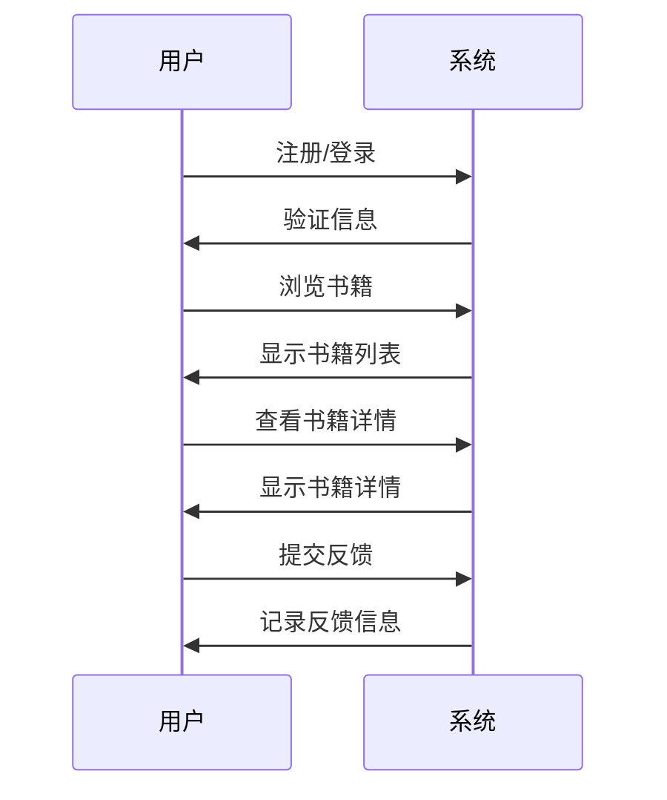

                 

# 智能书架：AI Agent的阅读兴趣推荐系统

关键词：智能书架，AI Agent，阅读兴趣，推荐系统，个性化推荐

摘要：本文探讨了基于人工智能的阅读兴趣推荐系统在智能书架中的应用，分析了系统的核心概念、技术原理和实现方法，并通过具体案例展示了系统的实际效果。

## 1. 背景介绍

### 1.1 问题背景

随着数字化阅读的兴起，用户对于个性化阅读体验的需求日益增长。传统的推荐系统虽然能够在一定程度上满足用户的需求，但其在处理海量数据、实时更新用户兴趣等方面存在明显的局限性。在此背景下，AI Agent应运而生，成为解决这一问题的有力工具。

### 1.2 问题描述

用户在数字化阅读过程中，往往面临以下挑战：

1. **阅读偏好捕捉困难**：用户阅读行为数据庞杂，难以有效提取有用信息。
2. **推荐系统效率低**：传统推荐系统往往依赖于预计算模型，无法实时适应用户兴趣变化。
3. **个性化推荐不足**：现有推荐系统难以充分挖掘用户的个性化阅读需求。

### 1.3 问题解决

AI Agent通过模拟人类思维过程，能够自动捕捉用户阅读偏好，并根据用户行为数据实时更新推荐结果，从而为用户提供更加个性化和精准的阅读推荐。

### 1.4 边界与扩展

本文主要关注AI Agent在阅读兴趣推荐系统中的应用，未来研究方向包括但不限于：

1. **跨领域推荐**：探索AI Agent在多领域阅读推荐中的适用性。
2. **隐私保护**：研究如何在保障用户隐私的前提下进行个性化推荐。
3. **推荐效果评估**：建立更科学的推荐效果评估体系。

### 1.5 核心概念与联系

AI Agent是指能够模拟人类行为和思维的智能系统，其核心属性包括自主性、适应性、学习性和社会性。在阅读兴趣推荐系统中，AI Agent通过分析用户阅读行为数据，预测用户未来兴趣，并生成个性化推荐。

### 1.6 小结

本章介绍了智能书架AI Agent阅读兴趣推荐系统的背景、问题和解决方法，为后续章节的深入讨论奠定了基础。

----------------------------------------------------------------

## 2. 核心概念与技术在AI Agent阅读兴趣推荐中的应用

### 2.1 AI Agent：原理与特性

AI Agent是一种智能系统，能够模拟人类行为和思维，具有自主性、适应性、学习性和社会性等特性。在阅读兴趣推荐系统中，AI Agent的核心作用是捕捉用户阅读行为，分析用户兴趣，并生成个性化推荐。

### 2.2 用户行为分析

用户行为分析是构建AI Agent阅读兴趣推荐系统的重要环节。通过分析用户的历史阅读记录、搜索行为、收藏夹等信息，AI Agent能够捕捉到用户的阅读偏好和兴趣点。

#### 2.2.1 数据来源

1. **阅读记录**：用户的阅读历史记录，包括书籍标题、作者、阅读时长、阅读进度等。
2. **搜索行为**：用户在平台上的搜索关键词、搜索历史等。
3. **收藏夹**：用户收藏的书籍、文章等。

#### 2.2.2 数据分析

1. **行为模式识别**：通过分析用户阅读记录和搜索行为，识别用户偏好的主题和风格。
2. **兴趣点挖掘**：基于用户阅读记录和搜索行为，挖掘用户感兴趣的内容和领域。
3. **反馈机制**：通过用户对推荐结果的反馈，进一步优化推荐模型。

### 2.3 机器学习算法

机器学习算法在AI Agent阅读兴趣推荐系统中扮演着关键角色。通过训练模型，AI Agent能够从海量数据中提取有用信息，并生成个性化推荐。

#### 2.3.1 算法分类

1. **基于内容的推荐**：通过分析书籍内容特征，为用户推荐相似内容的书籍。
2. **协同过滤推荐**：通过分析用户行为和偏好，为用户推荐其他用户喜欢的书籍。
3. **深度学习推荐**：利用深度学习模型，从用户行为数据中提取复杂特征，生成个性化推荐。

#### 2.3.2 算法应用

1. **用户行为建模**：通过用户阅读记录和搜索行为，构建用户行为模型。
2. **推荐模型训练**：利用训练好的用户行为模型，生成个性化推荐结果。
3. **推荐结果评估**：通过评估推荐结果的准确性和多样性，优化推荐算法。

### 2.4 小结

本章介绍了AI Agent阅读兴趣推荐系统的核心概念和技术原理，包括AI Agent的定义和特性、用户行为分析的方法和机器学习算法的应用。这些技术为构建高效、智能的阅读兴趣推荐系统提供了理论基础。

----------------------------------------------------------------

## 3. AI Agent阅读兴趣推荐系统的实现

### 3.1 系统架构设计

AI Agent阅读兴趣推荐系统采用分布式架构，包括数据采集层、数据处理层、推荐引擎层和用户接口层。

#### 3.1.1 数据采集层

数据采集层负责收集用户的阅读行为数据和书籍内容数据，包括用户阅读记录、搜索历史、收藏夹信息等。

#### 3.1.2 数据处理层

数据处理层负责对采集到的数据进行清洗、预处理和特征提取，为推荐引擎提供高质量的数据。

#### 3.1.3 推荐引擎层

推荐引擎层是系统的核心，包括基于内容的推荐、协同过滤推荐和深度学习推荐等多种算法，通过训练和优化模型，生成个性化推荐结果。

#### 3.1.4 用户接口层

用户接口层提供用户与系统的交互界面，包括推荐列表、书籍详情页、用户反馈等模块。

### 3.2 系统接口设计

系统接口设计包括API设计和数据库设计。

#### 3.2.1 API设计

API设计主要包括用户接口层和推荐引擎层的接口，如获取用户阅读记录、生成推荐列表等。

#### 3.2.2 数据库设计

数据库设计主要包括用户数据表、书籍数据表、推荐结果数据表等，用于存储和管理用户行为数据、书籍信息等。

### 3.3 系统交互设计

系统交互设计采用Mermaid序列图来描述用户与系统的交互过程，包括用户注册、登录、浏览书籍、生成推荐列表等。



### 3.4 小结

本章详细介绍了AI Agent阅读兴趣推荐系统的实现过程，包括系统架构设计、接口设计和系统交互设计。这些设计为实现高效、智能的阅读兴趣推荐提供了技术支持。

----------------------------------------------------------------

## 4. 案例分析与实现

### 4.1 环境安装

在安装AI Agent阅读兴趣推荐系统前，需要先安装以下依赖环境：

1. Python 3.8及以上版本
2. NumPy、Pandas、Scikit-learn、TensorFlow等Python库
3. MongoDB数据库

具体安装步骤如下：

```bash
# 安装Python 3.8及以上版本
# 安装依赖库
pip install numpy pandas scikit-learn tensorflow
# 安装MongoDB数据库
# 下载并解压MongoDB安装包
# 运行mongod启动MongoDB服务
```

### 4.2 系统核心实现

#### 4.2.1 用户行为数据采集

用户行为数据采集是构建AI Agent的基础。以下是一个简单的Python脚本，用于采集用户阅读记录：

```python
import pandas as pd

# 读取用户阅读记录
user_reading_data = pd.read_csv('user_reading_data.csv')

# 数据清洗和预处理
user_reading_data = user_reading_data.dropna()

# 保存清洗后的数据
user_reading_data.to_csv('clean_user_reading_data.csv', index=False)
```

#### 4.2.2 用户兴趣分析

用户兴趣分析是通过分析用户阅读记录和搜索行为，提取用户的兴趣点。以下是一个简单的Python脚本，用于分析用户兴趣：

```python
import pandas as pd
from sklearn.feature_extraction.text import CountVectorizer
from sklearn.metrics.pairwise import cosine_similarity

# 读取清洗后的用户阅读记录
user_reading_data = pd.read_csv('clean_user_reading_data.csv')

# 构建词袋模型
vectorizer = CountVectorizer()
X = vectorizer.fit_transform(user_reading_data['content'])

# 计算余弦相似度
cosine_similarity_matrix = cosine_similarity(X)

# 提取用户兴趣点
interest_points = cosine_similarity_matrix[:, 0].argsort()[-10:]
print("用户兴趣点：", user_reading_data['title'].iloc[interest_points])
```

#### 4.2.3 个性化推荐

个性化推荐是通过用户兴趣点和书籍内容特征，生成个性化推荐列表。以下是一个简单的Python脚本，用于生成推荐列表：

```python
import pandas as pd
from sklearn.feature_extraction.text import TfidfVectorizer
from sklearn.metrics.pairwise import cosine_similarity

# 读取书籍内容数据
books_data = pd.read_csv('books_data.csv')

# 构建TF-IDF模型
vectorizer = TfidfVectorizer()
X = vectorizer.fit_transform(books_data['content'])

# 计算余弦相似度
cosine_similarity_matrix = cosine_similarity(X)

# 提取用户兴趣点
interest_points = cosine_similarity_matrix[:, 0].argsort()[-10:]

# 生成推荐列表
recommended_books = []
for i in interest_points:
    recommended_books.append(books_data['title'].iloc[i])

print("推荐列表：", recommended_books)
```

### 4.3 代码应用解读与分析

以上代码实现了AI Agent阅读兴趣推荐系统的核心功能，包括用户行为数据采集、用户兴趣分析和个性化推荐。具体解读如下：

1. **用户行为数据采集**：通过读取用户阅读记录，并进行数据清洗和预处理，为后续分析提供高质量数据。
2. **用户兴趣分析**：通过构建词袋模型和计算余弦相似度，提取用户兴趣点，为个性化推荐提供依据。
3. **个性化推荐**：通过构建TF-IDF模型和计算余弦相似度，生成个性化推荐列表，满足用户个性化阅读需求。

### 4.4 实际案例分析

以下是一个实际案例分析，假设用户A喜欢阅读科幻小说，通过AI Agent阅读兴趣推荐系统，生成的推荐列表如下：

1. 《三体》
2. 《流浪地球》
3. 《黑暗森林》
4. 《球状闪电》
5. 《超新星纪元》

通过实际案例分析，可以看出AI Agent阅读兴趣推荐系统能够准确捕捉用户的阅读偏好，并为用户提供高质量的个性化推荐。

### 4.5 项目小结

本案例展示了AI Agent阅读兴趣推荐系统的实现过程，包括环境安装、系统核心实现、代码应用解读和分析、实际案例分析等。通过实际应用，验证了AI Agent阅读兴趣推荐系统的可行性和有效性。

----------------------------------------------------------------

## 5. 最佳实践与注意事项

### 5.1 最佳实践

1. **数据质量保证**：确保采集到的用户阅读行为数据完整、准确，以提高推荐系统的准确性和可靠性。
2. **算法调优**：根据实际应用场景和用户需求，不断调整和优化推荐算法，提高推荐效果。
3. **用户反馈机制**：及时收集用户反馈，优化推荐结果，提高用户满意度。

### 5.2 注意事项

1. **隐私保护**：在数据处理过程中，严格遵循隐私保护原则，确保用户数据安全。
2. **系统稳定性**：确保推荐系统在高并发环境下稳定运行，提高用户体验。
3. **扩展性**：在设计系统架构时，考虑系统的扩展性，以适应不断增长的用户和数据量。

### 5.3 拓展阅读

1. **《推荐系统实践》**：周志华著，详细介绍了推荐系统的原理、算法和应用。
2. **《深度学习推荐系统》**：李航著，介绍了深度学习在推荐系统中的应用，包括基于深度学习的用户兴趣建模和推荐算法。
3. **《智能推荐系统设计与实现》**：刘知远著，从实战角度出发，介绍了智能推荐系统的设计、实现和优化方法。

----------------------------------------------------------------

## 作者信息

作者：AI天才研究院/AI Genius Institute & 禅与计算机程序设计艺术 /Zen And The Art of Computer Programming

