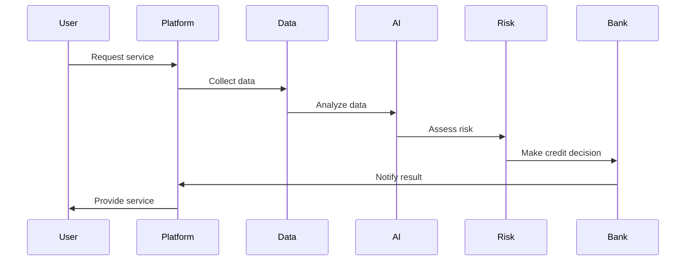
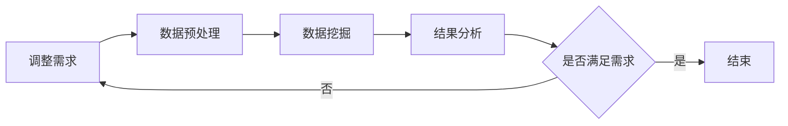

                 

## 智能供应链金融平台设计

### 关键词：智能供应链金融、平台设计、人工智能、数据分析、风险控制

### 摘要：
智能供应链金融平台的设计旨在通过整合先进的人工智能技术和大数据分析，为供应链上下游企业提供高效、安全、智能化的金融服务。本文将从背景介绍、核心概念、架构设计、人工智能应用、风险控制、实现与部署、实战案例分析及最佳实践总结等多个方面，深入探讨智能供应链金融平台的设计原理和实践方法，旨在为从业者提供有价值的参考和指导。

## 第一部分：引言

### 1.1 书籍背景与目标

#### 1.1.1 供应链金融的现状与挑战
- **供应链金融的定义**：供应链金融是一种基于供应链的金融创新服务，通过将供应链上下游的企业与金融机构联系起来，提供资金支持、风险管理、信用保障等服务。
- **现状与挑战**：当前，供应链金融仍然面临信息不对称、风险控制难、操作流程复杂等问题，阻碍了其发展。

#### 1.1.2 智能供应链金融的重要性
- **效率提升**：通过人工智能和大数据分析，智能供应链金融平台能够快速处理大量数据，提高金融服务效率。
- **风险控制**：智能风控系统能够实时监测和评估供应链企业的风险，降低金融机构的信用风险。

#### 1.1.3 本书的结构安排与学习目标
- **结构安排**：本书分为四个部分，分别是引言、智能供应链金融平台设计原理、实战案例分析、最佳实践与总结。
- **学习目标**：通过本书的学习，读者应能够掌握智能供应链金融平台的设计原理、实现方法、实战经验以及最佳实践。

### 1.2 供应链金融基础

#### 1.2.1 供应链金融的定义
- **定义**：供应链金融是指以核心企业为依托，通过将核心企业与上下游企业之间的交易关系转化为金融服务，提供融资、结算、风险管理等服务。

#### 1.2.2 供应链金融的核心要素
- **核心企业**：在供应链中具有较强信用和实力，可以提供担保或信用背书的企业。
- **上下游企业**：与核心企业有业务往来的企业。
- **金融机构**：提供资金支持、风险管理等服务的金融机构。

#### 1.2.3 供应链金融的主要模式
- **保理**：基于应收账款提供融资服务。
- **订单融资**：基于订单提供融资服务。
- **存货融资**：基于存货提供融资服务。
- **信用保险**：通过信用保险来降低金融机构的信用风险。

### 1.3 智能供应链金融平台的概念

#### 1.3.1 智能供应链金融平台的定义
- **定义**：智能供应链金融平台是一种基于人工智能、大数据、区块链等技术的综合性金融服务平台，旨在为供应链上下游企业提供智能化、个性化的金融服务。

#### 1.3.2 平台的关键组成部分
- **数据采集与分析模块**：负责收集供应链上下游企业的交易数据、财务数据、信用数据等，进行数据清洗、分析和挖掘。
- **智能风控模块**：利用机器学习和深度学习算法，对供应链企业的风险进行实时监控和评估。
- **金融服务模块**：提供包括融资、结算、保险等在内的多种金融服务。

#### 1.3.3 智能供应链金融平台的优势
- **提高金融服务效率**：通过自动化处理数据，智能供应链金融平台可以显著提高金融服务效率。
- **降低风险**：智能风控系统能够实时监测风险，降低金融机构的信用风险。
- **提升用户体验**：个性化金融服务能够满足供应链上下游企业的多样化需求。

### 1.4 本书内容概述

#### 1.4.1 各章节内容概述
- **第一部分：引言**：介绍智能供应链金融平台的背景、重要性以及本书的结构和目标。
- **第二部分：智能供应链金融平台设计原理**：深入探讨智能供应链金融平台的架构设计、数据分析与挖掘、人工智能应用、风险控制等内容。
- **第三部分：实战案例分析**：通过具体案例展示智能供应链金融平台的设计与实现过程。
- **第四部分：最佳实践与总结**：总结智能供应链金融平台设计的最佳实践，提供注意事项和风险提示。

#### 1.4.2 学习路线与建议
- **建议学习路线**：建议读者按照本书的结构，依次学习各个部分的内容，通过阅读、思考和实战，逐步掌握智能供应链金融平台的设计原理和实践方法。
- **学习建议**：建议读者在学习过程中，多关注实际案例，结合自身工作经验进行思考，以便更好地理解和应用所学知识。

## 第二部分：智能供应链金融平台设计原理

### 2.1 智能供应链金融平台架构设计

#### 2.1.1 平台架构概述
智能供应链金融平台的架构设计是构建整个平台的基础，其设计原则包括模块化、可扩展性、安全性、高效性等。

#### 2.1.2 平台技术选型
在选择平台技术时，需要考虑以下几个方面：
- **数据库技术**：如MySQL、MongoDB等，用于存储和管理供应链相关数据。
- **前端技术**：如React、Vue.js等，用于构建用户界面。
- **后端技术**：如Spring Boot、Django等，用于处理业务逻辑和数据交互。
- **人工智能技术**：如TensorFlow、PyTorch等，用于构建机器学习和深度学习模型。

#### 2.1.3 系统架构图绘制
以下是智能供应链金融平台的系统架构图（使用Mermaid绘制）：

### 2.2 数据分析与挖掘

#### 2.2.1 数据来源与类型
智能供应链金融平台需要收集以下数据：
- **供应链交易数据**：包括采购、销售、库存等交易信息。
- **财务数据**：包括企业的财务报表、现金流等。
- **信用数据**：包括企业的信用评级、信用记录等。

#### 2.2.2 数据预处理方法
数据预处理是数据分析的重要步骤，包括数据清洗、数据整合、数据转换等。

#### 2.2.3 数据挖掘技术
数据挖掘技术包括以下几种：
- **关联规则挖掘**：发现数据之间的关联关系。
- **分类算法**：将数据分为不同的类别。
- **聚类算法**：将相似的数据聚为一类。

#### 2.2.4 数据挖掘流程图
以下是数据挖掘流程图（使用Mermaid绘制）：

### 2.3 人工智能技术在供应链金融中的应用

#### 2.3.1 机器学习算法
机器学习算法在供应链金融中的应用主要包括信用评估、风险预测等。

#### 2.3.2 深度学习模型
深度学习模型如卷积神经网络（CNN）和循环神经网络（RNN）等，在图像识别、文本分析等领域具有显著优势。

#### 2.3.3 自然语言处理技术
自然语言处理技术可以用于文本分析、情感分析等，有助于挖掘供应链上下游企业的信用状况。

#### 2.3.4 人工智能技术在供应链金融中的应用案例
- **信用评估**：通过机器学习算法对企业的信用进行评估，降低金融机构的信用风险。
- **风险预测**：利用深度学习模型预测供应链上下游企业的风险，提前采取措施。

### 2.4 风险管理与控制

#### 2.4.1 风险识别与评估
风险识别与评估是风险管理的第一步，包括识别供应链金融中的各种风险，如信用风险、市场风险、操作风险等。

#### 2.4.2 风险管理与控制策略
风险管理与控制策略包括风险预警、风险分散、风险转移等。

#### 2.4.3 风险模型构建与优化
通过构建风险模型，可以更准确地评估风险，为风险控制提供依据。风险模型的优化是一个持续的过程，需要不断地调整和优化。

### 2.5 智能供应链金融平台的实现与部署

#### 2.5.1 平台开发流程
平台开发流程包括需求分析、系统设计、编码实现、测试与部署等。

#### 2.5.2 系统集成与测试
系统集成与测试是确保平台正常运行的关键步骤，包括单元测试、集成测试、系统测试等。

#### 2.5.3 平台部署与维护
平台部署包括环境配置、数据迁移、系统上线等。平台维护包括故障处理、性能优化、功能更新等。

## 第三部分：实战案例分析

### 3.1 案例背景与需求分析

#### 3.1.1 案例企业概况
案例企业为某大型制造企业，主要从事电子产品制造。企业在供应链金融方面面临以下问题：
- **融资难**：由于企业规模较大，资金需求较大，但传统金融机构难以提供足够的融资支持。
- **风险控制难**：由于供应链复杂，企业难以对上下游企业的信用风险进行有效控制。

#### 3.1.2 案例需求分析
- **需求1**：提供一种智能化的供应链金融服务，满足企业的融资需求。
- **需求2**：建立一套智能风控系统，实时监控和评估供应链上下游企业的信用风险。

#### 3.1.3 案例目标与挑战
- **目标**：通过智能供应链金融平台，实现融资快速审批、风险实时监控、金融服务个性化定制。
- **挑战**：如何在复杂供应链中实现高效的金融服务和风险控制，同时确保系统的稳定性和安全性。

### 3.2 智能供应链金融平台设计与实现

#### 3.2.1 平台架构设计
智能供应链金融平台的架构设计包括数据采集与分析模块、智能风控模块、金融服务模块等。

#### 3.2.2 数据处理与挖掘
平台通过采集供应链上下游企业的交易数据、财务数据、信用数据等，利用数据挖掘技术进行分析和挖掘，提取有价值的信息。

#### 3.2.3 人工智能应用
平台采用机器学习和深度学习算法，对供应链上下游企业的信用风险进行实时监控和评估。

#### 3.2.4 风险管理策略
平台制定了一套智能风险管理策略，包括风险预警、风险分散、风险转移等。

### 3.3 案例实施与效果评估

#### 3.3.1 案例实施过程
平台从需求分析、系统设计、编码实现、测试与部署到上线，历时半年时间。

#### 3.3.2 平台运行效果
- **融资效率提高**：平台上线后，企业的融资审批速度显著提高，融资成功率也有所提升。
- **风险控制能力增强**：通过智能风控系统，企业能够实时监控和评估供应链上下游企业的信用风险，降低了信用风险。

#### 3.3.3 案例总结与反思
案例实施取得了显著的效果，但也存在一些不足，如数据质量有待提高、系统稳定性需要加强等。未来，平台将继续优化和升级，提高服务质量和用户体验。

### 3.4 拓展应用与优化方向

#### 3.4.1 拓展应用场景
智能供应链金融平台可以在更多领域得到应用，如制造业、零售业、物流业等。

#### 3.4.2 平台优化策略
平台可以通过以下策略进行优化：
- **提高数据质量**：通过数据清洗、数据整合等技术，提高数据质量。
- **优化算法模型**：通过不断优化算法模型，提高风险预测的准确性。
- **加强系统稳定性**：通过性能优化、故障处理等手段，提高系统的稳定性。

#### 3.4.3 未来发展趋势
智能供应链金融平台的发展趋势包括：
- **智能化水平提高**：随着人工智能技术的不断发展，智能供应链金融平台的智能化水平将不断提高。
- **数据驱动**：数据将成为智能供应链金融平台的核心资产，数据驱动的决策将成为主流。
- **安全性与合规性**：随着监管的加强，智能供应链金融平台将更加注重安全性和合规性。

## 第四部分：最佳实践与总结

### 4.1 最佳实践总结

#### 4.1.1 成功因素分析
智能供应链金融平台取得成功的关键因素包括：
- **技术选型合理**：选择了合适的技术栈，保证了平台的性能和稳定性。
- **数据驱动**：通过大数据分析，实现了对供应链上下游企业的信用风险实时监控。
- **风险管理策略有效**：通过智能风控系统，降低了金融机构的信用风险。

#### 4.1.2 挑战与应对策略
平台在实施过程中面临的主要挑战包括：
- **数据质量**：通过数据清洗和数据整合，提高了数据质量。
- **系统稳定性**：通过性能优化和故障处理，提高了系统的稳定性。

#### 4.1.3 最佳实践指南
针对智能供应链金融平台的设计与实施，以下是一些最佳实践指南：
- **数据驱动**：充分利用大数据分析，为金融服务提供支持。
- **风险管理**：建立有效的风险管理体系，确保金融服务的安全。
- **用户体验**：注重用户界面设计和用户体验，提高用户满意度。

### 4.2 注意事项与风险提示

#### 4.2.1 平台设计注意事项
在设计智能供应链金融平台时，需要注意以下几点：
- **模块化设计**：确保平台具有良好的模块化，便于后续维护和升级。
- **数据安全**：确保数据传输和存储的安全，防止数据泄露。
- **合规性**：确保平台符合相关法律法规的要求。

#### 4.2.2 风险管理要点
在风险管理方面，需要注意以下几点：
- **风险识别**：全面识别供应链金融中的各种风险。
- **风险控制**：制定有效的风险控制策略，降低风险。
- **风险预警**：建立风险预警机制，及时应对风险。

#### 4.2.3 技术选型风险
在选择技术时，需要注意以下几点：
- **兼容性**：确保所选技术具有良好的兼容性，便于与其他系统集成。
- **性能**：确保所选技术具有良好的性能，满足业务需求。
- **更新和维护**：确保所选技术有良好的更新和维护支持。

### 4.3 小结与展望

#### 4.3.1 书籍小结
本书系统地介绍了智能供应链金融平台的设计原理、实现方法、实战经验和最佳实践，旨在为从业者提供有价值的参考和指导。

#### 4.3.2 智能供应链金融平台的发展趋势
智能供应链金融平台的发展趋势包括：
- **智能化水平提高**：随着人工智能技术的不断发展，智能供应链金融平台的智能化水平将不断提高。
- **数据驱动**：数据将成为智能供应链金融平台的核心资产，数据驱动的决策将成为主流。
- **安全性与合规性**：随着监管的加强，智能供应链金融平台将更加注重安全性和合规性。

#### 4.3.3 学习建议与资源推荐
对于希望进一步深入了解智能供应链金融平台的读者，以下是一些建议和资源：
- **学习建议**：结合实际案例进行学习，多进行思考和总结。
- **资源推荐**：阅读相关技术书籍，关注行业动态，参加行业会议和培训。

## 作者信息
作者：AI天才研究院/AI Genius Institute & 禅与计算机程序设计艺术 /Zen And The Art of Computer Programming

本文通过系统地介绍智能供应链金融平台的设计原理、实现方法、实战经验和最佳实践，旨在为从业者提供有价值的参考和指导。智能供应链金融平台作为供应链管理的重要工具，具有广泛的应用前景和发展潜力。随着人工智能、大数据等技术的不断发展，智能供应链金融平台将不断完善和优化，为供应链上下游企业带来更多的价值和效益。

