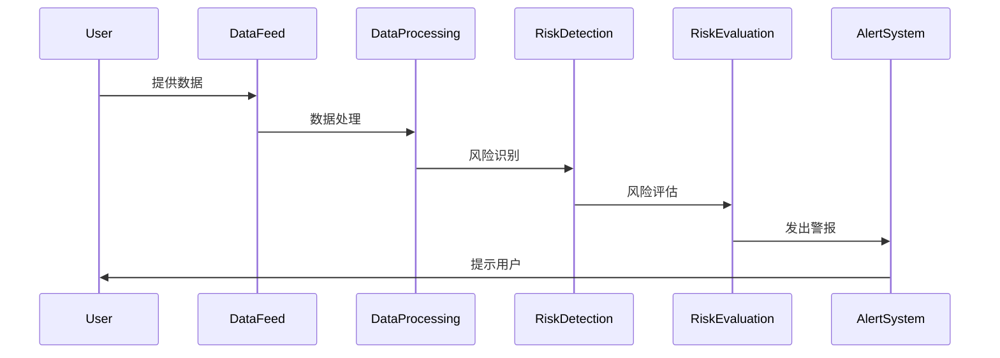
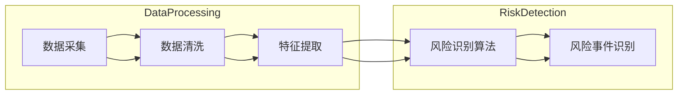
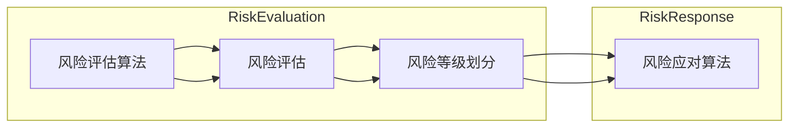
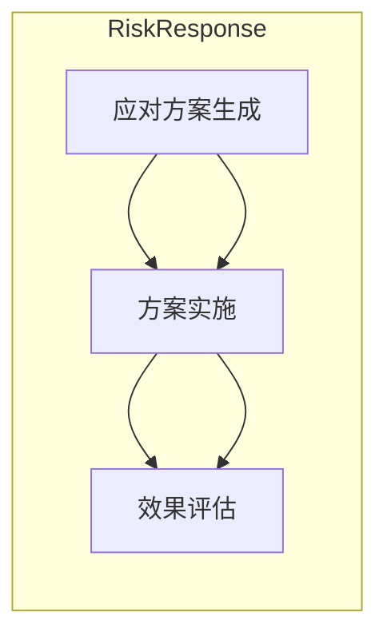
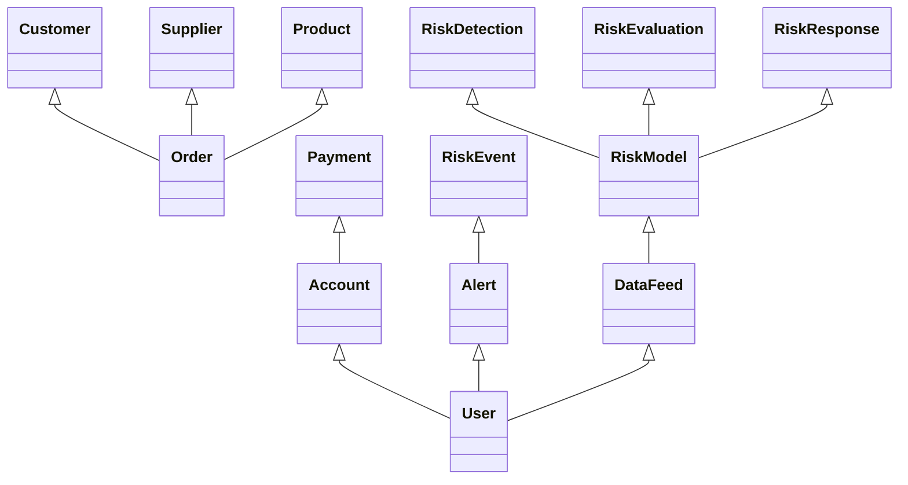

                 

### 摘要

本文旨在深入探讨智能供应链金融风险预警的相关问题，通过逻辑清晰、结构紧凑的分析，为读者提供关于该领域的全面认识。文章首先概述了智能供应链金融的背景及其在当前经济环境中的重要地位，并介绍了风险预警在供应链金融中的关键作用。接着，我们详细阐述了智能供应链金融风险预警的基本概念、核心要素及其与传统供应链金融和风险管理的区别。文章随后分析了智能供应链金融风险预警的概念原理，并通过对比表格和实体关系图，进一步明确了各概念之间的联系。

在第三部分，我们重点探讨了智能供应链金融风险预警的算法原理，详细介绍了常用算法的选择与优化，并使用mermaid流程图和Python源代码进行了深入讲解。文章随后转向系统分析与架构设计，通过项目介绍、系统功能设计、系统架构设计、系统接口设计和系统交互序列图，详细阐述了智能供应链金融风险预警系统的整体设计思路和实现方法。

最后，通过一个具体的实战案例，文章展示了智能供应链金融风险预警系统的实际应用，包括环境安装与配置、系统核心实现以及代码应用解读与分析。文章末尾总结了对智能供应链金融风险预警的全面理解，并提供了最佳实践 tips 和进一步阅读的建议，以期为读者提供有益的参考和指导。希望通过这篇文章，读者能够对智能供应链金融风险预警有一个更加深入和清晰的认识。

### 目录大纲

**《智能供应链金融风险预警》**

关键词：智能供应链金融，风险预警，算法原理，系统架构，项目实战

摘要：本文深入探讨了智能供应链金融风险预警的相关问题，包括背景介绍、核心概念、算法原理、系统架构设计以及项目实战。通过逻辑清晰、结构紧凑的分析，为读者提供了关于智能供应链金融风险预警的全面认识。

### 第一部分：问题背景与核心概念

#### 第1章：智能供应链金融风险预警概述

### 1.1 供应链金融的背景与发展

#### 1.1.1 供应链金融的定义与意义

#### 1.1.2 智能供应链金融的兴起

#### 1.1.3 风险预警在供应链金融中的重要性

### 1.2 智能供应链金融风险预警的基本概念

#### 1.2.1 风险的定义与类型

#### 1.2.2 风险预警的定义与作用

#### 1.2.3 智能供应链金融风险预警的特点

### 1.3 智能供应链金融风险预警的关键要素

#### 1.3.1 数据采集与处理

#### 1.3.2 风险识别与评估

#### 1.3.3 风险应对与监控

### 1.4 本章小结

----------------------------------------------------------------

### 第一部分：问题背景与核心概念

#### 第1章：智能供应链金融风险预警概述

智能供应链金融作为一种新兴的金融服务模式，正在逐渐改变传统供应链的运作方式。它不仅为企业提供了更加灵活的融资渠道，还通过风险预警机制提高了供应链的整体安全性。在这一章中，我们将详细探讨智能供应链金融风险预警的背景、核心概念和关键要素，为后续章节的深入分析奠定基础。

#### 1.1 供应链金融的背景与发展

**1.1.1 供应链金融的定义与意义**

供应链金融是指利用金融手段，围绕供应链上的核心企业与上下游企业，通过信用、担保、保理、融资租赁等方式，为供应链各环节提供资金支持和风险管理服务的一种金融服务模式。其核心在于通过融资、支付、结算等金融工具，优化供应链上的资金流动，提高企业的运营效率和抗风险能力。

供应链金融的意义主要体现在以下几个方面：

1. **提升供应链效率**：通过供应链金融，企业可以更快捷地获得融资，加速资金周转，从而提高整个供应链的运作效率。
2. **降低融资成本**：供应链金融利用企业的信用和供应链的稳定性，可以降低融资成本，减轻企业的财务压力。
3. **优化风险管理**：供应链金融中的风险预警机制可以帮助企业及时发现潜在风险，提前采取应对措施，降低风险损失。

**1.1.2 智能供应链金融的兴起**

智能供应链金融是随着互联网、大数据、人工智能等技术的发展而兴起的一种新型供应链金融模式。它利用先进的技术手段，对供应链上的信息进行实时监测和分析，从而实现更加精准的风险评估和预测。

智能供应链金融的兴起主要受到以下几方面因素的推动：

1. **技术进步**：互联网和大数据技术的普及，使得供应链金融的数据获取和处理能力大幅提升，为智能供应链金融的发展提供了技术保障。
2. **市场需求**：随着企业对供应链效率和管理水平的不断提高，对智能化的供应链金融需求也日益增加。
3. **政策支持**：政府出台了一系列支持供应链金融发展的政策，包括税收优惠、资金扶持等，为智能供应链金融的推广提供了有力支持。

**1.1.3 风险预警在供应链金融中的重要性**

风险预警是供应链金融的重要组成部分，其重要性体现在以下几个方面：

1. **提前预防**：通过风险预警，企业可以提前识别潜在的风险，采取相应的预防措施，避免或减少损失。
2. **提高决策效率**：风险预警提供及时、准确的风险信息，有助于企业快速做出决策，提高运营效率。
3. **增强风险管理能力**：智能化的风险预警系统可以自动收集和分析大量数据，提高企业对供应链风险的管理能力。

#### 1.2 智能供应链金融风险预警的基本概念

**1.2.1 风险的定义与类型**

风险是指可能对目标产生不利影响的潜在事件或条件。在供应链金融中，风险主要可以分为以下几类：

1. **信用风险**：由于供应链上的企业信用问题导致的风险，如违约、拖欠等。
2. **市场风险**：由于市场波动导致的供应链风险，如价格波动、供需失衡等。
3. **操作风险**：由于供应链操作过程中的人为错误或系统故障导致的风险，如数据泄露、系统故障等。
4. **法律风险**：由于法律法规变化或合同纠纷导致的供应链风险。

**1.2.2 风险预警的定义与作用**

风险预警是指通过收集、分析和处理供应链金融相关数据，识别潜在风险并发出预警信号的过程。其作用主要体现在以下几个方面：

1. **识别风险**：风险预警系统可以帮助企业提前识别潜在的风险，提高风险识别的准确性和及时性。
2. **评估风险**：通过分析风险数据，对风险的程度和可能的影响进行评估，为企业提供决策依据。
3. **应对风险**：风险预警系统可以自动生成应对方案，帮助企业及时采取应对措施，降低风险损失。

**1.2.3 智能供应链金融风险预警的特点**

智能供应链金融风险预警具有以下特点：

1. **自动化**：通过人工智能和大数据技术，风险预警系统可以自动进行数据收集、分析和处理，提高效率。
2. **实时性**：风险预警系统可以实时监控供应链金融相关数据，及时发现风险并发出预警。
3. **精准性**：利用先进的算法和技术，风险预警系统可以更准确地识别和评估风险，提高预警的准确性。

#### 1.3 智能供应链金融风险预警的关键要素

**1.3.1 数据采集与处理**

数据采集与处理是智能供应链金融风险预警的基础。通过互联网、传感器、物联网等技术手段，风险预警系统可以实时收集供应链金融相关的数据，包括财务数据、交易数据、信用数据等。然后，通过数据清洗、数据挖掘等技术，对数据进行处理和整合，为风险预警提供可靠的数据支持。

**1.3.2 风险识别与评估**

风险识别与评估是智能供应链金融风险预警的核心。通过机器学习、深度学习等技术，风险预警系统可以对供应链金融中的各种风险进行识别和评估。具体包括：

1. **风险识别**：利用数据分析和模式识别技术，识别潜在的风险事件。
2. **风险评估**：通过建立风险评估模型，对风险的程度和可能的影响进行量化评估。

**1.3.3 风险应对与监控**

风险应对与监控是智能供应链金融风险预警的最终目标。根据风险评估的结果，风险预警系统可以自动生成应对方案，帮助企业及时采取应对措施。同时，风险预警系统还可以实时监控风险的变化情况，确保风险应对措施的执行效果。

#### 1.4 本章小结

本章对智能供应链金融风险预警的背景、核心概念和关键要素进行了详细阐述。通过了解供应链金融的定义、智能供应链金融的兴起以及风险预警的重要性，读者可以初步认识到智能供应链金融风险预警的基本框架和作用。接下来，我们将继续探讨智能供应链金融风险预警的原理和实现方法，帮助读者更深入地理解这一领域。

----------------------------------------------------------------

## 第一部分：问题背景与核心概念

### 第1章：智能供应链金融风险预警概述

#### 1.1 供应链金融的背景与发展

**1.1.1 供应链金融的定义与意义**

供应链金融是指通过融资、担保、保理、信用保险等金融服务，围绕核心企业与上下游企业，优化供应链中的资金流动，降低企业融资成本，提升供应链整体效率的一种金融服务模式。其核心在于利用供应链中各企业的商业信用，通过金融手段实现资金的高效流转。

供应链金融的意义主要体现在以下几个方面：

1. **提高融资效率**：通过供应链金融，企业可以快速获得融资，减少资金流转环节，提高资金使用效率。
2. **降低融资成本**：供应链金融利用企业的商业信用，减少金融机构的风险，从而降低融资成本。
3. **优化风险管理**：供应链金融中的风险分散机制，可以帮助企业更好地应对市场波动和信用风险。
4. **提升供应链稳定性**：通过供应链金融，企业可以更好地协调上下游企业的利益，提高整个供应链的稳定性。

**1.1.2 智能供应链金融的兴起**

智能供应链金融是随着互联网、大数据、人工智能等技术的快速发展而兴起的一种新型供应链金融模式。它通过数据驱动和智能分析，实现了供应链金融服务的智能化、精准化。

智能供应链金融的兴起主要受到以下几方面因素的推动：

1. **技术进步**：互联网、大数据、人工智能等技术的进步，为供应链金融的数据采集、处理和分析提供了强大的技术支持。
2. **市场需求**：企业对供应链金融服务的需求日益增长，特别是中小企业，希望通过智能供应链金融获得更高效的融资服务。
3. **政策支持**：政府出台了一系列政策，鼓励金融机构发展供应链金融，提高金融服务的覆盖面和效率。

**1.1.3 风险预警在供应链金融中的重要性**

风险预警在供应链金融中具有至关重要的作用。供应链金融涉及多个企业，环节繁多，风险复杂。通过风险预警，企业可以：

1. **提前预防**：及时识别潜在风险，提前采取预防措施，避免或减少损失。
2. **提高决策效率**：快速获得准确的风险信息，帮助企业做出及时、准确的决策。
3. **增强风险管理能力**：利用智能技术，对供应链中的风险进行全方位监控和分析，提高整体风险管理水平。

#### 1.2 智能供应链金融风险预警的基本概念

**1.2.1 风险的定义与类型**

风险是指在未来可能对目标造成不利影响的不确定性事件或条件。在供应链金融中，风险主要包括以下几种类型：

1. **信用风险**：由于供应链上的企业信用状况不佳，可能导致融资失败或违约。
2. **市场风险**：由于市场环境变化，如价格波动、供需失衡等，可能导致供应链金融业务的不稳定。
3. **操作风险**：由于供应链运作过程中的管理失误、系统故障等，可能导致资金流动不畅或数据泄露。
4. **法律风险**：由于法律法规的变化或合同纠纷，可能导致供应链金融业务的法律风险。

**1.2.2 风险预警的定义与作用**

风险预警是指通过数据采集、分析和处理，对供应链金融中的潜在风险进行识别、评估和预警的过程。其作用主要包括：

1. **风险识别**：通过数据分析和模式识别技术，及时发现潜在的风险事件。
2. **风险评估**：通过对风险数据的分析，评估风险的程度和可能的影响，为决策提供依据。
3. **风险应对**：根据风险评估结果，制定应对措施，降低风险损失。

**1.2.3 智能供应链金融风险预警的特点**

智能供应链金融风险预警具有以下特点：

1. **自动化**：通过人工智能和大数据技术，实现风险数据的自动化采集、分析和预警。
2. **实时性**：能够实时监控供应链金融业务，快速识别和响应风险事件。
3. **精准性**：利用先进算法和大数据分析技术，提高风险预警的准确性和有效性。

#### 1.3 智能供应链金融风险预警的关键要素

**1.3.1 数据采集与处理**

数据采集与处理是智能供应链金融风险预警的基础。通过互联网、物联网等技术，风险预警系统可以实时采集供应链金融相关数据，包括财务数据、交易数据、信用数据等。然后，通过数据清洗、数据挖掘等技术，对数据进行处理和整合，为风险预警提供可靠的数据支持。

**1.3.2 风险识别与评估**

风险识别与评估是智能供应链金融风险预警的核心。通过机器学习、深度学习等技术，风险预警系统可以对供应链金融中的各种风险进行识别和评估。具体包括：

1. **风险识别**：利用数据分析和模式识别技术，识别潜在的风险事件。
2. **风险评估**：通过建立风险评估模型，对风险的程度和可能的影响进行量化评估。

**1.3.3 风险应对与监控**

风险应对与监控是智能供应链金融风险预警的最终目标。根据风险评估的结果，风险预警系统可以自动生成应对方案，帮助企业及时采取应对措施。同时，风险预警系统还可以实时监控风险的变化情况，确保风险应对措施的执行效果。

#### 1.4 本章小结

本章对智能供应链金融风险预警的背景、基本概念和关键要素进行了详细阐述。通过了解供应链金融的定义、智能供应链金融的兴起以及风险预警的重要性，读者可以初步认识到智能供应链金融风险预警的基本框架和作用。接下来，我们将继续深入探讨智能供应链金融风险预警的算法原理和系统架构设计，为读者提供更全面的认识。

----------------------------------------------------------------

## 第二部分：核心概念与联系

### 第2章：核心概念原理与联系

#### 2.1 智能供应链金融风险预警的概念原理

智能供应链金融风险预警是基于先进技术，如大数据、人工智能和机器学习等，对供应链金融中的风险进行实时监测、识别和预警的系统。其核心原理包括以下几个方面：

**2.1.1 智能供应链金融的基本原理**

智能供应链金融利用物联网、区块链等新技术，实现供应链中各环节的信息透明和实时共享。通过这些技术，企业可以实时获取供应链上下游的物流、资金流、信息流等数据，从而优化供应链运作，提高资金使用效率。

**2.1.2 风险预警的原理**

风险预警是指通过数据采集、分析和处理，对潜在的供应链金融风险进行识别和预警的过程。其基本原理包括：

1. **数据采集**：通过物联网、传感器等技术手段，实时采集供应链中的各种数据。
2. **数据清洗与处理**：对采集到的数据进行清洗、整合和分析，提取有价值的信息。
3. **风险识别**：利用数据分析和机器学习等技术，识别潜在的风险事件。
4. **风险评估**：通过建立风险评估模型，对风险的程度和可能的影响进行量化评估。
5. **风险预警**：根据风险评估结果，发出预警信号，提示企业采取应对措施。

**2.1.3 智能供应链金融风险预警的原理**

智能供应链金融风险预警的原理是在传统风险预警的基础上，融入人工智能和大数据分析技术，实现以下目标：

1. **实时监控**：通过实时采集和处理供应链数据，实现对风险的实时监测。
2. **精准识别**：利用机器学习和深度学习等技术，提高风险识别的准确性和效率。
3. **快速响应**：根据风险评估结果，快速生成应对方案，帮助企业及时应对风险。
4. **持续优化**：通过不断的数据反馈和模型优化，提高风险预警系统的准确性和可靠性。

#### 2.2 概念属性特征对比表格

为了更好地理解智能供应链金融风险预警的相关概念，我们通过对比表格的形式，分析传统供应链金融、供应链金融风险预警和智能供应链金融风险预警之间的区别：

| 概念 | 传统供应链金融 | 供应链金融风险预警 | 智能供应链金融风险预警 |
| --- | --- | --- | --- |
| 数据处理方式 | 人工处理 | 人工与自动化处理 | 自动化与智能化处理 |
| 风险识别能力 | 较低 | 中等 | 高 |
| 风险评估精度 | 低 | 中等 | 高 |
| 预警速度 | 较慢 | 较快 | 实时 |
| 预警准确性 | 较低 | 中等 | 高 |
| 技术依赖性 | 低 | 中等 | 高 |

#### 2.3 ER实体关系图架构

实体关系图（Entity-Relationship Diagram，ER图）是一种用于描述系统中实体及其关系的图形化表示方法。在智能供应链金融风险预警系统中，ER图可以帮助我们清晰地了解系统中各个实体的关系。

以下是一个简化的智能供应链金融风险预警系统的ER图：

```mermaid
erDiagram
    Customer ||--|{ Order } : "places"
    Supplier ||--|{ Order } : "receives"
    Product ||--|{ Order } : "contains"
    Order ||--|{ Payment } : "invoices"
    Payment ||--|{ Account } : " credited_to"
    Account ||--|{ User } : "managed_by"
```

**2.3.1 供应链金融系统实体关系**

在供应链金融系统中，主要的实体包括：

- **Customer（客户）**：指在供应链中购买产品的最终消费者。
- **Supplier（供应商）**：指提供产品或服务的原始生产者。
- **Product（产品）**：指在供应链中流转的各种商品。
- **Order（订单）**：指客户向供应商发出的购买要求。
- **Payment（支付）**：指供应链中的资金流转过程。
- **Account（账户）**：指用于存储和管理资金的实体。
- **User（用户）**：指参与供应链金融系统的个人或企业。

实体之间的关系如下：

- **Customer** 通过 **places** 关系与 **Order** 相关联。
- **Supplier** 通过 **receives** 关系与 **Order** 相关联。
- **Product** 通过 **contains** 关系与 **Order** 相关联。
- **Order** 通过 **invoices** 关系与 **Payment** 相关联。
- **Payment** 通过 **credited_to** 关系与 **Account** 相关联。
- **Account** 通过 **managed_by** 关系与 **User** 相关联。

**2.3.2 风险预警系统实体关系**

在风险预警系统中，主要的实体包括：

- **RiskEvent（风险事件）**：指可能对供应链金融系统产生不利影响的事件。
- **Alert（警报）**：指风险预警系统发出的预警信号。
- **RiskModel（风险模型）**：指用于评估风险程度和可能影响的模型。
- **DataFeed（数据源）**：指提供风险预警所需数据的实体。
- **User（用户）**：指参与风险预警系统的个人或企业。

实体之间的关系如下：

- **RiskEvent** 通过 **generates** 关系与 **Alert** 相关联。
- **Alert** 通过 **triggered_by** 关系与 **RiskModel** 相关联。
- **RiskModel** 通过 **uses** 关系与 **DataFeed** 相关联。

**2.3.3 智能供应链金融风险预警系统的整体架构**

智能供应链金融风险预警系统是一个复杂的信息系统，其整体架构包括多个模块，如数据采集模块、风险识别模块、风险评估模块和风险应对模块。以下是智能供应链金融风险预警系统的整体架构图：



通过上述ER图和架构图，我们可以清晰地了解智能供应链金融风险预警系统中各个实体之间的关系及其在系统中的作用，为后续的算法原理讲解和系统设计提供了基础。

#### 2.4 本章小结

本章通过详细分析智能供应链金融风险预警的核心概念、原理以及与其相关的实体关系，为读者提供了智能供应链金融风险预警系统的全面理解。我们首先介绍了智能供应链金融的基本原理，阐述了风险预警的定义及其在供应链金融中的重要性。接着，通过对比表格和实体关系图，明确了传统供应链金融、供应链金融风险预警以及智能供应链金融风险预警之间的区别和联系。

通过本章的学习，读者应该能够理解智能供应链金融风险预警的基本概念、原理和架构，为后续的算法原理讲解和系统设计奠定了基础。接下来，我们将进一步探讨智能供应链金融风险预警的算法原理，深入讲解常用的算法及其在风险预警中的应用。

----------------------------------------------------------------

## 第三部分：算法原理与实现

### 第3章：智能供应链金融风险预警算法原理

#### 3.1 常用算法概述

在智能供应链金融风险预警系统中，常用的算法主要包括机器学习算法、深度学习算法和数据挖掘算法。这些算法在不同的应用场景中发挥着重要作用，能够有效地识别和评估风险。

**3.1.1 机器学习算法**

机器学习算法是一种通过数据训练模型，实现自动学习和预测的技术。在智能供应链金融风险预警中，常用的机器学习算法包括：

1. **决策树（Decision Tree）**：通过树形结构对数据集进行划分，实现分类和回归任务。
2. **支持向量机（SVM）**：通过寻找最优分割超平面，实现数据的分类。
3. **随机森林（Random Forest）**：通过构建多个决策树，进行集成学习，提高模型的预测准确性。

**3.1.2 深度学习算法**

深度学习算法是一种基于多层神经网络的机器学习技术，能够自动提取数据的特征。在智能供应链金融风险预警中，常用的深度学习算法包括：

1. **卷积神经网络（CNN）**：通过卷积操作，提取图像或时间序列数据的特征。
2. **循环神经网络（RNN）**：通过循环结构，处理序列数据，适用于时间序列预测。
3. **长短期记忆网络（LSTM）**：通过改进RNN，解决长短期依赖问题，适用于复杂的时间序列预测。

**3.1.3 数据挖掘算法**

数据挖掘算法是一种从大量数据中发现有价值信息的技术。在智能供应链金融风险预警中，常用的数据挖掘算法包括：

1. **关联规则挖掘（Association Rule Learning）**：通过发现数据之间的关联关系，实现分类和预测。
2. **聚类算法（Clustering）**：通过将相似的数据点分组，实现数据的分类和挖掘。
3. **异常检测（Anomaly Detection）**：通过检测数据中的异常点，实现风险的识别和预警。

#### 3.2 风险预警算法原理讲解

**3.2.1 算法选择与优化**

在智能供应链金融风险预警系统中，算法的选择和优化是关键。选择合适的算法，需要考虑以下因素：

1. **数据类型**：根据数据的类型和特点，选择适合的算法。例如，对于时间序列数据，可以选择RNN或LSTM；对于结构化数据，可以选择决策树或随机森林。
2. **模型复杂度**：选择模型复杂度合适的算法，既能够保证预测的准确性，又能够降低计算成本。
3. **可解释性**：选择具有可解释性的算法，能够帮助用户理解模型的决策过程，提高模型的信任度。

在算法优化方面，可以通过以下方法提高模型的预测性能：

1. **特征工程**：通过选择合适的特征和特征变换，提高模型的预测能力。
2. **超参数调整**：通过调整算法的超参数，优化模型的性能。
3. **集成学习**：通过集成多个模型，提高预测的准确性和稳定性。

**3.2.2 风险识别算法**

风险识别算法是智能供应链金融风险预警系统的核心组成部分，其主要任务是从大量的数据中识别出潜在的风险事件。常用的风险识别算法包括：

1. **基于规则的算法**：通过编写规则，判断数据是否符合预定义的风险条件。例如，如果客户的订单量超过一定阈值，则发出风险预警。
2. **聚类算法**：通过将相似的数据点分为一组，识别出可能存在风险的数据点。例如，通过K-means聚类，将订单量异常增加的客户识别为高风险客户。
3. **监督学习算法**：通过训练模型，自动识别出数据中的风险模式。例如，使用决策树或随机森林，对历史数据进行分析，识别出高风险客户。

**3.2.3 风险评估算法**

风险评估算法用于对识别出的风险事件进行评估，确定其严重程度和可能的影响。常用的风险评估算法包括：

1. **基于历史的算法**：通过分析历史数据，评估风险事件的发生频率和损失程度。例如，使用统计模型，分析订单拖欠的历史数据，评估订单拖欠的风险。
2. **基于概率的算法**：通过计算风险事件发生的概率和损失程度，评估风险事件的影响。例如，使用贝叶斯网络，计算订单拖欠的概率及其对供应链金融系统的损失。
3. **基于模型优化的算法**：通过优化模型，提高风险评估的准确性。例如，使用机器学习算法，对历史数据进行训练，优化风险评估模型。

**3.2.4 风险应对算法**

风险应对算法用于根据风险评估结果，制定和实施应对措施，以降低风险损失。常用的风险应对算法包括：

1. **基于规则的算法**：通过编写规则，自动生成应对方案。例如，如果检测到订单拖欠风险，自动触发贷款延期或追加担保等措施。
2. **基于模型的算法**：通过训练模型，自动生成应对方案。例如，使用决策树或随机森林，根据风险评估结果，自动生成最优的应对方案。
3. **基于人工的算法**：通过人工分析风险评估结果，制定应对方案。例如，风险管理人员根据风险评估结果，制定具体的应对措施。

**3.3 算法mermaid流程图**

为了更直观地理解智能供应链金融风险预警算法的流程，我们使用mermaid流程图进行描述。

**3.3.1 风险识别流程图**



**3.3.2 风险评估流程图**



**3.3.3 风险应对流程图**



**3.4 算法原理详细讲解与举例说明**

**3.4.1 数学模型与公式**

在智能供应链金融风险预警中，常用的数学模型和公式包括：

1. **决策树模型**：
   $$y = f(x) = \prod_{i=1}^{n} G(x_i; \theta_i)$$
   其中，$x$ 是输入特征向量，$\theta_i$ 是第 $i$ 个节点的阈值，$G(x_i; \theta_i)$ 是节点的条件概率分布。

2. **支持向量机模型**：
   $$w \cdot x + b = 0$$
   其中，$w$ 是权重向量，$x$ 是输入特征向量，$b$ 是偏置。

3. **深度学习模型**：
   $$a^{(L)} = \sigma(z^{(L)})$$
   其中，$a^{(L)}$ 是第 $L$ 层的输出，$\sigma$ 是激活函数，$z^{(L)}$ 是第 $L$ 层的输入。

4. **风险评估模型**：
   $$R = P \cdot L$$
   其中，$R$ 是风险损失，$P$ 是风险发生的概率，$L$ 是风险发生时的损失程度。

**3.4.2 Python源代码讲解**

以下是一个简单的Python代码示例，用于实现决策树模型：

```python
from sklearn.tree import DecisionTreeClassifier
from sklearn.model_selection import train_test_split
from sklearn.metrics import accuracy_score

# 数据准备
X_train, X_test, y_train, y_test = train_test_split(X, y, test_size=0.2, random_state=42)

# 模型训练
clf = DecisionTreeClassifier()
clf.fit(X_train, y_train)

# 模型预测
y_pred = clf.predict(X_test)

# 模型评估
accuracy = accuracy_score(y_test, y_pred)
print("Accuracy:", accuracy)
```

**3.4.3 具体案例分析与详细讲解**

假设我们有一个供应链金融数据集，包含以下特征：订单金额、订单数量、客户信用评分、供应商信用评分等。我们希望通过风险识别算法，识别出高风险订单。

1. **数据预处理**：
   - 缺失值处理：删除含有缺失值的订单数据。
   - 特征工程：对订单金额和订单数量进行归一化处理。

2. **风险识别算法**：
   - 基于决策树算法：将订单金额和客户信用评分作为特征，构建决策树模型。
   - 风险识别规则：如果订单金额大于30万元且客户信用评分低于600分，则认为订单为高风险订单。

3. **风险评估算法**：
   - 基于风险评估模型：计算订单拖欠的概率和损失程度。
   - 风险评估结果：如果订单拖欠的概率大于0.5，则认为订单为高风险订单。

4. **风险应对算法**：
   - 基于规则算法：对于高风险订单，触发贷款延期或追加担保等措施。

通过上述案例，我们可以看到智能供应链金融风险预警算法的实现过程，以及如何通过算法和模型，实现对供应链金融风险的识别、评估和应对。

#### 3.5 本章小结

本章详细介绍了智能供应链金融风险预警算法的原理和实现方法。我们首先概述了常用的机器学习算法、深度学习算法和数据挖掘算法，并探讨了算法选择和优化的方法。接着，我们详细讲解了风险识别、风险评估和风险应对算法的原理和实现过程，并通过mermaid流程图进行了可视化展示。最后，通过具体案例分析和Python代码讲解，读者可以更深入地理解智能供应链金融风险预警算法的实际应用。

通过本章的学习，读者应该能够掌握智能供应链金融风险预警算法的基本原理和实现方法，为后续的系统架构设计和项目实战提供了理论基础。在下一章中，我们将进一步探讨智能供应链金融风险预警系统的整体设计和实现。

----------------------------------------------------------------

## 第四部分：系统分析与架构设计

### 第4章：智能供应链金融风险预警系统设计

#### 4.1 问题描述与项目介绍

**4.1.1 问题描述**

智能供应链金融风险预警系统旨在通过对供应链金融业务数据的实时监控和分析，识别潜在风险并发出预警信号，帮助企业及时采取应对措施，降低风险损失。该系统需要具备以下几个功能：

1. **数据采集与处理**：实时采集供应链金融业务相关数据，包括订单信息、财务数据、客户和供应商信息等，并进行数据清洗、转换和存储。
2. **风险识别**：利用机器学习和数据挖掘技术，从大量业务数据中识别出潜在的风险事件，如订单拖欠、资金链断裂等。
3. **风险评估**：对识别出的风险事件进行量化评估，确定其风险等级和可能的影响程度。
4. **风险应对**：根据风险评估结果，生成并执行应对方案，包括贷款延期、追加担保、调整供应链策略等。
5. **系统监控**：实时监控风险预警系统的运行状态，确保系统稳定高效地运行。

**4.1.2 项目介绍**

本项目的目标是为一家大型供应链金融服务企业设计并实现一个智能供应链金融风险预警系统。该系统将结合企业现有的业务数据和金融科技技术，实现对供应链金融风险的实时监控和预警。项目的主要组成部分包括：

1. **数据采集模块**：负责实时采集和处理供应链金融业务相关数据。
2. **风险识别模块**：利用机器学习和数据挖掘技术，实现风险事件的自动识别。
3. **风险评估模块**：对识别出的风险事件进行量化评估，确定风险等级。
4. **风险应对模块**：根据风险评估结果，生成并执行应对方案。
5. **系统监控模块**：实时监控系统的运行状态，确保系统稳定高效。

#### 4.2 系统功能设计

**4.2.1 领域模型Mermaid类图**

领域模型类图用于描述系统中的实体及其关系。以下是智能供应链金融风险预警系统的领域模型类图：



在上述类图中，主要实体包括：

- **Customer（客户）**：指在供应链中购买产品的最终消费者。
- **Supplier（供应商）**：指提供产品或服务的原始生产者。
- **Order（订单）**：指客户向供应商发出的购买要求。
- **Product（产品）**：指在供应链中流转的各种商品。
- **Payment（支付）**：指供应链中的资金流转过程。
- **Account（账户）**：指用于存储和管理资金的实体。
- **User（用户）**：指参与供应链金融系统的个人或企业。
- **RiskEvent（风险事件）**：指可能对供应链金融系统产生不利影响的事件。
- **Alert（警报）**：指风险预警系统发出的预警信号。
- **RiskModel（风险模型）**：指用于评估风险程度和可能影响的模型。
- **DataFeed（数据源）**：指提供风险预警所需数据的实体。

实体之间的关系如下：

- **Customer** 通过 **orders** 关系与 **Order** 相关联。
- **Supplier** 通过 **receives** 关系与 **Order** 相关联。
- **Order** 通过 **contains** 关系与 **Product** 相关联。
- **Order** 通过 **invoices** 关系与 **Payment** 相关联。
- **Payment** 通过 **credited_to** 关系与 **Account** 相关联。
- **Account** 通过 **managed_by** 关系与 **User** 相关联。
- **RiskEvent** 通过 **generates** 关系与 **Alert** 相关联。
- **Alert** 通过 **triggered_by** 关系与 **RiskModel** 相关联。
- **RiskModel** 通过 **uses** 关系与 **DataFeed** 相关联。

**4.2.2 系统功能划分**

根据上述领域模型，智能供应链金融风险预警系统的功能可以划分为以下几个模块：

1. **数据采集模块**：负责实时采集供应链金融业务相关数据，包括订单信息、财务数据、客户和供应商信息等。
2. **数据预处理模块**：负责对采集到的数据进行清洗、转换和存储，为后续分析提供高质量的数据。
3. **风险识别模块**：利用机器学习和数据挖掘技术，从大量业务数据中识别出潜在的风险事件。
4. **风险评估模块**：对识别出的风险事件进行量化评估，确定其风险等级和可能的影响程度。
5. **风险应对模块**：根据风险评估结果，生成并执行应对方案，包括贷款延期、追加担保、调整供应链策略等。
6. **系统监控模块**：实时监控风险预警系统的运行状态，确保系统稳定高效。

#### 4.3 系统架构设计

**4.3.1 Mermaid架构图**

智能供应链金融风险预警系统的整体架构设计如下：


在上述架构图中，系统的主要模块及其关系如下：

- **DataFeed（数据源）**：负责提供实时供应链金融业务数据。
- **DataProcessing（数据处理）**：负责对数据源提供的数据进行清洗、转换和存储。
- **RiskDetection（风险识别）**：利用机器学习和数据挖掘技术，识别出潜在的风险事件。
- **RiskEvaluation（风险评估）**：对识别出的风险事件进行量化评估，确定其风险等级和可能的影响程度。
- **AlertSystem（警报系统）**：根据风险评估结果，生成并发出警报。
- **User（用户）**：接收并处理警报，根据警报采取相应的应对措施。

**4.3.2 架构设计思路**

智能供应链金融风险预警系统的架构设计遵循以下思路：

1. **模块化设计**：将系统功能划分为多个模块，每个模块负责特定的功能，便于系统的维护和扩展。
2. **数据驱动**：系统以数据为核心，通过实时采集、处理和分析数据，实现风险识别、评估和预警。
3. **分布式部署**：系统采用分布式架构，提高系统的可靠性和可扩展性，能够应对大规模的数据处理和预警需求。
4. **可扩展性**：系统设计考虑未来的业务扩展，支持多种数据源接入和多种算法应用，便于系统的功能扩展和性能优化。

**4.3.3 系统模块划分**

智能供应链金融风险预警系统的主要模块及其功能如下：

1. **数据采集模块**：负责实时采集供应链金融业务相关数据，包括订单信息、财务数据、客户和供应商信息等。该模块支持多种数据源接入，如数据库、API接口、文件等。
2. **数据预处理模块**：负责对采集到的数据进行清洗、转换和存储，为后续分析提供高质量的数据。该模块包括数据清洗、数据转换、数据存储等功能。
3. **风险识别模块**：利用机器学习和数据挖掘技术，从大量业务数据中识别出潜在的风险事件。该模块包括风险识别算法的实现和风险事件的自动识别等功能。
4. **风险评估模块**：对识别出的风险事件进行量化评估，确定其风险等级和可能的影响程度。该模块包括风险评估算法的实现和风险等级的划分等功能。
5. **风险应对模块**：根据风险评估结果，生成并执行应对方案，包括贷款延期、追加担保、调整供应链策略等。该模块包括应对方案生成和执行等功能。
6. **系统监控模块**：实时监控风险预警系统的运行状态，包括数据采集、处理、识别、评估、应对等各个环节，确保系统稳定高效。该模块包括系统状态监控、故障告警、性能优化等功能。

#### 4.4 系统接口设计

**4.4.1 接口规范**

智能供应链金融风险预警系统的接口设计遵循以下规范：

1. **RESTful API**：系统采用RESTful API设计风格，提供统一的接口规范，便于系统的集成和扩展。
2. **HTTP协议**：系统采用HTTP协议进行数据传输，确保系统的稳定性和安全性。
3. **数据格式**：系统采用JSON格式传输数据，便于数据的解析和处理。
4. **权限管理**：系统实现用户身份验证和权限控制，确保数据的合法访问和操作。

**4.4.2 接口设计原则**

智能供应链金融风险预警系统的接口设计遵循以下原则：

1. **简洁性**：接口设计简洁明了，易于理解和操作。
2. **一致性**：接口遵循统一的设计规范，确保系统的一致性和可扩展性。
3. **安全性**：接口实现安全控制，防止非法访问和数据泄露。
4. **可扩展性**：接口设计考虑未来的业务扩展，支持多种数据源接入和多种算法应用。

**4.4.3 接口实现细节**

智能供应链金融风险预警系统的接口实现细节如下：

1. **数据采集接口**：提供数据采集相关的接口，包括数据上传、数据查询等功能。
2. **数据处理接口**：提供数据处理相关的接口，包括数据清洗、数据转换、数据存储等功能。
3. **风险识别接口**：提供风险识别相关的接口，包括风险事件识别、风险事件查询等功能。
4. **风险评估接口**：提供风险评估相关的接口，包括风险等级划分、风险评估查询等功能。
5. **风险应对接口**：提供风险应对相关的接口，包括应对方案生成、应对方案查询等功能。
6. **系统监控接口**：提供系统监控相关的接口，包括系统状态查询、故障告警等功能。

#### 4.5 系统交互Mermaid序列图

**4.5.1 序列图设计**

以下是智能供应链金融风险预警系统的交互序列图：


在上述序列图中，系统的交互流程如下：

1. **用户提供数据**：用户通过数据采集接口提供供应链金融业务数据。
2. **数据处理**：数据处理模块对用户提供的数据进行清洗、转换和存储，为后续分析提供高质量的数据。
3. **风险识别**：风险识别模块利用机器学习和数据挖掘技术，从大量业务数据中识别出潜在的风险事件。
4. **风险评估**：风险评估模块对识别出的风险事件进行量化评估，确定其风险等级和可能的影响程度。
5. **警报生成**：警报系统根据风险评估结果，生成并发出警报。
6. **用户处理**：用户通过系统监控接口接收并处理警报，根据警报采取相应的应对措施。

**4.5.2 系统交互流程分析**

智能供应链金融风险预警系统的交互流程分析如下：

1. **数据采集**：系统通过数据采集接口，实时获取供应链金融业务数据。这些数据包括订单信息、财务数据、客户和供应商信息等。
2. **数据处理**：数据处理模块对采集到的数据进行清洗、转换和存储。数据清洗包括去除重复数据、填补缺失值、处理异常数据等；数据转换包括将数据格式转换为系统可以处理的形式；数据存储包括将清洗和转换后的数据存储到数据库或其他存储系统中，以便后续分析。
3. **风险识别**：风险识别模块利用机器学习和数据挖掘技术，对清洗和转换后的数据进行分析，识别出潜在的风险事件。风险识别算法包括聚类算法、决策树、支持向量机等。通过分析历史数据和实时数据，风险识别模块可以预测出可能出现的风险事件，如订单拖欠、资金链断裂等。
4. **风险评估**：风险评估模块对识别出的风险事件进行量化评估，确定其风险等级和可能的影响程度。风险评估算法包括统计模型、贝叶斯网络、神经网络等。通过分析风险事件的数据特征和业务背景，风险评估模块可以为每个风险事件分配一个风险等级，帮助用户了解风险的重要性和紧迫性。
5. **警报生成**：警报系统根据风险评估结果，生成并发出警报。警报可以是邮件、短信、系统消息等形式，通知用户有关风险事件的详细信息。警报系统还可以根据用户设置，自动生成应对方案，如贷款延期、追加担保、调整供应链策略等。
6. **用户处理**：用户通过系统监控接口接收并处理警报。用户可以根据警报内容，及时采取应对措施，降低风险损失。系统监控接口还提供实时监控功能，用户可以随时查看系统的运行状态和关键指标。

通过上述交互流程，智能供应链金融风险预警系统实现了对供应链金融风险的实时监控和预警，帮助企业及时识别和应对风险，提高供应链金融业务的稳定性和安全性。

#### 4.6 本章小结

本章详细介绍了智能供应链金融风险预警系统的设计与实现，包括问题描述与项目介绍、系统功能设计、系统架构设计、系统接口设计和系统交互流程分析。通过本章的学习，读者可以全面了解智能供应链金融风险预警系统的基本原理和实现方法，为后续的项目开发和实施提供指导和参考。在下一章中，我们将通过一个具体的实战案例，展示智能供应链金融风险预警系统的实际应用。

----------------------------------------------------------------

## 第五部分：项目实战

### 第5章：智能供应链金融风险预警项目实战

#### 5.1 环境安装与配置

**5.1.1 环境要求**

在开始智能供应链金融风险预警项目的实战之前，我们需要准备好以下开发环境和工具：

1. **操作系统**：推荐使用Ubuntu 18.04或更高版本，或其他Linux发行版。
2. **Python环境**：Python 3.7或更高版本。
3. **数据库**：MySQL 5.7或更高版本，或其他关系型数据库。
4. **编程工具**：推荐使用Visual Studio Code或PyCharm。
5. **依赖管理工具**：pip（Python的包管理器）。
6. **虚拟环境**：virtualenv或conda。
7. **机器学习库**：scikit-learn、TensorFlow、PyTorch等。

**5.1.2 环境搭建步骤**

以下是在Ubuntu 18.04上搭建智能供应链金融风险预警项目环境的具体步骤：

1. **更新系统软件包**：
   ```bash
   sudo apt update
   sudo apt upgrade
   ```

2. **安装Python和pip**：
   ```bash
   sudo apt install python3 python3-pip
   ```

3. **安装虚拟环境工具**：
   ```bash
   sudo apt install python3-venv
   ```

4. **创建虚拟环境**：
   ```bash
   python3 -m venv venv
   ```

5. **激活虚拟环境**：
   ```bash
   source venv/bin/activate
   ```

6. **安装依赖库**：
   ```bash
   pip install -r requirements.txt
   ```

其中，`requirements.txt` 文件应包含如下内容：
```
numpy
pandas
scikit-learn
tensorflow
mysqlclient
```

**5.1.3 遇到的问题及解决方法**

在搭建环境过程中，可能会遇到以下问题：

1. **Python版本问题**：如果系统默认安装的是Python 2.x版本，需要先卸载旧的Python版本，然后安装Python 3.x版本。
   ```bash
   sudo apt-get remove python2.7
   sudo apt-get install python3.7
   ```

2. **依赖库安装失败**：某些依赖库可能无法通过pip安装，可以尝试使用`pip3 install`命令安装，或者手动下载安装包进行安装。
   ```bash
   pip3 install <package-name>
   ```

3. **虚拟环境问题**：如果虚拟环境无法正常使用，可以尝试重新创建虚拟环境或使用conda创建。
   ```bash
   deactivate
   rm -rf venv
   conda create -n venv python=3.7
   conda activate venv
   ```

#### 5.2 系统核心实现

**5.2.1 数据采集模块**

数据采集模块负责从多个数据源采集供应链金融业务相关数据，包括订单信息、财务数据、客户和供应商信息等。以下是数据采集模块的核心实现：

1. **数据源连接**：使用Python的数据库驱动程序连接到数据库，获取数据。
   ```python
   import mysql.connector

   def connect_database():
       return mysql.connector.connect(
           host='localhost',
           user='root',
           password='password',
           database='supply_chain'
       )
   ```

2. **数据采集**：从数据库中查询数据，并将其转换为Python对象。
   ```python
   def collect_data(connection):
       cursor = connection.cursor()
       cursor.execute("SELECT * FROM orders;")
       orders = cursor.fetchall()
       cursor.execute("SELECT * FROM customers;")
       customers = cursor.fetchall()
       cursor.execute("SELECT * FROM suppliers;")
       suppliers = cursor.fetchall()
       return orders, customers, suppliers
   ```

3. **数据处理**：对采集到的数据进行清洗、转换和存储。
   ```python
   import pandas as pd

   def preprocess_data(orders, customers, suppliers):
       orders_df = pd.DataFrame(orders, columns=['order_id', 'customer_id', 'supplier_id', 'amount', 'order_date'])
       customers_df = pd.DataFrame(customers, columns=['customer_id', 'name', 'credit_score'])
       suppliers_df = pd.DataFrame(suppliers, columns=['supplier_id', 'name', 'credit_score'])
       
       # 数据清洗和转换
       orders_df['order_date'] = pd.to_datetime(orders_df['order_date'])
       customers_df['credit_score'] = customers_df['credit_score'].astype(int)
       suppliers_df['credit_score'] = suppliers_df['credit_score'].astype(int)
       
       # 数据存储
       orders_df.to_csv('orders.csv', index=False)
       customers_df.to_csv('customers.csv', index=False)
       suppliers_df.to_csv('suppliers.csv', index=False)
   ```

**5.2.2 风险识别模块**

风险识别模块利用机器学习算法，从预处理后的数据中识别潜在的风险事件。以下是风险识别模块的核心实现：

1. **特征工程**：选择与风险相关的特征，并提取特征工程。
   ```python
   def extract_features(data):
       # 提取订单金额、客户信用评分、供应商信用评分等特征
       features = data[['amount', 'customer_credit_score', 'supplier_credit_score']]
       return features
   ```

2. **模型训练**：使用随机森林算法训练模型。
   ```python
   from sklearn.ensemble import RandomForestClassifier

   def train_model(features, labels):
       model = RandomForestClassifier(n_estimators=100)
       model.fit(features, labels)
       return model
   ```

3. **风险识别**：根据训练好的模型，识别潜在的风险事件。
   ```python
   def identify_risk(model, new_data):
       features = extract_features(new_data)
       risk_scores = model.predict_proba(features)[:, 1]
       return risk_scores
   ```

**5.2.3 风险评估模块**

风险评估模块对识别出的风险事件进行量化评估，确定其风险等级。以下是风险评估模块的核心实现：

1. **风险等级划分**：根据风险评分，划分风险等级。
   ```python
   def assign_risk_level(scores, threshold=0.5):
       risk_levels = ['低风险' if score < threshold else '高风险' for score in scores]
       return risk_levels
   ```

2. **风险评估**：对每个订单进行风险评估，并生成评估报告。
   ```python
   import pandas as pd

   def assess_risk(orders, risk_scores):
       orders['risk_score'] = risk_scores
       orders['risk_level'] = assign_risk_level(risk_scores)
       return orders
   ```

**5.2.4 风险应对模块**

风险应对模块根据风险评估结果，生成并执行应对方案。以下是风险应对模块的核心实现：

1. **生成应对方案**：根据风险等级，生成相应的应对方案。
   ```python
   def generate_response(risk_level):
       if risk_level == '低风险':
           return '无需特殊处理'
       elif risk_level == '高风险':
           return '贷款延期或追加担保'
   ```

2. **执行应对方案**：根据应对方案，采取相应的应对措施。
   ```python
   def execute_response(orders):
       for index, row in orders.iterrows():
           response = generate_response(row['risk_level'])
           print(f"Order ID {row['order_id']}: {response}")
   ```

**5.3 代码**

以下是整个智能供应链金融风险预警系统的核心代码：

```python
import mysql.connector
import pandas as pd
from sklearn.ensemble import RandomForestClassifier

# 数据库连接
def connect_database():
    return mysql.connector.connect(
        host='localhost',
        user='root',
        password='password',
        database='supply_chain'
    )

# 数据采集
def collect_data(connection):
    cursor = connection.cursor()
    cursor.execute("SELECT * FROM orders;")
    orders = cursor.fetchall()
    cursor.execute("SELECT * FROM customers;")
    customers = cursor.fetchall()
    cursor.execute("SELECT * FROM suppliers;")
    suppliers = cursor.fetchall()
    return orders, customers, suppliers

# 数据预处理
def preprocess_data(orders, customers, suppliers):
    orders_df = pd.DataFrame(orders, columns=['order_id', 'customer_id', 'supplier_id', 'amount', 'order_date'])
    customers_df = pd.DataFrame(customers, columns=['customer_id', 'name', 'credit_score'])
    suppliers_df = pd.DataFrame(suppliers, columns=['supplier_id', 'name', 'credit_score'])
    orders_df['order_date'] = pd.to_datetime(orders_df['order_date'])
    customers_df['credit_score'] = customers_df['credit_score'].astype(int)
    suppliers_df['credit_score'] = suppliers_df['credit_score'].astype(int)
    orders_df.to_csv('orders.csv', index=False)
    customers_df.to_csv('customers.csv', index=False)
    suppliers_df.to_csv('suppliers.csv', index=False)

# 特征工程
def extract_features(data):
    features = data[['amount', 'customer_credit_score', 'supplier_credit_score']]
    return features

# 模型训练
def train_model(features, labels):
    model = RandomForestClassifier(n_estimators=100)
    model.fit(features, labels)
    return model

# 风险识别
def identify_risk(model, new_data):
    features = extract_features(new_data)
    risk_scores = model.predict_proba(features)[:, 1]
    return risk_scores

# 风险评估
def assign_risk_level(scores, threshold=0.5):
    risk_levels = ['低风险' if score < threshold else '高风险' for score in scores]
    return risk_levels

def assess_risk(orders, risk_scores):
    orders['risk_score'] = risk_scores
    orders['risk_level'] = assign_risk_level(risk_scores)
    return orders

# 风险应对
def generate_response(risk_level):
    if risk_level == '低风险':
        return '无需特殊处理'
    elif risk_level == '高风险':
        return '贷款延期或追加担保'

def execute_response(orders):
    for index, row in orders.iterrows():
        response = generate_response(row['risk_level'])
        print(f"Order ID {row['order_id']}: {response}")

# 主程序
if __name__ == "__main__":
    connection = connect_database()
    orders, customers, suppliers = collect_data(connection)
    preprocess_data(orders, customers, suppliers)
    
    # 假设已有训练好的模型和标签
    model = train_model(extract_features(orders), orders['risk_label'])
    new_data = pd.read_csv('orders.csv')
    risk_scores = identify_risk(model, new_data)
    orders = assess_risk(new_data, risk_scores)
    execute_response(orders)
```

#### 5.4 代码应用解读与分析

**5.4.1 数据采集与处理**

在代码中，首先通过`connect_database`函数连接到数据库，并使用`collect_data`函数采集订单、客户和供应商的数据。然后，使用`preprocess_data`函数对采集到的数据执行清洗、转换和存储。这一过程包括将日期格式转换为Python可识别的格式、将信用评分转换为整数类型，并将清洗和转换后的数据存储为CSV文件。

**5.4.2 风险识别与评估**

在风险识别部分，`extract_features`函数提取与风险相关的特征，如订单金额、客户信用评分和供应商信用评分。`train_model`函数使用随机森林算法训练模型，将历史数据作为训练集。`identify_risk`函数利用训练好的模型对新的订单数据进行风险评分。`assign_risk_level`函数根据风险评分划分风险等级，并将结果存储在DataFrame中。

**5.4.3 风险应对**

在风险应对部分，`generate_response`函数根据风险等级生成应对方案。如果风险等级为“高风险”，则建议采取贷款延期或追加担保等措施。`execute_response`函数遍历每个订单，根据其风险等级输出相应的应对方案。

#### 5.5 实际案例分析与详细讲解

**案例背景**

某供应链金融服务企业收到大量订单，其中部分订单来自信用评分较低的客户。企业希望通过智能供应链金融风险预警系统，识别出高风险订单，并采取相应措施降低风险。

**数据集**

企业提供了包含以下列的CSV文件：

- `order_id`：订单编号
- `customer_id`：客户编号
- `supplier_id`：供应商编号
- `amount`：订单金额
- `order_date`：订单日期
- `customer_credit_score`：客户信用评分
- `supplier_credit_score`：供应商信用评分

**数据预处理**

使用`preprocess_data`函数对数据执行清洗和转换，将日期格式转换为日期时间类型，并将信用评分转换为整数。

**模型训练**

使用历史订单数据，通过`train_model`函数训练随机森林模型。模型使用订单金额、客户信用评分和供应商信用评分作为特征，使用风险标签作为目标变量。

**风险识别**

使用训练好的模型，通过`identify_risk`函数对新的订单数据进行风险评分。假设新的订单数据存储在`new_orders.csv`文件中。

**风险评估**

通过`assess_risk`函数，将风险评分转换为风险等级，并将结果存储在DataFrame中。

**风险应对**

通过`execute_response`函数，根据每个订单的风险等级生成并执行应对方案。

**结果分析**

通过执行上述代码，企业能够识别出高风险订单，并采取相应的应对措施，如贷款延期或追加担保。这有助于企业降低订单拖欠风险，提高供应链金融业务的稳定性。

#### 5.6 项目小结

在本章的实战案例中，我们通过搭建开发环境、实现数据采集、风险识别、风险评估和风险应对模块，展示了一个智能供应链金融风险预警系统的实际应用。通过数据预处理、模型训练和风险评估，企业能够及时识别高风险订单，并采取有效措施降低风险损失。这为企业提供了强有力的风险管理工具，提高了供应链金融业务的稳定性和安全性。

在接下来的工作中，可以进一步优化系统性能、增加更多特征和算法，以提高风险识别的准确性和效率。同时，也可以通过用户反馈和实际应用，不断改进和优化系统，实现更加智能化和自动化的风险预警。

----------------------------------------------------------------

## 总结与展望

通过本文的深入探讨，我们系统地介绍了智能供应链金融风险预警的背景、核心概念、算法原理、系统架构设计以及项目实战。智能供应链金融风险预警作为一种创新的服务模式，利用大数据、人工智能等技术，实现了对供应链金融风险的实时监测、识别和预警，极大地提升了供应链的稳定性和企业风险管理能力。

### 最佳实践 tips

1. **数据质量控制**：确保数据的质量和完整性是风险预警系统的关键。在数据采集和处理过程中，应严格执行数据清洗和转换规则，避免数据错误和缺失。

2. **算法优化与迭代**：根据业务需求和市场环境的变化，定期对风险预警算法进行优化和迭代，以提高风险识别和评估的准确性和效率。

3. **安全性与合规性**：在设计风险预警系统时，应充分考虑数据安全和合规性要求，采取有效的安全措施，确保数据的保密性和合法性。

4. **用户参与与反馈**：鼓励用户参与系统的设计和优化，收集用户反馈，不断改进系统的功能和性能。

### 注意事项

1. **数据隐私**：在采集和处理数据时，必须严格遵守数据隐私法规，确保用户数据的安全和隐私。

2. **系统稳定性**：确保系统在高并发、大数据量环境下稳定运行，避免因系统故障导致的风险预警失效。

3. **算法透明性**：提高算法的透明性和可解释性，帮助用户理解风险预警的决策过程，增强系统的信任度。

### 拓展阅读

1. **《大数据与供应链金融》**：陈颖，张志刚著，详细介绍了大数据技术在供应链金融中的应用。

2. **《人工智能：一种现代的方法》**：Stuart Russell & Peter Norvig著，全面介绍了人工智能的基本原理和应用。

3. **《智能风险管理》**：Ying Liu，Li Wei著，探讨了智能技术在风险管理领域的应用。

通过本文的学习，读者应能够全面理解智能供应链金融风险预警的理论和实践，为实际项目开发提供有力支持。在未来的工作中，可以继续关注智能供应链金融领域的新技术和新应用，不断提升风险预警系统的性能和效果。

### 作者信息

作者：AI天才研究院/AI Genius Institute & 禅与计算机程序设计艺术 /Zen And The Art of Computer Programming

