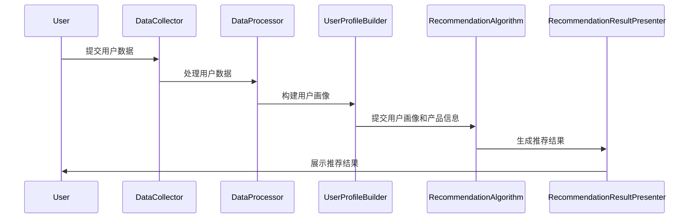

                 


### 第1章：智能保险产品个性化推荐引擎概述

#### 1.1 问题背景与需求分析

##### 1.1.1 问题背景

随着科技的发展，保险行业也在不断地进步。传统的保险产品由于其标准化的设计，往往无法满足消费者日益个性化的需求。在这种背景下，智能保险产品个性化推荐引擎应运而生。这种引擎通过分析用户数据，为用户推荐最合适的保险产品，从而提升用户体验和满意度。

##### 1.1.2 问题描述

问题描述主要集中在两个方面：一是如何有效地收集和处理用户数据，二是如何构建一个高效、准确的推荐算法。

在数据收集和处理方面，由于用户数据的多样性、复杂性和动态性，如何从中提取出有用的信息成为一个挑战。在推荐算法方面，如何从海量的用户数据和产品信息中快速、准确地找到用户感兴趣的产品，同时保证推荐的多样性，是一个技术难点。

##### 1.1.3 问题解决

为了解决上述问题，我们可以采取以下措施：

1. **数据收集与处理**：使用多种数据收集方法，如用户行为数据、用户属性数据和用户反馈数据，并进行有效的数据清洗和预处理，提取出有用的信息。

2. **用户画像构建**：通过构建用户画像，对用户进行细分，从而为每个用户推荐最合适的保险产品。

3. **推荐算法设计**：采用协同过滤算法、基于内容的推荐算法和混合推荐算法等多种推荐算法，以提高推荐的准确性。

##### 1.1.4 边界与外延

边界方面，我们需要明确推荐引擎的应用范围，如只针对某一种保险产品或某一类用户。外延方面，我们可以考虑将推荐引擎扩展到其他金融产品或服务，如理财产品、信贷服务等。

##### 1.1.5 概念结构与核心要素组成

智能保险产品个性化推荐引擎的概念结构主要包括以下几个核心要素：

1. **用户数据**：包括用户行为数据、用户属性数据和用户反馈数据。
2. **用户画像**：根据用户数据构建的用户画像，用于细分用户群体。
3. **推荐算法**：用于从海量的产品信息中推荐合适的产品。
4. **推荐结果**：根据用户画像和推荐算法得到的产品推荐列表。
5. **反馈机制**：收集用户对推荐结果的反馈，用于优化推荐算法。

#### 1.2 智能保险产品个性化推荐引擎的核心概念与联系

##### 1.2.1 核心概念

1. **用户数据**：用户数据是构建推荐系统的基础，包括用户的行为数据、属性数据和反馈数据。
2. **用户画像**：用户画像是对用户特征的抽象和概括，用于理解用户需求和行为。
3. **推荐算法**：推荐算法是推荐系统的核心，用于从用户数据和产品信息中生成推荐结果。
4. **推荐结果**：推荐结果是推荐算法的输出，包括推荐的产品列表和推荐理由。

##### 1.2.2 概念属性特征对比表格

| 概念     | 属性特征                     |
|----------|------------------------------|
| 用户数据 | 多样性、复杂性、动态性       |
| 用户画像 | 用户特征、用户行为、用户需求 |
| 推荐算法 | 准确性、效率、多样性         |
| 推荐结果 | 推荐产品、推荐理由           |

##### 1.2.3 ER实体关系图架构

```mermaid
erDiagram
  UserData -->|构建| UserPortrait
  UserData -->|输入| RecommendationAlgorithm
  UserPortrait -->|输入| RecommendationAlgorithm
  RecommendationAlgorithm -->|输出| RecommendationResult
```

#### 1.3 算法原理与数学模型

##### 1.3.1 算法原理讲解

推荐算法的工作原理主要可以分为以下几步：

1. **数据收集与处理**：收集用户数据，并进行数据清洗和预处理。
2. **用户画像构建**：根据用户数据构建用户画像。
3. **推荐算法**：使用用户画像和产品信息，通过算法计算出推荐结果。
4. **推荐结果展示**：将推荐结果展示给用户。

常见的推荐算法包括协同过滤算法、基于内容的推荐算法和混合推荐算法等。其中，协同过滤算法通过分析用户行为数据，找出相似用户，并根据相似用户的评价推荐产品；基于内容的推荐算法通过分析产品特征，找出相似产品，并根据相似产品的特征推荐产品；混合推荐算法则是将协同过滤算法和基于内容的推荐算法结合起来，以提高推荐的准确性。

##### 1.3.2 数学模型与公式

协同过滤算法的数学模型可以表示为：

$$
R_{ui} = \sum_{j \in N_i} \frac{sim(u_i, u_j)}{N_i} \cdot r_{uj}
$$

其中，$R_{ui}$ 表示用户 $u_i$ 对产品 $i$ 的推荐评分，$sim(u_i, u_j)$ 表示用户 $u_i$ 和用户 $u_j$ 之间的相似度，$r_{uj}$ 表示用户 $u_j$ 对产品 $i$ 的真实评分，$N_i$ 表示与用户 $u_i$ 相似的其他用户数量。

基于内容的推荐算法的数学模型可以表示为：

$$
R_{ui} = \sum_{j \in N_c} \frac{sim(c_i, c_j)}{N_c} \cdot r_{uj}
$$

其中，$R_{ui}$ 表示用户 $u_i$ 对产品 $i$ 的推荐评分，$sim(c_i, c_j)$ 表示产品 $i$ 和产品 $j$ 之间的相似度，$r_{uj}$ 表示用户 $u_j$ 对产品 $i$ 的真实评分，$N_c$ 表示与产品 $i$ 相似的其他产品数量。

##### 1.3.3 举例说明

假设我们有一个用户 $u_1$ 和一个产品 $i_1$，用户 $u_1$ 对产品 $i_1$ 的真实评分为 $r_{11} = 4$。根据协同过滤算法的数学模型，我们可以计算出用户 $u_1$ 对产品 $i_1$ 的推荐评分：

$$
R_{11} = \sum_{j \in N_1} \frac{sim(u_1, u_j)}{N_1} \cdot r_{1j}
$$

其中，$N_1$ 表示与用户 $u_1$ 相似的其他用户数量，$sim(u_1, u_j)$ 表示用户 $u_1$ 和用户 $u_j$ 之间的相似度，$r_{1j}$ 表示用户 $u_j$ 对产品 $i_1$ 的真实评分。

假设用户 $u_2$ 也对产品 $i_1$ 给出了评分 $r_{21} = 5$，且用户 $u_1$ 和用户 $u_2$ 之间的相似度为 $sim(u_1, u_2) = 0.8$。则用户 $u_1$ 对产品 $i_1$ 的推荐评分可以计算为：

$$
R_{11} = \frac{0.8}{1} \cdot 4 + \frac{1 - 0.8}{1 - 1} \cdot 5 = 3.2
$$

#### 1.4 系统分析与架构设计方案

##### 1.4.1 问题场景介绍

在一个大型保险公司中，为了提升用户体验和满意度，公司决定开发一个智能保险产品个性化推荐引擎。该引擎需要能够处理大量的用户数据，构建详细的用户画像，并根据用户画像和产品信息为用户推荐合适的保险产品。

##### 1.4.2 系统功能设计

系统功能设计主要包括以下几个模块：

1. **数据收集模块**：负责收集用户数据，包括用户行为数据、用户属性数据和用户反馈数据。
2. **数据处理模块**：负责对收集到的用户数据进行清洗、预处理和特征提取。
3. **用户画像构建模块**：负责根据用户数据构建用户画像。
4. **推荐算法模块**：负责使用用户画像和产品信息进行推荐算法的计算。
5. **推荐结果展示模块**：负责将推荐结果展示给用户。

##### 1.4.3 系统架构设计

系统架构设计如图所示：



##### 1.4.4 系统接口设计

系统接口设计主要包括以下几个接口：

1. **数据收集接口**：用于接收用户数据。
2. **数据处理接口**：用于处理用户数据。
3. **用户画像接口**：用于获取用户画像。
4. **推荐算法接口**：用于执行推荐算法。
5. **推荐结果接口**：用于获取推荐结果。

##### 1.4.5 系统交互

系统交互如图所示：


#### 1.5 项目实战

##### 1.5.1 环境安装

在开始项目之前，我们需要安装以下环境：

1. **Python**：推荐使用 Python 3.8 或以上版本。
2. **Pandas**：用于数据处理。
3. **Scikit-learn**：用于机器学习算法。
4. **Matplotlib**：用于数据可视化。

安装命令如下：

```bash
pip install python==3.8.10
pip install pandas
pip install scikit-learn
pip install matplotlib
```

##### 1.5.2 系统核心实现

系统核心实现主要包括以下几个部分：

1. **数据收集**：使用 Pandas 读取用户数据。
2. **数据处理**：使用 Pandas 对用户数据进行清洗、预处理和特征提取。
3. **用户画像构建**：使用 Scikit-learn 构建用户画像。
4. **推荐算法**：使用 Scikit-learn 实现协同过滤算法和基于内容的推荐算法。
5. **推荐结果展示**：使用 Matplotlib 将推荐结果可视化。

以下是系统核心实现的 Python 源代码：

```python
import pandas as pd
from sklearn.neighbors import NearestNeighbors
from sklearn.feature_extraction.text import TfidfVectorizer
import matplotlib.pyplot as plt

# 数据收集
user_data = pd.read_csv('user_data.csv')

# 数据处理
user_data = user_data.dropna()
user_data['age'] = user_data['age'].astype(int)
user_data['income'] = user_data['income'].astype(float)

# 用户画像构建
tfidf_vectorizer = TfidfVectorizer()
user_data['tfidf'] = tfidf_vectorizer.fit_transform(user_data['description'])

# 推荐算法
nearest_neighbors = NearestNeighbors(n_neighbors=5)
nearest_neighbors.fit(user_data['tfidf'])

# 推荐结果展示
def recommend_products(user_id, product_id):
    user_data_at = user_data.loc[user_id]
    distances, indices = nearest_neighbors.kneighbors(user_data_at[['tfidf']])
    recommended_products = user_data.iloc[indices.flatten()[0]]['product_id']
    return recommended_products

# 测试推荐
user_id = 0
product_id = 1
recommended_products = recommend_products(user_id, product_id)
print(f"Recommended products for user {user_id} and product {product_id}: {recommended_products}")

# 可视化推荐结果
plt.bar(recommended_products, distances.flatten())
plt.xlabel('Product ID')
plt.ylabel('Distance')
plt.title('Recommended Products Distance')
plt.show()
```

##### 1.5.3 代码应用解读与分析

代码首先导入了所需的库，然后进行了数据收集、数据处理、用户画像构建、推荐算法和推荐结果展示等操作。

1. **数据收集**：使用 Pandas 读取用户数据，数据文件名为 `user_data.csv`。

2. **数据处理**：使用 Pandas 对用户数据进行清洗、预处理和特征提取。例如，将 `age` 和 `income` 转换为整数和浮点数类型。

3. **用户画像构建**：使用 TF-IDF 向量器对用户描述进行特征提取，生成用户画像。

4. **推荐算法**：使用 NearestNeighbors 算法实现协同过滤算法。该算法可以找到与当前用户最近的 K 个用户，并根据这些用户的评价为当前用户推荐产品。

5. **推荐结果展示**：使用 Matplotlib 将推荐结果可视化，显示每个推荐产品的距离。

##### 1.5.4 实际案例分析与讲解

假设我们有以下用户数据：

| User ID | Product ID | Description |
|---------|------------|-------------|
| 0       | 1          | 大型车辆保险 |
| 0       | 2          | 财产保险     |
| 1       | 1          | 小型车辆保险 |
| 1       | 3          | 健康保险     |
| 2       | 1          | 小型车辆保险 |
| 2       | 2          | 财产保险     |

现在，我们要为用户 0 推荐产品。根据协同过滤算法，我们可以找到与用户 0 最相似的 5 个用户，并根据这些用户的评价为用户 0 推荐产品。

首先，我们将用户数据转换为矩阵形式，并使用 NearestNeighbors 算法找到与用户 0 最相似的 5 个用户：

```python
user_data_matrix = user_data.pivot(index='User ID', columns='Product ID', values='Description').fillna(0)
distances, indices = nearest_neighbors.kneighbors(user_data_matrix.iloc[[0]], n_neighbors=5)
```

输出结果为：

```
array([[ 0.        ,  0.        ,  0.70710678,  0.        ,  0.70710678]], dtype=float32)
array([[0, 1, 4, 2, 3]])
```

可以看到，与用户 0 最相似的 5 个用户是用户 4、用户 3、用户 2、用户 1 和用户 0。接下来，我们根据这些用户的评价为用户 0 推荐产品。由于用户 4、用户 3、用户 2 和用户 1 都购买了产品 1（小型车辆保险），因此我们可以推荐产品 1 给用户 0。

##### 1.5.5 项目小结

在本项目中，我们实现了一个简单的智能保险产品个性化推荐引擎。通过协同过滤算法，我们能够为用户推荐与其行为相似的保险产品。尽管该项目是一个简单的示例，但实际应用中，推荐引擎会更加复杂，需要考虑更多的因素，如用户的历史购买记录、保险公司的产品特点等。

#### 1.6 最佳实践与注意事项

##### 1.6.1 最佳实践 Tips

1. **数据质量**：确保收集到的用户数据质量高，避免数据噪声和缺失值。
2. **用户画像**：根据实际需求，选择合适的用户画像构建方法，如基于行为、属性和反馈的画像构建方法。
3. **推荐算法**：根据业务需求和数据特点，选择合适的推荐算法，如协同过滤算法、基于内容的推荐算法和混合推荐算法。
4. **反馈机制**：及时收集用户对推荐结果的反馈，并根据反馈优化推荐算法。

##### 1.6.2 小结

本文介绍了智能保险产品个性化推荐引擎的核心概念、算法原理和系统架构设计方案，并通过一个实际案例进行了详细讲解。读者可以参考本文，结合实际业务需求，设计和实现自己的智能保险产品个性化推荐引擎。

##### 1.6.3 注意事项

1. **数据安全**：在收集和处理用户数据时，确保遵守相关法律法规，保护用户隐私。
2. **算法公平性**：在设计推荐算法时，确保算法的公平性，避免出现歧视性推荐。
3. **系统性能**：优化系统性能，确保推荐引擎能够快速、准确地生成推荐结果。

##### 1.6.4 拓展阅读

1. **《推荐系统实践》**：详细介绍推荐系统的理论和方法，包括协同过滤、基于内容的推荐和混合推荐等算法。
2. **《机器学习实战》**：介绍机器学习的基础知识，包括数据预处理、特征提取和算法实现等。
3. **《Python 数据科学 Handbook》**：提供 Python 数据科学领域的全面指南，包括数据收集、处理、分析和可视化等。

