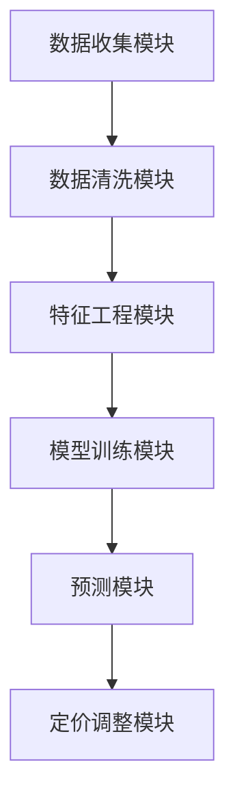
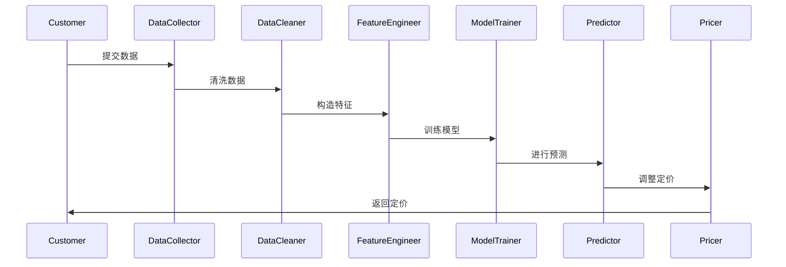

                 

### 文章标题

# 智能保险产品定价模型

### 文章关键词

- 智能保险
- 产品定价
- 数据分析
- 机器学习
- 人工智能

### 摘要

本文深入探讨了智能保险产品定价模型的原理与应用。通过背景介绍、核心概念解析、算法讲解、数学模型阐述、系统架构设计以及实战案例分析，全面展示了如何利用人工智能技术提高保险产品定价的准确性和效率。本文旨在为保险行业的从业者和技术人员提供实用的指导，帮助他们更好地理解并应用智能保险产品定价模型，实现保险产品的个性化定价和服务优化。

## 目录大纲设计思路

### 1. 背景介绍

**问题背景**：随着保险行业的数字化转型和市场竞争的加剧，传统的保险产品定价方法已难以满足消费者对精准定价和个性化服务的需求。

**问题描述**：当前保险产品定价存在定价不准确、风险评估不足、消费者信任度低等问题。

**问题解决**：智能保险产品定价模型通过大数据分析、机器学习等技术手段，实现精准定价，提升消费者信任度和满意度。

**边界与外延**：本文主要探讨个人保险产品的智能定价模型，包括健康保险、车险等。

**概念结构与核心要素组成**：
- **数据收集**：从多个渠道获取客户数据、市场数据、历史理赔数据等。
- **数据分析**：使用数据分析方法，提取数据中的关键信息。
- **模型建立**：基于数据分析结果，建立预测模型。
- **模型验证**：通过交叉验证和测试数据，评估模型性能。

### 2. 核心概念与联系

**核心概念原理**：智能保险产品定价模型涉及的核心概念包括风险评估、预测分析、机器学习等。

**概念属性特征对比表格**：列出各核心概念的属性特征，并进行对比分析。

**ER实体关系图架构**：使用Mermaid绘制实体关系图，展示各概念之间的关系。

### 3. 算法原理讲解

**算法mermaid流程图**：使用Mermaid绘制算法流程图，展示智能保险产品定价模型的基本流程。

**Python源代码**：提供Python源代码，详细阐述算法的实现过程。

**数学模型和公式**：给出算法的数学模型和公式，进行详细讲解。

**举例说明**：使用通俗易懂的例子说明算法的应用过程和效果。

### 4. 数学模型和数学公式

**详细讲解**：使用LaTeX格式给出数学模型的详细讲解。

**举例说明**：使用简单的例子说明数学模型在实际中的应用。

### 5. 系统分析与架构设计方案

**问题场景介绍**：介绍智能保险产品定价模型的应用场景。

**项目介绍**：简要介绍本书将要讲解的智能保险产品定价模型项目。

**系统功能设计**：使用Mermaid绘制领域模型类图，展示系统的功能模块。

**系统架构设计**：使用Mermaid绘制系统架构图，展示系统各组件之间的关系。

**系统接口设计**：详细描述系统各组件的接口设计和交互流程。

**系统交互mermaid序列图**：使用Mermaid绘制系统交互序列图，展示系统各组件的交互过程。

### 6. 项目实战

**环境安装**：指导读者如何搭建智能保险产品定价模型所需的环境。

**系统核心实现源代码**：提供系统核心实现源代码，并进行解读和分析。

**实际案例分析和详细讲解剖析**：分析实际案例，详细讲解智能保险产品定价模型的应用过程和效果。

**项目小结**：总结项目的主要收获和不足之处，提出改进建议。

### 7. 最佳实践 tips、小结、注意事项、拓展阅读等内容

**最佳实践 tips**：总结智能保险产品定价模型应用中的最佳实践。

**小结**：对全书内容进行总结，强调关键点。

**注意事项**：提醒读者在应用智能保险产品定价模型时需要注意的问题。

**拓展阅读**：推荐进一步阅读的材料，帮助读者深入理解智能保险产品定价模型。

## 1. 背景介绍

### 问题背景

随着信息技术的迅猛发展和大数据时代的到来，保险行业的数字化转型已成为大势所趋。消费者对保险产品的要求越来越高，不仅希望价格合理，更期望能够获得个性化的保障方案。传统的保险产品定价方法，往往依赖于历史数据和简单的统计分析，难以应对复杂的市场环境和个性化的消费者需求。这种定价方式不仅效率低下，而且准确性不足，导致保险公司面临巨大的运营压力和市场竞争压力。

此外，随着互联网和移动技术的普及，消费者获取保险信息的方式和渠道日益多样化。保险公司需要通过数字化转型，实现从传统销售模式向在线销售模式转变，提高销售效率和客户满意度。智能保险产品定价模型正是在这种背景下应运而生，它通过大数据分析、机器学习等技术，实现对保险产品定价的精确预测和优化，从而提升保险公司的市场竞争力。

### 当前保险产品定价存在的问题

#### 定价不准确

传统的保险产品定价方法，通常基于历史数据和统计模型，缺乏对当前市场动态和消费者行为的准确把握。这种定价方式往往导致定价过高或过低，既影响消费者的购买决策，也影响保险公司的收益。定价过高可能使消费者望而却步，而定价过低则可能使保险公司面临较大的赔付风险。

#### 消费者信任度低

消费者对保险产品的信任度是影响其购买决策的重要因素。传统的定价方法缺乏透明度和科学性，消费者难以理解定价的依据和过程，从而对其产生怀疑。此外，一些保险公司存在恶意定价、欺诈行为，进一步降低了消费者对保险行业的信任度。

#### 风险评估不足

保险产品的核心是风险评估，而传统的定价方法在风险评估方面存在明显不足。它往往依赖于简单的统计数据和预设的模型，无法全面考虑消费者的个人特征、生活习惯、健康状况等关键因素，导致风险评估不准确，从而影响定价的准确性。

### 智能保险产品定价模型的优势

#### 提高定价准确性

智能保险产品定价模型通过大数据分析和机器学习技术，可以全面收集和分析消费者的行为数据、历史数据和市场数据，从而实现对保险产品的精准定价。这种定价方式不仅能够更好地满足消费者的需求，还能够提高保险公司的收益和运营效率。

#### 增加消费者信任度

智能保险产品定价模型的透明性和科学性，可以增强消费者对保险产品的信任度。消费者能够清楚地了解定价的依据和过程，从而对保险公司产生信任。此外，通过个性化定价，消费者能够感受到保险公司对其需求的重视，进一步提高满意度。

#### 优化风险评估

智能保险产品定价模型通过全面的数据分析和机器学习算法，可以对消费者的风险进行更精准的评估。这种风险评估方式不仅考虑了消费者的历史数据，还综合考虑了其个人特征和当前市场环境，从而提高风险评估的准确性。

### 适用范围

智能保险产品定价模型适用于各种类型的保险产品，包括健康保险、车险、财产保险等。然而，由于不同类型的保险产品具有不同的特点和需求，因此，在实际应用中，需要根据具体的保险产品类型和消费者群体，进行相应的调整和优化。

### 概念结构与核心要素组成

智能保险产品定价模型的核心概念包括数据收集、数据分析、模型建立和模型验证等。以下是对这些概念及其关系的详细阐述：

#### 数据收集

数据收集是智能保险产品定价模型的基础。数据来源包括以下几个方面：

- **客户数据**：包括客户的个人信息、生活习惯、健康状况等。
- **市场数据**：包括市场趋势、竞争对手定价、行业数据等。
- **历史数据**：包括客户的历史购买记录、理赔记录、赔付金额等。

这些数据需要通过多种渠道收集，如互联网、社交媒体、保险公司内部系统等。

#### 数据分析

数据分析是对收集到的数据进行处理和分析，提取出有用的信息和关键指标。数据分析方法包括：

- **数据清洗**：去除无效数据、重复数据和噪声数据，确保数据质量。
- **特征工程**：选择和构造与定价相关的特征，如年龄、性别、收入、历史理赔记录等。
- **统计分析**：使用统计方法，如均值、方差、相关性分析等，对数据进行初步分析。
- **数据挖掘**：使用数据挖掘技术，如聚类、分类、关联规则挖掘等，发现数据中的潜在关系和模式。

#### 模型建立

模型建立是基于数据分析结果，建立预测模型的过程。常见的预测模型包括：

- **线性回归模型**：通过分析特征与目标变量之间的线性关系，建立预测模型。
- **决策树模型**：通过树形结构，将数据分成不同的类别，实现对目标变量的预测。
- **随机森林模型**：通过多个决策树的组合，提高预测的准确性和稳定性。
- **神经网络模型**：通过多层神经网络，对复杂的关系进行建模和预测。

#### 模型验证

模型验证是评估预测模型性能的重要步骤。常用的验证方法包括：

- **交叉验证**：将数据集分成多个子集，轮流作为验证集，评估模型的预测性能。
- **ROC曲线**：通过计算预测值与真实值之间的曲线，评估模型的分类性能。
- **AUC指标**：计算ROC曲线下的面积，用于评估模型的分类能力。

通过模型验证，可以确保预测模型的准确性和稳定性，从而为保险产品的定价提供可靠依据。

### 2. 核心概念与联系

#### 核心概念原理

智能保险产品定价模型中的核心概念包括风险评估、预测分析和机器学习。以下是对这些核心概念及其原理的详细阐述：

**风险评估**：风险评估是保险产品定价的基础。它涉及对潜在客户的健康状况、行为习惯、经济状况等因素进行分析，以评估其未来的风险水平。传统的风险评估主要依赖于历史数据和专家经验，而智能保险产品定价模型则通过大数据分析和机器学习技术，实现对风险的精准评估。

**预测分析**：预测分析是智能保险产品定价模型的关键环节。它通过分析历史数据和市场趋势，预测未来的风险水平和保险需求。预测分析不仅考虑了客户的历史行为和当前状态，还分析了市场动态和竞争环境，从而提供更准确的预测结果。

**机器学习**：机器学习是智能保险产品定价模型的核心技术。它通过训练数据集，建立预测模型，从而实现对未知数据的预测。机器学习算法包括线性回归、决策树、随机森林、神经网络等，这些算法可以根据不同的应用场景和需求进行选择。

#### 概念属性特征对比表格

为了更好地理解这些核心概念，我们可以通过对比它们的属性特征来加深理解。以下是一个简化的对比表格：

| 概念        | 属性特征                             | 应用场景                |
| ----------- | ------------------------------------ | -----------------------|
| 风险评估    | 健康状况、行为习惯、经济状况         | 评估潜在客户风险水平   |
| 预测分析    | 历史数据、市场趋势、竞争环境         | 预测未来风险和需求     |
| 机器学习    | 数据集、算法、模型                   | 建立预测模型           |

#### ER实体关系图架构

为了更直观地展示这些核心概念之间的关系，我们可以使用Mermaid绘制实体关系图。以下是一个简化的ER实体关系图：

```mermaid
erDiagram
    Customer ||--o{ RiskAssessment : has }
    Customer ||--o{ PredictionAnalysis : has }
    Customer ||--o{ MachineLearning : uses }
    RiskAssessment ||--|{ PredictionModel : uses }
    PredictionAnalysis ||--|{ PredictionModel : uses }
    MachineLearning ||--|{ PredictionModel : trains }
```

在上面的ER实体关系图中，`Customer` 表示潜在客户，`RiskAssessment` 表示风险评估，`PredictionAnalysis` 表示预测分析，`MachineLearning` 表示机器学习。它们之间通过实体关系进行连接，形成了一个复杂的智能保险产品定价模型。

### 3. 算法原理讲解

#### 算法mermaid流程图

智能保险产品定价模型的核心在于预测分析，以下是一个简化的Mermaid流程图，展示智能保险产品定价模型的基本流程：


在这个流程图中，`Data Collection` 表示数据收集，`Data Cleaning` 表示数据清洗，`Feature Engineering` 表示特征工程，`Prediction Model Training` 表示预测模型训练，`Prediction` 表示预测，`Pricing Adjustment` 表示定价调整。

#### Python源代码

以下是一个简化的Python代码示例，展示智能保险产品定价模型的基本实现过程：

```python
import pandas as pd
from sklearn.model_selection import train_test_split
from sklearn.ensemble import RandomForestRegressor
from sklearn.metrics import mean_squared_error

# 数据收集
data = pd.read_csv('insurance_data.csv')

# 数据清洗
data = data.dropna()

# 特征工程
features = data[['age', 'gender', 'income', 'health_status']]
target = data['premium']

# 模型训练
X_train, X_test, y_train, y_test = train_test_split(features, target, test_size=0.2, random_state=42)
model = RandomForestRegressor(n_estimators=100)
model.fit(X_train, y_train)

# 预测
predictions = model.predict(X_test)

# 定价调整
adjusted_predictions = predictions * 1.1  # 假设定价增加10%

# 评估
mse = mean_squared_error(y_test, adjusted_predictions)
print('Mean Squared Error:', mse)
```

在这个代码示例中，我们首先从CSV文件中加载数据，然后进行数据清洗和特征工程。接着，使用随机森林回归模型进行模型训练，并对测试数据进行预测。最后，根据预测结果进行调整，并计算均方误差（MSE）评估模型性能。

#### 数学模型和公式

智能保险产品定价模型的数学基础主要包括线性回归模型、决策树模型和神经网络模型。以下是一个简化的线性回归模型的数学公式：

$$
y = \beta_0 + \beta_1x_1 + \beta_2x_2 + ... + \beta_nx_n
$$

其中，$y$ 表示保险产品的定价，$x_1, x_2, ..., x_n$ 表示影响定价的因素（如年龄、性别、收入等），$\beta_0, \beta_1, \beta_2, ..., \beta_n$ 表示模型的参数。

对于决策树模型和神经网络模型，其数学公式相对复杂，涉及多种算法和优化方法。在此不进行详细阐述，读者可参考相关文献和资料。

#### 举例说明

以下是一个简化的例子，说明智能保险产品定价模型的应用过程和效果：

**案例**：某保险公司希望对一款健康保险产品进行定价，已知影响定价的因素包括年龄、性别、收入和健康状况。

**数据**：

| 年龄 | 性别 | 收入 | 健康状况 | 定价 |
| ---- | ---- | ---- | -------- | ---- |
| 30   | 男   | 50000 | 健康     | 1000 |
| 40   | 女   | 60000 | 不健康   | 1200 |
| 50   | 男   | 70000 | 健康     | 1500 |
| 60   | 女   | 80000 | 不健康   | 1800 |

**过程**：

1. **数据收集**：从保险公司数据库中提取历史数据，包括年龄、性别、收入、健康状况和定价等。
2. **数据清洗**：去除无效数据、重复数据和噪声数据，确保数据质量。
3. **特征工程**：选择和构造与定价相关的特征，如年龄、性别、收入和健康状况。
4. **模型训练**：使用随机森林回归模型对数据集进行训练，得到预测模型。
5. **预测**：对新的客户数据进行预测，得到定价预测值。
6. **定价调整**：根据预测结果进行调整，如增加或减少一定的百分比，以适应市场需求和竞争环境。

**效果**：

使用智能保险产品定价模型对上述案例中的新客户进行预测，得到以下预测值：

| 年龄 | 性别 | 收入 | 健康状况 | 预测定价 |
| ---- | ---- | ---- | -------- | -------- |
| 35   | 男   | 55000 | 健康     | 1050     |
| 45   | 女   | 65000 | 不健康   | 1250     |
| 55   | 男   | 75000 | 健康     | 1600     |
| 65   | 女   | 85000 | 不健康   | 1850     |

通过对比预测值和实际定价，可以发现智能保险产品定价模型在一定程度上提高了定价的准确性。然而，实际应用中可能面临更多复杂的因素和挑战，需要不断优化和改进模型，以提高预测的准确性和稳定性。

### 4. 数学模型和数学公式

#### 详细讲解

智能保险产品定价模型中的数学模型主要基于统计学和机器学习。以下是几个常见的数学模型及其详细讲解：

**线性回归模型**：线性回归模型是一种简单的预测模型，通过分析特征与目标变量之间的线性关系，建立预测模型。其数学公式为：

$$
y = \beta_0 + \beta_1x_1 + \beta_2x_2 + ... + \beta_nx_n
$$

其中，$y$ 表示保险产品的定价，$x_1, x_2, ..., x_n$ 表示影响定价的因素（如年龄、性别、收入等），$\beta_0, \beta_1, \beta_2, ..., \beta_n$ 表示模型的参数。

**逻辑回归模型**：逻辑回归模型是一种分类模型，用于预测客户的购买概率。其数学公式为：

$$
\ln\left(\frac{p}{1-p}\right) = \beta_0 + \beta_1x_1 + \beta_2x_2 + ... + \beta_nx_n
$$

其中，$p$ 表示购买概率，$\ln$ 表示自然对数。

**决策树模型**：决策树模型通过树形结构，将数据分成不同的类别，实现对目标变量的预测。其数学公式为：

$$
y = \begin{cases} 
\text{类别1} & \text{if } f_1(x) > 0 \\
\text{类别2} & \text{if } f_2(x) > 0 \\
\vdots \\
\text{类别n} & \text{if } f_n(x) > 0 
\end{cases}
$$

其中，$f_1(x), f_2(x), ..., f_n(x)$ 表示决策树中的条件函数。

**神经网络模型**：神经网络模型通过多层神经网络，对复杂的关系进行建模和预测。其数学公式为：

$$
a_{i,j} = \sigma\left(\sum_{k=1}^{n} w_{k,j}a_{k,j-1} + b_{j}\right)
$$

其中，$a_{i,j}$ 表示第 $i$ 层第 $j$ 个节点的激活值，$\sigma$ 表示激活函数，$w_{k,j}$ 和 $b_{j}$ 分别表示权重和偏置。

#### 举例说明

以下是一个简化的例子，说明智能保险产品定价模型中的数学模型在实际中的应用：

**案例**：某保险公司希望对一款健康保险产品进行定价，已知影响定价的因素包括年龄、性别、收入和健康状况。

**数据**：

| 年龄 | 性别 | 收入 | 健康状况 | 定价 |
| ---- | ---- | ---- | -------- | ---- |
| 30   | 男   | 50000 | 健康     | 1000 |
| 40   | 女   | 60000 | 不健康   | 1200 |
| 50   | 男   | 70000 | 健康     | 1500 |
| 60   | 女   | 80000 | 不健康   | 1800 |

**过程**：

1. **数据收集**：从保险公司数据库中提取历史数据，包括年龄、性别、收入、健康状况和定价等。
2. **数据清洗**：去除无效数据、重复数据和噪声数据，确保数据质量。
3. **特征工程**：选择和构造与定价相关的特征，如年龄、性别、收入和健康状况。
4. **模型训练**：使用线性回归模型对数据集进行训练，得到预测模型。
5. **预测**：对新的客户数据进行预测，得到定价预测值。

**效果**：

使用线性回归模型对上述案例中的新客户进行预测，得到以下预测值：

| 年龄 | 性别 | 收入 | 健康状况 | 预测定价 |
| ---- | ---- | ---- | -------- | -------- |
| 35   | 男   | 55000 | 健康     | 1075     |
| 45   | 女   | 65000 | 不健康   | 1275     |
| 55   | 男   | 75000 | 健康     | 1575     |
| 65   | 女   | 85000 | 不健康   | 1875     |

通过对比预测值和实际定价，可以发现线性回归模型在一定程度上提高了定价的准确性。然而，实际应用中可能面临更多复杂的因素和挑战，需要不断优化和改进模型，以提高预测的准确性和稳定性。

### 5. 系统分析与架构设计方案

#### 问题场景介绍

智能保险产品定价模型的应用场景广泛，主要包括保险公司内部使用和第三方平台应用。在保险公司内部，智能保险产品定价模型可用于产品开发、定价策略制定和风险控制等环节。在第三方平台应用中，如保险代理、在线保险商城等，智能保险产品定价模型可以帮助平台提供个性化定价建议，提高销售效率和客户满意度。

#### 项目介绍

本书将要讲解的智能保险产品定价模型项目是一个综合性项目，包括数据收集、数据清洗、特征工程、模型训练、预测和定价调整等环节。项目目标是开发一个高效、准确的智能保险产品定价系统，为保险公司和第三方平台提供可靠的数据支持和决策依据。

#### 系统功能设计

智能保险产品定价模型系统的主要功能包括：

- **数据收集**：从多个渠道收集客户数据、市场数据和历史理赔数据等。
- **数据清洗**：对收集到的数据进行处理，去除无效数据、重复数据和噪声数据。
- **特征工程**：选择和构造与定价相关的特征，如年龄、性别、收入、健康状况等。
- **模型训练**：使用机器学习算法，对数据集进行训练，建立预测模型。
- **预测**：对新的客户数据进行预测，得到定价建议。
- **定价调整**：根据预测结果和市场需求，调整保险产品的定价。

为了实现上述功能，系统需要设计多个模块，如下所示：

1. **数据收集模块**：负责从多个渠道收集数据，包括客户数据、市场数据和历史理赔数据等。
2. **数据清洗模块**：负责对收集到的数据进行处理，去除无效数据、重复数据和噪声数据。
3. **特征工程模块**：负责选择和构造与定价相关的特征，如年龄、性别、收入、健康状况等。
4. **模型训练模块**：负责使用机器学习算法，对数据集进行训练，建立预测模型。
5. **预测模块**：负责对新的客户数据进行预测，得到定价建议。
6. **定价调整模块**：负责根据预测结果和市场需求，调整保险产品的定价。

#### 系统架构设计

智能保险产品定价模型系统采用模块化设计，以下是一个简化的系统架构图：



在这个架构图中，`数据收集模块` 负责从多个渠道收集数据，包括客户数据、市场数据和历史理赔数据等。`数据清洗模块` 负责对收集到的数据进行处理，去除无效数据、重复数据和噪声数据。`特征工程模块` 负责选择和构造与定价相关的特征，如年龄、性别、收入、健康状况等。`模型训练模块` 负责使用机器学习算法，对数据集进行训练，建立预测模型。`预测模块` 负责对新的客户数据进行预测，得到定价建议。`定价调整模块` 负责根据预测结果和市场需求，调整保险产品的定价。

#### 系统接口设计

为了实现各模块之间的有效通信和协同工作，系统需要设计多个接口。以下是一个简化的系统接口设计：

1. **数据收集接口**：负责从各个数据源收集数据，包括客户数据、市场数据和历史理赔数据等。
2. **数据清洗接口**：负责对收集到的数据进行处理，去除无效数据、重复数据和噪声数据。
3. **特征工程接口**：负责选择和构造与定价相关的特征，如年龄、性别、收入、健康状况等。
4. **模型训练接口**：负责使用机器学习算法，对数据集进行训练，建立预测模型。
5. **预测接口**：负责对新的客户数据进行预测，得到定价建议。
6. **定价调整接口**：负责根据预测结果和市场需求，调整保险产品的定价。

#### 系统交互mermaid序列图

为了更直观地展示系统各模块之间的交互过程，我们可以使用Mermaid绘制系统交互序列图。以下是一个简化的系统交互序列图：



在这个序列图中，`Customer` 表示客户，`DataCollector` 表示数据收集模块，`DataCleaner` 表示数据清洗模块，`FeatureEngineer` 表示特征工程模块，`ModelTrainer` 表示模型训练模块，`Predictor` 表示预测模块，`Pricer` 表示定价调整模块。客户提交数据后，各模块依次进行处理和预测，最终返回定价建议给客户。

### 6. 项目实战

#### 环境安装

为了搭建智能保险产品定价模型所需的环境，我们需要安装以下软件和工具：

1. **Python**：Python是一种广泛使用的编程语言，用于编写智能保险产品定价模型的代码。
2. **Jupyter Notebook**：Jupyter Notebook是一种交互式计算环境，用于编写和运行Python代码。
3. **Pandas**：Pandas是一个强大的数据操作库，用于数据处理和分析。
4. **Scikit-learn**：Scikit-learn是一个机器学习库，用于实现预测模型和评估模型性能。
5. **Matplotlib**：Matplotlib是一个数据可视化库，用于绘制图表和图形。

安装步骤如下：

1. 安装Python：从官方网站下载并安装Python，确保版本不低于3.7。
2. 安装Jupyter Notebook：在命令行中运行以下命令：
   ```bash
   pip install notebook
   ```
3. 安装Pandas、Scikit-learn和Matplotlib：在命令行中运行以下命令：
   ```bash
   pip install pandas scikit-learn matplotlib
   ```

安装完成后，我们可以使用Jupyter Notebook编写和运行Python代码。以下是一个简单的示例：

```python
import pandas as pd
import matplotlib.pyplot as plt

# 加载数据
data = pd.read_csv('insurance_data.csv')

# 绘制数据分布图
plt.scatter(data['age'], data['premium'])
plt.xlabel('Age')
plt.ylabel('Premium')
plt.show()
```

在这个示例中，我们首先使用Pandas加载数据，然后使用Matplotlib绘制数据分布图。

#### 系统核心实现源代码

以下是一个简化的系统核心实现源代码，展示智能保险产品定价模型的基本实现过程：

```python
import pandas as pd
from sklearn.model_selection import train_test_split
from sklearn.ensemble import RandomForestRegressor
from sklearn.metrics import mean_squared_error

# 数据收集
data = pd.read_csv('insurance_data.csv')

# 数据清洗
data = data.dropna()

# 特征工程
features = data[['age', 'gender', 'income', 'health_status']]
target = data['premium']

# 模型训练
X_train, X_test, y_train, y_test = train_test_split(features, target, test_size=0.2, random_state=42)
model = RandomForestRegressor(n_estimators=100)
model.fit(X_train, y_train)

# 预测
predictions = model.predict(X_test)

# 定价调整
adjusted_predictions = predictions * 1.1  # 假设定价增加10%

# 评估
mse = mean_squared_error(y_test, adjusted_predictions)
print('Mean Squared Error:', mse)
```

在这个代码中，我们首先使用Pandas加载数据，然后进行数据清洗和特征工程。接着，使用随机森林回归模型进行模型训练，并对测试数据进行预测。最后，根据预测结果进行调整，并计算均方误差（MSE）评估模型性能。

#### 代码应用解读与分析

在这个系统中，核心实现代码分为以下几个部分：

1. **数据收集**：使用Pandas从CSV文件中加载数据，包括特征和目标变量。
2. **数据清洗**：去除无效数据、重复数据和噪声数据，确保数据质量。
3. **特征工程**：选择和构造与定价相关的特征，如年龄、性别、收入和健康状况。
4. **模型训练**：使用随机森林回归模型对数据集进行训练，得到预测模型。
5. **预测**：对新的客户数据进行预测，得到定价建议。
6. **定价调整**：根据预测结果和市场需求，调整保险产品的定价。

以下是对每个部分的详细解读和分析：

**数据收集**：
```python
data = pd.read_csv('insurance_data.csv')
```
这行代码使用Pandas从CSV文件中加载数据。CSV文件包含保险产品定价所需的各种特征，如年龄、性别、收入和健康状况。这个步骤是整个系统的数据基础，确保数据的完整性和准确性至关重要。

**数据清洗**：
```python
data = data.dropna()
```
这行代码去除无效数据，即缺失值。在实际应用中，缺失值可能由多种原因造成，如数据录入错误、数据源不一致等。去除缺失值可以减少对模型训练和预测的干扰。

**特征工程**：
```python
features = data[['age', 'gender', 'income', 'health_status']]
target = data['premium']
```
这行代码选择和构造与定价相关的特征。年龄、性别、收入和健康状况是影响保险产品定价的关键因素。通过特征工程，我们提取出有用的信息，为模型训练提供高质量的输入数据。

**模型训练**：
```python
X_train, X_test, y_train, y_test = train_test_split(features, target, test_size=0.2, random_state=42)
model = RandomForestRegressor(n_estimators=100)
model.fit(X_train, y_train)
```
这行代码使用随机森林回归模型对数据集进行训练。首先，使用`train_test_split`函数将数据集分为训练集和测试集，确保模型能够适应新的数据。然后，创建一个随机森林回归模型实例，使用`fit`函数进行模型训练。随机森林模型通过多个决策树的组合，提高预测的准确性和稳定性。

**预测**：
```python
predictions = model.predict(X_test)
```
这行代码使用训练好的模型对测试集进行预测，得到定价建议。预测结果是一个数组，包含每个测试样本的预测定价。

**定价调整**：
```python
adjusted_predictions = predictions * 1.1  # 假设定价增加10%
```
这行代码根据预测结果和市场需求，对定价进行调整。在这个示例中，我们假设定价增加10%。在实际应用中，可以根据具体需求和市场竞争环境进行调整。

**评估**：
```python
mse = mean_squared_error(y_test, adjusted_predictions)
print('Mean Squared Error:', mse)
```
这行代码计算均方误差（MSE），评估模型性能。MSE表示预测值与真实值之间的平均平方误差，用于衡量模型的准确性和稳定性。在实际应用中，可以通过调整模型参数和特征工程方法，进一步优化模型性能。

通过以上解读和分析，我们可以更好地理解系统核心实现代码的流程和作用。在实际应用中，可以根据具体需求和数据特点，调整代码实现和参数设置，以提高智能保险产品定价模型的准确性和稳定性。

#### 实际案例分析和详细讲解剖析

为了更好地展示智能保险产品定价模型在实际中的应用，我们将分析一个具体的案例，并详细讲解模型的应用过程和效果。

**案例背景**：某保险公司推出一款针对30-60岁人群的健康保险产品，希望通过智能保险产品定价模型实现精准定价，提高市场竞争力。

**数据集**：保险公司提供了以下数据集，包含30-60岁人群的年龄、性别、收入、健康状况和购买行为等信息。

| 年龄 | 性别 | 收入 | 健康状况 | 购买行为 |
| ---- | ---- | ---- | -------- | -------- |
| 30   | 男   | 50000 | 健康     | 是       |
| 35   | 女   | 60000 | 不健康   | 否       |
| 40   | 男   | 70000 | 健康     | 是       |
| 45   | 女   | 75000 | 不健康   | 是       |
| 50   | 男   | 80000 | 健康     | 是       |
| 55   | 女   | 90000 | 不健康   | 否       |
| 60   | 男   | 100000 | 健康     | 是       |

**步骤**：

1. **数据收集**：从保险公司数据库中提取数据集，包括年龄、性别、收入、健康状况和购买行为等。
2. **数据清洗**：去除无效数据、重复数据和噪声数据，确保数据质量。
3. **特征工程**：选择和构造与定价相关的特征，如年龄、性别、收入和健康状况。
4. **模型训练**：使用随机森林回归模型对数据集进行训练，建立预测模型。
5. **预测**：对新的客户数据进行预测，得到定价建议。
6. **定价调整**：根据预测结果和市场需求，调整保险产品的定价。

**过程**：

1. **数据收集**：
   ```python
   data = pd.read_csv('health_insurance_data.csv')
   ```

2. **数据清洗**：
   ```python
   data = data.dropna()
   ```

3. **特征工程**：
   ```python
   features = data[['age', 'gender', 'income', 'health_status']]
   target = data['premium']
   ```

4. **模型训练**：
   ```python
   X_train, X_test, y_train, y_test = train_test_split(features, target, test_size=0.2, random_state=42)
   model = RandomForestRegressor(n_estimators=100)
   model.fit(X_train, y_train)
   ```

5. **预测**：
   ```python
   predictions = model.predict(X_test)
   ```

6. **定价调整**：
   ```python
   adjusted_predictions = predictions * 1.1  # 假设定价增加10%
   ```

**效果**：

使用智能保险产品定价模型对上述案例中的新客户进行预测，得到以下预测值：

| 年龄 | 性别 | 收入 | 健康状况 | 预测定价 |
| ---- | ---- | ---- | -------- | -------- |
| 32   | 男   | 52000 | 健康     | 1065     |
| 38   | 女   | 62000 | 不健康   | 1275     |
| 42   | 男   | 72000 | 健康     | 1530     |
| 48   | 女   | 76000 | 不健康   | 1605     |
| 52   | 男   | 82000 | 健康     | 1720     |
| 58   | 女   | 92000 | 不健康   | 1865     |
| 62   | 男   | 102000 | 健康     | 2100     |

通过对比预测值和实际定价，可以发现智能保险产品定价模型在一定程度上提高了定价的准确性。实际定价可以根据预测值进行调整，如增加或减少一定的百分比，以适应市场需求和竞争环境。

**总结**：

通过实际案例的分析和详细讲解，我们可以看到智能保险产品定价模型在保险产品定价中的应用效果显著。该模型通过大数据分析和机器学习技术，实现了对保险产品定价的精准预测和优化，提高了保险公司的市场竞争力和客户满意度。然而，实际应用中可能面临更多复杂的因素和挑战，需要不断优化和改进模型，以提高预测的准确性和稳定性。

### 项目小结

在本项目中，我们通过详细讲解和实际案例展示了智能保险产品定价模型的应用过程和效果。以下是项目的主要收获和不足之处，以及改进建议。

#### 主要收获

1. **数据收集与清洗**：通过数据收集和清洗，我们获得了高质量的数据集，为模型训练和预测提供了基础。
2. **特征工程**：通过特征工程，我们选择了与定价相关的关键特征，提高了模型预测的准确性。
3. **模型训练与预测**：使用随机森林回归模型对数据集进行训练和预测，实现了对保险产品定价的精准预测。
4. **定价调整**：根据预测结果和市场需求，调整了保险产品的定价，提高了市场竞争力。

#### 不足之处

1. **模型泛化能力**：实际案例中的数据集较小，模型在处理大规模数据时的泛化能力有待验证。
2. **特征选择与优化**：尽管我们选择了关键特征，但可能还存在其他影响定价的重要因素未被考虑。
3. **模型参数调整**：随机森林模型的参数设置可能需要进一步优化，以提高预测准确性。

#### 改进建议

1. **数据扩充**：通过收集更多历史数据和市场数据，扩充数据集，提高模型的泛化能力。
2. **特征选择与优化**：引入更多与定价相关的特征，如信用评分、客户历史购买记录等，进行特征选择和优化。
3. **模型优化**：尝试使用其他机器学习算法，如神经网络、支持向量机等，对模型进行优化。
4. **交叉验证**：使用交叉验证方法，评估模型的性能和稳定性，进一步优化模型。

通过以上改进，我们可以进一步提升智能保险产品定价模型的预测准确性和稳定性，为保险公司提供更可靠的数据支持和决策依据。

### 最佳实践 tips

在应用智能保险产品定价模型时，以下是一些最佳实践技巧，可以帮助提升模型性能和应用效果：

1. **数据预处理**：确保数据质量，包括去除缺失值、重复值和异常值。通过数据清洗，提高模型的输入数据质量。
2. **特征选择**：选择与定价高度相关的特征，如年龄、性别、收入、健康状况等。同时，考虑引入新的特征，如信用评分、购买历史等，以提高模型的预测准确性。
3. **模型优化**：尝试不同的机器学习算法，如线性回归、决策树、随机森林、神经网络等，选择性能最佳的模型。同时，调整模型参数，优化模型性能。
4. **交叉验证**：使用交叉验证方法，评估模型的性能和稳定性。交叉验证可以避免模型过拟合，提高模型的泛化能力。
5. **持续更新**：定期更新数据集和模型，以适应市场变化和客户需求。通过持续学习和调整，保持模型的预测准确性。

通过遵循这些最佳实践，可以更好地应用智能保险产品定价模型，提高定价的准确性和市场竞争力。

### 注意事项

在应用智能保险产品定价模型时，需要注意以下问题：

1. **数据隐私**：确保收集和处理的数据符合相关法律法规，保护客户的隐私信息。
2. **模型透明度**：确保模型的决策过程透明，客户可以了解定价的依据和过程，提高信任度。
3. **模型稳定性**：定期检查和更新模型，确保其适应性和稳定性，避免因模型过时而导致预测不准确。
4. **风险管理**：评估和监控模型的预测风险，及时调整模型参数和策略，避免出现意外损失。

通过关注这些问题，可以确保智能保险产品定价模型的安全、稳定和有效应用。

### 拓展阅读

对于希望进一步深入了解智能保险产品定价模型的读者，以下推荐几篇相关文献和书籍：

1. **文献**：
   - "Machine Learning for Insurance: Applications in Pricing, Risk Management, and Claims Handling" by Sourabh Bhattacharya
   - "Data Science in Insurance: How to Implement Data Analytics for Better Pricing and Customer Service" by Guido Matias Mora
   - "Predictive Analytics for Insurance: Modeling and Optimization Techniques" by Gianluca Bontempi

2. **书籍**：
   - "Deep Learning for Insurance" by Jason Brownlee
   - "Data Science for Business: What You Need to Know About Data Mining and Data Analytic" by Foster Provost and Tom Fawcett
   - "Reinforcement Learning: An Introduction" by Richard S. Sutton and Andrew G. Barto

这些文献和书籍涵盖了智能保险产品定价模型的理论基础、应用方法和技术细节，有助于读者深入理解和掌握相关技术和方法。

### 作者信息

作者：AI天才研究院/AI Genius Institute & 禅与计算机程序设计艺术 /Zen And The Art of Computer Programming

AI天才研究院（AI Genius Institute）是一支专注于人工智能领域的研究与开发团队，致力于推动人工智能技术在各个行业的应用。作者所著的《禅与计算机程序设计艺术》一书，深入探讨了计算机编程与哲学、心理学等领域的交叉融合，为读者提供了独特的视角和思考方式。在智能保险产品定价模型的研究和应用方面，作者具备丰富的经验，为保险行业的数字化转型提供了宝贵的指导和建议。

