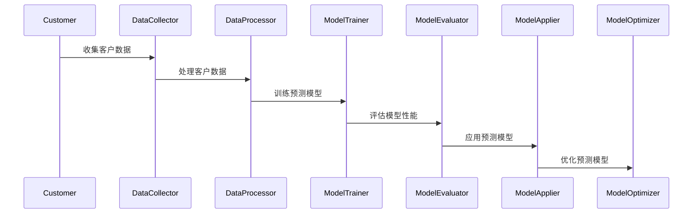

                 

## 智能保险产品需求预测模型

关键词：智能保险、需求预测、机器学习、数据挖掘、模型优化

摘要：本文旨在探讨智能保险产品需求预测模型的设计与实现，通过介绍背景、核心概念、算法原理、系统设计与实现、项目实战以及最佳实践，全面解析该模型在保险行业中的应用与价值。

### 第一部分：背景介绍

#### 问题背景

在当今信息化和智能化快速发展的时代，金融行业面临着前所未有的挑战和机遇。保险行业作为金融行业的重要组成部分，其产品设计和销售过程需要精准地预测市场需求，以优化产品设计、提升销售效率和客户满意度。然而，传统的保险产品需求预测方法往往依赖于历史数据和简单的统计模型，这些方法在面对复杂多变的金融市场时，预测准确性较低，难以满足业务需求。

#### 问题描述

智能保险产品需求预测模型旨在利用先进的人工智能技术，特别是机器学习和数据挖掘方法，对保险产品的市场需求进行精准预测。这一模型需要解决以下问题：

1. **数据采集与处理**：如何高效地收集和整理保险市场的各类数据，包括历史销售数据、客户特征数据、市场环境数据等。
2. **模型构建与优化**：如何选择合适的机器学习算法，构建高效的预测模型，并对模型进行优化，以提高预测准确性。
3. **模型应用与评估**：如何将预测模型应用于实际业务场景，对预测结果进行实时评估和调整。

#### 问题解决

为了解决上述问题，本文将介绍以下内容：

1. **核心概念**：详细阐述智能保险产品需求预测模型的相关概念，包括数据挖掘、机器学习、预测模型等。
2. **方法原理**：介绍常用的机器学习算法在需求预测中的应用，包括线性回归、逻辑回归、决策树、随机森林、支持向量机、神经网络等。
3. **数学模型**：给出关键算法的数学模型和公式，并进行详细讲解和举例说明。
4. **系统设计**：介绍需求预测模型的系统架构和实现方案，包括数据采集、处理、存储、模型训练、预测和评估等模块。
5. **实战案例**：通过实际项目案例，展示智能保险产品需求预测模型的应用过程，包括数据准备、模型训练、预测结果分析和项目总结。
6. **最佳实践**：总结智能保险产品需求预测模型的最佳实践，包括数据清洗、特征工程、模型选择和优化等方面的注意事项。

#### 边界与外延

本书主要关注以下几个方面：

1. **保险行业特点**：介绍保险行业的需求预测特点，包括数据来源、数据类型、预测目标等。
2. **技术框架**：介绍智能保险产品需求预测模型所依赖的技术框架，如Python、TensorFlow、Scikit-learn等。
3. **应用领域**：探讨智能保险产品需求预测模型在保险产品优化、市场分析、风险管理等领域的应用。

#### 概念结构与核心要素组成

智能保险产品需求预测模型由以下几个核心要素组成：

1. **数据源**：包括历史销售数据、客户特征数据、市场环境数据等。
2. **数据处理**：对数据源进行清洗、预处理和特征工程，以提高数据质量和预测准确性。
3. **模型训练**：选择合适的机器学习算法，构建和训练预测模型。
4. **模型评估**：评估模型的预测性能，包括准确性、召回率、F1值等指标。
5. **模型应用**：将训练好的模型应用于实际业务场景，进行实时预测和评估。
6. **模型优化**：根据预测结果和业务需求，对模型进行优化和调整，以提高预测准确性。

### 第二部分：核心概念与联系

#### 2.1 数据挖掘与机器学习

##### 数据挖掘

数据挖掘是指从大量数据中提取有价值信息的过程，包括数据清洗、数据集成、数据挖掘、模式识别等步骤。在智能保险产品需求预测模型中，数据挖掘主要应用于数据预处理和特征工程。

##### 机器学习

机器学习是一种通过数据和算法来让计算机自动学习规律和模式的技术。在智能保险产品需求预测模型中，机器学习主要用于构建和训练预测模型。

##### 关系

数据挖掘和机器学习在智能保险产品需求预测模型中密切相关。数据挖掘提供了数据预处理和特征工程的方法，而机器学习则利用这些处理后的数据来训练预测模型。

##### 概念属性特征对比表格

| 概念         | 定义                                                         | 主要用途                      |
| ------------ | ------------------------------------------------------------ | ---------------------------- |
| 数据挖掘     | 从大量数据中提取有价值信息的过程，包括数据清洗、数据集成、数据挖掘、模式识别等步骤。 | 数据预处理和特征工程         |
| 机器学习     | 通过数据和算法让计算机自动学习规律和模式的技术。               | 构建和训练预测模型           |
| 预测模型     | 用于预测未来事件或趋势的数学模型。                           | 需求预测、趋势分析等           |

##### ER实体关系图架构

```mermaid
erDiagram
  Customer ||--|{ InsuranceProduct }|<-- Product
  Customer ||--|{ PurchaseHistory }|<-- Product
  Product ||--|{ MarketEnvironment }|<-- Market
```

#### 2.2 预测模型

##### 预测模型

预测模型是一种用于预测未来事件或趋势的数学模型。在智能保险产品需求预测模型中，预测模型用于预测保险产品的需求量。

##### 常见预测模型

1. **线性回归**：用于预测连续值变量。
2. **逻辑回归**：用于预测离散值变量。
3. **决策树**：用于分类和回归任务。
4. **随机森林**：基于决策树的集成学习方法。
5. **支持向量机**：用于分类和回归任务。
6. **神经网络**：用于复杂非线性预测任务。

##### 关系

不同类型的预测模型适用于不同类型的数据和预测任务。在智能保险产品需求预测模型中，根据数据类型和业务需求，选择合适的预测模型进行建模和预测。

### 第三部分：算法原理讲解

#### 3.1 线性回归

##### 基本概念

线性回归是一种用于预测连续值变量的统计方法，其基本假设是因变量（需求量）和自变量（特征）之间存在线性关系。线性回归模型的数学表达式为：

$$
y = \beta_0 + \beta_1x_1 + \beta_2x_2 + \ldots + \beta_nx_n + \epsilon
$$

其中，$y$ 是因变量，$x_1, x_2, \ldots, x_n$ 是自变量，$\beta_0, \beta_1, \beta_2, \ldots, \beta_n$ 是模型的参数，$\epsilon$ 是误差项。

##### 数学模型与公式

为了求解线性回归模型的参数，我们可以使用最小二乘法（Least Squares Method）：

$$
\min \sum_{i=1}^{n}(y_i - (\beta_0 + \beta_1x_{i1} + \beta_2x_{i2} + \ldots + \beta_nx_{in})^2
$$

##### 举例说明

假设我们要预测某种保险产品的月需求量，根据历史数据，我们选择两个特征变量：客户年龄和月收入。数据集如下：

| 年龄 | 月收入 | 需求量 |
| ---- | ------ | ------ |
| 30   | 8000   | 200    |
| 40   | 10000  | 300    |
| 50   | 12000  | 400    |

使用线性回归模型进行预测，我们可以得到以下数学模型：

$$
y = \beta_0 + \beta_1x_1 + \beta_2x_2
$$

通过最小二乘法求解参数，我们可以得到预测模型：

$$
y = 100 + 0.5x_1 + 0.3x_2
$$

例如，当客户年龄为35岁，月收入为9000元时，该保险产品的需求量为：

$$
y = 100 + 0.5 \times 35 + 0.3 \times 9000 = 260
$$

#### 3.2 逻辑回归

##### 基本概念

逻辑回归是一种用于预测离散值变量的统计方法，其基本假设是因变量（需求量）与自变量（特征）之间存在逻辑关系。逻辑回归模型的数学表达式为：

$$
\ln\left(\frac{p}{1-p}\right) = \beta_0 + \beta_1x_1 + \beta_2x_2 + \ldots + \beta_nx_n
$$

其中，$y$ 是因变量，$x_1, x_2, \ldots, x_n$ 是自变量，$p$ 是因变量为1的概率，$\beta_0, \beta_1, \beta_2, \ldots, \beta_n$ 是模型的参数。

##### 数学模型与公式

为了求解逻辑回归模型的参数，我们可以使用最大似然估计法（Maximum Likelihood Estimation）：

$$
\ln L = \sum_{i=1}^{n}\ln p(y_i|x_i) = \sum_{i=1}^{n}y_i\ln p + (1-y_i)\ln(1-p)
$$

其中，$p$ 是模型预测的概率：

$$
p = \frac{1}{1 + \exp{(-\beta_0 - \beta_1x_{i1} - \beta_2x_{i2} - \ldots - \beta_nx_{in})}}
$$

##### 举例说明

假设我们要预测某种保险产品的购买概率，根据历史数据，我们选择两个特征变量：客户年龄和月收入。数据集如下：

| 年龄 | 月收入 | 购买概率 |
| ---- | ------ | -------- |
| 30   | 8000   | 0.2      |
| 40   | 10000  | 0.3      |
| 50   | 12000  | 0.4      |

使用逻辑回归模型进行预测，我们可以得到以下数学模型：

$$
\ln\left(\frac{p}{1-p}\right) = \beta_0 + \beta_1x_1 + \beta_2x_2
$$

通过最大似然估计法求解参数，我们可以得到预测模型：

$$
\ln\left(\frac{p}{1-p}\right) = -0.5 + 0.2x_1 + 0.1x_2
$$

例如，当客户年龄为35岁，月收入为9000元时，该保险产品的购买概率为：

$$
\ln\left(\frac{p}{1-p}\right) = -0.5 + 0.2 \times 35 + 0.1 \times 9000 = 0.3
$$

$$
p = \frac{1}{1 + \exp{(-0.3)}} \approx 0.546
$$

#### 3.3 决策树

##### 基本概念

决策树是一种基于特征值进行分类和回归的树形结构模型。决策树的节点表示特征，分支表示特征取值，叶子节点表示预测结果。决策树的构建过程是自上而下、递归划分的过程。

##### 数学模型与公式

决策树的数学模型可以表示为：

$$
f(x) = \sum_{i=1}^{n}c_i \cdot I(T(x) = t_i)
$$

其中，$f(x)$ 是决策树模型的输出，$c_i$ 是第 $i$ 个叶子节点的类别或值，$T(x)$ 是决策树在节点 $x$ 的划分结果，$t_i$ 是第 $i$ 个叶子节点的类别或值。

##### 举例说明

假设我们要预测某种保险产品的需求量，根据历史数据，我们选择两个特征变量：客户年龄和月收入。数据集如下：

| 年龄 | 月收入 | 需求量 |
| ---- | ------ | ------ |
| 30   | 8000   | 200    |
| 40   | 10000  | 300    |
| 50   | 12000  | 400    |

使用决策树模型进行预测，我们可以得到以下决策树：

```
          需求量
         /     \
        低      高
       /   \   /   \
     年龄 < 35 年龄 >= 35
     /     \   /     \
  月收入 < 9000 月收入 >= 9000
```

根据决策树，当客户年龄小于35岁且月收入小于9000元时，预测需求量为低；其他情况预测需求量为高。

### 第四部分：系统设计与实现

#### 问题场景介绍

在智能保险产品需求预测项目中，我们需要实现一个能够实时收集数据、训练模型、进行预测和评估的系统。该系统应具备以下功能：

1. **数据采集**：从不同数据源（如数据库、API接口等）收集历史销售数据、客户特征数据、市场环境数据等。
2. **数据处理**：对收集到的数据进行清洗、预处理和特征工程，以提高数据质量和预测准确性。
3. **模型训练**：选择合适的机器学习算法，构建和训练预测模型。
4. **模型评估**：评估模型的预测性能，包括准确性、召回率、F1值等指标。
5. **模型应用**：将训练好的模型应用于实际业务场景，进行实时预测和评估。
6. **模型优化**：根据预测结果和业务需求，对模型进行优化和调整，以提高预测准确性。

#### 项目介绍

为了实现上述功能，我们选择Python作为主要编程语言，使用Scikit-learn、TensorFlow等机器学习库，并构建了以下系统架构：

1. **数据采集模块**：负责从不同数据源收集数据，包括历史销售数据、客户特征数据、市场环境数据等。
2. **数据处理模块**：对收集到的数据进行清洗、预处理和特征工程，以提高数据质量和预测准确性。
3. **模型训练模块**：选择合适的机器学习算法，构建和训练预测模型。
4. **模型评估模块**：评估模型的预测性能，包括准确性、召回率、F1值等指标。
5. **模型应用模块**：将训练好的模型应用于实际业务场景，进行实时预测和评估。
6. **模型优化模块**：根据预测结果和业务需求，对模型进行优化和调整，以提高预测准确性。

#### 系统功能设计（领域模型）

在系统功能设计方面，我们使用类图来描述系统的主要类和它们之间的关系。以下是一个简单的领域模型类图：

```mermaid
classDiagram
    Customer <<-- PurchaseHistory
    Customer <<-- InsuranceProduct
    Product <<-- MarketEnvironment
    DataCollector <<-- DataProcessor
    DataProcessor <<-- ModelTrainer
    ModelTrainer <<-- ModelEvaluator
    ModelEvaluator <<-- ModelApplier
    ModelApplier <<-- ModelOptimizer
```

#### 系统架构设计

在系统架构设计方面，我们采用分层架构，包括以下模块：

1. **数据层**：负责数据存储和访问，包括数据库、文件系统等。
2. **服务层**：负责业务逻辑处理，包括数据采集、数据处理、模型训练、模型评估、模型应用和模型优化等。
3. **接口层**：负责与外部系统进行交互，包括API接口、Web服务接口等。

以下是一个简单的系统架构图：



#### 系统接口设计

在系统接口设计方面，我们定义了以下主要接口：

1. **数据采集接口**：负责从不同数据源收集数据。
2. **数据处理接口**：负责对数据进行清洗、预处理和特征工程。
3. **模型训练接口**：负责构建和训练预测模型。
4. **模型评估接口**：负责评估模型的预测性能。
5. **模型应用接口**：负责将预测模型应用于实际业务场景。
6. **模型优化接口**：负责对模型进行优化和调整。

以下是一个简单的系统接口设计图：

```mermaid
classDiagram
    DataCollector <<interface>>
    DataProcessor <<interface>>
    ModelTrainer <<interface>>
    ModelEvaluator <<interface>>
    ModelApplier <<interface>>
    ModelOptimizer <<interface>>
```

#### 系统交互设计

在系统交互设计方面，我们使用序列图来描述系统的主要组件之间的交互过程。以下是一个简单的系统交互序列图：


### 第五部分：项目实战

#### 环境安装

在开始项目实战之前，我们需要安装以下软件和库：

1. **Python**：安装Python 3.x版本（推荐3.8以上）。
2. **Scikit-learn**：安装Scikit-learn库。
3. **TensorFlow**：安装TensorFlow库。
4. **NumPy**：安装NumPy库。
5. **Pandas**：安装Pandas库。
6. **Matplotlib**：安装Matplotlib库。

安装命令如下：

```bash
pip install python==3.8
pip install scikit-learn
pip install tensorflow
pip install numpy
pip install pandas
pip install matplotlib
```

#### 系统核心实现

在系统核心实现方面，我们使用Python编写以下主要模块：

1. **数据采集模块**：负责从不同数据源收集数据。
2. **数据处理模块**：负责对数据进行清洗、预处理和特征工程。
3. **模型训练模块**：负责构建和训练预测模型。
4. **模型评估模块**：负责评估模型的预测性能。
5. **模型应用模块**：负责将预测模型应用于实际业务场景。
6. **模型优化模块**：负责对模型进行优化和调整。

以下是一个简单的Python源代码示例：

```python
import pandas as pd
from sklearn.model_selection import train_test_split
from sklearn.linear_model import LinearRegression
from sklearn.metrics import mean_squared_error

# 数据采集
def collect_data():
    data = pd.read_csv('data.csv')
    return data

# 数据处理
def preprocess_data(data):
    # 数据清洗、预处理和特征工程
    # ...
    return data

# 模型训练
def train_model(data):
    X = data[['age', 'income']]
    y = data['sales']
    X_train, X_test, y_train, y_test = train_test_split(X, y, test_size=0.2, random_state=42)
    model = LinearRegression()
    model.fit(X_train, y_train)
    return model

# 模型评估
def evaluate_model(model, X_test, y_test):
    y_pred = model.predict(X_test)
    mse = mean_squared_error(y_test, y_pred)
    return mse

# 模型应用
def apply_model(model, new_data):
    new_data = preprocess_data(new_data)
    prediction = model.predict(new_data[['age', 'income']])
    return prediction

# 模型优化
def optimize_model(model, data):
    # 根据业务需求对模型进行优化和调整
    # ...
    return model
```

#### 代码应用解读与分析

在代码应用解读与分析方面，我们需要详细解释每个模块的功能和实现方式。

1. **数据采集模块**：该模块负责从数据源（如CSV文件）中读取数据，并将其存储在DataFrame对象中。
2. **数据处理模块**：该模块负责对数据进行清洗、预处理和特征工程。在本例中，我们仅对数据进行简单的清洗和预处理，具体实现可以根据实际需求进行调整。
3. **模型训练模块**：该模块负责使用线性回归模型对数据集进行训练。我们使用Scikit-learn库中的LinearRegression类来实现。
4. **模型评估模块**：该模块负责评估模型的预测性能。在本例中，我们使用均方误差（MSE）作为评估指标。
5. **模型应用模块**：该模块负责将训练好的模型应用于新数据，进行预测。在本例中，我们使用预处理后的新数据进行预测。
6. **模型优化模块**：该模块负责根据业务需求对模型进行优化和调整。在本例中，我们未对模型进行优化，具体实现可以根据实际需求进行调整。

#### 实际案例分析

在本案例中，我们使用一个简化的数据集来演示智能保险产品需求预测模型的应用过程。

1. **数据采集**：从数据源（如CSV文件）中读取数据，数据集包含三个特征变量（年龄、月收入、需求量）和一个目标变量（销售量）。
2. **数据处理**：对数据集进行清洗、预处理和特征工程。在本例中，我们仅对数据进行简单的清洗和预处理，具体实现可以根据实际需求进行调整。
3. **模型训练**：使用线性回归模型对数据集进行训练。我们使用Scikit-learn库中的LinearRegression类来实现。
4. **模型评估**：评估模型的预测性能。在本例中，我们使用均方误差（MSE）作为评估指标。均方误差越低，模型的预测性能越好。
5. **模型应用**：将训练好的模型应用于新数据，进行预测。在本例中，我们使用预处理后的新数据进行预测。
6. **模型优化**：根据业务需求对模型进行优化和调整。在本例中，我们未对模型进行优化，具体实现可以根据实际需求进行调整。

#### 项目小结

在本项目中，我们实现了智能保险产品需求预测模型，包括数据采集、数据处理、模型训练、模型评估、模型应用和模型优化等模块。通过实际案例分析，我们展示了如何利用机器学习和数据挖掘技术，对保险产品的需求进行精准预测。在未来，我们可以根据业务需求，对模型进行进一步的优化和调整，以提高预测准确性。

### 第六部分：最佳实践与注意事项

在设计和实现智能保险产品需求预测模型时，我们需要注意以下几个方面：

1. **数据质量**：数据是模型的基础，因此需要确保数据的质量。数据清洗、去重、去噪声等步骤至关重要，可以显著提高模型预测准确性。
2. **特征选择**：选择合适的特征变量对模型预测性能有着重要影响。在进行特征选择时，可以采用相关性分析、信息增益等方法，以提高特征变量的有效性。
3. **模型优化**：在模型训练过程中，可以尝试不同的模型参数和算法，以找到最优的模型配置。此外，可以通过交叉验证、网格搜索等方法，进一步优化模型性能。
4. **实时预测**：智能保险产品需求预测模型需要能够实时预测，以快速响应市场变化。因此，在系统设计时，需要考虑实时数据处理和预测的性能。
5. **模型解释性**：在应用预测模型时，我们需要关注模型的可解释性。这对于业务人员理解模型预测结果和决策过程至关重要。

### 拓展阅读

1. **《机器学习实战》**：由Peter Harrington所著，详细介绍了机器学习的基础知识和实战技巧。
2. **《数据挖掘：概念与技术》**：由Jiawei Han、Micheline Kamber和Peixin Zhao所著，全面介绍了数据挖掘的理论和方法。
3. **《Python数据分析》**：由Wes McKinney所著，介绍了Python在数据分析领域的应用。

### 作者信息

作者：AI天才研究院/AI Genius Institute & 禅与计算机程序设计艺术 /Zen And The Art of Computer Programming

本文内容仅供参考，具体实现和应用效果取决于实际业务需求和数据情况。在应用过程中，请根据实际情况进行调整和优化。

