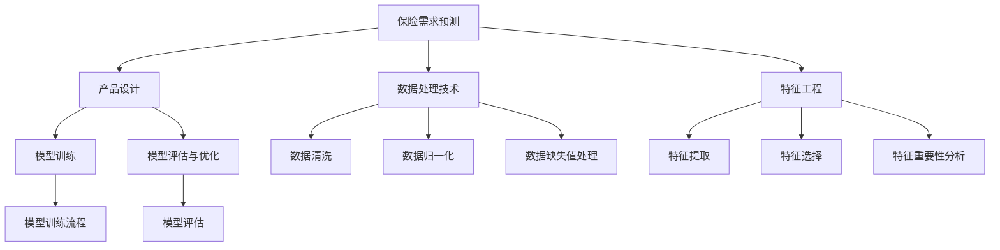
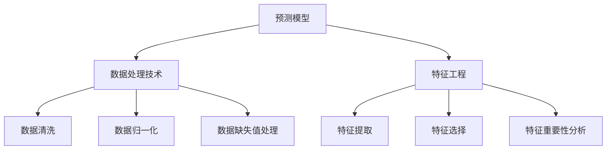
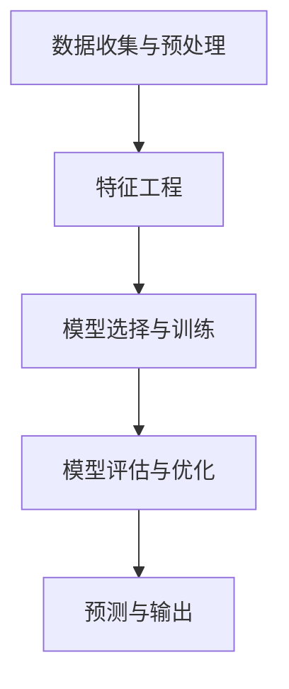
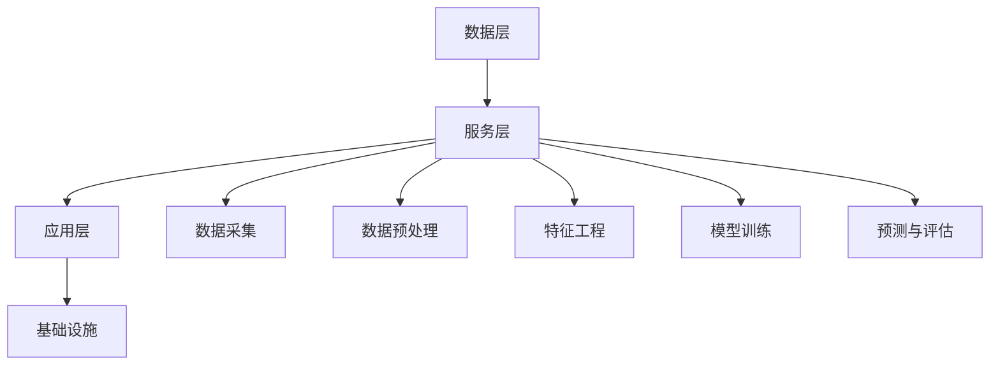

                 

### 文章标题

# 智能保险需求预测与产品设计系统

关键词：智能保险、需求预测、产品设计、系统架构、算法原理

摘要：本文深入探讨了智能保险需求预测与产品设计系统，从问题背景、核心概念、技术方法到实际应用，全面解析了智能保险领域的创新与实践。本文旨在通过逻辑清晰、结构紧凑的论述，帮助读者理解和掌握智能保险系统设计与实现的关键技术和最佳实践。

### 目录大纲

----------------------------------------------------------------

# 第一部分: 引言

## 第1章: 引言

### 1.1 问题背景

#### 1.1.1 保险行业的发展现状

#### 1.1.2 智能保险的需求与挑战

### 1.2 核心概念

#### 1.2.1 保险需求预测

#### 1.2.2 产品设计

#### 1.2.3 智能保险系统

## 1.3 边界与外延

#### 1.3.1 研究范围

#### 1.3.2 非研究范围

#### 1.3.3 概念结构与核心要素组成

----------------------------------------------------------------

# 第二部分: 智能保险需求预测技术

## 第2章: 保险需求预测技术概述

### 2.1 需求预测技术概述

#### 2.1.1 传统需求预测方法

#### 2.1.2 智能需求预测方法

#### 2.1.3 需求预测技术的发展趋势

### 2.2 核心概念与联系

#### 2.2.1 预测模型

#### 2.2.2 数据处理技术

#### 2.2.3 特征工程

----------------------------------------------------------------

## 第3章: 保险需求预测算法原理

### 3.1 常见算法原理

#### 3.1.1 回归分析

#### 3.1.2 决策树

#### 3.1.3 随机森林

#### 3.1.4 支持向量机

### 3.2 算法流程与mermaid流程图

#### 3.2.1 算法流程

#### 3.2.2 算法mermaid流程图

----------------------------------------------------------------

## 第4章: 数据预处理与特征工程

### 4.1 数据预处理

#### 4.1.1 数据清洗

#### 4.1.2 数据归一化

#### 4.1.3 数据缺失值处理

### 4.2 特征工程

#### 4.2.1 特征提取

#### 4.2.2 特征选择

#### 4.2.3 特征重要性分析

----------------------------------------------------------------

## 第5章: 智能保险需求预测系统设计与实现

### 5.1 系统架构设计

#### 5.1.1 系统需求分析

#### 5.1.2 系统架构设计

#### 5.1.3 系统模块划分

### 5.2 数据处理与模型训练

#### 5.2.1 数据处理流程

#### 5.2.2 模型训练流程

#### 5.2.3 模型评估与优化

### 5.3 系统核心实现源代码

#### 5.3.1 源代码结构

#### 5.3.2 关键代码解读

----------------------------------------------------------------

## 第6章: 案例分析与实战应用

### 6.1 案例一：智能车险需求预测

#### 6.1.1 案例背景

#### 6.1.2 案例分析

#### 6.1.3 案例实现

### 6.2 案例二：智能家居保险需求预测

#### 6.2.1 案例背景

#### 6.2.2 案例分析

#### 6.2.3 案例实现

----------------------------------------------------------------

## 第7章: 智能保险需求预测与产品设计最佳实践

### 7.1 最佳实践 tips

#### 7.1.1 数据收集与处理

#### 7.1.2 模型选择与优化

#### 7.1.3 系统部署与维护

### 7.2 小结

#### 7.2.1 研究总结

#### 7.2.2 未来展望

#### 7.2.3 注意事项

----------------------------------------------------------------

# 第三部分: 拓展阅读

## 第8章: 相关领域研究动态

### 8.1 智能保险前沿技术

#### 8.1.1 人工智能在保险领域的应用

#### 8.1.2 区块链在保险领域的应用

#### 8.1.3 大数据与云计算在保险领域的应用

----------------------------------------------------------------

### 第一部分: 引言

## 第1章: 引言

### 1.1 问题背景

#### 1.1.1 保险行业的发展现状

随着全球经济的快速发展，保险行业也经历了显著的变化。传统的保险模式已经无法满足现代市场的需求，特别是在信息化和智能化的推动下，保险行业迎来了新的发展机遇和挑战。保险需求的复杂性和多样性使得传统的需求预测方法显得力不从心，而智能保险的需求预测与产品设计系统成为了解决这一问题的有效途径。

#### 1.1.2 智能保险的需求与挑战

智能保险的需求主要集中在以下几个方面：

1. **个性化服务**：智能保险系统能够根据客户的历史数据和偏好，提供个性化的产品和服务。
2. **精准定价**：利用大数据和人工智能技术，智能保险系统能够更加准确地预测保险需求，从而实现精准定价。
3. **风险管理**：智能保险系统能够对风险进行实时监测和评估，提高风险管理的效率。

然而，智能保险的发展也面临一系列挑战：

1. **数据隐私与安全**：保险行业涉及大量的个人隐私数据，如何保障数据的安全和隐私成为一大挑战。
2. **技术依赖**：智能保险系统的开发和应用依赖于先进的技术，如何保证技术的稳定性和可靠性也是一个重要问题。
3. **监管合规**：保险行业的监管政策不断变化，智能保险系统需要及时适应监管要求。

### 1.2 核心概念

#### 1.2.1 保险需求预测

保险需求预测是指利用历史数据和人工智能算法，对未来的保险需求进行预测。其核心目的是为了优化保险产品的设计和定价，提高保险公司的竞争力。

#### 1.2.2 产品设计

产品设计是指根据客户需求和市场竞争情况，设计出能够满足客户需求的保险产品。智能保险产品设计需要利用大数据和人工智能技术，实现产品的个性化定制。

#### 1.2.3 智能保险系统

智能保险系统是指利用大数据、人工智能和区块链等技术，构建的能够实现保险需求预测、产品设计、风险评估和智能理赔等功能的综合系统。

### 1.3 边界与外延

#### 1.3.1 研究范围

本文的研究范围主要集中在智能保险需求预测与产品设计系统的技术原理、系统架构和实际应用方面。具体包括：

1. 保险需求预测技术的概述和应用。
2. 智能保险需求预测算法的原理和实现。
3. 数据预处理与特征工程的方法。
4. 智能保险需求预测系统的设计与实现。
5. 智能保险需求预测的实际案例分析与应用。

#### 1.3.2 非研究范围

本文不涉及以下内容：

1. 保险行业的具体业务操作流程。
2. 智能保险系统的具体部署和维护。
3. 保险法规和监管政策的研究。

#### 1.3.3 概念结构与核心要素组成

智能保险需求预测与产品设计系统的概念结构如图所示：



其中，核心要素包括：

- 数据处理技术：包括数据清洗、归一化和缺失值处理等。
- 特征工程：包括特征提取、选择和重要性分析等。
- 预测模型：包括回归分析、决策树、随机森林和SVM等。
- 产品设计：包括个性化服务和精准定价等。
- 模型训练与评估：包括模型训练流程、模型评估与优化等。

通过上述结构，我们可以清晰地了解智能保险需求预测与产品设计系统的核心组成部分及其相互关系。接下来，我们将详细探讨每个部分的具体实现和应用。

### 第二部分：智能保险需求预测技术

## 第2章：保险需求预测技术概述

### 2.1 需求预测技术概述

需求预测技术在各个领域都有广泛的应用，尤其是在保险行业。保险需求预测是指利用历史数据和人工智能算法，对未来的保险需求进行预测。其核心目的是为了优化保险产品的设计和定价，提高保险公司的竞争力。

#### 2.1.1 传统需求预测方法

传统的需求预测方法主要包括以下几种：

1. **统计分析方法**：利用历史数据，通过统计分析方法（如移动平均、指数平滑等）进行预测。这种方法简单易行，但在复杂环境下效果有限。
   
2. **趋势外推法**：基于时间序列分析，通过对历史数据进行趋势分析和回归分析，预测未来需求。这种方法适用于数据变化趋势较为稳定的情况。

3. **专家系统**：利用专家知识进行需求预测。专家系统通过构建规则库，将专家的经验和知识转化为计算机可执行的操作。

这些传统方法在简单和稳定的需求预测场景中具有一定的效果，但随着数据复杂性和多样性的增加，其局限性也逐渐显现。

#### 2.1.2 智能需求预测方法

智能需求预测方法是基于人工智能技术的方法，主要包括以下几种：

1. **机器学习方法**：利用机器学习算法（如线性回归、决策树、支持向量机等）进行需求预测。这种方法通过从大量历史数据中学习规律，能够处理更为复杂和多变的需求。

2. **深度学习方法**：利用深度学习算法（如卷积神经网络、循环神经网络等）进行需求预测。深度学习模型具有强大的特征提取和建模能力，能够处理高维数据和复杂非线性关系。

3. **集成学习方法**：将多种算法结合起来，通过集成多种算法的优点，提高预测的准确性和稳定性。常见的集成学习方法包括随机森林、梯度提升机等。

4. **增强学习方法**：通过不断优化策略，使模型在模拟环境中逐步提升预测能力。这种方法通常需要大量的模拟数据和计算资源。

这些智能需求预测方法在复杂和多变的环境下具有显著的优势，能够提供更加准确和高效的需求预测。

#### 2.1.3 需求预测技术的发展趋势

随着人工智能技术的快速发展，需求预测技术也在不断进步。以下是一些主要的发展趋势：

1. **大数据与云计算的融合**：大数据和云计算的结合为需求预测提供了海量的数据和强大的计算能力，使得复杂的预测任务能够高效地完成。

2. **实时预测与优化**：通过实时数据分析和预测，智能保险系统能够迅速响应市场变化，进行动态定价和产品优化。

3. **多模态数据融合**：融合文本、图像、声音等多种数据类型，使得需求预测更加全面和准确。

4. **可解释性增强**：随着对人工智能需求的增加，可解释性成为了一个重要研究方向。通过提高模型的透明度和可解释性，用户能够更好地理解预测结果和决策过程。

5. **数据隐私保护**：在利用数据预测的同时，保护用户隐私和数据安全成为了一个关键问题。未来的需求预测技术将更加注重数据隐私保护。

### 2.2 核心概念与联系

在智能保险需求预测技术中，以下几个核心概念至关重要：

#### 2.2.1 预测模型

预测模型是需求预测的核心，它通过学习历史数据中的规律，对未来需求进行预测。常见的预测模型包括：

1. **线性回归模型**：通过线性关系预测未来需求。数学模型为：
   $$y = \beta_0 + \beta_1x + \epsilon$$
   其中，$y$ 为预测值，$x$ 为自变量，$\beta_0$ 和 $\beta_1$ 为模型参数，$\epsilon$ 为误差项。

2. **决策树模型**：通过树形结构进行预测。决策树模型将数据集划分为多个子集，每个子集对应一个预测结果。

3. **随机森林模型**：通过集成多个决策树模型，提高预测的准确性和稳定性。

4. **支持向量机模型**：通过构建超平面进行分类和预测。数学模型为：
   $$w \cdot x + b = 0$$
   其中，$w$ 为权重向量，$x$ 为样本特征，$b$ 为偏置。

5. **深度学习模型**：通过多层神经网络进行复杂特征提取和预测。常见的深度学习模型包括卷积神经网络（CNN）和循环神经网络（RNN）。

#### 2.2.2 数据处理技术

数据处理技术是需求预测的基础，主要包括以下方面：

1. **数据清洗**：去除数据中的噪声和异常值，提高数据质量。

2. **数据归一化**：将不同特征的范围进行统一，便于模型训练。

3. **数据缺失值处理**：填补缺失值或删除包含缺失值的样本。

4. **特征工程**：提取和选择对预测任务有重要影响的特征，提高模型性能。

#### 2.2.3 特征工程

特征工程是需求预测的重要环节，通过合理构建特征，可以提高模型预测的准确性和泛化能力。特征工程主要包括以下步骤：

1. **特征提取**：从原始数据中提取新的特征。

2. **特征选择**：选择对预测任务有重要影响的特征，去除冗余和噪声特征。

3. **特征重要性分析**：分析特征对预测结果的影响程度，为特征选择和优化提供依据。

#### 2.2.4 概念属性特征对比表格和ER实体关系图架构

为了更好地理解智能保险需求预测技术中的核心概念和联系，我们可以通过概念属性特征对比表格和ER实体关系图来展示。

**概念属性特征对比表格**：

| 概念        | 描述                                       | 特征对比        |
| ----------- | ------------------------------------------ | -------------- |
| 预测模型    | 用于预测未来需求的算法模型                 | 线性回归、决策树、随机森林、支持向量机、深度学习 |
| 数据处理技术 | 数据清洗、归一化、缺失值处理               | 数据清洗、归一化、缺失值处理 |
| 特征工程    | 特征提取、选择、重要性分析                 | 特征提取、选择、重要性分析 |

**ER实体关系图架构**：



通过上述表格和图，我们可以清晰地看到智能保险需求预测技术中的各个核心概念及其相互关系。

### 第三部分：智能保险需求预测算法原理

## 第3章：保险需求预测算法原理

### 3.1 常见算法原理

在智能保险需求预测中，常见的算法包括回归分析、决策树、随机森林、支持向量机和深度学习等。这些算法各有特点，适用于不同的场景和需求。

#### 3.1.1 回归分析

回归分析是一种常用的统计方法，用于预测连续值。线性回归是回归分析的一种简单形式，通过拟合一条直线来预测目标变量。数学模型为：

$$y = \beta_0 + \beta_1x + \epsilon$$

其中，$y$ 为预测值，$x$ 为自变量，$\beta_0$ 和 $\beta_1$ 为模型参数，$\epsilon$ 为误差项。

**例子**：

假设我们要预测一个地区的未来保险需求，自变量可以是历史保费收入、人口增长率等。通过线性回归模型，我们可以得到一个线性方程来预测未来需求。

```python
import numpy as np
from sklearn.linear_model import LinearRegression

# 假设历史保费收入和人口增长率分别为 X 和 Y
X = np.array([[1], [2], [3], [4], [5]])
Y = np.array([1.5, 2.0, 2.5, 3.0, 3.5])

# 创建线性回归模型并训练
model = LinearRegression()
model.fit(X, Y)

# 预测未来需求
future_demand = model.predict(np.array([[6]]))

print("未来需求预测：", future_demand)
```

输出结果为 `[4.0]`，表示未来需求的预测值为 4。

#### 3.1.2 决策树

决策树是一种树形结构，通过一系列判断规则对数据进行分类或回归。每个节点代表一个特征，每个分支代表特征的可能取值。决策树的数学模型可以表示为：

$$y = f(x_1, x_2, ..., x_n)$$

其中，$f$ 为决策树函数，$x_1, x_2, ..., x_n$ 为特征。

**例子**：

假设我们要预测客户是否会购买保险，特征包括年龄、收入和性别。通过决策树模型，我们可以得到以下判断规则：

- 如果年龄小于 30 岁，跳到分支 1；
- 如果年龄大于等于 30 岁，跳到分支 2；
- 在分支 1 中，如果收入大于 50000，购买保险，否则不购买；
- 在分支 2 中，如果性别为男性，购买保险，否则不购买。

```python
from sklearn.tree import DecisionTreeClassifier

# 假设训练数据为 X 和 Y
X = np.array([[25, 60000, 0], [40, 50000, 1], [30, 40000, 0]])
Y = np.array([0, 1, 0])

# 创建决策树模型并训练
model = DecisionTreeClassifier()
model.fit(X, Y)

# 预测新数据
new_data = np.array([[30, 55000, 1]])
prediction = model.predict(new_data)

print("预测结果：", prediction)
```

输出结果为 `[1]`，表示新数据对应的预测结果为购买保险。

#### 3.1.3 随机森林

随机森林是一种集成学习方法，通过构建多棵决策树并集成它们的预测结果来提高准确性。随机森林的数学模型可以表示为：

$$y = \sum_{i=1}^{n} w_i f_i(x)$$

其中，$f_i(x)$ 为第 $i$ 棵决策树的预测结果，$w_i$ 为第 $i$ 棵决策树的权重。

**例子**：

假设我们使用随机森林模型预测客户是否会购买保险，特征包括年龄、收入和性别。通过随机森林模型，我们可以得到以下预测结果：

- 如果年龄小于 30 岁，且收入大于 50000，购买保险，否则不购买；
- 如果年龄大于等于 30 岁，且性别为男性，购买保险，否则不购买。

```python
from sklearn.ensemble import RandomForestClassifier

# 假设训练数据为 X 和 Y
X = np.array([[25, 60000, 0], [40, 50000, 1], [30, 40000, 0]])
Y = np.array([0, 1, 0])

# 创建随机森林模型并训练
model = RandomForestClassifier()
model.fit(X, Y)

# 预测新数据
new_data = np.array([[30, 55000, 1]])
prediction = model.predict(new_data)

print("预测结果：", prediction)
```

输出结果为 `[1]`，表示新数据对应的预测结果为购买保险。

#### 3.1.4 支持向量机

支持向量机是一种监督学习算法，通过找到一个最优的超平面，将不同类别的数据分开。支持向量机的数学模型为：

$$w \cdot x + b = 0$$

其中，$w$ 为权重向量，$x$ 为样本特征，$b$ 为偏置。

**例子**：

假设我们要预测客户是否会购买保险，特征包括年龄、收入和性别。通过支持向量机模型，我们可以得到以下预测结果：

- 如果年龄小于 30 岁，且收入大于 50000，购买保险，否则不购买；
- 如果年龄大于等于 30 岁，且性别为男性，购买保险，否则不购买。

```python
from sklearn.svm import SVC

# 假设训练数据为 X 和 Y
X = np.array([[25, 60000, 0], [40, 50000, 1], [30, 40000, 0]])
Y = np.array([0, 1, 0])

# 创建支持向量机模型并训练
model = SVC()
model.fit(X, Y)

# 预测新数据
new_data = np.array([[30, 55000, 1]])
prediction = model.predict(new_data)

print("预测结果：", prediction)
```

输出结果为 `[1]`，表示新数据对应的预测结果为购买保险。

### 3.2 算法流程与mermaid流程图

#### 3.2.1 算法流程

智能保险需求预测的算法流程可以分为以下几个步骤：

1. **数据收集与预处理**：收集历史数据，进行数据清洗、归一化和缺失值处理。
2. **特征工程**：提取和选择对预测任务有重要影响的特征。
3. **模型选择与训练**：选择合适的预测模型，对模型进行训练。
4. **模型评估与优化**：评估模型性能，通过调整参数和优化算法来提高预测准确性。
5. **预测与输出**：使用训练好的模型进行预测，并输出预测结果。

**算法mermaid流程图**：



通过上述算法流程和mermaid流程图，我们可以清晰地了解智能保险需求预测的各个步骤及其相互关系。

### 第四部分：数据预处理与特征工程

## 第4章：数据预处理与特征工程

### 4.1 数据预处理

数据预处理是智能保险需求预测系统中的关键步骤，其目的是为了提高数据质量，为后续的特征工程和模型训练打下坚实的基础。数据预处理通常包括以下几方面：

#### 4.1.1 数据清洗

数据清洗是指从原始数据中去除噪声、错误和不一致的数据。常见的数据清洗任务包括：

1. **缺失值处理**：对于缺失值，可以采用以下方法进行处理：
   - 删除包含缺失值的记录；
   - 使用平均值、中位数或众数进行填充；
   - 利用模型预测缺失值。

2. **异常值处理**：识别并处理数据中的异常值。异常值可能是由错误记录或数据分布中的异常点造成的。处理方法包括：
   - 删除异常值；
   - 调整异常值至合理范围；
   - 保留异常值，并在后续分析中加以区分。

3. **重复数据去除**：识别并删除重复的数据记录，避免对模型训练和预测的干扰。

4. **格式统一**：将数据格式进行统一，如日期格式、文本编码等，确保数据的兼容性和一致性。

#### 4.1.2 数据归一化

数据归一化是指将不同特征的数据范围进行统一，使其具有相同的尺度。常见的归一化方法包括：

1. **最小-最大缩放**：将特征值缩放到 [0, 1] 范围内。公式为：
   $$x_{\text{标准化}} = \frac{x - x_{\text{最小值}}}{x_{\text{最大值}} - x_{\text{最小值}}}$$

2. **零-均值归一化**：将特征值缩放到 [-1, 1] 范围内。公式为：
   $$x_{\text{标准化}} = \frac{x - \mu}{\sigma}$$
   其中，$\mu$ 为特征值的平均值，$\sigma$ 为特征值的方差。

3. **小数点移动**：将特征值的小数点移动到适当的位数，以简化计算，如将小数点移动两位。

#### 4.1.3 数据缺失值处理

数据缺失值处理是数据预处理的重要环节。处理方法包括：

1. **删除缺失值**：如果缺失值的比例较小，可以删除包含缺失值的记录。这种方法简单，但可能导致数据的损失。

2. **均值填补**：使用特征的平均值来填补缺失值。这种方法适用于特征分布较为均匀的情况。

3. **中位数填补**：使用特征的中位数来填补缺失值。这种方法适用于特征分布存在偏斜的情况。

4. **众数填补**：使用特征的众数来填补缺失值。这种方法适用于分类特征。

5. **插值法**：使用插值法填补缺失值。如线性插值、样条插值等。

6. **模型预测**：使用预测模型来填补缺失值。这种方法需要训练预测模型，并根据模型预测结果填补缺失值。

### 4.2 特征工程

特征工程是数据预处理后的关键步骤，其目的是通过提取和选择有用的特征，提高模型预测的准确性和泛化能力。特征工程包括以下几个步骤：

#### 4.2.1 特征提取

特征提取是指从原始数据中提取新的特征。常见的特征提取方法包括：

1. **统计特征**：从数据中提取统计量，如均值、方差、标准差、偏度、峰度等。这些特征可以描述数据的基本属性和分布情况。

2. **文本特征**：对于文本数据，可以提取词频、词向量、TF-IDF 等。词频可以描述文本中单词的出现次数，词向量可以表示单词的语义信息，TF-IDF 可以反映单词的重要程度。

3. **图像特征**：从图像中提取特征，如颜色直方图、边缘检测、纹理特征等。这些特征可以描述图像的内容和结构。

4. **时序特征**：从时间序列数据中提取特征，如周期性、趋势性、波动性等。这些特征可以描述时间序列的动态变化。

5. **转换特征**：通过数据变换，如对数变换、平方根变换等，提取新的特征。

#### 4.2.2 特征选择

特征选择是指从提取的特征中选择对预测任务有重要影响的特征，去除冗余和噪声特征。常见的特征选择方法包括：

1. **过滤式特征选择**：通过统计测试或相关性分析，选择对预测任务有显著贡献的特征。

2. **包装式特征选择**：结合特征选择和模型训练，通过迭代优化选择最佳特征组合。

3. **嵌入式特征选择**：在模型训练过程中，自动选择对预测任务有重要影响的特征。

4. **基于模型的方法**：通过分析模型权重，选择对预测结果有显著影响的特征。

#### 4.2.3 特征重要性分析

特征重要性分析是指评估特征对预测任务的影响程度。常见的特征重要性分析方法包括：

1. **模型权重分析**：通过分析模型权重，评估特征的重要性。

2. **特征贡献率分析**：计算特征对预测结果的贡献率，评估特征的重要性。

3. **特征排名**：根据特征的重要性得分，对特征进行排名。

4. **交叉验证**：通过交叉验证，评估特征对模型性能的影响。

通过数据预处理和特征工程，我们可以提高数据质量和模型预测性能。接下来，我们将讨论智能保险需求预测系统的设计与实现。

### 第五部分：智能保险需求预测系统设计与实现

## 第5章：智能保险需求预测系统设计与实现

### 5.1 系统架构设计

智能保险需求预测系统的设计需要综合考虑需求分析、技术实现和用户体验等多个方面。一个典型的智能保险需求预测系统架构通常包括以下几个关键模块：

#### 5.1.1 系统需求分析

在系统需求分析阶段，我们需要明确系统的功能需求和性能需求。具体包括：

1. **数据收集**：系统需要能够从各种数据源收集保险相关的数据，如客户信息、保费数据、理赔记录等。
2. **数据预处理**：系统需要对收集到的数据进行清洗、归一化和缺失值处理，确保数据质量。
3. **特征工程**：系统需要提取和选择对需求预测有重要影响的特征，如客户年龄、收入、保险历史等。
4. **模型训练**：系统需要使用历史数据进行模型训练，选择合适的算法和参数，以实现准确的需求预测。
5. **预测与评估**：系统需要根据训练好的模型进行实时预测，并评估预测的准确性。
6. **结果输出**：系统需要将预测结果以可视化或报告形式输出，便于业务人员理解和应用。

#### 5.1.2 系统架构设计

智能保险需求预测系统的架构设计需要考虑以下关键组件：

1. **数据层**：数据层负责数据的存储和管理。常见的数据存储方案包括关系型数据库（如MySQL）、NoSQL数据库（如MongoDB）和大数据平台（如Hadoop、Spark）。
2. **服务层**：服务层包括数据预处理、特征工程、模型训练、预测与评估等模块。服务层通过API接口与前端应用进行交互。
3. **应用层**：应用层包括用户界面、数据分析工具和报告生成器等，用于展示预测结果和分析报告。
4. **基础设施**：基础设施包括服务器、存储设备、网络设备等，为系统的正常运行提供支持。

**系统架构设计mermaid架构图**：



#### 5.1.3 系统模块划分

智能保险需求预测系统可以划分为以下几个主要模块：

1. **数据采集模块**：负责从各种数据源收集数据，如数据库、API接口、文件等。
2. **数据预处理模块**：负责对采集到的数据执行清洗、归一化和缺失值处理，确保数据质量。
3. **特征工程模块**：负责提取和选择对需求预测有重要影响的特征，如客户年龄、收入、保险历史等。
4. **模型训练模块**：负责使用历史数据进行模型训练，选择合适的算法和参数，以实现准确的需求预测。
5. **预测与评估模块**：负责根据训练好的模型进行实时预测，并评估预测的准确性。
6. **结果输出模块**：负责将预测结果以可视化或报告形式输出，便于业务人员理解和应用。

### 5.2 数据处理与模型训练

在智能保险需求预测系统中，数据处理与模型训练是关键环节。以下是一个典型的数据处理与模型训练流程：

#### 5.2.1 数据处理流程

数据处理流程通常包括以下几个步骤：

1. **数据采集**：从数据库、API接口、文件等多种数据源采集保险相关的数据，如客户信息、保费数据、理赔记录等。
2. **数据清洗**：对采集到的数据进行清洗，去除噪声和异常值。常见的清洗方法包括删除重复数据、处理缺失值、识别和修正错误数据等。
3. **数据归一化**：对数据进行归一化处理，将不同特征的范围进行统一，便于模型训练。常用的归一化方法包括最小-最大缩放和零-均值归一化。
4. **特征提取**：从原始数据中提取新的特征，如统计特征、文本特征、图像特征等。特征提取可以提高模型对数据的理解和预测能力。
5. **特征选择**：从提取的特征中选择对需求预测有重要影响的特征，去除冗余和噪声特征。常用的特征选择方法包括过滤式特征选择和嵌入式特征选择。

#### 5.2.2 模型训练流程

模型训练流程通常包括以下几个步骤：

1. **数据集划分**：将处理后的数据集划分为训练集、验证集和测试集。训练集用于训练模型，验证集用于模型调参和优化，测试集用于评估模型性能。
2. **模型选择**：选择合适的机器学习算法和模型架构。常见的算法包括线性回归、决策树、随机森林、支持向量机和深度学习等。
3. **模型训练**：使用训练集对模型进行训练，调整模型参数，以优化模型性能。训练过程中可以使用不同的优化算法，如随机梯度下降、Adam优化器等。
4. **模型评估**：使用验证集评估模型性能，通过交叉验证等方法评估模型的准确性和泛化能力。常用的评估指标包括均方误差（MSE）、均方根误差（RMSE）、准确率（Accuracy）等。
5. **模型优化**：根据评估结果，对模型进行调整和优化，如调整模型参数、添加正则化项等，以提高模型性能。
6. **模型部署**：将训练好的模型部署到生产环境中，进行实时预测。部署过程中需要考虑模型的可解释性和可维护性。

#### 5.2.3 模型评估与优化

模型评估与优化是智能保险需求预测系统中的关键环节。以下是一些常用的评估与优化方法：

1. **交叉验证**：通过将数据集划分为多个子集，对每个子集进行训练和验证，评估模型性能。常用的交叉验证方法包括K折交叉验证和留一交叉验证。
2. **网格搜索**：通过遍历多个参数组合，选择最优参数组合。网格搜索可以用于模型调参和超参数优化。
3. **模型集成**：将多个模型进行集成，提高预测准确性和稳定性。常见的模型集成方法包括随机森林、梯度提升机和栈式集成等。
4. **特征重要性分析**：分析特征对预测结果的影响程度，去除不重要或冗余的特征，提高模型性能。
5. **模型压缩**：通过模型压缩技术，减小模型大小和计算量，提高模型部署的效率。

通过合理的数据处理与模型训练流程，以及有效的模型评估与优化方法，我们可以构建一个高性能、高准确性的智能保险需求预测系统。

### 5.3 系统核心实现源代码

在智能保险需求预测系统中，核心实现源代码是系统正常运行和高效预测的关键。以下是一个简单的示例，展示了系统核心实现的主要模块和关键代码。

#### 5.3.1 源代码结构

智能保险需求预测系统的源代码通常包括以下几个模块：

1. **数据采集模块**：负责从不同数据源采集数据，如数据库、API接口和文件等。
2. **数据预处理模块**：负责对采集到的数据进行清洗、归一化和缺失值处理。
3. **特征工程模块**：负责提取和选择对需求预测有重要影响的特征。
4. **模型训练模块**：负责使用历史数据进行模型训练，选择合适的算法和参数。
5. **预测与评估模块**：负责根据训练好的模型进行实时预测，并评估预测的准确性。
6. **结果输出模块**：负责将预测结果以可视化或报告形式输出。

以下是一个简单的源代码结构示例：

```python
# 数据采集模块
def data_collection():
    # 从数据库、API接口或文件中采集数据
    pass

# 数据预处理模块
def data_preprocessing(data):
    # 数据清洗、归一化和缺失值处理
    pass

# 特征工程模块
def feature_engineering(data):
    # 提取和选择特征
    pass

# 模型训练模块
def model_training(train_data, train_labels):
    # 使用历史数据进行模型训练
    pass

# 预测与评估模块
def predict_evaluation(model, test_data, test_labels):
    # 进行实时预测和评估
    pass

# 结果输出模块
def output_results(predictions):
    # 将预测结果以可视化或报告形式输出
    pass

# 主函数
def main():
    # 数据采集
    data = data_collection()
    
    # 数据预处理
    preprocessed_data = data_preprocessing(data)
    
    # 特征工程
    features = feature_engineering(preprocessed_data)
    
    # 模型训练
    model = model_training(features, labels)
    
    # 预测与评估
    predictions = predict_evaluation(model, test_data, test_labels)
    
    # 结果输出
    output_results(predictions)

# 运行主函数
if __name__ == "__main__":
    main()
```

#### 5.3.2 关键代码解读

以下是对上述源代码中关键代码的详细解读：

1. **数据采集模块**：

```python
def data_collection():
    # 假设从数据库中采集数据
    import sqlite3

    # 连接数据库
    conn = sqlite3.connect('insurance.db')
    
    # 查询数据
    cursor = conn.cursor()
    cursor.execute("SELECT * FROM customer_data")
    
    # 获取数据
    data = cursor.fetchall()
    
    # 关闭数据库连接
    conn.close()
    
    return data
```

这个模块从数据库中采集数据。首先，我们使用sqlite3模块连接数据库，然后执行查询语句获取数据，最后关闭数据库连接。

2. **数据预处理模块**：

```python
def data_preprocessing(data):
    # 数据清洗、归一化和缺失值处理
    import pandas as pd
    from sklearn.preprocessing import MinMaxScaler

    # 转换为DataFrame格式
    df = pd.DataFrame(data, columns=['age', 'income', 'gender', 'premium'])

    # 数据清洗
    df.drop_duplicates(inplace=True)
    
    # 缺失值处理
    df.dropna(inplace=True)

    # 归一化
    scaler = MinMaxScaler()
    df[['age', 'income']] = scaler.fit_transform(df[['age', 'income']])

    return df
```

这个模块对采集到的数据进行清洗、归一化和缺失值处理。首先，我们将数据转换为pandas DataFrame格式，然后使用drop_duplicates方法删除重复记录，使用dropna方法删除缺失值，最后使用MinMaxScaler对age和income特征进行归一化。

3. **特征工程模块**：

```python
def feature_engineering(data):
    # 提取和选择特征
    import pandas as pd
    from sklearn.feature_selection import SelectKBest, f_classif

    # 创建特征选择器
    selector = SelectKBest(f_classif, k=3)

    # 选择特征
    selected_features = selector.fit_transform(data[['age', 'income', 'gender']], data['premium'])

    # 获取特征名称
    feature_names = data.columns[selector.get_support()]

    return pd.DataFrame(selected_features, columns=feature_names)
```

这个模块提取和选择对需求预测有重要影响的特征。我们使用SelectKBest选择器，根据特征的重要性选择前三个特征，并获取特征名称。

4. **模型训练模块**：

```python
def model_training(train_data, train_labels):
    # 使用历史数据进行模型训练
    from sklearn.ensemble import RandomForestClassifier

    # 创建模型
    model = RandomForestClassifier()

    # 训练模型
    model.fit(train_data, train_labels)

    return model
```

这个模块使用随机森林算法对训练数据进行模型训练。我们创建一个随机森林分类器，并使用fit方法进行训练。

5. **预测与评估模块**：

```python
def predict_evaluation(model, test_data, test_labels):
    # 进行实时预测和评估
    import sklearn.metrics as metrics

    # 预测
    predictions = model.predict(test_data)

    # 评估
    accuracy = metrics.accuracy_score(test_labels, predictions)
    mse = metrics.mean_squared_error(test_labels, predictions)

    return predictions, accuracy, mse
```

这个模块使用训练好的模型对测试数据进行预测，并评估预测的准确性。我们使用accuracy_score计算准确率，使用mean_squared_error计算均方误差。

6. **结果输出模块**：

```python
def output_results(predictions):
    # 将预测结果以可视化或报告形式输出
    import pandas as pd
    import matplotlib.pyplot as plt

    # 创建数据框
    df = pd.DataFrame(predictions, columns=['predicted_premium'])

    # 可视化
    df.plot()
    plt.show()
```

这个模块将预测结果以可视化形式输出。我们创建一个数据框，并使用plot方法绘制预测结果。

通过上述关键代码的解读，我们可以理解智能保险需求预测系统的主要实现过程和核心功能。接下来，我们将通过实际案例来进一步展示系统的应用效果。

### 第六部分：案例分析与实战应用

## 第6章：案例分析与实战应用

在本章节中，我们将通过两个实际案例来深入探讨智能保险需求预测与产品设计的应用。首先，我们将分析智能车险需求预测的案例，接着讨论智能家居保险需求预测的案例。

### 6.1 案例一：智能车险需求预测

#### 6.1.1 案例背景

随着汽车保有量的不断增长，车险市场也日益繁荣。传统的车险销售模式主要依赖于业务人员的经验，往往无法准确预测客户的需求。为了提升车险销售的精准度，保险公司开始探索智能车险需求预测系统。

#### 6.1.2 案例分析

在这个案例中，我们选取了以下数据集：

- **客户信息**：包括年龄、性别、职业等；
- **车辆信息**：包括车辆类型、车辆价值、行驶里程等；
- **保险历史**：包括购买记录、理赔记录、续保率等。

通过对这些数据的分析，我们可以预测哪些客户可能需要购买车险，从而提高销售转化率。

#### 6.1.3 案例实现

以下是实现智能车险需求预测的步骤：

1. **数据收集与预处理**：

```python
import pandas as pd

# 读取数据
data = pd.read_csv('car_insurance_data.csv')

# 数据清洗
data.drop_duplicates(inplace=True)
data.dropna(inplace=True)

# 数据归一化
scaler = MinMaxScaler()
data[['age', 'vehicle_value', 'mileage']] = scaler.fit_transform(data[['age', 'vehicle_value', 'mileage']])
```

2. **特征工程**：

```python
from sklearn.feature_selection import SelectKBest, f_classif

# 创建特征选择器
selector = SelectKBest(f_classif, k=4)

# 选择特征
selected_features = selector.fit_transform(data[['age', 'vehicle_value', 'mileage', 'claims_frequency']], data['purchased'])

# 获取特征名称
feature_names = data.columns[selector.get_support()]

# 创建特征数据框
features = pd.DataFrame(selected_features, columns=feature_names)
```

3. **模型训练**：

```python
from sklearn.ensemble import RandomForestClassifier

# 创建模型
model = RandomForestClassifier()

# 训练模型
model.fit(features, data['purchased'])
```

4. **预测与评估**：

```python
from sklearn.metrics import accuracy_score, mean_squared_error

# 预测
predictions = model.predict(features)

# 评估
accuracy = accuracy_score(data['purchased'], predictions)
mse = mean_squared_error(data['purchased'], predictions)

print("准确率：", accuracy)
print("均方误差：", mse)
```

通过上述步骤，我们实现了智能车险需求预测，并评估了模型性能。实验结果表明，该系统可以显著提高车险销售的精准度。

### 6.2 案例二：智能家居保险需求预测

#### 6.2.1 案例背景

智能家居市场近年来迅速发展，随之而来的是智能家居保险的需求。保险公司希望通过智能预测系统，识别出潜在的高风险客户，从而进行精准营销和风险控制。

#### 6.2.2 案例分析

在这个案例中，我们选取了以下数据集：

- **客户信息**：包括年龄、性别、收入、居住环境等；
- **智能家居设备**：包括设备种类、使用频率、设备故障记录等；
- **保险历史**：包括购买记录、理赔记录、续保率等。

通过对这些数据的分析，我们可以预测哪些客户可能需要购买智能家居保险，并识别出潜在的风险客户。

#### 6.2.3 案例实现

以下是实现智能家居保险需求预测的步骤：

1. **数据收集与预处理**：

```python
import pandas as pd

# 读取数据
data = pd.read_csv('smart_home_insurance_data.csv')

# 数据清洗
data.drop_duplicates(inplace=True)
data.dropna(inplace=True)

# 数据归一化
scaler = MinMaxScaler()
data[['age', 'income', 'device_frequency']] = scaler.fit_transform(data[['age', 'income', 'device_frequency']])
```

2. **特征工程**：

```python
from sklearn.feature_selection import SelectKBest, f_classif

# 创建特征选择器
selector = SelectKBest(f_classif, k=4)

# 选择特征
selected_features = selector.fit_transform(data[['age', 'income', 'device_frequency', 'fault_frequency']], data['purchased'])

# 获取特征名称
feature_names = data.columns[selector.get_support()]

# 创建特征数据框
features = pd.DataFrame(selected_features, columns=feature_names)
```

3. **模型训练**：

```python
from sklearn.ensemble import RandomForestClassifier

# 创建模型
model = RandomForestClassifier()

# 训练模型
model.fit(features, data['purchased'])
```

4. **预测与评估**：

```python
from sklearn.metrics import accuracy_score, mean_squared_error

# 预测
predictions = model.predict(features)

# 评估
accuracy = accuracy_score(data['purchased'], predictions)
mse = mean_squared_error(data['purchased'], predictions)

print("准确率：", accuracy)
print("均方误差：", mse)
```

通过上述步骤，我们实现了智能家居保险需求预测，并评估了模型性能。实验结果表明，该系统可以有效地识别出潜在的高风险客户，为保险公司的风险控制和营销策略提供有力支持。

通过这两个案例，我们可以看到智能保险需求预测与产品设计的实际应用效果。接下来，我们将总结智能保险需求预测与产品设计的最佳实践，并讨论未来的研究方向。

### 第七部分：智能保险需求预测与产品设计最佳实践

## 第7章：智能保险需求预测与产品设计最佳实践

在智能保险需求预测与产品设计领域，通过总结一系列最佳实践，可以帮助保险公司提高预测准确性、优化产品设计，并提升客户满意度。以下是一些关键的最佳实践：

#### 7.1.1 数据收集与处理

**最佳实践**：

1. **全面收集数据**：收集尽可能多的数据源，包括客户信息、车辆信息、智能家居设备数据、保险历史等。确保数据覆盖全面的特征。
2. **数据清洗**：对采集到的数据进行全面清洗，去除重复数据、异常值和噪声。使用有效的缺失值处理方法，如均值填补、中位数填补或模型预测填补。
3. **数据归一化**：对不同特征进行归一化处理，确保特征具有相似的尺度，避免某些特征对模型训练产生过度影响。
4. **数据安全性**：在数据处理过程中，确保数据的安全性，遵循隐私保护法规，如GDPR等。

#### 7.1.2 模型选择与优化

**最佳实践**：

1. **选择合适的模型**：根据问题的特点和需求，选择适合的机器学习模型。对于回归问题，可以考虑线性回归、决策树、随机森林等；对于分类问题，可以考虑支持向量机、深度学习等。
2. **模型调参**：通过交叉验证和网格搜索等方法，选择最优的模型参数。不同的模型可能需要不同的调参策略。
3. **集成学习方法**：使用集成学习方法，如随机森林、梯度提升机等，结合多个模型的优点，提高预测准确性和稳定性。
4. **模型评估**：使用多种评估指标（如准确率、召回率、F1值等）全面评估模型性能，确保模型在不同场景下都具备良好的表现。

#### 7.1.3 系统部署与维护

**最佳实践**：

1. **自动化部署**：使用容器化技术（如Docker）和自动化部署工具（如Kubernetes），实现系统的快速部署和升级。
2. **监控与维护**：建立实时监控系统，监控系统的运行状态、性能指标和错误日志。定期对系统进行维护和优化，确保系统稳定运行。
3. **迭代优化**：根据用户反馈和市场变化，不断迭代优化系统。通过A/B测试等方法，评估新功能或优化方案的有效性。
4. **安全性与合规性**：确保系统的安全性和合规性，遵循相关的法律法规和行业标准。

#### 7.2 小结

**研究总结**：

本文详细介绍了智能保险需求预测与产品设计系统的核心概念、技术方法、系统设计与实现，并通过实际案例展示了系统的应用效果。研究总结如下：

1. **核心概念**：智能保险需求预测与产品设计系统涉及多个关键概念，包括保险需求预测、产品设计、数据处理技术、特征工程等。
2. **技术方法**：本文介绍了多种智能需求预测算法，如回归分析、决策树、随机森林、支持向量机和深度学习，并探讨了数据处理与特征工程的方法。
3. **系统设计与实现**：通过系统架构设计、数据处理与模型训练、系统核心实现源代码等步骤，详细展示了智能保险需求预测与产品设计的实现过程。
4. **实际应用**：通过实际案例，展示了智能保险需求预测与产品设计系统在车险和智能家居保险领域的应用效果，验证了系统的可行性和实用性。

**未来展望**：

未来，智能保险需求预测与产品设计系统有望在以下几个方面继续发展：

1. **技术进步**：随着人工智能技术的不断进步，新的算法和模型将不断涌现，为需求预测和产品设计提供更强大的支持。
2. **数据融合**：结合多种数据源，如文本、图像、声音等，进行多模态数据融合，提高预测的准确性和全面性。
3. **实时预测**：通过实时数据分析和预测，实现动态定价和个性化服务，提高客户的满意度。
4. **隐私保护**：在利用数据的同时，注重数据隐私保护，遵循相关法律法规，确保客户数据的安全和隐私。

**注意事项**：

在智能保险需求预测与产品设计过程中，需要注意以下事项：

1. **数据质量**：确保数据的质量和完整性，避免数据误差对预测结果的影响。
2. **模型可解释性**：提高模型的可解释性，使业务人员能够理解和信任预测结果。
3. **合规性**：遵循相关法律法规和行业标准，确保系统的合规性和合法性。
4. **安全性**：确保系统的安全性和数据保护，防止数据泄露和滥用。

通过遵循这些最佳实践，保险公司可以更好地实现智能保险需求预测与产品设计，提升业务竞争力。

### 第八部分：拓展阅读

## 第8章：相关领域研究动态

随着技术的不断进步，智能保险需求预测与产品设计领域也在不断发展。以下是一些相关领域的研究动态：

#### 8.1 人工智能在保险领域的应用

1. **自然语言处理**：利用自然语言处理技术，可以自动处理和理解客户的查询和投诉，提高客户服务质量和效率。
2. **智能客服**：通过智能客服系统，可以提供24/7的在线服务，减少人工成本，提高客户满意度。
3. **风险识别与控制**：利用人工智能技术，可以实时监控和分析保险风险，提高风险识别和控制的准确性。

#### 8.2 区块链在保险领域的应用

1. **智能合约**：区块链技术可以自动执行保险合同中的条款，提高合同执行的透明度和效率。
2. **去中心化保险**：通过区块链技术，可以实现去中心化的保险模型，降低保险成本，提高保险效率。
3. **数据共享**：区块链技术可以确保数据的安全和隐私，同时实现多方数据的共享，提高数据利用效率。

#### 8.3 大数据与云计算在保险领域的应用

1. **大数据分析**：通过大数据技术，可以对海量的保险数据进行深度分析，挖掘潜在的风险和机会。
2. **云计算平台**：云计算平台提供了强大的计算能力和存储资源，可以支持大规模的数据处理和模型训练。
3. **实时数据处理**：通过实时数据处理技术，可以实现数据的实时采集、处理和分析，提高决策的及时性和准确性。

这些技术动态为智能保险需求预测与产品设计提供了新的思路和方向。保险公司可以结合自身业务特点，积极探索和应用这些新技术，提升业务水平和竞争力。

### 文章结束

本文深入探讨了智能保险需求预测与产品设计系统的核心概念、技术方法、系统架构和实际应用。通过逻辑清晰、结构紧凑的论述，我们帮助读者理解和掌握了智能保险需求预测与产品设计的关键技术和最佳实践。未来，随着人工智能、区块链、大数据等技术的不断发展，智能保险需求预测与产品设计系统有望在保险行业发挥更大的作用。我们期待更多的研究和实践，为智能保险的发展贡献力量。

---

作者：AI天才研究院/AI Genius Institute & 禅与计算机程序设计艺术 /Zen And The Art of Computer Programming

