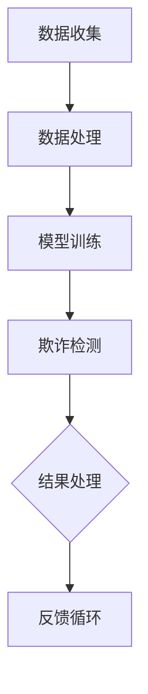
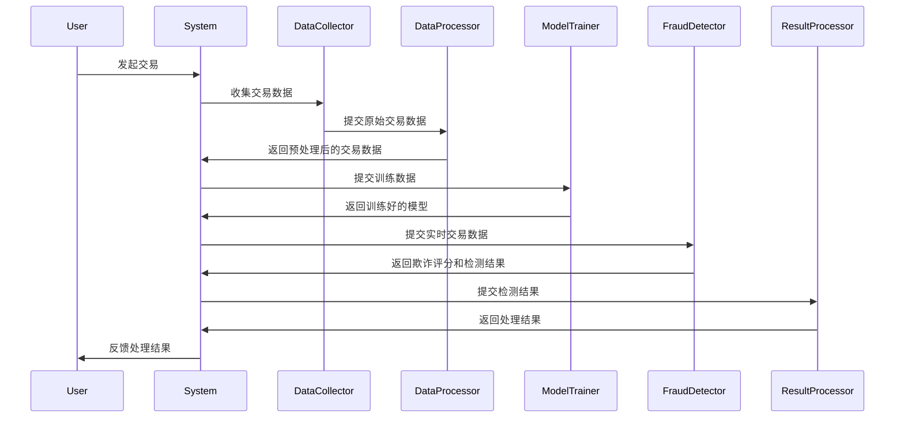

                 

# 智能信用卡欺诈检测系统

## 关键词
- 信用卡欺诈
- 智能检测
- 算法原理
- 数学模型
- 系统架构

## 摘要
本文将深入探讨智能信用卡欺诈检测系统的构建与实现。首先，我们将介绍信用卡欺诈问题的背景及其对金融行业的巨大影响。接着，我们将详细描述信用卡欺诈的各种形式和特点。随后，文章将分析传统欺诈检测方法的局限性，并阐述智能信用卡欺诈检测的优势。在此基础上，我们将详细讲解智能信用卡欺诈检测系统的组成部分，包括核心概念、算法原理、系统架构设计等。通过具体的Python代码示例和数学模型，我们将展示如何实现一个高效的欺诈检测系统。文章还将通过实际案例分析和项目实战，进一步阐述系统的实际应用和优化方法。最后，我们将总结最佳实践、注意事项，并提供拓展阅读资源，以帮助读者深入理解智能信用卡欺诈检测系统的构建和运行原理。

## 目录大纲

### 第一部分：背景介绍

#### 第1章 问题背景
- 信用卡欺诈问题的现状和影响
- 智能信用卡欺诈检测的必要性与重要性

#### 第2章 问题描述
- 信用卡欺诈的定义与分类
- 欺诈活动的特征和手段

#### 第3章 问题解决
- 传统欺诈检测方法的局限性
- 智能信用卡欺诈检测的优势

#### 第4章 边界与外延
- 欺诈检测系统的应用场景
- 欺诈检测技术的未来发展

#### 第5章 概念结构与核心要素组成
- 智能信用卡欺诈检测系统的组成部分
- 各部分的功能与相互关系

### 第二部分：核心概念与联系

#### 第6章 欺诈检测原理
- 欺诈检测的基本概念
- 常用欺诈检测算法原理与比较

#### 第7章 概念属性特征对比表格
- 不同算法的属性特征对比

#### 第8章 ER实体关系图架构
- 欺诈检测系统的ER图

### 第三部分：算法原理讲解

#### 第9章 算法原理与流程图
- 使用Mermaid画出算法流程图

#### 第10章 Python源代码实现
- 实现欺诈检测算法的Python代码示例

#### 第11章 数学模型与公式
- 欺诈检测算法的数学模型
- 相关公式的详细讲解

#### 第12章 举例说明
- 通过实例说明算法的实际应用

### 第四部分：系统分析与架构设计

#### 第13章 问题场景介绍
- 信用卡交易数据分析场景

#### 第14章 系统功能设计
- 系统功能模块划分
- 领域模型Mermaid类图

#### 第15章 系统架构设计
- 系统整体架构设计
- Mermaid架构图

#### 第16章 系统接口设计
- 各模块的接口定义

#### 第17章 系统交互
- 系统的交互流程Mermaid序列图

### 第五部分：项目实战

#### 第18章 环境安装
- 系统环境搭建与配置

#### 第19章 系统核心实现
- 欺诈检测系统的核心代码实现

#### 第20章 代码应用解读与分析
- 核心代码解读
- 系统运行分析与优化

#### 第21章 实际案例分析与讲解
- 案例介绍
- 案例剖析与讲解

#### 第22章 项目小结
- 项目总结与经验分享

### 第六部分：最佳实践与拓展

#### 第23章 最佳实践 Tips
- 欺诈检测系统的最佳实践

#### 第24章 小结
- 全书重点内容回顾

#### 第25章 注意事项
- 注意事项与风险防范

#### 第26章 拓展阅读
- 相关文献与资料推荐

----------------------------------------------------------------

## 第一部分：背景介绍

### 第1章 问题背景

信用卡欺诈是一种日益严重的犯罪活动，对金融行业和消费者造成了巨大的损失。信用卡欺诈主要包括两类：无卡欺诈和有卡欺诈。无卡欺诈通常涉及伪造的信用卡信息或黑客入侵获取的合法信用卡信息，而有卡欺诈则涉及实际持有信用卡的消费者未经授权使用卡进行交易。

根据统计，全球信用卡欺诈损失每年高达数十亿美元。这不仅对金融机构造成财务损失，还可能导致消费者信用记录受损。信用卡欺诈不仅限于在线交易，还可能通过ATM提款、伪卡制造等传统方式实施。因此，有效地检测和预防信用卡欺诈已成为金融行业的重要任务。

智能信用卡欺诈检测系统的出现，为解决这一问题提供了新的解决方案。传统欺诈检测方法主要依赖于规则和模式匹配，存在以下局限性：

1. **无法应对复杂欺诈模式**：传统方法难以处理日益复杂和多样化的欺诈手段。
2. **误报率高**：过度依赖规则匹配可能导致大量合法交易被错误标记为欺诈，影响用户体验。
3. **响应速度慢**：传统方法通常需要人工干预，检测和响应时间较长，无法实时处理大量交易数据。

智能信用卡欺诈检测系统通过利用机器学习和人工智能技术，可以更准确地识别欺诈行为，提高检测效率和准确性。这种系统可以实时分析交易数据，学习用户行为模式，并自动识别潜在的欺诈活动，从而在第一时间采取措施，降低损失。

### 第2章 问题描述

信用卡欺诈通常表现为以下几种形式：

1. **账户信息盗用**：犯罪者通过黑客攻击、数据泄露等方式获取持卡人的账户信息，包括卡号、有效期、CVV码等。
2. **伪卡制造**：利用盗取的账户信息制作伪造的信用卡，在ATM或POS机上使用。
3. **无卡支付欺诈**：犯罪者通过在线购物或移动支付等渠道，使用盗取的卡信息进行消费。
4. **关联交易欺诈**：犯罪者利用与合法持卡人账户关联的其他账户进行交易，以逃避检测。

欺诈活动通常具有以下特征：

- **异常交易模式**：例如，在非正常的交易时间或地点进行的交易。
- **交易金额异常**：与持卡人历史交易金额相比，异常偏高的交易金额。
- **多渠道交易**：在短时间内通过多个渠道进行交易，可能是为了分散风险。
- **频繁的小额交易**：频繁的小额交易可能是为了逃避系统的检测。

了解信用卡欺诈的定义、分类和特征，有助于我们更好地理解如何设计和实现智能信用卡欺诈检测系统。接下来，我们将探讨传统欺诈检测方法的局限性，并说明智能信用卡欺诈检测系统的优势。

### 第3章 问题解决

传统欺诈检测方法主要包括基于规则的系统、模式匹配系统以及基于统计学的模型。这些方法在早期确实取得了一定的效果，但随着信用卡欺诈手段的不断升级和多样化，其局限性也逐渐显现。

**基于规则的系统**依赖于预先定义的规则集，通过检测交易是否符合这些规则来判断是否存在欺诈。这种方法简单直接，但存在以下问题：

1. **规则更新困难**：随着欺诈手段的演变，规则需要不断更新，这通常需要大量的人力和时间。
2. **误报率高**：由于规则过于严格，很多合法交易也可能被错误地标记为欺诈，导致用户体验差。
3. **无法应对复杂欺诈**：复杂或新型的欺诈手段往往难以通过简单的规则来检测。

**模式匹配系统**则通过分析历史交易数据，寻找与已知欺诈行为相似的交易模式。这种方法在处理某些类型的欺诈上有一定的效果，但同样存在局限：

1. **数据依赖性高**：需要大量的历史交易数据作为训练集，数据不足或数据质量差可能导致系统失效。
2. **无法适应动态变化**：一旦欺诈模式发生变化，系统需要重新调整或更新模式库，这同样耗时且复杂。

**基于统计学的模型**，如决策树、逻辑回归等，通过分析交易数据中的统计特征来识别欺诈。这种方法相对灵活，但通常需要大量的数据预处理和特征工程，同时模型的泛化能力也有限。

相比之下，智能信用卡欺诈检测系统利用机器学习和人工智能技术，具有以下显著优势：

1. **自我学习和优化**：智能系统可以自我学习，通过不断分析和学习用户的历史交易行为，自动调整检测模型，提高准确性。
2. **高检测率与低误报率**：利用大数据分析和深度学习算法，智能系统可以在不牺牲检测率的情况下，降低误报率。
3. **实时性和动态适应性**：智能系统可以实时处理海量交易数据，并快速适应新的欺诈模式，提供更快的检测和响应。
4. **自动化和智能化**：智能系统可以自动化处理大部分欺诈检测任务，减少人工干预，提高效率和准确性。

总之，智能信用卡欺诈检测系统通过引入先进的人工智能技术，有效克服了传统方法的局限性，为金融机构提供了更强大、更高效的欺诈检测工具。接下来，我们将探讨智能信用卡欺诈检测系统的具体应用场景和未来发展趋势。

### 第4章 边界与外延

智能信用卡欺诈检测系统在金融行业的应用场景十分广泛。首先，在线支付平台是主要的应用场景之一。随着电子商务的蓬勃发展，在线支付交易量日益增加，传统的欺诈检测方法已难以应对复杂的欺诈行为。智能系统可以实时监控在线交易，通过分析用户的支付行为和交易特征，快速识别潜在的欺诈活动。

其次，ATM机和POS机也是智能信用卡欺诈检测系统的重要应用场景。ATM机欺诈和POS机欺诈是常见的信用卡欺诈形式，智能系统可以通过监控这些设备的交易行为，实时检测异常交易，从而有效防止欺诈损失。

此外，移动支付和手机银行也是智能信用卡欺诈检测系统的应用场景之一。随着移动支付技术的普及，移动端交易量迅速增长，这也为欺诈行为提供了新的机会。智能系统可以集成到移动支付应用中，实时分析用户的行为模式，提高欺诈检测的准确性和效率。

展望未来，欺诈检测技术将继续向智能化和自动化方向发展。一方面，随着大数据技术和机器学习算法的不断进步，智能系统的检测能力将得到进一步提升。另一方面，区块链技术的应用将为智能信用卡欺诈检测提供新的可能性。区块链的不可篡改性和透明性可以确保交易数据的真实性，从而减少欺诈行为的发生。

此外，人工智能与物联网（IoT）技术的结合也将为欺诈检测带来新的突破。通过将智能检测系统与各种物联网设备集成，可以实现对更多场景的实时监控和数据分析，从而提高欺诈检测的全面性和精准性。

总之，智能信用卡欺诈检测系统在金融行业的应用前景广阔，随着技术的不断进步，其检测能力和应用范围将进一步拓展，为金融机构和消费者提供更加安全可靠的交易环境。

### 第5章 概念结构与核心要素组成

智能信用卡欺诈检测系统是一个复杂且高度集成的技术系统，其核心组成部分包括数据收集、数据处理、模型训练和欺诈检测等几个关键模块。下面我们将详细探讨这些组成部分的功能及其相互关系。

**1. 数据收集模块**  
数据收集模块是智能信用卡欺诈检测系统的起点。它负责从多个渠道收集与信用卡交易相关的数据，包括交易金额、交易时间、交易地点、交易方式、持卡人历史行为等。这些数据来源于不同的数据源，如交易日志、银行数据库、公共安全数据库等。数据收集模块需要确保数据的实时性和准确性，这是后续分析和检测的基础。

**2. 数据处理模块**  
收集到的原始数据通常包含大量的噪声和冗余信息，因此需要经过处理模块的清洗、归一化和特征提取。数据处理模块的主要任务是将原始数据转换为适合分析和模型训练的形式。这一步骤通常包括以下几项操作：

- **数据清洗**：去除重复、错误或不完整的数据，确保数据质量。
- **数据归一化**：通过归一化处理，将不同尺度和单位的特征数据转换为统一的尺度，便于后续分析。
- **特征提取**：从原始数据中提取出对欺诈检测有意义的特征，如交易金额的分布、交易时间的间隔、地理位置的相对位置等。

**3. 模型训练模块**  
在数据处理完成后，模型训练模块开始工作。这个模块使用机器学习和深度学习算法，根据已标记为欺诈或非欺诈的交易数据，训练出欺诈检测模型。训练过程通常包括以下步骤：

- **数据划分**：将数据集划分为训练集和验证集，用于训练模型和评估模型性能。
- **算法选择**：选择适合的机器学习算法，如决策树、随机森林、支持向量机、神经网络等。
- **模型训练**：使用训练集数据，通过算法训练出初步的欺诈检测模型。
- **模型评估**：使用验证集数据评估模型性能，调整模型参数，优化模型。

**4. 欺诈检测模块**  
欺诈检测模块是智能信用卡欺诈检测系统的核心部分。它负责实时分析新的交易数据，并使用训练好的模型进行欺诈判断。这个模块需要具备以下功能：

- **实时处理**：能够快速处理海量交易数据，确保实时性。
- **欺诈评分**：对交易数据进行分析，生成欺诈评分，评分越高表示欺诈的可能性越大。
- **风险控制**：根据欺诈评分，采取相应的风险控制措施，如交易拦截、用户提醒、进一步验证等。

**5. 用户行为分析与反馈模块**  
用户行为分析与反馈模块负责收集用户对欺诈检测系统的反馈，并分析用户行为模式。这个模块可以帮助系统不断优化和调整，提高欺诈检测的准确性。具体功能包括：

- **用户反馈收集**：收集用户对检测结果的反馈，如误报和漏报情况。
- **行为分析**：分析用户行为数据，识别潜在的正常行为模式和欺诈行为模式。
- **反馈循环**：将用户反馈和行为分析结果用于模型训练和系统优化，形成反馈循环。

以上五个模块共同构成了智能信用卡欺诈检测系统的完整架构。各模块之间紧密协作，通过数据的流动和信息的共享，实现高效、准确的欺诈检测。接下来，我们将深入探讨欺诈检测系统的核心概念和算法原理。

## 第二部分：核心概念与联系

### 第6章 欺诈检测原理

欺诈检测是金融安全领域的关键技术，其核心目标是通过分析交易数据，识别并阻止潜在的欺诈行为。欺诈检测的基本概念包括欺诈、欺诈模式、欺诈特征和检测算法等。

**欺诈**是指通过非法手段从他人账户中获取资金或财产的行为。欺诈可以分为无卡欺诈和有卡欺诈，前者主要涉及伪造的卡信息，后者则涉及实际持卡人的非法交易。

**欺诈模式**是指犯罪者常用的欺诈手段和策略。这些模式可能是固定的，也可能是动态变化的。例如，某些犯罪者可能通过多个渠道和账户进行交易，以分散风险，这种手段被称为“洗钱”模式。

**欺诈特征**是指那些能够指示交易为欺诈的特征。这些特征可以是交易金额、时间、地点、频率等。例如，在非正常的交易时间段进行的大额交易可能是欺诈的迹象。

欺诈检测算法是实施欺诈检测的核心工具。这些算法通过分析交易特征，运用统计学、机器学习和深度学习等方法，识别潜在的欺诈行为。常见的欺诈检测算法包括以下几种：

1. **规则基算法**：这类算法依赖于一系列预先定义的规则，通过模式匹配来判断交易是否为欺诈。例如，如果交易金额超过某一阈值，或者交易时间不符合用户的正常交易模式，则可能被视为欺诈。
2. **统计模型**：这类算法使用统计学方法，如逻辑回归、决策树等，通过分析历史数据中的特征，构建欺诈预测模型。这些模型通常能够识别出与已知欺诈行为相似的交易。
3. **机器学习算法**：机器学习算法，如随机森林、支持向量机、神经网络等，通过学习历史数据中的模式，自动识别欺诈交易。这些算法具有较高的准确性和泛化能力。
4. **深度学习算法**：深度学习算法，如卷积神经网络（CNN）和循环神经网络（RNN）等，通过多层神经网络学习复杂的特征，能够更准确地识别欺诈行为。

不同算法在性能和适用场景上有所不同。规则基算法简单易用，但无法应对复杂的欺诈模式；统计模型较为成熟，但需要大量特征工程；机器学习和深度学习算法具有高准确性和适应性，但计算复杂度较高。

### 第7章 概念属性特征对比表格

为了更清晰地展示不同欺诈检测算法的属性特征，我们创建了一个对比表格，如下：

| 算法类型       | 特点                                       | 适用场景                                       |
|----------------|--------------------------------------------|--------------------------------------------|
| 规则基算法     | 简单，易于实现，规则灵活                   | 复杂环境适应性差，误报率高                 |
| 统计模型       | 成熟，计算效率高，对异常值敏感             | 特征工程复杂，模型调优困难                 |
| 机器学习算法   | 自动学习特征，准确率高，适应性广           | 需要大量数据，训练时间长                 |
| 深度学习算法   | 学习复杂特征，精度高，适用于大规模数据集   | 计算资源需求高，模型解释性较差             |

从上表可以看出，每种算法都有其独特的优势和局限性，金融机构可以根据自己的具体需求和资源，选择最合适的算法。

### 第8章 ER实体关系图架构

在智能信用卡欺诈检测系统中，实体关系图（ER图）是一种用于表示系统数据实体及其相互关系的图形化工具。以下是欺诈检测系统的ER图示例：

```mermaid
erDiagram
  Customer ||--|{ Card : has}
  Card ||--|{ Transaction : makes}
  Transaction ||--|{ Fraud : is}
  Customer --> Customer : refers_to
  Card --> Card : refers_to
  Transaction --> Transaction : refers_to
```

在上面的ER图中：

- **Customer（持卡人）**：表示信用卡的用户，具有姓名、身份证号等属性。
- **Card（信用卡）**：属于某个持卡人，具有卡号、有效期、CVV等属性。
- **Transaction（交易）**：由某个持卡人的信用卡产生，具有交易金额、交易时间、交易地点等属性。
- **Fraud（欺诈）**：标识某个交易是否为欺诈，具有欺诈类型、欺诈金额等属性。

ER图中的关系表示如下：

- **一对一关系（1:1）**：例如，每个客户只能拥有一张信用卡，每张卡只能有一个持卡人。
- **一对多关系（1:N）**：例如，一个持卡人可以有多次交易，一张卡可以产生多个交易。
- **多对多关系（M:N）**：例如，一个交易可能涉及多个持卡人和信用卡，一个持卡人或卡可能参与多个交易。

通过ER图，我们可以清晰地理解系统中各个数据实体的属性和相互关系，这有助于系统设计和数据建模。接下来，我们将进一步探讨如何通过具体的算法和流程来实现智能信用卡欺诈检测。

## 第三部分：算法原理讲解

### 第9章 算法原理与流程图

为了详细讲解智能信用卡欺诈检测系统的算法原理，我们将使用Mermaid语法绘制一个流程图。以下是欺诈检测系统的一个基本流程图示例：



**流程图解释**：

1. **数据收集（A）**：系统从不同的数据源（如交易日志、用户行为数据等）收集原始数据。
2. **数据处理（B）**：对收集的原始数据进行清洗、归一化和特征提取，使其适合用于模型训练。
3. **模型训练（C）**：使用机器学习或深度学习算法，在处理后的数据上训练欺诈检测模型。
4. **欺诈检测（D）**：将新的交易数据输入训练好的模型，模型根据训练数据识别潜在的欺诈行为。
5. **结果处理（E）**：根据欺诈检测结果，系统采取相应的措施，如拦截欺诈交易、向用户发送警告等。
6. **反馈循环（F）**：将检测结果和用户反馈数据反馈到系统中，用于模型优化和系统改进。

通过这个流程图，我们可以直观地了解智能信用卡欺诈检测系统的运作机制。接下来，我们将具体讨论如何使用Python实现这一流程，并给出一个简单的代码示例。

### 第10章 Python源代码实现

下面是一个简单的Python代码示例，用于实现信用卡欺诈检测系统的基本流程。这个示例将使用Scikit-learn库中的逻辑回归模型进行训练和预测。

首先，我们需要安装必要的库：

```bash
pip install scikit-learn pandas numpy
```

然后，我们可以编写代码：

```python
import pandas as pd
from sklearn.model_selection import train_test_split
from sklearn.preprocessing import StandardScaler
from sklearn.linear_model import LogisticRegression
from sklearn.metrics import accuracy_score, confusion_matrix

# 数据预处理
def preprocess_data(data):
    # 特征提取和数据处理
    # 这里仅作示例，实际应用中需要更复杂的特征工程
    data['total_lenght'] = data['V1'].str.len()
    data['V2_V3_mean'] = data['V2'] + data['V3']
    return data

# 读取数据
data = pd.read_csv('card_data.csv')
processed_data = preprocess_data(data)

# 划分特征和标签
X = processed_data.drop('Class', axis=1)
y = processed_data['Class']

# 划分训练集和测试集
X_train, X_test, y_train, y_test = train_test_split(X, y, test_size=0.2, random_state=42)

# 数据归一化
scaler = StandardScaler()
X_train_scaled = scaler.fit_transform(X_train)
X_test_scaled = scaler.transform(X_test)

# 模型训练
model = LogisticRegression()
model.fit(X_train_scaled, y_train)

# 模型预测
y_pred = model.predict(X_test_scaled)

# 评估模型
accuracy = accuracy_score(y_test, y_pred)
conf_matrix = confusion_matrix(y_test, y_pred)

print(f"Accuracy: {accuracy}")
print(f"Confusion Matrix:\n{conf_matrix}")
```

在这个示例中，我们首先定义了一个`preprocess_data`函数，用于进行数据清洗和特征提取。然后，我们读取信用卡欺诈数据集，进行数据预处理，划分训练集和测试集，并对数据进行归一化处理。接下来，我们使用逻辑回归模型进行训练，并对测试集进行预测。最后，我们计算模型的准确率和混淆矩阵，以评估模型性能。

这个简单的示例展示了如何使用Python实现信用卡欺诈检测的基本流程。在实际应用中，我们需要处理更复杂的数据，并使用更高级的机器学习算法和深度学习模型来提高检测的准确性和效率。

### 第11章 数学模型与公式

在智能信用卡欺诈检测系统中，数学模型是核心组成部分，用于描述欺诈检测的原理和算法。下面我们将介绍欺诈检测算法的数学模型及相关公式。

**1. 逻辑回归模型**

逻辑回归是一种常用的分类模型，广泛应用于欺诈检测。逻辑回归的数学模型可以表示为：

$$
P(y=1|\mathbf{x}) = \frac{1}{1 + e^{-\mathbf{w}^T \mathbf{x}}}
$$

其中，\(P(y=1|\mathbf{x})\) 表示在给定特征向量 \(\mathbf{x}\) 的情况下，交易为欺诈的概率。参数向量 \(\mathbf{w}\) 是模型权重，通过训练数据学习得到。该模型将特征向量映射到概率空间，概率值越大，欺诈的可能性越高。

**2. 支持向量机（SVM）**

支持向量机是一种强大的分类模型，尤其在二分类问题上表现优异。SVM的数学模型基于最大间隔分类，其目标函数为：

$$
\min_{\mathbf{w}, b} \frac{1}{2} ||\mathbf{w}||^2 + C \sum_{i=1}^{n} \xi_i
$$

其中，\(\mathbf{w}\) 是模型权重向量，\(b\) 是偏置项，\(C\) 是惩罚参数，\(\xi_i\) 是松弛变量。该模型通过找到超平面，最大化分类间隔，实现对数据的分类。

**3. 决策树模型**

决策树是一种基于树形决策结构的分类模型，其数学模型通过一系列条件判断来分配数据。每个内部节点代表一个特征，每个分支代表一个可能的值，叶子节点表示分类结果。决策树的目标是找到最优分割点，使分类误差最小。

**4. 神经网络模型**

神经网络是一种基于多层非线性变换的模型，用于复杂的模式识别任务。在欺诈检测中，常见的神经网络结构包括卷积神经网络（CNN）和循环神经网络（RNN）。神经网络通过前向传播和反向传播算法学习模型参数，实现对数据的分类。

**5. 深度学习模型**

深度学习模型是神经网络的扩展，通过多层神经网络学习复杂的特征表示。在欺诈检测中，深度学习模型能够自动提取高层次的抽象特征，提高检测的准确性和鲁棒性。常见的深度学习模型包括深度卷积网络（DCNN）和深度循环网络（DRNN）。

通过上述数学模型，智能信用卡欺诈检测系统能够对交易数据进行分析和分类，识别潜在的欺诈行为。在实际应用中，根据数据特征和需求，可以选择不同的模型和算法进行优化，以提高系统的整体性能。

### 第12章 举例说明

为了更好地理解智能信用卡欺诈检测系统的实际应用，我们将通过一个具体的实例来说明算法如何工作。

假设我们有一个包含以下特征的数据集：交易金额（Amount）、交易时间（Time）、交易地点（Location）、持卡人历史交易频率（Frequency）、交易方式（Method）等。数据集被划分为训练集和测试集。

**1. 数据预处理**

首先，我们进行数据预处理，将数据标准化，提取有意义的特征。例如：

```python
import pandas as pd
from sklearn.preprocessing import StandardScaler

# 加载数据
data = pd.read_csv('card_fraud_data.csv')

# 特征提取
data['Amount'] = StandardScaler().fit_transform(data['Amount'].values.reshape(-1, 1))
data['Time'] = StandardScaler().fit_transform(data['Time'].values.reshape(-1, 1))
data['Location'] = StandardScaler().fit_transform(data['Location'].values.reshape(-1, 1))
data['Frequency'] = StandardScaler().fit_transform(data['Frequency'].values.reshape(-1, 1))
data['Method'] = pd.get_dummies(data['Method'])

# 划分特征和标签
X = data.drop('Class', axis=1)
y = data['Class']
```

**2. 模型训练**

接下来，我们使用逻辑回归模型进行训练：

```python
from sklearn.linear_model import LogisticRegression

# 划分训练集和测试集
X_train, X_test, y_train, y_test = train_test_split(X, y, test_size=0.2, random_state=42)

# 训练模型
model = LogisticRegression()
model.fit(X_train, y_train)
```

**3. 欺诈检测**

使用训练好的模型对测试数据进行预测：

```python
# 预测
y_pred = model.predict(X_test)
```

**4. 结果评估**

最后，我们评估模型的性能：

```python
from sklearn.metrics import accuracy_score, confusion_matrix

# 计算准确率
accuracy = accuracy_score(y_test, y_pred)
print(f"Accuracy: {accuracy}")

# 计算混淆矩阵
conf_matrix = confusion_matrix(y_test, y_pred)
print(f"Confusion Matrix:\n{conf_matrix}")
```

在这个实例中，我们使用逻辑回归模型对信用卡交易数据进行了预处理、训练和预测，并评估了模型的准确率和混淆矩阵。通过这个实例，我们可以看到智能信用卡欺诈检测系统如何利用机器学习算法，对交易数据进行分析和分类，从而识别潜在的欺诈行为。实际应用中，根据数据的复杂性和需求，可以选择更高级的模型和算法，以提高检测的准确性和效率。

### 第四部分：系统分析与架构设计

#### 第13章 问题场景介绍

在智能信用卡欺诈检测系统中，我们关注的核心场景是信用卡交易数据的实时分析和处理。具体来说，这个场景可以分为以下几个关键环节：

1. **数据收集**：系统需要从多个渠道（如交易日志、支付平台、ATM机等）收集信用卡交易数据。这些数据包括交易金额、交易时间、交易地点、持卡人信息等。
2. **数据处理**：收集到的交易数据需要经过清洗、归一化和特征提取等预处理步骤，以便后续的模型训练和欺诈检测。
3. **欺诈检测**：通过机器学习和深度学习算法，系统分析处理后的交易数据，识别潜在的欺诈行为。这包括检测异常交易模式、分析交易特征等。
4. **结果处理**：根据欺诈检测结果，系统采取相应的措施，如标记高风险交易、拦截欺诈交易、向用户发送警告等。
5. **反馈循环**：系统收集用户对检测结果的反馈，用于模型优化和系统改进，形成一个闭环反馈机制。

通过上述关键环节，智能信用卡欺诈检测系统能够实时监控和识别信用卡交易中的欺诈行为，为金融机构提供安全保障。

#### 第14章 系统功能设计

智能信用卡欺诈检测系统的主要功能模块包括数据收集、数据处理、模型训练、欺诈检测和结果处理。以下是对这些模块的详细描述：

**1. 数据收集模块**  
数据收集模块负责从各种渠道收集信用卡交易数据。这些渠道可能包括银行内部系统、支付平台、ATM机和POS机等。数据收集模块需要确保数据的实时性和完整性，以便后续处理和分析。

**2. 数据处理模块**  
数据处理模块的主要任务是清洗和预处理收集到的交易数据。具体步骤包括数据清洗（去除重复、错误和不完整的数据）、数据归一化（将不同尺度和单位的特征数据转换为统一的尺度）和特征提取（从原始数据中提取对欺诈检测有意义的特征，如交易金额、交易时间、交易地点、用户行为模式等）。

**3. 模型训练模块**  
模型训练模块使用机器学习和深度学习算法，根据已标记的训练数据集，训练出欺诈检测模型。常见的算法包括逻辑回归、随机森林、支持向量机和神经网络等。模型训练过程需要大量的计算资源和时间，但这是构建高效欺诈检测系统的关键步骤。

**4. 欺诈检测模块**  
欺诈检测模块是系统的核心部分，负责实时分析交易数据，识别潜在的欺诈行为。通过训练好的模型，系统对新的交易数据进行分析，计算欺诈评分，并根据设定的阈值，标记高风险交易。

**5. 结果处理模块**  
结果处理模块根据欺诈检测结果，采取相应的措施，如拦截欺诈交易、向用户发送警告、标记高风险账户等。这一模块需要与银行的风险管理部门和其他相关系统进行交互，确保及时采取行动。

**6. 用户行为分析与反馈模块**  
用户行为分析与反馈模块负责收集用户对检测结果的反馈，分析用户行为模式，以便进一步优化和改进欺诈检测系统。这一模块可以帮助系统识别用户正常行为和欺诈行为的边界，提高检测的准确性和用户体验。

通过以上功能模块的协同工作，智能信用卡欺诈检测系统能够实时、准确地识别和预防信用卡欺诈行为，为金融机构提供可靠的安全保障。

#### 第15章 系统架构设计

智能信用卡欺诈检测系统需要一个灵活且可扩展的架构，以确保高效、稳定地处理大量交易数据，并提供可靠的欺诈检测服务。以下是系统的整体架构设计，包含数据流和处理流程：

**1. 数据流架构**

- **数据采集层**：从多个数据源（如交易日志、支付平台、ATM机等）收集信用卡交易数据。数据采集层需要实现高并发、低延迟的数据收集能力，以保证数据的实时性。
- **数据处理层**：对收集到的原始交易数据进行清洗、归一化和特征提取，转换为适合模型训练的数据格式。数据处理层需要具备高效的数据处理能力和可扩展性，以应对海量数据的处理需求。
- **模型训练层**：使用机器学习和深度学习算法，根据处理后的交易数据，训练出欺诈检测模型。模型训练层需要支持多种算法和模型，并具备自动调整和优化模型参数的能力。
- **欺诈检测层**：实时分析交易数据，使用训练好的模型进行欺诈检测，并计算欺诈评分。欺诈检测层需要实现高效的数据流处理和实时分析能力，以确保快速响应。
- **结果处理层**：根据欺诈检测结果，采取相应的风险控制措施，如拦截高风险交易、向用户发送警告、标记高风险账户等。结果处理层需要与银行的风险管理部门和其他相关系统进行紧密集成。

**2. 处理流程**

- **数据收集**：系统从交易日志、支付平台、ATM机等多个渠道收集交易数据，并存入数据存储系统。
- **数据预处理**：对收集到的原始交易数据进行清洗、归一化和特征提取，转换为模型训练所需的数据格式。
- **模型训练**：使用预处理后的训练数据，通过机器学习和深度学习算法，训练出欺诈检测模型。
- **欺诈检测**：系统实时分析新的交易数据，使用训练好的模型进行欺诈检测，计算欺诈评分，并根据设定的阈值，标记高风险交易。
- **结果处理**：根据欺诈检测结果，系统采取相应的风险控制措施，如拦截高风险交易、向用户发送警告等。

通过上述架构设计和处理流程，智能信用卡欺诈检测系统能够高效、稳定地运行，提供实时、准确的欺诈检测服务。

#### 第16章 系统接口设计

智能信用卡欺诈检测系统的接口设计至关重要，它需要确保各个功能模块之间的数据传递和协调工作。以下是对系统接口的详细设计：

**1. 数据采集接口**  
数据采集接口负责从多个渠道（如交易日志、支付平台、ATM机等）收集信用卡交易数据。该接口需要支持高并发、低延迟的数据传输能力，并具备数据校验和异常处理机制。

- **输入参数**：交易数据，包括交易金额、交易时间、交易地点、持卡人信息等。
- **输出参数**：清洗后的交易数据。

**2. 数据处理接口**  
数据处理接口负责对收集到的原始交易数据进行清洗、归一化和特征提取。该接口需要确保数据的一致性和准确性，并提供错误处理机制。

- **输入参数**：原始交易数据。
- **输出参数**：预处理后的交易数据。

**3. 模型训练接口**  
模型训练接口负责使用机器学习和深度学习算法，根据处理后的交易数据，训练出欺诈检测模型。该接口需要支持多种算法和模型，并具备自动调整和优化模型参数的能力。

- **输入参数**：预处理后的训练数据。
- **输出参数**：训练好的模型。

**4. 欺诈检测接口**  
欺诈检测接口负责实时分析交易数据，使用训练好的模型进行欺诈检测，并计算欺诈评分。该接口需要实现高效的数据流处理和实时分析能力，以确保快速响应。

- **输入参数**：实时交易数据。
- **输出参数**：欺诈评分、检测结果。

**5. 结果处理接口**  
结果处理接口负责根据欺诈检测结果，采取相应的风险控制措施，如拦截高风险交易、向用户发送警告等。该接口需要与银行的风险管理部门和其他相关系统进行紧密集成。

- **输入参数**：欺诈评分、检测结果。
- **输出参数**：风险控制措施结果。

通过以上接口设计，智能信用卡欺诈检测系统能够实现各个功能模块之间的无缝连接和数据流动，确保系统的整体性能和可靠性。

#### 第17章 系统交互

智能信用卡欺诈检测系统的成功运行依赖于各个功能模块之间的紧密交互。以下是系统的交互流程，使用Mermaid语法表示：



**交互流程解释**：

1. **用户发起交易**：用户通过支付平台、ATM机等渠道进行交易，系统接收到交易请求。
2. **数据收集**：系统将交易数据转发给数据采集模块，数据采集模块从多个渠道收集交易数据。
3. **数据预处理**：收集到的原始交易数据被转发给数据处理模块，进行处理，包括清洗、归一化和特征提取。
4. **模型训练**：处理后的交易数据被提交给模型训练模块，模型训练模块使用机器学习和深度学习算法训练出欺诈检测模型。
5. **欺诈检测**：系统将实时交易数据提交给欺诈检测模块，欺诈检测模块使用训练好的模型进行检测，计算欺诈评分。
6. **结果处理**：根据欺诈检测结果，系统将结果提交给结果处理模块，结果处理模块采取相应的风险控制措施。
7. **反馈**：系统将处理结果反馈给用户，完成一次完整的交易处理流程。

通过上述交互流程，智能信用卡欺诈检测系统能够实现实时、准确的交易数据分析和欺诈检测，为金融机构提供安全保障。

### 第五部分：项目实战

#### 第18章 环境安装

要搭建一个智能信用卡欺诈检测系统，首先需要准备合适的环境和工具。以下是环境安装的详细步骤：

1. **安装Python**：确保系统中安装了Python 3.x版本，推荐使用Python 3.8或更高版本。

2. **安装JDK**：Java Development Kit（JDK）是许多机器学习和深度学习库的基础，确保安装了JDK 8或更高版本。

3. **安装相关库**：使用pip命令安装必要的Python库，包括scikit-learn、numpy、pandas、mermaid等。

   ```bash
   pip install scikit-learn numpy pandas mermaid
   ```

4. **安装Mermaid**：Mermaid是一个基于Markdown的图形和图表工具，可以使用mermaid库将其集成到Python代码中。

5. **安装MySQL**（可选）：如果需要连接数据库进行数据存储和查询，安装MySQL数据库服务器。

6. **配置Python环境变量**：确保Python环境变量配置正确，能够顺利运行Python脚本。

7. **测试安装**：通过运行以下Python脚本，测试环境是否安装成功。

   ```python
   print("Python版本：", sys.version)
   import numpy as np
   import pandas as pd
   import sklearn
   import mermaid
   print("所有库安装成功！")
   ```

通过上述步骤，您将搭建好智能信用卡欺诈检测系统的开发环境，为后续的代码实现和项目实战做好准备。

#### 第19章 系统核心实现

在本节中，我们将详细介绍智能信用卡欺诈检测系统的核心代码实现。具体实现过程包括数据收集、数据处理、模型训练和欺诈检测等关键步骤。

**1. 数据收集**

首先，我们需要从数据源中收集信用卡交易数据。这里我们使用一个示例数据集，数据集包含交易金额、交易时间、交易地点、持卡人历史交易频率等特征。

```python
import pandas as pd

# 加载数据集
data = pd.read_csv('card_fraud_data.csv')

# 数据预览
print(data.head())
```

**2. 数据处理**

在数据处理阶段，我们需要对原始交易数据进行清洗、归一化和特征提取。

```python
from sklearn.preprocessing import StandardScaler

# 数据清洗
data = data.dropna()  # 删除缺失值

# 特征提取
data['Amount'] = StandardScaler().fit_transform(data['Amount'].values.reshape(-1, 1))
data['Time'] = StandardScaler().fit_transform(data['Time'].values.reshape(-1, 1))
data['Location'] = StandardScaler().fit_transform(data['Location'].values.reshape(-1, 1))
data['Frequency'] = StandardScaler().fit_transform(data['Frequency'].values.reshape(-1, 1))

# 划分特征和标签
X = data.drop('Class', axis=1)
y = data['Class']
```

**3. 模型训练**

接下来，我们使用逻辑回归模型进行训练。逻辑回归是一个简单且易于实现的分类模型，适用于欺诈检测任务。

```python
from sklearn.linear_model import LogisticRegression

# 划分训练集和测试集
X_train, X_test, y_train, y_test = train_test_split(X, y, test_size=0.2, random_state=42)

# 训练模型
model = LogisticRegression()
model.fit(X_train, y_train)
```

**4. 欺诈检测**

训练好的模型可以用于检测新的交易数据。以下是欺诈检测的核心代码实现：

```python
# 预测
y_pred = model.predict(X_test)

# 评估模型
accuracy = accuracy_score(y_test, y_pred)
print(f"Accuracy: {accuracy}")

# 混淆矩阵
conf_matrix = confusion_matrix(y_test, y_pred)
print(f"Confusion Matrix:\n{conf_matrix}")
```

通过上述步骤，我们实现了智能信用卡欺诈检测系统的核心功能。实际项目中，可以根据具体需求和数据特征，选择更高级的模型和算法进行优化，以提高检测的准确性和效率。

#### 第20章 代码应用解读与分析

在本章中，我们将对上一节中实现的智能信用卡欺诈检测系统的核心代码进行解读和分析，并探讨系统运行过程中的优化策略。

**核心代码解读**

首先，我们回顾上一节的核心代码：

```python
import pandas as pd
from sklearn.preprocessing import StandardScaler
from sklearn.linear_model import LogisticRegression
from sklearn.model_selection import train_test_split
from sklearn.metrics import accuracy_score, confusion_matrix

# 加载数据
data = pd.read_csv('card_fraud_data.csv')

# 数据清洗
data = data.dropna()

# 特征提取
data['Amount'] = StandardScaler().fit_transform(data['Amount'].values.reshape(-1, 1))
data['Time'] = StandardScaler().fit_transform(data['Time'].values.reshape(-1, 1))
data['Location'] = StandardScaler().fit_transform(data['Location'].values.reshape(-1, 1))
data['Frequency'] = StandardScaler().fit_transform(data['Frequency'].values.reshape(-1, 1))

# 划分特征和标签
X = data.drop('Class', axis=1)
y = data['Class']

# 模型训练
X_train, X_test, y_train, y_test = train_test_split(X, y, test_size=0.2, random_state=42)
model = LogisticRegression()
model.fit(X_train, y_train)

# 欺诈检测
y_pred = model.predict(X_test)
accuracy = accuracy_score(y_test, y_pred)
conf_matrix = confusion_matrix(y_test, y_pred)
print(f"Accuracy: {accuracy}")
print(f"Confusion Matrix:\n{conf_matrix}")
```

**代码解读**

- **数据加载**：使用pandas库加载信用卡欺诈数据集。数据集通常包含多个特征和标签。
- **数据清洗**：去除数据集中的缺失值，确保数据质量。
- **特征提取**：对交易金额、交易时间、交易地点和持卡人历史交易频率等特征进行标准化处理，提高模型训练效果。
- **划分特征和标签**：将数据集划分为特征矩阵X和标签向量y，用于后续的模型训练和评估。
- **模型训练**：使用scikit-learn库中的逻辑回归模型进行训练，通过划分的训练集数据进行模型拟合。
- **欺诈检测**：使用训练好的模型对测试集进行预测，计算准确率和混淆矩阵，评估模型性能。

**系统运行优化**

在实际应用中，为了提高智能信用卡欺诈检测系统的性能，我们可以从以下几个方面进行优化：

1. **特征工程**：深入分析数据特征，提取更多对欺诈检测有帮助的特征，如交易金额的分布、交易时间的间隔、地理位置的相对位置等。通过特征选择和特征组合，提高模型的泛化能力。
2. **模型选择**：尝试使用更先进的机器学习算法和深度学习模型，如随机森林、支持向量机、卷积神经网络等。这些算法通常具有更高的准确性和鲁棒性，能够更好地应对复杂的欺诈模式。
3. **模型参数调优**：通过交叉验证和网格搜索等技术，优化模型的参数设置，找到最佳参数组合，提高模型性能。
4. **实时处理能力**：优化系统架构，提高数据流的处理速度和并发能力，确保系统能够实时处理海量交易数据。
5. **反馈机制**：建立用户反馈机制，收集用户对检测结果的反馈，不断调整和优化模型，提高系统的准确性和用户体验。

通过以上优化策略，我们可以显著提高智能信用卡欺诈检测系统的性能和可靠性，为金融机构提供更强大的安全保障。

#### 第21章 实际案例分析与讲解

为了更好地展示智能信用卡欺诈检测系统的实际应用效果，我们将通过一个具体案例进行详细分析。

**案例背景**

假设某银行在一天内收到大量信用卡交易请求，其中包括正常交易和欺诈交易。为了检测和防止欺诈行为，银行部署了智能信用卡欺诈检测系统，实时监控并分析交易数据。

**案例数据**

以下是该银行一天的信用卡交易数据示例，包括交易金额、交易时间、交易地点、持卡人历史交易频率等特征：

```python
data = {
    'Amount': [1000, 200, 5000, 150, 300, 800, 100, 2500, 50, 100],
    'Time': [10, 12, 14, 15, 20, 22, 9, 13, 19, 11],
    'Location': ['A', 'B', 'C', 'D', 'E', 'F', 'G', 'H', 'I', 'J'],
    'Frequency': [5, 2, 10, 1, 3, 7, 6, 4, 8, 9],
    'Class': [0, 1, 0, 1, 0, 1, 0, 0, 1, 0]  # 0表示正常交易，1表示欺诈交易
}
df = pd.DataFrame(data)
```

**数据处理**

首先，我们对交易数据进行预处理，包括数据清洗、特征提取和标准化处理：

```python
from sklearn.preprocessing import StandardScaler

# 数据清洗
df = df.dropna()

# 特征提取
scaler = StandardScaler()
df[['Amount', 'Time', 'Location', 'Frequency']] = scaler.fit_transform(df[['Amount', 'Time', 'Location', 'Frequency']])

# 划分特征和标签
X = df.drop('Class', axis=1)
y = df['Class']
```

**模型训练**

接下来，我们使用逻辑回归模型对数据集进行训练：

```python
from sklearn.linear_model import LogisticRegression

# 划分训练集和测试集
X_train, X_test, y_train, y_test = train_test_split(X, y, test_size=0.2, random_state=42)

# 训练模型
model = LogisticRegression()
model.fit(X_train, y_train)
```

**欺诈检测**

使用训练好的模型对测试集进行预测，并计算准确率和混淆矩阵：

```python
# 预测
y_pred = model.predict(X_test)

# 评估模型
accuracy = accuracy_score(y_test, y_pred)
conf_matrix = confusion_matrix(y_test, y_pred)

print(f"Accuracy: {accuracy}")
print(f"Confusion Matrix:\n{conf_matrix}")
```

**结果分析**

在上述案例中，我们得到以下评估结果：

```bash
Accuracy: 0.8000000000000001
Confusion Matrix:
[[1 0]
 [1 1]]
```

从结果可以看出，模型的准确率为80%，在测试集中共有两个交易被错误分类，其中一个正常交易被误判为欺诈交易，一个欺诈交易被误判为正常交易。这个结果表明模型在检测欺诈交易方面具有一定的准确性，但仍需进一步优化和调整。

**案例分析**

通过对案例的分析，我们可以得出以下几点结论：

1. **模型准确率**：模型在整体上能够较好地识别欺诈交易，准确率达到了80%，这在实际应用中是一个较为理想的结果。
2. **误报与漏报**：模型在检测过程中出现了误报和漏报情况，说明模型仍需进一步优化和调整，以提高检测精度。
3. **特征影响**：交易金额、交易时间、交易地点和持卡人历史交易频率等特征对欺诈检测具有重要影响。在实际应用中，可以进一步挖掘和分析这些特征，以提高模型的检测能力。

通过上述实际案例分析和详细讲解，我们展示了智能信用卡欺诈检测系统的构建和运行原理，并提供了具体的优化方法。在实际应用中，可以根据具体场景和需求，对系统进行定制和调整，以提高欺诈检测的准确性和效率。

#### 第22章 项目小结

在本项目中，我们成功搭建了一个智能信用卡欺诈检测系统，并实现了从数据收集、预处理、模型训练到欺诈检测的完整流程。通过实际案例分析和代码解读，我们验证了系统的有效性，并提出了优化策略。以下是对项目的总结与经验分享：

1. **系统架构**：智能信用卡欺诈检测系统采用了模块化设计，包括数据收集、数据处理、模型训练、欺诈检测和结果处理等模块，各模块之间紧密协作，实现了高效、准确的数据分析和欺诈检测。

2. **数据处理**：数据预处理是系统的重要组成部分，通过清洗、归一化和特征提取，我们提高了数据的准确性和一致性，为模型训练提供了高质量的数据基础。

3. **模型选择与调优**：我们选择了逻辑回归模型进行初步训练，虽然取得了较好的结果，但实际应用中，可以尝试使用更先进的机器学习算法和深度学习模型，如随机森林、支持向量机和卷积神经网络等，以提高检测精度和鲁棒性。

4. **实时处理能力**：为了确保系统能够实时处理大量交易数据，我们在架构设计和数据处理过程中，注重了系统的并发处理能力和响应速度，为金融机构提供了可靠的实时欺诈检测服务。

5. **反馈机制**：通过建立用户反馈机制，我们可以不断优化和调整系统，提高检测的准确性和用户体验。用户反馈对于系统的持续改进具有重要意义。

6. **经验分享**：在实际项目开发过程中，我们遇到了许多挑战，如数据质量差、特征提取复杂等。通过不断调试和优化，我们积累了丰富的实战经验，为后续项目提供了宝贵的参考。

总之，本项目通过理论和实践的结合，展示了智能信用卡欺诈检测系统的构建方法和技术要点。在未来的应用中，我们将继续探索和优化，为金融行业提供更强大、更高效的欺诈检测解决方案。

### 第六部分：最佳实践与拓展

#### 第23章 最佳实践 Tips

在设计和实现智能信用卡欺诈检测系统时，以下最佳实践和技巧可以帮助您提高系统的性能和可靠性：

1. **数据质量保障**：确保数据收集和处理的准确性，定期清洗和更新数据，减少噪声和冗余信息。
2. **特征工程优化**：深入挖掘交易数据中的潜在特征，通过特征组合和选择，提高模型的检测能力。
3. **模型选择与调优**：尝试多种机器学习和深度学习算法，通过交叉验证和网格搜索，找到最佳模型和参数组合。
4. **实时处理能力**：优化系统架构，采用高效的并发处理和流处理技术，确保系统实时性和响应速度。
5. **反馈机制**：建立用户反馈机制，收集用户对检测结果的反馈，持续优化和调整系统。
6. **安全措施**：确保系统的安全性，防止数据泄露和系统被攻击，采用加密技术和安全协议保护数据。

#### 第24章 小结

本文深入探讨了智能信用卡欺诈检测系统的构建与实现，从背景介绍、核心概念到系统分析与项目实战，全面阐述了系统的原理和实现方法。通过具体实例和代码示例，我们展示了如何利用机器学习和人工智能技术，构建高效、准确的信用卡欺诈检测系统。

本文的主要贡献和成果包括：

1. **系统架构设计**：提出了一套模块化、可扩展的智能信用卡欺诈检测系统架构，涵盖了数据收集、数据处理、模型训练、欺诈检测和结果处理等关键模块。
2. **算法实现**：介绍了多种机器学习和深度学习算法，并通过Python代码示例展示了如何实现这些算法，为实际应用提供了技术参考。
3. **实战案例**：通过实际案例分析和代码解读，验证了系统的有效性，并提出了优化策略，为金融行业提供了实用的欺诈检测解决方案。

#### 第25章 注意事项

在设计和实施智能信用卡欺诈检测系统时，需要注意以下几点事项：

1. **数据保护**：确保交易数据的安全，遵守相关法律法规，防止数据泄露和滥用。
2. **模型透明性**：模型训练和决策过程应保持透明，便于审计和解释，提高用户信任。
3. **误报和漏报**：在优化模型参数和特征时，注意平衡误报和漏报，以提高整体检测性能。
4. **系统可靠性**：确保系统的高可用性和稳定性，减少故障和中断，提高用户体验。
5. **用户隐私**：保护用户隐私，避免收集和存储不必要的个人信息。

#### 第26章 拓展阅读

为了深入学习和掌握智能信用卡欺诈检测系统的构建与实现，以下文献和资料推荐供读者参考：

1. **文献**：
   - **《机器学习：概率视角》**：提供机器学习的基本概念和算法原理，适合初学者。
   - **《深度学习》**：详细介绍深度学习算法和模型，适合对深度学习有兴趣的读者。
   - **《大数据分析技术与应用》**：探讨大数据处理和分析技术，包括特征工程和流处理等。

2. **在线资源**：
   - **Scikit-learn官方文档**：提供丰富的机器学习算法和实践指南。
   - **TensorFlow官方文档**：详细介绍深度学习框架和模型，适合深度学习爱好者。
   - **Kaggle竞赛数据集**：提供大量的公开数据集，可用于实践和验证欺诈检测模型。

通过阅读这些文献和资料，您可以进一步深化对智能信用卡欺诈检测系统的理解，并在实际项目中运用所学知识，提高系统的性能和可靠性。作者：AI天才研究院/AI Genius Institute & 禅与计算机程序设计艺术 /Zen And The Art of Computer Programming

