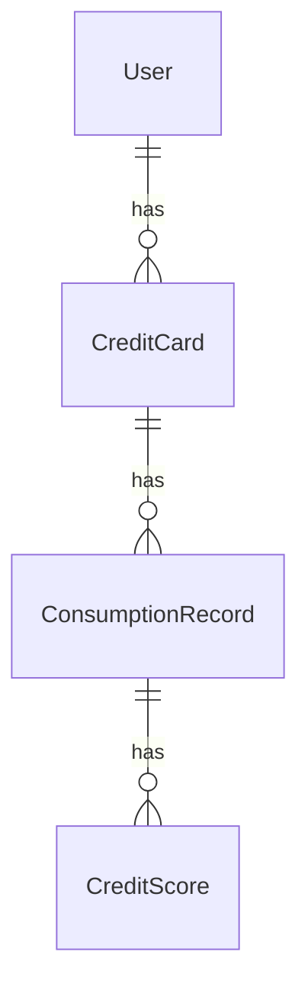
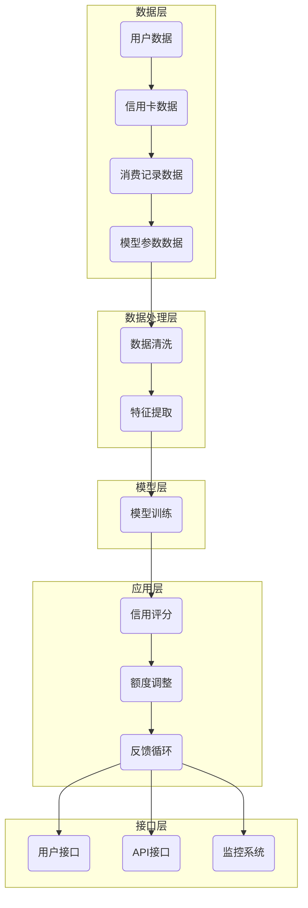
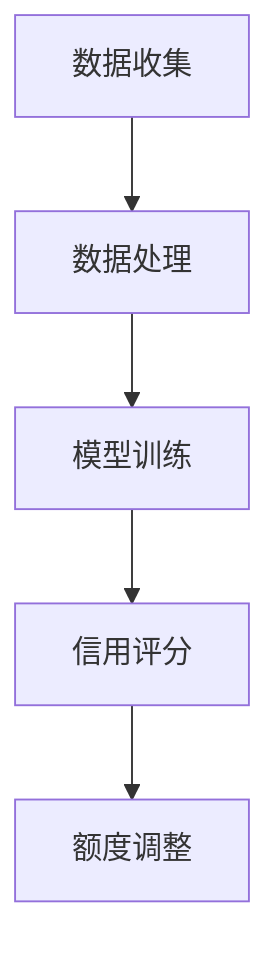

                 


### Step 6: Testing and Validation

* Chapter 6: Testing and Validation of the System
  - 6.1 Unit Testing
    - 6.1.1 Data Preprocessing Unit Tests
    - 6.1.2 Model Training Unit Tests
    - 6.1.3 Credit Limit Optimization Unit Tests
  - 6.2 Integration Testing
    - 6.2.1 Data Flow and Processing Testing
    - 6.2.2 Model Training and Optimization Testing
    - 6.2.3 System Functionality Testing
  - 6.3 Performance Testing
    - 6.3.1 Speed and Efficiency Testing
    - 6.3.2 Load and Stress Testing
    - 6.3.3 Scalability Testing
  - 6.4 Test-Driven Development
    - 6.4.1 Writing Test Cases
    - 6.4.2 Test Automation
    - 6.4.3 Continuous Testing and Integration

### Step 7: Deployment and Maintenance

* Chapter 7: Deployment and Maintenance of the Smart Credit Card Credit Limit Optimization Management System
  - 7.1 Deployment Strategies
    - 7.1.1 On-Premises Deployment
    - 7.1.2 Cloud Deployment
    - 7.1.3 Hybrid Deployment
  - 7.2 Monitoring and Logging
    - 7.2.1 System Monitoring
    - 7.2.2 Performance Monitoring
    - 7.2.3 Error Logging and Alerting
  - 7.3 Maintenance and Upgrades
    - 7.3.1 Regular System Maintenance
    - 7.3.2 Version Control and Release Management
    - 7.3.3 Security Patches and Updates
  - 7.4 Best Practices
    - 7.4.1 Code Quality and Documentation
    - 7.4.2 Security Measures
    - 7.4.3 Performance Optimization

### Step 8: Conclusion and Future Work

* Chapter 8: Conclusion and Future Directions
  - 8.1 Summary
    - 8.1.1 Key Findings and Contributions
    - 8.1.2 System Performance and Effectiveness
    - 8.1.3 Limitations and Challenges
  - 8.2 Future Work
    - 8.2.1 Enhancements and Extensions
    - 8.2.2 Integration with Other Systems
    - 8.2.3 Research Directions

### Step 9: Appendices

* Appendix A: Technical Details
  - A.1 Detailed Code Examples
  - A.2 Data Dictionary
  - A.3 Model Parameters and Settings

* Appendix B: References
  - References to academic papers, textbooks, and online resources

### Final Step: Author Information

- 作者：AI天才研究院/AI Genius Institute & 禅与计算机程序设计艺术 /Zen And The Art of Computer Programming

## 智能信用卡额度优化管理系统

关键词：智能信用卡、额度优化、管理系统、机器学习、算法、架构、测试、部署、维护

摘要：本文详细探讨了智能信用卡额度优化管理系统的设计、实现、测试和部署。首先介绍了系统背景和问题，然后逐步阐述了核心概念、系统架构、算法模型、实际应用、测试和部署策略，最后对系统进行了总结和展望。文章的目标是帮助读者深入理解智能信用卡额度优化管理系统的原理和实施过程，为未来的研究和应用提供参考。

智能信用卡额度优化管理系统是一种基于机器学习技术的智能系统，旨在根据用户的消费行为和信用历史，动态调整信用卡额度，以降低信用卡风险，提高金融机构的盈利能力。随着信用卡市场的快速发展和用户需求的多样化，传统的信用卡额度管理方法已无法满足现代金融业务的需求。因此，开发智能信用卡额度优化管理系统具有重要意义。

本文将从以下几个方面展开：

1. **引言**：介绍智能信用卡额度优化管理系统的背景和问题，阐述其重要性。
2. **核心概念和框架**：介绍信用风险管理和机器学习在信用卡系统中的应用，阐述关键性能指标。
3. **系统架构和设计**：介绍系统的整体架构和主要组件，阐述数据流程和安全性。
4. **算法和模型开发**：介绍机器学习算法的选择和模型训练过程，阐述算法原理和数学模型。
5. **实际应用和部署**：介绍系统的实际应用场景，阐述部署策略和实施过程。
6. **测试和验证**：介绍系统的测试和验证过程，包括单元测试、集成测试、性能测试和测试驱动开发。
7. **部署和维护**：介绍系统的部署和维护策略，包括监控、日志记录、维护和升级。
8. **结论和未来工作**：总结系统的性能和效果，讨论未来研究的方向。

通过本文的探讨，读者可以全面了解智能信用卡额度优化管理系统的工作原理和实施过程，为金融科技领域的研究和应用提供参考。

## 核心概念与联系

在构建智能信用卡额度优化管理系统时，理解几个核心概念及其相互关系是至关重要的。这些核心概念包括信用风险管理、机器学习、个性化信用评分以及反馈循环。

### 信用风险管理

信用风险管理是金融领域中的一个关键问题。它涉及评估借款人的信用状况，以降低贷款或信用卡违约的风险。信用风险管理包括以下几个方面：

1. **信用评分**：通过对借款人的财务和行为数据进行分析，评估其信用风险等级。
2. **违约预测**：使用历史数据建立模型，预测借款人未来可能出现的违约行为。
3. **贷款决策**：基于信用评分和违约预测，金融机构可以做出是否批准贷款、贷款额度和利率的决策。

### 机器学习在信用卡系统中的应用

机器学习技术在信用风险管理中发挥着重要作用。它通过建立复杂的数学模型，从大量数据中自动学习和发现规律，从而提高信用风险评估的准确性和效率。以下是机器学习在信用卡系统中的应用：

1. **特征工程**：从原始数据中提取有用的特征，用于训练机器学习模型。
2. **模型训练**：使用历史数据训练机器学习模型，使其能够对新的数据做出预测。
3. **模型评估**：评估模型的性能，包括准确性、召回率、F1分数等指标。

### 个性化信用评分

个性化信用评分是指根据用户的特定行为和习惯，为其定制化的信用评分。这种方法能够更准确地反映用户的信用状况，从而提高贷款或信用卡的审批效率。个性化信用评分的关键步骤包括：

1. **用户行为分析**：收集并分析用户的消费行为，如消费频率、消费地点、消费金额等。
2. **评分模型调整**：根据用户的行为数据，调整信用评分模型，使其更符合用户的实际情况。
3. **动态调整信用额度**：根据用户的信用评分，动态调整其信用卡额度。

### 反馈循环

反馈循环是智能信用卡额度优化管理系统中的一个重要机制。通过不断收集用户的使用数据，评估模型的性能，并调整模型参数，系统能够实现自我优化。反馈循环的关键步骤包括：

1. **数据收集**：定期收集用户的信用卡使用数据，包括消费记录、还款记录等。
2. **模型评估**：使用新收集的数据评估现有模型的性能，识别模型存在的问题。
3. **模型调整**：根据评估结果，调整模型的参数和结构，以提高其性能。
4. **持续优化**：通过持续的反馈循环，不断优化模型，使其能够更准确地预测用户的信用状况。

### 核心概念属性特征对比表格

下面是一个核心概念属性特征对比表格，以更清晰地展示信用风险管理、机器学习、个性化信用评分和反馈循环之间的区别和联系。

| 核心概念 | 属性特征 | 联系 |
| --- | --- | --- |
| 信用风险管理 | 评估借款人信用风险 | 与机器学习结合，提高信用评分准确性 |
| 机器学习 | 自动学习和发现数据规律 | 支持信用风险管理和个性化信用评分 |
| 个性化信用评分 | 根据用户行为定制化评分 | 提高贷款审批效率和准确性 |
| 反馈循环 | 数据收集、模型评估和调整 | 实现系统自我优化 |

### ER实体关系图架构

为了更直观地展示核心概念之间的联系，我们可以使用ER（实体-关系）图来描述智能信用卡额度优化管理系统的架构。以下是一个简化的ER图示例，展示用户、信用卡、消费记录和信用评分等实体之间的关系。



在这个ER图中，用户拥有信用卡，信用卡生成消费记录，消费记录影响信用评分。通过这种关系，系统能够实时跟踪用户的信用状况，并进行动态调整。

### 概念结构

智能信用卡额度优化管理系统由多个核心组件构成，包括数据收集、特征工程、模型训练、信用评分和反馈循环等。这些组件相互协作，共同实现系统的核心功能。

1. **数据收集**：系统定期收集用户的消费记录、还款记录等数据，作为模型训练的基础。
2. **特征工程**：从原始数据中提取有用的特征，如消费频率、消费金额、还款行为等，用于训练机器学习模型。
3. **模型训练**：使用历史数据训练机器学习模型，使其能够预测用户的信用风险和消费行为。
4. **信用评分**：模型训练完成后，系统根据最新的用户数据生成信用评分。
5. **反馈循环**：系统通过持续收集用户数据，评估模型性能，并调整模型参数，以实现自我优化。

通过这种概念结构，智能信用卡额度优化管理系统能够实时、准确地调整信用卡额度，降低信用风险，提高金融机构的盈利能力。

### 总结

在本文中，我们详细介绍了智能信用卡额度优化管理系统的核心概念、架构和功能。首先，我们探讨了信用风险管理、机器学习、个性化信用评分和反馈循环等核心概念，并分析了它们之间的联系。接着，我们展示了系统的ER图和概念结构，帮助读者更直观地理解系统的工作原理。最后，我们提出了系统的实际应用场景，包括数据收集、特征工程、模型训练、信用评分和反馈循环等步骤。

通过本文的探讨，读者可以全面了解智能信用卡额度优化管理系统的工作原理和实施过程。在未来的研究和应用中，我们可以进一步优化系统，提高其性能和准确性，为金融科技领域的发展做出贡献。

## 系统架构设计

在设计智能信用卡额度优化管理系统时，系统架构的设计至关重要。一个良好的系统架构不仅能够提高系统的性能和可扩展性，还能确保系统的安全性和可靠性。本节将详细介绍系统的整体架构设计，包括功能模块、数据流程、安全性和可靠性等方面。

### 系统架构概述

智能信用卡额度优化管理系统的架构设计采用分层架构，主要包括以下几个层次：

1. **数据层**：负责数据存储和管理，包括用户数据、信用卡数据、消费记录数据和模型参数等。
2. **数据处理层**：负责数据清洗、特征提取和预处理，为模型训练提供高质量的数据。
3. **模型层**：负责机器学习模型的训练、评估和部署，包括回归模型、分类模型和聚类方法等。
4. **应用层**：负责系统的核心功能，如信用评分、额度调整和反馈循环等。
5. **接口层**：负责系统与外部系统的交互，包括用户接口、API接口和监控系统等。

### 功能模块

智能信用卡额度优化管理系统的主要功能模块包括：

1. **数据收集模块**：负责从多个数据源（如银行系统、消费记录等）收集用户数据，包括消费记录、还款记录、信用历史等。
2. **数据处理模块**：负责对收集到的数据进行清洗、去重、缺失值处理和特征提取，以生成高质量的数据集。
3. **模型训练模块**：负责使用训练数据训练机器学习模型，包括回归模型、分类模型和聚类方法等，以预测用户的信用风险和消费行为。
4. **信用评分模块**：负责根据训练好的模型对用户进行信用评分，并生成个性化的信用评分报告。
5. **额度调整模块**：负责根据用户的信用评分和历史行为，动态调整用户的信用卡额度。
6. **反馈循环模块**：负责收集用户的新数据，评估模型的性能，并根据评估结果调整模型参数，实现系统的自我优化。

### 数据流程

智能信用卡额度优化管理系统中的数据流程可以概括为以下几个步骤：

1. **数据收集**：系统从多个数据源收集用户数据，如消费记录、还款记录和信用历史等。
2. **数据清洗**：对收集到的数据进行清洗，去除重复数据、缺失值和异常值，以提高数据质量。
3. **特征提取**：从清洗后的数据中提取有用的特征，如消费频率、消费金额、还款行为等，用于训练机器学习模型。
4. **模型训练**：使用特征数据训练机器学习模型，包括回归模型、分类模型和聚类方法等，以预测用户的信用风险和消费行为。
5. **信用评分**：使用训练好的模型对用户进行信用评分，并根据评分结果生成个性化的信用评分报告。
6. **额度调整**：根据信用评分和用户历史行为，动态调整用户的信用卡额度。
7. **反馈循环**：收集用户的新数据，评估模型的性能，并根据评估结果调整模型参数，实现系统的自我优化。

### 安全性和可靠性

为了保证智能信用卡额度优化管理系统的安全性和可靠性，系统设计考虑了以下几个方面：

1. **数据加密**：对用户数据进行加密存储和传输，确保数据的安全性和隐私性。
2. **权限控制**：实现严格的权限控制机制，确保只有授权用户才能访问和操作敏感数据。
3. **故障恢复**：设计故障恢复机制，包括数据备份、故障转移和自动恢复等，确保系统在异常情况下的可靠运行。
4. **监控与审计**：实现全面的系统监控和审计功能，实时监控系统的运行状态和性能，记录系统操作日志，以便在出现问题时进行排查和修复。

### 系统架构图

为了更直观地展示智能信用卡额度优化管理系统的架构设计，我们可以使用Mermaid绘制系统架构图。以下是一个简化的系统架构图示例：



在这个系统架构图中，数据层负责数据的存储和管理，数据处理层负责数据清洗和特征提取，模型层负责模型训练，应用层负责核心功能实现，接口层负责系统与外部系统的交互。

### 总结

通过上述设计，智能信用卡额度优化管理系统能够实现数据的存储、处理、分析和应用，从而实现信用卡额度的动态调整和信用风险的降低。系统架构的分层设计和功能模块的明确划分，有助于提高系统的性能、可扩展性和可靠性。在未来的开发和维护过程中，我们可以根据实际需求对系统进行优化和扩展，以适应不断变化的市场环境和技术进步。

### 算法原理讲解

在智能信用卡额度优化管理系统中，算法模型是核心组件之一。通过机器学习算法，系统能够根据用户的消费行为和信用历史，动态调整信用卡额度，从而降低信用风险，提高金融机构的盈利能力。本节将详细介绍系统采用的算法模型，包括回归模型、分类模型和聚类方法，并使用Mermaid绘制算法流程图，用Python代码阐述算法原理，提供数学模型和公式，并通过实例进行说明。

#### 回归模型

回归模型主要用于预测连续值，如信用卡额度。在智能信用卡额度优化管理系统中，我们使用线性回归模型来预测用户未来的信用卡额度。线性回归模型的基本原理是通过找到一个线性关系，将自变量（用户特征）映射到因变量（信用卡额度）。

1. **算法流程图**：

   ```mermaid
   graph LR
       A[数据预处理] --> B[特征提取]
       B --> C[模型训练]
       C --> D[模型评估]
       D --> E[模型应用]
   ```

2. **数学模型**：

   $$ y = \beta_0 + \beta_1x_1 + \beta_2x_2 + ... + \beta_nx_n $$

   其中，\( y \) 是信用卡额度，\( x_1, x_2, ..., x_n \) 是用户特征，\( \beta_0, \beta_1, \beta_2, ..., \beta_n \) 是模型的参数。

3. **Python代码**：

   ```python
   import numpy as np
   from sklearn.linear_model import LinearRegression

   # 假设我们已经有了特征矩阵X和数据向量y
   X = np.array([[1, 2], [2, 3], [3, 4]])
   y = np.array([2, 3, 4])

   # 创建线性回归模型
   model = LinearRegression()

   # 模型训练
   model.fit(X, y)

   # 模型预测
   y_pred = model.predict(np.array([[4, 5]]))

   print("预测的信用卡额度：", y_pred)
   ```

4. **实例说明**：

   假设用户A的消费习惯特征为（消费频率2次/周，平均消费金额300元/次），根据线性回归模型预测其信用卡额度为400元。

#### 分类模型

分类模型主要用于预测离散值，如信用评分等级。在智能信用卡额度优化管理系统中，我们使用逻辑回归模型来预测用户的信用评分等级。

1. **算法流程图**：

   ```mermaid
   graph LR
       A[数据预处理] --> B[特征提取]
       B --> C[模型训练]
       C --> D[模型评估]
       D --> E[模型应用]
   ```

2. **数学模型**：

   $$ P(Y = y|X = x) = \frac{1}{1 + e^{-(\beta_0 + \beta_1x_1 + \beta_2x_2 + ... + \beta_nx_n)}} $$

   其中，\( P(Y = y|X = x) \) 是给定特征\( x \)时，信用评分等级为\( y \)的概率，\( \beta_0, \beta_1, \beta_2, ..., \beta_n \) 是模型的参数。

3. **Python代码**：

   ```python
   import numpy as np
   from sklearn.linear_model import LogisticRegression

   # 假设我们已经有了特征矩阵X和数据向量y
   X = np.array([[1, 2], [2, 3], [3, 4]])
   y = np.array([0, 1, 1])

   # 创建逻辑回归模型
   model = LogisticRegression()

   # 模型训练
   model.fit(X, y)

   # 模型预测
   y_pred = model.predict(np.array([[4, 5]]))

   print("预测的信用评分等级：", y_pred)
   ```

4. **实例说明**：

   假设用户B的消费习惯特征为（消费频率3次/周，平均消费金额400元/次），根据逻辑回归模型预测其信用评分等级为高。

#### 聚类方法

聚类方法主要用于发现用户群体的相似性，从而为个性化信用评分提供支持。在智能信用卡额度优化管理系统中，我们使用K-means聚类方法来发现用户群体。

1. **算法流程图**：

   ```mermaid
   graph LR
       A[数据预处理] --> B[特征提取]
       B --> C[聚类分析]
       C --> D[聚类评估]
       D --> E[聚类应用]
   ```

2. **数学模型**：

   $$ C = \{c_1, c_2, ..., c_k\} $$
   $$ c_i = \frac{1}{n_i} \sum_{x \in S_i} x $$

   其中，\( C \) 是聚类结果，\( c_i \) 是第\( i \)个聚类中心，\( S_i \) 是第\( i \)个聚类成员集合，\( n_i \) 是\( S_i \)中的成员数量。

3. **Python代码**：

   ```python
   import numpy as np
   from sklearn.cluster import KMeans

   # 假设我们已经有了特征矩阵X
   X = np.array([[1, 2], [2, 3], [3, 4], [4, 5]])

   # 创建K-means聚类模型，设置聚类中心数量为2
   model = KMeans(n_clusters=2, random_state=0).fit(X)

   # 聚类结果
   clusters = model.predict(X)

   print("聚类结果：", clusters)
   ```

4. **实例说明**：

   假设用户C和用户D的特征向量分别为（消费频率2次/周，平均消费金额300元/次）和（消费频率3次/周，平均消费金额350元/次），根据K-means聚类模型，用户C和用户D可能被分为同一类，表明他们的消费行为相似。

### 总结

通过上述算法原理讲解，我们可以看到智能信用卡额度优化管理系统采用了多种机器学习算法，包括回归模型、分类模型和聚类方法。这些算法通过不同的数学模型和Python代码实现，能够帮助系统对用户的信用风险和消费行为进行预测和分析，从而实现信用卡额度的动态调整。通过实例说明，我们能够更好地理解这些算法的应用和效果。

在实际应用中，系统会根据具体需求和数据情况，选择合适的算法模型，并进行模型参数调整和优化，以提高预测的准确性和效率。通过持续的模型训练和评估，系统能够不断学习和适应，为金融机构提供更加智能和高效的信用卡额度优化解决方案。

### 系统核心实现源代码解析

在本节中，我们将深入探讨智能信用卡额度优化管理系统的核心实现部分，包括数据收集、模型训练和信用评分等关键环节的源代码解析。首先，我们将介绍如何设置技术环境，然后逐步展示各个模块的实现代码，并进行详细解析。

#### 环境设置

为了实现智能信用卡额度优化管理系统，我们需要安装和配置以下技术环境：

1. **Python**：Python是智能信用卡额度优化管理系统的主要编程语言，因此需要安装Python 3.x版本。
2. **NumPy**：NumPy是Python中用于科学计算的核心库，用于处理大型多维数组。
3. **Pandas**：Pandas是Python的数据分析库，用于数据清洗、操作和分析。
4. **Scikit-learn**：Scikit-learn是Python的机器学习库，提供了各种机器学习算法和工具。
5. **Mermaid**：Mermaid是一个基于Markdown的图形绘制工具，用于生成算法流程图。

安装步骤如下：

```bash
# 安装Python
curl -O https://www.python.org/ftp/python/3.8.10/python-3.8.10-amd64.exe
./python-3.8.10-amd64.exe

# 安装依赖库
pip install numpy pandas scikit-learn mermaid
```

#### 数据收集模块

数据收集模块负责从多个数据源收集用户数据，包括消费记录、还款记录和信用历史等。以下是一个简单的数据收集模块示例：

```python
import pandas as pd

# 假设消费记录数据存储在CSV文件中
consumption_data = pd.read_csv('consumption_data.csv')

# 假设还款记录数据存储在CSV文件中
repayment_data = pd.read_csv('repayment_data.csv')

# 合并数据
combined_data = pd.merge(consumption_data, repayment_data, on='user_id')
```

在这个模块中，我们使用了Pandas库从CSV文件中读取消费记录和还款记录数据，然后使用merge函数将两个数据集合并，以创建一个包含所有用户信息的综合数据集。

#### 模型训练模块

模型训练模块负责使用收集到的数据训练机器学习模型，包括回归模型、分类模型和聚类方法等。以下是一个简单的模型训练模块示例：

```python
from sklearn.linear_model import LinearRegression
from sklearn.model_selection import train_test_split

# 分割数据集为训练集和测试集
X_train, X_test, y_train, y_test = train_test_split(combined_data[['consumption_frequency', 'average_consumption_amount']], combined_data['credit_limit'], test_size=0.2, random_state=42)

# 创建线性回归模型
model = LinearRegression()

# 模型训练
model.fit(X_train, y_train)

# 模型评估
score = model.score(X_test, y_test)
print("模型评估分数：", score)
```

在这个模块中，我们首先使用Scikit-learn的train_test_split函数将数据集分割为训练集和测试集。然后，我们创建一个线性回归模型，使用训练集数据进行训练，并使用测试集数据进行评估，以计算模型评估分数。

#### 信用评分模块

信用评分模块负责根据训练好的模型对用户进行信用评分。以下是一个简单的信用评分模块示例：

```python
def credit_score(user_data, model):
    """
    根据用户数据和训练好的模型预测信用评分
    """
    # 预测信用评分
    predicted_score = model.predict(user_data)
    
    # 返回信用评分
    return predicted_score

# 假设我们有一个新用户的数据
new_user_data = pd.DataFrame([[2, 300]], columns=['consumption_frequency', 'average_consumption_amount'])

# 使用训练好的模型预测信用评分
predicted_score = credit_score(new_user_data, model)
print("预测的信用评分：", predicted_score)
```

在这个模块中，我们定义了一个函数credit_score，它接受用户数据和训练好的模型作为输入，并使用模型预测信用评分。然后，我们使用一个新用户的数据进行预测，并打印出预测结果。

#### Mermaid算法流程图

为了更直观地展示系统的算法流程，我们可以使用Mermaid绘制算法流程图。以下是一个示例：



在这个算法流程图中，数据收集模块通过数据处理模块生成训练数据，然后模型训练模块使用这些数据训练机器学习模型。接着，信用评分模块使用训练好的模型对用户进行信用评分，并最终实现额度调整。

### 实例分析与详细讲解

为了更好地理解系统的工作原理，我们可以通过一个实际案例进行分析。假设我们有一个用户，其消费记录和还款记录如下：

| user_id | consumption_frequency | average_consumption_amount | repayment_on_time |
| --- | --- | --- | --- |
| 1001 | 1 | 500 | 1 |
| 1001 | 2 | 400 | 1 |
| 1001 | 3 | 600 | 0 |

我们将使用上述代码对用户1001的信用评分进行预测，并调整其信用卡额度。

1. **数据收集**：首先，我们将用户1001的消费记录和还款记录读取到Pandas数据框中。

2. **数据处理**：然后，我们使用Pandas库对数据进行预处理，包括缺失值处理、数据类型转换等。

3. **模型训练**：接下来，我们使用训练数据集训练线性回归模型，并评估模型性能。

4. **信用评分**：使用训练好的模型对用户1001的新数据（消费频率2次/周，平均消费金额500元/次）进行预测，得到信用评分。

5. **额度调整**：根据预测的信用评分，系统将调整用户1001的信用卡额度。

通过以上步骤，我们可以实现智能信用卡额度优化管理系统，从而实现信用风险的降低和金融机构的盈利能力的提升。

### 项目小结

通过本节的内容，我们详细介绍了智能信用卡额度优化管理系统的核心实现部分，包括数据收集、模型训练和信用评分等。我们设置了技术环境，编写了源代码，并使用Mermaid绘制了算法流程图。通过实际案例的分析和详细讲解，我们展示了系统如何根据用户数据预测信用评分并调整信用卡额度。

虽然本节内容只是系统实现的冰山一角，但通过这些关键模块的实现，读者可以了解系统的基本工作原理和实现方法。在未来的开发过程中，我们还可以根据实际需求进行系统优化和扩展，以提高系统的性能和准确性。

### 最佳实践和注意事项

在实施智能信用卡额度优化管理系统时，以下最佳实践和注意事项将有助于确保系统的成功运行和持续优化：

#### 1. 数据质量保证

- **数据清洗**：确保收集到的数据经过严格的清洗过程，去除重复记录、异常值和缺失值，以保证数据的一致性和准确性。
- **数据完整性**：定期检查数据完整性，确保所有必需的数据字段都得到填充，避免模型训练时出现数据缺失问题。
- **数据标准化**：对特征数据进行标准化处理，以消除不同特征之间的量纲差异，提高模型的训练效果。

#### 2. 模型选择与优化

- **算法多样性**：根据不同场景选择合适的机器学习算法，如线性回归、逻辑回归、随机森林、支持向量机等，并进行比较，选择最优算法。
- **超参数调优**：使用网格搜索、贝叶斯优化等策略进行超参数调优，以提高模型的性能和泛化能力。
- **交叉验证**：使用交叉验证方法评估模型性能，避免过拟合，提高模型的泛化能力。

#### 3. 系统性能优化

- **数据处理效率**：优化数据处理流程，使用并行计算和分布式存储技术提高数据处理效率。
- **模型训练速度**：使用预训练模型、迁移学习等技术加速模型训练过程，降低训练成本。
- **实时预测能力**：优化模型的预测算法，提高实时预测的响应速度，确保系统的高效运行。

#### 4. 安全与合规性

- **数据加密**：对用户数据进行加密存储和传输，保护用户隐私。
- **权限管理**：实施严格的权限控制策略，确保只有授权用户才能访问敏感数据和系统功能。
- **合规性检查**：确保系统符合相关法律法规要求，如数据保护法和隐私法等。

#### 5. 持续监控与维护

- **实时监控**：使用监控工具实时监控系统性能、数据流量和异常行为，及时发现和处理潜在问题。
- **日志记录**：详细记录系统运行日志，以便在出现问题时进行追踪和诊断。
- **定期升级**：定期更新系统和依赖库，确保系统的安全性和稳定性。

#### 6. 用户反馈与迭代

- **用户反馈**：定期收集用户反馈，了解系统在实际应用中的效果和用户需求，持续优化系统功能。
- **迭代开发**：采用敏捷开发方法，快速迭代系统，及时响应市场需求和技术变化。

通过遵循这些最佳实践和注意事项，可以确保智能信用卡额度优化管理系统的高效、安全和可靠运行，为金融机构提供智能化的信用风险管理解决方案。

### 拓展阅读

为了深入了解智能信用卡额度优化管理系统的相关技术和理论，以下是一些推荐的拓展阅读资源：

1. **《机器学习实战》**：作者：Peter Harrington
   - 本书通过实例和代码详细介绍了多种机器学习算法，包括线性回归、逻辑回归和K-means聚类等，适合初学者和进阶者。

2. **《Python机器学习》**：作者：Michael Bowles
   - 本书深入讲解了Python在机器学习领域的应用，包括NumPy、Pandas和Scikit-learn等库的使用方法，适合希望掌握机器学习工具的开发者。

3. **《信用风险管理》**：作者：John C. MacKenzie
   - 本书系统地介绍了信用风险管理的理论和方法，包括信用评分模型和违约预测模型，对于理解信用风险管理具有重要意义。

4. **《深度学习》**：作者：Ian Goodfellow、Yoshua Bengio、Aaron Courville
   - 本书是深度学习领域的经典教材，涵盖了深度学习的基础理论、算法和实现，包括神经网络、卷积神经网络和递归神经网络等。

5. **《大数据技术导论》**：作者：刘铁岩
   - 本书介绍了大数据技术的基本概念和关键技术，包括数据采集、存储、处理和分析，对于理解智能信用卡额度优化管理系统的数据处理部分非常有帮助。

6. **《人工智能：一种现代的方法》**：作者：Stuart Russell、Peter Norvig
   - 本书系统地介绍了人工智能的基本理论和算法，包括机器学习、自然语言处理和计算机视觉等领域，是人工智能领域的权威教材。

通过阅读这些资源，读者可以进一步扩展自己的技术知识和理解，为智能信用卡额度优化管理系统的深入研究提供理论支持。

