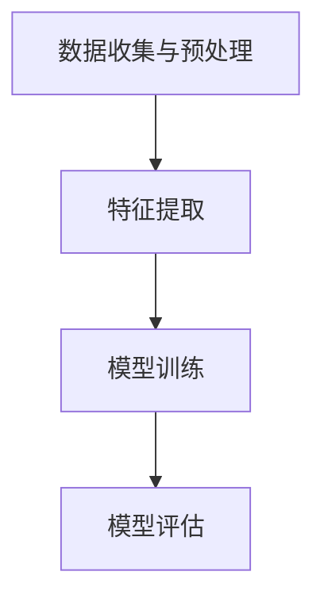
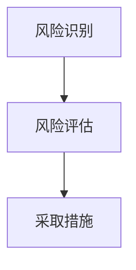
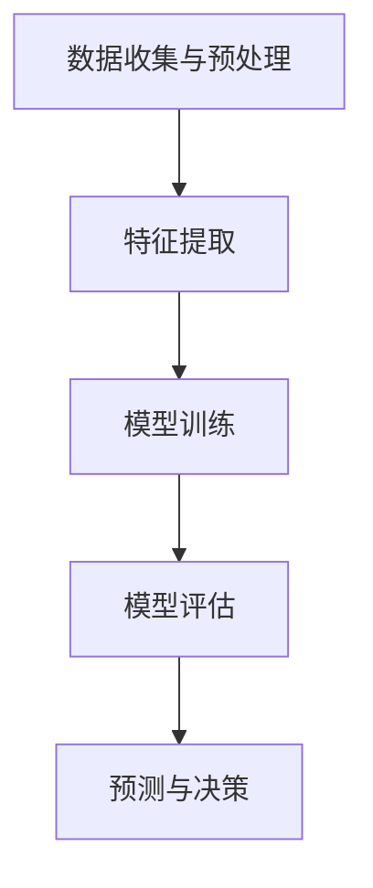
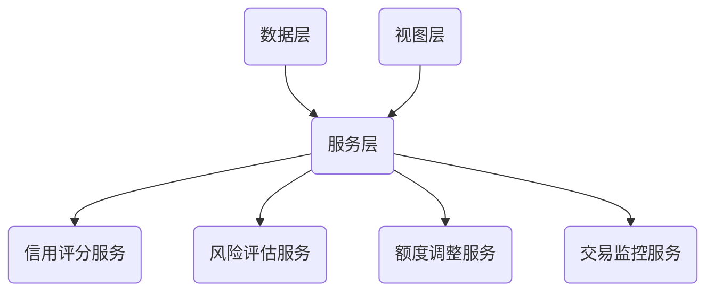

                 

# 智能信用卡额度管理系统

## 关键词

- 信用卡额度管理
- 信用评分模型
- 机器学习算法
- 系统架构设计
- 风险评估
- 数据处理

## 摘要

本文旨在深入探讨智能信用卡额度管理系统，从问题背景、核心概念、算法原理、系统架构设计到项目实战，全面剖析该系统的构建和应用。通过详细的分析和实际案例，本文揭示了智能信用卡额度管理系统的核心要素和关键步骤，为从事金融科技领域的开发者和研究人员提供了宝贵的参考。

## 目录大纲设计思路

### 1. 背景介绍

- 智能信用卡额度管理的现状
- 市场需求分析
- 智能信用卡额度管理的重要性

### 2. 核心概念与联系

- 信用评分模型
- 风险评估
- 机器学习算法
- 概念关系ER图

### 3. 算法原理讲解

- 信用评分模型原理
- 风险评估与控制
- 机器学习算法应用

### 4. 系统分析与架构设计

- 系统分析与设计
- 系统架构图与类图
- 系统接口设计
- 系统交互流程

### 5. 项目实战

- 环境安装与配置
- 核心实现与代码分析
- 实际案例分析与详细讲解
- 项目小结

### 6. 最佳实践与拓展

- 最佳实践技巧
- 小结与展望
- 拓展阅读建议

## 第一部分：智能信用卡额度管理概述

### 1.1 问题背景与市场概述

随着金融科技的快速发展，信用卡已经成为现代生活中不可或缺的支付工具。然而，如何合理管理信用卡额度，以适应不同用户的需求，同时降低风险，成为金融机构面临的一个重要问题。传统信用卡额度管理主要依赖于人工审批和历史数据，存在效率低、主观性强等问题。而智能信用卡额度管理系统的出现，正是为了解决这些问题。

#### 1.1.1 智能信用卡额度管理的现状

近年来，随着大数据、人工智能等技术的发展，越来越多的金融机构开始采用智能信用卡额度管理系统。这些系统通过分析用户的历史交易数据、信用评分、风险评估等因素，自动调整信用卡额度，实现了快速、准确的额度管理。

#### 1.1.2 市场需求分析

市场需求驱动了智能信用卡额度管理系统的发展。一方面，用户对个性化、智能化服务的需求日益增长，希望金融机构能够根据自身情况提供更合理的信用卡额度。另一方面，金融机构希望通过智能化的额度管理，降低风险，提高业务效率。

#### 1.1.3 智能信用卡额度管理的重要性

智能信用卡额度管理不仅提高了用户的满意度，还降低了金融机构的风险。它使得信用卡业务更加灵活，能够快速响应市场变化。此外，智能额度管理还可以帮助金融机构挖掘潜在客户，提升市场竞争力。

### 1.2 核心概念与联系

智能信用卡额度管理系统涉及多个核心概念，包括信用评分模型、风险评估、机器学习算法等。这些概念之间相互关联，共同构成了系统的核心。

#### 1.2.1 信用评分模型

信用评分模型是智能信用卡额度管理系统的核心组成部分。它通过分析用户的历史数据，评估用户的信用风险，从而决定信用卡额度。常见的信用评分模型包括线性回归、决策树、神经网络等。

#### 1.2.2 风险评估

风险评估是智能信用卡额度管理系统的重要环节。通过对用户的历史交易数据、信用评分等因素进行分析，系统可以评估用户的信用风险，并采取相应的措施，如调整额度、限制交易等。

#### 1.2.3 机器学习算法

机器学习算法在智能信用卡额度管理系统中扮演着关键角色。通过训练模型，系统可以自动识别和预测用户的信用风险，从而实现智能化的额度管理。

#### 1.2.4 概念关系ER图

为了更清晰地理解智能信用卡额度管理系统的核心概念，我们可以使用ER图来表示它们之间的关系。ER图包括实体（如用户、交易数据等）和关系（如用户与交易数据之间的关联等）。

## 第二部分：智能信用卡额度管理核心算法

### 2.1 信用评分模型原理

信用评分模型是智能信用卡额度管理系统中的核心算法。它通过分析用户的历史数据，评估用户的信用风险，从而决定信用卡额度。

#### 2.1.1 评分模型概述

信用评分模型通常包括特征提取、模型训练和模型评估三个阶段。特征提取是从用户历史数据中提取出与信用风险相关的特征，如消费金额、消费频率等。模型训练是利用这些特征训练一个预测模型，如线性回归模型、决策树模型等。模型评估则是评估模型的性能，如准确率、召回率等。

#### 2.1.2 评分模型的构建

评分模型的构建需要考虑多个因素，如数据质量、特征选择、模型选择等。以下是一个简化的评分模型构建流程：

1. 数据收集与预处理：收集用户的历史交易数据，并进行数据清洗、去重、标准化等预处理操作。
2. 特征提取：从预处理后的数据中提取与信用风险相关的特征。
3. 模型训练：利用特征数据训练一个预测模型，如线性回归模型、决策树模型等。
4. 模型评估：评估模型的性能，如准确率、召回率等。

#### 2.1.3 评分模型评估

评分模型评估是确保模型性能的重要步骤。常用的评估指标包括准确率、召回率、F1值等。以下是一个评分模型评估的示例：

```python
from sklearn.metrics import accuracy_score, recall_score, f1_score

# 预测结果
predictions = model.predict(X_test)

# 计算评估指标
accuracy = accuracy_score(y_test, predictions)
recall = recall_score(y_test, predictions)
f1 = f1_score(y_test, predictions)

print(f"Accuracy: {accuracy:.2f}")
print(f"Recall: {recall:.2f}")
print(f"F1 Score: {f1:.2f}")
```

#### 2.1.4 信用评分模型Mermaid流程图

以下是一个信用评分模型构建的Mermaid流程图：



#### 2.1.5 信用评分模型Python代码示例

以下是一个简单的信用评分模型Python代码示例：

```python
import pandas as pd
from sklearn.model_selection import train_test_split
from sklearn.linear_model import LinearRegression
from sklearn.metrics import mean_squared_error

# 加载数据
data = pd.read_csv("credit_data.csv")

# 特征提取
X = data.drop("target", axis=1)
y = data["target"]

# 模型训练
X_train, X_test, y_train, y_test = train_test_split(X, y, test_size=0.2, random_state=42)
model = LinearRegression()
model.fit(X_train, y_train)

# 预测
predictions = model.predict(X_test)

# 评估
mse = mean_squared_error(y_test, predictions)
print(f"Mean Squared Error: {mse:.2f}")
```

### 2.2 风险评估与控制

风险评估与控制是智能信用卡额度管理系统的重要组成部分。它通过对用户的历史交易数据、信用评分等因素进行分析，评估用户的信用风险，并采取相应的措施，如调整额度、限制交易等。

#### 2.2.1 风险评估概述

风险评估主要包括两个步骤：风险识别和风险评估。风险识别是识别可能影响信用卡业务的风险，如欺诈、逾期等。风险评估是评估这些风险的概率和影响，为采取相应的措施提供依据。

#### 2.2.2 风险评估指标

风险评估指标是评估信用风险的重要工具。常见的风险评估指标包括信用评分、欺诈概率、逾期概率等。以下是一个简单的风险评估指标表格：

| 指标       | 描述             | 类型     |
|------------|------------------|----------|
| 信用评分   | 评估信用风险的程度 | 数值     |
| 欺诈概率   | 评估欺诈发生的概率 | 数值     |
| 逾期概率   | 评估逾期发生的概率 | 数值     |

#### 2.2.3 风险评估模型

风险评估模型是利用历史数据训练的一个预测模型，用于评估用户的信用风险。常见的风险评估模型包括逻辑回归、决策树、随机森林等。以下是一个简单的风险评估模型Python代码示例：

```python
import pandas as pd
from sklearn.model_selection import train_test_split
from sklearn.ensemble import RandomForestClassifier
from sklearn.metrics import accuracy_score

# 加载数据
data = pd.read_csv("risk_data.csv")

# 特征提取
X = data.drop("target", axis=1)
y = data["target"]

# 模型训练
X_train, X_test, y_train, y_test = train_test_split(X, y, test_size=0.2, random_state=42)
model = RandomForestClassifier()
model.fit(X_train, y_train)

# 预测
predictions = model.predict(X_test)

# 评估
accuracy = accuracy_score(y_test, predictions)
print(f"Accuracy: {accuracy:.2f}")
```

#### 2.2.4 风险评估Mermaid流程图

以下是一个风险评估流程的Mermaid流程图：



### 2.3 机器学习算法应用

机器学习算法在智能信用卡额度管理系统中具有广泛的应用。通过训练模型，系统可以自动识别和预测用户的信用风险，从而实现智能化的额度管理。

#### 2.3.1 机器学习算法基础

机器学习算法是智能信用卡额度管理系统的核心。常见的机器学习算法包括线性回归、决策树、随机森林、支持向量机等。以下是一个简单的机器学习算法Python代码示例：

```python
import pandas as pd
from sklearn.model_selection import train_test_split
from sklearn.ensemble import RandomForestClassifier
from sklearn.metrics import accuracy_score

# 加载数据
data = pd.read_csv("machine_learning_data.csv")

# 特征提取
X = data.drop("target", axis=1)
y = data["target"]

# 模型训练
X_train, X_test, y_train, y_test = train_test_split(X, y, test_size=0.2, random_state=42)
model = RandomForestClassifier()
model.fit(X_train, y_train)

# 预测
predictions = model.predict(X_test)

# 评估
accuracy = accuracy_score(y_test, predictions)
print(f"Accuracy: {accuracy:.2f}")
```

#### 2.3.2 常见机器学习算法介绍

常见机器学习算法包括线性回归、决策树、随机森林、支持向量机等。以下是一个简单的算法介绍：

- 线性回归：通过拟合一条直线来预测目标变量。
- 决策树：通过构建树形结构来分类或回归。
- 随机森林：通过构建多棵决策树，并集成预测结果。
- 支持向量机：通过找到一个最优的超平面来分类或回归。

#### 2.3.3 机器学习算法在额度管理中的应用

机器学习算法在额度管理中的应用主要体现在两个方面：信用评分和风险评估。通过训练模型，系统可以自动识别和预测用户的信用风险，从而实现智能化的额度管理。

#### 2.3.4 机器学习算法Mermaid流程图

以下是一个机器学习算法流程的Mermaid流程图：



## 第三部分：智能信用卡额度管理系统架构设计

### 3.1 系统分析与设计

智能信用卡额度管理系统是一个复杂的系统，涉及多个模块和组件。系统分析与设计是构建系统的关键步骤。以下是一个简化的系统分析与设计流程：

#### 3.1.1 问题场景介绍

智能信用卡额度管理系统主要用于金融机构，旨在自动调整信用卡额度，降低风险，提高业务效率。

#### 3.1.2 系统功能设计

系统功能设计主要包括信用评分、风险评估、额度调整、交易监控等。以下是一个简化的功能设计：

- 信用评分：评估用户的信用风险，决定信用卡额度。
- 风险评估：评估用户的信用风险，决定是否调整额度。
- 额度调整：根据信用评分和风险评估结果，调整信用卡额度。
- 交易监控：监控用户的交易行为，识别潜在风险。

#### 3.1.3 系统架构设计

系统架构设计是确保系统可扩展、可维护、性能优良的关键。以下是一个简化的系统架构设计：

- 数据层：存储用户的历史交易数据、信用评分、风险评估等数据。
- 服务层：提供信用评分、风险评估、额度调整、交易监控等服务的API接口。
- 视图层：提供用户界面，展示用户信息、交易记录、额度调整结果等。

#### 3.1.4 系统接口设计

系统接口设计是确保系统与其他系统（如银行系统、支付系统等）无缝集成的关键。以下是一个简化的系统接口设计：

- 数据接口：提供数据层的访问接口，如REST API、Websocket等。
- 服务接口：提供服务层的访问接口，如REST API、gRPC等。

#### 3.1.5 系统交互流程

系统交互流程是描述系统各组件之间的交互过程。以下是一个简化的系统交互流程：

1. 用户发起交易请求。
2. 服务层接收到交易请求，调用信用评分和风险评估服务。
3. 信用评分服务评估用户的信用风险，返回评分结果。
4. 风险评估服务评估用户的信用风险，返回评估结果。
5. 服务层根据评分结果和评估结果，决定是否调整额度。
6. 服务层将额度调整结果返回给用户。

### 3.2 系统架构图与类图

以下是一个简化的智能信用卡额度管理系统架构图和类图：

#### 系统架构图



#### 类图

```mermaid
classDiagram
    User <<Class>>
    Transaction <<Class>>
    CreditScore <<Class>>
    RiskAssessment <<Class>>
    AmountAdjustment <<Class>>
    TransactionMonitoring <<Class>>

    User *--* Transaction
    CreditScore *--* User
    RiskAssessment *--* User
    AmountAdjustment *--* User
    TransactionMonitoring *--* Transaction
```

### 3.3 系统接口与交互流程

以下是一个简化的智能信用卡额度管理系统接口和交互流程：

#### 系统接口

- 数据接口：提供数据层的访问接口，如REST API、Websocket等。
- 服务接口：提供服务层的访问接口，如REST API、gRPC等。

#### 系统交互流程

1. 用户发起交易请求。
2. 服务层接收到交易请求，调用信用评分和风险评估服务。
3. 信用评分服务评估用户的信用风险，返回评分结果。
4. 风险评估服务评估用户的信用风险，返回评估结果。
5. 服务层根据评分结果和评估结果，决定是否调整额度。
6. 服务层将额度调整结果返回给用户。

## 第四部分：项目实战

### 4.1 环境安装与配置

为了构建智能信用卡额度管理系统，首先需要安装和配置必要的开发环境和软件。

#### 4.1.1 开发环境搭建

1. 安装Python环境：从Python官方网站下载并安装Python 3.x版本。
2. 安装Python包管理器：安装pip，Python的包管理器，用于安装和管理Python库。
3. 安装Python库：使用pip安装以下库：pandas、numpy、scikit-learn、matplotlib等。

#### 4.1.2 系统配置与调试

1. 配置数据库：安装并配置MySQL或PostgreSQL数据库，用于存储用户数据和交易记录。
2. 配置API接口：使用Flask或Django等Web框架配置API接口。
3. 调试系统：运行系统并调试，确保系统能够正常运行。

### 4.2 核心实现与代码分析

#### 4.2.1 信用评分模块实现

信用评分模块是智能信用卡额度管理系统的核心。以下是一个简化的信用评分模块实现：

```python
import pandas as pd
from sklearn.model_selection import train_test_split
from sklearn.linear_model import LinearRegression
from sklearn.metrics import mean_squared_error

# 加载数据
data = pd.read_csv("credit_data.csv")

# 特征提取
X = data.drop("target", axis=1)
y = data["target"]

# 模型训练
X_train, X_test, y_train, y_test = train_test_split(X, y, test_size=0.2, random_state=42)
model = LinearRegression()
model.fit(X_train, y_train)

# 预测
predictions = model.predict(X_test)

# 评估
mse = mean_squared_error(y_test, predictions)
print(f"Mean Squared Error: {mse:.2f}")
```

#### 4.2.2 风险评估模块实现

风险评估模块用于评估用户的信用风险。以下是一个简化的风险评估模块实现：

```python
import pandas as pd
from sklearn.model_selection import train_test_split
from sklearn.ensemble import RandomForestClassifier
from sklearn.metrics import accuracy_score

# 加载数据
data = pd.read_csv("risk_data.csv")

# 特征提取
X = data.drop("target", axis=1)
y = data["target"]

# 模型训练
X_train, X_test, y_train, y_test = train_test_split(X, y, test_size=0.2, random_state=42)
model = RandomForestClassifier()
model.fit(X_train, y_train)

# 预测
predictions = model.predict(X_test)

# 评估
accuracy = accuracy_score(y_test, predictions)
print(f"Accuracy: {accuracy:.2f}")
```

#### 4.2.3 机器学习算法模块实现

机器学习算法模块用于实现信用评分和风险评估。以下是一个简化的机器学习算法模块实现：

```python
import pandas as pd
from sklearn.model_selection import train_test_split
from sklearn.ensemble import RandomForestClassifier
from sklearn.metrics import accuracy_score

# 加载数据
data = pd.read_csv("machine_learning_data.csv")

# 特征提取
X = data.drop("target", axis=1)
y = data["target"]

# 模型训练
X_train, X_test, y_train, y_test = train_test_split(X, y, test_size=0.2, random_state=42)
model = RandomForestClassifier()
model.fit(X_train, y_train)

# 预测
predictions = model.predict(X_test)

# 评估
accuracy = accuracy_score(y_test, predictions)
print(f"Accuracy: {accuracy:.2f}")
```

#### 4.2.4 代码解读与分析

以下是对信用评分模块代码的解读与分析：

```python
import pandas as pd
from sklearn.model_selection import train_test_split
from sklearn.linear_model import LinearRegression
from sklearn.metrics import mean_squared_error

# 加载数据
data = pd.read_csv("credit_data.csv")

# 特征提取
X = data.drop("target", axis=1)
y = data["target"]

# 模型训练
X_train, X_test, y_train, y_test = train_test_split(X, y, test_size=0.2, random_state=42)
model = LinearRegression()
model.fit(X_train, y_train)

# 预测
predictions = model.predict(X_test)

# 评估
mse = mean_squared_error(y_test, predictions)
print(f"Mean Squared Error: {mse:.2f}")
```

- 加载数据：使用pandas读取CSV文件，加载数据。
- 特征提取：将数据分为特征和目标，准备训练模型。
- 模型训练：使用train_test_split将数据分为训练集和测试集，使用LinearRegression训练模型。
- 预测：使用训练好的模型进行预测。
- 评估：计算预测结果的均方误差，评估模型性能。

#### 4.2.5 实际案例分析与详细讲解

以下是一个实际案例分析与详细讲解：

```python
import pandas as pd
from sklearn.model_selection import train_test_split
from sklearn.linear_model import LinearRegression
from sklearn.metrics import mean_squared_error

# 加载数据
data = pd.read_csv("credit_data.csv")

# 特征提取
X = data.drop("target", axis=1)
y = data["target"]

# 模型训练
X_train, X_test, y_train, y_test = train_test_split(X, y, test_size=0.2, random_state=42)
model = LinearRegression()
model.fit(X_train, y_train)

# 预测
predictions = model.predict(X_test)

# 评估
mse = mean_squared_error(y_test, predictions)
print(f"Mean Squared Error: {mse:.2f}")

# 实际案例
user_data = pd.DataFrame({
    "feature1": [1000],
    "feature2": [2000],
    "feature3": [3000]
})

predicted_score = model.predict(user_data)
print(f"Predicted Score: {predicted_score[0]:.2f}")
```

- 数据加载：使用pandas读取CSV文件，加载数据。
- 特征提取：将数据分为特征和目标，准备训练模型。
- 模型训练：使用train_test_split将数据分为训练集和测试集，使用LinearRegression训练模型。
- 预测：使用训练好的模型进行预测。
- 评估：计算预测结果的均方误差，评估模型性能。
- 实际案例：生成一个用户数据样本，使用模型进行预测，输出预测结果。

## 第五部分：最佳实践与拓展

### 5.1 最佳实践技巧

在构建智能信用卡额度管理系统时，以下是一些最佳实践技巧：

1. 数据质量：确保数据的质量和准确性，这是构建可靠模型的基石。
2. 特征选择：选择与信用风险相关的特征，避免过拟合和欠拟合。
3. 模型评估：使用多种评估指标和交叉验证方法，确保模型性能。
4. 持续优化：定期更新模型，以适应新的数据和市场变化。
5. 安全性：确保系统的安全性，防止数据泄露和恶意攻击。

### 5.2 小结与展望

智能信用卡额度管理系统是金融科技领域的一项重要创新，它通过大数据和机器学习算法，实现了信用卡额度的智能化管理。随着技术的不断发展，未来智能信用卡额度管理系统将进一步优化，实现更精准、更高效的额度管理。

### 5.3 拓展阅读建议

对于希望深入了解智能信用卡额度管理系统的读者，以下是一些拓展阅读建议：

1. 《机器学习：周志华》
2. 《数据科学实战：Jay DeLisle》
3. 《金融科技：变革与创新》
4. 《人工智能：应用与挑战》
5. 《智能信用卡额度管理研究综述》

## 作者

作者：AI天才研究院/AI Genius Institute & 禅与计算机程序设计艺术 /Zen And The Art of Computer Programming

[文章结束]

