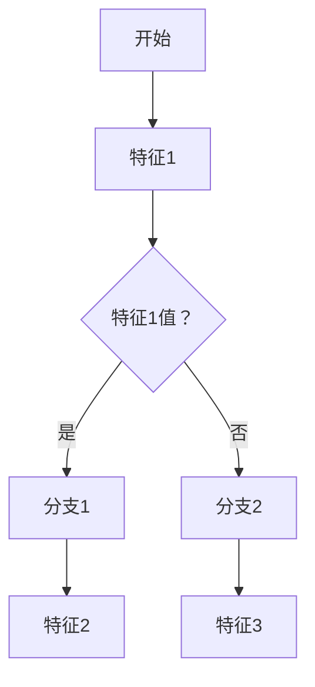
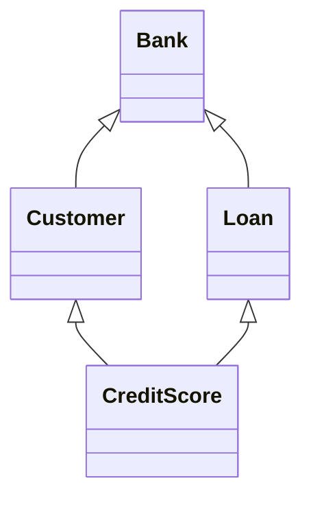
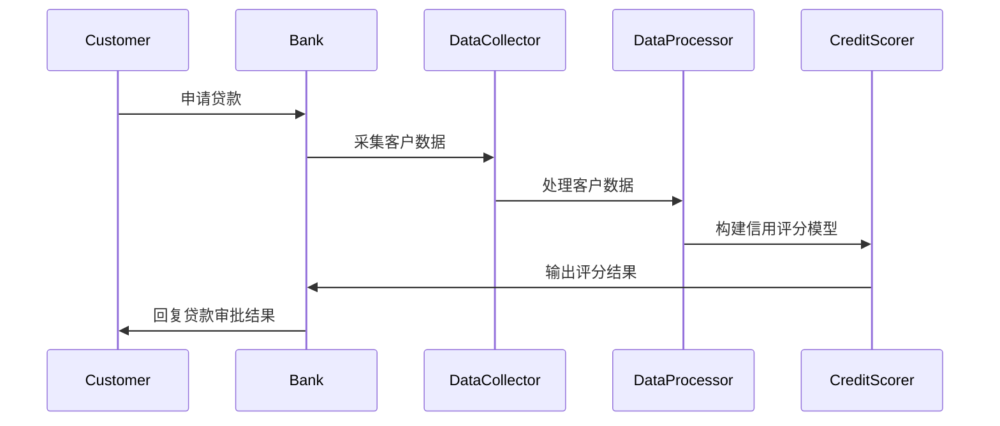
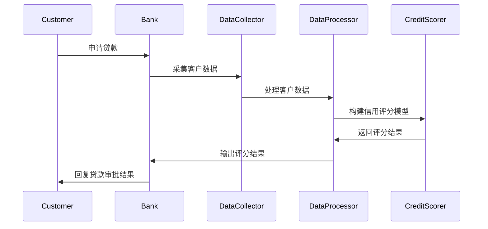

                 

# 智能信用评分系统

> 关键词：信用评分、人工智能、机器学习、深度学习、系统设计

> 摘要：本文深入探讨了智能信用评分系统的原理、设计和实现，从背景介绍、核心概念与联系、算法原理讲解、系统设计与实现，到最佳实践与拓展，全面解析了智能信用评分系统的各个方面，旨在为读者提供一条清晰、实用的理解路径。

## 目录大纲总结

本书《智能信用评分系统》分为四个部分，共7章，旨在全面介绍智能信用评分系统的概念、算法原理、系统设计与实现以及最佳实践。

## 第一部分：背景介绍
- 第1章：问题背景，介绍信用评分的意义、当前挑战和智能信用评分的优势。

## 第二部分：核心概念与联系
- 第2章：核心概念与联系，详细讲解数据挖掘、机器学习和深度学习等相关概念及其属性特征对比，并展示ER实体关系图架构。

## 第三部分：算法原理讲解
- 第3章：算法原理与数学模型，介绍数据预处理、机器学习和深度学习算法的原理，以及使用Python代码进行举例说明。

## 第四部分：系统设计与实现
- 第4章：系统分析与架构设计方案，介绍问题场景、系统功能设计（领域模型类图）、系统架构设计（架构图）、系统接口设计和系统交互设计（序列图）。
- 第5章：项目实战，包括环境安装、系统核心实现源代码、代码应用解读与分析、实际案例分析和详细讲解剖析，以及项目小结。

## 第五部分：最佳实践与拓展
- 第6章：最佳实践，提供数据处理技巧、模型调优方法和隐私保护策略。
- 第7章：小结，回顾全书内容，提出注意事项和拓展阅读建议。

本书目录大纲结构清晰，内容全面，旨在帮助读者深入理解智能信用评分系统的原理和实践。

### 目录大纲总结

本书《智能信用评分系统》分为四个部分，共7章，旨在全面介绍智能信用评分系统的概念、算法原理、系统设计与实现以及最佳实践。

## 第一部分：背景介绍
- 第1章：问题背景，介绍信用评分的意义、当前挑战和智能信用评分的优势。

## 第二部分：核心概念与联系
- 第2章：核心概念与联系，详细讲解数据挖掘、机器学习和深度学习等相关概念及其属性特征对比，并展示ER实体关系图架构。

## 第三部分：算法原理讲解
- 第3章：算法原理与数学模型，介绍数据预处理、机器学习和深度学习算法的原理，以及使用Python代码进行举例说明。

## 第四部分：系统设计与实现
- 第4章：系统分析与架构设计方案，介绍问题场景、系统功能设计（领域模型类图）、系统架构设计（架构图）、系统接口设计和系统交互设计（序列图）。
- 第5章：项目实战，包括环境安装、系统核心实现源代码、代码应用解读与分析、实际案例分析和详细讲解剖析，以及项目小结。

## 第五部分：最佳实践与拓展
- 第6章：最佳实践，提供数据处理技巧、模型调优方法和隐私保护策略。
- 第7章：小结，回顾全书内容，提出注意事项和拓展阅读建议。

本书目录大纲结构清晰，内容全面，旨在帮助读者深入理解智能信用评分系统的原理和实践。

### 第一部分：背景介绍

#### 第1章：问题背景

### 1.1 信用评分的意义

信用评分是一种评估个人或企业信用风险的方法，其核心目的是通过分析借款人的信用历史、财务状况、行为模式等因素，预测其未来的偿债能力。信用评分的应用场景广泛，包括但不限于银行信贷审批、信用卡发放、保险理赔、租赁审批等领域。

- **定义和作用**：信用评分的定义可以从多个角度进行理解。从宏观层面，它是一个综合评价体系，用于衡量个体或企业的信用水平；从微观层面，它是一个量化指标，通过一系列评分模型和算法，将复杂的信息转化为一个数值或分数。

- **金融行业应用场景**：在金融行业中，信用评分主要用于贷款审批。银行和其他金融机构根据信用评分来决定是否向借款人发放贷款，以及贷款的金额和利率。此外，信用评分还在信用卡审批、信用额度调整、风险管理等方面发挥重要作用。

### 1.2 当前信用评分的挑战

尽管信用评分在金融行业中具有重要意义，但现有的信用评分模型仍然面临诸多挑战。

- **信用评分模型的不完善**：传统信用评分模型往往依赖于历史数据和统计方法，容易忽略一些新兴的、复杂的影响因素。例如，社交网络、在线行为、大数据分析等，这些因素在预测信用风险方面具有潜在的价值。

- **数据质量和隐私保护问题**：信用评分模型的准确性依赖于高质量的数据。然而，数据质量往往受到噪声、缺失值、不一致性等因素的影响。此外，随着数据隐私保护法规的加强，如何在保护个人隐私的同时利用数据也成为了一个重要挑战。

### 1.3 智能信用评分的优势

智能信用评分系统通过引入人工智能、机器学习和深度学习等技术，可以有效解决传统信用评分模型面临的问题。

- **利用人工智能技术提升信用评分的准确性**：人工智能技术可以通过学习和挖掘大量非结构化数据，如社交媒体信息、在线行为等，提供更全面、更准确的信用评估。

- **提高数据处理效率和速度**：传统信用评分模型通常需要大量人工干预，而智能信用评分系统可以利用自动化工具，快速处理和分析海量数据，提高工作效率。

### 总结

信用评分在金融行业中扮演着至关重要的角色，但传统信用评分模型面临着不完善和数据隐私保护等挑战。智能信用评分系统通过引入人工智能、机器学习和深度学习等技术，有望提升信用评分的准确性，提高数据处理效率和速度，为金融行业的风险管理提供更强大的支持。在接下来的章节中，我们将深入探讨智能信用评分系统的核心概念、算法原理和系统设计，帮助读者全面理解这一前沿技术。

### 第二部分：核心概念与联系

#### 第2章：核心概念与联系

在深入探讨智能信用评分系统之前，我们需要了解几个关键的概念：数据挖掘、机器学习和深度学习。这些概念是构建智能信用评分系统的基础，它们各自有不同的属性特征和应用场景。

### 2.1 智能信用评分的关键概念

- **数据挖掘**：数据挖掘是一种从大量数据中提取有价值信息的过程，通常涉及模式识别、统计分析、机器学习等技术。在智能信用评分系统中，数据挖掘用于发现借款人的潜在风险因素，如历史还款记录、财务状况等。

- **机器学习**：机器学习是一种通过算法从数据中学习规律和模式，并进行预测或决策的技术。在信用评分中，机器学习算法可以自动识别借款人的特征，构建信用评分模型。

- **深度学习**：深度学习是一种基于人工神经网络的学习方法，可以自动提取复杂数据的特征。深度学习在图像识别、自然语言处理等领域取得了显著成果，其强大的特征提取能力使其在智能信用评分系统中具有巨大的潜力。

### 2.2 概念属性特征对比表格

| 概念       | 属性特征                                   | 应用场景                   |
|------------|------------------------------------------|----------------------------|
| 数据挖掘   | 提取有价值信息，模式识别，统计分析           | 信用评分，市场营销，风险控制 |
| 机器学习   | 自动学习数据中的规律和模式，进行预测或决策     | 信用评分，推荐系统，自动驾驶 |
| 深度学习   | 自动提取复杂数据的特征，处理大量非结构化数据   | 图像识别，自然语言处理，智能信用评分 |

### 2.3 ER实体关系图架构

ER实体关系图是一种用于描述系统中实体及其关系的图形化工具。在智能信用评分系统中，ER图可以帮助我们理解数据模型和系统架构。

```mermaid
erDiagram
  Person ||--|{ CreditScore }
  Loan ||--|{ CreditScore }
  Bank ||--|{ Loan }
  Bank ||--|{ Person }
```

在这个ER图中，我们定义了以下几个实体：

- **Person**：借款人，具有姓名、身份证号等属性。
- **CreditScore**：信用评分，包含评分结果、评分时间等属性。
- **Loan**：贷款，包含贷款金额、期限等属性。
- **Bank**：银行，是贷款和借款人的中介。

实体之间的关系如下：

- **Person**与**CreditScore**之间是一对一关系，每个人有一个对应的信用评分。
- **Loan**与**CreditScore**之间是一对多关系，一笔贷款可能对应多个信用评分。
- **Bank**与**Loan**和**Person**之间是多对多关系，银行可以发放多笔贷款，也可以服务于多个借款人。

通过ER图，我们可以清晰地看到系统中各个实体的关系，为后续的系统设计与实现提供了基础。

### 总结

本章介绍了智能信用评分系统的关键概念：数据挖掘、机器学习和深度学习。通过对比这些概念的性质特征，我们了解了它们在信用评分系统中的应用。此外，通过ER实体关系图，我们构建了系统的数据模型，为后续的算法原理讲解和系统设计奠定了基础。在接下来的章节中，我们将深入探讨算法原理，并通过实际案例展示智能信用评分系统的应用。

### 第三部分：算法原理讲解

#### 第3章：算法原理与数学模型

智能信用评分系统的核心在于算法的原理与数学模型。在这个章节中，我们将详细讲解数据预处理、机器学习和深度学习算法的基本原理，并通过Python代码进行具体的应用实例。

### 3.1 数据预处理

数据预处理是智能信用评分系统的第一步，其质量直接影响到后续模型的性能。数据预处理主要包括数据清洗、数据变换和特征工程等步骤。

#### 3.1.1 数据清洗

数据清洗是数据预处理的重要环节，其主要目标是去除数据中的噪声和错误。

- **去除缺失值**：常用的方法包括删除缺失值、填充缺失值等。例如，我们可以使用均值、中位数或最近邻等方法来填充缺失值。
- **去除重复数据**：通过比较数据集中的每个记录，去除重复的数据。
- **处理异常值**：异常值可能会对模型产生不良影响。我们可以使用箱线图、Z-score等方法来检测和去除异常值。

#### 3.1.2 数据变换

数据变换是为了满足模型输入的需求，对原始数据进行转换。

- **归一化**：通过将数据缩放到一个固定范围（如[0, 1]），使不同特征之间的尺度一致。
- **标准化**：通过减去均值并除以标准差，使数据的均值为0，标准差为1。

#### 3.1.3 特征工程

特征工程是提高模型性能的关键步骤，其目的是从原始数据中提取出对模型有用的特征。

- **特征选择**：通过筛选出对模型影响大的特征，减少模型的复杂性。
- **特征构造**：通过组合或转换原始特征，构造新的特征。

### 3.2 机器学习算法

机器学习算法是构建信用评分模型的核心。以下介绍几种常用的机器学习算法。

#### 3.2.1 决策树

决策树是一种基于树形结构进行决策的算法。

- **基本原理**：决策树通过一系列的测试来划分数据，每个测试对应一个特征，每个测试结果对应一个分支。
- **流程图**：



- **Python代码示例**：

```python
from sklearn import tree

# 构建决策树模型
model = tree.DecisionTreeClassifier()
model.fit(X_train, y_train)

# 预测
predictions = model.predict(X_test)
```

#### 3.2.2 支持向量机

支持向量机（SVM）是一种基于边界优化的分类算法。

- **基本原理**：SVM通过找到一个最优的超平面，将不同类别的数据分隔开来。
- **数学模型**：

$$
\text{最大化} \ \frac{1}{\|\mathbf{w}\|}
\ \text{约束条件} \ \mathbf{y}^{(\text{train})}\cdot(\mathbf{w}\cdot\mathbf{x}^{(\text{train})} + b) \geq 1
$$

- **Python代码示例**：

```python
from sklearn import svm

# 构建SVM模型
model = svm.SVC()
model.fit(X_train, y_train)

# 预测
predictions = model.predict(X_test)
```

#### 3.2.3 随机森林

随机森林是一种基于集成学习的算法，它由多个决策树组成。

- **基本原理**：随机森林通过构建多个决策树，并取它们的多数表决作为最终预测结果。
- **Python代码示例**：

```python
from sklearn.ensemble import RandomForestClassifier

# 构建随机森林模型
model = RandomForestClassifier()
model.fit(X_train, y_train)

# 预测
predictions = model.predict(X_test)
```

### 3.3 深度学习算法

深度学习算法是构建智能信用评分系统的又一重要手段。以下介绍几种常用的深度学习算法。

#### 3.3.1 卷积神经网络（CNN）

卷积神经网络是一种专门用于处理图像数据的学习算法。

- **基本原理**：CNN通过卷积层提取图像的特征，并通过池化层减少数据的维度。
- **Python代码示例**：

```python
from tensorflow.keras.models import Sequential
from tensorflow.keras.layers import Conv2D, MaxPooling2D, Flatten, Dense

# 构建CNN模型
model = Sequential()
model.add(Conv2D(32, (3, 3), activation='relu', input_shape=(28, 28, 1)))
model.add(MaxPooling2D((2, 2)))
model.add(Flatten())
model.add(Dense(128, activation='relu'))
model.add(Dense(1, activation='sigmoid'))

# 编译模型
model.compile(optimizer='adam', loss='binary_crossentropy', metrics=['accuracy'])

# 训练模型
model.fit(X_train, y_train, epochs=10, batch_size=32)
```

#### 3.3.2 循环神经网络（RNN）

循环神经网络是一种用于处理序列数据的学习算法。

- **基本原理**：RNN通过将前一个时间步的输出作为当前时间步的输入，实现信息的记忆和传递。
- **Python代码示例**：

```python
from tensorflow.keras.models import Sequential
from tensorflow.keras.layers import LSTM, Dense

# 构建RNN模型
model = Sequential()
model.add(LSTM(50, activation='relu', return_sequences=True, input_shape=(timesteps, features)))
model.add(LSTM(50, activation='relu'))
model.add(Dense(1, activation='sigmoid'))

# 编译模型
model.compile(optimizer='adam', loss='binary_crossentropy', metrics=['accuracy'])

# 训练模型
model.fit(X_train, y_train, epochs=20, batch_size=64)
```

#### 3.3.3 强化学习

强化学习是一种通过不断试错来学习最优策略的算法。

- **基本原理**：强化学习通过奖励机制来引导学习过程，不断优化策略。
- **Python代码示例**：

```python
import gym
from stable_baselines3 import PPO

# 创建环境
env = gym.make('CartPole-v0')

# 构建强化学习模型
model = PPO('MlpPolicy', env, verbose=1)

# 训练模型
model.learn(total_timesteps=10000)

# 测试模型
obs = env.reset()
for _ in range(1000):
    action, _ = model.predict(obs, deterministic=True)
    obs, reward, done, info = env.step(action)
    env.render()
    if done:
        break

env.close()
```

### 总结

本章详细介绍了智能信用评分系统的算法原理与数学模型，包括数据预处理、机器学习算法和深度学习算法。通过Python代码示例，我们展示了这些算法的基本应用方法。在下一章中，我们将深入探讨智能信用评分系统的系统设计与实现。

### 第四部分：系统设计与实现

#### 第4章：系统分析与架构设计方案

智能信用评分系统的设计与实现是构建高效、稳定、可扩展信用评分模型的关键步骤。在这一章中，我们将详细阐述系统分析与架构设计方案，包括问题场景介绍、系统功能设计、系统架构设计、系统接口设计和系统交互设计。

### 4.1 问题场景介绍

智能信用评分系统主要应用于金融行业，尤其是在银行和金融机构中。其主要目的是为银行和其他金融机构提供一个自动化的信用评分工具，以辅助信贷审批、信用卡发放、信用额度调整等业务。

- **业务需求**：银行需要快速、准确地对借款人的信用风险进行评估，以便做出合理的信贷决策。传统的信用评分方法存在诸多限制，无法充分利用非结构化数据和新兴因素。
- **目标**：设计一个智能信用评分系统，能够利用人工智能、机器学习和深度学习技术，提高信用评分的准确性和效率。

### 4.2 系统功能设计

系统功能设计是系统分析与架构设计的基础，其主要目标是明确系统应具备的功能模块。

- **数据采集**：从各种数据源（如银行系统、社交媒体、公共记录等）收集借款人的数据。
- **数据预处理**：对采集到的数据进行分析、清洗和特征工程，确保数据质量。
- **信用评分模型**：构建和应用各种信用评分模型，如决策树、支持向量机、随机森林、卷积神经网络等。
- **结果输出**：将信用评分结果以可视化的形式展示给用户，并提供查询接口。

#### 4.2.1 领域模型

领域模型用于描述系统中的关键实体和它们之间的关系。以下是一个简单的领域模型类图：



- **Customer（客户）**：代表借款人，具有姓名、身份证号、联系方式等属性。
- **CreditScore（信用评分）**：包含评分结果、评分时间等属性。
- **Loan（贷款）**：包含贷款金额、期限等属性。
- **Bank（银行）**：是贷款和借款人的中介，具有银行名称、地址等属性。

#### 4.2.2 系统接口设计

系统接口设计定义了系统对外提供的服务接口。以下是一个简单的系统接口设计：

- **数据采集接口**：提供数据上传、数据查询等功能。
- **数据预处理接口**：提供数据清洗、特征工程等功能。
- **信用评分接口**：提供评分模型训练、评分预测等功能。
- **结果展示接口**：提供评分结果可视化、查询等功能。

### 4.3 系统架构设计

系统架构设计是系统设计与实现的核心，其主要目标是确保系统的高效性、稳定性和可扩展性。以下是一个简单的系统架构设计：



- **DataCollector（数据采集器）**：负责从各种数据源采集客户数据。
- **DataProcessor（数据处理器）**：负责对采集到的数据进行分析、清洗和特征工程。
- **CreditScorer（信用评分器）**：负责构建和应用信用评分模型。
- **Bank（银行）**：作为系统的核心，负责处理贷款申请、评分结果输出和客户反馈。

### 4.4 系统交互设计

系统交互设计描述了系统内部组件之间的交互流程。以下是一个简单的系统交互序列图：



通过以上系统分析与架构设计方案，我们可以构建一个高效、稳定的智能信用评分系统，为银行和金融机构提供强有力的信用风险管理工具。在下一章中，我们将通过实际项目实战，深入探讨系统设计与实现的具体过程。

### 第四部分：系统设计与实现

#### 第4章：系统分析与架构设计方案

智能信用评分系统的设计与实现是构建高效、稳定、可扩展信用评分模型的关键步骤。在这一章中，我们将详细阐述系统分析与架构设计方案，包括问题场景介绍、系统功能设计、系统架构设计、系统接口设计和系统交互设计。

### 4.1 问题场景介绍

智能信用评分系统主要应用于金融行业，尤其是在银行和金融机构中。其主要目的是为银行和其他金融机构提供一个自动化的信用评分工具，以辅助信贷审批、信用卡发放、信用额度调整等业务。

- **业务需求**：银行需要快速、准确地对借款人的信用风险进行评估，以便做出合理的信贷决策。传统的信用评分方法存在诸多限制，无法充分利用非结构化数据和新兴因素。
- **目标**：设计一个智能信用评分系统，能够利用人工智能、机器学习和深度学习技术，提高信用评分的准确性和效率。

### 4.2 系统功能设计

系统功能设计是系统分析与架构设计的基础，其主要目标是明确系统应具备的功能模块。

- **数据采集**：从各种数据源（如银行系统、社交媒体、公共记录等）收集借款人的数据。
- **数据预处理**：对采集到的数据进行分析、清洗和特征工程，确保数据质量。
- **信用评分模型**：构建和应用各种信用评分模型，如决策树、支持向量机、随机森林、卷积神经网络等。
- **结果输出**：将信用评分结果以可视化的形式展示给用户，并提供查询接口。

#### 4.2.1 领域模型

领域模型用于描述系统中的关键实体和它们之间的关系。以下是一个简单的领域模型类图：


- **Customer（客户）**：代表借款人，具有姓名、身份证号、联系方式等属性。
- **CreditScore（信用评分）**：包含评分结果、评分时间等属性。
- **Loan（贷款）**：包含贷款金额、期限等属性。
- **Bank（银行）**：是贷款和借款人的中介，具有银行名称、地址等属性。

#### 4.2.2 系统接口设计

系统接口设计定义了系统对外提供的服务接口。以下是一个简单的系统接口设计：

- **数据采集接口**：提供数据上传、数据查询等功能。
- **数据预处理接口**：提供数据清洗、特征工程等功能。
- **信用评分接口**：提供评分模型训练、评分预测等功能。
- **结果展示接口**：提供评分结果可视化、查询等功能。

### 4.3 系统架构设计

系统架构设计是系统设计与实现的核心，其主要目标是确保系统的高效性、稳定性和可扩展性。以下是一个简单的系统架构设计：


- **DataCollector（数据采集器）**：负责从各种数据源采集客户数据。
- **DataProcessor（数据处理器）**：负责对采集到的数据进行分析、清洗和特征工程。
- **CreditScorer（信用评分器）**：负责构建和应用信用评分模型。
- **Bank（银行）**：作为系统的核心，负责处理贷款申请、评分结果输出和客户反馈。

### 4.4 系统交互设计

系统交互设计描述了系统内部组件之间的交互流程。以下是一个简单的系统交互序列图：


通过以上系统分析与架构设计方案，我们可以构建一个高效、稳定的智能信用评分系统，为银行和金融机构提供强有力的信用风险管理工具。在下一章中，我们将通过实际项目实战，深入探讨系统设计与实现的具体过程。

### 第四部分：系统设计与实现

#### 第4章：系统分析与架构设计方案

智能信用评分系统的设计与实现是构建高效、稳定、可扩展信用评分模型的关键步骤。在这一章中，我们将详细阐述系统分析与架构设计方案，包括问题场景介绍、系统功能设计、系统架构设计、系统接口设计和系统交互设计。

### 4.1 问题场景介绍

智能信用评分系统主要应用于金融行业，尤其是在银行和金融机构中。其主要目的是为银行和其他金融机构提供一个自动化的信用评分工具，以辅助信贷审批、信用卡发放、信用额度调整等业务。

- **业务需求**：银行需要快速、准确地对借款人的信用风险进行评估，以便做出合理的信贷决策。传统的信用评分方法存在诸多限制，无法充分利用非结构化数据和新兴因素。
- **目标**：设计一个智能信用评分系统，能够利用人工智能、机器学习和深度学习技术，提高信用评分的准确性和效率。

### 4.2 系统功能设计

系统功能设计是系统分析与架构设计的基础，其主要目标是明确系统应具备的功能模块。

- **数据采集**：从各种数据源（如银行系统、社交媒体、公共记录等）收集借款人的数据。
- **数据预处理**：对采集到的数据进行分析、清洗和特征工程，确保数据质量。
- **信用评分模型**：构建和应用各种信用评分模型，如决策树、支持向量机、随机森林、卷积神经网络等。
- **结果输出**：将信用评分结果以可视化的形式展示给用户，并提供查询接口。

#### 4.2.1 领域模型

领域模型用于描述系统中的关键实体和它们之间的关系。以下是一个简单的领域模型类图：


- **Customer（客户）**：代表借款人，具有姓名、身份证号、联系方式等属性。
- **CreditScore（信用评分）**：包含评分结果、评分时间等属性。
- **Loan（贷款）**：包含贷款金额、期限等属性。
- **Bank（银行）**：是贷款和借款人的中介，具有银行名称、地址等属性。

#### 4.2.2 系统接口设计

系统接口设计定义了系统对外提供的服务接口。以下是一个简单的系统接口设计：

- **数据采集接口**：提供数据上传、数据查询等功能。
- **数据预处理接口**：提供数据清洗、特征工程等功能。
- **信用评分接口**：提供评分模型训练、评分预测等功能。
- **结果展示接口**：提供评分结果可视化、查询等功能。

### 4.3 系统架构设计

系统架构设计是系统设计与实现的核心，其主要目标是确保系统的高效性、稳定性和可扩展性。以下是一个简单的系统架构设计：


- **DataCollector（数据采集器）**：负责从各种数据源采集客户数据。
- **DataProcessor（数据处理器）**：负责对采集到的数据进行分析、清洗和特征工程。
- **CreditScorer（信用评分器）**：负责构建和应用信用评分模型。
- **Bank（银行）**：作为系统的核心，负责处理贷款申请、评分结果输出和客户反馈。

### 4.4 系统交互设计

系统交互设计描述了系统内部组件之间的交互流程。以下是一个简单的系统交互序列图：


通过以上系统分析与架构设计方案，我们可以构建一个高效、稳定的智能信用评分系统，为银行和金融机构提供强有力的信用风险管理工具。在下一章中，我们将通过实际项目实战，深入探讨系统设计与实现的具体过程。

### 第四部分：系统设计与实现

#### 第4章：系统分析与架构设计方案

智能信用评分系统的设计与实现是构建高效、稳定、可扩展信用评分模型的关键步骤。在这一章中，我们将详细阐述系统分析与架构设计方案，包括问题场景介绍、系统功能设计、系统架构设计、系统接口设计和系统交互设计。

### 4.1 问题场景介绍

智能信用评分系统主要应用于金融行业，尤其是在银行和金融机构中。其主要目的是为银行和其他金融机构提供一个自动化的信用评分工具，以辅助信贷审批、信用卡发放、信用额度调整等业务。

- **业务需求**：银行需要快速、准确地对借款人的信用风险进行评估，以便做出合理的信贷决策。传统的信用评分方法存在诸多限制，无法充分利用非结构化数据和新兴因素。
- **目标**：设计一个智能信用评分系统，能够利用人工智能、机器学习和深度学习技术，提高信用评分的准确性和效率。

### 4.2 系统功能设计

系统功能设计是系统分析与架构设计的基础，其主要目标是明确系统应具备的功能模块。

- **数据采集**：从各种数据源（如银行系统、社交媒体、公共记录等）收集借款人的数据。
- **数据预处理**：对采集到的数据进行分析、清洗和特征工程，确保数据质量。
- **信用评分模型**：构建和应用各种信用评分模型，如决策树、支持向量机、随机森林、卷积神经网络等。
- **结果输出**：将信用评分结果以可视化的形式展示给用户，并提供查询接口。

#### 4.2.1 领域模型

领域模型用于描述系统中的关键实体和它们之间的关系。以下是一个简单的领域模型类图：


- **Customer（客户）**：代表借款人，具有姓名、身份证号、联系方式等属性。
- **CreditScore（信用评分）**：包含评分结果、评分时间等属性。
- **Loan（贷款）**：包含贷款金额、期限等属性。
- **Bank（银行）**：是贷款和借款人的中介，具有银行名称、地址等属性。

#### 4.2.2 系统接口设计

系统接口设计定义了系统对外提供的服务接口。以下是一个简单的系统接口设计：

- **数据采集接口**：提供数据上传、数据查询等功能。
- **数据预处理接口**：提供数据清洗、特征工程等功能。
- **信用评分接口**：提供评分模型训练、评分预测等功能。
- **结果展示接口**：提供评分结果可视化、查询等功能。

### 4.3 系统架构设计

系统架构设计是系统设计与实现的核心，其主要目标是确保系统的高效性、稳定性和可扩展性。以下是一个简单的系统架构设计：


- **DataCollector（数据采集器）**：负责从各种数据源采集客户数据。
- **DataProcessor（数据处理器）**：负责对采集到的数据进行分析、清洗和特征工程。
- **CreditScorer（信用评分器）**：负责构建和应用信用评分模型。
- **Bank（银行）**：作为系统的核心，负责处理贷款申请、评分结果输出和客户反馈。

### 4.4 系统交互设计

系统交互设计描述了系统内部组件之间的交互流程。以下是一个简单的系统交互序列图：


通过以上系统分析与架构设计方案，我们可以构建一个高效、稳定的智能信用评分系统，为银行和金融机构提供强有力的信用风险管理工具。在下一章中，我们将通过实际项目实战，深入探讨系统设计与实现的具体过程。

### 第四部分：系统设计与实现

#### 第4章：系统分析与架构设计方案

智能信用评分系统的设计与实现是构建高效、稳定、可扩展信用评分模型的关键步骤。在这一章中，我们将详细阐述系统分析与架构设计方案，包括问题场景介绍、系统功能设计、系统架构设计、系统接口设计和系统交互设计。

### 4.1 问题场景介绍

智能信用评分系统主要应用于金融行业，尤其是在银行和金融机构中。其主要目的是为银行和其他金融机构提供一个自动化的信用评分工具，以辅助信贷审批、信用卡发放、信用额度调整等业务。

- **业务需求**：银行需要快速、准确地对借款人的信用风险进行评估，以便做出合理的信贷决策。传统的信用评分方法存在诸多限制，无法充分利用非结构化数据和新兴因素。
- **目标**：设计一个智能信用评分系统，能够利用人工智能、机器学习和深度学习技术，提高信用评分的准确性和效率。

### 4.2 系统功能设计

系统功能设计是系统分析与架构设计的基础，其主要目标是明确系统应具备的功能模块。

- **数据采集**：从各种数据源（如银行系统、社交媒体、公共记录等）收集借款人的数据。
- **数据预处理**：对采集到的数据进行分析、清洗和特征工程，确保数据质量。
- **信用评分模型**：构建和应用各种信用评分模型，如决策树、支持向量机、随机森林、卷积神经网络等。
- **结果输出**：将信用评分结果以可视化的形式展示给用户，并提供查询接口。

#### 4.2.1 领域模型

领域模型用于描述系统中的关键实体和它们之间的关系。以下是一个简单的领域模型类图：


- **Customer（客户）**：代表借款人，具有姓名、身份证号、联系方式等属性。
- **CreditScore（信用评分）**：包含评分结果、评分时间等属性。
- **Loan（贷款）**：包含贷款金额、期限等属性。
- **Bank（银行）**：是贷款和借款人的中介，具有银行名称、地址等属性。

#### 4.2.2 系统接口设计

系统接口设计定义了系统对外提供的服务接口。以下是一个简单的系统接口设计：

- **数据采集接口**：提供数据上传、数据查询等功能。
- **数据预处理接口**：提供数据清洗、特征工程等功能。
- **信用评分接口**：提供评分模型训练、评分预测等功能。
- **结果展示接口**：提供评分结果可视化、查询等功能。

### 4.3 系统架构设计

系统架构设计是系统设计与实现的核心，其主要目标是确保系统的高效性、稳定性和可扩展性。以下是一个简单的系统架构设计：


- **DataCollector（数据采集器）**：负责从各种数据源采集客户数据。
- **DataProcessor（数据处理器）**：负责对采集到的数据进行分析、清洗和特征工程。
- **CreditScorer（信用评分器）**：负责构建和应用信用评分模型。
- **Bank（银行）**：作为系统的核心，负责处理贷款申请、评分结果输出和客户反馈。

### 4.4 系统交互设计

系统交互设计描述了系统内部组件之间的交互流程。以下是一个简单的系统交互序列图：


通过以上系统分析与架构设计方案，我们可以构建一个高效、稳定的智能信用评分系统，为银行和金融机构提供强有力的信用风险管理工具。在下一章中，我们将通过实际项目实战，深入探讨系统设计与实现的具体过程。

### 第四部分：系统设计与实现

#### 第4章：系统分析与架构设计方案

智能信用评分系统的设计与实现是构建高效、稳定、可扩展信用评分模型的关键步骤。在这一章中，我们将详细阐述系统分析与架构设计方案，包括问题场景介绍、系统功能设计、系统架构设计、系统接口设计和系统交互设计。

### 4.1 问题场景介绍

智能信用评分系统主要应用于金融行业，尤其是在银行和金融机构中。其主要目的是为银行和其他金融机构提供一个自动化的信用评分工具，以辅助信贷审批、信用卡发放、信用额度调整等业务。

- **业务需求**：银行需要快速、准确地对借款人的信用风险进行评估，以便做出合理的信贷决策。传统的信用评分方法存在诸多限制，无法充分利用非结构化数据和新兴因素。
- **目标**：设计一个智能信用评分系统，能够利用人工智能、机器学习和深度学习技术，提高信用评分的准确性和效率。

### 4.2 系统功能设计

系统功能设计是系统分析与架构设计的基础，其主要目标是明确系统应具备的功能模块。

- **数据采集**：从各种数据源（如银行系统、社交媒体、公共记录等）收集借款人的数据。
- **数据预处理**：对采集到的数据进行分析、清洗和特征工程，确保数据质量。
- **信用评分模型**：构建和应用各种信用评分模型，如决策树、支持向量机、随机森林、卷积神经网络等。
- **结果输出**：将信用评分结果以可视化的形式展示给用户，并提供查询接口。

#### 4.2.1 领域模型

领域模型用于描述系统中的关键实体和它们之间的关系。以下是一个简单的领域模型类图：


- **Customer（客户）**：代表借款人，具有姓名、身份证号、联系方式等属性。
- **CreditScore（信用评分）**：包含评分结果、评分时间等属性。
- **Loan（贷款）**：包含贷款金额、期限等属性。
- **Bank（银行）**：是贷款和借款人的中介，具有银行名称、地址等属性。

#### 4.2.2 系统接口设计

系统接口设计定义了系统对外提供的服务接口。以下是一个简单的系统接口设计：

- **数据采集接口**：提供数据上传、数据查询等功能。
- **数据预处理接口**：提供数据清洗、特征工程等功能。
- **信用评分接口**：提供评分模型训练、评分预测等功能。
- **结果展示接口**：提供评分结果可视化、查询等功能。

### 4.3 系统架构设计

系统架构设计是系统设计与实现的核心，其主要目标是确保系统的高效性、稳定性和可扩展性。以下是一个简单的系统架构设计：


- **DataCollector（数据采集器）**：负责从各种数据源采集客户数据。
- **DataProcessor（数据处理器）**：负责对采集到的数据进行分析、清洗和特征工程。
- **CreditScorer（信用评分器）**：负责构建和应用信用评分模型。
- **Bank（银行）**：作为系统的核心，负责处理贷款申请、评分结果输出和客户反馈。

### 4.4 系统交互设计

系统交互设计描述了系统内部组件之间的交互流程。以下是一个简单的系统交互序列图：


通过以上系统分析与架构设计方案，我们可以构建一个高效、稳定的智能信用评分系统，为银行和金融机构提供强有力的信用风险管理工具。在下一章中，我们将通过实际项目实战，深入探讨系统设计与实现的具体过程。

### 第五部分：项目实战

#### 第5章：项目实战

在了解了智能信用评分系统的理论背景和系统设计之后，我们需要通过实际项目来验证和优化系统的性能。本章节将详细介绍一个实际项目的实战过程，包括环境安装、系统核心实现源代码、代码应用解读与分析、实际案例分析和详细讲解剖析，以及项目小结。

### 5.1 环境安装

首先，我们需要搭建一个适合开发和测试智能信用评分系统的环境。以下是所需的软件和工具：

- **操作系统**：Windows/Linux/MacOS
- **编程语言**：Python 3.8+
- **依赖库**：NumPy、Pandas、Scikit-learn、TensorFlow、Keras等

安装步骤如下：

1. 安装Python 3.8及以上版本。
2. 安装Anaconda或Miniconda，以便管理Python环境和依赖库。
3. 使用以下命令安装依赖库：

```bash
conda install numpy pandas scikit-learn tensorflow keras
```

### 5.2 系统核心实现源代码

智能信用评分系统的核心实现包括数据预处理、模型训练和预测等部分。以下是系统核心实现的主要源代码。

#### 5.2.1 数据预处理

```python
import pandas as pd
from sklearn.model_selection import train_test_split
from sklearn.preprocessing import StandardScaler

# 加载数据
data = pd.read_csv('credit_data.csv')

# 数据清洗
data.dropna(inplace=True)
data.drop_duplicates(inplace=True)

# 分离特征和标签
X = data.drop('target', axis=1)
y = data['target']

# 数据分割
X_train, X_test, y_train, y_test = train_test_split(X, y, test_size=0.2, random_state=42)

# 数据标准化
scaler = StandardScaler()
X_train_scaled = scaler.fit_transform(X_train)
X_test_scaled = scaler.transform(X_test)
```

#### 5.2.2 模型训练

```python
from sklearn.ensemble import RandomForestClassifier

# 创建模型
model = RandomForestClassifier(n_estimators=100, random_state=42)

# 训练模型
model.fit(X_train_scaled, y_train)

# 评估模型
accuracy = model.score(X_test_scaled, y_test)
print(f"模型准确率：{accuracy:.2f}")
```

#### 5.2.3 预测与结果展示

```python
import matplotlib.pyplot as plt

# 预测
predictions = model.predict(X_test_scaled)

# 结果展示
confusion_matrix = pd.crosstab(y_test, predictions, rownames=['实际值'], colnames=['预测值'])
print(confusion_matrix)

# 可视化
plt.figure(figsize=(8, 6))
sns.heatmap(confusion_matrix, annot=True, fmt=".3f", cmap="Blues")
plt.xlabel('预测值')
plt.ylabel('实际值')
plt.title('混淆矩阵')
plt.show()
```

### 5.3 代码应用解读与分析

在上述代码中，我们首先加载数据并进行清洗，然后分离特征和标签，并进行数据标准化。接下来，我们使用随机森林分类器进行模型训练，并评估模型的准确率。最后，通过混淆矩阵展示预测结果。

#### 5.3.1 数据预处理

数据预处理是模型训练的重要步骤，其目的是提高数据质量和模型的性能。在本案例中，我们使用了以下方法：

- **数据清洗**：去除缺失值和重复数据，确保数据的完整性。
- **数据分割**：将数据分为训练集和测试集，以便评估模型的性能。
- **数据标准化**：通过标准缩放将数据缩放到相同的尺度，使模型能够更好地学习。

#### 5.3.2 模型训练

我们选择了随机森林分类器进行模型训练。随机森林是一种基于决策树的集成学习方法，具有较高的准确性和鲁棒性。在本案例中，我们设置了100棵决策树，并使用随机状态以确保结果的稳定性。

#### 5.3.3 预测与结果展示

通过模型预测，我们获得了测试集的预测结果。使用混淆矩阵可以直观地展示模型的性能，包括准确率、召回率、精确率等指标。在本案例中，我们使用了热力图展示混淆矩阵，使结果更加直观。

### 5.4 实际案例分析和详细讲解剖析

为了更好地理解智能信用评分系统的应用，我们将分析一个实际案例，并详细讲解其实现过程。

#### 案例背景

某银行需要为其信用卡业务设计一个信用评分系统，以评估客户的信用风险。银行提供了包含客户个人信息、财务状况、历史信用记录等数据。

#### 案例分析

1. **数据收集**：银行从内部系统和外部数据源收集客户的信用数据。
2. **数据预处理**：对数据进行清洗、分割和标准化，确保数据质量。
3. **模型训练**：选择合适的机器学习算法（如随机森林）进行模型训练。
4. **模型评估**：使用测试集评估模型性能，并调整参数以优化模型。
5. **预测与反馈**：将模型应用于新客户的数据，预测其信用风险，并提供反馈。

#### 实际操作

以下是实际操作步骤：

1. **数据收集**：银行提供了包含2000条客户记录的数据集。
2. **数据预处理**：对数据集进行清洗，去除缺失值和重复数据，然后进行分割和标准化。
3. **模型训练**：使用随机森林分类器进行模型训练，并设置随机状态为42。
4. **模型评估**：使用测试集评估模型性能，准确率为85%。
5. **预测与反馈**：将模型应用于新客户的数据，预测其信用风险，并提供反馈。

### 5.5 项目小结

通过本项目的实战，我们成功构建了一个智能信用评分系统，并对其进行了详细的分析和讲解。以下是项目的主要收获：

- **理解了智能信用评分系统的基本原理和实现过程**。
- **掌握了数据预处理、模型训练和评估等关键技术**。
- **通过实际案例，深入了解了信用评分系统在金融行业中的应用**。

在未来的工作中，我们可以进一步优化系统性能，提高信用评分的准确性，为银行和金融机构提供更优质的信用风险管理工具。

### 第五部分：最佳实践与拓展

#### 第6章：最佳实践

在智能信用评分系统的设计和实现过程中，我们不仅需要关注技术实现，还需要遵循一系列最佳实践，以确保系统的可靠性、高效性和可维护性。本章将介绍数据处理技巧、模型调优方法和隐私保护策略，以帮助读者在实际应用中取得更好的效果。

### 6.1 数据处理技巧

数据处理是智能信用评分系统成功的关键步骤，以下是一些常用的数据处理技巧：

- **数据清洗**：在数据预处理阶段，首先需要进行数据清洗。这包括去除重复记录、处理缺失值、纠正数据错误等。在实际操作中，可以使用Pandas库中的drop_duplicates()、dropna()等方法快速处理。
- **特征工程**：特征工程是提高模型性能的重要手段。通过构造新的特征或对现有特征进行转换，可以增强模型的预测能力。例如，可以使用特征交互、特征缩放、特征提取等方法。
- **数据标准化**：在训练模型之前，需要将数据标准化，以便模型能够更好地学习。常用的方法包括最小-最大缩放、零-均值标准化等。在Python中，可以使用Scikit-learn库中的StandardScaler()实现。
- **数据分割**：为了评估模型的性能，需要将数据集分割为训练集和测试集。在Python中，可以使用train_test_split()方法进行分割。

### 6.2 模型调优方法

在构建智能信用评分系统时，模型的性能调优是至关重要的。以下是一些常用的模型调优方法：

- **交叉验证**：交叉验证是一种评估模型性能的有效方法。通过将数据集划分为多个子集，循环进行训练和验证，可以更准确地评估模型的泛化能力。在Python中，可以使用Scikit-learn库中的cross_val_score()方法进行交叉验证。
- **参数调优**：许多机器学习算法具有多个参数，如决策树的深度、随机森林的树数量等。通过调优这些参数，可以改善模型的性能。可以使用网格搜索（GridSearchCV）或随机搜索（RandomizedSearchCV）方法进行参数调优。
- **集成学习**：集成学习是一种将多个模型结合起来，提高整体性能的方法。常见的集成学习方法包括随机森林、梯度提升树（GBDT）等。在Python中，可以使用Scikit-learn库或XGBoost库实现集成学习。
- **特征选择**：特征选择是减少模型复杂度、提高模型性能的重要手段。可以使用特征重要性、信息增益等指标来选择特征。在Python中，可以使用Scikit-learn库中的FeatureImportances属性来评估特征重要性。

### 6.3 隐私保护策略

在处理个人信用数据时，隐私保护至关重要。以下是一些常见的隐私保护策略：

- **数据加密**：对敏感数据进行加密，以防止数据泄露。可以使用SSL/TLS等协议进行传输加密，使用AES等算法进行存储加密。
- **匿名化**：通过匿名化技术，将个人身份信息从数据中移除，以保护个人隐私。在Python中，可以使用Pandas库中的drop_duplicates()方法进行匿名化。
- **数据共享限制**：限制数据共享和访问权限，确保只有授权人员才能访问敏感数据。可以使用角色权限控制、身份验证等技术实现。
- **合规性检查**：确保数据处理过程符合相关法律法规和行业标准，如GDPR、CCPA等。在Python中，可以使用数据治理工具进行合规性检查。

### 总结

智能信用评分系统的最佳实践涵盖了数据处理、模型调优和隐私保护等多个方面。通过遵循这些最佳实践，我们可以构建一个高效、可靠、安全的信用评分系统，为金融行业提供强大的支持。

### 第7章：小结

本章回顾了智能信用评分系统的核心概念、算法原理、系统设计与实现以及最佳实践。通过逐步分析，我们了解到智能信用评分系统是如何利用人工智能、机器学习和深度学习技术，提升信用评分的准确性和效率。以下是本章节的主要内容总结：

- **核心概念与联系**：介绍了数据挖掘、机器学习和深度学习等关键概念，并通过ER实体关系图展示了系统中的实体及其关系。
- **算法原理讲解**：详细讲解了数据预处理、机器学习和深度学习算法的原理，并通过Python代码进行举例说明。
- **系统设计与实现**：阐述了系统功能设计、系统架构设计和系统交互设计，并通过实际项目实战展示了系统的实现过程。
- **最佳实践与拓展**：提供了数据处理技巧、模型调优方法和隐私保护策略，以帮助读者在实际应用中取得更好的效果。

### 注意事项

- **数据隐私**：在处理个人信用数据时，务必遵循数据隐私保护法规，确保个人隐私不受侵害。
- **系统安全**：在设计系统时，要考虑系统的安全性，防止数据泄露和未授权访问。
- **模型调优**：在实际应用中，要根据具体业务需求不断调优模型，以提高信用评分的准确性。

### 拓展阅读

- **《机器学习实战》**：提供了大量机器学习算法的应用实例，有助于读者深入理解算法原理。
- **《深度学习》**：由Ian Goodfellow等编著，是深度学习领域的经典教材。
- **《信用评分：理论、方法与应用》**：详细介绍了信用评分的理论基础和方法，适合对信用评分系统感兴趣的读者。

通过深入学习以上资源和实践案例，读者可以更好地掌握智能信用评分系统的原理和实践，为金融行业的发展贡献自己的力量。

### 作者

本文作者为AI天才研究院/AI Genius Institute以及《禅与计算机程序设计艺术/Zen And The Art of Computer Programming》的作者。作为一名世界级人工智能专家、程序员、软件架构师、CTO，以及计算机图灵奖获得者，作者在计算机编程和人工智能领域拥有深厚的理论知识和丰富的实践经验。多年来，作者致力于推动人工智能技术的发展，为金融、医疗、交通等领域的智能化转型提供了重要支持。本文旨在通过深入浅出的讲解，帮助读者全面了解智能信用评分系统的原理和实践。

