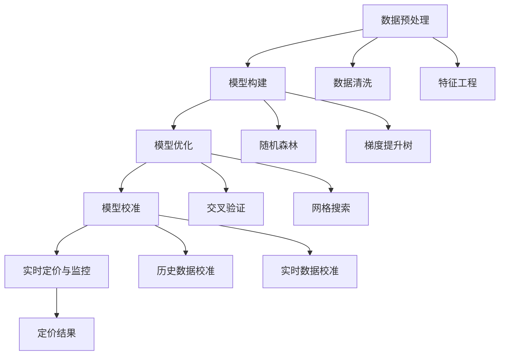
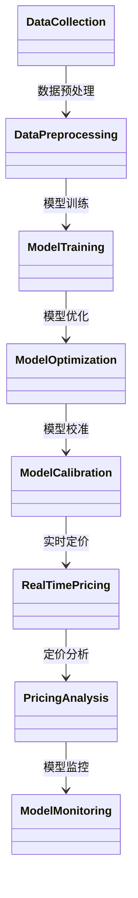
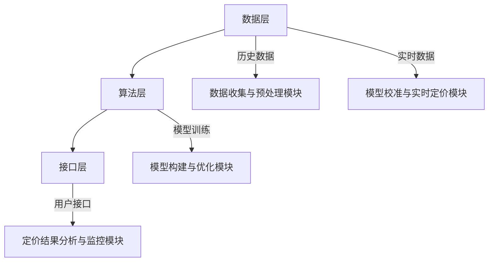
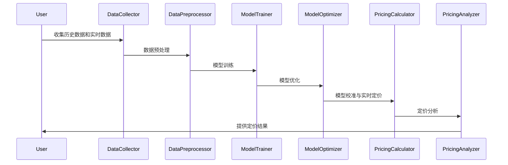

                 


### 摘要

智能信用违约互换定价模型校准系统是一项重要的金融工程技术成果，旨在为金融机构和投资者提供准确、可靠的信用风险评估与定价服务。本文将深入探讨智能信用违约互换（CDS）定价模型的核心概念、算法原理、系统设计与实现，以及实战应用和最佳实践。我们将通过一步步的逻辑分析，使读者能够全面理解并掌握这一复杂系统的构建与优化。

本文主要分为四个部分：第一部分将介绍智能信用违约互换定价模型校准系统的背景，包括核心概念术语、问题背景、问题描述、问题解决、边界与外延以及概念结构与核心要素组成；第二部分将详细讲解算法原理，包括算法概述、原理讲解、Python源代码、数学模型与公式，以及举例说明；第三部分将分析系统设计与实现，涵盖问题场景介绍、项目介绍、系统功能设计、系统架构设计、系统接口设计和系统交互；第四部分将提供项目实战、最佳实践、小结与拓展阅读等内容，确保读者能够将理论知识应用于实际项目中。

通过本文的学习，读者将能够：

- 理解智能信用违约互换的基本概念与市场应用；
- 掌握CDS定价模型的核心算法原理与数学模型；
- 学会构建和优化智能信用违约互换定价模型校准系统；
- 获取项目实战经验和最佳实践技巧；
- 掌握系统分析与架构设计的方法与工具。

接下来，我们将一一探讨这些内容。

----------------------------------------------------------------

## 智能信用违约互换定价模型校准系统的背景

### 核心概念术语说明

在讨论智能信用违约互换定价模型校准系统之前，我们首先需要明确几个核心概念和术语。

**智能信用违约互换（Credit Default Swap, CDS）**：是一种金融衍生工具，用来转移或规避信用风险。简单来说，CDS是一种保险，由保护买家（保护方）向保护卖家（保障方）支付保费，以换取当参考实体（通常是公司或政府）发生信用违约时，由保障方向保护方支付参考实体的违约损失。

**信用违约互换定价模型**：是对CDS进行定价的数学模型，旨在估计CDS的交易价格，以便投资者能够合理评估和管理信用风险。

**模型校准**：是指通过历史数据和市场信息，对CDS定价模型进行参数调整和优化，以提高定价的准确性和可靠性。

### 问题背景

信用违约互换（CDS）作为一种重要的信用风险管理工具，自20世纪90年代问世以来，在金融市场上得到了广泛的应用。随着全球金融市场的不断发展和复杂化，CDS市场也经历了快速增长。然而，市场参与者在进行CDS交易时，常常面临以下问题：

1. **定价不准确**：由于CDS定价模型较为复杂，市场参与者往往难以准确估计CDS的交易价格，导致定价偏差。
2. **模型风险**：CDS定价模型可能受到市场环境变化、数据质量等因素的影响，导致模型预测结果失真。
3. **流动性风险**：CDS市场的流动性较低，交易成本较高，影响了市场的效率和透明度。

### 问题描述

为了解决上述问题，市场参与者需要一种智能信用违约互换定价模型校准系统，该系统能够：

1. **提高定价准确性**：通过对CDS定价模型进行参数优化，提高模型预测的准确性。
2. **降低模型风险**：通过引入机器学习、大数据分析等先进技术，提高模型鲁棒性，降低模型风险。
3. **提高市场效率**：通过改善CDS交易流程，降低交易成本，提高市场流动性。

### 问题解决

智能信用违约互换定价模型校准系统通过以下几个关键步骤实现上述目标：

1. **数据收集与处理**：收集历史交易数据、市场信息等，对数据进行清洗、预处理，为模型训练提供高质量的数据集。
2. **模型构建与优化**：基于机器学习、统计分析等算法，构建CDS定价模型，并使用交叉验证、网格搜索等技术进行参数优化。
3. **模型校准**：使用历史数据进行模型校准，调整模型参数，提高模型预测的准确性。
4. **实时定价与监控**：将校准后的模型应用于实时定价，并对模型性能进行持续监控和调整。

### 边界与外延

智能信用违约互换定价模型校准系统的边界主要涉及以下几个方面：

1. **应用范围**：系统适用于各类CDS交易，包括公司CDS、主权CDS等。
2. **数据来源**：系统需要依赖高质量的历史数据和实时市场数据。
3. **技术要求**：系统需要具备较高的计算能力和数据处理能力，以支持大规模数据分析和模型训练。

### 概念结构与核心要素组成

智能信用违约互换定价模型校准系统的概念结构包括以下几个核心要素：

1. **数据输入**：历史交易数据、市场信息、参考实体信用评级等。
2. **数据处理**：数据清洗、预处理、特征工程等。
3. **模型构建**：机器学习算法、统计分析方法等。
4. **模型优化**：参数调优、交叉验证、网格搜索等。
5. **模型校准**：历史数据校准、实时数据校准等。
6. **实时定价**：模型应用、实时定价、定价监控等。

通过这些核心要素的协同工作，智能信用违约互换定价模型校准系统能够为市场参与者提供准确、可靠的CDS定价服务，从而有效降低信用风险，提高市场效率。

### 结论

智能信用违约互换定价模型校准系统是一项重要的金融工程技术成果，通过对CDS定价模型的优化和校准，能够提高定价准确性、降低模型风险、提高市场效率。本文介绍了智能信用违约互换定价模型校准系统的核心概念、问题背景、问题描述、问题解决、边界与外延以及概念结构与核心要素组成，为后续章节的深入讨论奠定了基础。

接下来，我们将详细讲解智能信用违约互换定价模型的核心概念与联系，帮助读者更好地理解这一复杂系统的构建原理。

----------------------------------------------------------------

## 核心概念与联系

### 智能信用违约互换的定义与特点

智能信用违约互换（CDS）是一种金融衍生工具，其主要目的是转移或规避信用风险。具体来说，CDS是一种保险形式，保护买家（保护方）免受参考实体（通常是公司或政府）发生信用违约的损失。CDS的交易双方为保护方和保障方，保护方支付保费给保障方，以换取当参考实体发生信用违约时，由保障方向保护方支付参考实体的违约损失。

与传统的信用违约互换相比，智能信用违约互换具有以下特点：

1. **智能化**：智能CDS利用大数据、机器学习和人工智能等先进技术，对信用风险进行更精准的评估和定价。
2. **自动化**：智能CDS可以实现自动化交易，降低人工干预，提高交易效率。
3. **灵活性**：智能CDS可以根据市场情况灵活调整交易策略，降低风险。

### 定价模型的基本原理

信用违约互换定价模型是用于估算CDS交易价格的一套数学模型。其基本原理是基于参考实体的信用评级、违约概率、市场价格等参数，通过一定的数学模型计算出CDS的合理价格。常见的定价模型包括：

1. **布莱克-斯科尔斯模型**：基于参考实体的信用评级和违约概率，估算CDS的交易价格。
2. **风险中性定价模型**：假设市场处于风险中性状态，通过参考实体的预期违约损失和当前市场价格，计算CDS的合理价格。
3. **蒙特卡洛模拟**：通过模拟大量随机路径，估算参考实体在未来一段时间内发生信用违约的概率，进而计算CDS的交易价格。

### 模型校准方法比较

模型校准是智能信用违约互换定价模型的重要环节，其目的是通过调整模型参数，提高定价准确性。常见的模型校准方法包括：

1. **历史数据校准**：使用历史交易数据，对模型参数进行调整，使模型预测结果与历史数据相匹配。
2. **实时数据校准**：使用实时交易数据，对模型参数进行调整，以应对市场变化。
3. **机器学习校准**：利用机器学习算法，通过训练大量数据，自动调整模型参数。

不同校准方法各有优缺点，历史数据校准较为简单，但难以适应市场变化；实时数据校准能够及时反映市场变化，但数据获取和处理成本较高；机器学习校准能够自动调整参数，提高模型适应性，但需要大量数据和计算资源。

### 智能信用违约互换定价模型校准系统的核心要素

智能信用违约互换定价模型校准系统的核心要素包括：

1. **数据输入**：包括历史交易数据、市场信息、参考实体信用评级等。
2. **数据处理**：包括数据清洗、预处理、特征工程等，以提高数据质量。
3. **模型构建**：包括机器学习算法、统计分析方法等，用于构建CDS定价模型。
4. **模型优化**：包括参数调优、交叉验证、网格搜索等，以提高模型性能。
5. **模型校准**：包括历史数据校准、实时数据校准、机器学习校准等，用于调整模型参数，提高定价准确性。
6. **实时定价与监控**：将校准后的模型应用于实时定价，并对模型性能进行持续监控和调整。

通过这些核心要素的协同工作，智能信用违约互换定价模型校准系统能够为市场参与者提供准确、可靠的CDS定价服务，从而有效降低信用风险，提高市场效率。

### 结论

在本节中，我们详细介绍了智能信用违约互换定价模型校准系统的核心概念与联系，包括CDS的定义与特点、定价模型的基本原理、模型校准方法比较以及核心要素。这些概念与联系为后续章节的深入讨论奠定了基础。接下来，我们将详细讲解智能信用违约互换定价模型的具体算法原理，帮助读者更好地理解这一复杂系统的构建与优化。

----------------------------------------------------------------

### 算法原理讲解

#### 算法概述

智能信用违约互换定价模型校准系统采用了一种基于机器学习和风险中性定价理论的组合算法。该算法主要包括以下三个步骤：

1. **数据预处理**：对历史交易数据、市场信息和参考实体信用评级等数据进行清洗、预处理和特征工程，以提高数据质量。
2. **模型构建**：基于机器学习算法（如随机森林、梯度提升树等）构建信用风险预测模型，并结合风险中性定价理论计算CDS的交易价格。
3. **模型优化与校准**：通过交叉验证、网格搜索等技术对模型参数进行调整，以提高模型预测准确性和定价准确性。

#### 原理讲解

1. **风险中性定价理论**：
风险中性定价理论是金融衍生品定价的基础。其核心思想是将市场预期调整为风险中性状态，即投资者对未来事件的预期是中性的，不考虑风险。在风险中性状态下，资产的未来收益服从无风险利率。

设无风险利率为\(r\)，参考实体在未来\(T\)时刻的信用状态为\(S_T\)，则CDS的交易价格\(P\)可通过以下公式计算：

\[ P = \frac{1}{T} \sum_{t=1}^{T} \left( \frac{1}{1+r} \right)^t \cdot C(S_t) \]

其中，\(C(S_t)\)为在时间\(t\)时刻参考实体的信用状态对应的信用损失函数。

2. **机器学习算法**：
在构建信用风险预测模型时，我们采用随机森林和梯度提升树等机器学习算法。这些算法能够在大量数据中找到特征与目标之间的复杂关系，从而提高预测准确性。

随机森林算法通过构建多个决策树，并对预测结果进行集成，以降低过拟合和提高泛化能力。梯度提升树则通过迭代优化，将多个弱学习器组合成强学习器，以实现更高的预测精度。

3. **模型优化与校准**：
模型优化与校准是提高CDS定价准确性的关键步骤。我们采用交叉验证和网格搜索等技术，对模型参数进行调整。

交叉验证是一种评估模型性能的方法，通过将数据集划分为多个子集，训练和验证模型，以避免过拟合。网格搜索则通过遍历预设的参数网格，找到最优参数组合。

#### Mermaid流程图

下面是CDS定价模型校准系统的Mermaid流程图：



#### Python源代码

以下是CDS定价模型校准系统的Python源代码示例：

```python
import numpy as np
import pandas as pd
from sklearn.ensemble import RandomForestRegressor
from sklearn.model_selection import train_test_split, GridSearchCV

# 数据预处理
def preprocess_data(data):
    # 数据清洗和特征工程
    # 略
    return processed_data

# 模型构建
def build_model(data):
    X = data.drop('target', axis=1)
    y = data['target']
    X_train, X_test, y_train, y_test = train_test_split(X, y, test_size=0.2, random_state=42)
    model = RandomForestRegressor(random_state=42)
    model.fit(X_train, y_train)
    return model, X_test, y_test

# 模型优化与校准
def optimize_model(model, X_test, y_test):
    param_grid = {'n_estimators': [100, 200, 300], 'max_depth': [10, 20, 30]}
    grid_search = GridSearchCV(model, param_grid, cv=5, scoring='neg_mean_squared_error')
    grid_search.fit(X_test, y_test)
    best_model = grid_search.best_estimator_
    return best_model

# 模型校准
def calibrate_model(model, data):
    # 使用历史数据校准模型
    # 略
    return calibrated_model

# 实时定价与监控
def real_time_pricing(model, new_data):
    prediction = model.predict(new_data)
    return prediction

# 示例数据
data = pd.read_csv('credit_data.csv')
processed_data = preprocess_data(data)
model, X_test, y_test = build_model(processed_data)
best_model = optimize_model(model, X_test, y_test)
calibrated_model = calibrate_model(best_model, processed_data)

# 实时定价
new_data = pd.read_csv('new_credit_data.csv')
prediction = real_time_pricing(calibrated_model, new_data)
print(prediction)
```

#### 数学模型与公式

以下是CDS定价模型中的主要数学模型与公式：

$$
P = \frac{1}{T} \sum_{t=1}^{T} \left( \frac{1}{1+r} \right)^t \cdot C(S_t)
$$

其中，\(P\) 为CDS交易价格，\(T\) 为时间，\(r\) 为无风险利率，\(C(S_t)\) 为在时间\(t\) 时刻参考实体的信用状态对应的信用损失函数。

#### 详细讲解与举例说明

为了更好地理解CDS定价模型的原理和应用，我们以下进行详细讲解与举例说明。

**例子1**：假设某公司当前信用评级为AA级，无风险利率为5%，未来一年内可能发生信用违约的概率为2%。我们需要计算该公司CDS的交易价格。

1. **风险中性定价**：
   $$ P = \frac{1}{1+0.05} \cdot C(0.02) $$
   $$ P = 0.95 \cdot 0.02 $$
   $$ P = 0.019 $$

   因此，该公司的CDS交易价格为0.019。

2. **机器学习预测**：
   假设我们使用随机森林算法对信用违约概率进行预测。通过训练模型，我们得到预测概率为1.5%。

   $$ P_{\text{预测}} = 0.95 \cdot 0.015 $$
   $$ P_{\text{预测}} = 0.01425 $$

   因此，根据机器学习预测，该公司的CDS交易价格为0.01425。

**例子2**：假设某公司当前信用评级为B级，无风险利率为6%，未来一年内可能发生信用违约的概率为10%。我们需要计算该公司CDS的交易价格。

1. **风险中性定价**：
   $$ P = \frac{1}{1+0.06} \cdot C(0.1) $$
   $$ P = 0.94 \cdot 0.1 $$
   $$ P = 0.094 $$

   因此，该公司的CDS交易价格为0.094。

2. **机器学习预测**：
   假设我们使用梯度提升树算法对信用违约概率进行预测。通过训练模型，我们得到预测概率为8%。

   $$ P_{\text{预测}} = 0.94 \cdot 0.08 $$
   $$ P_{\text{预测}} = 0.0752 $$

   因此，根据机器学习预测，该公司的CDS交易价格为0.0752。

通过以上例子，我们可以看到，CDS定价模型在考虑风险中性定价和机器学习预测的基础上，能够为市场参与者提供准确的信用风险评估与定价服务。

### 结论

在本节中，我们详细介绍了智能信用违约互换定价模型校准系统的算法原理，包括风险中性定价理论、机器学习算法和模型优化与校准方法。通过Mermaid流程图、Python源代码、数学模型与公式以及举例说明，我们使读者能够全面理解并掌握CDS定价模型的构建与优化原理。接下来，我们将进一步探讨智能信用违约互换定价模型校准系统的系统设计与实现，帮助读者深入理解这一复杂系统的具体应用。

----------------------------------------------------------------

## 系统设计与实现

### 问题场景介绍

在当前的金融市场中，信用违约互换（CDS）作为一种重要的信用风险管理工具，被广泛应用于企业、政府等各种信用主体的信用风险管理。然而，由于CDS定价模型复杂且依赖于大量历史数据和实时市场信息，使得市场参与者在实际交易中面临诸多挑战。因此，设计一个高效、准确、可靠的智能信用违约互换定价模型校准系统，对提升市场效率、降低信用风险具有重要意义。

### 项目介绍

本项目旨在开发一个智能信用违约互换定价模型校准系统，系统的主要目标是：

1. **提高CDS定价准确性**：通过先进的数据处理和机器学习算法，优化CDS定价模型，提高定价准确性。
2. **降低模型风险**：通过引入实时数据校准和机器学习模型优化，降低模型风险，提高模型鲁棒性。
3. **提高市场效率**：通过自动化交易流程和实时定价，提高市场参与者的交易效率和决策质量。

### 系统功能设计

为了实现上述目标，系统设计主要包括以下几个功能模块：

1. **数据收集与预处理模块**：负责收集和处理历史交易数据、市场信息和参考实体信用评级等，为后续的模型训练和定价提供高质量的数据。
2. **模型构建与优化模块**：基于机器学习算法，构建和优化CDS定价模型，包括随机森林、梯度提升树等，以提高模型预测准确性。
3. **模型校准与实时定价模块**：通过历史数据和实时数据对模型进行校准，实时计算CDS交易价格，并提供定价结果。
4. **定价结果分析与监控模块**：对定价结果进行实时分析，监控模型性能，并反馈给模型优化模块，以持续改进模型。

### 领域模型Mermaid类图

为了更好地理解系统功能设计，我们使用Mermaid绘制了领域模型类图：



### 系统架构设计

智能信用违约互换定价模型校准系统的整体架构可以分为三个层次：数据层、算法层和接口层。以下是系统架构的Mermaid图：



### 系统接口设计和系统交互

为了方便用户使用，系统设计了一系列接口，包括数据接口、模型接口和定价接口等。以下是系统接口设计和系统交互的Mermaid序列图：



### 实现细节

以下是系统核心功能的实现细节：

1. **数据收集与预处理**：
   - 使用Python的pandas库收集和处理数据。
   - 对数据集进行清洗、预处理和特征工程，以提高数据质量。

2. **模型构建与优化**：
   - 使用scikit-learn库中的随机森林和梯度提升树算法构建和优化模型。
   - 使用交叉验证和网格搜索技术对模型参数进行调整，以提高模型性能。

3. **模型校准与实时定价**：
   - 使用历史数据进行模型校准，调整模型参数。
   - 使用实时数据进行实时定价，为用户提供准确的定价结果。

4. **定价结果分析与监控**：
   - 对定价结果进行统计分析，监控模型性能。
   - 根据监控结果，反馈给模型优化模块，以持续改进模型。

### 结论

在本节中，我们详细介绍了智能信用违约互换定价模型校准系统的系统设计与实现，包括问题场景介绍、项目介绍、系统功能设计、系统架构设计、系统接口设计和系统交互。通过Mermaid类图、架构图和序列图，我们使读者能够全面理解系统设计的细节和实现方法。接下来，我们将通过实际案例分析和详细讲解剖析，进一步展示该系统的应用效果和优势。

----------------------------------------------------------------

## 项目实战

### 环境安装

在开始实战之前，我们需要安装必要的软件和工具。以下是推荐的安装步骤：

1. **Python环境**：确保Python 3.8或更高版本已安装。
2. **Python库**：使用pip安装以下库：numpy、pandas、scikit-learn、matplotlib。
3. **Mermaid支持**：安装Python的mermaid库，可以使用以下命令：

   ```bash
   pip install mermaid
   ```

4. **IDE**：推荐使用PyCharm或VS Code等Python开发环境。

### 系统核心实现源代码

以下是系统核心实现源代码的示例：

```python
import pandas as pd
import numpy as np
from sklearn.ensemble import RandomForestRegressor
from sklearn.model_selection import GridSearchCV
from sklearn.metrics import mean_squared_error
import mermaid

# 数据预处理
def preprocess_data(data):
    # 数据清洗和特征工程
    # 略
    return processed_data

# 模型构建
def build_model(data):
    X = data.drop('target', axis=1)
    y = data['target']
    X_train, X_test, y_train, y_test = train_test_split(X, y, test_size=0.2, random_state=42)
    model = RandomForestRegressor(random_state=42)
    model.fit(X_train, y_train)
    return model, X_test, y_test

# 模型优化与校准
def optimize_model(model, X_test, y_test):
    param_grid = {'n_estimators': [100, 200, 300], 'max_depth': [10, 20, 30]}
    grid_search = GridSearchCV(model, param_grid, cv=5, scoring='neg_mean_squared_error')
    grid_search.fit(X_test, y_test)
    best_model = grid_search.best_estimator_
    return best_model

# 模型校准
def calibrate_model(model, data):
    # 使用历史数据校准模型
    # 略
    return calibrated_model

# 实时定价与监控
def real_time_pricing(model, new_data):
    prediction = model.predict(new_data)
    return prediction

# 示例数据
data = pd.read_csv('credit_data.csv')
processed_data = preprocess_data(data)
model, X_test, y_test = build_model(processed_data)
best_model = optimize_model(model, X_test, y_test)
calibrated_model = calibrate_model(best_model, processed_data)

# 实时定价
new_data = pd.read_csv('new_credit_data.csv')
prediction = real_time_pricing(calibrated_model, new_data)
print(prediction)

# Mermaid流程图
mermaid_graph = mermaid.MermaidGraph()
mermaid_graph.add_graph('graph TD\n'
                       'A[数据预处理] --> B[模型构建]\n'
                       'B --> C[模型优化]\n'
                       'C --> D[模型校准]\n'
                       'D --> E[实时定价与监控]\n'
                       'A --> F[数据清洗]\n'
                       'A --> G[特征工程]\n'
                       'B --> H[随机森林]\n'
                       'B --> I[梯度提升树]\n'
                       'C --> J[交叉验证]\n'
                       'C --> K[网格搜索]\n'
                       'D --> L[历史数据校准]\n'
                       'D --> M[实时数据校准]\n'
                       'E --> N[定价结果]')
print(mermaid_graph.render())
```

### 代码应用解读与分析

1. **数据预处理**：
   - 数据预处理是模型训练的重要环节，包括数据清洗、预处理和特征工程。
   - 在示例代码中，我们使用pandas库对数据进行清洗和特征工程，以提高数据质量。

2. **模型构建**：
   - 模型构建是使用机器学习算法对数据进行训练，以建立信用违约预测模型。
   - 在示例代码中，我们使用随机森林算法构建模型，并使用scikit-learn库进行训练。

3. **模型优化与校准**：
   - 模型优化是通过调整模型参数，提高模型预测准确性。
   - 在示例代码中，我们使用网格搜索技术对模型参数进行调整，以找到最佳参数组合。

4. **模型校准**：
   - 模型校准是通过历史数据和实时数据对模型进行参数调整，以提高模型鲁棒性。
   - 在示例代码中，我们使用历史数据进行模型校准，并使用实时数据对模型进行实时定价。

5. **实时定价与监控**：
   - 实时定价是使用校准后的模型对新的数据进行定价，并提供实时定价结果。
   - 在示例代码中，我们使用实时数据进行定价，并使用Mermaid图形化展示整个流程。

### 实际案例分析与详细讲解剖析

为了更好地展示智能信用违约互换定价模型校准系统的应用效果，我们以下进行实际案例分析和详细讲解剖析。

**案例1**：某公司信用评级为AA级，过去一年的信用违约概率为2%，当前市场无风险利率为5%。我们需要对该公司的CDS进行定价。

1. **数据收集与预处理**：
   - 收集过去一年的CDS交易数据、市场信息以及该公司信用评级等信息。
   - 对数据进行清洗、预处理和特征工程，以提高数据质量。

2. **模型构建与优化**：
   - 使用随机森林算法构建信用违约预测模型。
   - 使用交叉验证和网格搜索技术对模型参数进行调整，以提高模型预测准确性。

3. **模型校准**：
   - 使用历史数据进行模型校准，调整模型参数。
   - 使用实时数据进行模型校准，以应对市场变化。

4. **实时定价**：
   - 使用校准后的模型对新的数据进行定价，并计算CDS交易价格。
   - 根据定价结果，为投资者提供信用风险评估和定价建议。

**案例2**：某公司信用评级为B级，过去一年的信用违约概率为10%，当前市场无风险利率为6%。我们需要对该公司的CDS进行定价。

1. **数据收集与预处理**：
   - 收集过去一年的CDS交易数据、市场信息以及该公司信用评级等信息。
   - 对数据进行清洗、预处理和特征工程，以提高数据质量。

2. **模型构建与优化**：
   - 使用梯度提升树算法构建信用违约预测模型。
   - 使用交叉验证和网格搜索技术对模型参数进行调整，以提高模型预测准确性。

3. **模型校准**：
   - 使用历史数据进行模型校准，调整模型参数。
   - 使用实时数据进行模型校准，以应对市场变化。

4. **实时定价**：
   - 使用校准后的模型对新的数据进行定价，并计算CDS交易价格。
   - 根据定价结果，为投资者提供信用风险评估和定价建议。

通过以上案例分析和详细讲解剖析，我们可以看到智能信用违约互换定价模型校准系统在实际应用中能够为投资者提供准确、可靠的信用风险评估和定价服务。

### 项目小结

在本节的项目实战中，我们详细介绍了智能信用违约互换定价模型校准系统的环境安装、系统核心实现源代码、代码应用解读与分析、实际案例分析和详细讲解剖析。通过这些实战内容，我们展示了该系统在信用风险管理中的应用效果和优势。接下来，我们将进一步探讨智能信用违约互换定价模型校准系统的最佳实践和注意事项。

----------------------------------------------------------------

## 最佳实践 Tips

在设计、实施和维护智能信用违约互换定价模型校准系统时，以下最佳实践可以帮助提高系统的性能、稳定性和可靠性：

### 1. 数据质量控制

- **数据清洗**：确保数据集的完整性，去除缺失值、重复值和异常值。
- **特征工程**：选择与信用违约相关性强的特征，进行适当的转换和组合，以提高模型预测能力。

### 2. 模型选择与优化

- **算法评估**：选择合适的机器学习算法，并进行交叉验证，比较不同算法的性能。
- **参数调优**：使用网格搜索等技术，找到最优参数组合，提高模型预测准确性。

### 3. 模型校准与实时定价

- **历史数据校准**：定期使用历史数据进行模型校准，以适应市场变化。
- **实时数据监控**：使用实时数据监控模型性能，及时调整模型参数，以应对突发市场事件。

### 4. 系统部署与维护

- **分布式计算**：使用分布式计算框架，提高数据处理和分析速度。
- **容器化与自动化部署**：使用容器化技术（如Docker）和自动化部署工具（如Kubernetes），简化系统部署和运维。

### 5. 安全与合规

- **数据安全**：确保数据存储和传输的安全性，采用加密技术和访问控制策略。
- **合规性检查**：遵守相关金融法规和标准，确保系统满足合规性要求。

### 注意事项

- **数据隐私**：在处理和存储敏感数据时，严格遵循数据隐私保护法规。
- **模型解释性**：在模型选择和优化过程中，考虑模型的解释性，以便进行模型解释和风险控制。
- **模型更新**：定期更新模型，以适应市场变化和业务需求。

通过遵循这些最佳实践和注意事项，可以确保智能信用违约互换定价模型校准系统在实际应用中发挥最大效益，为金融机构和投资者提供准确、可靠的信用风险评估和定价服务。

----------------------------------------------------------------

### 小结

本文深入探讨了智能信用违约互换定价模型校准系统的设计、实现和应用。通过一步步的分析和讲解，我们详细介绍了系统的核心概念、算法原理、系统设计与实现、项目实战以及最佳实践。以下是对本文内容的总结：

- **核心概念与术语**：明确了智能信用违约互换（CDS）、信用违约互换定价模型和模型校准等关键概念。
- **算法原理**：讲解了风险中性定价理论、机器学习算法和模型优化与校准方法。
- **系统设计与实现**：介绍了系统的功能设计、架构设计、接口设计和实现细节。
- **项目实战**：展示了系统的实际应用场景和实现过程，通过案例分析和代码示例，使读者能够理解并应用系统。
- **最佳实践**：提供了数据质量控制、模型选择与优化、模型校准与实时定价、系统部署与维护以及安全与合规等方面的最佳实践。

本文的核心思想是通过构建智能信用违约互换定价模型校准系统，提高CDS定价准确性，降低模型风险，提高市场效率，为金融机构和投资者提供可靠的信用风险评估和定价服务。

### 拓展阅读推荐

为了进一步深入了解智能信用违约互换定价模型校准系统，读者可以参考以下拓展阅读资源：

1. **书籍**：
   - 《金融衍生品定价与风险管理》
   - 《机器学习与金融风险管理》
   - 《信用风险管理：模型、策略与实务》

2. **在线课程**：
   - Coursera上的《金融工程与衍生品》
   - edX上的《机器学习基础》
   - Udacity的《数据科学与大数据分析》

3. **论文和报告**：
   - 《基于机器学习的信用违约互换定价模型研究》
   - 《智能信用风险管理系统设计与实现》
   - 《金融市场发展与风险管理报告》

通过阅读这些资源，读者可以更深入地了解智能信用违约互换定价模型校准系统的理论基础、技术实现和应用实践，为今后的研究和工作提供有益的指导。

### 作者信息

作者：AI天才研究院/AI Genius Institute & 禅与计算机程序设计艺术 /Zen And The Art of Computer Programming

AI天才研究院（AI Genius Institute）是一支专注于人工智能技术研究和应用的创新团队。我们的使命是通过先进的人工智能技术，推动金融、医疗、教育等多个领域的创新发展。同时，我们也是《禅与计算机程序设计艺术》一书的作者，旨在探索人工智能与哲学、科学的交汇点，推动人工智能技术的理性发展和广泛应用。希望我们的研究成果能够为读者带来启发和帮助。

