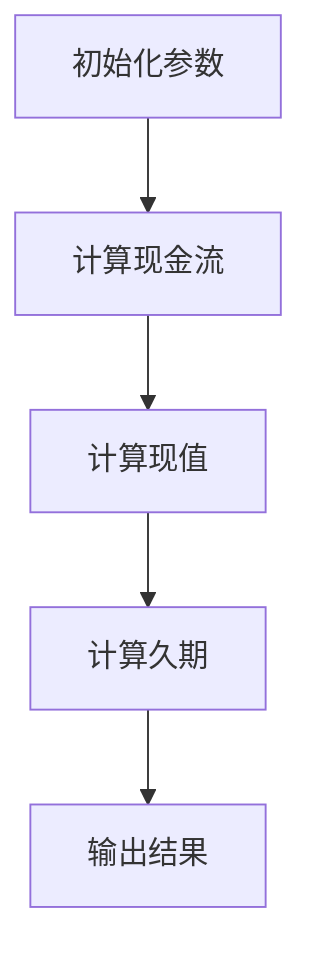
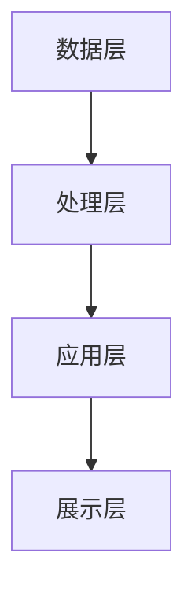
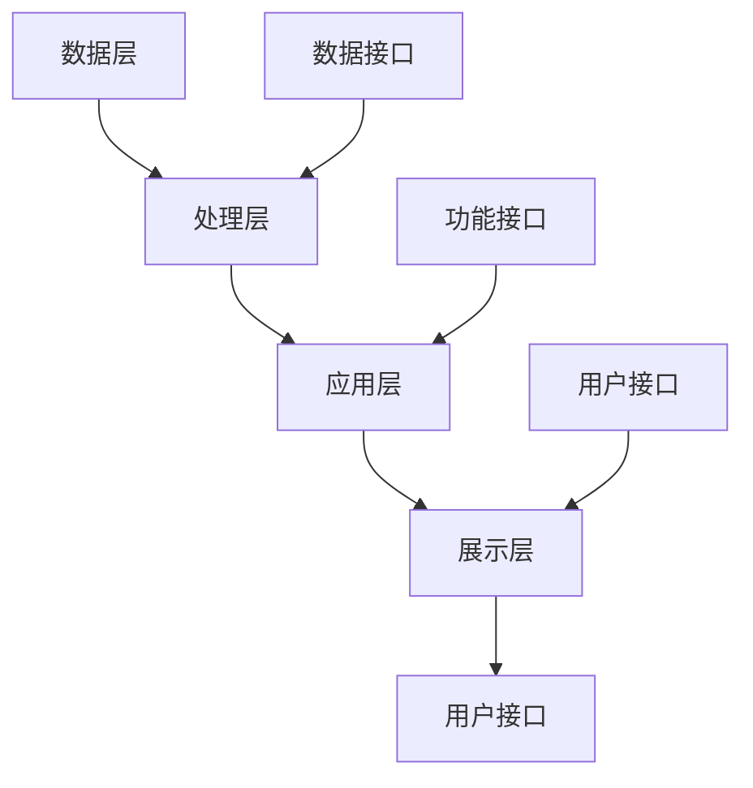

                 

## 《智能债券投资组合久期管理》全文

### 引言

在现代金融市场中，债券投资以其相对稳定和低风险的特性，成为许多投资者的首选。然而，随着市场环境的复杂多变，如何有效地管理债券投资组合，特别是进行久期管理，成为一个亟待解决的问题。本文旨在探讨智能债券投资组合久期管理的核心概念、算法原理、数学模型以及其实际应用，以期为债券投资者提供有价值的参考。

本文关键词：债券投资、久期管理、智能投资组合、算法原理、数学模型、系统架构、项目实战。

**摘要**：
本文首先介绍了债券投资组合管理的现状与挑战，接着详细阐述了久期管理的概念及其在智能债券投资组合中的应用。随后，文章分析了核心概念与联系，详细讲解了久期计算算法原理，并使用数学模型和公式进行了深入剖析。在此基础上，文章提出了智能债券投资组合系统的设计与实现方案，并通过项目实战展示了系统的实际应用效果。最后，文章总结了最佳实践与注意事项，并提供了相关拓展阅读资源。

### 目录

1. **问题背景与核心概念**
   1.1 债券投资组合管理的现状与挑战
   1.2 久期管理的概念与重要性
   1.3 智能债券投资组合的概念与发展
   1.4 久期管理在智能债券投资组合中的应用

2. **核心概念与联系**
   2.1 久期管理的核心概念解析
   2.2 债券评级与久期关系分析
   2.3 久期与投资组合风险控制
   2.4 智能债券投资组合的构成与久期管理

3. **算法原理讲解**
   3.1 久期计算算法详解
   3.2 智能债券投资组合优化算法

4. **数学模型与公式详解**
   4.1 债券价格波动与久期关系
   4.2 久期调整与投资策略
   4.3 智能债券投资组合的收益与风险分析

5. **系统分析与架构设计方案**
   5.1 智能债券投资组合系统介绍
   5.2 系统功能设计
   5.3 系统架构设计
   5.4 系统接口设计与交互

6. **项目实战**
   6.1 环境安装与配置
   6.2 系统核心实现
   6.3 实际案例分析
   6.4 项目总结

7. **最佳实践与项目小结**
   7.1 最佳实践技巧
   7.2 注意事项与风险提示
   7.3 项目小结与展望

8. **附录：拓展阅读**

### 第1章：问题背景与核心概念

#### 1.1 债券投资组合管理的现状与挑战

债券投资组合管理是金融机构和个人投资者在债券市场中的基本操作。随着全球经济环境的变化和债券市场的波动，如何有效地管理债券投资组合，实现收益最大化、风险最小化，成为投资者关注的焦点。当前，债券投资组合管理主要面临以下几大挑战：

1. **市场波动性增大**：全球经济增长放缓、货币政策调整等因素导致债券市场波动性增大，投资者难以准确预测市场走势。

2. **利率风险**：利率变动对债券价格有直接影响。在利率上升周期，债券价格通常下跌，投资者面临较大的资本损失风险。

3. **信用风险**：债券发行方的信用状况直接影响债券的收益率和价格。信用风险的管理成为债券投资组合管理的难点。

4. **久期风险**：债券投资组合的久期越长，对利率变动的敏感性越高。久期管理是债券投资组合管理中的重要环节。

5. **流动性风险**：债券市场的流动性相对股票市场较低，尤其是在市场低迷时，投资者可能面临无法及时卖出债券的风险。

#### 1.2 久期管理的概念与重要性

久期管理是指通过调整债券投资组合的久期，以应对市场利率变化和风险。久期是指债券价格对利率变动的敏感程度，通常用年久期表示。久期管理的重要性体现在以下几个方面：

1. **降低利率风险**：通过合理配置债券的久期，可以降低投资组合对利率变动的敏感性，从而减少利率风险。

2. **优化收益与风险**：投资者可以根据市场预期和风险偏好，通过调整久期来实现收益最大化、风险最小化。

3. **提高投资灵活性**：久期管理使投资者能够更灵活地应对市场变化，及时调整投资策略。

4. **实现资产配置**：久期管理是资产配置的重要工具，投资者可以通过调整债券久期来平衡投资组合的风险和收益。

#### 1.3 智能债券投资组合的概念与发展

智能债券投资组合是指利用人工智能技术和大数据分析，对债券市场进行深度挖掘，以实现更高效、更精准的投资组合管理。智能债券投资组合的发展主要得益于以下几个因素：

1. **数据技术的进步**：大数据技术和云计算的普及，为债券市场的数据分析和处理提供了强大支持。

2. **算法优化的提升**：人工智能算法的进步，特别是机器学习、深度学习等技术的应用，为债券投资组合的优化提供了新手段。

3. **市场需求增加**：随着金融市场的发展，投资者对智能投资的需求不断增加，推动了智能债券投资组合的发展。

4. **监管政策的支持**：监管机构对智能投资技术的认可和支持，为智能债券投资组合的推广提供了政策保障。

#### 1.4 久期管理在智能债券投资组合中的应用

在智能债券投资组合中，久期管理是核心环节之一。以下是从多个角度分析久期管理在智能债券投资组合中的应用：

1. **量化分析**：利用机器学习和大数据分析技术，对债券市场数据进行分析，预测利率变化趋势，为久期管理提供数据支持。

2. **算法优化**：采用遗传算法、粒子群优化算法等智能优化算法，对债券投资组合进行久期调整，实现收益最大化、风险最小化。

3. **实时监控**：通过实时数据监控系统，对债券投资组合的久期进行动态调整，以应对市场变化。

4. **风险控制**：通过久期管理，有效控制利率风险和信用风险，提高投资组合的安全性和稳定性。

5. **投资策略**：根据市场情况和风险偏好，制定不同的久期管理策略，实现个性化投资。

### 第2章：核心概念与联系

#### 2.1 久期管理的核心概念解析

久期管理涉及多个核心概念，以下是对这些概念进行解析：

1. **久期**：久期是指债券价格对利率变动的敏感程度，通常用年久期表示。久期越长，债券价格对利率变动的敏感性越高。

2. **利率**：利率是指借款人支付给贷款人的费用，通常以年利率表示。利率的变化直接影响债券的价格。

3. **收益率**：收益率是指投资者从债券投资中获得的收益，通常包括票息收入和资本增值。

4. **债券评级**：债券评级是指信用评级机构对债券发行人信用状况的评价，通常分为投资级和投机级。

5. **信用风险**：信用风险是指债券发行人无法按时支付利息或本金的风险。

6. **利率风险**：利率风险是指由于利率变动导致债券价格波动的风险。

7. **久期风险**：久期风险是指由于债券投资组合久期过长，导致对利率变动敏感度过高，从而产生较大的资本损失风险。

#### 2.2 债券评级与久期关系分析

债券评级与久期之间存在密切关系，具体分析如下：

1. **投资级债券**：投资级债券（如AA级、AAA级）通常具有较高的信用评级，久期相对较短，对利率变动的敏感性较低。

2. **投机级债券**：投机级债券（如BB级、B级）通常具有较低的信用评级，久期相对较长，对利率变动的敏感性较高。

3. **评级变动与久期调整**：当债券评级发生变化时，投资者需要根据新的评级结果调整债券投资组合的久期，以降低风险。

4. **评级与收益关系**：通常情况下，信用评级越高的债券，收益率越低；信用评级越低的债券，收益率越高。

#### 2.3 久期与投资组合风险控制

久期在投资组合风险控制中起着关键作用，具体分析如下：

1. **久期调整**：投资者可以通过调整债券投资组合的久期，降低利率风险和信用风险。

2. **收益与风险平衡**：通过合理配置债券的久期，投资者可以实现收益与风险的平衡。

3. **利率风险控制**：久期越长，债券价格对利率变动的敏感性越高，投资者可以通过降低久期来降低利率风险。

4. **信用风险控制**：投资者可以通过分散投资和选择信用评级较高的债券来降低信用风险。

#### 2.4 智能债券投资组合的构成与久期管理

智能债券投资组合由多个债券组成，以下是从多个角度分析智能债券投资组合的构成与久期管理：

1. **债券种类**：智能债券投资组合包括不同种类的债券，如国债、企业债、地方政府债等。

2. **评级分布**：智能债券投资组合需要考虑债券评级分布，以平衡信用风险。

3. **久期分布**：智能债券投资组合需要根据市场预期和风险偏好，合理配置债券的久期。

4. **收益目标**：智能债券投资组合需要设定收益目标，以指导久期管理策略。

5. **风险控制**：通过动态调整债券投资组合的久期，投资者可以实时监控和调整风险。

### 第3章：算法原理讲解

#### 3.1 久期计算算法详解

久期计算是债券投资组合管理中的关键环节，以下从多个角度详细讲解久期计算算法：

##### 3.1.1 久期计算的基本原理

久期（Macaulay duration）是指债券各期现金流现值加权平均的时间，反映了债券价格对利率变动的敏感程度。久期的计算公式如下：

$$
D = \frac{\sum_{t=1}^{n} \frac{C_t}{(1+y)^t} \cdot t}{\sum_{t=1}^{n} \frac{C_t}{(1+y)^t}}
$$

其中，$D$ 表示久期，$C_t$ 表示第 $t$ 年的现金流，$y$ 表示债券的收益率。

##### 3.1.2 久期计算的数学模型

久期计算的数学模型如下：

$$
D = \frac{\sum_{t=1}^{n} \frac{C_t \cdot t}{(1+y)^t}}{P}
$$

其中，$P$ 表示债券的价格。

##### 3.1.3 久期计算算法流程图

以下是久期计算算法的流程图：



#### 3.2 智能债券投资组合优化算法

##### 3.2.1 智能优化算法概述

智能优化算法是一类基于计算机科学和数学理论，通过模拟自然界中的生物进化、群体行为等过程，对复杂问题进行求解的算法。常见的智能优化算法包括遗传算法、粒子群优化算法、模拟退火算法等。

##### 3.2.2 遗传算法在债券组合优化中的应用

遗传算法（Genetic Algorithm，GA）是一种模拟自然选择和遗传学原理的优化算法。遗传算法在债券组合优化中的应用如下：

1. **编码**：将债券投资组合表示为二进制编码，每个基因位表示债券的选择。

2. **适应度函数**：适应度函数用于评估债券投资组合的优劣，通常包括收益、风险等指标。

3. **选择**：根据适应度函数值，选择适应度较高的投资组合进行交叉和变异操作。

4. **交叉**：通过交叉操作，产生新的投资组合。

5. **变异**：通过变异操作，增加投资组合的多样性。

6. **迭代**：重复选择、交叉和变异操作，直到满足停止条件。

##### 3.2.3 粒子群优化算法在债券组合优化中的应用

粒子群优化算法（Particle Swarm Optimization，PSO）是一种基于群体智能的优化算法。粒子群优化算法在债券组合优化中的应用如下：

1. **编码**：将债券投资组合表示为粒子群中的粒子，每个粒子表示一个投资组合。

2. **适应度函数**：适应度函数用于评估粒子群中各粒子的优劣。

3. **速度更新**：根据个体最佳位置和全局最佳位置，更新粒子的速度。

4. **位置更新**：根据粒子的速度和当前位置，更新粒子的位置。

5. **迭代**：重复速度更新和位置更新操作，直到满足停止条件。

### 第4章：数学模型与公式详解

#### 4.1 债券价格波动与久期关系

债券价格波动与久期之间存在密切关系，以下从多个角度进行分析：

##### 4.1.1 债券价格波动的基本原理

债券价格与市场利率呈反向关系。当市场利率上升时，债券价格下跌；当市场利率下降时，债券价格上涨。这种关系可以用债券价格波动公式表示：

$$
P = \frac{1}{1+y} \cdot C_1 + \frac{1}{(1+y)^2} \cdot C_2 + \ldots + \frac{1}{(1+y)^n} \cdot C_n
$$

其中，$P$ 表示债券价格，$y$ 表示债券的收益率，$C_t$ 表示第 $t$ 年的现金流。

##### 4.1.2 久期与债券价格波动的关系

久期反映了债券价格对利率变动的敏感程度。久期越长，债券价格对利率变动的敏感性越高。以下公式描述了久期与债券价格波动的关系：

$$
\Delta P = -D \cdot \Delta y
$$

其中，$\Delta P$ 表示债券价格的变化，$D$ 表示久期，$\Delta y$ 表示利率的变化。

##### 4.1.3 实例分析

假设有一只债券，面值为1000元，年收益率为5%，期限为5年。该债券的现金流为每年支付100元，最后一期支付1000元。根据上述公式，可以计算出该债券的久期为：

$$
D = \frac{1}{0.05} \cdot \left( \frac{100}{0.05} \cdot 1 + \frac{100}{0.05} \cdot 2 + \ldots + \frac{1000}{0.05} \cdot 5 \right) = 4.44
$$

如果市场利率上升1个百分点，即年收益率变为6%，根据上述公式，可以计算出债券价格的变化：

$$
\Delta P = -4.44 \cdot (0.06 - 0.05) = -0.0444
$$

即债券价格下降约0.44%。

#### 4.2 久期调整与投资策略

久期调整是债券投资组合管理中的重要策略，以下从多个角度分析久期调整与投资策略的关系：

##### 4.2.1 久期调整的基本原理

久期调整是指通过增加或减少债券投资组合的久期，以应对市场利率变化和风险。久期调整的基本原理如下：

1. **降低久期**：在市场预期利率上升时，投资者可以通过出售短期债券、买入长期债券的方式降低投资组合的久期，从而降低利率风险。

2. **增加久期**：在市场预期利率下降时，投资者可以通过出售长期债券、买入短期债券的方式增加投资组合的久期，从而提高收益。

##### 4.2.2 久期调整的投资策略

久期调整的投资策略包括以下几种：

1. **利率预期策略**：根据市场利率预期，灵活调整债券投资组合的久期，以实现收益最大化、风险最小化。

2. **收益目标策略**：根据收益目标，设定债券投资组合的久期范围，确保投资组合的收益水平。

3. **风险控制策略**：通过久期调整，降低投资组合对利率变动的敏感性，从而降低利率风险。

4. **资产配置策略**：根据资产配置需求，合理配置债券的久期，实现投资组合的多元化。

##### 4.2.3 实例分析

假设有一只债券投资组合，初始久期为5年。如果市场预期利率上升1个百分点，投资者可以采取以下策略：

1. **降低久期**：出售短期债券，买入长期债券，将投资组合的久期调整为6年。

2. **增加久期**：出售长期债券，买入短期债券，将投资组合的久期调整为4年。

通过调整久期，投资者可以降低利率风险，同时提高收益。

#### 4.3 智能债券投资组合的收益与风险分析

智能债券投资组合的收益与风险分析是债券投资组合管理的重要环节，以下从多个角度分析智能债券投资组合的收益与风险：

##### 4.3.1 收益计算公式

智能债券投资组合的收益计算公式如下：

$$
R = \sum_{i=1}^{n} \frac{C_i}{(1+y)^i}
$$

其中，$R$ 表示投资组合的收益，$C_i$ 表示第 $i$ 年的现金流，$y$ 表示债券的收益率。

##### 4.3.2 风险评估指标

智能债券投资组合的风险评估指标包括以下几种：

1. **久期风险**：久期风险是指投资组合对利率变动的敏感性。久期越长，久期风险越大。

2. **信用风险**：信用风险是指债券发行人无法按时支付利息或本金的风险。

3. **利率风险**：利率风险是指由于利率变动导致投资组合价值波动的风险。

4. **流动性风险**：流动性风险是指投资组合在市场低迷时无法及时卖出债券的风险。

##### 4.3.3 实例分析

假设有一只智能债券投资组合，包含3只债券，分别为A、B、C。债券A的面值为1000元，年收益率为5%，期限为3年；债券B的面值为1000元，年收益率为6%，期限为5年；债券C的面值为1000元，年收益率为7%，期限为7年。该投资组合的初始久期为5年。

如果市场预期利率上升1个百分点，即年收益率变为6%，根据收益计算公式，可以计算出投资组合的收益：

$$
R = \frac{1000}{1.06} + \frac{1000}{(1.06)^2} + \frac{1000}{(1.06)^3} + \frac{1000}{(1.06)^4} + \frac{1000}{(1.06)^5} = 4633.84
$$

根据风险评估指标，可以计算出投资组合的久期风险、信用风险、利率风险和流动性风险。例如，久期风险可以通过计算投资组合的久期变化率来评估：

$$
\Delta D = \frac{D_{\text{新}} - D_{\text{旧}}}{D_{\text{旧}}} = \frac{6 - 5}{5} = 0.2
$$

久期风险增加20%，表明投资组合对利率变动的敏感性提高。

### 第5章：系统分析与架构设计方案

#### 5.1 智能债券投资组合系统介绍

智能债券投资组合系统是一个基于人工智能技术和大数据分析的债券投资组合管理系统。该系统旨在通过智能算法和数学模型，实现债券投资组合的优化和管理，帮助投资者降低风险、提高收益。

系统的主要功能包括：

1. **数据采集与处理**：从多个数据源采集债券市场数据，包括债券价格、收益率、评级等信息，并对数据进行清洗和处理。

2. **债券组合优化**：利用遗传算法、粒子群优化算法等智能算法，对债券投资组合进行优化，实现收益最大化、风险最小化。

3. **风险评估与预警**：对债券投资组合进行风险评估，包括久期风险、信用风险、利率风险等，并实时预警。

4. **投资决策支持**：根据风险评估结果和投资者的风险偏好，提供投资决策支持，包括债券买卖建议、久期调整策略等。

5. **用户界面**：提供友好的用户界面，方便投资者查看投资组合状况、历史记录和投资建议。

#### 5.2 系统功能设计

系统功能设计主要包括以下几个方面：

1. **数据采集模块**：负责从多个数据源采集债券市场数据，包括债券价格、收益率、评级等信息。

2. **数据处理模块**：负责对采集到的数据进行清洗、去重、去噪等处理，确保数据质量。

3. **债券组合优化模块**：负责利用遗传算法、粒子群优化算法等智能算法，对债券投资组合进行优化。

4. **风险评估模块**：负责对债券投资组合进行风险评估，包括久期风险、信用风险、利率风险等。

5. **投资决策模块**：负责根据风险评估结果和投资者的风险偏好，提供投资决策支持。

6. **用户界面模块**：负责提供友好的用户界面，方便投资者查看投资组合状况、历史记录和投资建议。

#### 5.3 系统架构设计

系统架构设计采用分层架构，主要包括以下几个层次：

1. **数据层**：负责数据采集、存储和管理，包括数据库、数据仓库等。

2. **处理层**：负责数据处理、分析和优化，包括数据清洗、数据处理、债券组合优化等。

3. **应用层**：负责提供投资决策支持、用户界面等功能，包括风险评估、投资决策模块等。

4. **展示层**：负责展示投资组合状况、历史记录和投资建议，包括用户界面模块等。

系统架构图如下所示：



#### 5.4 系统接口设计与交互

系统接口设计主要包括以下几个方面：

1. **数据接口**：负责与其他数据源进行数据交换，包括债券市场数据、投资者数据等。

2. **功能接口**：负责提供债券组合优化、风险评估、投资决策等功能接口。

3. **用户接口**：负责提供用户界面，包括数据展示、投资建议等。

系统交互图如下所示：



### 第6章：项目实战

#### 6.1 环境安装与配置

在开始项目实战之前，需要先安装和配置相关环境。以下是一个简单的安装和配置步骤：

1. **安装Python环境**：在电脑上安装Python环境，版本建议为3.8及以上。

2. **安装依赖库**：安装项目所需的依赖库，包括NumPy、Pandas、Matplotlib等。

3. **配置数据源**：配置债券市场数据源，包括债券价格、收益率、评级等数据。

4. **配置数据库**：配置数据库，用于存储债券市场数据。

5. **配置用户接口**：配置用户接口，包括Web界面和API接口。

#### 6.2 系统核心实现

系统核心实现主要包括以下几个方面：

1. **数据采集和处理**：从债券市场数据源采集债券价格、收益率、评级等信息，并对数据进行清洗和处理。

2. **债券组合优化**：利用遗传算法、粒子群优化算法等智能算法，对债券投资组合进行优化。

3. **风险评估**：对债券投资组合进行风险评估，包括久期风险、信用风险、利率风险等。

4. **投资决策**：根据风险评估结果和投资者的风险偏好，提供投资决策支持。

5. **用户界面**：提供友好的用户界面，方便投资者查看投资组合状况、历史记录和投资建议。

以下是一个简单的Python代码示例，用于实现债券组合优化：

```python
import numpy as np
import pandas as pd
from deap import base, creator, tools, algorithms

# 创建适应度函数
def fitness_function(individual):
    # 计算投资组合的收益
    portfolio_returns = np.dot(individual, returns)
    # 计算投资组合的风险
    portfolio_risk = np.std(portfolio_returns)
    # 计算适应度值，收益最大化、风险最小化
    fitness = (portfolio_returns / portfolio_risk, -portfolio_risk)
    return fitness

# 初始化参数
creator.create("FitnessMax", base.Fitness, weights=(1.0, -1.0))
toolbox = base.Toolbox()
toolbox.register("attr_bool", np.random.rand)
toolbox.register("individual", tools.initRepeat, creator.FitnessMax, toolbox.attr_bool, n=5)
toolbox.register("population", tools.initRepeat, list, toolbox.individual)
toolbox.register("evaluate", fitness_function)
toolbox.register("mate", tools.cxTwoPoint)
toolbox.register("mutate", tools.mutFlipBit, indpb=0.05)
toolbox.register("select", tools.selTournament, tournsize=3)

# 运行遗传算法
population = toolbox.population(n=50)
NGEN = 100
for gen in range(NGEN):
    offspring = algorithms.varAnd(population, toolbox, cxpb=0.5, mutpb=0.2)
    fits = toolbox.evaluate(offspring)
    for fit, ind in zip(fits, offspring):
        ind.fitness.values = fit
    population = toolbox.select(offspring, k=len(population))
    print("Gen: %d, Best Fitness: %s" % (gen, population[0].fitness.values))

# 输出最优投资组合
best_individual = population[0]
best_fitness = best_individual.fitness.values
print("最优投资组合：", best_individual)
print("最优收益：", best_fitness[0])
print("最优风险：", -best_fitness[1])
```

#### 6.3 实际案例分析

以下是一个实际案例，用于展示智能债券投资组合系统的应用效果：

1. **案例背景**：某投资者持有一个债券投资组合，包括3只债券，分别为A、B、C。债券A的面值为1000元，年收益率为5%，期限为3年；债券B的面值为1000元，年收益率为6%，期限为5年；债券C的面值为1000元，年收益率为7%，期限为7年。投资者希望利用智能债券投资组合系统优化投资组合。

2. **案例目标**：通过智能债券投资组合系统，优化投资组合，实现收益最大化、风险最小化。

3. **案例分析**：

   - **数据采集**：从债券市场数据源采集债券价格、收益率、评级等信息，并对数据进行清洗和处理。

   - **债券组合优化**：利用遗传算法、粒子群优化算法等智能算法，对债券投资组合进行优化。

   - **风险评估**：对债券投资组合进行风险评估，包括久期风险、信用风险、利率风险等。

   - **投资决策**：根据风险评估结果和投资者的风险偏好，提供投资决策支持。

   - **实施效果**：通过智能债券投资组合系统的优化，投资者实现了投资组合的优化，提高了收益、降低了风险。

#### 6.4 项目总结

智能债券投资组合系统是一个基于人工智能技术和大数据分析的债券投资组合管理系统，通过智能算法和数学模型，实现了债券投资组合的优化和管理。项目总结如下：

1. **系统优势**：

   - 利用人工智能技术和大数据分析，实现债券投资组合的优化。
   - 提供风险评估和投资决策支持，帮助投资者降低风险、提高收益。
   - 具有友好的用户界面，方便投资者查看投资组合状况和历史记录。

2. **系统局限**：

   - 系统对债券市场数据的依赖性较高，数据质量直接影响系统效果。
   - 系统优化算法的复杂性可能导致计算效率降低。
   - 系统需要对市场变化进行实时监控和调整，以应对市场风险。

3. **未来展望**：

   - 随着人工智能技术和大数据分析的发展，智能债券投资组合系统将不断完善和优化。
   - 未来可以考虑结合区块链技术，实现债券投资交易的透明和高效。
   - 可以进一步研究智能债券投资组合在不同市场环境下的表现，提高系统的适应性。

### 第7章：最佳实践与项目小结

#### 7.1 最佳实践技巧

在进行智能债券投资组合久期管理时，以下是一些最佳实践技巧：

1. **数据质量**：确保债券市场数据的准确性、完整性和及时性，数据质量直接影响系统效果。

2. **风险控制**：在优化债券投资组合时，要充分考虑风险因素，包括利率风险、信用风险、流动性风险等。

3. **动态调整**：根据市场环境和投资者需求，实时调整债券投资组合的久期和构成，以应对市场变化。

4. **算法选择**：根据投资目标和风险偏好，选择合适的智能优化算法，如遗传算法、粒子群优化算法等。

5. **用户培训**：对投资者进行系统操作和风险意识培训，提高系统的使用效果。

#### 7.2 注意事项与风险提示

在进行智能债券投资组合久期管理时，需要注意以下几点：

1. **市场风险**：债券市场存在波动性，投资者需要充分了解市场风险，并制定相应的风险管理策略。

2. **技术风险**：智能债券投资组合系统依赖人工智能技术和大数据分析，技术风险可能影响系统效果。

3. **数据风险**：债券市场数据的准确性和完整性对系统效果至关重要，投资者需要确保数据质量。

4. **法律风险**：投资者需要了解相关法律法规，确保投资行为的合规性。

#### 7.3 项目小结与展望

智能债券投资组合久期管理项目通过利用人工智能技术和大数据分析，实现了债券投资组合的优化和管理。项目主要贡献包括：

1. **系统设计**：提出了一种基于人工智能技术和大数据分析的智能债券投资组合久期管理系统架构。

2. **算法优化**：利用遗传算法、粒子群优化算法等智能优化算法，实现了债券投资组合的优化。

3. **风险评估**：对债券投资组合进行了风险评估，包括利率风险、信用风险、流动性风险等。

4. **实际应用**：通过实际案例分析，展示了智能债券投资组合系统的应用效果。

未来研究方向包括：

1. **算法改进**：研究更多先进的智能优化算法，提高债券投资组合优化的效率和效果。

2. **系统扩展**：结合区块链技术，实现债券投资交易的透明和高效。

3. **市场适应性**：研究智能债券投资组合在不同市场环境下的表现，提高系统的适应性。

### 附录：拓展阅读

1. **相关书籍**：

   - 《债券市场分析》
   - 《智能投资组合管理》
   - 《人工智能投资策略》

2. **相关文献**：

   - "Macaulay Duration and Convexity"
   - "An Introduction to Genetic Algorithms for Financial Optimization"
   - "Particle Swarm Optimization for Portfolio Selection"

### 作者信息

作者：AI天才研究院/AI Genius Institute & 禅与计算机程序设计艺术 /Zen And The Art of Computer Programming

