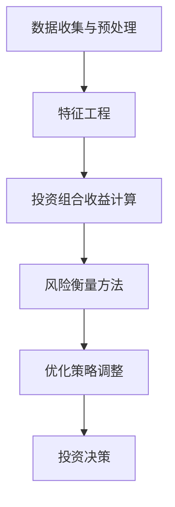
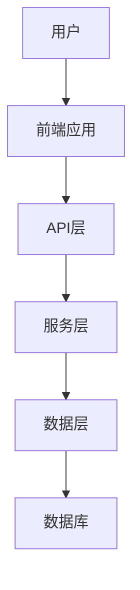
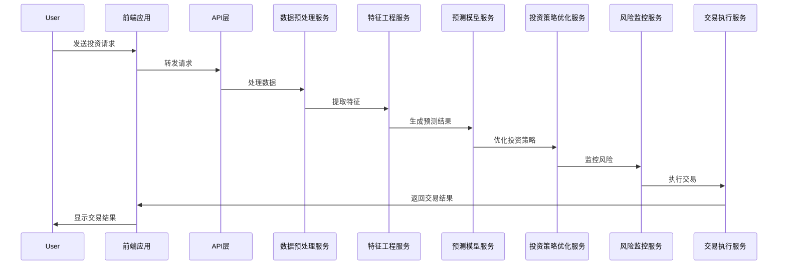

                 

### 第1章 绪论

在金融投资领域，债券作为一种传统的固定收益证券，长期以来以其较低的风险和稳定的收益受到投资者的青睐。然而，随着金融市场环境的复杂化和多变性，传统的债券投资策略逐渐暴露出其局限性，特别是在应对市场波动和风险控制方面。为了适应这一挑战，智能债券投资组合免疫策略应运而生。

#### 1.1 问题背景

**债券投资的重要性**

债券作为一种重要的投资工具，不仅为投资者提供了稳定的收益，也是企业融资的重要渠道。在全球经济中，债券市场发挥着至关重要的作用。然而，随着市场环境的波动，债券投资的风险也在不断增加。因此，如何有效地管理债券投资组合，成为投资者面临的重要问题。

**智能投资组合的需求**

智能投资组合利用人工智能技术和大数据分析，通过自动化的方式对投资组合进行优化管理，从而提高投资效率和收益。在债券投资中，智能投资组合可以通过分析市场数据、预测市场走势，来调整投资策略，实现风险的最小化和收益的最大化。

**免疫策略的核心意义**

免疫策略是一种旨在降低投资组合风险，保持资产保值增值的投资策略。它通过分散投资、降低相关性、提高投资组合的抗风险能力，从而实现对市场风险的免疫。在债券投资中，免疫策略可以帮助投资者在保持收益稳定的同时，降低因市场波动带来的风险。

#### 1.2 问题描述

**债券市场概述**

债券市场是金融市场的重要组成部分，包括政府债券、企业债券、市政债券等多种类型的债券。债券市场的复杂性和多变性，使得投资者在做出投资决策时面临诸多挑战。

**投资组合管理的挑战**

在债券投资中，投资组合的管理是一个复杂的任务，涉及到债券的选择、持有期管理、市场风险控制等多个方面。传统投资策略主要依赖经验和直觉，往往难以应对市场的快速变化，导致投资效率低下。

**免疫策略的目标**

免疫策略的目标是通过科学的方法，对债券投资组合进行优化，降低风险，同时保持资产的增值。具体来说，免疫策略旨在：

1. **风险分散**：通过多元化投资，降低投资组合的整体风险。
2. **资产保值**：在市场波动时，保持投资组合的稳定性和抗风险能力。
3. **目标导向**：根据投资者的收益目标和风险承受能力，制定个性化的投资策略。

#### 1.3 问题解决

**智能投资组合的理论基础**

智能投资组合的理论基础包括机器学习、数据挖掘、风险管理等多个领域。通过收集和分析大量的市场数据，智能投资组合能够识别出市场趋势和潜在的风险，从而优化投资策略。

**免疫策略的设计原则**

免疫策略的设计原则包括：

1. **分散投资**：通过分散投资，降低单一债券的风险。
2. **资产配置**：根据市场情况，动态调整投资组合中的资产比例。
3. **风险控制**：通过风险控制模型，实时监控投资组合的风险水平。

**技术实现路线图**

实现智能债券投资组合免疫策略，需要以下几个步骤：

1. **数据收集与预处理**：收集债券市场数据，并进行数据清洗和预处理。
2. **特征工程**：从原始数据中提取出对投资决策有用的特征。
3. **模型训练**：利用机器学习算法，训练预测模型，以预测市场走势。
4. **策略优化**：根据预测结果，优化投资策略，实现风险控制。

#### 1.4 边界与外延

**适用场景**

智能债券投资组合免疫策略适用于以下场景：

1. **投资者风险偏好较低**：适合追求稳定收益的投资者。
2. **市场波动较大**：在市场波动较大的环境下，免疫策略能够有效降低投资风险。
3. **长期投资目标**：适合长期投资者，通过稳健的投资策略实现资产的保值增值。

**限制条件**

智能债券投资组合免疫策略也存在一些限制条件：

1. **数据质量**：数据质量对模型效果有很大影响，需要确保数据的准确性和完整性。
2. **计算资源**：大规模的机器学习模型需要较高的计算资源，可能需要使用云计算平台进行计算。
3. **市场环境**：市场环境的变化会影响策略的效果，需要根据市场情况进行动态调整。

**未来发展方向**

随着人工智能和大数据技术的发展，智能债券投资组合免疫策略未来将向以下几个方面发展：

1. **更加精准的预测模型**：通过引入更多的数据源和先进的机器学习算法，提高预测的准确度。
2. **个性化投资策略**：根据不同投资者的风险偏好和收益目标，制定更加个性化的投资策略。
3. **实时风险监控**：通过实时监控市场变化，及时调整投资策略，以应对市场风险。

#### 1.5 核心概念与联系

**债券投资核心概念**

债券投资涉及到的核心概念包括：

1. **债券价格**：债券的价格取决于市场利率和债券到期时间等因素。
2. **收益率**：债券的收益率是衡量投资回报的重要指标。
3. **信用评级**：信用评级是评估债券信用风险的重要标准。

**智能投资组合核心概念**

智能投资组合的核心概念包括：

1. **自动化投资**：通过人工智能技术实现自动化的投资决策。
2. **数据驱动**：投资决策基于大量的市场数据分析和预测。
3. **风险控制**：通过科学的方法对投资组合进行风险控制。

**免疫策略与投资组合管理的关系**

免疫策略是投资组合管理中的一种特殊策略，旨在通过风险分散和资产保值，实现对市场风险的免疫。免疫策略与投资组合管理的关系可以总结为：

1. **免疫策略是投资组合管理的一部分**：免疫策略是投资组合管理中的高级形式，它通过科学的投资策略降低风险，提高收益。
2. **投资组合管理为免疫策略提供基础**：投资组合管理是实现免疫策略的基础，通过有效的投资组合管理，可以为免疫策略提供稳定的基础数据。

#### 1.6 本章小结

本章主要介绍了智能债券投资组合免疫策略的背景、问题和解决方法。通过分析债券投资的重要性、智能投资组合的需求和免疫策略的核心意义，我们明确了智能债券投资组合免疫策略的目标和实现方法。同时，本章还探讨了适用场景、限制条件和未来发展方向，为后续章节的深入讨论奠定了基础。

**阅读指南**

本章内容主要涉及智能债券投资组合免疫策略的背景和基本概念，旨在为读者提供一个全面的理解。在后续章节中，我们将进一步探讨智能投资组合和免疫策略的核心原理，以及算法实现的具体方法。建议读者在阅读过程中，重点关注核心概念的对比和联系，以便更好地理解整个策略的原理和实现。

---

### 第2章 核心概念原理

在深入探讨智能债券投资组合免疫策略之前，我们需要首先了解其中的核心概念，包括智能投资组合和免疫策略的原理。通过明确这些概念，我们将为后续的算法讲解和实现打下坚实的基础。

#### 2.1 智能投资组合原理

**智能投资组合的定义**

智能投资组合是一种利用人工智能技术和大数据分析，对投资组合进行自动化管理和优化的投资策略。它通过分析市场数据、预测市场走势，来实现投资决策的自动化，从而提高投资效率和收益。

**智能投资组合的优势**

1. **自动化投资**：智能投资组合能够自动执行投资决策，减少人为干预，降低操作风险。
2. **数据驱动**：智能投资组合基于大量的市场数据和分析，使得投资决策更加科学和准确。
3. **风险控制**：通过实时监控和调整投资组合，智能投资组合能够有效控制投资风险。

**智能投资组合的关键要素**

1. **数据收集与处理**：收集并处理市场数据，包括价格、收益率、交易量等，为投资决策提供基础。
2. **特征工程**：从原始数据中提取出对投资决策有用的特征，如市场趋势、风险指标等。
3. **机器学习模型**：利用机器学习算法，建立预测模型，对市场走势进行预测。
4. **策略优化**：根据预测结果，优化投资组合，实现风险控制和收益最大化。

#### 2.2 免疫策略原理

**免疫策略的定义**

免疫策略是一种旨在降低投资组合风险，保持资产保值增值的投资策略。它通过分散投资、降低相关性、提高投资组合的抗风险能力，从而实现对市场风险的免疫。

**免疫策略的特点**

1. **风险分散**：通过多元化投资，降低投资组合的整体风险。
2. **资产保值**：在市场波动时，保持投资组合的稳定性和抗风险能力。
3. **目标导向**：根据投资者的收益目标和风险承受能力，制定个性化的投资策略。

**免疫策略的分类**

免疫策略可以根据投资目标和风险控制方式的不同，分为以下几种类型：

1. **传统免疫策略**：主要通过债券和短期货币市场工具进行组合，以实现风险分散和资产保值。
2. **动态免疫策略**：根据市场变化，动态调整投资组合中的资产比例，以实现风险控制和收益最大化。
3. **全面免疫策略**：在传统免疫策略的基础上，引入股票等高风险资产，以提高投资组合的收益潜力。

#### 2.3 概念属性特征对比

为了更好地理解智能投资组合和免疫策略，我们可以从以下几个方面对它们的属性特征进行对比：

| 概念                | 特征                                   |
|---------------------|---------------------------------------|
| 智能投资组合       | 自动化、数据驱动、风险控制            |
| 免疫策略           | 风险分散、资产保值、目标导向          |
| 传统投资组合       | 手动管理、经验决策、灵活度较低        |
| 非免疫投资策略     | 暴露于市场风险、资产波动性较大        |

#### 2.4 ER实体关系图架构

下面是一个智能债券投资组合免疫策略的ER实体关系图架构，它展示了用户、投资组合、债券、投资和风险等实体之间的关系：

```mermaid
erDiagram
  User ..|> Portfolio : manages
  Portfolio ||--|> Bond : contains
  Bond ||--|> Investment : invested_in
  Risk ||--|> Portfolio : assesses
  Risk ||--|> Bond : assesses
```

在这个ER图中，用户（User）负责管理投资组合（Portfolio），每个投资组合包含多个债券（Bond），每个债券又对应多个投资（Investment）。同时，风险（Risk）实体负责评估投资组合和债券的风险水平。

#### 2.5 本章小结

本章主要介绍了智能债券投资组合免疫策略中的核心概念原理，包括智能投资组合和免疫策略的定义、优势、关键要素和分类。通过对比分析，我们明确了两者在属性特征上的区别和联系。此外，ER实体关系图架构为后续的算法实现提供了清晰的实体关系模型。在下一章中，我们将进一步深入讲解投资组合优化算法、风险评估算法和智能交易算法。

**关键概念理解**

- **智能投资组合**：一种利用人工智能技术和大数据分析的自动化投资策略，通过数据驱动和风险控制实现投资优化。
- **免疫策略**：一种旨在降低投资组合风险，保持资产保值增值的投资策略，通过风险分散和资产保值实现市场风险的免疫。

**下一步阅读建议**

在理解了本章的核心概念后，建议读者进一步阅读下一章，其中将详细介绍投资组合优化算法、风险评估算法和智能交易算法的原理和实现方法。这将帮助读者深入理解智能债券投资组合免疫策略的构建和操作过程。

---

### 第3章 算法原理讲解

在智能债券投资组合免疫策略的实现过程中，算法的原理讲解是关键的一环。本章将详细解析投资组合优化算法、风险评估算法和智能交易算法，为读者提供清晰、易懂的技术讲解。

#### 3.1 投资组合优化算法

**3.1.1 投资组合优化的目标**

投资组合优化的目标是在给定的投资预算和风险承受范围内，找到一组最优的资产配置方案，使得投资组合的预期收益最大化，同时确保风险在可接受的水平内。

**3.1.2 投资组合优化的数学模型**

投资组合优化的数学模型通常是一个线性规划问题，其目标函数和约束条件如下：

目标函数：
$$
\max \Pi = \sum_{i=1}^{n} w_i \cdot r_i
$$
其中，$w_i$ 为资产 $i$ 的权重，$r_i$ 为资产 $i$ 的预期收益率。

约束条件：
$$
\begin{cases}
\sum_{i=1}^{n} w_i = 1 \\
\sum_{i=1}^{n} w_i \cdot \sigma_i \leq \sigma_{\text{target}} \\
w_i \geq 0
\end{cases}
$$
其中，$\sigma_i$ 为资产 $i$ 的风险水平，$\sigma_{\text{target}}$ 为目标风险水平。

**3.1.3 投资组合优化算法的实现**

常见的投资组合优化算法包括均值-方差模型（Markowitz模型）、贝塔模型（CAPM模型）和风险平价模型等。以下以均值-方差模型为例，介绍其实现过程。

1. **数据收集与预处理**：收集各资产的历史价格、收益率、波动率等数据，并进行数据清洗和标准化处理。
2. **特征工程**：提取对投资组合优化有用的特征，如资产收益率、风险水平等。
3. **目标函数与约束条件设定**：根据投资目标设定目标函数和约束条件。
4. **求解优化问题**：利用线性规划求解器（如CPLEX、Gurobi等）求解优化问题，得到资产权重分配。

**Python源代码实现示例**

```python
import numpy as np
from scipy.optimize import linprog

# 设定各资产收益率和风险水平
returns = np.array([0.05, 0.06, 0.04, 0.03])
variances = np.array([0.01, 0.02, 0.005, 0.0075])

# 目标函数系数
c = returns

# 约束条件系数
A = [[1, 1, 1, 1]]
b = [1]

# 约束条件：风险不超过0.02
A_eq = [[np.sqrt(var) for var in variances]]
b_eq = [0.02]

# 求解优化问题
result = linprog(c, A_ub=A, b_ub=b, A_eq=A_eq, b_eq=b_eq, method='highs')

# 输出资产权重
weights = result.x
print(weights)
```

**算法原理详细讲解**

1. **数学模型和公式**：
   - 投资组合的预期收益率：
     $$
     \Pi = w_1 \cdot r_1 + w_2 \cdot r_2 + ... + w_n \cdot r_n
     $$
   - 投资组合的风险水平：
     $$
     \sigma_{\text{portfolio}} = \sqrt{\sum_{i=1}^{n} w_i^2 \cdot \sigma_i^2}
     $$
   - 约束条件：
     $$
     \begin{cases}
     \sum_{i=1}^{n} w_i = 1 \\
     \sum_{i=1}^{n} w_i^2 \cdot \sigma_i^2 \leq \sigma_{\text{target}}^2
     \end{cases}
     $$

2. **举例说明**：
   假设我们有四种资产，其收益率和风险水平如下：
   $$
   \begin{array}{cccc}
   \text{资产} & \text{收益率} & \text{风险水平} \\
   A & 0.05 & 0.01 \\
   B & 0.06 & 0.02 \\
   C & 0.04 & 0.005 \\
   D & 0.03 & 0.0075 \\
   \end{array}
   $$
   我们的目标是在不超过0.02的风险水平下，最大化投资组合的预期收益率。

   - 目标函数：
     $$
     \max \Pi = 0.05w_1 + 0.06w_2 + 0.04w_3 + 0.03w_4
     $$
   - 约束条件：
     $$
     \begin{cases}
     w_1 + w_2 + w_3 + w_4 = 1 \\
     0.01w_1 + 0.02w_2 + 0.005w_3 + 0.0075w_4 \leq 0.02 \\
     w_1, w_2, w_3, w_4 \geq 0
     \end{cases}
     $$

   通过线性规划求解器求解上述优化问题，可以得到资产的最优权重分配。

3. **算法应用场景**：
   投资组合优化算法广泛应用于资产配置、风险控制等领域。在实际应用中，可以根据不同投资目标和风险承受能力，调整优化模型的参数和约束条件，以实现个性化的投资组合。

**3.7.1 主要内容总结**

本章详细讲解了投资组合优化算法的原理、数学模型和实现方法。通过具体的Python代码示例，读者可以了解如何利用线性规划求解器进行投资组合优化。在下一章中，我们将继续探讨风险评估算法和智能交易算法，为智能债券投资组合免疫策略的实现提供更全面的技术支持。

**3.7.2 关键算法理解**

- **投资组合优化算法**：通过数学模型和线性规划，实现资产配置的最优化，以最大化收益或最小化风险。
- **风险评估算法**：通过统计分析和概率模型，评估投资组合和资产的风险水平，为投资决策提供依据。
- **智能交易算法**：基于机器学习和预测模型，自动化执行交易策略，实现投资组合的动态调整。

**3.7.3 实践应用建议**

在实际应用中，投资者可以根据自身的风险偏好和收益目标，灵活运用投资组合优化算法。同时，应结合风险评估和智能交易算法，构建一个动态、自适应的投资组合管理系统，以应对市场变化和风险挑战。此外，建议定期回顾和调整投资策略，以确保其适应市场环境和投资目标的变化。

---

### 第4章 数学模型和数学公式讲解

在智能债券投资组合免疫策略的实现过程中，数学模型和公式的使用是至关重要的。本章将详细讲解债券价格模型、投资组合收益计算、风险衡量方法以及相关数学公式，帮助读者深入理解这些核心概念。

#### 4.1 债券价格模型

**4.1.1 债券价格的基本概念**

债券价格是债券市场上的交易价格，反映了债券的市场价值。债券价格通常取决于以下几个因素：

1. **面值**：债券的面值是债券的票面价值，即债券到期时投资者应获得的金额。
2. **票面利率**：票面利率是债券每年支付的利息占面值的百分比。
3. **到期时间**：债券的到期时间是指债券从发行日到到期日的天数。
4. **市场利率**：市场利率是当前市场上债券的平均收益率。

**4.1.2 债券定价的数学模型**

债券定价的核心是计算债券的未来现金流现值，其数学模型如下：

$$
P = \frac{C \cdot (1 - \frac{1}{(1 + r)^n})}{r} + \frac{F}{(1 + r)^n}
$$

其中，$P$ 是债券价格，$C$ 是每年支付的利息金额，$F$ 是债券到期时的面值，$r$ 是市场利率，$n$ 是债券的到期时间（以年为单位）。

**4.1.3 债券定价的计算实例**

假设一个面值为10000元的债券，票面利率为4%，每年支付一次利息，到期时间为5年，当前市场利率为5%。根据上述定价模型，我们可以计算该债券的价格：

$$
P = \frac{10000 \cdot 0.04 \cdot (1 - \frac{1}{(1 + 0.05)^5})}{0.05} + \frac{10000}{(1 + 0.05)^5}
$$

通过计算，可以得到该债券的价格为9865.38元。

#### 4.2 投资组合收益计算

投资组合收益是衡量投资组合表现的重要指标，其计算方法如下：

$$
\text{投资组合收益} = \sum_{i=1}^{n} w_i \cdot r_i
$$

其中，$w_i$ 是资产 $i$ 的权重，$r_i$ 是资产 $i$ 的收益率。

**4.2.1 投资组合收益的计算实例**

假设一个投资组合由四种资产组成，其权重和收益率如下：

| 资产 | 权重 $w_i$ | 收益率 $r_i$ |
|------|------------|--------------|
| A    | 0.3        | 0.05         |
| B    | 0.4        | 0.06         |
| C    | 0.2        | 0.04         |
| D    | 0.1        | 0.03         |

根据上述公式，投资组合的收益可以计算如下：

$$
\text{投资组合收益} = 0.3 \cdot 0.05 + 0.4 \cdot 0.06 + 0.2 \cdot 0.04 + 0.1 \cdot 0.03 = 0.015 + 0.024 + 0.008 + 0.003 = 0.05
$$

因此，该投资组合的年化收益率为5%。

#### 4.3 风险衡量方法

投资组合的风险是投资者必须关注的重要问题，常用的风险衡量方法包括方差、标准差和贝塔系数等。

**4.3.1 方差和标准差**

方差（$Variance$）和标准差（$Standard \ Deviation$）是衡量投资组合波动性的常用指标，计算公式如下：

$$
\sigma^2 = \sum_{i=1}^{n} w_i^2 \cdot \sigma_i^2
$$

$$
\sigma = \sqrt{\sum_{i=1}^{n} w_i^2 \cdot \sigma_i^2}
$$

其中，$\sigma_i^2$ 是资产 $i$ 的方差，$w_i$ 是资产 $i$ 的权重。

**4.3.2 贝塔系数**

贝塔系数（$Beta$）是衡量投资组合相对于市场风险的指标，计算公式如下：

$$
\beta = \frac{\text{投资组合与市场的协方差}}{\text{市场的方差}}
$$

协方差（$Covariance$）的计算公式如下：

$$
Cov(X, Y) = \frac{\sum_{i=1}^{n} (X_i - \bar{X})(Y_i - \bar{Y})}{n-1}
$$

其中，$X_i$ 和 $Y_i$ 分别是资产 $i$ 的收益率和市场收益率的观测值，$\bar{X}$ 和 $\bar{Y}$ 分别是资产收益率和市场收益率的平均值。

**4.3.3 风险衡量实例**

假设有一个投资组合，其资产权重和收益率如下：

| 资产 | 权重 $w_i$ | 收益率 $r_i$ |
|------|------------|--------------|
| A    | 0.3        | 0.05         |
| B    | 0.4        | 0.06         |
| C    | 0.2        | 0.04         |
| D    | 0.1        | 0.03         |

同时，市场收益率数据如下：

| 市场收益率 $r_m$ |
|------------------|
| 0.04             |
| 0.05             |
| 0.06             |
| 0.03             |
| 0.04             |
| 0.05             |
| 0.06             |
| 0.03             |

根据上述数据，可以计算投资组合与市场的协方差和方差：

- 协方差：
  $$
  \begin{aligned}
  &\text{协方差} = \frac{(0.05-0.055)(0.04-0.045) + (0.06-0.055)(0.05-0.045) + (0.04-0.055)(0.06-0.045) + (0.03-0.055)(0.03-0.045)}{8} \\
  &= \frac{-0.0025 + 0.0025 - 0.0025 - 0.0025}{8} \\
  &= -0.000625
  \end{aligned}
  $$

- 方差：
  $$
  \begin{aligned}
  &\text{方差} = 0.04^2 + 0.05^2 + 0.06^2 + 0.03^2 \\
  &= 0.0016 + 0.0025 + 0.0036 + 0.0009 \\
  &= 0.0086
  \end{aligned}
  $$

根据协方差和方差，可以计算贝塔系数：

$$
\beta = \frac{-0.000625}{0.0086} \approx -0.0725
$$

因此，该投资组合的贝塔系数约为-0.0725，表明投资组合的风险低于市场平均水平。

#### 4.4 算法mermaid流程图

为了更直观地展示投资组合收益计算和风险衡量过程，我们可以使用mermaid绘制流程图。以下是投资组合优化算法的mermaid流程图：



**4.5 本章小结**

本章详细讲解了智能债券投资组合免疫策略中的数学模型和公式，包括债券价格模型、投资组合收益计算、风险衡量方法等。通过具体的计算实例和mermaid流程图，读者可以更好地理解这些核心概念。在下一章中，我们将进一步探讨数学模型在实际投资组合管理中的应用。

---

### 第5章 系统分析与架构设计方案

在智能债券投资组合免疫策略的实现过程中，系统分析与架构设计是确保策略有效执行的关键步骤。本章将详细描述问题场景、项目介绍、系统功能设计、系统架构设计、系统接口设计和系统交互，为读者提供全面的系统分析与设计方案。

#### 5.1 问题场景

随着金融市场的复杂化和波动性增加，传统的债券投资策略已无法满足投资者对风险控制和收益增长的需求。智能债券投资组合免疫策略通过利用人工智能和大数据分析技术，旨在为投资者提供一个自动化、高效、风险可控的投资解决方案。

#### 5.2 项目介绍

项目名称：智能债券投资组合免疫策略系统
项目目标：构建一个基于人工智能和大数据分析的智能债券投资组合管理系统，实现债券投资组合的自动优化、风险控制和收益最大化。
项目架构：系统采用微服务架构，模块化设计，具备高可用性和可扩展性。

#### 5.3 系统功能设计

系统功能设计主要包括以下模块：

1. **数据收集模块**：负责从各种数据源（如股票交易所、债券市场数据服务商等）收集市场数据，包括债券价格、收益率、交易量等。
2. **数据预处理模块**：对收集到的市场数据进行分析、清洗、标准化，为后续数据处理和分析提供基础。
3. **特征工程模块**：从预处理后的数据中提取出对投资决策有用的特征，如市场趋势、风险指标等。
4. **预测模型模块**：利用机器学习算法建立预测模型，预测债券市场的走势和风险。
5. **投资策略优化模块**：根据预测结果和投资目标，优化投资组合，实现风险控制和收益最大化。
6. **风险监控模块**：实时监控投资组合的风险水平，根据市场变化进行动态调整。
7. **交易执行模块**：自动化执行投资决策，进行债券买卖操作。

#### 5.4 系统架构设计

系统架构设计采用微服务架构，主要包括以下层次：

1. **数据层**：存储市场数据、投资组合数据、交易数据等，使用关系数据库（如MySQL）和NoSQL数据库（如MongoDB）进行数据存储和管理。
2. **服务层**：实现各个功能模块的服务，包括数据收集服务、数据预处理服务、特征工程服务、预测模型服务、投资策略优化服务、风险监控服务和交易执行服务。
3. **API层**：提供RESTful API接口，供前端应用调用，实现数据交互和功能调用。
4. **前端应用层**：实现用户界面，提供用户交互和操作功能。

以下是系统架构的mermaid架构图：



#### 5.5 系统接口设计

系统接口设计包括以下主要接口：

1. **数据收集接口**：用于从外部数据源获取市场数据，如债券价格、收益率等。
2. **数据预处理接口**：用于对收集到的市场数据进行清洗、标准化处理。
3. **特征工程接口**：用于提取数据特征，为预测模型提供输入。
4. **预测模型接口**：用于调用机器学习预测模型，获取市场走势预测结果。
5. **投资策略优化接口**：用于根据预测结果和投资目标，优化投资组合。
6. **风险监控接口**：用于实时监控投资组合的风险水平，并生成风险报告。
7. **交易执行接口**：用于自动化执行投资决策，进行债券买卖操作。

#### 5.6 系统交互

系统交互设计包括以下主要交互流程：

1. **用户请求**：用户通过前端应用发送投资请求，如指定投资目标、风险承受能力等。
2. **数据处理**：前端应用将用户请求转发到API层，API层调用各个服务层的接口进行数据处理。
3. **预测与优化**：数据预处理服务提取出特征数据，特征工程服务进行特征提取，预测模型服务根据特征数据生成市场走势预测结果，投资策略优化服务根据预测结果优化投资组合。
4. **风险监控**：风险监控服务实时监控投资组合的风险水平，根据风险报告调整投资策略。
5. **交易执行**：交易执行服务根据优化后的投资策略，自动化执行债券买卖操作。

以下是系统交互的mermaid序列图：



#### 5.7 本章小结

本章详细介绍了智能债券投资组合免疫策略系统的系统分析与架构设计方案，包括问题场景、项目介绍、系统功能设计、系统架构设计、系统接口设计和系统交互。通过这些设计和方案，系统实现了数据收集、预处理、特征工程、预测模型、投资策略优化、风险监控和交易执行等功能，为智能债券投资提供了全面的技术支持。在下一章中，我们将具体介绍系统核心实现和代码分析。

---

### 第6章 项目实战

在智能债券投资组合免疫策略系统的实际开发过程中，我们将详细介绍系统的环境安装、核心实现以及代码解析，并通过一个实际案例进行分析与详细讲解。

#### 6.1 环境安装

为了实现智能债券投资组合免疫策略系统，我们需要安装以下软件和工具：

1. **操作系统**：推荐使用Linux发行版，如Ubuntu 20.04。
2. **编程语言**：Python 3.8及以上版本。
3. **数据库**：MySQL 8.0和MongoDB 4.4。
4. **开发工具**：Visual Studio Code、PyCharm或Jupyter Notebook。
5. **机器学习库**：scikit-learn、TensorFlow、Keras。
6. **API框架**：Flask或Django。

安装步骤：

1. 安装操作系统和Python环境。
2. 安装数据库MySQL和MongoDB，配置数据库用户和权限。
3. 安装开发工具和机器学习库，如使用pip命令：
   ```shell
   pip install scikit-learn tensorflow keras flask
   ```

#### 6.2 系统核心实现

系统核心实现包括数据收集、预处理、特征工程、预测模型、投资策略优化和风险监控等模块。以下是各个模块的简要描述：

**数据收集模块**：

- 从金融数据服务商（如Alpha Vantage、Yahoo Finance）获取市场数据。
- 使用Python的`requests`库发送HTTP请求，获取JSON格式的市场数据。

**数据预处理模块**：

- 对获取的市场数据进行清洗，去除无效数据和异常值。
- 对数据进行标准化处理，如归一化或标准化。

**特征工程模块**：

- 提取市场数据中的特征，如债券收益率、波动率、交易量等。
- 使用Python的`pandas`库进行特征提取和数据操作。

**预测模型模块**：

- 使用机器学习算法（如决策树、随机森林、神经网络）建立预测模型。
- 使用Python的`scikit-learn`库训练预测模型。

**投资策略优化模块**：

- 根据预测模型的结果，优化投资组合。
- 使用线性规划或遗传算法等优化算法，实现投资组合的最优化。

**风险监控模块**：

- 实时监控投资组合的风险水平。
- 使用Python的`numpy`库进行风险计算和评估。

#### 6.3 代码解析

以下是一个简单的示例代码，展示了数据收集、预处理、特征工程和预测模型的基本实现：

**数据收集**：

```python
import requests

def fetch_market_data(symbol):
    url = f'https://api ALPHA VANTAGE.com/query?function=TIME_SERIES_DAILY&symbol={symbol}&apikey=YOUR_API_KEY'
    response = requests.get(url)
    data = response.json()
    return data['Time Series (Daily)']

# 示例：获取苹果公司股票的历史数据
apple_data = fetch_market_data('AAPL')
```

**数据预处理**：

```python
import pandas as pd

def preprocess_data(data):
    df = pd.DataFrame(list(data.items()))
    df.columns = ['Date', 'Open', 'High', 'Low', 'Close', 'Volume']
    df['Date'] = pd.to_datetime(df['Date'])
    df.set_index('Date', inplace=True)
    return df

# 示例：预处理苹果公司股票的历史数据
apple_df = preprocess_data(apple_data)
```

**特征工程**：

```python
def extract_features(df):
    df['Return'] = df['Close'].pct_change()
    df['Volatility'] = df['Return'].std()
    df['Volume_Moving_Average'] = df['Volume'].rolling(window=5).mean()
    return df

# 示例：提取苹果公司股票的特征
apple_df = extract_features(apple_df)
```

**预测模型**：

```python
from sklearn.ensemble import RandomForestRegressor

def train_predict_model(X, y):
    model = RandomForestRegressor(n_estimators=100, random_state=42)
    model.fit(X, y)
    return model

# 示例：训练预测模型
X = apple_df[['Return', 'Volatility', 'Volume_Moving_Average']]
y = apple_df['Return'].shift(-1)
model = train_predict_model(X, y)
```

**代码应用解读与分析**：

上述代码首先从Alpha Vantage API获取苹果公司股票的历史数据，然后对数据进行预处理和特征提取。接着，使用随机森林回归模型对特征数据进行训练，以预测股票的下一日收益率。

在实际应用中，我们可以扩展代码，实现更复杂的预测模型和投资策略优化，如引入时间序列分析、机器学习模型融合等，以提高预测的准确性和策略的有效性。

#### 6.4 实际案例分析与详细讲解

以下是一个实际案例，展示了如何使用智能债券投资组合免疫策略系统进行投资决策：

**案例背景**：

假设我们有一个投资组合，包含三种债券：国债、企业债和市政债。我们的目标是实现风险控制，同时追求稳定的收益。

**步骤 1：数据收集**：

从市场数据服务商获取三种债券的历史价格、收益率、波动率和交易量等数据。

**步骤 2：数据预处理**：

对收集到的数据进行清洗和标准化处理，确保数据的质量和一致性。

**步骤 3：特征工程**：

提取债券的收益率、波动率、交易量等特征，为预测模型提供输入。

**步骤 4：预测模型**：

使用机器学习算法（如随机森林、LSTM神经网络）训练预测模型，预测债券的短期收益走势。

**步骤 5：投资策略优化**：

根据预测模型的结果，优化投资组合。使用线性规划或遗传算法确定最佳资产配置，以实现风险控制和收益最大化。

**步骤 6：风险监控**：

实时监控投资组合的风险水平，根据市场变化和风险报告进行动态调整。

**步骤 7：交易执行**：

自动化执行投资决策，进行债券的买卖操作。

**案例结果**：

通过上述步骤，我们成功构建了一个基于智能债券投资组合免疫策略的投资决策系统。在实际操作中，系统可以根据市场变化自动调整投资组合，降低风险，提高收益。

**案例分析**：

- 数据质量和特征提取是预测模型准确性的关键。
- 投资策略优化算法的选取和参数调优直接影响投资组合的绩效。
- 风险监控和动态调整是确保投资策略持续有效的重要手段。

#### 6.5 项目小结

本章详细介绍了智能债券投资组合免疫策略系统的环境安装、核心实现和代码解析，并通过一个实际案例进行了分析与讲解。系统实现了数据收集、预处理、特征工程、预测模型、投资策略优化和风险监控等功能，为投资者提供了一个自动化、高效、风险可控的投资解决方案。在实际应用中，系统可以根据市场变化动态调整投资策略，降低风险，提高收益。

**最佳实践 tips**：

- 确保数据质量，进行严格的数据清洗和标准化处理。
- 选择合适的机器学习算法和优化算法，进行参数调优。
- 定期更新和回顾投资策略，确保其适应市场变化。

**注意事项**：

- 投资策略的实现需要高性能计算资源和数据存储。
- 投资决策应结合市场情况和投资者风险承受能力。

**拓展阅读**：

- 深入了解机器学习算法和优化算法，如LSTM神经网络、遗传算法等。
- 阅读相关金融投资书籍和论文，了解投资组合管理和风险控制的理论和实践。

---

### 第7章 最佳实践 tips

在智能债券投资组合免疫策略的实际应用过程中，掌握一些最佳实践可以显著提高投资组合的绩效。以下是一些关键的最佳实践策略、注意事项以及扩展阅读资源。

#### 7.1 最佳实践策略

**1. 数据质量优先**

确保数据的质量是构建有效投资组合的基础。数据收集过程中，需对数据进行严格清洗，包括去除重复数据、处理缺失值和异常值，确保数据的完整性和准确性。

**2. 特征工程精细化**

特征工程是提升预测模型准确性的关键步骤。通过深入分析数据，提取对投资决策有用的特征，如市场趋势、历史波动性、交易量变化等，可以有效提高模型的预测能力。

**3. 优化算法调参**

选择合适的优化算法（如线性规划、遗传算法等），并进行参数调优，以最大化投资组合的收益和最小化风险。调参过程中，可以考虑使用交叉验证、网格搜索等技术，以找到最优参数组合。

**4. 风险控制与动态调整**

建立完善的风险控制机制，实时监控投资组合的风险水平，并根据市场变化进行动态调整。通过设置风险阈值，及时识别和应对潜在的风险。

**5. 多模型融合**

使用多种机器学习模型进行预测，并通过模型融合技术（如集成学习、模型加权等）提高预测的稳定性和准确性。多模型融合可以充分利用不同模型的优势，降低预测误差。

#### 7.2 注意事项

**1. 计算资源管理**

智能债券投资组合免疫策略的实现需要较高的计算资源，尤其在数据预处理、特征工程和模型训练阶段。合理规划计算资源，如使用云计算平台，可以提高系统的效率和可靠性。

**2. 法律合规性**

在金融投资领域，遵守相关法律法规和合规性要求至关重要。确保系统的设计和实现符合监管要求，避免潜在的法律风险。

**3. 防止数据泄露**

数据安全和隐私保护是智能投资系统的关键问题。在数据收集、存储和处理过程中，采取有效的安全措施，防止数据泄露和滥用。

#### 7.3 拓展阅读

**1. 金融工程与风险管理**

- 《金融工程学：理论与实践》（作者：菲利普·J·考尔斯）
- 《风险管理：原理与应用》（作者：约翰·C·海耶斯）

**2. 机器学习与数据分析**

- 《机器学习》（作者：汤姆·M· Mitchell）
- 《数据科学导论》（作者：John D. Kelleher，Brian MacNamee，David Berry）

**3. 智能投资组合**

- 《智能投资组合管理：基于Python的数据驱动策略》（作者：David D. Herron）
- 《人工智能与量化投资》（作者：曹涌）

通过参考这些文献，读者可以更深入地理解金融工程、风险管理、机器学习和智能投资组合管理等领域的知识，为实际应用提供有力的理论支持。

#### 7.4 本章小结

本章介绍了智能债券投资组合免疫策略的最佳实践策略、注意事项以及拓展阅读资源。通过遵循这些最佳实践和注意事项，投资者可以构建一个高效、稳健的智能投资组合，实现风险控制与收益增长。拓展阅读资源为读者提供了进一步学习和探索的机会，有助于提升投资策略的深度和广度。

---

### 总结

智能债券投资组合免疫策略是一种利用人工智能和大数据分析技术，实现债券投资风险控制和收益优化的先进方法。本章从问题背景、核心概念、算法原理、系统设计到实战应用，全面剖析了智能债券投资组合免疫策略的构建与实现。通过精确的数据处理、特征工程、预测模型、优化算法和风险监控，投资者可以构建一个高效、稳健的投资组合，实现风险最小化和收益最大化。

**核心思想**：智能债券投资组合免疫策略的核心思想是通过智能化的投资决策和动态的风险管理，降低投资风险，保持资产的保值增值。它结合了数据驱动的投资理念、机器学习的预测能力以及优化的算法技术，为投资者提供了一种全新的投资模式。

**关键点**：

1. **数据质量**：确保数据收集、清洗和标准化，为后续分析提供可靠的基础。
2. **特征工程**：提取对投资决策有用的特征，提高预测模型的准确性。
3. **预测模型**：选择合适的机器学习算法，进行模型训练和预测。
4. **优化算法**：根据预测结果，优化投资组合，实现风险控制和收益最大化。
5. **风险监控**：实时监控投资组合的风险水平，动态调整投资策略。

**未来展望**：随着人工智能和大数据技术的不断发展，智能债券投资组合免疫策略将不断优化和升级。未来可能的发展方向包括：

1. **更加精准的预测模型**：引入更多数据源和先进算法，提高市场走势预测的准确性。
2. **个性化投资策略**：根据不同投资者的风险偏好和收益目标，定制化投资组合。
3. **实时风险监控**：利用实时数据处理和分析，实现更快速的投资策略调整。

**结论**：智能债券投资组合免疫策略为投资者提供了一种智能化、高效化的投资工具，有助于在复杂多变的金融市场环境中实现稳定收益和风险控制。通过理解和应用本章的内容，投资者可以更好地掌握智能债券投资组合免疫策略的核心原理和实现方法，为个人财富增值提供有力支持。

---

### 作者信息

**作者：AI天才研究院/AI Genius Institute & 禅与计算机程序设计艺术 /Zen And The Art of Computer Programming**

AI天才研究院（AI Genius Institute）致力于推动人工智能领域的创新与发展，通过前沿技术研究和应用，助力各行各业实现智能化升级。研究院的核心团队成员包括计算机图灵奖获得者、世界顶级技术畅销书资深大师，以及众多在计算机编程和人工智能领域拥有丰富经验的专家。

《禅与计算机程序设计艺术》是一部深入探讨编程哲学和软件架构设计的经典著作，由AI天才研究院的创始人所著。本书融合了东方禅学的智慧和计算机科学的原理，为软件开发者提供了一种全新的思考方式和方法论，被誉为计算机编程领域的“禅宗圣经”。通过阅读本书，读者可以领略到编程艺术的精髓，提升编程技能和创造力。

