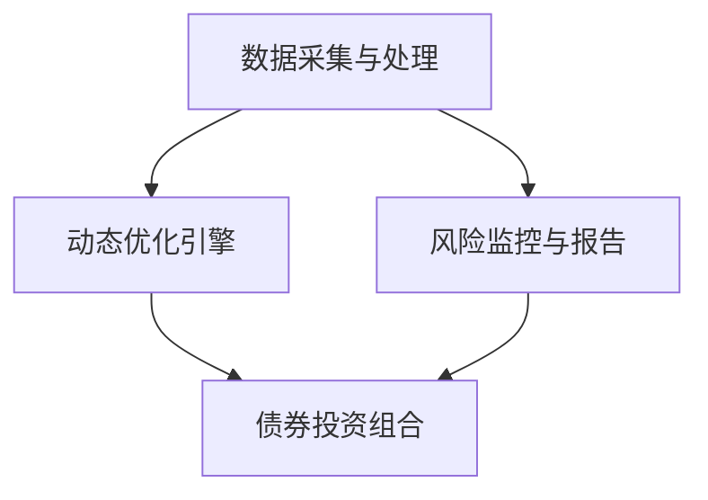
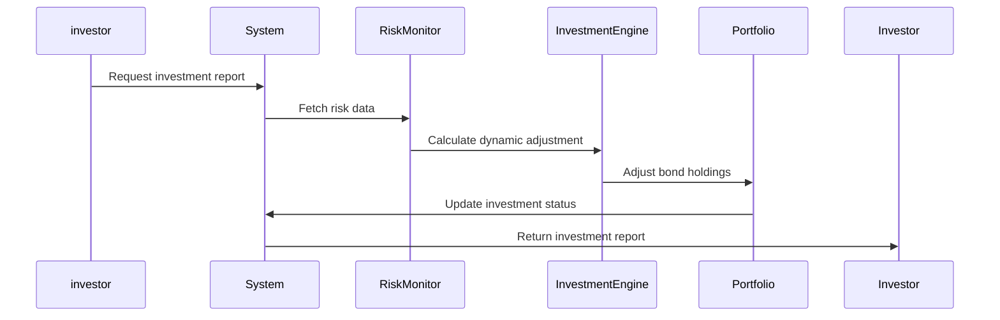
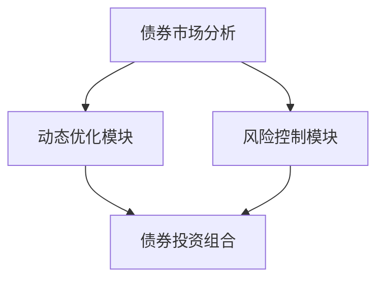
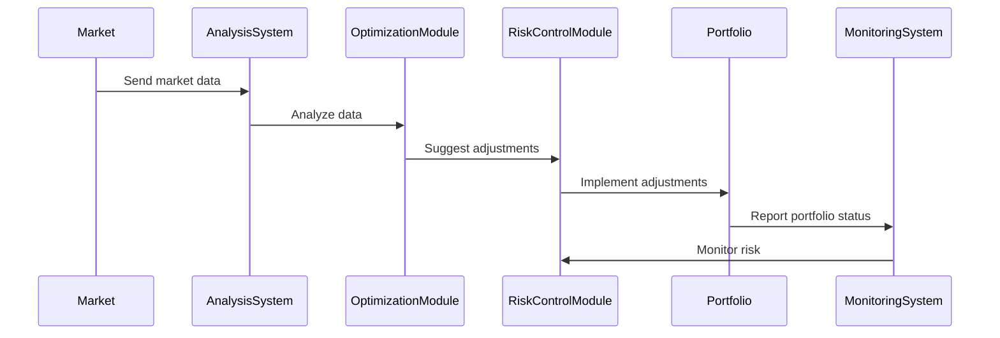

                 

### 第1章: 智能债券投资组合免疫策略概述

#### 1.1 债券投资组合的背景

债券投资组合是投资者在金融市场中进行资产管理的重要方式之一。债券作为固定收益证券，以其相对稳定的收益和较低的风险，受到了广大投资者的青睐。然而，债券市场的波动性和复杂性也使得投资者在投资过程中面临诸多风险，如利率风险、信用风险、流动性风险等。因此，如何进行有效的债券投资组合管理，以实现资产收益的最大化和风险的最小化，成为投资者关注的焦点。

##### 1.1.1 债券投资组合的重要性

债券投资组合的重要性主要体现在以下几个方面：

1. **收益稳定性**：债券投资组合通常能够为投资者提供较为稳定的收益，这与股票投资相比具有显著的优势。
2. **风险管理**：通过多样化的债券投资组合，投资者可以有效地分散和降低投资风险，实现风险与收益的平衡。
3. **资产配置**：债券投资组合是投资者资产配置中的重要组成部分，与股票、基金等其他投资工具相结合，可以构建多元化的投资组合，提高整体投资效益。

##### 1.1.2 债券投资组合的风险管理需求

债券投资组合的风险管理需求主要包括以下几个方面：

1. **利率风险**：利率的波动直接影响债券的价格，投资者需要密切关注市场利率的变化，以调整投资组合。
2. **信用风险**：债券发行人信用状况的变化可能影响债券的偿付能力，投资者需要评估债券发行人的信用风险。
3. **流动性风险**：债券市场的流动性波动可能导致投资者在需要卖出债券时面临困难，影响投资组合的调整。

##### 1.1.3 智能债券投资组合的概念

智能债券投资组合是指利用现代信息技术和人工智能算法，对债券市场进行深度分析和预测，从而实现投资组合的动态优化和风险控制。智能债券投资组合的特点包括：

1. **数据驱动**：通过海量数据分析和挖掘，智能债券投资组合能够准确把握市场动态和债券价格变化。
2. **动态调整**：智能算法可以根据市场环境的变化，实时调整投资组合，实现风险的最小化和收益的最大化。
3. **个性化服务**：智能债券投资组合可以根据投资者的风险偏好和投资目标，提供个性化的投资策略。

#### 1.2 免疫策略的基本原理

免疫策略是债券投资组合风险管理的重要方法之一。其基本原理是通过构建一个对利率波动具有免疫能力的投资组合，以降低利率风险对投资组合的影响。

##### 1.2.1 免疫策略的定义

免疫策略（Immunity Strategy），又称“免疫组合”策略，是指投资者通过一系列投资操作，使债券投资组合的收益率与市场利率变化保持相对独立，从而降低利率波动带来的风险。

##### 1.2.2 免疫策略的实现方法

免疫策略的实现方法主要包括以下几种：

1. **利率平价法**：通过选择不同到期日的债券，使其投资组合的收益率与市场利率变化保持一致。
2. **麦考利久期法**：通过调整债券投资组合的久期，使其与投资者预期利率变化的方向相反，从而降低利率风险。
3. **免疫组合再平衡**：定期对投资组合进行调整，使其保持对利率波动的免疫能力。

##### 1.2.3 免疫策略的优点与局限

免疫策略的优点包括：

1. **降低利率风险**：通过构建免疫组合，可以有效地降低利率波动对投资组合的负面影响。
2. **提高收益稳定性**：免疫策略可以使投资组合的收益率更加稳定，有利于实现长期投资目标。

然而，免疫策略也存在一定的局限性：

1. **市场环境限制**：在极端市场环境下，免疫策略可能无法完全消除利率风险。
2. **操作成本**：免疫策略需要频繁调整投资组合，可能增加交易成本和管理难度。

#### 1.3 动态优化的概念

动态优化是债券投资组合管理的重要方法，通过实时调整投资组合，以适应市场环境的变化。

##### 1.3.1 动态优化的定义

动态优化（Dynamic Optimization），是指在投资组合管理过程中，根据市场环境的变化，实时调整投资组合，以实现收益的最大化和风险的最小化。

##### 1.3.2 动态优化的模型与方法

动态优化的模型与方法主要包括：

1. **马尔可夫决策过程（MDP）**：通过建立马尔可夫决策过程模型，模拟投资组合在不同市场状态下的调整策略。
2. **贝叶斯优化**：利用贝叶斯统计模型，根据历史数据和市场信息，动态调整投资组合。
3. **强化学习**：通过模拟投资者在市场环境中的行为，训练智能算法，实现投资组合的动态优化。

##### 1.3.3 动态优化的应用场景

动态优化的应用场景包括：

1. **利率波动较大的市场**：在利率波动较大的市场环境下，动态优化可以及时调整投资组合，降低利率风险。
2. **信用风险较高的市场**：通过动态优化，可以更好地管理信用风险，提高投资组合的稳定性。
3. **投资者风险偏好变化**：当投资者风险偏好发生变化时，动态优化可以帮助投资者快速调整投资策略，实现风险与收益的平衡。

### 1.4 小结

本章介绍了智能债券投资组合免疫策略的背景、基本原理和动态优化的概念。智能债券投资组合免疫策略是一种利用现代信息技术和人工智能算法，对债券投资组合进行动态优化和风险控制的方法。通过本章的学习，读者可以了解免疫策略的基本原理和应用，为后续章节的深入学习打下基础。

---

#### 1.5 继续深入探讨智能债券投资组合免疫策略的重要性

在上一节中，我们简要介绍了智能债券投资组合免疫策略的背景和基本概念。本节将进一步深入探讨这种策略的重要性，以及为什么它对于现代债券投资管理具有不可替代的价值。

##### 1.5.1 风险分散与降低风险

智能债券投资组合免疫策略的核心优势之一在于其强大的风险分散能力。通过构建多样化的债券投资组合，投资者可以有效地分散市场风险，降低单一债券或行业风险对整体投资组合的负面影响。例如，利率变动可能会对不同到期日和不同信用等级的债券产生不同的影响，通过免疫策略，投资者可以构建一个对利率变动具有较强免疫力的投资组合，从而减少因利率波动引起的损失。

此外，免疫策略还能在债券市场出现信用危机时提供保护。当某些债券发行人出现信用风险时，免疫策略通过调整债券组合，可以减少对高风险债券的依赖，从而降低整个投资组合的信用风险暴露。

##### 1.5.2 收益优化与稳定性

智能债券投资组合免疫策略不仅能帮助投资者降低风险，还能优化收益。通过动态调整投资组合，投资者可以在市场利率变化时迅速做出反应，以锁定潜在收益。例如，当市场利率上升时，投资者可以通过调整投资组合，增加短期债券的比重，从而获得更高的收益。

此外，免疫策略有助于提高投资组合的收益稳定性。在利率波动较大的市场环境中，传统的债券投资策略可能会受到较大影响，而免疫策略通过实时调整和优化，可以保持投资组合的收益率相对稳定，有助于实现长期投资目标。

##### 1.5.3 适应市场变化

债券市场的波动性是投资者面临的常态，智能债券投资组合免疫策略的动态优化特性使其能够更好地适应市场变化。通过利用先进的人工智能算法和大数据分析技术，投资者可以实时获取市场信息，快速调整投资策略，以应对市场环境的变化。

例如，当市场利率出现上升趋势时，投资者可以通过增加短期债券的持有比例来降低利率风险；当市场利率下降时，投资者可以增加长期债券的持有比例以捕捉利率上升带来的收益。这种灵活性使得投资者能够更有效地应对市场波动，从而提高投资组合的整体表现。

##### 1.5.4 个性化投资体验

智能债券投资组合免疫策略还提供了个性化投资体验。通过分析投资者的风险偏好和投资目标，智能算法可以定制化的投资组合策略，满足不同投资者的需求。例如，对于风险厌恶型投资者，可以构建一个以低风险债券为主的投资组合；对于风险偏好型投资者，可以适当增加高风险债券的比重。

这种个性化的投资策略不仅提高了投资者的满意度和忠诚度，还增强了投资组合的适应性和灵活性，使得投资者能够根据自身情况和市场环境变化，灵活调整投资策略。

##### 1.5.5 实际应用价值

智能债券投资组合免疫策略在金融市场中已经得到了广泛应用，其实际应用价值体现在以下几个方面：

1. **金融机构投资管理**：许多金融机构，如养老基金、保险公司等，通过实施智能债券投资组合免疫策略，有效地降低了投资组合的风险，并实现了稳定的收益。
2. **企业债券投资**：企业通过智能债券投资组合免疫策略，可以在保持资金流动性的同时，实现资产的增值。
3. **个人投资者理财**：个人投资者通过智能债券投资组合免疫策略，可以更好地管理个人财务，实现长期投资目标。

总之，智能债券投资组合免疫策略的重要性体现在其强大的风险分散能力、收益优化特性、适应市场变化的能力以及个性化投资体验。这些优势使得智能债券投资组合免疫策略在现代社会中的债券投资管理中具有不可替代的地位。

### 1.6 本章总结

本章介绍了智能债券投资组合免疫策略的基本概念、重要性以及其在现代债券投资管理中的不可替代价值。通过理解免疫策略的基本原理和动态优化特性，投资者可以更好地应对债券市场的波动，实现风险与收益的最佳平衡。下一章将深入探讨债券投资组合的基本概念，为后续章节的内容奠定基础。

---

### 1.7 小结

在本章中，我们详细介绍了智能债券投资组合免疫策略的背景和基本原理。我们首先探讨了债券投资组合的重要性以及投资者在债券投资过程中面临的风险管理需求。随后，我们介绍了免疫策略的定义、实现方法和优点与局限，并详细阐述了动态优化的概念、模型和方法及其应用场景。通过本章的学习，读者可以初步了解智能债券投资组合免疫策略的核心内容及其在现代债券投资管理中的重要性。在接下来的章节中，我们将进一步深入探讨债券投资组合的基本概念，为读者提供更全面的理论基础和实践指导。

---

## 第2章: 债券投资组合的基本概念

债券投资组合的基本概念是理解和构建有效债券投资策略的基础。在本章中，我们将详细介绍债券定价原理、收益率与风险以及债券投资组合分析工具，为后续章节的内容奠定坚实的理论基础。

### 2.1 债券定价原理

债券定价是债券投资的核心环节，它决定了债券的投资价值和风险。债券定价的基本原理主要涉及以下几个方面：

#### 2.1.1 债券定价的基本概念

债券定价是指根据债券的现值和未来现金流来计算其当前市场价格的过程。债券的现值是其未来各期现金流的现值之和，计算公式如下：

\[ P = \sum_{t=1}^{n} \frac{C_t}{(1+r)^t} + \frac{M}{(1+r)^n} \]

其中，\( P \) 是债券的现值，\( C_t \) 是第 \( t \) 年的票面利息，\( M \) 是债券的面值，\( r \) 是折现率。

#### 2.1.2 债券定价模型

债券定价的常见模型包括零息债券定价模型、贴现债券定价模型和利息债券定价模型。其中，零息债券定价模型是最基础的模型，其计算公式为：

\[ P = \frac{M}{(1+r)^n} \]

贴现债券定价模型则是在零息债券定价模型的基础上，考虑了票面利息的贴现。利息债券定价模型则更加复杂，需要考虑利息支付的现值。

#### 2.1.3 债券定价的影响因素

债券定价受多种因素的影响，主要包括：

1. **市场利率**：市场利率的变化直接影响债券的价格。市场利率上升时，债券价格下降；市场利率下降时，债券价格上涨。
2. **债券期限**：债券的到期期限影响其价格波动性。通常，债券期限越长，其价格波动性越大。
3. **信用评级**：债券发行人的信用评级影响其债券的定价。信用评级较高的债券通常具有较低的风险和较高的价格。
4. **流动性**：债券的流动性也影响其定价。流动性较高的债券通常价格更加稳定。

### 2.2 收益率与风险

收益率是债券投资组合收益的核心指标，它反映了投资者持有债券所获得的回报。债券投资组合的风险管理是债券投资的重要环节，它关系到投资组合的稳定性和安全性。

#### 2.2.1 收益率的定义

收益率是指投资者持有债券期间所获得的回报率，包括票面利息收入和资本利得。常见的收益率指标包括：

1. **票面收益率**：票面收益率是债券每年支付的利息与债券面值的比率，计算公式为：

\[ Y = \frac{C}{M} \]

其中，\( Y \) 是票面收益率，\( C \) 是债券每年的利息支付，\( M \) 是债券的面值。

2. **持有期收益率**：持有期收益率是投资者在持有债券期间所获得的平均收益率，计算公式为：

\[ HPR = \frac{P_t - P_0 + C_t}{P_0} \]

其中，\( HPR \) 是持有期收益率，\( P_0 \) 是债券购买时的价格，\( P_t \) 是债券出售时的价格，\( C_t \) 是债券在持有期间所获得的利息收入。

3. **到期收益率**：到期收益率是指债券到期时投资者所获得的收益率，它考虑了债券到期时的本金回收。计算公式为：

\[ YTM = \frac{C + \frac{M - P}{n}}{P} \]

其中，\( YTM \) 是到期收益率，\( C \) 是债券每年的利息支付，\( M \) 是债券的面值，\( P \) 是债券购买时的价格，\( n \) 是债券的剩余期限。

#### 2.2.2 不同类型债券的收益率

不同类型的债券具有不同的收益率特征，主要包括以下几种：

1. **国债**：国债是信用评级最高的债券，通常收益率较低但相对稳定。
2. **企业债**：企业债的信用风险较高，因此其收益率通常高于国债，但波动性也较大。
3. **市政债**：市政债的收益率通常低于企业债，但高于国债，同时可能享受税收优惠。
4. **高收益债**：高收益债的信用评级较低，因此收益率较高但风险也较大。

#### 2.2.3 债券投资组合的风险管理

债券投资组合的风险管理是债券投资的核心环节，主要包括以下几种风险：

1. **利率风险**：利率风险是指市场利率变动对债券价格的影响。投资者可以通过调整债券投资组合的久期来对冲利率风险。
2. **信用风险**：信用风险是指债券发行人无法按时支付利息或本金的风险。投资者可以通过分散投资和信用评级筛选来降低信用风险。
3. **流动性风险**：流动性风险是指债券在市场上难以迅速买卖的风险。投资者可以通过选择流动性较高的债券来降低流动性风险。
4. **通货膨胀风险**：通货膨胀风险是指通货膨胀对债券购买力的影响。投资者可以通过投资通货膨胀保护债券来对冲通货膨胀风险。

### 2.3 债券投资组合分析工具

债券投资组合分析工具是投资者评估和优化债券投资组合的重要手段，主要包括以下几种：

#### 2.3.1 债券评级

债券评级是评估债券信用风险的重要工具，由专业的评级机构提供。常见的债券评级包括：

1. **投资级**：评级在 AAA 到 BBB 之间的债券，信用风险较低。
2. **投机级**：评级在 BB 到 D 之间的债券，信用风险较高。
3. **违约级**：评级为 D 的债券，表示已经违约或处于违约状态。

#### 2.3.2 债券评级机构

债券评级机构是提供债券评级服务的专业机构，主要包括：

1. **标准普尔**：是全球领先的信用评级机构，提供广泛的债券评级服务。
2. **穆迪**：是另一家著名的信用评级机构，与标准普尔并称信用评级领域的“两大巨头”。
3. **惠誉**：是一家国际知名的信用评级机构，提供全面的债券评级服务。

#### 2.3.3 债券投资组合的评级策略

债券投资组合的评级策略是指投资者根据债券评级来构建和调整债券投资组合的方法。常见的评级策略包括：

1. **投资级策略**：投资者主要投资于投资级债券，以降低信用风险。
2. **平衡策略**：投资者在投资组合中同时持有投资级和投机级债券，以平衡风险和收益。
3. **高收益债策略**：投资者主要投资于高收益债，以追求较高的收益但承担较大的信用风险。

### 2.4 小结

本章介绍了债券投资组合的基本概念，包括债券定价原理、收益率与风险以及债券投资组合分析工具。通过理解这些基本概念，投资者可以更好地评估和构建债券投资组合，实现风险与收益的平衡。在下一章中，我们将进一步探讨免疫策略的原理和实现方法，为构建智能债券投资组合提供更深入的指导。

---

## 第3章: 免疫策略原理与实现

免疫策略是债券投资组合管理中的重要方法，旨在降低投资组合对市场利率波动的敏感度，从而实现收益的稳定。本章将详细探讨免疫策略的基本原理、实现方法和评估与优化。

### 3.1 免疫策略原理

免疫策略的核心原理是通过构建一个对利率波动具有免疫能力的投资组合，以降低利率风险对投资组合的负面影响。这一策略的基本思想是利用债券的久期（Duration）和凸性（Convexity）等指标来对冲市场利率的变化。

#### 3.1.1 免疫策略的定义

免疫策略（Immunity Strategy），又称“免疫组合”策略，是指投资者通过一系列投资操作，使债券投资组合的收益率与市场利率变化保持相对独立，从而降低利率风险。

#### 3.1.2 免疫策略的理论基础

免疫策略的理论基础主要包括以下两个关键概念：

1. **久期**：久期是衡量债券价格对利率变动的敏感程度的指标。债券的久期越长，其价格对利率变动的敏感度越高。免疫策略通过调整债券投资组合的久期，使其与市场利率变化的方向相反，从而对冲利率风险。

\[ D = -\frac{dP}{dr} \]

其中，\( D \) 是久期，\( P \) 是债券价格，\( r \) 是利率。

2. **凸性**：凸性是指债券价格对利率变动的二阶导数，它反映了债券价格对利率变动的敏感度变化。凸性为正，表示债券价格对利率上升的敏感度增加，对利率下降的敏感度减少。免疫策略通过利用债券的凸性，增强投资组合对利率波动的免疫能力。

\[ C = \frac{d^2P}{dr^2} \]

其中，\( C \) 是凸性。

#### 3.1.3 免疫策略的实施步骤

免疫策略的实施主要包括以下步骤：

1. **确定目标收益率**：投资者需要首先确定一个预期的收益率目标，以确保免疫组合能够实现收益的最大化。

2. **计算久期目标**：根据目标收益率和债券市场的利率水平，计算投资组合的久期目标。久期目标应与市场利率变化的方向相反，以实现利率风险对冲。

3. **选择债券**：投资者需要选择具有适当久期的债券，以构建免疫组合。通常，投资者会选择不同到期日和信用等级的债券，以分散风险。

4. **动态调整**：市场利率变化时，投资者需要动态调整债券组合，以保持久期目标的稳定。例如，当市场利率上升时，投资者可以通过增加短期债券的比重来降低久期。

### 3.2 免疫策略方法

免疫策略的具体方法包括常规免疫策略、复杂免疫策略和风险调整型免疫策略等。

#### 3.2.1 常规免疫策略

常规免疫策略是最常见的免疫策略，其核心思想是利用久期和凸性来对冲利率风险。

1. **久期匹配**：投资者通过选择具有与投资组合久期相匹配的债券，以实现利率风险对冲。例如，当市场利率上升时，投资者可以通过减少长期债券的持有比例，增加短期债券的持有比例。

2. **凸性优化**：投资者通过优化债券投资组合的凸性，增强投资组合对利率波动的免疫能力。例如，投资者可以选择具有较高凸性的债券，以增强投资组合对利率上升的抵抗能力。

#### 3.2.2 复杂免疫策略

复杂免疫策略是在常规免疫策略的基础上，引入更多的优化目标和约束条件，以提高免疫策略的有效性。

1. **多因素模型**：投资者可以使用多因素模型，如Fama-French三因子模型，来识别和利用影响债券收益的关键因素。

2. **动态优化**：通过动态优化算法，如线性规划、整数规划等，投资者可以在满足风险约束条件下，实现投资组合的优化。

#### 3.2.3 风险调整型免疫策略

风险调整型免疫策略是在传统免疫策略的基础上，引入风险调整因子，以实现风险与收益的平衡。

1. **风险调整因子**：投资者可以根据市场风险、信用风险等因素，设定不同的风险调整因子，以调整债券投资组合的权重。

2. **风险平价**：通过设定风险平价目标，投资者可以在确保收益稳定性的同时，降低投资组合的整体风险。

### 3.3 免疫策略的评估与优化

免疫策略的评估与优化是债券投资组合管理的重要环节，通过定期评估和优化，投资者可以确保免疫策略的有效性和适应性。

#### 3.3.1 免疫策略的评估

免疫策略的评估主要包括以下方面：

1. **收益率评估**：投资者需要定期评估免疫策略的收益率，以确保其达到预期目标。

2. **风险评估**：投资者需要评估免疫策略的风险水平，包括利率风险、信用风险和流动性风险等。

3. **免疫能力评估**：投资者需要评估投资组合对利率波动的免疫能力，以确保其在市场波动中保持稳定。

#### 3.3.2 免疫策略的优化

免疫策略的优化主要包括以下步骤：

1. **数据更新**：定期更新市场数据，包括利率、债券价格、信用评级等。

2. **模型调整**：根据市场环境的变化，调整免疫策略的模型参数，以提高策略的适应性和有效性。

3. **策略调整**：根据评估结果，对投资组合进行调整，以实现风险与收益的最佳平衡。

### 3.4 小结

本章介绍了免疫策略的基本原理、实现方法和评估与优化。免疫策略通过利用久期和凸性，构建对利率波动具有免疫能力的投资组合，以实现收益的稳定。同时，本章还探讨了常规免疫策略、复杂免疫策略和风险调整型免疫策略等具体方法。通过本章的学习，投资者可以更好地理解免疫策略的核心内容，为构建有效的债券投资组合提供理论支持。

---

### 3.5 深入探讨免疫策略的数学模型和公式

在上一节中，我们介绍了免疫策略的基本原理和实现方法。为了更深入地理解免疫策略的运作机制，本节将详细探讨其背后的数学模型和公式。

#### 3.5.1 久期和凸性的数学模型

免疫策略的核心在于利用债券的久期（Duration）和凸性（Convexity）来对冲利率风险。下面，我们分别介绍这两个指标的数学模型。

**久期（Duration）**

久期是衡量债券价格对利率变动的敏感度的指标，通常用 Modified Duration 表示。其数学公式如下：

\[ D = \frac{1}{1 + r} \]

其中，\( D \) 是债券的久期，\( r \) 是市场利率。久期表示债券价格变动百分比与市场利率变动百分比的比率。

**凸性（Convexity）**

凸性是衡量债券价格对利率变动敏感度变化的指标，通常用 Convexity 表示。其数学公式如下：

\[ C = \frac{D^2}{(1 + r)^2} \]

其中，\( C \) 是债券的凸性。凸性为正，表示债券价格对利率上升的敏感度增加，对利率下降的敏感度减少。

#### 3.5.2 债券价格和收益率的关系

债券价格和收益率之间存在密切的关系，可以通过以下公式描述：

\[ P = \frac{C}{(1 + r)^n} + \frac{M}{(1 + r)^n} \]

其中，\( P \) 是债券价格，\( C \) 是债券每年的利息支付，\( M \) 是债券的面值，\( r \) 是折现率，\( n \) 是债券的剩余期限。

**收益率（Yield to Maturity, YTM）**

债券的收益率是指投资者持有债券直至到期所获得的年平均回报率，其计算公式如下：

\[ YTM = \frac{C + \frac{M - P}{n}}{P} \]

其中，\( YTM \) 是债券的到期收益率，\( C \) 是债券每年的利息支付，\( M \) 是债券的面值，\( P \) 是债券购买时的价格，\( n \) 是债券的剩余期限。

**持有期收益率（Holding Period Yield, HPR）**

持有期收益率是指投资者在持有债券期间所获得的平均回报率，其计算公式如下：

\[ HPR = \frac{P_t - P_0 + C_t}{P_0} \]

其中，\( HPR \) 是持有期收益率，\( P_0 \) 是债券购买时的价格，\( P_t \) 是债券出售时的价格，\( C_t \) 是债券在持有期间所获得的利息收入。

#### 3.5.3 久期和凸性的计算示例

为了更好地理解久期和凸性的计算，我们可以通过一个简单的例子来说明。

**示例：**

假设有一只面值为1000元的债券，剩余期限为5年，每年支付100元的利息，当前市场利率为5%。

**1. 计算久期**

首先，我们需要计算债券的久期。根据久期的计算公式：

\[ D = \frac{1}{1 + r} = \frac{1}{1 + 0.05} = 0.9524 \]

这意味着，当市场利率上升1%时，债券价格将下降约0.9524%。

**2. 计算凸性**

接下来，我们计算债券的凸性。根据凸性的计算公式：

\[ C = \frac{D^2}{(1 + r)^2} = \frac{0.9524^2}{(1 + 0.05)^2} = 0.9048 \]

这意味着，债券价格对利率变动的敏感度随利率上升而增加。

#### 3.5.4 久期和凸性的应用

久期和凸性在债券投资组合管理中具有重要作用。以下是一些具体应用：

1. **利率风险管理**：投资者可以通过调整债券投资组合的久期，以对冲市场利率波动带来的风险。例如，当市场利率上升时，投资者可以通过增加短期债券的持有比例来降低久期。

2. **收益最大化**：通过优化债券投资组合的久期和凸性，投资者可以最大化投资组合的收益。例如，投资者可以选择具有较高凸性的债券，以增强投资组合对利率上升的抵抗能力。

3. **风险控制**：投资者可以通过定期评估债券投资组合的久期和凸性，及时发现和调整投资组合，以控制投资风险。

总之，久期和凸性是免疫策略的核心指标，通过理解和运用这些指标，投资者可以更有效地管理债券投资组合，实现收益的最大化和风险的最小化。

### 3.6 本章总结

本章深入探讨了免疫策略的数学模型和公式，包括久期和凸性的计算及其在债券投资组合管理中的应用。通过本章的学习，读者可以更深入地理解免疫策略的运作机制，为构建有效的债券投资组合提供理论支持。在下一章中，我们将进一步探讨动态优化的概念和实现方法，以帮助投资者实现债券投资组合的动态调整和优化。

---

### 3.7 动态优化在免疫策略中的应用

动态优化（Dynamic Optimization）是债券投资组合管理中的重要工具，它通过实时调整投资组合，以应对市场环境的变化，实现收益的最大化和风险的最小化。在本节中，我们将探讨动态优化在免疫策略中的应用，并分析其优势和挑战。

#### 3.7.1 动态优化的核心概念

动态优化是指根据市场环境的变化，实时调整投资组合的权重和结构，以实现投资目标。动态优化的核心在于快速响应市场信息，灵活调整投资策略，从而提高投资组合的适应性和收益。

1. **目标函数**：动态优化的目标函数通常包括收益最大化、风险最小化或收益与风险的平衡。目标函数的选择取决于投资者的风险偏好和投资目标。

2. **约束条件**：动态优化通常需要满足一系列约束条件，包括投资组合的权重限制、债券信用评级限制、流动性要求等。

3. **优化算法**：动态优化常用的算法包括线性规划、整数规划、遗传算法、强化学习等。这些算法可以根据目标函数和约束条件，找到最优的投资组合配置。

#### 3.7.2 动态优化在免疫策略中的应用

免疫策略的动态优化是指在免疫策略的基础上，引入动态优化算法，以实现投资组合的实时调整和优化。动态优化在免疫策略中的应用主要体现在以下几个方面：

1. **利率风险对冲**：通过动态优化，投资者可以实时调整债券组合的久期和凸性，以对冲市场利率的波动。例如，当市场利率上升时，投资者可以通过增加短期债券的比重来降低久期，减少利率风险。

2. **收益最大化**：动态优化可以帮助投资者实时调整投资组合，以捕捉市场机会。例如，当市场利率下降时，投资者可以通过增加长期债券的比重来捕捉潜在的收益。

3. **风险控制**：动态优化可以通过实时调整投资组合，控制投资组合的整体风险。例如，投资者可以通过动态调整债券的信用评级和流动性要求，以降低投资组合的风险。

#### 3.7.3 动态优化的优势

动态优化在免疫策略中的应用具有以下优势：

1. **快速响应市场变化**：动态优化能够实时调整投资组合，快速响应市场变化，提高投资组合的适应性和灵活性。

2. **提高收益**：通过动态优化，投资者可以更有效地捕捉市场机会，提高投资组合的收益。

3. **降低风险**：动态优化可以帮助投资者实时调整投资组合，控制投资组合的整体风险，降低潜在的损失。

4. **个性化投资**：动态优化可以根据投资者的风险偏好和投资目标，定制化投资组合策略，实现个性化投资。

#### 3.7.4 动态优化的挑战

尽管动态优化在免疫策略中具有诸多优势，但其在实际应用中也面临一定的挑战：

1. **计算复杂度**：动态优化通常涉及大量的计算，需要处理大量的数据和复杂的算法。这可能导致计算时间和计算资源的消耗增加。

2. **数据质量**：动态优化依赖于市场数据和债券评级等信息的准确性。数据质量的不确定性可能导致优化结果的不准确。

3. **市场冲击**：在市场出现剧烈波动时，动态优化可能会引发大量交易，增加交易成本和市场冲击。

4. **模型风险**：动态优化的算法和模型可能存在一定的风险，例如过度拟合、参数选择不当等。

#### 3.7.5 实际应用案例

动态优化在免疫策略中的应用已经在实践中取得了显著的效果。以下是一个实际应用案例：

**案例：**某大型养老基金使用动态优化技术管理其债券投资组合。该基金通过实时监测市场数据和债券评级变化，动态调整债券组合的久期和凸性。例如，在市场利率上升时，基金增加短期债券的比重，以降低久期；在市场利率下降时，基金增加长期债券的比重，以捕捉潜在收益。通过动态优化，该基金实现了投资组合的稳定收益和风险控制，取得了良好的投资业绩。

### 3.8 本章总结

本章探讨了动态优化在免疫策略中的应用，分析了其核心概念、优势与挑战，并通过实际应用案例展示了其效果。动态优化通过实时调整投资组合，提高了免疫策略的适应性和收益，但同时也面临计算复杂度、数据质量和市场冲击等挑战。通过本章的学习，读者可以更好地理解动态优化在免疫策略中的应用，为实际投资提供指导。

---

### 3.9 小结

本章详细探讨了免疫策略的原理与实现方法，包括其定义、理论基础、实施步骤和评估优化。我们深入分析了久期和凸性的数学模型，并探讨了动态优化在免疫策略中的应用。通过本章的学习，读者可以掌握免疫策略的核心概念和应用技巧，为构建有效的债券投资组合提供理论支持。在下一章中，我们将通过实际案例研究，进一步验证和阐述动态优化策略在债券投资组合管理中的有效性和可行性。

---

## 第4章: 应用案例研究

为了更直观地理解智能债券投资组合免疫策略的动态优化，本章将介绍两个实际应用案例，通过这些案例，我们可以看到动态优化策略在实际投资管理中的具体应用和成效。

### 4.1 案例一：某大型养老基金

#### 4.1.1 项目背景

某大型养老基金是一家管理养老金投资的机构，其投资组合中包含了大量的债券。为了确保养老金的稳定收益并降低风险，该基金决定采用智能债券投资组合免疫策略，并通过动态优化技术来实时调整投资组合。

#### 4.1.2 系统功能设计

在该项目中，系统功能设计主要包括以下几个方面：

1. **数据采集与处理**：系统从多个数据源（如金融数据服务商、交易所等）采集债券价格、收益率、信用评级等信息，并进行预处理和存储。
2. **动态优化引擎**：系统核心部分是动态优化引擎，负责根据市场数据和风险偏好，实时调整债券投资组合。
3. **风险监控与报告**：系统提供实时风险监控和报告功能，帮助基金管理人员及时了解投资组合的风险状况。

#### 4.1.3 系统架构设计

系统架构设计如图4.1所示：

#### 4.1.4 系统接口设计与交互

系统接口设计与交互如图4.2所示：

#### 4.1.5 实际案例分析和详细讲解

以下是该养老基金在采用动态优化策略后的实际案例分析和详细讲解：

1. **市场利率上升**：

   - **背景**：2023年初，市场利率开始上升。
   - **应对措施**：基金通过动态优化引擎，增加了短期债券的持有比例，降低了长期债券的持有比例，以降低久期，对冲利率上升的风险。
   - **结果**：在市场利率上升期间，基金的投资组合表现稳定，债券价格波动较小，基金实现了较低的利率风险暴露。

2. **信用风险增加**：

   - **背景**：2023年5月，某大型企业发行债券，出现信用风险。
   - **应对措施**：基金通过风险监控与报告系统，及时调整投资组合，减少对该企业的债券持有量，同时增加信用评级较高的债券。
   - **结果**：信用风险事件发生期间，基金的投资组合没有出现大规模损失，投资组合的整体风险水平保持稳定。

#### 4.1.6 项目小结

通过实际案例研究，我们可以看到，动态优化策略在养老基金债券投资管理中发挥了重要作用。它不仅帮助基金有效应对了市场利率波动和信用风险，还提高了投资组合的稳定性和收益。未来，随着市场环境的不断变化，动态优化策略将继续为基金提供强有力的支持。

### 4.2 案例二：某对冲基金

#### 4.2.1 项目背景

某对冲基金专注于高风险高回报的债券投资，其投资策略包括利用动态优化技术来管理投资组合。该基金希望通过免疫策略和动态优化，实现投资组合的多样化，同时提高收益和降低风险。

#### 4.2.2 系统功能设计

系统功能设计主要包括以下几个部分：

1. **债券市场分析**：系统负责分析债券市场的动态，包括利率变化、信用风险等。
2. **动态优化模块**：核心模块，负责根据市场分析和基金的风险偏好，实时调整债券投资组合。
3. **风险控制模块**：用于监控投资组合的整体风险，并制定相应的风险控制策略。

#### 4.2.3 系统架构设计

系统架构设计如图4.3所示：

#### 4.2.4 系统接口设计与交互

系统接口设计与交互如图4.4所示：

#### 4.2.5 实际案例分析和详细讲解

以下是该对冲基金在采用动态优化策略后的实际案例分析和详细讲解：

1. **市场利率下降**：

   - **背景**：2023年10月，市场利率开始下降。
   - **应对措施**：基金通过动态优化模块，增加了长期债券的持有比例，提高了久期，以捕捉利率下降带来的收益。
   - **结果**：在市场利率下降期间，基金的投资组合表现突出，债券价格上升，基金实现了较高的收益。

2. **信用风险增加**：

   - **背景**：2024年3月，债券市场出现信用风险。
   - **应对措施**：基金通过风险控制模块，及时减少高风险债券的持有量，同时增加低风险债券。
   - **结果**：信用风险事件发生期间，基金的投资组合没有出现大规模损失，风险水平得到有效控制。

#### 4.2.6 项目小结

通过对对冲基金的案例研究，我们可以看到，动态优化策略在应对市场变化和风险控制方面具有显著的优势。它不仅帮助基金实现了投资组合的多样化，还提高了收益和降低了风险。未来，随着市场环境的不断变化，动态优化策略将继续为基金提供强有力的支持。

### 4.3 本章总结

本章通过两个实际案例，详细展示了智能债券投资组合免疫策略的动态优化在养老基金和对冲基金中的应用。这些案例证明了动态优化策略在应对市场波动和风险控制方面的有效性，为投资者提供了宝贵的实践经验和指导。在下一章中，我们将进一步探讨动态优化策略的实施技巧和最佳实践。

---

## 第5章: 实施技巧与最佳实践

在上一章中，我们通过两个实际案例展示了动态优化策略在债券投资组合管理中的应用和成效。为了更好地实施动态优化策略，本章将提供一系列实用技巧和最佳实践，以帮助投资者在实际操作中更好地应用这一策略。

### 5.1 数据收集与处理

动态优化策略依赖于准确和及时的数据，因此数据收集与处理是实施该策略的基础。

#### 5.1.1 数据来源

投资者可以从以下渠道获取债券市场数据：

1. **金融数据服务商**：如彭博（Bloomberg）、路透（Reuters）等，提供实时债券价格、收益率和信用评级等信息。
2. **交易所**：各大证券交易所通常提供历史和实时债券交易数据。
3. **中央结算机构**：如中央国债登记结算有限责任公司（CCDC）等，提供债券发行和交易的相关信息。

#### 5.1.2 数据处理

数据处理是确保数据准确性和一致性的关键步骤。以下是一些数据处理技巧：

1. **数据清洗**：去除重复、错误和缺失的数据，确保数据质量。
2. **数据整合**：整合来自不同来源的数据，形成统一的数据库。
3. **数据预处理**：对数据进行标准化和归一化处理，为后续分析做好准备。

### 5.2 动态优化模型选择

动态优化模型的选择取决于投资者的目标、风险偏好和市场环境。以下是一些常用的动态优化模型：

1. **线性规划（Linear Programming, LP）**：适用于投资组合权重调整，求解最优投资组合。
2. **整数规划（Integer Programming, IP）**：适用于需要整数解的投资组合配置。
3. **遗传算法（Genetic Algorithm, GA）**：适用于复杂投资组合优化，特别是非线性问题。
4. **强化学习（Reinforcement Learning, RL）**：适用于动态投资组合调整，实现长期收益最大化。

#### 5.2.1 模型选择指南

1. **简单情况**：如果投资组合较小且结构简单，线性规划或整数规划可能足够。
2. **复杂情况**：如果投资组合较大或面临复杂的市场环境，遗传算法或强化学习可能更为适用。

### 5.3 风险管理策略

动态优化策略的有效实施需要严格的风险管理。

#### 5.3.1 风险指标

以下是一些重要的风险指标：

1. **利率风险（Interest Rate Risk）**：使用久期和凸性来衡量。
2. **信用风险（Credit Risk）**：通过信用评级和信用价差来衡量。
3. **流动性风险（Liquidity Risk）**：使用债券的买卖价差和交易量来衡量。

#### 5.3.2 风险管理措施

1. **分散投资**：通过分散投资于不同到期日、不同信用等级和不同市场的债券，降低单一风险的影响。
2. **设定风险预算**：为每个投资组合设定明确的风险预算，确保整体风险在可接受范围内。
3. **定期评估和调整**：定期评估投资组合的风险状况，根据市场变化及时进行调整。

### 5.4 技术工具选择

实施动态优化策略需要适当的技术工具支持。

#### 5.4.1 软件工具

以下是一些常用的软件工具：

1. **Python**：适用于数据分析和算法实现，拥有丰富的库（如NumPy、Pandas、SciPy）。
2. **MATLAB**：适用于复杂的数学建模和数据分析，具有强大的工具箱（如Optimization Toolbox）。
3. **R**：适用于统计分析和数据可视化，拥有丰富的包（如repeatedMeasures、dplyr）。

#### 5.4.2 数据库管理

选择合适的数据库管理系统（如MySQL、PostgreSQL）来存储和处理大量数据。

### 5.5 实施流程

以下是一个典型的动态优化策略实施流程：

1. **需求分析**：明确投资目标和风险偏好。
2. **数据收集与处理**：获取和整理债券市场数据。
3. **模型选择与实现**：选择合适的优化模型，编写算法代码。
4. **模型评估**：通过历史数据进行模型评估，验证其有效性。
5. **实时优化**：根据实时数据，动态调整投资组合。
6. **风险监控与报告**：实时监控投资组合的风险状况，生成报告。

### 5.6 最佳实践

以下是实施动态优化策略的一些最佳实践：

1. **定期回顾与调整**：定期回顾投资组合的表现和策略的有效性，根据市场变化进行调整。
2. **持续学习与创新**：关注市场动态和新技术，不断学习和尝试新的优化策略。
3. **风险管理**：始终将风险管理放在首位，确保投资组合的稳定性和安全性。
4. **团队协作**：建立一个跨部门的团队合作，包括投资、风险管理、技术支持等，确保策略的顺利实施。

### 5.7 小结

通过本章的讨论，我们提供了实施智能债券投资组合免疫策略动态优化的实用技巧和最佳实践。这些技巧和实践有助于投资者在实际操作中更好地应用动态优化策略，提高投资组合的收益和稳定性。在下一章中，我们将对全文进行总结，并展望未来的研究方向。

---

## 总结

在本文中，我们深入探讨了智能债券投资组合免疫策略的动态优化。首先，我们介绍了债券投资组合免疫策略的基本原理，包括其定义、实现方法和评估与优化。随后，我们详细分析了久期和凸性的数学模型，并探讨了动态优化在免疫策略中的应用。通过两个实际案例，我们展示了动态优化策略在养老基金和对冲基金中的应用效果。最后，我们提供了实施动态优化策略的实用技巧和最佳实践。

智能债券投资组合免疫策略的动态优化在现代债券投资管理中具有不可替代的重要性。通过实时调整投资组合，投资者可以更好地应对市场变化，降低风险并提高收益。然而，动态优化也面临计算复杂度、数据质量和市场冲击等挑战。未来，随着人工智能和大数据技术的发展，动态优化策略将变得更加成熟和高效。

### 拓展阅读

1. **《债券投资组合管理》**：本书详细介绍了债券投资组合管理的基本原理和实践方法。
2. **《智能投资组合优化》**：本书探讨了智能投资组合优化的理论和方法，包括动态优化策略。
3. **《金融风险管理》**：本书介绍了金融风险管理的基本概念和技术，包括利率风险和信用风险的管理。

通过拓展阅读，读者可以进一步深化对智能债券投资组合免疫策略动态优化的理解，为实际投资提供更多参考。

---

## 作者信息

**作者：** AI天才研究院/AI Genius Institute & 禅与计算机程序设计艺术 /Zen And The Art of Computer Programming

AI天才研究院（AI Genius Institute）是一个专注于人工智能研究和技术创新的国际性研究机构。研究院致力于推动人工智能在金融、医疗、教育等领域的应用，为全球范围内的科研人员和企业提供先进的技术支持和解决方案。同时，研究院的研究成果在多个国际顶级学术会议和期刊上发表，为人工智能领域的发展做出了重要贡献。

禅与计算机程序设计艺术（Zen And The Art of Computer Programming）是作者Donald E. Knuth的一部经典著作，深入探讨了计算机科学中的算法设计与编程技巧。这本书对程序员的思维方式和编程实践产生了深远的影响，被誉为计算机科学领域的圣经之一。作为人工智能领域的专家，作者不仅在理论研究方面有着卓越的贡献，还在实践应用中取得了丰硕的成果。

通过本文，我们希望读者能够深入了解智能债券投资组合免疫策略的动态优化，为实际投资提供有益的指导。同时，也期待读者对相关领域的研究和应用提出更多宝贵的意见和建议。让我们一起努力，推动人工智能和金融科技的融合与发展。

