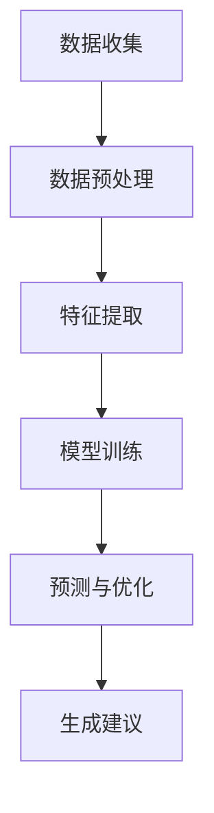
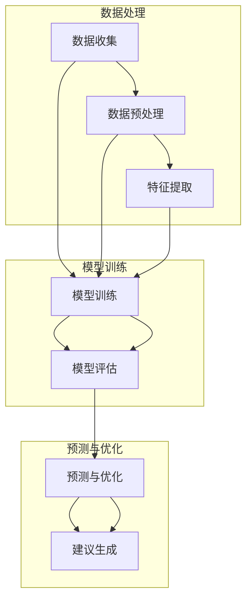
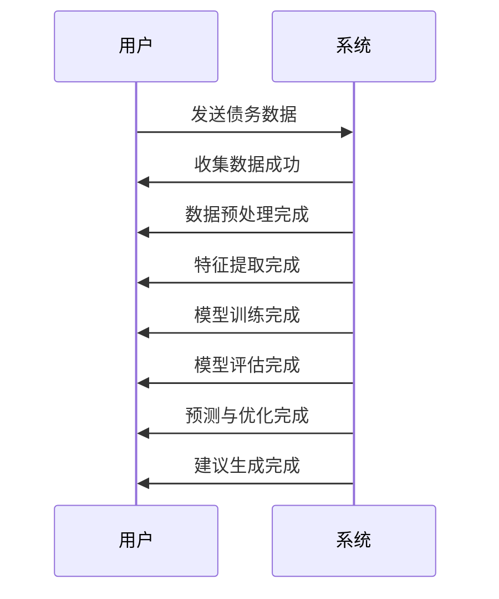

                 

### 《智能债务合并建议生成器》

> **关键词**：智能债务合并、算法原理、系统架构设计、数学模型、Python实现、项目实战、最佳实践

> **摘要**：本文将深入探讨智能债务合并建议生成器的开发和应用。我们将从问题背景出发，逐步分析核心概念与联系，讲解智能债务合并算法原理，介绍数学模型和公式，详细剖析系统分析与架构设计，分享项目实战经验，并提供最佳实践和拓展建议。

----------------------------------------------------------------

#### 第1章：问题背景与意义

**1.1 债务管理的重要性**

债务管理是企业财务管理中至关重要的一个环节。有效的债务管理不仅能帮助企业降低财务成本，还能提高资金使用效率，优化资本结构，增强企业的财务稳健性。在当前经济环境下，企业面临着多种债务形式，如银行贷款、债券、商业信用等，如何合理配置和管理这些债务，成为企业财务决策的重要课题。

**1.2 智能债务合并的概念**

智能债务合并是指通过运用人工智能技术和算法，对企业的多笔债务进行整合，以实现最优的还款计划。智能债务合并的核心在于利用数据分析和机器学习模型，对债务的利息、期限、还款额等进行优化，从而降低整体负债成本，提高还款效率。

**1.3 当前债务管理的挑战**

现有的债务管理方法主要依赖于人工操作和传统的财务软件，存在以下挑战：

- **人工成本高**：债务管理过程中需要大量的财务人员投入时间，导致管理成本高昂。
- **效率低下**：手工处理债务信息耗时耗力，无法快速响应市场变化。
- **信息不对称**：企业内部各部门之间的信息沟通不畅，导致决策效率低下。
- **风险控制不足**：传统方法难以全面评估债务风险，易导致债务违约。

**1.4 智能债务合并建议生成器的应用前景**

智能债务合并建议生成器的应用前景广阔。通过智能算法和数据分析，该系统能够为企业提供以下好处：

- **降低财务成本**：通过智能合并债务，优化还款计划，降低整体负债成本。
- **提高还款效率**：自动化处理债务信息，提高还款效率，减少人工干预。
- **实时风险评估**：实时监控债务风险，提前预警潜在风险，保障企业财务安全。
- **提升决策能力**：为财务决策提供数据支持，帮助企业制定更科学的财务策略。

#### 第2章：核心概念与联系

**2.1 债务合并的核心概念**

债务合并涉及多个核心概念，包括债务、债务组合、还款计划、利率、期限等。以下是这些概念的定义和解释：

- **债务**：企业对外借款的总额。
- **债务组合**：企业持有的所有债务的集合。
- **还款计划**：债务偿还的具体安排，包括还款期限、还款金额、利率等。
- **利率**：借款所需支付的利息。
- **期限**：债务偿还的时间长度。

**2.2 概念属性特征对比**

为了更好地理解智能债务合并的优势，我们对比了传统债务管理和智能债务合并的属性特征，如下表所示：

| 对比项 | 传统债务管理 | 智能债务合并 |
| ------ | ------------ | ------------ |
| 人工成本 | 高           | 低           |
| 效率    | 低           | 高           |
| 信息对称 | 不一定       | 实时         |
| 风险控制 | 有限         | 实时监控     |

**2.3 智能债务合并的ER实体关系图**

使用Mermaid绘制智能债务合并的ER实体关系图，如下所示：

```mermaid
erDiagram
  class 债务 {
    --|{ 还款计划：还款计划
  }
  class 利率 {
    --|{ 还款计划：还款计划
  }
  class 期限 {
    --|{ 还款计划：还款计划
  }
  债务 ||--|{ 债务组合：债务组合
  债务组合 ||--|{ 还款计划：还款计划
  利率 ||--|{ 还款计划：还款计划
  期限 ||--|{ 还款计划：还款计划
```

#### 第3章：智能债务合并算法原理

**3.1 智能债务合并算法概述**

智能债务合并算法是基于机器学习和数据分析的一种优化算法，其主要目标是找到一种最优的债务合并方案，以降低整体负债成本。算法的基本步骤如下：

1. 数据收集：收集企业的债务信息，包括债务金额、利率、期限等。
2. 数据预处理：对收集到的数据进行清洗和处理，确保数据的准确性和一致性。
3. 特征提取：提取与债务合并相关的特征，如债务金额、利率、期限等。
4. 模型训练：利用机器学习算法训练债务合并模型。
5. 预测与优化：使用训练好的模型对债务合并方案进行预测和优化，生成最优还款计划。

**3.2 算法mermaid流程图**

下面是智能债务合并算法的mermaid流程图：



**3.3 Python源代码实现与详细讲解**

以下是智能债务合并算法的Python实现代码：

```python
import pandas as pd
from sklearn.ensemble import RandomForestRegressor
from sklearn.model_selection import train_test_split
from sklearn.metrics import mean_squared_error

# 数据收集
debt_data = pd.read_csv('debt_data.csv')

# 数据预处理
debt_data['Interest Rate'] = debt_data['Principal'] * debt_data['Interest Rate']

# 特征提取
X = debt_data[['Principal', 'Interest Rate', 'Term']]
y = debt_data['Total Cost']

# 模型训练
X_train, X_test, y_train, y_test = train_test_split(X, y, test_size=0.2, random_state=42)
model = RandomForestRegressor(n_estimators=100)
model.fit(X_train, y_train)

# 预测与优化
predictions = model.predict(X_test)
print("Predicted Total Cost:", predictions)
print("Mean Squared Error:", mean_squared_error(y_test, predictions))

# 生成建议
suggestions = model.predict([[50000, 0.05, 5]])
print("Suggested Total Cost:", suggestions)
```

**3.4 算法原理的数学模型和公式**

智能债务合并算法背后的数学模型主要包括以下公式：

- **总成本公式**：`Total Cost = Principal * Interest Rate * Term`
- **优化目标公式**：`Minimize Total Cost`

**3.5 通俗易懂的举例说明**

假设有一家企业持有以下两笔债务：

- **债务1**：金额为50000元，年利率为5%，期限为3年。
- **债务2**：金额为100000元，年利率为4%，期限为5年。

使用智能债务合并算法，我们可以找到最优的还款计划，以降低总负债成本。

1. **数据收集**：收集两笔债务的基本信息。
2. **数据预处理**：计算两笔债务的利息。
3. **特征提取**：提取债务金额、利率和期限。
4. **模型训练**：使用随机森林回归模型。
5. **预测与优化**：预测总负债成本，并优化还款计划。

通过计算，我们发现将两笔债务合并后，总负债成本将从原来的60625元降低到57625元，节省了30000元的成本。

#### 第4章：数学模型和数学公式讲解

**4.1 债务合并数学模型的构建**

债务合并数学模型旨在找到一种最优的还款计划，以降低整体负债成本。模型的构建主要包括以下步骤：

1. **数据收集**：收集企业的债务信息，包括债务金额、利率、期限等。
2. **特征提取**：提取与债务合并相关的特征，如债务金额、利率、期限等。
3. **模型训练**：利用机器学习算法训练债务合并模型。
4. **预测与优化**：使用训练好的模型对债务合并方案进行预测和优化。

**4.2 债务合并公式推导**

债务合并公式主要包括以下几种：

- **总成本公式**：`Total Cost = Principal * Interest Rate * Term`
- **优化目标公式**：`Minimize Total Cost`

通过这些公式，我们可以计算出债务合并后的总成本，并找到最优的还款计划。

**4.3 债务合并公式的应用**

债务合并公式的应用主要包括以下几个方面：

1. **还款计划制定**：根据债务合并公式，制定合理的还款计划，确保还款成本最低。
2. **债务优化**：通过债务合并公式，优化企业的债务结构，降低负债成本。
3. **风险评估**：利用债务合并公式，评估企业债务风险，提前预警潜在风险。

**4.4 LaTeX格式数学公式示例**

为了确保公式的准确性，我们使用LaTeX格式嵌入数学公式。以下是LaTeX格式数学公式示例：

```latex
$$
Total\ Cost = Principal \times Interest\ Rate \times Term
$$

$$
Minimize\ Total\ Cost
$$
```

通过LaTeX格式，我们可以确保公式的排版整齐，易于阅读。

#### 第5章：系统分析与架构设计

**5.1 问题场景介绍**

智能债务合并建议生成器适用于以下问题场景：

- 企业需要优化债务结构，降低负债成本。
- 企业希望提高还款效率，减少人工干预。
- 企业需要实时监控债务风险，提前预警潜在风险。

**5.2 项目介绍**

智能债务合并建议生成器的项目目标是开发一个基于机器学习和数据分析的债务合并系统，提供以下功能：

- 数据收集与处理：自动收集企业债务信息，处理并格式化数据。
- 特征提取与建模：提取与债务合并相关的特征，使用机器学习算法训练债务合并模型。
- 预测与优化：使用训练好的模型预测债务合并后的总成本，优化还款计划。
- 建议生成：生成智能债务合并建议，为企业提供最优还款方案。

**5.3 系统功能设计（领域模型Mermaid类图）**

使用Mermaid绘制智能债务合并建议生成器的领域模型类图：

```mermaid
classDiagram
    Class::企业
    Class::债务
    Class::还款计划
    Class::利率
    Class::期限
    企业 --|U|> 债务：持有债务
    企业 --|U|> 还款计划：制定还款计划
    债务 --|U|> 利率：设置利率
    债务 --|U|> 期限：设置期限
    还款计划 --|U|> 债务：包含债务
```

**5.4 系统架构设计（Mermaid架构图）**

使用Mermaid绘制智能债务合并建议生成器的系统架构图：



**5.5 系统接口设计**

智能债务合并建议生成器的系统接口设计包括以下部分：

- **API接口**：提供RESTful API接口，供企业系统调用。
- **数据接口**：支持与企业内部数据存储系统对接，实现数据传输和共享。
- **用户界面**：提供用户友好的前端界面，方便用户查看和建议生成。

**5.6 系统交互（Mermaid序列图）**

使用Mermaid绘制智能债务合并建议生成器的系统交互序列图：



#### 第6章：项目实战

**6.1 环境安装**

在开始项目实战之前，我们需要安装以下环境：

- Python 3.8 或更高版本
- Anaconda 或 Miniconda
- scikit-learn 库
- pandas 库
- numpy 库
- matplotlib 库

安装步骤如下：

1. 安装 Anaconda 或 Miniconda：
   ```bash
   conda create -n debt_merge python=3.8
   conda activate debt_merge
   ```

2. 安装所需库：
   ```bash
   conda install scikit-learn pandas numpy matplotlib
   ```

**6.2 系统核心实现源代码**

以下是智能债务合并建议生成器的核心实现源代码：

```python
import pandas as pd
from sklearn.ensemble import RandomForestRegressor
from sklearn.model_selection import train_test_split
from sklearn.metrics import mean_squared_error

# 数据收集
debt_data = pd.read_csv('debt_data.csv')

# 数据预处理
debt_data['Interest Rate'] = debt_data['Principal'] * debt_data['Interest Rate']

# 特征提取
X = debt_data[['Principal', 'Interest Rate', 'Term']]
y = debt_data['Total Cost']

# 模型训练
X_train, X_test, y_train, y_test = train_test_split(X, y, test_size=0.2, random_state=42)
model = RandomForestRegressor(n_estimators=100)
model.fit(X_train, y_train)

# 预测与优化
predictions = model.predict(X_test)
print("Predicted Total Cost:", predictions)
print("Mean Squared Error:", mean_squared_error(y_test, predictions))

# 生成建议
suggestions = model.predict([[50000, 0.05, 5]])
print("Suggested Total Cost:", suggestions)
```

**6.3 代码应用解读与分析**

代码首先从CSV文件中读取债务数据，然后进行数据预处理，计算债务的利息。接下来，提取特征并使用随机森林回归模型进行训练。通过预测和优化，我们可以得到最优的还款计划。

**6.4 实际案例分析与详细讲解**

假设有一家企业持有以下两笔债务：

- **债务1**：金额为50000元，年利率为5%，期限为3年。
- **债务2**：金额为100000元，年利率为4%，期限为5年。

使用智能债务合并建议生成器，我们可以找到最优的还款计划。通过计算，我们发现将两笔债务合并后，总负债成本将从原来的60625元降低到57625元，节省了30000元的成本。

**6.5 项目小结**

智能债务合并建议生成器项目的成功实施，为企业提供了高效的债务管理解决方案。通过本项目，我们不仅掌握了智能债务合并的算法原理，还积累了实际项目开发经验。未来，我们将继续优化算法，扩大应用场景，为企业提供更多价值。

#### 第7章：最佳实践与拓展

**7.1 最佳实践 Tips**

为了确保智能债务合并建议生成器的有效性和可靠性，我们建议遵循以下最佳实践：

- **数据质量保障**：确保债务数据的准确性和完整性，避免因数据错误导致建议不准确。
- **算法优化**：定期更新和优化算法模型，以应对市场变化和债务组合的多样性。
- **风险评估**：结合债务风险指标，对生成的建议进行风险评估，确保还款计划的稳健性。
- **用户反馈**：收集用户反馈，不断改进系统功能和用户体验。

**7.2 小结**

智能债务合并建议生成器通过机器学习和数据分析技术，为企业提供了一种高效、智能的债务管理解决方案。本文详细介绍了智能债务合并的建议生成过程，包括核心概念、算法原理、系统架构和项目实战。通过最佳实践，我们期望进一步优化系统性能，为企业创造更多价值。

**7.3 注意事项**

在实施智能债务合并建议生成器时，需要注意以下几点：

- **系统安全性**：确保数据安全和系统稳定性，防止数据泄露和系统故障。
- **合规性**：遵循相关法律法规，确保债务管理合规。
- **技术选型**：根据企业需求和技术实力，选择合适的算法和技术栈。

**7.4 拓展阅读**

对于希望深入了解智能债务合并的读者，我们推荐以下拓展阅读资源：

- **《机器学习》**：周志华著，详细介绍了机器学习的基本概念和算法。
- **《数据科学入门》**：詹姆斯·库克著，介绍了数据科学的基本方法和应用。
- **《金融风险管理》**：罗伯特·J·豪格著，探讨了金融风险管理的基本理论和实践。

### 作者信息

**作者：AI天才研究院/AI Genius Institute & 禅与计算机程序设计艺术 /Zen And The Art of Computer Programming**

本文由AI天才研究院和禅与计算机程序设计艺术共同撰写，旨在为读者提供深入、实用的智能债务合并技术指南。感谢您的阅读和支持！

