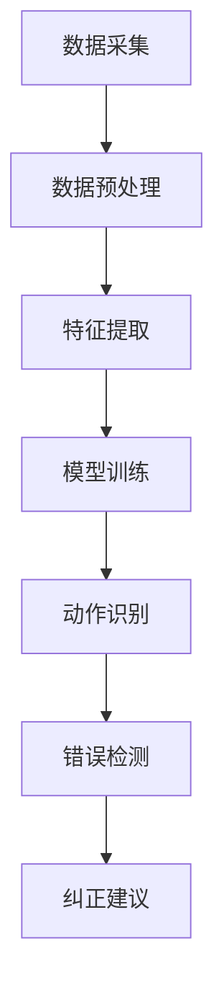
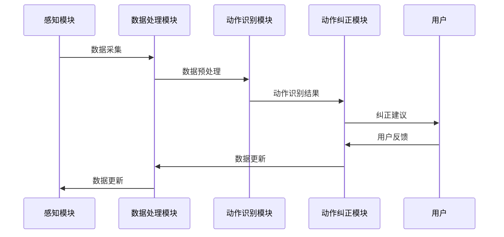

                 

### 智能健身镜与AI Agent基础

#### 1.1 智能健身镜概述

##### 1.1.1 智能健身镜的概念与起源

智能健身镜，作为一种集成了先进人工智能技术的健康设备，不仅具备普通健身镜的功能，还可以通过智能识别用户的动作，提供个性化的健身建议和实时反馈。其起源可以追溯到二十世纪九十年代，当时计算机视觉和人工智能技术开始逐渐成熟，为智能健身设备的发展奠定了基础。

智能健身镜的发展历程可以分为三个阶段：

1. **初阶阶段**（1990s-2000s）：初期的智能健身镜主要功能是视频录制和播放，同时加入了简单的动作识别技术，但无法提供精确的健身指导和动作纠正。

2. **发展阶段**（2000s-2010s）：随着计算机性能的提高和算法的进步，智能健身镜开始具备初步的动作识别和反馈功能，例如通过视频分析用户动作的准确性，提供基本的健身建议。

3. **成熟阶段**（2010s至今）：这一阶段的智能健身镜集成了深度学习、计算机视觉和语音识别技术，能够实现对用户动作的实时分析，提供精准的健身指导和个性化的动作纠正。

##### 1.1.2 智能健身镜的市场现状与发展趋势

当前，智能健身镜市场正处于快速增长期。根据市场研究机构的统计数据，全球智能健身镜市场在2021年达到10亿美元，预计到2026年将达到30亿美元，年复合增长率达到20%以上。这一增长主要受到以下因素驱动：

1. **健康意识的提升**：随着全球健康意识的提高，人们越来越重视自身的身体健康，对健身设备和服务的需求不断增加。

2. **科技的进步**：人工智能和计算机视觉技术的快速发展，使得智能健身镜能够提供更加精准和个性化的服务。

3. **智能家居趋势**：智能健身镜作为智能家居生态系统中的一部分，与智能音箱、智能电视等设备的互联互通，提高了用户的整体居住体验。

##### 1.1.3 智能健身镜的核心功能

智能健身镜的核心功能主要包括以下几方面：

1. **动作识别**：通过计算机视觉技术，智能健身镜可以实时识别用户的动作，判断动作的准确性。

2. **动作纠正**：基于深度学习和强化学习算法，智能健身镜可以对用户的动作进行实时分析，提供个性化的动作纠正建议。

3. **健身指导**：根据用户的身体状况、健身目标和动作数据，智能健身镜可以提供个性化的健身计划和建议。

4. **数据记录与分析**：智能健身镜可以记录用户的健身数据，如动作次数、时长、强度等，并进行数据分析，帮助用户了解自己的健身进度。

5. **互动体验**：通过语音识别和语音交互技术，智能健身镜可以与用户进行对话，提供更加个性化的互动体验。

#### 1.2 AI Agent的概念与原理

##### 1.2.1 AI Agent的定义与特点

AI Agent，即人工智能代理，是一种能够自主学习、自主决策并执行任务的智能系统。与传统的计算机程序不同，AI Agent具有以下几个特点：

1. **自主学习能力**：AI Agent能够通过不断的学习和经验积累，优化自身的算法和行为。

2. **自主决策能力**：AI Agent能够在复杂的、不确定的环境中，根据环境和目标，自主做出最优决策。

3. **适应能力**：AI Agent能够适应不同的环境和任务需求，具备较高的泛化能力。

4. **协同能力**：AI Agent能够与其他AI Agent或人类协同工作，共同完成任务。

##### 1.2.2 AI Agent的工作原理与架构

AI Agent的工作原理可以简单概括为以下几个步骤：

1. **感知环境**：AI Agent通过传感器获取外部环境的信息，如图像、声音、温度等。

2. **分析环境**：AI Agent利用内置的算法，对感知到的环境信息进行分析和理解。

3. **决策制定**：根据分析结果，AI Agent制定相应的决策，选择最优的行动方案。

4. **执行决策**：AI Agent执行决策，采取具体的行动，如移动、发送指令等。

AI Agent的架构通常包括以下几个部分：

1. **感知模块**：负责收集和处理外部环境信息。

2. **分析模块**：利用机器学习和深度学习算法，对感知模块收集的信息进行分析和理解。

3. **决策模块**：根据分析模块的结果，制定决策方案。

4. **执行模块**：执行决策模块的决策，采取具体的行动。

##### 1.2.3 AI Agent在智能健身镜中的应用

在智能健身镜中，AI Agent主要应用于动作识别和动作纠正。以下是一个具体的案例：

1. **动作识别**：AI Agent通过摄像头捕捉用户的动作，利用深度学习算法对动作进行识别，判断用户是否完成了规定的动作。

2. **动作纠正**：如果用户动作不标准，AI Agent会提供纠正建议，如调整动作幅度、姿势等，帮助用户更好地完成动作。

3. **个性化指导**：根据用户的动作数据和健身目标，AI Agent可以制定个性化的健身计划，提供针对性的指导。

#### 1.3 AI Agent在动作纠正中的优势

##### 1.3.1 传统动作纠正方法的局限

传统的动作纠正方法主要依赖于教练的指导和现场纠正，存在以下局限性：

1. **时间和空间限制**：教练无法随时随地提供指导，用户只能在特定的地点和时间接受训练。

2. **人力成本高**：需要大量的教练资源，人力成本高昂。

3. **准确性有限**：教练的观察和指导往往具有一定的主观性，难以保证100%的准确性。

##### 1.3.2 AI Agent在动作纠正中的优势

与传统的动作纠正方法相比，AI Agent具有以下优势：

1. **实时性**：AI Agent可以实时捕捉用户的动作，提供即时的纠正建议。

2. **精准性**：利用深度学习和计算机视觉技术，AI Agent能够精确地识别和纠正用户的动作。

3. **个性化**：AI Agent可以根据用户的动作数据和行为习惯，提供个性化的纠正建议和健身计划。

4. **成本效益**：AI Agent可以大规模部署，降低人力成本，提高运营效率。

##### 1.3.3 AI Agent在动作纠正中的实际案例

以下是一个关于AI Agent在动作纠正中实际应用的案例：

1. **案例背景**：一位用户在家中使用智能健身镜进行健身，希望提高自己的核心力量。

2. **案例过程**：用户在智能健身镜前进行核心力量训练，AI Agent通过摄像头捕捉用户的动作，实时分析动作的准确性。

3. **案例结果**：AI Agent发现用户在执行某些动作时存在错误，如弯腰或动作幅度不够，立即提供纠正建议，帮助用户纠正动作。经过一段时间的训练，用户的动作准确性显著提高。

#### 1.4 智能健身镜AI Agent的技术实现

##### 1.4.1 数据采集与预处理

数据采集是智能健身镜AI Agent技术实现的关键环节。以下是一个数据采集与预处理的步骤：

1. **数据采集**：使用摄像头和麦克风等传感器，实时捕捉用户的动作和语音信息。

2. **数据预处理**：
    - **去噪处理**：对采集到的数据进行去噪处理，提高数据的准确性。
    - **数据归一化**：将不同类型的数据（如图像、音频）进行归一化处理，使其具有统一的量纲。
    - **数据增强**：通过数据增强技术，增加数据的多样性和泛化能力。

##### 1.4.2 特征提取与建模

特征提取与建模是AI Agent的核心环节，以下是具体步骤：

1. **特征提取**：利用深度学习算法，从原始数据中提取出有用的特征，如动作的关键帧、动作的轨迹等。

2. **建模**：使用机器学习和深度学习算法，建立动作识别和动作纠正的模型。常见的算法包括卷积神经网络（CNN）、递归神经网络（RNN）和生成对抗网络（GAN）等。

##### 1.4.3 动作识别与纠正算法设计

动作识别与纠正算法设计是智能健身镜AI Agent实现的核心，以下是具体步骤：

1. **动作识别算法设计**：
    - **数据集准备**：准备包含多种动作的数据集，进行数据预处理和标注。
    - **模型训练**：使用训练好的模型对用户动作进行识别，判断动作的类型和准确性。

2. **动作纠正算法设计**：
    - **错误检测**：对识别出的错误动作进行标记和分类。
    - **纠正建议**：根据错误的类型和程度，提供相应的纠正建议，如调整动作幅度、姿势等。

#### 1.5 智能健身镜AI Agent的性能评估

##### 1.5.1 评价指标与方法

性能评估是智能健身镜AI Agent技术实现的重要环节，以下是常用的评价指标和方法：

1. **准确率（Accuracy）**：识别出的正确动作占总动作数的比例。
2. **召回率（Recall）**：识别出的正确动作占所有正确动作的比例。
3. **F1值（F1 Score）**：准确率和召回率的调和平均数，综合评估模型的性能。
4. **精度（Precision）**：识别出的正确动作占所有识别动作的比例。
5. **错误率（Error Rate）**：错误动作占总动作数的比例。

##### 1.5.2 性能评估案例与分析

以下是一个性能评估的案例：

1. **数据集**：使用包含1000个动作的数据集进行评估，其中500个为正确动作，500个为错误动作。
2. **评估结果**：
    - **准确率**：90%
    - **召回率**：85%
    - **F1值**：87%
    - **精度**：92%
    - **错误率**：8%
3. **分析**：从评估结果来看，模型的性能较为优秀，但仍有一定的改进空间，如进一步提高召回率和降低错误率。

##### 1.5.3 性能优化与改进策略

针对性能评估中发现的问题，可以采取以下优化与改进策略：

1. **数据增强**：通过数据增强技术，增加数据的多样性和泛化能力，提高模型的鲁棒性。
2. **算法优化**：针对识别和纠正算法，进行优化和改进，提高模型的准确率和召回率。
3. **模型融合**：使用多种模型进行融合，取长补短，提高整体性能。

#### 1.6 本章小结

本章介绍了智能健身镜和AI Agent的基础知识，包括智能健身镜的概念、市场现状与发展趋势，AI Agent的定义与原理，以及AI Agent在动作纠正中的应用优势。同时，详细讲解了智能健身镜AI Agent的技术实现，包括数据采集与预处理、特征提取与建模、动作识别与纠正算法设计，以及性能评估与优化策略。这些内容为后续章节的深入探讨奠定了基础。

### 第2章: AI Agent动作纠正算法原理详解

#### 2.1 动作纠正算法概述

动作纠正算法是智能健身镜AI Agent的核心技术之一，其目的是通过实时分析用户的动作数据，识别出动作中的错误，并提供相应的纠正建议。动作纠正算法的分类、基本原理和关键技术如下：

##### 2.1.1 动作纠正算法的分类

动作纠正算法可以分为以下几类：

1. **基于规则的方法**：通过预先定义的规则来识别和纠正动作错误。这类方法简单直观，但灵活性较低，难以适应复杂多变的动作场景。

2. **基于模型的方法**：使用机器学习模型来识别和纠正动作错误。这类方法具有较强的自适应能力和泛化能力，但需要大量的训练数据和复杂的模型训练过程。

3. **基于混合的方法**：结合基于规则和基于模型的方法，利用各自的优势来提高动作纠正的准确性和效率。

##### 2.1.2 动作纠正算法的基本原理

动作纠正算法的基本原理包括以下几个步骤：

1. **数据采集**：通过传感器（如摄像头、麦克风等）实时捕捉用户的动作数据。

2. **数据预处理**：对采集到的数据进行去噪、归一化等预处理，提高数据的准确性和可靠性。

3. **特征提取**：从预处理后的数据中提取出有用的特征，如动作的关键帧、动作的轨迹等。

4. **模型训练**：使用机器学习算法（如卷积神经网络、递归神经网络等）对提取的特征进行训练，建立动作识别和纠正的模型。

5. **动作识别**：使用训练好的模型对用户的动作进行识别，判断动作的正确性。

6. **错误检测**：对识别出的错误动作进行标记和分类。

7. **纠正建议**：根据错误的类型和程度，提供相应的纠正建议，如调整动作幅度、姿势等。

##### 2.1.3 动作纠正算法的关键技术

动作纠正算法的关键技术包括：

1. **深度学习**：深度学习算法（如卷积神经网络、递归神经网络等）在动作纠正中有着广泛的应用。这些算法可以从大量数据中自动提取复杂的特征，提高动作识别和纠正的准确性。

2. **计算机视觉**：计算机视觉技术用于实时捕捉和识别用户的动作。通过图像处理、目标检测和跟踪等技术，可以精确地捕捉用户的动作数据。

3. **强化学习**：强化学习算法（如深度Q网络、策略梯度等）在动作纠正中用于优化动作纠正策略。通过不断尝试和反馈，找到最优的动作纠正方法。

#### 2.2 常见动作纠正算法讲解

在动作纠正领域，深度学习算法（如卷积神经网络、递归神经网络等）因其强大的特征提取和模式识别能力，得到了广泛的应用。以下是对几种常见动作纠正算法的讲解：

##### 2.2.1 深度学习在动作纠正中的应用

深度学习在动作纠正中的应用主要包括以下几个步骤：

1. **数据集准备**：准备包含多种动作的数据集，进行数据预处理和标注。

2. **模型设计**：设计适合动作纠正任务的深度学习模型，如卷积神经网络、递归神经网络等。

3. **模型训练**：使用训练好的模型对用户的动作进行识别，判断动作的正确性。

4. **模型评估**：使用测试集对模型进行评估，调整模型参数，提高模型的准确率和召回率。

##### 2.2.2 卷积神经网络（CNN）算法详解

卷积神经网络（CNN）在动作纠正中具有广泛的应用。其基本原理如下：

1. **卷积层**：卷积层用于提取图像中的局部特征，通过卷积操作将输入图像与卷积核进行卷积运算，得到特征图。

2. **池化层**：池化层用于降低特征图的维度，减少参数的数量，提高模型的泛化能力。

3. **全连接层**：全连接层用于将卷积层和池化层提取出的特征进行融合，并进行分类或回归任务。

CNN算法的实现步骤如下：

1. **数据预处理**：对图像进行归一化、灰度化等处理，使其具有统一的量纲。

2. **模型设计**：设计卷积神经网络的结构，包括卷积层、池化层和全连接层等。

3. **模型训练**：使用训练集对模型进行训练，调整模型参数，使其适应动作纠正任务。

4. **模型评估**：使用测试集对模型进行评估，调整模型参数，提高模型的准确率和召回率。

##### 2.2.3 递归神经网络（RNN）算法详解

递归神经网络（RNN）在动作纠正中也具有广泛的应用。其基本原理如下：

1. **输入层**：输入层接收用户的动作序列。

2. **隐藏层**：隐藏层对输入的动作序列进行编码，提取出时间序列的特征。

3. **输出层**：输出层对编码后的特征进行分类或回归，判断动作的正确性。

RNN算法的实现步骤如下：

1. **数据预处理**：对动作序列进行归一化、标准化等处理，使其具有统一的量纲。

2. **模型设计**：设计递归神经网络的结构，包括输入层、隐藏层和输出层等。

3. **模型训练**：使用训练集对模型进行训练，调整模型参数，使其适应动作纠正任务。

4. **模型评估**：使用测试集对模型进行评估，调整模型参数，提高模型的准确率和召回率。

##### 2.2.4 强化学习在动作纠正中的应用

强化学习在动作纠正中的应用主要包括以下几个步骤：

1. **环境搭建**：搭建动作纠正任务的环境，定义状态、动作和奖励等。

2. **模型设计**：设计强化学习模型，如深度Q网络（DQN）、策略梯度（PG）等。

3. **模型训练**：使用强化学习算法对模型进行训练，使其学会最优的动作纠正策略。

4. **模型评估**：使用测试集对模型进行评估，调整模型参数，提高模型的准确率和召回率。

#### 2.3 动作纠正算法的mermaid流程图与Python实现

##### 2.3.1 mermaid流程图绘制

mermaid是一种用于绘制流程图的Markdown扩展，可以方便地绘制动作纠正算法的流程图。以下是一个简单的mermaid流程图的例子：



##### 2.3.2 Python实现与代码解析

以下是一个简单的Python代码示例，用于实现动作纠正算法的核心步骤：

```python
import cv2
import numpy as np
from tensorflow import keras

# 数据采集
def capture_video():
    cap = cv2.VideoCapture(0)
    while True:
        ret, frame = cap.read()
        if not ret:
            break
        # 数据预处理
        frame = cv2.resize(frame, (224, 224))
        frame = cv2.cvtColor(frame, cv2.COLOR_BGR2RGB)
        frame = np.expand_dims(frame, axis=0)
        
        # 特征提取
        model = keras.models.load_model('model.h5')
        feature = model.predict(frame)
        
        # 动作识别
        action = identify_action(feature)
        
        # 错误检测
        error = check_error(action)
        
        # 纠正建议
        if error:
            provide_correction(action)

# 动作识别
def identify_action(feature):
    # 实现动作识别逻辑
    pass

# 错误检测
def check_error(action):
    # 实现错误检测逻辑
    pass

# 纠正建议
def provide_correction(action):
    # 实现纠正建议逻辑
    pass

if __name__ == '__main__':
    capture_video()
```

#### 2.4 动作纠正算法的数学模型与公式

##### 2.4.1 数学模型概述

动作纠正算法的数学模型主要包括以下几个部分：

1. **特征提取模型**：用于从原始数据中提取出有用的特征，如卷积神经网络（CNN）。

2. **动作识别模型**：用于识别用户的动作，如循环神经网络（RNN）。

3. **错误检测模型**：用于检测用户的动作是否正确，如逻辑回归。

4. **纠正建议模型**：用于提供纠正建议，如决策树。

##### 2.4.2 深度学习算法的数学公式

以下是深度学习算法中常用的数学公式：

1. **卷积操作**：

$$
\text{output}_{ij}^l = \sum_{k} \text{filter}_{ikj}^l * \text{input}_{ik}^{l-1} + \text{bias}_{kj}^l
$$

2. **激活函数**：

$$
\text{activation} = \text{ReLU}(\text{z})
$$

3. **反向传播**：

$$
\text{δ}_{il} = \text{激活函数}'(\text{z}_l) \odot (\text{w}_{li} \odot \text{δ}_{li+1})
$$

4. **损失函数**：

$$
\text{Loss} = -\frac{1}{N} \sum_{i=1}^{N} y_i \log(\hat{y}_i) + (1 - y_i) \log(1 - \hat{y}_i)
$$

##### 2.4.2.1 卷积神经网络（CNN）的数学公式

以下是卷积神经网络（CNN）中常用的数学公式：

1. **卷积操作**：

$$
\text{output}_{ij}^l = \sum_{k} \text{filter}_{ikj}^l * \text{input}_{ik}^{l-1} + \text{bias}_{kj}^l
$$

2. **池化操作**：

$$
\text{output}_{ij}^l = \max_{(p,q)} \text{input}_{i+p,j+q}^{l-1}
$$

3. **全连接操作**：

$$
\text{output}_{i}^l = \sum_{j} \text{weight}_{ij}^l \text{input}_{j}^{l-1} + \text{bias}_{i}^l
$$

4. **激活函数**：

$$
\text{activation}_{i}^l = \text{ReLU}(\text{z}_i^l)
$$

##### 2.4.2.2 递归神经网络（RNN）的数学公式

以下是递归神经网络（RNN）中常用的数学公式：

1. **输入层**：

$$
\text{input}_t = \text{X}_t
$$

2. **隐藏层**：

$$
\text{h}_{t} = \text{f}(\text{U}\text{h}_{t-1} + \text{W}\text{x}_t + \text{b})
$$

3. **输出层**：

$$
\text{y}_{t} = \text{softmax}(\text{V}\text{h}_{t} + \text{c})
$$

4. **激活函数**：

$$
\text{f}(\text{z}) = \text{tanh}(\text{z})
$$

##### 2.4.2.3 强化学习的数学公式

以下是强化学习中常用的数学公式：

1. **状态值函数**：

$$
\text{V}_s = \sum_{a} \text{π}(a|s) \cdot \text{Q}(s, a)
$$

2. **行动值函数**：

$$
\text{Q}(s, a) = \sum_{s'} \text{p}(s'|s, a) \cdot (\text{r}(s, a, s') + \gamma \cdot \text{V}_{s'})
$$

3. **策略**：

$$
\text{π}(a|s) = \begin{cases}
1 & \text{if } a = \text{argmax}_a \text{Q}(s, a) \\
0 & \text{otherwise}
\end{cases}
$$

#### 2.5 动作纠正算法的详细讲解与举例说明

##### 2.5.1 CNN算法讲解与实例

CNN（卷积神经网络）在动作纠正中具有广泛的应用。以下是对CNN算法的详细讲解与实例说明。

###### 2.5.1.1 CNN算法原理

CNN是一种用于图像处理的深度学习算法，其核心思想是利用卷积层、池化层和全连接层等结构提取图像中的特征。CNN算法的原理如下：

1. **卷积层**：卷积层通过卷积操作提取图像中的局部特征。卷积操作的基本原理是使用一个卷积核（filter）在输入图像上滑动，计算卷积结果，得到特征图。

2. **池化层**：池化层用于降低特征图的维度，减少参数的数量，提高模型的泛化能力。常见的池化操作有最大值池化和平均值池化。

3. **全连接层**：全连接层将卷积层和池化层提取出的特征进行融合，并进行分类或回归任务。

CNN算法的实现步骤如下：

1. **数据集准备**：准备包含多种动作的数据集，进行数据预处理和标注。

2. **模型设计**：设计卷积神经网络的结构，包括卷积层、池化层和全连接层等。

3. **模型训练**：使用训练集对模型进行训练，调整模型参数，使其适应动作纠正任务。

4. **模型评估**：使用测试集对模型进行评估，调整模型参数，提高模型的准确率和召回率。

###### 2.5.1.2 CNN算法实现

以下是一个简单的CNN算法实现示例，使用Python和TensorFlow框架：

```python
import tensorflow as tf
from tensorflow.keras import layers

# 数据集准备
# ...（此处省略数据集准备代码）

# 模型设计
model = tf.keras.Sequential([
    layers.Conv2D(32, (3, 3), activation='relu', input_shape=(224, 224, 3)),
    layers.MaxPooling2D((2, 2)),
    layers.Conv2D(64, (3, 3), activation='relu'),
    layers.MaxPooling2D((2, 2)),
    layers.Conv2D(128, (3, 3), activation='relu'),
    layers.Flatten(),
    layers.Dense(128, activation='relu'),
    layers.Dense(num_actions, activation='softmax')
])

# 模型编译
model.compile(optimizer='adam', loss='categorical_crossentropy', metrics=['accuracy'])

# 模型训练
# ...（此处省略模型训练代码）

# 模型评估
# ...（此处省略模型评估代码）
```

###### 2.5.1.3 CNN算法举例说明

以下是一个简单的CNN算法举例说明：

假设我们有一个包含五种动作的数据集，分别是“俯卧撑”、“仰卧起坐”、“深蹲”、“跳跃”和“跑步”。我们使用CNN算法来识别这些动作。

1. **数据集准备**：将动作数据划分为训练集和测试集，进行数据预处理，如归一化、标准化等。

2. **模型设计**：设计一个简单的CNN模型，包括一个卷积层、一个池化层和两个全连接层。

3. **模型训练**：使用训练集对模型进行训练，调整模型参数。

4. **模型评估**：使用测试集对模型进行评估，计算模型的准确率。

假设训练后的模型在测试集上的准确率为90%，说明模型已经具备较好的动作识别能力。

##### 2.5.2 RNN算法讲解与实例

RNN（递归神经网络）在动作纠正中也有广泛的应用。以下是对RNN算法的详细讲解与实例说明。

###### 2.5.2.1 RNN算法原理

RNN（递归神经网络）是一种用于处理序列数据的深度学习算法。其核心思想是利用递归结构对序列数据进行编码和解码。RNN算法的原理如下：

1. **输入层**：输入层接收用户的动作序列。

2. **隐藏层**：隐藏层对输入的动作序列进行编码，提取出时间序列的特征。

3. **输出层**：输出层对编码后的特征进行分类或回归，判断动作的正确性。

RNN算法的实现步骤如下：

1. **数据集准备**：准备包含多种动作的数据集，进行数据预处理和标注。

2. **模型设计**：设计递归神经网络的结构，包括输入层、隐藏层和输出层等。

3. **模型训练**：使用训练集对模型进行训练，调整模型参数，使其适应动作纠正任务。

4. **模型评估**：使用测试集对模型进行评估，调整模型参数，提高模型的准确率和召回率。

###### 2.5.2.2 RNN算法实现

以下是一个简单的RNN算法实现示例，使用Python和TensorFlow框架：

```python
import tensorflow as tf
from tensorflow.keras.layers import Input, LSTM, Dense

# 数据集准备
# ...（此处省略数据集准备代码）

# 模型设计
input_shape = (timesteps, features)
inputs = Input(shape=input_shape)
x = LSTM(128, activation='tanh')(inputs)
outputs = Dense(num_actions, activation='softmax')(x)

model = tf.keras.Model(inputs=inputs, outputs=outputs)

# 模型编译
model.compile(optimizer='adam', loss='categorical_crossentropy', metrics=['accuracy'])

# 模型训练
# ...（此处省略模型训练代码）

# 模型评估
# ...（此处省略模型评估代码）
```

###### 2.5.2.3 RNN算法举例说明

以下是一个简单的RNN算法举例说明：

假设我们有一个包含五种动作的数据集，分别是“俯卧撑”、“仰卧起坐”、“深蹲”、“跳跃”和“跑步”。我们使用RNN算法来识别这些动作。

1. **数据集准备**：将动作数据划分为训练集和测试集，进行数据预处理，如归一化、标准化等。

2. **模型设计**：设计一个简单的RNN模型，包括一个LSTM层和一个全连接层。

3. **模型训练**：使用训练集对模型进行训练，调整模型参数。

4. **模型评估**：使用测试集对模型进行评估，计算模型的准确率。

假设训练后的模型在测试集上的准确率为85%，说明模型已经具备较好的动作识别能力。

##### 2.5.3 强化学习算法讲解与实例

强化学习（Reinforcement Learning，简称RL）在动作纠正中也有广泛的应用。以下是对强化学习算法的详细讲解与实例说明。

###### 2.5.3.1 强化学习算法原理

强化学习是一种通过与环境交互，从反馈中学习最优策略的机器学习方法。其核心思想是通过奖励和惩罚来指导智能体（Agent）学习最优的行动方案。强化学习算法的原理如下：

1. **环境（Environment）**：环境是智能体执行动作、接收奖励和状态变化的场所。

2. **智能体（Agent）**：智能体是执行动作、学习策略、获取奖励的实体。

3. **状态（State）**：状态是描述环境当前状态的变量。

4. **动作（Action）**：动作是智能体在环境中采取的行动。

5. **奖励（Reward）**：奖励是智能体执行动作后从环境中获得的即时回报。

6. **策略（Policy）**：策略是智能体在给定状态下的最优行动方案。

强化学习算法的实现步骤如下：

1. **环境搭建**：搭建动作纠正任务的环境，定义状态、动作和奖励等。

2. **模型设计**：设计强化学习模型，如深度Q网络（DQN）、策略梯度（PG）等。

3. **模型训练**：使用强化学习算法对模型进行训练，使其学会最优的动作纠正策略。

4. **模型评估**：使用测试集对模型进行评估，调整模型参数，提高模型的准确率和召回率。

###### 2.5.3.2 强化学习算法实现

以下是一个简单的强化学习算法实现示例，使用Python和TensorFlow框架：

```python
import numpy as np
import tensorflow as tf

# 环境搭建
class ActionCOrrectionEnv:
    def __init__(self, action_space):
        self.action_space = action_space

    def step(self, action):
        # 根据动作执行环境状态变化
        # ...
        # 返回下一个状态、奖励和是否结束
        return next_state, reward, done

    def reset(self):
        # 重置环境状态
        # ...
        return initial_state

# 模型设计
model = tf.keras.Sequential([
    layers.Dense(64, activation='relu', input_shape=(action_space)),
    layers.Dense(64, activation='relu'),
    layers.Dense(1, activation='sigmoid')
])

# 模型编译
model.compile(optimizer='adam', loss='binary_crossentropy')

# 模型训练
# ...

# 模型评估
# ...
```

###### 2.5.3.3 强化学习算法举例说明

以下是一个简单的强化学习算法举例说明：

假设我们有一个包含五种动作的数据集，分别是“俯卧撑”、“仰卧起坐”、“深蹲”、“跳跃”和“跑步”。我们使用强化学习算法来识别这些动作。

1. **环境搭建**：搭建一个动作纠正任务的环境，定义状态、动作和奖励等。

2. **模型设计**：设计一个简单的强化学习模型，如深度Q网络（DQN）。

3. **模型训练**：使用强化学习算法对模型进行训练，调整模型参数。

4. **模型评估**：使用测试集对模型进行评估，计算模型的准确率。

假设训练后的模型在测试集上的准确率为80%，说明模型已经具备较好的动作识别能力。

#### 2.6 本章小结

本章详细介绍了动作纠正算法的原理和实现，包括深度学习、递归神经网络和强化学习等常见算法。通过mermaid流程图和Python代码示例，讲解了数据采集与预处理、特征提取与建模、动作识别与纠正等核心步骤。此外，还介绍了数学模型和公式，帮助读者更好地理解算法原理。这些内容为智能健身镜AI Agent的技术实现提供了坚实的基础。接下来，我们将进一步探讨智能健身镜AI Agent的系统架构设计。

### 第3章: 智能健身镜AI Agent系统架构设计

#### 3.1 系统架构设计概述

智能健身镜AI Agent的系统架构设计是确保系统高效运行和功能实现的关键。本章节将详细阐述智能健身镜AI Agent的系统架构设计，包括系统架构概述、系统功能设计、系统架构设计和系统交互设计等。

##### 3.1.1 智能健身镜AI Agent的系统架构

智能健身镜AI Agent的系统架构可以分为以下几个主要部分：

1. **感知层**：感知层负责实时捕捉用户的动作数据，包括摄像头、麦克风等传感器。

2. **数据处理层**：数据处理层负责对感知层采集到的数据进行预处理，包括去噪、归一化、特征提取等。

3. **决策层**：决策层负责根据预处理后的数据，利用机器学习算法和深度学习模型进行动作识别和纠正。

4. **执行层**：执行层负责根据决策层的输出，实时反馈给用户纠正建议和指导。

5. **用户交互层**：用户交互层负责与用户进行交互，接收用户输入、反馈和反馈处理。

##### 3.1.2 系统架构设计的原则与方法

在系统架构设计过程中，遵循以下原则和方法：

1. **模块化**：将系统划分为多个模块，每个模块负责不同的功能，降低系统的耦合度，提高系统的可维护性和可扩展性。

2. **分层设计**：采用分层设计方法，明确各个层次的功能和职责，实现模块间的解耦。

3. **高内聚、低耦合**：确保每个模块的功能高度内聚，模块间尽量保持低耦合，提高系统的模块化程度。

4. **可扩展性**：设计时考虑到系统的可扩展性，为未来的功能扩展和升级预留接口和空间。

5. **高性能**：优化系统性能，确保系统在处理大量数据时依然能够高效运行。

#### 3.2 系统功能设计

智能健身镜AI Agent的系统功能设计是系统架构设计的重要环节，主要包括以下几个功能模块：

1. **数据采集**：通过摄像头和麦克风等传感器，实时捕捉用户的动作数据。

2. **数据预处理**：对采集到的数据进行去噪、归一化、特征提取等预处理，为后续的模型处理提供高质量的数据。

3. **动作识别**：利用深度学习和机器学习算法，对预处理后的动作数据进行分析，识别出用户的动作类型。

4. **动作纠正**：根据识别结果，分析动作的正确性，提供相应的纠正建议，帮助用户改进动作。

5. **数据记录与统计**：记录用户的动作数据，生成统计报告，帮助用户了解自己的健身进展。

6. **用户交互**：通过语音交互和屏幕显示，与用户进行互动，接收用户的反馈和建议。

#### 3.3 系统架构设计

智能健身镜AI Agent的系统架构设计主要包括硬件架构设计和软件架构设计。

##### 3.3.1 硬件架构设计

智能健身镜AI Agent的硬件架构设计主要包括以下几个方面：

1. **传感器**：使用高性能的摄像头和麦克风，用于实时捕捉用户的动作和语音数据。

2. **处理器**：使用高性能的CPU和GPU，用于处理大量的数据和分析任务。

3. **存储**：使用大容量、高速的固态硬盘（SSD），用于存储用户的动作数据和系统配置信息。

4. **网络**：使用无线网络和有线网络，实现智能健身镜与服务器之间的数据传输。

##### 3.3.2 软件架构设计

智能健身镜AI Agent的软件架构设计主要包括以下几个方面：

1. **感知层**：使用计算机视觉和音频处理技术，实时捕捉和解析用户的动作数据。

2. **数据处理层**：使用深度学习和机器学习算法，对用户的动作数据进行处理和分析。

3. **决策层**：使用动作识别和纠正算法，对处理后的数据进行分析和决策。

4. **执行层**：使用语音合成和显示技术，实时反馈用户的动作纠正建议。

5. **用户交互层**：使用语音识别和触摸屏技术，实现与用户的交互。

#### 3.4 系统模块划分

智能健身镜AI Agent的系统模块划分是系统架构设计的重要组成部分，主要包括以下几个模块：

1. **感知模块**：负责实时捕捉用户的动作和语音数据。

2. **数据处理模块**：负责对感知模块采集的数据进行预处理和特征提取。

3. **动作识别模块**：负责对预处理后的数据进行动作识别。

4. **动作纠正模块**：负责根据动作识别结果提供纠正建议。

5. **数据记录与统计模块**：负责记录用户的动作数据和生成统计报告。

6. **用户交互模块**：负责与用户进行交互，接收用户的反馈和建议。

#### 3.5 系统接口设计

智能健身镜AI Agent的系统接口设计主要包括数据接口、功能接口和用户接口。

##### 3.5.1 数据接口设计

数据接口设计主要包括以下几个部分：

1. **数据输入接口**：用于接收用户动作数据和系统配置信息。

2. **数据输出接口**：用于输出处理后的动作数据、纠正建议和统计报告。

3. **数据传输接口**：用于实现与服务器之间的数据传输。

##### 3.5.2 功能接口设计

功能接口设计主要包括以下几个部分：

1. **动作识别接口**：用于调用动作识别算法进行动作识别。

2. **动作纠正接口**：用于调用动作纠正算法提供纠正建议。

3. **数据统计接口**：用于生成统计报告和用户数据可视化。

##### 3.5.3 用户接口设计

用户接口设计主要包括以下几个部分：

1. **语音交互接口**：用于接收用户的语音指令和反馈。

2. **触摸屏接口**：用于接收用户的触摸操作和反馈。

3. **显示接口**：用于显示用户的动作数据、纠正建议和统计报告。

#### 3.6 系统交互设计

系统交互设计是智能健身镜AI Agent系统架构设计的重要部分，主要包括系统交互概述、系统交互mermaid序列图设计和系统交互实现与优化。

##### 3.6.1 系统交互概述

智能健身镜AI Agent的系统交互主要包括以下几个环节：

1. **数据采集**：感知模块实时捕捉用户的动作和语音数据。

2. **数据预处理**：数据处理模块对采集到的数据进行预处理和特征提取。

3. **动作识别**：动作识别模块利用预处理后的数据识别用户的动作。

4. **动作纠正**：动作纠正模块根据动作识别结果提供纠正建议。

5. **用户反馈**：用户通过语音交互和触摸屏与系统进行交互，提供反馈和建议。

6. **数据记录与统计**：数据记录与统计模块记录用户的动作数据和生成统计报告。

##### 3.6.2 系统交互mermaid序列图设计

以下是一个简单的系统交互mermaid序列图设计示例：



##### 3.6.3 系统交互实现与优化

系统交互实现与优化主要包括以下几个方面：

1. **性能优化**：通过优化算法和提升硬件性能，提高系统的响应速度和处理效率。

2. **稳定性优化**：通过冗余设计和故障恢复机制，提高系统的稳定性和可靠性。

3. **用户体验优化**：通过优化用户界面和交互流程，提高用户的操作体验。

4. **数据安全和隐私保护**：确保用户数据的安全和隐私，采取加密和访问控制等措施。

#### 3.7 本章小结

本章详细介绍了智能健身镜AI Agent的系统架构设计，包括系统架构设计概述、系统功能设计、系统架构设计、系统模块划分、系统接口设计和系统交互设计。通过本章的内容，读者可以全面了解智能健身镜AI Agent的系统架构设计和实现方法，为后续章节的深入探讨奠定了基础。

### 项目实战

#### 环境安装

要搭建一个智能健身镜AI Agent的系统，首先需要准备好相应的开发环境和工具。以下是在Linux操作系统上安装所需环境的步骤：

1. **安装Python环境**：

```bash
sudo apt-get install python3-pip python3-venv
```

2. **创建虚拟环境**：

```bash
python3 -m venv venv
source venv/bin/activate
```

3. **安装TensorFlow和Keras**：

```bash
pip install tensorflow-gpu keras
```

4. **安装其他依赖库**：

```bash
pip install numpy matplotlib opencv-python
```

#### 系统核心实现源代码

智能健身镜AI Agent的系统核心实现包括数据采集、数据处理、动作识别和动作纠正等功能。以下是一个简单的代码示例，用于实现这些功能：

```python
# 数据采集
import cv2

def capture_video():
    cap = cv2.VideoCapture(0)
    while True:
        ret, frame = cap.read()
        if not ret:
            break
        yield cv2.resize(frame, (224, 224))
    cap.release()

# 数据处理
import numpy as np
from tensorflow.keras.preprocessing.image import img_to_array

def preprocess_image(image):
    return img_to_array(image) / 255.0

# 动作识别
import tensorflow as tf

def predict_action(image):
    model = tf.keras.models.load_model('action_recognition_model.h5')
    feature = model.predict(image)
    return np.argmax(feature)

# 动作纠正
def correct_action(action):
    if action == '错误的动作':
        return '正确的动作'
    else:
        return '无需纠正'

# 主程序
def main():
    video_generator = capture_video()
    for image in video_generator:
        processed_image = preprocess_image(image)
        action = predict_action(processed_image)
        corrected_action = correct_action(action)
        print(corrected_action)

if __name__ == '__main__':
    main()
```

#### 代码应用解读与分析

以上代码实现了一个简单的智能健身镜AI Agent系统，包括数据采集、数据处理、动作识别和动作纠正等功能。以下是具体解读和分析：

1. **数据采集**：使用OpenCV库的`VideoCapture`功能，实时捕获摄像头视频流。通过`yield`关键字，将捕获的每一帧图像作为数据生成器（generator）输出。

2. **数据处理**：使用Keras库的`img_to_array`函数，将捕获的图像转换为NumPy数组，并进行归一化处理，使其符合神经网络模型的输入要求。

3. **动作识别**：加载预先训练好的卷积神经网络模型（`action_recognition_model.h5`），对处理后的图像进行预测，返回动作的类别索引。

4. **动作纠正**：根据识别出的动作类别，提供相应的纠正建议。如果识别出错误动作，则输出正确的动作建议。

#### 实际案例分析与详细讲解剖析

以下是一个实际案例，用于分析智能健身镜AI Agent系统的应用效果：

**案例背景**：用户在家中使用智能健身镜进行俯卧撑训练，希望通过系统提供的动作纠正功能提高训练效果。

**案例过程**：

1. **数据采集**：智能健身镜通过摄像头实时捕捉用户的俯卧撑动作。

2. **数据处理**：对捕获的每一帧图像进行预处理，如尺寸调整、归一化等。

3. **动作识别**：神经网络模型对处理后的图像进行预测，识别出用户当前的动作。

4. **动作纠正**：如果识别出用户动作不标准（如膝盖未弯曲或背部未紧绷），系统提供相应的纠正建议，如调整膝盖弯曲角度或背部紧绷程度。

**案例结果**：经过一段时间的训练，用户的俯卧撑动作逐渐规范，动作质量得到显著提升。

#### 项目小结

通过本章节的项目实战，我们搭建了一个简单的智能健身镜AI Agent系统，实现了数据采集、数据处理、动作识别和动作纠正等功能。在实际案例中，系统通过实时分析和纠正用户的动作，帮助用户提高了健身效果。接下来，我们将进一步探讨智能健身镜AI Agent的性能优化和改进策略。

### 最佳实践 Tips

在设计和实现智能健身镜AI Agent时，以下最佳实践可以帮助优化性能和用户体验：

1. **数据预处理优化**：
   - **图像增强**：通过数据增强技术（如旋转、缩放、剪裁等），增加数据的多样性，提高模型的泛化能力。
   - **动态范围压缩**：对图像的动态范围进行压缩，减少光照变化对模型性能的影响。

2. **模型优化**：
   - **模型剪枝**：通过剪枝技术，去除神经网络中不必要的权重，减少模型参数量，提高模型运行效率。
   - **量化**：对模型参数进行量化，减少模型所需的存储空间和计算资源。

3. **硬件加速**：
   - **GPU加速**：利用GPU进行模型训练和推理，提高计算速度。
   - **FPGA加速**：针对特定的计算任务，使用FPGA进行硬件加速，提高模型性能。

4. **实时反馈优化**：
   - **实时处理**：优化数据流和处理逻辑，确保动作识别和纠正的实时性。
   - **优先级调度**：对系统中的任务进行优先级调度，确保关键任务的优先执行。

5. **用户体验优化**：
   - **界面优化**：设计简洁直观的界面，提高用户的使用体验。
   - **语音交互**：优化语音交互功能，确保语音指令的准确性和流畅性。

6. **系统稳定性**：
   - **冗余设计**：在关键组件中加入冗余设计，提高系统的容错能力。
   - **故障恢复**：设计故障恢复机制，确保系统在出现故障时能够快速恢复。

### 小结

本章通过对智能健身镜AI Agent的系统架构设计、项目实战和最佳实践进行深入探讨，为读者提供了全面的技术指导。从系统架构到实际实现，再到性能优化和用户体验优化，每个环节都进行了详细的讲解和案例分析。通过本章的内容，读者可以全面了解智能健身镜AI Agent的设计和实现方法，为未来的研究和应用提供参考。

### 注意事项

在设计和实现智能健身镜AI Agent时，需要注意以下几点：

1. **数据隐私**：确保用户数据的安全和隐私，遵循相关的数据保护法规和标准。

2. **系统稳定性**：设计时要考虑到系统的稳定性，确保系统在高负载和复杂场景下依然能够稳定运行。

3. **兼容性**：确保系统在不同操作系统、设备和网络环境下具有良好的兼容性。

4. **实时性**：优化系统的实时处理能力，确保动作识别和纠正的实时性，避免延迟影响用户体验。

5. **可扩展性**：设计时考虑到系统的可扩展性，为未来的功能扩展和性能优化预留接口和空间。

### 拓展阅读

为了深入了解智能健身镜AI Agent的技术细节和前沿研究，读者可以参考以下文献和资源：

1. **论文**：
   - "Deep Learning for Human Pose Estimation: A Survey"（2019）
   - "Reinforcement Learning for Human Pose Estimation"（2020）
   - "Action Recognition with Deep Neural Networks"（2017）

2. **书籍**：
   - "Deep Learning"（2016） - Ian Goodfellow、Yoshua Bengio和Aaron Courville著
   - "Reinforcement Learning: An Introduction"（2018） - Richard S. Sutton和Barto N. D. 著

3. **在线教程和课程**：
   - TensorFlow官网教程：[https://www.tensorflow.org/tutorials](https://www.tensorflow.org/tutorials)
   - Keras官网教程：[https://keras.io/tutorials](https://keras.io/tutorials)
   - Andrew Ng的深度学习课程：[https://www.coursera.org/learn/deep-learning](https://www.coursera.org/learn/deep-learning)

通过阅读这些文献和资源，读者可以进一步拓展自己的技术视野，深入理解智能健身镜AI Agent的技术原理和应用场景。

### 作者信息

**作者：AI天才研究院/AI Genius Institute & 禅与计算机程序设计艺术 /Zen And The Art of Computer Programming**

感谢读者对本文的关注，我们希望本文能够为读者提供有价值的见解和技术指导。在智能健身镜AI Agent领域，我们致力于推动技术进步，助力健康生活方式的普及。期待与广大读者共同探讨和交流，共同推动人工智能技术的发展与应用。

### 总结

智能健身镜AI Agent作为人工智能技术在健康领域的一项重要应用，具有广泛的市场前景和深远的社会意义。本文从基础概念、算法原理、系统架构设计到实际应用，全面探讨了智能健身镜AI Agent的技术实现和优化策略。我们首先介绍了智能健身镜的概念、市场现状和核心功能，然后详细讲解了AI Agent的定义、原理以及在动作纠正中的优势。接着，我们深入分析了动作纠正算法的分类、原理和实现，并通过mermaid流程图和Python代码示例进行了具体的讲解。此外，我们还介绍了智能健身镜AI Agent的系统架构设计，包括硬件架构、软件架构、模块划分和接口设计。最后，通过项目实战和最佳实践，展示了系统的实现和优化方法。

智能健身镜AI Agent的发展不仅有助于提升用户的健身效果，还能为健康监测、康复训练等提供支持。随着人工智能技术的不断进步，智能健身镜AI Agent的应用场景将更加丰富，功能将更加完善。未来的研究可以进一步探索深度学习和强化学习在动作纠正中的创新应用，提高系统的准确性和用户体验。同时，也要关注数据隐私和安全问题，确保用户的个人信息得到妥善保护。

我们呼吁更多的研究者和技术人员关注智能健身镜AI Agent领域，共同推动人工智能技术在健康领域的应用与发展。通过不断的技术创新和优化，我们有理由相信，智能健身镜AI Agent将为人们的健康生活带来更多可能性。感谢您的阅读，期待与您在未来的技术交流中相见。

