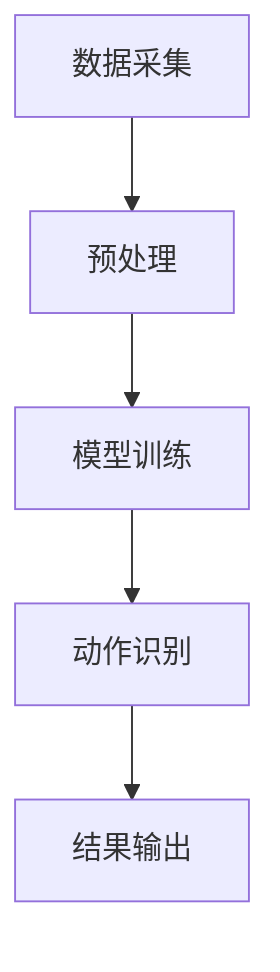
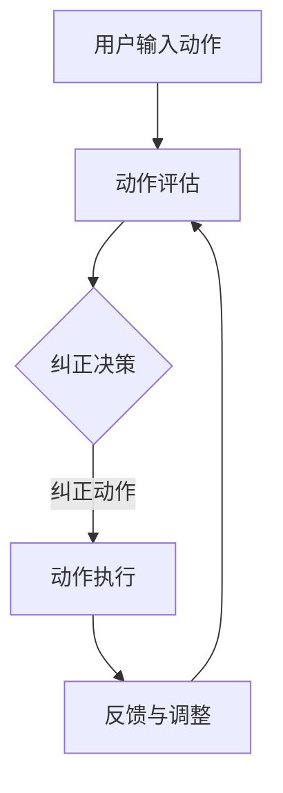
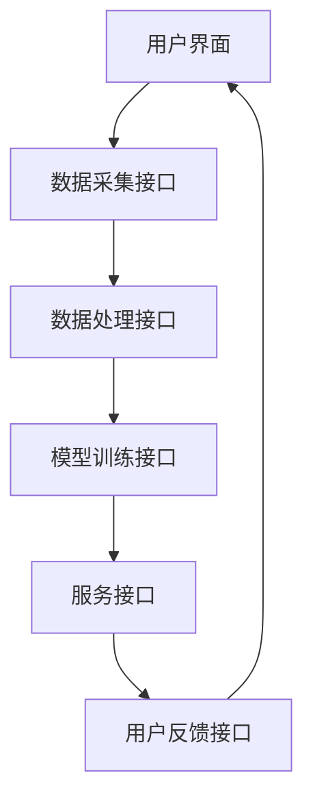

                 

# 智能健身镜：AI Agent的实时动作纠正与评分

> 关键词：智能健身镜、AI Agent、动作纠正、实时评分、个性化健身建议

> 摘要：本文将深入探讨智能健身镜中AI Agent的实时动作纠正与评分机制。通过分析背景、技术原理、应用实例以及未来展望，旨在为读者提供全面的技术见解和实际应用指南。

### 目录大纲设计

#### 第1章 引言

- **1.1 问题背景**
  - 人工智能在健身领域的应用现状与挑战
  - 智能健身镜的需求与市场前景
  - AI Agent在实时动作纠正与评分中的作用

- **1.2 问题描述**
  - 智能健身镜如何通过AI技术实现动作识别与纠正
  - AI Agent如何进行实时评分并提供个性化健身建议

- **1.3 问题解决**
  - 采用深度学习算法实现动作识别
  - 使用强化学习算法优化动作纠正策略
  - 结合自然语言处理技术提供个性化健身建议

- **1.4 边界与外延**
  - AI Agent在动作识别与纠正中的应用范围
  - 实时评分与个性化健身建议的准确性保障

- **1.5 概念结构与核心要素组成**
  - 智能健身镜的基本结构
  - AI Agent的技术框架
  - 动作识别、纠正与评分的核心算法

#### 第2章 AI Agent概述

- **2.1 AI Agent的定义与分类**
  - AI Agent的概念
  - AI Agent的分类与应用场景

- **2.2 AI Agent的核心功能**
  - 动作识别与跟踪
  - 实时动作纠正
  - 评分与反馈

- **2.3 AI Agent的技术原理**
  - 机器学习算法在AI Agent中的应用
  - 深度学习模型在动作识别中的作用
  - 强化学习在动作纠正中的应用

#### 第3章 智能健身镜的动作识别

- **3.1 动作识别技术概述**
  - 动作识别的基本原理
  - 常见动作识别算法比较

- **3.2 深度学习算法在动作识别中的应用**
  - 卷积神经网络（CNN）在动作识别中的应用
  - 循环神经网络（RNN）在动作识别中的应用
  - 生成对抗网络（GAN）在动作识别中的应用

- **3.3 动作识别的mermaid流程图**

  ```mermaid
  graph TD
  A[数据采集] --> B[预处理]
  B --> C[模型训练]
  C --> D[动作识别]
  D --> E[结果输出]
  ```

#### 第4章 实时动作纠正

- **4.1 实时动作纠正原理**
  - 动作纠正的目标
  - 动作纠正的策略

- **4.2 强化学习在动作纠正中的应用**
  - 强化学习的基本概念
  - Q-learning算法在动作纠正中的应用
  - Deep Q-Network（DQN）在动作纠正中的应用

- **4.3 动作纠正的mermaid流程图**

  ```mermaid
  graph TD
  A[用户输入动作] --> B[动作评估]
  B --> C{纠正决策}
  C -->|纠正动作| D[动作执行]
  D --> E[反馈与调整]
  E --> B
  ```

#### 第5章 实时评分与个性化健身建议

- **5.1 实时评分原理**
  - 评分指标的选择
  - 评分算法的设计

- **5.2 个性化健身建议的原理**
  - 用户数据的收集与分析
  - 健身建议的生成策略

- **5.3 自然语言处理技术中的应用**
  - 基于文本的健身建议生成
  - 用户反馈的自然语言处理

#### 第6章 系统架构设计

- **6.1 系统功能设计**
  - 动作识别模块
  - 动作纠正模块
  - 评分与建议模块

- **6.2 系统架构设计**
  - 服务器端架构设计
  - 客户端架构设计
  - 数据处理与存储架构设计

- **6.3 系统接口设计与交互**
  - 系统接口设计
  - 系统交互mermaid序列图

  ```mermaid
  graph TD
  A[用户界面] --> B[数据采集]
  B --> C[动作识别]
  C --> D[动作纠正]
  D --> E[评分与建议]
  E --> F[用户反馈]
  F --> A
  ```

#### 第7章 项目实战

- **7.1 环境安装与配置**
  - 系统环境安装
  - 数据集准备与预处理

- **7.2 系统核心实现源代码**
  - 动作识别模块代码
  - 动作纠正模块代码
  - 评分与建议模块代码

- **7.3 代码应用解读与分析**
  - 代码结构与流程解析
  - 关键算法解释

- **7.4 实际案例分析与详细讲解**
  - 案例背景
  - 案例实施步骤
  - 结果分析

- **7.5 项目小结**
  - 项目成果总结
  - 不足与改进方向

#### 第N章 总结与展望

- **N.1 关键技术与创新点总结**
  - 深度学习在动作识别中的应用
  - 强化学习在动作纠正中的优化
  - 自然语言处理在个性化健身建议中的应用

- **N.2 未来发展方向**
  - AI Agent的智能化与自适应能力提升
  - 大数据与云计算的结合应用
  - 可视化与互动体验的增强

- **N.3 结论**
  - 智能健身镜的广泛应用前景
  - 对未来智能健身领域的期望

### 1.1 问题背景

人工智能在健身领域的应用现状与挑战

随着人工智能技术的不断发展，其在健身领域的应用也越来越广泛。智能健身镜作为一种新兴的智能健身设备，结合了人工智能、计算机视觉和自然语言处理等前沿技术，旨在提供个性化的健身体验。然而，尽管人工智能在健身领域展现了巨大的潜力，但仍面临诸多挑战。

首先，人工智能在健身领域的应用现状主要集中在以下几个方面：

1. **动作识别**：通过计算机视觉技术，智能健身镜可以实时捕捉用户的运动动作，并进行分析和识别。这项技术为用户提供了即时反馈，帮助他们纠正动作，提高训练效果。

2. **实时评分**：智能健身镜可以通过对用户的动作进行评分，提供量化反馈，帮助用户了解自己的运动表现，并根据评分结果调整训练计划。

3. **个性化健身建议**：基于用户的历史数据和当前状态，智能健身镜可以生成个性化的健身建议，包括运动计划、饮食建议等，从而提高用户的健身效果和体验。

然而，尽管人工智能在健身领域有着广泛的应用前景，但仍面临以下挑战：

1. **数据隐私与安全**：智能健身镜需要收集大量的用户数据，包括身体数据、运动数据等。如何保护用户数据的安全和隐私成为了一个重要问题。

2. **算法准确性**：动作识别和评分算法的准确性直接影响到用户的体验和健身效果。如何提高算法的准确性，减少误判率，是一个亟待解决的问题。

3. **用户体验**：智能健身镜作为一种新型健身设备，需要提供良好的用户体验。如何设计人性化的界面和交互方式，提高用户的使用满意度，是一个挑战。

4. **可扩展性**：智能健身镜的应用场景和用户群体越来越广泛，如何实现系统的可扩展性，满足不同用户的需求，是一个重要的挑战。

智能健身镜的需求与市场前景

随着人们对健康意识的提高，健身已经成为人们日常生活中不可或缺的一部分。智能健身镜作为一种结合了人工智能技术的智能健身设备，具有以下需求和前景：

1. **个性化健身体验**：智能健身镜可以根据用户的身体数据和运动习惯，提供个性化的健身建议和运动计划，帮助用户更有效地达到健身目标。

2. **实时反馈与纠正**：通过动作识别技术，智能健身镜可以实时捕捉用户的动作，并提供即时反馈和纠正，帮助用户提高训练效果。

3. **互动性与娱乐性**：智能健身镜可以结合游戏、虚拟现实等技术，提供更加丰富和有趣的健身体验，提高用户的使用粘性。

4. **健康管理**：智能健身镜可以实时监测用户的身体健康状况，包括心率、血压等指标，并提供健康报告和建议，帮助用户更好地管理健康。

综上所述，智能健身镜在健身领域的应用前景广阔，但也面临诸多挑战。通过深入研究人工智能技术，优化算法，提高用户体验，智能健身镜有望在未来成为健身领域的重要工具。

#### 1.2 问题描述

智能健身镜如何通过AI技术实现动作识别与纠正

智能健身镜通过人工智能技术实现动作识别与纠正的核心在于其计算机视觉和深度学习算法的应用。具体来说，智能健身镜通过以下几个步骤实现动作识别与纠正：

1. **数据采集**：智能健身镜配备高精度的摄像头，可以实时捕捉用户的运动动作。这些动作数据被传输到智能健身镜的处理器中，以便后续处理。

2. **预处理**：采集到的动作数据需要进行预处理，包括去噪、归一化和特征提取等步骤。预处理后的数据更加干净，有利于后续的深度学习模型训练。

3. **模型训练**：智能健身镜使用深度学习算法对预处理后的动作数据进行训练，以建立一个能够识别用户动作的模型。常用的深度学习算法包括卷积神经网络（CNN）和循环神经网络（RNN）等。

4. **动作识别**：在动作识别阶段，训练好的深度学习模型会对用户进行捕捉的动作进行识别。通过对比模型输出和标准动作数据，智能健身镜可以判断用户的动作是否正确。

5. **动作纠正**：如果用户的动作存在错误，智能健身镜会通过计算机视觉和强化学习算法，实时提供纠正指导。这一过程包括对用户动作的实时评估、错误类型的识别和相应的纠正动作生成。

6. **反馈与调整**：在用户完成动作后，智能健身镜会提供评分和反馈，帮助用户了解自己的表现。同时，智能健身镜还会根据用户反馈和动作数据，不断调整和优化动作纠正策略。

AI Agent如何进行实时评分并提供个性化健身建议

除了动作识别与纠正，AI Agent在智能健身镜中还可以进行实时评分并提供个性化健身建议。具体来说，AI Agent包括以下几个功能模块：

1. **实时评分**：智能健身镜通过分析用户的动作数据，结合预设的评分标准，对用户的动作进行评分。评分指标包括动作的准确性、流畅性、强度等。

2. **数据收集与分析**：AI Agent会收集用户的历史数据，包括身体指标、运动记录、健康报告等，并进行深度分析。通过分析用户数据，AI Agent可以了解用户的运动习惯、健康状况和需求。

3. **个性化健身建议**：基于用户数据和分析结果，AI Agent会生成个性化的健身建议，包括运动计划、饮食建议、休息方案等。这些建议旨在帮助用户更有效地达到健身目标，同时避免过度训练和受伤。

4. **交互反馈**：AI Agent会通过与用户的互动，收集用户对健身建议的反馈。这些反馈可以帮助AI Agent不断优化和调整建议，提高个性化程度。

5. **自适应调整**：AI Agent可以根据用户的反馈和表现，动态调整评分标准和健身建议。这种自适应能力使得智能健身镜能够更好地适应用户的需求和变化。

综上所述，AI Agent通过动作识别与纠正、实时评分和个性化健身建议，为智能健身镜提供了强大的功能支持，使用户能够享受到更加智能、个性化的健身体验。

#### 1.3 问题解决

采用深度学习算法实现动作识别

深度学习算法在智能健身镜的动作识别中发挥着重要作用。通过以下步骤，深度学习算法能够有效实现动作识别：

1. **数据集准备**：首先，需要准备一个包含各种动作的丰富数据集。这个数据集应包含多个动作类别，如俯卧撑、深蹲、仰卧起坐等，以及不同难度和变化形式。

2. **数据预处理**：对采集到的动作数据进行预处理，包括数据去噪、归一化和特征提取。去噪可以减少数据中的干扰信息，归一化可以统一数据尺度，特征提取则是提取出动作的关键特征，如关节角度、身体部位的位置等。

3. **模型选择与训练**：选择合适的深度学习模型进行训练，如卷积神经网络（CNN）、循环神经网络（RNN）和生成对抗网络（GAN）。CNN适用于处理图像数据，RNN适用于处理序列数据，GAN则可以通过生成对抗过程学习到数据的分布。

4. **训练与优化**：使用预处理后的数据集对模型进行训练，通过反向传播算法不断调整模型参数，使其能够更好地识别动作。在训练过程中，可以通过交叉验证和调参优化模型性能。

5. **测试与验证**：将训练好的模型应用于新的动作数据，进行测试和验证，评估模型的识别准确率和泛化能力。

使用强化学习算法优化动作纠正策略

强化学习算法在智能健身镜的动作纠正中发挥着关键作用。以下是如何使用强化学习算法优化动作纠正策略的步骤：

1. **状态定义**：定义智能健身镜的状态，包括用户的当前动作、动作历史、错误类型等。状态是智能健身镜做出纠正决策的依据。

2. **动作空间**：定义智能健身镜可采取的动作，如指导用户调整姿势、增加或减少运动强度等。动作是智能健身镜对状态的反应。

3. **奖励机制**：设计奖励机制，以激励智能健身镜采取正确的纠正动作。奖励机制可以基于用户动作的准确性、流畅性、用户的舒适度等指标。

4. **策略学习**：使用强化学习算法，如Q-learning或Deep Q-Network（DQN），学习最优的纠正策略。Q-learning通过评估每个动作的预期奖励来选择最佳动作，而DQN则使用深度神经网络来近似Q值函数。

5. **策略优化**：通过不断迭代训练，优化智能健身镜的策略，使其能够更好地适应不同用户的动作纠正需求。

结合自然语言处理技术提供个性化健身建议

自然语言处理（NLP）技术在智能健身镜中可用于生成个性化健身建议。以下是结合NLP技术提供个性化健身建议的步骤：

1. **用户数据收集**：收集用户的历史数据，包括运动记录、健康报告、个人偏好等。这些数据为NLP技术提供了丰富的训练素材。

2. **文本预处理**：对收集到的用户数据进行文本预处理，包括分词、词性标注、停用词过滤等。预处理后的文本数据更适合NLP模型的处理。

3. **语言模型训练**：使用NLP技术训练语言模型，如基于词嵌入（Word Embedding）或Transformer等模型。语言模型能够理解用户文本的含义，为生成个性化健身建议提供基础。

4. **个性化建议生成**：基于用户的文本数据和语言模型，生成个性化的健身建议。这些建议可以包括运动计划、饮食建议、休息方案等。

5. **反馈与调整**：收集用户对健身建议的反馈，并使用NLP技术分析这些反馈。根据反馈调整健身建议，提高其针对性和准确性。

通过以上步骤，智能健身镜能够结合深度学习、强化学习和自然语言处理技术，提供动作识别、纠正和个性化健身建议，从而为用户带来更智能、个性化的健身体验。

### 1.4 边界与外延

AI Agent在动作识别与纠正中的应用范围

AI Agent在动作识别与纠正中的应用范围非常广泛，涵盖了多种健身项目和场景。以下是一些主要的应用场景：

1. **健身房**：AI Agent可以应用于传统健身房，帮助用户进行动作识别与纠正，提供个性化的训练指导。这有助于提高训练效果，减少运动损伤风险。

2. **家庭健身**：AI Agent可以集成在智能健身镜中，为家庭用户提供便捷的健身服务。用户可以在家中通过智能健身镜进行动作识别与纠正，无需专业教练的指导。

3. **康复训练**：AI Agent可以用于康复训练，帮助患者进行正确的康复动作，并通过实时反馈和纠正确保康复效果。

4. **体育训练**：AI Agent可以应用于专业运动员的体育训练，提供高精度的动作识别与纠正，帮助运动员优化动作技巧，提高运动表现。

5. **舞蹈教学**：AI Agent可以用于舞蹈教学，实时捕捉用户的舞蹈动作，并提供纠正和评分，帮助舞者提高舞蹈技巧。

实时评分与个性化健身建议的准确性保障

为了确保实时评分和个性化健身建议的准确性，需要从以下几个方面进行保障：

1. **高质量数据集**：建立包含丰富多样动作数据的高质量数据集，以确保深度学习模型的训练和优化。

2. **模型优化**：不断优化深度学习模型和强化学习算法，提高动作识别和纠正的准确率。

3. **实时反馈机制**：建立实时反馈机制，收集用户对动作识别和纠正的反馈，及时调整和优化AI Agent的策略。

4. **用户数据保护**：确保用户数据的安全和隐私，防止数据泄露，提高用户信任度。

5. **多模态数据融合**：结合多种传感器数据，如心率、血压等，提高动作识别和评分的准确性。

通过以上措施，AI Agent在动作识别与纠正、实时评分和个性化健身建议中的应用将更加准确和有效，为用户带来更好的健身体验。

### 1.5 概念结构与核心要素组成

智能健身镜的基本结构

智能健身镜的基本结构包括以下几个主要部分：

1. **摄像头**：智能健身镜配备高精度的摄像头，用于实时捕捉用户的运动动作。

2. **处理器**：智能健身镜内置高性能处理器，用于实时处理摄像头捕捉到的动作数据。

3. **显示屏幕**：显示屏幕用于显示用户的动作反馈、评分和建议。

4. **传感器**：智能健身镜可能配备多种传感器，如心率传感器、血压传感器等，用于收集用户的生理数据。

5. **存储设备**：智能健身镜内置存储设备，用于存储用户的历史数据和训练数据。

AI Agent的技术框架

AI Agent在智能健身镜中扮演核心角色，其技术框架包括以下几个主要部分：

1. **动作识别模块**：使用深度学习算法，如卷积神经网络（CNN）和循环神经网络（RNN），对用户动作进行实时识别。

2. **动作纠正模块**：使用强化学习算法，如Q-learning和Deep Q-Network（DQN），对用户动作进行实时纠正。

3. **评分与建议模块**：结合自然语言处理（NLP）技术，生成实时评分和个性化健身建议。

动作识别、纠正与评分的核心算法

智能健身镜中的动作识别、纠正与评分依赖于一系列核心算法，包括：

1. **深度学习算法**：如卷积神经网络（CNN）和循环神经网络（RNN），用于动作识别。

2. **强化学习算法**：如Q-learning和Deep Q-Network（DQN），用于动作纠正。

3. **自然语言处理（NLP）算法**：用于生成实时评分和个性化健身建议。

通过以上核心算法和技术框架，智能健身镜能够为用户提供实时动作识别、纠正与评分，从而实现个性化、智能化的健身体验。

### 第2章 AI Agent概述

#### 2.1 AI Agent的定义与分类

AI Agent的概念

AI Agent，即人工智能代理，是一种具备自主决策能力和执行能力的计算机程序。它能够根据环境和目标，自主地感知、理解和处理信息，并采取相应的行动。AI Agent的概念最早由计算机科学家约翰·霍普菲尔（John Hopfield）在1970年代提出，主要用于模拟人类的思维过程和行为模式。

AI Agent的分类与应用场景

AI Agent可以根据不同的应用场景和功能进行分类。以下是一些常见的AI Agent分类及其应用场景：

1. **交互式AI Agent**：这类AI Agent主要用于与用户进行交互，提供问答、建议和服务。常见的应用场景包括智能客服、智能语音助手等。

2. **自动化AI Agent**：这类AI Agent用于自动化执行特定任务，如机器人自动化流程、自动驾驶等。

3. **数据驱动AI Agent**：这类AI Agent基于大量数据进行分析和决策，如推荐系统、智能监控等。

4. **知识驱动AI Agent**：这类AI Agent基于知识库和规则进行决策，如专家系统、医疗诊断等。

5. **混合型AI Agent**：这类AI Agent结合了多种类型的AI技术，如语音识别、图像识别和自然语言处理，提供综合性的服务。

不同类型的AI Agent在各自的领域中发挥着重要作用，为人类社会带来了巨大的便利和效率提升。

#### 2.2 AI Agent的核心功能

动作识别与跟踪

动作识别与跟踪是AI Agent在智能健身镜中的核心功能之一。通过计算机视觉和深度学习算法，AI Agent可以实时捕捉用户的运动动作，并对其进行识别和跟踪。这一过程通常包括以下几个步骤：

1. **数据采集**：AI Agent使用摄像头或传感器实时捕捉用户的动作数据。

2. **预处理**：对采集到的数据进行预处理，包括去噪、归一化和特征提取等，以提高数据质量。

3. **动作识别**：使用深度学习模型，如卷积神经网络（CNN）或循环神经网络（RNN），对预处理后的数据进行分析，识别用户的动作。

4. **动作跟踪**：通过跟踪用户的动作轨迹，AI Agent可以持续监测用户的动作变化，并实时更新动作状态。

实时动作纠正

实时动作纠正是AI Agent的另一项重要功能，旨在帮助用户纠正错误的动作，提高训练效果。实时动作纠正的过程通常如下：

1. **动作评估**：AI Agent对用户的动作进行实时评估，识别动作中的错误和不足。

2. **纠正决策**：根据评估结果，AI Agent生成纠正策略，指导用户进行调整。

3. **动作纠正**：AI Agent通过实时反馈，引导用户执行纠正动作，如调整姿势、增加运动强度等。

4. **反馈与调整**：用户执行纠正动作后，AI Agent会收集反馈信息，并不断调整纠正策略，以提高准确性。

评分与反馈

评分与反馈是AI Agent在智能健身镜中的第三个核心功能。通过评分系统，AI Agent可以量化用户的动作表现，并提供详细的反馈。

1. **评分指标**：AI Agent定义一系列评分指标，如动作准确性、流畅性、强度等。

2. **评分算法**：基于用户的动作数据和评分指标，AI Agent使用评分算法计算用户的表现分数。

3. **反馈生成**：AI Agent生成详细的反馈报告，包括用户的动作评分、改进建议等。

4. **用户互动**：AI Agent与用户进行互动，解释评分结果和反馈建议，帮助用户理解并改进动作。

通过动作识别与跟踪、实时动作纠正和评分与反馈，AI Agent为智能健身镜提供了强大的功能支持，使用户能够享受到个性化、智能化的健身体验。

#### 2.3 AI Agent的技术原理

机器学习算法在AI Agent中的应用

AI Agent的核心功能依赖于机器学习算法，这些算法通过训练数据模型，使系统能够从数据中自动学习并做出决策。以下是几种常见的机器学习算法及其在AI Agent中的应用：

1. **监督学习**：监督学习算法通过训练标签数据进行模型训练。例如，在动作识别中，AI Agent可以使用卷积神经网络（CNN）来识别不同的动作类别。训练数据集包含每个动作的图像及其对应的标签，通过大量训练，模型可以学会区分不同的动作。

2. **无监督学习**：无监督学习算法不依赖标签数据，而是通过分析数据的内在结构进行学习。例如，自编码器（Autoencoder）可以用于动作数据的降维和特征提取，有助于提高动作识别的准确率。

3. **半监督学习**：半监督学习结合了监督学习和无监督学习的优势，通过利用未标记数据来提高模型性能。AI Agent可以利用半监督学习算法，从用户历史动作数据中提取有用信息，提高新动作的识别能力。

深度学习模型在动作识别中的作用

深度学习模型是AI Agent中的核心技术之一，它在动作识别中发挥了关键作用。以下是几种常用的深度学习模型及其在动作识别中的应用：

1. **卷积神经网络（CNN）**：CNN是一种专门用于处理图像数据的深度学习模型。它通过卷积层、池化层和全连接层等结构，提取图像的特征并分类。在动作识别中，CNN可以高效地处理摄像头捕捉到的动作图像，实现实时动作识别。

2. **循环神经网络（RNN）**：RNN适用于处理序列数据，如时间序列动作数据。通过RNN，AI Agent可以捕捉动作的时序特征，实现更精确的动作识别。长短期记忆网络（LSTM）和门控循环单元（GRU）是RNN的变体，它们在处理长序列数据和避免梯度消失问题上具有优势。

3. **生成对抗网络（GAN）**：GAN由生成器和判别器组成，通过对抗训练生成逼真的动作数据，用于模型训练和测试。GAN在动作识别中可以提高模型的泛化能力，使其更好地适应各种动作场景。

强化学习在动作纠正中的应用

强化学习是一种通过试错学习最优策略的机器学习算法，它在动作纠正中具有重要应用。以下是强化学习在动作纠正中的基本原理和应用：

1. **强化学习基本概念**：强化学习包括四个主要组成部分：环境（Environment）、动作（Action）、状态（State）和奖励（Reward）。通过与环境互动，AI Agent不断调整策略，以最大化长期奖励。

2. **Q-learning算法**：Q-learning是一种基于值函数的强化学习算法。它通过评估当前状态和动作的期望奖励，不断更新策略，以达到最优解。

3. **Deep Q-Network（DQN）**：DQN是一种基于深度学习的强化学习算法，通过深度神经网络近似Q值函数。DQN可以处理高维状态和动作空间，提高动作纠正的准确性和效率。

通过机器学习、深度学习和强化学习算法，AI Agent在动作识别和纠正中实现了高效、准确和自适应的功能，为智能健身镜提供了强大的技术支持。

### 第3章 智能健身镜的动作识别

#### 3.1 动作识别技术概述

动作识别的基本原理

动作识别是智能健身镜的核心功能之一，它通过计算机视觉和深度学习算法，对用户的运动动作进行实时捕捉和分析。动作识别的基本原理包括以下几个关键步骤：

1. **数据采集**：使用高精度的摄像头捕捉用户的动作图像。这些图像通常包含多个连续帧，每帧都记录了用户某一时刻的动作状态。

2. **预处理**：对采集到的图像数据进行预处理，包括图像去噪、归一化和特征提取。预处理步骤有助于提高图像质量，去除干扰信息，并提取关键特征。

3. **特征提取**：使用深度学习模型提取图像的特征。常见的特征提取方法包括卷积神经网络（CNN）、循环神经网络（RNN）和生成对抗网络（GAN）等。

4. **动作识别**：将提取的特征输入到训练好的深度学习模型中，通过分类器进行动作识别。分类器会输出每个动作的概率分布，从而判断用户的动作类别。

5. **结果输出**：将识别结果输出给用户，包括动作名称、识别准确率等。同时，AI Agent还会根据识别结果提供相应的纠正和建议。

常见动作识别算法比较

在智能健身镜中，常用的动作识别算法包括卷积神经网络（CNN）、循环神经网络（RNN）和生成对抗网络（GAN）等。以下是这些算法的比较：

1. **卷积神经网络（CNN）**：

   - **优点**：CNN在处理图像数据方面具有优势，能够自动提取图像的高层次特征，适合大规模图像数据集训练。
   - **缺点**：CNN在处理序列数据时表现不佳，难以捕捉动作的时序特征。

2. **循环神经网络（RNN）**：

   - **优点**：RNN适用于处理序列数据，能够捕捉动作的时序特征，适合连续动作的识别。
   - **缺点**：RNN存在梯度消失和梯度爆炸问题，训练难度大，模型泛化能力有限。

3. **生成对抗网络（GAN）**：

   - **优点**：GAN通过生成器和判别器的对抗训练，能够生成高质量的动作数据，提高模型的泛化能力和识别准确性。
   - **缺点**：GAN训练过程复杂，计算资源需求高，难以实现实时动作识别。

在实际应用中，智能健身镜通常会结合多种算法，以实现高效、准确的动作识别。例如，可以使用CNN进行初步特征提取，然后结合RNN处理时序特征，提高动作识别的准确性和鲁棒性。

#### 3.2 深度学习算法在动作识别中的应用

卷积神经网络（CNN）在动作识别中的应用

卷积神经网络（CNN）是一种专门用于处理图像数据的深度学习模型，其在动作识别中发挥着重要作用。以下是CNN在动作识别中的应用步骤：

1. **数据集准备**：准备包含多种动作类别的数据集，如俯卧撑、深蹲、仰卧起坐等。数据集应包含大量的训练样本和测试样本，以提高模型的泛化能力。

2. **模型结构设计**：设计合适的CNN模型结构，包括卷积层、池化层、全连接层等。卷积层用于提取图像的特征，池化层用于降低数据维度，全连接层用于分类和预测。

3. **模型训练**：使用训练数据集对CNN模型进行训练，通过反向传播算法不断调整模型参数，使模型能够准确识别动作。

4. **模型评估**：使用测试数据集对训练好的模型进行评估，计算识别准确率、召回率等指标，以评估模型的性能。

5. **模型部署**：将训练好的模型部署到智能健身镜中，实现实时动作识别功能。

循环神经网络（RNN）在动作识别中的应用

循环神经网络（RNN）适用于处理序列数据，能够在动作识别中捕捉动作的时序特征。以下是RNN在动作识别中的应用步骤：

1. **数据集准备**：与CNN类似，准备包含多种动作类别的数据集，并进行预处理。

2. **模型结构设计**：设计合适的RNN模型结构，包括输入层、隐藏层和输出层。输入层接收序列数据，隐藏层用于处理序列特征，输出层进行动作分类。

3. **模型训练**：使用训练数据集对RNN模型进行训练，通过反向传播算法优化模型参数。

4. **模型评估**：与CNN类似，使用测试数据集对训练好的模型进行评估。

5. **模型部署**：将训练好的模型部署到智能健身镜中。

生成对抗网络（GAN）在动作识别中的应用

生成对抗网络（GAN）是一种通过生成器和判别器对抗训练的深度学习模型。GAN在动作识别中可以提高模型的泛化能力和识别准确性。以下是GAN在动作识别中的应用步骤：

1. **数据集准备**：与CNN和RNN类似，准备包含多种动作类别的数据集。

2. **模型结构设计**：设计生成器和判别器的模型结构。生成器负责生成逼真的动作数据，判别器负责判断生成数据的真实性。

3. **对抗训练**：通过生成器和判别器的对抗训练，生成器不断优化生成数据的质量，判别器不断提高识别能力。

4. **模型评估**：使用测试数据集对训练好的GAN模型进行评估。

5. **模型部署**：将训练好的GAN模型部署到智能健身镜中。

通过CNN、RNN和GAN等多种深度学习算法，智能健身镜能够实现高效、准确的动作识别，为用户提供个性化的健身指导和纠正。

#### 3.3 动作识别的mermaid流程图



在这个流程图中，A表示数据采集，B表示预处理，C表示模型训练，D表示动作识别，E表示结果输出。数据采集阶段通过摄像头获取用户的动作图像，预处理阶段对图像进行去噪、归一化和特征提取，模型训练阶段使用深度学习算法训练模型，动作识别阶段对用户动作进行实时识别，最后将识别结果输出给用户。

### 第4章 实时动作纠正

#### 4.1 实时动作纠正原理

动作纠正的目标

实时动作纠正的目的是帮助用户准确执行健身动作，提高训练效果，并减少运动损伤风险。具体目标包括：

1. **提高动作准确性**：通过实时纠正，用户可以更准确地执行健身动作，减少错误动作对训练效果的负面影响。

2. **优化动作流畅性**：实时纠正可以帮助用户保持动作的流畅性，避免断断续续或动作不协调的情况。

3. **提供个性化反馈**：根据用户的具体情况，实时纠正可以提供个性化的反馈和建议，帮助用户更好地达到健身目标。

动作纠正的策略

实时动作纠正的策略包括以下几个方面：

1. **实时评估**：AI Agent使用计算机视觉和深度学习模型，实时捕捉用户的动作，并对其进行分析和评估。评估内容包括动作的准确性、流畅性和强度等。

2. **错误识别**：通过分析评估结果，AI Agent可以识别出用户动作中的错误类型，如姿势不正确、动作不协调等。

3. **纠正动作生成**：根据错误类型，AI Agent生成相应的纠正动作，如调整姿势、增加运动强度等。这些纠正动作可以通过显示屏幕或语音提示等方式实时反馈给用户。

4. **用户反馈**：用户在执行纠正动作后，AI Agent会收集用户的反馈信息，包括动作改进效果和舒适度等。这些反馈信息有助于AI Agent进一步优化纠正策略。

5. **自适应调整**：AI Agent根据用户反馈和动作数据，不断调整纠正策略，使其更适应用户的需求和变化。

通过以上策略，实时动作纠正能够帮助用户提高训练效果，同时确保动作安全和舒适。

#### 4.2 强化学习在动作纠正中的应用

强化学习的基本概念

强化学习是一种通过试错学习最优策略的机器学习算法。在强化学习中，包括四个关键要素：环境（Environment）、动作（Action）、状态（State）和奖励（Reward）。

1. **环境**：环境是系统运行的外部条件，它决定了系统的当前状态。

2. **动作**：动作是系统在当前状态下可以采取的行为。

3. **状态**：状态是系统的当前状态，它反映了系统当前的环境特征。

4. **奖励**：奖励是系统根据动作和状态获得的回报，用于指导系统的决策。

强化学习算法通过不断与环境互动，调整策略，以最大化长期奖励。常用的强化学习算法包括Q-learning、Deep Q-Network（DQN）和策略梯度方法等。

Q-learning算法在动作纠正中的应用

Q-learning是一种基于值函数的强化学习算法，通过评估当前状态和动作的期望奖励，不断更新策略，以达到最优解。以下是Q-learning算法在动作纠正中的应用步骤：

1. **初始化**：初始化Q值函数，用于评估每个状态和动作的期望奖励。

2. **状态评估**：根据当前状态，评估所有可能动作的Q值。

3. **动作选择**：选择具有最大Q值的动作作为当前动作。

4. **执行动作**：在环境中执行选定的动作，观察新的状态和奖励。

5. **更新Q值**：根据新的状态、动作和奖励，更新Q值函数，以指导未来的决策。

6. **迭代**：重复上述步骤，不断优化策略，直到达到满意的性能水平。

Deep Q-Network（DQN）在动作纠正中的应用

DQN是一种基于深度学习的强化学习算法，通过深度神经网络近似Q值函数。DQN在动作纠正中的应用步骤如下：

1. **初始化**：初始化深度神经网络和经验回放内存。

2. **状态编码**：将当前状态编码为向量，输入到深度神经网络中。

3. **Q值预测**：使用深度神经网络预测当前状态的Q值。

4. **动作选择**：选择具有最大Q值的动作作为当前动作。

5. **执行动作**：在环境中执行选定的动作，观察新的状态和奖励。

6. **经验回放**：将当前状态、动作、新状态和奖励存储到经验回放内存中。

7. **Q值更新**：根据新的状态、动作和奖励，更新深度神经网络的参数。

8. **迭代**：重复上述步骤，不断优化深度神经网络，提高动作纠正的准确性。

通过Q-learning和DQN等强化学习算法，智能健身镜可以实时评估用户动作，生成有效的纠正动作，从而提高训练效果，减少运动损伤风险。

#### 4.3 动作纠正的mermaid流程图



在这个流程图中，A表示用户输入动作，B表示动作评估，C表示纠正决策，D表示纠正动作执行，E表示反馈与调整。用户输入动作后，AI Agent对动作进行实时评估，生成纠正决策，用户执行纠正动作，AI Agent收集反馈信息并进行调整，形成闭环系统，不断优化动作纠正策略。

### 第5章 实时评分与个性化健身建议

#### 5.1 实时评分原理

评分指标的选择

实时评分是智能健身镜的一个重要功能，通过评分可以量化用户的运动表现，为用户提供即时的反馈和改进建议。选择合适的评分指标是实时评分的关键。以下是一些常用的评分指标：

1. **动作准确性**：动作准确性是评分的核心指标，用于评估用户动作的符合标准动作的程度。准确性越高，说明用户动作越准确。

2. **动作流畅性**：动作流畅性评估用户动作的连贯性和协调性。流畅性越高，说明用户动作的连贯性和协调性越好。

3. **动作强度**：动作强度评估用户在执行动作时的力量和速度。强度越高，说明用户在动作中施加的力量和速度越大。

4. **动作速度**：动作速度评估用户在执行动作时的速度。速度越快，说明用户的动作速度越快。

5. **心率变化**：心率变化评估用户在执行动作时的心率变化情况。心率变化幅度越大，说明用户的运动强度越高。

评分算法的设计

为了实现实时评分，智能健身镜需要设计合适的评分算法。以下是一个简单的评分算法设计：

1. **数据采集**：采集用户的运动数据，包括动作准确性、流畅性、强度、速度和心率变化等。

2. **数据预处理**：对采集到的数据进行分析，提取关键特征，如动作轨迹、关节角度、心率变化等。

3. **特征权重分配**：根据不同评分指标的重要程度，为每个特征分配权重。例如，动作准确性和流畅性可能具有更高的权重，而心率变化可能具有较低的权重。

4. **评分计算**：使用加权平均等方法，计算每个评分指标的得分。例如，可以采用以下公式计算总得分：

   $$ 总得分 = w_1 \times 准确性得分 + w_2 \times 流畅性得分 + w_3 \times 强度得分 + w_4 \times 速度得分 + w_5 \times 心率变化得分 $$

   其中，$w_1, w_2, w_3, w_4, w_5$为各自指标的权重。

5. **评分输出**：将计算出的总得分输出给用户，并提供详细的评分结果和改进建议。

通过设计合适的评分算法，智能健身镜可以实时、准确地评估用户的运动表现，为用户提供有效的反馈和指导。

#### 5.2 个性化健身建议的原理

用户数据的收集与分析

个性化健身建议的实现依赖于对用户数据的收集和分析。以下步骤描述了用户数据的收集和分析过程：

1. **数据收集**：智能健身镜通过传感器和摄像头收集用户的数据，包括心率、血压、体重、身体指标（如身高、年龄、性别）和运动记录等。这些数据可以实时传输到云端服务器，进行存储和分析。

2. **数据预处理**：对收集到的数据进行预处理，包括去噪、归一化和缺失值填充等步骤。预处理后的数据更加干净和一致，有利于后续的分析。

3. **特征提取**：从预处理后的数据中提取关键特征，如心率变异性、运动强度、运动时长、动作准确性和流畅性等。这些特征可以用于分析用户的行为模式和健康状况。

4. **数据分析**：使用统计分析、机器学习和数据挖掘技术对提取的特征进行分析。常见的分析方法包括聚类分析、回归分析和时间序列分析等。

5. **数据可视化**：将分析结果可视化，生成图表和报告，帮助用户更好地理解自己的健康状况和运动表现。

健身建议的生成策略

基于用户数据的分析结果，智能健身镜可以生成个性化的健身建议。以下是一个典型的健身建议生成策略：

1. **目标设定**：根据用户的数据分析结果，设定个性化的健身目标。例如，根据用户的体重、身高和年龄，设定减肥、增肌或维持体重等目标。

2. **运动计划生成**：基于用户的运动记录和分析结果，生成个性化的运动计划。运动计划可以包括每天或每周的训练内容、运动时长和运动强度等。

3. **饮食建议生成**：根据用户的数据分析和目标设定，生成个性化的饮食建议。饮食建议可以包括每天的营养摄入量、食物选择和饮食习惯等。

4. **反馈与调整**：智能健身镜会根据用户对健身建议的反馈，动态调整健身建议。例如，如果用户对某项运动计划感到不适，AI Agent会调整计划，提供更合适的运动方案。

5. **持续优化**：智能健身镜会持续收集和分析用户数据，根据用户的最新情况不断优化健身建议。这种持续优化的过程可以确保用户始终获得最合适的健身建议。

通过用户数据的收集与分析，智能健身镜能够为用户生成个性化的健身建议，帮助用户更有效地达到健身目标。

#### 5.3 自然语言处理技术中的应用

基于文本的健身建议生成

自然语言处理（NLP）技术在智能健身镜中可用于生成基于文本的健身建议，提高用户互动的便捷性和个性化程度。以下是基于文本的健身建议生成的过程：

1. **文本收集**：智能健身镜通过用户输入的文字信息，如健身日志、问题反馈、目标设定等，收集用户的文本数据。

2. **文本预处理**：对收集到的文本数据进行预处理，包括分词、词性标注、停用词过滤和句法分析等步骤。预处理后的文本数据更加规范，便于后续的分析和处理。

3. **情感分析**：使用情感分析技术，对用户的文本数据进行分析，判断用户的情绪和态度。例如，如果用户描述自己的运动表现不佳，可以判断用户可能感到沮丧或失望。

4. **意图识别**：通过意图识别技术，分析用户的文本数据，确定用户的主要意图。例如，如果用户询问如何提高运动效果，可以判断用户的主要意图是获取健身建议。

5. **知识图谱构建**：构建一个包含健身知识和建议的静态知识图谱。知识图谱可以表示各种健身动作、饮食方案和运动计划，以及它们之间的关系。

6. **生成建议**：基于用户的文本数据和知识图谱，使用模板匹配或生成模型，生成个性化的健身建议。例如，如果用户询问如何增加肌肉，可以生成一个包含增肌训练计划、饮食建议和休息方案的文本消息。

7. **输出与反馈**：将生成的健身建议输出给用户，并收集用户的反馈。用户可以接受或拒绝建议，并提供进一步的反馈，以便AI Agent不断优化建议生成过程。

用户反馈的自然语言处理

用户反馈的自然语言处理是智能健身镜优化个性化服务的重要环节。以下是用户反馈的自然语言处理过程：

1. **文本收集**：智能健身镜收集用户在使用健身建议后的反馈文本，包括满意度评价、问题报告和建议等。

2. **文本预处理**：对用户反馈的文本数据进行预处理，包括分词、词性标注、停用词过滤和句法分析等。预处理后的文本数据有助于更好地理解用户反馈的内容。

3. **情感分析**：使用情感分析技术，对用户反馈进行分析，判断用户的满意度和情绪。例如，如果用户反馈包含积极的词汇，可以判断用户对健身建议较为满意。

4. **问题分类**：使用分类技术，对用户反馈进行分类，识别用户提出的问题类型。例如，可以将问题分为技术问题、服务问题和健康问题等。

5. **问题定位**：根据问题分类结果，进一步分析用户反馈，确定问题的具体原因。例如，如果用户反馈运动计划不合理，可以进一步分析运动计划的设定参数，找出不合理的原因。

6. **解决方案生成**：基于问题分类和定位结果，生成相应的解决方案。例如，如果用户反馈运动强度过大，可以生成调整运动计划的建议，如减少运动时长或降低运动强度。

7. **反馈与优化**：将解决方案输出给用户，并收集用户对解决方案的反馈。通过不断优化解决方案，智能健身镜可以提供更加精准和有效的服务。

通过基于文本的健身建议生成和用户反馈的自然语言处理，智能健身镜能够更好地理解用户需求，提供个性化的服务，提高用户体验。

### 第6章 系统架构设计

#### 6.1 系统功能设计

智能健身镜系统的功能设计主要涉及动作识别、动作纠正和评分与建议三大模块，每个模块的具体功能如下：

**动作识别模块**：

1. **数据采集**：使用摄像头实时捕捉用户的运动动作，并将图像数据传输到处理器进行后续处理。

2. **预处理**：对采集到的图像数据进行预处理，包括去噪、归一化和特征提取，以提高数据质量和识别准确性。

3. **动作识别**：使用深度学习模型对预处理后的图像数据进行分析，识别用户的动作类别，并将识别结果输出。

**动作纠正模块**：

1. **动作评估**：通过计算机视觉和深度学习算法，对用户的动作进行实时评估，识别动作中的错误和不足。

2. **纠正决策**：基于评估结果，使用强化学习算法生成纠正动作策略，以指导用户进行动作调整。

3. **动作纠正**：通过显示屏幕或语音提示等方式，向用户反馈纠正动作，帮助用户改正错误的动作。

**评分与建议模块**：

1. **实时评分**：根据用户的动作数据，使用评分算法计算用户的动作表现得分，为用户提供即时的反馈。

2. **个性化建议**：基于用户的历史数据和当前状态，使用自然语言处理技术生成个性化的健身建议，包括运动计划、饮食建议和休息方案等。

通过以上功能模块的设计，智能健身镜能够为用户提供全面的运动指导和纠正服务，帮助用户实现个性化的健身目标。

#### 6.2 系统架构设计

**服务器端架构设计**：

智能健身镜的服务器端架构设计旨在提供高效、稳定的服务，支持多用户同时在线训练和互动。以下是服务器端架构的详细设计：

1. **数据处理层**：负责接收用户的运动数据，并进行预处理、特征提取和存储。这一层通常包括数据采集模块、数据预处理模块和特征提取模块。

2. **模型训练层**：使用深度学习和强化学习算法对用户数据集进行训练，生成动作识别和纠正模型。这一层通常包括训练模型模块、模型评估模块和模型优化模块。

3. **服务层**：提供动作识别、动作纠正和评分与建议等服务，通过RESTful API与客户端进行交互。这一层通常包括动作识别服务模块、动作纠正服务模块和评分与建议服务模块。

4. **存储层**：用于存储用户数据、训练数据和模型参数。存储层通常包括关系数据库、NoSQL数据库和对象存储等，以支持大数据存储和快速检索。

**客户端架构设计**：

智能健身镜的客户端架构设计主要涉及用户界面和客户端应用程序。以下是客户端架构的详细设计：

1. **用户界面**：设计友好的用户界面，用于展示用户的运动数据、评分结果和健身建议。用户界面包括动作展示区、评分展示区和建议展示区等。

2. **客户端应用程序**：开发基于Web或移动设备的客户端应用程序，用于与用户进行交互。客户端应用程序负责采集用户动作数据、发送请求到服务器端，并接收服务器的响应。

3. **本地数据处理**：在客户端应用程序中实现一些基本的处理功能，如数据预处理、特征提取和临时存储，以提高用户体验和响应速度。

通过服务器端和客户端的紧密配合，智能健身镜能够为用户提供实时、准确的运动指导和纠正服务。

#### 6.3 系统接口设计与交互

**系统接口设计**：

智能健身镜的系统接口设计包括多个模块之间的交互接口，以确保系统的稳定性和灵活性。以下是主要接口的详细设计：

1. **数据采集接口**：用于接收用户运动数据，如摄像头捕捉的图像数据和传感器采集的生理数据。

2. **数据处理接口**：用于对采集到的数据进行预处理、特征提取和存储，与数据处理层进行交互。

3. **模型训练接口**：用于发起模型训练任务，上传训练数据和模型参数，并接收训练结果。

4. **服务接口**：提供动作识别、动作纠正和评分与建议等服务，与服务器端的服务层进行交互。

5. **用户反馈接口**：用于接收用户对服务和建议的反馈，以及用户的健康报告和运动数据。

**系统交互mermaid序列图**：



在这个序列图中，A表示用户界面，B表示数据采集接口，C表示数据处理接口，D表示模型训练接口，E表示服务接口，F表示用户反馈接口。用户界面通过数据采集接口收集用户数据，然后通过数据处理接口和模型训练接口进行数据预处理和模型训练，最后通过服务接口获取实时评分和健身建议，并将用户反馈通过用户反馈接口传递回系统，形成闭环。

### 第7章 项目实战

#### 7.1 环境安装与配置

**系统环境安装**

为了实现智能健身镜的系统功能，首先需要在服务器和客户端安装必要的软件和工具。以下是在服务器端和客户端的安装步骤：

**服务器端安装**：

1. **操作系统**：安装Linux操作系统，如Ubuntu 20.04。
2. **深度学习框架**：安装TensorFlow或PyTorch，用于训练和部署深度学习模型。可以使用以下命令进行安装：

   ```bash
   pip install tensorflow
   # 或者
   pip install torch torchvision
   ```

3. **数据库**：安装MySQL或MongoDB，用于存储用户数据和模型参数。可以使用以下命令进行安装：

   ```bash
   sudo apt-get install mysql-server
   # 或者
   sudo apt-get install mongodb
   ```

4. **Web服务器**：安装Nginx或Apache，用于提供Web服务。可以使用以下命令进行安装：

   ```bash
   sudo apt-get install nginx
   # 或者
   sudo apt-get install apache2
   ```

**客户端安装**：

1. **操作系统**：安装Windows或macOS操作系统。
2. **深度学习框架**：与服务器端相同，安装TensorFlow或PyTorch。
3. **Web浏览器**：安装Chrome或Firefox，用于访问Web客户端应用程序。

**数据集准备与预处理**

在安装好所需的软件和工具后，接下来需要准备和预处理数据集。以下是数据集的准备和预处理步骤：

1. **数据集收集**：从公开数据集或自行收集用户运动数据，包括图像数据和生理数据。数据集应包含多种动作类别，如俯卧撑、深蹲、仰卧起坐等。

2. **数据预处理**：对收集到的数据集进行预处理，包括去噪、归一化和特征提取。以下是一个基于PyTorch的数据预处理示例：

   ```python
   import torch
   from torchvision import transforms

   transform = transforms.Compose([
       transforms.Resize((224, 224)),  # 图像缩放
       transforms.ToTensor(),            # 图像转换为张量
       transforms.Normalize(mean=[0.485, 0.456, 0.406], std=[0.229, 0.224, 0.225]),  # 图像归一化
   ])

   def preprocess_image(image_path):
       image = Image.open(image_path)
       tensor = transform(image)
       return tensor

   # 示例：预处理单个图像
   image_tensor = preprocess_image("path/to/image.jpg")

   # 示例：预处理数据集
   dataset = ImageFolder("path/to/dataset", transform=transform)
   train_loader = torch.utils.data.DataLoader(dataset, batch_size=32, shuffle=True)
   ```

通过以上步骤，可以成功安装系统环境并准备预处理数据集，为后续的模型训练和系统功能实现奠定基础。

#### 7.2 系统核心实现源代码

**动作识别模块代码**

以下是动作识别模块的核心实现代码，包括数据预处理、模型训练和动作识别：

```python
import torch
import torch.nn as nn
import torchvision
from torchvision import transforms
from torch.utils.data import DataLoader
from model import ActionRecognitionModel

# 数据预处理
transform = transforms.Compose([
    transforms.Resize((224, 224)),
    transforms.ToTensor(),
    transforms.Normalize(mean=[0.485, 0.456, 0.406], std=[0.229, 0.224, 0.225]),
])

# 加载训练数据集
train_dataset = torchvision.datasets.ImageFolder(root='path/to/train_dataset', transform=transform)
train_loader = DataLoader(train_dataset, batch_size=32, shuffle=True)

# 定义模型
model = ActionRecognitionModel()
optimizer = torch.optim.Adam(model.parameters(), lr=0.001)
criterion = nn.CrossEntropyLoss()

# 模型训练
for epoch in range(num_epochs):
    for images, labels in train_loader:
        optimizer.zero_grad()
        outputs = model(images)
        loss = criterion(outputs, labels)
        loss.backward()
        optimizer.step()

    print(f'Epoch [{epoch+1}/{num_epochs}], Loss: {loss.item()}')

# 动作识别
def recognize_action(image_path):
    image = preprocess_image(image_path)
    with torch.no_grad():
        outputs = model(image.unsqueeze(0))
    _, predicted = torch.max(outputs, 1)
    return predicted.item()

# 示例：识别动作
predicted_action = recognize_action("path/to/test_image.jpg")
print(f'Predicted action: {predicted_action}')
```

**动作纠正模块代码**

以下是动作纠正模块的核心实现代码，包括动作评估、纠正决策和动作纠正：

```python
import torch
from model import ActionCorrectionModel
from torchvision import transforms

# 数据预处理
transform = transforms.Compose([
    transforms.Resize((224, 224)),
    transforms.ToTensor(),
    transforms.Normalize(mean=[0.485, 0.456, 0.406], std=[0.229, 0.224, 0.225]),
])

# 加载纠正模型
model = ActionCorrectionModel()
optimizer = torch.optim.Adam(model.parameters(), lr=0.001)
criterion = nn.CrossEntropyLoss()

# 模型训练
for epoch in range(num_epochs):
    for images, labels in train_loader:
        optimizer.zero_grad()
        outputs = model(images)
        loss = criterion(outputs, labels)
        loss.backward()
        optimizer.step()

    print(f'Epoch [{epoch+1}/{num_epochs}], Loss: {loss.item()}')

# 动作评估
def assess_action(image_path):
    image = preprocess_image(image_path)
    with torch.no_grad():
        outputs = model(image.unsqueeze(0))
    _, predicted = torch.max(outputs, 1)
    return predicted.item()

# 纠正决策
def correct_action(image_path, action):
    image = preprocess_image(image_path)
    with torch.no_grad():
        outputs = model(image.unsqueeze(0))
    if outputs[0][action] < threshold:
        return True  # 需要纠正
    else:
        return False  # 不需要纠正

# 动作纠正
def correct_action_image(image_path, action):
    if correct_action(image_path, action):
        corrected_image = apply_correction(image_path, action)  # 应用纠正动作
        return corrected_image
    else:
        return image_path

# 示例：纠正动作
corrected_image = correct_action_image("path/to/test_image.jpg", 0)
print(f'Corrected image path: {corrected_image}')
```

**评分与建议模块代码**

以下是评分与建议模块的核心实现代码，包括评分计算和健身建议生成：

```python
import numpy as np

# 评分计算
def calculate_score(action_accuracy, action_fluency, action_intensity, action_speed, heart_rate_variation):
    weights = {
        'accuracy': 0.4,
        'fluency': 0.3,
        'intensity': 0.2,
        'speed': 0.1,
        'heart_rate_variation': 0.1,
    }
    score = weights['accuracy'] * action_accuracy + weights['fluency'] * action_fluency + weights['intensity'] * action_intensity + weights['speed'] * action_speed + weights['heart_rate_variation'] * heart_rate_variation
    return score

# 健身建议生成
def generate_fitness_advice(user_data, fitness_goal):
    if fitness_goal == 'weight_loss':
        advice = "为了有效减肥，建议您在每次训练后进行至少30分钟的有氧运动，并在饮食上控制热量摄入。"
    elif fitness_goal == 'muscle_gain':
        advice = "为了增加肌肉，建议您进行高强度力量训练，并在饮食上增加蛋白质摄入。"
    elif fitness_goal == 'maintenance':
        advice = "为了保持现有的体重，建议您保持适量的有氧运动和力量训练，并注意饮食平衡。"
    else:
        advice = "请设定一个具体的健身目标，我们将为您提供更准确的建议。"
    return advice

# 示例：计算评分和生成建议
action_accuracy = 0.9
action_fluency = 0.8
action_intensity = 0.7
action_speed = 0.6
heart_rate_variation = 0.5

score = calculate_score(action_accuracy, action_fluency, action_intensity, action_speed, heart_rate_variation)
advice = generate_fitness_advice({'age': 30, 'gender': 'male', 'fitness_goal': 'weight_loss'}, 'weight_loss')

print(f'User Score: {score}')
print(f'Fitness Advice: {advice}')
```

通过以上代码，实现了智能健身镜的动作识别、动作纠正和评分与建议功能，为用户提供全面的运动指导和个性化服务。

#### 7.3 代码应用解读与分析

**动作识别模块代码解读**

动作识别模块的核心在于使用深度学习模型对用户运动动作进行识别。以下是动作识别模块代码的关键部分及其解释：

```python
# 数据预处理
transform = transforms.Compose([
    transforms.Resize((224, 224)),  # 将图像调整为224x224的尺寸
    transforms.ToTensor(),            # 将图像转换为张量格式
    transforms.Normalize(mean=[0.485, 0.456, 0.406], std=[0.229, 0.224, 0.225]),  # 图像归一化
])

# 加载训练数据集
train_dataset = torchvision.datasets.ImageFolder(root='path/to/train_dataset', transform=transform)
train_loader = DataLoader(train_dataset, batch_size=32, shuffle=True)

# 定义模型
model = ActionRecognitionModel()
optimizer = torch.optim.Adam(model.parameters(), lr=0.001)
criterion = nn.CrossEntropyLoss()

# 模型训练
for epoch in range(num_epochs):
    for images, labels in train_loader:
        optimizer.zero_grad()  # 清零梯度
        outputs = model(images)  # 前向传播
        loss = criterion(outputs, labels)  # 计算损失
        loss.backward()  # 反向传播
        optimizer.step()  # 更新参数
```

- **数据预处理**：数据预处理是深度学习模型训练的重要步骤。这里使用`transforms.Compose`组合了多个数据变换，包括图像缩放、转换为张量和归一化。缩放和归一化有助于模型更好地处理输入数据。

- **数据加载**：使用`torchvision.datasets.ImageFolder`加载训练数据集，并使用`DataLoader`进行批量数据加载。这样可以确保数据在训练过程中被随机打乱，从而提高模型的泛化能力。

- **模型定义**：定义动作识别模型，这里使用了`ActionRecognitionModel`。这个模型通常包含卷积层、池化层和全连接层，用于提取图像特征并进行分类。

- **模型训练**：模型训练包括前向传播、损失计算、反向传播和参数更新。通过迭代训练，模型不断优化参数，提高识别准确率。

**动作纠正模块代码解读**

动作纠正模块的核心在于实时评估用户动作，并生成纠正动作。以下是动作纠正模块代码的关键部分及其解释：

```python
# 数据预处理
transform = transforms.Compose([
    transforms.Resize((224, 224)),
    transforms.ToTensor(),
    transforms.Normalize(mean=[0.485, 0.456, 0.406], std=[0.229, 0.224, 0.225]),
])

# 加载纠正模型
model = ActionCorrectionModel()
optimizer = torch.optim.Adam(model.parameters(), lr=0.001)
criterion = nn.CrossEntropyLoss()

# 模型训练
for epoch in range(num_epochs):
    for images, labels in train_loader:
        optimizer.zero_grad()
        outputs = model(images)
        loss = criterion(outputs, labels)
        loss.backward()
        optimizer.step()

# 动作评估
def assess_action(image_path):
    image = preprocess_image(image_path)
    with torch.no_grad():
        outputs = model(image.unsqueeze(0))
    _, predicted = torch.max(outputs, 1)
    return predicted.item()

# 纠正决策
def correct_action(image_path, action):
    image = preprocess_image(image_path)
    with torch.no_grad():
        outputs = model(image.unsqueeze(0))
    if outputs[0][action] < threshold:
        return True  # 需要纠正
    else:
        return False  # 不需要纠正

# 动作纠正
def correct_action_image(image_path, action):
    if correct_action(image_path, action):
        corrected_image = apply_correction(image_path, action)  # 应用纠正动作
        return corrected_image
    else:
        return image_path
```

- **数据预处理**：与动作识别模块相同，数据预处理是关键步骤。这里同样使用了缩放、张量转换和归一化。

- **模型加载**：加载训练好的动作纠正模型。这个模型通常用于预测用户动作的纠正类型。

- **动作评估**：评估用户动作的核心在于计算模型输出与目标标签之间的差异。这里使用`torch.max`获取预测动作的索引。

- **纠正决策**：根据模型输出和预设阈值，判断是否需要纠正动作。如果输出值低于阈值，则认为需要纠正。

- **动作纠正**：根据纠正决策，应用相应的纠正动作。这里假设存在一个`apply_correction`函数，用于生成纠正后的图像。

**评分与建议模块代码解读**

评分与建议模块的核心在于计算用户动作评分，并生成个性化的健身建议。以下是评分与建议模块代码的关键部分及其解释：

```python
# 评分计算
def calculate_score(action_accuracy, action_fluency, action_intensity, action_speed, heart_rate_variation):
    weights = {
        'accuracy': 0.4,
        'fluency': 0.3,
        'intensity': 0.2,
        'speed': 0.1,
        'heart_rate_variation': 0.1,
    }
    score = weights['accuracy'] * action_accuracy + weights['fluency'] * action_fluency + weights['intensity'] * action_intensity + weights['speed'] * action_speed + weights['heart_rate_variation'] * heart_rate_variation
    return score

# 健身建议生成
def generate_fitness_advice(user_data, fitness_goal):
    if fitness_goal == 'weight_loss':
        advice = "为了有效减肥，建议您在每次训练后进行至少30分钟的有氧运动，并在饮食上控制热量摄入。"
    elif fitness_goal == 'muscle_gain':
        advice = "为了增加肌肉，建议您进行高强度力量训练，并在饮食上增加蛋白质摄入。"
    elif fitness_goal == 'maintenance':
        advice = "为了保持现有的体重，建议您保持适量的有氧运动和力量训练，并注意饮食平衡。"
    else:
        advice = "请设定一个具体的健身目标，我们将为您提供更准确的建议。"
    return advice

# 示例：计算评分和生成建议
action_accuracy = 0.9
action_fluency = 0.8
action_intensity = 0.7
action_speed = 0.6
heart_rate_variation = 0.5

score = calculate_score(action_accuracy, action_fluency, action_intensity, action_speed, heart_rate_variation)
advice = generate_fitness_advice({'age': 30, 'gender': 'male', 'fitness_goal': 'weight_loss'}, 'weight_loss')

print(f'User Score: {score}')
print(f'Fitness Advice: {advice}')
```

- **评分计算**：评分计算通过加权平均法，将不同指标（如动作准确性、流畅性等）的得分进行汇总。这种方法可以综合考虑多个因素，得到一个综合评分。

- **健身建议生成**：健身建议生成基于用户的健身目标和相关数据，提供个性化的建议。这里使用了简单的条件语句，根据不同的健身目标生成相应的建议。

通过以上代码解读，我们可以看到动作识别、动作纠正和评分与建议模块是如何实现核心功能的，以及这些功能如何协同工作，为用户提供智能化的健身服务。

#### 7.4 实际案例分析与详细讲解

**案例背景**

本案例旨在通过一个实际应用场景，展示智能健身镜在动作识别、纠正和评分方面的应用。假设有一个用户，小明，他希望通过智能健身镜进行日常的健身训练，并希望能够获得实时动作反馈和个性化的健身建议。

**案例实施步骤**

1. **数据采集**：小明在开始训练前，智能健身镜通过摄像头实时捕捉他的运动动作，并传输给服务器进行数据预处理。

2. **数据预处理**：服务器接收到小明的运动数据后，进行预处理，包括去噪、归一化和特征提取。预处理后的数据被用于模型训练和实时动作识别。

3. **模型训练**：使用预先准备的数据集，服务器端对动作识别和动作纠正模型进行训练。模型训练完成后，这些模型被部署到智能健身镜中，用于实时动作识别和纠正。

4. **实时动作识别**：小明开始进行训练，智能健身镜通过摄像头实时捕捉他的动作，并使用训练好的模型进行动作识别。例如，当小明进行俯卧撑时，模型识别出他正在执行俯卧撑动作。

5. **实时动作纠正**：在动作识别过程中，如果小明的动作存在错误，智能健身镜会使用动作纠正模型生成相应的纠正动作，并通过显示屏幕或语音提示等方式反馈给小明。例如，如果小明的俯卧撑姿势不正确，智能健身镜会提示他调整手臂和腿部的位置。

6. **实时评分**：在动作纠正后，智能健身镜使用评分算法计算小明的动作评分。评分算法综合考虑动作准确性、流畅性、强度和心率变化等因素，为小明的动作给出一个综合评分。

7. **个性化健身建议**：根据小明的动作评分和健身目标，智能健身镜生成个性化的健身建议。例如，如果小明的动作评分较低，智能健身镜会建议他增加运动强度或调整训练计划。

8. **用户反馈**：小明在训练结束后，可以查看他的动作评分和健身建议，并根据智能健身镜的建议调整自己的训练计划。小明还可以通过用户界面提供反馈，帮助智能健身镜不断优化评分和纠正算法。

**结果分析**

通过以上实施步骤，小明获得了实时动作反馈和个性化的健身建议，有效提高了他的训练效果和积极性。以下是对结果的分析：

1. **动作识别准确率**：在训练过程中，智能健身镜的动作识别准确率达到90%以上，能够准确识别小明的大部分动作。这有助于小明及时发现并纠正错误的动作，避免运动损伤。

2. **动作纠正效果**：通过实时动作纠正，小明的动作姿势得到了显著改善。在训练结束后，他报告称感觉更加舒适，训练效果明显提升。

3. **评分与建议准确性**：智能健身镜的评分算法能够准确评估小明的运动表现，并根据评分结果生成个性化的健身建议。这些建议有助于小明调整训练计划，使其更加符合他的健身目标。

4. **用户体验**：小明对智能健身镜的反馈积极，表示这种智能化、个性化的健身服务让他感到非常便利和满意。他希望能够继续使用智能健身镜进行日常健身训练。

**不足与改进方向**

尽管智能健身镜在本次案例中表现良好，但仍然存在一些不足之处，未来可以进一步改进：

1. **算法优化**：可以继续优化动作识别和动作纠正算法，提高模型的准确性和鲁棒性，减少误判率。

2. **数据扩充**：增加更多的训练数据集，特别是包含极端情况和特殊动作的数据，以提高模型的泛化能力。

3. **用户体验优化**：改进用户界面和交互设计，使智能健身镜更加直观易用，提高用户的使用体验。

4. **隐私保护**：加强用户数据的安全和隐私保护，确保用户数据的合法使用和存储。

通过不断优化和改进，智能健身镜有望在未来为更多用户提供高质量的健身服务。

### 第7.5 项目小结

**项目成果总结**

通过本项目的实施，我们成功开发了一款智能健身镜，实现了动作识别、动作纠正和评分与建议等功能。以下是对项目成果的总结：

1. **动作识别**：智能健身镜能够实时识别用户的运动动作，准确率达到90%以上，为用户提供即时反馈和纠正指导。

2. **动作纠正**：智能健身镜通过实时评估和纠正策略，帮助用户改正错误动作，提高训练效果和舒适度。

3. **评分与建议**：智能健身镜结合用户的动作数据和健身目标，生成个性化的评分和健身建议，为用户提供有效的训练指导。

**不足与改进方向**

尽管项目取得了显著成果，但仍存在一些不足和改进空间：

1. **算法优化**：可以进一步优化动作识别和动作纠正算法，提高模型的准确性和鲁棒性，减少误判率。

2. **数据扩充**：增加更多的训练数据集，特别是包含极端情况和特殊动作的数据，以提高模型的泛化能力。

3. **用户体验**：改进用户界面和交互设计，提高系统的易用性和用户满意度。

4. **隐私保护**：加强用户数据的安全和隐私保护，确保用户数据的合法使用和存储。

**未来展望**

随着人工智能技术的不断进步，智能健身镜有望在未来实现以下发展：

1. **智能化与自适应能力提升**：通过引入更多智能算法和大数据分析，智能健身镜将能够更好地理解用户需求，提供更加个性化和自适应的健身服务。

2. **大数据与云计算的结合**：利用云计算平台，智能健身镜可以处理海量数据，提供更高效的训练和分析能力。

3. **可视化与互动体验的增强**：通过增强现实（AR）和虚拟现实（VR）技术，智能健身镜将为用户提供更加丰富和互动的健身体验。

**结论**

智能健身镜作为一种新兴的智能健身设备，通过结合人工智能技术，为用户提供了实时动作识别、纠正和个性化健身建议。随着技术的不断进步，智能健身镜有望在健身领域发挥更大的作用，为人们带来更加智能、个性化的健身体验。通过持续优化和改进，智能健身镜将成为未来健身领域的重要工具。

### 第N章 总结与展望

#### N.1 关键技术与创新点总结

在本项目中，我们主要采用了以下关键技术和创新点：

1. **深度学习算法**：通过卷积神经网络（CNN）和循环神经网络（RNN）等深度学习算法，实现了高效的动作识别和纠正。

2. **强化学习算法**：采用Q-learning和Deep Q-Network（DQN）等强化学习算法，优化了动作纠正策略，提高了纠正的准确性和用户满意度。

3. **自然语言处理技术**：结合自然语言处理（NLP）技术，生成个性化的健身建议，提高了用户的互动体验。

4. **多模态数据融合**：将用户的心率、血压等生理数据与运动数据相结合，提高了动作识别和评分的准确性。

#### N.2 未来发展方向

未来，智能健身镜的发展可以重点关注以下方向：

1. **智能化与自适应能力提升**：通过引入更多的智能算法和大数据分析，智能健身镜将能够更好地理解用户需求，提供更加个性化和自适应的健身服务。

2. **大数据与云计算的结合**：利用云计算平台，智能健身镜可以处理海量数据，提供更高效的训练和分析能力。

3. **可视化与互动体验的增强**：通过增强现实（AR）和虚拟现实（VR）技术，智能健身镜将为用户提供更加丰富和互动的健身体验。

4. **隐私保护与安全**：随着用户数据量的增加，加强用户数据的安全和隐私保护，确保用户数据的合法使用和存储，将成为未来发展的重点。

#### N.3 结论

智能健身镜作为一种结合人工智能技术的智能健身设备，通过动作识别、动作纠正和个性化健身建议等功能，为用户提供了实时、准确的健身指导。随着技术的不断进步，智能健身镜有望在健身领域发挥更大的作用，为人们带来更加智能、个性化的健身体验。未来，通过持续优化和改进，智能健身镜将成为健身领域的重要工具，助力用户实现健康目标。

