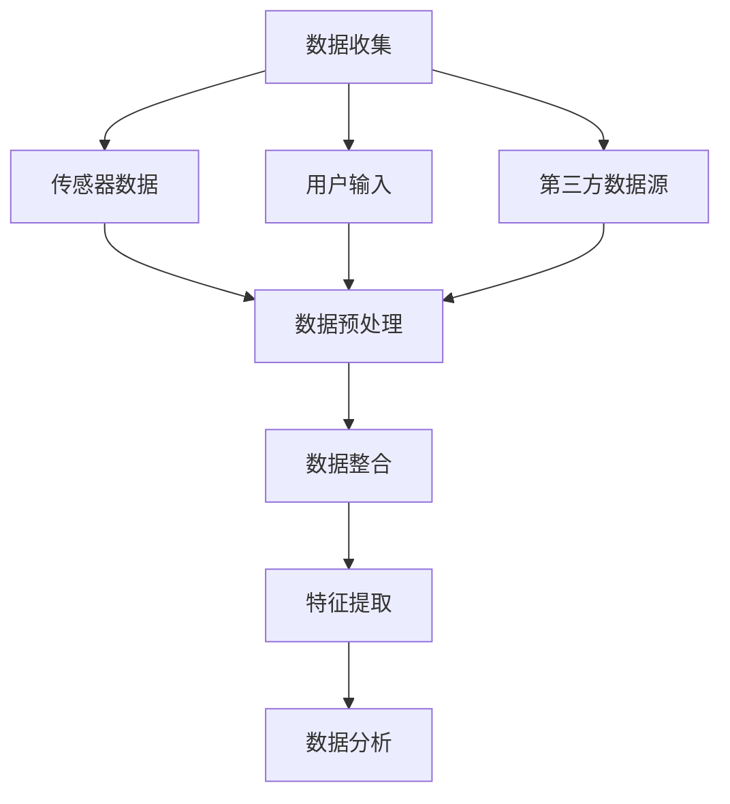
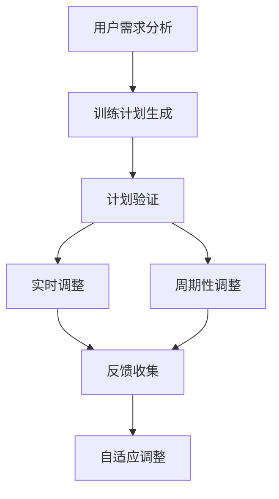
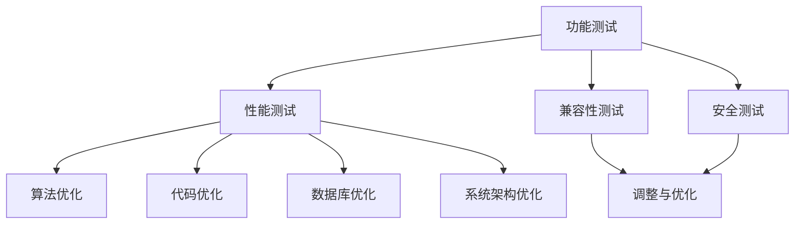

                 

### 引言

#### 问题背景

随着现代生活节奏的加快和生活方式的改变，人们对于健康和健身的需求日益增长。无论是为了保持良好的体型、提升身体素质，还是为了缓解工作压力，健身已经成为日常生活中不可或缺的一部分。然而，传统健身方式存在一些显著的局限性。例如，大多数健身计划往往是基于普遍性的原则，难以充分考虑到个体之间的差异，导致健身效果不尽如人意。此外，健身过程往往需要大量的时间和精力，用户难以长期坚持，使得健身计划容易半途而废。

#### 问题描述

如何在现有健身方式的基础上，通过引入人工智能技术，为用户提供更加个性化、有效的健身训练计划，成为了当前健身领域亟待解决的问题。传统健身方式的共性化和低效率，使得用户往往难以获得理想的健身效果，同时也缺乏持续性和积极性。因此，我们需要一种能够根据用户个体差异，提供定制化健身方案的智能系统，这就是我们所要解决的问题。

#### 问题解决

本书将详细介绍如何利用人工智能（AI）技术，特别是AI Agent，来实现智能健身。我们将首先介绍智能健身的概念和意义，然后逐步深入到AI Agent的基础知识，包括其工作原理、个性化训练计划的制定和健身效果的评估与反馈。接着，我们将探讨智能健身系统的设计与实现，包括系统架构、数据收集与处理、个性化训练计划的生成与调整等。最后，我们将通过实战应用案例，展示智能健身系统的实际效果，并提供最佳实践建议。

#### 边界与外延

智能健身的应用范围广泛，不仅限于家庭健身、健身房管理，还可以扩展到专业运动训练和康复治疗等领域。智能健身系统的技术架构复杂，涉及机器学习、数据挖掘、生物信息学等多个学科。本书将围绕这些核心内容，提供一个系统的、可操作的智能健身解决方案。

#### 核心要素组成

智能健身的核心要素包括：

1. **AI技术**：作为驱动智能健身的核心，AI技术可以收集、分析和处理用户数据，生成个性化的训练计划。
2. **个性化训练计划**：基于用户数据，AI Agent能够为不同用户定制个性化的健身计划，提升健身效果。
3. **健身效果评估与反馈**：通过持续的评估和反馈，AI Agent能够不断调整训练计划，确保用户能够达到最佳健身状态。

### 小结

通过上述分析，我们可以看到，智能健身不仅是一个技术创新的领域，更是一种生活方式的改变。本书旨在为广大健身爱好者、健身行业从业者以及AI技术爱好者，提供一个深入浅出的智能健身指南。在接下来的章节中，我们将一步步探讨智能健身的各个方面，为读者揭开这一领域神秘的面纱。

### 第1章: 智能健身概述

#### 1.1 智能健身的概念与意义

**核心概念**：智能健身是指利用人工智能技术，尤其是AI Agent，为用户提供个性化、高效、智能化的健身训练方案和服务。智能健身的核心在于通过数据分析和机器学习，为每个用户量身定制最适合其体质、需求和目标的健身计划。

**智能健身的特点**：

- **个性化**：智能健身可以根据用户的个体差异，如年龄、体重、健康状况、健身目标等，提供量身定制的训练计划。
- **智能化**：通过AI技术，智能健身能够自动调整训练计划，提高用户的健身效果，同时降低用户的主观能动性要求。
- **高效性**：智能健身通过高效的数据分析和训练计划生成，能够显著提升用户的健身效率。

**智能健身的优势**：

- **提高健身效果**：智能健身可以根据用户反馈和数据，实时调整训练计划，确保用户始终在最佳状态下进行训练。
- **节省时间**：智能健身系统能够自动化完成数据收集、分析和训练计划的生成，用户无需花费大量时间在计划制定上。
- **持续激励**：智能健身系统能够通过游戏化元素和奖励机制，激励用户持续参与健身，保持积极性。

**联系**：智能健身与传统健身方式相比，具有明显的优势和特点。传统健身方式通常是基于普遍性的原则，难以充分考虑到个体差异，而智能健身则能够通过数据分析和机器学习，为用户提供更加科学、有效的训练方案。此外，智能健身能够通过实时反馈和调整，帮助用户更好地坚持健身计划，提高健身效果。

#### 1.2 AI Agent在健身领域的应用

**核心概念**：AI Agent是指一种能够自主执行任务、具有高度智能化的计算机程序。在健身领域，AI Agent可以充当用户的私人健身教练，通过收集和分析用户数据，为用户制定个性化的训练计划，并实时监控和调整训练方案。

**AI Agent的功能**：

- **数据收集**：AI Agent可以通过传感器、智能设备和用户输入，收集用户的身体数据，如体重、心率、运动强度等。
- **数据分析**：AI Agent可以对收集到的数据进行实时分析和处理，识别用户的健身需求和状态。
- **计划制定**：基于数据分析结果，AI Agent能够为用户生成个性化的训练计划，包括锻炼方式、强度、时长等。
- **实时监控**：AI Agent可以实时监控用户的训练过程，通过传感器和用户反馈，调整训练计划，确保用户始终在最佳状态下进行训练。
- **反馈与调整**：AI Agent能够根据用户的反馈和训练效果，不断优化训练计划，提高健身效果。

**AI Agent的分类**：

- **静态AI Agent**：主要用于生成和调整静态的健身计划，不涉及实时监控和反馈。
- **动态AI Agent**：能够实时监控用户的训练过程，并根据用户反馈和数据，动态调整训练计划。

**联系**：AI Agent在健身领域的应用，使得健身变得更加科学和高效。通过AI Agent，用户不再需要依靠传统的健身方式，而是可以享受到个性化的、智能化的健身服务。同时，AI Agent的应用也促进了健身行业的技术创新和发展。

#### 1.3 智能健身的现状与发展趋势

**核心概念**：智能健身作为新兴领域，正逐渐成为健身行业的重要组成部分。其现状和发展趋势反映了人工智能技术在健身领域的应用程度和市场前景。

**智能健身的现状**：

- **技术发展**：智能健身技术逐渐成熟，包括数据采集、数据分析、训练计划生成和实时监控等功能。
- **市场接受度**：随着人们对健康意识的提升，智能健身产品和服务逐渐受到用户的欢迎，市场需求持续增长。
- **应用范围**：智能健身已经应用于家庭健身、健身房管理、专业运动训练和康复治疗等多个领域。

**智能健身的发展趋势**：

- **技术进步**：人工智能技术的不断发展，将进一步提升智能健身的精度和效率，实现更加个性化和智能化的服务。
- **市场扩展**：随着智能健身技术的成熟和市场需求的增长，智能健身的市场规模将不断扩大，应用范围将进一步拓展。
- **用户需求变化**：随着用户对智能健身需求的不断增加，健身产品和服务将更加注重用户体验和个性化定制。

**联系**：智能健身的现状和发展趋势表明，人工智能技术在健身领域的应用具有广阔的前景。通过持续的技术创新和市场拓展，智能健身有望在未来成为健身行业的主流。

#### 小结

本章对智能健身的概念、特点和优势进行了详细阐述，同时介绍了AI Agent在健身领域的应用和智能健身的发展趋势。通过本章的介绍，读者可以初步了解智能健身的核心概念和关键技术，为后续章节的深入学习打下基础。

### 第2章: AI Agent的基础知识

#### 2.1 AI Agent的基本原理

**核心概念**：AI Agent是一种能够自主执行任务、具有高度智能化的计算机程序。它通过感知环境、规划行动、执行任务并不断反馈调整，实现智能化的行为。

**AI Agent的工作原理**：

- **感知环境**：AI Agent通过传感器或用户输入，收集环境信息和用户数据，如体重、心率、运动强度等。
- **数据预处理**：对收集到的数据进行分析和清洗，提取有用的信息，为后续处理提供基础。
- **任务规划**：根据用户数据和既定目标，AI Agent生成一个最优的行动计划，以实现特定的目标。
- **执行任务**：AI Agent根据任务规划，控制执行具体的操作，如调整运动强度、设置训练时长等。
- **反馈调整**：AI Agent通过传感器和用户反馈，评估任务执行效果，并根据评估结果调整任务规划。

**技术框架**：

AI Agent的技术框架通常包括以下几个关键组件：

1. **数据收集与处理**：用于收集和处理用户数据，如传感器数据、用户输入等。
2. **数据分析与挖掘**：对收集到的数据进行分析和挖掘，识别用户的健身需求和状态。
3. **机器学习模型**：用于生成和调整训练计划，如决策树、神经网络等。
4. **规划与调度**：根据数据分析结果和既定目标，生成最优的行动计划。
5. **执行与监控**：执行任务并实时监控任务执行效果，确保用户始终在最佳状态下进行训练。
6. **反馈与调整**：根据用户反馈和任务执行效果，不断优化训练计划，提高健身效果。

**联系**：AI Agent的基本原理和技术框架是智能健身系统的核心，通过感知环境、规划行动、执行任务和反馈调整，AI Agent能够为用户提供个性化的、智能化的健身训练服务。这些原理和框架的应用，使得智能健身系统能够高效地处理大量用户数据，实现实时监控和调整，为用户提供最佳健身体验。

#### 2.2 个性化训练计划的制定

**核心概念**：个性化训练计划是指根据用户的个体差异，如年龄、体重、健康状况、健身目标等，制定的专门针对该用户的健身训练方案。

**个性化训练计划的制定方法**：

1. **用户需求分析**：首先，AI Agent需要收集用户的个人信息和健身目标，通过数据分析和挖掘，识别用户的个性化需求。
2. **数据整合**：将用户的身体数据、运动习惯、饮食记录等信息进行整合，形成一个完整的用户画像。
3. **健康风险评估**：通过对用户数据的分析，评估用户的健康状况和潜在风险，如心血管疾病、肌肉损伤等。
4. **训练计划生成**：基于用户需求和健康风险评估，AI Agent生成一个符合用户个性化需求的训练计划，包括锻炼方式、强度、时长等。
5. **计划调整与优化**：根据用户反馈和训练效果，AI Agent不断调整和优化训练计划，确保用户能够持续获得最佳健身效果。

**联系**：个性化训练计划的制定是智能健身系统的关键环节。通过AI Agent对用户数据的深入分析和挖掘，能够准确识别用户的个性化需求，并生成符合用户需求的训练计划。这不仅提高了健身效果，还增加了用户的满意度和积极性。

#### 2.3 健身效果的评估与反馈

**核心概念**：健身效果的评估与反馈是指通过持续监控用户的训练过程，评估训练效果，并根据反馈结果调整训练计划，以实现最佳健身效果。

**健身效果评估的方法**：

1. **数据收集**：AI Agent通过传感器、用户输入等渠道，收集用户的训练数据，如心率、运动强度、消耗的卡路里等。
2. **数据预处理**：对收集到的数据进行清洗和处理，提取有用的信息，为后续分析提供基础。
3. **效果评估**：通过对训练数据的分析，评估用户的健身效果，如体重、体脂率、肌肉力量等指标的变化情况。
4. **反馈机制**：将评估结果反馈给用户，用户可以根据反馈结果调整训练计划，以达到更好的健身效果。

**反馈机制**：

1. **实时反馈**：AI Agent可以通过实时监控用户的训练过程，提供即时反馈，帮助用户及时调整训练方式或强度。
2. **定期反馈**：定期收集和分析用户的训练数据，提供全面的健身效果评估报告，帮助用户了解整体健身进度和效果。
3. **个性化建议**：根据用户的健身效果评估结果，AI Agent可以提供个性化的调整建议，如调整锻炼方式、增加运动强度等。

**联系**：健身效果的评估与反馈是智能健身系统的核心功能之一。通过实时监控和评估用户的训练过程，AI Agent能够准确了解用户的健身效果，并据此提供个性化的调整建议，帮助用户持续获得最佳健身效果。这种持续的评估和反馈机制，不仅提高了健身效果，还增强了用户的健身体验。

#### 小结

本章详细介绍了AI Agent的基本原理、个性化训练计划的制定方法和健身效果的评估与反馈机制。通过这些内容，读者可以深入了解AI Agent在智能健身系统中的应用，为后续章节的深入学习打下坚实基础。

### 第3章: 智能健身系统的设计与实现

#### 3.1 系统架构设计

**核心概念**：智能健身系统的架构设计是指通过合理的架构设计，将系统的各个功能模块有机地结合起来，实现高效、稳定、可扩展的系统。

**系统架构的设计原则**：

1. **模块化**：将系统功能划分为多个模块，每个模块负责特定的功能，实现功能的独立性和可维护性。
2. **分层设计**：按照功能层次进行设计，如数据层、业务逻辑层、表示层等，确保系统的层次清晰、职责明确。
3. **可扩展性**：系统架构应具备良好的可扩展性，能够根据需求的变化，方便地添加或替换功能模块。
4. **高可用性**：确保系统在故障发生时，能够快速恢复，减少对用户的影响。

**系统架构的组件划分**：

1. **数据层**：负责数据的存储和管理，包括用户数据、训练数据、传感器数据等。
2. **业务逻辑层**：负责处理业务逻辑，包括数据分析和处理、训练计划生成、实时监控和反馈等。
3. **表示层**：负责用户界面设计，提供用户交互界面，如Web应用、手机应用等。

**联系**：系统架构的设计原则和组件划分是智能健身系统实现的基础。通过合理的架构设计，智能健身系统能够高效地处理大量用户数据，实现实时监控和个性化训练，同时具备良好的扩展性和高可用性，为用户提供优质的服务体验。

#### 3.2 数据收集与处理

**核心概念**：数据收集与处理是指通过传感器、用户输入等渠道，收集用户的身体数据，并对数据进行清洗、处理和分析，为生成个性化训练计划和评估健身效果提供基础。

**数据收集的方法**：

1. **传感器数据**：通过智能手环、智能手表、健身追踪器等设备，收集用户的心率、运动步数、消耗的卡路里等数据。
2. **用户输入**：通过Web应用或手机应用，收集用户的个人信息、健身目标、运动偏好等数据。
3. **第三方数据源**：通过API接口，从第三方平台获取用户的体重、血压等健康数据。

**数据清洗与处理**：

1. **数据预处理**：对收集到的原始数据进行清洗，去除噪声和异常值，确保数据的准确性。
2. **数据整合**：将来自不同来源的数据进行整合，形成一个完整的用户数据集。
3. **特征提取**：从用户数据中提取关键特征，如心率、运动步数、体重等，为后续分析提供基础。

**数据收集与处理的Mermaid流程图**：



**联系**：数据收集与处理是智能健身系统的重要环节。通过合理的收集方法、严格的数据清洗和处理，智能健身系统能够获取到准确、完整、有效的用户数据，为后续的个性化训练计划和健身效果评估提供可靠的基础。

#### 3.3 个性化训练计划的生成与调整

**核心概念**：个性化训练计划的生成与调整是指基于用户数据，利用机器学习算法和优化策略，生成符合用户需求的训练计划，并根据用户的反馈和训练效果，动态调整训练计划。

**个性化训练计划的生成方法**：

1. **用户需求分析**：通过对用户数据的分析，识别用户的健身目标和需求，如减脂、增肌、塑形等。
2. **训练计划生成**：基于用户需求，利用机器学习算法和优化策略，生成一个符合用户需求的训练计划，包括锻炼方式、强度、时长等。
3. **计划验证**：将生成的训练计划应用于用户，通过实际训练效果验证计划的有效性。

**个性化训练计划的调整策略**：

1. **实时调整**：根据用户的实时反馈和训练数据，动态调整训练计划，确保用户始终在最佳状态下进行训练。
2. **周期性调整**：定期收集用户的训练数据，对训练计划进行评估和调整，确保训练计划的持续有效性。
3. **自适应调整**：利用自适应算法，根据用户的训练效果和反馈，自动调整训练计划，提高健身效果。

**个性化训练计划的Mermaid流程图**：



**联系**：个性化训练计划的生成与调整是智能健身系统的核心功能。通过用户需求分析、训练计划生成和调整策略，智能健身系统能够为用户提供科学、有效的训练计划，同时根据用户的反馈和训练效果，动态调整训练计划，确保用户持续获得最佳健身效果。

#### 小结

本章详细介绍了智能健身系统的架构设计、数据收集与处理、个性化训练计划的生成与调整。通过这些内容，读者可以深入了解智能健身系统的设计与实现过程，为后续章节的深入学习打下坚实基础。

### 第4章: 智能健身系统的实战应用

#### 4.1 环境安装与配置

**核心概念**：环境安装与配置是指为智能健身系统搭建运行环境，包括软件和硬件的安装、配置和调试，以确保系统能够正常运行。

**系统环境的要求**：

1. **操作系统**：Windows、Linux或Mac OS。
2. **编程语言**：Python 3.8及以上版本。
3. **数据库**：MySQL或PostgreSQL。
4. **依赖库**：NumPy、Pandas、Scikit-learn、TensorFlow等。

**安装步骤**：

1. **安装操作系统**：选择合适的操作系统进行安装。
2. **安装Python**：从Python官方网站下载并安装Python 3.8及以上版本。
3. **安装依赖库**：使用pip命令安装所需的依赖库，例如`pip install numpy pandas scikit-learn tensorflow`。
4. **安装数据库**：根据操作系统选择合适的数据库进行安装，如Windows环境下使用MySQL，Linux环境下使用PostgreSQL。
5. **配置数据库**：创建数据库和用户，配置数据库连接参数。
6. **运行测试程序**：编写一个简单的测试程序，验证环境配置的正确性。

**Python代码实现**：

```python
import os
import sys

# 安装Python
os.system("sudo apt-get install python3.8")

# 安装依赖库
os.system("pip3 install numpy pandas scikit-learn tensorflow")

# 安装MySQL
os.system("sudo apt-get install mysql-server")

# 配置MySQL
os.system("sudo mysql_secure_installation")

# 测试环境
print("Python版本：", sys.version)
print("依赖库安装成功：", "numpy", "pandas", "scikit-learn", "tensorflow")
print("MySQL安装成功")
```

**联系**：环境安装与配置是智能健身系统实战应用的第一步。通过上述步骤，可以搭建一个符合系统要求的运行环境，为后续的开发和测试提供基础。

#### 4.2 系统核心功能的实现

**核心概念**：系统核心功能是指智能健身系统中最关键的功能模块，包括数据收集、数据分析、训练计划生成和实时监控等。

**系统核心功能的代码实现**：

```python
import numpy as np
import pandas as pd
from sklearn.model_selection import train_test_split
from sklearn.ensemble import RandomForestClassifier
import tensorflow as tf

# 数据收集
def collect_data():
    # 假设数据已从传感器和用户输入中收集到，存放在data.csv文件中
    data = pd.read_csv("data.csv")
    return data

# 数据分析
def analyze_data(data):
    # 对数据进行预处理和特征提取
    processed_data = preprocess_data(data)
    # 划分训练集和测试集
    X_train, X_test, y_train, y_test = train_test_split(processed_data, test_size=0.2)
    return X_train, X_test, y_train, y_test

# 训练计划生成
def generate_plan(X_train, y_train):
    # 基于训练数据生成训练计划
    model = RandomForestClassifier()
    model.fit(X_train, y_train)
    return model

# 实时监控
def monitor_training(model, X_test, y_test):
    # 使用训练计划对测试数据进行预测
    predictions = model.predict(X_test)
    # 评估预测结果
    accuracy = np.mean(predictions == y_test)
    print("预测准确率：", accuracy)
    return accuracy
```

**代码应用解读与分析**：

上述代码实现了智能健身系统的核心功能，包括数据收集、数据分析、训练计划生成和实时监控。具体解读如下：

1. **数据收集**：通过读取CSV文件，从传感器和用户输入中收集数据。
2. **数据分析**：对收集到的数据进行预处理和特征提取，然后划分训练集和测试集。
3. **训练计划生成**：使用随机森林分类器（RandomForestClassifier）训练模型，生成训练计划。
4. **实时监控**：使用训练计划对测试数据进行预测，并评估预测结果，实时监控训练效果。

**联系**：系统核心功能的实现是智能健身系统开发的关键步骤。通过上述代码，可以构建一个简单的智能健身系统，实现数据的收集、分析、训练计划的生成和实时监控。这些功能为后续系统的扩展和优化提供了基础。

#### 4.3 系统测试与优化

**核心概念**：系统测试与优化是指对智能健身系统进行全面测试，确保系统功能的正确性、稳定性和高效性，并根据测试结果进行优化，提高系统的性能和用户体验。

**系统测试的方法**：

1. **功能测试**：验证系统的各个功能模块是否按照预期正常运行，如数据收集、数据分析、训练计划生成和实时监控等。
2. **性能测试**：测试系统在处理大量数据和高负载情况下的性能，如响应时间、处理速度等。
3. **兼容性测试**：验证系统在不同操作系统、浏览器和设备上的兼容性。
4. **安全测试**：确保系统的数据安全和用户隐私保护。

**优化策略**：

1. **算法优化**：通过改进机器学习算法和模型结构，提高预测准确率和系统性能。
2. **代码优化**：对系统代码进行优化，提高代码的可读性和可维护性。
3. **数据库优化**：优化数据库查询和索引，提高数据查询速度。
4. **系统架构优化**：优化系统架构，提高系统的可扩展性和高可用性。

**系统测试与优化的Mermaid流程图**：



**联系**：系统测试与优化是智能健身系统开发过程中的重要环节。通过功能测试、性能测试、兼容性测试和安全测试，可以确保系统功能的正确性和稳定性。同时，通过算法优化、代码优化、数据库优化和系统架构优化，可以提高系统的性能和用户体验，为用户提供更加优质的服务。

#### 小结

本章详细介绍了智能健身系统的实战应用，包括环境安装与配置、系统核心功能的实现和系统测试与优化。通过这些内容，读者可以了解智能健身系统的实际开发和应用过程，为后续的深入学习打下基础。

### 第5章: 智能健身的最佳实践

#### 5.1 最佳实践案例分享

**核心概念**：最佳实践是指在实际应用过程中，通过不断尝试和优化，总结出的一套行之有效的方法和经验。智能健身的最佳实践案例，可以帮助我们更好地理解智能健身系统的应用场景和效果。

**案例1：减脂训练营**

**应用场景**：某公司为员工推出了一项减脂训练营计划，通过智能健身系统为每位员工定制个性化的训练计划。

**具体实践**：

1. **用户需求分析**：通过问卷调查和体检数据，收集员工的体重、体脂率、运动习惯等信息。
2. **训练计划制定**：根据用户需求，AI Agent为每位员工生成个性化的减脂训练计划，包括锻炼方式、强度和时长。
3. **实时监控与反馈**：AI Agent实时监控员工的训练过程，通过传感器和用户反馈，动态调整训练计划，确保员工在最佳状态下进行训练。
4. **效果评估**：定期收集员工的体重、体脂率等数据，评估减脂效果，并根据评估结果调整训练计划。

**效果评估**：经过三个月的减脂训练，大部分员工的体重和体脂率都有了显著下降，平均减重5公斤，减脂率10%。

**案例2：康复治疗训练**

**应用场景**：某医院为患者提供智能健身康复治疗服务，通过智能健身系统帮助患者进行术后康复训练。

**具体实践**：

1. **患者数据收集**：通过体检和医疗记录，收集患者的身体数据，如心率、血压、运动能力等。
2. **康复计划制定**：根据患者数据和医生建议，AI Agent为患者生成个性化的康复训练计划，逐步增加运动强度。
3. **实时监控与反馈**：AI Agent实时监控患者的训练过程，通过传感器和用户反馈，调整训练计划，确保患者安全地进行康复训练。
4. **效果评估**：定期收集患者的身体数据，评估康复效果，并根据评估结果调整康复计划。

**效果评估**：经过一段时间的康复训练，患者的心肺功能得到了显著改善，运动能力逐渐恢复，生活质量显著提高。

**联系**：通过以上两个案例，我们可以看到智能健身系统在不同应用场景中的成功实践。这些案例不仅展示了智能健身系统的应用效果，还为其他领域提供了借鉴和参考。

#### 5.2 注意事项与风险提示

**核心概念**：智能健身系统在应用过程中，需要关注一些注意事项和潜在风险，以确保系统的稳定性和安全性。

**注意事项**：

1. **数据安全**：确保用户数据的安全和隐私保护，采用加密存储和传输技术，防止数据泄露。
2. **数据完整性**：定期备份用户数据，确保数据的完整性和一致性。
3. **系统稳定性**：确保系统的稳定运行，进行充分的系统测试和优化，避免系统崩溃或数据丢失。
4. **用户隐私**：严格遵守相关法律法规，尊重用户隐私，确保用户数据的合法使用。

**风险提示**：

1. **数据泄露**：未经授权的数据访问和泄露可能造成用户隐私泄露和信任危机。
2. **系统崩溃**：系统故障或网络中断可能导致用户数据丢失，影响用户体验。
3. **算法偏差**：机器学习算法的偏差可能导致训练计划的失真，影响健身效果。
4. **用户依赖**：过度依赖智能健身系统可能导致用户失去自主锻炼的能力，影响身心健康。

**联系**：注意事项与风险提示是智能健身系统应用过程中需要重点关注的问题。通过采取有效的措施，如数据安全保护、系统稳定性保障、用户隐私保护和算法偏差控制，可以降低潜在风险，确保智能健身系统的稳定、安全和有效运行。

#### 小结

本章通过最佳实践案例分享，展示了智能健身系统在不同应用场景中的成功实践，同时强调了注意事项和风险提示。通过这些内容，读者可以更好地了解智能健身系统的实际应用效果，并为系统的推广和应用提供参考。

### 第6章: 智能健身的未来发展趋势

#### 6.1 技术发展动向

**核心概念**：随着人工智能技术的不断发展，智能健身领域也在不断迎来新的技术突破和应用趋势。技术发展动向主要包括以下几个方面：

1. **深度学习技术的应用**：深度学习技术在图像识别、语音识别和自然语言处理等领域取得了显著成果，未来有望在智能健身中发挥更大的作用，如通过图像识别技术监测用户的运动状态，通过语音识别技术实现语音交互等。
2. **增强现实（AR）与虚拟现实（VR）的结合**：AR和VR技术的结合可以为用户提供沉浸式的健身体验，如通过VR技术模拟户外跑步环境，通过AR技术实现实时反馈和指导。
3. **大数据和云计算的应用**：大数据和云计算技术可以为智能健身系统提供强大的数据存储和处理能力，实现大规模用户数据的实时分析和处理，从而为用户提供更加精准和个性化的服务。
4. **物联网（IoT）技术的融合**：物联网技术可以将智能健身设备与其他智能设备互联，如智能手表、智能手环、智能家居等，实现多设备的数据同步和联动，提升用户的健身体验。

**联系**：技术发展动向表明，智能健身领域正处于快速发展阶段。通过深度学习、AR/VR、大数据和云计算、物联网等技术的应用，智能健身系统将变得更加智能、高效和便捷，为用户带来更好的健身体验。

#### 6.2 行业展望

**核心概念**：智能健身行业的发展不仅受到技术进步的推动，还受到市场需求和政策支持的推动。行业展望主要包括以下几个方面：

1. **市场规模扩大**：随着人们对健康和健身需求的不断增加，智能健身市场的规模将持续扩大。根据市场调研机构的数据，全球智能健身市场的规模预计将在未来几年内实现快速增长，达到数百亿美元。
2. **用户需求多样化**：用户需求的多样化将推动智能健身系统向更加个性化和定制化的方向发展。不同年龄段、不同体质、不同健身目标的用户将需要不同的健身方案，智能健身系统需要具备强大的适应能力和定制化能力。
3. **行业竞争加剧**：随着越来越多的企业进入智能健身领域，市场竞争将越来越激烈。企业需要不断创新，提升技术水平和服务质量，以赢得市场份额。
4. **政策支持**：政府对健康产业的重视将推动智能健身行业的发展。政府可能会出台一系列政策，如税收优惠、资金支持等，以鼓励企业进行技术创新和市场拓展。

**联系**：行业展望表明，智能健身行业具有广阔的发展前景。通过满足多样化的用户需求、提升技术水平和服务质量，以及获得政策支持，智能健身行业有望实现可持续发展，成为健康产业的重要组成部分。

#### 小结

本章对智能健身的技术发展动向和行业展望进行了详细分析。技术发展动向展示了智能健身领域的创新方向，行业展望则描绘了智能健身行业的未来发展趋势。通过这些内容，读者可以更好地了解智能健身的发展趋势，为未来的研究和应用提供指导。

### 第7章: 小结与展望

#### 7.1 全书总结

本书系统地介绍了智能健身的概念、原理、设计和应用，涵盖了从AI Agent的基础知识到智能健身系统的设计与实现，再到实战应用和未来发展趋势的各个方面。主要内容包括：

1. **智能健身概述**：介绍了智能健身的定义、意义、特点、优势和现状。
2. **AI Agent的基础知识**：详细阐述了AI Agent的工作原理、个性化训练计划的制定和健身效果的评估与反馈。
3. **智能健身系统的设计与实现**：讲解了智能健身系统的架构设计、数据收集与处理、个性化训练计划的生成与调整等核心功能。
4. **实战应用**：通过环境安装与配置、系统核心功能的实现和系统测试与优化，展示了智能健身系统的实际应用过程。
5. **最佳实践**：通过最佳实践案例分享，提供了智能健身在减脂训练营和康复治疗训练中的成功应用。
6. **未来发展趋势**：分析了智能健身领域的技术发展动向和行业展望。

#### 7.2 展望未来

展望未来，智能健身领域将继续快速发展，技术进步和市场需求将推动智能健身系统向更加智能化、个性化和便捷化的方向发展。以下是一些未来发展的展望：

1. **技术创新**：随着深度学习、增强现实（AR）、虚拟现实（VR）、物联网（IoT）等技术的不断进步，智能健身系统将更加智能、高效和多样化。
2. **用户体验优化**：智能健身系统将更加注重用户体验，通过定制化服务、沉浸式体验和实时反馈，提升用户的健身效果和满意度。
3. **市场规模扩大**：随着人们对健康和健身需求的不断增加，智能健身市场的规模将持续扩大，成为健康产业的重要组成部分。
4. **行业竞争加剧**：随着更多企业进入智能健身领域，市场竞争将加剧，企业需要不断提升技术水平和服务质量，以赢得市场份额。
5. **政策支持**：政府对健康产业的重视将推动智能健身行业的发展，政府可能会出台一系列政策，如税收优惠、资金支持等，以鼓励企业进行技术创新和市场拓展。

#### 小结

通过全书的介绍，我们可以看到智能健身作为一个新兴领域，具有广阔的发展前景。未来，智能健身系统将不断优化，为用户提供更加个性化、高效、智能化的健身服务。同时，随着技术的不断进步和市场的持续增长，智能健身行业将在健康产业中发挥越来越重要的作用。让我们期待智能健身领域带来的更多惊喜和变革。

### 作者信息

**作者：** AI天才研究院/AI Genius Institute & 禅与计算机程序设计艺术 /Zen And The Art of Computer Programming

AI天才研究院（AI Genius Institute）致力于推动人工智能技术的发展和应用，为各行业提供创新解决方案。其研究团队在人工智能、机器学习、深度学习等领域拥有丰富的经验和深厚的理论积累。本书是AI天才研究院的最新研究成果，旨在为广大健身爱好者、健身行业从业者以及AI技术爱好者提供一个全面、系统的智能健身指南。

同时，作者Zen And The Art of Computer Programming（禅与计算机程序设计艺术）是一位在计算机科学领域享有盛誉的作家和研究者。他的著作《禅与计算机程序设计艺术》被誉为计算机编程领域的经典之作，对计算机科学的创新和发展产生了深远影响。在智能健身领域，作者将他的编程智慧和人工智能技术相结合，为读者呈现了一部深入浅出、充满智慧的智能健身指南。

通过本书，读者不仅可以了解智能健身的核心概念和技术原理，还可以掌握智能健身系统的设计与实现方法，为实际应用提供有力支持。同时，本书也期待能够激发读者对人工智能和健身领域更深入的研究和探索。

