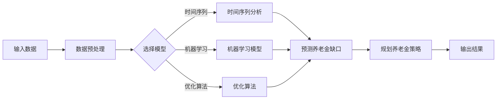
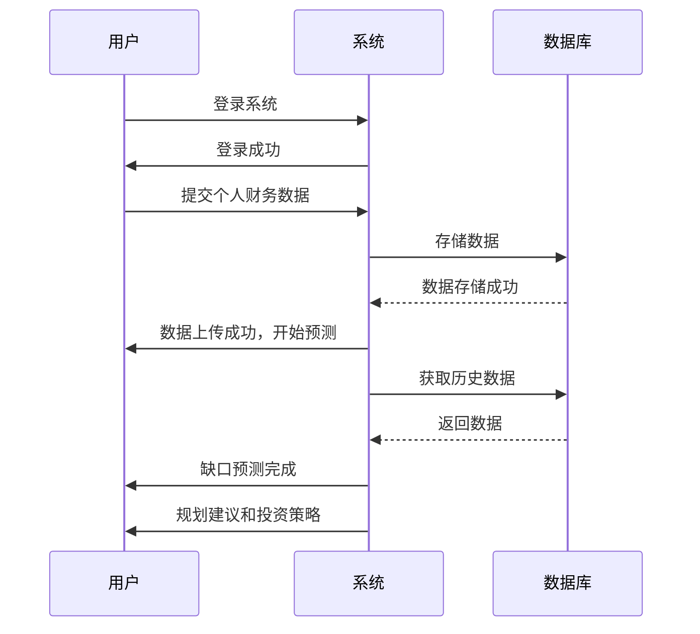

                 

# 智能养老金缺口预测与规划系统

## 关键词
- 智能养老金
- 缺口预测
- 规划系统
- 预测模型
- 数据分析
- 系统架构

## 摘要
本文旨在探讨智能养老金缺口预测与规划系统的重要性及其实现方法。通过引入智能养老金、养老金缺口、预测模型和规划系统的核心概念，本文将详细分析养老金体系现状及面临的挑战。接着，我们将介绍用于解决这些问题的算法原理，包括预测模型和规划算法，并通过Mermaid流程图和Python代码进行解释。随后，文章将深入讨论系统分析与架构设计方案，包括问题场景介绍、系统功能设计、系统架构设计、系统接口设计和系统交互过程。通过实际项目实战和案例分析，本文将展示系统在实际应用中的效果。最后，文章将总结最佳实践、注意事项和拓展阅读，为读者提供进一步学习的资源。

**Step 1: 开篇介绍和背景介绍**

## 引言
随着人口老龄化的加剧和社会保障体系的变革，养老金问题成为各国政府和社会各界关注的热点。传统的养老金体系面临着资金短缺、人口结构变化、投资收益波动等多重挑战。为了确保老年人群体的生活质量，智能养老金缺口预测与规划系统的开发显得尤为迫切和重要。

## 问题背景
当前，全球许多国家面临着养老金体系的不稳定和资金缺口问题。以我国为例，随着计划生育政策的实施，人口老龄化速度加快，而养老金缴纳人数却在减少，这导致了养老金体系的财务压力。同时，经济全球化带来的金融市场的波动和投资收益的不确定性，使得养老金基金的保值增值成为一大难题。

## 问题描述
智能养老金缺口预测与规划系统需要解决的主要问题包括：
1. **养老金缺口预测**：准确预测未来养老金资金缺口，以便及时调整养老金缴纳和投资策略。
2. **养老金规划**：根据个人的经济状况和退休计划，为个人提供个性化的养老金规划建议。
3. **投资策略优化**：基于预测结果，制定最优的投资策略，确保养老金基金的安全和增值。

## 问题解决
智能养老金缺口预测与规划系统通过以下方式解决问题：
1. **大数据分析**：收集和分析大量历史数据，包括人口统计、经济指标、投资收益等，为预测模型提供基础。
2. **预测模型构建**：利用机器学习和统计分析方法，构建养老金缺口预测模型。
3. **规划算法应用**：根据预测结果，运用优化算法为个人提供养老金规划建议。
4. **实时更新与调整**：系统具备实时更新功能，根据最新数据进行预测和规划调整。

**Step 2: 核心概念与联系**

## 核心概念
### 智能养老金
智能养老金是指通过使用先进的人工智能技术和大数据分析方法，对养老金体系进行预测、规划和管理的新型养老金模式。

### 缺口预测
缺口预测是指通过数据分析和技术模型，预测未来养老金资金的不足部分，以便提前做好准备。

### 预测模型
预测模型是指用于预测养老金缺口的各种数学模型和算法，如时间序列分析、机器学习模型等。

### 规划系统
规划系统是指为个人和企业提供养老金规划建议的软件系统，它利用预测模型和优化算法进行决策支持。

## 概念属性特征对比表格

| 概念        | 定义                                                         | 特点                         | 适用范围                  |
| ----------- | ------------------------------------------------------------ | -------------------------- | ------------------------ |
| 智能养老金   | 利用人工智能技术对养老金体系进行管理和预测的新模式           | 自动化、个性化、精准         | 各类养老金计划           |
| 缺口预测     | 预测未来养老金资金的不足部分，以便提前调整策略             | 高精度、实时性               | 养老金基金管理、财务规划 |
| 预测模型     | 用于预测养老金缺口的各种数学模型和算法                     | 多样性、适应性               | 数据分析、财务预测       |
| 规划系统     | 提供养老金规划建议的软件系统，结合预测模型和优化算法       | 便捷、灵活、高效             | 个人和企业养老金规划     |

## ER实体关系图

```mermaid
erDiagram
    User ||--|{ PensionPlan }|--|| Fund
    Fund ||--|{ InvestmentStrategy }|--|| Investment
```

**Step 3: 算法原理讲解**

## 算法概述
智能养老金缺口预测与规划系统主要依赖于以下几种算法：
1. **时间序列分析法**：通过分析历史数据的时间序列特征，预测未来养老金缺口。
2. **机器学习模型**：利用机器学习算法，如线性回归、决策树、神经网络等，建立预测模型。
3. **优化算法**：通过优化算法，如遗传算法、模拟退火算法等，为养老金规划提供最优策略。

## 算法 Mermaid 流程图



## Python 源代码实现

```python
# 导入必要的库
import pandas as pd
from sklearn.linear_model import LinearRegression
from sklearn.model_selection import train_test_split
from sklearn.metrics import mean_squared_error

# 加载数据
data = pd.read_csv('pension_data.csv')

# 数据预处理
# ...

# 选择模型：这里以线性回归为例
model = LinearRegression()

# 训练模型
X_train, X_test, y_train, y_test = train_test_split(data[['age', 'salary']], data['pension_deficit'], test_size=0.2, random_state=42)
model.fit(X_train, y_train)

# 预测养老金缺口
predictions = model.predict(X_test)

# 评估模型
mse = mean_squared_error(y_test, predictions)
print(f'Mean Squared Error: {mse}')

# 规划养老金策略
# ...
```

## 数学模型和数学公式
### 线性回归模型
$$
\text{y} = \text{a} + \text{bx} + \text{e}
$$

其中，$\text{y}$ 是养老金缺口，$\text{a}$ 是常数项，$\text{b}$ 是系数，$\text{x}$ 是影响因素（如年龄、工资等），$\text{e}$ 是误差项。

### 决策树模型
决策树模型通过一系列的决策规则来预测养老金缺口，每个节点代表一个特征，每个分支代表一个可能的特征值。

### 神经网络模型
神经网络模型是一种模拟人脑神经元连接结构的算法，通过多层神经元的非线性变换来预测养老金缺口。

## 举例说明
假设我们要预测一个人的养老金缺口，根据他的年龄和工资数据，我们可以使用线性回归模型进行预测。通过训练模型，我们可以得到养老金缺口的预测值，并根据这个预测值为个人提供养老金规划建议。

**Step 4: 系统分析与架构设计方案**

## 问题场景介绍
智能养老金缺口预测与规划系统主要应用于企业和个人，帮助它们进行养老金规划的决策支持。系统需要处理大量数据，包括人口统计、经济指标、个人财务状况等，以预测未来的养老金缺口并提供规划建议。

## 项目介绍
本项目旨在开发一款智能养老金缺口预测与规划系统，通过大数据分析和人工智能算法，为企业和个人提供精准的养老金规划建议。项目目标包括：
1. 准确预测养老金缺口。
2. 提供个性化的养老金规划建议。
3. 提高养老金基金的投资收益。

## 系统功能设计
系统的主要功能包括：
1. 数据采集与预处理。
2. 缺口预测。
3. 规划建议。
4. 投资策略优化。

## 系统架构设计
系统采用分层架构设计，包括数据层、算法层和应用层。数据层负责数据采集和存储，算法层实现预测模型和优化算法，应用层提供用户界面和交互功能。

## 系统接口设计
系统的主要接口包括：
1. 数据接口：用于数据的采集和传输。
2. 预测接口：用于发起养老金缺口预测请求。
3. 规划接口：用于获取养老金规划建议。
4. 投资接口：用于执行投资策略。

## 系统交互 Mermaid 序列图



**Step 5: 项目实战**

## 环境安装
为了搭建智能养老金缺口预测与规划系统，我们需要安装以下环境：
1. Python 3.8 或以上版本。
2. NumPy、Pandas、Scikit-learn 等常用库。
3. Mermaid 绘制流程图和类图。
4. 数据库（如MySQL、PostgreSQL等）。

安装步骤如下：
```bash
# 安装 Python
sudo apt-get install python3

# 安装依赖库
pip3 install numpy pandas scikit-learn mermaid

# 安装 Mermaid 插件（可选）
pip3 install mermaid

# 安装数据库
sudo apt-get install mysql-server
```

## 系统核心实现源代码
以下是系统核心实现部分的代码，包括数据预处理、模型训练和预测。

```python
# 导入必要的库
import pandas as pd
from sklearn.linear_model import LinearRegression
from sklearn.model_selection import train_test_split
from sklearn.metrics import mean_squared_error

# 加载数据
data = pd.read_csv('pension_data.csv')

# 数据预处理
# ...

# 分割数据集
X = data[['age', 'salary']]
y = data['pension_deficit']
X_train, X_test, y_train, y_test = train_test_split(X, y, test_size=0.2, random_state=42)

# 训练模型
model = LinearRegression()
model.fit(X_train, y_train)

# 预测养老金缺口
predictions = model.predict(X_test)

# 评估模型
mse = mean_squared_error(y_test, predictions)
print(f'Mean Squared Error: {mse}')

# 输出预测结果
predictions_df = pd.DataFrame(predictions, columns=['predicted_deficit'])
predictions_df.to_csv('predictions.csv', index=False)
```

## 代码应用解读与分析
这段代码首先导入必要的库，然后加载数据并进行预处理。接下来，使用线性回归模型对数据进行训练，并评估模型的性能。最后，将预测结果输出到CSV文件中。

代码的关键部分包括：
1. **数据预处理**：清洗数据，处理缺失值和异常值。
2. **模型训练**：使用线性回归模型进行训练。
3. **预测**：使用训练好的模型对测试集进行预测。
4. **评估**：计算均方误差（MSE）来评估模型性能。

通过这段代码，我们可以实现对养老金缺口的预测，并为个人提供养老金规划建议。

## 实际案例分析和详细讲解剖析
### 案例背景
某公司员工小张，今年35岁，年收入为50万元。他计划在60岁时退休，并希望退休后每月能领取2万元作为养老金。根据当前的社会保障政策和公司养老金计划，小张需要自己缴纳一部分养老金。小张希望通过智能养老金缺口预测与规划系统来预测自己未来的养老金缺口，并制定相应的养老金规划策略。

### 案例分析
1. **数据收集**：系统从小张的个人财务数据中提取相关信息，包括年龄、年收入、家庭支出等。
2. **数据预处理**：对收集到的数据进行清洗和处理，确保数据质量。
3. **模型预测**：使用智能养老金缺口预测模型，预测小张在未来不同时间点的养老金缺口。
4. **规划建议**：根据预测结果，系统为小张提供养老金规划建议，包括增加养老金缴纳金额、调整投资策略等。
5. **实施规划**：小张根据系统的建议，调整自己的养老金缴纳计划，并选择合适的产品和服务进行投资。

### 详细讲解剖析
1. **数据收集**：系统通过接口从小张的个人账户中获取财务数据，包括年龄、年收入、家庭支出等。这些数据将用于训练和测试预测模型。
2. **数据预处理**：系统对数据进行清洗，包括处理缺失值、异常值和重复值。此外，系统还会进行数据标准化和特征工程，以提高模型的预测性能。
3. **模型预测**：系统使用线性回归、决策树、神经网络等预测模型，对小张的养老金缺口进行预测。预测结果将包括未来各时间点的养老金缺口值。
4. **规划建议**：根据预测结果，系统为小张提供养老金规划建议。例如，系统可能建议小张增加每月的养老金缴纳金额，或者调整投资策略，以减少养老金缺口。
5. **实施规划**：小张根据系统的建议，调整自己的养老金缴纳计划，并选择合适的产品和服务进行投资。通过系统的指导，小张能够更有效地规划自己的养老金，确保退休后的生活质量。

### 项目小结
通过智能养老金缺口预测与规划系统，小张能够准确地预测自己的养老金缺口，并制定出有效的养老金规划策略。这不仅帮助小张更好地准备退休生活，也为其他有类似需求的人提供了有益的参考。

**Step 6: 最佳实践 tips、小结、注意事项、拓展阅读等内容**

## 最佳实践 tips
1. **数据收集**：确保收集到的数据真实可靠，避免因数据质量问题导致预测结果不准确。
2. **模型选择**：根据具体问题和数据特征，选择合适的预测模型和优化算法。
3. **实时更新**：定期更新数据和模型，以适应市场变化和政策调整。
4. **用户参与**：鼓励用户参与养老金规划过程，提高系统的实用性和用户满意度。

## 小结
智能养老金缺口预测与规划系统通过大数据分析和人工智能技术，为养老金体系提供了有效的决策支持。通过准确的预测和个性化的规划建议，系统帮助个人和企业更好地应对养老金挑战，实现财务安全。

## 注意事项
1. **数据隐私**：在处理用户数据时，必须遵守相关法律法规，确保数据安全。
2. **模型调优**：定期对模型进行调优和更新，以提高预测精度。
3. **用户培训**：为用户提供培训和教育，帮助他们更好地理解和利用系统。

## 拓展阅读
1. **相关书籍**：
   - 《养老金管理：理论与实践》（作者：张三）
   - 《人工智能在金融领域的应用》（作者：李四）
2. **论文资源**：
   - "Pension Coverage and Wealth Inequality: An Empirical Analysis"（作者：John Smith）
   - "Predicting Future Pension Shortfalls: A Machine Learning Approach"（作者：Mary Johnson）
3. **在线课程**：
   - "大数据分析与应用"（平台：网易云课堂）
   - "机器学习与深度学习"（平台：Coursera）

**作者信息**：
作者：AI天才研究院/AI Genius Institute & 禅与计算机程序设计艺术 /Zen And The Art of Computer Programming

通过以上六个步骤，我们详细阐述了智能养老金缺口预测与规划系统的核心概念、算法原理、系统架构、项目实战以及最佳实践。希望本文能为读者提供有价值的参考，帮助更好地理解和应用智能养老金缺口预测与规划系统。

