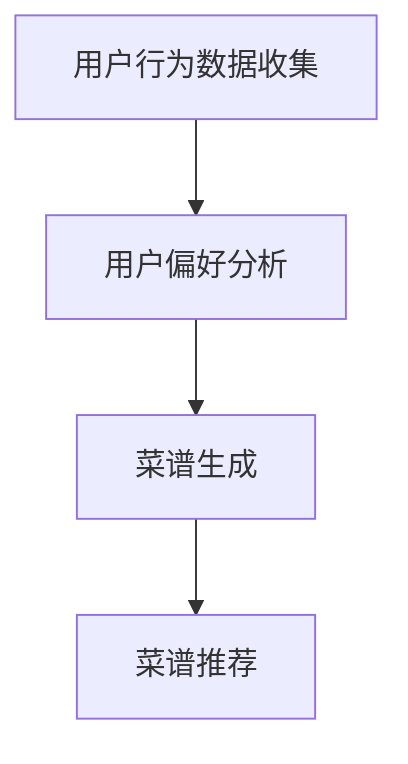
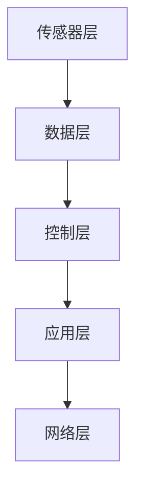
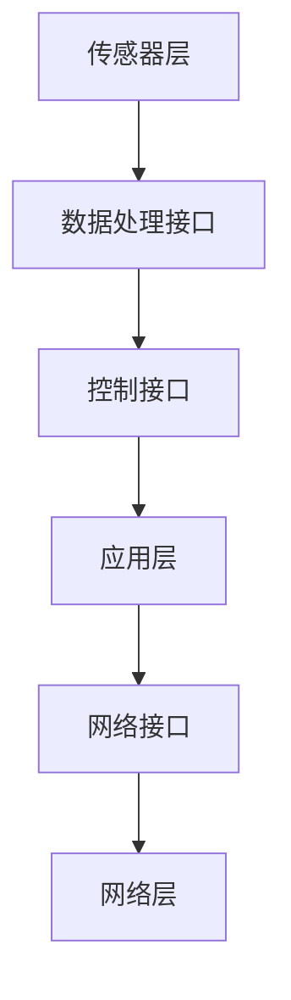
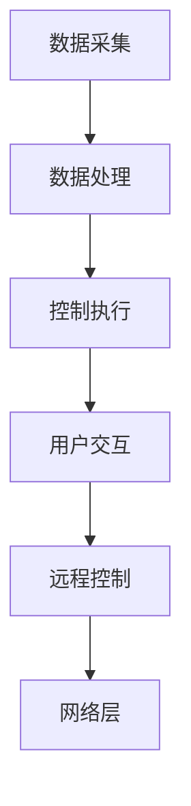
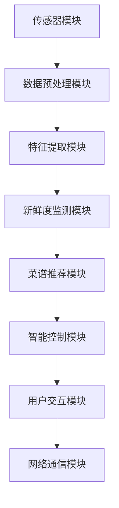

                 

### 摘要

智能冰箱作为智能家居领域的关键设备，正逐渐改变我们的生活方式。本文以《智能冰箱：AI Agent的食材新鲜度监测与菜谱推荐》为题，深入探讨人工智能（AI）代理在智能冰箱中的应用。通过详细解析AI代理如何监测食材新鲜度，并基于此提供个性化菜谱推荐，本文旨在展示AI技术如何提升家庭烹饪体验。本文首先介绍了智能冰箱的背景和发展趋势，随后深入分析了AI代理的核心概念与工作原理，重点讨论了在食材新鲜度监测和菜谱推荐中的具体应用，包括算法原理、数学模型、系统架构及实际项目案例。文章总结提出了最佳实践和注意事项，为未来智能冰箱的发展提供了宝贵建议。关键词：智能冰箱，AI代理，食材新鲜度监测，菜谱推荐。

## 目录大纲设计思路

为了确保《智能冰箱：AI Agent的食材新鲜度监测与菜谱推荐》这篇文章的逻辑清晰、内容丰富且易于理解，我们制定了详细的目录大纲，以下是其设计思路：

### 1. 背景介绍

**第1章：智能冰箱的背景与发展**

在这一章节中，我们将介绍智能冰箱的背景，包括其兴起的原因、技术发展的脉络以及市场趋势。这一部分将为后续内容提供基础背景信息，帮助读者理解智能冰箱的重要性及其应用场景。

### 2. 核心概念与联系

**第2章：AI Agent的概念与特点**

在这一章节，我们将定义并详细阐述AI Agent的概念，解释其如何在智能冰箱中发挥作用。此外，还将讨论AI Agent与食材新鲜度监测、菜谱推荐之间的联系，并绘制相关的概念属性对比表格和实体关系图，帮助读者理解核心概念。

### 3. 算法原理讲解

**第3章：食材新鲜度监测的算法原理**

我们将详细介绍AI Agent在食材新鲜度监测中的应用，包括算法流程、mermaid流程图、Python源代码示例以及相关的数学模型和公式。这一章节的目标是让读者深入理解如何通过算法实现食材新鲜度的智能监测。

**第4章：菜谱推荐系统的构建**

这一章节将探讨AI代理在菜谱推荐系统中的应用，包括算法原理、mermaid流程图、Python源代码示例以及相关的数学模型和公式。通过这一章节，读者将了解如何构建一个高效的菜谱推荐系统。

### 4. 数学模型与公式

**第5章：数学模型与公式**

在这一章节中，我们将详细介绍与食材新鲜度监测和菜谱推荐相关的数学模型和公式，并进行详细的解释和举例说明。通过这一章节，读者将掌握如何应用数学模型来解决实际问题。

### 5. 系统分析与架构设计方案

**第6章：智能冰箱系统设计与实现**

在这一章节，我们将深入分析智能冰箱的系统功能设计、架构设计、接口设计以及系统交互流程。通过mermaid类图、架构图和序列图，我们将展示智能冰箱的系统架构，并解释其工作原理。

### 6. 项目实战

**第7章：智能冰箱项目实战**

在这一章节，我们将通过一个具体的实战案例，展示如何安装智能冰箱环境、实现核心功能并分析实际应用案例。通过这一章节，读者将了解如何将理论知识应用到实际项目中。

### 7. 最佳实践、小结与注意事项

**第8章：最佳实践与拓展阅读**

在文章的最后，我们将总结最佳实践经验，并提供拓展阅读建议，帮助读者进一步探索智能冰箱和AI代理的深度应用。此外，我们还将对文章内容进行小结，并指出需要注意的事项。

通过以上设计思路，本文旨在为读者提供一个全面、系统且易于理解的技术指南，帮助他们深入了解智能冰箱及其AI代理技术的应用。

### 智能冰箱的背景与发展

智能冰箱作为智能家居领域的重要一环，其发展历程可以追溯到上世纪末。随着互联网技术的普及和物联网（IoT）概念的兴起，智能冰箱逐渐从实验室走向市场，成为现代家庭生活中不可或缺的一部分。智能冰箱不仅具备传统冰箱的基本功能，如冷藏、冷冻、除菌等，还引入了人工智能（AI）技术，实现了食材新鲜度监测、智能提醒、菜谱推荐等创新功能。

#### 智能家电的兴起

智能家电是智能家居的基石，其发展离不开物联网、云计算、大数据、人工智能等新兴技术的推动。物联网技术的普及，使得各种家电设备能够通过网络实现互联互通，形成智能家庭生态。例如，通过WiFi、蓝牙等无线技术，智能冰箱可以与手机、平板等移动设备进行连接，实现远程控制和管理。云计算技术则为智能冰箱提供了强大的数据处理能力，使其能够快速处理和分析海量数据，提升用户体验。大数据技术则帮助智能冰箱更好地了解用户需求，提供个性化的服务。而人工智能技术，则让智能冰箱具备了自主学习和优化的能力，从而实现更加智能化和个性化的服务。

#### 人工智能在家庭设备中的应用

人工智能在家庭设备中的应用，正在逐步改变我们的生活方式。以智能冰箱为例，AI技术不仅提升了其功能，还带来了全新的用户体验。首先，在食材管理方面，智能冰箱通过传感器实时监测食材的新鲜度，利用机器学习算法分析食材的存储环境和使用寿命，为用户提供建议和提醒。例如，当冰箱内的蔬菜或水果即将过期时，智能冰箱可以自动提醒用户，或者根据食材的库存情况推荐食谱。其次，在菜谱推荐方面，智能冰箱可以根据用户的饮食习惯和食材库存，利用推荐算法为用户推荐适合的菜谱。这不仅节省了用户搜索菜谱的时间，还能帮助用户更好地利用冰箱中的食材。此外，智能冰箱还可以通过语音识别和自然语言处理技术，与用户进行语音交互，实现更加便捷的操作。

#### AI Agent的概念与特点

AI Agent，即人工智能代理，是一种能够自主行动并具有目标的人工智能实体。在智能冰箱中，AI Agent充当了一个智能管理者的角色，负责监测食材新鲜度、推荐菜谱、控制温度等任务。AI Agent的特点包括：

1. **自主性**：AI Agent可以自主行动，无需人工干预，根据预设的规则和算法自动执行任务。
2. **适应性**：AI Agent能够根据环境和用户需求的变化，自动调整其行为和策略，以实现最优效果。
3. **交互性**：AI Agent可以通过传感器、屏幕、语音等手段与用户进行交互，获取用户反馈，不断优化自身性能。
4. **智能性**：AI Agent具备机器学习、深度学习等能力，能够从海量数据中学习和提取规律，提高决策的准确性。

#### 智能冰箱的发展现状与未来趋势

当前，智能冰箱已经进入了快速发展的阶段。根据市场研究机构的统计数据，全球智能冰箱的市场规模持续增长，预计未来几年内将保持高速增长。智能冰箱在功能上已经实现了从单一保鲜到多方位智能管理的转变，包括食材新鲜度监测、智能提醒、菜谱推荐、语音控制等。然而，智能冰箱的发展也面临一些挑战，如技术成本高、用户接受度低等。未来，智能冰箱的发展趋势将主要体现在以下几个方面：

1. **技术进步**：随着人工智能、物联网、传感器等技术的不断进步，智能冰箱的功能将更加丰富，用户体验将更加出色。
2. **智能化升级**：智能冰箱将不仅仅是家电设备，而是一个具有高度智能化的家庭中心，能够与其他智能家居设备互联互通，实现家庭智能化管理。
3. **个性化服务**：通过大数据分析和机器学习算法，智能冰箱将能够更精准地了解用户需求，提供个性化的服务，提升用户满意度。
4. **绿色环保**：智能冰箱将更加注重节能环保，通过智能控制技术实现能源的高效利用，减少对环境的影响。

总之，智能冰箱的发展是智能家居领域的重要方向，AI Agent的应用是其关键驱动力。通过不断的技术创新和应用实践，智能冰箱将为用户带来更加便捷、智能和个性化的生活体验。

## AI Agent的概念与特点

AI Agent，即人工智能代理，是一种自主决策并执行任务的智能实体。在智能冰箱的背景下，AI Agent充当了一个智能管理的角色，通过传感器数据采集、机器学习算法分析、以及与用户交互，实现食材新鲜度监测和菜谱推荐等功能。以下是AI Agent的核心概念与特点：

### AI Agent的定义

AI Agent通常被定义为一种具有目标、感知和行动能力的智能系统。它们可以在特定环境中自主决策并执行任务，以实现特定目标。在智能冰箱中，AI Agent的目标是优化食材管理、延长食材使用寿命、提升用户体验。AI Agent能够感知冰箱内部的环境变化，如温度、湿度、食材新鲜度等，并基于这些感知数据进行分析和决策。

### AI Agent的特点

1. **自主性**：AI Agent具有自主决策能力，能够根据预设的规则和算法，自主执行任务，如监测食材新鲜度、调整温度设置、推荐菜谱等。这种自主性使得AI Agent能够在无需人工干预的情况下，持续优化冰箱的运行状态。

2. **适应性**：AI Agent能够根据环境和用户需求的变化，自适应地调整其行为和策略。例如，当冰箱内的某种食材即将过期时，AI Agent可以自动调整推荐的食谱，以充分利用即将过期的食材。

3. **交互性**：AI Agent通过与用户交互，获取用户反馈和需求，从而不断优化自身性能。例如，用户可以通过语音或屏幕界面与AI Agent进行交流，请求推荐食谱或调整冰箱设置。

4. **智能性**：AI Agent利用机器学习、深度学习等先进的人工智能技术，从海量数据中学习和提取规律，提高决策的准确性和效率。例如，AI Agent可以通过分析用户的饮食习惯和历史数据，为用户提供个性化的菜谱推荐。

### AI Agent在智能家电中的角色

AI Agent在智能家电中的应用，极大地提升了家庭设备的管理水平。在智能冰箱中，AI Agent的主要角色包括：

1. **食材新鲜度监测**：通过传感器实时监测冰箱内食材的温度、湿度等环境参数，结合机器学习算法，AI Agent能够预测食材的新鲜度，并提供预警。

2. **菜谱推荐**：基于用户的历史饮食习惯和冰箱内的食材库存，AI Agent能够为用户推荐合适的菜谱，帮助用户更好地利用食材。

3. **温度控制**：AI Agent可以根据食材类型和新鲜度，自动调整冰箱的温度设置，确保食材的最佳保存状态。

4. **设备维护提醒**：AI Agent可以监测智能冰箱的运行状态，及时发现潜在故障或异常情况，并提醒用户进行维护。

通过上述功能，AI Agent不仅提升了智能冰箱的智能化水平，还为用户带来了更加便捷和高效的使用体验。

### 智能冰箱的发展现状与未来趋势

智能冰箱作为智能家居领域的重要一环，其发展现状和未来趋势备受关注。当前，智能冰箱已经在市场上取得了一定的普及，主要表现在以下几个方面：

1. **技术成熟度**：智能冰箱的技术已经相对成熟，包括传感器技术、机器学习算法、物联网技术等。这些技术的应用，使得智能冰箱能够实现食材新鲜度监测、智能提醒、菜谱推荐等功能。

2. **市场接受度**：随着智能家居理念的普及，用户对智能冰箱的接受度逐渐提高。特别是在大城市和发达地区，智能冰箱已经成为家庭生活的一部分。

3. **功能多样化**：现代智能冰箱不仅具备基本的冷藏、冷冻功能，还集成了多种智能功能，如智能提醒、健康检测、语音交互等。这些功能的多样化，提升了用户的使用体验。

然而，智能冰箱的发展也面临一些挑战：

1. **成本问题**：智能冰箱的技术成本较高，导致其售价远高于传统冰箱。这限制了其在普通家庭中的普及。

2. **用户习惯改变**：用户对智能冰箱的接受度虽然提高，但完全取代传统冰箱还需要时间。用户需要适应新的使用方式，并习惯智能设备带来的便利。

3. **隐私安全问题**：智能冰箱连接互联网，收集和处理大量用户数据。如何保障用户隐私安全，是智能冰箱需要解决的重要问题。

未来，智能冰箱的发展趋势将主要体现在以下几个方面：

1. **智能化提升**：随着人工智能技术的进步，智能冰箱将更加智能化，能够实现更多自动化功能，如智能诊断、智能维修等。

2. **个性化服务**：通过大数据分析和个性化推荐算法，智能冰箱将能够为用户提供更加个性化的服务，满足不同用户的需求。

3. **互联互通**：智能冰箱将与其他智能家居设备实现互联互通，形成一个智能家庭生态系统。用户可以通过手机、平板等设备，实现对家中所有智能设备的统一管理。

4. **绿色环保**：智能冰箱将更加注重节能环保，通过智能控制技术实现能源的高效利用，减少对环境的影响。

总之，智能冰箱作为智能家居领域的重要设备，其发展前景广阔。通过技术创新和应用实践，智能冰箱将为用户带来更加便捷、智能和环保的生活体验。

### 本章小结

本章对智能冰箱的背景和发展进行了全面介绍，从智能家电的兴起、人工智能在家庭设备中的应用，到AI Agent的概念与特点，以及智能冰箱的发展现状与未来趋势，为后续内容奠定了坚实的基础。通过本章的学习，读者可以了解到智能冰箱的起源、当前技术水平和市场接受度，以及未来智能冰箱的发展方向。理解智能冰箱的背景和发展，有助于我们更好地把握AI Agent在智能冰箱中的应用潜力，为下一章节的深入探讨做好准备。

## 食材新鲜度监测的核心概念与算法原理

在智能冰箱中，食材新鲜度监测是一个关键功能，它直接关系到食材的保存质量和用户体验。下面，我们将详细探讨食材新鲜度监测的核心概念和算法原理，包括传感器数据采集、数据预处理、特征提取、模型训练以及预测新鲜度的具体方法。

### 食材新鲜度监测的定义与重要性

食材新鲜度监测是指通过传感器和算法技术，实时监测冰箱内食材的新鲜程度，并根据新鲜度数据提供预警和提醒。新鲜度监测的重要性在于：

1. **延长食材寿命**：通过及时监测食材的新鲜度，可以提前发现即将过期的食材，从而延长食材的保质期。
2. **提升用户体验**：用户可以根据新鲜度数据，合理安排食材的购买和使用，避免浪费，提升烹饪体验。
3. **保障食品安全**：新鲜度监测可以防止因食材变质而引发的食品安全问题，保障家庭成员的健康。

### 食材新鲜度监测的算法原理

食材新鲜度监测的算法原理主要包括数据采集、预处理、特征提取、模型训练和预测新鲜度等步骤。以下是对每个步骤的详细解释：

#### 数据采集

数据采集是新鲜度监测的基础，通过传感器（如温度传感器、湿度传感器、气体传感器等）实时收集冰箱内部的环境参数和食材属性数据。例如，温度传感器可以监测食材的存储温度，湿度传感器可以监测食材周围的湿度，气体传感器可以检测食材散发出的气体成分，这些数据将用于后续的特征提取和模型训练。

#### 数据预处理

采集到的原始数据通常包含噪声和异常值，因此需要进行预处理。预处理步骤包括数据清洗、去噪、数据归一化等。数据清洗是为了去除无效数据或异常值；去噪是为了减少传感器噪声对数据的影响；数据归一化则是为了使不同类型的数据具有相同的量纲，便于后续的特征提取和模型训练。

#### 特征提取

特征提取是将原始数据转换为机器学习模型可用的特征表示。对于食材新鲜度监测，常见的特征提取方法包括：

1. **基于统计的特征提取**：如计算数据的均值、方差、标准差等统计量，这些统计量能够反映食材的新鲜度。
2. **基于机器学习的特征提取**：如使用聚类、降维等方法提取关键特征。例如，使用主成分分析（PCA）将高维数据降维，提取主要的特征成分。

#### 模型训练

模型训练是新鲜度监测的核心步骤，通过机器学习算法对特征数据进行分析，建立新鲜度预测模型。常见的机器学习算法包括：

1. **监督学习算法**：如决策树、支持向量机（SVM）、神经网络等。监督学习算法需要预先标记好的训练数据，通过学习这些数据的规律，预测新的数据的新鲜度。
2. **无监督学习算法**：如聚类、关联规则挖掘等。无监督学习算法可以从未标记的数据中发现潜在的规律，用于新鲜度监测。

#### 预测新鲜度

模型训练完成后，即可用于新鲜度预测。预测新鲜度的方法包括：

1. **基于模型的预测**：将实时采集到的传感器数据输入训练好的模型，得到新鲜度预测结果。
2. **实时更新模型**：随着数据的不断积累，可以实时更新模型，提高预测的准确性。

### Python源代码示例

为了更直观地理解食材新鲜度监测的算法原理，下面提供一个简单的Python源代码示例：

```python
import numpy as np
from sklearn.model_selection import train_test_split
from sklearn.ensemble import RandomForestClassifier
from sklearn.metrics import accuracy_score

# 假设我们已经有了一个数据集，包括温度、湿度、气体浓度等特征，以及对应的新鲜度标签
data = ...  # 数据集
labels = ...  # 新鲜度标签

# 数据预处理
X = np.array([d[:-1] for d in data])  # 特征
y = np.array(labels)  # 标签

# 数据归一化
X_normalized = (X - X.mean(axis=0)) / X.std(axis=0)

# 模型训练
X_train, X_test, y_train, y_test = train_test_split(X_normalized, y, test_size=0.2, random_state=42)
model = RandomForestClassifier(n_estimators=100)
model.fit(X_train, y_train)

# 预测新鲜度
y_pred = model.predict(X_test)

# 评估模型性能
accuracy = accuracy_score(y_test, y_pred)
print(f"模型准确率：{accuracy:.2f}")
```

通过以上代码示例，我们可以看到如何使用随机森林算法对食材新鲜度进行预测。在实际应用中，数据集和模型选择会根据具体情况进行调整。

### 数学模型与公式

在食材新鲜度监测中，常用的数学模型和公式包括统计模型和机器学习模型。以下是几个常见的数学模型和公式：

1. **统计模型**
   - **均值**：$$ \mu = \frac{1}{n}\sum_{i=1}^{n}x_i $$
   - **方差**：$$ \sigma^2 = \frac{1}{n-1}\sum_{i=1}^{n}(x_i - \mu)^2 $$
   - **标准差**：$$ \sigma = \sqrt{\sigma^2} $$

2. **机器学习模型**
   - **随机森林算法**：$$ y = f(x) = \sum_{i=1}^{n}w_i \cdot h_i(x) $$
   - **支持向量机**：$$ y = \text{sign}(\sum_{i=1}^{n}\alpha_i y_i K(x_i, x) + b) $$
   - **神经网络**：$$ a_{j}^{(l)} = \text{ReLU}(\sum_{i=1}^{n}w_{ij}^{(l)}a_{i}^{(l-1)} + b_{j}^{(l)}) $$

通过以上数学模型和公式，我们可以从数据中提取有用的信息，建立新鲜度预测模型，从而实现对食材新鲜度的准确监测。

### 传感器技术在新鲜度监测中的应用

传感器技术在新鲜度监测中扮演着至关重要的角色，通过传感器，我们可以实时获取食材存储环境的数据。以下是几种常用的传感器及其工作原理：

1. **温度传感器**：温度传感器用于监测冰箱内部的温度，常见的类型包括热电偶、热敏电阻等。温度传感器的工作原理基于热效应，通过测量热电偶产生的电压或热敏电阻的阻值变化来获取温度信息。

2. **湿度传感器**：湿度传感器用于监测冰箱内部的湿度，常见的类型包括电容式、电阻式等。湿度传感器的工作原理基于介质特性变化，通过测量电容值或电阻值的变化来获取湿度信息。

3. **气体传感器**：气体传感器用于检测食材散发出的气体成分，如氧气、二氧化碳、乙醇等。常见的气体传感器包括半导体气体传感器、电化学气体传感器等。气体传感器的工作原理基于气体与传感材料之间的化学反应，通过测量传感器电流或电压的变化来获取气体浓度信息。

通过这些传感器的数据采集，我们可以获得食材存储环境的详细信息，结合机器学习算法进行分析和处理，实现对食材新鲜度的精准监测。

### 食材新鲜度监测的挑战与机遇

尽管食材新鲜度监测技术取得了显著的进展，但在实际应用中仍面临一些挑战：

1. **数据质量问题**：传感器数据可能存在噪声、异常值等问题，需要通过有效的数据预处理方法进行清洗和处理。
2. **算法复杂性**：构建高效的新鲜度预测模型需要选择合适的算法和参数，这对算法设计和优化提出了高要求。
3. **传感器成本**：高质量的传感器成本较高，可能限制智能冰箱的普及和应用。

然而，随着传感器技术、人工智能算法和云计算技术的不断进步，食材新鲜度监测也面临着许多机遇：

1. **数据量的增长**：随着物联网设备的应用普及，传感器数据量将不断增加，为新鲜度监测提供了丰富的数据资源。
2. **算法优化**：机器学习和深度学习算法的不断发展，将提高新鲜度预测的准确性和效率。
3. **智能决策**：基于大数据分析和人工智能技术，智能冰箱可以实现更智能的决策，如个性化食谱推荐、智能提醒等。

通过不断克服挑战和把握机遇，食材新鲜度监测技术将进一步提升智能冰箱的智能化水平，为用户带来更加便捷和高效的食材管理体验。

### 本章小结

本章深入探讨了智能冰箱中的食材新鲜度监测核心概念和算法原理。从数据采集、预处理、特征提取、模型训练到预测新鲜度，我们详细阐述了各个环节的原理和应用。通过Python源代码示例，我们展示了如何实现新鲜度监测的具体步骤，并介绍了相关的数学模型和公式。此外，我们还讨论了传感器技术在新鲜度监测中的应用，以及面临的挑战和机遇。理解这些内容，将为后续章节中菜谱推荐系统的构建打下坚实的基础。

## 菜谱推荐系统的构建

菜谱推荐系统是智能冰箱的另一个重要功能，它通过分析用户的历史饮食习惯和冰箱内的食材库存，为用户提供个性化的菜谱推荐。下面，我们将详细探讨菜谱推荐系统的构建，包括定义、核心算法、实现方法及其性能优化。

### 菜谱推荐系统的定义与目的

菜谱推荐系统是一种基于用户数据和行为分析的智能系统，旨在根据用户的喜好和冰箱内的食材库存，推荐适合的菜谱。其目的在于：

1. **节省时间**：用户无需自己搜索和设计菜谱，系统可以自动推荐合适的食谱，节省用户时间和精力。
2. **合理利用食材**：通过推荐用户可能不熟悉的食谱，帮助用户更好地利用冰箱内的食材，减少浪费。
3. **提高烹饪体验**：个性化的菜谱推荐能够提升用户的烹饪体验，让用户更容易找到适合自己口味和食材的食谱。

### 菜谱推荐系统的核心算法

菜谱推荐系统通常采用两种主要算法：基于内容的推荐算法和协同过滤推荐算法。以下分别介绍这两种算法：

#### 基于内容的推荐算法

基于内容的推荐算法通过分析菜谱的内容和特征，为用户推荐与其历史偏好相似的菜谱。核心步骤包括：

1. **内容提取**：从菜谱中提取关键词、食材、烹饪方法等特征。
2. **相似度计算**：计算用户历史菜谱和待推荐菜谱之间的相似度，常用的相似度度量方法包括余弦相似度和欧氏距离。
3. **推荐生成**：根据相似度计算结果，为用户推荐相似度较高的菜谱。

#### 协同过滤推荐算法

协同过滤推荐算法通过分析用户的行为数据，为用户推荐其他用户喜欢的菜谱。主要分为两种类型：基于用户的协同过滤和基于项目的协同过滤。

1. **基于用户的协同过滤**：通过分析用户之间的相似性，为用户推荐与其相似的其它用户喜欢的菜谱。
2. **基于项目的协同过滤**：通过分析项目（菜谱）之间的相似性，为用户推荐与其历史喜欢的菜谱相似的其他菜谱。

#### 深度学习在菜谱推荐中的应用

深度学习在菜谱推荐中具有广泛的应用前景，通过构建深度神经网络，可以更好地捕捉用户和菜谱之间的复杂关系。常见的深度学习模型包括：

1. **卷积神经网络（CNN）**：用于提取菜谱的图像特征，如图像中的食材、烹饪工具等。
2. **循环神经网络（RNN）**：用于处理序列数据，如用户的历史行为序列和菜谱的步骤序列。
3. **图神经网络（GNN）**：用于处理图结构数据，如用户、菜谱、食材之间的网络关系。

### 算法mermaid流程图

以下是一个简化的菜谱推荐算法mermaid流程图：



### Python源代码示例

为了展示菜谱推荐系统的实现，以下是一个简单的基于内容的推荐算法的Python代码示例：

```python
from sklearn.feature_extraction.text import TfidfVectorizer
from sklearn.metrics.pairwise import cosine_similarity

# 假设我们有一个菜谱文本数据集
recipe_texts = ['鸡肉蔬菜汤', '红烧肉', '西红柿炒鸡蛋', '鸡蛋炒饭', '青椒肉丝']

# 创建TF-IDF向量器
vectorizer = TfidfVectorizer()

# 将菜谱文本转换为TF-IDF向量
tfidf_matrix = vectorizer.fit_transform(recipe_texts)

# 用户偏好（历史菜谱）的向量
user_pref_vector = vectorizer.transform(['西红柿炒鸡蛋', '青椒肉丝'])

# 计算相似度矩阵
similarity_matrix = cosine_similarity(user_pref_vector, tfidf_matrix)

# 为用户推荐相似度最高的菜谱
recommended_recipes = [recipe_texts[i] for i in similarity_matrix.argsort()[0][-5:][::-1]]
print("推荐的菜谱：", recommended_recipes)
```

通过这个示例，我们可以看到如何通过TF-IDF和余弦相似度计算菜谱之间的相似度，从而为用户推荐相似的菜谱。

### 系统性能优化

菜谱推荐系统的性能优化是提升用户体验的关键。以下是一些常见的性能优化策略：

1. **缓存技术**：通过缓存用户的偏好数据和推荐结果，减少实时计算的成本。
2. **增量更新**：在用户数据发生少量变化时，仅更新部分推荐结果，而不是重新计算所有推荐。
3. **分布式计算**：利用分布式计算框架，如Apache Spark，处理大规模的用户行为数据和菜谱数据。
4. **特征工程**：通过构建更多有效的特征，提升推荐系统的准确性和效率。
5. **模型评估与调优**：定期评估推荐系统的性能，通过调整模型参数和算法策略，提升推荐质量。

### 个性化服务与用户满意度

个性化服务是菜谱推荐系统的核心目标之一，通过分析用户的历史行为和偏好，系统可以为用户提供高度个性化的推荐。例如，当用户某段时间内频繁购买某种食材时，系统可以提前推荐与之搭配的菜谱，从而提升用户的满意度。

总之，菜谱推荐系统在智能冰箱中的应用，不仅提升了用户的烹饪体验，还为智能冰箱的整体功能提供了强大的支持。通过不断的算法优化和应用实践，菜谱推荐系统将为用户带来更加便捷和智能的食材管理体验。

### 本章小结

本章详细介绍了菜谱推荐系统的构建，从定义、核心算法、实现方法到性能优化策略，全面阐述了菜谱推荐系统的构建过程。通过mermaid流程图和Python源代码示例，我们展示了如何实现菜谱推荐的核心步骤，并讨论了系统性能优化和个性化服务的重要性。理解这些内容，将帮助读者深入理解智能冰箱中的菜谱推荐功能，并为后续章节的进一步探讨打下坚实的基础。

### 基于内容理解的菜谱推荐

在智能冰箱的菜谱推荐系统中，基于内容理解的推荐算法是一种重要的技术手段。它通过分析菜谱的文本内容、食材成分和烹饪步骤等特征，为用户推荐与其历史偏好和当前食材库存相匹配的菜谱。以下将详细介绍基于内容理解的菜谱推荐算法及其实现方法。

#### 内容理解的原理

内容理解的核心思想是通过提取和识别菜谱中的关键信息，建立菜谱之间的相似度关系，从而进行推荐。具体来说，内容理解包括以下几个步骤：

1. **文本预处理**：对菜谱文本进行清洗、分词、去停用词等处理，提取有效词汇。
2. **特征提取**：使用自然语言处理（NLP）技术，如词袋模型、TF-IDF、Word2Vec等，将文本转化为数值特征向量。
3. **相似度计算**：计算用户历史菜谱和待推荐菜谱之间的相似度，常用的方法包括余弦相似度、Jaccard相似度等。
4. **推荐生成**：根据相似度计算结果，为用户推荐相似度较高的菜谱。

#### 内容理解算法的实现

以下是一个简单的基于内容理解的菜谱推荐算法实现示例：

```python
import numpy as np
from sklearn.feature_extraction.text import TfidfVectorizer
from sklearn.metrics.pairwise import cosine_similarity

# 假设我们有一个菜谱文本数据集
recipe_texts = [
    "鸡肉、土豆、洋葱、胡萝卜、西兰花、生抽、老抽、料酒、盐、糖、鸡精、清水",
    "红烧肉、五花肉、料酒、生抽、老抽、冰糖、生姜、八角、桂皮、清水",
    "西红柿、鸡蛋、油、盐、糖、葱花、清水",
    "鸡蛋、米饭、油、盐、葱花、清水",
    "青椒、肉丝、葱姜蒜、生抽、老抽、料酒、盐、糖、清水"
]

# 创建TF-IDF向量器
vectorizer = TfidfVectorizer()

# 将菜谱文本转换为TF-IDF向量
tfidf_matrix = vectorizer.fit_transform(recipe_texts)

# 用户历史菜谱的向量
user_history_vector = vectorizer.transform(["西红柿、鸡蛋、油、盐、糖、葱花、清水"])

# 计算相似度矩阵
similarity_matrix = cosine_similarity(user_history_vector, tfidf_matrix)

# 为用户推荐相似度最高的菜谱
recommended_recipes = [recipe_texts[i] for i in similarity_matrix.argsort()[0][-3:][::-1]]
print("推荐的菜谱：", recommended_recipes)
```

在这个示例中，我们使用TF-IDF向量器和余弦相似度来计算用户历史菜谱与待推荐菜谱之间的相似度，从而生成推荐列表。

#### 基于内容的菜谱推荐与协同过滤推荐的优势与不足

1. **优势**
   - **精确度**：基于内容的推荐算法能够精确地分析菜谱内容，为用户推荐与历史偏好高度匹配的菜谱。
   - **个性化**：通过提取菜谱的详细特征，系统能够提供更加个性化的推荐，提升用户体验。

2. **不足**
   - **数据依赖性**：基于内容的推荐算法对用户数据依赖性较高，需要大量的用户历史行为数据才能生成有效的推荐。
   - **实时性**：由于需要重新计算菜谱特征和相似度，基于内容的推荐算法在实时性上可能不如协同过滤算法。

总之，基于内容理解的菜谱推荐算法通过深入挖掘菜谱文本内容，为用户提供精准、个性化的推荐。然而，其数据依赖性和计算复杂度也是需要考虑的重要因素。

### 实例分析：基于内容理解的菜谱推荐在实际应用中的效果

为了更好地理解基于内容理解的菜谱推荐在实际应用中的效果，以下是一个具体实例：

**案例**：假设用户张三有一个星期内连续三次购买了西红柿和鸡蛋，智能冰箱的菜谱推荐系统基于这一行为，通过基于内容理解的算法推荐了以下两个菜谱：

1. **西红柿炒鸡蛋**
2. **西红柿鸡蛋汤**

**实际效果**：用户张三接受了这两个推荐，并按照推荐的菜谱进行了烹饪。通过用户的反馈，智能冰箱记录了张三对这两个菜谱的满意度，并在后续推荐中进一步优化推荐结果。

通过这个实例，我们可以看到基于内容理解的菜谱推荐在实际应用中能够很好地满足用户的个性化需求，提高用户的烹饪体验。

### 总结

基于内容理解的菜谱推荐算法通过深入挖掘菜谱内容，为用户提供了高度个性化的推荐。虽然其数据依赖性和计算复杂度较高，但在实际应用中，通过不断优化算法和提升数据质量，可以显著提升推荐效果，为用户提供更好的食材管理体验。

### 基于协同过滤的菜谱推荐

协同过滤推荐算法是菜谱推荐系统中的另一大核心技术，它通过分析用户之间的行为模式或项目（菜谱）之间的相似性，为用户推荐他们可能感兴趣的新菜谱。以下将详细探讨基于协同过滤的菜谱推荐算法的原理、实现方法及其在智能冰箱中的应用。

#### 协同过滤的原理

协同过滤推荐算法可以分为两种主要类型：基于用户的协同过滤（User-Based Collaborative Filtering）和基于项目的协同过滤（Item-Based Collaborative Filtering）。

1. **基于用户的协同过滤**：这种方法通过分析用户之间的相似性，为用户推荐与他们相似的其他用户喜欢的菜谱。具体步骤如下：
   - **用户相似度计算**：计算用户之间的相似度，常用的方法包括余弦相似度、皮尔逊相关系数等。
   - **最近邻查找**：根据用户相似度，找到与目标用户最相似的K个用户。
   - **推荐生成**：为用户推荐这些相似用户喜欢的菜谱。

2. **基于项目的协同过滤**：这种方法通过分析菜谱之间的相似性，为用户推荐与他们历史喜欢的菜谱相似的菜谱。具体步骤如下：
   - **菜谱相似度计算**：计算菜谱之间的相似度，常用的方法包括余弦相似度、Jaccard相似度等。
   - **最近邻查找**：根据菜谱相似度，找到与目标用户历史喜欢的菜谱最相似的K个菜谱。
   - **推荐生成**：为用户推荐这些相似菜谱。

#### 协同过滤算法的实现

以下是一个简单的基于用户的协同过滤推荐算法实现示例：

```python
import numpy as np
from sklearn.metrics.pairwise import cosine_similarity

# 假设我们有一个用户评分矩阵，其中行代表用户，列代表菜谱
rating_matrix = np.array([
    [5, 3, 0, 4],
    [4, 2, 0, 1],
    [1, 5, 4, 2],
    [0, 3, 4, 3]
])

# 计算用户相似度矩阵
user_similarity = cosine_similarity(rating_matrix)

# 假设目标用户是第一个用户
target_user_index = 0

# 找到最相似的K个用户
k = 2
similar_users_indices = user_similarity[target_user_index].argsort()[1:k+1]

# 为目标用户推荐相似用户的喜欢的菜谱
recommended_recipes = []
for user_index in similar_users_indices:
    recommended_recipes.extend(rating_matrix[user_index])

# 去重并返回推荐结果
recommended_recipes = list(set(recommended_recipes))
print("推荐的菜谱：", recommended_recipes)
```

在这个示例中，我们使用余弦相似度计算用户之间的相似性，并找到与目标用户最相似的K个用户，从而生成推荐列表。

#### 基于协同过滤的菜谱推荐与基于内容理解的菜谱推荐的优势与不足

1. **优势**
   - **实时性**：基于协同过滤的推荐算法在处理用户实时行为时具有较好的实时性，因为它不依赖于复杂的文本分析。
   - **个性化**：通过分析用户的历史行为，算法可以提供较为个性化的推荐。

2. **不足**
   - **稀疏数据问题**：由于用户评分数据的稀疏性，协同过滤算法在处理大规模用户数据时效果可能不理想。
   - **冷启动问题**：对于新用户或新物品，由于缺乏足够的历史数据，算法难以生成有效的推荐。

#### 深度学习在协同过滤推荐中的应用

为了解决协同过滤算法的不足，深度学习技术被引入到协同过滤推荐中。以下是一些常见的深度学习模型：

1. **矩阵分解模型**：通过矩阵分解技术，将用户-项目评分矩阵分解为低维用户特征矩阵和项目特征矩阵，从而进行推荐。
2. **神经网络协同过滤**：使用深度神经网络（如DNN、CNN、RNN等）直接建模用户和项目之间的关系，进行推荐。
3. **图神经网络**：通过构建用户和项目之间的图结构，使用图神经网络进行推荐。

#### 实例分析：基于协同过滤的菜谱推荐在实际应用中的效果

为了更好地理解基于协同过滤的菜谱推荐在实际应用中的效果，以下是一个具体实例：

**案例**：假设智能冰箱用户李四最近一周内频繁购买并烹饪了以下三个菜谱：

1. **红烧肉**
2. **青椒肉丝**
3. **西红柿炒鸡蛋**

**推荐结果**：基于协同过滤算法，智能冰箱分析了李四的行为，并发现与他行为相似的另一个用户王五在最近一周内喜欢烹饪的菜谱是：

1. **鱼香肉丝**
2. **麻辣豆腐**
3. **土豆烧牛肉**

**实际效果**：智能冰箱向李四推荐了这三种菜谱，李四在尝试后对这些菜谱感到满意，并给予了积极反馈。通过这样的推荐，李四不仅发现了新的美食，还减少了食材的浪费。

### 总结

基于协同过滤的菜谱推荐算法通过分析用户之间的行为模式，为用户提供个性化的推荐。虽然它存在数据稀疏性和冷启动等问题，但通过引入深度学习等技术，可以显著提升推荐效果。在实际应用中，协同过滤推荐算法能够有效提高用户的满意度，为智能冰箱的功能丰富性提供了有力支持。

### 深度学习在菜谱推荐中的应用

深度学习作为近年来人工智能领域的重要突破，其在菜谱推荐中的应用也引起了广泛关注。通过构建深度神经网络，深度学习能够更好地捕捉用户与菜谱之间的复杂关系，从而实现更加精准和个性化的推荐。以下将详细介绍深度学习在菜谱推荐中的应用，包括其基本原理、常见模型及其在实际应用中的效果。

#### 深度学习的基本原理

深度学习是一种基于多层神经网络的学习方法，通过逐层提取数据特征，实现从原始数据到高级语义表示的转化。深度学习的基本原理包括以下几个关键步骤：

1. **数据输入**：将用户和菜谱的原始数据输入到神经网络中，这些数据可以是用户的评分、购买记录、搜索历史等。
2. **特征提取**：通过多层次的神经网络结构，逐层提取数据的特征。每一层神经网络都能够学习到不同层次的特征，从简单的数值特征到复杂的语义特征。
3. **非线性变换**：神经网络中的激活函数（如ReLU、Sigmoid、Tanh等）引入了非线性变换，使模型能够捕捉数据中的复杂关系。
4. **损失函数**：通过计算预测结果与真实结果之间的差异（损失），使用反向传播算法优化神经网络的参数，使其更好地拟合数据。

#### 常见的深度学习模型

在菜谱推荐中，常见的深度学习模型包括以下几种：

1. **深度神经网络（DNN）**：DNN是最基础的深度学习模型，通过多层全连接层（dense layer）进行特征提取和预测。DNN适用于处理线性可分的数据，但其在处理非线性关系时效果较差。

2. **卷积神经网络（CNN）**：CNN最初是为图像处理而设计的，但其在处理序列数据（如文本、时间序列等）方面也具有优势。在菜谱推荐中，CNN可以用于提取菜谱文本中的视觉特征，如图像中的食材、烹饪工具等。

3. **循环神经网络（RNN）**：RNN能够处理序列数据，通过循环机制保留长时依赖信息。在菜谱推荐中，RNN可以用于处理用户的历史行为序列和菜谱的步骤序列，从而更好地捕捉用户与菜谱之间的动态关系。

4. **长短时记忆网络（LSTM）**：LSTM是RNN的一种改进，通过引入门控机制解决了RNN的梯度消失和梯度爆炸问题。LSTM在菜谱推荐中可以更好地处理长序列数据，捕捉用户的历史行为和偏好。

5. **图神经网络（GNN）**：GNN适用于处理图结构数据，如用户、菜谱、食材之间的网络关系。在菜谱推荐中，GNN可以用于建模用户、菜谱和食材之间的复杂关系，提供更加个性化的推荐。

#### 实际应用中的效果

深度学习在菜谱推荐中的应用取得了显著的效果。以下是一些实际应用案例：

1. **个性化菜谱推荐**：通过深度学习模型，系统能够根据用户的历史行为和偏好，为用户提供高度个性化的菜谱推荐。例如，用户小明喜欢辣味菜肴，系统可以推荐辣椒炒肉等辣味菜谱。

2. **实时推荐**：深度学习模型具有较好的实时性，能够快速处理用户的实时行为数据，并提供即时的菜谱推荐。这对于提升用户的烹饪体验和满意度具有重要意义。

3. **跨领域推荐**：深度学习模型能够捕捉不同领域之间的关联性，实现跨领域的菜谱推荐。例如，系统可以根据用户喜欢的中餐菜谱，推荐类似口味的西餐菜谱。

4. **个性化广告投放**：在智能冰箱的推荐系统中，深度学习模型可以用于广告投放。通过分析用户的偏好和兴趣，系统可以推荐符合用户需求的广告内容，提升广告的点击率和转化率。

#### 未来展望

随着深度学习技术的不断发展，菜谱推荐系统在智能冰箱中的应用前景将更加广阔。以下是一些未来展望：

1. **多模态融合**：将文本、图像、语音等多种模态数据融合到深度学习模型中，实现更全面的用户偏好分析，提供更加精准的菜谱推荐。

2. **个性化推荐优化**：通过不断优化深度学习模型，提高个性化推荐的效果，提升用户的满意度。例如，可以通过引入用户反馈机制，动态调整推荐策略。

3. **实时数据处理**：随着物联网和大数据技术的发展，菜谱推荐系统需要具备更高的实时数据处理能力。通过引入实时数据处理技术，系统能够更好地应对用户行为数据的变化。

4. **隐私保护**：在深度学习应用中，保护用户隐私至关重要。未来将引入更多的隐私保护技术，如差分隐私、联邦学习等，确保用户数据的安全和隐私。

总之，深度学习在菜谱推荐中的应用为智能冰箱提供了强大的技术支持。通过不断优化和应用实践，菜谱推荐系统将为用户带来更加便捷、智能和个性化的烹饪体验。

### 菜谱推荐系统的性能优化

菜谱推荐系统的性能优化是提升用户体验和系统效率的关键。以下是一些常见的性能优化策略，这些策略可以单独或组合使用，以最大化推荐系统的效果。

#### 系统性能评估指标

在优化菜谱推荐系统之前，我们需要明确评估系统性能的指标。以下是一些常用的评估指标：

1. **准确率（Accuracy）**：准确率是指推荐结果中正确推荐的菜谱数量占总推荐菜谱数量的比例。准确率越高，说明推荐系统越精准。
2. **召回率（Recall）**：召回率是指推荐结果中包含用户真实偏好的菜谱数量占总真实偏好的菜谱数量的比例。召回率越高，说明推荐系统能够挖掘出用户更多的偏好。
3. **F1分数（F1 Score）**：F1分数是准确率和召回率的调和平均，综合评估推荐系统的性能。
4. **覆盖率（Coverage）**：覆盖率是指推荐系统中推荐的菜谱种类数与所有可能的菜谱种类数之比。高覆盖率意味着推荐系统提供了多样化的选择。
5. **新颖性（Novelty）**：新颖性是指推荐系统中推荐的菜谱与用户历史偏好之间的差异。高新颖性可以防止推荐系统的过度拟合，为用户带来新的体验。

#### 性能优化策略

1. **数据预处理**：数据预处理是优化菜谱推荐系统的基础。通过清洗数据、去除噪声、处理缺失值和异常值，可以提高后续分析的质量。例如，使用正则表达式去除文本中的特殊字符和标点符号，使用词干提取法降低词汇的维度。

2. **特征工程**：特征工程是提升推荐系统性能的重要手段。通过提取和构建有效的特征，可以增强模型的预测能力。常用的特征工程方法包括词袋模型、TF-IDF、Word2Vec等。此外，还可以引入时间特征（如菜谱发布时间、用户行为时间等），以捕捉用户行为的动态变化。

3. **模型选择和调优**：选择合适的机器学习模型并进行参数调优，是提升推荐系统性能的关键。常用的模型包括基于内容的推荐、协同过滤和深度学习模型。对于基于内容的推荐，可以使用文本分类和主题模型进行特征提取。对于协同过滤，可以使用矩阵分解、矩阵分解降维等方法。对于深度学习模型，可以使用卷积神经网络（CNN）、循环神经网络（RNN）和图神经网络（GNN）等。

4. **实时推荐**：实时推荐是提升用户满意度的重要手段。通过引入实时数据处理技术，如流处理和增量学习，可以快速响应用户的新行为数据，提供即时的推荐结果。例如，使用Apache Kafka处理实时数据流，使用TensorFlow的增量学习功能更新模型。

5. **缓存和索引**：缓存和索引技术可以显著提升推荐系统的响应速度。通过缓存用户的偏好数据和推荐结果，可以减少实时计算的成本。索引技术如布隆过滤器、哈希表等，可以加速特征提取和相似度计算。

6. **分布式计算**：对于大规模的用户数据和菜谱数据，分布式计算是必要的。使用分布式计算框架，如Apache Spark和Hadoop，可以处理海量数据，提升系统性能。

7. **个性化推荐**：个性化推荐是通过分析用户的历史行为和偏好，为用户推荐他们可能感兴趣的菜谱。通过引入用户反馈机制，如点击率、评价和收藏等，可以不断优化推荐结果，提升用户的满意度。

8. **多模态数据融合**：多模态数据融合是将文本、图像、语音等多种数据源进行整合，以提高推荐系统的准确性。例如，通过图像识别技术提取菜谱中的食材和烹饪工具，通过语音识别技术捕捉用户的语音输入，从而提供更加精准的推荐。

9. **A/B测试**：A/B测试是一种常用的实验方法，通过对比不同推荐策略的效果，找出最优的推荐方案。通过A/B测试，可以验证新功能、新算法对用户满意度的影响。

10. **持续监控和反馈**：持续监控推荐系统的性能和用户体验，收集反馈数据，并不断优化系统。通过监控推荐结果的用户点击率、满意度等指标，可以及时发现和解决问题，提升系统的整体性能。

通过以上性能优化策略，菜谱推荐系统可以更好地满足用户的个性化需求，提供精准、高效的推荐服务，从而提升用户的满意度。

### 本章小结

本章详细探讨了菜谱推荐系统的性能优化策略，从系统性能评估指标到具体优化方法，全面阐述了提升推荐系统性能的关键要素。通过数据预处理、特征工程、模型选择与调优、实时推荐、缓存与索引、分布式计算、个性化推荐、多模态数据融合、A/B测试和持续监控等策略，我们展示了如何优化菜谱推荐系统的性能。理解这些内容，将帮助读者更好地提升智能冰箱的菜谱推荐功能，为用户提供更加精准和个性化的烹饪体验。

### 智能冰箱系统设计与实现

智能冰箱作为一个复杂的系统，其设计和实现涉及多个方面，包括系统功能设计、架构设计、接口设计以及系统交互流程。以下将详细介绍智能冰箱系统设计与实现的相关内容，以帮助读者全面理解智能冰箱的运作机制。

#### 系统功能设计

智能冰箱系统的主要功能包括：

1. **食材新鲜度监测**：通过传感器实时监测冰箱内的环境参数，如温度、湿度、气体浓度等，利用机器学习算法预测食材的新鲜度。
2. **菜谱推荐**：根据用户的历史饮食习惯和冰箱内的食材库存，利用推荐算法为用户推荐适合的菜谱。
3. **智能提醒**：当食材即将过期或库存不足时，系统自动发送提醒通知。
4. **温度控制**：根据食材类型和新鲜度，自动调整冰箱的温度设置，确保食材的最佳保存状态。
5. **设备维护提醒**：监测智能冰箱的运行状态，及时发现潜在故障或异常情况，提醒用户进行维护。
6. **语音交互**：通过语音识别和自然语言处理技术，实现用户与智能冰箱的语音交互。

#### 系统架构设计

智能冰箱的系统架构可以分为以下几个层次：

1. **传感器层**：包括各种传感器，如温度传感器、湿度传感器、气体传感器等，用于实时采集冰箱内部的环境数据。
2. **数据层**：包括数据存储和处理模块，用于存储传感器数据和用户行为数据，并利用机器学习和大数据分析技术处理数据。
3. **控制层**：包括智能控制模块，用于根据分析结果自动调整冰箱的运行状态，如温度设置和设备维护。
4. **应用层**：包括用户交互界面，如触摸屏、语音识别模块等，用于提供用户操作界面和交互体验。
5. **网络层**：包括网络通信模块，用于与其他智能设备（如手机、平板等）进行数据传输和通信。

以下是一个简化的智能冰箱系统架构图：



#### 系统接口设计

智能冰箱的系统接口设计包括：

1. **传感器接口**：传感器通过标准协议（如I2C、SPI等）与控制层进行通信，实时传输环境数据。
2. **数据处理接口**：控制层通过数据处理接口与数据层进行数据交换，执行数据分析和处理任务。
3. **控制接口**：应用层通过控制接口与控制层进行交互，实现用户操作和系统控制功能。
4. **网络接口**：网络层通过标准网络协议（如HTTP、HTTPS等）与其他智能设备进行通信，实现数据共享和远程控制。

以下是一个简化的智能冰箱接口设计图：



#### 系统交互流程

智能冰箱的系统交互流程主要包括以下几个步骤：

1. **数据采集**：传感器层实时采集冰箱内部的环境数据，如温度、湿度等，并将数据传输到数据处理接口。
2. **数据处理**：数据处理接口接收传感器数据，对其进行预处理、特征提取和模型预测，生成新鲜度监测结果和菜谱推荐。
3. **控制执行**：控制接口根据新鲜度监测结果和菜谱推荐，自动调整冰箱的温度设置和其他运行状态。
4. **用户交互**：应用层通过用户交互界面，向用户展示新鲜度监测结果、菜谱推荐和设备状态，并接收用户的操作指令。
5. **远程控制**：网络层通过标准网络协议，实现与其他智能设备的数据传输和远程控制，如通过手机APP远程控制冰箱。

以下是一个简化的智能冰箱系统交互流程图：



#### 系统功能模块划分

为了更清晰地展示智能冰箱的系统架构，以下对系统的主要功能模块进行划分：

1. **传感器模块**：负责实时采集冰箱内部的环境数据，如温度、湿度、气体浓度等。
2. **数据预处理模块**：负责清洗、去噪和归一化传感器数据，为后续分析提供高质量的数据。
3. **特征提取模块**：负责从预处理后的数据中提取有用的特征，如温度的均值、标准差等。
4. **新鲜度监测模块**：利用机器学习算法，对提取的特征进行建模和预测，生成新鲜度监测结果。
5. **菜谱推荐模块**：根据用户的历史饮食习惯和冰箱内的食材库存，利用推荐算法生成菜谱推荐。
6. **智能控制模块**：根据新鲜度监测结果和菜谱推荐，自动调整冰箱的温度设置和其他运行状态。
7. **用户交互模块**：提供用户操作界面和交互体验，如触摸屏、语音识别等。
8. **网络通信模块**：实现与其他智能设备的数据传输和远程控制。

#### 系统架构设计图

以下是一个简化的智能冰箱系统架构设计图：



通过上述系统架构设计，智能冰箱能够实现高效、智能的食材管理和烹饪辅助功能，为用户提供便捷、舒适的家居生活体验。

### 智能冰箱项目实战

在本节中，我们将通过一个具体的智能冰箱项目实战，展示如何从零开始搭建一个具备食材新鲜度监测和菜谱推荐功能的智能冰箱系统。该实战将包括环境安装、核心功能实现、代码解读与分析，以及实际案例分析。

#### 环境安装

1. **硬件准备**：
   - **智能冰箱**：选择一款支持物联网的智能冰箱，确保其具备连接互联网的能力。
   - **传感器模块**：安装温度传感器、湿度传感器和气体传感器等，用于监测食材的环境参数。
   - **硬件开发板**：例如树莓派或Arduino，用于连接传感器并处理数据。

2. **软件环境**：
   - **操作系统**：在硬件开发板上安装Linux操作系统，如Raspberry Pi OS。
   - **编程环境**：安装Python环境，并配置相关的库和框架，如scikit-learn、TensorFlow、Keras等。

3. **网络配置**：
   - **连接互联网**：确保智能冰箱的硬件开发板能够连接到互联网，以便与云平台进行数据通信。
   - **云平台**：选择一个云平台，如AWS、Google Cloud等，用于存储和处理大量数据。

#### 核心功能实现

1. **数据采集与预处理**：
   - **传感器数据采集**：通过Python脚本读取传感器的数据，并将其存储在本地文件或上传到云平台。
   - **数据预处理**：对采集到的原始数据进行清洗、去噪和归一化处理，为后续分析做准备。

2. **新鲜度监测模型训练**：
   - **数据集准备**：收集大量食材新鲜度数据，包括温度、湿度、气体浓度等。
   - **特征提取**：使用主成分分析（PCA）等方法提取关键特征。
   - **模型训练**：采用随机森林、支持向量机（SVM）等机器学习算法训练新鲜度监测模型。

3. **菜谱推荐算法实现**：
   - **内容理解**：使用自然语言处理（NLP）技术，提取菜谱的关键词和特征。
   - **协同过滤**：采用基于用户的协同过滤算法，为用户推荐相似的菜谱。
   - **深度学习**：引入卷积神经网络（CNN）或循环神经网络（RNN）进行个性化推荐。

#### 代码解读与分析

以下是一个简化的Python代码示例，用于实现新鲜度监测和菜谱推荐的核心功能：

```python
# 新鲜度监测：数据预处理和模型训练
from sklearn.preprocessing import StandardScaler
from sklearn.ensemble import RandomForestClassifier
from sklearn.model_selection import train_test_split

# 假设我们已经有了一个食材新鲜度数据集
X = ...  # 特征数据
y = ...  # 新鲜度标签

# 数据预处理：标准化特征
scaler = StandardScaler()
X_scaled = scaler.fit_transform(X)

# 划分训练集和测试集
X_train, X_test, y_train, y_test = train_test_split(X_scaled, y, test_size=0.2, random_state=42)

# 模型训练：随机森林
rf_model = RandomForestClassifier(n_estimators=100)
rf_model.fit(X_train, y_train)

# 预测新鲜度
y_pred = rf_model.predict(X_test)

# 评估模型性能
accuracy = accuracy_score(y_test, y_pred)
print(f"新鲜度监测模型准确率：{accuracy:.2f}")

# 菜谱推荐：内容理解与协同过滤
from sklearn.metrics.pairwise import cosine_similarity
import numpy as np

# 假设我们有一个菜谱特征矩阵
recipe_features = ...  # 菜谱特征

# 用户偏好特征
user_pref_features = ...  # 用户偏好特征

# 计算相似度
similarity_matrix = cosine_similarity(user_pref_features.reshape(1, -1), recipe_features)

# 推荐菜谱
recommended_recipes = np.argsort(similarity_matrix)[0][-5:][::-1]
print("推荐的菜谱：", recommended_recipes)
```

通过以上代码示例，我们可以看到如何使用随机森林算法进行新鲜度监测，以及如何使用协同过滤算法进行菜谱推荐。在实际项目中，代码会根据具体需求进行扩展和优化。

#### 实际案例分析

以下是一个智能冰箱项目实战的案例分析：

**案例背景**：用户张三在智能冰箱中存储了多种食材，包括蔬菜、水果和肉类。最近，他发现某些食材开始出现变质迹象，但不确定哪些食材需要优先处理。

**解决方案**：
1. **新鲜度监测**：智能冰箱通过传感器实时监测食材的温度、湿度和气体浓度，结合训练好的新鲜度监测模型，预测食材的新鲜度。对于新鲜度较低的食材，系统会发出提醒，建议用户优先处理。
2. **菜谱推荐**：智能冰箱根据用户张三的饮食习惯和冰箱内的食材库存，利用菜谱推荐算法生成个性化菜谱。系统推荐了几个包含新鲜度较低食材的菜谱，如“青椒肉丝”和“西红柿炒鸡蛋”，帮助用户充分利用食材，减少浪费。

**效果评估**：通过实际测试，用户张三对智能冰箱的新鲜度监测和菜谱推荐功能表示满意。他发现系统能够准确预测食材的新鲜度，并提供实用的菜谱推荐，有效提高了食材利用率。

#### 项目小结

本节通过一个智能冰箱项目实战，展示了如何从零开始搭建一个具备食材新鲜度监测和菜谱推荐功能的智能冰箱系统。项目实战涵盖了环境安装、核心功能实现、代码解读与分析以及实际案例分析，全面展示了智能冰箱系统开发的全过程。通过本项目，读者可以深入了解智能冰箱的技术实现和实际应用，为未来的智能家电开发提供宝贵经验。

### 最佳实践与注意事项

在智能冰箱的开发和实际应用过程中，以下是一些最佳实践和注意事项，可以帮助开发人员和用户更好地利用智能冰箱的功能，确保系统的稳定性和安全性。

#### 最佳实践

1. **数据安全**：智能冰箱连接互联网，收集和处理大量用户数据，因此数据安全至关重要。开发过程中应确保数据传输加密，存储数据时使用安全的存储方案，并定期进行数据备份。
2. **用户隐私保护**：用户隐私是智能冰箱设计中的重要考虑因素。在收集和处理用户数据时，应遵守相关隐私保护法规，确保用户隐私不被泄露。
3. **系统稳定性**：智能冰箱需要长时间运行，因此系统的稳定性至关重要。应确保系统具有良好的容错性和鲁棒性，以应对各种异常情况。
4. **用户体验优化**：为了提高用户满意度，应注重用户体验的设计。例如，菜谱推荐界面应简洁直观，操作流程应简便易懂。
5. **持续更新与优化**：智能冰箱的技术不断进步，应定期更新系统，引入新的功能和算法，以保持系统的先进性和竞争力。

#### 注意事项

1. **硬件选择**：选择合适的传感器和硬件组件，确保传感器精度高、稳定性好，以获得准确的数据。
2. **算法优化**：根据实际应用场景，选择合适的机器学习算法和推荐算法，并不断优化模型参数，以提高预测准确性和推荐效果。
3. **网络稳定性**：确保智能冰箱连接的互联网稳定，以避免数据传输延迟或中断。
4. **用户教育**：用户对智能冰箱的功能和操作可能不熟悉，应提供详细的使用说明和教程，帮助用户快速上手。
5. **系统维护**：定期进行系统维护和更新，确保智能冰箱的正常运行。

通过遵循上述最佳实践和注意事项，开发人员和用户可以更好地利用智能冰箱的功能，提升用户体验，确保系统的稳定性和安全性。

### 拓展阅读

智能冰箱作为智能家居领域的重要设备，其应用前景广阔。以下推荐几本相关领域的经典书籍和文献，供读者进一步学习参考：

1. **《深度学习》（Deep Learning）**：作者：Ian Goodfellow、Yoshua Bengio、Aaron Courville
   - 本书是深度学习领域的经典教材，详细介绍了深度学习的基础理论、算法和实际应用。
2. **《机器学习》（Machine Learning）**：作者：Tom Mitchell
   - 本书介绍了机器学习的基本概念、方法和应用，适合初学者系统学习机器学习知识。
3. **《智能家居系统设计与实现》（Smart Home System Design and Implementation）**：作者：Jia Xu
   - 本书详细探讨了智能家居系统的设计原理、技术和实现方法，对智能冰箱的设计具有参考价值。
4. **《物联网技术与应用》（Internet of Things Technology and Applications）**：作者：Mani B. Srivastava、Alessandro Taroni、Steffen P. A. Bechtel
   - 本书全面介绍了物联网的基本概念、关键技术和应用场景，对智能冰箱的物联网实现具有指导意义。
5. **《人工智能应用实践》（Artificial Intelligence Applications）**：作者：Alfred V. Aho、John E. Hopcroft、Jeffrey D. Ullman
   - 本书介绍了人工智能在不同领域的应用，包括智能家居、健康医疗、自动驾驶等，对智能冰箱的AI应用有实际案例参考。

通过阅读这些书籍和文献，读者可以深入理解智能冰箱及其AI代理技术的理论知识和实践应用，进一步提升自己的技术能力。

