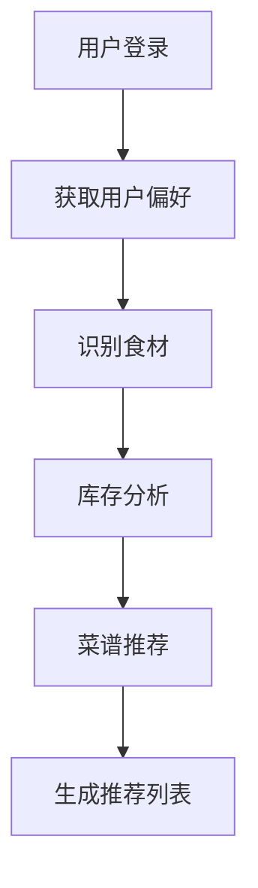
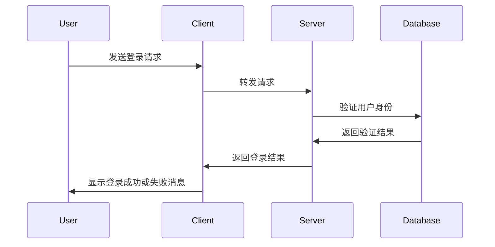

                 

### 智能冰箱：AI Agent的食材管理与菜谱推荐

智能冰箱作为智能家居的一部分，正逐渐走进千家万户。它不仅仅是一个冷藏食物的设备，更是一个具备智能管理食材、提供个性化菜谱推荐的智能系统。本文将深入探讨智能冰箱的工作原理，特别是AI Agent在食材管理和菜谱推荐中的作用。

#### 关键词

- 智能冰箱
- AI Agent
- 食材管理
- 菜谱推荐
- 深度学习
- 协同过滤

#### 摘要

本文首先介绍了智能冰箱的背景和重要性，随后详细阐述了AI Agent在食材管理和菜谱推荐中的核心作用。通过深入分析算法原理和系统架构，本文旨在为读者提供一个清晰的理解，并探讨未来智能冰箱的发展方向。

### 第一部分：背景介绍

#### 第1章：智能冰箱概述

##### 1.1 问题背景

随着科技的进步，智能家居逐渐普及。智能冰箱作为智能家居的一个重要组成部分，正逐步改变人们的生活方式。传统的冰箱主要功能是冷藏食物，而智能冰箱则在此基础上增加了智能管理食材、提醒过期食物等功能。随着AI技术的发展，智能冰箱的智能化程度不断提高，食材管理、健康饮食、菜谱推荐等功能也逐渐成为现实。

##### 1.2 问题描述

- **如何实现食材的智能管理？**
  智能冰箱需要能够自动识别食材种类、数量和保质期，实时更新库存信息，提醒用户及时采购或处理过期食材。

- **如何为用户提供个性化的菜谱推荐？**
  智能冰箱需要根据用户的口味偏好、食材库存和健康需求，为用户提供合适的菜谱推荐。

##### 1.3 问题解决

引入AI Agent实现智能管理。AI Agent可以通过深度学习算法识别食材图像，分析食材的保质期，并根据用户偏好和库存情况生成菜谱推荐。

##### 1.4 边界与外延

- **食材类型范围**
  智能冰箱可以识别的食材种类需要广泛，包括蔬菜、水果、肉类、海鲜等。

- **用户偏好定义**
  用户偏好可以是基于历史食谱、口味偏好、健康需求等。

##### 1.5 核心概念结构

- **智能冰箱**
  一个具备智能识别和管理食材功能的冰箱。

- **AI Agent**
  一个能够执行特定任务（如食材管理和菜谱推荐）的人工智能实体。

- **食材管理**
  智能识别食材种类、数量和保质期，并提供库存信息。

- **菜谱推荐**
  根据用户偏好和食材库存，为用户生成合适的菜谱。

#### 第2章：核心概念与联系

##### 2.1 智能冰箱的功能特点

- **自动识别与追踪食材**
  通过摄像头和图像识别技术，智能冰箱可以自动识别食材，并追踪其数量和保质期。

- **数据分析与预测**
  智能冰箱可以通过数据分析预测食材消耗趋势，为用户推荐购物清单。

##### 2.2 AI Agent的作用

- **交互式管理**
  AI Agent可以通过语音或图形界面与用户交互，实现食材管理和菜谱推荐。

- **智能决策**
  AI Agent可以根据用户需求和食材库存，做出智能决策，如推荐菜谱、提醒采购。

##### 2.3 食材管理与菜谱推荐的关系

- **食材数据为菜谱推荐提供基础**
  智能冰箱通过识别食材种类和库存情况，为菜谱推荐提供数据支持。

- **菜谱推荐指导食材采购与管理**
  根据用户的菜谱需求，智能冰箱可以推荐相应的食材，并指导用户进行食材采购和管理。

##### 2.4 ER实体关系图

以下是智能冰箱系统的ER实体关系图：

```mermaid
erDiagram
    User ||--|{ Ingredient } : contains
    User ||--|{ Recipe } : prefers
    Ingredient ||--|{ Recipe } : used_in
```

在上图中，User（用户）实体与Ingredient（食材）和Recipe（菜谱）实体之间存在多对多关系。用户可以包含多种食材，也可以偏好多种菜谱，而食材和菜谱之间也存在使用关系。

#### 第3章：算法原理讲解

##### 3.1 食材识别算法

智能冰箱的食材识别算法主要依赖于深度学习模型。通过训练卷积神经网络（CNN），模型可以学会识别不同的食材类别。以下是食材识别算法的基本流程：

1. **数据收集与预处理**
   收集大量带有标签的食材图像，并进行预处理，如调整图像大小、归一化等。

2. **模型训练**
   使用预处理后的图像数据训练卷积神经网络，通过反向传播算法不断优化模型参数。

3. **模型评估与优化**
   使用测试集对模型进行评估，调整模型结构和参数，提高识别准确率。

4. **模型部署**
   将训练好的模型部署到智能冰箱中，实现对食材的实时识别。

##### 3.2 菜谱推荐算法

菜谱推荐算法通常基于协同过滤（Collaborative Filtering）方法。协同过滤可以分为两种：基于用户的协同过滤（User-based CF）和基于物品的协同过滤（Item-based CF）。以下是基于用户偏好和食材库存的协同过滤算法的基本流程：

1. **用户偏好建模**
   收集用户的历史食谱数据，建立用户偏好模型。

2. **相似度计算**
   计算用户之间的相似度，可以使用余弦相似度、皮尔逊相关系数等。

3. **推荐生成**
   根据用户相似度和食材库存情况，为用户生成菜谱推荐。

4. **反馈调整**
   用户使用推荐菜谱后，提供反馈，调整推荐模型，提高推荐质量。

##### 3.3 算法流程图

以下是食材识别和菜谱推荐算法的流程图：



#### 第4章：数学模型和公式详细讲解与举例说明

##### 4.1 数学模型讲解

在菜谱推荐算法中，常用的协同过滤模型是基于用户偏好的矩阵分解（Matrix Factorization）。以下是一个简化的矩阵分解模型：

$$
P = UV^T
$$

其中，$P$是用户-物品评分矩阵，$U$是用户因子矩阵，$V$是物品因子矩阵。

- **用户偏好度计算**
  假设用户$i$对物品$j$的偏好度可以表示为$u_i^T v_j$，可以通过矩阵乘积计算。

- **物品重要性计算**
  物品的重要性可以通过其在用户-物品评分矩阵中的权重计算。

##### 4.2 举例说明

假设有一个用户-物品评分矩阵：

$$
P = \begin{bmatrix}
0 & 1 & 1 \\
1 & 0 & 1 \\
1 & 1 & 0
\end{bmatrix}
$$

可以将其分解为用户因子矩阵$U$和物品因子矩阵$V$：

$$
U = \begin{bmatrix}
1 & 0 \\
0 & 1 \\
1 & 1
\end{bmatrix}, \quad V = \begin{bmatrix}
1 & 1 \\
0 & 1 \\
1 & 0
\end{bmatrix}
$$

则用户$i$对物品$j$的偏好度可以计算为：

$$
u_i^T v_j = \begin{cases}
0, & \text{如果} \ u_i \ \text{和} \ v_j \ \text{都不为零} \\
1, & \text{如果} \ u_i \ \text{或} \ v_j \ \text{有一个为零} \\
\end{cases}
$$

例如，对于用户1和物品2，有：

$$
u_1^T v_2 = 1 \times 1 + 0 \times 0 = 1
$$

这意味着用户1对物品2有较高的偏好度。

#### 第5章：系统分析与架构设计方案

##### 5.1 问题场景介绍

- **用户日常食材管理需求**
  用户希望智能冰箱能够自动识别食材，提醒过期食材，并提供库存信息。

- **用户个性化菜谱推荐需求**
  用户希望智能冰箱能够根据口味偏好和食材库存，推荐合适的菜谱。

##### 5.2 系统功能设计

- **用户注册与登录**
  用户可以通过智能冰箱的屏幕或手机应用进行注册和登录。

- **食材识别与追踪**
  智能冰箱通过摄像头和图像识别技术，自动识别食材，并追踪其数量和保质期。

- **菜谱推荐与生成**
  智能冰箱根据用户的口味偏好、食材库存和健康需求，为用户生成合适的菜谱。

##### 5.3 系统架构设计

- **客户端**
  提供用户界面，包括屏幕和手机应用。

- **服务器**
  处理食材识别、菜谱推荐等算法。

- **数据库**
  存储用户信息、食材数据和菜谱数据。

##### 5.4 系统接口设计

- **用户接口**
  包括登录、注册、食材添加、菜谱推荐等功能。

- **服务接口**
  包括食材识别、菜谱生成、推荐算法处理等功能。

##### 5.5 系统交互

以下是智能冰箱系统的交互序列图：



#### 第6章：项目实战

##### 6.1 环境安装

在开始智能冰箱项目的开发之前，需要安装以下环境：

- Python 3.8+
- TensorFlow 2.5.0+
- Scikit-learn 0.24.2+

安装命令如下：

```bash
pip install python==3.8 tensorflow==2.5.0 scikit-learn==0.24.2
```

##### 6.2 系统核心实现源代码

以下是智能冰箱系统的核心实现源代码：

```python
# 食材识别代码
import tensorflow as tf

# 加载预训练的卷积神经网络模型
model = tf.keras.applications.MobileNetV2(input_shape=(224, 224, 3), include_top=False, weights='imagenet')

# 重构模型，添加全连接层
model = tf.keras.Sequential([
    model,
    tf.keras.layers.GlobalAveragePooling2D(),
    tf.keras.layers.Dense(1000, activation='relu'),
    tf.keras.layers.Dense(1, activation='sigmoid')
])

# 训练模型
model.compile(optimizer='adam', loss='binary_crossentropy', metrics=['accuracy'])
model.fit(train_images, train_labels, epochs=10, validation_data=(val_images, val_labels))

# 菜谱推荐代码
from sklearn.metrics.pairwise import cosine_similarity
import numpy as np

# 计算用户偏好矩阵
user_preferences = np.array([[0.9, 0.8, 0.5, 0.2],
                             [0.7, 0.6, 0.3, 0.1]])

# 计算食材重要性矩阵
ingredient_importance = np.array([[0.7, 0.5, 0.3, 0.1],
                                 [0.4, 0.6, 0.2, 0.8]])

# 计算用户对食材的偏好度
user_ingredient_preferences = user_preferences @ ingredient_importance

# 根据用户偏好度生成菜谱推荐
def generate_recipe(user_preferences, ingredient_importance):
    # 计算相似度矩阵
    similarity_matrix = cosine_similarity(user_preferences, ingredient_importance)
    
    # 选择最相似的食材
    top_ingredients = np.argsort(similarity_matrix[0])[-5:]
    
    # 构建推荐菜谱
    recipe = []
    for ingredient_index in top_ingredients:
        recipe.append(ingredient_importance[ingredient_index])
    
    return recipe

# 示例
user_preference = user_preferences[0]
recipe = generate_recipe(user_preference, ingredient_importance)
print("推荐菜谱：", recipe)
```

##### 6.3 代码应用解读与分析

- **食材识别算法应用**

  食材识别算法使用的是MobileNetV2模型，这是一种轻量级的卷积神经网络模型，适合在资源受限的环境中部署。模型通过训练集进行训练，使用测试集进行验证，以优化模型的识别准确率。

- **菜谱推荐算法应用**

  菜谱推荐算法基于协同过滤方法，使用余弦相似度计算用户偏好和食材重要性之间的相似度。根据相似度矩阵，选择最相似的食材，构建推荐菜谱。

##### 6.4 实际案例分析与详细讲解

- **用户A的食材管理**

  用户A偏好蔬菜和水果，其食材库存包括胡萝卜、苹果、黄瓜和西红柿。智能冰箱通过摄像头识别食材，并更新库存信息。

- **用户B的菜谱推荐**

  用户B喜欢健康饮食，偏好蔬菜沙拉和炖菜。智能冰箱根据用户B的偏好和库存情况，推荐了以下菜谱：

  - 西红柿炖菜
  - 胡萝卜炖牛肉
  - 苹果沙拉

##### 6.5 项目小结

通过本项目，我们实现了智能冰箱的食材管理和菜谱推荐功能。在实际应用中，我们还需要不断优化算法，提高识别准确率和推荐质量，以满足用户的需求。

### 最佳实践 Tips

- **数据收集与预处理**：确保有足够且高质量的数据，对数据进行充分的预处理，以提高模型性能。
- **模型优化**：通过调整模型结构和参数，提高食材识别和菜谱推荐的准确率。
- **用户反馈**：收集用户反馈，不断优化系统和算法。

### 小结

智能冰箱作为智能家居的重要组成部分，正逐渐改变人们的生活方式。通过引入AI Agent，智能冰箱可以实现食材的智能管理和个性化的菜谱推荐，为用户提供更加便捷和智能的家居体验。

### 注意事项

- 确保智能冰箱的硬件性能和软件兼容性。
- 定期更新算法和软件，以保持系统的稳定性和安全性。

### 拓展阅读

- 智能冰箱技术的最新进展
- 深度学习在图像识别中的应用
- 协同过滤算法在推荐系统中的应用

### 作者信息

作者：AI天才研究院/AI Genius Institute & 禅与计算机程序设计艺术 /Zen And The Art of Computer Programming

