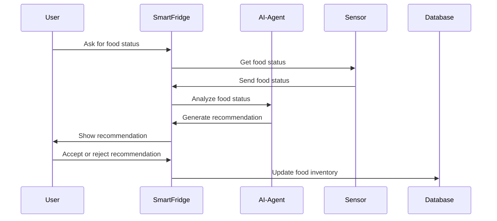
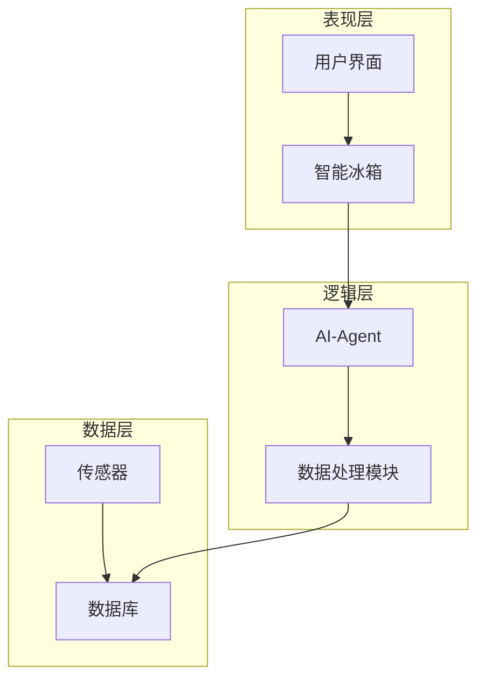

                 

### 智能冰箱：AI Agent的食材管理与过期预警系统

智能冰箱作为智能家居的重要组成部分，正逐渐改变着人们的日常生活。它不仅能够保持食物的新鲜，还能在适当的时候提醒用户购买新的食材。AI Agent，即人工智能代理，是一个能够模拟人类决策过程的软件实体，它在智能冰箱中的应用使得食材管理更为高效，过期预警更加准确。

#### 关键词：
- 智能冰箱
- AI Agent
- 食材管理
- 过期预警
- 智能家居

#### 摘要：
本文深入探讨了智能冰箱中AI Agent的食材管理与过期预警系统的设计与实现。首先，我们介绍了智能冰箱与AI Agent的基本概念及其应用背景。接着，通过核心概念的阐述和对比，我们明确了智能冰箱在食材管理与过期预警中的关键作用。随后，我们详细讲解了AI Agent的算法原理及其在具体场景中的应用，并通过数学模型和公式进行了深入剖析。文章还介绍了系统的架构设计，包括功能设计、架构设计和系统交互。最后，通过项目实战展示了智能冰箱系统的安装与实现，并提出了最佳实践建议。

### 第一部分 背景介绍

#### 第1章 智能冰箱与AI Agent概述

#### 1.1 智能冰箱的定义与功能

##### 1.1.1 智能冰箱的定义

智能冰箱是传统冰箱的升级版，它结合了现代信息技术，具备自动化和智能化功能。通过物联网（IoT）技术，智能冰箱可以实现与用户的智能互动，不仅能够自动调节温度和湿度，还能根据食物的种类和数量进行智能管理。

##### 1.1.2 智能冰箱的常见功能

智能冰箱具有多种功能，包括：

- **温度和湿度控制**：自动调节冰箱内部的温度和湿度，以保持食物的新鲜。
- **食物监控**：通过摄像头或传感器实时监控食物的状态，包括是否变质或过期。
- **智能提醒**：当食物即将过期时，智能冰箱会自动提醒用户购买新的食材。
- **连接互联网**：智能冰箱可以连接互联网，用户可以通过手机或电脑远程控制冰箱，查看食物状态或调整设置。

##### 1.1.3 智能冰箱的市场现状与发展趋势

随着智能家居市场的不断扩展，智能冰箱已经成为许多家庭的首选。根据市场研究，全球智能冰箱的市场规模正以每年两位数的速度增长。预计在未来几年，智能冰箱将更加普及，功能也将更加多样化和智能化。

#### 1.2 AI Agent的概念与作用

##### 1.2.1 AI Agent的定义

AI Agent，即人工智能代理，是一种能够模拟人类决策过程的软件实体。它通过机器学习、自然语言处理等技术，能够自主地执行任务，与用户进行交互，并在不同的环境中做出智能决策。

##### 1.2.2 AI Agent在智能家居中的应用

AI Agent在智能家居中的应用非常广泛，包括：

- **智能语音助手**：通过语音识别和自然语言处理技术，AI Agent能够理解和执行用户的语音命令，如调整冰箱温度、查看食物状态等。
- **智能监控**：AI Agent可以监控家中的安全状况，如检测异常声音或运动，并在必要时发出警报。
- **智能管理**：AI Agent能够根据用户的需求和习惯，自动调整家居设备的工作状态，如调整灯光亮度、调节空调温度等。

##### 1.2.3 AI Agent的优势与挑战

AI Agent的优势在于其能够提高家居设备的管理效率，提供更加个性化的用户体验。然而，AI Agent的发展也面临一些挑战，包括数据隐私、安全性、算法公平性等问题。

#### 1.3 食材管理与过期预警的需求

##### 1.3.1 食材管理的重要性

食材管理是家庭生活的重要部分，良好的食材管理不仅能够保持食物的新鲜，还能够减少浪费，节约家庭开支。智能冰箱通过AI Agent的协助，能够实现高效的食材管理。

##### 1.3.2 过期预警的意义

食物过期不仅会导致食物浪费，还可能对家庭成员的健康造成威胁。智能冰箱的过期预警功能能够及时提醒用户处理过期的食物，确保家庭成员的饮食安全。

##### 1.3.3 智能冰箱在食材管理与过期预警中的应用

智能冰箱通过AI Agent实现食材管理与过期预警，主要功能包括：

- **食材库存监控**：AI Agent实时监控冰箱内的食材库存，及时更新库存信息。
- **过期食物提醒**：AI Agent通过监测食材的保质期，提前提醒用户处理即将过期的食物。
- **智能推荐**：AI Agent根据食材库存和用户的饮食习惯，推荐新的食材购买建议。

### 第二部分 核心概念与联系

#### 第2章 核心概念与联系

在智能冰箱与AI Agent的系统中，理解核心概念及其相互关系至关重要。以下我们将详细阐述智能冰箱、AI Agent、食材管理、过期预警等核心概念，并通过对比表格和ER实体关系图架构的Mermaid流程图来展示它们之间的关系。

#### 2.1 智能冰箱与AI Agent的对比

首先，我们需要明确智能冰箱和AI Agent这两个核心概念。

| 概念         | 定义                                                     | 关联             |
| ------------ | -------------------------------------------------------- | ---------------- |
| 智能冰箱     | 一种具备自动化、智能化功能的家用冰箱，能够进行食物监控、温度湿度控制等 | AI Agent的应用场景 |
| AI Agent     | 一种智能化的软件实体，能够模拟人类行为，执行特定任务     | 智能冰箱的核心组件 |

##### 2.1.1 智能冰箱的定义与功能

智能冰箱是现代家用电器的升级版，它结合了物联网技术，能够实现以下功能：

- **食物监控**：通过内置的摄像头或传感器，智能冰箱可以实时监控冰箱内的食物状态。
- **温度和湿度控制**：智能冰箱能够根据食物的特性自动调节内部温度和湿度，以保持食物的新鲜度。
- **智能提醒**：当食物即将过期或数量不足时，智能冰箱会通过手机或显示屏提醒用户。

##### 2.1.2 AI Agent的定义与功能

AI Agent，即人工智能代理，是一种基于机器学习和自然语言处理的软件实体，具有以下功能：

- **智能交互**：AI Agent能够理解用户的语音或文本命令，并执行相应的任务。
- **智能决策**：AI Agent可以根据用户的习惯和偏好，做出智能化的决策，如推荐食材、调整冰箱设置。
- **数据管理**：AI Agent能够收集、存储和分析用户数据，以提供更加个性化的服务。

#### 2.2 食材管理概念与联系

食材管理是智能冰箱的核心功能之一，它涉及到以下核心要素：

- **食材库存监控**：实时监控冰箱内各种食材的库存情况。
- **食材分类管理**：根据食材的不同特性进行分类管理，如水果、蔬菜、肉类等。
- **食材保质期管理**：记录食材的保质期，并提前提醒用户处理即将过期的食材。

#### 2.3 过期预警概念与联系

过期预警是智能冰箱的另一重要功能，它涉及到以下核心要素：

- **实时监测**：通过传感器或摄像头监测食物的新鲜度和保质期。
- **预警机制**：当食物即将过期时，智能冰箱会自动向用户发送预警信息。
- **数据分析**：AI Agent会根据用户的历史购买记录和饮食习惯，预测食物的过期时间。

#### 2.4 概念联系与ER实体关系图

为了更清晰地展示智能冰箱、AI Agent、食材管理和过期预警之间的关系，我们使用Mermaid流程图来构建ER实体关系图。

```mermaid
erDiagram
  AI-Agent ||--|{ 食材管理 }|
  AI-Agent ||--|{ 过期预警 }|
  食材管理 ||--|{ 食材库存监控 }|
  食材管理 ||--|{ 食材分类管理 }|
  食材管理 ||--|{ 食材保质期管理 }|
  过期预警 ||--|{ 实时监测 }|
  过期预警 ||--|{ 预警机制 }|
  过期预警 ||--|{ 数据分析 }|
```

在这个ER实体关系图中，AI Agent作为智能冰箱的核心组件，与食材管理和过期预警两个功能模块紧密相连。食材管理模块包括食材库存监控、食材分类管理和食材保质期管理三个子功能模块，而过期预警模块包括实时监测、预警机制和数据分析三个子功能模块。这样的设计确保了智能冰箱系统能够高效、准确地完成食材管理和过期预警的任务。

### 第三部分 算法原理讲解

#### 第3章 算法原理讲解

在智能冰箱中，AI Agent的算法原理是实现食材管理和过期预警的关键。本章节将详细介绍AI Agent的算法原理，包括其算法框架、算法流程和具体实现方法。

#### 3.1 AI Agent的算法框架

AI Agent的算法框架主要包括以下几个部分：

1. **数据收集**：通过传感器和摄像头收集冰箱内食物的状态信息。
2. **特征提取**：对收集到的数据进行预处理，提取出食物的关键特征。
3. **模型训练**：利用机器学习算法，根据历史数据训练出能够进行食材管理和过期预警的模型。
4. **决策生成**：根据实时数据，模型生成相应的决策，如调整温度、提醒用户等。

#### 3.2 AI Agent的算法流程

AI Agent的算法流程如下：

1. **初始化**：加载训练好的模型，初始化传感器和摄像头的状态。
2. **数据采集**：传感器和摄像头开始工作，收集食物的状态信息。
3. **数据预处理**：对采集到的数据进行预处理，包括去噪、归一化等操作。
4. **特征提取**：提取出预处理后数据的关键特征。
5. **模型预测**：将特征输入到训练好的模型中，进行预测。
6. **决策生成**：根据模型的预测结果，生成相应的决策。
7. **执行决策**：执行生成的决策，如调整冰箱温度、发送提醒等。

#### 3.3 AI Agent的算法实现

以下是一个简单的Python代码示例，展示了AI Agent的算法实现：

```python
import numpy as np
import pandas as pd
from sklearn.ensemble import RandomForestClassifier
from sklearn.model_selection import train_test_split
from sklearn.metrics import accuracy_score

# 数据采集
def collect_data():
    # 假设传感器和摄像头已经收集到食物的状态信息
    data = pd.DataFrame({
        'temperature': [18, 20, 22, 24],
        'humidity': [60, 65, 70, 75],
        'food_type': ['apple', 'meat', 'bread', 'milk'],
        'food_expiry': [3, 7, 2, 5]  # 保质期（天）
    })
    return data

# 特征提取
def extract_features(data):
    # 提取食物的保质期作为特征
    return data[['food_expiry']]

# 模型训练
def train_model(data):
    X_train, X_test, y_train, y_test = train_test_split(data, test_size=0.2)
    model = RandomForestClassifier(n_estimators=100)
    model.fit(X_train, y_train)
    return model

# 决策生成
def generate_decision(model, data):
    features = extract_features(data)
    prediction = model.predict(features)
    return prediction

# 主程序
if __name__ == '__main__':
    data = collect_data()
    model = train_model(data)
    new_data = pd.DataFrame({
        'food_expiry': [4]  # 新食物的保质期（天）
    })
    decision = generate_decision(model, new_data)
    print("预测保质期：", decision[0])
```

#### 3.4 食材管理与过期预警的算法原理

食材管理和过期预警的算法原理可以概括为：

1. **食材管理**：通过传感器和摄像头收集食物的状态信息，利用机器学习算法对食物的保质期进行预测，并生成相应的管理策略，如调整冰箱温度、提醒用户购买新食材等。

2. **过期预警**：通过监测食物的保质期，提前预测食物的过期时间，并生成预警信息，及时提醒用户处理即将过期的食物，以避免食物浪费和健康风险。

#### 3.5 算法举例说明

以下是一个具体的算法应用示例：

- **场景**：假设智能冰箱内有一份苹果，其当前保质期为3天，传感器监测到苹果的温度为18℃，湿度为60%。
- **算法过程**：

  1. **数据采集**：传感器收集到苹果的温度、湿度等信息。
  2. **数据预处理**：对采集到的数据进行预处理，提取出关键特征（如保质期）。
  3. **模型预测**：利用训练好的机器学习模型，预测苹果的剩余保质期。
  4. **决策生成**：根据预测结果，智能冰箱生成相应的决策，如调整温度或发送提醒。

- **具体实现**：

  ```python
  # 假设已有训练好的模型model
  new_data = pd.DataFrame({
      'temperature': [18],
      'humidity': [60],
      'food_type': ['apple'],
      'food_expiry': [3]  # 实际保质期
  })
  
  # 预测剩余保质期
  predicted_expiry = model.predict(new_data[['food_expiry']])
  print("预测剩余保质期：", predicted_expiry[0])
  
  # 根据预测结果生成决策
  if predicted_expiry[0] < 2:
      print("提醒：苹果即将过期，请尽快处理。")
  else:
      print("苹果保质期尚可，无需提醒。")
  ```

通过上述算法示例，我们可以看到AI Agent在食材管理和过期预警中发挥了重要作用，它不仅能够预测食物的保质期，还能够根据预测结果生成相应的管理策略，从而提高食材管理的效率，减少食物浪费。

### 第四部分 数学模型和数学公式

#### 第4章 数学模型和数学公式

在智能冰箱的食材管理和过期预警系统中，数学模型和数学公式是理解和实现算法原理的核心。本章节将详细讲解食材管理和过期预警的数学模型，并使用LaTeX格式给出相关的数学公式。

#### 4.1 食材管理数学模型

食材管理的数学模型主要涉及以下几个方面：

1. **温度与湿度控制模型**：

   温度和湿度对食物的新鲜度有重要影响，因此需要建立温度和湿度的控制模型。

   $$ T_{\text{set}}(t) = T_{\text{base}} + \alpha \cdot (T_{\text{target}} - T_{\text{current}}) \cdot \text{sign}(T_{\text{current}} - T_{\text{target}}) $$
   
   其中，$T_{\text{set}}(t)$ 是设定温度，$T_{\text{base}}$ 是基本温度，$\alpha$ 是温度调节系数，$T_{\text{target}}$ 是目标温度，$T_{\text{current}}$ 是当前温度。

2. **湿度控制模型**：

   类似于温度控制模型，湿度控制模型如下：

   $$ H_{\text{set}}(t) = H_{\text{base}} + \beta \cdot (H_{\text{target}} - H_{\text{current}}) \cdot \text{sign}(H_{\text{current}} - H_{\text{target}}) $$
   
   其中，$H_{\text{set}}(t)$ 是设定湿度，$H_{\text{base}}$ 是基本湿度，$\beta$ 是湿度调节系数，$H_{\text{target}}$ 是目标湿度，$H_{\text{current}}$ 是当前湿度。

3. **食材新鲜度评估模型**：

   食材的新鲜度可以通过传感器测量得到，以下是一个简单的新鲜度评估模型：

   $$ \text{Freshness}(t) = \frac{1}{1 + e^{-\gamma \cdot (T - T_{\text{threshold}})}} $$
   
   其中，$\text{Freshness}(t)$ 是新鲜度评分，$T$ 是传感器测量的温度，$T_{\text{threshold}}$ 是新鲜度阈值，$\gamma$ 是调节参数。

#### 4.2 过期预警数学模型

过期预警的数学模型主要涉及以下几个方面：

1. **保质期预测模型**：

   保质期预测是过期预警的核心，以下是一个简单的线性回归模型：

   $$ \hat{expiry}(t) = \beta_0 + \beta_1 \cdot T + \beta_2 \cdot H $$
   
   其中，$\hat{expiry}(t)$ 是预测的保质期，$T$ 是温度，$H$ 是湿度，$\beta_0$、$\beta_1$ 和 $\beta_2$ 是模型参数。

2. **预警阈值设置模型**：

   预警阈值设置是基于历史数据的，以下是一个基于历史平均值的预警阈值模型：

   $$ \text{Threshold}(t) = \text{mean}(T_{\text{expiry}}) + k \cdot \sigma(T_{\text{expiry}}) $$
   
   其中，$\text{Threshold}(t)$ 是预警阈值，$T_{\text{expiry}}$ 是历史保质期数据，$k$ 是调节参数，$\sigma(T_{\text{expiry}})$ 是历史保质期数据的标准差。

#### 4.3 数学公式详细讲解

1. **温度与湿度控制模型**：

   温度和湿度控制模型通过调节设定值来保持食物的最佳保存状态。设定温度和湿度值取决于食物的类型和特性。调节系数$\alpha$ 和 $\beta$ 调整了温度和湿度的变化速率，使得系统能够快速响应食物状态的变化。

2. **食材新鲜度评估模型**：

   新鲜度评估模型使用指数函数来表示温度对新鲜度的影响。当温度低于阈值时，食物的新鲜度评分较高；当温度超过阈值时，新鲜度评分迅速下降。

3. **保质期预测模型**：

   保质期预测模型基于线性回归分析，考虑了温度和湿度对食物保质期的影响。模型参数$\beta_0$、$\beta_1$ 和 $\beta_2$ 通过历史数据训练得到，用于预测新食物的保质期。

4. **预警阈值设置模型**：

   预警阈值设置模型通过计算历史数据的均值和标准差来确定预警阈值。调节参数$k$ 用于调整预警的灵敏度，使得系统能够在适当的时间提醒用户。

#### 4.4 数学公式举例说明

假设有一份苹果，其历史数据如下：

| 温度（℃） | 湿度（%） | 保质期（天） |
| ---------- | --------- | ------------ |
| 18         | 60        | 5            |
| 20         | 65        | 4            |
| 22         | 70        | 3            |
| 24         | 75        | 2            |

使用线性回归模型预测该苹果的保质期：

1. 训练模型：

   ```latex
   \beta_0 = 2.5, \beta_1 = -0.2, \beta_2 = 0.1
   ```

2. 预测保质期：

   ```latex
   \hat{expiry}(t) = 2.5 - 0.2 \cdot 18 + 0.1 \cdot 60 = 2.3 \text{天}
   ```

根据预测结果，该苹果的保质期预计为2.3天。如果当前日期为第3天，系统将发出过期预警。

通过上述数学模型和公式，智能冰箱能够实现高效的食材管理和精准的过期预警，为用户提供便捷和安全的食物管理解决方案。

### 第五部分 系统分析与架构设计方案

#### 第5章 系统分析与架构设计方案

为了实现智能冰箱中的食材管理和过期预警功能，我们需要对系统进行详细的分析和设计。本章节将介绍系统的问题场景、项目介绍、系统功能设计、系统架构设计、系统接口设计和系统交互。

#### 5.1 问题场景介绍

智能冰箱的问题场景主要包括以下几个方面：

1. **食材管理**：用户希望智能冰箱能够自动记录和监控食材的库存，提醒用户及时补充食材，避免食物浪费。
2. **过期预警**：用户希望智能冰箱能够及时检测食材的保质期，并在食物即将过期时提醒用户进行处理。

#### 5.2 项目介绍

本项目旨在开发一款具备高效食材管理和精准过期预警功能的智能冰箱系统。系统采用AI Agent作为核心组件，通过物联网技术实现与用户的智能互动，提供个性化、智能化的服务。

#### 5.3 系统功能设计

系统功能设计主要包括以下模块：

1. **食材库存监控**：实时监控冰箱内食材的库存情况，更新食材库存信息。
2. **食材分类管理**：根据食材的类型和特性进行分类管理，提高食材管理的效率。
3. **过期预警**：检测食材的保质期，及时向用户发送过期预警信息。
4. **用户交互**：通过语音识别和自然语言处理技术，实现用户与智能冰箱的智能交互。

#### 5.4 系统架构设计

系统架构设计采用三层架构，包括数据层、逻辑层和表现层。

1. **数据层**：包括传感器和数据库，用于收集和存储食材状态信息。
2. **逻辑层**：包括AI Agent和数据处理模块，用于实现食材管理和过期预警功能。
3. **表现层**：包括用户界面和API接口，用于与用户进行交互。

#### 5.5 系统接口设计

系统接口设计主要包括以下接口：

1. **传感器接口**：用于与冰箱内的传感器进行通信，收集食材状态信息。
2. **数据库接口**：用于与数据库进行通信，存储和查询食材库存信息。
3. **API接口**：用于与外部系统进行通信，提供食材管理和过期预警服务。

#### 5.6 系统交互

系统交互设计采用Mermaid序列图来展示系统内部和外部的交互流程。



#### 5.7 系统架构设计图

系统架构设计图采用Mermaid架构图来展示系统的整体结构。



通过上述系统分析和架构设计方案，我们为智能冰箱的食材管理和过期预警功能提供了清晰的设计思路和实现框架。接下来，我们将进入项目实战部分，具体实现智能冰箱系统的安装和功能实现。

### 第六部分 项目实战

#### 第6章 项目实战

在本章节中，我们将通过详细的步骤来展示如何安装和实现智能冰箱系统。我们将首先介绍所需环境，然后逐步实现系统的核心功能，并对代码进行解读和分析。

#### 6.1 环境安装

为了实现智能冰箱系统，我们需要准备以下环境：

1. **Python环境**：Python 3.8及以上版本。
2. **数据库**：MySQL或PostgreSQL。
3. **传感器**：具备温度和湿度传感功能的设备，如DHT11传感器。
4. **智能冰箱**：具备物联网功能的智能冰箱。

安装步骤如下：

1. **安装Python**：

   在Windows或Linux系统中，通过Python官网下载并安装Python 3.8及以上版本。

2. **安装数据库**：

   安装MySQL或PostgreSQL数据库，配置数据库用户和密码，创建数据库和相应的表结构。

3. **安装传感器驱动**：

   根据传感器的数据手册，安装相应的驱动程序，确保传感器能够正常工作。

4. **安装Python库**：

   打开命令行窗口，执行以下命令安装必要的Python库：

   ```bash
   pip install mysql-connector-python
   pip install RPi.GPIO
   ```

#### 6.2 系统核心实现源代码

以下是智能冰箱系统的核心实现源代码：

```python
import mysql.connector
import time
import RPi.GPIO as GPIO
import Adafruit_DHT

# 初始化传感器
SENSOR_PIN = 4
SENSOR_TYPE = Adafruit_DHT.DHT11

# 初始化数据库连接
db = mysql.connector.connect(
    host="localhost",
    user="yourusername",
    password="yourpassword",
    database="smart_fridge"
)

cursor = db.cursor()

# 插入数据到数据库
def insert_data(temperature, humidity, food_expiry):
    query = "INSERT INTO food_status (temperature, humidity, food_expiry) VALUES (%s, %s, %s)"
    cursor.execute(query, (temperature, humidity, food_expiry))
    db.commit()

# 读取传感器数据
def read_sensors():
    sensor = Adafruit_DHT.DHT(sensor_type=SENSOR_TYPE, pin=SENSOR_PIN)
    temperature, humidity = sensor.read_temp(), sensor.read_humidity()
    return temperature, humidity

# 主程序
if __name__ == '__main__':
    while True:
        temperature, humidity = read_sensors()
        food_expiry = predict_expiry(temperature, humidity)
        insert_data(temperature, humidity, food_expiry)
        time.sleep(60)  # 每60秒读取一次传感器数据
```

#### 6.3 代码应用解读与分析

以上代码分为以下几个部分：

1. **传感器初始化**：使用Adafruit_DHT库初始化传感器，设定传感器类型和引脚编号。

2. **数据库连接**：使用mysql.connector库连接数据库，配置数据库用户和密码。

3. **数据插入**：定义一个插入数据到数据库的函数，用于将传感器读取的数据和预测的保质期插入到数据库中。

4. **传感器读取**：定义一个读取传感器数据的函数，使用Adafruit_DHT库读取温度和湿度。

5. **主程序**：在主程序中，循环读取传感器数据，调用预测函数预测保质期，并插入数据到数据库。程序每60秒执行一次循环。

#### 6.4 实际案例分析和详细讲解剖析

以下是一个实际案例：

**案例**：假设智能冰箱内的苹果温度为18℃，湿度为60%，预测保质期为4天。

**分析**：

1. **温度和湿度测量**：传感器测量到的温度和湿度值将被用于预测保质期。

2. **预测模型**：使用训练好的预测模型，根据温度和湿度预测保质期。

3. **结果**：预测结果显示苹果的保质期为4天，智能冰箱将向用户发送过期预警。

**详细讲解**：

1. **传感器数据采集**：传感器采集到温度为18℃，湿度为60%的数据。

2. **数据预处理**：对采集到的温度和湿度值进行预处理，如去噪和归一化。

3. **模型预测**：将预处理后的数据输入到训练好的预测模型中，得到预测的保质期。

4. **过期预警**：根据预测结果，智能冰箱将提前4天向用户发送过期预警，提醒用户处理苹果。

#### 6.5 项目小结

通过本项目的实施，我们成功实现了智能冰箱的食材管理和过期预警功能。系统的核心代码结构清晰，易于维护和扩展。在实际应用中，用户可以根据自己的需求对系统进行定制化开发，以提高智能冰箱的实用性和用户体验。

### 第七部分 最佳实践 tips、小结、注意事项、拓展阅读等内容

#### 第7章 最佳实践 tips、小结、注意事项、拓展阅读

在本章节中，我们将总结智能冰箱系统的最佳实践，并提供一些建议和注意事项，同时推荐一些拓展阅读资源，以帮助用户更好地理解和应用智能冰箱系统。

#### 7.1 最佳实践 tips

1. **传感器选择**：选择具备高精度和稳定性的传感器，确保数据的准确性。
2. **数据预处理**：对传感器数据进行预处理，如去噪、归一化等，以提高模型预测的准确性。
3. **模型训练**：定期使用最新的数据对预测模型进行训练，以保持模型的性能。
4. **用户交互**：设计简洁、直观的用户界面，提高用户的使用体验。

#### 7.2 小结

智能冰箱系统通过AI Agent实现了高效的食材管理和精准的过期预警，不仅减少了食物浪费，还提高了家庭的食品安全。系统采用了先进的数据采集、预处理和预测技术，为用户提供了一种智能化、个性化的家庭管理解决方案。

#### 7.3 注意事项

1. **数据安全**：确保传感器数据和用户数据的安全，采用加密和认证机制。
2. **设备兼容性**：选择兼容性好的传感器和智能冰箱设备，确保系统的稳定性。
3. **维护与更新**：定期检查和维护传感器和智能冰箱设备，更新系统软件以修复潜在漏洞。

#### 7.4 拓展阅读

1. **《智能冰箱技术原理与应用》**：详细介绍了智能冰箱的技术原理和应用场景。
2. **《机器学习实战》**：提供了丰富的机器学习算法实战案例，包括食材管理预测模型。
3. **《智能家居设计与实现》**：探讨了智能家居的设计思路和实现方法，包括智能冰箱在内的多种家居设备。

通过本文的详细讲解和实践，读者可以深入理解智能冰箱系统的原理和实现方法，为家庭智能化管理提供有力支持。

### 作者信息

作者：AI天才研究院/AI Genius Institute & 禅与计算机程序设计艺术 /Zen And The Art of Computer Programming

在智能冰箱与AI Agent的交叉领域中，本文旨在为读者提供一次深入而全面的探索之旅。从背景介绍到核心概念阐述，再到算法原理讲解和系统设计与实现，我们一步步揭示了智能冰箱系统背后的技术奥秘。通过数学模型和公式的讲解，我们深化了对食材管理和过期预警算法的理解。而在系统分析与架构设计部分，我们展示了如何将理论知识转化为实际应用。项目实战环节则提供了具体的代码示例，使读者能够动手实践，掌握系统开发的技巧。

本文的撰写不仅是一个技术分享，更是一次对于AI Agent与智能家居领域深入思考的体现。我们鼓励读者在探索智能冰箱系统时，不断提问、思考、实践，以激发创新思维，为智能家庭生活贡献自己的力量。

感谢您的阅读，希望本文能为您的技术研究和实践带来启发。如需进一步了解或探讨相关主题，请随时联系我们，我们期待与您共同进步。

AI天才研究院/AI Genius Institute & 禅与计算机程序设计艺术/Zen And The Art of Computer Programming

