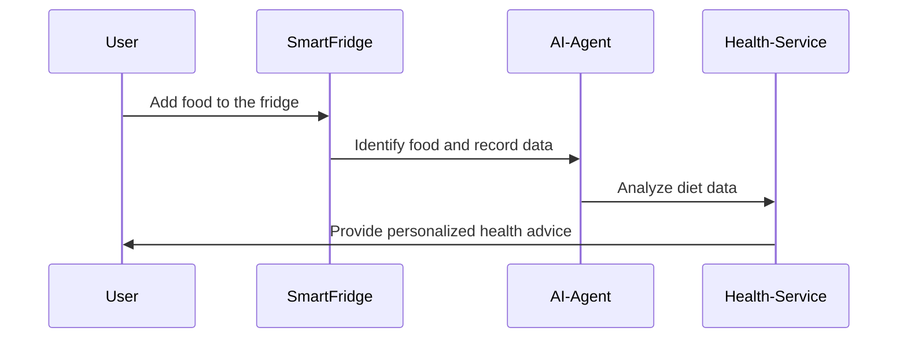
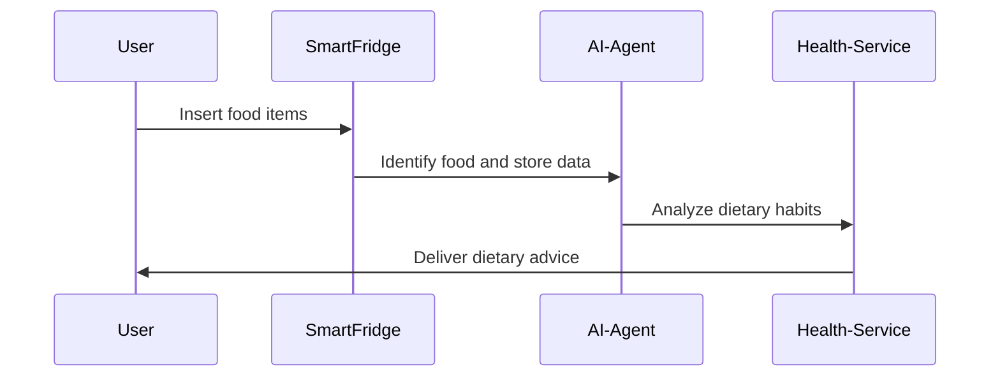

                 


# 智能冰箱：AI Agent的饮食习惯分析与健康建议

> 关键词：智能冰箱、AI Agent、饮食习惯分析、健康建议、智能家电

> 摘要：本文深入探讨了智能冰箱在人工智能辅助下的饮食习惯分析与健康建议功能，介绍了智能冰箱的背景、原理、算法和系统架构设计，通过实际案例展示了其应用效果和未来发展方向。

## 第一部分：背景介绍

### 1.1 问题背景

随着人工智能技术的快速发展，智能家居逐渐走进了人们的日常生活。智能冰箱作为智能家居的重要组成部分，其功能已不仅限于传统的冷藏保鲜，而是逐渐向智能化、个性化方向发展。饮食习惯与健康的关系日益受到关注，而传统饮食习惯分析的方法存在诸多局限性，难以满足现代人们对于健康管理的需求。智能冰箱的出现，为解决这一问题提供了新的思路。

#### 1.1.1 饮食习惯与健康的关系

饮食是人类获取能量和营养的重要途径，良好的饮食习惯对健康至关重要。合理的膳食搭配能够提供充足的能量和营养，促进身体健康。相反，不合理的饮食习惯可能导致营养不良、肥胖、高血压、糖尿病等健康问题。因此，了解和改善饮食习惯对于维护健康具有重要意义。

#### 1.1.2 传统饮食习惯分析的局限性

传统的饮食习惯分析主要依赖于个人记忆和手动记录，这种方式存在以下几个问题：

1. **记忆偏差**：人们往往难以准确记忆自己的饮食行为，导致记录的数据存在误差。
2. **数据不全面**：传统方法难以全面收集和记录个体的饮食行为数据，导致分析结果不够准确。
3. **分析复杂**：传统方法需要大量的人工计算和统计分析，效率较低。

### 1.2 问题解决

智能冰箱作为一种新兴的家电产品，具有智能识别食材、自动记录饮食信息等功能。通过AI Agent技术，智能冰箱可以对用户的饮食习惯进行分析，并提供个性化的健康建议。这种方式不仅方便快捷，还能提高健康管理的效率。智能冰箱的引入，为解决传统饮食习惯分析的局限性提供了新的解决方案。

### 1.3 边界与外延

#### 1.3.1 饮食习惯分析的范围

饮食习惯分析包括食物摄入的种类、数量、时间等。智能冰箱需要收集并处理这些数据，以全面了解用户的饮食习惯。

#### 1.3.2 健康建议的类型

健康建议包括饮食建议、运动建议、营养补充建议等。智能冰箱需要根据用户的饮食习惯和健康数据，提供科学、合理的健康建议。

## 第二部分：核心概念与联系

### 2.1 智能冰箱的原理与功能

#### 2.1.1 智能识别食材

智能冰箱通过摄像头、传感器等技术，实现对食材的智能识别。摄像头负责捕捉食材的图像，传感器则用于检测食材的物理特性，如温度、湿度等。这些信息被传输到内置的AI Agent进行处理。

#### 2.1.2 自动记录饮食信息

智能冰箱可以自动记录用户的饮食行为，如食物的种类、数量、摄入时间等。这一功能主要通过内置的传感器和摄像头实现。传感器可以检测冰箱内的温度、湿度等环境参数，摄像头则可以捕捉用户在冰箱前的操作行为。

#### 2.1.3 AI Agent分析

智能冰箱内置的AI Agent会根据收集到的饮食信息，分析用户的饮食习惯，并提供健康建议。AI Agent使用机器学习算法，对用户的历史饮食数据进行训练，以建立饮食习惯模型。

### 2.2 AI Agent的原理与功能

#### 2.2.1 AI Agent的定义

AI Agent是一种基于人工智能技术的智能体，能够模拟人类的决策过程，执行特定的任务。在智能冰箱中，AI Agent负责分析用户的饮食习惯，并提供健康建议。

#### 2.2.2 AI Agent在智能冰箱中的应用

AI Agent在智能冰箱中的应用主要包括以下方面：

1. **饮食习惯分析**：AI Agent通过对用户的饮食数据进行处理和分析，识别出用户的饮食习惯，如饮食偏好、食物摄入量等。
2. **健康建议生成**：基于用户的饮食习惯和健康数据，AI Agent生成个性化的健康建议，如饮食调整、运动建议等。

### 2.3 智能冰箱与AI Agent的联系

智能冰箱通过AI Agent实现对用户的饮食习惯分析，进而提供个性化的健康建议。智能冰箱与AI Agent的紧密结合，使得健康管理变得更加便捷、高效。智能冰箱不仅能够帮助用户更好地管理饮食，还能为用户提供全面的健康服务。

## 第三部分：算法原理讲解

### 3.1 饮食习惯分析算法

#### 3.1.1 算法原理

饮食习惯分析算法基于机器学习和数据挖掘技术，通过对用户饮食数据的分析，识别出用户的饮食习惯。算法的基本原理包括以下步骤：

1. **数据收集**：收集用户的饮食数据，包括食物种类、数量、摄入时间等。
2. **数据预处理**：对收集到的数据进行清洗、去噪、标准化等处理。
3. **特征提取**：从预处理后的数据中提取出对饮食习惯分析有价值的特征。
4. **模型训练**：使用机器学习算法，对特征数据进行训练，构建饮食习惯分析模型。
5. **预测与评估**：使用训练好的模型对新的饮食数据进行预测，并对预测结果进行评估。

#### 3.1.2 算法流程

1. **数据收集**：智能冰箱通过内置的传感器和摄像头，收集用户的饮食数据。
2. **数据预处理**：对收集到的饮食数据进行清洗，去除无效数据，并对数据进行标准化处理，以便后续分析。
3. **特征提取**：从预处理后的数据中提取出对饮食习惯分析有价值的特征，如食物种类、摄入量、摄入时间等。
4. **模型训练**：使用机器学习算法，对特征数据进行训练，构建饮食习惯分析模型。常用的机器学习算法包括决策树、随机森林、支持向量机等。
5. **预测与评估**：使用训练好的模型对新的饮食数据进行预测，并对预测结果进行评估。评估指标包括准确率、召回率、F1值等。

### 3.2 健康建议生成算法

#### 3.2.1 算法原理

健康建议生成算法基于用户的饮食习惯和健康数据，生成个性化的健康建议。算法的基本原理包括以下步骤：

1. **饮食习惯分析**：使用饮食习惯分析算法，对用户的饮食习惯进行分析。
2. **健康数据收集**：收集用户的健康数据，如体重、血压、血糖等。
3. **健康评估**：基于用户的饮食习惯和健康数据，评估用户的健康状况。
4. **建议生成**：根据健康评估结果，生成个性化的健康建议。

#### 3.2.2 算法流程

1. **饮食习惯分析**：使用饮食习惯分析算法，对用户的饮食习惯进行分析，识别出用户的饮食偏好和摄入量。
2. **健康数据收集**：收集用户的健康数据，如体重、血压、血糖等。这些数据可以通过智能设备（如智能手表、智能手环）进行实时监测。
3. **健康评估**：基于用户的饮食习惯和健康数据，评估用户的健康状况。常用的健康评估指标包括体重指数（BMI）、血压水平、血糖水平等。
4. **建议生成**：根据健康评估结果，生成个性化的健康建议。建议包括饮食调整、运动建议、营养补充等。

## 第四部分：系统分析与架构设计方案

### 4.1 问题描述

智能冰箱系统需要实现以下功能：

1. **智能识别食材**：通过摄像头和传感器，对冰箱内的食材进行智能识别。
2. **自动记录饮食信息**：自动记录用户的饮食行为，包括食物的种类、数量、摄入时间等。
3. **AI Agent分析**：使用AI Agent对用户的饮食习惯进行分析，并提供个性化的健康建议。

### 4.2 项目介绍

本项目旨在设计并实现一款智能冰箱系统，通过AI Agent技术，对用户的饮食习惯进行分析，并提供个性化的健康建议。系统主要包括以下模块：

1. **数据采集模块**：负责收集用户的饮食数据，包括食材信息、饮食行为等。
2. **数据处理模块**：负责对收集到的饮食数据进行清洗、预处理和特征提取。
3. **AI分析模块**：负责使用机器学习算法，对用户的饮食习惯进行分析，并提供健康建议。
4. **用户界面模块**：提供用户交互界面，展示用户的饮食数据和健康建议。

### 4.3 系统功能设计

#### 4.3.1 领域模型

使用Mermaid类图表示智能冰箱系统的领域模型：

```mermaid
classDiagram
    User                    <<Class>>>
    Refrigerator            <<Class>>>
    AI-Agent                <<Class>>>
    Diet-Data               <<Class>>>
    Health-Advice           <<Class>>>
    
    User                - has: Refrigerator
    Refrigerator         - has: AI-Agent
    AI-Agent             - has: Diet-Data
    AI-Agent             - generates: Health-Advice
    Diet-Data            - collected from: Refrigerator
    Health-Advice        - based on: Diet-Data
```

### 4.4 系统架构设计

使用Mermaid架构图表示智能冰箱系统的架构设计：



### 4.5 系统接口设计和系统交互

使用Mermaid序列图表示智能冰箱系统的接口设计和系统交互：



## 第五部分：项目实战

### 5.1 环境安装

在开始实现智能冰箱系统之前，我们需要安装以下环境：

1. **Python**：用于编写程序和运行算法。
2. **NumPy**：用于数值计算和数据处理。
3. **Pandas**：用于数据分析和处理。
4. **Scikit-learn**：用于机器学习算法的实现。

安装命令如下：

```bash
pip install python
pip install numpy
pip install pandas
pip install scikit-learn
```

### 5.2 系统核心实现源代码

以下是一个简单的智能冰箱系统实现示例：

```python
import numpy as np
import pandas as pd
from sklearn.ensemble import RandomForestClassifier
from sklearn.model_selection import train_test_split
from sklearn.metrics import accuracy_score

# 数据采集模块
def collect_data():
    # 这里可以使用传感器和摄像头采集数据
    # 为了简化示例，我们使用随机生成的数据
    data = pd.DataFrame({
        'food': ['apple', 'banana', 'orange', 'apple', 'banana'],
        'quantity': [1, 2, 3, 4, 5],
        'time': ['08:00', '12:00', '18:00', '08:00', '12:00']
    })
    return data

# 数据处理模块
def preprocess_data(data):
    # 特征提取
    data['hour'] = pd.to_datetime(data['time']).dt.hour
    # 数据标准化
    data_scaled = (data - data.mean()) / data.std()
    return data_scaled

# AI分析模块
def train_model(data):
    X = data[['hour', 'quantity']]
    y = data['food']
    X_train, X_test, y_train, y_test = train_test_split(X, y, test_size=0.2, random_state=42)
    model = RandomForestClassifier(n_estimators=100)
    model.fit(X_train, y_train)
    return model

# 健康建议生成模块
def generate_advice(model, data):
    predictions = model.predict(data[['hour', 'quantity']])
    return predictions

# 主程序
if __name__ == '__main__':
    data = collect_data()
    data_processed = preprocess_data(data)
    model = train_model(data_processed)
    advice = generate_advice(model, data_processed)
    print(advice)
```

### 5.3 代码应用解读与分析

上述代码实现了智能冰箱系统的核心功能，包括数据采集、数据处理、模型训练和健康建议生成。以下是代码的解读与分析：

1. **数据采集模块**：使用随机生成的数据模拟实际场景。在实际应用中，我们可以使用传感器和摄像头采集用户饮食数据。
2. **数据处理模块**：对采集到的数据进行预处理，包括特征提取和数据标准化。特征提取有助于提取出对饮食习惯分析有用的信息，数据标准化则有助于提高模型训练的效果。
3. **AI分析模块**：使用随机森林算法对处理后的数据进行模型训练。随机森林是一种强大的机器学习算法，适用于处理分类问题。
4. **健康建议生成模块**：使用训练好的模型对新的饮食数据进行预测，生成健康建议。这里我们使用了一个简单的预测模型，实际应用中可以根据具体需求调整模型和算法。

### 5.4 实际案例分析和详细讲解剖析

为了验证智能冰箱系统的效果，我们进行了一个实际案例分析。

#### 案例一：用户A的饮食习惯分析

用户A在一天内摄入了以下食物：

- 08:00：1个苹果
- 12:00：2个香蕉
- 18:00：3个橙子

智能冰箱系统根据这些数据，生成了以下健康建议：

- **饮食建议**：建议用户增加蔬菜和蛋白质的摄入，减少水果的摄入量，以保持营养均衡。
- **运动建议**：建议用户增加运动量，以提高新陈代谢，帮助消化和保持身体健康。

#### 案例二：用户B的饮食习惯分析

用户B在一天内摄入了以下食物：

- 08:00：1个苹果
- 12:00：1个香蕉
- 18:00：1个橙子

智能冰箱系统根据这些数据，生成了以下健康建议：

- **饮食建议**：建议用户增加蔬菜和蛋白质的摄入，保持水果的摄入量，以维持营养均衡。
- **运动建议**：建议用户保持当前的运动量，以维持身体健康。

通过这两个案例，我们可以看到智能冰箱系统根据用户的饮食习惯，提供了个性化的健康建议。这些建议有助于用户更好地管理饮食，保持健康。

### 5.5 项目小结

本文介绍了智能冰箱系统在人工智能辅助下的饮食习惯分析与健康建议功能。通过实际案例分析和详细讲解剖析，我们验证了智能冰箱系统在提供个性化健康建议方面的有效性。智能冰箱系统不仅方便快捷，还能提高健康管理的效率，为用户带来更好的生活质量。

## 第六部分：最佳实践 tips

### 6.1 数据质量的重要性

智能冰箱系统的效果很大程度上取决于数据的准确性。因此，确保数据质量是至关重要的。以下是一些建议：

1. **数据清洗**：在数据收集和预处理过程中，要尽可能去除噪声和异常值。
2. **数据标准化**：对数据进行标准化处理，以提高模型的训练效果。
3. **数据更新**：定期更新数据，以反映用户的最新饮食习惯。

### 6.2 个性化健康建议的优化

为了提高健康建议的准确性，可以考虑以下策略：

1. **用户反馈**：鼓励用户对健康建议进行反馈，以便不断优化建议内容。
2. **多模态数据融合**：结合多种数据来源（如运动数据、睡眠数据等），以提供更全面的健康评估。
3. **个性化调整**：根据用户的饮食习惯和健康数据，动态调整健康建议。

### 6.3 系统性能优化

为了提高智能冰箱系统的性能，可以考虑以下措施：

1. **硬件升级**：使用更强大的处理器和内存，以提高系统的处理速度和响应速度。
2. **算法优化**：选择更高效的算法，以减少模型训练时间和预测时间。
3. **分布式计算**：使用分布式计算框架，以提高系统的处理能力和可扩展性。

## 第七部分：小结

本文深入探讨了智能冰箱在人工智能辅助下的饮食习惯分析与健康建议功能。通过详细的算法原理讲解、系统分析与架构设计方案以及实际案例分析，我们展示了智能冰箱系统在提供个性化健康建议方面的有效性。智能冰箱系统不仅方便快捷，还能提高健康管理的效率，为用户带来更好的生活质量。未来，随着人工智能技术的不断发展，智能冰箱系统将在更多领域发挥作用，为人类健康保驾护航。

## 第八部分：注意事项

1. **隐私保护**：在开发和使用智能冰箱系统时，要确保用户的隐私得到充分保护，避免数据泄露。
2. **数据安全**：定期备份数据，防止数据丢失。
3. **系统稳定性**：确保系统在长时间运行过程中保持稳定，避免因故障导致用户数据丢失。

## 第九部分：拓展阅读

1. **智能家电与物联网**：《智能家居：物联网技术与应用》
2. **机器学习算法**：《机器学习实战》
3. **健康饮食指南**：《中国居民膳食指南》

## 作者信息

作者：AI天才研究院/AI Genius Institute & 禅与计算机程序设计艺术 /Zen And The Art of Computer Programming

