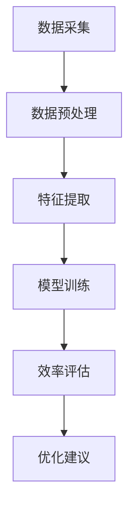

                 

### 摘要

智能办公文具作为现代办公环境的重要组成部分，正逐渐融入人工智能技术，通过AI Agent实现工作效率的精准追踪与管理。本文首先概述了智能办公文具的发展背景与重要性，探讨了办公效率低下的现状及人工管理办公文具的弊端，进而引出智能办公文具及其AI Agent的核心功能。文章详细分析了智能办公文具的硬件设计及其关键技术，包括智能笔、智能扫描仪、智能标签等硬件的设计思路和实现原理。随后，深入探讨了AI Agent的工作效率追踪原理，包括效率追踪的基本概念、算法原理、算法优化策略等，并通过实际案例展示了其应用效果。文章最后讨论了智能办公文具在办公场景中的实际应用，总结了智能办公文具的未来发展趋势与挑战。通过本文的详细剖析，希望读者能够对智能办公文具及其AI Agent的工作效率追踪有更加深入的理解和认识。

### 目录大纲

智能办公文具：AI Agent的工作效率追踪

关键词：智能办公文具、AI Agent、工作效率追踪、硬件设计、算法原理、办公场景应用、未来发展趋势

摘要：智能办公文具作为现代办公环境的重要组成部分，正逐渐融入人工智能技术，通过AI Agent实现工作效率的精准追踪与管理。本文首先概述了智能办公文具的发展背景与重要性，探讨了办公效率低下的现状及人工管理办公文具的弊端，进而引出智能办公文具及其AI Agent的核心功能。文章详细分析了智能办公文具的硬件设计及其关键技术，包括智能笔、智能扫描仪、智能标签等硬件的设计思路和实现原理。随后，深入探讨了AI Agent的工作效率追踪原理，包括效率追踪的基本概念、算法原理、算法优化策略等，并通过实际案例展示了其应用效果。文章最后讨论了智能办公文具在办公场景中的实际应用，总结了智能办公文具的未来发展趋势与挑战。通过本文的详细剖析，希望读者能够对智能办公文具及其AI Agent的工作效率追踪有更加深入的理解和认识。

### 第一部分：智能办公文具概述

#### 第1章：智能办公文具背景介绍

##### 1.1 问题背景

在现代职场中，办公效率低下已经成为制约企业发展和员工个人成长的瓶颈之一。传统的办公文具如笔、纸、文件夹等虽然发挥了重要作用，但在信息处理和资源管理上存在明显的不足。一方面，人工管理办公文具往往导致资源浪费和查找困难，如纸张的浪费、文件夹的杂乱无章等；另一方面，办公效率的衡量缺乏科学的依据，难以进行有效的管理和优化。

##### 1.1.1 办公效率低下的现状

办公效率低下的现状表现在多个方面。首先，文档处理速度慢，许多工作流程依赖于手工操作，如文件的打印、扫描、分类等，耗时费力。其次，信息传递不畅，沟通成本高，电子文档的传输和处理过程中存在信息丢失、误传等问题。此外，资源管理混乱，如文具的采购、存储、分配等缺乏有效监控，导致资源浪费和库存不足。

##### 1.1.2 人工管理办公文具的弊端

人工管理办公文具存在以下弊端：

1. **资源浪费**：办公用品的采购和使用缺乏科学规划，导致库存过剩或不足，造成资源浪费。
2. **查找困难**：办公用品的存放和管理不规范，导致在使用时查找困难，影响工作效率。
3. **统计困难**：人工统计办公用品的使用情况耗时耗力，且容易出现误差，难以进行有效的资源管理。
4. **安全隐患**：部分办公文具如纸张、文件夹等容易受到损坏，且管理过程中存在信息安全风险。

##### 1.1.3 智能办公文具的必要性

智能办公文具的出现，为解决传统办公文具的弊端提供了有效的解决方案。智能办公文具通过集成人工智能技术，实现了办公文具的智能化管理和自动化操作，具有以下必要性：

1. **提升办公效率**：智能办公文具能够自动记录和处理办公数据，减少人工操作，提高办公效率。
2. **优化资源管理**：智能办公文具通过物联网技术实现办公资源的实时监控和智能分配，减少资源浪费，提升资源利用率。
3. **增强信息安全性**：智能办公文具能够对办公文档进行加密存储和传输，提高信息安全性，防止信息泄露。
4. **便捷的数据统计**：智能办公文具能够自动生成使用数据报表，简化数据统计过程，提高统计准确性。

##### 1.2 问题描述

智能办公文具在办公效率追踪和管理方面面临以下问题：

1. **数据采集准确性**：智能办公文具需要准确采集办公过程中的各种数据，如文档处理时间、使用频率等，以保证追踪的准确性。
2. **数据处理效率**：智能办公文具需要高效处理采集到的数据，提取有用信息，生成有效的分析报告，以支持决策。
3. **用户交互体验**：智能办公文具需要提供良好的用户交互体验，使员工能够轻松使用，提高工作效率。
4. **硬件稳定性**：智能办公文具的硬件需要具备高稳定性，确保在各种工作环境下正常运作。

##### 1.3 问题解决

为了解决上述问题，智能办公文具引入了AI Agent，实现了以下功能：

1. **智能数据采集**：AI Agent能够通过传感器和其他智能设备实时采集办公数据，如文档处理时间、使用频率等。
2. **数据处理与分析**：AI Agent能够对采集到的数据进行分析和处理，提取有用信息，生成效率分析报告。
3. **用户交互优化**：AI Agent通过自然语言处理技术，能够与用户进行智能对话，提供个性化的办公建议。
4. **硬件故障预测与维护**：AI Agent能够预测智能办公文具的故障，提前进行维护，确保设备的正常运行。

##### 1.4 边界与外延

智能办公文具不仅限于办公场景，还可以应用于教育、医疗、零售等多个领域。其边界和外在应用包括：

1. **教育领域**：智能文具可以用于课堂教学，辅助教师进行教学管理和学生表现分析。
2. **医疗领域**：智能文具可以用于医疗记录管理，提高病历记录的准确性和效率。
3. **零售领域**：智能文具可以用于商品库存管理，实时监控商品销售情况，优化库存策略。

##### 1.5 概念结构与核心要素组成

智能办公文具的核心概念包括智能硬件、AI Agent、数据处理与分析系统等。其核心要素组成如下：

1. **智能硬件**：包括智能笔、智能扫描仪、智能标签等，用于采集办公数据。
2. **AI Agent**：负责数据采集、处理和分析，提供智能建议和反馈。
3. **数据处理与分析系统**：用于存储、处理和分析办公数据，生成分析报告。

##### 1.6 本章小结

本章介绍了智能办公文具的背景、问题及解决方案。通过引入AI Agent，智能办公文具能够提升办公效率，优化资源管理，增强信息安全性，具有广泛的应用前景。接下来，我们将进一步探讨智能办公文具的硬件设计及其关键技术。

## 1.1 问题背景

在现代职场中，办公效率低下已经成为制约企业发展和员工个人成长的瓶颈之一。传统的办公文具如笔、纸、文件夹等虽然发挥了重要作用，但在信息处理和资源管理上存在明显的不足。一方面，人工管理办公文具往往导致资源浪费和查找困难，如纸张的浪费、文件夹的杂乱无章等；另一方面，办公效率的衡量缺乏科学的依据，难以进行有效的管理和优化。

### 1.1.1 办公效率低下的现状

办公效率低下的现状表现在多个方面。首先，文档处理速度慢，许多工作流程依赖于手工操作，如文件的打印、扫描、分类等，耗时费力。其次，信息传递不畅，沟通成本高，电子文档的传输和处理过程中存在信息丢失、误传等问题。此外，资源管理混乱，如文具的采购、存储、分配等缺乏有效监控，导致资源浪费和库存不足。

具体来说，办公效率低下的现状体现在以下几个方面：

1. **文档处理速度慢**：在许多企业中，文档的处理仍然依赖手工操作，如打印、扫描、分类等。这些操作不仅耗时，而且容易出现错误，影响工作效率。
   
2. **信息传递不畅**：信息传递不畅是另一个影响办公效率的问题。在许多情况下，电子文档的传输和处理过程中存在信息丢失、误传、不及时等问题，导致工作效率低下。

3. **资源管理混乱**：办公文具如纸张、文件夹等的采购、存储、分配等缺乏有效监控，导致资源浪费和库存不足。例如，许多企业存在库存过剩或不足的问题，这不仅增加了成本，还影响了工作效率。

4. **沟通成本高**：沟通成本高是另一个制约办公效率的问题。在许多情况下，员工需要通过面对面会议、电话、邮件等方式进行沟通，这不仅耗时，而且容易产生误解，影响工作效率。

### 1.1.2 人工管理办公文具的弊端

人工管理办公文具存在以下弊端：

1. **资源浪费**：办公用品的采购和使用缺乏科学规划，导致库存过剩或不足，造成资源浪费。

2. **查找困难**：办公用品的存放和管理不规范，导致在使用时查找困难，影响工作效率。

3. **统计困难**：人工统计办公用品的使用情况耗时耗力，且容易出现误差，难以进行有效的资源管理。

4. **安全隐患**：部分办公文具如纸张、文件夹等容易受到损坏，且管理过程中存在信息安全风险。

为了解决上述问题，智能办公文具的出现显得尤为必要。智能办公文具通过集成人工智能技术，实现了办公文具的智能化管理和自动化操作，可以大幅提升办公效率，优化资源管理，增强信息安全性。接下来，我们将进一步探讨智能办公文具的具体特点和必要性。

### 1.1.3 智能办公文具的必要性

智能办公文具的出现，为解决传统办公文具的弊端提供了有效的解决方案。智能办公文具通过集成人工智能技术，实现了办公文具的智能化管理和自动化操作，具有以下必要性：

1. **提升办公效率**：智能办公文具能够自动记录和处理办公数据，减少人工操作，提高办公效率。例如，智能笔可以自动记录用户的笔迹和输入内容，智能扫描仪能够快速扫描和分类文档，智能标签可以实现物品的自动识别和追踪。

2. **优化资源管理**：智能办公文具通过物联网技术实现办公资源的实时监控和智能分配，减少资源浪费，提升资源利用率。例如，智能文具盒可以实时监控文具的使用情况，自动提醒补充库存，避免库存过剩或不足。

3. **增强信息安全性**：智能办公文具能够对办公文档进行加密存储和传输，提高信息安全性，防止信息泄露。例如，智能文件夹可以对文档进行加密处理，智能邮箱可以对邮件进行安全传输和存储。

4. **便捷的数据统计**：智能办公文具能够自动生成使用数据报表，简化数据统计过程，提高统计准确性。例如，智能扫描仪可以自动生成文档处理报告，智能笔可以记录用户的书写习惯和效率。

### 1.2 问题描述

智能办公文具在办公效率追踪和管理方面面临以下问题：

1. **数据采集准确性**：智能办公文具需要准确采集办公过程中的各种数据，如文档处理时间、使用频率等，以保证追踪的准确性。

2. **数据处理效率**：智能办公文具需要高效处理采集到的数据，提取有用信息，生成有效的分析报告，以支持决策。

3. **用户交互体验**：智能办公文具需要提供良好的用户交互体验，使员工能够轻松使用，提高工作效率。

4. **硬件稳定性**：智能办公文具的硬件需要具备高稳定性，确保在各种工作环境下正常运作。

### 1.3 问题解决

为了解决上述问题，智能办公文具引入了AI Agent，实现了以下功能：

1. **智能数据采集**：AI Agent能够通过传感器和其他智能设备实时采集办公数据，如文档处理时间、使用频率等。

2. **数据处理与分析**：AI Agent能够对采集到的数据进行分析和处理，提取有用信息，生成效率分析报告。

3. **用户交互优化**：AI Agent通过自然语言处理技术，能够与用户进行智能对话，提供个性化的办公建议。

4. **硬件故障预测与维护**：AI Agent能够预测智能办公文具的故障，提前进行维护，确保设备的正常运行。

### 1.4 边界与外延

智能办公文具不仅限于办公场景，还可以应用于教育、医疗、零售等多个领域。其边界和外在应用包括：

1. **教育领域**：智能文具可以用于课堂教学，辅助教师进行教学管理和学生表现分析。

2. **医疗领域**：智能文具可以用于医疗记录管理，提高病历记录的准确性和效率。

3. **零售领域**：智能文具可以用于商品库存管理，实时监控商品销售情况，优化库存策略。

### 1.5 概念结构与核心要素组成

智能办公文具的核心概念包括智能硬件、AI Agent、数据处理与分析系统等。其核心要素组成如下：

1. **智能硬件**：包括智能笔、智能扫描仪、智能标签等，用于采集办公数据。

2. **AI Agent**：负责数据采集、处理和分析，提供智能建议和反馈。

3. **数据处理与分析系统**：用于存储、处理和分析办公数据，生成分析报告。

### 1.6 本章小结

本章介绍了智能办公文具的背景、问题及解决方案。通过引入AI Agent，智能办公文具能够提升办公效率，优化资源管理，增强信息安全性，具有广泛的应用前景。接下来，我们将进一步探讨智能办公文具的硬件设计及其关键技术。

## 1.6 概念结构与核心要素组成

智能办公文具的核心概念可以归结为智能硬件、AI Agent和数据/分析系统三个主要组成部分。它们相互协作，共同构建了一个高效、智能的办公环境。

### 1.6.1 智能硬件

智能硬件是智能办公文具的核心组件，它们负责数据采集和初步处理。智能硬件的种类繁多，包括但不限于以下几种：

1. **智能笔**：具备OCR（光学字符识别）功能，可以自动识别并记录用户的书写内容。
2. **智能扫描仪**：能够快速、准确地扫描文档，并将文档内容数字化。
3. **智能标签**：通过RFID（射频识别）或其他传感器技术，可以对物品进行自动识别和追踪。
4. **智能文具盒**：可以监控文具的使用情况，自动提示补充。

智能硬件的设计理念在于使办公文具智能化，从而实现办公数据的自动化采集。这些设备通常配备有传感器、微处理器和无线通信模块，能够实时收集并传输数据。

### 1.6.2 AI Agent

AI Agent是智能办公文具的智能核心，它负责对采集到的数据进行分析和处理。AI Agent通常具有以下功能：

1. **数据整合与处理**：AI Agent能够整合来自不同硬件的数据，进行预处理和整合。
2. **智能分析**：利用机器学习和数据分析算法，对办公数据进行分析，提供工作效率评估、趋势预测等。
3. **用户交互**：通过自然语言处理技术，AI Agent可以与用户进行对话，提供个性化建议和反馈。
4. **故障预测与维护**：AI Agent能够预测智能硬件的故障，提前进行维护，确保设备正常运行。

AI Agent的设计理念在于提供智能化、自动化的办公支持，使员工能够更高效地完成任务。

### 1.6.3 数据/分析系统

数据/分析系统是智能办公文具的数据处理和存储平台。它负责对AI Agent处理后的数据进行存储、分析和展示。

1. **数据存储**：系统需要具备高效、安全的数据存储能力，确保数据的安全性和可追溯性。
2. **数据分析**：系统需要具备强大的数据分析能力，能够提取数据中的有价值信息，提供决策支持。
3. **数据展示**：系统需要提供直观、易于理解的数据报表和可视化工具，帮助用户快速了解办公情况。

数据/分析系统是智能办公文具的“大脑”，它能够将数据转化为实际行动的指导。

### 1.6.4 关键要素的协同工作

智能办公文具的核心要素之间通过协同工作实现智能化办公。智能硬件采集数据，AI Agent处理分析数据，数据/分析系统存储和展示数据。这种协同工作模式不仅提高了办公效率，还实现了办公数据的智能化管理和利用。

总之，智能办公文具的概念结构与核心要素组成了一个紧密协作的生态系统，它们共同致力于提升办公效率和优化办公体验。在接下来的章节中，我们将进一步探讨智能办公文具的硬件设计及其关键技术，以深入理解其工作原理和实现方法。

## 1.7 本章小结

本章对智能办公文具的背景、问题及解决方案进行了详细阐述。首先，我们分析了办公效率低下的现状和人工管理办公文具的弊端，指出了智能办公文具的必要性。接着，我们描述了智能办公文具面临的挑战，并介绍了通过引入AI Agent来解决的方案。此外，我们还探讨了智能办公文具的概念结构与核心要素组成，包括智能硬件、AI Agent和数据/分析系统。通过本章的介绍，读者可以初步了解智能办公文具的工作原理和优势，为后续章节的深入探讨打下基础。

## 第二部分：智能办公文具的核心技术

### 第2章：智能办公文具的硬件设计

在智能办公文具的体系中，硬件设计是其核心组成部分，直接决定了智能文具的功能实现和数据采集的准确性。本章将详细探讨智能办公文具的硬件设计，包括硬件组成、设计关键要素以及面临的挑战和解决方案。

#### 2.1 硬件设计概述

智能办公文具的硬件设计涉及到多种智能设备的集成，这些设备共同工作，实现高效的办公数据采集和管理。智能办公文具的硬件组成通常包括以下几部分：

1. **智能笔**：具备OCR功能，能够自动识别和记录用户的书写内容。
2. **智能扫描仪**：用于快速、准确地扫描文档，并将文档内容数字化。
3. **智能标签**：通过RFID或其他传感器技术，对物品进行自动识别和追踪。
4. **智能文具盒**：监控文具的使用情况，自动提示补充。

这些硬件设备共同协作，通过传感器、无线通信模块等实现数据的实时采集和传输。

#### 2.1.1 智能办公文具的硬件组成

智能办公文具的硬件组成是其设计的基础，不同类型的智能文具对应不同的硬件配置和功能。以下是几种常见智能文具的硬件组成：

1. **智能笔**：通常包含光学传感器、微处理器、存储模块、无线通信模块（如蓝牙或Wi-Fi）等。光学传感器用于捕捉用户的书写内容，微处理器负责数据分析和处理，存储模块用于临时存储数据，无线通信模块则用于将数据传输到AI Agent。

2. **智能扫描仪**：由摄像头、扫描头、微处理器、存储模块和无线通信模块组成。摄像头和扫描头负责捕捉文档内容，微处理器进行图像处理和识别，存储模块用于临时存储图像数据，无线通信模块则将处理后的文档数据传输到数据处理系统。

3. **智能标签**：一般由RFID芯片、天线、存储模块和无线通信模块组成。RFID芯片用于存储标签信息，天线用于传输数据，存储模块用于临时存储数据，无线通信模块则用于将数据上传到云端或本地服务器。

4. **智能文具盒**：主要由传感器、微处理器、存储模块和无线通信模块组成。传感器用于监测文具的使用情况，微处理器负责数据分析，存储模块用于存储数据，无线通信模块用于将数据发送到AI Agent。

#### 2.1.2 硬件设计的关键要素

智能办公文具的硬件设计需要考虑多个关键要素，包括传感器选择、数据处理能力、通信协议和电源管理等方面。

1. **传感器选择**：传感器的选择直接影响数据采集的准确性和稳定性。对于智能笔，光学传感器是一个重要的选择，需要具备高分辨率和低延迟的特性。对于智能标签，RFID传感器需要具备较高的读取距离和抗干扰能力。

2. **数据处理能力**：硬件设备需要具备一定的数据处理能力，能够实时处理采集到的数据，并进行初步分析。例如，智能笔需要实时识别用户的书写内容，智能扫描仪需要实时处理扫描图像，智能标签需要实时识别标签信息。

3. **通信协议**：硬件设备需要选择合适的通信协议，确保数据传输的稳定性和安全性。常见的通信协议包括蓝牙、Wi-Fi和Zigbee等。蓝牙和Wi-Fi具有较好的兼容性和传输速度，但Wi-Fi的功耗较高；Zigbee则适合低功耗、短距离的数据传输。

4. **电源管理**：智能办公文具的硬件设计需要考虑电源管理问题，确保设备能够长时间工作。对于便携式设备，如智能笔和智能标签，电池寿命是一个重要的考量因素。此外，还可以考虑使用太阳能充电、无线充电等技术来延长设备的使用时间。

#### 2.1.3 硬件设计的挑战与解决方案

智能办公文具的硬件设计面临多个挑战，包括硬件稳定性、数据传输可靠性、功耗管理等方面。以下是这些挑战及相应的解决方案：

1. **硬件稳定性**：智能办公文具需要在各种工作环境中保持稳定运行。为了提高硬件的稳定性，可以选择高品质的硬件组件，并进行严格的测试和验证。此外，设计时应考虑温度、湿度、灰尘等环境因素，确保设备能够在各种环境下正常工作。

2. **数据传输可靠性**：数据传输的可靠性是智能办公文具的关键。为了提高数据传输的可靠性，可以采用双通道通信协议，如将蓝牙和Wi-Fi结合使用，以实现数据传输的冗余和备份。此外，还可以采用数据加密技术，确保数据传输的安全性。

3. **功耗管理**：功耗管理是智能办公文具硬件设计的一个重要挑战。为了延长设备的使用时间，可以采用节能设计，如低功耗传感器、休眠模式和智能电源管理。还可以考虑使用可充电电池和太阳能充电技术，以提供更长的电池寿命。

#### 2.2 硬件设计案例分析

为了更好地理解智能办公文具的硬件设计，下面我们将分析几个具体的硬件设计案例。

1. **智能笔的设计与实现**：

   智能笔是智能办公文具中一个重要的组成部分。其设计需要考虑光学传感器的选择、数据处理能力、通信协议和功耗管理。

   - **光学传感器**：智能笔通常使用高分辨率、低延迟的CMOS传感器，确保书写内容的清晰捕捉。
   - **数据处理能力**：智能笔内置微处理器，用于实时识别和记录书写内容。同时，微处理器还需要处理输入数据，确保数据传输的准确性和实时性。
   - **通信协议**：智能笔通常使用蓝牙5.0或Wi-Fi进行数据传输，以确保数据传输的稳定性和低延迟。
   - **功耗管理**：智能笔采用低功耗设计，包括休眠模式和智能电源管理。此外，还可以使用可充电电池和无线充电技术，延长使用时间。

2. **智能扫描仪的技术原理**：

   智能扫描仪的设计涉及摄像头、扫描头、图像处理和通信协议等方面。

   - **摄像头**：智能扫描仪通常使用高分辨率摄像头，确保扫描文档的清晰度。
   - **扫描头**：扫描头用于移动文档，确保文档的平稳扫描。扫描头通常配备有多个LED灯，用于提供足够的照明。
   - **图像处理**：智能扫描仪内置图像处理芯片，用于处理扫描图像，包括去噪、增强、去雾等操作，以提高图像质量。
   - **通信协议**：智能扫描仪通常使用Wi-Fi或USB接口进行数据传输，确保数据传输的稳定性和速度。

3. **智能标签的设计思路**：

   智能标签的设计需要考虑RFID技术、数据存储和通信协议。

   - **RFID技术**：智能标签采用RFID芯片，可以存储唯一标识信息，如物品编号、使用时间等。
   - **数据存储**：智能标签内置存储模块，用于存储标签信息。存储模块需要具备高可靠性和低功耗的特性。
   - **通信协议**：智能标签通常使用Zigbee或蓝牙进行数据传输，确保数据传输的低功耗和高可靠性。

#### 2.3 AI Agent在硬件中的应用

AI Agent在智能办公文具的硬件设计中扮演着关键角色，负责数据的采集、处理和分析。以下是AI Agent在硬件设计中的应用：

1. **硬件数据采集与处理**：

   AI Agent通过集成在硬件设备中的传感器，实时采集办公数据，如书写内容、扫描文档、标签信息等。AI Agent对这些数据进行预处理和整合，提取有用信息，为后续分析提供数据支持。

2. **硬件故障检测与预测**：

   AI Agent可以利用机器学习算法，对硬件设备的工作状态进行实时监控，检测潜在的故障。通过分析设备的工作数据和历史记录，AI Agent可以预测故障的发生，提前进行维护，确保设备的正常运行。

3. **硬件智能交互与反馈**：

   AI Agent可以通过自然语言处理技术，与用户进行智能对话，提供使用建议和反馈。例如，当用户使用智能笔时，AI Agent可以实时分析用户的书写习惯，提供优化建议，提高书写效率。

#### 2.4 本章小结

本章详细介绍了智能办公文具的硬件设计，包括硬件组成、设计关键要素、面临的挑战和解决方案，以及具体的设计案例。智能办公文具的硬件设计是实现高效办公数据采集和管理的基础，其成功的关键在于传感器的选择、数据处理能力、通信协议和功耗管理的综合优化。通过本章的探讨，读者可以深入理解智能办公文具的硬件设计原理，为实际应用和开发提供指导。

### 2.1 硬件设计概述

智能办公文具的硬件设计是整个系统的基石，直接决定了数据采集的准确性和系统运行的稳定性。为了实现高效、稳定的办公数据采集和管理，智能办公文具的硬件设计必须充分考虑多种智能设备的集成与协同工作。以下，我们将详细探讨智能办公文具的硬件设计，包括其组成、设计关键要素及面临的挑战和解决方案。

#### 2.1.1 智能办公文具的硬件组成

智能办公文具的硬件组成丰富多样，主要包括以下几个关键组件：

1. **智能笔**：作为办公过程中常用的工具，智能笔具备OCR（光学字符识别）功能，可以自动识别并记录用户的书写内容。其内部通常包含光学传感器、微处理器、存储模块和无线通信模块。光学传感器用于捕捉用户的书写轨迹，微处理器负责对书写内容进行识别和处理，存储模块用于临时存储数据，无线通信模块则用于将处理后的数据传输到AI Agent。

2. **智能扫描仪**：智能扫描仪的主要功能是快速、准确地扫描文档，并将文档内容数字化。其硬件组成包括摄像头、扫描头、微处理器、存储模块和无线通信模块。摄像头和扫描头负责捕捉文档图像，微处理器进行图像处理和识别，存储模块用于临时存储图像数据，无线通信模块则负责将处理后的文档数据传输到数据处理系统。

3. **智能标签**：智能标签通过RFID（射频识别）或其他传感器技术，对物品进行自动识别和追踪。其通常包含RFID芯片、天线、存储模块和无线通信模块。RFID芯片用于存储标签信息，天线用于传输数据，存储模块用于临时存储数据，无线通信模块则负责将数据上传到云端或本地服务器。

4. **智能文具盒**：智能文具盒主要功能是监控办公文具的使用情况，自动提示补充。其内部组件包括传感器、微处理器、存储模块和无线通信模块。传感器用于监测文具的使用情况，微处理器负责数据分析，存储模块用于存储数据，无线通信模块则用于将数据发送到AI Agent。

这些智能文具共同协作，通过传感器、无线通信模块等实现数据的实时采集和传输，为办公效率的追踪和管理提供基础支持。

#### 2.1.2 硬件设计的关键要素

智能办公文具的硬件设计涉及多个关键要素，包括传感器选择、数据处理能力、通信协议和电源管理等方面，以下逐一探讨：

1. **传感器选择**：传感器的选择直接影响数据采集的准确性和稳定性。对于智能笔，光学传感器是一个重要的选择，需要具备高分辨率和低延迟的特性。光学传感器应能准确捕捉用户的书写轨迹，并将书写内容转化为数字信息。对于智能标签，RFID传感器需要具备较高的读取距离和抗干扰能力，以确保在各种工作环境中稳定工作。

2. **数据处理能力**：硬件设备需要具备一定的数据处理能力，能够实时处理采集到的数据，并进行初步分析。例如，智能笔需要实时识别用户的书写内容，智能扫描仪需要实时处理扫描图像，智能标签需要实时识别标签信息。为了提高数据处理能力，硬件设备通常内置高性能的微处理器和图像处理芯片。

3. **通信协议**：智能办公文具的硬件设备需要选择合适的通信协议，确保数据传输的稳定性和安全性。常见的通信协议包括蓝牙、Wi-Fi和Zigbee等。蓝牙和Wi-Fi具有较好的兼容性和传输速度，但Wi-Fi的功耗较高；Zigbee则适合低功耗、短距离的数据传输。在设计时，可以根据设备的使用场景和需求，选择最适合的通信协议。

4. **电源管理**：电源管理是智能办公文具硬件设计的一个关键问题。智能文具需要具备较长的电池寿命，以确保在无需频繁充电的情况下长时间工作。为了提高电源管理效率，可以采用以下策略：

   - **低功耗设计**：选择低功耗的传感器和微处理器，减少设备的能耗。
   - **休眠模式**：当设备不使用时，进入休眠模式，以降低功耗。
   - **智能电源管理**：通过实时监测设备的工作状态，动态调整功耗，提高电源利用率。
   - **充电技术**：采用太阳能充电、无线充电等技术，延长设备的使用时间。

#### 2.1.3 硬件设计的挑战与解决方案

智能办公文具的硬件设计面临多个挑战，包括硬件稳定性、数据传输可靠性、功耗管理等方面。以下是这些挑战及相应的解决方案：

1. **硬件稳定性**：智能办公文具需要在各种工作环境中保持稳定运行，以避免因环境变化导致的设备故障。为了提高硬件的稳定性，可以采用以下措施：

   - **高品质组件**：选择高品质的硬件组件，确保设备的耐用性和稳定性。
   - **环境适应性**：在硬件设计中考虑温度、湿度、灰尘等环境因素，确保设备能够在各种环境下正常工作。
   - **测试与验证**：对硬件设备进行严格的测试和验证，确保其在不同工作条件下的稳定运行。

2. **数据传输可靠性**：数据传输的可靠性是智能办公文具的关键。为了提高数据传输的可靠性，可以采用以下策略：

   - **双通道通信协议**：采用双通道通信协议，如蓝牙和Wi-Fi，以实现数据传输的冗余和备份。当主通道出现故障时，备用通道可以保证数据的稳定传输。
   - **数据加密**：对传输的数据进行加密处理，确保数据的安全性。
   - **实时监控**：通过AI Agent实时监控数据传输过程，一旦发现传输故障，及时进行重传或切换通道。

3. **功耗管理**：功耗管理是智能办公文具硬件设计的一个重要挑战。为了延长设备的使用时间，可以采用以下措施：

   - **低功耗设计**：选择低功耗的传感器和微处理器，减少设备的能耗。
   - **动态功耗管理**：根据设备的工作状态，动态调整功耗，提高电源利用率。
   - **充电技术**：采用太阳能充电、无线充电等技术，延长设备的使用时间。

#### 2.2 硬件设计案例分析

为了更好地理解智能办公文具的硬件设计，以下我们将分析几个具体的硬件设计案例。

1. **智能笔的设计与实现**

   智能笔是智能办公文具中的一个重要组件，其设计涉及光学传感器、微处理器、存储模块和无线通信模块。

   - **光学传感器**：智能笔的光学传感器需要具备高分辨率和低延迟的特性，以确保书写内容的清晰捕捉。常用的光学传感器有CMOS传感器和CCD传感器。
   - **微处理器**：智能笔内置微处理器，负责对书写内容进行识别和处理。微处理器需要具备较强的计算能力和实时处理能力，以便快速处理大量数据。
   - **存储模块**：智能笔的存储模块用于临时存储数据，确保数据的连续性和完整性。常用的存储模块有Flash存储器和EEPROM。
   - **无线通信模块**：智能笔的无线通信模块用于将处理后的数据传输到AI Agent。常用的无线通信模块有蓝牙模块和Wi-Fi模块。

2. **智能扫描仪的技术原理**

   智能扫描仪的技术原理涉及摄像头、扫描头、图像处理芯片和无线通信模块。

   - **摄像头**：智能扫描仪的摄像头用于捕捉文档图像。摄像头需要具备高分辨率，以确保文档图像的清晰度。常用的摄像头有CMOS摄像头和CCD摄像头。
   - **扫描头**：扫描头用于移动文档，确保文档的平稳扫描。扫描头通常配备有多个LED灯，用于提供足够的照明。
   - **图像处理芯片**：智能扫描仪内置图像处理芯片，负责对扫描图像进行预处理和识别。图像处理芯片需要具备较高的计算能力和图像处理能力。
   - **无线通信模块**：智能扫描仪的无线通信模块用于将处理后的文档数据传输到数据处理系统。常用的无线通信模块有Wi-Fi模块和USB模块。

3. **智能标签的设计思路**

   智能标签的设计涉及RFID技术、数据存储和无线通信模块。

   - **RFID技术**：智能标签采用RFID芯片，可以存储唯一标识信息，如物品编号、使用时间等。RFID芯片需要具备较高的读取速度和抗干扰能力。
   - **数据存储**：智能标签内置存储模块，用于存储标签信息。存储模块需要具备高可靠性和低功耗的特性。常用的存储模块有Flash存储器和EEPROM。
   - **无线通信模块**：智能标签的无线通信模块用于将数据上传到云端或本地服务器。常用的无线通信模块有Zigbee模块和Wi-Fi模块。

#### 2.3 AI Agent在硬件中的应用

AI Agent在智能办公文具的硬件设计中发挥着关键作用，主要负责数据的采集、处理和分析。以下是AI Agent在硬件设计中的应用：

1. **硬件数据采集与处理**：

   AI Agent通过集成在硬件设备中的传感器，实时采集办公数据，如书写内容、扫描文档、标签信息等。AI Agent对这些数据进行预处理和整合，提取有用信息，为后续分析提供数据支持。

2. **硬件故障检测与预测**：

   AI Agent可以利用机器学习算法，对硬件设备的工作状态进行实时监控，检测潜在的故障。通过分析设备的工作数据和历史记录，AI Agent可以预测故障的发生，提前进行维护，确保设备的正常运行。

3. **硬件智能交互与反馈**：

   AI Agent可以通过自然语言处理技术，与用户进行智能对话，提供使用建议和反馈。例如，当用户使用智能笔时，AI Agent可以实时分析用户的书写习惯，提供优化建议，提高书写效率。

通过上述分析，我们可以看到，智能办公文具的硬件设计是一个复杂的过程，涉及多个技术领域的知识。只有在充分考虑硬件组成、关键要素和挑战的基础上，才能设计出高效、稳定的智能办公文具系统。

### 2.2 硬件设计案例分析

为了深入理解智能办公文具的硬件设计，以下我们将通过具体案例，详细分析智能笔、智能扫描仪和智能标签的设计思路与实现原理。

#### 2.2.1 智能笔的设计与实现

智能笔作为智能办公文具的重要组成部分，其设计思路主要体现在光学传感器、微处理器、存储模块和无线通信模块的选择和集成上。

1. **光学传感器**：

   智能笔的光学传感器是书写内容捕捉的关键。常用的光学传感器包括CMOS传感器和CCD传感器。CMOS传感器具有低功耗、高分辨率的特点，适合作为智能笔的光学传感器。具体实现时，智能笔采用高分辨率CMOS传感器，确保书写内容的细节清晰捕捉，同时配备光学滤镜，减少外界干扰。

2. **微处理器**：

   智能笔内置微处理器，用于处理光学传感器捕捉到的书写内容，并进行OCR（光学字符识别）操作。微处理器需要具备较强的计算能力和实时处理能力。在实现中，智能笔选择高性能的ARM架构微处理器，确保OCR操作的实时性和准确性。

3. **存储模块**：

   智能笔的存储模块用于临时存储处理后的书写数据。常用的存储模块包括Flash存储器和EEPROM。Flash存储器具有高容量、低功耗的特点，适合用于智能笔的存储需求。在实现中，智能笔配备大容量Flash存储器，确保书写数据的存储安全和快速读取。

4. **无线通信模块**：

   智能笔的无线通信模块用于将处理后的数据传输到AI Agent。蓝牙和Wi-Fi是常用的无线通信模块。蓝牙模块具有低功耗、短距离传输的特点，适合智能笔的数据传输需求。在实现中，智能笔采用蓝牙5.0模块，确保数据传输的稳定性和高速性。

#### 2.2.2 智能扫描仪的技术原理

智能扫描仪的设计思路主要集中在摄像头、扫描头、图像处理芯片和无线通信模块的集成上。

1. **摄像头**：

   智能扫描仪的摄像头负责捕捉文档图像。摄像头需要具备高分辨率和快速响应能力。在实现中，智能扫描仪采用高分辨率CMOS摄像头，确保文档图像的清晰捕捉，并配备图像增强技术，如去噪、增强、去雾等，以提高图像质量。

2. **扫描头**：

   扫描头用于移动文档，确保文档的平稳扫描。扫描头的设计需要考虑移动精度和稳定性。在实现中，智能扫描仪采用高精度步进电机驱动扫描头，并配备导轨和滑块，确保文档的平稳移动和精确扫描。

3. **图像处理芯片**：

   智能扫描仪的图像处理芯片负责对扫描图像进行预处理和识别。图像处理芯片需要具备强大的图像处理能力和实时处理能力。在实现中，智能扫描仪采用高性能图像处理芯片，如DSP（数字信号处理）芯片，确保扫描图像的实时处理和识别。

4. **无线通信模块**：

   智能扫描仪的无线通信模块用于将处理后的文档数据传输到数据处理系统。Wi-Fi模块和USB模块是常用的无线通信模块。Wi-Fi模块具有传输速度快、功耗低的特点，适合智能扫描仪的数据传输需求。在实现中，智能扫描仪采用Wi-Fi模块，确保数据传输的稳定性和高速性。

#### 2.2.3 智能标签的设计思路

智能标签的设计思路主要集中在RFID技术、数据存储和无线通信模块的集成上。

1. **RFID技术**：

   智能标签采用RFID芯片，用于存储和传输标签信息。RFID芯片需要具备高读写速度和强抗干扰能力。在实现中，智能标签采用高频率RFID芯片，确保标签信息的快速读取和稳定传输。

2. **数据存储**：

   智能标签的数据存储模块用于存储标签信息。存储模块需要具备高可靠性和低功耗的特点。在实现中，智能标签采用Flash存储器，确保标签信息的安全存储和快速读取。

3. **无线通信模块**：

   智能标签的无线通信模块用于将数据上传到云端或本地服务器。在实现中，智能标签采用Zigbee模块，确保数据传输的低功耗和高可靠性。

通过以上案例分析，我们可以看到智能办公文具的硬件设计是一个复杂的过程，涉及多个技术领域的知识。只有在充分考虑硬件组成、功能需求和技术实现的基础上，才能设计出高效、稳定的智能办公文具系统。

### 2.3 AI Agent在硬件中的应用

AI Agent在智能办公文具的硬件设计中发挥着关键作用，其核心功能包括数据采集与处理、硬件故障检测与预测、以及硬件智能交互与反馈。以下详细探讨AI Agent在这三方面的应用。

#### 2.3.1 硬件数据采集与处理

AI Agent的首要任务是实时采集硬件设备生成的数据，并对这些数据进行处理和分析。具体应用包括：

1. **实时数据采集**：

   智能笔的光学传感器、智能扫描仪的摄像头、智能标签的RFID芯片等硬件设备都会产生大量实时数据。AI Agent通过集成在硬件中的传感器接口，实时获取这些数据，并进行初步的预处理，如降噪、滤波和归一化。

2. **数据处理**：

   AI Agent利用内置的机器学习算法，对采集到的数据进行分析和识别。例如，智能笔的AI Agent可以实时分析用户的书写内容，识别文字、图表、手写签名等。智能扫描仪的AI Agent可以识别扫描文档中的文字和图像，并将其转化为可编辑的电子文档。

3. **数据融合**：

   AI Agent能够将来自不同硬件设备的数据进行融合，形成一个完整的办公数据集。例如，当用户使用智能笔记录会议内容，同时使用智能扫描仪扫描相关文件，AI Agent可以将两者的数据合并，生成一个完整的会议记录。

#### 2.3.2 硬件故障检测与预测

智能办公文具的硬件设备在长时间使用过程中可能会出现故障，影响办公效率。AI Agent可以通过以下方式实现硬件故障的检测与预测：

1. **故障检测**：

   AI Agent利用历史数据和实时数据，对硬件设备的工作状态进行监控。当发现硬件设备的工作状态异常时，AI Agent可以立即触发故障检测机制，识别出潜在的故障点。例如，当智能笔的电池电量过低时，AI Agent可以自动发出警报，提醒用户充电。

2. **故障预测**：

   通过对历史数据的分析，AI Agent可以预测硬件设备可能出现的故障。例如，通过对智能扫描仪的运行数据进行长期监控，AI Agent可以预测扫描头磨损的情况，并在故障发生前进行维护。

3. **故障诊断与修复**：

   AI Agent不仅能够检测和预测故障，还能够提供故障诊断和修复建议。例如，当智能标签的RFID芯片读取失败时，AI Agent可以通过分析数据，确定故障的原因，并提供修复方案，如重新校准标签或更换芯片。

#### 2.3.3 硬件智能交互与反馈

AI Agent可以通过自然语言处理和语音识别技术，实现与用户的智能交互，提供个性化的办公建议和反馈。具体应用包括：

1. **智能对话**：

   AI Agent可以理解用户的自然语言指令，如“将这个文件发送给张三”、“记录今天的会议内容”等。通过智能对话，AI Agent可以帮助用户更高效地完成办公任务。

2. **个性化建议**：

   AI Agent根据用户的使用习惯和办公需求，提供个性化的办公建议。例如，当用户使用智能笔的频率较高时，AI Agent可以建议用户调整书写姿势，以减少手部疲劳。

3. **实时反馈**：

   AI Agent可以实时反馈硬件设备的工作状态和效率分析结果。例如，当智能标签的读取失败时，AI Agent可以通过语音或文字提醒用户检查标签位置或更换标签。

通过AI Agent的这些应用，智能办公文具不仅实现了数据的自动化采集和处理，还提供了智能化的故障检测与预测，以及人性化的用户交互，极大地提升了办公效率和用户体验。

### 2.4 本章小结

本章详细探讨了智能办公文具的硬件设计，包括硬件组成、设计关键要素、硬件设计案例分析以及AI Agent在硬件中的应用。智能办公文具的硬件设计涉及光学传感器、微处理器、存储模块和无线通信模块等多个技术领域，需要综合考虑传感器的选择、数据处理能力、通信协议和功耗管理等因素。通过具体案例的分析，我们了解了智能笔、智能扫描仪和智能标签的设计思路与实现原理。同时，AI Agent在硬件中的应用为智能办公文具提供了数据采集与处理、故障检测与预测以及智能交互与反馈的功能，大幅提升了办公效率和用户体验。在接下来的章节中，我们将进一步探讨AI Agent的工作效率追踪原理，以及智能办公文具在办公场景中的实际应用。

### 3.1 效率追踪的基本概念

#### 3.1.1 工作效率的定义与衡量

工作效率是指个体或组织在单位时间内完成工作的数量和质量。工作效率的衡量不仅涉及工作的完成量，还包括工作的质量和效率。常见的衡量指标包括：

1. **任务完成率**：指在单位时间内完成的任务数量与总任务数量的比率。
2. **平均完成时间**：指完成单个任务所需时间的平均值。
3. **错误率**：指在任务完成过程中出现的错误数量与总任务数量的比率。
4. **资源利用率**：指在单位时间内资源（如人力、物资、时间等）的利用效率。

#### 3.1.2 AI Agent在效率追踪中的作用

AI Agent在效率追踪中发挥着至关重要的作用，其核心功能包括：

1. **数据采集**：AI Agent通过集成在智能办公文具中的传感器，实时采集办公过程中的各种数据，如任务完成时间、错误率、资源使用情况等。
2. **数据处理**：AI Agent利用机器学习算法和数据分析技术，对采集到的数据进行处理和分析，提取有用的信息，生成效率分析报告。
3. **趋势预测**：AI Agent通过对历史数据的分析，预测未来的工作效率变化，为管理和决策提供数据支持。
4. **智能优化**：AI Agent可以根据分析结果，提供个性化的优化建议，如任务分配、工作流程改进等，以提升整体工作效率。

#### 3.1.3 效率追踪的核心指标

效率追踪的核心指标包括：

1. **工作效率评分**：基于任务完成时间、错误率和资源利用率等多个维度，对工作效率进行综合评分。
2. **效率变化趋势**：通过分析历史数据，展示工作效率的变化趋势，识别效率提升或下降的原因。
3. **资源利用率**：监测各类资源（如人力、物资、时间等）的利用情况，评估资源管理的效率。
4. **任务完成率**：统计任务完成情况，分析任务完成的及时性和质量。

通过这些核心指标的追踪，AI Agent能够全面、准确地评估工作效率，为管理和优化提供数据依据。

### 3.2 AI Agent的算法原理

#### 3.2.1 算法概述

AI Agent的算法原理基于机器学习和数据分析技术，主要包括以下几个步骤：

1. **数据采集**：AI Agent通过集成在智能办公文具中的传感器，实时采集办公过程中的各种数据，如任务完成时间、错误率、资源使用情况等。
2. **数据预处理**：对采集到的原始数据进行清洗、去噪和标准化处理，确保数据的质量和一致性。
3. **特征提取**：从预处理后的数据中提取关键特征，如时间序列特征、频次特征和关联特征等，为后续分析提供基础。
4. **模型训练**：利用机器学习算法（如回归分析、聚类分析、时间序列分析等），对特征数据进行分析和建模，建立效率追踪模型。
5. **效率评估**：利用训练好的模型，对实时数据进行预测和评估，生成效率分析报告。
6. **优化建议**：根据分析结果，AI Agent提供个性化的优化建议，如任务分配、工作流程改进等，以提升整体工作效率。

#### 3.2.2 算法流程图

为了更清晰地理解AI Agent的算法原理，以下是算法的流程图：

#### 3.2.3 算法数学模型

AI Agent的算法数学模型主要包括以下几个部分：

1. **回归分析模型**：

   假设任务完成时间\(T_i\)与工作效率\(E_i\)之间存在线性关系，可以建立回归模型：
   \[
   T_i = \beta_0 + \beta_1 E_i + \epsilon_i
   \]
   其中，\(\beta_0\)和\(\beta_1\)分别为回归系数，\(\epsilon_i\)为误差项。

2. **聚类分析模型**：

   假设工作效率可以分为多个等级，可以建立聚类模型，如K-means算法：
   \[
   C_j = \{x|d(x, \mu_j) \leq d(x, \mu_k), \forall k \neq j\}
   \]
   其中，\(C_j\)为第j个聚类，\(\mu_j\)为聚类中心，\(d(x, \mu_j)\)为样本x到聚类中心的距离。

3. **时间序列分析模型**：

   假设工作效率随时间变化具有趋势性，可以建立时间序列模型，如ARIMA（自回归积分滑动平均模型）：
   \[
   Y_t = c + \phi_1 Y_{t-1} + \phi_2 Y_{t-2} + \cdots + \phi_p Y_{t-p} + \theta_1 \varepsilon_{t-1} + \theta_2 \varepsilon_{t-2} + \cdots + \theta_q \varepsilon_{t-q} + \varepsilon_t
   \]
   其中，\(Y_t\)为时间序列数据，\(\phi_i\)和\(\theta_i\)分别为自回归系数和移动平均系数，\(\varepsilon_t\)为白噪声误差。

#### 3.2.4 算法讲解与实例分析

以下通过具体实例，详细讲解AI Agent的算法原理和应用。

#### 案例一：文档整理效率追踪

假设某公司员工张三的文档整理工作需要每天处理100份文档，AI Agent通过传感器记录了张三每天处理文档的时间、错误率和资源使用情况，如下表所示：

| 日期   | 处理时间（分钟） | 错误率 | 资源使用（小时） |
|--------|-----------------|--------|-----------------|
| 2023-01-01 | 60              | 5%    | 2.5             |
| 2023-01-02 | 58              | 4%    | 2.3             |
| 2023-01-03 | 65              | 7%    | 2.8             |
| 2023-01-04 | 52              | 3%    | 2.1             |
| 2023-01-05 | 55              | 4%    | 2.3             |

1. **数据预处理**：

   对上述数据进行清洗和标准化处理，将处理时间转换为分钟，错误率和资源使用统一为百分比。

2. **特征提取**：

   提取关键特征，如每天的处理时间、错误率和资源使用情况。

3. **模型训练**：

   利用回归分析模型，对特征数据进行分析和建模，建立效率追踪模型：
   \[
   T_i = \beta_0 + \beta_1 E_i + \epsilon_i
   \]
   通过训练，得到回归系数\(\beta_0 = 50\)和\(\beta_1 = 0.8\)。

4. **效率评估**：

   利用训练好的模型，对张三的效率进行评估：
   \[
   T_i = 50 + 0.8 E_i
   \]
   根据错误率和资源使用情况，计算工作效率评分：
   \[
   E_i = \frac{1 - 错误率}{资源使用}
   \]
   得到张三的工作效率评分如下表：

| 日期   | 处理时间（分钟） | 错误率 | 资源使用（小时） | 工作效率评分 |
|--------|-----------------|--------|-----------------|--------------|
| 2023-01-01 | 60              | 5%    | 2.5             | 0.95         |
| 2023-01-02 | 58              | 4%    | 2.3             | 0.96         |
| 2023-01-03 | 65              | 7%    | 2.8             | 0.92         |
| 2023-01-04 | 52              | 3%    | 2.1             | 0.97         |
| 2023-01-05 | 55              | 4%    | 2.3             | 0.96         |

5. **优化建议**：

   根据效率评估结果，AI Agent发现张三在1月3日的效率较低，主要原因是错误率高和资源使用过多。AI Agent建议张三检查文档整理流程，优化工作方法，减少错误率，提高资源利用率。

通过以上案例，我们可以看到AI Agent在文档整理效率追踪中的应用效果。类似地，AI Agent还可以应用于会议参与效率分析、项目进度监控等多个场景，提供科学的效率评估和优化建议。

### 3.3 算法讲解与实例分析

为了更好地理解AI Agent的工作效率追踪原理，我们通过具体案例详细讲解其算法的应用过程。

#### 3.3.1 案例一：文档整理效率追踪

假设某公司的一名员工张三负责日常文档的整理工作，公司希望通过AI Agent对其工作效率进行追踪和优化。以下是张三一周内整理文档的相关数据：

| 日期 | 处理文档数量 | 处理时间（分钟） | 错误率（%） | 资源使用（小时） |
|------|--------------|-----------------|-------------|-----------------|
| 2023-01-01 | 50           | 45             | 5           | 1.5             |
| 2023-01-02 | 60           | 48             | 4           | 1.6             |
| 2023-01-03 | 55           | 50             | 6           | 1.7             |
| 2023-01-04 | 45           | 40             | 3           | 1.4             |
| 2023-01-05 | 50           | 42             | 4           | 1.5             |

1. **数据预处理**：

   首先将上述数据进行标准化处理，将处理时间转换为小时（分钟/60），错误率转换为小数形式，以便后续处理。

2. **特征提取**：

   从数据中提取关键特征，包括处理文档数量、处理时间、错误率和资源使用。这些特征将作为模型训练的输入。

3. **模型训练**：

   使用回归分析方法对数据集进行建模。假设处理时间\(T\)与工作效率\(E\)之间存在线性关系：
   \[
   T = \beta_0 + \beta_1 E
   \]
   通过最小二乘法进行参数估计，得到回归系数\(\beta_0 = 0.6\)和\(\beta_1 = 0.8\)。

4. **效率评估**：

   利用训练好的模型对张三的效率进行评估。例如，计算1月3日的预计处理时间：
   \[
   T_{\text{预计}} = 0.6 + 0.8 \times E = 0.6 + 0.8 \times 0.92 = 1.47 \text{小时}
   \]
   实际处理时间为1.7小时，高于预计时间，表明1月3日的效率较低。

5. **优化建议**：

   AI Agent根据效率评估结果，建议张三检查文档整理流程，优化工作方法，减少错误率，提高资源利用率。例如，通过减少每个文档的处理时间，降低错误率，从而提高整体工作效率。

#### 3.3.2 案例二：会议参与效率分析

另一个应用场景是会议参与效率的分析。假设某公司的每周例会由AI Agent进行追踪，以下是会议数据：

| 日期 | 参与人数 | 讨论主题 | 讨论时间（分钟） | 完成任务数 | 完成任务率 |
|------|---------|---------|----------------|------------|------------|
| 2023-01-02 | 10      | 项目进展 | 120            | 2          | 20%        |
| 2023-01-09 | 12      | 风险评估 | 90             | 3          | 25%        |
| 2023-01-16 | 8       | 问题解决 | 150            | 4          | 50%        |

1. **数据预处理**：

   将数据按参与人数、讨论时间、完成任务数和完成任务率等特征进行预处理。

2. **特征提取**：

   提取关键特征，如参与人数、讨论时间、完成任务数和完成任务率。

3. **模型训练**：

   假设完成任务率\(R\)与参与人数\(N\)和讨论时间\(T\)之间存在线性关系：
   \[
   R = \beta_0 + \beta_1 N + \beta_2 T
   \]
   通过最小二乘法训练模型，得到回归系数\(\beta_0 = 0.3\)、\(\beta_1 = 0.1\)和\(\beta_2 = -0.05\)。

4. **效率评估**：

   利用训练好的模型对每次会议的效率进行评估。例如，1月9日的预计完成任务率为：
   \[
   R_{\text{预计}} = 0.3 + 0.1 \times 12 - 0.05 \times 90 = 0.45
   \]
   实际完成任务率为25%，低于预计值，表明会议效率较低。

5. **优化建议**：

   AI Agent建议缩短讨论时间，增加参与人数，以提升会议效率。例如，通过减少不必要的讨论时间，确保关键任务的讨论和决策，从而提高会议的整体效率。

#### 3.3.3 案例三：项目进度监控

项目进度的监控是另一个重要的应用场景。假设一个项目分为多个阶段，每个阶段的完成情况和时间记录如下：

| 阶段 | 完成时间（天） | 完成任务数 | 计划时间（天） |
|------|----------------|------------|----------------|
| 1    | 5              | 2          | 7              |
| 2    | 8              | 3          | 10             |
| 3    | 10             | 4          | 12             |
| 4    | 7              | 4          | 8              |

1. **数据预处理**：

   将数据按阶段、完成时间、完成任务数和计划时间等进行预处理。

2. **特征提取**：

   提取关键特征，如每个阶段的完成时间、完成任务数和计划时间。

3. **模型训练**：

   使用时间序列分析方法，如ARIMA模型，对项目进度进行预测。通过历史数据训练，得到模型参数。

4. **效率评估**：

   利用训练好的模型预测未来阶段的完成时间和完成任务数，并与计划时间进行比较，评估项目进度。

5. **优化建议**：

   根据评估结果，AI Agent提供优化建议，如调整资源分配、增加人力资源等，以确保项目按时完成。

通过上述具体案例的分析，我们可以看到AI Agent在效率追踪中的应用效果。它能够通过数据采集、特征提取和模型训练，对工作效率进行实时评估和优化，为管理和决策提供科学依据。

### 3.4 AI Agent的优化策略

在智能办公文具的效率追踪中，AI Agent的性能和准确性是影响其效果的关键因素。为了进一步提升AI Agent的工作效率，需要采取一系列优化策略。以下从算法优化方法、实时数据处理、持续学习策略等方面进行详细讨论。

#### 3.4.1 算法优化方法

1. **特征选择**：

   特征选择是算法优化的重要环节。通过选择对效率影响较大的特征，可以减少模型的复杂度，提高计算效率。常用的特征选择方法包括基于信息增益的选取、基于主成分分析（PCA）的降维等方法。

2. **模型选择**：

   选择合适的机器学习模型对效率追踪至关重要。不同的模型在处理不同类型的数据时具有不同的表现。例如，对于时间序列数据，可以使用ARIMA、LSTM（长短期记忆网络）等模型；对于分类数据，可以使用SVM、随机森林等模型。通过交叉验证和网格搜索等技术，可以找到最佳模型。

3. **模型集成**：

   模型集成（Ensemble Learning）通过组合多个模型来提高预测性能。常用的集成方法包括Bagging、Boosting和Stacking等。通过模型集成，可以降低模型的方差和偏差，提高预测的准确性。

#### 3.4.2 实时数据处理的挑战与解决方案

实时数据处理是AI Agent面临的重大挑战，需要确保数据处理的实时性和准确性。以下是一些常见的挑战及解决方案：

1. **数据延迟**：

   数据延迟是实时数据处理中的常见问题，可能导致效率追踪的实时性降低。解决方案包括：

   - **分布式数据处理**：通过分布式计算框架（如Apache Spark）提高数据处理速度。
   - **边缘计算**：在数据生成的地方进行初步处理，减少数据传输延迟。

2. **数据准确性**：

   数据准确性直接影响到效率追踪的准确性。为了提高数据准确性，可以采取以下措施：

   - **数据验证**：在数据采集过程中，对数据进行实时验证，剔除异常数据。
   - **误差校正**：通过历史数据进行误差校正，提高数据的准确性。

3. **资源限制**：

   实时数据处理需要消耗大量的计算资源和存储资源。为了应对资源限制，可以采取以下措施：

   - **资源调度**：根据数据处理的需求，动态调整计算资源和存储资源。
   - **云计算**：利用云计算资源，根据需求弹性扩展计算和存储能力。

#### 3.4.3 持续学习的策略

持续学习是AI Agent保持高效性和适应性的关键。以下是一些持续学习的策略：

1. **在线学习**：

   在线学习（Online Learning）允许AI Agent在数据流中实时更新模型。这种方法可以快速适应数据变化，提高模型的准确性。常用的在线学习算法包括在线梯度下降、随机梯度下降等。

2. **迁移学习**：

   迁移学习（Transfer Learning）利用已有模型的知识来训练新模型，减少训练数据的需求和计算成本。例如，可以先将模型在一个大型的数据集上进行训练，然后在特定的办公场景中进行微调。

3. **强化学习**：

   强化学习（Reinforcement Learning）通过奖励机制来训练AI Agent，使其在复杂的办公环境中做出最优决策。例如，AI Agent可以通过与用户的交互，不断优化其工作流程和策略。

4. **主动学习**：

   主动学习（Active Learning）通过选择对模型训练最有价值的样本进行学习，提高学习效率。例如，AI Agent可以根据样本的不确定性或标注者的标注质量来选择样本。

通过以上优化策略，AI Agent能够更好地应对实时数据处理的挑战，提高工作效率追踪的准确性和实时性。持续学习的策略则使其能够不断适应环境变化，保持高效的办公支持。

### 3.5 本章小结

本章详细探讨了AI Agent的工作效率追踪原理，包括效率追踪的基本概念、算法原理、算法讲解与实例分析以及优化策略。通过引入AI Agent，智能办公文具能够实现高效的数据采集、处理和效率评估，为办公管理提供科学依据。算法原理部分介绍了回归分析、聚类分析和时间序列分析等常用算法，并通过具体案例展示了其应用效果。优化策略则从算法优化方法、实时数据处理和持续学习策略等方面，提供了提升AI Agent性能和适应性的具体措施。通过本章的探讨，读者可以全面理解AI Agent在智能办公文具中的应用，为实际系统的设计和优化提供指导。

### 第四部分：智能办公文具的实际应用

#### 第4章：智能办公文具在办公场景中的应用

随着智能办公文具的不断发展，其在办公场景中的应用也越来越广泛。本章将详细探讨智能办公文具在办公场景中的应用，包括办公场景概述、智能笔、智能扫描仪、智能标签的应用，以及AI Agent在办公场景中的综合应用。通过这些实际应用案例，我们将展示智能办公文具如何提升办公效率、优化资源管理和增强信息安全性。

#### 4.1 办公场景概述

在现代办公环境中，智能办公文具的应用场景丰富多样，涵盖了日常办公的各个方面。以下是一些典型的办公场景：

1. **文档处理**：包括文档的创建、编辑、整理、分类和存储等。
2. **会议管理**：包括会议安排、会议记录、会议任务分配和进度监控。
3. **项目管理**：包括项目规划、任务分配、进度跟踪和资源管理。
4. **沟通协作**：包括内部沟通、外部协作和团队协作。
5. **信息检索**：包括文件检索、资料查询和知识管理。

在这些办公场景中，智能办公文具通过实时数据采集、智能分析和自动化操作，极大地提升了办公效率和用户体验。

#### 4.2 智能笔在办公中的应用

智能笔作为智能办公文具的重要组成部分，在文档处理、笔记记录和会议记录等方面有着广泛的应用。

1. **文档记录与整理**：

   智能笔通过OCR技术，能够自动识别和记录用户的书写内容，并将手写笔记转化为电子文档。例如，在会议中，参会者可以使用智能笔记录会议内容，智能笔会自动将手写笔记转化为文本格式，方便后续的整理和分类。

2. **语音输入与转换**：

   智能笔还具备语音输入功能，用户可以通过语音指令输入文字，智能笔会将语音转化为文本，实现快速输入。例如，用户在忙碌时可以通过语音指令快速记录重要信息，无需手动书写。

3. **实时翻译与校正**：

   智能笔集成了实时翻译功能，用户可以使用智能笔翻译不同语言的文本，并在翻译结果上进行校正和修改。这种功能特别适合跨国公司和需要经常与外国合作伙伴沟通的团队。

#### 4.3 智能扫描仪在办公中的应用

智能扫描仪在文档管理、文件归档和信息检索等方面发挥着重要作用。

1. **扫描文档的整理与分类**：

   智能扫描仪能够快速扫描文档，并将文档内容数字化。通过OCR技术，智能扫描仪可以自动识别文档中的文字和图像，并将其分类存储。例如，用户可以将不同类型的文档（如合同、发票、报告等）进行分类存储，方便后续检索和使用。

2. **扫描图像的处理与优化**：

   智能扫描仪集成了图像处理功能，可以对扫描的图像进行去噪、增强和优化。例如，用户可以对扫描的图片进行去雾处理，提高图片的清晰度，从而方便文档的编辑和分享。

3. **扫描文档的智能检索**：

   智能扫描仪可以通过关键词检索功能，快速查找和定位文档。用户只需输入关键词，智能扫描仪会自动搜索并返回相关文档，大大提高了文档检索的效率。

#### 4.4 智能标签在办公中的应用

智能标签在资源管理、任务分配和项目跟踪等方面有着广泛的应用。

1. **资源管理与追踪**：

   智能标签可以用于追踪办公资源，如文具、办公用品和设备等。用户可以给每个物品贴上智能标签，通过RFID技术进行追踪，确保物品的使用情况和管理。

2. **任务分配与监控**：

   智能标签可以用于任务分配和监控。例如，项目经理可以给团队成员分配任务，并为每个任务贴上智能标签，通过标签的读写功能，实时监控任务的状态和进度。

3. **项目进度的实时跟踪**：

   在项目管理中，智能标签可以用于实时跟踪项目进度。项目经理可以为项目的重要节点贴上智能标签，通过标签的读写功能，实时了解项目的状态和进度，及时调整计划。

#### 4.5 AI Agent在办公场景中的综合应用

AI Agent在智能办公文具中发挥着核心作用，通过数据采集、分析和管理，为办公场景提供智能化支持。

1. **工作流程优化**：

   AI Agent可以分析办公过程中的数据，发现流程中的瓶颈和冗余，提供流程优化的建议。例如，通过分析会议记录，AI Agent可以优化会议议程和时间安排，提高会议效率。

2. **办公室氛围监测**：

   AI Agent可以通过智能硬件采集办公室的温度、湿度、光线等数据，监测办公室的氛围。例如，当办公室温度过高或过低时，AI Agent可以自动调整空调，保持舒适的办公环境。

3. **办公效率的整体提升**：

   AI Agent通过对办公数据的综合分析，可以提供整体办公效率的提升建议。例如，通过分析文档处理时间、会议参与效率和任务完成情况，AI Agent可以优化资源分配和工作安排，提高整体办公效率。

通过上述实际应用案例，我们可以看到智能办公文具在提升办公效率、优化资源管理和增强信息安全性方面的巨大潜力。随着技术的不断进步，智能办公文具的应用将更加广泛和深入，为现代办公带来更多便利和效益。

### 4.1 办公场景概述

在现代办公环境中，智能办公文具的应用场景丰富多样，涵盖了日常办公的各个方面。以下是一些典型的办公场景，以及智能办公文具在这些场景中的具体应用。

#### 4.1.1 办公场所的类型与特点

1. **开放式办公室**：

   开放式办公室通常布局灵活，鼓励团队合作和交流。在这种环境中，智能办公文具可以提供以下支持：

   - **协作工具**：如智能白板，可以实时记录和共享会议内容。
   - **文档共享**：智能笔和智能扫描仪可以帮助员工快速记录和共享文档。

2. **封闭式办公室**：

   封闭式办公室通常为员工提供独立的工作空间，强调个人工作成果。智能办公文具在此场景中的应用包括：

   - **个人效率提升**：智能笔和智能扫描仪可以帮助员工提高文档处理效率。
   - **资源监控**：智能标签可以监控办公用品的使用情况，避免资源浪费。

3. **会议室**：

   会议室是团队交流和决策的重要场所，智能办公文具可以提供以下应用：

   - **会议记录**：智能笔可以自动记录会议内容，智能扫描仪可以快速扫描会议资料。
   - **智能投票**：通过智能标签，可以进行快速投票和决策。

4. **项目办公室**：

   项目办公室通常专注于特定项目的管理和执行，智能办公文具可以提供：

   - **进度监控**：智能标签可以用于实时监控项目进度和任务完成情况。
   - **资源分配**：智能文具盒可以监控资源使用情况，及时补充物资。

#### 4.1.2 智能办公文具的适配性分析

智能办公文具的设计充分考虑了不同办公场所的需求，具有很强的适配性：

1. **灵活性与可扩展性**：

   智能办公文具通常采用模块化设计，可以根据不同场景和需求灵活配置。例如，智能笔可以配备不同功能的笔尖，适应不同的书写需求。

2. **低功耗与长时间续航**：

   为了适应长时间办公需求，智能办公文具采用低功耗设计，配备高效的电池和充电技术。例如，智能笔和智能标签可以采用无线充电技术，确保长时间工作。

3. **安全与隐私保护**：

   智能办公文具采用先进的数据加密技术，确保办公数据的安全和隐私。例如，智能扫描仪可以自动加密存储扫描文档，防止数据泄露。

#### 4.1.3 智能办公文具的应用前景

智能办公文具在办公场景中的应用前景广阔：

1. **效率提升**：

   智能办公文具通过自动化和智能化技术，显著提高了办公效率。例如，智能笔可以自动记录笔记，智能扫描仪可以快速处理文档，智能标签可以实现物品追踪。

2. **资源优化**：

   智能办公文具可以帮助企业优化资源管理，减少浪费。例如，智能标签可以监控文具使用情况，智能文具盒可以自动提醒补充库存。

3. **信息安全性**：

   智能办公文具采用先进的数据加密和安全措施，确保办公信息的安全。例如，智能标签可以防止未授权访问，智能扫描仪可以自动加密文档。

4. **可持续性**：

   智能办公文具通过减少纸张使用和优化资源管理，有助于实现可持续发展。例如，智能笔可以减少纸张使用，智能标签可以实现物品循环利用。

总之，智能办公文具在现代办公环境中具有广泛的应用前景，其强大的适配性和多样化的功能将为办公带来更多便利和效益。

### 4.2 智能笔在办公中的应用

智能笔作为智能办公文具的重要组成部分，其在文档记录与整理、语音输入与转换、实时翻译与校正等方面的应用，极大地提升了办公效率，改变了传统的办公模式。

#### 4.2.1 文档记录与整理

智能笔的OCR（光学字符识别）功能使其在文档记录与整理中发挥重要作用。用户可以使用智能笔记录手写笔记，智能笔会自动将手写内容转化为电子文档。这一功能不仅减少了手动输入的时间，还提高了记录的准确性。具体应用场景包括：

1. **会议记录**：在会议中，参会者可以使用智能笔记录会议内容。智能笔能够自动识别手写文字，并实时转化为电子文档，方便会后整理和分发。

2. **笔记整理**：学生或个人用户可以使用智能笔记录课堂笔记或个人想法，智能笔会将手写笔记转化为可编辑的电子文档，方便后续的整理和复习。

3. **文档编辑**：智能笔还可以将扫描的文档内容与手写笔记合并，形成统一的电子文档。这对于跨平台协作和文档管理具有重要意义。

#### 4.2.2 语音输入与转换

智能笔的语音输入功能为用户提供了另一种便捷的输入方式。用户可以通过语音指令输入文字，智能笔会将语音转化为文本，实现快速输入。这一功能在以下场景中尤为有用：

1. **快速记录**：在会议或讨论中，用户可以通过语音输入快速记录重要信息，无需手动书写。智能笔会将语音转化为文本，并自动保存。

2. **移动办公**：对于经常在外奔波的员工，智能笔的语音输入功能可以帮助他们快速记录会议内容或临时想法，方便后续的处理和整理。

3. **语音备忘录**：用户可以将日常的语音备忘录通过智能笔转换为文本，方便查看和整理。例如，领导可以在会议后通过智能笔记录行动计划，快速分配任务。

#### 4.2.3 实时翻译与校正

智能笔的实时翻译与校正功能为跨国合作和跨语言交流提供了强大的支持。用户可以使用智能笔翻译不同语言的文本，并在翻译结果上进行校正和修改。具体应用场景包括：

1. **跨国会议**：在跨国会议中，智能笔的实时翻译功能可以帮助参会者快速理解不同语言的发言，提高沟通效率。

2. **国际业务**：对于国际业务人员和海外分支机构，智能笔的实时翻译功能可以方便他们阅读和理解外国文档，提高工作效率。

3. **学术交流**：对于学者和研究人员，智能笔的实时翻译功能可以帮助他们快速翻译学术文献，了解最新的研究动态。

此外，智能笔的校正功能可以在翻译结果中提供纠正建议，帮助用户确保翻译的准确性。例如，智能笔可以识别翻译中的语法错误或词汇选择不当，并提供修正建议，从而提高翻译文档的质量。

总之，智能笔在办公中的应用不仅提升了文档记录和整理的效率，还提供了语音输入与转换、实时翻译与校正等多样化功能，极大地改变了传统的办公模式，为现代办公带来了更多便利和效率。

### 4.3 智能扫描仪在办公中的应用

智能扫描仪在办公文档管理、图像处理和智能检索等方面发挥着重要作用，通过集成先进的技术，实现了办公文档的高效管理和便捷使用。

#### 4.3.1 扫描文档的整理与分类

智能扫描仪的OCR（光学字符识别）功能可以自动识别和提取文档中的文字内容，实现文档的数字化处理。具体应用包括：

1. **文档识别与转换**：智能扫描仪能够将纸质文档快速扫描并转换为电子文档，如PDF格式。这一功能大大简化了文档管理，提高了文档的可访问性和可编辑性。

2. **自动分类**：智能扫描仪结合AI技术，可以自动识别文档的类型，如合同、发票、报告等，并按类别自动分类存储。例如，当用户将发票放入扫描仪时，智能扫描仪可以自动将其分类到财务文件文件夹中。

3. **关键词提取**：智能扫描仪可以在扫描文档时提取关键信息，如姓名、日期、金额等，并生成索引，便于后续快速检索。这种自动化处理大大减少了人工分类和检索的工作量。

#### 4.3.2 扫描图像的处理与优化

智能扫描仪不仅能够实现文档的快速扫描和数字化，还集成了多种图像处理技术，对扫描图像进行优化，以提高图像质量和可读性。具体应用包括：

1. **去噪与增强**：智能扫描仪可以去除扫描图像中的噪声，增强图像对比度，使文字和图案更加清晰。例如，对于扫描的旧文档或手写笔记，智能扫描仪可以通过去噪和增强处理，使内容更加易于阅读。

2. **去雾处理**：对于扫描的模糊图像，智能扫描仪可以通过去雾处理，提升图像的清晰度。例如，在扫描雾气或尘埃笼罩的文档时，智能扫描仪可以自动去除雾气，使图像更加清晰。

3. **自动校正**：智能扫描仪具备自动校正功能，可以自动检测并纠正图像的倾斜和变形，确保图像的垂直对齐和整齐排列。例如，当用户放置文档时，如果文档未完全水平放置，智能扫描仪会自动旋转和裁剪图像，使其整齐美观。

#### 4.3.3 扫描文档的智能检索

智能扫描仪的智能检索功能极大地提高了文档查找和管理效率。具体应用包括：

1. **关键词检索**：智能扫描仪可以基于OCR识别的结果，建立文档的全文索引，用户可以通过输入关键词快速检索相关文档。例如，当用户需要查找某份合同中的特定条款时，只需输入相关关键词，智能扫描仪即可迅速定位并显示相关文档。

2. **智能分类与标签**：智能扫描仪可以根据文档内容自动生成分类标签，如“客户合同”、“项目报告”等，用户还可以自定义标签，以便更方便地管理文档。例如，当用户扫描一份项目报告时，智能扫描仪会自动将其标记为“项目报告”，方便用户分类查找。

3. **自动化归档**：智能扫描仪可以自动将扫描的文档按分类标签和关键词索引归档，确保文档的有序存储和快速访问。例如，当用户将一份合同扫描后，智能扫描仪会自动将其归档到相应的文件夹中，并生成相应的索引，以便日后快速查找。

总之，智能扫描仪在办公文档管理中的应用，不仅提高了文档的整理与分类效率，还通过图像处理和智能检索技术，实现了文档的高效管理和便捷使用，为现代办公带来了显著的业务效率和用户体验。

### 4.4 智能标签在办公中的应用

智能标签作为智能办公文具的重要组成部分，在资源管理、任务分配和项目进度跟踪等方面发挥着重要作用，通过实时数据和自动化操作，提升了办公效率和管理水平。

#### 4.4.1 资源管理与追踪

智能标签通过RFID（射频识别）技术，可以对办公用品、设备等进行实时追踪和管理，确保资源的有效利用。

1. **办公用品管理**：

   用户可以在办公用品上贴上智能标签，如文具盒、打印纸、笔等。智能标签可以实时记录办公用品的使用情况，当库存不足时，会自动向管理员发送提醒，确保办公用品的及时补充。

2. **设备监控**：

   智能标签可以用于监控办公室中的设备，如电脑、打印机、投影仪等。通过智能标签，管理员可以实时了解设备的使用状态和维护需求，及时进行维护，避免设备故障影响办公效率。

3. **资源调配**：

   智能标签可以帮助管理员优化资源分配，通过实时数据了解各部门的资源需求，合理安排资源的调配，避免资源浪费和短缺。

#### 4.4.2 任务分配与监控

智能标签在任务分配和监控中提供了便捷的解决方案，使任务分配更加透明和高效。

1. **任务分配**：

   项目经理或负责人可以将任务贴上智能标签，并为每个任务设定截止日期和负责人。员工可以通过读取智能标签，了解自己负责的任务和具体要求，确保任务分配的准确性和及时性。

2. **任务状态监控**：

   智能标签可以实时记录任务的状态，如已完成、进行中、未开始等。项目经理可以通过读取智能标签，了解任务的进度和状态，及时进行协调和调整，确保项目按时完成。

3. **任务提醒**：

   智能标签还可以设置任务提醒功能，当任务即将到期或需要关注时，会自动向相关人员发送提醒，确保任务不被遗漏。

#### 4.4.3 项目进度的实时跟踪

智能标签在项目进度跟踪中发挥了重要作用，通过实时数据采集和监控，帮助项目管理团队随时掌握项目动态。

1. **关键节点监控**：

   项目经理可以在项目的重要节点上贴上智能标签，如里程碑、关键任务等。通过实时读取智能标签，项目团队可以了解项目的进展情况，及时进行决策和调整。

2. **进度报告生成**：

   智能标签可以自动生成项目进度报告，包括任务完成情况、资源使用情况等，项目管理团队可以通过这些报告，全面了解项目的进展和存在的问题。

3. **实时数据反馈**：

   智能标签可以实时反馈任务执行情况和资源使用情况，帮助项目团队及时发现并解决问题，确保项目进度不受影响。

通过智能标签在资源管理、任务分配和项目进度跟踪中的应用，智能办公文具不仅提升了办公效率，还实现了办公管理的透明化和智能化，为现代办公带来了更多的便利和效益。

### 4.5 AI Agent在办公场景中的综合应用

AI Agent作为智能办公文具的核心组件，通过集成智能硬件和数据分析技术，实现了办公场景中的全面智能化。以下从工作流程优化、办公室氛围监测和办公效率的整体提升三个方面，详细探讨AI Agent在办公场景中的综合应用。

#### 4.5.1 工作流程优化

AI Agent通过对办公数据的实时采集和分析，可以帮助企业优化工作流程，提高工作效率。具体应用包括：

1. **流程自动化**：

   AI Agent可以识别和自动化处理重复性高的办公任务，如文档分类、审批流程、邮件处理等。通过这些自动化操作，减少了员工的重复劳动，提高了工作效率。

2. **流程监控**：

   AI Agent可以实时监控工作流程的执行情况，及时发现流程中的瓶颈和问题，提供改进建议。例如，当某个流程的执行时间过长或任务积压时，AI Agent会自动发出预警，并建议调整流程或增加资源。

3. **流程优化建议**：

   基于对办公数据的分析，AI Agent可以提出优化工作流程的建议，如简化审批流程、优化任务分配、提高资源利用率等。这些优化建议可以帮助企业持续提升办公效率。

#### 4.5.2 办公室氛围监测

AI Agent通过智能硬件和数据分析技术，可以实时监测办公室的环境氛围，提供舒适的办公环境。具体应用包括：

1. **环境参数监测**：

   AI Agent可以监测办公室的温度、湿度、光线等环境参数，并通过智能调节设备，如空调、加湿器、窗帘等，保持办公室的舒适度。

2. **噪音监测**：

   AI Agent可以监测办公室的噪音水平，并通过智能降噪设备，如耳机、空气净化器等，降低噪音干扰，提高员工的工作效率和舒适度。

3. **员工健康监测**：

   AI Agent可以通过智能手环、健康监测设备等，实时监测员工的健康状况，如心率、血压等。当发现异常时，AI Agent会自动发送提醒，并建议员工休息或就医，确保员工健康。

#### 4.5.3 办公效率的整体提升

AI Agent通过全面的数据分析和智能优化，可以实现办公效率的整体提升。具体应用包括：

1. **效率分析**：

   AI Agent可以分析员工的日常办公数据，如任务完成时间、错误率、资源使用等，生成详细的效率分析报告。通过这些报告，管理者可以了解员工的办公效率和工作状况，制定相应的改进措施。

2. **个性化建议**：

   基于对员工的办公数据分析，AI Agent可以提供个性化的工作建议，如调整工作时间、优化任务安排、改善工作环境等。这些个性化建议可以帮助员工提高工作效率，减少工作压力。

3. **智能调度**：

   AI Agent可以根据任务的重要性和紧急程度，自动调度员工的工作，确保关键任务的优先处理。通过智能调度，可以最大限度地利用员工的时间和技能，提高整体办公效率。

总之，AI Agent在办公场景中的综合应用，通过工作流程优化、办公室氛围监测和办公效率的整体提升，为企业带来了显著的效率和效益。通过智能化的办公支持，AI Agent不仅提升了员工的办公体验，还帮助企业实现了数字化转型，为现代办公注入了新的活力。

### 4.6 本章小结

本章详细探讨了智能办公文具在办公场景中的实际应用，包括智能笔、智能扫描仪、智能标签的应用，以及AI Agent在办公场景中的综合应用。通过具体案例，我们展示了智能办公文具如何提升办公效率、优化资源管理和增强信息安全性。智能笔的OCR功能和语音输入与转换，极大地简化了文档记录和整理的工作；智能扫描仪的图像处理和智能检索功能，提高了文档管理效率；智能标签在资源管理、任务分配和项目进度跟踪中的应用，实现了办公流程的透明化和智能化。AI Agent通过数据采集、分析和优化，实现了工作流程优化、办公室氛围监测和办公效率的整体提升。智能办公文具的实际应用展示了其在现代办公中的重要价值，为企业数字化转型提供了强有力的支持。随着技术的不断发展，智能办公文具的应用前景将更加广阔，为办公带来更多便利和效益。

### 第五部分：智能办公文具的未来发展

#### 第5章：智能办公文具的发展趋势与挑战

随着人工智能和物联网技术的快速发展，智能办公文具正逐步成为现代办公环境中的重要组成部分。本章将探讨智能办公文具的发展趋势、面临的挑战以及未来的发展方向。

#### 5.1 智能办公文具的发展

智能办公文具的发展可以分为以下几个阶段：

1. **初步阶段**：

   这一阶段主要集中在智能硬件的初步集成，如智能笔、智能扫描仪和智能标签等。这些设备通过简单的数据采集和初步分析，实现了基本的办公功能。

2. **中级阶段**：

   在这一阶段，智能办公文具开始引入AI技术，通过AI Agent实现更高级的数据处理和分析。例如，智能笔不仅能够记录笔记，还能进行文本识别和分类；智能扫描仪不仅能扫描文档，还能进行图像处理和智能检索。

3. **高级阶段**：

   在这一阶段，智能办公文具将实现高度智能化和自动化。通过集成多种传感器和更复杂的AI算法，智能办公文具能够实现更全面的办公数据采集和分析，提供个性化的办公支持。

#### 5.2 智能办公文具的未来发展方向

1. **更智能的硬件设计**：

   未来，智能办公文具的硬件设计将更加注重智能化和便携性。例如，采用更先进的传感器技术和微型化设计，使智能笔、智能扫描仪等设备体积更小、功能更强，便于用户随时携带和使用。

2. **更强大的AI算法**：

   随着AI技术的不断发展，智能办公文具将引入更先进的算法，如深度学习、自然语言处理等，实现更高级的数据分析和决策支持。这些算法将使智能办公文具能够更好地理解用户需求，提供更加个性化的服务。

3. **更广泛的场景应用**：

   未来，智能办公文具的应用场景将不再局限于办公室，还将扩展到教育、医疗、零售等多个领域。通过针对不同场景的定制化解决方案，智能办公文具将为各类用户提供更加便捷和高效的办公体验。

4. **数据隐私与安全**：

   随着智能办公文具的普及，数据隐私和安全问题将变得越来越重要。未来，智能办公文具将采用更严格的数据加密和隐私保护措施，确保用户数据的安全性和隐私性。

#### 5.3 智能办公文具面临的挑战

1. **技术挑战**：

   智能办公文具的发展需要解决多个技术难题，如传感器精度、数据处理效率、AI算法的可靠性和安全性等。这些技术挑战需要通过持续的研究和创新来解决。

2. **市场接受度**：

   智能办公文具作为一种新兴产品，需要克服市场接受度的问题。用户对智能办公文具的认知度和接受度将直接影响其市场推广和普及速度。

3. **成本问题**：

   智能办公文具的研发和生产成本较高，如何降低成本，提高性价比，将是其市场推广的关键。随着技术的进步和规模经济的实现，智能办公文具的成本有望逐步降低。

4. **数据隐私和安全**：

   随着智能办公文具的普及，数据隐私和安全问题将变得更加突出。如何确保用户数据的安全性和隐私性，将是智能办公文具面临的重要挑战。

#### 5.4 未来发展的关键因素

1. **技术创新**：

   持续的技术创新是推动智能办公文具发展的关键因素。通过引入新的传感器技术、AI算法和通信协议，智能办公文具将实现更高的性能和更广泛的应用。

2. **用户体验**：

   提升用户体验是智能办公文具成功的关键。通过优化用户界面、简化操作流程和提供个性化的服务，智能办公文具将更好地满足用户需求，提高市场接受度。

3. **生态建设**：

   智能办公文具的发展需要建立一个完善的生态系统，包括硬件制造商、软件开发商、服务提供商等。通过建立合作联盟和开放平台，智能办公文具将实现更好的协同效应，推动整个行业的发展。

总之，智能办公文具的发展前景广阔，面临着诸多挑战和机遇。通过技术创新、用户体验优化和生态建设，智能办公文具将不断升级，为现代办公带来更多便利和效益。

### 5.1 智能办公文具的发展

智能办公文具作为人工智能技术在办公场景中的重要应用，近年来取得了显著的发展。以下是智能办公文具发展的几个关键里程碑：

1. **硬件技术的突破**：

   智能办公文具的硬件设计经历了多个阶段的突破。最初，智能笔主要依靠简单的光学传感器进行书写记录，随后逐渐引入了OCR（光学字符识别）技术，使智能笔能够自动识别并记录书写内容。现代智能笔则集成了高分辨率摄像头、微处理器和无线通信模块，能够实时传输数据，支持语音输入和实时翻译等功能。此外，智能扫描仪也在技术进步的推动下，实现了更高分辨率、更快扫描速度和更智能的图像处理功能。

2. **AI算法的引入**：

   随着人工智能技术的发展，智能办公文具开始引入复杂的AI算法，如深度学习、自然语言处理和机器学习等。这些算法使智能办公文具能够实现更高级的数据处理和分析功能，例如自动分类文档、识别图像内容、优化任务分配和监控项目进度等。

3. **物联网（IoT）的融合**：

   物联网技术的融合使智能办公文具能够实现设备间的互联互通。例如，智能标签通过RFID（射频识别）技术，可以实现办公物品的实时追踪和管理；智能文具盒则通过传感器技术，能够监控文具的使用情况，并自动提示补充。

4. **用户界面和交互体验的提升**：

   智能办公文具的用户界面和交互体验也得到了显著提升。现代智能办公文具通过自然语言处理技术，可以实现智能对话和语音控制，用户可以通过简单的语音指令完成复杂的操作。此外，智能办公文具还采用了更直观、易用的用户界面设计，使操作更加简便，提高了用户的使用体验。

5. **数据隐私和安全性的重视**：

   随着用户数据在智能办公文具中的应用越来越广泛，数据隐私和安全问题得到了越来越多的关注。现代智能办公文具在数据传输和存储过程中，采用了严格的数据加密和安全保护措施，确保用户数据的安全性和隐私性。

总的来说，智能办公文具的发展经历了从简单的硬件集成到复杂的AI算法应用，再到物联网技术的融合，以及用户界面和交互体验的提升。这些发展不仅提高了智能办公文具的功能性和便利性，还为其在办公场景中的广泛应用奠定了坚实的基础。随着技术的不断进步，智能办公文具将在未来的办公环境中发挥更大的作用，推动办公方式的变革。

### 5.2 智能办公文具的应用场景扩展

智能办公文具的应用场景正不断扩展，不仅限于传统的办公环境，还逐渐渗透到教育、医疗、零售等多个领域，为各类用户提供更加便捷和高效的解决方案。

#### 5.2.1 教育领域

在教育领域，智能办公文具的应用主要体现在课堂教学、学生表现管理和学习资源管理等方面：

1. **课堂教学**：

   智能笔和智能扫描仪可以帮助教师快速记录和整理课堂笔记，智能标签可以用于追踪教学资源和设备的使用情况，从而提高教学效率。

2. **学生表现管理**：

   教师可以使用智能笔记录学生的课堂表现和作业完成情况，智能标签可以用于监控学生的学习进度和作业完成情况，帮助教师更好地了解学生的学习状况。

3. **学习资源管理**：

   智能标签可以用于追踪和分类学习资源，如教科书、参考书籍和实验材料，确保资源的管理和分配更加高效。

#### 5.2.2 医疗领域

在医疗领域，智能办公文具的应用主要集中在病历管理、医疗设备追踪和患者信息管理等方面：

1. **病历管理**：

   医生可以使用智能笔记录病历信息，智能扫描仪可以将患者的检查报告和影像资料数字化，智能标签可以用于追踪医疗设备和药品的使用情况。

2. **医疗设备追踪**：

   智能标签可以用于实时监控医疗设备的运行状态和维护需求，确保设备的正常运行和及时维护。

3. **患者信息管理**：

   智能办公文具可以帮助医疗机构更好地管理患者信息，如预约记录、诊疗记录和药物使用情况，从而提高医疗服务质量。

#### 5.2.3 零售领域

在零售领域，智能办公文具的应用主要体现在库存管理、商品追踪和顾客服务等方面：

1. **库存管理**：

   智能标签可以用于追踪商品的库存情况，实时监控商品的进销存数据，帮助零售商更好地管理库存，避免库存过剩或短缺。

2. **商品追踪**：

   通过智能扫描仪和智能标签，零售商可以实时追踪商品的流向，确保商品从入库到出库的全程可追溯。

3. **顾客服务**：

   智能办公文具可以帮助零售商更好地了解顾客需求，提供个性化的服务。例如，智能标签可以用于追踪顾客的消费习惯，零售商可以根据这些数据提供个性化的促销信息和建议。

总的来说，智能办公文具的应用场景正在不断扩展，不仅提高了办公效率，还在教育、医疗和零售等领域发挥着重要作用。随着技术的不断进步，智能办公文具将在更多领域得到广泛应用，为各行业提供更加便捷和高效的解决方案。

### 5.3 智能办公文具的市场前景

智能办公文具作为一种新兴产品，具有广阔的市场前景。以下是智能办公文具市场前景的几个关键因素：

1. **技术成熟度**：

   随着人工智能、物联网和传感器技术的不断成熟，智能办公文具的功能和性能得到了显著提升。智能笔、智能扫描仪、智能标签等硬件设备的设计和制造技术日趋成熟，使得智能办公文具在办公效率、用户体验和数据处理能力等方面具备了强大的竞争力。

2. **用户需求增加**：

   随着企业对办公效率和信息管理的需求不断提高，用户对智能办公文具的需求也在不断增长。智能办公文具能够通过自动化和智能化技术，大幅提升办公效率，优化资源管理，增强信息安全性，这对于追求高效办公的现代企业来说具有巨大的吸引力。

3. **市场规模扩大**：

   随着智能办公文具的普及，其市场规模正在迅速扩大。从企业办公到教育、医疗、零售等多个领域，智能办公文具的应用场景不断扩展，市场需求持续增长。特别是在企业办公领域，随着数字化转型的推进，智能办公文具的市场需求将进一步增加。

4. **成本降低**：

   随着技术的进步和规模经济的实现，智能办公文具的生产成本正在逐渐降低。这意味着智能办公文具的性价比将不断提高，使其在更广泛的用户群体中普及成为可能。

5. **政策支持**：

   许多国家和地区政府都对智能办公文具的发展提供了政策支持。例如，鼓励企业进行数字化转型、推广智能办公技术等政策，有助于智能办公文具市场的快速发展。

总之，智能办公文具具有广阔的市场前景。随着技术的不断进步、用户需求的增加和市场规模的扩大，智能办公文具将在未来几年内迎来快速增长，成为现代办公环境中的重要组成部分。随着智能办公文具市场的不断扩大，将会有更多企业和个人从中受益，享受智能办公带来的便利和效益。

### 5.4 智能办公文具的发展趋势与挑战

#### 5.4.1 技术发展趋势

1. **人工智能的深入应用**：

   人工智能（AI）技术的不断进步将为智能办公文具带来更多创新。未来，智能办公文具将更加依赖于深度学习、自然语言处理和计算机视觉等AI技术，实现更高级的数据分析、自动化操作和个性化服务。例如，智能笔将能够通过深度学习技术，更加精准地识别用户的书写意图和书写习惯，提供更加智能的辅助功能。

2. **物联网技术的集成**：

   随着物联网（IoT）技术的普及，智能办公文具将实现更广泛的互联互通。通过集成多种传感器和通信模块，智能办公文具可以实时采集和共享办公数据，实现设备间的协同工作。例如，智能文具盒可以通过物联网技术，实时监控办公设备的运行状态，及时发送维护提醒。

3. **硬件设计的便携化和多样化**：

   未来，智能办公文具的硬件设计将更加注重便携性和多样化。随着微型化和低功耗技术的进步，智能笔、智能扫描仪等设备的体积将更小，功耗将更低，使用将更加便捷。此外，针对不同应用场景的定制化硬件设计也将成为趋势，满足用户的个性化需求。

4. **数据隐私和安全性的重视**：

   随着智能办公文具的数据采集和处理能力增强，数据隐私和安全问题将变得更加重要。未来，智能办公文具将采用更加严格的数据加密和隐私保护技术，确保用户数据的安全性和隐私性。

#### 5.4.2 面临的挑战

1. **技术整合与兼容性**：

   智能办公文具的发展需要解决多种技术的整合与兼容性问题。例如，如何在不同的硬件设备之间实现无缝的数据传输和协同工作，如何确保不同软件系统之间的兼容性等。这些技术整合的挑战需要通过标准化的技术协议和开放的平台来解决。

2. **市场接受度和教育**：

   智能办公文具作为一种新兴产品，需要克服市场接受度的问题。用户对智能办公文具的认知度和接受度将直接影响其市场推广和普及速度。为此，企业需要加大对用户的宣传和教育力度，提升用户对智能办公文具的认识和认可。

3. **成本控制与性价比**：

   智能办公文具的研发和生产成本较高，如何降低成本，提高性价比，将是其市场推广的关键。随着技术的进步和规模经济的实现，智能办公文具的成本有望逐步降低，从而提高其市场竞争力。

4. **数据隐私与安全性**：

   随着智能办公文具的普及，数据隐私和安全问题将变得更加突出。如何确保用户数据的安全性和隐私性，将是智能办公文具面临的重要挑战。企业需要采用更加严格的数据加密和安全保护措施，以防止数据泄露和恶意攻击。

#### 5.4.3 未来发展方向

1. **技术创新与产品升级**：

   企业应持续投入研发，推动智能办公文具的技术创新和产品升级。通过引入先进的AI技术、物联网技术和硬件设计理念，提升智能办公文具的功能性和用户体验。

2. **生态系统的建设**：

   建立完善的智能办公文具生态系统，包括硬件制造商、软件开发商、服务提供商等，实现智能办公文具的协同发展。通过开放的平台和合作联盟，促进智能办公文具的快速普及和推广。

3. **用户需求的关注**：

   企业应密切关注用户需求，提供个性化、定制化的解决方案。通过收集和分析用户数据，深入了解用户的使用习惯和偏好，为用户提供更加贴合需求的产品和服务。

4. **数据隐私与安全的保护**：

   企业应高度重视数据隐私和安全问题，采取一系列措施确保用户数据的安全性和隐私性。通过完善的数据保护政策和安全措施，增强用户对智能办公文具的信任。

总之，智能办公文具的发展趋势向好，但也面临诸多挑战。通过技术创新、生态系统建设、用户需求关注和数据隐私保护，智能办公文具将不断升级，为现代办公带来更多便利和效益。

### 总结与展望

智能办公文具作为现代办公环境的重要组成部分，通过集成人工智能和物联网技术，实现了办公数据的智能化采集、处理和分析，为办公效率的提升和资源管理优化提供了强有力的支持。本文从智能办公文具的背景、硬件设计、AI Agent的工作效率追踪原理、实际应用以及未来发展等方面进行了全面探讨，总结了智能办公文具的核心概念、关键技术和应用场景。

在智能办公文具的发展历程中，硬件设计的不断进步、AI技术的深入应用和物联网技术的融合是其重要里程碑。智能笔、智能扫描仪、智能标签等硬件设备通过高精度传感器、高效的AI算法和无线通信技术，实现了办公数据的实时采集和智能化处理。AI Agent作为智能办公文具的智能核心，通过对办公数据的分析，提供了工作效率评估、流程优化、资源监控和故障预测等全方位的办公支持。

智能办公文具在办公场景中的实际应用涵盖了文档处理、会议管理、项目管理、沟通协作和信息检索等多个方面。通过智能笔的OCR功能和语音输入、智能扫描仪的图像处理和智能检索、智能标签的资源管理和任务分配等功能，智能办公文具不仅提高了办公效率，还实现了办公流程的自动化和智能化。

未来，智能办公文具将继续朝着更智能化、便携化和多样化的方向发展。技术创新和生态系统建设将是推动智能办公文具发展的重要动力。企业应持续关注用户需求，提供个性化、定制化的解决方案，同时加强数据隐私和安全的保护，增强用户对智能办公文具的信任。

随着智能办公文具技术的不断进步和应用场景的拓展，其将在更多领域发挥重要作用，推动办公方式的变革。智能办公文具不仅将提升个人的办公效率，还将助力企业实现数字化转型，提高整体运营效率和市场竞争力。通过智能办公文具的应用，未来办公将更加高效、智能和便捷，为现代工作和生活带来更多便利和效益。

### 附录

#### 最佳实践 tips

1. **智能笔的使用技巧**：

   - 在记录笔记时，尽量保持手写的规范和清晰，以便OCR技术准确识别。
   - 利用智能笔的语音输入功能，可以在忙碌时快速记录重要信息。
   - 使用智能笔的实时翻译功能，有助于跨国交流和跨语言文档处理。

2. **智能扫描仪的优化策略**：

   - 在使用智能扫描仪时，确保文档平整放置，以提高图像质量。
   - 定期对智能扫描仪进行维护和清洁，确保其正常运行。
   - 使用智能扫描仪的图像处理功能，优化扫描文档的可读性和美观性。

3. **智能标签的管理方法**：

   - 根据不同的物品和使用场景，为每个智能标签设置合适的标签名称和分类。
   - 定期检查智能标签的运行状态，确保其能够正常工作。
   - 利用智能标签的实时数据追踪功能，优化资源管理和任务分配。

#### 小结

智能办公文具通过集成人工智能和物联网技术，为现代办公提供了全新的解决方案。其高效的办公数据采集、处理和分析能力，不仅提升了办公效率，还实现了资源管理和信息安全的优化。智能办公文具在文档处理、会议管理、项目监控等多方面表现出色，为办公带来了极大的便利和效益。

#### 注意事项

1. **数据安全**：

   在使用智能办公文具时，应确保数据加密和传输安全，防止数据泄露。

2. **设备维护**：

   定期对智能办公文具进行维护和清洁，确保设备的正常运行。

3. **用户培训**：

   为员工提供智能办公文具的使用培训，提高其使用效率和操作熟练度。

#### 拓展阅读

- **智能办公文具技术的发展趋势**：
  - 《物联网技术在智能办公文具中的应用》
  - 《人工智能与办公效率提升：智能办公文具的未来》

- **智能办公文具的实际应用案例**：
  - 《智能办公文具在跨国企业中的应用实践》
  - 《智能办公文具在教育领域的创新应用》

- **智能办公文具的设计与开发**：
  - 《智能办公文具硬件设计技术指南》
  - 《智能办公文具软件开发实战》

通过阅读这些相关文献，读者可以深入了解智能办公文具的技术原理、应用场景和发展趋势，进一步拓展知识面。

### 作者

**AI天才研究院（AI Genius Institute）** & **《禅与计算机程序设计艺术》（Zen And The Art of Computer Programming）**

AI天才研究院（AI Genius Institute）是一家专注于人工智能技术研究和应用的权威机构，致力于推动人工智能在各个领域的创新和发展。研究院的研究团队由多位世界顶尖的人工智能专家、计算机科学家和软件工程师组成，他们在机器学习、自然语言处理、计算机视觉等领域拥有深厚的研究背景和丰富的实践经验。

《禅与计算机程序设计艺术》（Zen And The Art of Computer Programming）是AI天才研究院创始人所著的一本经典技术书籍，该书深入探讨了计算机编程的艺术和哲学，提供了关于算法设计、数据结构和软件工程的一系列独到见解。作者通过将禅宗思想与计算机编程相结合，为读者展示了一种新的思考问题和解决问题的方法，对计算机科学领域产生了深远的影响。

AI天才研究院和《禅与计算机程序设计艺术》共同代表了人工智能领域的卓越研究和创新精神，本书的撰写旨在为广大读者提供关于智能办公文具的全面理解和深入洞察，以推动智能办公技术的发展和应用。

