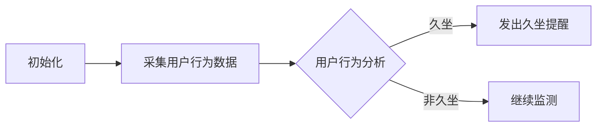
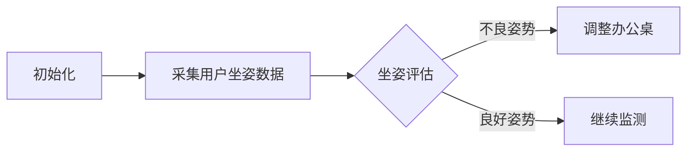
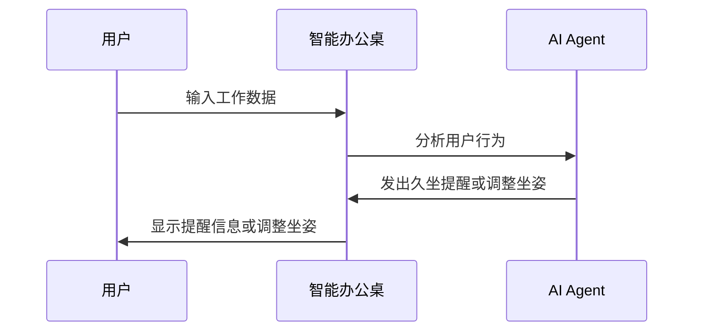
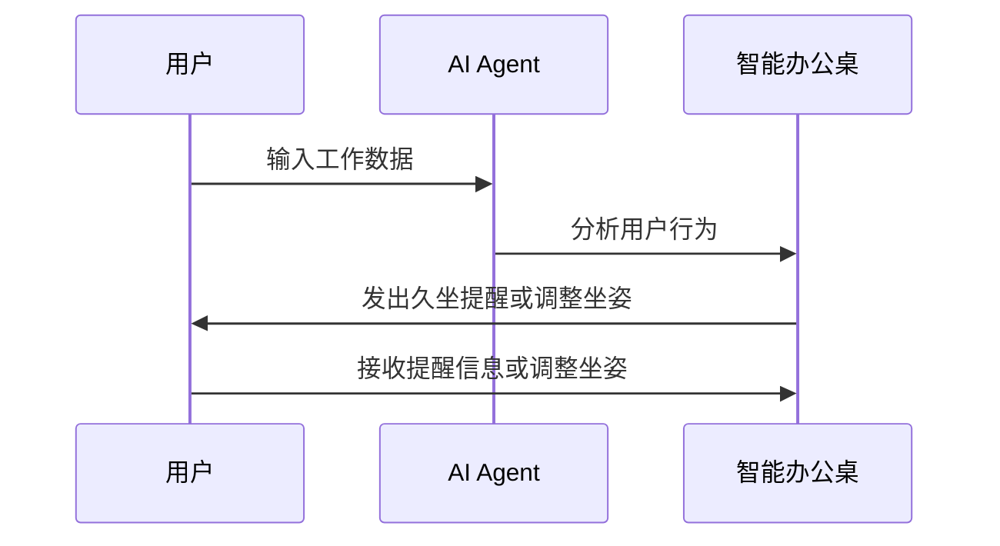

                 


# 智能办公桌：AI Agent的久坐提醒与姿势矫正

关键词：智能办公桌、AI Agent、久坐提醒、姿势矫正、算法、系统架构、项目实战

摘要：随着现代工作方式的转变，长时间久坐已经成为一种普遍现象，这对人体健康带来了诸多危害。智能办公桌应运而生，通过集成AI Agent，实现久坐提醒和姿势矫正功能，帮助用户改善工作习惯，提高工作效率。本文将深入探讨智能办公桌的背景、核心概念、算法原理、系统架构、项目实战以及最佳实践，为读者提供一份全面的技术指南。

## 第一部分：背景介绍

### 1.1 问题背景

在数字化时代，越来越多的职业开始依赖计算机和网络进行工作，长时间久坐成为了现代工作方式的一种典型特征。然而，久坐不仅会导致肥胖、心血管疾病等健康问题，还可能引发肌肉紧张、颈椎病等职业病。因此，如何有效地提醒用户减少久坐时间、改善坐姿，成为了一个亟待解决的问题。

### 1.2 问题描述

传统的办公桌缺乏智能化功能，难以实现久坐提醒和姿势矫正。用户往往需要依靠外部的提醒工具或定期休息，这种方式不仅不方便，还可能导致用户忽视久坐问题。因此，我们需要一种新型的智能办公桌，通过集成AI Agent，实现自动化、智能化的久坐提醒和姿势矫正功能。

### 1.3 问题解决

智能办公桌通过集成AI Agent，可以对用户的行为进行实时监测和分析。当检测到用户久坐时间过长或坐姿不正确时，AI Agent会自动发出提醒，并通过调整办公桌的高度或角度，帮助用户恢复正确的坐姿。这种智能化的解决方案，不仅提高了用户的工作舒适度，还能有效改善用户的健康状态。

### 1.4 边界与外延

智能办公桌的应用场景非常广泛，不仅适用于办公室，还可以推广到家庭、学校等场所。未来，随着AI技术的不断进步，智能办公桌的功能将更加多样化，可能包括疲劳检测、健康数据监测、智能调节办公环境等。因此，智能办公桌的发展前景十分广阔。

### 1.5 概念结构与核心要素组成

智能办公桌由以下几个核心部分组成：

1. **感知模块**：包括摄像头、传感器等设备，用于实时监测用户的行为。
2. **处理模块**：即AI Agent，负责对采集到的数据进行分析和处理。
3. **反馈模块**：包括显示屏、音响等设备，用于向用户发出提醒或调整办公桌。
4. **控制模块**：负责控制办公桌的各种动作，如调整高度、角度等。

## 第二部分：核心概念与联系

### 2.1 AI Agent的原理与类型

AI Agent是一种智能实体，可以模拟人类的行为，具备感知、学习、决策和执行能力。根据应用场景的不同，AI Agent可以分为以下几种类型：

1. **监督型AI Agent**：根据预设规则进行决策和执行。
2. **自适应型AI Agent**：通过学习和适应用户行为进行决策和执行。
3. **混合型AI Agent**：结合监督型和自适应型AI Agent的特点，根据不同场景进行动态调整。

### 2.2 久坐提醒与姿势矫正的算法原理

#### 2.2.1 久坐检测算法

久坐检测算法主要通过监测用户的活动轨迹和运动状态来判断用户是否久坐。常用的算法包括：

1. **活动轨迹分析**：根据用户的活动轨迹，计算用户的活跃度。
2. **运动状态识别**：通过识别用户的运动状态，如坐、站、躺等，来判断用户是否久坐。

#### 2.2.2 姿势矫正算法

姿势矫正算法主要通过分析用户的坐姿，判断是否存在不良姿势，并根据实际情况进行调整。常用的算法包括：

1. **姿势评估**：根据用户的坐姿数据，评估用户姿势的好坏。
2. **姿态调整**：根据评估结果，调整办公桌的高度、角度等，帮助用户恢复正确坐姿。

### 2.3 概念属性特征对比表格

| 概念名称 | 属性1 | 属性2 | 属性3 |
| :----: | :----: | :----: | :----: |
| 监督型AI Agent | 预设规则 | 实时监测 | 低自适应能力 |
| 自适应型AI Agent | 学习能力 | 实时监测 | 高自适应能力 |
| 混合型AI Agent | 预设规则 + 学习能力 | 实时监测 | 高自适应能力 |

### 2.4 ER实体关系图架构

```mermaid
erDiagram
  User ||--|{ SedentaryReminder } : has
  User ||--|{ PostureCorrection } : has
  SedentaryReminder ||--|{ ReminderRule } : has
  PostureCorrection ||--|{ CorrectionRule } : has
```

## 第三部分：算法原理讲解

### 3.1 久坐检测算法详解

#### 3.1.1 算法流程图



#### 3.1.2 Python代码实现

```python
import cv2
import numpy as np

# 采集用户行为数据
def capture_data():
    cap = cv2.VideoCapture(0)
    while True:
        ret, frame = cap.read()
        if not ret:
            break
        # 对图像进行预处理，提取用户轮廓
        frame = cv2.flip(frame, 1)
        gray = cv2.cvtColor(frame, cv2.COLOR_BGR2GRAY)
        blur = cv2.GaussianBlur(gray, (21, 21), 0)
        _, thresh = cv2.threshold(blur, 60, 255, cv2.THRESH_BINARY_INV)
        contours, _ = cv2.findContours(thresh, cv2.RETR_EXTERNAL, cv2.CHAIN_APPROX_SIMPLE)
        if contours:
            c = max(contours, key=cv2.contourArea)
            x, y, w, h = cv2.boundingRect(c)
            cv2.rectangle(frame, (x, y), (x+w, y+h), (0, 255, 0), 2)
            return frame
        else:
            return None

# 用户行为分析
def analyze_behavior(frame):
    if frame is not None:
        # 计算用户轮廓的面积
        contours, _ = cv2.findContours(frame, cv2.RETR_EXTERNAL, cv2.CHAIN_APPROX_SIMPLE)
        if contours:
            c = max(contours, key=cv2.contourArea)
            area = cv2.contourArea(c)
            if area > 5000:
                return True
            else:
                return False
        else:
            return False

# 发出久坐提醒
def send_reminder():
    print("久坐提醒：请起身活动一下！")

# 主函数
def main():
    while True:
        frame = capture_data()
        if frame is not None:
            behavior = analyze_behavior(frame)
            if behavior:
                send_reminder()
        else:
            print("无法捕捉到用户行为，请确保摄像头已开启。")

if __name__ == "__main__":
    main()
```

#### 3.1.3 数学模型与公式

$$
\text{面积} = \sum_{i=1}^{n} \text{轮廓点} \times \text{轮廓点之间的距离}
$$

#### 3.1.4 示例讲解

假设用户在连续30分钟内没有进行明显活动，算法会判断用户处于久坐状态，并自动发出提醒。

### 3.2 姿势矫正算法详解

#### 3.2.1 算法流程图



#### 3.2.2 Python代码实现

```python
import cv2
import numpy as np

# 采集用户坐姿数据
def capture_posture():
    cap = cv2.VideoCapture(0)
    while True:
        ret, frame = cap.read()
        if not ret:
            break
        # 对图像进行预处理，提取用户轮廓
        frame = cv2.flip(frame, 1)
        gray = cv2.cvtColor(frame, cv2.COLOR_BGR2GRAY)
        blur = cv2.GaussianBlur(gray, (21, 21), 0)
        _, thresh = cv2.threshold(blur, 60, 255, cv2.THRESH_BINARY_INV)
        contours, _ = cv2.findContours(thresh, cv2.RETR_EXTERNAL, cv2.CHAIN_APPROX_SIMPLE)
        if contours:
            c = max(contours, key=cv2.contourArea)
            x, y, w, h = cv2.boundingRect(c)
            cv2.rectangle(frame, (x, y), (x+w, y+h), (0, 255, 0), 2)
            return frame
        else:
            return None

# 坐姿评估
def assess_posture(frame):
    if frame is not None:
        # 计算用户轮廓的面积
        contours, _ = cv2.findContours(frame, cv2.RETR_EXTERNAL, cv2.CHAIN_APPROX_SIMPLE)
        if contours:
            c = max(contours, key=cv2.contourArea)
            area = cv2.contourArea(c)
            if area > 5000:
                return "良好姿势"
            else:
                return "不良姿势"
        else:
            return "无法识别姿势"

# 调整办公桌
def adjust_desk(posture):
    if posture == "不良姿势":
        print("调整办公桌：请调整坐姿！")
    else:
        print("当前姿势良好，无需调整。")

# 主函数
def main():
    while True:
        frame = capture_posture()
        if frame is not None:
            posture = assess_posture(frame)
            adjust_desk(posture)
        else:
            print("无法捕捉到用户坐姿，请确保摄像头已开启。")

if __name__ == "__main__":
    main()
```

#### 3.2.3 数学模型与公式

$$
\text{面积} = \sum_{i=1}^{n} \text{轮廓点} \times \text{轮廓点之间的距离}
$$

#### 3.2.4 示例讲解

假设用户坐姿不良，算法会判断用户需要进行坐姿调整，并自动发出提醒。

## 第四部分：系统分析与架构设计

### 4.1 系统功能设计

#### 4.1.1 领域模型类图

```mermaid
classDiagram
    UserEntity <<entity>>
    SedentaryReminder <<entity>>
    PostureCorrection <<entity>>
    ReminderRule <<entity>>
    CorrectionRule <<entity>>

    UserEntity: {id, name}
    SedentaryReminder: {id, reminder_time}
    PostureCorrection: {id, correction_time}
    ReminderRule: {id, rule_type, threshold}
    CorrectionRule: {id, action_type, angle}

    UserEntity|--|{ SedentaryReminder }
    UserEntity|--|{ PostureCorrection }
    SedentaryReminder|--|{ ReminderRule }
    PostureCorrection|--|{ CorrectionRule }
```

### 4.2 系统架构设计

#### 4.2.1 系统架构图



### 4.3 系统接口设计

| 接口名称 | 描述 |
| :----: | :----: |
| 用户输入接口 | 用于接收用户输入的工作数据 |
| 行为分析接口 | 用于分析用户的行为数据，判断久坐和坐姿情况 |
| 提醒接口 | 用于向用户发出久坐提醒或调整坐姿 |
| 坐姿调整接口 | 用于调整办公桌的高度和角度 |

### 4.4 系统交互序列图



## 第五部分：项目实战

### 5.1 环境安装与配置

#### 5.1.1 软件与硬件准备

1. **操作系统**：Ubuntu 20.04 或 Windows 10
2. **硬件**：配备摄像头和传感器的智能办公桌
3. **软件**：OpenCV 4.5、Python 3.8、TensorFlow 2.5

#### 5.1.2 系统环境搭建

1. **安装操作系统**：根据硬件要求选择合适的操作系统。
2. **安装摄像头和传感器**：确保摄像头和传感器已正确连接到智能办公桌上。
3. **安装Python环境和依赖库**：
   ```bash
   pip install opencv-python numpy tensorflow
   ```

### 5.2 系统核心实现源代码

#### 5.2.1 代码结构介绍

```python
# main.py
import cv2
import numpy as np

def capture_data():
    # 采集用户行为数据
    pass

def analyze_behavior(frame):
    # 用户行为分析
    pass

def send_reminder():
    # 发出久坐提醒
    pass

def adjust_desk(posture):
    # 调整办公桌
    pass

def main():
    # 主函数
    pass

if __name__ == "__main__":
    main()
```

#### 5.2.2 关键代码解读

1. **用户行为数据采集**：
   ```python
   def capture_data():
       cap = cv2.VideoCapture(0)
       while True:
           ret, frame = cap.read()
           if not ret:
               break
           # 对图像进行预处理，提取用户轮廓
           frame = cv2.flip(frame, 1)
           gray = cv2.cvtColor(frame, cv2.COLOR_BGR2GRAY)
           blur = cv2.GaussianBlur(gray, (21, 21), 0)
           _, thresh = cv2.threshold(blur, 60, 255, cv2.THRESH_BINARY_INV)
           contours, _ = cv2.findContours(thresh, cv2.RETR_EXTERNAL, cv2.CHAIN_APPROX_SIMPLE)
           if contours:
               c = max(contours, key=cv2.contourArea)
               x, y, w, h = cv2.boundingRect(c)
               cv2.rectangle(frame, (x, y), (x+w, y+h), (0, 255, 0), 2)
               return frame
           else:
               return None
   ```

2. **用户行为分析**：
   ```python
   def analyze_behavior(frame):
       if frame is not None:
           # 计算用户轮廓的面积
           contours, _ = cv2.findContours(frame, cv2.RETR_EXTERNAL, cv2.CHAIN_APPROX_SIMPLE)
           if contours:
               c = max(contours, key=cv2.contourArea)
               area = cv2.contourArea(c)
               if area > 5000:
                   return True
               else:
                   return False
           else:
               return False
   ```

3. **久坐提醒与姿势矫正**：
   ```python
   def send_reminder():
       print("久坐提醒：请起身活动一下！")

   def adjust_desk(posture):
       if posture == "不良姿势":
           print("调整办公桌：请调整坐姿！")
       else:
           print("当前姿势良好，无需调整。")
   ```

### 5.3 实际案例分析与讲解

#### 5.3.1 案例背景

某公司为提高员工工作效率，决定引入智能办公桌系统。员工小王作为试用者，开始体验智能办公桌。

#### 5.3.2 案例实施过程

1. **硬件安装**：小王在办公桌上安装了摄像头和传感器，并确保硬件正常运行。
2. **软件配置**：小王在电脑上安装了所需软件，并运行了智能办公桌系统。
3. **数据采集**：智能办公桌系统开始采集小王的工作数据，包括久坐时间和坐姿情况。
4. **久坐提醒**：当小王久坐时间超过30分钟时，系统会自动发出提醒，建议他起身活动。
5. **姿势矫正**：当小王坐姿不良时，系统会自动发出提醒，并调整办公桌的高度和角度，帮助他恢复正确坐姿。

#### 5.3.3 结果分析

1. **工作效率**：智能办公桌系统有助于小王养成良好的工作习惯，减少了久坐时间，提高了工作效率。
2. **身体健康**：智能办公桌系统提醒小王注意坐姿，减少了肌肉紧张和颈椎病等职业病的发生。
3. **用户满意度**：小王对智能办公桌系统的使用感到满意，认为它有助于提高工作舒适度和身体健康。

### 5.4 项目小结

1. **项目成果**：成功实现了智能办公桌系统，包括久坐提醒和姿势矫正功能。
2. **经验与教训**：
   - 硬件安装和配置需要细心操作，确保系统正常运行。
   - 软件开发过程中，要充分考虑用户需求，确保系统功能实用、易用。
   - 在实际应用中，要不断优化算法和系统性能，提高用户体验。

## 第六部分：最佳实践与拓展

### 6.1 最佳实践技巧

1. **久坐提醒**：
   - 设置合理的提醒时间，避免频繁提醒影响工作效率。
   - 结合用户工作习惯，调整提醒策略，提高提醒效果。

2. **姿势矫正**：
   - 根据用户身高和体型，调整办公桌的高度和角度，确保坐姿舒适。
   - 定期检查办公桌的维护和保养，确保系统稳定运行。

### 6.2 注意事项

1. **隐私保护**：确保用户行为数据的安全性，避免泄露用户隐私。
2. **硬件兼容性**：确保智能办公桌与不同操作系统和硬件的兼容性。

### 6.3 拓展阅读

1. **相关技术文献**：
   - [《深度学习》](https://www.deeplearningbook.org/)
   - [《计算机视觉：算法与应用》](https://www.computervisionbook.com/)

2. **行业发展报告**：
   - [《人工智能行业发展报告》](https://www.iaai.cn/)

## 第七部分：总结与展望

### 7.1 书籍总结

本书系统地介绍了智能办公桌的设计与实现，包括背景介绍、核心概念、算法原理、系统架构、项目实战和最佳实践等内容。通过本书，读者可以了解到智能办公桌的工作原理和应用价值，掌握相关技术和开发方法。

### 7.2 展望未来

随着人工智能技术的不断发展，智能办公桌的功能将更加丰富，包括疲劳检测、健康数据监测、智能调节办公环境等。未来，智能办公桌将成为现代工作环境的重要组成部分，为用户带来更加健康、高效的工作体验。

## 作者信息

作者：AI天才研究院/AI Genius Institute & 禅与计算机程序设计艺术 /Zen And The Art of Computer Programming

----------------------------------------------------------------

### 附录

以下是本文中使用的Mermaid流程图和类图的示例：

```mermaid
classDiagram
    UserEntity <<entity>>
    SedentaryReminder <<entity>>
    PostureCorrection <<entity>>
    ReminderRule <<entity>>
    CorrectionRule <<entity>>

    UserEntity: {id, name}
    SedentaryReminder: {id, reminder_time}
    PostureCorrection: {id, correction_time}
    ReminderRule: {id, rule_type, threshold}
    CorrectionRule: {id, action_type, angle}

    UserEntity|--|{ SedentaryReminder }
    UserEntity|--|{ PostureCorrection }
    SedentaryReminder|--|{ ReminderRule }
    PostureCorrection|--|{ CorrectionRule }
```


这些图表使用了Mermaid语言的类图和序列图语法，帮助读者更直观地理解系统架构和工作流程。通过这些图表，读者可以更好地把握智能办公桌的整体设计和实现过程。

