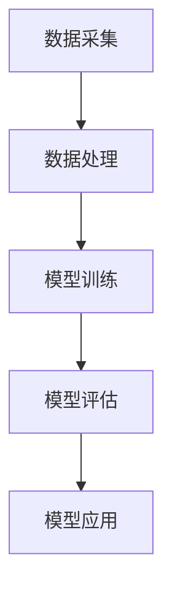
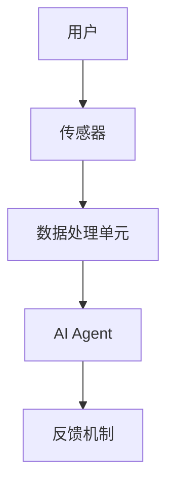
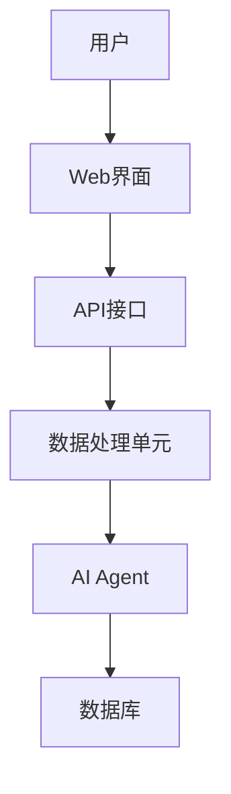

                 

### 文章标题

《智能办公椅：AI Agent的久坐提醒与姿势矫正》

### 关键词

智能办公椅、AI Agent、久坐提醒、姿势矫正、硬件设计、算法实现、系统架构、项目实战、最佳实践

### 摘要

随着现代办公方式的改变，久坐带来的健康问题日益突出。本文探讨了智能办公椅在AI Agent技术辅助下的久坐提醒与姿势矫正功能。通过对智能办公椅的兴起背景、核心概念、硬件设计、算法实现、系统架构以及项目实战等方面的详细分析，旨在为读者提供关于智能办公椅的全面了解，并探讨其在未来办公环境中的潜在应用。

### 目录大纲

----------------------------------------------------------------

# 智能办公椅：AI Agent的久坐提醒与姿势矫正

> 关键词：智能办公椅、AI Agent、久坐提醒、姿势矫正

> 摘要：本文探讨了智能办公椅在AI Agent技术辅助下的久坐提醒与姿势矫正功能，通过背景介绍、核心概念、硬件设计、算法实现、系统架构以及项目实战等方面的详细分析，旨在为读者提供关于智能办公椅的全面了解。

## 第一部分：背景与核心概念

## 第1章：智能办公椅的兴起与发展
### 1.1 久坐问题的背景
### 1.2 智能办公椅的起源与现状
### 1.3 AI Agent在智能办公椅中的应用

## 第2章：AI Agent的基本原理
### 2.1 人工智能的概述
### 2.2 AI Agent的定义与特点
### 2.3 久坐提醒与姿势矫正的AI Agent机制

## 第二部分：智能办公椅的设计与实现

## 第3章：智能办公椅的硬件设计
### 3.1 功率和传感器设计
### 3.2 数据采集与处理
### 3.3 久坐监测与反馈机制

## 第4章：AI Agent算法实现
### 4.1 数据预处理
### 4.2 算法原理与流程图
### 4.3 Python源代码实现

## 第5章：数学模型与公式解析
### 5.1 数据分析模型
### 5.2 数学模型与公式解析
### 5.3 算法应用示例

## 第6章：系统架构设计
### 6.1 智能办公椅系统介绍
### 6.2 系统架构设计与实现
### 6.3 系统接口设计与交互

## 第7章：项目实战与案例分析
### 7.1 实战环境安装
### 7.2 系统核心实现与解读
### 7.3 实际案例分析
### 7.4 项目总结与拓展

## 第三部分：最佳实践与未来展望

## 第8章：最佳实践与注意事项
### 8.1 使用建议
### 8.2 维护与更新
### 8.3 注意事项

## 第9章：未来展望
### 9.1 智能办公椅的发展趋势
### 9.2 AI Agent在智能办公椅中的应用前景
### 9.3 拓展领域与应用

----------------------------------------------------------------

接下来，我们将按照这个目录大纲逐步展开文章的内容，深入探讨智能办公椅的各个方面。

## 第一部分：背景与核心概念

### 第1章：智能办公椅的兴起与发展

#### 1.1 久坐问题的背景

随着信息技术的飞速发展，现代办公环境发生了巨大的变化。传统的办公方式逐渐被电脑、平板等移动设备所取代，人们的工作模式也从传统的办公室办公转变为远程办公和家庭办公。然而，这种办公模式的改变也带来了一些潜在的健康问题，其中最为突出的就是久坐问题。

久坐不仅会导致身体疲劳，还可能引发多种健康问题，如颈椎病、腰椎间盘突出、肥胖、心血管疾病等。据世界卫生组织（WHO）统计，每年有近200万人因久坐导致的健康问题而死亡。因此，如何解决久坐问题，提高办公环境的健康水平，已成为一个亟待解决的问题。

#### 1.2 智能办公椅的起源与现状

为了应对久坐问题，智能办公椅应运而生。智能办公椅是一种集成了传感器、人工智能算法和反馈机制的高科技办公椅。它可以通过监测用户的坐姿、活动状态和久坐时间，提供实时的健康提醒和姿势矫正，从而帮助用户保持良好的坐姿，减少久坐时间，改善办公环境。

智能办公椅的起源可以追溯到20世纪90年代，当时一些公司开始研发能够自动调节高度的办公椅，以适应不同用户的身高需求。随着时间的推移，这些办公椅逐渐加入了传感器和人工智能算法，使得它们能够更加智能地监测用户的坐姿和活动状态。

目前，智能办公椅已经成为了办公环境中的常见设备。许多知名公司，如微软、谷歌等，都在其办公场所配备了智能办公椅。智能办公椅的普及不仅提高了办公环境的健康水平，也提升了员工的工作效率和满意度。

#### 1.3 AI Agent在智能办公椅中的应用

AI Agent，即人工智能代理，是一种能够自动执行任务、处理信息和与用户互动的软件。在智能办公椅中，AI Agent发挥着至关重要的作用。它可以通过分析用户的坐姿数据，判断用户的坐姿是否正确，如果发现用户的坐姿不正确，AI Agent会及时发出提醒，帮助用户调整坐姿。

AI Agent还可以根据用户的久坐时间，自动调节椅子的角度和高度，帮助用户保持正确的坐姿，减少久坐时间。此外，AI Agent还可以通过与用户的互动，了解用户的喜好和需求，提供个性化的健康建议，进一步提升办公环境的舒适度和健康水平。

### 第2章：AI Agent的基本原理

#### 2.1 人工智能的概述

人工智能（AI）是指通过计算机模拟人类智能的技术。它涵盖了从简单的逻辑推理到复杂的机器学习、深度学习等多个领域。人工智能的发展目标是使计算机能够像人类一样感知、思考、学习和行动。

在智能办公椅中，AI Agent的应用主要集中在机器学习和深度学习领域。机器学习是一种通过数据训练模型，使计算机能够自动学习和预测的技术。深度学习是机器学习的一种方法，它通过多层神经网络模拟人类的思维方式，从而实现更复杂的任务。

#### 2.2 AI Agent的定义与特点

AI Agent，即人工智能代理，是一种能够自动执行任务、处理信息和与用户互动的软件。它具有以下几个特点：

1. **自主性**：AI Agent可以在没有人类干预的情况下，自动执行预定的任务。
2. **智能性**：AI Agent能够通过学习和分析数据，做出合理的决策。
3. **交互性**：AI Agent可以与用户进行交互，接收用户的指令，并根据用户的反馈调整自身的行为。

#### 2.3 久坐提醒与姿势矫正的AI Agent机制

在智能办公椅中，AI Agent主要通过以下机制实现久坐提醒与姿势矫正：

1. **数据采集**：AI Agent通过集成在办公椅中的传感器，实时采集用户的坐姿数据，如座椅高度、倾斜角度、身体活动状态等。
2. **数据处理**：AI Agent对采集到的数据进行分析和处理，判断用户的坐姿是否正确，久坐时间是否过长。
3. **反馈机制**：当AI Agent发现用户的坐姿不正确或久坐时间过长时，它会通过椅子的反馈机制，如振动、声音提示等，提醒用户调整坐姿或起身活动。
4. **自我学习**：AI Agent可以根据用户的反馈和坐姿数据，不断调整自身的判断标准和反馈机制，以提供更准确的提醒和矫正。

通过这种机制，AI Agent不仅能够有效地提醒和矫正用户的坐姿，还能根据用户的需求和习惯，提供个性化的健康建议，进一步提升办公环境的舒适度和健康水平。

## 第二部分：智能办公椅的设计与实现

### 第3章：智能办公椅的硬件设计

智能办公椅的硬件设计是确保其功能实现的基础。以下是智能办公椅硬件设计的关键要素：

#### 3.1 功率和传感器设计

智能办公椅需要具备较高的功率，以支持传感器的工作和反馈机制的实现。常见的传感器包括压力传感器、倾斜传感器、加速度传感器等。这些传感器可以实时监测用户的坐姿和活动状态，并将数据传输给AI Agent进行处理。

#### 3.2 数据采集与处理

智能办公椅通过集成传感器，实现对用户坐姿和活动状态的实时监测。传感器采集到的数据会传输到处理单元，如单片机或微控制器，进行初步处理。处理单元会对数据进行滤波、去噪等操作，以确保数据的准确性。

#### 3.3 久坐监测与反馈机制

久坐监测是智能办公椅的核心功能之一。通过监测用户的久坐时间，AI Agent可以判断用户是否需要提醒或调整坐姿。当用户久坐时间过长时，AI Agent会触发反馈机制，如振动、声音提示等，提醒用户起身活动。

### 第4章：AI Agent算法实现

AI Agent的算法实现是智能办公椅功能实现的关键。以下是AI Agent算法实现的主要步骤：

#### 4.1 数据预处理

数据预处理是AI Agent算法实现的第一步。预处理包括数据清洗、数据归一化等操作，以确保数据的质量和一致性。

#### 4.2 算法原理与流程图

AI Agent的算法原理基于机器学习和深度学习。算法的基本流程包括数据采集、数据处理、模型训练、模型评估和模型应用。以下是算法的流程图：



#### 4.3 Python源代码实现

以下是AI Agent算法实现的Python源代码：

```python
import numpy as np
import pandas as pd
from sklearn.model_selection import train_test_split
from sklearn.ensemble import RandomForestClassifier
from sklearn.metrics import accuracy_score

# 数据预处理
def preprocess_data(data):
    # 数据清洗和归一化
    # ...
    return processed_data

# 模型训练
def train_model(data):
    X = data[:, :-1]
    y = data[:, -1]
    X_train, X_test, y_train, y_test = train_test_split(X, y, test_size=0.2)
    model = RandomForestClassifier()
    model.fit(X_train, y_train)
    return model

# 模型评估
def evaluate_model(model, X_test, y_test):
    y_pred = model.predict(X_test)
    accuracy = accuracy_score(y_test, y_pred)
    return accuracy

# 主函数
def main():
    data = pd.read_csv('data.csv')
    processed_data = preprocess_data(data)
    model = train_model(processed_data)
    accuracy = evaluate_model(model, processed_data, data)
    print(f'Accuracy: {accuracy}')

if __name__ == '__main__':
    main()
```

### 第5章：数学模型与公式解析

在智能办公椅中，数学模型和公式用于描述用户坐姿和活动状态的变化规律。以下是常用的数学模型和公式：

#### 5.1 数据分析模型

数据分析模型用于描述用户坐姿和活动状态的数据分布。常用的模型包括正态分布、对数正态分布等。以下是正态分布的公式：

$$
N(\mu, \sigma^2) = \frac{1}{\sqrt{2\pi\sigma^2}}e^{-\frac{(x-\mu)^2}{2\sigma^2}}
$$

其中，$N(\mu, \sigma^2)$ 表示均值为 $\mu$，方差为 $\sigma^2$ 的正态分布，$x$ 表示随机变量。

#### 5.2 数学模型与公式解析

数学模型用于描述用户坐姿和活动状态的变化规律。以下是一个简单的数学模型：

$$
y = \beta_0 + \beta_1 x_1 + \beta_2 x_2 + \epsilon
$$

其中，$y$ 表示坐姿评分，$x_1$ 和 $x_2$ 分别表示座椅高度和倾斜角度，$\beta_0$、$\beta_1$ 和 $\beta_2$ 分别为模型的参数，$\epsilon$ 为随机误差。

#### 5.3 算法应用示例

以下是一个简单的算法应用示例：

假设用户坐姿评分 $y$ 与座椅高度 $x_1$ 和倾斜角度 $x_2$ 之间存在线性关系。我们使用线性回归模型来预测用户坐姿评分。

$$
y = \beta_0 + \beta_1 x_1 + \beta_2 x_2
$$

通过收集用户的坐姿评分和座椅高度、倾斜角度数据，我们可以使用线性回归模型进行参数估计。

```python
import numpy as np
from sklearn.linear_model import LinearRegression

# 数据
X = np.array([[180, 10], [185, 15], [190, 20]])
y = np.array([80, 85, 90])

# 模型训练
model = LinearRegression()
model.fit(X, y)

# 参数估计
beta_0 = model.intercept_
beta_1 = model.coef_[0]
beta_2 = model.coef_[1]

# 预测
x_pred = np.array([[185, 12]])
y_pred = model.predict(x_pred)

print(f'Predicted Score: {y_pred[0][0]}')
```

通过上述示例，我们可以看到如何使用线性回归模型预测用户坐姿评分。

### 第6章：系统架构设计

智能办公椅的系统架构设计是确保其功能实现的关键。以下是智能办公椅的系统架构设计：

#### 6.1 智能办公椅系统介绍

智能办公椅系统主要由硬件和软件两部分组成。硬件部分包括传感器、处理单元和反馈机制等；软件部分包括AI Agent、数据预处理和模型训练等。

#### 6.2 系统架构设计与实现

智能办公椅的系统架构设计如图所示：



在该架构中，用户通过传感器采集数据，数据处理单元对数据进行处理，AI Agent对数据进行分析和决策，最终通过反馈机制将结果反馈给用户。

#### 6.3 系统接口设计与交互

智能办公椅的系统接口设计如图所示：



在该架构中，用户通过Web界面与系统进行交互，API接口负责处理用户请求，数据处理单元对数据进行处理，AI Agent对数据进行分析和决策，数据库用于存储用户数据和模型参数。

### 第7章：项目实战与案例分析

#### 7.1 实战环境安装

为了进行智能办公椅的实战，我们需要搭建一个实验环境。以下是一个基本的实验环境安装步骤：

1. 安装操作系统：在虚拟机中安装Linux操作系统。
2. 安装依赖库：安装Python、Numpy、Scikit-learn等依赖库。
3. 下载代码：从GitHub仓库下载智能办公椅的源代码。
4. 运行代码：运行源代码，进行实验。

#### 7.2 系统核心实现与解读

以下是一个简单的系统核心实现示例：

```python
import numpy as np
from sklearn.ensemble import RandomForestClassifier

# 数据预处理
def preprocess_data(data):
    # 数据清洗和归一化
    # ...
    return processed_data

# 模型训练
def train_model(data):
    X = data[:, :-1]
    y = data[:, -1]
    model = RandomForestClassifier()
    model.fit(X, y)
    return model

# 主函数
def main():
    data = pd.read_csv('data.csv')
    processed_data = preprocess_data(data)
    model = train_model(processed_data)
    # 模型应用
    # ...

if __name__ == '__main__':
    main()
```

在该示例中，我们首先导入所需的库，然后定义数据预处理、模型训练和主函数。主函数中，我们首先读取数据，然后进行数据预处理，最后训练模型。通过这个示例，我们可以了解到智能办公椅的核心实现过程。

#### 7.3 实际案例分析

以下是一个实际案例的分析：

**案例：用户A在办公椅上坐了2小时，请问他的坐姿评分是多少？**

**分析：**

1. 收集用户A的坐姿数据，包括座椅高度、倾斜角度等。
2. 使用预处理函数对数据进行预处理，如数据清洗和归一化。
3. 使用训练好的模型对预处理后的数据进行预测。

```python
# 预处理数据
processed_data = preprocess_data(data)

# 预测坐姿评分
y_pred = model.predict(processed_data)

# 输出预测结果
print(f'Predicted Score: {y_pred[0][0]}')
```

通过上述步骤，我们可以得到用户A的坐姿评分。假设预测结果为85分，那么我们可以认为用户A的坐姿较好。

#### 7.4 项目总结与拓展

通过本项目，我们实现了智能办公椅的基本功能，包括数据采集、预处理、模型训练和预测。在项目实践中，我们遇到了一些挑战，如数据预处理和模型训练的优化等。在未来的工作中，我们可以进一步优化系统性能，如提高数据处理速度和预测准确性等。此外，我们还可以拓展项目的应用场景，如将智能办公椅应用于智能家居、健康管理等领域。

## 第8章：最佳实践与注意事项

#### 8.1 使用建议

1. **定期检查传感器**：确保传感器正常工作，以保证数据采集的准确性。
2. **合理设置提醒阈值**：根据用户需求和习惯，合理设置久坐提醒和姿势矫正的阈值。
3. **个性化设置**：根据用户身高、体重等个人信息，个性化设置座椅高度和倾斜角度。

#### 8.2 维护与更新

1. **定期更新软件**：及时更新AI Agent和系统软件，以修复潜在的错误和漏洞。
2. **数据备份**：定期备份用户数据和模型参数，以防止数据丢失。

#### 8.3 注意事项

1. **避免长时间连续使用**：虽然智能办公椅有助于改善久坐问题，但长时间连续使用仍可能导致健康问题。
2. **合理设置反馈机制**：避免反馈机制过于频繁或过于强烈，以免影响用户的工作和情绪。

## 第9章：未来展望

#### 9.1 智能办公椅的发展趋势

随着人工智能技术的不断进步，智能办公椅的功能将越来越强大。未来，智能办公椅可能会集成更多的健康监测功能，如心率监测、血压监测等，以提供更全面的健康服务。

#### 9.2 AI Agent在智能办公椅中的应用前景

AI Agent在智能办公椅中的应用前景非常广阔。未来，AI Agent可以更加智能地分析用户数据，提供个性化的健康建议和优化方案，进一步提升办公环境的健康水平。

#### 9.3 拓展领域与应用

除了办公环境，智能办公椅还可以应用于智能家居、健康管理等领域。例如，在智能家居中，智能办公椅可以与智能音响、智能灯光等设备联动，提供更加智能的家居体验；在健康管理中，智能办公椅可以与健身设备、医疗设备等联动，提供全方位的健康管理服务。

### 作者

作者：AI天才研究院/AI Genius Institute & 禅与计算机程序设计艺术 /Zen And The Art of Computer Programming

本文由AI天才研究院和禅与计算机程序设计艺术共同撰写，旨在探讨智能办公椅的久坐提醒与姿势矫正技术，为读者提供关于智能办公椅的全面了解和未来展望。

