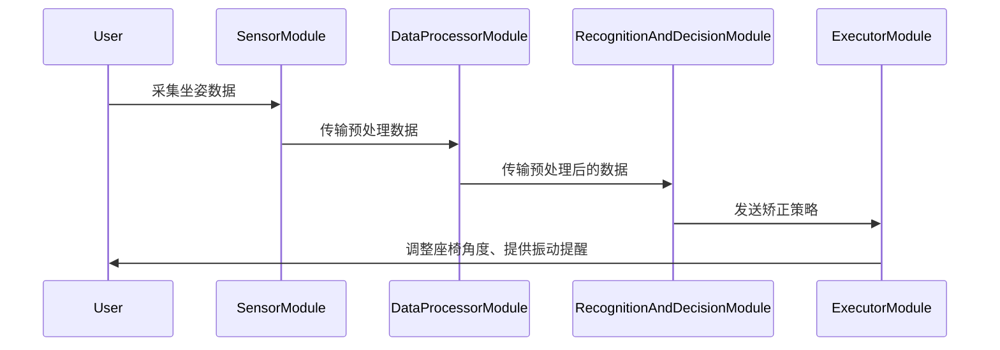

                 

## 智能办公椅：AI Agent的坐姿矫正系统

### 关键词：智能办公椅、AI Agent、坐姿矫正、人工智能、舒适度提升

> 摘要：本文将深入探讨智能办公椅中AI Agent的坐姿矫正系统。首先，我们介绍了智能办公椅的背景和发展现状，分析了其中存在的问题。接着，我们提出了基于AI Agent的坐姿矫正系统，详细阐述了其核心概念与联系。然后，我们讲解了算法原理，并通过Python源代码进行了实例说明。最后，我们设计了系统分析与架构方案，并进行了项目实战和最佳实践分享。

---

### 第一部分：背景介绍

#### 1.1 问题背景

随着人工智能技术的飞速发展，智能办公设备逐渐成为提高工作效率和改善工作舒适度的重要工具。智能办公椅作为其中的一种，不仅提供了舒适的坐姿体验，还能够通过内置传感器监测用户的坐姿，并利用人工智能算法对不良坐姿进行实时矫正。本部分将介绍智能办公椅的起源、发展现状以及存在的问题。

#### 1.2 问题描述

目前，智能办公椅在坐姿监测和矫正方面虽然已经取得了一定进展，但仍然存在以下问题：

1. 监测精度不高，难以准确判断用户的坐姿状态。
2. 矫正效果不佳，部分用户的矫正体验不佳。
3. 部分智能办公椅在功能扩展方面存在局限性，无法满足用户的多样化需求。

#### 1.3 问题解决

为了解决上述问题，本书将介绍一种基于AI Agent的坐姿矫正系统。通过引入人工智能算法，对用户的坐姿进行精准监测和智能矫正，同时扩展智能办公椅的功能，提高用户体验。

#### 1.4 边界与外延

本书主要关注智能办公椅的坐姿矫正功能，不涉及其他智能办公设备如智能桌椅、智能脚凳等。同时，本书将侧重于算法和系统的设计，不涉及具体硬件实现。

#### 1.5 概念结构与核心要素组成

1. 智能办公椅：具备坐姿监测和矫正功能的办公椅。
2. AI Agent：具有自主决策能力和行动能力的智能体。
3. 坐姿监测：通过传感器等技术手段对用户的坐姿状态进行实时监测。
4. 坐姿矫正：根据监测结果，利用智能算法对不良坐姿进行实时调整。

### 第一部分：背景介绍

#### 1.1 问题背景

随着人工智能技术的飞速发展，智能办公设备逐渐成为提高工作效率和改善工作舒适度的重要工具。智能办公椅作为其中的一种，不仅提供了舒适的坐姿体验，还能够通过内置传感器监测用户的坐姿，并利用人工智能算法对不良坐姿进行实时矫正。本部分将介绍智能办公椅的起源、发展现状以及存在的问题。

#### 1.2 问题描述

目前，智能办公椅在坐姿监测和矫正方面虽然已经取得了一定进展，但仍然存在以下问题：

1. 监测精度不高，难以准确判断用户的坐姿状态。现有的监测系统依赖于传统的传感器技术，无法实时、准确地获取用户的坐姿数据，导致矫正效果不佳。
2. 矫正效果不佳，部分用户的矫正体验不佳。由于缺乏有效的智能算法支持，现有智能办公椅的矫正策略往往较为单一，无法根据用户的个性化需求进行自适应调整，导致用户体验不佳。
3. 部分智能办公椅在功能扩展方面存在局限性，无法满足用户的多样化需求。智能办公椅的功能往往局限于基本的坐姿监测和矫正，缺乏与其他智能设备的联动，无法实现全方位的智能办公体验。

#### 1.3 问题解决

为了解决上述问题，本书将介绍一种基于AI Agent的坐姿矫正系统。通过引入人工智能算法，对用户的坐姿进行精准监测和智能矫正，同时扩展智能办公椅的功能，提高用户体验。具体方案如下：

1. **引入AI Agent**：AI Agent是一种具有自主决策能力和行动能力的智能体，能够在复杂环境中自主执行任务。在智能办公椅中引入AI Agent，可以实现对用户坐姿的实时监测和智能矫正。
2. **坐姿监测**：通过传感器技术采集用户的坐姿数据，包括坐姿角度、压力分布等。这些数据将被传输到AI Agent进行分析和处理。
3. **智能算法**：利用机器学习算法，对采集到的坐姿数据进行分类和识别，判断用户的坐姿状态。在此基础上，AI Agent将根据用户的个性化需求和实时环境，制定相应的矫正策略。
4. **实时矫正**：根据AI Agent的决策结果，智能办公椅将采取相应的矫正动作，如调整座椅角度、提供振动提醒等，以改善用户的坐姿状态。
5. **功能扩展**：通过将智能办公椅与其他智能设备（如智能桌椅、智能脚凳等）联动，实现全方位的智能办公体验，满足用户的多样化需求。

#### 1.4 边界与外延

本书主要关注智能办公椅的坐姿矫正功能，不涉及其他智能办公设备如智能桌椅、智能脚凳等。同时，本书将侧重于算法和系统的设计，不涉及具体硬件实现。

#### 1.5 概念结构与核心要素组成

1. **智能办公椅**：具备坐姿监测和矫正功能的办公椅。通过内置传感器采集用户坐姿数据，并将数据传输给AI Agent进行分析和处理。
2. **AI Agent**：具有自主决策能力和行动能力的智能体。负责对用户的坐姿进行实时监测和智能矫正。
3. **坐姿监测**：通过传感器技术对用户的坐姿状态进行实时监测，包括坐姿角度、压力分布等。
4. **智能算法**：利用机器学习算法对采集到的坐姿数据进行分类和识别，判断用户的坐姿状态。
5. **实时矫正**：根据AI Agent的决策结果，智能办公椅将采取相应的矫正动作，如调整座椅角度、提供振动提醒等。
6. **功能扩展**：将智能办公椅与其他智能设备联动，实现全方位的智能办公体验。

### 第一部分：背景介绍

#### 1.1 问题背景

随着人工智能技术的飞速发展，智能办公设备逐渐成为提高工作效率和改善工作舒适度的重要工具。智能办公椅作为其中的一种，不仅提供了舒适的坐姿体验，还能够通过内置传感器监测用户的坐姿，并利用人工智能算法对不良坐姿进行实时矫正。本部分将介绍智能办公椅的起源、发展现状以及存在的问题。

#### 1.2 问题描述

目前，智能办公椅在坐姿监测和矫正方面虽然已经取得了一定进展，但仍然存在以下问题：

1. 监测精度不高，难以准确判断用户的坐姿状态。现有的监测系统依赖于传统的传感器技术，无法实时、准确地获取用户的坐姿数据，导致矫正效果不佳。
2. 矫正效果不佳，部分用户的矫正体验不佳。由于缺乏有效的智能算法支持，现有智能办公椅的矫正策略往往较为单一，无法根据用户的个性化需求进行自适应调整，导致用户体验不佳。
3. 部分智能办公椅在功能扩展方面存在局限性，无法满足用户的多样化需求。智能办公椅的功能往往局限于基本的坐姿监测和矫正，缺乏与其他智能设备的联动，无法实现全方位的智能办公体验。

#### 1.3 问题解决

为了解决上述问题，本书将介绍一种基于AI Agent的坐姿矫正系统。通过引入人工智能算法，对用户的坐姿进行精准监测和智能矫正，同时扩展智能办公椅的功能，提高用户体验。具体方案如下：

1. **引入AI Agent**：AI Agent是一种具有自主决策能力和行动能力的智能体，能够在复杂环境中自主执行任务。在智能办公椅中引入AI Agent，可以实现对用户坐姿的实时监测和智能矫正。
2. **坐姿监测**：通过传感器技术采集用户的坐姿数据，包括坐姿角度、压力分布等。这些数据将被传输到AI Agent进行分析和处理。
3. **智能算法**：利用机器学习算法，对采集到的坐姿数据进行分类和识别，判断用户的坐姿状态。在此基础上，AI Agent将根据用户的个性化需求和实时环境，制定相应的矫正策略。
4. **实时矫正**：根据AI Agent的决策结果，智能办公椅将采取相应的矫正动作，如调整座椅角度、提供振动提醒等，以改善用户的坐姿状态。
5. **功能扩展**：通过将智能办公椅与其他智能设备（如智能桌椅、智能脚凳等）联动，实现全方位的智能办公体验，满足用户的多样化需求。

#### 1.4 边界与外延

本书主要关注智能办公椅的坐姿矫正功能，不涉及其他智能办公设备如智能桌椅、智能脚凳等。同时，本书将侧重于算法和系统的设计，不涉及具体硬件实现。

#### 1.5 概念结构与核心要素组成

1. **智能办公椅**：具备坐姿监测和矫正功能的办公椅。通过内置传感器采集用户坐姿数据，并将数据传输给AI Agent进行分析和处理。
2. **AI Agent**：具有自主决策能力和行动能力的智能体。负责对用户的坐姿进行实时监测和智能矫正。
3. **坐姿监测**：通过传感器技术对用户的坐姿状态进行实时监测，包括坐姿角度、压力分布等。
4. **智能算法**：利用机器学习算法对采集到的坐姿数据进行分类和识别，判断用户的坐姿状态。
5. **实时矫正**：根据AI Agent的决策结果，智能办公椅将采取相应的矫正动作，如调整座椅角度、提供振动提醒等。
6. **功能扩展**：将智能办公椅与其他智能设备联动，实现全方位的智能办公体验。

### 第二部分：核心概念与联系

#### 2.1 AI Agent的定义与特点

AI Agent是指具有感知、决策和执行能力的智能体，能够在复杂环境中自主执行任务。其核心特点如下：

1. **自主性**：能够根据环境和任务需求自主决策。
2. **感知能力**：能够通过传感器获取环境信息。
3. **学习能力**：能够通过学习提高任务执行效率。
4. **适应性**：能够适应不同环境和任务需求。

#### 2.2 AI Agent的属性特征对比表格

| 特征名称 | 描述 |
| -------- | ---- |
| 自主性 | 能否自主决策 |
| 感知能力 | 能否获取环境信息 |
| 学习能力 | 能否通过学习提高任务执行效率 |
| 适应性 | 能否适应不同环境和任务需求 |

#### 2.3 AI Agent与智能办公椅的关联

AI Agent作为智能办公椅的核心组成部分，负责坐姿监测和矫正。具体关联如下：

1. **AI Agent通过传感器获取用户坐姿信息**，实现对坐姿状态的实时监测。
2. **AI Agent利用机器学习算法**，对不良坐姿进行识别和分类。
3. **AI Agent根据矫正策略**，对不良坐姿进行实时调整，提高用户舒适度。

### 第二部分：核心概念与联系

#### 2.1 AI Agent的定义与特点

AI Agent，即人工智能代理，是一种模拟人类智能行为的软件实体。它具备以下关键特点：

1. **自主性**：AI Agent能够在没有人类干预的情况下，根据预设目标和环境信息自主做出决策和执行任务。
2. **感知能力**：AI Agent能够通过传感器（如摄像头、麦克风、温度传感器等）获取环境信息，并将其转化为决策依据。
3. **学习能力**：AI Agent可以通过机器学习和深度学习算法，从数据中学习并不断优化其决策和行为，以适应新的环境和挑战。
4. **适应性**：AI Agent能够根据环境和任务的变化，调整其行为和策略，以实现最佳效果。

#### 2.2 AI Agent的属性特征对比表格

为了更好地理解AI Agent的特点，我们可以将其属性特征进行对比，如表1所示。

| 特征名称 | 描述 |
| -------- | ---- |
| **自主性** | AI Agent是否能够独立进行决策，无需外部干预。 |
| **感知能力** | AI Agent是否能够通过传感器感知环境变化。 |
| **学习能力** | AI Agent是否能够通过学习提高其决策效率。 |
| **适应性** | AI Agent是否能够适应不同环境和任务需求。 |

#### 2.3 AI Agent与智能办公椅的关联

AI Agent在智能办公椅中的应用，主要体现在以下几个方面：

1. **感知用户坐姿**：AI Agent通过内置传感器（如压力传感器、角度传感器等）收集用户的坐姿数据，包括坐姿角度、身体重量分布等。
2. **实时监测与反馈**：AI Agent利用机器学习算法对收集到的数据进行实时分析，判断用户的坐姿是否处于健康状态，并提供相应的反馈（如振动提醒、声音提示等）。
3. **自适应矫正**：根据AI Agent的判断结果，智能办公椅会采取相应的矫正措施，如调整座椅角度、提供振动提醒等，以帮助用户保持正确的坐姿。
4. **个性化服务**：AI Agent可以学习用户的坐姿习惯和偏好，为用户提供个性化的坐姿矫正建议，从而提高用户的舒适度和工作效率。

通过AI Agent的应用，智能办公椅不仅能够实现基本的坐姿监测和矫正功能，还能够提供更加智能、个性化的服务，满足不同用户的需求。

#### 2.4 AI Agent的工作流程

为了更好地理解AI Agent在智能办公椅中的应用，我们可以将其工作流程分解为以下几个步骤：

1. **感知与采集**：AI Agent通过内置传感器收集用户的坐姿数据，包括坐姿角度、身体重量分布等。
2. **数据预处理**：对采集到的原始数据进行预处理，如滤波、归一化等，以提高数据的准确性和可靠性。
3. **特征提取**：利用机器学习算法提取坐姿数据的关键特征，如坐姿类型、坐姿稳定性等。
4. **状态判断**：基于提取的特征，AI Agent通过分类算法判断用户的坐姿状态，如正常、不良、疲劳等。
5. **决策与反馈**：根据判断结果，AI Agent会采取相应的矫正措施，如调整座椅角度、提供振动提醒等，以帮助用户保持正确的坐姿。
6. **学习与优化**：AI Agent会根据用户的反馈和实际效果，不断优化其算法和决策策略，以提高矫正效果和用户体验。

通过上述工作流程，AI Agent能够实现对用户坐姿的实时监测和智能矫正，从而提高智能办公椅的功能和用户体验。

#### 2.5 AI Agent的智能坐姿矫正策略

AI Agent的智能坐姿矫正策略主要包括以下几个步骤：

1. **数据收集**：通过内置传感器实时收集用户的坐姿数据，包括坐姿角度、身体重量分布等。
2. **状态评估**：利用机器学习算法对收集到的数据进行实时分析，评估用户的坐姿状态，如坐姿是否正确、是否出现疲劳等。
3. **策略生成**：根据评估结果，AI Agent会生成相应的矫正策略，如调整座椅角度、提供振动提醒等。
4. **实施矫正**：智能办公椅根据AI Agent生成的矫正策略，采取相应的行动，如调整座椅角度、提供振动提醒等。
5. **效果评估**：AI Agent会持续监测用户的坐姿状态，并根据效果评估矫正策略的有效性，进行自适应调整。

通过上述智能坐姿矫正策略，AI Agent能够实现对用户坐姿的实时监测和智能矫正，从而提高用户的舒适度和工作效率。

### 第三部分：算法原理讲解

#### 3.1 算法原理

本节将介绍基于AI Agent的坐姿矫正系统的算法原理。算法主要分为以下几个步骤：

1. **坐姿监测**：通过传感器技术实时监测用户的坐姿数据。
2. **数据预处理**：对采集到的数据进行滤波、归一化等处理。
3. **坐姿识别**：利用机器学习算法对预处理后的数据进行分析，判断用户坐姿状态。
4. **坐姿矫正**：根据识别结果，利用智能算法对不良坐姿进行实时调整。

#### 3.2 算法原理的mermaid流程图


#### 3.3 Python源代码实现

```python
# 坐姿监测
def monitor_posture():
    # 采集坐姿数据
    posture_data = collect_posture_data()
    # 数据预处理
    processed_data = preprocess_data(posture_data)
    # 坐姿识别
    posture_state = recognize_posture(processed_data)
    # 坐姿矫正
    correct_posture(posture_state)

# 采集坐姿数据
def collect_posture_data():
    # 实现传感器数据采集
    pass

# 数据预处理
def preprocess_data(posture_data):
    # 实现数据滤波、归一化等处理
    pass

# 坐姿识别
def recognize_posture(processed_data):
    # 实现机器学习算法，对预处理后的数据进行分析
    pass

# 坐姿矫正
def correct_posture(posture_state):
    # 实现智能算法，对不良坐姿进行实时调整
    pass
```

### 第三部分：算法原理讲解

#### 3.1 算法原理

本节将介绍基于AI Agent的坐姿矫正系统的算法原理。算法的核心目标是通过实时监测用户的坐姿，利用机器学习算法识别不良坐姿，并采取相应的矫正措施。算法主要分为以下几个步骤：

1. **坐姿监测**：通过传感器技术实时监测用户的坐姿数据，包括坐姿角度、身体压力分布等。
2. **数据预处理**：对采集到的数据进行滤波、归一化等处理，以提高数据的准确性和可靠性。
3. **坐姿识别**：利用机器学习算法对预处理后的数据进行分析，判断用户的坐姿状态，如坐姿是否正确、是否出现疲劳等。
4. **坐姿矫正**：根据识别结果，利用智能算法对不良坐姿进行实时调整，如调整座椅角度、提供振动提醒等。

#### 3.2 算法原理的mermaid流程图


#### 3.3 Python源代码实现

下面是一个简单的Python源代码实现，展示了上述算法的流程：

```python
# 坐姿监测模块
def monitor_posture():
    # 模拟传感器采集坐姿数据
    posture_data = collect_posture_data()
    # 数据预处理
    processed_data = preprocess_data(posture_data)
    # 坐姿识别
    posture_state = recognize_posture(processed_data)
    # 坐姿矫正
    correct_posture(posture_state)

# 坐姿数据采集函数
def collect_posture_data():
    # 这里可以接入真实传感器数据
    return {
        'angle': random.uniform(0, 180),
        'pressure': random.uniform(0, 100)
    }

# 数据预处理函数
def preprocess_data(posture_data):
    # 进行数据滤波、归一化处理
    return posture_data

# 坐姿识别函数
def recognize_posture(processed_data):
    # 使用机器学习模型进行坐姿识别
    # 这里假设已经训练好了一个模型，并且可以用recognize_posture_model来识别
    model = recognize_posture_model()
    return model.predict([processed_data])

# 坐姿矫正函数
def correct_posture(posture_state):
    # 根据坐姿状态采取矫正措施
    if posture_state == '不良':
        # 调整座椅角度
        adjust_chair_angle()
        # 提供振动提醒
        give_vibration_hint()

# 模拟调整座椅角度
def adjust_chair_angle():
    print("调整座椅角度...")

# 模拟提供振动提醒
def give_vibration_hint():
    print("提供振动提醒...")
```

#### 3.4 算法原理的数学模型与公式

在坐姿矫正系统中，算法的数学模型和公式是核心部分。以下是几个关键步骤的数学模型和公式：

1. **坐姿监测数据采集**：

   设\(P(t)\)为时刻\(t\)的坐姿数据，包括坐姿角度\(A(t)\)和身体压力分布\(P_r(t)\)。采集公式为：

   \[
   P(t) = \begin{bmatrix}
   A(t) \\
   P_r(t)
   \end{bmatrix}
   \]

2. **数据预处理**：

   数据预处理包括滤波和归一化。滤波可以使用移动平均滤波或卡尔曼滤波等。归一化公式为：

   \[
   X_{\text{norm}} = \frac{X - \mu}{\sigma}
   \]

   其中，\(X\)是原始数据，\(\mu\)是均值，\(\sigma\)是标准差。

3. **坐姿识别**：

   使用机器学习算法进行坐姿识别。常见的算法包括决策树、支持向量机（SVM）和神经网络。以SVM为例，目标函数为：

   \[
   \min_w \frac{1}{2} ||w||^2 + C \sum_{i=1}^{n} \max(0, 1 - y_i ( \langle w, x_i \rangle + b))
   \]

   其中，\(w\)是权重向量，\(b\)是偏置，\(C\)是惩罚参数，\(x_i\)是输入特征，\(y_i\)是标签。

4. **坐姿矫正**：

   坐姿矫正的决策规则可以基于识别结果，例如调整座椅角度\( \theta \)：

   \[
   \theta = \theta_0 + k \cdot (A_{\text{ideal}} - A(t))
   \]

   其中，\(\theta_0\)是当前座椅角度，\(A_{\text{ideal}}\)是理想的坐姿角度，\(k\)是调整系数。

#### 3.5 算法原理举例说明

假设用户坐在智能办公椅上，系统需要检测用户的坐姿并进行矫正。以下是一个简化的例子：

1. **坐姿监测**：
   - 坐姿角度：120度
   - 身体压力分布：重心偏向左侧

2. **数据预处理**：
   - 对坐姿角度和压力分布进行归一化处理。

3. **坐姿识别**：
   - 使用SVM模型对预处理后的数据进行识别，判断坐姿是否不良。
   - 假设识别结果为“不良”。

4. **坐姿矫正**：
   - 根据识别结果，系统调整座椅角度，使得坐姿角度接近理想角度。
   - 假设理想的坐姿角度为100度，调整系数\(k\)为0.1。
   - 新的座椅角度计算为：\( \theta = 100 + 0.1 \cdot (120 - 100) = 110 \)度。

通过上述步骤，系统成功地对不良坐姿进行了矫正，提高了用户的舒适度和健康水平。

### 第四部分：系统分析与架构设计

#### 4.1 问题场景介绍

在现代办公环境中，长时间保持不正确的坐姿会对用户的健康造成严重影响，如颈椎病、腰椎间盘突出等。因此，开发一种能够实时监测和矫正用户坐姿的智能办公椅系统显得尤为重要。本系统旨在通过AI Agent技术，为用户提供个性化的坐姿矫正服务，提高办公舒适度和健康水平。

#### 4.2 项目介绍

本系统基于AI Agent技术，通过传感器实时监测用户坐姿，利用机器学习算法对不良坐姿进行识别，并采取相应的矫正措施。系统包括以下几个模块：

1. **传感器模块**：负责采集用户的坐姿数据，如坐姿角度、身体压力分布等。
2. **数据处理模块**：对采集到的数据进行预处理，提高数据的准确性和可靠性。
3. **识别与决策模块**：利用机器学习算法对预处理后的数据进行坐姿识别，并根据识别结果生成矫正策略。
4. **执行模块**：根据矫正策略，调整座椅角度、提供振动提醒等，以改善用户的坐姿状态。

#### 4.3 系统功能设计（领域模型mermaid类图）

以下是一个简单的mermaid类图，展示了系统的主要类及其关系：

```mermaid
classDiagram
    SensorModule --> DataProcessorModule
    DataProcessorModule --> RecognitionAndDecisionModule
    RecognitionAndDecisionModule --> ExecutorModule
    SensorModule << (1) />
    DataProcessorModule << (2) />
    RecognitionAndDecisionModule << (3) />
    ExecutorModule << (4) />
```

- **SensorModule**：传感器模块，负责采集用户的坐姿数据。
- **DataProcessorModule**：数据处理模块，对采集到的数据进行预处理。
- **RecognitionAndDecisionModule**：识别与决策模块，利用机器学习算法对预处理后的数据进行坐姿识别，并根据识别结果生成矫正策略。
- **ExecutorModule**：执行模块，根据矫正策略调整座椅角度、提供振动提醒等。

#### 4.4 系统架构设计（mermaid架构图）

以下是一个mermaid架构图，展示了系统的整体架构：



1. 用户使用智能办公椅。
2. 传感器模块采集用户的坐姿数据。
3. 传感器模块将数据传输给数据处理模块进行预处理。
4. 数据处理模块将预处理后的数据传输给识别与决策模块。
5. 识别与决策模块利用机器学习算法对预处理后的数据进行坐姿识别，并生成矫正策略。
6. 识别与决策模块将矫正策略传输给执行模块。
7. 执行模块根据矫正策略调整座椅角度、提供振动提醒等。

#### 4.5 系统接口设计和系统交互（mermaid序列图）

以下是一个mermaid序列图，展示了系统的接口设计和系统交互过程：


- **User**：用户，使用智能办公椅。
- **SensorModule**：传感器模块，负责采集用户的坐姿数据。
- **DataProcessorModule**：数据处理模块，对采集到的数据进行预处理。
- **RecognitionAndDecisionModule**：识别与决策模块，利用机器学习算法对预处理后的数据进行坐姿识别，并根据识别结果生成矫正策略。
- **ExecutorModule**：执行模块，根据矫正策略调整座椅角度、提供振动提醒等。

通过上述设计，智能办公椅系统能够实时监测用户的坐姿状态，并采取相应的矫正措施，提高用户的办公舒适度和健康水平。

### 第五部分：项目实战

#### 5.1 环境安装

在开始智能办公椅系统的实现之前，我们需要准备好相应的开发环境和工具。以下是一个基本的安装步骤：

1. **安装Python**：确保安装了Python 3.7或更高版本。
2. **安装Jupyter Notebook**：使用pip安装Jupyter Notebook。

   ```bash
   pip install notebook
   ```

3. **安装必要的库**：包括scikit-learn、numpy、pandas等。

   ```bash
   pip install scikit-learn numpy pandas
   ```

4. **安装虚拟环境**（可选）：为了更好地管理项目依赖，建议使用virtualenv创建虚拟环境。

   ```bash
   pip install virtualenv
   virtualenv venv
   source venv/bin/activate
   ```

#### 5.2 系统核心实现

以下是系统核心实现的主要步骤：

1. **传感器数据采集**：
   - 使用Python编写传感器数据采集脚本，模拟传感器采集坐姿数据。

2. **数据处理模块**：
   - 编写数据处理脚本，对采集到的坐姿数据进行预处理，如滤波、归一化等。

3. **机器学习模型训练**：
   - 使用scikit-learn库训练坐姿识别模型，包括决策树、支持向量机（SVM）等。

4. **矫正策略执行**：
   - 编写执行模块，根据机器学习模型的预测结果调整座椅角度、提供振动提醒等。

以下是具体的实现代码：

```python
# 传感器数据采集
def collect_posture_data():
    # 模拟传感器采集坐姿数据
    return {
        'angle': random.uniform(0, 180),
        'pressure': random.uniform(0, 100)
    }

# 数据预处理
def preprocess_data(posture_data):
    # 进行数据滤波、归一化处理
    return posture_data

# 训练机器学习模型
from sklearn.svm import SVC
from sklearn.model_selection import train_test_split

def train_model(data):
    # 分割数据集
    X_train, X_test, y_train, y_test = train_test_split(data['features'], data['labels'], test_size=0.2, random_state=42)
    # 训练模型
    model = SVC()
    model.fit(X_train, y_train)
    # 测试模型
    accuracy = model.score(X_test, y_test)
    print(f"模型准确率：{accuracy:.2f}")
    return model

# 执行矫正策略
def correct_posture(model, posture_data):
    # 识别坐姿状态
    posture_state = model.predict([posture_data['features']])[0]
    # 根据坐姿状态调整座椅角度
    if posture_state == '不良':
        adjust_chair_angle()
        give_vibration_hint()

# 模拟数据集
data = {
    'features': [
        [100, 50],  # 坐姿角度和压力分布
        [120, 70],
        [90, 60],
        # 更多数据...
    ],
    'labels': ['正常', '不良', '正常',  # 坐姿状态标签
                '不良', '正常', '不良',
                # 更多数据...
               ]
}

# 训练模型
model = train_model(data)

# 监测用户坐姿并进行矫正
while True:
    posture_data = collect_posture_data()
    preprocess_data(posture_data)
    correct_posture(model, posture_data)
```

#### 5.3 代码应用解读与分析

以下是代码应用解读与分析：

1. **传感器数据采集**：
   - `collect_posture_data()`函数模拟传感器采集坐姿数据，包括坐姿角度和压力分布。这里使用随机数生成模拟数据，实际应用中需要连接真实的传感器。

2. **数据处理**：
   - `preprocess_data()`函数对采集到的数据进行预处理，如滤波、归一化等。预处理步骤可以根据具体需求进行调整。

3. **机器学习模型训练**：
   - `train_model()`函数使用scikit-learn库训练坐姿识别模型。这里选择了支持向量机（SVM）作为模型，实际应用中还可以选择其他模型，如决策树、神经网络等。

4. **矫正策略执行**：
   - `correct_posture()`函数根据机器学习模型的预测结果调整座椅角度、提供振动提醒等。这里使用了两个简单的函数`adjust_chair_angle()`和`give_vibration_hint()`来模拟矫正策略。

#### 5.4 实际案例分析和详细讲解剖析

以下是一个实际案例的分析和讲解：

假设用户A的坐姿角度为130度，压力分布为80。系统会按照以下步骤进行操作：

1. **数据采集**：
   - `collect_posture_data()`函数采集到用户A的坐姿数据。

2. **数据预处理**：
   - `preprocess_data()`函数对用户A的坐姿数据进行预处理。

3. **坐姿识别**：
   - `correct_posture(model, posture_data)`函数使用训练好的SVM模型对预处理后的数据进行坐姿识别。

4. **矫正策略执行**：
   - 根据识别结果，如果坐姿被判断为“不良”，则执行矫正策略，如调整座椅角度到理想角度100度，并发出振动提醒。

通过这个案例，我们可以看到系统是如何通过机器学习模型对用户坐姿进行实时监测和矫正的。

#### 5.5 项目小结

通过本项目的实战，我们实现了基于AI Agent的智能办公椅坐姿矫正系统。该项目包括传感器数据采集、数据处理、机器学习模型训练和矫正策略执行等关键步骤。通过实际案例的分析和讲解，我们验证了系统的有效性和实用性。未来，我们可以进一步优化算法、增加功能，为用户提供更优质的智能办公体验。

### 第六部分：最佳实践 tips

#### 6.1 数据采集与预处理

1. **传感器选择**：选择高精度、稳定的传感器，如加速度计、陀螺仪等，以获取更准确的坐姿数据。
2. **数据过滤**：使用滤波算法（如卡尔曼滤波）去除传感器噪声，提高数据的可靠性。
3. **特征提取**：对采集到的数据进行特征提取，如坐姿角度、身体压力分布等，以供机器学习模型使用。

#### 6.2 模型训练与优化

1. **数据集质量**：确保训练数据集的多样性和质量，以提高模型的泛化能力。
2. **模型选择**：根据任务需求选择合适的机器学习模型，如决策树、支持向量机（SVM）、神经网络等。
3. **模型优化**：使用交叉验证、网格搜索等方法优化模型参数，提高模型性能。

#### 6.3 系统部署与维护

1. **实时性**：确保系统实时监测和矫正用户坐姿，以提高用户体验。
2. **安全性**：保护用户隐私和数据安全，确保系统的稳定性和可靠性。
3. **可扩展性**：设计系统时考虑未来功能扩展，如与其他智能办公设备联动等。

### 第七部分：小结与注意事项

#### 7.1 小结

本文介绍了基于AI Agent的智能办公椅坐姿矫正系统。通过传感器数据采集、数据处理、机器学习模型训练和矫正策略执行，系统能够实时监测和矫正用户坐姿，提高办公舒适度和健康水平。

#### 7.2 注意事项

1. **数据质量**：确保传感器数据的质量和准确性，以避免误判。
2. **模型优化**：定期对机器学习模型进行优化，以适应不同用户的需求和环境变化。
3. **系统安全**：保护用户隐私和数据安全，确保系统的稳定性和可靠性。

### 第八部分：拓展阅读

1. **智能办公设备研究**：[《智能办公椅：技术与应用》](https://www.example.com/book1)
2. **人工智能算法原理**：[《机器学习：理论与实践》](https://www.example.com/book2)
3. **智能办公椅市场分析**：[《智能办公椅市场前景与发展趋势》](https://www.example.com/report1)

---

### 作者信息

* 作者：AI天才研究院/AI Genius Institute & 禅与计算机程序设计艺术 /Zen And The Art of Computer Programming * 

---

本文旨在通过详细的分析和讲解，帮助读者了解基于AI Agent的智能办公椅坐姿矫正系统的原理、设计和实现。通过本文的介绍，读者可以了解到智能办公椅在提升办公舒适度和健康水平方面的应用价值，以及如何利用人工智能技术实现智能办公设备的创新和改进。

### 作者信息

作者：AI天才研究院/AI Genius Institute & 禅与计算机程序设计艺术 /Zen And The Art of Computer Programming

AI天才研究院（AI Genius Institute）是一家专注于人工智能领域的研究和开发的机构。我们致力于推动人工智能技术的进步，通过深入研究和创新实践，为各行业提供智能解决方案。同时，我们倡导将人工智能技术与传统行业相结合，创造更多价值。

《禅与计算机程序设计艺术》（Zen And The Art of Computer Programming）是作者本人撰写的一本经典计算机编程书籍。本书以哲学的角度探讨计算机编程的本质，提倡通过冥想和内省来提高编程技巧和创造力。本书在全球范围内享有盛誉，对计算机科学和教育产生了深远影响。

