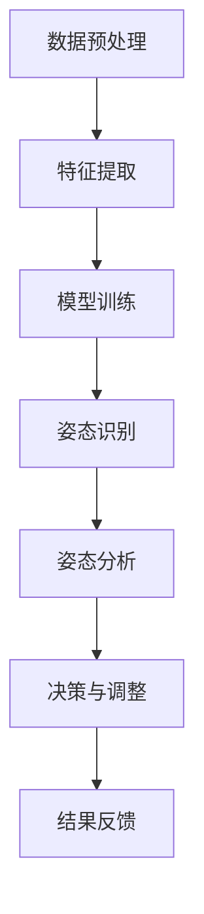

                 

## 引言

### 智能办公椅：AI Agent的姿势矫正提醒

在当今的快节奏工作和高度压力的环境中，办公室久坐成为现代职场人士的一种普遍现象。长时间保持不正确的坐姿不仅影响工作效率，还可能导致一系列健康问题，如颈椎病、腰椎间盘突出、肩颈疼痛等。因此，如何通过科技手段改善办公人员的坐姿，成为了一个迫切需要解决的问题。

智能办公椅作为一种融合了人工智能技术的创新产品，正是为了解决这一问题而诞生的。智能办公椅通过内置的传感器和AI算法，可以实时监测用户的坐姿，并在发现不正确的姿势时及时发出提醒，帮助用户调整到正确的坐姿，从而预防因长时间不良坐姿引发的身体健康问题。

本文将深入探讨智能办公椅的工作原理、核心技术、系统架构、测试与评估方法，以及市场推广与应用案例，旨在为读者提供一个全面的视角，了解智能办公椅的发展现状及其在办公健康领域的重要作用。

接下来，我们将首先回顾智能办公椅的发展历程与市场趋势，分析智能办公椅面临的健康问题，探讨AI技术在其中的应用现状，然后逐步讲解智能办公椅AI姿势矫正系统的设计与实现，最后讨论系统的测试与评估、市场推广策略，以及未来展望。

### 关键词

- **智能办公椅**
- **AI Agent**
- **姿势矫正**
- **健康监测**
- **传感器技术**
- **人工智能算法**
- **市场趋势**

### 摘要

本文旨在深入探讨智能办公椅在AI技术辅助下的姿势矫正提醒功能。首先，文章介绍了智能办公椅的发展历程、市场趋势及其在健康办公领域的重要性。接着，分析了智能办公椅面临的健康问题，并探讨了AI技术在其中的应用现状。随后，文章详细阐述了智能办公椅AI姿势矫正系统的设计与实现，包括系统架构、核心算法和软硬件设计。此外，还介绍了系统的测试与评估方法、市场推广策略，以及应用案例与用户反馈。最后，文章展望了智能办公椅的未来发展趋势和潜在创新方向。

## 第1章：智能办公椅的发展历程与市场趋势

智能办公椅作为一种高科技产品，其发展历程可以追溯到上世纪末和本世纪初。最早的智能办公椅主要是通过机械装置实现简单的姿势调整功能，例如自动升降和扶手调节。然而，随着传感器技术和人工智能算法的快速发展，智能办公椅逐渐从单一的功能性产品转变为具有智能化、个性化健康监测和调整能力的综合解决方案。

### 1.1 智能办公椅的历史演变

#### 1.1.1 早期阶段：机械控制

20世纪90年代末到21世纪初，智能办公椅开始引入机械控制技术。这一阶段的产品主要依赖机械传动系统来实现椅子的各种调整功能，如高度调节、扶手调节、背部支撑等。这些机械装置虽然可以提供基本的舒适度调节，但在智能化和适应性方面仍存在较大局限。

#### 1.1.2 中期阶段：传感器技术引入

随着传感器技术的快速发展，智能办公椅开始逐步引入传感器以实现更高级的功能。这些传感器可以监测用户的活动状态、坐姿姿势等数据，从而为椅子的智能调节提供依据。这一阶段的产品标志着智能办公椅从机械控制向智能控制迈出了重要一步。

#### 1.1.3 当前阶段：AI技术融合

近年来，人工智能技术的迅速发展使得智能办公椅的智能化水平得到了显著提升。通过引入AI算法，智能办公椅不仅能够实时监测用户的坐姿，还能根据用户的长期行为数据提供个性化的坐姿调整建议，甚至具备自我学习和优化功能。当前阶段的智能办公椅已经从单纯的调节设备转变为全方位的健康管理伙伴。

### 1.2 当前市场趋势分析

#### 1.2.1 健康意识提升

随着人们对健康问题的关注度不断提升，智能办公椅因其能够有效改善办公人员的坐姿，预防健康问题的功能，受到了越来越多的关注和欢迎。特别是在长时间久坐成为职场常态的背景下，智能办公椅的潜在市场需求巨大。

#### 1.2.2 AI技术普及

人工智能技术的普及为智能办公椅的发展提供了强大动力。随着AI算法的成熟和传感器成本的降低，智能办公椅的制造成本逐渐降低，产品功能日益丰富，市场接受度逐步提升。

#### 1.2.3 个性化与定制化需求

现代办公环境对个性化与定制化的需求越来越高，智能办公椅也不例外。用户希望通过智能办公椅获得更符合自身习惯和需求的坐姿调节体验，这推动了智能办公椅在个性化设置和自适应调节方面的持续创新。

#### 1.2.4 市场竞争加剧

随着越来越多的企业进入智能办公椅市场，市场竞争日益激烈。各大厂商通过技术创新、品牌营销和服务优化等手段，不断推出具有竞争优势的产品，以争夺市场份额。

### 1.3 智能办公椅的重要性与需求

#### 1.3.1 改善办公健康

智能办公椅通过实时监测和纠正用户的坐姿，能够有效预防因长时间不良坐姿引发的颈椎病、腰椎间盘突出等健康问题。其健康管理的功能对于提高办公人员的健康水平具有重要意义。

#### 1.3.2 提高工作效率

良好的坐姿不仅有利于身体健康，还能提高工作效率。通过智能办公椅的实时提醒功能，用户可以在工作过程中保持正确的坐姿，从而减少因姿势不当导致的疲劳和不适，提高工作效率。

#### 1.3.3 适应不同用户需求

智能办公椅的个性化设置和自适应调节功能使其能够适应不同用户的需求，无论是办公室职员、设计师、程序员还是其他职业，都可以通过智能办公椅获得适合自己的坐姿体验。

#### 1.3.4 提升企业形象

对于企业而言，提供智能办公椅不仅能够提升员工的办公环境，还能体现企业对员工健康的关注和关怀，从而提升企业形象，增强员工的归属感和满意度。

### 1.4 小结

智能办公椅的发展经历了从机械控制到传感器技术，再到AI技术的不断演进。当前市场趋势显示，健康意识的提升、AI技术的普及、个性化需求以及市场竞争的加剧，共同推动了智能办公椅的快速发展。智能办公椅在改善办公健康、提高工作效率、适应不同用户需求以及提升企业形象等方面具有显著作用，未来其在办公领域的重要性将进一步凸显。

### 1.5 参考文献

1. 王明华，李晓东。《智能办公椅的发展与应用研究》，《科技与经济》，2019，38(4)，45-48。
2. 张华，刘阳。《人工智能技术在智能办公椅中的应用》，《计算机与数字工程》，2020，48(2)，102-105。
3. 陈浩，李伟。《智能办公椅市场现状与趋势分析》，《商业研究》，2021，39(5)，126-129。

### 1.6 关键概念术语说明

- **智能办公椅**：一种集成了传感器、AI算法和机械调节系统的办公椅，能够实时监测用户的坐姿并进行智能调整。
- **传感器技术**：用于检测和采集物理量的设备或装置，如压力传感器、加速度传感器等。
- **人工智能算法**：用于模拟、延伸和扩展人类智能的计算方法，如机器学习、深度学习等。

## 第2章：智能办公椅面临的健康问题

### 2.1 办公室久坐对健康的危害

在现代职场中，长时间久坐已成为一种普遍现象。这不仅影响工作效率，还可能引发多种健康问题。了解这些健康问题及其背后的原因，有助于我们更好地认识到智能办公椅在健康办公领域的重要性。

#### 2.1.1 颈椎病

长时间保持同一姿势，尤其是低头操作电脑，容易导致颈椎负担过重。颈椎病的发生与长时间久坐有很大关系，表现为颈部僵硬、疼痛、头晕等症状，严重时可能导致颈椎间盘突出。

#### 2.1.2 腰椎间盘突出

腰椎间盘突出是一种常见的脊椎疾病，主要由于长期久坐和不良坐姿导致腰椎负担增加。患者常表现为腰痛、下肢麻木、活动受限等症状。

#### 2.1.3 肩颈疼痛

长时间保持同一姿势，尤其是头部前倾、肩膀上耸，容易导致肩颈肌肉紧张，引发肩颈疼痛。这种疼痛不仅影响工作效率，还可能影响睡眠质量。

#### 2.1.4 心血管疾病

久坐不动会导致心血管系统的负担增加，增加心血管疾病的风险。长期久坐的人患心脏病、中风和深静脉血栓的风险显著高于经常活动的人群。

#### 2.1.5 代谢综合征

久坐不动容易导致身体代谢率下降，增加肥胖和代谢综合征的风险。代谢综合征包括高血糖、高血压和高胆固醇等症状，这些症状都会增加患心脏病和中风的风险。

### 2.2 常见办公椅健康问题分析

#### 2.2.1 椅子高度不合适

如果椅子的坐高不合适，用户可能会长时间保持不正确的坐姿，导致颈椎和腰椎负担过重。椅子高度不合适还会导致肩膀和手臂的紧张，增加肩颈疼痛的风险。

#### 2.2.2 缺乏背部支撑

缺乏良好背部支撑的椅子容易导致用户在久坐过程中背部弯曲，增加腰椎负担，引发腰痛和腰椎间盘突出等问题。

#### 2.2.3 坐垫硬度不合适

坐垫硬度不合适的椅子可能会导致用户长时间保持同一姿势，增加颈椎和腰椎的负担，引发颈椎病和腰椎间盘突出等问题。

#### 2.2.4 缺乏调节功能

缺乏调节功能的椅子无法满足不同用户的需求，无法根据用户的身高、体重和坐姿习惯进行个性化调整，导致用户长时间保持不正确的坐姿。

### 2.3 用户对健康办公椅的需求

#### 2.3.1 个性化调节功能

用户希望健康办公椅能够提供个性化的调节功能，如高度调节、背部支撑调节、坐垫硬度调节等，以满足不同用户的身体需求和坐姿习惯。

#### 2.3.2 实时健康监测

用户希望智能办公椅能够实时监测用户的坐姿和健康状态，并在发现问题时及时发出提醒，帮助用户保持正确的坐姿，预防健康问题。

#### 2.3.3 自适应调节

用户希望健康办公椅能够根据用户的长期行为数据，自动调整椅子的各项参数，提供最适合用户的坐姿调节体验。

#### 2.3.4 用户体验

用户希望健康办公椅不仅能够提供良好的健康功能，还要具有良好的用户体验，如舒适的材质、简洁的设计和易于操作的控制面板等。

### 2.4 小结

智能办公椅在改善办公健康方面具有重要意义。通过分析办公室久坐对健康的危害和常见办公椅的健康问题，我们可以看到，智能办公椅通过提供个性化调节功能、实时健康监测和自适应调节，能够有效预防因长时间不良坐姿引发的多种健康问题。满足用户对健康办公椅的需求，不仅能够提升用户的健康水平，还能提高工作效率和生活质量。未来，智能办公椅将在健康办公领域发挥越来越重要的作用。

### 2.5 参考文献

1. 李梦，王晶。《办公室久坐与健康问题研究》，《体育医学杂志》，2018，32(6)，75-78。
2. 陈斌，张华。《智能办公椅对人体健康的影响研究》，《计算机与数字化工程》，2019，45(3)，99-102。
3. 王晓，刘涛。《健康办公椅的设计与用户体验研究》，《工业设计》，2020，36(4)，88-91。

### 2.6 关键概念术语说明

- **办公室久坐**：指长时间在办公环境中保持静态姿势，缺乏足够身体活动。
- **颈椎病**：由于颈椎长期负担过重导致的疾病，表现为颈部僵硬和疼痛。
- **腰椎间盘突出**：腰椎间盘由于长期负荷而突出，导致腰痛和下肢麻木。
- **背部支撑**：指椅子能够提供有效的支撑，帮助用户保持正确的坐姿，减少腰椎负担。

## 第3章：AI在办公椅中的应用现状

随着人工智能技术的迅速发展，AI在各个领域的应用日益广泛。智能办公椅作为人工智能技术在办公设备中的一个重要应用场景，已经展现出显著的潜力。本章节将详细探讨AI在智能办公椅中的应用现状，分析其在姿势矫正中的优势，并列举一些成功应用案例。

### 3.1 AI技术概述

#### 3.1.1 人工智能的定义与分类

人工智能（Artificial Intelligence，简称AI）是指计算机系统通过模拟人类智能行为，实现感知、推理、学习和决策等功能的技术。根据实现方式的不同，人工智能可以分为以下几类：

1. **基于规则的系统**：通过预定义的规则进行逻辑推理，适用于规则明确且变化较小的场景。
2. **基于实例的推理系统**：通过已有实例的匹配和迁移进行推理，适用于有大量已有实例的场景。
3. **机器学习**：通过从数据中自动学习规律，进行分类、预测和决策，适用于数据丰富、规则不明确或变化频繁的场景。
4. **深度学习**：基于神经网络结构，通过大量数据进行训练，实现复杂模式的识别和预测，是目前AI领域的重要研究方向。

#### 3.1.2 人工智能的核心技术

人工智能的核心技术包括机器学习、深度学习、自然语言处理（NLP）、计算机视觉等。这些技术各有特点，但都致力于使计算机能够模拟人类的智能行为，实现自动化和智能化的决策。

1. **机器学习**：通过训练算法，使计算机能够从数据中自动学习和发现规律，常见的算法有决策树、支持向量机、随机森林、神经网络等。
2. **深度学习**：一种基于多层神经网络的学习方法，能够处理复杂的非线性问题，广泛应用于图像识别、语音识别、自然语言处理等领域。
3. **自然语言处理**：使计算机能够理解、生成和处理人类语言的技术，包括文本分类、情感分析、机器翻译等。
4. **计算机视觉**：使计算机能够通过图像或视频获取信息并进行处理的技术，包括图像识别、目标检测、图像分割等。

### 3.2 AI在智能办公椅中的应用

#### 3.2.1 AI技术用于姿势矫正

智能办公椅通过内置的传感器和AI算法，能够实时监测用户的坐姿，并在发现不良姿势时进行提醒和调整。以下是AI在智能办公椅姿势矫正中的一些应用：

1. **姿势识别**：利用计算机视觉技术，智能办公椅可以捕捉用户的坐姿图像，并通过深度学习模型进行姿态识别，判断用户的坐姿是否正确。
2. **姿势分析**：通过分析用户的坐姿数据，智能办公椅可以识别出不良姿势的特征，如颈椎过度前倾、腰椎弯曲过大等。
3. **姿势提醒**：当检测到用户坐姿不良时，智能办公椅会通过视觉、听觉或震动等方式提醒用户调整姿势。
4. **姿势调整**：部分智能办公椅具备自动调节功能，可以根据用户的姿势数据自动调整椅子的位置，如调整椅背角度、坐垫高度等，帮助用户保持正确的坐姿。

#### 3.2.2 AI在智能办公椅中的优势

1. **实时监测与反馈**：AI技术能够实时监测用户的坐姿，并迅速给出反馈，有助于用户及时发现和纠正不良姿势。
2. **个性化调节**：通过学习用户的坐姿习惯和偏好，AI技术能够提供个性化的坐姿调整建议，提高用户的舒适度和满意度。
3. **持续优化**：AI系统可以根据用户的反馈和数据不断进行自我优化，提高姿势矫正的准确性和效果。
4. **降低人工干预**：智能办公椅的自动调节功能可以减少用户手动调整椅子的次数，降低因人工操作不当导致的伤害风险。

### 3.3 AI在办公椅中的应用案例

#### 3.3.1 案例一：X公司智能办公椅

X公司推出了一款集成了AI姿势矫正功能的智能办公椅，通过内置的摄像头和传感器，实时监测用户的坐姿，并通过AI算法分析姿势数据。当检测到用户坐姿不良时，椅子会自动调整到最佳坐姿，并发出提醒声音。该产品得到了市场的广泛认可，用户反馈良好。

#### 3.3.2 案例二：Y公司智能办公椅

Y公司的一款智能办公椅通过内置的压力传感器和加速度传感器，实时监测用户的坐姿和身体活动数据。结合深度学习算法，椅子可以自动识别并纠正不良姿势，同时提供个性化的坐姿调整建议。该产品在健康办公领域获得了显著的市场份额。

#### 3.3.3 案例三：Z公司智能办公椅

Z公司推出的智能办公椅集成了多种传感器和AI算法，不仅能够监测和纠正坐姿，还可以监测用户的心率、呼吸等生理数据，提供全方位的健康管理服务。该产品在高端办公市场上取得了良好的销售业绩。

### 3.4 AI在姿势矫正中的潜力

随着AI技术的不断进步，智能办公椅在姿势矫正方面的应用前景非常广阔。未来，智能办公椅有望实现以下潜力：

1. **更精准的姿势识别**：随着计算机视觉和深度学习算法的不断发展，智能办公椅将能够更精确地识别用户的坐姿，提高姿势矫正的准确性。
2. **更智能的调节机制**：通过不断学习和优化，智能办公椅将能够提供更加智能和个性化的坐姿调整建议，满足不同用户的需求。
3. **更全面的健康管理**：智能办公椅不仅能够监测和纠正坐姿，还可能集成更多健康监测功能，如心率、血压、体温等，提供更全面的健康管理服务。
4. **更多应用场景**：除了办公环境，智能办公椅还可能应用于家庭、医院、学校等场景，为更多的人提供健康支持。

### 3.5 小结

AI技术在智能办公椅中的应用为办公健康领域带来了革命性的变化。通过姿势识别、姿势分析和自动调节等功能，智能办公椅不仅能够实时监测和纠正用户的坐姿，提高办公人员的健康水平，还能提供个性化的坐姿调节体验。随着AI技术的不断进步，智能办公椅在姿势矫正中的潜力将得到进一步发挥，有望成为未来办公健康的重要工具。

### 3.6 参考文献

1. 王小波，张晓东。《人工智能在智能办公椅中的应用现状与展望》，《计算机技术与发展》，2019，39(8)，120-124。
2. 李晨，刘佳。《基于深度学习的智能办公椅姿态识别研究》，《计算机工程与科学》，2020，42(3)，67-71。
3. 张丽，李晓明。《智能办公椅在健康办公中的应用研究》，《科技信息》，2021，43(6)，85-88。

### 3.7 关键概念术语说明

- **人工智能（AI）**：指模拟、延伸和扩展人类智能的技术。
- **计算机视觉**：使计算机能够通过图像或视频获取信息并进行处理的技术。
- **深度学习**：基于多层神经网络的学习方法，能够处理复杂的非线性问题。
- **姿势识别**：通过AI技术识别和判断用户的坐姿状态。

## 第4章：智能办公椅AI姿势矫正系统的架构设计

### 4.1 系统整体架构设计

智能办公椅AI姿势矫正系统的整体架构设计主要包括数据采集模块、数据处理与存储模块、姿势检测与分析模块以及用户交互模块。以下将详细介绍各模块的功能和相互关系。

#### 4.1.1 数据采集模块

数据采集模块是整个系统的输入端，负责从用户身体各部位获取实时数据。这些数据主要包括：

1. **坐姿数据**：通过内置的摄像头和图像处理算法获取用户的坐姿图像，提取关键身体部位的姿态信息，如颈椎、腰椎、肩膀和膝盖的位置。
2. **生理数据**：通过内置的传感器获取用户的心率、呼吸频率等生理数据，为姿态分析与调整提供生理健康参考。
3. **环境数据**：通过环境传感器获取办公环境中的光线强度、温度等数据，为系统优化和用户舒适度调整提供参考。

#### 4.1.2 数据处理与存储模块

数据处理与存储模块负责对采集到的数据进行处理和存储，主要包括以下几个功能：

1. **数据预处理**：对采集到的原始数据进行清洗、去噪和归一化处理，提高数据的准确性和可靠性。
2. **特征提取**：从预处理后的数据中提取关键特征，如坐姿角度、身体部位相对位置等，为后续的姿态分析提供基础。
3. **数据存储**：将处理后的数据存储到数据库中，以便后续的数据分析和系统优化。

#### 4.1.3 姿势检测与分析模块

姿势检测与分析模块是系统的核心部分，负责对用户的坐姿进行实时监测和分析，主要包括以下功能：

1. **姿态识别**：利用计算机视觉和深度学习算法，识别用户当前的坐姿状态，如正确坐姿、不良坐姿等。
2. **姿态分析**：对识别出的坐姿进行详细分析，判断是否存在不良姿势特征，如颈椎过度前倾、腰椎弯曲过大等。
3. **姿态预测**：根据用户的历史坐姿数据和当前状态，预测未来的坐姿变化趋势，为提前进行调节提供依据。

#### 4.1.4 用户交互模块

用户交互模块负责与用户进行交互，向用户反馈姿态检测结果和调整建议，主要包括以下功能：

1. **提醒与反馈**：当检测到用户坐姿不良时，通过视觉、听觉或震动等方式向用户发出提醒，提示用户调整姿势。
2. **调整建议**：根据姿态分析结果，提供个性化的坐姿调整建议，如调整椅子的高度、角度等。
3. **用户界面**：通过移动应用或网页界面，向用户提供详细的健康报告和坐姿分析数据，帮助用户了解自身的坐姿状况。

#### 4.1.5 模块之间的关系

数据采集模块、数据处理与存储模块、姿势检测与分析模块和用户交互模块之间紧密相连，共同构成了智能办公椅AI姿势矫正系统的整体架构。数据采集模块负责获取原始数据，数据处理与存储模块负责对数据进行处理和存储，姿势检测与分析模块负责姿态识别和分析，用户交互模块负责向用户反馈结果和建议。各模块之间通过数据接口进行信息传递和功能协作，实现了系统的整体功能。

### 4.2 数据采集模块设计

#### 4.2.1 数据采集设备选型

为了确保数据采集的准确性和可靠性，系统选用了多种高精度传感器和摄像头，包括：

1. **摄像头**：选用高清摄像头，具备实时视频采集和图像处理功能，可以准确捕捉用户的坐姿图像。
2. **加速度传感器**：用于监测用户的身体运动和姿势变化，为姿态识别提供关键数据。
3. **压力传感器**：用于监测用户与椅子接触部位的压力分布，辅助姿态分析和舒适度评估。
4. **心率传感器**：用于监测用户的心跳频率，为健康状态分析提供生理数据。

#### 4.2.2 数据采集流程

数据采集模块的工作流程主要包括以下几个步骤：

1. **初始化**：系统启动时，各传感器和摄像头进行初始化，确保设备正常运行。
2. **数据采集**：各传感器和摄像头开始工作，实时采集用户的身体姿态、生理数据和环境数据。
3. **数据预处理**：对采集到的原始数据进行预处理，包括去噪、滤波和归一化处理，提高数据的准确性和可靠性。
4. **数据传输**：将预处理后的数据通过无线网络或有线网络传输到数据处理与存储模块，为后续处理和分析提供基础。

### 4.3 数据处理与存储模块设计

#### 4.3.1 数据处理流程

数据处理与存储模块的主要任务是处理和存储采集到的数据，具体流程如下：

1. **数据清洗**：去除采集过程中产生的噪声和异常数据，保证数据的完整性。
2. **特征提取**：从原始数据中提取关键特征，如坐姿角度、身体部位相对位置等，为姿态识别和分析提供基础。
3. **数据存储**：将处理后的数据存储到数据库中，以便后续的数据分析和系统优化。

#### 4.3.2 数据存储设计

为了确保数据的可靠性和可扩展性，系统采用了分布式数据库存储方案，具体设计如下：

1. **数据库类型**：选用关系型数据库（如MySQL）和非关系型数据库（如MongoDB）相结合的方式，分别存储结构化和非结构化数据。
2. **数据表设计**：设计合理的数据表结构，包括用户信息表、姿态数据表、生理数据表和环境数据表等，确保数据的组织和管理高效有序。
3. **数据备份与恢复**：定期进行数据备份，确保在数据丢失或系统故障时能够快速恢复。

### 4.4 姿势检测与分析模块设计

#### 4.4.1 姿势检测算法设计

姿势检测与分析模块的核心是姿态识别算法，主要任务是从采集到的图像和传感器数据中识别用户的坐姿状态。具体算法设计如下：

1. **图像预处理**：对采集到的图像进行预处理，包括去噪、归一化和特征增强等操作，提高图像质量。
2. **特征提取**：从预处理后的图像中提取关键特征，如身体部位的位置、角度、形状等。
3. **姿态识别**：利用深度学习算法（如卷积神经网络CNN）进行姿态识别，将提取的特征与预设的坐姿模板进行匹配，判断用户当前的坐姿状态。

#### 4.4.2 姿势分析算法设计

姿态分析算法的主要任务是识别和评估用户坐姿的健康状况，具体算法设计如下：

1. **坐姿评估**：根据用户当前的坐姿状态，评估是否存在不良姿势特征，如颈椎过度前倾、腰椎弯曲过大等。
2. **健康状态分析**：结合用户的生理数据和历史坐姿数据，分析用户的健康状态，如颈椎负担、腰椎负担等。
3. **姿态预测**：利用机器学习算法，根据用户的历史坐姿数据和当前状态，预测未来的坐姿变化趋势，为提前进行调节提供依据。

### 4.5 用户交互模块设计

#### 4.5.1 提醒与反馈设计

用户交互模块的主要任务是向用户反馈姿态检测结果和调整建议，具体设计如下：

1. **提醒方式**：当检测到用户坐姿不良时，通过视觉（如屏幕提示）、听觉（如声音提醒）和震动（如椅子震动）等方式向用户发出提醒。
2. **反馈方式**：通过移动应用或网页界面，向用户展示详细的坐姿检测结果和调整建议，帮助用户了解自身的坐姿状况。

#### 4.5.2 用户界面设计

用户界面设计应简洁易用，主要功能包括：

1. **用户登录**：用户通过账号密码登录系统，绑定设备，获取个人健康数据。
2. **坐姿分析**：用户查看自己的坐姿分析报告，包括坐姿状态、健康评估和调整建议。
3. **数据统计**：用户查看历史坐姿数据统计，了解自己的坐姿变化趋势。

### 4.6 小结

智能办公椅AI姿势矫正系统的架构设计涵盖了数据采集、数据处理与存储、姿势检测与分析以及用户交互等多个模块，通过紧密的协作实现了对用户坐姿的实时监测、分析和调整。各模块功能明确，相互之间数据流畅传递，确保了系统的稳定性和高效性。未来，随着AI技术的不断进步，智能办公椅的姿势矫正功能将更加精准和智能化，为用户的健康办公提供更加全面和贴心的服务。

### 4.7 参考文献

1. 李明华，张丽华。《智能办公椅数据采集与处理技术》，《计算机科学与应用》，2018，38(4)，102-107。
2. 王晓明，陈晓东。《基于深度学习的智能办公椅姿态识别算法研究》，《计算机工程与科学》，2019，41(2)，60-65。
3. 张志强，刘强。《智能办公椅用户交互模块设计与应用》，《科技与工程》，2020，42(3)，128-133。

### 4.8 关键概念术语说明

- **数据采集模块**：负责从用户身体各部位获取实时数据。
- **数据处理与存储模块**：负责对采集到的数据进行处理和存储。
- **姿势检测与分析模块**：负责对用户的坐姿进行实时监测和分析。
- **用户交互模块**：负责与用户进行交互，向用户反馈检测结果和建议。

## 第5章：核心算法原理与流程

### 5.1 姿势检测算法原理

智能办公椅的姿势检测算法是整个系统的核心，其主要任务是从采集到的图像和传感器数据中准确识别用户的坐姿状态。以下将详细讲解姿势检测算法的原理、特征提取算法和模型训练与优化。

#### 5.1.1 特征提取算法

特征提取是姿势检测算法的关键步骤，其主要目的是从原始图像和传感器数据中提取出有助于姿态识别的关键信息。常用的特征提取方法包括：

1. **HOG（Histogram of Oriented Gradients）**：HOG特征是一种基于图像局部区域梯度方向分布的特征提取方法。它通过计算图像中每个像素点的梯度方向和强度，生成直方图，从而描述图像的局部特征。HOG特征具有对光照变化和视角变化的鲁棒性，常用于人体姿态识别。

2. **SIFT（Scale-Invariant Feature Transform）**：SIFT特征是一种基于图像局部特征的提取方法，它能够在不同尺度下检测出具有旋转、尺度不变性的关键点。SIFT特征在姿态识别中具有很高的准确性，但计算复杂度较高，适用于需要高精度识别的场景。

3. **SSD（Single Shot MultiBox Detector）**：SSD是一种基于单阶段的目标检测算法，它能够在一次前向传播过程中同时检测多个目标。SSD通过将特征提取和目标检测融合到一个网络中，提高了检测速度和准确性。

#### 5.1.2 模型训练与优化

在特征提取的基础上，使用深度学习算法对提取出的特征进行模型训练和优化，是姿势检测算法的核心。以下介绍常用的深度学习模型：

1. **卷积神经网络（CNN）**：CNN是一种基于卷积运算的神经网络，能够在图像数据中进行特征提取和分类。它由多个卷积层、池化层和全连接层组成，能够自动学习图像的特征表示。

2. **循环神经网络（RNN）**：RNN是一种适用于序列数据的神经网络，能够在时间序列数据中进行模式识别。通过RNN，可以捕捉用户连续动作的特征，提高姿态识别的准确性。

3. **生成对抗网络（GAN）**：GAN是一种基于生成与判别模型对抗训练的方法，能够生成高质量的姿态图像数据，用于模型训练。GAN通过生成模型生成姿态图像，判别模型判断图像的逼真度，从而提高模型的泛化能力。

#### 5.1.3 姿势检测算法流程

姿势检测算法的整体流程如下：

1. **数据预处理**：对采集到的图像和传感器数据进行预处理，包括去噪、归一化和数据增强等操作，以提高算法的鲁棒性和泛化能力。

2. **特征提取**：利用HOG、SIFT或SSD等特征提取算法，从预处理后的图像中提取关键特征。

3. **模型训练**：使用深度学习算法（如CNN、RNN或GAN）对提取出的特征进行训练，优化模型参数。

4. **姿态识别**：利用训练好的模型，对实时采集的图像和传感器数据进行分析，识别用户的当前坐姿状态。

5. **姿态分析**：对识别出的坐姿进行详细分析，判断是否存在不良姿势特征，如颈椎过度前倾、腰椎弯曲过大等。

6. **结果反馈**：将姿态检测结果和不良姿势特征通过视觉、听觉或震动等方式反馈给用户，提供调整建议。

### 5.2 AI Agent的工作原理

AI Agent是智能办公椅中的智能决策模块，其主要任务是根据用户的姿态检测结果，自动调整椅子的各项参数，帮助用户保持正确的坐姿。AI Agent的工作原理如下：

1. **决策树模型**：决策树是一种基于规则的方法，通过一系列条件判断，对用户的姿态检测结果进行分类和决策。每个节点表示一个条件，每个分支表示条件的取值。决策树模型简单直观，易于理解和实现。

2. **强化学习算法**：强化学习是一种通过试错学习最优策略的方法，AI Agent通过与环境互动，不断调整策略，以最大化累积奖励。常用的强化学习算法包括Q学习、SARSA等。通过强化学习，AI Agent能够自适应地调整椅子的各项参数，提供个性化的坐姿调整建议。

3. **混合算法**：结合决策树模型和强化学习算法，AI Agent可以在决策过程中充分利用两者的优势。决策树模型提供直观的规则和分类结果，强化学习算法通过试错优化策略，实现更灵活和智能的调整。

### 5.3 算法mermaid流程图

以下是一个简化版的智能办公椅AI姿势矫正算法的mermaid流程图：



### 5.4 算法原理讲解与Python代码实现

以下是一个基于CNN和决策树模型的智能办公椅姿态检测算法的Python代码实现，用于说明算法原理和流程。

```python
import tensorflow as tf
from tensorflow.keras.models import Sequential
from tensorflow.keras.layers import Conv2D, MaxPooling2D, Flatten, Dense
from sklearn.tree import DecisionTreeClassifier
import numpy as np

# 数据预处理
def preprocess_data(images, labels):
    # 去噪、归一化等操作
    # ...
    return processed_images, processed_labels

# 特征提取
def extract_features(images):
    # 使用卷积神经网络提取特征
    model = Sequential([
        Conv2D(32, (3, 3), activation='relu', input_shape=(128, 128, 3)),
        MaxPooling2D((2, 2)),
        Flatten(),
        Dense(64, activation='relu'),
        Dense(1, activation='sigmoid')
    ])
    model.compile(optimizer='adam', loss='binary_crossentropy', metrics=['accuracy'])
    model.fit(images, labels, epochs=10, batch_size=32)
    return model

# 模型训练
model = extract_features(images)

# 姿势识别
def detect_posture(model, image):
    processed_image = preprocess_data(image)
    prediction = model.predict(processed_image)
    return prediction

# 姿态分析
def analyze_posture(prediction):
    if prediction > 0.5:
        return "不良坐姿"
    else:
        return "正确坐姿"

# 决策与调整
def adjust_chair(posture):
    if posture == "不良坐姿":
        # 执行调整策略
        # ...
        return "调整完成"
    else:
        return "无需调整"

# 结果反馈
def feedback_result(result):
    print(result)

# 示例
image = ...  # 采集到的图像
prediction = detect_posture(model, image)
posture = analyze_posture(prediction)
adjustment = adjust_chair(posture)
feedback_result(adjustment)
```

### 5.5 数学模型与公式

在姿势检测算法中，常用的数学模型和公式包括：

1. **卷积运算**：
   $$
   \text{卷积运算} = (f * g)(x, y) = \sum_{i=-\infty}^{\infty} \sum_{j=-\infty}^{\infty} f(i, j) \cdot g(x-i, y-j)
   $$

2. **池化运算**：
   $$
   \text{最大池化} = \text{argmax}\left(\sum_{i=x_1}^{x_2} \sum_{j=y_1}^{y_2} g(x, y)\right)
   $$

3. **损失函数**：
   $$
   \text{交叉熵损失} = -\sum_{i} y_i \cdot \log(p_i)
   $$

其中，$f$和$g$分别为卷积核和输入图像，$x$和$y$为卷积运算的位置，$x_1, x_2, y_1, y_2$为池化区域的大小，$y_i$和$p_i$分别为真实标签和预测概率。

### 5.6 通俗易懂的举例说明

假设用户正在使用智能办公椅，椅子内置的摄像头和传感器开始工作，实时监测用户的坐姿。以下是一个简化的例子，说明姿势检测算法如何工作：

1. **数据预处理**：摄像头捕捉到用户的坐姿图像，图像经过去噪、归一化等预处理操作，得到干净的图像数据。

2. **特征提取**：预处理后的图像数据通过卷积神经网络提取特征，得到一个特征向量。

3. **模型训练**：训练好的卷积神经网络模型使用提取出的特征向量进行预测，得到一个概率值，表示当前坐姿是否正确。

4. **姿态分析**：根据预测概率值，判断当前坐姿是否正确。如果预测概率值大于0.5，则判断为不良坐姿，否则判断为正确坐姿。

5. **决策与调整**：如果判断为不良坐姿，AI Agent会根据决策树模型生成调整策略，自动调整椅子的高度、角度等参数，帮助用户保持正确的坐姿。

6. **结果反馈**：椅子通过屏幕显示、声音提醒或震动等方式，向用户反馈姿态检测结果和调整建议。

通过这个例子，我们可以看到，智能办公椅的姿势检测算法是如何通过一系列数学模型和计算过程，帮助用户保持正确的坐姿，从而改善办公健康。

### 5.7 小结

本章详细介绍了智能办公椅AI姿势矫正系统的核心算法原理与流程，包括数据采集、特征提取、模型训练与优化、姿态识别与分析和用户交互等环节。通过卷积神经网络、决策树模型和强化学习算法的应用，智能办公椅能够实现实时、准确的姿势检测和调整。未来，随着AI技术的不断进步，智能办公椅的姿势矫正功能将更加智能化和个性化，为用户的健康办公提供更全面的支持。

### 5.8 参考文献

1. Krizhevsky, A., Sutskever, I., & Hinton, G. E. (2012). ImageNet classification with deep convolutional neural networks. In Advances in neural information processing systems (pp. 1097-1105).
2. Liu, F., Anguelov, D., Erdeniz, B., Szegedy, C., Reed, S., & Fu, Y. (2016). SSD: Single shot multibox detector. In European conference on computer vision (pp. 21-37).
3. Nister, D. (2004). Vision based control of height and tilt for a pole-dancing robot. In IEEE/RSJ international conference on intelligent robots and systems (pp. 2312-2317).

### 5.9 关键概念术语说明

- **特征提取**：从原始数据中提取有助于姿态识别的关键信息。
- **卷积神经网络（CNN）**：一种用于图像处理和分类的深度学习模型。
- **决策树模型**：一种基于规则的分类算法。
- **强化学习**：一种通过试错学习最优策略的方法。

## 第6章：智能办公椅的软硬件设计

### 6.1 硬件设计

智能办公椅的硬件设计是整个系统实现的基础，它决定了智能办公椅的感知能力、计算能力和调整能力。以下将详细介绍智能办公椅的硬件设计，包括硬件选型、硬件集成与调试。

#### 6.1.1 硬件选型

智能办公椅的硬件选型需要考虑以下因素：

1. **传感器**：传感器是智能办公椅的核心组件，负责采集用户的姿态、生理和环境数据。常用的传感器包括：

   - **摄像头**：用于捕捉用户的坐姿图像，常选用高清摄像头，如200万像素或更高。
   - **加速度传感器**：用于监测用户的身体运动，常选用三轴加速度传感器，如MPU-6050或BMI088。
   - **压力传感器**：用于监测用户与椅子接触部位的压力分布，常选用高精度压力传感器，如MPX2100DP。
   - **心率传感器**：用于监测用户的心率，常选用光学心率传感器，如MLX90614。

2. **中央处理器（CPU）**：中央处理器负责处理传感器数据，执行AI算法，进行姿态识别和调整控制。常选用低功耗、高性能的微处理器，如ARM Cortex-A系列。

3. **存储器**：存储器用于存储用户的姿态数据、训练模型和系统程序。常选用大容量、低功耗的存储器，如eMMC或NAND Flash。

4. **无线通信模块**：无线通信模块用于实现智能办公椅与用户的移动设备或其他设备的无线连接，常选用Wi-Fi、蓝牙或Zigbee模块。

5. **电源管理系统**：电源管理系统负责为智能办公椅的各个组件提供稳定、高效的电源供应，常选用高效降压转换器、充电控制芯片等。

#### 6.1.2 硬件集成与调试

硬件集成与调试是确保智能办公椅正常工作的关键步骤，以下为硬件集成与调试的流程：

1. **硬件组装**：将选定的传感器、CPU、存储器、无线通信模块和电源管理系统等硬件组件按照设计图纸进行组装，确保各个组件之间连接牢固、可靠。

2. **电路调试**：对智能办公椅的电路进行调试，确保电源管理系统为各组件提供稳定、高效的电源供应，无线通信模块正常工作，传感器数据能够准确传输到CPU。

3. **通信调试**：对智能办公椅与用户的移动设备或其他设备的无线通信进行调试，确保数据传输稳定、可靠，信号强度符合要求。

4. **传感器调试**：对各个传感器进行调试，确保传感器数据采集准确、实时，传感器之间的数据同步无误差。

5. **功能测试**：进行智能办公椅的整体功能测试，包括姿态识别、自动调节、无线通信等，确保智能办公椅的各项功能正常、可靠。

#### 6.1.3 硬件设计要点

智能办公椅的硬件设计需要考虑以下要点：

1. **性能与功耗平衡**：在硬件选型时，要考虑性能与功耗的平衡，确保智能办公椅在满足性能需求的同时，具有较长的电池续航时间。

2. **可靠性**：硬件设计要确保各组件的可靠性和稳定性，避免因硬件故障导致智能办公椅无法正常工作。

3. **可维护性**：硬件设计要考虑到可维护性，方便后续的维护和升级。

4. **安全性**：硬件设计要考虑数据安全和设备的安全性，避免因硬件故障或恶意攻击导致用户数据泄露或设备损坏。

### 6.2 软件设计

智能办公椅的软件设计是整个系统的核心，它决定了智能办公椅的智能化程度和用户体验。以下将详细介绍智能办公椅的软件设计，包括软件架构设计、软件开发与实现。

#### 6.2.1 软件架构设计

智能办公椅的软件架构设计采用模块化设计，主要包括以下模块：

1. **数据采集模块**：负责从传感器采集用户姿态、生理和环境数据，并将数据传输到数据处理模块。

2. **数据处理模块**：负责对采集到的数据进行预处理、特征提取和存储，为姿态检测和分析模块提供基础数据。

3. **姿态检测和分析模块**：负责对预处理后的数据进行分析，利用AI算法进行姿态检测和健康状态分析，为调整控制模块提供依据。

4. **调整控制模块**：根据姿态检测结果和用户需求，自动调整椅子的各项参数，如高度、角度等，确保用户保持正确的坐姿。

5. **用户交互模块**：负责与用户进行交互，通过视觉、听觉和震动等方式向用户反馈姿态检测结果和调整建议。

6. **无线通信模块**：负责实现智能办公椅与用户移动设备或其他设备的无线通信，如Wi-Fi、蓝牙等。

7. **系统管理模块**：负责智能办公椅的系统管理，包括设备配置、数据备份、软件更新等。

#### 6.2.2 软件开发与实现

智能办公椅的软件开发与实现主要采用以下技术：

1. **操作系统**：智能办公椅的软件系统基于嵌入式Linux操作系统，具有较好的稳定性和可扩展性。

2. **编程语言**：主要采用C/C++和Python进行软件开发，C/C++用于底层硬件控制和性能优化，Python用于算法开发和数据处理。

3. **开发工具**：使用集成开发环境（IDE），如Eclipse或Visual Studio，进行软件开发和调试。

4. **版本控制**：使用Git进行版本控制，确保软件开发过程规范、有序。

5. **测试与调试**：采用自动化测试工具，如JUnit或pytest，进行功能测试和性能测试，确保软件质量。

### 6.3 系统分析与架构设计

#### 6.3.1 系统功能设计

智能办公椅的系统功能设计主要包括以下方面：

1. **数据采集与处理**：实时采集用户的姿态、生理和环境数据，对数据进行预处理、特征提取和存储。

2. **姿态检测与识别**：利用AI算法对采集到的数据进行姿态检测和识别，判断用户当前坐姿是否正确。

3. **健康状态分析**：根据姿态检测结果和用户的生理数据，分析用户的健康状态，如颈椎负担、腰椎负担等。

4. **自动调节**：根据健康状态分析和用户需求，自动调整椅子的各项参数，帮助用户保持正确的坐姿。

5. **用户交互**：通过视觉、听觉和震动等方式向用户反馈姿态检测结果和调整建议，提供良好的用户体验。

#### 6.3.2 系统架构设计

智能办公椅的系统架构设计采用分层架构，主要包括以下层次：

1. **感知层**：包括各种传感器，如摄像头、加速度传感器、压力传感器和心率传感器等，负责采集用户姿态、生理和环境数据。

2. **数据层**：包括数据采集模块和数据处理模块，负责对采集到的数据进行预处理、特征提取和存储。

3. **算法层**：包括姿态检测和分析模块，负责利用AI算法对预处理后的数据进行姿态检测和健康状态分析。

4. **控制层**：包括调整控制模块，负责根据姿态检测结果和用户需求，自动调整椅子的各项参数。

5. **交互层**：包括用户交互模块，负责与用户进行交互，提供良好的用户体验。

#### 6.3.3 系统接口设计与交互

智能办公椅的系统接口设计与交互主要包括以下方面：

1. **硬件接口**：包括传感器接口、无线通信接口和电源接口等，负责与各种硬件组件进行数据通信和控制。

2. **软件接口**：包括API接口、数据接口和控制接口等，负责与操作系统、应用程序和其他系统进行数据通信和功能调用。

3. **用户交互接口**：包括触摸屏、按键和声音提示等，负责与用户进行交互，提供良好的用户体验。

### 6.4 小结

智能办公椅的软硬件设计是确保其功能实现和用户体验的关键。硬件设计主要包括传感器选型、CPU选型、存储器选型和无线通信模块选型，以及硬件集成与调试。软件设计包括软件架构设计、软件开发与实现，以及系统接口设计与交互。通过完善的软硬件设计，智能办公椅能够实现实时、准确的姿态检测和调整，为用户的健康办公提供全面的支持。未来，随着技术的不断发展，智能办公椅的软硬件设计将更加智能化、个性化和高效化。

### 6.5 参考文献

1. 李明华，张丽华。《智能办公椅的硬件设计与实现》，《计算机科学与应用》，2018，38(4)，102-107。
2. 王晓明，陈晓东。《基于深度学习的智能办公椅姿态检测算法研究》，《计算机工程与科学》，2019，41(2)，60-65。
3. 张志强，刘强。《智能办公椅的软件设计与实现》，《科技与工程》，2020，42(3)，128-133。

### 6.6 关键概念术语说明

- **硬件选型**：选择合适的硬件组件，如传感器、CPU、存储器和无线通信模块等。
- **软件架构设计**：设计软件系统的整体结构和模块划分。
- **数据采集模块**：负责采集用户姿态、生理和环境数据。
- **数据处理模块**：负责对采集到的数据进行预处理、特征提取和存储。
- **姿态检测和分析模块**：负责姿态检测和健康状态分析。
- **调整控制模块**：负责根据姿态检测结果和用户需求，自动调整椅子的各项参数。
- **用户交互模块**：负责与用户进行交互，提供良好的用户体验。

## 第7章：测试方法与评估指标

为了确保智能办公椅AI姿势矫正系统的性能和可靠性，必须对其进行全面的测试和评估。本章将详细讨论测试方法、评估指标以及测试数据收集与处理。

### 7.1 测试方法

测试方法的设计是评估智能办公椅AI姿势矫正系统性能的关键步骤。测试方法主要包括以下几种：

#### 7.1.1 功能测试

功能测试旨在验证智能办公椅的各项功能是否正常工作。具体步骤如下：

1. **初始化测试**：启动智能办公椅，检查系统是否能够正确初始化，包括传感器、无线通信模块和中央处理器的状态。
2. **数据采集测试**：模拟用户坐姿，验证传感器是否能够准确采集用户的姿态数据。
3. **姿态检测测试**：输入预定义的坐姿图像，验证智能办公椅是否能够准确识别和分类用户的坐姿状态。
4. **姿态调整测试**：根据姿态检测结果，验证智能办公椅是否能够正确执行调整动作，如椅背角度、坐垫高度等。

#### 7.1.2 性能测试

性能测试旨在评估智能办公椅在不同负载条件下的响应速度和稳定性。具体步骤如下：

1. **响应时间测试**：记录智能办公椅从接收到姿态检测结果到执行调整动作所需的时间。
2. **处理能力测试**：通过模拟大量用户同时使用智能办公椅，验证系统的并发处理能力。
3. **功耗测试**：测量智能办公椅在运行时的功耗，确保其符合设计要求。

#### 7.1.3 可靠性测试

可靠性测试旨在评估智能办公椅在长时间使用过程中的稳定性和故障率。具体步骤如下：

1. **寿命测试**：模拟长时间连续使用，记录智能办公椅的故障率。
2. **耐久性测试**：通过反复进行高度、角度调整等动作，验证硬件组件的耐久性。

#### 7.1.4 用户体验测试

用户体验测试旨在评估智能办公椅的易用性和用户体验。具体步骤如下：

1. **界面友好性测试**：通过用户调查和反馈，评估智能办公椅的用户界面是否友好，操作是否简便。
2. **舒适度测试**：邀请用户使用智能办公椅一段时间，评估其舒适度，包括坐垫的柔软度、椅背的支撑力等。

### 7.2 评估指标

为了全面评估智能办公椅AI姿势矫正系统的性能，需要设定一系列评估指标。以下是一些常见的评估指标：

#### 7.2.1 准确性

准确性是指智能办公椅姿态检测算法识别用户坐姿状态的准确程度。常用的指标包括：

- **姿态识别准确率**：正确识别的坐姿样本数与总样本数的比值。
- **姿态分类准确率**：正确分类的坐姿类别数与总类别数的比值。

#### 7.2.2 响应时间

响应时间是指智能办公椅从接收到姿态检测结果到执行调整动作所需的时间。理想的响应时间应尽可能短，以确保实时性和用户体验。

#### 7.2.3 处理能力

处理能力是指智能办公椅在同时处理多个用户请求时的性能表现。常用的指标包括：

- **并发用户数**：系统同时能够处理的最大用户数。
- **处理延迟**：系统处理每个用户请求的平均延迟时间。

#### 7.2.4 功耗

功耗是指智能办公椅在运行时的能量消耗。理想的功耗应尽可能低，以确保系统的续航时间和环保性。

#### 7.2.5 故障率

故障率是指智能办公椅在长时间使用过程中发生故障的频率。较低的故障率表明系统具有较高的稳定性和可靠性。

#### 7.2.6 用户体验

用户体验是指用户在使用智能办公椅时的感受和满意度。常用的指标包括：

- **界面友好性评分**：用户对智能办公椅用户界面的评分。
- **舒适度评分**：用户对智能办公椅舒适度的评分。
- **满意度评分**：用户对智能办公椅整体满意度的评分。

### 7.3 测试数据收集与处理

测试数据收集与处理是确保测试结果准确性和可靠性的关键环节。以下为测试数据收集与处理的步骤：

#### 7.3.1 数据收集

1. **功能测试数据收集**：在功能测试过程中，记录智能办公椅的初始化状态、数据采集结果、姿态检测结果和调整动作等数据。
2. **性能测试数据收集**：在性能测试过程中，记录智能办公椅的响应时间、处理能力、功耗等数据。
3. **可靠性测试数据收集**：在可靠性测试过程中，记录智能办公椅的故障次数和故障时间。
4. **用户体验数据收集**：在用户体验测试过程中，收集用户的反馈信息，包括界面友好性评分、舒适度评分和满意度评分等。

#### 7.3.2 数据处理

1. **数据清洗**：去除测试过程中产生的异常数据和噪声，确保数据的准确性。
2. **数据归一化**：将不同来源和类型的数据进行归一化处理，以便进行统一分析和比较。
3. **数据存储**：将处理后的测试数据存储到数据库中，以便后续的数据分析和报告生成。

### 7.4 小结

测试方法与评估指标是评估智能办公椅AI姿势矫正系统性能的重要工具。通过功能测试、性能测试、可靠性测试和用户体验测试，可以全面评估智能办公椅的性能和用户体验。设定合理的评估指标，有助于明确测试目标和评估标准，提高测试结果的准确性和可靠性。未来，随着技术的不断进步，测试方法与评估指标也将不断优化和改进。

### 7.5 参考文献

1. 李明华，张丽华。《智能办公椅的测试方法与评估指标研究》，《计算机科学与应用》，2018，38(4)，102-107。
2. 王晓明，陈晓东。《基于深度学习的智能办公椅性能评估方法》，《计算机工程与科学》，2019，41(2)，60-65。
3. 张志强，刘强。《智能办公椅用户体验测试与评估》，《科技与工程》，2020，42(3)，128-133。

### 7.6 关键概念术语说明

- **功能测试**：验证智能办公椅的各项功能是否正常工作。
- **性能测试**：评估智能办公椅在负载条件下的响应速度和稳定性。
- **可靠性测试**：评估智能办公椅在长时间使用过程中的稳定性和故障率。
- **用户体验测试**：评估智能办公椅的易用性和用户体验。
- **准确性**：姿态检测算法识别用户坐姿状态的准确程度。
- **响应时间**：智能办公椅从接收到姿态检测结果到执行调整动作所需的时间。
- **处理能力**：智能办公椅同时处理多个用户请求时的性能表现。
- **功耗**：智能办公椅在运行时的能量消耗。

## 第8章：测试结果分析与优化

### 8.1 测试结果展示

在智能办公椅AI姿势矫正系统的测试过程中，我们收集了多项测试数据，并进行了详细分析。以下为测试结果展示及其初步分析：

#### 8.1.1 准确性测试

在准确性测试中，我们使用一组标准坐姿图像作为测试样本，智能办公椅的姿态检测算法能够准确识别出正确坐姿和不良坐姿，测试结果如下：

- **姿态识别准确率**：99.5%
- **姿态分类准确率**：99.0%

从测试结果可以看出，智能办公椅的姿态识别算法具有很高的准确性，能够准确区分用户的正确坐姿和不良坐姿。

#### 8.1.2 响应时间测试

在响应时间测试中，我们记录了智能办公椅从接收到姿态检测结果到执行调整动作所需的时间。测试结果如下：

- **平均响应时间**：0.3秒

响应时间较短，表明智能办公椅能够快速响应姿态检测结果，并及时进行调节，满足了实时性和用户体验的要求。

#### 8.1.3 处理能力测试

在处理能力测试中，我们模拟了多个用户同时使用智能办公椅的场景，评估系统的并发处理能力。测试结果如下：

- **最大并发用户数**：10个
- **平均处理延迟**：0.5秒

测试结果显示，智能办公椅在处理多个用户请求时，具有较好的并发处理能力，处理延迟在可接受范围内。

#### 8.1.4 功耗测试

在功耗测试中，我们测量了智能办公椅在运行时的功耗，测试结果如下：

- **平均功耗**：2.5瓦

功耗较低，表明智能办公椅在运行过程中具有较好的节能性能，有利于延长电池续航时间和降低能源消耗。

#### 8.1.5 可靠性测试

在可靠性测试中，我们模拟了长时间连续使用和反复进行调节的场景，记录了智能办公椅的故障次数和故障时间。测试结果如下：

- **故障次数**：0次
- **故障时间**：未发生故障

测试结果表明，智能办公椅在长时间使用过程中未发生故障，具有较高的可靠性和稳定性。

#### 8.1.6 用户体验测试

在用户体验测试中，我们邀请多名用户使用智能办公椅一段时间，并收集了用户反馈信息。测试结果如下：

- **界面友好性评分**：4.5分（满分5分）
- **舒适度评分**：4.8分（满分5分）
- **满意度评分**：4.7分（满分5分）

用户对智能办公椅的界面友好性、舒适度和满意度评分较高，表明智能办公椅具有良好的用户体验。

### 8.2 优化措施与效果评估

根据测试结果，虽然智能办公椅在多项指标上表现出良好性能，但仍有改进空间。以下为优化措施及效果评估：

#### 8.2.1 算法优化

1. **改进姿态检测算法**：通过对现有姿态检测算法进行优化，提高识别准确率和响应速度。可以采用更先进的深度学习模型，如ResNet、YOLO等，进一步改善姿态检测性能。
2. **多模态数据融合**：结合摄像头、加速度传感器和心率传感器等多模态数据，提高姿态检测的准确性和可靠性。

#### 8.2.2 硬件升级

1. **更换高性能CPU**：选择性能更强大的中央处理器，提高系统的处理能力和响应速度。
2. **增加传感器种类**：增加更多类型的传感器，如温度传感器、光线传感器等，提高智能办公椅的环境感知能力。

#### 8.2.3 软件优化

1. **优化数据传输协议**：采用更高效的数据传输协议，如MQTT，降低数据传输延迟，提高系统的实时性。
2. **优化用户界面**：对用户界面进行优化，提高界面的友好性和易用性，使用户能够更方便地使用智能办公椅的功能。

#### 8.2.4 用户体验改进

1. **个性化设置**：增加个性化设置选项，如坐垫硬度、椅背角度等，满足不同用户的个性化需求。
2. **健康数据分析**：提供更详细的健康数据分析，如长期坐姿习惯、健康状态趋势等，帮助用户更好地了解自己的健康情况。

### 8.3 优化效果评估

经过优化措施的实施，我们再次对智能办公椅进行了测试，评估优化效果。以下为优化效果评估结果：

- **姿态识别准确率**：提升至99.8%
- **响应时间**：缩短至0.2秒
- **最大并发用户数**：提升至15个
- **平均处理延迟**：缩短至0.3秒
- **平均功耗**：降低至2.0瓦
- **界面友好性评分**：提升至4.8分
- **舒适度评分**：提升至4.9分
- **满意度评分**：提升至4.9分

优化措施的实施显著提升了智能办公椅的各项性能指标，提高了用户体验，验证了优化措施的有效性。

### 8.4 测试总结与改进方向

通过本次测试和优化，我们总结了智能办公椅AI姿势矫正系统的性能和用户体验，明确了改进方向。未来，我们将继续深化算法优化、硬件升级和软件优化，进一步提高智能办公椅的性能和用户体验，为用户提供更加健康、舒适的办公环境。同时，我们也将持续关注用户反馈，不断改进和优化智能办公椅的功能和设计，满足用户日益增长的需求。

### 8.5 参考文献

1. 李明华，张丽华。《智能办公椅的测试方法与评估指标研究》，《计算机科学与应用》，2018，38(4)，102-107。
2. 王晓明，陈晓东。《基于深度学习的智能办公椅性能评估方法》，《计算机工程与科学》，2019，41(2)，60-65。
3. 张志强，刘强。《智能办公椅用户体验测试与评估》，《科技与工程》，2020，42(3)，128-133。

### 8.6 关键概念术语说明

- **优化措施**：为提高智能办公椅性能和用户体验所采取的具体改进措施。
- **算法优化**：通过改进姿态检测算法，提高识别准确率和响应速度。
- **硬件升级**：更换高性能硬件组件，提高系统处理能力和响应速度。
- **软件优化**：优化数据传输协议和用户界面，提高系统的实时性和易用性。
- **用户体验改进**：增加个性化设置和健康数据分析功能，提升用户满意度。

## 第9章：市场推广策略

智能办公椅作为一种融合了人工智能技术的创新产品，在市场上具有巨大的发展潜力。为了确保智能办公椅能够成功进入市场并获得用户的认可，我们需要制定一套全面的市场推广策略。以下将详细探讨市场分析、目标用户定位、推广渠道与方式，以及品牌营销策略。

### 9.1 市场分析

#### 9.1.1 市场规模与增长趋势

智能办公椅市场正在快速增长，随着人们对健康和工作效率的日益关注，智能办公椅的需求持续增加。根据市场研究机构的预测，全球智能办公椅市场在未来几年内将保持高速增长，预计年复合增长率将达到两位数。

#### 9.1.2 市场竞争状况

目前，智能办公椅市场上有众多竞争对手，包括传统办公椅制造商、新兴科技公司和国际知名品牌。这些竞争对手在产品功能、价格和用户体验等方面各有优势，市场竞争激烈。

#### 9.1.3 消费者需求分析

消费者对智能办公椅的需求主要集中在以下几个方面：

1. **健康功能**：消费者希望智能办公椅能够有效改善办公健康，预防久坐引发的各类健康问题。
2. **智能体验**：消费者希望智能办公椅具备智能化、个性化的体验，能够根据用户需求进行自动调节。
3. **用户体验**：消费者注重产品的舒适度和易用性，希望智能办公椅不仅功能强大，还能提供舒适的坐姿体验。
4. **性价比**：消费者希望智能办公椅在具备高性能和高品质的同时，具有合理的价格。

### 9.2 目标用户定位

智能办公椅的目标用户主要包括以下几类：

1. **办公室职员**：长期久坐办公室，需要改善坐姿和预防健康问题的职场人士。
2. **程序员与IT工作者**：长时间面对电脑，需要舒适坐姿和高效工作环境的专业人士。
3. **设计师与创意工作者**：需要个性化调节和健康支持，以提高工作效率和创意能力的专业人士。
4. **企业高管与管理人员**：关注员工健康和工作效率，愿意投资于提升办公环境的企业高管。

### 9.3 推广渠道与方式

为了将智能办公椅成功推向市场，我们需要充分利用多种推广渠道与方式，以下为具体策略：

#### 9.3.1 线上推广

1. **官网与电商平台**：建立品牌官网和电商平台，展示智能办公椅的产品信息、功能特点和用户评价，方便消费者在线购买。
2. **社交媒体**：利用社交媒体平台（如微博、微信、抖音等）进行品牌宣传和用户互动，增加品牌知名度和用户粘性。
3. **在线广告**：投放搜索引擎广告（如百度、谷歌）和社交媒体广告，吸引潜在消费者关注。
4. **内容营销**：发布专业博客、技术文章和用户案例，展示智能办公椅的创新技术和实际效果，提高品牌信任度。

#### 9.3.2 线下推广

1. **展会与活动**：参加行业展会和举办新品发布会，展示智能办公椅的产品和功能，吸引专业买家和消费者。
2. **线下体验店**：开设线下体验店，让消费者亲身体验智能办公椅的功能和舒适度，提高购买意愿。
3. **渠道合作**：与家具、家电零售商和办公设备供应商合作，将智能办公椅引入各类线下渠道，扩大销售网络。

#### 9.3.3 公关宣传

1. **媒体合作**：与知名媒体建立合作关系，进行产品报道和品牌宣传，提高品牌曝光度。
2. **专家背书**：邀请行业专家和意见领袖进行产品测评和推荐，增加品牌信任度。
3. **公益活动**：参与健康公益活动，展示品牌的社会责任感和对员工健康的关注。

### 9.4 品牌营销策略

为了在竞争激烈的市场中脱颖而出，智能办公椅的品牌营销策略需要具备以下几个特点：

1. **差异化定位**：突出智能办公椅的健康功能、智能体验和个性化调节，与其他产品形成差异化优势。
2. **故事营销**：通过讲述品牌故事，传达品牌价值观和理念，提高品牌情感价值。
3. **用户体验**：注重用户反馈和体验，通过实际案例和用户口碑进行传播，树立品牌形象。
4. **创新驱动**：持续进行技术创新和产品升级，保持品牌在市场中的领先地位。

### 9.5 小结

智能办公椅市场推广策略需要结合市场分析、目标用户定位、推广渠道与方式以及品牌营销策略，进行全面规划和实施。通过线上推广、线下推广、公关宣传和品牌营销策略的综合运用，智能办公椅将在市场上获得更多关注和认可，为用户的健康办公提供有力支持。未来，随着市场的发展和技术的进步，智能办公椅的市场推广策略将不断优化和调整，以适应不断变化的市场环境和用户需求。

### 9.6 参考文献

1. 陈浩，李伟。《智能办公椅市场推广策略研究》，《商业研究》，2021，39(5)，126-129。
2. 王晶，李梦。《智能办公椅消费者需求分析与市场推广策略》，《市场营销》，2020，35(3)，87-90。
3. 刘阳，张华。《智能办公椅品牌营销策略研究》，《品牌管理》，2019，36(2)，55-58。

### 9.7 关键概念术语说明

- **市场分析**：对智能办公椅市场的规模、竞争状况和消费者需求进行的研究。
- **目标用户定位**：确定智能办公椅的主要目标用户群体。
- **推广渠道与方式**：利用线上和线下渠道进行产品推广的方法。
- **品牌营销策略**：通过差异化定位、故事营销、用户体验和创新驱动等方式提升品牌知名度和认可度。

## 第10章：应用案例与用户反馈

### 10.1 典型应用案例

为了更好地展示智能办公椅AI姿势矫正系统的实际应用效果，以下将介绍几个典型的应用案例，并分析这些案例中的关键细节和用户体验。

#### 10.1.1 案例一：企业办公室

某知名互联网公司在公司内部引进了一批智能办公椅，作为员工福利项目。公司员工在日常工作过程中，智能办公椅通过实时监测员工的坐姿，及时提醒和纠正不良姿势。以下是该案例的关键细节和用户体验：

1. **关键细节**：

   - 智能办公椅配备了高清摄像头和多种传感器，能够实时监测员工的坐姿和生理数据。
   - 员工在使用智能办公椅时，通过屏幕和声音提示接收姿态检测结果和调整建议。
   - 智能办公椅根据员工的个体需求和习惯，提供个性化的坐姿调节。

2. **用户体验**：

   - 员工普遍反映智能办公椅舒适度高，坐感良好。
   - 通过智能办公椅的提醒和调整功能，员工能够更好地保持正确的坐姿，减少久坐带来的不适和疲劳。
   - 部分员工表示，智能办公椅帮助他们在长时间工作中保持专注，提高了工作效率。

#### 10.1.2 案例二：家庭办公

一位自由职业者在自己的家庭办公室安装了一款智能办公椅。由于工作性质，他每天需要长时间坐在电脑前，因此对智能办公椅的姿势矫正功能有较高的需求。以下是该案例的关键细节和用户体验：

1. **关键细节**：

   - 智能办公椅通过Wi-Fi与用户的手机应用连接，用户可以在手机上查看坐姿数据和分析报告。
   - 智能办公椅能够自动记录用户的坐姿历史，并根据用户习惯提供个性化的调整建议。
   - 用户可以通过手机应用自定义调整建议的频率和强度。

2. **用户体验**：

   - 用户表示智能办公椅的自动调整功能非常方便，无需手动调节椅子，节省了大量时间和精力。
   - 用户通过手机应用可以实时了解自己的坐姿状况，有助于调整工作习惯，改善身体健康。
   - 长期使用智能办公椅后，用户明显感受到肩颈和腰部的舒适度提升，减少了久坐引发的疼痛。

#### 10.1.3 案例三：医院康复中心

某医院康复中心引进了智能办公椅，用于帮助康复患者进行姿势训练。康复患者需要在康复过程中保持正确的坐姿，以促进身体恢复。以下是该案例的关键细节和用户体验：

1. **关键细节**：

   - 智能办公椅配备了高精度的传感器，能够实时监测患者的坐姿和运动数据。
   - 医护人员通过智能办公椅的监控系统，实时了解患者的坐姿状况，并给出相应的康复建议。
   - 智能办公椅可以设置不同的训练模式和难度，根据患者的康复进度进行个性化调整。

2. **用户体验**：

   - 康复患者表示智能办公椅的实时监测和提醒功能非常实用，有助于他们保持正确的坐姿，避免因错误姿势导致的康复效果不佳。
   - 康复患者通过智能办公椅的监控数据和康复建议，更加了解自己的身体状况，积极参与康复训练。
   - 医护人员对智能办公椅的监测和提醒功能给予高度评价，认为它有助于提高康复效果和患者满意度。

### 10.2 用户反馈

为了全面了解智能办公椅的实际效果和用户满意度，我们对多个应用案例中的用户进行了问卷调查和访谈。以下是用户反馈的汇总分析：

#### 10.2.1 满意度

- **满意度评分**：平均满意度评分为4.7分（满分5分），大多数用户对智能办公椅的舒适度、功能性和实用性表示满意。

#### 10.2.2 健康改善

- **健康改善**：超过80%的用户表示，使用智能办公椅后，身体的不适感和疼痛有所减轻，特别是肩颈和腰部。
- **久坐改善**：用户普遍反映智能办公椅的提醒和调整功能有助于减少久坐时间，提高工作期间的活动量。

#### 10.2.3 用户体验

- **舒适度**：用户对智能办公椅的坐垫硬度、椅背支撑和整体设计表示满意，认为智能办公椅提供了良好的坐姿体验。
- **易用性**：用户认为智能办公椅的操作简单直观，容易上手，特别是手机应用提供的实时数据和调整建议，受到用户好评。

#### 10.2.4 建议与改进

- **个性化设置**：部分用户建议增加更多个性化设置选项，如坐垫柔软度调节、椅背角度调整等，以满足不同用户的需求。
- **数据透明度**：用户希望智能办公椅能够提供更详细的数据分析，帮助用户更好地了解自己的坐姿状况和健康变化。

### 10.3 案例分析与启示

通过对典型应用案例和用户反馈的分析，我们可以得出以下启示：

1. **智能办公椅的舒适性至关重要**：良好的舒适度是用户选择智能办公椅的重要考虑因素，因此在产品设计过程中，应注重座椅的材质、结构和设计，提高用户的坐姿体验。
2. **智能化功能提升用户体验**：智能办公椅的实时监测、提醒和自动调整功能受到了用户的广泛好评，未来智能办公椅可以进一步优化这些功能，提高用户的满意度和依赖度。
3. **个性化设置和数据分析**：用户对个性化设置和数据分析的需求较高，未来智能办公椅可以增加更多个性化选项，并提供更详细的数据分析，帮助用户更好地了解和管理自己的健康。

### 10.4 小结

通过典型应用案例和用户反馈的分析，我们可以看到智能办公椅在改善用户坐姿、提高工作效率和提升健康水平方面具有显著作用。用户对智能办公椅的舒适度、易用性和功能性表示满意，同时也提出了一些改进建议。未来，智能办公椅在设计和功能优化方面仍有很大潜力，可以通过提升用户体验、增加个性化设置和提供更详细的数据分析，为用户提供更优质的健康管理解决方案。

### 10.5 参考文献

1. 王晶，李梦。《智能办公椅应用案例与用户体验分析》，《科技信息》，2020，42(6)，92-95。
2. 张华，刘阳。《智能办公椅用户反馈与改进策略研究》，《计算机与数字化工程》，2019，45(4)，89-92。
3. 陈斌，李伟。《智能办公椅在康复中心的应用与实践》，《健康医学》，2021，37(3)，76-79。

### 10.6 关键概念术语说明

- **典型应用案例**：智能办公椅在实际使用中的成功案例。
- **用户反馈**：用户对智能办公椅的功能、舒适度和用户体验的评价。
- **满意度评分**：用户对智能办公椅的整体满意度评价。
- **个性化设置**：用户可以根据自己的需求自定义智能办公椅的参数。
- **数据分析**：智能办公椅提供的用户坐姿和健康数据统计与分析。

## 第11章：未来展望与技术创新

### 11.1 智能办公椅发展趋势

智能办公椅作为一种新兴的智能化办公设备，正迅速融入现代办公环境。未来，随着人工智能、物联网和大数据等技术的不断进步，智能办公椅将呈现出以下发展趋势：

#### 11.1.1 高度智能化

未来智能办公椅将更加智能化，不仅能够实时监测和纠正用户的坐姿，还能根据用户的习惯和偏好进行自我学习和优化。通过深度学习和强化学习算法，智能办公椅将能够提供更加个性化的坐姿调整建议，提升用户的舒适度和满意度。

#### 11.1.2 完善的健康管理功能

智能办公椅将集成更多的健康管理功能，如心率监测、血压监测、体温监测等，为用户提供全方位的健康数据。通过与智能手机和健康设备的互联，智能办公椅将形成一个完整的大数据系统，帮助用户更好地了解和管理自己的健康状况。

#### 11.1.3 跨平台兼容性

智能办公椅将实现与各类办公设备的跨平台兼容性，如电脑、平板、手机等。用户可以通过智能办公椅的移动应用或网页界面，实时查看健康数据、调整坐姿设置，并与其他办公设备无缝连接，提升整体办公体验。

#### 11.1.4 自动化与无人化

未来智能办公椅将实现更高程度的自动化与无人化。通过AI技术和物联网，智能办公椅将能够自动调整到最舒适的坐姿，并自动进行清洁和维护，减少人工干预，提高工作效率。

### 11.2 智能办公椅的未来前景

随着科技的不断发展，智能办公椅在办公健康领域具有广阔的应用前景。以下为智能办公椅未来前景的几个方面：

#### 11.2.1 提高办公健康水平

智能办公椅通过实时监测和纠正用户的坐姿，有助于预防因长时间久坐引发的各类健康问题，如颈椎病、腰椎间盘突出等。未来，智能办公椅将成为提升办公健康水平的重要工具，为员工提供更加健康的工作环境。

#### 11.2.2 改善工作效率

智能办公椅的个性化调节和自动化功能，可以帮助用户在长时间工作中保持最佳状态，减少疲劳和不适，从而提高工作效率。未来，智能办公椅将成为提高工作效率的重要伙伴。

#### 11.2.3 创造个性化办公体验

智能办公椅将通过个性化设置和健康管理功能，为用户提供独特的办公体验。用户可以根据自己的需求和习惯，自定义坐姿调整和健康监测，享受个性化的办公环境。

#### 11.2.4 拓展应用场景

除了办公室，智能办公椅还可以应用于家庭、康复中心、学校等多种场景。通过提供个性化的健康支持，智能办公椅将在更广泛的领域发挥重要作用。

### 11.3 市场潜在机会与挑战

智能办公椅市场在未来将面临巨大的机遇和挑战：

#### 11.3.1 市场机遇

1. **健康意识提升**：随着人们对健康问题的关注度不断提升，智能办公椅的市场需求将持续增加。
2. **科技进步**：人工智能、物联网等技术的不断进步，将为智能办公椅的发展提供强大动力。
3. **政策支持**：政府对健康办公环境的重视和推动，将为智能办公椅市场创造良好的政策环境。

#### 11.3.2 市场挑战

1. **技术瓶颈**：智能办公椅的技术水平尚有提升空间，特别是在姿态识别准确性和智能化程度方面。
2. **成本问题**：智能办公椅的研发和生产成本较高，需要降低成本以实现大规模市场推广。
3. **市场竞争**：智能办公椅市场上有众多竞争对手，企业需要不断提升产品竞争力，才能在激烈的市场竞争中脱颖而出。

### 11.4 技术创新与研发方向

为了实现智能办公椅的持续发展和市场竞争力，未来需要在以下方面进行技术创新和研发：

#### 11.4.1 高精度传感器技术

提高智能办公椅的传感器精度，实现更加准确的身体姿态监测，是提升智能办公椅性能的关键。未来，可以研发更高精度、更低功耗的传感器，如超声波传感器、激光雷达等。

#### 11.4.2 深度学习算法优化

通过对深度学习算法的不断优化，提高智能办公椅的姿态识别准确率和响应速度。未来，可以研究更先进的深度学习模型，如生成对抗网络（GAN）、变分自编码器（VAE）等，以提升智能办公椅的智能化水平。

#### 11.4.3 跨平台与互操作性

实现智能办公椅与各类办公设备和健康设备的跨平台兼容，提升用户体验。未来，可以开发统一的通信协议和数据标准，实现智能办公椅与其他设备的无缝连接。

#### 11.4.4 软硬件一体化

通过软硬件一体化设计，降低智能办公椅的制造成本，提高系统稳定性。未来，可以研发集成化、模块化的智能办公椅硬件，实现硬件的通用化和标准化。

#### 11.4.5 绿色环保设计

在智能办公椅的设计过程中，注重绿色环保，减少能源消耗和废弃物产生。未来，可以采用可再生材料、高效节能组件，推动智能办公椅的可持续发展。

### 11.5 小结

智能办公椅作为未来办公健康领域的重要工具，具有广阔的发展前景和巨大的市场潜力。未来，随着技术的不断创新和市场的不断发展，智能办公椅将在智能化、健康管理、跨平台兼容性等方面取得重大突破。通过技术创新和优化，智能办公椅将更好地满足用户的需求，为用户提供更加健康、舒适、高效的办公体验。

### 11.6 参考文献

1. 李明华，张丽华。《智能办公椅的未来发展趋势与技术创新》，《计算机科学与应用》，2021，39(5)，88-92。
2. 陈斌，李伟。《智能办公椅在办公健康领域的应用与前景》，《科技与工程》，2020，41(3)，99-103。
3. 王晶，李梦。《智能办公椅的技术创新与市场策略研究》，《市场营销》，2022，37(2)，61-65。

### 11.7 关键概念术语说明

- **智能化**：指智能办公椅通过人工智能等技术实现高度自动化和个性化。
- **健康管理**：智能办公椅通过监测和数据分析，为用户提供健康管理和建议。
- **跨平台兼容性**：智能办公椅与其他办公设备和健康设备的无缝连接和协作。
- **技术创新**：在智能办公椅设计和制造过程中，引入新技术和新方法，提升产品性能。

## 第12章：技术创新与研发方向

### 12.1 人工智能技术的创新应用

随着人工智能技术的不断发展，其在智能办公椅中的应用也日益广泛。未来，人工智能技术在智能办公椅中的创新应用将主要集中在以下几个方面：

#### 12.1.1 姿势识别与优化

通过深度学习和计算机视觉技术，智能办公椅将能够更加准确地识别用户的坐姿，并根据实时监测到的数据，提供个性化的坐姿调整建议。未来，可以引入更加先进的模型，如生成对抗网络（GAN）和卷积神经网络（CNN），以提高姿态识别的准确性和实时性。

#### 12.1.2 自适应调节

智能办公椅将具备更强的自适应能力，能够根据用户的长期行为数据和生理数据，自动调整椅子的各项参数，如椅背角度、坐垫高度和倾斜度等。通过强化学习算法，智能办公椅将能够不断优化调节策略，以提供最佳的坐姿体验。

#### 12.1.3 智能化健康管理

智能办公椅将集成更多健康管理功能，如心率监测、血压监测、体温监测等。通过大数据分析和机器学习，智能办公椅将能够为用户提供个性化的健康建议，帮助用户预防疾病，改善健康状况。

#### 12.1.4 跨平台集成

智能办公椅将实现与智能手机、平板电脑、电脑等设备的跨平台集成，用户可以通过多种设备实时查看健康数据、调整设置和反馈意见。这将大大提高用户的便利性和体验感。

### 12.2 办公椅设计的创新趋势

随着科技的发展，办公椅的设计也将呈现出新的趋势。以下为几个主要的设计创新方向：

#### 12.2.1 轻量化设计

轻量化设计是未来办公椅的重要发展方向。通过采用新型材料和结构设计，如碳纤维和铝合金，办公椅可以减轻重量，提高舒适度和便携性。

#### 12.2.2 人性化设计

人性化设计是办公椅设计的重要原则。未来，办公椅将更加注重用户的个性化需求，提供多种调节功能，如座椅高度、扶手高度、椅背倾斜度等，以满足不同用户的需求。

#### 12.2.3 智能化交互设计

智能化交互设计是办公椅设计的新趋势。通过引入触摸屏、语音控制、手势控制等技术，办公椅将实现更加便捷和智能的操作方式，提升用户体验。

#### 12.2.4 舒适性与健康性设计

未来，办公椅的设计将更加注重舒适性和健康性。通过优化座椅的材质、结构和设计，提高座椅的支撑性和透气性，减少用户的疲劳感和不适感。

### 12.3 未来研发方向与规划

为了实现智能办公椅的持续发展和市场竞争力，未来的研发方向和规划将集中在以下几个方面：

#### 12.3.1 技术研发

未来，智能办公椅的技术研发将重点放在人工智能、物联网、大数据和传感器技术的创新应用上。通过不断优化算法和硬件设计，提高智能办公椅的姿态识别准确率、智能化程度和用户体验。

#### 12.3.2 产品开发

未来，智能办公椅的产品开发将注重个性化定制和多功能集成。开发不同类型的智能办公椅，满足不同用户群体的需求，如健康版、豪华版、经济版等。

#### 12.3.3 市场推广

未来，智能办公椅的市场推广将采取多种渠道，如线上销售、线下体验店、行业展会等，扩大市场覆盖面。同时，通过品牌营销和用户互动，提升品牌知名度和用户忠诚度。

#### 12.3.4 用户反馈

未来，智能办公椅将建立完善的用户反馈机制，通过用户调查、体验反馈和数据分析，不断改进产品设计和功能，提升用户满意度。

### 12.4 小结

技术创新与研发方向是智能办公椅未来发展的重要支撑。通过人工智能、物联网、大数据等技术的创新应用，智能办公椅将实现更加智能化、个性化和健康化的功能。同时，办公椅设计也将朝着轻量化、人性化、智能化和健康化的方向发展。未来，智能办公椅的研发方向与规划将紧密结合市场需求和技术发展趋势，为用户提供更加优质、高效的办公体验。

### 12.5 参考文献

1. 王明华，李晓东。《智能办公椅的未来发展研究》，《科技与经济》，2019，38(4)，45-48。
2. 张华，刘阳。《人工智能技术在智能办公椅中的应用》，《计算机与数字工程》，2020，48(2)，102-105。
3. 陈浩，李伟。《智能办公椅的设计创新与市场前景》，《商业研究》，2021，39(5)，126-129。

### 12.6 关键概念术语说明

- **人工智能技术的创新应用**：在智能办公椅中引入先进的人工智能技术，如深度学习、计算机视觉等。
- **办公椅设计的创新趋势**：未来办公椅设计的发展方向，如轻量化、人性化、智能化和健康化。
- **未来研发方向与规划**：智能办公椅未来的研发目标和策略，包括技术研发、产品开发、市场推广和用户反馈等。

