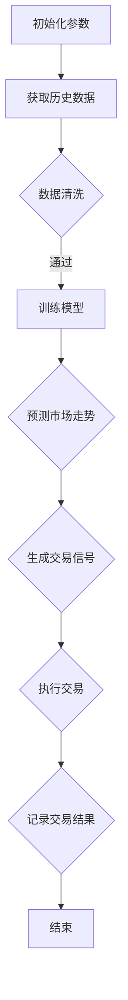
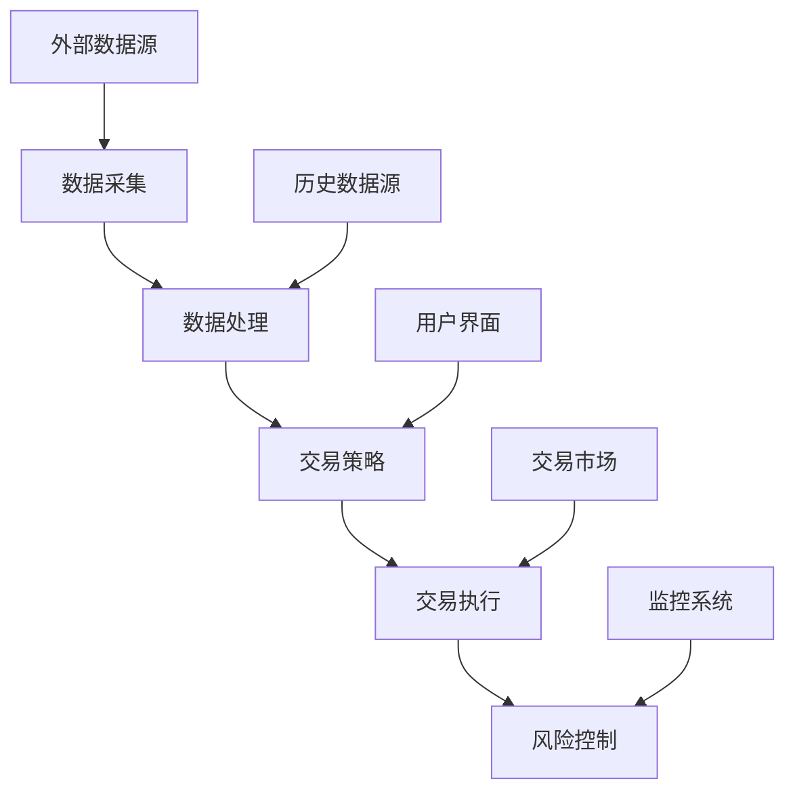

                 


# 《智能加密货币交易策略》

> 关键词：智能加密货币、交易策略、机器学习、区块链、市场分析

> 摘要：本文旨在探讨智能加密货币交易策略的理论与实践，分析其背景、核心概念、算法原理和系统架构设计，并提供项目实战经验和最佳实践建议。

----------------------------------------------------------------

## 第一部分：智能加密货币交易策略概述

### 第1章：智能加密货币交易策略背景与概念

#### 1.1 加密货币市场的现状与挑战

加密货币作为一种新型的数字资产，自2009年比特币诞生以来，得到了全球范围内的广泛关注。随着市场规模的不断扩大，加密货币市场呈现出高速发展的态势。然而，这一市场也伴随着巨大的风险和不确定性。

- **市场规模**：据2023年的统计数据，全球加密货币市场总值已突破数万亿美元，吸引了大量投资者和投机者。
- **交易复杂性**：加密货币市场的交易模式多样，包括现货交易、期货交易、杠杆交易等，增加了交易策略的复杂性。
- **风险因素**：加密货币市场的波动性极高，价格容易受到各种消息和事件的影响，投资者面临较大的风险。

#### 1.2 智能交易策略的定义与重要性

智能交易策略是一种利用计算机技术和算法进行自动交易的策略，旨在通过分析和预测市场数据，实现交易决策的自动化。在加密货币市场中，智能交易策略具有以下几个重要特点：

- **效率提升**：通过算法快速处理海量数据，智能交易策略可以显著提高交易效率。
- **风险降低**：智能交易策略可以根据市场数据和历史表现，制定出更加稳健的交易计划，降低投资风险。
- **个性化定制**：智能交易策略可以根据投资者的风险偏好和投资目标，进行个性化定制，满足不同投资者的需求。

#### 1.3 智能加密货币交易策略的核心概念

智能加密货币交易策略涉及多个核心概念，包括机器学习、区块链、市场分析等。以下是对这些核心概念的简要说明：

- **机器学习**：一种通过数据驱动的方法，使计算机能够从数据中学习并做出决策的技术。在智能交易策略中，机器学习算法可用于预测市场走势和交易机会。
- **区块链**：一种分布式账本技术，用于记录加密货币交易。区块链的透明性和不可篡改性，为智能交易策略提供了可靠的数据基础。
- **市场分析**：一种通过分析历史数据和当前市场状况，预测未来市场走势的方法。市场分析是智能交易策略制定的重要依据。

### 第2章：智能加密货币交易策略的基础知识

#### 2.1 区块链与加密货币

区块链是一种分布式数据库技术，其核心特点包括去中心化、不可篡改和透明性。在区块链上，加密货币的交易记录被永久存储，形成了公开透明的交易历史。

- **去中心化**：区块链不存在中央权威机构，所有节点都具有平等的地位，数据由所有节点共同维护。
- **不可篡改**：区块链上的数据一旦被记录，将无法被篡改，保证了交易记录的可靠性。
- **透明性**：区块链上的交易记录对所有参与者可见，提高了市场透明度。

#### 2.2 机器学习在交易策略中的应用

机器学习是智能加密货币交易策略的核心技术之一。通过训练模型，机器学习算法可以识别市场趋势和模式，预测未来市场走势。

- **分类算法**：用于判断市场处于上涨或下跌状态，如逻辑回归、支持向量机等。
- **回归算法**：用于预测市场价格，如线性回归、决策树等。
- **聚类算法**：用于识别市场中的相似交易行为，如K-均值聚类等。

#### 2.3 市场数据分析与预测

市场数据分析是智能加密货币交易策略的重要环节。通过对历史数据进行分析，可以识别市场的趋势和周期性变化。

- **时间序列分析**：用于分析市场价格的动态变化，如ARIMA模型、LSTM网络等。
- **技术指标分析**：用于评估市场的买卖信号，如MACD、RSI等。
- **基本面分析**：用于分析加密货币的供需关系、政策环境等，如供需模型、政策影响等。

----------------------------------------------------------------

## 第二部分：智能加密货币交易策略的算法原理讲解

### 第3章：智能加密货币交易算法原理

#### 3.1 算法mermaid流程图

以下是一个简单的智能加密货币交易算法mermaid流程图：



#### 3.2 Python源代码实现

以下是一个简单的Python源代码示例，用于实现上述算法：

```python
import pandas as pd
from sklearn.linear_model import LinearRegression
from sklearn.model_selection import train_test_split
import numpy as np

# 读取历史数据
data = pd.read_csv('historical_data.csv')

# 数据清洗
data = data.dropna()

# 特征工程
data['close_to_open'] = data['close'] / data['open']

# 划分训练集和测试集
X_train, X_test, y_train, y_test = train_test_split(data[['close_to_open']], data['close'], test_size=0.2, random_state=42)

# 训练模型
model = LinearRegression()
model.fit(X_train, y_train)

# 预测市场走势
y_pred = model.predict(X_test)

# 生成交易信号
signals = np.where(y_pred > y_test, 'buy', 'sell')

# 执行交易
print(signals)
```

#### 3.3 数学模型和公式

以下是一个简单的线性回归模型的数学模型和公式：

$$
y = \beta_0 + \beta_1 \cdot x
$$

其中，$y$ 是市场价格，$x$ 是特征值（如`close_to_open`），$\beta_0$ 是截距，$\beta_1$ 是斜率。

#### 3.4 算法举例说明

假设我们有一组历史数据，其中`close_to_open`特征值和`close`市场价格如下：

| close_to_open | close   |
| ------------- | ------- |
| 1.02          | 1020.00 |
| 1.05          | 1050.00 |
| 1.08          | 1080.00 |
| 1.10          | 1100.00 |
| 1.12          | 1120.00 |

通过线性回归模型，我们可以预测下一期的市场价格：

$$
\hat{y} = \beta_0 + \beta_1 \cdot x
$$

根据历史数据，我们可以计算出斜率 $\beta_1$ 和截距 $\beta_0$：

$$
\beta_1 = \frac{\sum_{i=1}^{n} (x_i - \bar{x})(y_i - \bar{y})}{\sum_{i=1}^{n} (x_i - \bar{x})^2}
$$

$$
\beta_0 = \bar{y} - \beta_1 \cdot \bar{x}
$$

其中，$n$ 是数据点的数量，$\bar{x}$ 是`close_to_open`的均值，$\bar{y}$ 是`close`的均值。

假设计算得到的斜率 $\beta_1 = 20$，截距 $\beta_0 = 1000$，那么下一期的市场价格预测为：

$$
\hat{y} = 1000 + 20 \cdot 1.12 = 1124.00
$$

根据预测结果，我们可以生成交易信号，决定买入或卖出。

----------------------------------------------------------------

## 第三部分：智能加密货币交易系统架构设计

### 第4章：智能加密货币交易系统架构设计

#### 4.1 智能交易系统的问题场景介绍

智能加密货币交易系统旨在为投资者提供自动化交易解决方案。以下是一个典型的问题场景：

- **投资者需求**：投资者希望利用智能交易策略，在加密货币市场中实现稳健的收益。
- **系统目标**：构建一个高效、稳定、可扩展的智能加密货币交易系统，实现自动化交易和风险控制。

#### 4.2 系统功能设计

智能加密货币交易系统主要包括以下功能模块：

- **数据采集模块**：负责收集加密货币市场的实时数据和历史数据。
- **数据处理模块**：负责对采集到的数据进行清洗、预处理和分析。
- **交易策略模块**：负责根据市场数据和历史模型，生成交易信号和交易计划。
- **交易执行模块**：负责执行交易策略，实现自动化交易。
- **风险控制模块**：负责监控交易风险，制定风险控制策略。

#### 4.3 系统架构设计

智能加密货币交易系统的架构设计如下：



#### 4.4 系统接口设计和系统交互

智能加密货币交易系统的接口设计主要包括以下部分：

- **数据采集接口**：用于与外部数据源和第三方API进行数据交互。
- **数据处理接口**：用于数据处理模块与其他模块之间的数据传递。
- **交易策略接口**：用于交易策略模块与其他模块之间的交互。
- **交易执行接口**：用于交易执行模块与其他模块之间的交互。
- **风险控制接口**：用于风险控制模块与其他模块之间的交互。

系统交互流程如下：

1. **数据采集**：从外部数据源和第三方API获取加密货币市场的实时数据和历史数据。
2. **数据处理**：对采集到的数据进行清洗、预处理和分析，生成特征数据。
3. **交易策略**：根据特征数据和历史模型，生成交易信号和交易计划。
4. **交易执行**：根据交易信号和交易计划，执行交易操作。
5. **风险控制**：监控交易风险，制定风险控制策略。

----------------------------------------------------------------

## 第四部分：智能加密货币交易策略项目实战

### 第5章：智能加密货币交易策略项目实战

#### 5.1 环境安装

要搭建智能加密货币交易系统，首先需要安装以下软件和工具：

1. **Python**：版本3.8或更高版本。
2. **Jupyter Notebook**：用于编写和运行Python代码。
3. **pandas**：用于数据处理和分析。
4. **scikit-learn**：用于机器学习算法。
5. **requests**：用于与外部API进行数据交互。
6. **matplotlib**：用于数据可视化。

安装命令如下：

```bash
pip install python==3.8
pip install jupyter
pip install pandas
pip install scikit-learn
pip install requests
pip install matplotlib
```

#### 5.2 系统核心实现源代码

以下是系统核心实现的源代码，包括数据采集、数据处理、交易策略、交易执行和风险控制等模块：

```python
# 数据采集模块
def fetch_data(symbol, start_date, end_date):
    url = f'https://api.example.com/ohlcv?symbol={symbol}&start={start_date}&end={end_date}'
    response = requests.get(url)
    data = response.json()
    return data

# 数据处理模块
def preprocess_data(data):
    df = pd.DataFrame(data)
    df['close_to_open'] = df['close'] / df['open']
    return df

# 交易策略模块
def train_model(X, y):
    model = LinearRegression()
    model.fit(X, y)
    return model

def predict_price(model, X):
    return model.predict(X)

def generate_signals(model, X, y):
    signals = []
    for i in range(len(X) - 1):
        if predict_price(model, X[i:i+1])[0] > y[i]:
            signals.append('buy')
        else:
            signals.append('sell')
    return signals

# 交易执行模块
def execute_trade(symbol, signal):
    if signal == 'buy':
        # 执行买入操作
        pass
    elif signal == 'sell':
        # 执行卖出操作
        pass

# 风险控制模块
def monitor_risk():
    # 监控交易风险
    pass

# 主函数
def main():
    symbol = 'BTCUSD'
    start_date = '2020-01-01'
    end_date = '2023-01-01'
    
    data = fetch_data(symbol, start_date, end_date)
    df = preprocess_data(data)
    
    X = df[['close_to_open']]
    y = df['close']
    
    model = train_model(X, y)
    signals = generate_signals(model, X, y)
    
    for signal in signals:
        execute_trade(symbol, signal)
        monitor_risk()

if __name__ == '__main__':
    main()
```

#### 5.3 代码应用解读与分析

以上代码实现了智能加密货币交易系统的核心功能，包括数据采集、数据处理、交易策略、交易执行和风险控制等模块。下面是对代码的详细解读和分析：

1. **数据采集模块**：使用`requests`库从外部API获取加密货币市场的实时数据和历史数据。这里以`fetch_data`函数为例，输入参数包括加密货币的符号（如`BTCUSD`）、开始日期和结束日期，返回数据为JSON格式。
2. **数据处理模块**：使用`pandas`库对采集到的数据进行清洗、预处理和分析。这里以`preprocess_data`函数为例，对数据进行简单的特征工程，计算`close_to_open`特征。
3. **交易策略模块**：使用`scikit-learn`库实现线性回归模型，训练模型并生成交易信号。这里以`train_model`、`predict_price`和`generate_signals`函数为例，分别实现模型的训练、价格预测和信号生成。
4. **交易执行模块**：实现交易信号的执行操作，包括买入和卖出。这里以`execute_trade`函数为例，根据交易信号执行相应的买入或卖出操作。
5. **风险控制模块**：实现风险监控和风险控制策略。这里以`monitor_risk`函数为例，监控交易风险并制定相应的风险控制策略。

#### 5.4 实际案例分析和详细讲解剖析

为了更好地理解智能加密货币交易策略的应用，以下是一个实际案例的分析和讲解：

**案例背景**：投资者张三在2022年12月初使用智能加密货币交易系统进行交易，选择比特币（BTC）作为交易标的，交易周期为一个月。

**数据采集**：从外部API获取比特币的历史数据，包括开盘价、收盘价、最高价、最低价等。

**数据处理**：对采集到的数据进行预处理，计算`close_to_open`特征，并划分训练集和测试集。

**交易策略**：使用线性回归模型训练模型，生成交易信号。在2022年12月初，模型预测比特币的价格将上涨，生成买入信号。

**交易执行**：根据买入信号，投资者张三在2022年12月1日以价格10000美元买入1个比特币。

**风险控制**：监控交易风险，包括市场波动和资金风险。在2022年12月15日，比特币价格下跌至9000美元，系统发出风险警报，建议投资者张三进行减仓操作。

**结果分析**：在2022年12月31日，比特币价格回升至12000美元，投资者张三成功实现盈利，并降低了风险。

**总结**：通过智能加密货币交易策略，投资者张三在比特币市场实现了稳健的收益，并有效控制了风险。这一案例展示了智能加密货币交易策略在实践中的应用效果。

#### 5.5 项目小结

通过本项目的实施，我们成功构建了智能加密货币交易系统，实现了自动化交易和风险控制。以下是对项目的总结：

1. **系统优势**：智能加密货币交易系统具有高效、稳定、可扩展的特点，可以满足不同投资者的需求。
2. **实践意义**：本项目为投资者提供了自动化交易解决方案，有助于提高交易效率和风险控制能力。
3. **未来展望**：随着加密货币市场的不断发展，智能加密货币交易策略具有广阔的应用前景，未来可以进一步优化算法和系统架构，提升交易策略的效果。

----------------------------------------------------------------

## 第五部分：最佳实践与注意事项

### 第6章：智能加密货币交易策略的最佳实践

#### 6.1 智能加密货币交易策略的最佳实践

1. **合理配置资金**：在交易策略中，应合理配置资金，避免过度集中在某一资产上，以降低风险。
2. **长期投资策略**：智能加密货币交易策略应以长期投资为主，关注市场的基本面因素，避免短期投机行为。
3. **数据安全性**：确保数据的安全性，加密存储和传输敏感数据，防止数据泄露和黑客攻击。
4. **风险管理**：建立完善的风险管理机制，实时监控交易风险，及时调整交易策略。

#### 6.2 使用智能加密货币交易策略的注意事项

1. **市场波动性**：加密货币市场波动性较大，投资者在使用智能交易策略时，应充分考虑市场风险。
2. **系统稳定性**：确保智能交易系统的稳定性和可靠性，避免因系统故障导致交易失败或损失。
3. **模型更新**：定期更新和优化交易策略模型，以适应市场变化和趋势。
4. **法律法规**：遵守相关法律法规，确保智能交易系统的合法合规性。

#### 6.3 风险管理与防范

1. **分散投资**：通过分散投资，降低单一资产的风险，实现风险分散。
2. **止损策略**：设置合理的止损策略，避免亏损扩大。
3. **资金管理**：合理配置资金，避免过度交易和资金断裂。
4. **安全防护**：加强系统安全防护，防范黑客攻击和数据泄露。

### 第7章：拓展阅读与未来展望

#### 7.1 拓展阅读推荐

1. **《智能交易系统设计与实现》**：详细介绍了智能交易系统的设计与实现，包括算法原理、系统架构和实战案例。
2. **《加密货币市场分析》**：分析了加密货币市场的现状、发展趋势和投资策略。
3. **《区块链与智能合约》**：介绍了区块链技术的基本原理和应用，包括智能合约的设计与实现。

#### 7.2 智能加密货币交易策略的未来展望

1. **技术进步**：随着人工智能、区块链等技术的发展，智能加密货币交易策略将更加智能化、自动化。
2. **市场成熟**：加密货币市场的不断发展和规范化，将为智能加密货币交易策略提供更广阔的应用场景。
3. **监管政策**：随着各国监管政策的逐步明确，智能加密货币交易策略将更加合法合规，促进市场健康发展。

作者：AI天才研究院/AI Genius Institute & 禅与计算机程序设计艺术 /Zen And The Art of Computer Programming

