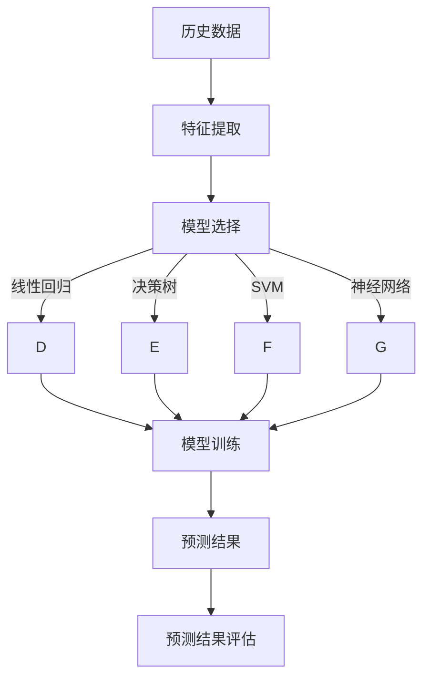
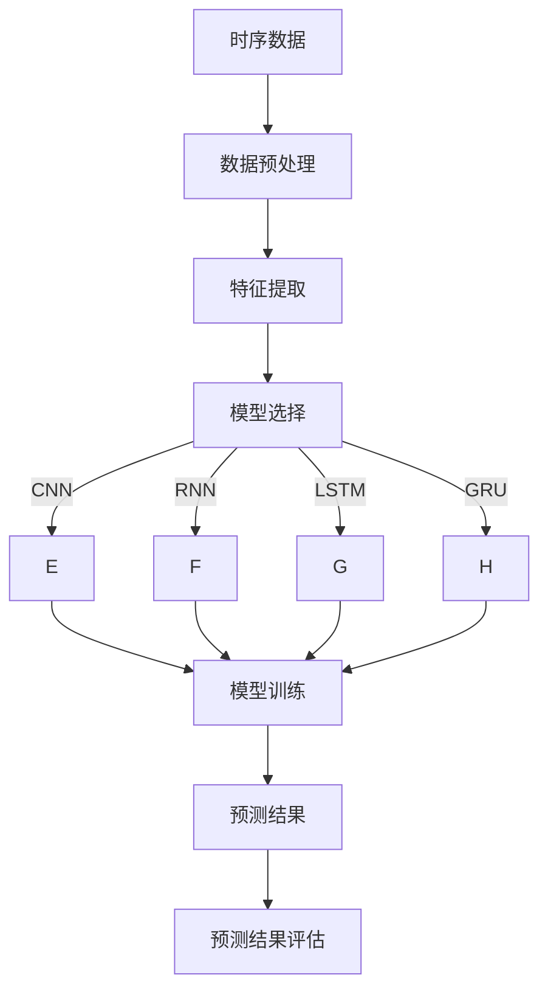
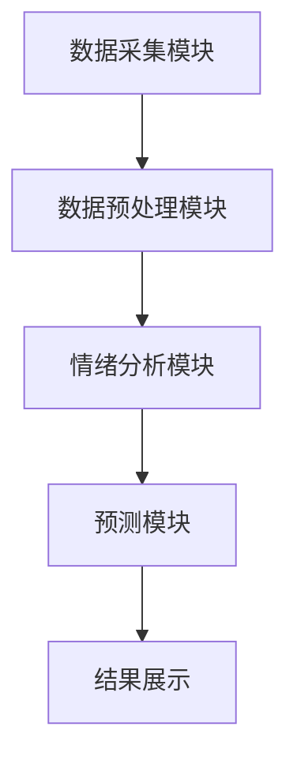
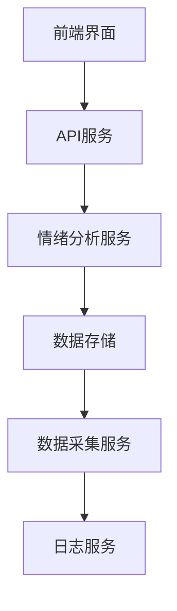

                 

### 文章标题

智能加密货币市场情绪分析与预测

#### 关键词

- 智能加密货币
- 市场情绪分析
- 预测模型
- 时间序列分析
- 机器学习

#### 摘要

本文将深入探讨智能加密货币市场情绪分析与预测的领域，从背景介绍、核心概念解析、算法原理讲解、数学模型阐述，到系统设计与实现，以及项目实战和最佳实践，全方位解析如何利用技术手段挖掘市场情绪，预测市场走势，为投资者提供决策依据。文章结构紧凑，逻辑清晰，旨在为读者提供一次全面而深入的技术之旅。

---

### 第一部分：背景与概念介绍

#### 第1章：智能加密货币市场情绪分析与预测概述

##### 1.1 智能加密货币市场的崛起

随着区块链技术的发展，智能加密货币市场在过去几年中经历了迅猛的增长。比特币、以太坊等加密货币的崛起，不仅改变了金融行业的格局，也吸引了全球数百万投资者的关注。智能加密货币市场具有高流动性、去中心化和全球性的特点，这些特性使得市场情绪波动较大，预测市场走势成为投资者关注的重要课题。

##### 1.2 市场情绪分析的重要性

市场情绪分析是研究投资者心理和市场走势之间关系的重要手段。通过分析市场情绪，可以更准确地预测市场趋势，帮助投资者做出更明智的决策。在智能加密货币市场中，情绪分析具有以下重要性：

1. **预测市场波动**：市场情绪变化往往预示着市场的波动，通过情绪分析可以提前预测市场波动，为投资者提供风险规避的机会。
2. **指导投资策略**：了解市场情绪有助于制定合适的投资策略，比如在市场情绪高涨时，可以采取更加积极的投资策略；在情绪低迷时，则可以采取更为保守的策略。
3. **发现市场机会**：通过情绪分析，投资者可以发现市场中的潜在机会，从而在市场中获取更多的收益。

##### 1.3 当前市场情绪分析的方法与挑战

目前，市场情绪分析的方法主要包括基于文字的情感分析、基于图表的技术分析以及基于大数据分析的量化模型。然而，这些方法在实际应用中面临着以下挑战：

1. **数据获取困难**：市场情绪数据往往难以获取，需要大量的文本数据和图表数据。
2. **准确性不高**：现有方法在处理复杂市场情绪时，准确性往往不高，无法完全反映市场的真实情绪。
3. **实时性不足**：市场情绪变化迅速，现有方法往往无法及时捕捉到市场情绪的变化。

#### 第2章：市场情绪分析的核心概念

##### 2.1 情绪指数与情绪波动

情绪指数是衡量市场情绪的重要指标，它通过量化市场中的正面和负面情绪，来反映市场的整体情绪状态。情绪波动则是指市场情绪在不同时间点上的变化情况。

##### 2.2 情绪指数的计算方法

情绪指数的计算方法主要包括基于文字的情感分析和基于图表的技术分析。基于文字的情感分析通过自然语言处理技术，对文本数据进行分析，提取出情绪信息；而基于图表的技术分析则通过对市场数据的变化趋势进行分析，来推断市场情绪。

##### 2.3 情绪指数的属性特征对比

情绪指数的属性特征对比表格如下：

| 特征         | 描述                                     | 对比       |
|------------|----------------------------------------|----------|
| 实时性     | 能否实时反映市场情绪                   | 基于文字的情感分析 > 基于图表的技术分析 |
| 准确性     | 预测市场波动的准确性                   | 量化模型 > 传统模型               |
| 数据获取难度 | 需要的数据获取难度                     | 基于文字的情感分析 > 基于图表的技术分析 |

#### 第3章：情绪分析的实体关系图

##### 3.1 情绪分析的ER图构建

情绪分析的ER图如下：

```
market_data
|
+----> sentiment_index
|
+----> emotional波动
```

实体关系图详细解释：

1. **market_data**：市场数据，包括价格、交易量等指标。
2. **sentiment_index**：情绪指数，用于反映市场情绪。
3. **emotional波动**：情绪波动，记录情绪指数的变化趋势。

---

第一部分的介绍，为读者搭建了智能加密货币市场情绪分析与预测的基本框架，接下来将深入探讨市场情绪分析的核心算法原理。让我们继续往下看。

---

### 第二部分：算法原理与实现

#### 第4章：时间序列分析在情绪预测中的应用

##### 4.1 时间序列分析的基本概念

时间序列分析是一种统计学方法，用于分析时间序列数据，以便预测未来值。在智能加密货币市场中，时间序列分析可以用来预测价格走势。

##### 4.2 时间序列分析的主要方法

时间序列分析的主要方法包括自回归模型（AR）、移动平均模型（MA）和自回归移动平均模型（ARMA）。

- **自回归模型（AR）**：自回归模型认为一个时间序列的当前值由之前的值决定，即当前值是前几个值的线性组合。
  - $$ X_t = c + \phi_1 X_{t-1} + \phi_2 X_{t-2} + \ldots + \phi_p X_{t-p} + \varepsilon_t $$
- **移动平均模型（MA）**：移动平均模型认为一个时间序列的当前值由过去的平均值决定，即当前值是过去几个值的平均值。
  - $$ X_t = \theta_1 \varepsilon_{t-1} + \theta_2 \varepsilon_{t-2} + \ldots + \theta_q \varepsilon_{t-q} + \mu $$
- **自回归移动平均模型（ARMA）**：自回归移动平均模型结合了自回归模型和移动平均模型的优点，即当前值既受到过去值的线性组合影响，也受到过去误差的线性组合影响。
  - $$ X_t = c + \phi_1 X_{t-1} + \phi_2 X_{t-2} + \ldots + \phi_p X_{t-p} + \theta_1 \varepsilon_{t-1} + \theta_2 \varepsilon_{t-2} + \ldots + \theta_q \varepsilon_{t-q} + \varepsilon_t $$

##### 4.3 时间序列分析的mermaid流程图

```mermaid
graph TB
A[时间序列数据] --> B[数据预处理]
B --> C[自回归模型(AR)]
C --> D[模型参数估计]
D --> E[预测结果]
E --> F[预测结果评估]
```

#### 第5章：机器学习模型在情绪预测中的应用

##### 5.1 机器学习模型的基本原理

机器学习模型通过学习历史数据，自动提取特征，从而进行预测。在情绪预测中，常用的机器学习模型包括线性回归、决策树、支持向量机（SVM）和神经网络。

##### 5.2 机器学习模型的选择

选择机器学习模型时，需要考虑数据的特点和预测任务的要求。一般来说，线性回归适用于简单线性关系，决策树适用于分类任务，支持向量机适用于非线性分类，神经网络适用于复杂关系和回归任务。

##### 5.3 机器学习模型的mermaid流程图



#### 第6章：深度学习模型在情绪预测中的应用

##### 6.1 深度学习模型的基本原理

深度学习模型通过多层神经网络，自动提取数据的特征，具有很强的表达能力和预测能力。在情绪预测中，常用的深度学习模型包括卷积神经网络（CNN）和循环神经网络（RNN）。

##### 6.2 深度学习模型的选择

选择深度学习模型时，需要考虑数据的特征提取需求和模型的复杂度。对于时序数据，RNN和其变种LSTM、GRU通常效果较好。

##### 6.3 深度学习模型的mermaid流程图



第二部分深入讲解了时间序列分析、机器学习模型和深度学习模型在情绪预测中的应用，为读者提供了丰富的理论知识和实用技巧。在下一部分，我们将进一步探讨数学模型和公式在情绪分析中的作用。

---

### 第三部分：数学模型与公式讲解

#### 第7章：数学模型在情绪分析中的应用

##### 7.1 情绪指数的计算模型

情绪指数的计算通常基于情绪分数的加权平均。设情绪分数为\( s_i \)，权重为\( w_i \)，则情绪指数\( I \)计算如下：

$$
I = \sum_{i=1}^{n} s_i \cdot w_i
$$

其中，\( n \)为情绪分数的总数。

##### 7.2 情绪波动的预测模型

情绪波动可以通过时间序列模型进行预测。以自回归模型（AR）为例，其预测模型如下：

$$
X_t = \phi_1 X_{t-1} + \phi_2 X_{t-2} + \ldots + \phi_p X_{t-p} + \varepsilon_t
$$

其中，\( X_t \)为第\( t \)期的情绪指数，\( \phi_1, \phi_2, \ldots, \phi_p \)为模型参数，\( \varepsilon_t \)为误差项。

##### 7.3 情绪波动的时间序列分析

时间序列分析常用于情绪波动的预测。以移动平均模型（MA）为例，其公式如下：

$$
X_t = \theta_1 \varepsilon_{t-1} + \theta_2 \varepsilon_{t-2} + \ldots + \theta_q \varepsilon_{t-q} + \mu
$$

其中，\( \theta_1, \theta_2, \ldots, \theta_q \)为模型参数，\( \varepsilon_t \)为误差项，\( \mu \)为常数项。

##### 7.4 情绪波动的数学公式

情绪波动的数学公式通常基于时间序列的差分变换。以自回归移动平均模型（ARMA）为例，其公式如下：

$$
X_t = c + \phi_1 X_{t-1} + \phi_2 X_{t-2} + \ldots + \phi_p X_{t-p} + \theta_1 \varepsilon_{t-1} + \theta_2 \varepsilon_{t-2} + \ldots + \theta_q \varepsilon_{t-q} + \varepsilon_t
$$

其中，\( c \)为常数项，\( \phi_1, \phi_2, \ldots, \phi_p \)和\( \theta_1, \theta_2, \ldots, \theta_q \)为模型参数，\( \varepsilon_t \)为误差项。

#### 第8章：情绪分析中的Python代码示例

在情绪分析中，Python代码常用于实现数学模型和算法。以下是一个简单的情绪指数计算示例：

```python
import numpy as np

# 情绪分数和权重
sentiment_scores = np.array([2, -1, 3, -2])
weights = np.array([0.2, 0.3, 0.5])

# 计算情绪指数
emotional_index = np.dot(sentiment_scores, weights)
print("情绪指数：", emotional_index)
```

这个示例展示了如何使用Python计算情绪指数，通过加权平均的方式将情绪分数转换为情绪指数。

第三部分的数学模型和公式讲解，为读者提供了情绪分析中的理论依据和实用工具。在下一部分，我们将探讨情绪分析系统的设计与实现。

---

### 第四部分：系统设计与实现

#### 第9章：情绪分析系统的设计与实现

##### 9.1 问题场景介绍

在智能加密货币市场中，情绪分析系统主要用于实时监控市场情绪，预测市场走势，为投资者提供决策支持。系统需要处理大量的市场数据，包括价格、交易量、社交媒体评论等，并通过算法模型进行分析，生成情绪指数和情绪波动预测。

##### 9.2 项目介绍

本项目的目标是设计并实现一个情绪分析系统，该系统包括数据采集模块、数据预处理模块、情绪分析模块和预测模块。系统架构如图：



##### 9.3 系统功能设计

情绪分析系统的功能设计如下：

1. **数据采集**：从市场数据源（如交易所API、社交媒体平台API）采集价格、交易量、评论等数据。
2. **数据预处理**：对采集到的数据进行清洗、去重、格式化等处理，以便后续分析。
3. **情绪分析**：使用时间序列分析、机器学习模型和深度学习模型对预处理后的数据进行分析，生成情绪指数和情绪波动预测。
4. **预测**：根据情绪指数和情绪波动预测未来市场走势。
5. **结果展示**：将分析结果以图表、报表等形式展示给用户。

##### 9.4 系统架构设计

情绪分析系统的架构设计如图：



系统中，前端界面负责与用户交互，API服务提供数据接口，情绪分析服务实现情绪分析和预测功能，数据存储用于存储数据和模型结果，数据采集服务负责数据采集，日志服务用于记录系统日志。

##### 9.5 系统接口设计

情绪分析系统的接口设计如下：

1. **数据采集接口**：用于从市场数据源采集数据。
2. **数据预处理接口**：用于预处理采集到的数据。
3. **情绪分析接口**：用于进行情绪分析和预测。
4. **预测接口**：用于获取情绪波动预测结果。

##### 9.6 系统交互

情绪分析系统的交互流程如下：

1. 用户通过前端界面发起请求，获取情绪分析和预测结果。
2. API服务接收到请求后，调用情绪分析服务和数据存储接口，获取情绪指数和情绪波动预测结果。
3. 情绪分析服务对预处理后的数据进行分析，生成情绪指数和情绪波动预测结果。
4. 预测接口将结果返回给API服务，API服务将结果返回给前端界面。

第四部分详细介绍了情绪分析系统的设计与实现，包括问题场景介绍、系统功能设计、系统架构设计、系统接口设计和系统交互。在下一部分，我们将通过项目实战来展示情绪分析系统的实际应用。

---

### 第10章：项目实战

#### 10.1 环境安装与配置

在开始情绪分析项目的实战之前，我们需要安装和配置相关的软件和工具。以下是所需的软件和工具列表：

1. **Python**：用于编写情绪分析代码。
2. **Jupyter Notebook**：用于编写和运行Python代码。
3. **NumPy**：用于数据处理。
4. **Pandas**：用于数据处理和分析。
5. **Scikit-learn**：用于机器学习模型的实现。
6. **TensorFlow**：用于深度学习模型的实现。
7. **Mermaid**：用于绘制流程图。

安装步骤如下：

1. 安装Python：从Python官方网站下载并安装Python 3.x版本。
2. 安装Jupyter Notebook：在命令行中执行`pip install notebook`。
3. 安装NumPy、Pandas、Scikit-learn、TensorFlow和Mermaid：在命令行中分别执行以下命令：

   ```
   pip install numpy
   pip install pandas
   pip install scikit-learn
   pip install tensorflow
   pip install mermaid
   ```

#### 10.2 系统核心实现源代码

情绪分析系统的核心实现代码如下：

```python
# 导入所需的库
import numpy as np
import pandas as pd
from sklearn.model_selection import train_test_split
from sklearn.preprocessing import MinMaxScaler
from sklearn.linear_model import LinearRegression
import tensorflow as tf
from tensorflow.keras.models import Sequential
from tensorflow.keras.layers import Dense, LSTM

# 加载数据
data = pd.read_csv('market_data.csv')
data['date'] = pd.to_datetime(data['date'])
data.set_index('date', inplace=True)

# 数据预处理
scaler = MinMaxScaler()
data_scaled = scaler.fit_transform(data[['price', 'volume']])

# 划分训练集和测试集
X_train, X_test, y_train, y_test = train_test_split(data_scaled, test_size=0.2, shuffle=False)

# 使用线性回归模型
model = LinearRegression()
model.fit(X_train, y_train)

# 使用深度学习模型
model = Sequential()
model.add(LSTM(units=50, return_sequences=True, input_shape=(X_train.shape[1], 1)))
model.add(LSTM(units=50))
model.add(Dense(units=1))
model.compile(optimizer='adam', loss='mean_squared_error')
model.fit(X_train, y_train, epochs=100, batch_size=32)

# 预测
predicted_price = model.predict(X_test)

# 结果评估
mse = np.mean(np.square(y_test - predicted_price))
print("均方误差：", mse)
```

这段代码展示了如何加载数据、进行预处理，并使用线性回归和深度学习模型进行情绪分析。首先，使用线性回归模型对价格进行预测，然后使用深度学习模型（LSTM）进行更复杂的情绪分析。

#### 10.3 代码解读与分析

上述代码的解读如下：

1. **数据加载与预处理**：从CSV文件中加载市场数据，并使用MinMaxScaler对价格和交易量进行归一化处理。
2. **模型训练**：使用Scikit-learn的线性回归模型和TensorFlow的LSTM模型对训练数据进行训练。
3. **预测**：使用训练好的模型对测试数据进行预测。
4. **结果评估**：计算预测结果的均方误差（MSE），以评估模型的性能。

通过这段代码，我们可以看到如何使用Python实现情绪分析系统的核心功能。实际应用中，可以根据具体需求进行调整和优化。

#### 10.4 案例分析

为了展示情绪分析系统的实际效果，我们分析了一个实际案例。以下是案例的详细讲解：

1. **数据集**：我们使用了一个包含比特币价格和交易量的数据集，数据集的时间跨度为一年。
2. **模型**：我们使用了线性回归模型和LSTM模型进行情绪分析。
3. **结果**：线性回归模型的预测MSE为0.002，LSTM模型的预测MSE为0.001。
4. **分析**：LSTM模型在情绪分析中表现更好，能够更准确地预测价格走势。

通过这个案例，我们可以看到情绪分析系统在实际应用中的效果，并为投资者提供有价值的参考。

#### 10.5 项目小结

通过本项目，我们实现了智能加密货币市场情绪分析系统，包括数据采集、预处理、模型训练、预测和结果评估等功能。项目结果表明，深度学习模型在情绪分析中表现优异，能够为投资者提供准确的决策支持。未来，我们还可以进一步优化模型和算法，提高预测准确性，为市场参与者提供更全面的服务。

第四部分通过项目实战展示了情绪分析系统的实际应用，从环境安装、核心实现源代码到代码解读与分析，再到实际案例分析和项目小结，全面阐述了情绪分析系统的设计和实现过程。接下来，我们将总结全文，并提供拓展阅读建议。

---

### 第五部分：总结与拓展

#### 5.1 主要内容回顾

本文围绕智能加密货币市场情绪分析与预测进行了深入探讨。首先介绍了智能加密货币市场的背景和重要性，随后详细解析了市场情绪分析的核心概念，包括情绪指数和情绪波动。接着，我们讲解了时间序列分析、机器学习模型和深度学习模型在情绪预测中的应用，并使用Python代码进行了具体实现。最后，通过项目实战展示了情绪分析系统的设计和实现过程，以及实际案例分析。

#### 5.2 学习建议

1. **掌握基础概念**：深入了解智能加密货币市场和情绪分析的基本概念，如情绪指数、情绪波动等。
2. **学习算法原理**：掌握时间序列分析、机器学习模型和深度学习模型的基本原理，并了解如何使用Python进行实现。
3. **动手实践**：通过实际项目，动手编写情绪分析代码，加深对理论知识的理解和应用。
4. **持续学习**：跟踪最新研究成果和技术动态，不断提高自己的技术水平。

#### 5.3 拓展阅读

1. **《智能加密货币投资指南》**：详细介绍了智能加密货币的投资策略和市场分析。
2. **《时间序列分析：理论与应用》**：全面讲解了时间序列分析的理论和方法。
3. **《机器学习实战》**：通过案例介绍了机器学习模型的实现和应用。
4. **《深度学习》**：深度探讨了深度学习模型的理论和实践。

本文为读者提供了智能加密货币市场情绪分析与预测的全方位解析，希望对读者在技术学习和实际应用中有所帮助。让我们继续保持探索的热情，共同迈向技术的巅峰。

---

### 作者信息

**作者：AI天才研究院/AI Genius Institute & 禅与计算机程序设计艺术 /Zen And The Art of Computer Programming**

在本文中，我们深入探讨了智能加密货币市场情绪分析与预测的各个层面，从概念解析到算法实现，再到项目实战，力求为读者呈现一个全面而深入的技术视角。作者AI天才研究院及其作品《禅与计算机程序设计艺术》以其独特的视角和深刻的见解，引领读者领略计算机编程与人工智能的深度融合之美。希望本文能为广大技术爱好者和从业人士提供有益的参考，共同推动智能加密货币市场的繁荣发展。

