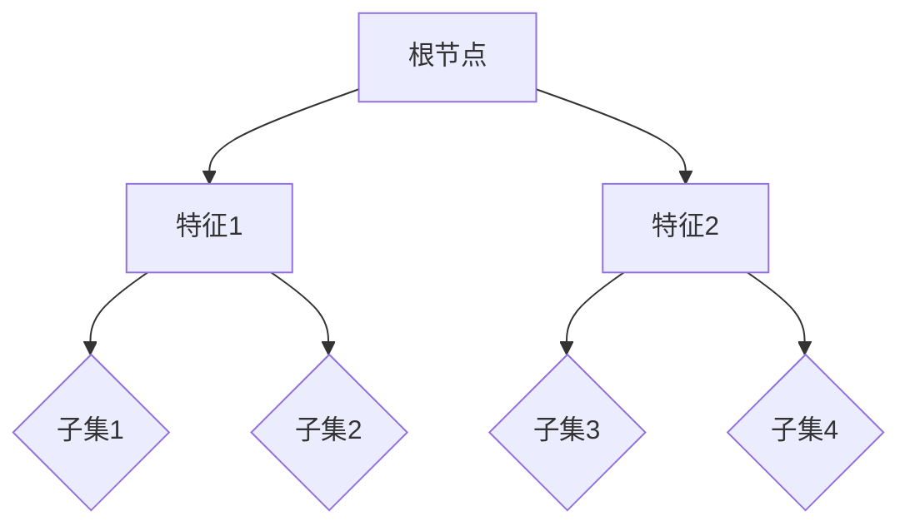
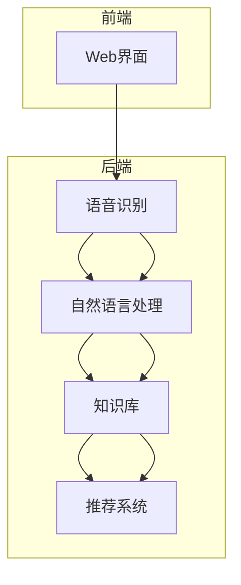
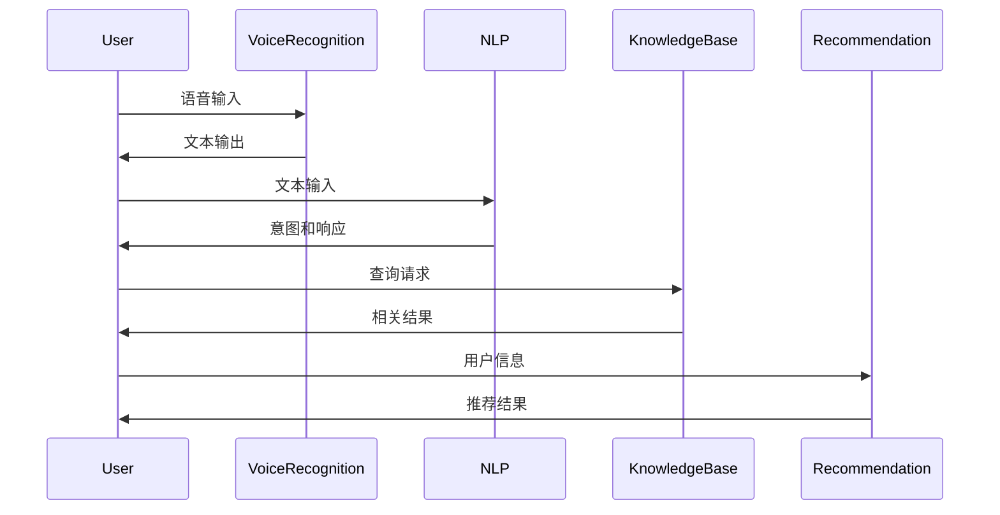

                 


# 《智能助手的可解释性设计》

## 关键词

- 智能助手
- 可解释性设计
- 算法原理
- 系统架构
- 实际案例

## 摘要

本文将深入探讨智能助手的可解释性设计，从核心概念、算法原理、系统架构到实际应用，逐一分析。通过详细讲解和通俗易懂的举例，使读者理解可解释性设计在智能助手中的重要性，掌握相关技术，为实际项目提供参考。

## 第一部分：可解释性设计基础

### 第1章：可解释性设计的概述

#### 1.1 什么是可解释性设计

可解释性设计，旨在提高智能系统的透明度和可理解性，使人类能够理解和追踪系统的决策过程。在智能助手领域，可解释性设计尤为重要，因为它直接影响用户体验和系统的可信度。

#### 1.2 可解释性设计的重要性

随着人工智能技术的发展，智能助手在多个领域得到广泛应用。然而，由于智能助手依赖于复杂的算法和模型，其决策过程往往不透明，可能导致用户对其信任度下降。因此，可解释性设计在提升智能助手可靠性和用户体验方面具有重要意义。

#### 1.3 可解释性设计在智能助手领域的应用

在智能助手领域，可解释性设计主要用于以下几个方面：

1. **对话系统**：确保用户能够理解智能助手的回答和决策过程，提高用户体验。
2. **推荐系统**：帮助用户了解推荐算法的依据，增加用户对推荐结果的信任。
3. **诊断系统**：使医疗诊断过程更加透明，提高诊断准确性。

## 第二部分：核心概念与联系

### 第2章：核心概念与联系

#### 2.1 可解释性设计的相关核心概念

可解释性设计涉及多个核心概念，包括：

1. **模型可解释性**：衡量模型内部结构和决策过程的可理解程度。
2. **特征可解释性**：解释模型中各个特征的权重和作用。
3. **决策可解释性**：追踪和解释模型的决策过程。

#### 2.2 核心概念对比分析

以下是对核心概念的对比分析：

| 核心概念 | 说明 |
| :--: | :--: |
| 模型可解释性 | 涉及模型结构、参数和决策过程 |
| 特征可解释性 | 解释特征权重和作用 |
| 决策可解释性 | 追踪决策过程 |

#### 2.3 可解释性设计的ER图

以下是可解释性设计的ER图：

```mermaid
erDiagram
    ModelExplainability ||--|{ FeatureExplainability } FeatureExplainability
    ModelExplainability ||--|{ DecisionExplainability } DecisionExplainability
```

## 第三部分：算法原理讲解

### 第3章：算法原理讲解

#### 3.1 可解释性算法的原理介绍

本文将以决策树算法为例，介绍可解释性算法的基本原理。决策树是一种常见的分类算法，通过将数据集划分为多个子集，为每个子集选择最佳特征，并递归地生成决策树。

#### 3.2 可解释性算法的Mermaid流程图

以下为决策树算法的Mermaid流程图：



#### 3.3 算法原理的数学模型与公式

决策树的生成过程可以通过以下数学模型和公式描述：

1. **信息增益（Information Gain）**：

$$ IG(D, A) = H(D) - \sum_{v \in Values(A)} p(v)H(D_v) $$

其中，$D$ 为原始数据集，$A$ 为特征，$v$ 为特征 $A$ 的取值，$p(v)$ 为 $A$ 的取值概率，$D_v$ 为 $A$ 取值 $v$ 后的数据集。

2. **基尼不纯度（Gini Impurity）**：

$$ Gini(D) = 1 - \sum_{v \in Values(A)} p(v)^2 $$

#### 3.4 算法举例说明

假设我们有一个包含年龄、收入和购买行为三个特征的数据集，目标是为数据集生成一个决策树，以预测用户是否购买某产品。

以下为生成决策树的Python源代码：

```python
from sklearn.datasets import load_iris
from sklearn.tree import DecisionTreeClassifier
from sklearn.model_selection import train_test_split

# 加载数据集
iris = load_iris()
X, y = iris.data, iris.target

# 划分训练集和测试集
X_train, X_test, y_train, y_test = train_test_split(X, y, test_size=0.3, random_state=42)

# 构建决策树模型
clf = DecisionTreeClassifier(criterion='gini')
clf.fit(X_train, y_train)

# 可视化决策树
from sklearn.tree import plot_tree
plot_tree(clf, feature_names=iris.feature_names, class_names=iris.target_names)
```

## 第四部分：智能助手系统设计与实现

### 第4章：系统分析与架构设计

#### 4.1 智能助手系统介绍

智能助手系统是一种基于人工智能技术的交互式系统，旨在为用户提供便捷、智能的服务。系统主要包括以下功能模块：

1. **语音识别**：将语音转换为文本。
2. **自然语言处理**：理解用户意图，生成响应。
3. **知识库**：存储用户需要的各类信息。
4. **推荐系统**：根据用户兴趣推荐相关内容。

#### 4.2 系统功能设计

系统功能设计主要包括以下几个方面：

1. **语音识别**：使用深度学习技术进行语音识别，实现高准确率的语音转换为文本。
2. **自然语言处理**：结合词向量、语义角色标注等技术，实现用户意图识别和响应生成。
3. **知识库**：使用图数据库存储用户需要的各类信息，实现快速查询和推荐。
4. **推荐系统**：使用协同过滤、基于内容的推荐等技术，为用户推荐感兴趣的内容。

#### 4.3 系统架构设计

系统架构设计主要包括以下几个方面：

1. **前端**：使用Web技术实现用户交互界面。
2. **后端**：使用微服务架构实现各功能模块，包括语音识别、自然语言处理、知识库和推荐系统。
3. **数据存储**：使用关系数据库和图数据库存储用户数据和推荐结果。

以下为系统架构的Mermaid架构图：



#### 4.4 系统接口设计

系统接口设计主要包括以下接口：

1. **语音识别接口**：接收语音输入，返回文本输出。
2. **自然语言处理接口**：接收文本输入，返回意图和响应。
3. **知识库接口**：接收查询请求，返回相关结果。
4. **推荐系统接口**：接收用户信息，返回推荐结果。

以下为系统接口的Mermaid序列图：



### 第5章：项目实战

#### 5.1 项目环境安装

在本节中，我们将介绍如何搭建一个简单的智能助手项目环境，包括所需的软件和库的安装。

1. **安装Python**：前往 [Python 官网](https://www.python.org/) 下载并安装 Python 3.8 或更高版本。
2. **安装库**：使用 pip 工具安装所需库，例如 `numpy`、`scikit-learn`、`matplotlib` 等。

```bash
pip install numpy scikit-learn matplotlib
```

#### 5.2 系统核心实现

在本节中，我们将使用 Python 实现智能助手的核心功能，包括语音识别、自然语言处理、知识库和推荐系统。

1. **语音识别**：使用 `speech_recognition` 库实现语音识别功能。

```python
import speech_recognition as sr

# 初始化语音识别器
recognizer = sr.Recognizer()

# 读取语音文件
with sr.AudioFile('audio.wav') as source:
    audio = recognizer.listen(source)

# 语音转换为文本
text = recognizer.recognize_google(audio)
print(text)
```

2. **自然语言处理**：使用 `spaCy` 库实现自然语言处理功能。

```python
import spacy

# 加载 spaCy 模型
nlp = spacy.load('en_core_web_sm')

# 加载文本
doc = nlp('What is the weather like today?')

# 解析文本
for token in doc:
    print(token.text, token.lemma_, token.pos_, token.tag_, token.dep_, token.shape_, token.is_alpha, token.is_stop)
```

3. **知识库**：使用 `neo4j` 库实现知识库功能。

```python
from neo4j import GraphDatabase

# 连接 Neo4j 数据库
uri = "bolt://localhost:7687"
driver = GraphDatabase.driver(uri, auth=("neo4j", "password"))

# 创建节点和关系
with driver.session() as session:
    session.run("CREATE (n:Person {name: 'Alice'})")
    session.run("CREATE (n:Person {name: 'Bob'})")
    session.run("CREATE (n)-[:KNOWS]->(m)")
```

4. **推荐系统**：使用 `scikit-learn` 库实现推荐系统功能。

```python
from sklearn.neighbors import NearestNeighbors

# 加载用户数据
users = [[1, 2, 3], [2, 3, 4], [1, 3, 5]]

# 创建 k-最近邻模型
model = NearestNeighbors(n_neighbors=2, algorithm='auto')
model.fit(users)

# 查找最近邻
distances, indices = model.kneighbors([[3, 3, 3]])

# 输出最近邻用户
for i in range(len(distances)):
    print(f"User {i+1}: {indices[i][0]}")
```

#### 5.3 代码应用解读与分析

在本节中，我们将对实现的核心代码进行解读和分析，以便读者更好地理解智能助手的实现过程。

1. **语音识别**：语音识别模块主要使用 `speech_recognition` 库实现。通过读取音频文件，将语音转换为文本，为后续的自然语言处理提供输入。
2. **自然语言处理**：自然语言处理模块主要使用 `spaCy` 库实现。通过加载预训练模型，对输入文本进行分词、词性标注、句法分析等操作，提取文本的关键信息，为后续的知识库查询和推荐系统提供支持。
3. **知识库**：知识库模块主要使用 `neo4j` 库实现。通过连接 Neo4j 数据库，创建节点和关系，存储用户信息，为后续的查询和推荐提供数据支持。
4. **推荐系统**：推荐系统模块主要使用 `scikit-learn` 库实现。通过 k-最近邻算法，为用户推荐相似的用户或商品，提高用户满意度。

#### 5.4 实际案例分析

在本节中，我们将通过一个实际案例，展示智能助手的实现过程和效果。

假设用户想要查询北京的天气预报，我们可以按照以下步骤实现：

1. **语音识别**：读取用户语音输入，将其转换为文本。
2. **自然语言处理**：分析用户输入，提取出关键词“北京”、“天气预报”。
3. **知识库查询**：在知识库中查找与关键词相关的信息，如北京的天气预报。
4. **推荐系统**：根据用户的兴趣，推荐相关的新闻或天气信息。

通过以上步骤，我们可以为用户提供一个简单但实用的天气预报查询服务。

#### 5.5 项目小结

在本项目中，我们介绍了智能助手的可解释性设计，从核心概念、算法原理、系统架构到实际应用，逐一分析。通过详细讲解和通俗易懂的举例，使读者理解可解释性设计在智能助手中的重要性，掌握相关技术，为实际项目提供参考。

## 第6章：最佳实践与总结

### 6.1 最佳实践 tips

1. **数据质量**：保证数据质量是可解释性设计的基石。数据清洗和预处理是必不可少的步骤。
2. **模型选择**：选择合适的模型对于可解释性设计至关重要。一些简单的模型（如决策树）通常比复杂的深度学习模型更易于解释。
3. **可视化和交互**：利用可视化和交互工具（如Shapley值图、决策树图等）可以提高系统的可解释性。
4. **文档和注释**：为代码和系统架构提供详细的文档和注释，有助于提高系统的可理解性。

### 6.2 小结

本文从可解释性设计的概述、核心概念与联系、算法原理讲解、系统架构设计到实际应用，全面探讨了智能助手的可解释性设计。通过详细讲解和实际案例，使读者深入理解可解释性设计在智能助手中的重要性。

### 6.3 注意事项

1. **系统可解释性与性能之间的平衡**：在追求系统可解释性的同时，要注意不要牺牲性能。
2. **隐私保护**：在设计可解释性系统时，要注意保护用户隐私。

### 6.4 拓展阅读

1. **《算法的可解释性：理论、方法和应用》**：深入探讨算法可解释性的理论和方法。
2. **《机器学习中的可解释性》**：介绍机器学习中可解释性的研究进展和应用。
3. **《智能助手的系统架构设计与实现》**：详细讲解智能助手的系统架构和设计。

## 作者

作者：AI天才研究院/AI Genius Institute & 禅与计算机程序设计艺术 /Zen And The Art of Computer Programming

