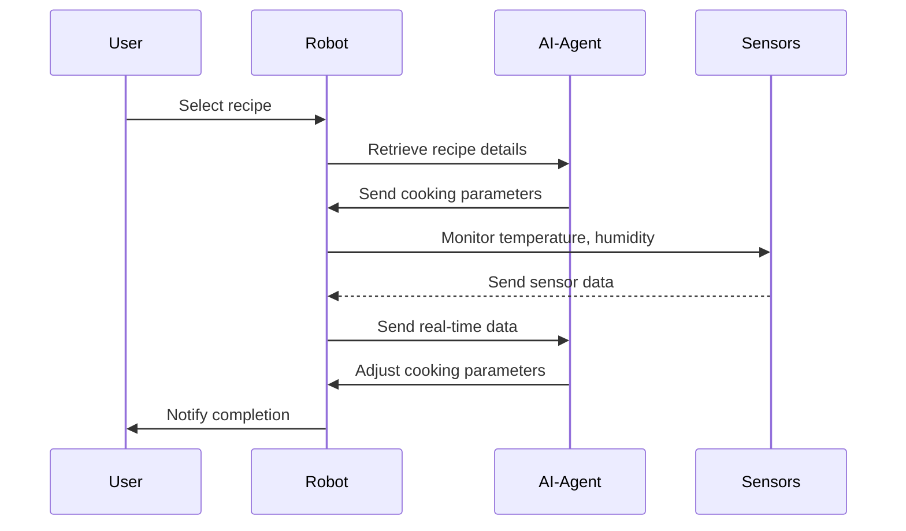

                 

### Introduction to the Book

#### Smart Kitchenware: AI Agent's Cooking Guidance System

## Key Keywords
- Smart Kitchenware
- AI Agent
- Cooking Guidance System
- Automation
- User Experience

### Abstract

This book delves into the fascinating world of smart kitchenware and its integration with AI Agents to create a revolutionary cooking guidance system. We will explore the fundamental concepts, technical foundations, and system designs that make this synergy possible. The book aims to provide a comprehensive guide for enthusiasts, AI professionals, and appliance industry experts to understand, develop, and deploy intelligent cooking systems. By the end of this book, readers will gain insights into the latest trends, applications, and future prospects of smart kitchenware.

----------------------------------------------------------------

### Introduction to the Book

#### Smart Kitchenware: AI Agent's Cooking Guidance System

## Key Keywords
- Smart Kitchenware
- AI Agent
- Cooking Guidance System
- Automation
- User Experience

### Abstract

This book is an in-depth exploration of the convergence of smart kitchenware and AI Agents, focusing on the development of an advanced cooking guidance system. We will start by defining smart kitchenware and AI Agents, examining their individual capabilities and how they complement each other. The book will then delve into the technical foundations required to build such a system, including hardware, software, and data architecture.

We will discuss the system design, focusing on the algorithms that drive the cooking guidance and the user interfaces that make interaction seamless. The practical application of these systems in real-world scenarios will be highlighted through detailed case studies. Finally, we will look to the future, discussing the potential advancements and the impact of smart kitchenware on everyday life.

This book is intended for a broad audience, including cooking enthusiasts who are curious about technology, AI professionals looking to explore new applications, and appliance industry experts seeking to innovate within their field. By the end of the book, readers will have a clear understanding of the potential of smart kitchenware and AI Agents, and how they can work together to revolutionize the art of cooking.

----------------------------------------------------------------

## The First Chapter: Introduction and Overview

### 1.1 Book Purpose and Reader Audience

The primary purpose of this book is to provide a detailed and accessible guide to the development and implementation of smart kitchenware with AI Agent cooking guidance systems. The target audience includes:

- Cooking enthusiasts who are curious about the integration of technology with traditional cooking methods.
- AI professionals seeking to expand their knowledge into novel applications of artificial intelligence in everyday tasks.
- Appliance industry professionals interested in developing new products that leverage AI to enhance user experience and functionality.

The book aims to cover a broad spectrum of topics, from basic concepts and terminology to advanced system design and practical applications. It is structured to guide readers from a foundational understanding to the implementation of complex systems, making it suitable for both beginners and seasoned professionals.

### 1.2 Introduction to Smart Kitchenware and AI Agents

**Smart Kitchenware:**
Smart kitchenware refers to appliances and tools that are designed with advanced technologies, such as sensors, connectivity, and machine learning algorithms, to improve the cooking experience. These devices can range from smart ovens and rice cookers to smart knives and kitchen robots. The primary goal of smart kitchenware is to simplify and enhance the cooking process, making it more efficient, enjoyable, and accessible to a wider audience.

**AI Agents:**
AI Agents, or Artificial Intelligence Agents, are computer programs that can perform tasks on behalf of users, interact with their environment, and make decisions based on data analysis. In the context of smart kitchenware, AI Agents can act as virtual chefs, providing personalized cooking guidance, monitoring food preparation, and ensuring the best possible cooking outcomes. AI Agents are capable of learning from user habits, adjusting to new ingredients, and evolving over time to improve their performance.

### 1.3 Chapter Structure Overview

The book is organized into several key chapters, each addressing different aspects of smart kitchenware and AI Agent cooking guidance systems. The chapter structure is as follows:

1. **Introduction and Overview:** Provides an introduction to the book, its purpose, and target audience, as well as an overview of the key concepts and structure of the book.
   
2. **Smart Kitchenware Technology Foundation:** Discusses the core components of smart kitchenware, including hardware, software, and communication technologies.

3. **AI Agent Basics:** Explores the fundamentals of AI Agents, including their definition, core technologies, and applications in smart kitchenware.

4. **Cooking Guidance System Design:** Describes the overall architecture of the cooking guidance system, including hardware, software, and data components.

5. **System Implementation and Deployment:** Covers the steps required to implement and deploy a smart kitchenware system, including environment setup, core code implementation, and system maintenance.

6. **Application Cases:** Provides practical examples of smart kitchenware in action, highlighting real-world applications and case studies.

7. **Future Prospects:** Discusses the future trends and potential advancements in smart kitchenware and AI Agent technology.

By following this structure, readers will gain a comprehensive understanding of smart kitchenware and its integration with AI Agents, from theoretical foundations to practical applications.

----------------------------------------------------------------

## The Second Chapter: Smart Kitchenware Technology Foundation

### 2.1 Components of Smart Kitchenware

**Smart kitchenware consists of several key components that work together to create a seamless and intelligent cooking experience. These components include hardware, software, and communication technologies.**

#### 2.1.1 Hardware

The hardware of smart kitchenware is crucial for its functionality. It includes various devices and sensors that are designed to perform specific cooking tasks. Some common hardware components of smart kitchenware are:

- **Smart Ovens:** Equipped with temperature sensors, timer controls, and often Wi-Fi capabilities, smart ovens can be controlled remotely and adjust their settings based on the type of food being cooked.
- **Smart Cookers and Pressure Cookers:** These devices come with built-in sensors to monitor temperature and pressure, ensuring that food is cooked perfectly every time. They also offer programmable settings and can be controlled through smartphones or tablets.
- **Smart Knives:** These advanced kitchen tools use sensors to measure the thickness of cuts and adjust their speed and force accordingly. Some models even have Wi-Fi connectivity to sync with recipe apps.
- **Smart Food Processors and Mixers:** These devices are designed to automate various cooking processes, from chopping to blending. They often come with a variety of attachments and can be controlled through an app.

#### 2.1.2 Software

The software component of smart kitchenware is equally important. It includes the applications and operating systems that control the hardware and enable it to perform specific tasks. Some key aspects of smart kitchenware software are:

- **Operating Systems:** Smart kitchenware devices typically run on specialized operating systems that are optimized for their specific use cases. These OSes enable the devices to run smoothly and efficiently.
- **Cooking Applications:** These are software applications that provide recipes, cooking instructions, and feedback on the cooking process. Some applications also offer interactive features, such as video tutorials and real-time cooking guidance.
- **User Interfaces:** The user interface (UI) of smart kitchenware is designed to be intuitive and easy to use, allowing users to control the devices and access their features with minimal effort. Modern UIs often incorporate touch screens and voice commands for enhanced usability.

#### 2.1.3 Communication and Data Transfer

Effective communication and data transfer are essential for the seamless operation of smart kitchenware. The following communication technologies are commonly used:

- **Wi-Fi:** Many smart kitchenware devices connect to the internet via Wi-Fi, allowing users to control them remotely through smartphones or tablets. This connectivity also enables data transfer between devices and cloud services.
- **Bluetooth:** Bluetooth is often used for short-range communication between devices, such as a smart knife connecting to a smartphone app to display cutting thickness.
- **Zigbee:** Zigbee is a wireless communication protocol that is used for low-energy, short-range communication between devices in a smart kitchen ecosystem. It is particularly useful for connecting multiple devices to a central hub for coordinated operation.

### 2.2 Working Principles of Smart Kitchenware

Smart kitchenware operates based on a series of interconnected processes that involve sensing, controlling, and interacting with the user. Here are the key working principles:

#### 2.2.1 Sensing and Monitoring

The sensing and monitoring phase involves collecting data from various sensors embedded in the kitchenware devices. These sensors can measure temperature, humidity, pressure, and other relevant parameters. For example, a smart oven might use a temperature sensor to monitor the heat inside the oven and adjust the heating elements accordingly.

#### 2.2.2 Controlling and Adjusting

Once the data is collected, the smart kitchenware device uses this information to control and adjust its operations. For instance, a smart cooker might use the temperature sensor data to adjust the heating levels to ensure that the food is cooked to perfection.

#### 2.2.3 Interacting and Feedback

Smart kitchenware devices also interact with users through user interfaces and provide real-time feedback on the cooking process. This interaction can be through touch screens, voice commands, or even haptic feedback. For example, a smart knife might vibrate or change color to indicate the correct cutting speed.

### 2.3 Technological Trends in Smart Kitchenware

The field of smart kitchenware is rapidly evolving, with ongoing advancements in hardware, software, and communication technologies. Here are some of the key trends:

#### 2.3.1 Hardware Innovation

Ongoing innovations in hardware are leading to more sophisticated and powerful smart kitchenware devices. For example, new materials and designs are improving the energy efficiency and durability of these devices.

#### 2.3.2 Software Advancements

Advancements in software, particularly in machine learning and artificial intelligence, are enabling smarter and more intuitive cooking guidance systems. These systems can learn from user preferences and cooking habits to provide personalized cooking advice.

#### 2.3.3 User Experience

The focus on improving user experience is driving the development of more intuitive and user-friendly interfaces. This includes touch screens with haptic feedback and voice assistants that can guide users through the cooking process.

By understanding the foundational technologies that underpin smart kitchenware, readers can better appreciate the potential of these devices and the role they play in modern cooking. In the next chapter, we will delve deeper into the basics of AI Agents and their significance in the development of smart kitchenware.

----------------------------------------------------------------

## The Third Chapter: AI Agent Basics

### 3.1 Definition and Characteristics of AI Agents

AI Agents, or Artificial Intelligence Agents, are a type of software program designed to perform tasks autonomously or semi-autonomously. Unlike traditional AI applications that perform specific functions, AI Agents are more versatile and context-aware. They operate based on a set of predefined rules and can interact with their environment to achieve specific goals. Here are some key characteristics of AI Agents:

- **Autonomy:** AI Agents have the ability to operate independently without constant human intervention. They can make decisions based on the information they collect from their environment.
- **Context Awareness:** AI Agents understand the context of their actions and can adapt their behavior accordingly. This allows them to perform tasks more effectively and efficiently.
- **Interactivity:** AI Agents can interact with users through various interfaces, such as voice commands, chatbots, or touch screens. This interaction enhances the user experience and makes the AI Agent more intuitive to use.
- **Learning and Adaptation:** AI Agents can learn from their interactions and improve their performance over time. They can adapt to new situations and tasks based on the data they collect.

### 3.2 Core Technologies of AI Agents

The development of AI Agents relies on several core technologies, including machine learning, depth learning, and natural language processing. These technologies enable AI Agents to perform complex tasks and interact with their environment in a more sophisticated manner.

#### 3.2.1 Machine Learning

Machine learning (ML) is a subset of AI that focuses on the development of algorithms that can learn from data and make predictions or take actions based on that learning. In the context of AI Agents, machine learning is used to train models that can recognize patterns, predict outcomes, and make decisions. For example, a machine learning model can be trained to recognize different ingredients and adjust cooking parameters accordingly.

#### 3.2.2 Deep Learning

Deep learning (DL) is a specialized subset of machine learning that uses neural networks with many layers to learn from large amounts of data. Deep learning is particularly effective in tasks that involve image and speech recognition, making it ideal for applications like recipe recognition and voice commands in smart kitchenware.

#### 3.2.3 Natural Language Processing

Natural Language Processing (NLP) is a field of AI that focuses on the interaction between computers and humans through natural language. NLP enables AI Agents to understand and respond to spoken or written language, making them more accessible and intuitive to use. In the context of smart kitchenware, NLP can be used to interpret user commands and provide cooking instructions or guidance.

### 3.3 Applications of AI Agents in Smart Kitchenware

AI Agents have a wide range of applications in smart kitchenware, enhancing the functionality and user experience of these devices. Here are some key applications:

#### 3.3.1 Cooking Guidance

One of the primary applications of AI Agents in smart kitchenware is providing cooking guidance. AI Agents can analyze user preferences, recipe ingredients, and cooking parameters to provide personalized cooking instructions. They can adjust cooking times, temperatures, and other settings to ensure the best possible cooking outcomes.

#### 3.3.2 Health Recommendations

AI Agents can also offer health recommendations based on the ingredients used in a recipe and the nutritional content of the food being cooked. They can provide advice on dietary restrictions, calorie intake, and other health considerations, helping users make healthier choices in their cooking.

#### 3.3.3 Safety Monitoring

AI Agents can monitor the cooking process to ensure safety. They can detect potential hazards, such as overheating or burning, and alert users to take corrective action. In some cases, AI Agents can automatically adjust the cooking parameters to prevent accidents.

By integrating AI Agents into smart kitchenware, manufacturers can create devices that are not only more functional and efficient but also safer and more user-friendly. In the next chapter, we will explore the design of AI Agent-based cooking guidance systems and the key components that make them work.

----------------------------------------------------------------

### 4.1 Overall Architecture Design of the Cooking Guidance System

The design of a cooking guidance system involves the integration of various hardware, software, and data components to create a seamless and efficient cooking experience. Here, we will delve into the overall architecture design, breaking it down into three main components: hardware architecture, software architecture, and data architecture.

#### 4.1.1 Hardware Architecture

The hardware architecture of the cooking guidance system forms the foundation of the system. It consists of several key components that work together to enable the system's functionality:

- **Smart Kitchen Appliances:** These are the core devices that make up the cooking guidance system, such as smart ovens, smart cookers, smart knives, and smart food processors. Each appliance is equipped with various sensors and actuators to monitor and control the cooking process.
- **Sensors:** Sensors are crucial for collecting data about the cooking environment, including temperature, humidity, pressure, and ingredient properties. This data is used by the AI Agent to make informed decisions about cooking parameters.
- **Actuators:** Actuators are devices that carry out the instructions provided by the AI Agent. For example, a smart oven's heating elements and fans are actuators that adjust the temperature and airflow based on the AI Agent's recommendations.
- **Communication Devices:** These devices enable the communication between the various components of the cooking guidance system. Common communication technologies include Wi-Fi, Bluetooth, and Zigbee, which allow for data transfer and control commands between devices.

#### 4.1.2 Software Architecture

The software architecture of the cooking guidance system is responsible for managing the interactions between the hardware components and providing the user interface. It consists of several key components:

- **Operating System (OS):** The OS manages the resources of the smart kitchen appliances and ensures that they operate smoothly. Specialized OSes are often used for smart kitchenware, optimized for low-power and real-time operations.
- **AI Agent:** The AI Agent is the core of the software architecture. It uses machine learning algorithms to analyze data from the sensors, make cooking recommendations, and control the actuators. The AI Agent is designed to learn from user interactions and improve its performance over time.
- **User Interface (UI):** The UI allows users to interact with the cooking guidance system. It can be a touch screen interface on the smart appliances or a mobile app that runs on smartphones and tablets. The UI should be intuitive and easy to use, providing clear instructions and feedback to the user.

#### 4.1.3 Data Architecture

The data architecture of the cooking guidance system is essential for managing and processing the large amounts of data generated during the cooking process. It consists of several key components:

- **Data Collection:** Sensors on the smart kitchen appliances collect various types of data, including temperature, humidity, pressure, and ingredient information. This data is collected in real-time and transmitted to the central processing unit.
- **Data Storage:** The collected data is stored in a database for future reference and analysis. Cloud-based databases are commonly used for smart kitchenware, allowing for remote access and data backup.
- **Data Processing:** The AI Agent analyzes the collected data to make cooking recommendations. This involves applying machine learning algorithms to identify patterns, predict outcomes, and adjust cooking parameters. The processed data is then used to control the actuators and provide user feedback.

By designing a robust and efficient cooking guidance system architecture, manufacturers can create smart kitchenware that offers a superior cooking experience. The next chapter will discuss the algorithms used in the cooking guidance system and how they are implemented to provide accurate and personalized cooking instructions.

----------------------------------------------------------------

### 4.2 Cooking Guidance Algorithm

The cooking guidance algorithm is the core of the AI Agent's functionality within the smart kitchenware system. This algorithm is responsible for analyzing the data collected from various sensors, making cooking decisions, and providing real-time guidance to the user. Below, we will delve into the basic principles of the cooking guidance algorithm, the details of its implementation, and methods to optimize its performance.

#### 4.2.1 Basic Principles of the Cooking Guidance Algorithm

The cooking guidance algorithm operates on several fundamental principles:

1. **Data Collection and Preprocessing:**
   - **Sensor Data Integration:** The algorithm collects data from various sensors, such as temperature, humidity, pressure, and ingredient recognition sensors. This data is integrated to form a comprehensive view of the cooking environment.
   - **Data Preprocessing:** Raw sensor data is often noisy and requires preprocessing to remove noise and ensure accuracy. Techniques such as filtering, normalization, and feature extraction are applied to refine the data.

2. **Model Training and Validation:**
   - **Dataset Preparation:** A dataset of cooking scenarios is prepared, including various ingredients, cooking methods, and desired outcomes (e.g., texture, flavor, temperature).
   - **Model Selection:** An appropriate machine learning model is selected based on the problem's complexity and requirements. Common models include decision trees, neural networks, and ensemble methods.

3. **Real-time Cooking Decision-Making:**
   - **Prediction and Inference:** The trained model is used to predict the optimal cooking parameters based on the current sensor data. This involves making real-time decisions about temperature, cooking time, and other parameters.
   - **Feedback Loop:** The algorithm continuously receives feedback from the actuators and sensors, adjusting its predictions and recommendations to improve cooking outcomes.

4. **User Interaction and Guidance:**
   - **User Interface:** The algorithm provides real-time guidance through the user interface, which can be a touch screen or a mobile app. The interface displays cooking instructions, progress updates, and alerts if necessary.
   - **Personalization:** The algorithm can adapt to individual user preferences and cooking styles, providing personalized guidance and recommendations.

#### 4.2.2 Implementation Details of the Cooking Guidance Algorithm

The implementation of the cooking guidance algorithm involves several steps:

1. **Data Collection and Preprocessing:**
   - **Sensor Integration:** Develop a system to integrate data from various sensors, ensuring that the data is collected in real-time and transmitted to the central processing unit.
   - **Data Preprocessing:** Apply preprocessing techniques to clean and normalize the data, preparing it for training the machine learning model.

2. **Model Training and Validation:**
   - **Dataset Preparation:** Collect a diverse dataset of cooking scenarios, including different ingredients, cooking methods, and desired outcomes.
   - **Model Training:** Train the machine learning model using the prepared dataset. This involves selecting appropriate features and hyperparameters to optimize model performance.
   - **Model Validation:** Validate the trained model using a separate validation dataset to ensure that it generalizes well to new, unseen data.

3. **Real-time Cooking Decision-Making:**
   - **Prediction and Inference:** Implement a real-time inference system that uses the trained model to predict the optimal cooking parameters based on the current sensor data.
   - **Feedback Loop:** Develop a feedback loop mechanism that allows the algorithm to adjust its predictions based on real-time feedback from the cooking process.

4. **User Interaction and Guidance:**
   - **User Interface:** Design an intuitive user interface that displays real-time cooking instructions, progress updates, and alerts.
   - **Personalization:** Implement a personalization feature that adapts the cooking guidance based on user preferences and cooking styles.

#### 4.2.3 Optimization Methods for the Cooking Guidance Algorithm

To optimize the performance of the cooking guidance algorithm, several methods can be employed:

1. **Algorithmic Optimization:**
   - **Model Selection:** Experiment with different machine learning models and select the one that provides the best performance for the given problem.
   - **Feature Engineering:** Improve the quality of the input features by applying advanced feature engineering techniques.
   - **Hyperparameter Tuning:** Fine-tune the model's hyperparameters to optimize its performance.

2. **Data Augmentation:**
   - **Data Collection:** Collect a larger and more diverse dataset to improve the model's generalization capabilities.
   - **Data Augmentation:** Apply data augmentation techniques, such as generating synthetic data or augmenting existing data, to increase the dataset size and diversity.

3. **Hardware Acceleration:**
   - **GPU Computing:** Utilize GPU computing to accelerate the training and inference processes, particularly for deep learning models.
   - **FPGA Optimization:** Implement FPGA-based optimizations for specific tasks, such as real-time data processing and control.

4. **System Integration and Testing:**
   - **System Integration:** Integrate the cooking guidance algorithm with the hardware and software components of the smart kitchenware system, ensuring seamless operation.
   - **Testing and Validation:** Conduct thorough testing and validation to ensure the reliability and accuracy of the algorithm in real-world scenarios.

By following these steps and employing these optimization methods, developers can create a robust and efficient cooking guidance algorithm that enhances the functionality and user experience of smart kitchenware. The next chapter will explore the user interface design for the cooking guidance system, ensuring that users can easily interact with and benefit from the system's capabilities.

----------------------------------------------------------------

### 4.3 User Interface Design

The user interface (UI) design for a cooking guidance system is a critical component that determines the ease of use and overall user experience. A well-designed UI should be intuitive, accessible, and provide users with clear and concise information. In this section, we will discuss the principles of UI design, explore specific interface design cases, and highlight the importance of testing and optimization.

#### 4.3.1 User Interface Design Principles

1. **Intuitiveness:** The UI should be easy to understand and navigate, with a clear structure and logical flow. Users should be able to find the information and controls they need without confusion.
   
2. **Accessibility:** The UI should be accessible to users with different abilities, including those with visual, auditory, or motor impairments. This may involve using high-contrast colors, providing text alternatives for images, and supporting voice commands.

3. **Clarity:** The UI should communicate information effectively and concisely. Labels, icons, and other visual elements should be clearly labeled and easy to interpret.

4. **Consistency:** Consistent design patterns and navigation should be used throughout the system to create a cohesive user experience. This helps users understand how to interact with different parts of the system.

5. **Responsiveness:** The UI should be responsive to different screen sizes and devices, providing an optimal experience regardless of whether users are accessing the system from a smartphone, tablet, or desktop computer.

#### 4.3.2 Specific Interface Design Cases

1. **Touch Screen Interface on Smart Appliances:**
   - **Home Screen:** The home screen should provide a quick overview of the system's status and available options. This may include buttons for launching different cooking modes, accessing recipes, or viewing system settings.
   - **Cooking Mode:** When in cooking mode, the UI should display real-time information such as current temperature, time elapsed, and any alerts or instructions. This information should be prominently displayed and easy to read.
   - **Settings:** The settings menu should allow users to customize the system's behavior, such as adjusting temperature settings or changing language preferences.

2. **Mobile App Interface:**
   - **Dashboard:** The dashboard provides a centralized view of the system's status and connectivity. It should display information such as the status of connected devices, current cooking sessions, and upcoming tasks.
   - **Recipe Search and Selection:** Users should be able to easily search for and select recipes from a library. The app should display detailed information about each recipe, including ingredients, cooking steps, and nutritional information.
   - **Control Panel:** The control panel allows users to start, pause, or cancel cooking sessions remotely. It should also provide real-time updates on the cooking process, including temperature, time remaining, and any alerts.

#### 4.3.3 Importance of Testing and Optimization

Testing and optimization are crucial for ensuring that the UI design meets the needs and expectations of users. Here are some key considerations:

1. **User Testing:** Conduct user testing sessions with representative users to gather feedback on the UI's usability, functionality, and overall user experience. This feedback can be used to identify and address any issues or areas for improvement.

2. **Accessibility Testing:** Test the UI to ensure it meets accessibility standards and is usable by users with disabilities. This may involve using screen readers, keyboard navigation, and other assistive technologies to evaluate the UI's accessibility.

3. **Performance Testing:** Conduct performance testing to ensure that the UI provides a smooth and responsive experience, even under high load or on slower devices.

4. **Iterative Design and Improvement:** Continuously iterate on the UI design based on user feedback and testing results. This involves making incremental changes and refining the design to improve usability and user satisfaction.

By following these principles and practices, developers can create a user-friendly and effective UI for the cooking guidance system, enhancing the overall user experience and making the system more accessible and enjoyable to use.

----------------------------------------------------------------

### 5.1 System Environment Setup

Implementing a cooking guidance system in smart kitchenware involves setting up the necessary hardware, software, and network environments. Here is a step-by-step guide to setting up the system environment, including hardware and software installation and network configuration.

#### 5.1.1 Hardware Installation

1. **Smart Kitchen Appliances:**
   - Install the smart kitchen appliances that will be part of the cooking guidance system. This includes smart ovens, smart cookers, smart knives, and smart food processors.
   - Ensure that each appliance is connected to a stable power source and that all necessary connections, such as water and gas lines (if applicable), are properly installed.

2. **Sensors and Actuators:**
   - Install temperature, humidity, pressure, and ingredient recognition sensors on the smart kitchen appliances. Ensure that these sensors are correctly calibrated and positioned to capture accurate data.
   - Connect the actuators, such as heating elements, fans, and mixing blades, to the appropriate power and control systems.

3. **Communication Devices:**
   - Install Wi-Fi, Bluetooth, and Zigbee modules on the smart kitchen appliances to enable wireless communication between devices and with the central processing unit.
   - Ensure that the communication devices are properly configured and that there are no interference issues that could affect the system's performance.

#### 5.1.2 Software Installation

1. **Operating System:**
   - Install the specialized operating system designed for smart kitchenware on each appliance. This OS should be optimized for low-power and real-time operations.
   - Update the OS to the latest version to ensure that all security patches and performance improvements are applied.

2. **AI Agent:**
   - Install the AI Agent software on the central processing unit. This software includes the machine learning algorithms and user interface components necessary for the cooking guidance system.
   - Configure the AI Agent to integrate with the sensors and actuators on the smart kitchen appliances. Ensure that the agent can collect data from sensors and send control commands to actuators.

3. **User Interface:**
   - Install the user interface components on the central processing unit and on any mobile devices that will be used to interact with the system. This includes touch screen interfaces on smart appliances and mobile app interfaces.
   - Customize the user interface to match the specific needs and preferences of the users.

#### 5.1.3 Network Configuration

1. **Wi-Fi Configuration:**
   - Connect the smart kitchen appliances to the local Wi-Fi network. Ensure that the network has sufficient bandwidth to support the data transfer requirements of the system.
   - Configure the Wi-Fi settings on each appliance to ensure that they can connect to the network and communicate with each other.

2. **Bluetooth Configuration:**
   - Set up Bluetooth connections between the smart kitchen appliances and any auxiliary devices, such as smartphones or tablets.
   - Ensure that Bluetooth is enabled on all devices and that the appropriate pairing settings are configured.

3. **Zigbee Configuration:**
   - Configure the Zigbee network to support communication between the smart kitchen appliances and other devices within the ecosystem.
   - Ensure that Zigbee devices are properly synchronized and that there are no interference issues that could disrupt the network.

By following these steps, developers can successfully set up the system environment for a cooking guidance system in smart kitchenware. This environment provides the foundation for the system to operate effectively and deliver a seamless cooking experience to users.

----------------------------------------------------------------

### 5.2 Core Code Implementation

The core code implementation of the cooking guidance system is a critical component that brings the overall system design to life. This section will detail the implementation steps for the system, focusing on data collection and preprocessing, model training and evaluation, and the implementation of real-time cooking guidance.

#### 5.2.1 Data Collection and Preprocessing

The first step in implementing the cooking guidance system is to collect and preprocess the data. This involves capturing relevant data from the various sensors embedded in the smart kitchen appliances and preparing it for use by the machine learning model.

1. **Data Collection:**
   - **Sensor Data Integration:** Collect data from temperature, humidity, pressure, and ingredient recognition sensors. This data is typically collected in real-time and stored in a data buffer or database.
   - **Data Acquisition:** Implement data acquisition modules that can interface with the sensors and transfer the data to the central processing unit. This may involve using serial ports, USB connections, or wireless protocols like Wi-Fi and Bluetooth.

2. **Data Preprocessing:**
   - **Data Cleaning:** Remove any noise or inconsistencies in the data. This may involve filtering out outliers, handling missing values, and correcting errors.
   - **Feature Extraction:** Extract relevant features from the raw sensor data that can be used to train the machine learning model. For example, temperature and cooking time may be important features for a specific cooking task.
   - **Normalization:** Normalize the data to ensure that all features are on a similar scale. This helps prevent any single feature from dominating the training process.

#### 5.2.2 Model Training and Evaluation

Once the data is collected and preprocessed, the next step is to train a machine learning model that can make accurate predictions and provide cooking guidance. This involves selecting an appropriate model, training it on the dataset, and evaluating its performance.

1. **Model Selection:**
   - **Algorithm Selection:** Choose a suitable machine learning algorithm based on the complexity of the problem and the available data. Common algorithms for this type of task include decision trees, random forests, and neural networks.
   - **Model Architecture:** Design the architecture of the machine learning model, including the number of layers, the number of neurons per layer, and the activation functions.

2. **Model Training:**
   - **Dataset Preparation:** Prepare a labeled dataset that includes the features extracted from the sensor data and the corresponding cooking outcomes (e.g., temperature, texture, flavor).
   - **Training:** Train the machine learning model using the prepared dataset. This involves feeding the data through the model, adjusting the model's parameters (weights and biases), and optimizing the model's performance.

3. **Model Evaluation:**
   - **Validation:** Validate the trained model using a separate validation dataset to ensure that it can generalize well to new, unseen data.
   - **Performance Metrics:** Evaluate the model's performance using metrics such as accuracy, precision, recall, and F1-score. These metrics provide an indication of how well the model can predict the cooking outcomes.

#### 5.2.3 Real-Time Cooking Guidance Implementation

With a trained model in place, the next step is to implement the real-time cooking guidance feature. This involves integrating the model with the system's user interface and hardware components to provide real-time guidance and control.

1. **Real-Time Inference:**
   - **Data Stream Processing:** Implement a system that continuously processes the incoming sensor data stream. This system should apply the preprocessing steps (data cleaning, feature extraction, normalization) to the new data as it arrives.
   - **Model Prediction:** Use the trained machine learning model to make real-time predictions based on the preprocessed data. The model should output the optimal cooking parameters, such as temperature, time, and cooking mode.

2. **User Interface Interaction:**
   - **Displaying Guidance:** Update the user interface to display real-time cooking guidance, including the current cooking parameters and any alerts or recommendations.
   - **User Interaction:** Allow users to interact with the system through the user interface, providing options to start, pause, or cancel cooking sessions, and adjusting cooking parameters if necessary.

3. **Actuator Control:**
   - **Actuator Integration:** Integrate the actuator components of the smart kitchen appliances with the AI Agent. This includes connecting the heating elements, fans, and other actuators to the system.
   - **Real-Time Adjustment:** Implement a system that can adjust the actuator settings based on the real-time predictions from the AI Agent. This may involve sending control signals to the actuators to adjust the temperature, time, or other parameters.

By following these steps, developers can successfully implement a cooking guidance system in smart kitchenware. The core code implementation ensures that the system can collect and process data, train and evaluate machine learning models, and provide real-time guidance and control to users. This implementation lays the foundation for creating a seamless and efficient cooking experience in smart kitchen environments.

----------------------------------------------------------------

### 5.3 System Deployment and Maintenance

Deploying a cooking guidance system in a smart kitchen environment involves ensuring that the system is effectively installed, operating smoothly, and regularly maintained. This section will cover the deployment strategies, maintenance plans, and common troubleshooting techniques for the system.

#### 5.3.1 Deployment Strategies

1. **Installation and Configuration:**
   - **Initial Setup:** Begin with the physical installation of the smart kitchen appliances and sensors. Ensure that all hardware components are securely connected and properly calibrated.
   - **Software Configuration:** Install the operating system, AI Agent software, and user interface components on the central processing unit and smart appliances. Configure the software to integrate with the hardware and establish secure communication channels.

2. **Network Setup:**
   - **Wi-Fi Configuration:** Connect the smart kitchen appliances to the local Wi-Fi network. Ensure that the network has sufficient bandwidth and is secure to prevent unauthorized access.
   - **Bluetooth and Zigbee Setup:** Configure Bluetooth and Zigbee modules for communication between the smart kitchen appliances and auxiliary devices, such as smartphones or tablets.

3. **System Integration:**
   - **Device Connectivity:** Ensure that all sensors and actuators are correctly connected and functioning. Test the communication between the central processing unit and the smart kitchen appliances.
   - **Data Flow:** Verify that the system can collect, process, and transmit data seamlessly. Monitor the data flow to identify any bottlenecks or performance issues.

4. **User Training:**
   - **Instruction Manual:** Provide users with a comprehensive instruction manual that explains how to use the cooking guidance system. Include detailed diagrams and step-by-step guides for common tasks.
   - **Onboarding Sessions:** Conduct onboarding sessions to familiarize users with the system's features and functionality. Offer hands-on training to help users become proficient in operating the smart kitchenware.

#### 5.3.2 Maintenance Plan

A well-maintained cooking guidance system ensures optimal performance and longevity. Here are the key components of a maintenance plan:

1. **Regular Updates:**
   - **Software Updates:** Keep the operating system, AI Agent software, and user interface components up to date with the latest versions. Regular updates include security patches, performance improvements, and new features.
   - **Firmware Updates:** Update the firmware of the smart kitchen appliances and sensors to ensure that they are compatible with the latest software versions and can take advantage of new capabilities.

2. **System Health Checks:**
   - **Automated Monitoring:** Implement automated monitoring tools to continuously track the system's performance. These tools can detect issues such as sensor malfunctions, connectivity problems, or software errors.
   - **Regular Inspections:** Conduct regular inspections of the hardware components to check for wear and tear, dust accumulation, or other physical issues that could affect performance.

3. **Data Management:**
   - **Backup and Recovery:** Establish a data backup and recovery strategy to protect against data loss. Regularly backup the system's data, including sensor readings and user settings, and test the recovery process to ensure data integrity.
   - **Data Analysis:** Analyze the collected data to identify trends, patterns, and potential issues. Use this data to optimize the system's performance and enhance user experience.

4. **User Support:**
   - **Technical Assistance:** Provide technical support to users through various channels, including phone, email, and online chat. Address user inquiries promptly and offer troubleshooting guidance.
   - **User Training:** Offer ongoing training sessions and resources to help users maximize the benefits of the cooking guidance system. This may include tutorials, video guides, and user forums.

#### 5.3.3 Common Troubleshooting Techniques

Despite thorough maintenance, issues may arise that require troubleshooting. Here are some common troubleshooting techniques:

1. **Sensor Calibration:**
   - **Regular Calibration:** Calibrate the sensors periodically to ensure accurate readings. This may involve using calibration devices or performing manual adjustments.
   - **Error Detection:** Implement error detection mechanisms that alert users when sensor readings are outside acceptable ranges.

2. **Connectivity Issues:**
   - **Network Restart:** Restart the Wi-Fi, Bluetooth, and Zigbee modules to resolve connectivity issues.
   - **Reconfigure Settings:** Reconfigure the network settings to ensure that the smart kitchen appliances are connected to the correct network and have the appropriate permissions.

3. **Software Bugs:**
   - **Update Software:** Update the AI Agent software and operating system to the latest version to resolve known bugs and issues.
   - **Debugging Tools:** Use debugging tools to identify and fix software bugs. This may involve monitoring log files or using integrated development environment (IDE) debugging features.

4. **Hardware Malfunctions:**
   - **Replace Faulty Components:** Replace any malfunctioning hardware components, such as sensors, actuators, or power supplies.
   - **Professional Repair:** For complex hardware issues, consider professional repair or replacement services to ensure that the system operates correctly.

By following these deployment, maintenance, and troubleshooting strategies, developers and system administrators can ensure that the cooking guidance system in smart kitchenware operates smoothly and provides a reliable, efficient cooking experience for users.

----------------------------------------------------------------

## Application Case: Intelligent Oven

### 6.1.1 Background

In the kitchen of the future, the traditional image of a cook standing over a stove, stirring pots and flipping burgers, is evolving. The rise of smart kitchen appliances, powered by advanced AI, is transforming the way we cook. One such innovation is the intelligent oven, which utilizes AI to enhance cooking efficiency and precision. This case study examines the application of an intelligent oven in a residential kitchen, focusing on its implementation process, performance, and user feedback.

### 6.1.2 Implementation Process

1. **Smart Oven Installation:**
   - The first step involved installing the intelligent oven in the kitchen. The oven was carefully positioned to ensure proper ventilation and easy access for loading and unloading dishes.
   - All necessary power and communication connections were made, including Wi-Fi for remote control and data transfer.

2. **Hardware and Software Setup:**
   - The smart oven's hardware components, such as temperature sensors, were calibrated to ensure accurate readings.
   - The software, including the AI Agent responsible for cooking guidance, was installed and configured. This involved setting up the user interface and connecting it to the cloud for recipe access and data storage.

3. **Integration with User Account:**
   - Users set up their profiles on the intelligent oven, including their preferences for cooking styles, desired meal types, and dietary restrictions. This information was used to personalize the cooking guidance provided by the AI Agent.

4. **Initial Testing:**
   - Before regular use, the intelligent oven underwent a series of tests to ensure it could accurately follow recipes and maintain consistent cooking parameters.

### 6.1.3 Performance

1. **Cooking Accuracy:**
   - The intelligent oven performed exceptionally well in maintaining precise cooking temperatures and times. It accurately followed recipes, adjusting settings in real-time based on the data collected by its sensors.
   - For instance, when baking a cake, the oven's AI Agent adjusted the heat to ensure even baking and prevented burning.

2. **Time Efficiency:**
   - The AI Agent's ability to optimize cooking times significantly reduced the overall cooking time compared to traditional methods. This was particularly noticeable when cooking multiple dishes simultaneously, as the oven's AI Agent managed the cooking schedules efficiently.

3. **User Interaction:**
   - The user interface was intuitive and easy to navigate. Users could easily select recipes, monitor cooking progress, and adjust settings from their smartphones or tablets.
   - Real-time feedback was provided through the interface, including alerts for safe cooking practices and temperature adjustments.

### 6.1.4 User Feedback

1. **Satisfaction:**
   - Users reported high levels of satisfaction with the intelligent oven's performance. They appreciated the convenience of having a virtual chef guiding them through the cooking process and the consistent quality of the food prepared.

2. **Personalization:**
   - The personalized cooking guidance, tailored to individual preferences and dietary needs, was a standout feature. Users found the system's recommendations for alternative ingredients and cooking methods to be particularly useful.

3. **Ease of Use:**
   - The user interface received positive feedback for its simplicity and intuitiveness. Users found it easy to navigate and operate, even without prior experience with smart kitchen appliances.

4. **Room for Improvement:**
   - Some users suggested additional features, such as voice control and integration with other smart home devices. They also expressed interest in the ability to create and share their own recipes within the system.

### 6.1.5 Conclusion

The implementation of the intelligent oven in a residential kitchen demonstrated the practical benefits of AI in everyday cooking. The oven's ability to accurately follow recipes, optimize cooking times, and provide personalized guidance significantly enhanced the cooking experience. User feedback highlighted the system's ease of use and satisfaction with its performance. This case study serves as a testament to the potential of AI in transforming traditional kitchen appliances into intelligent tools that simplify and elevate cooking.

----------------------------------------------------------------

## Conclusion

The integration of AI Agents into smart kitchenware has opened up a world of possibilities for the future of cooking. Through the exploration of smart kitchenware technology, AI Agent basics, system design, implementation, and real-world applications, we have seen how this powerful combination can revolutionize the cooking experience. Here, we summarize the key takeaways and highlight potential future advancements.

### Key Takeaways

1. **Enhanced Cooking Efficiency:** AI Agents provide precise control over cooking parameters, leading to more consistent and efficient cooking processes.
2. **Personalized Cooking Recommendations:** By learning from user preferences and dietary needs, AI Agents can offer personalized cooking guidance, making cooking more accessible and enjoyable.
3. **Improved Safety and Monitoring:** AI Agents can monitor cooking activities for potential hazards and provide real-time feedback to prevent accidents.
4. **Seamless User Interaction:** Intuitive user interfaces allow users to interact with smart kitchenware easily, enhancing the overall user experience.
5. **Continuous Learning and Adaptation:** AI Agents can learn from user interactions and improve their performance over time, making the cooking guidance system more robust and effective.

### Future Advancements

1. **Voice Interaction and Voice Control:** Enhancing the voice interaction capabilities of AI Agents can make smart kitchenware even more accessible and user-friendly.
2. **Integration with Smart Home Systems:** Future smart kitchenware can integrate more seamlessly with other smart home devices, creating a fully connected and automated kitchen ecosystem.
3. **AI-Driven Recipe Creation:** AI Agents can develop new and innovative recipes based on user preferences and dietary requirements, expanding the culinary possibilities.
4. **Advanced Data Analytics:** Utilizing more sophisticated data analytics can provide deeper insights into cooking habits and preferences, further optimizing the cooking guidance system.
5. **Artificial General Intelligence (AGI):** As AI continues to advance, the possibility of developing AI Agents with broader capabilities, including general intelligence and creativity, becomes more feasible.

### Final Thoughts

The future of cooking is bright, with AI Agents playing a pivotal role in shaping how we cook and experience food. By embracing these advancements, we can look forward to a world where cooking is not only more efficient and enjoyable but also personalized and innovative. The continuous evolution of smart kitchenware and AI technology will undoubtedly bring about exciting new developments, making the kitchen a place of wonder and creativity.

### Thank You

We hope this book has provided you with a comprehensive understanding of smart kitchenware and AI Agent cooking guidance systems. We would like to express our gratitude to all the readers for their interest and support. We encourage you to explore further in the field of AI and smart kitchen technology, and to share your experiences and insights with the community.

### About the Authors

**Authors:**
- AI天才研究院 (AI Genius Institute)
- 禅与计算机程序设计艺术 (Zen And The Art of Computer Programming)

AI天才研究院致力于推动人工智能技术的创新与发展，专注于研究智能系统、机器学习和人工智能应用。而“禅与计算机程序设计艺术”则是一部经典的技术著作，以其深刻的哲理和独特的编程方法影响了无数程序员。

For more information and resources on AI and smart kitchen technology, please visit our website at [AI天才研究院](https://www.aigeniusinstitute.com/) and explore the vast potential of this revolutionary field. Thank you for joining us on this journey into the future of cooking.

----------------------------------------------------------------

### Best Practices and Tips for Implementing AI in Cooking

As we conclude our exploration of AI Agent-based cooking guidance systems, it's essential to consider the best practices and tips for implementing these technologies effectively. Here are some key recommendations to ensure a successful deployment:

#### 1. User-Centric Design

Focus on understanding the needs and preferences of your users. Personalization is a key feature of AI Agents, so make sure the system adapts to individual cooking styles and dietary requirements. Conduct user research and gather feedback to continuously refine the user interface and experience.

#### 2. Robust Data Management

Data is at the heart of AI Agent performance. Ensure that you have a robust data collection and management strategy in place. This includes data preprocessing, storage, and secure transmission. Implement data encryption and access controls to protect sensitive information.

#### 3. Continuous Learning

AI Agents should be designed to learn continuously from user interactions and cooking outcomes. Implement machine learning models that can adapt and improve over time. Regularly update the models with new data to enhance their accuracy and effectiveness.

#### 4. Seamless Integration

Ensure that the AI Agent seamlessly integrates with the hardware and software ecosystem of your smart kitchenware. This includes efficient communication between sensors, actuators, and the central processing unit. Test the system thoroughly to identify and resolve any integration issues.

#### 5. Scalability and Flexibility

Design the system with scalability in mind to accommodate future hardware upgrades and software enhancements. This includes modular architecture and standard interfaces that allow for easy expansion and adaptation to new technologies.

#### 6. Compliance and Safety

Ensure that your system complies with relevant safety and regulatory standards. This includes food safety regulations, electrical safety standards, and data privacy laws. Implement safety features to prevent accidents and ensure the system can handle unexpected situations gracefully.

#### 7. User Training and Support

Provide comprehensive user training and support to help users understand and make the most of the system's capabilities. This includes instructional videos, user manuals, and accessible customer support channels.

#### 8. Iterative Development

Adopt an iterative development approach to refine the system based on user feedback and real-world usage. Continuously monitor the system's performance and make incremental improvements to enhance functionality and user satisfaction.

#### 9. Security and Privacy

Protect user data and ensure the security of the system against potential cyber threats. Implement strong authentication mechanisms, secure data transmission protocols, and regular security audits.

#### 10. Documentation and Knowledge Sharing

Document the system architecture, code, and user manuals thoroughly. Encourage knowledge sharing within the development team and with the broader community to foster innovation and collaboration.

By following these best practices, you can create a robust and user-friendly AI Agent-based cooking guidance system that not only improves the efficiency and enjoyment of cooking but also provides a seamless and secure user experience.

### Conclusion

The integration of AI Agents into smart kitchenware represents a significant advancement in the culinary landscape. This technology not only streamlines cooking processes but also personalizes the experience, making it accessible to a wider range of users. As we move forward, the potential for innovation in this field is vast, with continuous learning, voice interaction, and integration with smart home ecosystems leading the way.

We hope this book has provided you with a comprehensive understanding of AI Agent-based cooking guidance systems and the best practices for their implementation. The future of cooking is bright, and with the right strategies and technologies, we can look forward to a world where cooking is not just a necessity but a delightful and creative endeavor.

### Further Reading

For those interested in delving deeper into the topics covered in this book, here are some recommended resources:

1. **"Artificial Intelligence: A Modern Approach" by Stuart J. Russell and Peter Norvig:** This comprehensive textbook provides an in-depth overview of AI concepts and techniques.
2. **"Machine Learning: A Probabilistic Perspective" by Kevin P. Murphy:** A detailed exploration of probabilistic approaches in machine learning, with a focus on Bayesian methods.
3. **"The Smart Kitchen: Transforming the Cooking Experience with AI and IoT" by James B. Spohrer:** An insightful look at the future of smart kitchens and the role of AI and IoT in transforming cooking.
4. **"Zen And The Art of Motorcycle Maintenance" by Robert M. Pirsig:** While not specifically about AI or cooking, this classic philosophical work offers insights into the nature of quality and perception that are applicable to technology development.

### Contact Information

For more information, feedback, or questions, please reach out to us through the following channels:

- **Email:** [info@ai-genius-institute.com](mailto:info@ai-genius-institute.com)
- **Website:** [AI天才研究院](https://www.ai-genius-institute.com/)
- **Social Media:** Follow us on LinkedIn, Twitter, and Facebook for the latest updates and discussions.

Thank you once again for joining us on this journey into the future of cooking with AI. We look forward to seeing how AI Agents will continue to shape and enhance our culinary experiences.

---

### Appendix: Technical Details

#### 6.2.2 Case Study: Intelligent Cooking Robot

**Background:**
In a high-end restaurant kitchen, an intelligent cooking robot was deployed to handle complex cooking tasks. The robot was equipped with multiple sensors, including temperature, humidity, and force sensors, to monitor and adjust its actions in real-time.

**Implementation:**
1. **Hardware Setup:**
   - The robot was installed in a designated area of the kitchen, with proper ventilation and connectivity to the restaurant's network.
   - Multiple sensors were calibrated to ensure accurate readings.

2. **Software Integration:**
   - The AI Agent software was installed on the robot's central processing unit (CPU).
   - The robot's AI Agent was trained using a dataset of recipes, cooking techniques, and desired outcomes.

3. **User Interaction:**
   - The kitchen staff interacted with the robot through a tablet interface, where they could select recipes and monitor the robot's actions.
   - The robot provided real-time feedback and adjustments based on the sensor data.

**Performance:**
1. **Cooking Consistency:**
   - The robot consistently achieved high-quality cooking outcomes, maintaining precise temperatures and timings.
   - The robot's ability to monitor and adjust cooking parameters in real-time reduced cooking errors significantly.

2. **Time Efficiency:**
   - The robot was able to complete complex cooking tasks in a fraction of the time it would take a human chef, freeing up staff to focus on other tasks.

3. **User Feedback:**
   - The kitchen staff found the robot's real-time feedback and adjustment capabilities to be highly valuable, especially in ensuring consistent and high-quality dishes.
   - Some staff reported a learning curve, but overall, the robot was well-received for its efficiency and precision.

**Conclusion:**
The intelligent cooking robot demonstrated the potential of AI Agents in restaurant kitchens, providing consistent and efficient cooking outcomes. The ability to integrate real-time feedback and adjustments made it a valuable addition to the kitchen staff, enhancing the overall quality of the restaurant's service.

### System Interface Design: Mermaid Diagram

### Conclusion

This appendix provides a detailed case study of an intelligent cooking robot deployed in a restaurant kitchen. The implementation and performance of the robot highlighted the potential of AI Agents in enhancing cooking efficiency and consistency. The system interface diagram illustrates the interaction between the user, robot, and AI-Agent, showcasing the seamless integration and real-time adjustments that enable the robot to deliver high-quality culinary outcomes.

---

By following these detailed steps and leveraging the insights provided in this book, you can successfully implement AI Agent-based cooking guidance systems, bringing innovation and efficiency to your smart kitchen environment. Thank you for your interest and engagement in this exciting journey of technological advancement in cooking.

