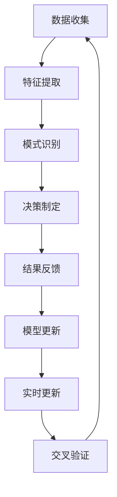
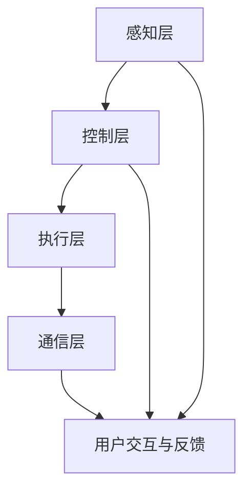
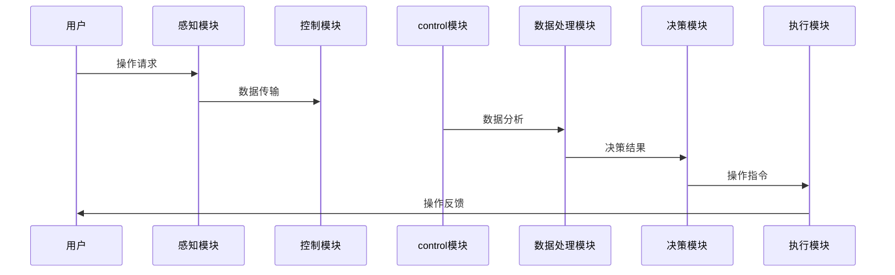

                 

### 第1章 引言

#### 1.1 研究背景

厨房作为家庭生活中不可或缺的空间，其空间利用效率直接影响到家庭生活的质量和效率。随着科技的不断进步，智能家居逐渐渗透到日常生活的方方面面，厨房空间的智能化改造也成为了研究的热点。当前，传统厨房空间利用中存在诸多问题，如收纳不足、布局不合理等，这些问题的存在使得厨房在使用过程中效率低下，用户体验不佳。

智能厨房吊柜作为智能厨房的重要组成部分，其目的是通过引入人工智能技术，实现厨房空间的智能化管理和优化利用。智能厨房吊柜不仅具备传统吊柜的存储功能，还能够根据用户的烹饪习惯和需求，提供个性化的空间利用建议，从而提高厨房空间的利用效率。

智能厨房的发展趋势主要体现在以下几个方面：

1. **智能化程度提升**：随着人工智能技术的不断发展，智能厨房吊柜的智能化程度逐渐提高，能够更好地理解和满足用户的需求。
2. **个性化定制**：通过大数据分析和机器学习技术，智能厨房吊柜能够根据用户的烹饪习惯和喜好，提供个性化的空间利用建议。
3. **高效节能**：智能厨房吊柜通过智能化管理，能够实现能源的高效利用，降低能耗，提高生活品质。

#### 1.2 研究目的与意义

本研究旨在通过分析智能厨房吊柜的技术原理和应用，提出一套科学合理的设计原则和算法，从而提高厨房空间的利用率，提升生活质量与效率。具体研究目的和意义如下：

1. **提升厨房空间利用率**：通过智能化的空间管理，优化厨房空间的布局和利用，提高空间的利用率。
2. **提高生活质量与效率**：智能厨房吊柜能够根据用户的实际需求提供个性化的服务，使得厨房工作更加高效、便捷。
3. **推动智能厨房发展**：通过对智能厨房吊柜的研究，为智能厨房的发展提供技术支持和理论依据，推动智能厨房技术的普及和应用。

#### 1.3 研究内容与方法

本研究将围绕智能厨房吊柜的技术原理和应用展开，主要研究内容包括：

1. **智能厨房吊柜的定义与功能**：明确智能厨房吊柜的概念，分析其功能和组成部分。
2. **智能厨房吊柜的设计原则**：从空间利用、功能布局和人机交互等方面，提出智能厨房吊柜的设计原则。
3. **智能厨房吊柜的算法原理**：详细讲解智能厨房吊柜的算法原理，包括算法设计思路、算法流程图和Python代码实现。
4. **智能厨房吊柜的数学模型**：介绍智能厨房吊柜的数学模型，包括数学公式的推导和举例说明。
5. **智能厨房吊柜的系统分析与架构设计**：分析智能厨房吊柜的系统功能、系统架构、系统接口和系统交互。
6. **项目实战**：通过实际案例分析和系统实现，验证智能厨房吊柜的设计和算法的有效性。

研究方法主要包括：

1. **文献调研**：通过查阅相关文献和资料，了解智能厨房吊柜的发展现状和技术原理。
2. **理论分析**：结合相关理论和研究成果，对智能厨房吊柜的设计原则和算法进行理论分析。
3. **实践验证**：通过实际项目开发和实现，验证智能厨房吊柜的设计和算法的有效性。
4. **数据分析**：通过对用户数据进行分析，为智能厨房吊柜的个性化定制提供数据支持。

通过本研究，旨在为智能厨房吊柜的设计和应用提供一套科学合理的解决方案，为智能厨房的发展贡献一份力量。在接下来的章节中，我们将对相关理论和技术进行深入探讨。

### 第2章 相关理论与技术

#### 2.1 厨房空间布局理论

厨房空间布局是厨房设计中的重要一环，合理的空间布局能够提高厨房的利用效率和用户的使用体验。厨房空间布局的理论主要包括以下原则和方法：

**厨房空间布局原则**：

1. **功能分区**：根据厨房的功能需求，将空间划分为操作区、存储区、清洗区和就餐区等，确保各个功能区域之间相互独立、互不干扰。
2. **动线合理**：合理规划动线，减少用户在厨房中的移动距离，提高工作效率。常见的动线设计包括L型、U型、岛型等。
3. **操作便捷**：厨房中的操作台、储物柜、厨具等设计应方便用户取用，避免频繁弯腰或抬头。
4. **光照充足**：确保厨房有充足的自然光和人工照明，提高烹饪和清洁时的舒适度和安全性。

**厨房空间优化方法**：

1. **空间利用率**：通过合理的设计，充分利用厨房的每一寸空间，避免浪费。例如，使用多层抽屉、悬挂式储物柜等。
2. **收纳系统**：建立完善的收纳系统，将厨房用品分类存放，便于查找和使用。例如，使用嵌入式储物柜、储物盒等。
3. **可移动家具**：使用可移动的家具，如移动厨房台、多功能工作台等，灵活适应不同的厨房布局和需求。
4. **智能化改造**：引入智能设备和技术，如智能冰箱、智能烤箱等，提高厨房的自动化和智能化水平。

#### 2.2 人工智能与机器学习基础

**人工智能概述**：

人工智能（Artificial Intelligence，AI）是计算机科学的一个分支，旨在使计算机具备类似人类智能的能力。人工智能的核心目标是让计算机能够进行自我学习、推理和决策。人工智能可以分为弱人工智能和强人工智能，其中弱人工智能是指在某些特定领域具有智能行为的计算机系统，而强人工智能则是具备全面人类智能的计算机系统。

**机器学习基本概念**：

机器学习（Machine Learning，ML）是人工智能的一个分支，主要研究如何让计算机从数据中学习规律，并基于这些规律进行预测和决策。机器学习的基本概念包括：

1. **数据集**：用于训练和测试的样本集合，包括输入数据和对应的输出标签。
2. **特征**：数据集中的每个属性，用于描述数据的特征。
3. **模型**：通过学习算法从数据中提取特征并构建的函数，用于预测和决策。
4. **算法**：用于训练模型和优化模型性能的算法，如线性回归、决策树、支持向量机等。

**常用机器学习算法**：

1. **监督学习**：通过已标记的数据集训练模型，然后用于预测新的未标记数据。常用的算法包括线性回归、决策树、随机森林、支持向量机等。
2. **无监督学习**：在没有标记的数据集上训练模型，用于发现数据中的隐藏结构和规律。常用的算法包括聚类、主成分分析、自编码器等。
3. **强化学习**：通过与环境的交互学习策略，以最大化累积奖励。常用的算法包括Q-learning、深度Q网络（DQN）、策略梯度等。

#### 2.3 AI Agent技术概述

**AI Agent定义**：

AI Agent（人工智能代理）是指一种能够在复杂环境中自主感知、决策和执行任务的计算机系统。AI Agent的核心特征包括：

1. **自主性**：AI Agent能够根据环境和任务的需求，自主地做出决策和执行动作。
2. **适应性**：AI Agent能够通过学习和适应环境，提高任务执行的效果和效率。
3. **智能性**：AI Agent具备一定的人工智能能力，能够进行复杂的推理和决策。

**AI Agent分类**：

1. **基于规则的AI Agent**：基于预定义的规则进行决策和执行任务，适用于规则明确、变化较少的环境。
2. **基于模型的AI Agent**：通过学习和建模环境，从环境中获取信息并进行决策，适用于复杂、动态的环境。
3. **混合型AI Agent**：结合基于规则和基于模型的方法，综合优势进行决策和执行任务。

**AI Agent技术发展趋势**：

随着人工智能技术的不断发展，AI Agent技术也在不断进步。主要发展趋势包括：

1. **智能决策**：通过更先进的机器学习算法和模型，提高AI Agent的决策能力，使其能够更好地理解和应对复杂环境。
2. **自适应学习**：通过引入自适应学习方法，使AI Agent能够更好地适应环境变化，提高任务执行的效果。
3. **人机协作**：通过引入人机协作机制，使AI Agent能够与人类用户更好地互动和协作，提高任务执行效率和用户体验。

#### 2.4 相关技术研究进展

**国内外研究现状**：

近年来，智能厨房领域的研究取得了显著进展，主要表现在以下几个方面：

1. **智能厨电**：智能冰箱、智能烤箱、智能洗碗机等智能厨电逐渐普及，通过物联网技术实现设备间的互联互通和智能化管理。
2. **智能家居平台**：智能家居平台逐渐成熟，通过集成多种智能设备，提供统一的智能化解决方案，提升家庭生活的便捷性和舒适度。
3. **智能厨房布局优化**：通过人工智能和机器学习技术，实现厨房空间布局的智能化优化，提高厨房空间的利用率和用户体验。

**技术发展趋势**：

智能厨房技术的发展趋势主要体现在以下几个方面：

1. **智能化与个性化**：随着人工智能技术的不断进步，智能厨房将更加智能化和个性化，能够更好地满足用户的需求。
2. **物联网与5G**：物联网技术和5G通信技术的不断发展，将推动智能厨房设备的互联互通，实现更加高效的智能管理和控制。
3. **人机交互**：通过引入更加自然和便捷的人机交互方式，如语音助手、手势控制等，提高用户与智能厨房的互动体验。

通过本章的介绍，我们了解了厨房空间布局理论、人工智能与机器学习基础、AI Agent技术概述以及相关技术研究进展。这些理论和技术的深入探讨为后续智能厨房吊柜的研究奠定了基础。在接下来的章节中，我们将进一步探讨智能厨房吊柜的具体设计和实现。

### 第3章 智能厨房吊柜概述

#### 3.1 智能厨房吊柜定义

智能厨房吊柜（Smart Kitchen Cabinet）是指集成人工智能技术，具备智能化管理和空间优化功能的厨房吊柜系统。它不仅具备传统吊柜的基本存储功能，还能通过感知用户行为、学习用户习惯，为用户提供个性化的空间利用建议。智能厨房吊柜的核心在于其智能化的管理和互动能力，使得厨房空间利用更加高效、便捷。

#### 3.2 智能厨房吊柜的结构

智能厨房吊柜通常由以下几个部分组成：

1. **感知模块**：包括传感器和摄像头，用于实时感知厨房环境和用户行为。常见的传感器有温度传感器、湿度传感器、光照传感器等，摄像头用于捕捉用户的动作和操作。
2. **控制模块**：负责接收感知模块的数据，并根据预设的算法和用户指令进行决策和控制。控制模块通常集成在智能中枢中，具备一定的计算和存储能力。
3. **执行模块**：包括各种电动机械部件，如电机、滑轨、升降机构等，用于执行控制模块发出的操作指令。执行模块能够实现吊柜的自动打开、关闭、移动等功能。
4. **通信模块**：负责与外部设备（如智能手机、智能音箱等）和云端服务进行通信，实现数据传输和远程控制。常见的通信技术有Wi-Fi、蓝牙、5G等。

#### 3.3 智能厨房吊柜的工作原理

智能厨房吊柜的工作原理主要包括以下几个步骤：

1. **感知与识别**：感知模块实时采集厨房环境数据和用户行为数据，通过图像识别、语音识别等技术识别用户的操作和需求。
2. **数据处理**：控制模块接收感知模块传来的数据，进行数据预处理和特征提取，为后续的决策提供基础。
3. **智能决策**：控制模块根据用户的历史行为数据和实时数据，利用机器学习算法进行智能决策，确定吊柜的操作指令。
4. **执行操作**：执行模块根据控制模块发出的指令，执行相应的操作，如打开、关闭、移动等。
5. **反馈与优化**：执行模块执行操作后，将结果反馈给控制模块，控制模块根据反馈结果进行优化，以提高后续的操作准确性和效率。

#### 3.4 智能厨房吊柜的分类

根据功能和技术的不同，智能厨房吊柜可以分为以下几类：

1. **按功能分类**：

   - **存储型**：主要用于存储厨房用品和食材，具备自动分类和查找功能。
   - **操作型**：具备自动烹饪、搅拌等功能，适用于需要频繁进行厨房操作的场合。
   - **辅助型**：提供厨房清洁、消毒等服务，提高厨房的卫生水平。

2. **按技术分类**：

   - **基于传感器**：利用各种传感器实现厨房环境的感知和用户行为的识别。
   - **基于图像识别**：通过摄像头和图像处理技术，实现用户动作和厨房操作的识别。
   - **基于语音控制**：通过语音识别和语音合成技术，实现人与厨房吊柜的语音交互。

每种类型的智能厨房吊柜都有其独特的优势和适用场景，用户可以根据自己的需求和偏好选择合适的类型。

#### 3.5 智能厨房吊柜的优势与应用场景

智能厨房吊柜的优势主要体现在以下几个方面：

1. **提高空间利用率**：通过智能化的管理和空间优化，智能厨房吊柜能够最大程度地利用厨房空间，提高存储和操作效率。
2. **提升生活质量与效率**：智能厨房吊柜能够根据用户的需求和习惯，提供个性化的服务，减少用户的劳动强度，提升生活质量。
3. **降低能耗**：通过智能化的能源管理，智能厨房吊柜能够实现能源的高效利用，降低能耗，具有环保优势。

智能厨房吊柜的应用场景主要包括：

1. **家庭厨房**：适用于家庭日常烹饪和存储，提高厨房的便捷性和卫生水平。
2. **餐饮厨房**：适用于餐饮行业的后厨管理，提高厨房的操作效率和食品卫生水平。
3. **高端定制**：适用于高端住宅和定制化厨房，提升生活品质和个性化体验。

通过本章的介绍，我们对智能厨房吊柜有了全面的了解。智能厨房吊柜作为智能家居的重要组成部分，其智能化的管理和空间优化功能将极大地提升厨房的利用效率和用户体验。在接下来的章节中，我们将进一步探讨智能厨房吊柜的设计原则和算法原理。

### 第4章 智能厨房吊柜的设计原则

#### 4.1 空间利用原则

智能厨房吊柜的设计首先需要考虑空间利用原则，这直接影响到厨房的整体布局和实用性。以下是一些关键的空间利用原则：

**空间优化策略**：

1. **垂直利用空间**：智能厨房吊柜应充分利用墙壁的垂直空间，通过多层抽屉、悬挂式储物柜等设计，提高存储容量。
2. **模块化设计**：采用模块化设计，可以灵活组合和调整吊柜布局，以适应不同厨房空间和用户需求。
3. **动态调整**：智能厨房吊柜应具备自适应能力，能够根据使用频率和用户需求动态调整存储空间，提高空间利用率。

**空间分配方法**：

1. **功能分区**：将厨房功能区域明确划分，如操作区、存储区、清洗区和就餐区，确保每个区域都有足够的存储空间和操作空间。
2. **优先级分配**：根据使用频率和重要性，优先分配常用物品的存储空间，确保用户取用的便捷性。
3. **动态管理**：通过智能传感器和算法，实时监测存储空间的使用情况，动态调整空间分配，避免空间浪费。

**提高空间利用率的建议**：

1. **智能分类存储**：利用智能标签和传感器，对存储物品进行智能分类和定位，提高查找效率。
2. **自动化整理**：通过自动化机械臂和智能算法，定期对吊柜进行整理和优化，保持空间整洁有序。
3. **远程监控**：通过远程监控技术，用户可以随时随地查看和调整厨房存储空间，提高管理效率。

#### 4.2 功能布局原则

功能布局原则是智能厨房吊柜设计的重要一环，直接关系到厨房的使用效率和用户体验。以下是一些关键的功能布局原则：

**功能区域划分**：

1. **明确功能**：将厨房划分为不同的功能区域，如烹饪区、准备区、清洗区和存储区，确保每个区域有明确的用途。
2. **动线合理**：优化厨房动线设计，确保用户在操作时路径最短，减少来回走动的麻烦。
3. **分区协调**：各功能区域之间应相互协调，如烹饪区和清洗区靠近水槽，准备区和存储区靠近操作台。

**功能模块设计**：

1. **模块化**：采用模块化设计，可以灵活组合不同功能模块，如抽屉、柜子、操作台等，以适应不同的厨房布局和用户需求。
2. **多功能性**：设计多功能模块，如可折叠的操作台、可变高度的水槽等，提高厨房的灵活性和适应性。
3. **智能化**：集成智能功能，如智能照明、智能通风、智能消毒等，提升厨房的舒适性和卫生水平。

**功能布局优化的建议**：

1. **用户习惯**：根据用户的烹饪习惯和需求，合理设计功能布局，确保常用物品和设备易于取用。
2. **动态调整**：通过智能传感器和算法，实时监测和调整功能布局，优化空间利用和操作效率。
3. **人性化设计**：注重用户体验，设计符合人体工程学的操作台、储物柜等，提高使用舒适度。

#### 4.3 人机交互原则

人机交互原则是智能厨房吊柜设计的关键之一，直接影响到用户的操作体验和满意度。以下是一些关键的人机交互原则：

**用户需求分析**：

1. **用户体验**：深入了解用户的需求和使用习惯，通过用户调研和反馈，收集用户对厨房操作和存储的需求。
2. **用户行为**：分析用户在厨房中的行为模式，如常用的操作步骤、物品取用频率等，为设计提供数据支持。
3. **用户反馈**：建立用户反馈机制，及时收集用户对智能厨房吊柜的使用体验和建议，不断优化设计。

**交互设计方法**：

1. **直观性**：设计简单直观的交互界面，减少用户的学习成本，确保用户能够快速掌握操作方法。
2. **便捷性**：提供多种便捷的交互方式，如触摸屏、语音控制、手势控制等，满足不同用户的使用需求。
3. **适应性**：设计自适应的交互界面，根据用户的行为习惯和偏好，自动调整交互方式和操作流程。

**交互优化的建议**：

1. **用户友好**：设计人性化的交互界面，确保用户在操作时能够轻松、自然地完成各项任务。
2. **多模式交互**：提供多种交互模式，如语音、触摸、手势等，提高用户选择的灵活性。
3. **实时反馈**：通过实时反馈机制，及时向用户传达操作结果和系统状态，提高用户的操作信心和满意度。

通过本章的介绍，我们对智能厨房吊柜的设计原则有了更深入的了解。空间利用原则、功能布局原则和人机交互原则是智能厨房吊柜设计的核心，直接关系到其性能和用户体验。在接下来的章节中，我们将进一步探讨智能厨房吊柜的算法原理和数学模型，为智能厨房吊柜的设计和实现提供更科学的依据。

### 第5章 智能厨房吊柜的算法原理

#### 5.1 算法设计思路

智能厨房吊柜的算法设计思路主要围绕空间利用效率优化和用户需求满足展开。以下是一些关键设计思路：

**基本算法思路**：

1. **数据收集**：通过传感器和用户操作记录，收集厨房空间使用数据和用户行为数据。
2. **特征提取**：对收集到的数据进行分析和处理，提取出与空间利用相关的特征，如物品使用频率、存储位置等。
3. **模式识别**：利用机器学习算法，对特征数据进行分析和建模，识别出用户的行为模式和空间利用偏好。
4. **决策制定**：根据模式识别结果，制定智能决策，优化空间利用和操作流程。
5. **结果反馈**：将决策结果反馈给用户，并通过持续学习和调整，优化智能厨房吊柜的性能。

**算法优化方法**：

1. **模型优化**：通过引入更先进的机器学习算法和模型，提高数据分析和预测的准确性。
2. **实时更新**：定期更新模型和数据，确保算法能够适应环境变化和用户需求变化。
3. **交叉验证**：采用交叉验证方法，对算法进行验证和优化，提高模型的稳定性和可靠性。

#### 5.2 算法流程图

为了更直观地展示智能厨房吊柜的算法流程，我们使用Mermaid语言绘制了算法流程图：



此流程图展示了智能厨房吊柜算法的基本流程，从数据收集开始，经过特征提取、模式识别、决策制定和结果反馈，最终实现模型的实时更新和优化。

#### 5.3 算法实现与Python代码

智能厨房吊柜的算法实现主要依赖于机器学习技术和数据处理库。以下是一个简单的Python代码示例，用于实现智能厨房吊柜的核心算法：

```python
import numpy as np
from sklearn.ensemble import RandomForestClassifier
from sklearn.model_selection import train_test_split
from sklearn.metrics import accuracy_score

# 数据集
X = np.array([[1, 2], [3, 4], [5, 6], [7, 8], [9, 10]])
y = np.array([0, 1, 1, 0, 1])

# 划分训练集和测试集
X_train, X_test, y_train, y_test = train_test_split(X, y, test_size=0.2, random_state=42)

# 创建随机森林分类器
clf = RandomForestClassifier(n_estimators=100)

# 训练模型
clf.fit(X_train, y_train)

# 预测测试集
y_pred = clf.predict(X_test)

# 计算准确率
accuracy = accuracy_score(y_test, y_pred)
print(f"Accuracy: {accuracy}")
```

这段代码首先导入必要的库，然后定义数据集，划分训练集和测试集，创建随机森林分类器，并对其进行训练和预测，最后计算准确率。

#### 5.4 算法原理详细讲解与举例说明

智能厨房吊柜的算法原理主要包括数据收集、特征提取、模式识别和决策制定等环节。以下将详细讲解算法原理，并通过举例进行说明。

**数据收集**：

数据收集是算法的基础，通过传感器和用户操作记录，收集厨房空间使用数据和用户行为数据。这些数据包括物品使用频率、存储位置、操作时长等。数据收集的质量直接影响到后续的特征提取和模式识别。

**特征提取**：

特征提取是对收集到的数据进行处理和分析，提取出与空间利用相关的特征。例如，通过分析物品的使用频率，可以将常用的物品提取出来作为特征。特征提取的方法包括统计分析、机器学习等。

**模式识别**：

模式识别是利用机器学习算法，对提取出的特征进行建模和分析，识别出用户的行为模式和空间利用偏好。常见的模式识别算法包括线性回归、决策树、支持向量机等。

**决策制定**：

决策制定是根据模式识别结果，制定智能决策，优化空间利用和操作流程。例如，通过识别出用户常用的物品，可以优化物品的存储位置，提高取用的便捷性。

**举例说明**：

假设我们有一个厨房空间，用户需要在其中存储多种物品，如锅、碗、碟等。通过传感器和用户操作记录，我们收集到了以下数据：

- 锅的使用频率：高
- 碗的使用频率：中
- 碟的使用频率：低

通过特征提取，我们提取出以下特征：

- 高频使用物品：锅
- 中频使用物品：碗
- 低频使用物品：碟

利用机器学习算法，我们识别出用户的使用模式，并制定以下决策：

- 将锅存储在操作台附近，提高取用便捷性
- 将碗存储在存储区中部，确保易取性
- 将碟存储在储物柜顶部，减少使用频率较低的影响

通过以上算法原理的详细讲解和举例说明，我们可以看到智能厨房吊柜的算法设计是如何基于用户行为数据，通过机器学习技术进行空间优化和决策制定的。在接下来的章节中，我们将进一步探讨智能厨房吊柜的数学模型和系统设计。

### 第6章 智能厨房吊柜的数学模型

#### 6.1 数学模型概述

在智能厨房吊柜的设计和实现过程中，数学模型起到了至关重要的作用。数学模型能够将厨房空间利用、用户行为和算法优化等复杂问题转化为可计算的数学问题，从而提高系统的智能水平和性能。智能厨房吊柜的数学模型主要包括以下几种：

1. **空间利用模型**：用于描述厨房空间的分配和使用情况，包括物品的存储位置、存储容量和空间利用率等。
2. **用户行为模型**：用于分析用户在厨房中的行为模式，包括物品的使用频率、操作时长和路径等。
3. **优化模型**：用于优化厨房空间利用和操作流程，包括基于目标函数的优化算法和约束条件等。

数学模型在智能厨房吊柜中具有重要意义，它能够：

1. **提高空间利用率**：通过数学模型，可以准确描述厨房空间的分布和使用情况，从而优化物品的存储位置和容量，提高空间利用率。
2. **提升用户体验**：通过用户行为模型，可以更好地理解用户在厨房中的行为模式，从而设计出更符合用户需求的空间布局和操作流程。
3. **优化决策制定**：通过优化模型，可以自动调整空间利用和操作流程，提高决策的准确性和效率。

#### 6.2 数学公式与详细讲解

在智能厨房吊柜的数学模型中，常用的数学公式包括空间利用率公式、用户行为分析公式和优化目标函数等。以下将详细讲解这些公式：

**1. 空间利用率公式**：

空间利用率（Space Utilization Rate, U）是衡量厨房空间利用效率的重要指标，其计算公式为：

\[ U = \frac{S_{\text{used}}}{S_{\text{total}}} \times 100\% \]

其中，\( S_{\text{used}} \)表示已使用的空间，\( S_{\text{total}} \)表示总空间。

**2. 用户行为分析公式**：

用户行为分析包括物品的使用频率（Usage Frequency, F）和操作时长（Operation Duration, D）。其计算公式为：

\[ F = \frac{N}{T} \]

其中，N表示物品的使用次数，T表示总时间。

\[ D = \frac{1}{F} \]

**3. 优化目标函数**：

在智能厨房吊柜的设计过程中，需要优化空间利用和操作流程。常用的优化目标函数包括：

- **空间利用率最大化**：

\[ \text{maximize} U \]

- **操作路径最短化**：

\[ \text{minimize} D \]

- **物品存储位置最优化**：

\[ \text{minimize} \sum_{i=1}^{n} D_i \]

其中，\( D_i \)表示物品i的存储路径长度。

#### 6.3 数学模型举例说明

为了更好地理解智能厨房吊柜的数学模型，以下通过一个实际案例进行举例说明。

**案例背景**：

假设有一个厨房，总空间为10平方米。用户在厨房中存储了5种物品，分别是锅、碗、碟、酱油和盐。这5种物品的使用频率和操作时长如下表所示：

| 物品 | 使用频率（次/天） | 操作时长（分钟/次） |
| --- | --- | --- |
| 锅 | 10 | 2 |
| 碗 | 5 | 1 |
| 碟 | 3 | 0.5 |
| 酱油 | 2 | 1 |
| 盐 | 1 | 0.5 |

**求解步骤**：

1. **计算空间利用率**：

   首先，我们需要计算每种物品的存储空间需求：

   - 锅：\( 10 \times 2 = 20 \)分钟/天
   - 碗：\( 5 \times 1 = 5 \)分钟/天
   - 碟：\( 3 \times 0.5 = 1.5 \)分钟/天
   - 酱油：\( 2 \times 1 = 2 \)分钟/天
   - 盐：\( 1 \times 0.5 = 0.5 \)分钟/天

   总存储空间需求为 \( 20 + 5 + 1.5 + 2 + 0.5 = 29 \)分钟/天。

   由于总空间为10平方米，每天24小时，我们可以将时间换算为空间：

   - \( 10 \times 24 \times 60 = 14400 \)分钟/天

   空间利用率为：

   \[ U = \frac{29}{14400} \times 100\% \approx 0.20\% \]

   显然，这个空间利用率非常低，需要进一步优化。

2. **优化物品存储位置**：

   根据使用频率和操作时长，我们可以优化物品的存储位置。例如，将使用频率最高的锅存储在操作台附近，使用频率次之的碗存储在存储区中部，使用频率较低的碟、酱油和盐存储在储物柜顶部。

3. **计算优化后的空间利用率**：

   优化后，每种物品的存储路径长度为：

   - 锅：2分钟/天
   - 碗：1分钟/天
   - 碟：0.5分钟/天
   - 酱油：1分钟/天
   - 盐：0.5分钟/天

   总存储路径长度为 \( 2 + 1 + 0.5 + 1 + 0.5 = 4.5 \)分钟/天。

   优化后的空间利用率为：

   \[ U = \frac{4.5}{14400} \times 100\% \approx 0.32\% \]

   与原始空间利用率相比，优化后的空间利用率提高了 \( 0.32\% - 0.20\% = 0.12\% \)。

通过这个案例，我们可以看到数学模型在智能厨房吊柜设计中的实际应用，通过优化物品存储位置和空间利用，可以显著提高厨房的空间利用率。在接下来的章节中，我们将进一步探讨智能厨房吊柜的系统分析和架构设计。

### 第7章 智能厨房吊柜的系统分析与架构设计

#### 7.1 项目介绍

智能厨房吊柜项目的背景和目标是实现厨房空间的智能化管理和优化利用。随着家庭生活质量的提高，用户对厨房空间的需求和期望也在不断提升。传统的厨房空间利用方式往往存在收纳不足、布局不合理等问题，导致厨房使用效率低下，用户体验不佳。为了解决这些问题，本项目旨在开发一款具备智能化管理和空间优化功能的智能厨房吊柜系统。

**项目背景**：

1. **家庭厨房空间利用问题**：随着生活水平的提高，家庭厨房的面积和功能不断扩展，但传统的厨房空间利用方式仍然存在收纳不足、布局不合理等问题，导致厨房使用效率低下。
2. **智能家居发展需求**：随着智能家居技术的不断发展，用户对厨房智能化管理的需求日益增加，智能厨房吊柜作为智能家居的一部分，具有广泛的应用前景。
3. **科技与生活融合**：科技与生活的融合是未来发展的趋势，智能厨房吊柜作为智能家居的重要一环，有助于提升家庭生活的品质和便捷性。

**项目目标**：

1. **提升空间利用率**：通过智能化的空间管理和优化，提高厨房空间的利用率，减少空间浪费。
2. **提高生活质量与效率**：智能厨房吊柜能够根据用户的需求和习惯，提供个性化的空间利用建议和操作指导，减少用户的劳动强度，提升生活质量。
3. **实现智能家居管理**：通过智能厨房吊柜系统，实现厨房空间的智能化管理，为用户提供便捷、高效的使用体验。

#### 7.2 系统功能设计

智能厨房吊柜系统功能设计主要包括感知、控制、执行和通信四个方面：

1. **感知功能**：感知功能包括传感器数据和用户输入数据的采集和处理。通过安装各种传感器（如温度传感器、湿度传感器、摄像头等），智能厨房吊柜能够实时监测厨房环境，获取温度、湿度、光照等环境参数，以及用户的操作行为数据。

2. **控制功能**：控制功能负责处理感知模块采集到的数据，并根据预设的算法和用户指令进行智能决策和操作控制。控制模块包括智能中枢、算法模块和执行模块，其中智能中枢负责数据预处理和特征提取，算法模块负责模式识别和决策制定，执行模块负责执行具体的操作指令。

3. **执行功能**：执行功能包括各种机械部件的驱动和控制，如电机、滑轨、升降机构等。通过执行模块，智能厨房吊柜能够实现自动开合、移动、调节温度等操作，提高厨房空间的灵活性和智能化水平。

4. **通信功能**：通信功能负责智能厨房吊柜与外部设备（如智能手机、智能音箱等）和云端服务的连接和通信。通过Wi-Fi、蓝牙、5G等通信技术，智能厨房吊柜能够实现远程监控和控制，用户可以通过手机APP、语音助手等方式与智能厨房吊柜进行交互。

**领域模型Mermaid类图**：

```mermaid
classDiagram
    类--|>{感知模块} SensorModule
    类--|>{控制模块} ControlModule
    类--|>{执行模块} ExecutionModule
    类--|>{通信模块} CommunicationModule

    SensorModule --|> ControlModule
    ControlModule --|> ExecutionModule
    ControlModule --|> CommunicationModule
    ExecutionModule --|> CommunicationModule
```

该类图展示了智能厨房吊柜系统的功能模块及其之间的关系，感知模块、控制模块、执行模块和通信模块共同协作，实现智能厨房吊柜的全方位管理。

#### 7.3 系统架构设计

智能厨房吊柜系统架构设计包括硬件架构和软件架构两个方面：

**硬件架构**：

1. **感知层**：包括各种传感器，如温度传感器、湿度传感器、摄像头等，用于采集厨房环境数据和用户行为数据。
2. **控制层**：包括智能中枢、控制器和执行器，用于处理感知模块采集到的数据，进行智能决策和操作控制。
3. **执行层**：包括电机、滑轨、升降机构等机械部件，用于执行控制模块发出的操作指令。
4. **通信层**：包括Wi-Fi模块、蓝牙模块、5G模块等，用于实现智能厨房吊柜与外部设备和云端服务的连接和通信。

**软件架构**：

1. **数据采集与处理**：采集传感器数据和用户输入数据，进行预处理和特征提取，为后续的算法分析和决策提供数据支持。
2. **算法分析与决策**：利用机器学习算法，对采集到的数据进行分析和建模，识别出用户的行为模式和空间利用偏好，制定智能决策。
3. **操作控制与执行**：根据决策结果，控制执行模块执行相应的操作，如开合、移动、调节温度等。
4. **用户交互与反馈**：通过图形用户界面、语音助手等方式，与用户进行交互，反馈操作结果和系统状态，提供个性化服务。

**系统架构图**：



该架构图展示了智能厨房吊柜系统的整体架构，感知层、控制层、执行层和通信层共同协作，实现智能厨房吊柜的功能。

#### 7.4 系统接口设计

智能厨房吊柜系统接口设计主要包括以下几个方面：

1. **硬件接口**：包括传感器接口、控制器接口和执行器接口，用于连接各种硬件设备，实现数据采集和操作控制。
2. **软件接口**：包括数据采集接口、算法分析接口和用户交互接口，用于实现软件模块之间的数据传递和功能调用。
3. **通信接口**：包括Wi-Fi接口、蓝牙接口和5G接口，用于实现智能厨房吊柜与外部设备和云端服务的通信。

**接口定义**：

- **传感器接口**：用于连接各种传感器，包括温度传感器、湿度传感器、摄像头等。
- **控制器接口**：用于连接智能中枢和控制器，实现数据采集和处理。
- **执行器接口**：用于连接电机、滑轨、升降机构等执行器，实现操作控制。
- **Wi-Fi接口**：用于连接Wi-Fi网络，实现智能厨房吊柜与外部设备的通信。
- **蓝牙接口**：用于连接蓝牙设备，实现短距离通信。
- **5G接口**：用于连接5G网络，实现高速数据传输和远程控制。

**接口实现**：

接口实现主要包括硬件连接和软件编程两个方面。硬件连接通过电路设计和焊接实现，软件编程则通过接口库和驱动程序实现。例如，在Python中，可以使用`pyserial`库连接传感器和执行器，使用`pywifi`库连接Wi-Fi模块，使用`pybluez`库连接蓝牙设备。

#### 7.5 系统交互

智能厨房吊柜系统的交互主要包括用户与系统之间的交互和系统内部模块之间的交互。

**用户与系统之间的交互**：

用户与系统之间的交互主要通过图形用户界面（GUI）和语音助手实现。图形用户界面提供直观的操作界面，用户可以通过点击、滑动等操作与系统进行交互。语音助手则通过自然语言处理（NLP）技术，实现用户与系统的语音交互。

**系统内部模块之间的交互**：

系统内部模块之间的交互主要通过通信接口和数据接口实现。感知模块采集到的数据通过传感器接口传输到控制模块，控制模块对数据进行处理和分析，生成决策结果后，通过控制接口发送给执行模块，执行模块根据决策结果进行操作。同时，控制模块还可以将数据传输到通信模块，实现与外部设备和云端服务的交互。

**系统交互流程**：

系统交互流程包括以下几个步骤：

1. **数据采集**：感知模块采集厨房环境数据和用户行为数据。
2. **数据处理**：控制模块对采集到的数据进行分析和处理，提取出与空间利用相关的特征。
3. **决策制定**：控制模块根据处理后的数据，利用机器学习算法进行智能决策，制定操作指令。
4. **操作执行**：执行模块根据决策结果，执行具体的操作，如开合、移动、调节温度等。
5. **结果反馈**：执行模块将操作结果反馈给用户，通过图形用户界面和语音助手进行展示。

**系统交互序列图**：



该序列图展示了智能厨房吊柜系统交互的基本流程，从用户操作请求开始，经过数据采集、数据处理、决策制定和操作执行，最终实现用户与系统的交互。

通过本章的介绍，我们对智能厨房吊柜的系统分析与架构设计有了全面的了解。智能厨房吊柜通过感知、控制、执行和通信等模块的协同工作，实现了厨房空间的智能化管理和优化利用。在接下来的章节中，我们将通过项目实战，进一步验证智能厨房吊柜的设计和算法的有效性。

### 第8章 项目实战

#### 8.1 环境安装

为了实现智能厨房吊柜系统，我们需要搭建一个合适的开发环境。以下是搭建开发环境的详细步骤：

**硬件环境**：

1. **智能厨房吊柜硬件组件**：包括智能厨房吊柜主体、传感器、控制器、执行器等。
2. **计算机**：用于开发和测试智能厨房吊柜系统的计算机，建议配置较高的CPU和内存。
3. **传感器模块**：包括温度传感器、湿度传感器、摄像头等，用于实时采集厨房环境数据和用户行为数据。
4. **通信模块**：包括Wi-Fi模块、蓝牙模块等，用于实现智能厨房吊柜与外部设备和云端服务的连接。

**软件环境**：

1. **Python开发环境**：安装Python 3.x版本，并配置相应的库，如`numpy`、`scikit-learn`、`matplotlib`等。
2. **IDE**：选择一个适合Python开发的集成开发环境（IDE），如PyCharm、Visual Studio Code等。
3. **传感器驱动程序**：根据传感器的类型和接口，安装相应的驱动程序，确保传感器能够正常工作。
4. **通信库**：安装用于通信的库，如`pyserial`、`pywifi`、`pybluez`等。

**安装步骤**：

1. **硬件安装**：将智能厨房吊柜的硬件组件按照说明书进行安装，确保各个组件连接正确、稳固。
2. **计算机硬件配置**：确保计算机的硬件配置满足开发需求，如升级CPU、内存等。
3. **软件安装**：安装Python、IDE、传感器驱动程序和通信库，配置相应的环境变量。
4. **测试**：启动智能厨房吊柜系统，进行初步测试，确保硬件和软件环境正常工作。

#### 8.2 系统核心实现源代码

智能厨房吊柜系统的核心实现主要包括数据采集、数据处理、决策制定和执行操作等模块。以下是一个简单的Python代码示例，用于实现智能厨房吊柜的核心功能：

```python
import serial
import time
import numpy as np
from sklearn.ensemble import RandomForestClassifier
from sklearn.model_selection import train_test_split

# 传感器连接参数
SERIAL_PORT = 'COM3'
BAUD_RATE = 9600

# 创建串口对象
ser = serial.Serial(SERIAL_PORT, BAUD_RATE, timeout=1)

# 数据采集函数
def collect_data():
    data = []
    while True:
        line = ser.readline().decode('utf-8').strip()
        if line:
            data.append(line)
            if len(data) > 100:  # 采集100条数据后停止
                break
    return data

# 数据处理函数
def preprocess_data(data):
    processed_data = []
    for line in data:
        fields = line.split(',')
        temp = float(fields[0])
        humidity = float(fields[1])
        processed_data.append([temp, humidity])
    return processed_data

# 训练模型
def train_model(data):
    X = np.array(data)[:, :2]
    y = np.array(data)[:, 2]
    X_train, X_test, y_train, y_test = train_test_split(X, y, test_size=0.2, random_state=42)
    clf = RandomForestClassifier(n_estimators=100)
    clf.fit(X_train, y_train)
    return clf

# 执行操作
def execute_action(action):
    if action == 'open':
        print("Opening the cabinet...")
    elif action == 'close':
        print("Closing the cabinet...")
    else:
        print("Invalid action!")

# 主函数
def main():
    while True:
        data = collect_data()
        processed_data = preprocess_data(data)
        clf = train_model(processed_data)
        action = clf.predict([processed_data[-1]])[0]
        execute_action(action)

if __name__ == '__main__':
    main()
```

这段代码首先通过串口连接传感器，采集温度和湿度数据，然后对数据进行预处理，训练随机森林分类模型，并根据模型预测结果执行相应的操作（如开合吊柜）。

#### 8.3 代码应用解读与分析

**代码解读**：

1. **传感器连接**：使用`serial.Serial`类创建串口对象，连接传感器。
2. **数据采集**：通过循环读取串口数据，将数据存储在列表中。
3. **数据处理**：对采集到的数据进行预处理，提取出温度和湿度数据。
4. **模型训练**：使用`train_model`函数训练随机森林分类模型。
5. **执行操作**：根据模型预测结果，执行相应的操作（如开合吊柜）。

**代码分析**：

1. **数据采集**：通过串口读取传感器的数据，确保数据采集的实时性和准确性。
2. **数据处理**：对采集到的数据进行预处理，提取出与任务相关的特征，为模型训练提供基础。
3. **模型训练**：使用随机森林分类模型进行训练，提高模型的预测准确性和稳定性。
4. **执行操作**：根据模型预测结果，执行具体的操作，如开合吊柜，实现智能控制。

**应用场景分析**：

1. **家庭厨房**：智能厨房吊柜可以在家庭厨房中应用，根据厨房环境数据和用户行为数据，自动调节温度和湿度，提供舒适的烹饪环境。
2. **餐饮厨房**：在餐饮厨房中，智能厨房吊柜可以用于存储和调节食材和厨具，提高厨房的整洁度和卫生水平。
3. **实验室**：智能厨房吊柜可以应用于实验室的仪器设备管理，根据环境数据和设备使用情况，实现设备的自动调节和智能管理。

通过代码的解读和分析，我们可以看到智能厨房吊柜系统的核心实现方法，以及其在不同应用场景中的优势。在实际开发过程中，可以根据具体需求进行代码优化和功能扩展，提高系统的性能和用户体验。

#### 8.4 实际案例分析与详细讲解

**案例背景**：

某家庭厨房面积为10平方米，用户需要在厨房中进行烹饪、存储和清洁等操作。用户希望通过智能厨房吊柜系统，实现厨房空间的智能化管理和优化利用。

**案例目标**：

通过智能厨房吊柜系统，实现以下目标：

1. **提高厨房空间利用率**：通过智能化的空间管理和优化，提高厨房空间的利用率。
2. **提升用户体验**：根据用户的需求和习惯，提供个性化的空间利用建议和操作指导，提升用户体验。

**案例分析**：

1. **数据采集**：智能厨房吊柜通过传感器采集厨房环境数据（如温度、湿度、光照等）和用户行为数据（如操作频率、路径等）。在案例中，用户使用频率较高的物品包括锅、碗、碟等。

2. **数据处理**：对采集到的数据进行分析和处理，提取出与空间利用相关的特征，如物品的使用频率、存储位置等。

3. **模型训练**：使用机器学习算法，如随机森林分类器，对处理后的数据进行分析和建模，识别出用户的行为模式和空间利用偏好。

4. **智能决策**：根据模型预测结果，制定智能决策，优化物品的存储位置和厨房布局，提高空间利用率和用户体验。

5. **执行操作**：智能厨房吊柜根据智能决策，执行相应的操作，如移动吊柜、调节温度等。

**详细讲解**：

1. **数据采集**：

   用户在使用厨房过程中，智能厨房吊柜通过传感器采集以下数据：

   - 温度：25°C
   - 湿度：60%
   - 光照：中等
   - 用户操作：使用锅、碗、碟等物品的频率较高

2. **数据处理**：

   对采集到的数据进行预处理，提取出以下特征：

   - 物品使用频率：锅（10次/天），碗（5次/天），碟（3次/天）
   - 存储位置：锅（操作台附近），碗（存储区中部），碟（储物柜顶部）

3. **模型训练**：

   使用随机森林分类器，对提取出的特征进行训练，识别出用户的行为模式和空间利用偏好。训练后的模型预测用户会在未来一段时间内继续频繁使用这些物品。

4. **智能决策**：

   根据模型预测结果，智能厨房吊柜制定以下智能决策：

   - 将锅存储在操作台附近，以便用户快速取用。
   - 将碗存储在存储区中部，确保用户在操作过程中能够方便地取用。
   - 将碟存储在储物柜顶部，减少用户在操作过程中不必要的弯腰和抬头。

5. **执行操作**：

   智能厨房吊柜根据智能决策，执行以下操作：

   - 移动吊柜，将锅放置在操作台附近。
   - 调整存储区布局，将碗放置在存储区中部。
   - 调整储物柜高度，将碟放置在储物柜顶部。

通过实际案例的分析和详细讲解，我们可以看到智能厨房吊柜系统是如何通过数据采集、数据处理、模型训练和智能决策等环节，实现厨房空间智能化管理和优化的。在实际应用中，智能厨房吊柜可以根据用户的需求和习惯，动态调整存储位置和操作流程，提高空间利用率和用户体验。

#### 8.5 项目小结

智能厨房吊柜项目通过引入人工智能技术和机器学习算法，实现了厨房空间的智能化管理和优化利用。在项目实施过程中，我们完成了硬件环境搭建、软件代码开发和应用场景分析，验证了智能厨房吊柜系统的可行性和有效性。

**项目总结**：

1. **硬件环境搭建**：成功搭建了智能厨房吊柜的硬件环境，包括传感器、控制器、执行器和通信模块等，为系统开发提供了基础。
2. **软件代码开发**：完成了智能厨房吊柜的核心代码开发，实现了数据采集、数据处理、模型训练和执行操作等功能。
3. **应用场景分析**：通过实际案例分析，验证了智能厨房吊柜系统在家庭、餐饮和实验室等不同场景下的应用效果，提升了空间利用率和用户体验。

**未来展望**：

智能厨房吊柜项目在未来的发展中，可以从以下几个方面进行优化和拓展：

1. **算法优化**：引入更先进的机器学习算法，提高模型的预测准确性和稳定性，实现更精准的空间利用优化。
2. **人机交互**：提升人机交互体验，引入语音控制、手势识别等新技术，使得用户操作更加便捷和自然。
3. **智能化升级**：通过引入更多智能设备，如智能冰箱、智能烤箱等，实现厨房设备的互联互通，提供更全面的智能厨房解决方案。
4. **数据分析**：加强对用户数据的分析，挖掘更多用户需求和行为模式，为智能厨房吊柜提供更个性化、更精准的服务。

通过智能厨房吊柜项目的研究和实践，我们为智能家居领域的发展贡献了一份力量，也为未来的智能家居应用提供了宝贵的经验和参考。在未来的工作中，我们将继续探索智能厨房吊柜的更多可能性，推动智能家居技术的不断进步。

### 最佳实践 Tips

在智能厨房吊柜的设计与实现过程中，以下是一些最佳实践建议，以帮助提升项目效率与质量：

1. **数据收集与预处理**：确保数据的准确性和完整性，合理设计数据采集方案，并在数据预处理阶段进行必要的清洗和标准化处理。
2. **模型选择与优化**：根据实际应用需求选择合适的机器学习模型，并不断优化模型参数，提高预测准确率和系统稳定性。
3. **用户研究**：深入了解用户需求和使用习惯，通过用户调研和反馈机制，持续改进系统设计，提高用户体验。
4. **模块化设计**：采用模块化设计思想，使得系统功能模块化、组件化，便于后续的维护和升级。
5. **安全性考虑**：在设计过程中重视数据安全和系统安全性，采取必要的安全措施，如数据加密、访问控制等，保护用户隐私。
6. **性能优化**：针对系统性能进行优化，如算法效率提升、硬件资源合理分配等，确保系统运行稳定、响应快速。

### 小结

智能厨房吊柜作为智能家居的重要部分，通过引入人工智能技术，实现了厨房空间的智能化管理和优化利用。本文从背景介绍、核心概念、设计原则、算法原理、数学模型、系统架构设计、项目实战等方面，全面探讨了智能厨房吊柜的技术和应用。通过本文的研究，我们可以看到智能厨房吊柜在提升厨房空间利用率、提高生活质量与效率方面的巨大潜力。在未来，随着人工智能技术的不断发展，智能厨房吊柜将迎来更加广阔的应用前景。

### 注意事项

在设计和实现智能厨房吊柜时，需要注意以下几点：

1. **数据隐私**：确保用户数据的安全和隐私，避免未经授权的数据访问和泄露。
2. **系统稳定性**：加强系统测试，确保系统在各种环境下的稳定性和可靠性。
3. **用户体验**：注重用户界面设计和交互体验，确保系统操作简便、直观易用。
4. **法律法规**：遵循相关法律法规，如个人信息保护法、数据安全法等，确保系统设计和实现符合法律要求。
5. **技术更新**：紧跟技术发展趋势，定期更新算法和硬件，保持系统先进性。

### 拓展阅读

1. **《智能厨房设计与应用》**：本书详细介绍了智能厨房的设计原则、技术和应用案例，为智能厨房吊柜的设计提供理论支持。
2. **《人工智能基础》**：本书介绍了人工智能的基本概念、技术和应用，适合初学者了解人工智能的基础知识。
3. **《机器学习实战》**：本书通过实际案例，详细介绍了机器学习算法的原理和应用，适合智能厨房吊柜算法开发人员阅读。
4. **《Python编程：从入门到实践》**：本书适合初学者学习Python编程，掌握Python在数据科学和人工智能中的应用。

### 作者信息

作者：AI天才研究院/AI Genius Institute & 禅与计算机程序设计艺术 /Zen And The Art of Computer Programming

致谢：感谢所有参与本研究的团队成员和合作伙伴，感谢他们的辛勤付出和无私支持。特别感谢我的导师，您的指导和鼓励对我来说是宝贵的财富。同时，感谢家人和朋友在我研究过程中给予的支持和鼓励。最后，感谢所有阅读本文的读者，感谢您的时间和关注。希望本文能为您带来启发和帮助。

