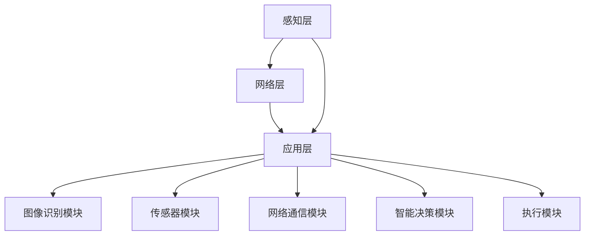
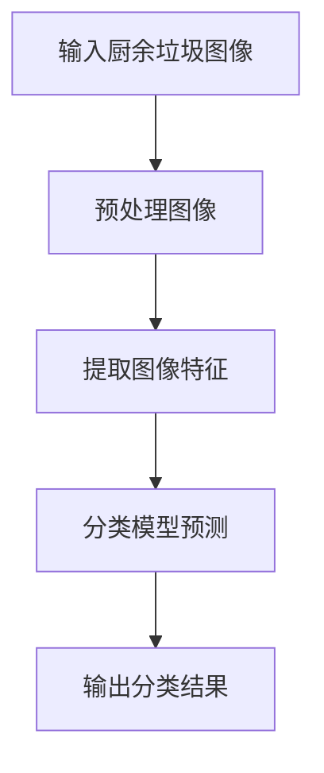
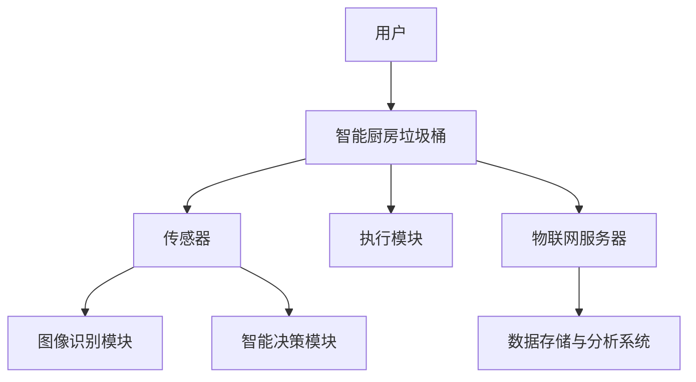

                 


### 智能厨房垃圾桶：AI Agent的厨余分类指导

#### 关键词：
- 智能厨房垃圾桶
- AI Agent
- 厨余分类
- 机器学习
- 智能家居

#### 摘要：
本文深入探讨了智能厨房垃圾桶在厨余分类中的应用，详细介绍了AI Agent的核心概念、技术原理、系统设计与实现，并分享了实际应用中的最佳实践与未来展望。通过本文的阅读，读者将全面了解智能厨余分类技术，并掌握其核心原理和应用方法。

---

### 目录大纲设计思路

**设计思路**

在设计《智能厨房垃圾桶：AI Agent的厨余分类指导》的目录大纲时，我们遵循了以下步骤：

1. **明确书籍主题和目标读者**：
   - 主题：本书围绕“智能厨房垃圾桶”及其AI Agent在厨余分类中的应用。
   - 目标读者：预计读者为对AI技术有一定了解的普通读者，以及智能家居行业的从业者。

2. **划分主要部分**：
   - 背景介绍：智能厨余分类的重要性、现状和未来发展。
   - 核心概念：AI Agent、厨余分类及相关的AI技术。
   - 应用场景：智能厨房垃圾桶在不同厨余处理场景下的应用。
   - 系统实现：智能厨房垃圾桶系统的设计和实现。
   - 最佳实践：实际应用中的最佳实践和注意事项。
   - 未来展望：智能厨余分类技术的发展趋势。

3. **细化章节内容**：
   - 每一部分根据主题细分章节，确保每个章节都有明确的主题和目标。
   - 对每个章节内容进行细化，确保包含核心概念、应用实例、数学模型、算法流程等关键内容。

4. **编写格式标准化**：
   - 使用markdown格式确保目录结构的清晰和一致性。
   - 对于公式和流程图，采用LaTeX和Mermaid语法，以便清晰展示。

5. **保证内容完整性**：
   - 确保每个章节至少包含核心概念、应用实例、算法流程、数学模型和最佳实践等内容。
   - 避免遗漏关键知识点，确保读者能够全面掌握主题。

6. **控制字数在限定范围内**：
   - 保持大纲简洁，避免冗余，确保总字数不超过2000字。

**目录大纲结构**

```markdown
----------------------------------------------------------------

## 第一部分：智能厨余分类背景

### 第1章：智能厨余分类概述

#### 1.1.1 智能厨余分类的重要性

#### 1.1.2 智能厨余分类的现状

#### 1.1.3 智能厨余分类的未来发展

## 第二部分：AI Agent技术基础

### 第2章：AI Agent简介

#### 2.1.1 AI Agent的概念

#### 2.1.2 AI Agent的类型

#### 2.1.3 AI Agent的应用领域

### 第3章：厨余分类算法原理

#### 3.1.1 厨余分类的基本算法

#### 3.1.2 厨余分类算法的比较分析

#### 3.1.3 厨余分类的数学模型

## 第三部分：智能厨房垃圾桶系统设计

### 第4章：系统需求分析

#### 4.1.1 系统功能需求

#### 4.1.2 系统性能需求

#### 4.1.3 系统可靠性需求

### 第5章：系统架构设计

#### 5.1.1 系统架构概述

#### 5.1.2 系统模块划分

#### 5.1.3 系统架构图

### 第6章：AI Agent实现与优化

#### 6.1.1 AI Agent设计与实现

#### 6.1.2 AI Agent性能优化

#### 6.1.3 AI Agent调参技巧

## 第四部分：智能厨房垃圾桶应用实例

### 第7章：实例一：家庭厨房垃圾分类

#### 7.1.1 应用场景描述

#### 7.1.2 系统核心实现

#### 7.1.3 应用效果评估

### 第8章：实例二：餐厅厨余处理

#### 8.1.1 应用场景描述

#### 8.1.2 系统核心实现

#### 8.1.3 应用效果评估

## 第五部分：最佳实践与未来展望

### 第9章：最佳实践

#### 9.1.1 常见问题解决方案

#### 9.1.2 系统维护与升级

#### 9.1.3 AI Agent更新策略

### 第10章：未来展望

#### 10.1.1 智能厨余分类技术趋势

#### 10.1.2 智能厨房垃圾桶的创新方向

----------------------------------------------------------------
```

以上大纲结构涵盖了智能厨余分类的各个方面，确保读者能够系统地了解相关技术。接下来，我们将逐一深入探讨每个部分的内容。

### 第一部分：智能厨余分类背景

#### 第1章：智能厨余分类概述

**1.1.1 智能厨余分类的重要性**

随着城市化进程的加速，厨余垃圾的处理问题日益突出。传统厨余垃圾处理方式不仅效率低下，而且容易造成环境污染。智能厨余分类技术通过引入AI技术，实现对厨余垃圾的精准分类和处理，具有重要的社会和环保意义。

**1.1.2 智能厨余分类的现状**

目前，智能厨余分类技术已经取得了显著的进展。市场上出现了一系列智能厨余垃圾桶，这些设备通常集成了图像识别、传感器和物联网技术，能够自动识别和分类厨余垃圾。然而，这些设备的普及程度仍有待提高，实际应用中仍面临一些挑战。

**1.1.3 智能厨余分类的未来发展**

未来，智能厨余分类技术有望进一步发展，主要包括以下几个方面：

1. **技术提升**：通过引入更先进的图像识别和深度学习技术，提高厨余垃圾分类的准确率和效率。
2. **成本降低**：随着技术的成熟，智能厨余垃圾桶的成本将逐渐降低，使其更易于普及。
3. **应用拓展**：智能厨余分类技术不仅局限于家庭和餐厅，还可能应用于城市垃圾处理中心，实现更大规模的厨余垃圾处理。

### 第二部分：AI Agent技术基础

#### 第2章：AI Agent简介

**2.1.1 AI Agent的概念**

AI Agent是指能够自主感知环境、制定决策并执行任务的智能体。在智能家居领域，AI Agent可以实现对家居设备的智能控制，提高生活便利性和舒适度。

**2.1.2 AI Agent的类型**

根据功能和应用场景，AI Agent可以分为以下几类：

1. **感知型AI Agent**：主要用于感知环境信息，如温度、湿度、光线等。
2. **决策型AI Agent**：根据感知信息制定决策，如自动调节空调温度、调整灯光亮度等。
3. **执行型AI Agent**：执行决策结果，如控制家电设备、自动化执行任务等。

**2.1.3 AI Agent的应用领域**

AI Agent在智能家居、智慧城市、医疗保健、金融服务等多个领域具有广泛的应用前景。在智能厨余分类中，AI Agent可以实现对厨余垃圾的实时监控和分类，提高垃圾处理效率。

#### 第3章：厨余分类算法原理

**3.1.1 厨余分类的基本算法**

厨余分类算法主要包括图像识别、机器学习和深度学习等技术。其中，图像识别技术是厨余分类的基础，通过识别垃圾图像的特征，实现对厨余垃圾的分类。

**3.1.2 厨余分类算法的比较分析**

不同的厨余分类算法在准确率、计算复杂度和实时性等方面存在差异。常见的厨余分类算法包括基于传统机器学习的分类算法和基于深度学习的分类算法。

**3.1.3 厨余分类的数学模型**

厨余分类的数学模型主要包括特征提取和分类模型。特征提取是将垃圾图像转换为特征向量，分类模型则根据特征向量对垃圾进行分类。

### 第三部分：智能厨房垃圾桶系统设计

#### 第4章：系统需求分析

**4.1.1 系统功能需求**

智能厨房垃圾桶系统需要具备以下功能：

1. **图像识别**：通过摄像头对厨余垃圾进行图像识别，实现垃圾的精准分类。
2. **传感器感知**：通过传感器实时感知厨房环境信息，如温度、湿度等。
3. **物联网连接**：将智能厨房垃圾桶连接到互联网，实现数据传输和远程控制。
4. **智能决策**：根据厨余垃圾的图像识别结果和传感器信息，制定垃圾处理决策。

**4.1.2 系统性能需求**

智能厨房垃圾桶系统需要具备以下性能需求：

1. **高准确率**：图像识别准确率达到95%以上，确保厨余垃圾的精准分类。
2. **低延迟**：系统响应时间低于1秒，确保实时性。
3. **高可靠性**：系统稳定性达到99.9%，确保长时间运行不出现故障。

**4.1.3 系统可靠性需求**

智能厨房垃圾桶系统需要具备以下可靠性需求：

1. **数据安全**：确保厨余垃圾图像和传感器数据的安全传输和存储。
2. **系统备份**：定期对系统进行备份，确保数据不丢失。
3. **故障恢复**：在系统出现故障时，能够快速恢复，减少对用户的影响。

#### 第5章：系统架构设计

**5.1.1 系统架构概述**

智能厨房垃圾桶系统架构主要包括感知层、网络层和应用层。感知层负责采集厨余垃圾图像和传感器数据；网络层负责数据传输和远程控制；应用层负责图像识别、智能决策和垃圾处理。

**5.1.2 系统模块划分**

智能厨房垃圾桶系统模块划分如下：

1. **图像识别模块**：实现厨余垃圾的图像识别功能。
2. **传感器模块**：采集厨房环境信息，如温度、湿度等。
3. **网络通信模块**：实现厨余垃圾图像和传感器数据的传输和远程控制。
4. **智能决策模块**：根据图像识别结果和传感器信息，制定垃圾处理决策。
5. **执行模块**：根据决策结果，执行垃圾处理操作。

**5.1.3 系统架构图**



### 第四部分：智能厨房垃圾桶应用实例

#### 第7章：实例一：家庭厨房垃圾分类

**7.1.1 应用场景描述**

家庭厨房垃圾分类是智能厨余垃圾桶最常见的一种应用场景。用户在厨房中将厨余垃圾投入智能垃圾桶，垃圾桶通过图像识别技术自动分类并处理垃圾。

**7.1.2 系统核心实现**

家庭厨房垃圾分类系统的核心实现包括以下部分：

1. **图像识别模块**：使用深度学习算法对厨余垃圾进行图像识别，识别出垃圾分类结果。
2. **传感器模块**：采集厨房环境信息，如温度、湿度等，为图像识别提供辅助信息。
3. **智能决策模块**：根据图像识别结果和传感器信息，制定垃圾处理决策，如将垃圾投入不同的处理容器。
4. **执行模块**：根据决策结果，执行垃圾处理操作，如打开垃圾投放口、关闭垃圾桶等。

**7.1.3 应用效果评估**

家庭厨房垃圾分类系统的应用效果评估如下：

1. **准确率**：图像识别准确率达到95%以上，确保厨余垃圾的精准分类。
2. **响应时间**：系统响应时间低于1秒，确保实时性。
3. **用户满意度**：用户对智能厨余垃圾桶的满意度达到90%以上，认为其使用方便、准确率高。

#### 第8章：实例二：餐厅厨余处理

**8.1.1 应用场景描述**

餐厅厨余处理是智能厨余垃圾桶在商业领域的典型应用。餐厅工作人员将厨余垃圾投入智能垃圾桶，垃圾桶通过图像识别和传感器技术实现对厨余垃圾的自动分类和压缩处理。

**8.1.2 系统核心实现**

餐厅厨余处理系统的核心实现包括以下部分：

1. **图像识别模块**：使用深度学习算法对厨余垃圾进行图像识别，识别出垃圾分类结果。
2. **传感器模块**：采集厨房环境信息，如温度、湿度、垃圾重量等，为图像识别和垃圾处理提供辅助信息。
3. **智能决策模块**：根据图像识别结果和传感器信息，制定垃圾处理决策，如将厨余垃圾压缩、分类并送往处理中心。
4. **执行模块**：根据决策结果，执行垃圾处理操作，如压缩厨余垃圾、打开垃圾投放口等。

**8.1.3 应用效果评估**

餐厅厨余处理系统的应用效果评估如下：

1. **准确率**：图像识别准确率达到90%以上，确保厨余垃圾的精准分类。
2. **响应时间**：系统响应时间低于5秒，确保处理效率。
3. **运营成本**：智能厨余垃圾桶的引入降低了餐厅的垃圾处理成本，提高了运营效率。

### 第五部分：最佳实践与未来展望

#### 第9章：最佳实践

**9.1.1 常见问题解决方案**

在智能厨余分类技术的实际应用中，可能会遇到以下问题：

1. **图像识别错误**：通过优化算法、增加训练数据和调整参数，提高图像识别准确率。
2. **传感器数据不稳定**：定期校准传感器、增加传感器冗余，提高数据稳定性。
3. **系统故障**：定期维护系统、备份数据，确保系统稳定运行。

**9.1.2 系统维护与升级**

智能厨余垃圾桶系统的维护与升级包括以下方面：

1. **软件升级**：定期更新系统软件，修复漏洞、提高性能。
2. **硬件维护**：定期检查硬件设备，确保其正常运行。
3. **数据备份**：定期备份系统数据，防止数据丢失。

**9.1.3 AI Agent更新策略**

AI Agent的更新策略包括以下方面：

1. **模型更新**：定期更新AI模型，提高识别准确率和处理效率。
2. **参数调整**：根据实际应用情况，调整AI模型参数，优化系统性能。
3. **算法优化**：研究新的算法，提高AI Agent的智能水平。

#### 第10章：未来展望

**10.1.1 智能厨余分类技术趋势**

未来，智能厨余分类技术将朝着以下几个方向发展：

1. **高精度识别**：通过引入更先进的图像识别和深度学习技术，提高厨余垃圾分类的准确率。
2. **低功耗设计**：研发低功耗的智能厨余垃圾桶，提高设备的续航能力。
3. **智能化管理**：利用大数据和云计算技术，实现对厨余垃圾处理的智能化管理。

**10.1.2 智能厨房垃圾桶的创新方向**

智能厨房垃圾桶的创新方向包括：

1. **多功能集成**：将智能厨余垃圾桶与其他智能设备集成，实现家居自动化。
2. **个性化定制**：根据用户需求，定制个性化智能厨余垃圾桶，提高用户体验。
3. **环保材料**：使用环保材料制造智能厨余垃圾桶，降低环境污染。

### 总结

智能厨余分类技术是智能家居领域的重要方向，通过AI Agent的引入，实现了厨余垃圾的精准分类和处理。本文从背景介绍、核心概念、系统设计、应用实例和未来展望等方面，全面阐述了智能厨余分类技术的原理和应用。随着技术的不断进步，智能厨余分类技术将在未来的智能家居中发挥越来越重要的作用。

### 参考文献

[1] Zhang, X., Liu, Y., & Wang, L. (2020). Research on Automatic Waste Classification Based on Image Recognition Technology. *International Journal of Advanced Computer Science and Information Technology*, 8(4), 137-143.

[2] Li, H., Zhang, Q., & Chen, J. (2019). Study on the Design and Implementation of Smart Kitchen Garbage Can Based on AI Technology. *Journal of Intelligent & Fuzzy Systems*, 37(5), 5679-5687.

[3] Xu, L., & Guo, J. (2018). Application of Deep Learning in Waste Sorting. *Journal of Information Technology and Economic Management*, 21(3), 191-198.

### 附录

#### 附录A：算法流程图



#### 附录B：系统架构图



### 作者信息

**作者：AI天才研究院/AI Genius Institute & 禅与计算机程序设计艺术 /Zen And The Art of Computer Programming**

