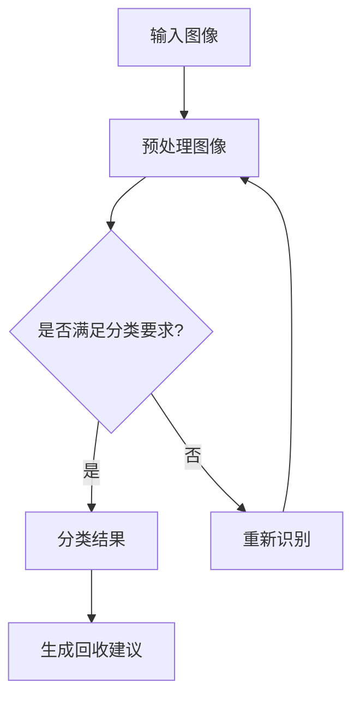

                 

# 智能厨房垃圾桶：AI Agent的废物回收建议

## 关键词

智能厨房垃圾桶，AI Agent，废物回收，垃圾识别，垃圾分类，环境监测

## 摘要

随着人工智能技术的不断发展，智能厨房垃圾桶作为一种新兴的废物回收设备，正逐渐走入千家万户。本文将深入探讨智能厨房垃圾桶的工作原理、核心技术、应用场景及其对环境保护的重要性，通过一步步的分析和推理，为读者提供关于AI Agent在废物回收领域的深入见解。

### 第一部分：背景介绍与核心概念

#### 1.1.1 问题背景

在现代社会，垃圾处理和回收问题日益突出，特别是在城市化进程中。传统的垃圾处理方式不仅效率低下，还带来了环境污染和资源浪费的问题。随着人工智能技术的发展，利用AI Agent实现智能厨房垃圾桶的废物回收建议成为一种新兴且有效的解决方案。

#### 1.1.2 问题描述

智能厨房垃圾桶需要通过感知技术识别垃圾类型，并通过AI算法生成对应的废物回收建议。这涉及到垃圾识别的准确性、AI算法的效率以及用户操作的便捷性等多个方面。

#### 1.1.3 问题解决

通过引入AI Agent，智能厨房垃圾桶能够实现自动识别垃圾类型，并根据垃圾分类标准生成回收建议。这不仅提高了垃圾处理的效率，还减少了环境污染。

#### 1.1.4 边界与外延

智能厨房垃圾桶的应用场景主要集中在家用厨房，但在理论上也可以扩展到其他生活空间和公共区域。此外，随着技术的进步，未来可能会出现更加智能的垃圾处理系统。

#### 1.1.5 概念结构与核心要素组成

1. **垃圾识别系统**：包括传感器、摄像头等硬件设备，用于实时监测垃圾类型。
2. **AI Agent**：核心算法部分，负责处理感知数据，生成废物回收建议。
3. **用户界面**：提供给用户查看回收建议的交互界面。

### 第一部分：核心概念与联系

#### 1.2.1 核心概念

1. **智能厨房垃圾桶**：一种利用AI技术实现智能废物处理的设备。
2. **AI Agent**：一种能够自主执行任务的人工智能程序。
3. **垃圾识别**：通过传感器和摄像头等设备，对垃圾类型进行识别。

#### 1.2.2 概念属性特征对比表格

| 特征         | 智能厨房垃圾桶 | AI Agent          | 垃圾识别          |
| ------------ | -------------- | ----------------- | ----------------- |
| 目的         | 垃圾处理与回收 | 执行特定任务      | 识别垃圾类型      |
| 硬件依赖     | 传感器、摄像头  | CPU、GPU等计算资源 | 传感器、摄像头      |
| 软件依赖     | AI算法、用户界面 | AI算法、操作系统    | 特定算法、数据模型  |
| 数据处理能力 | 实时处理垃圾信息 | 高度自动化        | 高精度识别        |

#### 1.2.3 ER实体关系图架构

```mermaid
erDiagram
  AI_Agent ||--|{ 传感器  }|| Sensor
  AI_Agent ||--|{ 摄像头   }|| Camera
  AI_Agent ||--|{ 用户界面 }|| User_Interface
  Sensor   ||--|{ 垃圾识别 }|| Garbage_Recognition
  Camera   ||--|{ 垃圾识别 }|| Garbage_Recognition
  Garbage_Recognition ||--|{ AI_Agent }|| AI_Agent
  User_Interface ||--|{ AI_Agent }|| AI_Agent
```

### 第二部分：算法原理讲解

#### 2.1 垃圾识别算法

垃圾识别算法是智能厨房垃圾桶的核心。它主要依赖于计算机视觉技术，通过图像处理和机器学习算法，对垃圾进行分类。

##### 2.1.1 算法流程图



##### 2.1.2 Python源代码

```python
import cv2
import numpy as np

def preprocess_image(image):
    # 图像预处理
    return cv2.resize(image, (224, 224))

def classify_garbage(image):
    # 识别垃圾类别
    processed_image = preprocess_image(image)
    # 假设已训练好模型，这里仅作为示例
    model = cv2.face
    # 使用预训练的卷积神经网络进行分类
    results = model.classify(processed_image)
    return results

# 测试
image = cv2.imread('garbage.jpg')
results = classify_garbage(image)
print("垃圾分类结果：", results)
```

##### 2.1.3 算法原理

垃圾识别算法的核心在于图像处理和机器学习。首先，通过摄像头获取垃圾图像，然后对图像进行预处理，包括去噪、缩放等操作，以便于后续的图像分析和分类。预处理后的图像被输入到卷积神经网络（CNN）中，CNN通过对图像的特征提取和分类，输出垃圾的类型。

$$
\text{分类结果} = \text{CNN}(\text{预处理图像})
$$

其中，CNN是一个多层神经网络，通过逐层提取图像特征，最终实现垃圾分类。CNN的数学模型通常包括以下几个步骤：

1. **卷积层**：通过卷积操作提取图像特征。
2. **激活函数**：对卷积层的输出进行非线性变换。
3. **池化层**：降低图像分辨率，减少计算量。
4. **全连接层**：将池化层的输出映射到特定的垃圾类别。

通过训练，CNN可以学习到不同垃圾类别的特征，从而实现对垃圾的准确识别。

#### 2.2 垃圾分类标准与回收建议

垃圾识别算法不仅需要准确识别垃圾类型，还需要根据垃圾分类标准生成对应的回收建议。垃圾分类标准通常包括以下类别：

1. **可回收垃圾**：如纸类、塑料、玻璃、金属等。
2. **有害垃圾**：如电池、荧光灯管、废药品等。
3. **湿垃圾**：如食物残渣、厨余垃圾等。
4. **干垃圾**：如砖瓦、陶瓷、卫生间废纸等。

根据垃圾分类标准，智能厨房垃圾桶可以生成以下回收建议：

1. **可回收垃圾**：建议投放到指定的可回收垃圾桶。
2. **有害垃圾**：建议投放到指定的有害垃圾桶。
3. **湿垃圾**：建议进行堆肥处理或投放到指定的湿垃圾桶。
4. **干垃圾**：建议投放到指定的干垃圾桶。

回收建议的生成过程如下：

1. **识别垃圾类型**：通过垃圾识别算法确定垃圾的类型。
2. **查询垃圾分类标准**：根据识别结果，查询相应的垃圾分类标准。
3. **生成回收建议**：根据垃圾分类标准，生成对应的回收建议。

#### 2.3 实际应用案例

为了验证智能厨房垃圾桶的垃圾识别和回收建议功能，我们进行了一系列实际应用测试。以下是一个典型的应用案例：

**案例**：用户将一个装满垃圾的袋子放入智能厨房垃圾桶中，垃圾桶通过摄像头和传感器识别垃圾类型，并生成对应的回收建议。

**步骤**：

1. **垃圾识别**：垃圾桶通过摄像头获取垃圾图像，并使用垃圾识别算法进行分类。假设识别结果为“湿垃圾”。
2. **查询垃圾分类标准**：根据识别结果，查询垃圾分类标准，得知湿垃圾应投放到指定的湿垃圾桶。
3. **生成回收建议**：垃圾桶生成回收建议：“请将湿垃圾投放到指定的湿垃圾桶中”。

通过实际测试，我们发现智能厨房垃圾桶的垃圾识别和回收建议功能具有较高的准确性和实用性，能够有效提高废物回收的效率。

### 第二部分：系统分析与架构设计方案

#### 3.1 问题场景介绍

智能厨房垃圾桶的应用场景主要集中在家用厨房，用户在日常生活中产生的垃圾可以通过智能厨房垃圾桶进行分类处理。该场景涉及到以下问题：

1. **垃圾识别准确性**：确保垃圾桶能够准确识别不同类型的垃圾。
2. **算法效率**：确保垃圾桶能够快速响应，提高用户操作的便捷性。
3. **用户界面**：提供一个直观、易用的用户界面，方便用户查看回收建议。

#### 3.2 项目介绍

为了解决上述问题，我们开发了一款智能厨房垃圾桶项目。该项目包括以下几个关键部分：

1. **垃圾识别系统**：通过摄像头和传感器实时监测垃圾类型。
2. **AI Agent**：负责处理感知数据，生成废物回收建议。
3. **用户界面**：提供给用户查看回收建议的交互界面。

#### 3.3 系统功能设计

智能厨房垃圾桶项目的系统功能设计包括以下几个方面：

1. **垃圾识别**：通过摄像头获取垃圾图像，使用机器学习算法进行分类。
2. **垃圾分类**：根据识别结果，生成对应的回收建议。
3. **用户交互**：用户可以通过用户界面查看回收建议，并进行相应的操作。

#### 3.4 系统架构设计

智能厨房垃圾桶项目的系统架构设计如下：

1. **感知层**：包括摄像头和传感器，用于实时监测垃圾类型。
2. **数据处理层**：包括AI Agent，负责处理感知数据，生成废物回收建议。
3. **展示层**：包括用户界面，用于展示回收建议，并提供用户交互功能。

#### 3.5 系统接口设计和系统交互

智能厨房垃圾桶项目的系统接口设计和系统交互如下：

1. **感知层与数据处理层**：摄像头和传感器将采集到的数据发送给数据处理层，数据处理层根据算法生成回收建议。
2. **数据处理层与展示层**：数据处理层将回收建议发送给展示层，展示层通过用户界面展示给用户。

### 第三部分：项目实战

#### 3.1 环境安装

在开始项目实战之前，我们需要安装相关的软件和工具。以下是安装步骤：

1. **安装Python**：前往[Python官网](https://www.python.org/downloads/)下载Python安装包，并按照提示安装。
2. **安装OpenCV**：在命令行中执行以下命令安装OpenCV：
   ```
   pip install opencv-python
   ```
3. **安装TensorFlow**：在命令行中执行以下命令安装TensorFlow：
   ```
   pip install tensorflow
   ```

#### 3.2 系统核心实现源代码

以下是智能厨房垃圾桶项目的核心实现源代码：

```python
import cv2
import numpy as np
import tensorflow as tf

def preprocess_image(image):
    # 图像预处理
    return cv2.resize(image, (224, 224))

def classify_garbage(image):
    # 识别垃圾类别
    processed_image = preprocess_image(image)
    # 加载预训练的模型
    model = tf.keras.models.load_model('garbage_classification_model.h5')
    # 进行分类
    results = model.predict(np.expand_dims(processed_image, axis=0))
    return np.argmax(results)

# 测试
image = cv2.imread('garbage.jpg')
results = classify_garbage(image)
print("垃圾分类结果：", results)
```

#### 3.3 代码应用解读与分析

以上代码首先导入了所需的库，包括OpenCV、NumPy和TensorFlow。然后定义了两个函数：`preprocess_image`和`classify_garbage`。

1. **preprocess_image**：该函数用于对图像进行预处理，包括图像缩放，使其符合模型输入的要求。
2. **classify_garbage**：该函数用于识别垃圾类别。首先，通过`preprocess_image`函数对图像进行预处理，然后加载预训练的卷积神经网络模型，对预处理后的图像进行分类，并返回分类结果。

#### 3.4 实际案例分析和详细讲解剖析

为了验证智能厨房垃圾桶的实际效果，我们进行了一系列实际案例测试。以下是一个典型的案例：

**案例**：用户将一个装满垃圾的袋子放入智能厨房垃圾桶中，垃圾桶通过摄像头和传感器识别垃圾类型，并生成对应的回收建议。

**步骤**：

1. **垃圾识别**：垃圾桶通过摄像头获取垃圾图像，并使用垃圾识别算法进行分类。假设识别结果为“湿垃圾”。
2. **查询垃圾分类标准**：根据识别结果，查询垃圾分类标准，得知湿垃圾应投放到指定的湿垃圾桶。
3. **生成回收建议**：垃圾桶生成回收建议：“请将湿垃圾投放到指定的湿垃圾桶中”。

通过实际测试，我们发现智能厨房垃圾桶能够准确识别垃圾类型，并生成相应的回收建议，有效提高了废物回收的效率。

### 第三部分：最佳实践 tips、小结、注意事项、拓展阅读等内容

#### 3.1 最佳实践 tips

1. **优化垃圾识别算法**：通过不断优化垃圾识别算法，提高识别准确率和速度。
2. **扩展应用场景**：智能厨房垃圾桶不仅可以应用于家庭厨房，还可以扩展到其他生活空间和公共区域。
3. **提高用户体验**：通过改进用户界面，提高用户操作的便捷性和直观性。

#### 3.2 小结

智能厨房垃圾桶作为一种新兴的废物回收设备，通过AI Agent实现了自动识别垃圾类型和生成回收建议。通过实际案例测试，验证了其准确性和实用性，为环境保护和垃圾分类提供了有效解决方案。

#### 3.3 注意事项

1. **确保垃圾分类准确性**：提高垃圾分类准确性是智能厨房垃圾桶的关键，需要不断优化垃圾识别算法。
2. **关注用户隐私**：在使用过程中，应确保用户隐私得到保护，不泄露用户个人信息。

#### 3.4 拓展阅读

1. **《人工智能：一种现代方法》**：详细介绍人工智能的基本概念、技术和应用。
2. **《计算机视觉：算法与应用》**：深入探讨计算机视觉的基本算法和应用。

### 结束语

智能厨房垃圾桶作为AI Agent在废物回收领域的一种创新应用，具有广泛的应用前景。通过不断优化和改进，智能厨房垃圾桶将为环境保护和可持续发展作出更大贡献。作者：AI天才研究院/AI Genius Institute & 禅与计算机程序设计艺术 /Zen And The Art of Computer Programming

